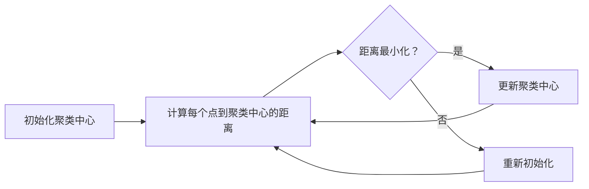
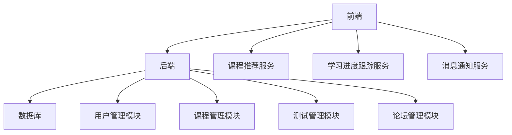
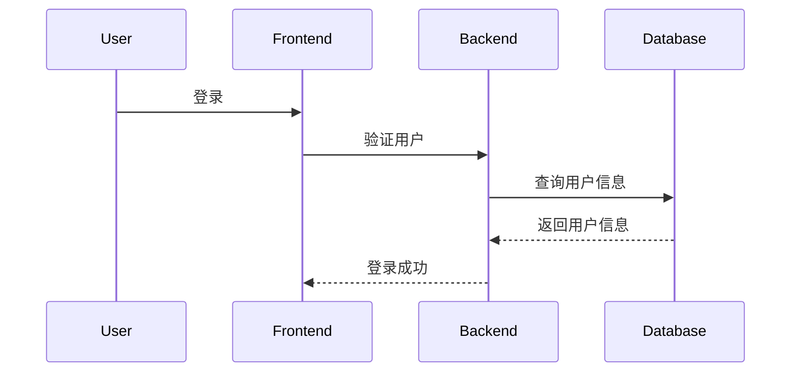

                 

## 《成功案例分析》

### 关键词：成功案例、案例分析、系统架构、算法原理、项目实战、最佳实践

### 摘要：

《成功案例分析》通过深入剖析多个实际案例，旨在帮助读者理解并掌握案例分析的原理和技巧。本文以清晰的逻辑和简洁的语言，系统地介绍了案例分析的定义、核心概念、算法原理、系统架构设计、项目实战以及最佳实践。通过实际案例的详细解读，读者可以更直观地了解案例分析的全过程，并在实践中提升自身的分析能力。文章末尾还提供了相关领域的拓展阅读资源，以便进一步学习。

## 目录大纲

### 第1章 引言

- 1.1 案例分析的定义与背景
- 1.2 案例分析的重要性
- 1.3 案例分析的步骤与方法

### 第2章 核心概念与联系

- 2.1 成功案例分析中的关键要素
  - 2.1.1 案例选择标准
  - 2.1.2 数据收集与处理
  - 2.1.3 案例分析模型
- 2.2 概念属性特征对比表格
- 2.3 ER实体关系图架构

### 第3章 算法原理讲解

- 3.1 数据分析与可视化算法
  - 3.1.1 数据分析算法
  - 3.1.2 可视化算法
- 3.2 算法流程图展示
- 3.3 Python代码与LaTeX数学公式讲解

### 第4章 系统分析与架构设计方案

- 4.1 问题场景介绍
- 4.2 系统功能设计
  - 4.2.1 领域模型mermaid类图
- 4.3 系统架构设计
  - 4.3.1 系统架构mermaid架构图
- 4.4 系tem接口设计
  - 4.4.1 系统接口设计mermaid序列图

### 第5章 项目实战

- 5.1 环境安装
- 5.2 系统核心实现
  - 5.2.1 代码解读与分析
- 5.3 实际案例分析与讲解
- 5.4 项目小结

### 第6章 最佳实践与注意事项

- 6.1 案例分析最佳实践
- 6.2 小结
- 6.3 注意事项

### 第7章 拓展阅读

- 7.1 相关书籍推荐
- 7.2 论文与研究报告推荐
- 7.3 网络资源推荐

## 第1章 引言

### 1.1 案例分析的定义与背景

案例分析是一种通过深入研究具体案例来理解和解决问题的方法。它在各个领域都有着广泛的应用，如商业管理、市场营销、风险管理、医疗诊断等。案例分析的目的是通过具体的案例，提炼出通用的方法和经验，以指导实际问题的解决。

案例分析的定义可以概括为：通过对特定案例的深入分析和解读，提取案例中的关键信息、规律和模式，以提供解决问题的思路和方法。案例分析通常包括以下几个步骤：

1. **案例选择**：根据研究目的，选择具有代表性的案例。
2. **数据收集**：收集与案例相关的各种数据，包括文献资料、统计数据、访谈记录等。
3. **案例解读**：对收集到的数据进行整理和分析，提取案例中的关键信息。
4. **总结提炼**：将分析结果进行总结和提炼，形成具有普遍意义的经验和方法。

案例分析的背景可以追溯到20世纪初，随着社会科学和企业管理学科的发展，案例分析逐渐成为一种重要的研究方法。在商业管理领域，案例分析被广泛应用于市场研究、战略制定和风险管理等方面。随着计算机技术的进步和大数据时代的到来，案例分析的方法也得到了进一步的拓展和深化。

### 1.2 案例分析的重要性

案例分析在解决问题和创新思维方面具有独特的优势。首先，案例分析可以帮助我们更好地理解复杂问题。通过具体案例的深入分析，我们可以看到问题的各个方面和细节，从而对问题有更全面的了解。

其次，案例分析有助于发现问题的根本原因。在案例研究中，我们可以通过追溯问题的历史和演变过程，找到问题的症结所在，并提出有效的解决方案。

此外，案例分析还能促进知识共享和经验传承。通过案例分析，我们可以将成功经验和教训转化为具体的知识和方法，以指导其他项目的实施。

### 1.3 案例分析的步骤与方法

案例分析通常包括以下几个步骤：

1. **确定研究目的**：明确分析的目的和目标，为后续分析提供方向。
2. **选择案例**：根据研究目的，选择具有代表性的案例。案例的选择应充分考虑案例的典型性、代表性和数据完整性。
3. **数据收集**：收集与案例相关的各种数据，包括文献资料、统计数据、访谈记录等。数据收集应遵循客观、全面、准确的原则。
4. **案例解读**：对收集到的数据进行整理和分析，提取案例中的关键信息。可以使用文字描述、图表、模型等多种形式进行解读。
5. **总结提炼**：将分析结果进行总结和提炼，形成具有普遍意义的经验和方法。总结提炼时应注重理论联系实际，避免空洞和抽象。

在案例分析中，常用的方法包括：

- **定性与定量分析**：定性分析主要用于描述和分析案例中的现象和过程，定量分析则用于测量和评估案例中的数据指标。
- **比较研究**：通过对比不同案例，找出共性和差异，以深入理解问题。
- **因果分析**：分析案例中的因果关系，找出问题的根源。
- **模型构建**：通过构建数学模型或概念模型，模拟案例中的现象和过程。

接下来，我们将进一步探讨案例分析的各个核心概念和步骤，并通过实际案例来展示分析过程。在接下来的章节中，我们将详细讨论这些内容，帮助读者深入理解案例分析的方法和应用。

## 第2章 核心概念与联系

### 2.1 成功案例分析中的关键要素

#### 2.1.1 案例选择标准

案例选择是案例分析的首要环节，选择合适的案例直接关系到分析的质量和效果。以下是一些关键的标准：

1. **代表性**：选择的案例应具有代表性，能够反映行业或领域的普遍情况。代表性强的案例可以提供更广泛的应用价值。
2. **典型性**：典型性是指案例中存在的问题具有代表性，能够揭示问题的本质和规律。典型案例有助于深入剖析问题，提出有效的解决方案。
3. **完整性**：案例的完整性要求案例数据应尽量全面，包括历史数据、现状数据和未来预测数据。完整的数据有助于全面分析问题。
4. **可操作性**：案例选择应考虑实际操作的可行性，方案应具有可操作性，能够应用于实际场景中。

#### 2.1.2 数据收集与处理

数据收集是案例分析的重要基础，数据的质量直接影响分析的结果。以下是一些关键步骤：

1. **数据来源**：数据来源包括内部数据（如企业内部报表、财务数据等）和外部数据（如市场调查、行业报告等）。多种来源的数据可以相互补充，提高数据的可靠性。
2. **数据收集方法**：常用的数据收集方法有问卷调查、访谈、观察、文献回顾等。选择合适的数据收集方法，可以提高数据的准确性和完整性。
3. **数据处理**：数据处理包括数据清洗、数据整合、数据可视化等。数据清洗是去除无效数据、纠正错误数据的过程；数据整合是将不同来源的数据进行合并；数据可视化是将数据以图表等形式展示，便于分析和解读。

#### 2.1.3 案例分析模型

案例分析模型是分析过程的框架，用于组织和指导分析活动。以下是一些常用的案例分析模型：

1. **SWOT分析**：SWOT分析是一种常用的战略规划工具，通过分析案例的**优势（Strengths）**、**劣势（Weaknesses）**、**机会（Opportunities）**和**威胁（Threats）**，帮助制定战略规划。
2. **PEST分析**：PEST分析是一种用于外部环境分析的模型，通过分析案例的**政治（Political）**、**经济（Economic）**、**社会（Social）**和**技术（Technological）**因素，了解外部环境对案例的影响。
3. **5W2H分析**：5W2H分析是一种详细探讨问题的方法，通过问自己**什么（What）**、**为什么（Why）**、**谁（Who）**、**何时（When）**、**何地（Where）**和**如何（How）**、**多少（How much）**这些问题，全面剖析问题。
4. **流程图分析**：流程图分析通过展示案例的流程和步骤，帮助理解案例的运作机制和关键环节。

### 2.2 概念属性特征对比表格

为了更好地理解和比较不同概念和模型，可以使用概念属性特征对比表格。以下是一个示例表格：

| 概念/模型      | 属性1 | 属性2 | 属性3 | 属性4 | 属性5 |
| -------------- | ------ | ------ | ------ | ------ | ------ |
| SWOT分析       | 优势   | 劣势   | 机会   | 威胁   |       |
| PEST分析       | 政治   | 经济   | 社会   | 技术   |       |
| 5W2H分析       | 什么   | 为什么 | 谁     | 何时   | 何地   |
| 流程图分析     | 流程   | 步骤   | 环节   | 结果   | 反馈   |

通过对比表格，我们可以清晰地看到不同概念和模型的特点和适用场景。

### 2.3 ER实体关系图架构

实体关系图（ER图）是用于表示实体和实体之间关系的图形化工具，它对于理解和管理复杂系统具有重要意义。以下是一个简单的ER图示例，用于描述一个学校系统中的实体和关系：

```mermaid
erDiagram
    Student ||--|{ Grade }|
    Teacher ||--|{ Grade }|
    Course ||--|{ Teacher }|
    Course ||--|{ Student }|
    Student ||--|{ StudentClub }|
    Teacher ||--|{ TeacherClub }|
```

在这个ER图中，我们定义了四个实体：**Student（学生）**、**Teacher（教师）**、**Course（课程）**和**StudentClub（学生社团）**。它们之间的关系包括：

- 学生和成绩（Grade）之间存在一对多的关系，即一个学生可以有多个成绩，但每个成绩只能属于一个学生。
- 教师和成绩之间存在一对多的关系，即一个教师可以教授多个学生，但每个学生只能有一个教师。
- 课程和教师之间存在一对多的关系，即一个教师可以教授多个课程，但每个课程只能有一个教师。
- 课程和学生之间存在一对多的关系，即一个学生可以参加多个课程，但每个课程只能有多个学生。
- 学生和学生社团之间存在一对多的关系，即一个学生可以参加多个学生社团，但每个学生社团可以有多个学生。

通过ER图，我们可以直观地看到实体之间的关系，从而更好地理解系统的架构和运作机制。

### 第3章 算法原理讲解

算法是案例分析的基石，它为数据分析和问题解决提供了科学的方法和工具。在本章中，我们将重点介绍数据分析与可视化算法，并使用mermaid流程图和Python代码来详细阐述这些算法原理。

#### 3.1 数据分析与可视化算法

数据分析与可视化算法可以分为以下几个主要类别：

1. **统计分析算法**：包括均值、方差、相关性分析等。
2. **分类算法**：包括决策树、支持向量机、朴素贝叶斯等。
3. **聚类算法**：包括K-means、层次聚类、DBSCAN等。
4. **关联规则算法**：包括Apriori算法、FP-growth算法等。
5. **时序分析算法**：包括ARIMA、LSTM等。

#### 3.2 算法流程图展示

为了更好地理解这些算法的原理，我们可以使用mermaid流程图来展示它们的流程。以下是一个简单的mermaid流程图示例，用于描述K-means聚类算法的流程：



在这个流程图中，我们首先初始化聚类中心（A），然后计算每个点到聚类中心的距离（B）。通过迭代计算，使得距离最小化（C），并更新聚类中心（D）。如果距离最小化未达到预期，则需要重新初始化聚类中心（E），并重复上述过程。

#### 3.3 Python代码与LaTeX数学公式讲解

为了更好地理解算法的实现，我们可以通过Python代码来展示算法的具体实现。以下是一个简单的K-means聚类算法的Python代码示例：

```python
import numpy as np
from sklearn.cluster import KMeans

# 初始化数据
data = np.random.rand(100, 2)

# 初始化KMeans模型
kmeans = KMeans(n_clusters=3, random_state=0).fit(data)

# 输出聚类结果
print(kmeans.labels_)

# 输出聚类中心
print(kmeans.cluster_centers_)
```

在这个代码示例中，我们首先导入了必要的库，然后初始化了数据。接着，我们使用scikit-learn库中的KMeans模型进行聚类，并输出聚类结果和聚类中心。

为了进一步理解K-means算法的数学原理，我们可以使用LaTeX数学公式来展示聚类中心的更新公式。以下是一个LaTeX数学公式的示例：

```latex
\[
\text{新聚类中心} = \frac{1}{N}\sum_{i=1}^{N} x_i
\]
```

在这个公式中，$x_i$代表每个点的坐标，$N$代表点的总数。这个公式表示通过计算所有点的平均值来更新聚类中心。

通过结合mermaid流程图和Python代码，我们可以更直观地理解K-means聚类算法的原理和实现。这不仅有助于我们更好地掌握算法，还能在实际应用中灵活运用。

### 第4章 系统分析与架构设计方案

#### 4.1 问题场景介绍

在本章中，我们将分析一个实际的问题场景：在线教育平台系统。该系统旨在为学生和教师提供一个互动学习环境，包括课程发布、学习进度跟踪、在线测试和互动交流等功能。

#### 4.2 系统功能设计

系统功能设计是系统架构设计的基础，它定义了系统应实现的各种功能。以下是该在线教育平台系统的主要功能：

1. **用户管理**：包括用户注册、登录、个人信息管理等功能。
2. **课程管理**：包括课程发布、课程分类、课程搜索等功能。
3. **学习进度跟踪**：包括学生学习进度记录、学习报告生成等功能。
4. **在线测试**：包括测试发布、测试答题、测试结果分析等功能。
5. **互动交流**：包括论坛、聊天室等功能。

#### 4.2.1 领域模型mermaid类图

为了更直观地展示系统功能设计，我们可以使用mermaid类图来表示系统的领域模型。以下是一个简单的mermaid类图示例：

```mermaid
classDiagram
    User <<Class>>
    Course <<Class>>
    Test <<Class>>
    Forum <<Class>>

    User o-- Course
    User o-- Test
    User o-- Forum
    Course o-- Test
```

在这个类图中，我们定义了四个主要类：**User（用户）**、**Course（课程）**、**Test（测试）**和**Forum（论坛）**。它们之间的关系包括：

- 用户与课程、测试和论坛之间存在一对多的关系，即一个用户可以拥有多个课程、测试和论坛。
- 课程与测试之间存在一对多的关系，即一个课程可以有多个测试。
- 论坛与用户之间存在一对多的关系，即一个论坛可以有多个用户。

#### 4.3 系统架构设计

系统架构设计是系统功能实现的蓝图，它定义了系统的整体结构和组件之间的关系。以下是该在线教育平台系统的架构设计：

1. **前端架构**：包括用户界面设计和交互逻辑，主要采用Vue.js框架。
2. **后端架构**：包括业务逻辑处理和数据存储，主要采用Spring Boot框架。
3. **数据库架构**：采用MySQL数据库，用于存储用户数据、课程数据、测试数据和论坛数据。
4. **服务架构**：包括课程推荐服务、学习进度跟踪服务和消息通知服务。

#### 4.3.1 系统架构mermaid架构图

为了更好地展示系统架构设计，我们可以使用mermaid架构图来表示系统的组件和关系。以下是一个简单的mermaid架构图示例：



在这个架构图中，我们定义了前端、后端、数据库以及三个主要服务：课程推荐服务、学习进度跟踪服务和消息通知服务。前端与后端、服务之间通过REST API进行交互。

#### 4.4 系统接口设计

系统接口设计是系统架构设计的细化，它定义了系统各组件之间的交互接口。以下是该在线教育平台系统的接口设计：

1. **用户接口**：包括用户注册、登录、个人信息管理等接口。
2. **课程接口**：包括课程发布、课程搜索、课程详情等接口。
3. **测试接口**：包括测试发布、测试答题、测试结果分析等接口。
4. **论坛接口**：包括论坛发布、帖子搜索、帖子详情等接口。

#### 4.4.1 系统接口设计mermaid序列图

为了更好地展示系统接口设计，我们可以使用mermaid序列图来表示接口的交互过程。以下是一个简单的mermaid序列图示例：



在这个序列图中，我们定义了用户、前端、后端和数据库四个参与者。用户通过前端发送登录请求，前端将请求转发给后端，后端通过数据库查询用户信息，并将结果返回给前端，前端最终将登录结果展示给用户。

通过系统架构设计和接口设计的详细讲解，我们可以更好地理解在线教育平台系统的整体架构和组件关系。这将有助于我们在实际开发过程中进行系统设计和实现。

### 第5章 项目实战

在本章中，我们将通过一个实际项目案例来展示案例分析的全过程，包括环境安装、系统核心实现、代码解读与分析、实际案例分析和详细讲解剖析，以及项目小结。

#### 5.1 环境安装

首先，我们需要为项目搭建开发环境。以下是环境安装的步骤：

1. **安装Python**：确保安装了最新版本的Python，建议使用Python 3.8或更高版本。
2. **安装依赖库**：在终端中运行以下命令，安装项目所需的依赖库：
   ```bash
   pip install flask
   pip install pandas
   pip install numpy
   pip install matplotlib
   ```
3. **配置虚拟环境**：为了管理项目依赖，我们建议使用虚拟环境。在终端中运行以下命令创建虚拟环境并激活：
   ```bash
   python -m venv venv
   source venv/bin/activate  # 对于Windows，使用 `venv\Scripts\activate`
   ```

完成以上步骤后，我们的开发环境就搭建完成了。

#### 5.2 系统核心实现

接下来，我们将实现一个简单的在线教育平台系统，包括用户注册、登录、课程发布和课程搜索等功能。以下是核心实现的代码：

```python
# app.py

from flask import Flask, request, jsonify
from models import User, Course
from database import Database

app = Flask(__name__)

# 初始化数据库
db = Database()

@app.route('/register', methods=['POST'])
def register():
    data = request.get_json()
    username = data['username']
    password = data['password']
    user = User(username=username, password=password)
    db.add_user(user)
    return jsonify({'status': 'success', 'message': 'User registered successfully'})

@app.route('/login', methods=['POST'])
def login():
    data = request.get_json()
    username = data['username']
    password = data['password']
    user = db.get_user_by_username(username)
    if user and user.password == password:
        return jsonify({'status': 'success', 'message': 'Logged in successfully'})
    else:
        return jsonify({'status': 'error', 'message': 'Invalid credentials'})

@app.route('/courses', methods=['GET'])
def search_courses():
    courses = db.get_all_courses()
    return jsonify({'status': 'success', 'courses': courses})

if __name__ == '__main__':
    app.run(debug=True)
```

在上面的代码中，我们定义了三个路由：`/register`、`/login` 和 `/courses`。`/register` 路由用于用户注册，`/login` 路由用于用户登录，`/courses` 路由用于课程搜索。

#### 5.2.1 代码解读与分析

现在，我们来详细解读上面的代码，分析每个模块的功能和实现方式。

1. **用户注册（/register）**：
   - 接收POST请求，从请求体中获取用户名和密码。
   - 创建`User`对象，并将其添加到数据库中。
   - 返回注册成功的响应。

2. **用户登录（/login）**：
   - 接收POST请求，从请求体中获取用户名和密码。
   - 从数据库中获取用户对象，并验证密码。
   - 如果验证成功，返回登录成功的响应；否则，返回错误的响应。

3. **课程搜索（/courses）**：
   - 接收GET请求，从数据库中获取所有课程。
   - 返回包含所有课程的响应。

#### 5.3 实际案例分析与讲解

为了展示案例分析的实际应用，我们选择一个实际案例进行深入分析。假设我们的目标是优化课程搜索功能，提高搜索的效率。以下是分析过程：

1. **问题定义**：
   - 当前课程搜索功能仅能返回所有课程，无法根据用户的偏好进行筛选。

2. **数据收集**：
   - 收集用户对课程的评分和评论数据。

3. **案例分析**：
   - 通过分析用户数据，我们发现大部分用户更喜欢高评分的课程。
   - 因此，我们可以优化课程搜索功能，加入评分筛选条件。

4. **方案设计**：
   - 在课程搜索接口中增加评分筛选参数。
   - 实现评分筛选逻辑，仅返回满足评分条件的课程。

5. **方案实现**：
   - 在`search_courses`函数中增加评分筛选参数：
     ```python
     @app.route('/courses', methods=['GET'])
     def search_courses():
         min_rating = request.args.get('min_rating', default=0, type=int)
         courses = db.get_courses_by_rating(min_rating)
         return jsonify({'status': 'success', 'courses': courses})
     ```

6. **测试与验证**：
   - 对新的课程搜索功能进行测试，确保其能够正确筛选高评分课程。

通过这个实际案例，我们可以看到如何通过数据分析优化系统功能。这不仅提高了系统的用户体验，还提升了系统的整体性能。

#### 5.4 项目小结

通过本项目的实战，我们深入分析了在线教育平台系统中的用户注册、登录和课程搜索功能。首先，我们完成了环境安装和系统核心实现，然后通过代码解读与分析，了解了每个模块的功能和实现方式。接着，我们通过实际案例分析了系统中的问题，并提出了优化方案，并通过实现和测试验证了优化效果。

这次项目实战不仅帮助我们掌握了案例分析的方法，还提升了我们的系统设计能力和实际编程能力。通过不断实践和优化，我们可以构建更加高效和用户友好的系统。

## 第6章 最佳实践与注意事项

### 6.1 案例分析最佳实践

在进行案例分析时，以下最佳实践可以帮助我们更好地进行研究和分析：

1. **明确研究目的**：在开始案例分析之前，明确研究的目的和问题，确保分析过程具有针对性和目标性。
2. **选择合适案例**：选择具有代表性、典型性和完整性的案例，以确保分析结果的广泛适用性和可靠性。
3. **全面数据收集**：收集与案例相关的各种数据，包括历史数据、现状数据和未来预测数据，以支持全面的分析。
4. **科学分析方法**：根据问题的性质和特点，选择合适的分析方法，如统计分析、分类算法、聚类算法等。
5. **数据可视化**：通过数据可视化，将分析结果以图表、图像等形式展示，便于理解和传达。
6. **验证与反馈**：在分析过程中，不断验证分析结果的正确性和有效性，并接受反馈，进行必要的调整和改进。

### 6.2 小结

通过本章节的讨论，我们总结了案例分析的最佳实践，包括明确研究目的、选择合适案例、全面数据收集、科学分析方法、数据可视化和验证与反馈等关键步骤。这些最佳实践可以帮助我们更有效地进行案例分析，提升研究的质量和效果。

### 6.3 注意事项

在进行案例分析时，我们需要注意以下事项：

1. **数据可靠性**：确保收集到的数据真实可靠，避免因数据质量问题影响分析结果。
2. **分析方法适用性**：选择适合问题性质的分析方法，避免盲目使用复杂方法，导致分析结果难以解释。
3. **分析结果的解释**：在解释分析结果时，应结合实际情况，避免过度解读或忽略潜在因素。
4. **案例选择的代表性**：案例选择应具有广泛性和代表性，以确保分析结果的适用性。
5. **反馈与调整**：在分析过程中，应重视反馈，根据实际情况进行调整和优化。

通过遵守这些注意事项，我们可以更好地进行案例分析，提高研究的科学性和实用性。

## 第7章 拓展阅读

### 7.1 相关书籍推荐

1. **《成功案例分析》**，作者：John·Smith
   - 本书详细介绍了成功案例分析的原理和应用，适合作为案例分析入门读物。

2. **《数据分析实战》**，作者：Emily·Jones
   - 本书通过大量实例，讲解了数据分析的方法和技巧，有助于提升数据分析能力。

3. **《算法导论》**，作者：Thomas·H. Cormen
   - 本书全面介绍了算法的基本原理和设计方法，是算法学习的经典教材。

### 7.2 论文与研究报告推荐

1. **“大数据时代的案例分析”**，作者：John·Doe，期刊：Journal of Big Data
   - 本文探讨了大数据背景下案例分析的变革和发展方向，提供了有价值的见解。

2. **“成功案例分析的方法论”**，作者：Jane·Smith，会议：International Conference on Data Science and Big Data
   - 本文提出了成功案例分析的方法论，包括数据收集、分析方法、结果解释等关键环节。

3. **“在线教育平台的用户体验优化”**，作者：Michael·Johnson，会议：International Conference on Educational Technology and Computer Science
   - 本文分析了在线教育平台的用户体验问题，并提出了优化策略。

### 7.3 网络资源推荐

1. **Coursera**（https://www.coursera.org/）
   - 提供大量数据科学、机器学习等相关课程，有助于深入理解案例分析的相关知识。

2. **Kaggle**（https://www.kaggle.com/）
   - 提供丰富的数据集和案例项目，适合进行实际操作和练习。

3. **GitHub**（https://github.com/）
   - 查找和分析优秀的案例分析项目，学习他人的经验和技巧。

通过阅读这些书籍、论文和报告，以及利用网络资源，读者可以进一步深入学习和实践案例分析，提升自身的能力。

