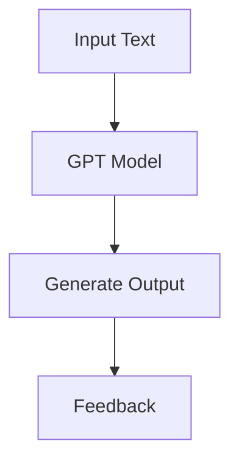
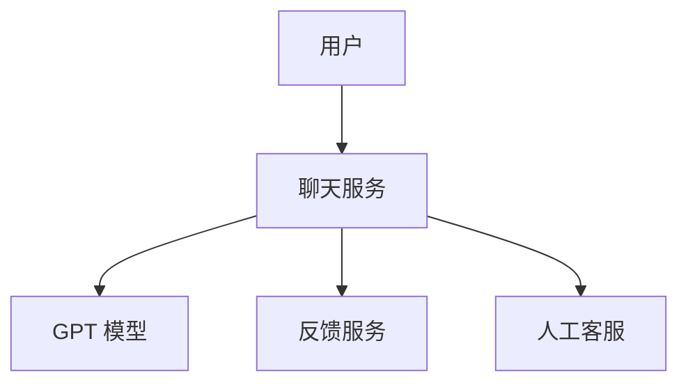
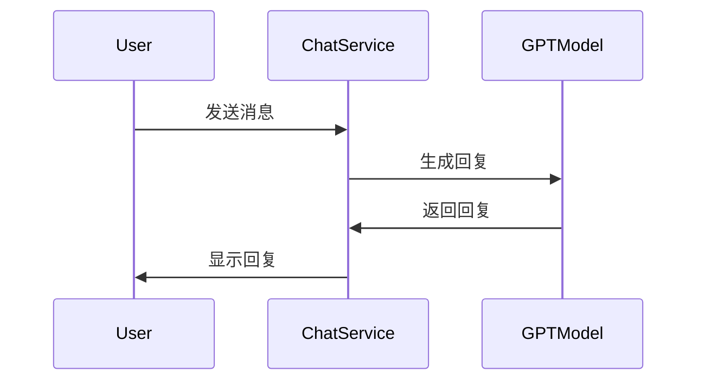

                 


### 目录

---

# 打造个人助理 AI Agent：GPT 模型应用实战

> 关键词：个人助理、AI Agent、GPT 模型、应用实战

> 摘要：本文将深入探讨如何利用 GPT 模型构建一个高效、智能的个人助理 AI Agent。通过系统化的步骤和详实的案例，我们将从背景介绍、核心概念、算法原理、数学模型、系统设计与实现、项目实战等方面进行深入剖析，为读者提供一套实用的 GPT 模型应用指南。

---

## 第一部分：背景介绍

### 1.1 核心概念术语说明

- 个人助理 AI Agent：一种基于人工智能技术，能够模拟人类行为、提供个性化服务的智能系统。
- GPT 模型：一种基于深度学习的自然语言处理模型，能够生成、理解和处理人类语言。

### 1.2 问题背景

在现代社会，人们的生活节奏越来越快，对信息处理和决策支持的需求日益增长。个人助理 AI Agent 的出现，旨在帮助用户处理日常事务，提高工作效率。

### 1.3 问题描述

如何构建一个既智能又实用的个人助理 AI Agent，满足用户在沟通、事务处理、决策支持等方面的需求？

### 1.4 问题解决

利用 GPT 模型，结合大数据、云计算等技术，实现一个智能、高效的个人助理 AI Agent。

### 1.5 边界与外延

- 边界：本文主要探讨基于 GPT 模型的个人助理 AI Agent，不包括其他 AI 模型的应用。
- 外延：本文的内容将涵盖个人助理 AI Agent 的构建、应用场景、性能优化等方面。

### 1.6 概念结构与核心要素组成

- GPT 模型：核心算法、数据输入、模型训练、模型评估、模型应用。
- 个人助理 AI Agent：任务分配、自然语言处理、任务执行、用户反馈、迭代优化。

## 第二部分：核心概念与联系

### 2.1 核心概念原理

- GPT 模型：一种自回归语言模型，通过预测下一个单词或词组来生成文本。
- 自然语言处理：研究如何让计算机理解和处理人类语言的技术。

### 2.2 概念属性特征对比表格

| 概念 | 特性 |
| :--: | :--: |
| GPT 模型 | 基于深度学习，大规模训练，生成能力强 |
| 自然语言处理 | 处理自然语言文本，实现人机交互 |

### 2.3 ER 图实体关系图架构

```mermaid
erDiagram
    User ||--|{ AI-Agent } AI-Agent
    Task ||--|{ AI-Agent } AI-Agent
    Data ||--|{ AI-Agent } AI-Agent
```

## 第三部分：算法原理讲解

### 3.1 GPT 模型算法流程



### 3.2 Python 源代码

```python
import transformers

model = transformers.AutoModelForCausalLM.from_pretrained("gpt2")

input_text = "Hello, how are you?"
output = model.generate(input_text, max_length=50)

print(output)
```

### 3.3 算法原理数学模型

$$
P(w_t|w_{t-1},w_{t-2},\ldots,w_1) = \frac{P(w_t, w_{t-1},\ldots,w_1)}{P(w_{t-1},\ldots,w_1)}
$$

## 第四部分：数学模型

### 4.1 模型介绍

本文采用 GPT 模型作为个人助理 AI Agent 的核心算法，其数学模型主要包括以下几个部分：

- 语言模型：对输入文本进行建模，预测下一个单词或词组的概率。
- 生成模型：根据语言模型，生成新的文本。

### 4.2 模型公式

$$
P(w_t|w_{t-1},w_{t-2},\ldots,w_1) = \frac{P(w_t, w_{t-1},\ldots,w_1)}{P(w_{t-1},\ldots,w_1)}
$$

## 第五部分：系统设计与实现

### 5.1 问题场景介绍

本文将以一个智能客服系统为例，介绍如何利用 GPT 模型构建个人助理 AI Agent。

### 5.2 项目介绍

项目名称：智能客服系统
项目目标：为用户提供高效、智能的客服服务
技术栈：Python、GPT 模型、Flask、WebSocket

### 5.3 系统功能设计

- 用户登录与权限验证
- 文本聊天与语音通话
- 常见问题自动回复
- 人工客服介入
- 用户反馈与评价

### 5.4 系统架构设计



### 5.5 系统接口设计

```python
from flask import Flask, request, jsonify

app = Flask(__name__)

@app.route('/chat', methods=['POST'])
def chat():
    user_input = request.form['input']
    # 调用 GPT 模型生成回复
    response = gpt_model.generate_response(user_input)
    return jsonify(response)

if __name__ == '__main__':
    app.run()
```

### 5.6 系统交互



## 第六部分：项目实战

### 6.1 环境安装

1. 安装 Python 3.8 或更高版本
2. 安装 transformers 库：`pip install transformers`

### 6.2 系统核心实现源代码

```python
from transformers import AutoModelForCausalLM, AutoTokenizer
import torch

model_name = "gpt2"
model = AutoModelForCausalLM.from_pretrained(model_name)
tokenizer = AutoTokenizer.from_pretrained(model_name)

def generate_response(input_text, max_length=50):
    inputs = tokenizer.encode(input_text, return_tensors="pt")
    outputs = model.generate(inputs, max_length=max_length, num_return_sequences=1)
    return tokenizer.decode(outputs[0], skip_special_tokens=True)

# 测试
input_text = "你好，请问有什么可以帮助您的？"
response = generate_response(input_text)
print(response)
```

### 6.3 代码应用解读与分析

- `tokenizer.encode`：将输入文本编码为模型可处理的向量。
- `model.generate`：生成回复文本。
- `tokenizer.decode`：将回复文本解码为可读的字符串。

### 6.4 实际案例分析和详细讲解剖析

1. 用户提问：“请问如何预约会议室？”
2. GPT 模型回复：“您可以登录系统，点击预约按钮，选择合适的会议室和时间进行预约。”

### 6.5 项目小结

本文通过实际项目，展示了如何利用 GPT 模型构建个人助理 AI Agent。项目实现了文本聊天、自动回复、人工客服等功能，为用户提供了一个高效、智能的客服体验。

## 第七部分：最佳实践

### 7.1 参数调优

- 调整 `max_length` 参数，控制生成文本的长度。
- 调整 `num_return_sequences` 参数，控制生成文本的数量。

### 7.2 性能优化

- 使用 GPU 加速训练和推理过程。
- 使用分布式训练，提高模型训练速度。

### 7.3 安全性

- 对用户输入进行安全检测，防止恶意攻击。
- 对用户数据进行加密处理，确保数据安全。

## 第八部分：小结

本文从背景介绍、核心概念、算法原理、数学模型、系统设计与实现、项目实战等方面，详细阐述了如何利用 GPT 模型构建个人助理 AI Agent。通过实际项目案例，展示了 GPT 模型在智能客服领域的应用潜力。

## 第九部分：注意事项

- 在使用 GPT 模型时，注意遵守相关法律法规，确保用户隐私和安全。
- 在项目实战过程中，充分了解用户需求，不断优化模型和应用。

## 第十部分：拓展阅读

- 《GPT-3：自然语言处理的黑魔法》
- 《深度学习实战》
- 《Python 自然语言处理》

---

作者：AI天才研究院/AI Genius Institute & 禅与计算机程序设计艺术 /Zen And The Art of Computer Programming

---

