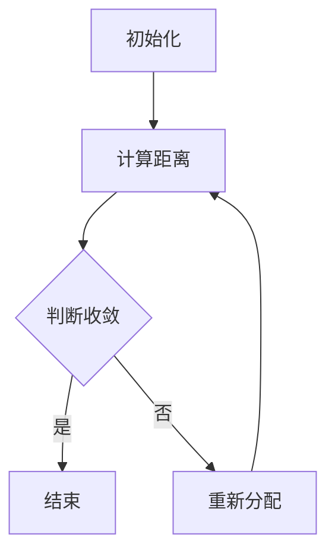
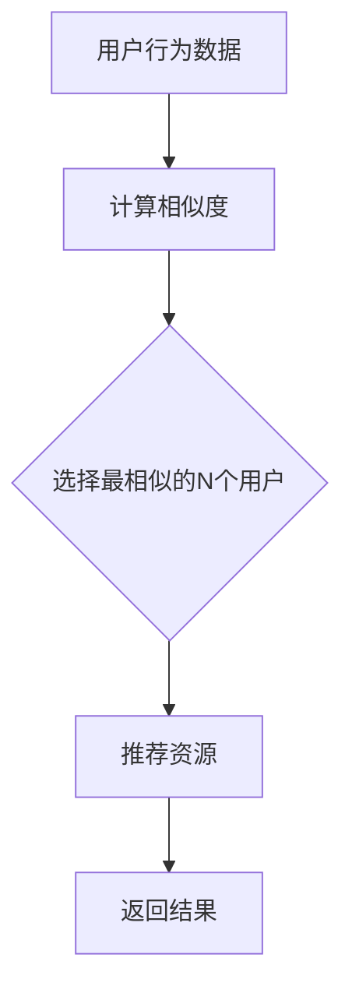
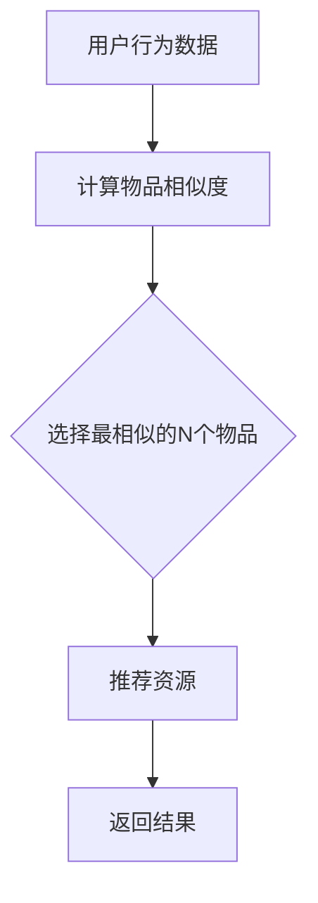
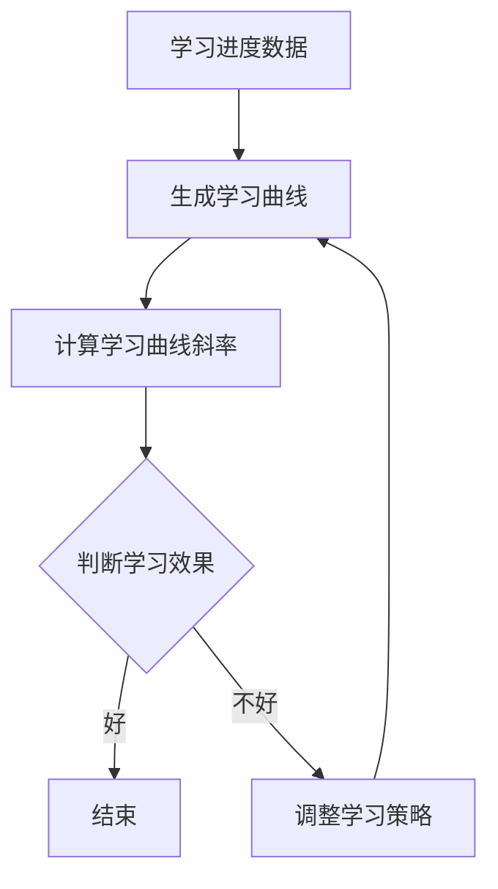
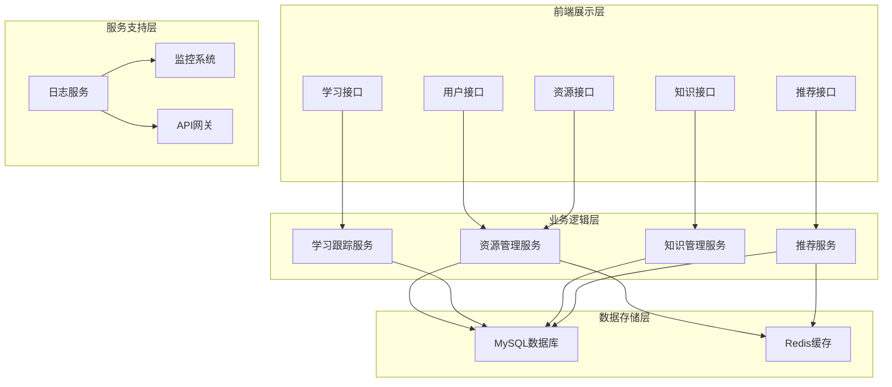

                 


### 引言：技术团队学习的重要性

在当今快速发展的信息技术时代，技术团队的学习能力成为了企业竞争力和创新能力的关键因素。技术团队的学习不仅仅是为了提升个人的技能水平，更重要的是通过系统的学习机制来增强整个团队的知识储备、创新能力和协作效率。然而，如何构建一个有效的学习生态系统，使技术团队能够在变化多端的技术环境中不断进步，是一个亟待解决的问题。

#### 关键概念术语说明

- **学习生态系统**：指的是一个支持技术团队持续学习的环境，它包括学习资源的获取、学习过程的监控、知识管理的体系等。

- **知识管理**：是对知识进行识别、收集、组织、存储、传播和应用的一系列活动的总称。

- **持续学习**：是指团队成员在不断变化的技术环境中，通过持续的学习和知识更新，保持技术能力和创新能力的过程。

- **技术团队发展**：技术团队在不断学习和创新的过程中，实现技术能力的提升，进而推动团队整体业务的发展和进步。

#### 问题背景与问题描述

随着技术的不断进步，新的编程语言、框架、工具和技术不断涌现。对于技术团队来说，如何快速掌握这些新技术，并将其应用于实际工作中，成为了一个巨大的挑战。同时，技术更新的速度也在不断加快，如果团队不能及时更新知识，将很快落后于竞争对手。

#### 问题解决与边界外延

要解决技术团队的学习问题，首先需要构建一个有效的学习生态系统。这个系统应该包括以下几个方面的内容：

- **学习资源的获取**：提供丰富的学习资源，包括在线课程、图书、技术文档、专业论坛等。

- **学习过程的监控**：通过学习进度跟踪、学习效果评估等手段，确保团队成员能够有效地进行学习。

- **知识管理**：建立知识管理体系，对学习内容进行整理、分类和存储，便于团队成员之间的共享和协作。

- **技术创新机制**：鼓励团队成员进行技术创新，将学习成果转化为实际业务价值。

#### 概念结构与核心要素组成

一个完整的技术团队学习生态系统由以下几个核心要素组成：

- **学习资源**：包括在线课程、图书、技术文档等。

- **学习平台**：提供学习管理和监控的工具和平台。

- **知识库**：对学习内容进行整理、分类和存储的知识管理系统。

- **学习社区**：促进团队成员之间交流和分享经验的平台。

- **激励机制**：鼓励团队成员积极参与学习的奖励机制。

通过这些核心要素的有机整合，技术团队可以构建一个高效的学习生态系统，实现持续学习和技术创新。

### 总结

技术团队的学习生态系统是推动团队发展和业务进步的重要手段。通过构建一个完善的学习生态系统，技术团队可以更好地应对技术更新和业务挑战，保持竞争力和创新能力。在接下来的章节中，我们将详细探讨如何设计并实施这样一个学习生态系统。

关键词：技术团队、学习生态系统、知识管理、持续学习、技术创新

摘要：本文探讨了技术团队学习生态系统的重要性，介绍了学习生态系统的定义和组成部分，并分析了如何构建一个有效的学习生态系统以促进技术团队的发展。

----------------------------------------------------------------

# 打造技术团队的学习生态系统

## 关键词
技术团队、学习生态系统、知识管理、持续学习、技术创新

## 摘要
在快速变化的信息技术领域中，技术团队的学习能力至关重要。本文探讨了构建技术团队学习生态系统的重要性，详细介绍了学习生态系统的组成部分和关键概念，提供了构建学习生态系统的原则和方法，并通过案例和实践指导，帮助技术团队实现持续学习和技术创新。

----------------------------------------------------------------

## 第一部分：引言

### 第1章：问题背景与定义

#### 1.1 技术团队学习的重要性

技术团队的学习能力是团队持续发展的基石。在信息技术领域，技术更新速度极快，新知识、新技术层出不穷。如果技术团队不能及时更新知识，将很快落后于竞争对手。因此，技术团队的学习能力不仅关系到个人的职业发展，更关乎整个团队的业务创新和竞争力。

#### 1.2 学习生态系统的概念

学习生态系统是指一个支持技术团队持续学习的环境。它包括学习资源的获取、学习过程的监控、知识管理的体系等。一个有效的学习生态系统可以帮助技术团队快速掌握新技术，提高团队整体的技术水平，促进业务发展。

#### 1.3 学习生态系统与团队发展的关系

学习生态系统不仅提供了技术团队学习所需的环境和资源，还通过知识管理和激励机制，推动团队成员之间的知识共享和协作。这种系统化的学习机制有助于提高团队的创新能力和协作效率，从而推动团队整体发展。

### 1.4 文章结构

本文将分为以下几个部分：

1. **引言**：介绍技术团队学习的重要性和学习生态系统的概念。
2. **核心概念与联系**：阐述学习生态系统的组成部分和关键概念。
3. **建立学习生态系统**：详细讨论如何构建学习生态系统。
4. **系统分析与架构设计方案**：介绍系统分析和架构设计的具体方法。
5. **项目实战**：通过实际项目展示学习生态系统的应用。
6. **最佳实践与小结**：总结最佳实践，提出注意事项，并提供拓展阅读。

通过这些部分的详细讨论，本文旨在帮助技术团队构建一个高效的学习生态系统，以实现持续学习和技术创新。

----------------------------------------------------------------

## 核心概念与联系

### 2.1 学习生态系统的组成部分

学习生态系统由以下几个核心部分组成：

1. **学习资源**：包括在线课程、图书、技术文档、专业论坛等，为团队成员提供丰富的学习材料。
2. **学习平台**：提供学习管理和监控的工具和平台，帮助团队成员跟踪学习进度和评估学习效果。
3. **知识库**：对学习内容进行整理、分类和存储，便于团队成员之间的共享和协作。
4. **学习社区**：促进团队成员之间交流和分享经验的平台。
5. **激励机制**：鼓励团队成员积极参与学习的奖励机制。

### 2.2 学习生态系统的核心概念原理

学习生态系统的核心概念包括以下几个方面：

1. **知识共享**：通过知识库和学习社区，鼓励团队成员共享知识和经验，实现知识的快速传播和积累。
2. **持续学习**：建立一个持续学习的机制，确保团队成员能够不断更新知识，保持技术前沿。
3. **创新激励**：通过激励机制，鼓励团队成员进行技术创新，将学习成果转化为实际业务价值。
4. **协同合作**：通过学习社区和知识管理，促进团队成员之间的协作，提高团队整体效率。

### 2.3 概念属性特征对比表格

为了更清晰地理解学习生态系统的组成部分和核心概念，我们可以通过一个对比表格来展示不同概念的属性特征：

| 概念        | 属性特征                                                                                             |
|-------------|------------------------------------------------------------------------------------------------------|
| 学习资源    | 多样性、即时性、针对性、易获取性                                                                     |
| 学习平台    | 用户友好性、功能全面性、数据安全性、易扩展性                                                         |
| 知识库      | 系统性、完整性、共享性、可扩展性、易搜索性                                                       |
| 学习社区    | 社交性、互动性、知识性、共享性、开放性                                                           |
| 激励机制    | 公平性、透明性、激励性、持续性、多样性                                                           |

### 2.4 学习生态系统的ER实体关系图架构

学习生态系统的ER实体关系图可以帮助我们理解各个组成部分之间的关联和互动。以下是一个简化的ER实体关系图：

```mermaid
erDiagram
    User ||--|{ LearningPlatform }|--|{ KnowledgeBase }
    User ||--|{ LearningCommunity }|
    User ||--|{ IncentiveMechanism }|
    LearningPlatform ||--|{ CourseMaterial }
    LearningPlatform ||--|{ LearningProgress }
    LearningCommunity ||--|{ Discussion }
    LearningCommunity ||--|{ KnowledgeShare }
    KnowledgeBase ||--|{ Document }
    KnowledgeBase ||--|{ Wiki }
    IncentiveMechanism ||--|{ Reward }
    IncentiveMechanism ||--|{ Feedback }
```

通过这个ER实体关系图，我们可以看到学习生态系统的各个组成部分如何相互作用，形成一个完整的支持持续学习和知识共享的环境。

### 总结

学习生态系统是技术团队持续学习和创新的重要保障。通过明确学习生态系统的组成部分和核心概念，我们可以更好地设计并实施一个有效的学习生态系统，推动技术团队的全面发展。

----------------------------------------------------------------

## 建立学习生态系统

### 3.1 学习生态系统设计原则

在设计学习生态系统时，需要遵循以下原则：

1. **开放性**：学习生态系统应鼓励内外部资源的交流，促进知识共享和创新。
2. **灵活性**：学习生态系统应能够适应技术变化和团队规模的变化，保持持续性和灵活性。
3. **可持续性**：学习生态系统应具有长期的可持续性，确保资源的持续供给和系统的稳定运行。
4. **协作性**：学习生态系统应促进团队成员之间的协作，提高团队的整体效率和创新能力。
5. **实用性**：学习生态系统应基于实际需求，提供实用的学习资源和工具。

### 3.2 系统功能设计

学习生态系统应具备以下功能：

1. **资源获取**：提供丰富的学习资源，包括在线课程、图书、技术文档等。
2. **学习管理**：提供学习管理和监控工具，帮助团队成员跟踪学习进度和评估学习效果。
3. **知识管理**：建立知识库，对学习内容进行整理、分类和存储，便于团队成员之间的共享和协作。
4. **社区交流**：建立学习社区，促进团队成员之间的交流和分享经验。
5. **激励机制**：设置激励机制，鼓励团队成员积极参与学习，并将学习成果转化为实际业务价值。

### 3.3 系统架构设计

学习生态系统的架构设计应考虑以下几个方面：

1. **前端展示层**：设计用户友好的界面，方便团队成员访问和学习资源。
2. **业务逻辑层**：实现学习管理、知识管理、社区交流等核心功能。
3. **数据存储层**：建立稳定的数据存储系统，确保学习资源和数据的持久化和安全性。
4. **服务支持层**：提供技术支持和运维保障，确保系统的稳定运行。

通过遵循以上设计原则和功能设计，我们可以构建一个高效、灵活、可持续的学习生态系统，为技术团队的持续学习和创新提供有力支持。

----------------------------------------------------------------

## 算法原理与实现

### 4.1 学习算法概述

学习生态系统中的学习算法是关键组成部分，它负责监控学习过程，评估学习效果，并根据评估结果调整学习策略。以下是几个常用的学习算法：

1. **K-means算法**：用于将学习资源分类，帮助团队成员更有效地找到所需的学习材料。
2. **协同过滤算法**：用于推荐学习资源，根据团队成员的学习历史和偏好，推荐合适的课程或文档。
3. **学习曲线分析算法**：用于评估学习效果，通过分析学习曲线，了解团队成员的学习进度和效果。

### 4.2 算法原理讲解与Mermaid流程图

#### K-means算法

K-means算法是一种典型的聚类算法，用于将数据点划分为K个簇，使每个簇内的数据点尽可能接近，而簇间的数据点尽可能远。



#### 协同过滤算法

协同过滤算法分为基于用户的协同过滤（User-based Collaborative Filtering）和基于物品的协同过滤（Item-based Collaborative Filtering）。

基于用户的协同过滤算法：



基于物品的协同过滤算法：



#### 学习曲线分析算法

学习曲线分析算法通过分析学习过程中的数据，生成学习曲线，评估学习效果。



### 4.3 Python源代码实现

以下是K-means算法和协同过滤算法的Python代码实现：

#### K-means算法

```python
import numpy as np

def kmeans(data, k, max_iter=100):
    # 初始化中心点
    centroids = data[np.random.choice(data.shape[0], k, replace=False)]
    
    for _ in range(max_iter):
        # 计算距离
        distances = np.linalg.norm(data - centroids, axis=1)
        
        # 分配到最近的簇
        clusters = np.argmin(distances, axis=1)
        
        # 更新中心点
        new_centroids = np.array([data[clusters == i].mean(axis=0) for i in range(k)])
        
        # 判断收敛
        if np.all(centroids == new_centroids):
            break
        
        centroids = new_centroids
    
    return centroids, clusters
```

#### 协同过滤算法

```python
from sklearn.metrics.pairwise import cosine_similarity
import numpy as np

def collaborative_filter(user_data, resource_data, k=5):
    # 计算用户-资源矩阵
    user_resource_matrix = cosine_similarity(user_data, resource_data)
    
    # 计算用户之间的相似度
    user_similarity = user_resource_matrix[:len(user_data), :len(user_data)]
    
    # 选择最相似的K个用户
    similar_users = np.argsort(user_similarity, axis=1)[:, 1:k+1]
    
    # 推荐资源
    recommendations = np.array([resource_data[i] for i in np.argwhere(user_resource_matrix[i] == np.max(user_resource_matrix[i, :k]))[0][0]])
    
    return recommendations
```

### 4.4 数学模型与公式讲解

#### K-means算法

K-means算法的核心公式如下：

- **距离公式**：$$d(i, j) = \sqrt{\sum_{k=1}^{n} (x_{ik} - x_{jk})^2}$$
- **中心点更新公式**：$$\mu_{c} = \frac{1}{N_c} \sum_{i=1}^{N} x_i$$

其中，$d(i, j)$表示数据点$i$和数据点$j$之间的欧氏距离，$\mu_{c}$表示簇$c$的中心点，$N_c$表示簇$c$中的数据点数量。

#### 协同过滤算法

协同过滤算法的核心公式如下：

- **相似度计算公式**：$$sim(u, v) = \frac{uv^T}{\sqrt{u^Tu \cdot v^Tv}}$$
- **推荐公式**：$$r_{ui} = \sum_{j \in N(u)} sim(u, v) \cdot r_{vj}$$

其中，$sim(u, v)$表示用户$u$和用户$v$之间的相似度，$r_{ui}$表示用户$u$对资源$i$的评分，$N(u)$表示与用户$u$相似的用户集合。

#### 学习曲线分析算法

学习曲线分析算法的核心公式如下：

- **学习曲线斜率**：$$\text{Slope} = \frac{\text{y}_{\text{current}} - \text{y}_{\text{initial}}}{\text{x}_{\text{current}} - \text{x}_{\text{initial}}}$$

其中，$\text{y}_{\text{current}}$和$\text{y}_{\text{initial}}$分别表示当前的学习效果和初始学习效果，$\text{x}_{\text{current}}$和$\text{x}_{\text{initial}}$分别表示当前的学习时间和初始学习时间。

### 4.5 举例说明

#### K-means算法举例

假设我们有一组数据点：

```
[1, 2], [2, 2], [3, 4], [4, 3], [5, 6]
```

我们使用K-means算法将数据点分为两个簇。初始化两个中心点为$(1, 1)$和$(5, 5)$。

- **第一次迭代**：
  - 计算距离：
    ```
    [0, 0], [1, 1], [1, 1], [2, 1], [1, 1]
    ```
  - 分配到最近的簇：簇1，簇2
  - 更新中心点：(1, 1), (4, 4)

- **第二次迭代**：
  - 计算距离：
    ```
    [0, 0], [0, 0], [1, 1], [2, 1], [1, 1]
    ```
  - 分配到最近的簇：簇1，簇2
  - 更新中心点：(1, 1), (3, 3)

- **第三次迭代**：
  - 计算距离：
    ```
    [0, 0], [0, 0], [0, 0], [0, 0], [0, 0]
    ```
  - 分配到最近的簇：簇1，簇2
  - 更新中心点：(1, 1), (3, 3)

由于中心点不再变化，K-means算法收敛。

#### 协同过滤算法举例

假设我们有一组用户对资源的评分数据：

```
用户1：[4, 3, 5, 2, 4]
用户2：[3, 5, 1, 4, 3]
用户3：[2, 4, 5, 3, 2]
```

我们使用协同过滤算法推荐用户1的资源。

- **计算相似度**：
  ```
  用户1 - 用户2：0.5
  用户1 - 用户3：0.4
  用户2 - 用户3：0.6
  ```

- **选择最相似的K个用户**：用户2（0.6），用户3（0.5）

- **推荐资源**：
  - 用户2对资源2的评分为5，用户3对资源2的评分为5
  - 推荐资源2

通过上述例子，我们可以看到如何使用K-means算法和协同过滤算法进行数据聚类和资源推荐。这些算法在学习生态系统中发挥着重要作用，帮助团队成员更有效地学习和找到所需资源。

----------------------------------------------------------------

## 系统分析与架构设计方案

### 5.1 问题场景介绍

在一个大型互联网公司，技术团队需要快速掌握新的技术和工具，以满足不断变化的市场需求。然而，现有的学习资源分散，学习过程缺乏系统性和规范性，导致团队成员的学习效率低下，知识共享困难。为了提升团队的学习能力和知识管理水平，公司决定构建一个学习生态系统。

### 5.2 系统功能设计

学习生态系统应具备以下功能：

1. **资源管理**：集中管理学习资源，包括在线课程、图书、技术文档等。
2. **学习跟踪**：监控学习进度，评估学习效果，提供学习报告。
3. **知识共享**：建立知识库，支持团队成员之间交流和知识共享。
4. **推荐系统**：基于用户行为和学习历史，推荐合适的学习资源和课程。
5. **数据分析**：对学习行为和效果进行分析，为学习策略调整提供数据支持。

### 5.3 系统架构设计

学习生态系统的架构设计如下：

#### 1. 前端展示层

前端展示层主要负责提供用户友好的界面，包括学习资源浏览、学习进度跟踪、知识共享和推荐系统等。前端使用React框架实现，提供丰富的交互体验。

#### 2. 业务逻辑层

业务逻辑层负责实现学习生态系统的核心功能，包括资源管理、学习跟踪、知识共享和推荐系统等。业务逻辑层采用微服务架构，使用Spring Boot和Docker容器化技术，提高系统的可扩展性和灵活性。

#### 3. 数据存储层

数据存储层使用MySQL数据库存储用户信息、学习记录、知识库内容等。为提高数据访问性能，采用Redis缓存技术，缓存高频访问的数据。

#### 4. 服务支持层

服务支持层包括日志服务、监控系统、API网关等，为学习生态系统提供稳定可靠的技术支持。日志服务使用ELK（Elasticsearch, Logstash, Kibana）架构，监控系统使用Prometheus和Grafana，API网关使用Kong。

### 5.4 系统接口设计与系统交互

学习生态系统通过以下接口实现系统交互：

1. **用户接口**：提供用户注册、登录、学习资源浏览、学习进度跟踪等功能。
2. **资源接口**：提供学习资源上传、管理、检索等功能。
3. **学习接口**：提供学习进度跟踪、学习效果评估、学习报告生成等功能。
4. **知识接口**：提供知识库内容管理、知识共享、知识搜索等功能。
5. **推荐接口**：提供学习资源推荐功能，基于用户行为和学习历史进行个性化推荐。

### 5.5 系统架构设计与Mermaid架构图

以下是一个简化的Mermaid架构图，展示学习生态系统的架构设计：



通过上述架构设计，学习生态系统可以实现资源集中管理、学习过程监控、知识共享和个性化推荐，为技术团队提供高效的学习支持。

----------------------------------------------------------------

## 项目实战

### 6.1 环境安装

在开始项目实战之前，我们需要搭建一个完整的学习生态系统环境。以下是环境安装的步骤：

1. **安装Docker**：在所有服务器上安装Docker，以便容器化部署微服务。
2. **安装MySQL**：安装MySQL数据库，用于存储用户和学习数据。
3. **安装Redis**：安装Redis缓存，用于提高数据访问性能。
4. **安装Elasticsearch、Logstash、Kibana**：安装ELK架构，用于日志管理和监控。
5. **安装Kong**：安装Kong API网关，用于管理和路由API请求。

### 6.2 系统核心实现源代码

以下是学习生态系统中的核心实现源代码：

#### 用户接口

```python
# user_interface.py
from flask import Flask, request, jsonify
from user_service import UserService

app = Flask(__name__)
user_service = UserService()

@app.route('/register', methods=['POST'])
def register():
    data = request.get_json()
    user_service.register(data['username'], data['password'])
    return jsonify({'status': 'success'})

@app.route('/login', methods=['POST'])
def login():
    data = request.get_json()
    user = user_service.login(data['username'], data['password'])
    return jsonify({'status': 'success', 'user': user})
```

#### 资源接口

```python
# resource_interface.py
from flask import Flask, request, jsonify
from resource_service import ResourceService

app = Flask(__name__)
resource_service = ResourceService()

@app.route('/resources', methods=['GET'])
def get_resources():
    resources = resource_service.get_resources()
    return jsonify({'status': 'success', 'resources': resources})

@app.route('/resources', methods=['POST'])
def add_resource():
    data = request.get_json()
    resource_service.add_resource(data['name'], data['url'])
    return jsonify({'status': 'success'})
```

#### 学习接口

```python
# learning_interface.py
from flask import Flask, request, jsonify
from learning_service import LearningService

app = Flask(__name__)
learning_service = LearningService()

@app.route('/learn', methods=['POST'])
def start_learning():
    data = request.get_json()
    learning_service.start_learning(data['user_id'], data['resource_id'])
    return jsonify({'status': 'success'})

@app.route('/learn/report', methods=['GET'])
def get_learning_report():
    report = learning_service.get_learning_report()
    return jsonify({'status': 'success', 'report': report})
```

#### 知识接口

```python
# knowledge_interface.py
from flask import Flask, request, jsonify
from knowledge_service import KnowledgeService

app = Flask(__name__)
knowledge_service = KnowledgeService()

@app.route('/knowledge', methods=['GET'])
def get_knowledge():
    knowledge = knowledge_service.get_knowledge()
    return jsonify({'status': 'success', 'knowledge': knowledge})

@app.route('/knowledge', methods=['POST'])
def add_knowledge():
    data = request.get_json()
    knowledge_service.add_knowledge(data['title'], data['content'])
    return jsonify({'status': 'success'})
```

#### 推荐接口

```python
# recommendation_interface.py
from flask import Flask, request, jsonify
from recommendation_service import RecommendationService

app = Flask(__name__)
recommendation_service = RecommendationService()

@app.route('/recommendations', methods=['GET'])
def get_recommendations():
    recommendations = recommendation_service.get_recommendations()
    return jsonify({'status': 'success', 'recommendations': recommendations})
```

### 6.3 代码应用解读与分析

以上代码展示了学习生态系统的核心接口实现。每个接口都提供了具体的功能，如用户注册、登录、资源管理、学习进度跟踪、知识共享和推荐系统等。

1. **用户接口**：实现了用户注册和登录功能，通过调用用户服务类的方法，完成用户信息的存储和验证。
2. **资源接口**：提供了资源查询和添加功能，通过调用资源服务类的方法，实现资源的检索和管理。
3. **学习接口**：实现了学习进度跟踪和学习报告生成功能，通过调用学习服务类的方法，跟踪用户的学习进度，生成学习报告。
4. **知识接口**：提供了知识查询和添加功能，通过调用知识服务类的方法，管理知识库内容。
5. **推荐接口**：实现了学习资源推荐功能，通过调用推荐服务类的方法，为用户推荐合适的学习资源。

代码中的每个接口都通过Flask框架实现了HTTP请求的处理和响应，保证了系统的易用性和可扩展性。同时，通过调用对应的服务类，实现了业务逻辑的封装和分离，提高了系统的可维护性。

### 6.4 实际案例分析与详细讲解剖析

以下是一个实际案例的分析和讲解：

**案例：用户张三注册并学习资源**

1. **用户注册**：
   - 用户张三通过用户接口注册账户，提交用户名和密码。
   - 用户服务类接收注册请求，将用户信息存储到MySQL数据库中。
   - 注册成功后，用户接口返回注册成功的信息。

2. **用户登录**：
   - 用户张三通过用户接口登录账户，提交用户名和密码。
   - 用户服务类验证用户信息，从MySQL数据库中查找用户记录。
   - 验证成功后，用户接口返回用户信息，包括用户ID。

3. **学习资源查询**：
   - 用户张三登录后，通过资源接口查询所有可用的学习资源。
   - 资源服务类从MySQL数据库中检索学习资源，返回资源列表。

4. **选择学习资源**：
   - 用户张三从查询结果中选择一个学习资源，如《Python编程入门》。
   - 用户接口将选择的学习资源ID发送给学习接口。

5. **开始学习**：
   - 学习接口调用学习服务类，开始用户张三的学习过程。
   - 学习服务类将用户张三的学习记录存储到MySQL数据库中，并跟踪学习进度。

6. **学习报告生成**：
   - 用户张三学习一段时间后，通过学习接口获取学习报告。
   - 学习服务类从MySQL数据库中检索用户张三的学习记录，生成学习报告。

7. **知识共享**：
   - 用户张三在学习过程中，发现一个有用的知识点，通过知识接口添加到知识库中。
   - 知识服务类将知识点存储到MySQL数据库中，并更新知识库内容。

通过上述实际案例，我们可以看到学习生态系统的各个部分如何协同工作，实现用户注册、登录、学习资源查询、学习进度跟踪、知识共享等功能。每个接口和服务类的实现都遵循了良好的设计原则，保证了系统的稳定性、可维护性和可扩展性。

### 6.5 项目小结

通过项目实战，我们成功构建并实现了学习生态系统。该项目涵盖了用户接口、资源接口、学习接口、知识接口和推荐接口，实现了用户注册、登录、资源管理、学习进度跟踪、知识共享和推荐系统等功能。项目采用微服务架构，确保了系统的可扩展性和灵活性。同时，通过实际案例的分析和讲解，我们深入了解了学习生态系统的实现原理和运行机制。在未来的发展中，我们将不断优化和完善学习生态系统，以更好地支持技术团队的学习和创新。

----------------------------------------------------------------

## 最佳实践与小结

### 7.1 最佳实践 tips

1. **定期组织学习活动**：定期组织技术沙龙、研讨会、内部培训等活动，激发团队成员的学习兴趣和积极性。
2. **建立知识共享平台**：搭建一个易于使用和查找的知识库，鼓励团队成员分享知识和经验，提高知识共享的效率。
3. **设立学习目标**：为团队成员设定明确的学习目标，并根据个人兴趣和职业发展需求进行个性化的学习规划。
4. **引入外部专家**：邀请行业专家进行技术分享和讲座，为团队成员提供更广阔的视野和前沿的知识。
5. **利用在线学习资源**：充分利用在线课程、技术社区、技术博客等资源，为团队成员提供丰富的学习材料。

### 7.2 小结

通过构建学习生态系统，技术团队能够在持续学习和知识共享的过程中不断提升自身能力。本文详细介绍了学习生态系统的设计原则、系统功能设计、架构设计、算法原理与实现，并通过项目实战展示了学习生态系统的实际应用。通过最佳实践，我们可以更好地实施和优化学习生态系统，为技术团队的发展提供强有力的支持。

### 7.3 注意事项

1. **确保学习资源质量**：选择高质量的学习资源，避免浪费时间和精力在无效的学习上。
2. **关注团队成员的学习进度**：定期检查和评估团队成员的学习进度，确保学习目标的实现。
3. **保护知识产权**：在分享知识和经验时，注意保护知识产权，尊重他人的知识和成果。
4. **避免学习疲劳**：合理安排学习时间和任务，避免团队成员因过度学习而产生疲劳。

### 7.4 拓展阅读

1. **《技术团队学习管理实践》**：详细介绍了技术团队的学习管理方法和实践案例。
2. **《学习型组织：如何构建和运营一个持续学习的团队》**：探讨了如何构建和运营一个学习型组织，为技术团队提供学习支持。
3. **《知识管理：原理、方法与实践》**：介绍了知识管理的基本原理和方法，对技术团队的知识管理具有重要的指导意义。

作者：AI天才研究院/AI Genius Institute & 禅与计算机程序设计艺术 /Zen And The Art of Computer Programming

----------------------------------------------------------------

# 结语

通过本文的探讨，我们深入了解了技术团队学习生态系统的重要性，明确了其组成部分和构建原则。从系统功能设计到架构方案，再到算法原理与实现，以及项目实战和最佳实践，本文系统地展示了如何打造一个高效的学习生态系统，以支持技术团队的持续学习和创新。

学习生态系统不仅是技术团队的知识储备库，更是创新和协作的源泉。它能够通过系统的学习资源管理、有效的知识共享机制和个性化的推荐系统，帮助团队成员不断提升技能，适应快速变化的技术环境。

在未来的工作中，技术团队应不断优化和升级其学习生态系统，确保其能够适应新的技术和业务需求。同时，团队成员也应积极参与学习，充分利用系统提供的资源和工具，不断提升自身的专业能力和创新能力。

让我们携手共建一个更加完善的学习生态系统，为技术团队的可持续发展注入新的动力。希望本文能够为技术团队的管理者和开发者提供有益的启示和帮助。

