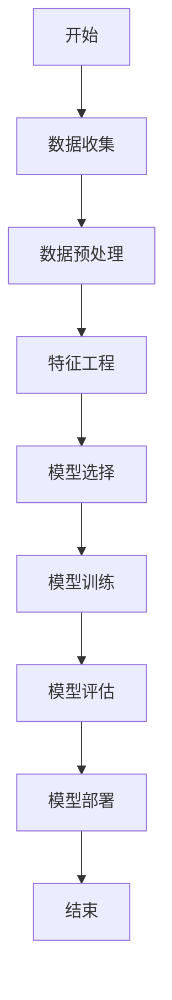
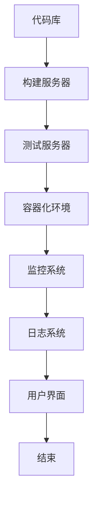

                 

### 引言：智能化的DevOps平台

#### 1.1 DevOps背景与目的

**1.1.1 DevOps的起源与发展**

DevOps是一种结合软件开发（Development）和运维（Operations）的文化、策略和实践。起源于2000年代中期的硅谷，随着互联网行业的快速发展，软件开发和运维之间的协作问题日益突出。传统的软件开发和运维团队往往各自为政，导致协作不畅、部署缓慢、系统故障频发等问题。为了解决这些问题，DevOps的理念应运而生，旨在通过加强协作、提高自动化程度、缩短部署周期，实现快速、稳定、高质量的软件交付。

DevOps的兴起与云计算、虚拟化技术的普及密不可分。这些技术为DevOps的落地提供了基础设施支持，使得自动化部署、持续集成、持续交付等实践成为可能。近年来，DevOps已经成为全球范围内的企业数字化转型的重要推动力量。

**1.1.2 DevOps的目标与价值**

DevOps的核心目标是通过提高软件开发和运维团队的协作效率，实现快速、稳定、高质量的软件交付。具体来说，DevOps的目标包括：

1. **提高交付速度**：通过自动化和持续集成、持续交付等实践，缩短从代码提交到上线的时间，提高软件交付的频率和质量。
2. **提升系统稳定性**：通过自动化测试和监控，减少系统故障，提高系统的可靠性和可用性。
3. **优化资源利用率**：通过虚拟化和容器化技术，实现资源的动态分配和优化，提高资源利用率。
4. **加强团队协作**：通过文化建设和工具集成，促进开发、测试、运维等团队的紧密协作，提高团队的整体效率。

**1.1.3 智能化与DevOps的结合**

随着人工智能技术的快速发展，智能化与DevOps的结合成为了一个热门话题。智能化技术可以为DevOps平台带来以下优势：

1. **自动化程度更高**：机器学习和人工智能技术可以帮助自动化解决复杂的部署、监控和故障排除问题，提高自动化程度。
2. **预测能力更强**：通过大数据分析和机器学习，可以预测系统性能、故障趋势，提前采取预防措施，降低风险。
3. **优化资源配置**：智能算法可以根据实时数据和业务需求，动态调整资源分配，提高资源利用率。
4. **增强安全性**：通过人工智能技术，可以实时监控网络安全态势，及时发现和应对潜在威胁。

本章节将首先介绍DevOps的核心概念，包括定义、目标和原则，然后探讨智能化技术在DevOps中的应用，为后续章节的内容奠定基础。

#### 1.2 DevOps核心概念

**1.2.1 DevOps的定义**

DevOps是一种文化、实践和工具集，旨在通过加强开发（Development）和运维（Operations）团队的协作，实现快速、稳定、高质量的软件交付。DevOps不仅关注技术层面，还涉及组织文化、流程改进和人员协作等多方面。

**1.2.2 DevOps的目标和原则**

DevOps的主要目标是提高软件交付的速度和质量，实现以下目标：

1. **快速交付**：通过缩短从代码提交到上线的时间，提高软件交付的频率和质量。
2. **稳定运行**：通过自动化测试和监控，减少系统故障，提高系统的可靠性和可用性。
3. **优化资源**：通过虚拟化和容器化技术，实现资源的动态分配和优化，提高资源利用率。
4. **团队协作**：通过文化建设和工具集成，促进开发、测试、运维等团队的紧密协作，提高团队的整体效率。

DevOps遵循以下原则：

1. **持续集成（CI）**：通过自动化工具，将代码更改频繁集成到主分支，确保代码质量，快速发现和修复集成过程中出现的问题。
2. **持续交付（CD）**：在持续集成的基础上，通过自动化工具实现代码的持续交付和部署，缩短从开发到上线的时间。
3. **基础设施即代码（IaC）**：将基础设施的配置和管理代码化，实现基础设施的自动化部署和管理。
4. **自动化**：通过自动化工具，实现部署、监控、故障排除等运维任务的自动化，提高效率和可靠性。
5. **持续反馈**：通过实时监控和反馈，持续收集系统性能、用户反馈等信息，为改进提供数据支持。

**1.2.3 DevOps与自动化、CI、CD的关系**

DevOps与自动化、持续集成（CI）、持续交付（CD）等概念密切相关。

- **自动化**：自动化是DevOps的核心思想之一，通过自动化工具和脚本，实现重复性任务的自动化执行，提高效率和减少人为错误。
- **持续集成（CI）**：持续集成是指通过自动化工具，将开发人员的代码更改频繁集成到主分支，确保代码质量，快速发现和修复集成过程中出现的问题。
- **持续交付（CD）**：持续交付是在持续集成的基础上，通过自动化工具实现代码的持续交付和部署，缩短从开发到上线的时间。

DevOps通过持续集成和持续交付，实现了从代码提交到上线的过程的自动化，从而实现了快速、稳定、高质量的软件交付。

**1.2.4 DevOps与敏捷开发的联系**

DevOps与敏捷开发（Agile Development）有许多相似之处，都强调快速交付、持续改进和团队协作。

- **快速交付**：敏捷开发强调快速交付可用的软件功能，DevOps通过自动化和持续集成、持续交付等实践，实现快速交付。
- **持续改进**：敏捷开发强调持续改进，通过迭代和增量式开发，不断优化产品，DevOps通过持续反馈和监控，实现持续改进。
- **团队协作**：敏捷开发强调跨职能团队的协作，DevOps通过文化建设和工具集成，促进团队协作，提高整体效率。

本章节介绍了DevOps的核心概念，包括定义、目标和原则，以及与自动化、CI、CD等技术的关联。接下来，我们将探讨智能化技术在DevOps中的应用，为打造智能化的DevOps平台提供技术支持。

#### 1.3 智能化技术融入DevOps

**1.3.1 机器学习在DevOps中的应用**

机器学习（Machine Learning，ML）是人工智能（Artificial Intelligence，AI）的一个重要分支，通过数据驱动的方式，让计算机自动识别模式和做出预测。在DevOps中，机器学习可以应用于以下几个方面：

1. **部署优化**：机器学习算法可以根据历史部署数据，预测最佳部署时间和资源分配策略，从而优化部署流程，提高系统稳定性。
2. **故障预测**：通过收集系统运行数据，机器学习算法可以预测系统故障的发生，提前采取预防措施，减少故障对业务的影响。
3. **性能优化**：机器学习算法可以根据系统性能数据，识别性能瓶颈，提供优化建议，提高系统性能。
4. **异常检测**：机器学习算法可以对日志和监控数据进行分析，识别异常行为，及时预警和排查问题。

**1.3.2 人工智能技术对DevOps的影响**

人工智能技术对DevOps产生了深远的影响，主要表现在以下几个方面：

1. **自动化程度提高**：人工智能技术可以自动化解决复杂的部署、监控和故障排除问题，提高自动化程度，减少人为干预。
2. **预测能力增强**：通过大数据分析和机器学习，可以预测系统性能、故障趋势，提前采取预防措施，降低风险。
3. **资源利用率优化**：智能算法可以根据实时数据和业务需求，动态调整资源分配，提高资源利用率。
4. **安全性提升**：人工智能技术可以实时监控网络安全态势，及时发现和应对潜在威胁，提高系统安全性。

**1.3.3 智能化DevOps平台的实现方法**

要实现智能化DevOps平台，可以采取以下方法和步骤：

1. **数据收集**：收集系统运行数据，包括日志、监控数据、用户行为数据等，为机器学习提供基础数据。
2. **数据预处理**：对收集到的数据进行分析和清洗，去除噪声和冗余数据，为机器学习模型提供高质量的数据。
3. **模型训练**：选择合适的机器学习算法，对预处理后的数据进行训练，建立预测模型。
4. **模型部署**：将训练好的模型部署到DevOps平台中，实现自动化部署、故障预测、性能优化等功能。
5. **持续优化**：根据实际运行情况，对模型进行调整和优化，提高预测精度和稳定性。

**1.3.4 智能化DevOps平台的架构设计**

智能化DevOps平台的架构设计需要考虑以下几个方面：

1. **数据层**：包括数据收集、存储、预处理等模块，为机器学习提供数据支持。
2. **算法层**：包括机器学习模型的训练、部署和管理等模块，实现智能化功能。
3. **应用层**：包括部署优化、故障预测、性能优化等模块，为业务提供智能化服务。
4. **界面层**：包括用户界面和监控仪表盘等模块，提供用户交互和数据展示功能。

通过以上方法和步骤，可以实现一个智能化DevOps平台，提高软件交付的速度和质量，增强系统的稳定性和安全性。接下来，我们将进一步探讨DevOps平台的架构设计，为智能化DevOps平台的构建提供技术支持。

### 1.4 DevOps平台架构设计

#### 1.4.1 技术选型

在构建智能化DevOps平台时，技术选型是关键的一步。合适的工具和平台将直接影响平台的性能、可扩展性和维护性。以下是几种常见的技术选型和理由：

1. **持续集成工具**：如Jenkins、GitLab CI/CD等。这些工具支持多种编程语言和平台，可以自动化构建、测试和部署流程。
2. **容器化技术**：如Docker和Kubernetes。容器化技术可以提高应用程序的部署效率和可移植性，简化运维工作。
3. **监控和日志工具**：如Prometheus、Grafana、ELK（Elasticsearch、Logstash、Kibana）堆栈等。这些工具可以实时监控系统性能和日志，提供强大的数据分析能力。
4. **自动化脚本**：如Python、Shell等。编写自动化脚本可以简化日常的运维任务，提高工作效率。
5. **基础设施即代码（IaC）工具**：如Terraform、Ansible等。IaC工具可以帮助自动化管理基础设施，确保配置的一致性和可重复性。

**1.4.2 组件架构**

一个典型的智能化DevOps平台可以包括以下组件：

1. **代码库**：存储所有代码和配置文件，如Git、SVN等版本控制系统。
2. **构建和测试环境**：包括构建服务器、测试服务器、测试工具等，用于自动化构建和测试代码。
3. **容器化环境**：包括Docker容器、Kubernetes集群等，用于部署和管理应用程序。
4. **监控和日志系统**：包括Prometheus、Grafana、ELK堆栈等，用于实时监控系统和收集日志。
5. **自动化脚本和工具**：包括Python脚本、Shell脚本、Ansible等，用于自动化执行任务。
6. **用户界面和仪表盘**：提供用户交互和数据展示功能，如Kibana、Grafana仪表板。

**1.4.3 基础设施规划**

基础设施规划是构建智能化DevOps平台的重要环节。以下是一些关键规划步骤：

1. **资源需求分析**：根据应用程序的性能需求，确定所需的计算、存储和网络资源。
2. **基础设施选择**：选择合适的基础设施，如公有云、私有云、混合云等。
3. **负载均衡和容灾**：设计负载均衡策略和容灾方案，确保系统的高可用性。
4. **网络安全**：配置防火墙、入侵检测系统等安全措施，保护系统免受攻击。
5. **备份和恢复**：制定备份和恢复策略，确保数据的安全性和可恢复性。

**1.4.4 资源管理**

资源管理是智能化DevOps平台的核心功能之一。以下是一些关键资源管理策略：

1. **自动化部署**：通过容器化技术和自动化脚本，实现应用程序的自动化部署。
2. **动态资源分配**：使用Kubernetes等容器编排工具，根据业务需求动态分配计算资源。
3. **容量规划**：根据历史数据和预测模型，制定容量规划策略，确保资源充足。
4. **成本优化**：通过监控和优化资源使用，降低运营成本。
5. **弹性扩展**：根据业务需求，实现系统的弹性扩展和收缩。

通过以上技术选型、组件架构、基础设施规划和资源管理，可以构建一个高效、可靠、可扩展的智能化DevOps平台，实现快速、稳定、高质量的软件交付。

#### 1.5 DevOps平台自动化实践

**1.5.1 自动化构建**

自动化构建是DevOps平台的核心实践之一，通过自动化工具和脚本，将软件开发过程中的构建、测试和部署任务集成到一个流水线中，提高开发效率和软件质量。以下是自动化构建的关键步骤和实践：

1. **代码仓库集成**：将代码仓库（如Git）与自动化构建工具（如Jenkins、GitLab CI/CD）集成，实现代码的自动拉取和构建。
2. **构建脚本编写**：编写构建脚本（如Maven、Gradle），自动化执行编译、打包和依赖管理任务。
3. **测试执行**：集成测试工具（如JUnit、Selenium），执行单元测试、集成测试和回归测试，确保代码质量。
4. **构建状态反馈**：通过邮件、钉钉、Slack等工具，实时反馈构建状态，通知开发人员。
5. **自动化部署**：在构建成功后，自动触发部署流程，将应用程序部署到生产环境。

**1.5.2 自动化部署**

自动化部署是DevOps平台的关键实践，通过自动化工具和脚本，实现应用程序的快速部署和回滚，提高系统的可靠性和可用性。以下是自动化部署的关键步骤和实践：

1. **容器化**：使用Docker将应用程序打包成容器，确保在不同环境中的一致性。
2. **部署脚本编写**：编写部署脚本（如Kubernetes的Kubectl命令），实现自动化部署和配置管理。
3. **部署策略配置**：配置部署策略，如滚动部署、蓝绿部署等，确保部署过程中的系统稳定性。
4. **版本控制**：通过版本控制系统（如Git）管理应用程序的版本，实现快速回滚和更新。
5. **监控和反馈**：部署完成后，通过监控工具（如Prometheus、Grafana）实时监控系统状态，确保部署成功。

**1.5.3 自动化监控**

自动化监控是DevOps平台的重要组成部分，通过监控工具和脚本，实时监控系统的性能、可用性和安全性，及时发现和解决潜在问题。以下是自动化监控的关键步骤和实践：

1. **监控数据采集**：使用Prometheus、Grafana等工具，采集系统运行数据，如CPU、内存、磁盘、网络等。
2. **告警策略配置**：配置告警策略，如阈值告警、异常检测告警等，实时通知相关人员。
3. **日志收集和存储**：使用ELK堆栈等工具，收集和存储日志数据，实现日志的集中管理和分析。
4. **自动化故障排除**：通过自动化脚本和工具，实现自动化故障排除和恢复，降低故障对业务的影响。
5. **性能优化**：根据监控数据，识别性能瓶颈，提供优化建议，提高系统性能。

通过以上自动化实践，可以显著提高DevOps平台的效率和质量，实现快速、稳定、高质量的软件交付。接下来，我们将深入探讨持续集成（CI）和持续交付（CD）的实现方法和最佳实践。

#### 1.6 持续集成与持续交付

**1.6.1 CI/CD的概念与重要性**

持续集成（Continuous Integration，CI）和持续交付（Continuous Deployment，CD）是DevOps实践中两个核心的概念。

1. **持续集成（CI）**：持续集成是一种软件开发实践，通过自动化工具和脚本，将开发人员的代码更改频繁集成到主分支，确保代码质量，快速发现和修复集成过程中出现的问题。

2. **持续交付（CD）**：持续交付是在持续集成的基础上，通过自动化工具实现代码的持续交付和部署，缩短从开发到上线的时间，确保交付的软件质量和稳定性。

CI/CD的重要性体现在以下几个方面：

- **提高交付速度**：通过自动化集成和部署，缩短从代码提交到上线的时间，提高软件交付的频率和质量。
- **提高代码质量**：通过频繁的集成和测试，确保代码的质量，减少集成过程中出现的问题。
- **减少风险**：通过持续集成和交付，及时发现和解决潜在问题，降低上线风险。
- **增强团队协作**：通过CI/CD实践，促进开发、测试、运维等团队的紧密协作，提高整体效率。

**1.6.2 CI/CD的流程和工具**

CI/CD的流程通常包括以下几个步骤：

1. **代码提交**：开发人员将代码提交到版本控制系统（如Git）。
2. **自动化构建**：自动化构建工具（如Jenkins、GitLab CI/CD）拉取最新代码，执行编译、打包和测试等任务。
3. **测试执行**：运行自动化测试（如单元测试、集成测试、回归测试），确保代码质量。
4. **代码审核**：通过静态代码分析工具（如SonarQube）检查代码质量，确保代码符合规范。
5. **构建发布**：如果构建和测试成功，将构建结果发布到容器仓库（如Docker Hub）或自动化部署环境。
6. **部署**：通过部署工具（如Kubernetes、Ansible）将应用程序部署到生产环境。

常用的CI/CD工具包括：

- **Jenkins**：开源的持续集成工具，支持多种插件，可以实现复杂的构建和部署流程。
- **GitLab CI/CD**：GitLab自带的持续集成和持续交付工具，与GitLab代码仓库深度集成。
- **GitHub Actions**：GitHub提供的持续集成和持续交付工具，支持多种操作系统和编程语言。
- **Kubernetes**：开源的容器编排工具，可以实现自动化部署、扩展和管理容器化应用程序。
- **Ansible**：开源的自动化工具，可以通过简单的YAML文件实现自动化部署和管理。

**1.6.3 CI/CD实践案例**

以下是CI/CD实践的一个案例：

1. **项目背景**：某互联网公司需要实现一个电商平台，开发周期为3个月，计划每月进行一次代码发布。
2. **CI流程**：
   - 开发人员每天将代码提交到GitLab代码仓库。
   - GitLab CI/CD工具自动拉取最新代码，执行Maven构建、单元测试和集成测试。
   - 构建成功后，将应用程序容器化，推送到Docker Hub。
3. **CD流程**：
   - 每月进行一次代码发布，通过Kubernetes将容器化应用程序部署到生产环境。
   - 部署前进行一次全量测试，确保系统稳定性。
   - 部署过程中，采用蓝绿部署策略，确保新老版本切换过程中系统可用性。

通过以上CI/CD实践，该互联网公司成功实现了快速、稳定、高质量的软件交付，提高了开发效率和用户体验。

通过持续集成和持续交付，企业可以实现快速、稳定、高质量的软件交付，提高市场竞争力。接下来，我们将探讨如何在DevOps平台中实现安全性和合规性。

#### 1.7 DevOps平台安全性与合规性

**1.7.1 风险管理**

在DevOps平台中，风险管理是确保系统安全性和稳定性的重要环节。以下是一些关键的风险管理实践：

1. **风险评估**：定期进行风险评估，识别潜在的安全威胁和风险点。
2. **威胁模型**：建立威胁模型，分析攻击者可能利用的漏洞和攻击路径。
3. **风险管理策略**：制定风险管理策略，包括风险规避、风险转移、风险减轻等。
4. **安全审计**：定期进行安全审计，检查系统配置和操作是否符合安全规范。
5. **监控与预警**：部署安全监控工具，实时监控系统安全态势，及时发现和响应安全事件。

**1.7.2 访问控制**

访问控制是确保系统资源安全的重要手段。以下是一些关键的访问控制实践：

1. **身份认证**：采用多因素身份认证（如密码、指纹、手机验证等），确保用户身份的真实性。
2. **权限管理**：根据用户角色和职责，分配适当的权限，限制用户的操作范围。
3. **访问日志**：记录用户操作日志，以便在发生安全事件时进行追溯和分析。
4. **强制访问控制（MAC）**：采用强制访问控制机制，根据安全标签控制资源的访问权限。
5. **权限审计**：定期审计用户权限，确保权限分配合理，及时调整不合适的权限。

**1.7.3 数据保护**

数据保护是确保用户隐私和数据安全的关键。以下是一些关键的数据保护实践：

1. **数据加密**：对敏感数据进行加密存储和传输，防止数据泄露。
2. **访问控制**：采用访问控制机制，确保只有授权用户可以访问敏感数据。
3. **数据备份**：定期备份数据，确保数据的安全性和可恢复性。
4. **数据脱敏**：对测试和开发环境中的数据进行脱敏处理，防止敏感数据泄露。
5. **数据审计**：定期审计数据访问和使用情况，确保数据的安全性和合规性。

**1.7.4 法规遵从**

法规遵从是确保企业合规运营的重要方面。以下是一些关键的法规遵从实践：

1. **合规性评估**：定期进行合规性评估，确保系统设计和操作符合相关法律法规。
2. **合规性培训**：对员工进行合规性培训，提高合规意识和能力。
3. **合规性审计**：定期进行合规性审计，检查系统配置和操作是否符合法规要求。
4. **合规性报告**：及时编制合规性报告，向相关监管部门提交合规性证明。
5. **合规性改进**：根据合规性评估和审计结果，持续改进系统设计和操作，确保合规性。

通过以上风险管理、访问控制、数据保护和法规遵从实践，可以在DevOps平台中实现安全性和合规性，确保系统的稳定性和可靠性。接下来，我们将分享一些DevOps平台建设的最佳实践。

#### 1.8 DevOps最佳实践与案例

**1.8.1 最佳实践分享**

1. **持续反馈与改进**：建立持续反馈机制，鼓励团队成员分享经验和问题，定期进行回顾和总结，持续改进开发流程和工具使用。
2. **自动化程度提升**：逐步增加自动化任务的比例，减少手动操作，提高效率，降低错误风险。
3. **定期演练**：定期进行应急演练和灾难恢复演练，确保团队在面对突发情况时能够快速响应和恢复。
4. **文化塑造**：注重团队文化建设，鼓励协作、学习和创新，建立开放、包容、积极的工作氛围。
5. **持续学习与培训**：定期组织技术分享和培训，提高团队成员的技术水平和业务能力。

**1.8.2 成功案例分析与总结**

以下是几个成功案例的分析和总结：

**案例一：某互联网公司**

- **背景**：该互联网公司是一个高速发展的电商平台，面临着快速交付和大规模扩展的需求。
- **实践**：采用CI/CD实践，使用Jenkins和Kubernetes，实现自动化构建、测试和部署。同时，采用Docker进行容器化，提高部署效率和可移植性。
- **效果**：通过CI/CD实践，将部署周期从一周缩短到一天，提高了软件交付速度和系统稳定性。同时，容器化技术使得应用程序在不同环境中的一致性得到保障。

**案例二：某金融科技公司**

- **背景**：该金融科技公司需要确保金融交易系统的安全性和合规性，同时提高系统性能和可扩展性。
- **实践**：采用IaC工具Terraform进行基础设施管理，确保配置的一致性和可重复性。同时，采用Prometheus和Grafana进行实时监控和性能优化。
- **效果**：通过IaC工具，实现了基础设施的自动化部署和管理，提高了资源利用率。同时，通过监控和性能优化，确保了系统的稳定性和高效性，满足了合规性要求。

**案例三：某医疗健康公司**

- **背景**：该医疗健康公司需要处理大量敏感数据，同时确保数据的安全性和隐私保护。
- **实践**：采用加密技术对敏感数据进行加密存储和传输。同时，采用访问控制机制，确保只有授权用户可以访问敏感数据。此外，采用日志审计工具，实时记录和监控用户操作。
- **效果**：通过加密和访问控制，确保了数据的安全性和隐私保护。同时，通过日志审计，实现了用户操作的追溯和监控，提高了系统的安全性和合规性。

以上案例展示了不同行业企业在构建DevOps平台时采用的实践和方法，以及所取得的效果。通过这些最佳实践，企业可以实现快速、稳定、高质量的软件交付，提高市场竞争力。

#### 1.9 总结与展望

**1.9.1 DevOps平台建设的总结**

在本文中，我们系统地介绍了智能化DevOps平台的构建方法。通过核心概念、智能化技术、平台架构设计、自动化实践、持续集成与持续交付、安全性与合规性等方面的详细讲解，我们明确了DevOps平台对于企业数字化转型的重要性。

DevOps平台不仅提高了软件交付的速度和质量，还增强了团队的协作效率，优化了资源配置。智能化技术的融入，进一步提升了平台的自动化程度和预测能力，为企业的持续创新和竞争力提供了有力支持。

**1.9.2 智能化DevOps的发展趋势**

随着技术的不断进步，智能化DevOps平台的发展趋势将体现在以下几个方面：

1. **自动化程度的提升**：人工智能和机器学习技术的不断进步，将使自动化任务更加智能和高效，降低人为干预的需求。
2. **预测能力的增强**：大数据分析和人工智能技术将使预测模型更加精准，提前识别和应对潜在的风险和问题。
3. **安全性与合规性的融合**：随着安全威胁的日益复杂，安全性和合规性将在智能化DevOps平台中更加紧密结合，确保系统的可靠性和数据安全。
4. **云原生技术的普及**：云原生技术（如Kubernetes）将更加普及，实现跨云和跨平台的灵活部署和管理。
5. **持续学习与自我优化**：智能化DevOps平台将具备自我学习和自我优化的能力，不断适应新的业务需求和变化。

未来，智能化DevOps平台将成为企业数字化转型的核心动力，推动企业实现持续创新和快速发展。通过不断探索和实践，企业将能够在智能化时代中占据领先地位。

### 结论

本文系统地介绍了智能化DevOps平台的构建方法，从核心概念、智能化技术、平台架构设计、自动化实践、持续集成与持续交付、安全性与合规性等方面进行了详细讲解。通过本文，我们明确了DevOps平台对于企业数字化转型的重要性，以及智能化技术如何提升DevOps平台的自动化程度和预测能力。

在未来的发展中，智能化DevOps平台将继续演进，提高自动化程度、增强预测能力、加强安全性与合规性，实现云原生技术的普及。我们鼓励读者在实践过程中不断探索和创新，将智能化技术应用于DevOps平台，推动企业实现持续创新和快速发展。

**作者：AI天才研究院/AI Genius Institute & 禅与计算机程序设计艺术 /Zen And The Art of Computer Programming**

---

本文内容涵盖了智能化DevOps平台建设的各个方面，提供了丰富的实践案例和最佳实践分享。在阅读本文后，读者可以更深入地理解智能化DevOps平台的构建方法，为企业的数字化转型提供有力支持。

### 附录

为了帮助读者更好地理解本文内容，我们提供了一些附录，包括核心概念表格、机器学习算法流程图、DevOps架构图、数学公式等。

**附录 A：核心概念表格**

| 核心概念 | 说明 |
| --- | --- |
| DevOps | 一种结合软件开发和运维的文化、策略和实践 |
| 持续集成（CI） | 通过自动化工具频繁集成代码，确保代码质量 |
| 持续交付（CD） | 在持续集成的基础上，自动化交付和部署代码 |
| 自动化 | 使用自动化工具和脚本实现重复性任务 |
| 安全性 | 保护系统免受攻击和确保数据安全 |
| 合规性 | 符合相关法律法规和行业标准 |

**附录 B：机器学习算法流程图**

**附录 C：DevOps架构图**

**附录 D：数学公式**

$$ E = mc^2 $$

$ 1 + 1 = 2 $

通过这些附录，读者可以更直观地理解本文的核心内容和关键概念，为实践智能化DevOps平台提供参考。

---

感谢读者对本文的关注，希望本文能为您的DevOps实践带来新的启示和帮助。我们期待与您一起，探索智能化DevOps平台的无限可能。**作者：AI天才研究院/AI Genius Institute & 禅与计算机程序设计艺术 /Zen And The Art of Computer Programming**

