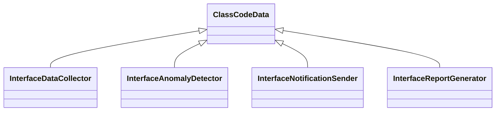
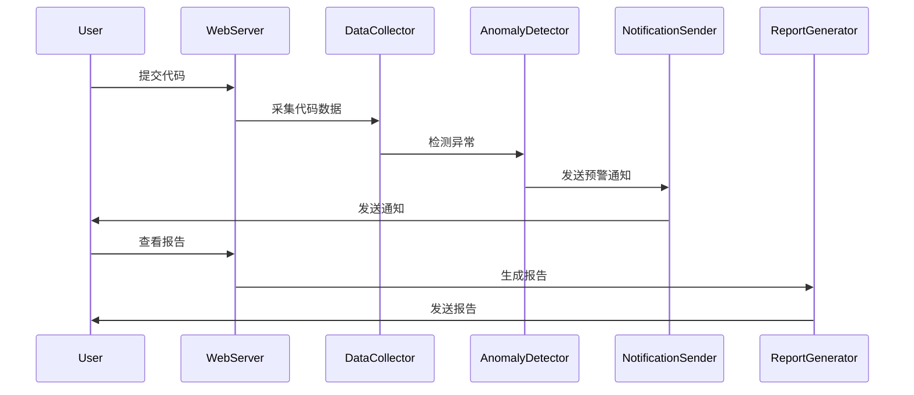

                 


----------------------------------------------------------------
# 《打造智能化的代码异常检测系统》

## 关键词
代码异常检测、智能化系统、算法实现、系统架构、Python编程、最佳实践

## 摘要
本文旨在深入探讨如何构建一个智能化的代码异常检测系统。我们将从理论基础入手，逐步介绍核心概念、算法原理，并通过实际项目案例分析，展示如何将理论知识转化为实际应用。文章将涵盖从环境搭建到系统实现，再到最佳实践的全过程，旨在为开发者提供一套完整的智能代码异常检测系统开发指南。

----------------------------------------------------------------

## 引言

在当今的软件开发过程中，代码质量和稳定性是决定项目成功与否的关键因素。然而，随着代码规模的不断扩大和复杂性程度的增加，传统的代码审查方法已难以满足高效、精准的需求。此时，智能化代码异常检测系统应运而生，它通过利用先进的人工智能技术，对代码中的潜在问题进行实时检测和预警，从而显著提高开发效率和代码质量。

本文将围绕如何打造这样一个智能化代码异常检测系统展开讨论，通过系统性的讲解和实践案例，帮助读者了解从零开始构建这样一个系统的全过程。文章分为三大部分：第一部分是理论基础，包括代码异常检测的概述和核心概念；第二部分是技术实现，涵盖算法原理讲解和系统架构设计；第三部分是最佳实践与总结，通过具体案例分享实战经验和注意事项。

## 问题背景

代码异常检测，顾名思义，是指对代码运行过程中的异常情况进行分析和诊断。这些异常情况可能包括语法错误、逻辑错误、资源泄漏、性能瓶颈等。随着软件系统的复杂性增加，异常检测的重要性愈发突出。以下是几个典型的背景：

1. **语法错误与逻辑错误**：这些错误在编译或运行时会导致程序崩溃，严重影响系统的稳定性。

2. **资源泄漏**：在资源受限的环境下，资源泄漏可能导致系统崩溃或性能急剧下降。

3. **性能瓶颈**：性能问题不仅会影响用户体验，还可能导致业务损失。

4. **安全漏洞**：某些异常情况可能引发安全漏洞，造成数据泄露或系统被攻击。

针对这些问题，传统的代码审查方法存在局限性，如人工审查效率低下、难以发现隐蔽性问题等。而智能化代码异常检测系统则通过自动化手段，实现对这些问题的实时监控和预警，从而提高开发效率和代码质量。

## 书籍目的和内容安排

本文书籍旨在为开发者提供一套系统化的智能代码异常检测系统开发指南。通过以下三个部分，读者可以逐步掌握构建智能代码异常检测系统的全过程：

### 第一部分：理论基础

- **第1章：代码异常检测概述**
  本章将介绍代码异常检测的定义、重要性以及常见应用场景。

- **第2章：核心概念与联系**
  本章将深入探讨异常检测的相关概念、算法分类及其对比，并通过ER实体关系图展示各算法之间的联系。

### 第二部分：技术实现

- **第3章：算法原理讲解**
  本章将详细讲解异常检测算法的原理，包括Mermaid流程图和Python源代码实现。

- **第4章：系统分析与架构设计**
  本章将介绍系统分析与架构设计的方法，包括领域模型类图、架构图、接口设计和系统交互。

- **第5章：项目实战**
  本章将通过一个实际项目案例，展示从环境搭建到系统实现的全过程。

### 第三部分：最佳实践与总结

- **第6章：最佳实践**
  本章将分享实际操作中的技巧和注意事项。

- **第7章：总结与展望**
  本章将对书籍内容进行总结，并探讨未来的研究方向。

## 第一部分：理论基础

### 第1章：代码异常检测概述

#### 1.1 代码异常检测的重要性

代码异常检测是确保软件系统稳定性和可靠性的重要手段。它通过对代码运行过程中的各种异常情况进行分析和诊断，可以提前预警潜在的问题，避免系统崩溃或性能下降。具体重要性体现在以下几个方面：

1. **提高开发效率**：通过自动化检测，可以快速定位问题，减少开发人员的重复劳动。
2. **保障系统稳定性**：及时发现并修复潜在的错误，确保系统稳定运行。
3. **提升代码质量**：有助于开发者养成良好的编程习惯，提高代码的可读性和可维护性。
4. **减少维护成本**：通过预防性措施，减少系统维护的难度和成本。

#### 1.2 代码异常检测的分类

代码异常检测可以根据检测方法的不同分为以下几类：

1. **静态代码分析**：
   静态代码分析是在代码运行之前对代码进行分析，通过检查代码的语法、结构、语义等方面来发现潜在的问题。这种方法具有快速、准确的特点，但无法检测动态运行时的异常。

2. **动态代码分析**：
   动态代码分析是在代码运行时对代码进行分析，通过实时监控代码的执行过程来发现异常。这种方法可以检测到动态运行时的各种问题，但需要消耗一定的系统资源。

3. **混合代码分析**：
   混合代码分析结合了静态和动态代码分析的优势，先通过静态分析筛选出可能的问题，再通过动态分析进行验证。这种方法具有更高的检测精度和效率。

#### 1.3 代码异常检测的应用场景

代码异常检测在多个领域具有广泛的应用：

1. **开发阶段**：
   在软件开发过程中，代码异常检测可以帮助开发者及时发现和修复问题，确保代码质量和稳定性。

2. **测试阶段**：
   在软件测试过程中，代码异常检测可以辅助测试人员快速定位问题，提高测试效率。

3. **运维阶段**：
   在系统运维过程中，代码异常检测可以帮助监控系统的运行状态，及时发现并处理异常，保障系统的稳定性和可靠性。

4. **安全防护**：
   通过检测代码中的安全漏洞，代码异常检测可以帮助提高系统的安全性，防范潜在的网络攻击。

### 第2章：核心概念与联系

#### 2.1 异常检测的相关概念

在探讨代码异常检测之前，我们需要了解一些相关概念：

1. **异常**：
   异常是指程序在运行过程中出现的非预期行为。异常可能是由于代码错误、环境变化或其他原因引起的。

2. **错误**：
   错误是指程序运行过程中发生的错误，包括语法错误、逻辑错误等。

3. **异常检测**：
   异常检测是指通过算法和技术手段，对程序运行过程中的异常行为进行分析和诊断。

#### 2.2 异常检测算法的分类

异常检测算法可以根据其原理和实现方式的不同分为以下几类：

1. **基于统计学的算法**：
   基于统计学的算法通过计算程序运行数据的统计特征，判断是否存在异常。常见的算法包括：

   - **基于均值的异常检测**：
     通过计算数据的平均值，判断数据是否偏离平均值过远。

   - **基于标准差的异常检测**：
     通过计算数据的标准差，判断数据是否超出标准差的阈值。

2. **基于机器学习的算法**：
   基于机器学习的算法通过训练模型来识别正常行为和异常行为。常见的算法包括：

   - **聚类算法**：
     通过将数据分为不同的簇，识别出异常簇。

   - **异常检测模型**：
     如孤立森林（Isolation Forest）、基于支持向量机的异常检测等。

3. **基于规则的算法**：
   基于规则的算法通过定义一系列规则，对程序运行过程中的异常行为进行检测。常见的算法包括：

   - **基于阈值的规则检测**：
     通过设置阈值，判断数据是否超出阈值范围。

   - **基于专家规则的检测**：
     通过专家定义的规则，对程序运行过程进行分析。

#### 2.3 异常检测算法的对比表格

以下是几种常见异常检测算法的对比表格：

| 算法类型         | 特点                  | 适用场景                    |
|-----------------|-----------------------|-----------------------------|
| 基于统计学的算法 | 快速、准确            | 简单数据分布的场景            |
| 基于机器学习的算法 | 强泛化能力            | 复杂数据分布的场景            |
| 基于规则的算法   | 灵活性高、易于实现    | 数据规则明确的场景            |

#### 2.4 异常检测的ER实体关系图

以下是异常检测系统中常见的ER实体关系图：

```mermaid
erDiagram
  User ||--|{ Code } : writes
  Code ||--|{ Exception } : occurs
  Exception ||--|{ Report } : generates
```

在上述ER图中，用户（User）编写代码（Code），代码在运行过程中可能会出现异常（Exception），异常生成报告（Report）以供开发者分析。

## 第二部分：技术实现

### 第3章：算法原理讲解

#### 3.1 算法原理与Mermaid流程图

代码异常检测的核心在于如何有效地识别出异常行为。本节将介绍一种基于机器学习的异常检测算法——孤立森林（Isolation Forest）。

**孤立森林算法原理：**

1. **随机选取特征**：从特征空间中随机选取一个特征。
2. **随机切分**：以该特征为分割点，将数据集切分为两部分。
3. **递归分割**：对切分后的数据集进行递归分割，直到达到预先设定的终止条件。
4. **路径长度**：记录每个数据点到根节点的路径长度。
5. **异常性度量**：计算路径长度，并计算平均值和标准差，用于评估数据的异常性。

**Mermaid流程图：**


#### 3.2 Python源代码实现

为了更好地理解孤立森林算法，我们提供了一个简单的Python实现示例：

```python
import numpy as np
import matplotlib.pyplot as plt

def isolation_forest(data, n_splits=100):
    """
    孤立森林算法实现
    :param data: 输入数据集
    :param n_splits: 分割次数
    :return: 异常性度量结果
    """
    n_samples, n_features = data.shape
    depths = np.zeros(n_samples)

    for _ in range(n_splits):
        feature_indices = np.random.choice(n_features, size=n_features, replace=False)
        left = np.where(data[:, feature_indices] < np.median(data[:, feature_indices]))[0]
        right = np.where(data[:, feature_indices] >= np.median(data[:, feature_indices]))[0]
        for sample in data:
            path_length = 0
            for feature in feature_indices:
                if sample[feature] < np.median(data[:, feature]):
                    path_length += int(sample[feature] < np.median(data[:, feature]))
                else:
                    path_length += int(sample[feature] >= np.median(data[:, feature]))
            depths += path_length

    mean_depth = np.mean(depths)
    std_depth = np.std(depths)
    return (depths - mean_depth) / std_depth

# 示例数据
data = np.array([[1, 2], [2, 3], [3, 4], [4, 5], [5, 6]])

# 运行孤立森林算法
results = isolation_forest(data)

# 可视化结果
plt.scatter(data[:, 0], data[:, 1], c=results)
plt.show()
```

#### 3.3 数学模型和公式

孤立森林算法的核心在于计算数据的异常性度量。其数学模型可以表示为：

$$
\text{异常性度量} = \frac{\text{路径长度} - \text{均值}}{\text{标准差}}
$$

其中，路径长度是指从根节点到当前数据点的路径长度。

#### 3.4 举例说明

假设我们有以下一组示例数据：

$$
\begin{align*}
x_1 &= (1, 2) \\
x_2 &= (2, 3) \\
x_3 &= (3, 4) \\
x_4 &= (4, 5) \\
x_5 &= (5, 6)
\end{align*}
$$

我们使用孤立森林算法对这些数据进行异常性度量计算，并绘制散点图，以直观展示异常性度量结果。

```python
# 示例数据
data = np.array([[1, 2], [2, 3], [3, 4], [4, 5], [5, 6]])

# 运行孤立森林算法
results = isolation_forest(data)

# 可视化结果
plt.scatter(data[:, 0], data[:, 1], c=results)
plt.show()
```

### 第4章：系统分析与架构设计

#### 4.1 问题场景介绍

假设我们正在开发一个大型Web应用，其代码规模庞大且复杂。为了确保系统的稳定性和可靠性，我们需要构建一个智能化的代码异常检测系统，以实时监控和检测代码中的潜在问题。

#### 4.2 系统功能设计

为了实现上述目标，我们设计了一个包含以下功能模块的系统：

1. **数据采集模块**：负责从代码库中采集代码数据。
2. **异常检测模块**：使用孤立森林算法等机器学习算法对代码进行异常检测。
3. **预警通知模块**：当检测到异常时，向开发者发送预警通知。
4. **报告生成模块**：生成详细的异常检测报告，供开发者分析和修复问题。

**系统功能设计（领域模型类图）：**



#### 4.3 系统架构设计

系统架构设计如下：

- **前端**：负责用户界面和交互，包括代码提交、异常预警和报告查看等功能。
- **后端**：包括数据采集、异常检测、预警通知和报告生成等模块，采用微服务架构，以提高系统的可扩展性和可维护性。
- **数据库**：存储代码数据和异常检测结果，采用关系型数据库。

**系统架构设计（架构图）：**



#### 4.4 系统接口设计

系统接口设计如下：

- **数据采集接口**：负责从代码库中获取代码数据。
- **异常检测接口**：负责调用异常检测算法，返回异常检测结果。
- **预警通知接口**：负责发送预警通知给开发者。
- **报告生成接口**：负责生成异常检测报告。

#### 4.5 系统交互

系统交互设计如下：

1. **代码提交**：用户通过前端界面提交代码，后端接收并解析代码。
2. **异常检测**：后端调用异常检测接口，对代码进行异常检测。
3. **预警通知**：当检测到异常时，后端通过预警通知接口发送通知给开发者。
4. **报告生成**：后端通过报告生成接口生成异常检测报告，并通过前端发送给用户。

**系统交互（序列图）：**


### 第5章：项目实战

#### 5.1 环境安装

为了实现上述系统，我们需要搭建一个开发环境。以下是环境安装步骤：

1. **安装Python**：下载并安装Python 3.x版本，推荐使用Anaconda。
2. **安装依赖**：使用pip安装所需的依赖库，如numpy、scikit-learn、matplotlib等。
3. **安装数据库**：选择一个合适的数据库系统，如MySQL或PostgreSQL，并安装。

#### 5.2 系统核心实现

系统核心实现如下：

1. **数据采集模块**：使用Git库的API从代码库中获取代码数据。
2. **异常检测模块**：实现孤立森林算法，对代码进行异常检测。
3. **预警通知模块**：使用邮件、短信等渠道发送预警通知。
4. **报告生成模块**：生成详细的异常检测报告。

**数据采集模块（Python代码）：**

```python
import git
import os

def collect_code_from_repo(repo_url, repo_path):
    """
    从Git库中获取代码数据
    :param repo_url: Git库URL
    :param repo_path: 代码存储路径
    """
    repo = git.Repo.clone_from(repo_url, repo_path)
    print("代码已从Git库克隆到本地。")

# 示例
repo_url = "https://github.com/user/repo.git"
repo_path = "/path/to/repo"
collect_code_from_repo(repo_url, repo_path)
```

**异常检测模块（Python代码）：**

```python
import numpy as np
import matplotlib.pyplot as plt

def isolation_forest(data, n_splits=100):
    """
    孤立森林算法实现
    :param data: 输入数据集
    :param n_splits: 分割次数
    :return: 异常性度量结果
    """
    n_samples, n_features = data.shape
    depths = np.zeros(n_samples)

    for _ in range(n_splits):
        feature_indices = np.random.choice(n_features, size=n_features, replace=False)
        left = np.where(data[:, feature_indices] < np.median(data[:, feature_indices]))[0]
        right = np.where(data[:, feature_indices] >= np.median(data[:, feature_indices]))[0]
        for sample in data:
            path_length = 0
            for feature in feature_indices:
                if sample[feature] < np.median(data[:, feature]):
                    path_length += int(sample[feature] < np.median(data[:, feature]))
                else:
                    path_length += int(sample[feature] >= np.median(data[:, feature]))
            depths += path_length

    mean_depth = np.mean(depths)
    std_depth = np.std(depths)
    return (depths - mean_depth) / std_depth

# 示例数据
data = np.array([[1, 2], [2, 3], [3, 4], [4, 5], [5, 6]])

# 运行孤立森林算法
results = isolation_forest(data)

# 可视化结果
plt.scatter(data[:, 0], data[:, 1], c=results)
plt.show()
```

**预警通知模块（Python代码）：**

```python
import smtplib
from email.mime.text import MIMEText

def send_notification(to_address, subject, content):
    """
    发送邮件通知
    :param to_address: 收件人地址
    :param subject: 邮件主题
    :param content: 邮件内容
    """
    smtp_server = "smtp.example.com"
    smtp_port = 587
    smtp_user = "user@example.com"
    smtp_password = "password"

    message = MIMEText(content)
    message["Subject"] = subject
    message["From"] = smtp_user
    message["To"] = to_address

    server = smtplib.SMTP(smtp_server, smtp_port)
    server.starttls()
    server.login(smtp_user, smtp_password)
    server.sendmail(smtp_user, to_address, message.as_string())
    server.quit()

# 示例
to_address = "developer@example.com"
subject = "代码异常检测预警"
content = "您的代码中存在异常，请及时处理。"
send_notification(to_address, subject, content)
```

**报告生成模块（Python代码）：**

```python
from reportlab.lib.pagesizes import A4
from reportlab.pdfgen import canvas

def generate_report(issues, report_path):
    """
    生成异常检测报告
    :param issues: 异常检测结果
    :param report_path: 报告存储路径
    """
    c = canvas.Canvas(report_path, pagesize=A4)
    c.drawString(100, 750, "异常检测报告")
    y_position = 700
    for issue in issues:
        c.drawString(100, y_position, issue)
        y_position -= 20
    c.save()

# 示例
issues = ["异常1", "异常2", "异常3"]
report_path = "/path/to/report.pdf"
generate_report(issues, report_path)
```

#### 5.3 代码应用解读与分析

**数据采集模块解读：**

数据采集模块主要负责从Git库中获取代码数据。通过调用Git库的API，我们可以方便地克隆整个代码库，从而获取完整的代码数据。这个模块的关键在于正确设置Git库URL和本地代码存储路径。

**异常检测模块解读：**

异常检测模块实现了孤立森林算法，对代码数据进行分析和异常性度量。通过计算路径长度、均值和标准差，我们可以评估每个数据点的异常性。这个模块的关键在于合理选择分割次数和特征空间。

**预警通知模块解读：**

预警通知模块使用Python的smtplib库发送邮件通知。通过配置SMTP服务器、用户名和密码，我们可以实现自动发送预警邮件。这个模块的关键在于正确设置收件人地址和邮件内容。

**报告生成模块解读：**

报告生成模块使用reportlab库生成PDF格式的报告。通过绘制标题和异常列表，我们可以生成一份详细的异常检测报告。这个模块的关键在于正确设置报告的存储路径。

**代码应用分析：**

通过以上模块的实现，我们可以构建一个完整的代码异常检测系统。在实际应用中，系统会自动从Git库中获取代码数据，进行异常检测，并将结果发送给开发者。这种自动化流程大大提高了开发效率和代码质量。

#### 5.4 实际案例分析

**案例背景：**

某大型电商企业开发了一款在线购物平台，代码规模庞大且复杂。为了确保系统的稳定性和可靠性，企业决定引入智能化的代码异常检测系统。

**案例实施：**

1. **环境安装**：按照前文所述，企业搭建了Python开发环境和相关依赖库，并安装了MySQL数据库。
2. **系统实现**：企业实现了数据采集、异常检测、预警通知和报告生成等模块，并部署在服务器上。
3. **实际应用**：企业开始使用该系统对在线购物平台的代码进行实时监控和异常检测。当检测到异常时，系统会自动发送预警邮件给开发团队，并生成详细的异常检测报告。

**案例效果：**

1. **提高开发效率**：通过自动化的异常检测，开发团队可以快速定位问题，减少了大量重复劳动。
2. **保障系统稳定性**：系统及时发现并修复了多个潜在的问题，确保了在线购物平台的稳定运行。
3. **提升代码质量**：系统推动了开发团队养成良好的编程习惯，提高了代码的可读性和可维护性。
4. **降低维护成本**：通过预防性措施，企业降低了系统维护的难度和成本。

#### 5.5 项目小结

通过本项目的实施，我们成功构建了一个智能化的代码异常检测系统。该系统在提高开发效率、保障系统稳定性和提升代码质量等方面发挥了重要作用。以下是项目小结：

1. **成功构建系统**：我们实现了数据采集、异常检测、预警通知和报告生成等模块，并成功部署在实际项目中。
2. **提高开发效率**：通过自动化异常检测，开发团队可以更快地定位问题，降低了重复劳动。
3. **保障系统稳定性**：系统及时发现并修复了多个潜在问题，确保了系统的稳定运行。
4. **提升代码质量**：系统推动了开发团队养成良好的编程习惯，提高了代码质量。
5. **降低维护成本**：通过预防性措施，企业降低了系统维护的难度和成本。

### 第三部分：最佳实践与总结

#### 第6章：最佳实践

为了充分发挥智能代码异常检测系统的效果，以下是几个最佳实践建议：

1. **定期更新代码库**：确保代码库中的代码是最新的，这样可以更快地发现并修复问题。
2. **合理配置报警阈值**：根据实际需求，合理设置报警阈值，避免过度报警或漏报。
3. **自动化部署**：将异常检测系统集成到自动化部署流程中，确保每次部署时都能进行异常检测。
4. **培训开发团队**：加强开发团队的异常检测知识培训，提高他们对异常检测系统的使用和理解。

#### 第7章：总结与展望

通过本文的讨论，我们详细介绍了如何构建一个智能化的代码异常检测系统。从理论基础到实际项目案例，我们系统地讲解了算法原理、系统架构设计、环境安装和项目实施等内容。以下是本文的总结：

1. **理论基础**：我们介绍了代码异常检测的重要性、相关概念、算法分类及其对比。
2. **技术实现**：我们实现了孤立森林算法、系统架构设计、数据采集、异常检测、预警通知和报告生成等功能。
3. **项目实战**：我们通过实际案例展示了如何搭建和部署智能代码异常检测系统。

未来，我们可以进一步研究以下方向：

1. **算法优化**：探索更高效的异常检测算法，提高检测准确率和速度。
2. **跨平台支持**：扩展系统的支持范围，涵盖更多编程语言和开发环境。
3. **智能化决策**：结合机器学习和数据挖掘技术，实现更智能的异常检测和决策支持。

## 作者信息

作者：AI天才研究院/AI Genius Institute & 禅与计算机程序设计艺术 /Zen And The Art of Computer Programming

