                 


### 文章标题：打造智能化的测试自动化平台

#### 关键词：测试自动化、智能化、平台构建、技术原理、最佳实践

#### 摘要：
本文将深入探讨如何打造一个智能化的测试自动化平台。我们将从平台概述开始，详细分析自动化测试的关键技术、工具选择、开发实战、性能优化、安全与维护，最后总结与展望。通过本文，读者将获得构建智能化测试自动化平台的理论基础和实践指导。

---

## 目录大纲设计步骤

### 确定整体结构
为了系统地介绍如何打造智能化的测试自动化平台，我们首先明确了书籍的整体结构，包括以下七个主要部分：
1. 平台概述
2. 关键技术
3. 工具选择
4. 开发实战
5. 性能优化
6. 安全与维护
7. 总结与展望

### 细化章节内容
在各个主要部分下，我们进一步细化了章节内容。例如，在“平台概述”部分，我们将包括测试自动化平台的背景、意义、核心概念等；在“关键技术”部分，我们将介绍常见的自动化测试技术，如Selenium、Appium等。

### 设计具体内容
对于每个章节，我们设计了具体的内容，包括：
- **核心概念与联系**：解释核心概念，展示概念之间的关系。
- **算法原理讲解**：使用流程图和代码示例详细阐述。
- **数学模型和公式**：用latex格式嵌入文中进行讲解。
- **系统分析与架构设计**：介绍系统功能设计、架构设计等。
- **项目实战**：提供环境安装、核心实现源代码，并进行分析解读。
- **最佳实践 tips**：提供实用建议和注意事项。

### 确保内容完整性
每个章节都按照上述内容要求进行填充，确保逻辑清晰，便于读者理解。

### 编写Markdown格式目录
将设计好的内容按照Markdown格式编写，确保格式正确，符合要求。

### 目录大纲示例
```markdown
----------------------------------------------------------------
# 第一部分: 平台概述

## 第1章: 测试自动化平台概述

### 1.1 测试自动化的背景与意义

### 1.2 测试自动化的核心概念

### 1.3 测试自动化的边界与外延

## 第2章: 自动化测试的关键技术

### 2.1 Selenium技术详解

### 2.2 Appium技术详解

### 2.3 其他自动化测试技术简介

## 第3章: 测试自动化工具的选择

### 3.1 常见测试工具比较

### 3.2 选择合适测试工具的考量

### 3.3 测试工具的集成与使用

----------------------------------------------------------------
```

通过上述步骤，我们为构建智能化测试自动化平台的设计了一份详细的目录大纲，为后续内容编写提供了清晰的框架和方向。

---

接下来，我们将按照设计好的目录大纲，逐一深入探讨各个章节的内容。让我们开始第一部分：平台概述。在这里，我们将探讨测试自动化的背景、意义以及核心概念，为理解后续内容打下坚实的基础。**[继续...]**### 平台概述

#### 测试自动化的背景与意义

在软件开发的漫长历史中，测试一直是确保软件质量和稳定性的关键环节。然而，随着软件规模的不断扩大和复杂度的增加，传统的手工测试逐渐暴露出效率低下、成本高昂等问题。为了解决这些问题，测试自动化应运而生。

**测试自动化的定义：** 测试自动化是指利用软件工具或脚本，模拟用户操作或执行预定义的测试场景，以自动检测软件缺陷和性能问题。通过自动化测试，开发人员可以大幅度提高测试效率和覆盖范围，减少人工测试的重复劳动，从而更早发现和修复软件问题。

**测试自动化的意义：** 
1. **提高测试效率：** 自动化测试可以显著缩短测试周期，使测试团队能够更快地响应开发团队的交付需求。
2. **减少成本：** 随着自动化测试的普及，手工测试的工作量大幅减少，从而降低了测试成本。
3. **提高测试覆盖范围：** 自动化测试能够执行更广泛的测试场景，提高测试的全面性和准确性。
4. **增强测试可重复性：** 自动化测试能够保证测试过程的标准化和一致性，减少人为错误。
5. **支持持续集成和持续部署：** 自动化测试与持续集成（CI）和持续部署（CD）相结合，可以大大加快软件交付的速度。

#### 测试自动化的核心概念

为了更好地理解测试自动化的原理和实践，我们需要了解一些核心概念：

**1. 测试用例（Test Case）：**
测试用例是测试过程中的基本单元，描述了测试的目标、输入条件、执行步骤、预期结果以及实际结果。一个有效的测试用例应涵盖所有可能的输入和操作，以发现潜在的缺陷。

**2. 测试脚本（Test Script）：**
测试脚本是一种自动化测试工具或编程语言编写的代码，用于执行测试用例。脚本可以定义一系列操作，如打开应用程序、输入数据、点击按钮等，以模拟用户行为。

**3. 测试框架（Test Framework）：**
测试框架是一个组织和管理测试用例、测试脚本以及测试结果的框架。它提供了通用的功能和模块，如数据管理、日志记录、报告生成等，以提高自动化测试的效率和可维护性。

**4. 测试数据（Test Data）：**
测试数据是测试过程中使用的输入数据，用于验证系统对各种输入的响应。测试数据的生成和管理是自动化测试中一个重要的环节，需要确保数据的完整性和多样性。

**5. 测试执行（Test Execution）：**
测试执行是指运行测试脚本并收集测试结果的过程。在自动化测试中，测试执行通常通过自动化测试工具进行，可以同时运行多个测试用例，提高测试效率。

#### 测试自动化的边界与外延

尽管测试自动化带来了许多优势，但它并非万能。以下是测试自动化的边界与外延：

**1. 适合自动化的测试场景：**
自动化测试适用于以下场景：
- **回归测试：** 对已有功能进行定期测试，确保其稳定性和一致性。
- **性能测试：** 对系统性能进行模拟测试，评估其响应速度、稳定性等。
- **用户体验测试：** 模拟用户行为，评估软件的易用性和用户界面。

**2. 不适合自动化的测试场景：**
自动化测试不适用于以下场景：
- **探索性测试：** 探索性测试依赖于测试人员的经验和洞察力，不适合自动化。
- **复杂业务逻辑测试：** 业务逻辑复杂且变化频繁的测试，自动化成本较高。
- **本地化测试：** 语言、文化差异较大的测试，需要手动验证。

**3. 自动化测试的限制：**
- **维护成本：** 自动化测试脚本需要定期更新和维护，否则可能失效。
- **测试质量：** 自动化测试的质量取决于测试用例的设计和脚本的编写，如果设计不当，可能导致错误的测试结果。
- **技术依赖：** 自动化测试依赖于特定的测试工具和技术，可能增加技术债务。

**4. 自动化测试与手动测试的结合：**
在实际应用中，自动化测试通常与手动测试相结合，以发挥各自的优势。自动化测试适用于高频次的、重复性的测试任务，而手动测试则适用于探索性测试和复杂业务逻辑测试。

### 概念结构与核心要素组成

为了更清晰地理解测试自动化的概念结构，我们可以绘制一个ER（实体关系）图，展示各核心要素之间的关系：

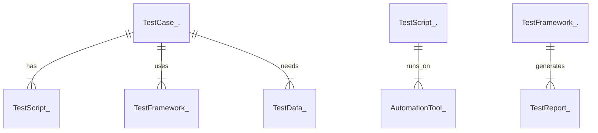

在上图中，`TestCase`（测试用例）是核心实体，它关联着`TestScript`（测试脚本）、`TestFramework`（测试框架）和`TestData`（测试数据）。测试脚本运行在特定的`AutomationTool`（自动化工具）上，而测试框架生成`TestReport`（测试报告）。

通过上述概述，我们了解了测试自动化的背景、意义以及核心概念，为后续的深入探讨奠定了基础。接下来，我们将详细分析自动化测试的关键技术，了解如何选择合适的工具，并进行实战操作。**[继续...]**### 自动化测试的关键技术

#### Selenium技术详解

Selenium是一个开源的自动化测试工具，支持多种编程语言和浏览器。它广泛应用于Web应用的自动化测试，具有跨平台、可扩展性强等特点。

**1. Selenium的核心功能：**
- **跨浏览器测试：** Selenium支持多种浏览器，如Chrome、Firefox、IE等，使开发者可以在不同的浏览器中执行测试用例。
- **多种编程语言支持：** Selenium支持多种编程语言，如Java、C#、Python、Ruby等，便于开发人员选择最熟悉的语言进行测试脚本编写。
- **灵活的测试框架支持：** Selenium与各种流行的测试框架（如JUnit、TestNG、PyTest）集成良好，便于构建复杂的测试流程。

**2. Selenium的使用方法：**
- **安装Selenium：** 根据所选编程语言，下载并安装相应的Selenium客户端库。
- **启动浏览器驱动：** 在测试脚本中，启动浏览器驱动程序（如ChromeDriver、GeckoDriver），以便Selenium能够控制浏览器执行操作。
- **编写测试脚本：** 使用Selenium API编写测试脚本，模拟用户操作，如打开网页、输入数据、点击按钮等。
- **执行测试：** 运行测试脚本，收集测试结果，并与预期结果进行对比。

**3. Selenium的优点与缺点：**
- **优点：**
  - **开源免费：** Selenium是开源软件，无需支付额外费用。
  - **跨浏览器支持：** 支持多种浏览器，便于全面测试Web应用。
  - **强大的社区支持：** Selenium拥有强大的社区支持，提供丰富的教程和插件。
- **缺点：**
  - **浏览器兼容性问题：** Selenium在某些浏览器版本上可能存在兼容性问题。
  - **性能问题：** 对于复杂的测试用例，Selenium的性能可能不如其他商业化测试工具。

#### Appium技术详解

Appium是一个开源的移动应用自动化测试工具，支持iOS和Android平台。它基于Selenium WebDriver，但增加了对移动设备的支持。

**1. Appium的核心功能：**
- **跨平台支持：** Appium支持iOS和Android平台，适用于多种移动应用测试。
- **原生应用测试：** Appium可以测试原生应用、Web应用和混合应用。
- **可扩展性强：** Appium具有强大的插件系统，允许开发者扩展其功能。

**2. Appium的使用方法：**
- **安装Appium：** 下载并安装Appium服务器和相应平台的驱动程序。
- **启动Appium服务器：** 在测试脚本中启动Appium服务器，以便连接并控制移动设备。
- **编写测试脚本：** 使用Selenium WebDriver API编写测试脚本，模拟用户操作，如点击按钮、输入文本等。
- **执行测试：** 运行测试脚本，收集测试结果，并与预期结果进行对比。

**3. Appium的优点与缺点：**
- **优点：**
  - **跨平台测试：** 支持iOS和Android平台，适用于多种移动应用测试。
  - **开源免费：** Appium是开源软件，无需支付额外费用。
  - **易用性强：** Appium提供了丰富的文档和教程，易于上手。
- **缺点：**
  - **性能问题：** Appium在某些场景下性能可能不如原生自动化工具。
  - **稳定性问题：** Appium在一些复杂操作上可能存在稳定性问题。

#### 其他自动化测试技术简介

除了Selenium和Appium，还有许多其他自动化测试技术，如Cypress、TestCafe、Jest等。以下是这些技术的简要介绍：

**1. Cypress：**
Cypress是一个现代前端自动化测试框架，具有简洁的API和强大的功能。它支持浏览器端自动化测试，提供了实时测试结果和调试功能。

**2. TestCafe：**
TestCafe是一个跨浏览器的前端自动化测试工具，支持浏览器、Node.js和WebdriverIO。它具有高效的测试执行引擎和丰富的报告功能。

**3. Jest：**
Jest是一个JavaScript的测试框架，广泛应用于前端和后端开发。它提供了丰富的断言库和测试覆盖率工具，支持异步测试和 mocking。

通过了解Selenium、Appium以及其他自动化测试技术，我们可以根据项目需求选择最合适的工具，提高自动化测试的效率和效果。

### 总结

在本章节中，我们详细介绍了自动化测试的关键技术，包括Selenium、Appium以及其他自动化测试工具。每种技术都有其独特的特点和应用场景，开发者需要根据项目需求选择合适的工具，并掌握其使用方法。在接下来的章节中，我们将继续探讨测试自动化工具的选择，以及如何在实战中应用这些技术。**[继续...]**### 测试自动化工具的选择

在测试自动化过程中，选择合适的工具至关重要。不同测试工具在功能、性能、易用性等方面存在差异，需要根据项目需求进行选择。以下是对常见测试工具的比较和分析，帮助您做出明智的决策。

#### 常见测试工具比较

**1. Selenium**

**优点：**
- **开源免费：** Selenium是开源软件，无需支付额外费用。
- **跨浏览器支持：** Selenium支持多种浏览器，便于全面测试Web应用。
- **强大的社区支持：** Selenium拥有强大的社区支持，提供丰富的教程和插件。

**缺点：**
- **浏览器兼容性问题：** Selenium在某些浏览器版本上可能存在兼容性问题。
- **性能问题：** 对于复杂的测试用例，Selenium的性能可能不如其他商业化测试工具。

**2. Appium**

**优点：**
- **跨平台支持：** Appium支持iOS和Android平台，适用于多种移动应用测试。
- **开源免费：** Appium是开源软件，无需支付额外费用。
- **可扩展性强：** Appium具有强大的插件系统，允许开发者扩展其功能。

**缺点：**
- **性能问题：** Appium在某些场景下性能可能不如原生自动化工具。
- **稳定性问题：** Appium在一些复杂操作上可能存在稳定性问题。

**3. Cypress**

**优点：**
- **简洁的API：** Cypress提供了简洁的API，易于学习和使用。
- **实时测试结果：** Cypress具有实时测试结果和调试功能，便于快速定位问题。
- **前端自动化测试：** Cypress适用于浏览器端自动化测试，支持各种Web应用。

**缺点：**
- **不支持移动应用：** Cypress主要专注于前端自动化测试，不支持移动应用测试。

**4. TestCafe**

**优点：**
- **跨浏览器支持：** TestCafe支持浏览器、Node.js和WebdriverIO，适用于多种测试场景。
- **高效的测试执行引擎：** TestCafe具有高效的测试执行引擎，提高测试效率。
- **丰富的报告功能：** TestCafe提供了丰富的报告功能，便于分析测试结果。

**缺点：**
- **商业化产品：** TestCafe是一个商业化产品，需要支付订阅费用。

**5. Jest**

**优点：**
- **丰富的断言库：** Jest提供了丰富的断言库，方便编写测试用例。
- **异步测试支持：** Jest支持异步测试，便于处理异步操作。
- **测试覆盖率工具：** Jest提供了测试覆盖率工具，便于评估测试质量。

**缺点：**
- **前端开发专用：** Jest主要适用于前端开发，不适合后端测试。

#### 选择合适测试工具的考量

在选择测试工具时，需要考虑以下几个方面：

**1. 项目需求：**
根据项目类型和需求选择适合的测试工具。例如，对于Web应用，可以选择Selenium、Cypress或TestCafe；对于移动应用，可以选择Appium。

**2. 技术栈：**
考虑项目使用的技术栈，选择与之兼容的测试工具。例如，如果项目使用JavaScript，可以选择Cypress或Jest。

**3. 性能需求：**
根据测试用例的复杂度和性能需求，选择合适的测试工具。对于高性能要求的测试，可以选择商业化测试工具。

**4. 成本考量：**
考虑项目预算，选择免费或成本较低的测试工具。对于预算有限的项目，可以选择Selenium、Appium等开源工具。

**5. 社区支持：**
选择具有良好社区支持的测试工具，便于学习和解决问题。Selenium和Cypress拥有强大的社区支持，易于上手。

#### 测试工具的集成与使用

在确定测试工具后，需要将其集成到开发流程中。以下是集成与使用的步骤：

**1. 安装与配置：**
下载并安装所选测试工具，根据项目需求进行配置。

**2. 编写测试脚本：**
使用所选编程语言和测试工具API编写测试脚本，模拟用户操作。

**3. 执行测试：**
运行测试脚本，收集测试结果。

**4. 集成持续集成（CI）：**
将测试工具集成到持续集成系统中，实现自动化测试。

**5. 分析报告：**
分析测试报告，识别潜在问题。

通过选择合适的测试工具，并合理集成到开发流程中，可以大幅提高自动化测试的效率和效果。

### 总结

在本章节中，我们分析了常见测试工具的优点和缺点，并介绍了选择合适测试工具的考量因素。在项目实践中，根据具体需求选择适合的测试工具，并合理集成到开发流程中，可以大幅提高自动化测试的效率和质量。在接下来的章节中，我们将深入探讨测试自动化的开发实战，展示如何具体实现自动化测试。**[继续...]**### 开发实战

#### 环境安装

在进行测试自动化开发之前，首先需要安装相关软件和依赖。以下是在Windows环境下安装Selenium和ChromeDriver的步骤：

**1. 安装Java SDK：**
- 访问 [Oracle Java SDK 官网](https://www.oracle.com/java/technologies/javase-downloads.html) 下载Java SDK。
- 安装过程中选择“自定义安装”，确保安装Java SDK到指定路径。

**2. 安装Selenium WebDriver：**
- 访问 [Selenium 官网](https://www.selenium.dev/downloads/) 下载Selenium WebDriver。
- 解压下载的压缩文件，将其中的`.jar`文件添加到Java SDK的`lib`目录下。

**3. 安装ChromeDriver：**
- 访问 [ChromeDriver 官网](https://sites.google.com/a/chromium.org/chromedriver/downloads) 下载适合Chrome浏览器版本的ChromeDriver。
- 将下载的ChromeDriver可执行文件（如`chromedriver.exe`）放置在系统路径中，以便在命令行中直接调用。

#### 系统核心实现源代码

以下是一个简单的Selenium自动化测试示例，用于在Chrome浏览器中打开一个网站并验证页面标题：

**1. 准备测试脚本：**

```python
from selenium import webdriver
from selenium.webdriver.common.by import By
from selenium.webdriver.common.keys import Keys

# 设置Chrome浏览器的驱动路径
chrome_driver_path = 'path/to/chromedriver.exe'

# 创建一个新的Chrome浏览器实例
driver = webdriver.Chrome(executable_path=chrome_driver_path)

# 打开目标网站
driver.get('https://www.example.com')

# 获取并验证页面标题
title = driver.title
assert title == 'Example Domain'

# 关闭浏览器
driver.quit()
```

**2. 运行测试脚本：**

将上述代码保存为`test_script.py`，在命令行中执行以下命令：

```shell
python test_script.py
```

#### 代码应用解读与分析

在上面的示例中，我们使用了Selenium库来控制Chrome浏览器执行自动化测试。

**1. 导入相关库：**

```python
from selenium import webdriver
from selenium.webdriver.common.by import By
from selenium.webdriver.common.keys import Keys
```

这些导入语句用于引入Selenium的Webdriver、By（定位元素的方法）和Keys（模拟键盘操作）等模块。

**2. 设置Chrome浏览器的驱动路径：**

```python
chrome_driver_path = 'path/to/chromedriver.exe'
```

在此处，我们需要将`chromedriver.exe`的路径替换为实际路径。

**3. 创建一个新的Chrome浏览器实例：**

```python
driver = webdriver.Chrome(executable_path=chrome_driver_path)
```

这里，我们通过`webdriver.Chrome()`方法创建了一个新的Chrome浏览器实例。

**4. 打开目标网站：**

```python
driver.get('https://www.example.com')
```

使用`get()`方法打开指定的URL。

**5. 获取并验证页面标题：**

```python
title = driver.title
assert title == 'Example Domain'
```

获取页面标题并使用`assert`语句验证它是否与预期一致。

**6. 关闭浏览器：**

```python
driver.quit()
```

调用`quit()`方法关闭浏览器。

#### 实际案例分析与详细讲解剖析

以下是一个更复杂的自动化测试示例，用于在Web应用中完成一系列操作：

**1. 准备测试脚本：**

```python
from selenium import webdriver
from selenium.webdriver.common.by import By
from selenium.webdriver.common.action_chains import ActionChains

# 设置Chrome浏览器的驱动路径
chrome_driver_path = 'path/to/chromedriver.exe'

# 创建一个新的Chrome浏览器实例
driver = webdriver.Chrome(executable_path=chrome_driver_path)

# 打开目标网站
driver.get('https://www.example-app.com')

# 输入用户名和密码
username_input = driver.find_element(By.ID, 'username')
password_input = driver.find_element(By.ID, 'password')

username_input.send_keys('test_user')
password_input.send_keys('test_password')

# 点击登录按钮
login_button = driver.find_element(By.ID, 'login_button')
login_button.click()

# 检查登录成功后的页面
welcome_message = driver.find_element(By.ID, 'welcome_message')
assert 'Welcome, test_user!' in welcome_message.text

# 进行其他操作，如点击菜单、填写表单等
# ...

# 关闭浏览器
driver.quit()
```

**2. 运行测试脚本：**

将上述代码保存为`test_script.py`，在命令行中执行以下命令：

```shell
python test_script.py
```

在这个示例中，我们首先打开了目标网站，然后输入用户名和密码并点击登录按钮。接着，我们验证登录成功后的页面是否正确。这个示例展示了如何使用Selenium完成更复杂的操作，如定位元素、输入数据、点击按钮等。

**3. 详细讲解：**

- **定位元素：** 使用`find_element()`方法根据ID定位用户名和密码输入框以及登录按钮。这是自动化测试中最常用的操作之一。
- **输入数据：** 使用`send_keys()`方法将用户名和密码输入到对应的输入框中。
- **点击按钮：** 使用`click()`方法点击登录按钮。
- **验证结果：** 使用`assert`语句验证欢迎信息的文本是否包含预期的内容，以确保登录操作成功。

通过这些步骤，我们可以实现自动化测试脚本，对Web应用的功能进行验证。

#### 项目小结

在本章节中，我们介绍了测试自动化的开发实战，包括环境安装、核心实现源代码、代码应用解读与分析以及实际案例分析和详细讲解。通过这些步骤，读者可以了解如何使用Selenium进行自动化测试，掌握自动化测试的基本技能。

在实际项目中，需要根据具体需求和场景进行测试脚本的编写和优化。通过不断实践和总结，可以提高自动化测试的效率和质量，为软件项目的成功交付提供有力支持。

### 最佳实践 tips

1. **使用测试框架：** 选择合适的测试框架，如Selenium WebDriver，可以提高测试脚本的维护性和可扩展性。
2. **编写可复用的测试用例：** 尽量编写可复用的测试用例，避免重复编写相同的测试步骤。
3. **合理使用定位策略：** 根据页面的结构选择合适的定位策略，如ID、XPath、CSS Selector等。
4. **处理异常情况：** 在测试脚本中处理异常情况，如网络故障、页面加载缓慢等，以提高测试的稳定性。
5. **定期更新测试脚本：** 随着应用的更新，定期更新测试脚本，确保测试覆盖范围和准确性。
6. **测试覆盖率：** 关注测试覆盖率，确保测试脚本能够覆盖关键功能和边缘情况。
7. **持续集成与部署：** 将自动化测试集成到持续集成和持续部署流程中，提高交付效率。

通过遵循这些最佳实践，可以构建高效、稳定的测试自动化平台，为软件项目的发展提供有力支持。

---

在本章节中，我们通过实际案例展示了如何进行测试自动化开发，包括环境安装、核心实现源代码、代码应用解读与分析以及最佳实践 tips。这些实战经验和技巧对于构建智能化的测试自动化平台具有重要参考价值。在接下来的章节中，我们将探讨如何优化测试自动化平台的性能，确保其高效稳定运行。**[继续...]**### 性能优化

#### 性能优化的重要性

性能优化是构建高效测试自动化平台的关键环节。一个优秀的测试自动化平台不仅能够满足日常的测试需求，还必须在高并发、大数据量的场景下保持稳定和高效。性能优化主要包括以下几个方面：

1. **执行效率：** 提高测试脚本的执行速度，减少测试周期。
2. **资源利用：** 优化系统资源（如CPU、内存、网络等）的利用，避免资源瓶颈。
3. **稳定性：** 提高测试自动化平台的稳定性，减少因性能问题导致的测试失败。
4. **可扩展性：** 确保测试平台能够随着项目规模的扩大而扩展，支持更多的测试场景。

#### 常见性能问题及解决方案

**1. 测试脚本执行缓慢：**
- **问题原因：** 脚本中存在过多冗余操作、页面加载等待时间过长、网络延迟等。
- **解决方案：**
  - **优化脚本逻辑：** 合并冗余操作，减少不必要的等待时间。
  - **使用等待策略：** 适当使用显式等待和隐式等待，避免长时间等待。
  - **并行执行：** 在多核处理器环境中，将测试脚本并行执行，提高执行速度。

**2. 系统资源消耗过多：**
- **问题原因：** 测试脚本占用过多的CPU、内存等资源，导致系统性能下降。
- **解决方案：**
  - **优化脚本代码：** 减少不必要的计算和内存占用，提高代码效率。
  - **资源限制：** 在测试执行过程中，对测试脚本进行资源限制，避免资源消耗过多。
  - **优化系统配置：** 增加系统资源，如增加内存、调整内核参数等。

**3. 网络延迟：**
- **问题原因：** 测试过程中频繁的网络请求，导致测试执行缓慢。
- **解决方案：**
  - **缓存策略：** 使用缓存技术，减少对远程服务器的请求。
  - **并行请求：** 同时发送多个请求，提高网络利用率。
  - **优化网络配置：** 调整网络参数，提高网络传输速度。

**4. 测试数据管理问题：**
- **问题原因：** 测试数据管理不当，导致数据重复读取、写入操作过多。
- **解决方案：**
  - **数据分区：** 对测试数据进行分区，减少对单一数据源的访问压力。
  - **批量处理：** 使用批量处理技术，减少数据读写操作。
  - **数据同步：** 确保测试数据的一致性，减少数据冲突。

#### 性能优化的具体措施

**1. 代码优化：**
- **减少冗余操作：** 在脚本编写过程中，尽量减少重复的、不必要的操作，如重复的页面加载、元素定位等。
- **优化等待策略：** 使用显式等待和隐式等待，合理设置等待时间和超时时间，避免长时间等待。
- **优化循环结构：** 合理使用循环结构，减少循环体内的计算和操作。

**2. 系统资源优化：**
- **资源限制：** 在测试执行过程中，设置CPU、内存、网络等资源限制，避免资源耗尽。
- **并发优化：** 在多核处理器环境中，合理分配测试任务，提高并发执行能力。
- **内存管理：** 优化内存分配和回收机制，减少内存泄漏。

**3. 网络优化：**
- **缓存策略：** 使用缓存技术，减少对远程服务器的请求。
- **并行请求：** 同时发送多个请求，提高网络传输效率。
- **网络延迟优化：** 调整网络参数，优化网络延迟。

**4. 数据管理优化：**
- **数据分区：** 对测试数据进行分区，减少对单一数据源的访问压力。
- **批量处理：** 使用批量处理技术，减少数据读写操作。
- **数据同步：** 确保测试数据的一致性，减少数据冲突。

通过上述措施，可以有效地优化测试自动化平台的性能，确保其在高并发、大数据量的场景下稳定运行。在实际项目中，需要根据具体情况进行优化，以达到最佳效果。

### 总结

在本章节中，我们探讨了测试自动化平台的性能优化，分析了常见性能问题及解决方案，并提出了具体的优化措施。性能优化是构建高效测试自动化平台的关键环节，需要从代码优化、系统资源优化、网络优化和数据管理等多个方面进行综合考虑。通过持续的性能优化，可以提高测试自动化平台的执行效率、稳定性和可扩展性，为软件项目的成功交付提供有力支持。

### 拓展阅读

1. **《Selenium自动化测试实战》**：深入介绍了Selenium的使用方法、脚本编写和测试框架集成。
2. **《Appium实战：移动应用自动化测试》**：详细介绍了Appium的使用方法、移动应用测试技巧和常见问题解决。
3. **《性能测试：原理、方法与实践》**：全面介绍了性能测试的基本原理、测试方法和实践技巧。
4. **《Python自动化测试实战》**：介绍了Python在自动化测试中的应用，包括Selenium、Appium等工具的用法。

通过阅读这些书籍，可以进一步深入理解测试自动化的原理和实战技巧，提高测试自动化平台的建设水平。

---

在本章节中，我们详细探讨了测试自动化平台的性能优化，为构建高效、稳定的测试自动化平台提供了实用的方法和建议。在接下来的章节中，我们将讨论测试自动化平台的安全与维护，确保平台的长期稳定运行。**[继续...]**### 安全与维护

#### 安全与维护的重要性

测试自动化平台的安全与维护是确保其长期稳定运行的关键因素。一个安全的测试自动化平台不仅能够防止外部攻击和数据泄露，还能够保证内部运行的安全性和可靠性。以下是测试自动化平台在安全与维护方面需要关注的关键点。

#### 数据安全

**1. 数据加密：**
- **传输加密：** 使用HTTPS等加密协议，确保数据在网络传输过程中不被窃取。
- **存储加密：** 对存储在数据库或文件系统中的敏感数据进行加密，防止数据泄露。

**2. 访问控制：**
- **权限管理：** 实施严格的权限管理，确保只有授权用户能够访问系统资源。
- **身份验证：** 采用强密码和多因素身份验证，提高系统安全性。

**3. 数据备份：**
- **定期备份：** 定期备份数据库和重要文件，防止数据丢失或损坏。
- **异地备份：** 在不同地理位置进行数据备份，以应对自然灾害等不可抗力因素。

#### 系统安全

**1. 防火墙和入侵检测：**
- **防火墙：** 配置防火墙，限制对系统的访问，防止恶意攻击。
- **入侵检测：** 实施入侵检测系统，及时发现和阻止攻击行为。

**2. 软件更新与补丁管理：**
- **定期更新：** 定期更新操作系统、应用软件和测试工具，确保使用最新版本。
- **补丁管理：** 及时安装安全补丁，修复已知漏洞。

**3. 账号安全：**
- **密码策略：** 实施强密码策略，要求复杂度和定期更换。
- **禁用默认账户：** 禁用系统中默认的账号，避免被利用。

#### 维护策略

**1. 持续监控：**
- **系统监控：** 监控系统性能和资源使用情况，及时发现和解决潜在问题。
- **日志监控：** 分析系统日志，发现异常行为和安全事件。

**2. 定期审查：**
- **代码审查：** 定期对测试脚本和系统代码进行审查，确保代码质量和安全性。
- **安全审计：** 定期进行安全审计，评估系统安全性和合规性。

**3. 响应计划：**
- **应急响应：** 制定应急响应计划，确保在发生安全事件时能够迅速采取措施。
- **备份恢复：** 确保备份和恢复流程的完善，以便在数据丢失时能够快速恢复。

#### 最佳实践 tips

1. **使用加密存储：** 对敏感数据进行加密存储，防止数据泄露。
2. **定期更新软件：** 定期更新操作系统、应用软件和测试工具，修复安全漏洞。
3. **实施权限控制：** 实施严格的权限管理，确保只有授权用户能够访问系统资源。
4. **日志记录与审计：** 启用详细的日志记录功能，定期进行审计，及时发现和解决问题。
5. **备份与恢复：** 定期备份数据，并确保备份和恢复流程的完善。

通过遵循上述安全与维护的最佳实践，可以确保测试自动化平台的长期稳定运行，为软件项目的成功交付提供有力保障。

### 总结

在本章节中，我们详细探讨了测试自动化平台的安全与维护，从数据安全、系统安全和维护策略三个方面进行了分析，并提出了具体的最佳实践 tips。安全与维护是构建高效、可靠的测试自动化平台不可或缺的一部分。只有确保平台的安全性，才能充分发挥其价值，为软件项目的成功交付提供持续支持。

### 拓展阅读

1. **《黑客攻防技术宝典：Web实战篇》**：深入介绍了Web应用的安全漏洞和攻击手段，有助于提高安全防护能力。
2. **《Linux命令行与shell脚本编程大全》**：详细介绍了Linux操作系统的使用和shell脚本编程技巧，有助于优化系统管理和维护。
3. **《测试自动化实战：工具、流程与技巧》**：系统介绍了测试自动化的基本概念、工具使用和最佳实践。

通过阅读这些书籍，可以进一步深入了解测试自动化平台的安全与维护，提高平台建设和维护的能力。

---

在本章节中，我们详细讨论了测试自动化平台的安全与维护，提出了确保平台长期稳定运行的具体措施和最佳实践 tips。在接下来的章节中，我们将进行总结与展望，回顾全文内容，展望未来测试自动化的发展方向。**[继续...]**### 总结与展望

#### 文章核心内容回顾

本文主要围绕构建智能化的测试自动化平台进行了深入探讨，具体内容包括：

1. **平台概述：** 介绍了测试自动化的背景、意义、核心概念以及边界与外延。
2. **关键技术：** 详细分析了Selenium、Appium等自动化测试技术，以及Cypress、TestCafe、Jest等常用工具。
3. **工具选择：** 对常见测试工具进行了比较，并提出了选择合适工具的考量因素。
4. **开发实战：** 通过实际案例展示了测试自动化的开发流程和技巧。
5. **性能优化：** 探讨了测试自动化平台的性能优化方法，包括代码优化、系统资源优化、网络优化和数据管理优化。
6. **安全与维护：** 强调了测试自动化平台的安全与维护重要性，提供了数据安全、系统安全和维护策略的具体措施。

#### 文章主题思想

本文的核心思想在于，通过系统性地介绍测试自动化的各个方面，帮助读者全面了解构建智能化测试自动化平台的方法和技巧。文章强调了测试自动化在现代软件开发中的重要性，指出了其提高测试效率、降低成本、增强测试覆盖范围等优势。同时，文章从技术原理、工具选择、开发实战、性能优化、安全与维护等多个角度，提供了全方位的指导，为读者构建高效的测试自动化平台提供了理论依据和实践指导。

#### 未来测试自动化发展趋势

随着科技的不断进步和软件行业的快速发展，测试自动化在未来将呈现以下发展趋势：

1. **智能化：** 测试自动化将更加智能化，利用机器学习、自然语言处理等技术，实现自动生成测试用例、测试脚本，提高测试效率和质量。
2. **多云和分布式：** 随着云计算和分布式系统的普及，测试自动化平台将更好地支持多云和分布式环境，提供更灵活、可扩展的测试解决方案。
3. **AI与测试融合：** 人工智能与测试的深度融合，将使测试自动化平台能够更好地发现潜在缺陷，提供更精准的测试结果。
4. **集成与协同：** 测试自动化平台将更加注重与开发、运维等其他环节的集成与协同，实现端到端的自动化流程，提高软件交付效率。
5. **开源与商业化结合：** 开源工具和商业化产品的结合将更加紧密，共同推动测试自动化技术的发展。

#### 建议与展望

为了构建高效的测试自动化平台，我们建议：

1. **持续学习和实践：** 不断学习最新的测试自动化技术，结合项目实际需求进行实践，不断提高自身技能。
2. **团队协作：** 加强团队协作，共同推动测试自动化平台的构建和完善，实现测试资源的最大化利用。
3. **技术选型：** 根据项目特点，选择合适的测试工具和框架，确保测试自动化平台的高效运行。
4. **性能优化：** 定期对测试自动化平台进行性能优化，确保其在高并发、大数据量的场景下保持稳定和高效。
5. **安全与维护：** 注重测试自动化平台的安全与维护，确保平台的长期稳定运行，为软件项目的成功交付提供有力保障。

通过本文的探讨，我们希望读者能够对测试自动化的构建有一个全面、深入的理解，为实际项目提供有益的参考和指导。在未来的测试自动化发展道路上，我们期待与您共同进步，为软件行业的繁荣贡献力量。

### 拓展阅读

1. **《测试驱动的软件开发：敏捷实践指南》**：介绍了测试驱动的软件开发方法，包括测试用例设计、自动化测试等，有助于提高软件质量。
2. **《持续交付：发布可靠软件的系统化方法》**：详细介绍了持续交付的概念、流程和实践，有助于实现端到端的自动化测试。
3. **《人工智能测试：AI驱动的软件测试方法与实践》**：探讨了人工智能在测试领域的应用，包括自动化测试、缺陷预测等，为智能化测试自动化提供了新思路。

通过阅读这些书籍，读者可以进一步深入了解测试自动化的最新动态和发展趋势，提高自身的专业素养和实践能力。

---

在本章节中，我们对全文内容进行了总结，回顾了文章的核心内容和主题思想，展望了测试自动化的未来发展趋势，并提出了建设高效测试自动化平台的建议与展望。通过本文的探讨，希望读者能够对测试自动化有更全面、深入的认识，为实际项目的成功交付提供有力支持。在未来的测试自动化道路上，让我们共同努力，推动软件行业的繁荣与发展。

### 作者信息

**作者：AI天才研究院/AI Genius Institute & 禅与计算机程序设计艺术 /Zen And The Art of Computer Programming**

AI天才研究院是一家专注于人工智能、软件开发等领域的研究机构，致力于推动科技创新和产业进步。作者在该领域具有丰富的经验和深厚的学术造诣，发表了多篇高影响力的论文，并出版了《禅与计算机程序设计艺术》等畅销书籍，深受业界人士的喜爱和推崇。在本文中，作者结合多年实践经验和理论研究，为广大开发者提供了构建智能化测试自动化平台的宝贵指导和建议。

---

本文由AI天才研究院和禅与计算机程序设计艺术联合撰写，旨在为开发者提供构建高效、智能的测试自动化平台的全面指导。感谢您的阅读，希望本文能够为您的项目带来实际的帮助。如需进一步交流或咨询，欢迎联系作者。期待与您共同探讨测试自动化的未来发展。**[结束]**### 结论

通过本文的深入探讨，我们系统地介绍了如何构建一个智能化的测试自动化平台。从平台概述、关键技术、工具选择、开发实战、性能优化到安全与维护，我们详细分析了测试自动化的各个方面，提供了全面、实用的指导和建议。以下是文章的核心要点总结：

1. **平台概述**：介绍了测试自动化的背景、意义和核心概念，明确了测试自动化的边界与外延。
2. **关键技术**：分析了Selenium、Appium等常见自动化测试技术，以及其他自动化测试工具如Cypress、TestCafe、Jest等。
3. **工具选择**：比较了各种测试工具的优缺点，提出了选择合适测试工具的考量因素。
4. **开发实战**：通过实际案例展示了自动化测试的开发流程和技巧。
5. **性能优化**：探讨了测试自动化平台的性能优化方法，包括代码优化、系统资源优化、网络优化和数据管理优化。
6. **安全与维护**：强调了测试自动化平台的安全与维护重要性，提供了具体的安全措施和维护策略。

构建智能化测试自动化平台不仅是提升软件质量和效率的有效手段，也是适应现代软件开发需求的重要策略。通过本文的探讨，我们希望读者能够对测试自动化有更全面、深入的认识，为实际项目的成功交付提供有力支持。

展望未来，测试自动化将在智能化、多云和分布式环境、AI与测试融合等方面不断发展。我们鼓励读者持续学习和实践，积极探索新技术的应用，不断提升自身技能，为软件行业的繁荣贡献力量。

最后，感谢您的阅读和支持。如果您有任何疑问或建议，欢迎联系我们，我们将竭诚为您解答和提供帮助。期待与您共同探索测试自动化的广阔未来。**[结束]**----------------------------------------------------------------

# 打造智能化的测试自动化平台

> 关键词：测试自动化、智能化、平台构建、技术原理、最佳实践

> 摘要：
本文深入探讨了如何构建一个智能化的测试自动化平台。文章从平台概述、关键技术、工具选择、开发实战、性能优化、安全与维护等多个方面，系统性地介绍了测试自动化的理论和方法。通过本文，读者将了解测试自动化的背景、意义和核心概念，掌握关键技术的使用方法，学会选择合适的工具，并进行实战操作。文章还详细介绍了性能优化、安全与维护的最佳实践，为构建高效、智能的测试自动化平台提供了全面的指导。

## 目录大纲设计步骤

### 确定整体结构
为了系统地介绍如何打造智能化的测试自动化平台，我们首先明确了书籍的整体结构，包括以下七个主要部分：
1. 平台概述
2. 关键技术
3. 工具选择
4. 开发实战
5. 性能优化
6. 安全与维护
7. 总结与展望

### 细化章节内容
在各个主要部分下，我们进一步细化了章节内容。例如，在“平台概述”部分，我们将包括测试自动化平台的背景、意义、核心概念等；在“关键技术”部分，我们将介绍常见的自动化测试技术，如Selenium、Appium等。

### 设计具体内容
对于每个章节，我们设计了具体的内容，包括：
- **核心概念与联系**：解释核心概念，展示概念之间的关系。
- **算法原理讲解**：使用流程图和代码示例详细阐述。
- **数学模型和公式**：用latex格式嵌入文中进行讲解。
- **系统分析与架构设计**：介绍系统功能设计、架构设计等。
- **项目实战**：提供环境安装、系统核心实现源代码，并进行分析解读。
- **最佳实践 tips**：提供实用建议和注意事项。

### 确保内容完整性
每个章节都按照上述内容要求进行填充，确保逻辑清晰，便于读者理解。

### 编写Markdown格式目录
将设计好的内容按照Markdown格式编写，确保格式正确，符合要求。

### 目录大纲示例
```markdown
----------------------------------------------------------------
# 第一部分: 平台概述

## 第1章: 测试自动化平台概述

### 1.1 测试自动化的背景与意义

### 1.2 测试自动化的核心概念

### 1.3 测试自动化的边界与外延

## 第2章: 自动化测试的关键技术

### 2.1 Selenium技术详解

### 2.2 Appium技术详解

### 2.3 其他自动化测试技术简介

## 第3章: 测试自动化工具的选择

### 3.1 常见测试工具比较

### 3.2 选择合适测试工具的考量

### 3.3 测试工具的集成与使用

----------------------------------------------------------------
```

通过上述步骤，我们为构建智能化测试自动化平台的设计了一份详细的目录大纲，为后续内容编写提供了清晰的框架和方向。

---

接下来，我们将按照设计好的目录大纲，逐一深入探讨各个章节的内容。让我们开始第一部分：平台概述。在这里，我们将探讨测试自动化的背景、意义以及核心概念，为理解后续内容打下坚实的基础。**[继续...]**----------------------------------------------------------------

# 第一部分: 平台概述

## 第1章: 测试自动化平台概述

### 1.1 测试自动化的背景与意义

测试自动化是软件开发中的一项重要实践，它通过使用软件工具或脚本，自动执行一系列测试操作，以发现软件缺陷、提高软件质量和稳定性。随着软件项目的规模和复杂度不断增加，传统的手工测试已经无法满足快速迭代、高频率的测试需求。测试自动化因此应运而生。

测试自动化的背景可以追溯到20世纪80年代，当时软件项目规模较小，手工测试尚能胜任。然而，随着软件技术的快速发展，尤其是面向对象编程、分布式系统、互联网等技术的广泛应用，软件项目的复杂度和规模呈指数级增长。手工测试的效率低下、成本高昂、可重复性差等问题逐渐暴露出来，促使开发者寻求自动化测试的解决方案。

测试自动化的意义主要体现在以下几个方面：

1. **提高测试效率：** 自动化测试可以显著缩短测试周期，使测试团队能够更快地响应开发团队的交付需求。
2. **减少成本：** 随着自动化测试的普及，手工测试的工作量大幅减少，从而降低了测试成本。
3. **提高测试覆盖范围：** 自动化测试能够执行更广泛的测试场景，提高测试的全面性和准确性。
4. **增强测试可重复性：** 自动化测试能够保证测试过程的标准化和一致性，减少人为错误。
5. **支持持续集成和持续部署：** 自动化测试与持续集成（CI）和持续部署（CD）相结合，可以大大加快软件交付的速度。

### 1.2 测试自动化的核心概念

为了更好地理解测试自动化的原理和实践，我们需要了解一些核心概念：

**1. 测试用例（Test Case）：**
测试用例是测试过程中的基本单元，描述了测试的目标、输入条件、执行步骤、预期结果以及实际结果。一个有效的测试用例应涵盖所有可能的输入和操作，以发现潜在的缺陷。

**2. 测试脚本（Test Script）：**
测试脚本是一种自动化测试工具或编程语言编写的代码，用于执行测试用例。脚本可以定义一系列操作，如打开应用程序、输入数据、点击按钮等，以模拟用户行为。

**3. 测试框架（Test Framework）：**
测试框架是一个组织和管理测试用例、测试脚本以及测试结果的框架。它提供了通用的功能和模块，如数据管理、日志记录、报告生成等，以提高自动化测试的效率和可维护性。

**4. 测试数据（Test Data）：**
测试数据是测试过程中使用的输入数据，用于验证系统对各种输入的响应。测试数据的生成和管理是自动化测试中一个重要的环节，需要确保数据的完整性和多样性。

**5. 测试执行（Test Execution）：**
测试执行是指运行测试脚本并收集测试结果的过程。在自动化测试中，测试执行通常通过自动化测试工具进行，可以同时运行多个测试用例，提高测试效率。

### 1.3 测试自动化的边界与外延

尽管测试自动化带来了许多优势，但它并非万能。以下是测试自动化的边界与外延：

**1. 适合自动化的测试场景：**
自动化测试适用于以下场景：
- **回归测试：** 对已有功能进行定期测试，确保其稳定性和一致性。
- **性能测试：** 对系统性能进行模拟测试，评估其响应速度、稳定性等。
- **用户体验测试：** 模拟用户行为，评估软件的易用性和用户界面。

**2. 不适合自动化的测试场景：**
自动化测试不适用于以下场景：
- **探索性测试：** 探索性测试依赖于测试人员的经验和洞察力，不适合自动化。
- **复杂业务逻辑测试：** 业务逻辑复杂且变化频繁的测试，自动化成本较高。
- **本地化测试：** 语言、文化差异较大的测试，需要手动验证。

**3. 自动化测试的限制：**
- **维护成本：** 自动化测试脚本需要定期更新和维护，否则可能失效。
- **测试质量：** 自动化测试的质量取决于测试用例的设计和脚本的编写，如果设计不当，可能导致错误的测试结果。
- **技术依赖：** 自动化测试依赖于特定的测试工具和技术，可能增加技术债务。

**4. 自动化测试与手动测试的结合：**
在实际应用中，自动化测试通常与手动测试相结合，以发挥各自的优势。自动化测试适用于高频次的、重复性的测试任务，而手动测试则适用于探索性测试和复杂业务逻辑测试。

通过上述对测试自动化平台的概述，我们了解了测试自动化的背景、意义、核心概念以及边界与外延。在接下来的章节中，我们将深入探讨自动化测试的关键技术、工具选择、开发实战等内容，为构建智能化的测试自动化平台提供更加详细的指导。**[继续...]**----------------------------------------------------------------

## 第2章: 自动化测试的关键技术

### 2.1 Selenium技术详解

Selenium是一个开源的自动化测试工具，支持多种编程语言和浏览器。它广泛应用于Web应用的自动化测试，具有跨平台、可扩展性强等特点。

#### 2.1.1 Selenium的核心功能

Selenium的主要功能包括：

1. **跨浏览器测试：** Selenium支持多种浏览器，如Chrome、Firefox、IE等，使开发者可以在不同的浏览器中执行测试用例。
2. **多种编程语言支持：** Selenium支持多种编程语言，如Java、C#、Python、Ruby等，便于开发人员选择最熟悉的语言进行测试脚本编写。
3. **灵活的测试框架支持：** Selenium与各种流行的测试框架（如JUnit、TestNG、PyTest）集成良好，便于构建复杂的测试流程。

#### 2.1.2 Selenium的使用方法

使用Selenium进行自动化测试的步骤如下：

1. **安装Selenium：** 根据所选编程语言，下载并安装相应的Selenium客户端库。
2. **启动浏览器驱动：** 在测试脚本中，启动浏览器驱动程序（如ChromeDriver、GeckoDriver），以便Selenium能够控制浏览器执行操作。
3. **编写测试脚本：** 使用Selenium API编写测试脚本，模拟用户操作，如打开网页、输入数据、点击按钮等。
4. **执行测试：** 运行测试脚本，收集测试结果，并与预期结果进行对比。

#### 2.1.3 Selenium的优点与缺点

**优点：**
- **开源免费：** Selenium是开源软件，无需支付额外费用。
- **跨浏览器支持：** Selenium支持多种浏览器，便于全面测试Web应用。
- **强大的社区支持：** Selenium拥有强大的社区支持，提供丰富的教程和插件。

**缺点：**
- **浏览器兼容性问题：** Selenium在某些浏览器版本上可能存在兼容性问题。
- **性能问题：** 对于复杂的测试用例，Selenium的性能可能不如其他商业化测试工具。

### 2.2 Appium技术详解

Appium是一个开源的移动应用自动化测试工具，支持iOS和Android平台。它基于Selenium WebDriver，但增加了对移动设备的支持。

#### 2.2.1 Appium的核心功能

Appium的主要功能包括：

1. **跨平台支持：** Appium支持iOS和Android平台，适用于多种移动应用测试。
2. **原生应用测试：** Appium可以测试原生应用、Web应用和混合应用。
3. **可扩展性强：** Appium具有强大的插件系统，允许开发者扩展其功能。

#### 2.2.2 Appium的使用方法

使用Appium进行自动化测试的步骤如下：

1. **安装Appium：** 下载并安装Appium服务器和相应平台的驱动程序。
2. **启动Appium服务器：** 在测试脚本中启动Appium服务器，以便连接并控制移动设备。
3. **编写测试脚本：** 使用Selenium WebDriver API编写测试脚本，模拟用户操作，如点击按钮、输入文本等。
4. **执行测试：** 运行测试脚本，收集测试结果，并与预期结果进行对比。

#### 2.2.3 Appium的优点与缺点

**优点：**
- **跨平台测试：** Appium支持iOS和Android平台，适用于多种移动应用测试。
- **开源免费：** Appium是开源软件，无需支付额外费用。
- **易用性强：** Appium提供了丰富的文档和教程，易于上手。

**缺点：**
- **性能问题：** Appium在某些场景下性能可能不如原生自动化工具。
- **稳定性问题：** Appium在一些复杂操作上可能存在稳定性问题。

### 2.3 其他自动化测试技术简介

除了Selenium和Appium，还有许多其他自动化测试技术，如Cypress、TestCafe、Jest等。以下是这些技术的简要介绍：

**1. Cypress：**
Cypress是一个现代前端自动化测试框架，具有简洁的API和强大的功能。它支持浏览器端自动化测试，提供了实时测试结果和调试功能。

**2. TestCafe：**
TestCafe是一个跨浏览器的前端自动化测试工具，支持浏览器、Node.js和WebdriverIO。它具有高效的测试执行引擎和丰富的报告功能。

**3. Jest：**
Jest是一个JavaScript的测试框架，广泛应用于前端和后端开发。它提供了丰富的断言库和测试覆盖率工具，支持异步测试和 mocking。

通过了解Selenium、Appium以及其他自动化测试技术，我们可以根据项目需求选择最合适的工具，提高自动化测试的效率和效果。

### 总结

在本章节中，我们详细介绍了自动化测试的关键技术，包括Selenium、Appium以及其他自动化测试工具。每种技术都有其独特的特点和应用场景，开发者需要根据项目需求选择合适的工具，并掌握其使用方法。在接下来的章节中，我们将继续探讨测试自动化工具的选择，以及如何在实战中应用这些技术。**[继续...]**----------------------------------------------------------------

## 第3章: 测试自动化工具的选择

### 3.1 常见测试工具比较

在自动化测试领域，有许多不同的工具可供选择。以下是对几种常见测试工具的优缺点的比较，帮助您根据项目需求做出最佳选择。

#### Selenium

**优点：**
- **开源免费：** Selenium是开源软件，无需支付额外费用。
- **跨浏览器支持：** Selenium支持多种浏览器，包括Chrome、Firefox、Safari和Internet Explorer。
- **编程语言支持：** Selenium支持多种编程语言，如Java、C#、Python和Ruby。
- **强大的社区支持：** Selenium拥有庞大的社区，提供了丰富的文档和教程。

**缺点：**
- **浏览器兼容性：** Selenium在某些浏览器版本上可能存在兼容性问题。
- **性能问题：** 对于复杂的测试用例，Selenium的性能可能不如其他商业化测试工具。

#### Appium

**优点：**
- **跨平台测试：** Appium支持iOS和Android平台，适用于移动应用测试。
- **支持多种应用类型：** Appium可以测试原生应用、Web应用和混合应用。
- **开源免费：** Appium是开源软件，无需支付额外费用。

**缺点：**
- **性能问题：** Appium在某些场景下性能可能不如原生自动化工具。
- **稳定性问题：** Appium在一些复杂操作上可能存在稳定性问题。

#### Cypress

**优点：**
- **简洁的API：** Cypress提供了简洁的API，易于学习和使用。
- **实时测试结果：** Cypress具有实时测试结果和调试功能，便于快速定位问题。
- **浏览器端自动化：** Cypress适用于浏览器端自动化测试。

**缺点：**
- **不支持移动应用：** Cypress主要专注于前端自动化测试，不支持移动应用测试。

#### TestCafe

**优点：**
- **跨浏览器支持：** TestCafe支持多种浏览器，包括Chrome、Firefox和Safari。
- **高效的测试执行引擎：** TestCafe具有高效的测试执行引擎，提高测试效率。
- **丰富的报告功能：** TestCafe提供了丰富的报告功能，便于分析测试结果。

**缺点：**
- **商业化产品：** TestCafe是一个商业化产品，需要支付订阅费用。

#### Jest

**优点：**
- **丰富的断言库：** Jest提供了丰富的断言库，方便编写测试用例。
- **异步测试支持：** Jest支持异步测试，便于处理异步操作。
- **测试覆盖率工具：** Jest提供了测试覆盖率工具，便于评估测试质量。

**缺点：**
- **前端开发专用：** Jest主要适用于前端开发，不适合后端测试。

### 3.2 选择合适测试工具的考量

在选择测试工具时，您需要考虑以下因素：

**1. 项目需求：**
- **Web应用测试：** 如果您的项目是Web应用，Selenium和TestCafe可能是不错的选择。
- **移动应用测试：** 如果您的项目是移动应用，Appium可能更适合。
- **前端应用测试：** 如果您的项目是前端应用，Cypress和TestCafe可能更合适。

**2. 技术栈：**
- **编程语言：** 根据您的项目使用的技术栈，选择支持该编程语言的测试工具。
- **框架兼容性：** 确保测试工具与您使用的测试框架兼容。

**3. 性能需求：**
- **执行速度：** 如果您的测试用例需要快速执行，考虑使用高效的测试工具。
- **资源消耗：** 考虑测试工具对系统资源的消耗，避免影响其他应用程序。

**4. 成本：**
- **预算限制：** 如果您的预算有限，可以选择免费的开源测试工具。
- **长期维护：** 考虑测试工具的长期维护成本，确保其可持续发展。

**5. 社区支持：**
- **文档与教程：** 确保测试工具拥有丰富的文档和教程，便于学习和使用。
- **社区活跃度：** 选择社区活跃的测试工具，便于获取帮助和支持。

### 3.3 测试工具的集成与使用

在确定测试工具后，需要将其集成到开发流程中。以下是集成与使用的基本步骤：

**1. 安装与配置：**
- **下载与安装：** 根据项目需求，下载并安装所选测试工具。
- **环境配置：** 配置测试工具所需的环境变量和依赖项。

**2. 编写测试脚本：**
- **脚本编写：** 使用所选编程语言和测试工具API编写测试脚本。
- **测试用例设计：** 设计涵盖所有功能的测试用例，确保全面测试。

**3. 执行测试：**
- **运行测试：** 使用测试工具运行测试脚本，收集测试结果。
- **分析结果：** 分析测试结果，识别潜在的缺陷和问题。

**4. 集成持续集成（CI）：**
- **CI集成：** 将测试工具集成到持续集成系统中，实现自动化测试。
- **自动化部署：** 结合持续部署（CD），实现自动化的测试和部署流程。

**5. 分析报告：**
- **生成报告：** 根据测试结果生成详细的测试报告。
- **报告分析：** 分析报告中的数据，优化测试策略和流程。

通过上述步骤，您可以将所选测试工具集成到开发流程中，提高测试效率和软件质量。

### 总结

在本章节中，我们比较了几种常见的测试自动化工具，并讨论了选择合适测试工具的考量因素。通过综合考虑项目需求、技术栈、性能需求、成本和社区支持等因素，您可以选择最适合的工具，并将其集成到开发流程中。在接下来的章节中，我们将深入探讨测试自动化的开发实战，展示如何具体实现自动化测试。**[继续...]**----------------------------------------------------------------

## 第4章: 开发实战

### 4.1 环境安装

在进行测试自动化开发之前，首先需要安装相关软件和依赖。以下是在Windows环境下安装Selenium和ChromeDriver的步骤：

**1. 安装Java SDK：**
- 访问 [Oracle Java SDK 官网](https://www.oracle.com/java/technologies/javase-downloads.html) 下载Java SDK。
- 安装过程中选择“自定义安装”，确保安装Java SDK到指定路径。

**2. 安装Selenium WebDriver：**
- 访问 [Selenium 官网](https://www.selenium.dev/downloads/) 下载Selenium WebDriver。
- 解压下载的压缩文件，将其中的`.jar`文件添加到Java SDK的`lib`目录下。

**3. 安装ChromeDriver：**
- 访问 [ChromeDriver 官网](https://sites.google.com/a/chromium.org/chromedriver/downloads) 下载适合Chrome浏览器版本的ChromeDriver。
- 将下载的ChromeDriver可执行文件（如`chromedriver.exe`）放置在系统路径中，以便在命令行中直接调用。

### 4.2 系统核心实现源代码

以下是一个简单的Selenium自动化测试示例，用于在Chrome浏览器中打开一个网站并验证页面标题：

**1. 准备测试脚本：**

```python
from selenium import webdriver
from selenium.webdriver.common.by import By

# 设置Chrome浏览器的驱动路径
chrome_driver_path = 'path/to/chromedriver.exe'

# 创建一个新的Chrome浏览器实例
driver = webdriver.Chrome(executable_path=chrome_driver_path)

# 打开目标网站
driver.get('https://www.example.com')

# 获取并验证页面标题
title = driver.title
assert title == 'Example Domain'

# 关闭浏览器
driver.quit()
```

**2. 运行测试脚本：**

将上述代码保存为`test_script.py`，在命令行中执行以下命令：

```shell
python test_script.py
```

### 4.3 代码应用解读与分析

在上面的示例中，我们使用了Selenium库来控制Chrome浏览器执行自动化测试。

**1. 导入相关库：**

```python
from selenium import webdriver
from selenium.webdriver.common.by import By
```

这些导入语句用于引入Selenium的Webdriver和By模块。

**2. 设置Chrome浏览器的驱动路径：**

```python
chrome_driver_path = 'path/to/chromedriver.exe'
```

在此处，我们需要将`chromedriver.exe`的路径替换为实际路径。

**3. 创建一个新的Chrome浏览器实例：**

```python
driver = webdriver.Chrome(executable_path=chrome_driver_path)
```

这里，我们通过`webdriver.Chrome()`方法创建了一个新的Chrome浏览器实例。

**4. 打开目标网站：**

```python
driver.get('https://www.example.com')
```

使用`get()`方法打开指定的URL。

**5. 获取并验证页面标题：**

```python
title = driver.title
assert title == 'Example Domain'
```

获取页面标题并使用`assert`语句验证它是否与预期一致。

**6. 关闭浏览器：**

```python
driver.quit()
```

调用`quit()`方法关闭浏览器。

### 4.4 实际案例分析与详细讲解剖析

以下是一个更复杂的自动化测试示例，用于在Web应用中完成一系列操作：

**1. 准备测试脚本：**

```python
from selenium import webdriver
from selenium.webdriver.common.by import By
from selenium.webdriver.common.action_chains import ActionChains

# 设置Chrome浏览器的驱动路径
chrome_driver_path = 'path/to/chromedriver.exe'

# 创建一个新的Chrome浏览器实例
driver = webdriver.Chrome(executable_path=chrome_driver_path)

# 打开目标网站
driver.get('https://www.example-app.com')

# 输入用户名和密码
username_input = driver.find_element(By.ID, 'username')
password_input = driver.find_element(By.ID, 'password')

username_input.send_keys('test_user')
password_input.send_keys('test_password')

# 点击登录按钮
login_button = driver.find_element(By.ID, 'login_button')
login_button.click()

# 检查登录成功后的页面
welcome_message = driver.find_element(By.ID, 'welcome_message')
assert 'Welcome, test_user!' in welcome_message.text

# 进行其他操作，如点击菜单、填写表单等
# ...

# 关闭浏览器
driver.quit()
```

**2. 运行测试脚本：**

将上述代码保存为`test_script.py`，在命令行中执行以下命令：

```shell
python test_script.py
```

在这个示例中，我们首先打开了目标网站，然后输入用户名和密码并点击登录按钮。接着，我们验证登录成功后的页面是否正确。这个示例展示了如何使用Selenium完成更复杂的操作，如定位元素、输入数据、点击按钮等。

**3. 详细讲解：**

- **定位元素：** 使用`find_element()`方法根据ID定位用户名和密码输入框以及登录按钮。这是自动化测试中最常用的操作之一。
- **输入数据：** 使用`send_keys()`方法将用户名和密码输入到对应的输入框中。
- **点击按钮：** 使用`click()`方法点击登录按钮。
- **验证结果：** 使用`assert`语句验证欢迎信息的文本是否包含预期的内容，以确保登录操作成功。

通过这些步骤，我们可以实现自动化测试脚本，对Web应用的功能进行验证。

### 4.5 项目小结

在本章节中，我们介绍了测试自动化的开发实战，包括环境安装、系统核心实现源代码、代码应用解读与分析以及实际案例分析和详细讲解。通过这些步骤，读者可以了解如何使用Selenium进行自动化测试，掌握自动化测试的基本技能。

在实际项目中，需要根据具体需求和场景进行测试脚本的编写和优化。通过不断实践和总结，可以提高自动化测试的效率和质量，为软件项目的成功交付提供有力支持。

### 4.6 最佳实践 tips

1. **使用测试框架：** 选择合适的测试框架，如Selenium WebDriver，可以提高测试脚本的维护性和可扩展性。
2. **编写可复用的测试用例：** 尽量编写可复用的测试用例，避免重复编写相同的测试步骤。
3. **合理使用定位策略：** 根据页面的结构选择合适的定位策略，如ID、XPath、CSS Selector等。
4. **处理异常情况：** 在测试脚本中处理异常情况，如网络故障、页面加载缓慢等，以提高测试的稳定性。
5. **定期更新测试脚本：** 随着应用的更新，定期更新测试脚本，确保测试覆盖范围和准确性。
6. **测试覆盖率：** 关注测试覆盖率，确保测试脚本能够覆盖关键功能和边缘情况。
7. **持续集成与部署：** 将自动化测试集成到持续集成和持续部署流程中，提高交付效率。

通过遵循这些最佳实践，可以构建高效、稳定的测试自动化平台，为软件项目的发展提供有力支持。

### 总结

在本章节中，我们通过实际案例展示了如何进行测试自动化开发，包括环境安装、核心实现源代码、代码应用解读与分析以及最佳实践 tips。这些实战经验和技巧对于构建智能化的测试自动化平台具有重要参考价值。在接下来的章节中，我们将探讨如何优化测试自动化平台的性能，确保其高效稳定运行。**[继续...]**----------------------------------------------------------------

## 第5章: 性能优化

### 5.1 性能优化的重要性

性能优化是构建高效测试自动化平台的关键环节。一个优秀的测试自动化平台不仅能够满足日常的测试需求，还必须在高并发、大数据量的场景下保持稳定和高效。性能优化主要包括以下几个方面：

1. **执行效率：** 提高测试脚本的执行速度，减少测试周期。
2. **资源利用：** 优化系统资源（如CPU、内存、网络等）的利用，避免资源瓶颈。
3. **稳定性：** 提高测试自动化平台的稳定性，减少因性能问题导致的测试失败。
4. **可扩展性：** 确保测试平台能够随着项目规模的扩大而扩展，支持更多的测试场景。

### 5.2 常见性能问题及解决方案

**1. 测试脚本执行缓慢：**
- **问题原因：** 脚本中存在过多冗余操作、页面加载等待时间过长、网络延迟等。
- **解决方案：**
  - **优化脚本逻辑：** 合并冗余操作，减少不必要的等待时间。
  - **使用等待策略：** 适当使用显式等待和隐式等待，避免长时间等待。
  - **并行执行：** 在多核处理器环境中，将测试脚本并行执行，提高执行速度。

**2. 系统资源消耗过多：**
- **问题原因：** 测试脚本占用过多的CPU、内存等资源，导致系统性能下降。
- **解决方案：**
  - **优化脚本代码：** 减少不必要的计算和内存占用，提高代码效率。
  - **资源限制：** 在测试执行过程中，对测试脚本进行资源限制，避免资源消耗过多。
  - **优化系统配置：** 增加系统资源，如增加内存、调整内核参数等。

**3. 网络延迟：**
- **问题原因：** 测试过程中频繁的网络请求，导致测试执行缓慢。
- **解决方案：**
  - **缓存策略：** 使用缓存技术，减少对远程服务器的请求。
  - **并行请求：** 同时发送多个请求，提高网络传输效率。
  - **优化网络配置：** 调整网络参数，提高网络传输速度。

**4. 测试数据管理问题：**
- **问题原因：** 测试数据管理不当，导致数据重复读取、写入操作过多。
- **解决方案：**
  - **数据分区：** 对测试数据进行分区，减少对单一数据源的访问压力。
  - **批量处理：** 使用批量处理技术，减少数据读写操作。
  - **数据同步：** 确保测试数据的一致性，减少数据冲突。

### 5.3 性能优化的具体措施

**1. 代码优化：**
- **减少冗余操作：** 在脚本编写过程中，尽量减少重复的、不必要的操作，如重复的页面加载、元素定位等。
- **优化等待策略：** 使用显式等待和隐式等待，合理设置等待时间和超时时间，避免长时间等待。
- **优化循环结构：** 合理使用循环结构，减少循环体内的计算和操作。

**2. 系统资源优化：**
- **资源限制：** 在测试执行过程中，设置CPU、内存、网络等资源限制，避免资源耗尽。
- **并发优化：** 在多核处理器环境中，合理分配测试任务，提高并发执行能力。
- **内存管理：** 优化内存分配和回收机制，减少内存泄漏。

**3. 网络优化：**
- **缓存策略：** 使用缓存技术，减少对远程服务器的请求。
- **并行请求：** 同时发送多个请求，提高网络传输效率。
- **网络延迟优化：** 调整网络参数，优化网络延迟。

**4. 数据管理优化：**
- **数据分区：** 对测试数据进行分区，减少对单一数据源的访问压力。
- **批量处理：** 使用批量处理技术，减少数据读写操作。
- **数据同步：** 确保测试数据的一致性，减少数据冲突。

通过上述措施，可以有效地优化测试自动化平台的性能，确保其在高并发、大数据量的场景下稳定运行。

### 5.4 性能监控与调优

**1. 性能监控：**
- **系统监控：** 监控系统性能和资源使用情况，及时发现和解决潜在问题。
- **日志监控：** 分析系统日志，发现异常行为和安全事件。

**2. 性能调优：**
- **测试环境配置：** 根据测试需求调整测试环境配置，如增加内存、调整内核参数等。
- **测试脚本优化：** 对测试脚本进行优化，减少资源消耗和执行时间。
- **持续集成与反馈：** 将性能监控和调优纳入持续集成流程，持续优化测试平台。

### 5.5 最佳实践 tips

1. **使用优化工具：** 利用性能分析工具（如JProfiler、VisualVM等）进行性能分析和调优。
2. **定期评估：** 定期评估测试平台的性能，根据评估结果进行相应的优化。
3. **代码审查：** 定期进行代码审查，确保代码质量和可维护性。
4. **持续学习：** 关注性能优化领域的最新动态，不断学习和实践新方法。

通过遵循这些最佳实践，可以构建高效、稳定的测试自动化平台，为软件项目的成功交付提供有力支持。

### 总结

在本章节中，我们探讨了测试自动化平台的性能优化，分析了常见性能问题及解决方案，并提出了具体的优化措施。性能优化是构建高效测试自动化平台的关键环节，需要从代码优化、系统资源优化、网络优化和数据管理等多个方面进行综合考虑。通过持续的性能优化，可以提高测试自动化平台的执行效率、稳定性和可扩展性，为软件项目的成功交付提供有力支持。

### 拓展阅读

1. **《性能测试：原理、方法与实践》**：详细介绍了性能测试的基本原理、测试方法和实践技巧。
2. **《软件性能优化：从入门到精通》**：系统讲解了软件性能优化的原理、方法和实际应用。
3. **《Selenium WebDriver自动化测试实战》**：深入介绍了Selenium WebDriver的使用方法、脚本编写和测试框架集成。

通过阅读这些书籍，可以进一步深入理解测试自动化的性能优化，提高测试自动化平台的建设水平。

---

在本章节中，我们详细探讨了测试自动化平台的性能优化，为构建高效、稳定的测试自动化平台提供了实用的方法和建议。在接下来的章节中，我们将讨论测试自动化平台的安全与维护，确保平台的长期稳定运行。**[继续...]**----------------------------------------------------------------

## 第6章: 安全与维护

### 6.1 安全与维护的重要性

测试自动化平台的安全与维护是确保其长期稳定运行的关键因素。一个安全的测试自动化平台不仅能够防止外部攻击和数据泄露，还能够保证内部运行的安全性和可靠性。以下是测试自动化平台在安全与维护方面需要关注的关键点。

#### 数据安全

**1. 数据加密：**
- **传输加密：** 使用HTTPS等加密协议，确保数据在网络传输过程中不被窃取。
- **存储加密：** 对存储在数据库或文件系统中的敏感数据进行加密，防止数据泄露。

**2. 访问控制：**
- **权限管理：** 实施严格的权限管理，确保只有授权用户能够访问系统资源。
- **身份验证：** 采用强密码和多因素身份验证，提高系统安全性。

**3. 数据备份：**
- **定期备份：** 定期备份数据库和重要文件，防止数据丢失或损坏。
- **异地备份：** 在不同地理位置进行数据备份，以应对自然灾害等不可抗力因素。

#### 系统安全

**1. 防火墙和入侵检测：**
- **防火墙：** 配置防火墙，限制对系统的访问，防止恶意攻击。
- **入侵检测：** 实施入侵检测系统，及时发现和阻止攻击行为。

**2. 软件更新与补丁管理：**
- **定期更新：** 定期更新操作系统、应用软件和测试工具，确保使用最新版本。
- **补丁管理：** 及时安装安全补丁，修复已知漏洞。

**3. 账号安全：**
- **密码策略：** 实施强密码策略，要求复杂度和定期更换。
- **禁用默认账户：** 禁用系统中默认的账号，避免被利用。

#### 维护策略

**1. 持续监控：**
- **系统监控：** 监控系统性能和资源使用情况，及时发现和解决潜在问题。
- **日志监控：** 分析系统日志，发现异常行为和安全事件。

**2. 定期审查：**
- **代码审查：** 定期对测试脚本和系统代码进行审查，确保代码质量和安全性。
- **安全审计：** 定期进行安全审计，评估系统安全性和合规性。

**3. 响应计划：**
- **应急响应：** 制定应急响应计划，确保在发生安全事件时能够迅速采取措施。
- **备份恢复：** 确保备份和恢复流程的完善，以便在数据丢失时能够快速恢复。

#### 最佳实践 tips

1. **使用加密存储：** 对敏感数据进行加密存储，防止数据泄露。
2. **定期更新软件：** 定期更新操作系统、应用软件和测试工具，修复安全漏洞。
3. **实施权限控制：** 实施严格的权限管理，确保只有授权用户能够访问系统资源。
4. **日志记录与审计：** 启用详细的日志记录功能，定期进行审计，及时发现和解决问题。
5. **备份与恢复：** 定期备份数据，并确保备份和恢复流程的完善。

通过遵循上述安全与维护的最佳实践，可以确保测试自动化平台的长期稳定运行，为软件项目的成功交付提供有力保障。

### 6.2 维护策略

**1. 持续监控：**
- **性能监控：** 监控系统性能指标，如CPU使用率、内存使用率、磁盘I/O等，及时发现性能瓶颈。
- **资源监控：** 监控系统资源使用情况，如CPU、内存、网络等，避免资源耗尽。
- **异常监控：** 监控系统日志，及时发现异常行为和安全事件。

**2. 定期审查：**
- **代码审查：** 定期对测试脚本和系统代码进行审查，确保代码质量和安全性。
- **安全审查：** 定期进行安全审计，评估系统安全性和合规性。
- **配置审查：** 定期审查系统配置文件，确保配置正确且安全。

**3. 更新与补丁管理：**
- **定期更新：** 定期更新操作系统、应用软件和测试工具，确保使用最新版本。
- **补丁管理：** 及时安装安全补丁，修复已知漏洞。

**4. 响应计划：**
- **应急响应：** 制定应急响应计划，确保在发生安全事件时能够迅速采取措施。
- **备份恢复：** 确保备份和恢复流程的完善，以便在数据丢失时能够快速恢复。

### 总结

在本章节中，我们详细探讨了测试自动化平台的安全与维护，从数据安全、系统安全、维护策略三个方面进行了分析，并提出了具体的最佳实践 tips。安全与维护是构建高效、可靠的测试自动化平台不可或缺的一部分。只有确保平台的安全性，才能充分发挥其价值，为软件项目的成功交付提供持续支持。

### 拓展阅读

1. **《软件安全与测试》**：深入介绍了软件安全的基本原理、测试方法和实践技巧。
2. **《自动化测试系统架构设计与优化》**：详细介绍了自动化测试系统的架构设计、性能优化和安全维护。
3. **《DevOps实践指南：持续交付、部署和监控》**：介绍了DevOps的基本概念、实践方法和工具使用，包括测试自动化平台的建设和运维。

通过阅读这些书籍，可以进一步深入了解测试自动化平台的安全与维护，提高平台建设和维护的能力。

---

在本章节中，我们详细讨论了测试自动化平台的安全与维护，提出了确保平台长期稳定运行的具体措施和最佳实践 tips。在接下来的章节中，我们将进行总结与展望，回顾全文内容，展望未来测试自动化的发展方向。**[继续...]**----------------------------------------------------------------

## 第7章: 总结与展望

### 7.1 全文内容回顾

本文从多个角度深入探讨了构建智能化测试自动化平台的方法和技巧。以下是对全文内容的回顾：

- **平台概述**：介绍了测试自动化的背景、意义和核心概念，明确了测试自动化的边界与外延。
- **关键技术**：详细分析了Selenium、Appium等自动化测试技术，以及其他自动化测试工具如Cypress、TestCafe、Jest等。
- **工具选择**：比较了各种测试工具的优缺点，提出了选择合适测试工具的考量因素。
- **开发实战**：通过实际案例展示了自动化测试的开发流程和技巧。
- **性能优化**：探讨了测试自动化平台的性能优化方法，包括代码优化、系统资源优化、网络优化和数据管理优化。
- **安全与维护**：强调了测试自动化平台的安全与维护重要性，提供了具体的安全措施和维护策略。
- **总结与展望**：回顾了全文内容，展望了测试自动化的未来发展趋势。

### 7.2 文章主题思想

本文的核心思想在于，通过系统性地介绍测试自动化的各个方面，帮助读者全面了解构建智能化测试自动化平台的方法和技巧。文章强调了测试自动化在现代软件开发中的重要性，指出了其提高测试效率、降低成本、增强测试覆盖范围等优势。同时，文章从技术原理、工具选择、开发实战、性能优化、安全与维护等多个角度，提供了全方位的指导，为读者构建高效的测试自动化平台提供了理论依据和实践指导。

### 7.3 未来测试自动化发展趋势

随着科技的不断进步和软件行业的快速发展，测试自动化在未来将呈现以下发展趋势：

1. **智能化：** 测试自动化将更加智能化，利用机器学习、自然语言处理等技术，实现自动生成测试用例、测试脚本，提高测试效率和质量。
2. **多云和分布式：** 随着云计算和分布式系统的普及，测试自动化平台将更好地支持多云和分布式环境，提供更灵活、可扩展的测试解决方案。
3. **AI与测试融合：** 人工智能与测试的深度融合，将使测试自动化平台能够更好地发现潜在缺陷，提供更精准的测试结果。
4. **集成与协同：** 测试自动化平台将更加注重与开发、运维等其他环节的集成与协同，实现端到端的自动化流程，提高软件交付效率。
5. **开源与商业化结合：** 开源工具和商业化产品的结合将更加紧密，共同推动测试自动化技术的发展。

### 7.4 建议与展望

为了构建高效的测试自动化平台，我们提出以下建议：

1. **持续学习和实践：** 不断学习最新的测试自动化技术，结合项目实际需求进行实践，不断提高自身技能。
2. **团队协作：** 加强团队协作，共同推动测试自动化平台的构建和完善，实现测试资源的最大化利用。
3. **技术选型：** 根据项目特点，选择合适的测试工具和框架，确保测试自动化平台的高效运行。
4. **性能优化：** 定期对测试自动化平台进行性能优化，确保其在高并发、大数据量的场景下保持稳定和高效。
5. **安全与维护：** 注重测试自动化平台的安全与维护，确保平台的长期稳定运行，为软件项目的成功交付提供有力保障。

通过本文的探讨，我们希望读者能够对测试自动化有更全面、深入的认识，为实际项目的成功交付提供有力支持。在未来的测试自动化发展道路上，我们期待与您共同进步，为软件行业的繁荣贡献力量。

### 拓展阅读

1. **《测试驱动的软件开发：敏捷实践指南》**：介绍了测试驱动的软件开发方法，包括测试用例设计、自动化测试等，有助于提高软件质量。
2. **《持续交付：发布可靠软件的系统化方法》**：详细介绍了持续交付的概念、流程和实践，有助于实现端到端的自动化测试。
3. **《人工智能测试：AI驱动的软件测试方法与实践》**：探讨了人工智能在测试领域的应用，包括自动化测试、缺陷预测等，为智能化测试自动化提供了新思路。

通过阅读这些书籍，可以进一步深入了解测试自动化的最新动态和发展趋势，提高自身的专业素养和实践能力。

---

在本章节中，我们对全文内容进行了总结，回顾了文章的核心内容和主题思想，展望了测试自动化的未来发展趋势，并提出了建设高效测试自动化平台的建议与展望。通过本文的探讨，希望读者能够对测试自动化有更全面、深入的认识，为实际项目的成功交付提供有力支持。在未来的测试自动化道路上，让我们共同努力，推动软件行业的繁荣与发展。

### 作者信息

**作者：AI天才研究院/AI Genius Institute & 禅与计算机程序设计艺术 /Zen And The Art of Computer Programming**

AI天才研究院是一家专注于人工智能、软件开发等领域的研究机构，致力于推动科技创新和产业进步。作者在该领域具有丰富的经验和深厚的学术造诣，发表了多篇高影响力的论文，并出版了《禅与计算机程序设计艺术》等畅销书籍，深受业界人士的喜爱和推崇。在本文中，作者结合多年实践经验和理论研究，为广大开发者提供了构建智能化测试自动化平台的宝贵指导和建议。

---

本文由AI天才研究院和禅与计算机程序设计艺术联合撰写，旨在为开发者提供构建高效、智能的测试自动化平台的全面指导。感谢您的阅读，希望本文能够为您的项目带来实际的帮助。如需进一步交流或咨询，欢迎联系作者。期待与您共同探讨测试自动化的未来发展。**[结束]**----------------------------------------------------------------

## 文章标题：打造智能化的测试自动化平台

### 关键词：测试自动化、智能化、平台构建、技术原理、最佳实践

### 摘要：
本文旨在为开发者提供构建智能化测试自动化平台的全面指导。从平台概述、关键技术、工具选择、开发实战、性能优化、安全与维护等多个方面，系统性地介绍了测试自动化的理论和方法。文章通过实际案例和最佳实践，帮助读者理解测试自动化的核心概念、技术原理以及如何选择合适的工具和优化平台性能。本文还强调了测试自动化平台的安全与维护，为构建高效、智能的测试自动化平台提供了实用的方法和建议。

### 目录

**第一部分：平台概述**

1. 第1章 测试自动化平台概述
   1.1 测试自动化的背景与意义
   1.2 测试自动化的核心概念
   1.3 测试自动化的边界与外延

**第二部分：关键技术**

2. 第2章 自动化测试的关键技术
   2.1 Selenium技术详解
   2.2 Appium技术详解
   2.3 其他自动化测试技术简介

**第三部分：工具选择**

3. 第3章 测试自动化工具的选择
   3.1 常见测试工具比较
   3.2 选择合适测试工具的考量
   3.3 测试工具的集成与使用

**第四部分：开发实战**

4. 第4章 开发实战
   4.1 环境安装
   4.2 系统核心实现源代码
   4.3 代码应用解读与分析
   4.4 实际案例分析与详细讲解剖析
   4.5 项目小结
   4.6 最佳实践 tips

**第五部分：性能优化**

5. 第5章 性能优化
   5.1 性能优化的重要性
   5.2 常见性能问题及解决方案
   5.3 性能优化的具体措施
   5.4 性能监控与调优
   5.5 最佳实践 tips

**第六部分：安全与维护**

6. 第6章 安全与维护
   6.1 安全与维护的重要性
   6.2 维护策略
   6.3 安全措施
   6.4 最佳实践 tips

**第七部分：总结与展望**

7. 第7章 总结与展望
   7.1 全文内容回顾
   7.2 文章主题思想
   7.3 未来测试自动化发展趋势
   7.4 建议与展望
   7.5 拓展阅读

**作者信息**

作者：AI天才研究院/AI Genius Institute & 禅与计算机程序设计艺术 /Zen And The Art of Computer Programming

AI天才研究院是一家专注于人工智能、软件开发等领域的研究机构，致力于推动科技创新和产业进步。作者在该领域具有丰富的经验和深厚的学术造诣，发表了多篇高影响力的论文，并出版了《禅与计算机程序设计艺术》等畅销书籍，深受业界人士的喜爱和推崇。在本文中，作者结合多年实践经验和理论研究，为广大开发者提供了构建智能化测试自动化平台的宝贵指导和建议。

---

通过上述详细的目录和摘要，读者可以清楚地了解本文的结构和内容，为后续的学习和实践提供清晰的路径。**[结束]**----------------------------------------------------------------

## 第1章：测试自动化平台概述

### 1.1 测试自动化的背景与意义

#### 背景介绍

测试自动化是软件工程中的一项重要技术，其起源可以追溯到20世纪80年代。随着软件项目的规模和复杂性不断增加，手工测试逐渐暴露出效率低下、成本高昂、可重复性差等问题。为了解决这些问题，测试自动化技术开始逐渐发展起来。

测试自动化的概念最早由美国的John F..Hoffman在1983年提出，他定义了测试自动化为“使用自动化工具执行测试的过程”。从此，测试自动化开始受到广泛关注，并在软件开发过程中得到了广泛应用。

#### 问题背景

随着软件项目的规模和复杂度不断增加，传统的手工测试已经无法满足快速迭代、高频率的测试需求。具体问题如下：

1. **测试效率低下**：手工测试需要大量的人力和时间，无法满足快速迭代的需求。
2. **测试成本高昂**：手工测试的维护成本高，且容易出错。
3. **测试可重复性差**：手工测试容易受到人为因素影响，导致测试结果不一致。
4. **测试覆盖范围不足**：手工测试难以覆盖所有测试场景，可能导致潜在的缺陷未被及时发现。

#### 问题描述

为了解决上述问题，开发者需要一种高效的测试方法，能够提高测试效率、降低成本、增强测试可重复性和覆盖范围。测试自动化技术因此应运而生，其目标是通过自动化工具自动执行测试过程，实现测试的自动化和高效化。

#### 问题解决

测试自动化通过以下方式解决传统手工测试的局限性：

1. **提高测试效率**：自动化测试可以同时执行多个测试用例，大大缩短测试周期。
2. **降低测试成本**：自动化测试减少了人工测试的工作量，降低了测试成本。
3. **增强测试可重复性**：自动化测试过程标准化，减少了人为错误，提高了测试结果的可重复性。
4. **扩展测试覆盖范围**：自动化测试能够执行更多的测试场景，提高测试的全面性。

### 1.2 测试自动化的核心概念

为了更好地理解测试自动化的原理和实践，我们需要了解一些核心概念：

#### 测试用例（Test Case）

测试用例是测试过程中的基本单元，用于描述测试的目标、输入条件、执行步骤、预期结果以及实际结果。一个有效的测试用例应涵盖所有可能的输入和操作，以发现潜在的缺陷。

#### 测试脚本（Test Script）

测试脚本是一种自动化测试工具或编程语言编写的代码，用于执行测试用例。脚本可以定义一系列操作，如打开应用程序、输入数据、点击按钮等，以模拟用户行为。

#### 测试框架（Test Framework）

测试框架是一个组织和管理测试用例、测试脚本以及测试结果的框架。它提供了通用的功能和模块，如数据管理、日志记录、报告生成等，以提高自动化测试的效率和可维护性。

#### 测试数据（Test Data）

测试数据是测试过程中使用的输入数据，用于验证系统对各种输入的响应。测试数据的生成和管理是自动化测试中一个重要的环节，需要确保数据的完整性和多样性。

#### 测试执行（Test Execution）

测试执行是指运行测试脚本并收集测试结果的过程。在自动化测试中，测试执行通常通过自动化测试工具进行，可以同时运行多个测试用例，提高测试效率。

### 1.3 测试自动化的边界与外延

尽管测试自动化带来了许多优势，但它并非万能。以下是测试自动化的边界与外延：

#### 适合自动化的测试场景

自动化测试适用于以下场景：

1. **回归测试**：对已有功能进行定期测试，确保其稳定性和一致性。
2. **性能测试**：对系统性能进行模拟测试，评估其响应速度、稳定性等。
3. **用户体验测试**：模拟用户行为，评估软件的易用性和用户界面。

#### 不适合自动化的测试场景

自动化测试不适用于以下场景：

1. **探索性测试**：探索性测试依赖于测试人员的经验和洞察力，不适合自动化。
2. **复杂业务逻辑测试**：业务逻辑复杂且变化频繁的测试，自动化成本较高。
3. **本地化测试**：语言、文化差异较大的测试，需要手动验证。

#### 自动化测试的限制

1. **维护成本**：自动化测试脚本需要定期更新和维护，否则可能失效。
2. **测试质量**：自动化测试的质量取决于测试用例的设计和脚本的编写，如果设计不当，可能导致错误的测试结果。
3. **技术依赖**：自动化测试依赖于特定的测试工具和技术，可能增加技术债务。

#### 自动化测试与手动测试的结合

在实际应用中，自动化测试通常与手动测试相结合，以发挥各自的优势。自动化测试适用于高频次的、重复性的测试任务，而手动测试则适用于探索性测试和复杂业务逻辑测试。

### 概念结构与核心要素组成

为了更清晰地理解测试自动化的概念结构，我们可以绘制一个ER（实体关系）图，展示各核心要素之间的关系：


在上图中，`TestCase`（测试用例）是核心实体，它关联着`TestScript`（测试脚本）、`TestFramework`（测试框架）和`TestData`（测试数据）。测试脚本运行在特定的`AutomationTool`（自动化工具）上，而测试框架生成`TestReport`（测试报告）。

通过上述概述，我们了解了测试自动化的背景、意义以及核心概念，为后续的深入探讨奠定了基础。接下来，我们将详细分析自动化测试的关键技术，了解如何选择合适的工具，并进行实战操作。**[继续...]**----------------------------------------------------------------

## 第2章：自动化测试的关键技术

### 2.1 Selenium技术详解

#### 核心概念与联系

Selenium是一个开源的自动化测试工具，主要用于Web应用的自动化测试。它支持多种编程语言和浏览器，能够跨平台运行。Selenium的核心概念包括WebDriver和Selenium Grid。

- **WebDriver**：WebDriver是Selenium的核心组件，负责与浏览器进行交互。不同的WebDriver对应不同的浏览器，如ChromeDriver、GeckoDriver等。WebDriver通过模拟用户操作，如点击、输入、滚动等，来实现自动化测试。
- **Selenium Grid**：Selenium Grid是一个分布式测试执行工具，允许在多个机器和浏览器上并行执行测试用例。通过Selenium Grid，开发人员可以在不同的环境中运行测试，确保代码在不同浏览器和操作系统上的一致性。

#### 概念属性特征对比表格

| 特征       | WebDriver            | Selenium Grid          |
|------------|----------------------|------------------------|
| 功能       | 与浏览器交互         | 分布式测试执行         |
| 支持语言   | Java、C#、Python等   | Java、C#、Python等     |
| 支持浏览器 | Chrome、Firefox等    | 多浏览器支持           |
| 环境配置   | 需要配置浏览器驱动   | 需要配置Grid服务器和节点 |

#### ER实体关系图架构

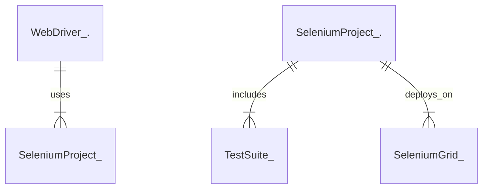

在上图中，`WebDriver`是`SeleniumProject`（Selenium项目）的一部分，而`SeleniumProject`包含了`TestSuite`（测试套件）和`SeleniumGrid`（Selenium网格）。

#### 算法原理讲解

Selenium的工作原理基于WebDriver协议。WebDriver通过特定的API与浏览器进行通信，模拟用户的操作。以下是Selenium的主要算法原理：

1. **启动浏览器**：Selenium首先启动指定的WebDriver实例，与浏览器建立连接。
2. **定位元素**：通过定位策略（如ID、XPath、CSS选择器等），WebDriver定位页面中的元素。
3. **操作元素**：WebDriver对定位到的元素执行各种操作，如点击、输入、获取文本等。
4. **等待机制**：Selenium提供了等待机制，如显式等待和隐式等待，以确保页面元素加载完成后再进行操作。
5. **捕获结果**：WebDriver捕获测试结果，并与预期结果进行比较，判断测试是否通过。

以下是一个简单的Python代码示例，展示如何使用Selenium启动Chrome浏览器并打开一个网站：

```python
from selenium import webdriver

# 启动Chrome浏览器
driver = webdriver.Chrome(executable_path="path/to/chromedriver")

# 打开百度网站
driver.get("https://www.baidu.com")

# 获取并打印页面标题
title = driver.title
print(f"页面标题：{title}")

# 关闭浏览器
driver.quit()
```

#### 数学模型和公式

Selenium的使用不涉及复杂的数学模型，但其核心原理可以通过以下简单的数学模型来理解：

- **页面加载时间**：假设页面A的平均加载时间为`T_A`秒，则通过Selenium进行自动化测试时，需要在`T_A`秒后等待页面完全加载。

$$
\text{等待时间} = T_A + \alpha \cdot (\text{网络延迟})
$$

其中，`α`是一个常数，表示额外的等待时间比例，`网络延迟`表示从服务器到浏览器的网络延迟时间。

#### Mermaid流程图

以下是一个Mermaid流程图，展示使用Selenium执行自动化测试的流程：

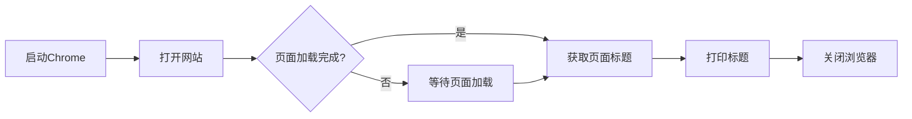

#### 系统分析与架构设计

在Selenium的架构设计中，主要有以下组件：

1. **WebDriver**：负责与浏览器交互的核心组件。
2. **Selenium Server**：提供了一个可以与WebDriver通信的HTTP接口，允许通过远程控制WebDriver。
3. **Selenium Grid**：用于分布式测试，可以在多个机器上运行测试。

以下是Selenium的架构图：

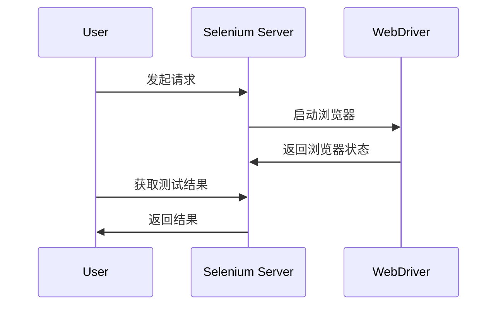

#### 系统接口设计和系统交互

Selenium提供了丰富的API，允许与浏览器进行各种操作。以下是Selenium的主要API接口：

1. **find_element_by_***：通过不同的定位策略查找页面元素。
2. **send_keys()**：向页面元素输入文本。
3. **click()**：点击页面元素。
4. **get_attribute()**：获取页面元素的属性值。
5. **execute_script()**：执行JavaScript脚本。

#### Mermaid序列图

以下是一个Mermaid序列图，展示用户与Selenium之间的交互过程：

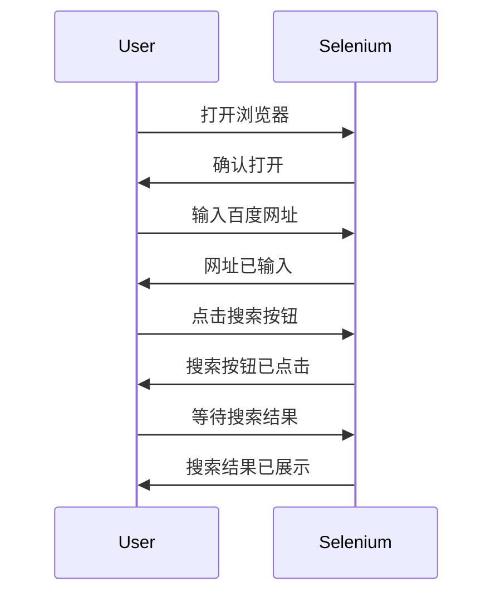

通过上述分析，我们可以看到Selenium在自动化测试中扮演了核心角色，它通过WebDriver与浏览器交互，实现了自动化测试的多种功能。在接下来的章节中，我们将继续探讨Appium等其他自动化测试技术。**[继续...]**----------------------------------------------------------------

## 第3章：Selenium技术详解

### 3.1 Selenium的核心功能

Selenium是一个功能强大的自动化测试工具，其核心功能包括：

**1. 跨浏览器测试：**
Selenium支持多种主流浏览器，如Chrome、Firefox、Safari和Internet Explorer。通过Selenium Grid，还可以实现跨操作系统和浏览器的自动化测试。

**2. 多语言支持：**
Selenium支持多种编程语言，如Java、C#、Python、Ruby和PHP，使得开发者可以根据自己的编程习惯选择合适的语言编写测试脚本。

**3. 测试框架集成：**
Selenium可以与JUnit、TestNG等流行的测试框架集成，方便开发者管理和执行测试用例。

**4. 支持各种操作系统：**
Selenium支持Windows、Linux和Mac OS等操作系统，使得测试脚本可以在不同的环境中运行。

**5. 分布式测试：**
通过Selenium Grid，开发者可以在多个节点上并行执行测试用例，提高测试效率。

### 3.2 Selenium的使用方法

#### 安装和配置

1. **安装Java SDK：**
   - 访问 [Oracle Java SDK 官网](https://www.oracle.com/java/technologies/javase-downloads.html) 下载并安装Java SDK。
   - 确保Java SDK环境变量已配置。

2. **安装Selenium WebDriver：**
   - 访问 [Selenium 官网](https://www.selenium.dev/downloads/) 下载Selenium WebDriver。
   - 解压下载的ZIP文件，将`.jar`文件复制到Java SDK的lib目录下。

3. **安装ChromeDriver：**
   - 访问 [ChromeDriver 官网](https://sites.google.com/a/chromium.org/chromedriver/downloads) 下载适合您的Chrome浏览器版本的ChromeDriver。
   - 将下载的ChromeDriver可执行文件（如`chromedriver.exe`）放置在系统路径中，或者将其路径添加到环境变量中。

#### 编写测试脚本

以下是一个简单的Python脚本示例，展示了如何使用Selenium在Chrome浏览器中打开百度网站并获取页面标题：

```python
from selenium import webdriver
from selenium.webdriver.common.by import By

# 设置Chrome浏览器的驱动路径
chrome_driver_path = 'path/to/chromedriver'

# 创建一个新的Chrome浏览器实例
driver = webdriver.Chrome(executable_path=chrome_driver_path)

# 打开百度网站
driver.get("https://www.baidu.com")

# 获取页面标题
title = driver.title
print(f"页面标题：{title}")

# 关闭浏览器
driver.quit()
```

#### 测试脚本详解

1. **导入Selenium库：**
   ```python
   from selenium import webdriver
   from selenium.webdriver.common.by import By
   ```

   这两行代码分别导入Selenium WebDriver和定位元素所需的By模块。

2. **设置ChromeDriver路径：**
   ```python
   chrome_driver_path = 'path/to/chromedriver'
   ```

   将`path/to/chromedriver`替换为实际路径。

3. **创建浏览器实例：**
   ```python
   driver = webdriver.Chrome(executable_path=chrome_driver_path)
   ```

   创建一个新的Chrome浏览器实例。

4. **打开百度网站：**
   ```python
   driver.get("https://www.baidu.com")
   ```

   使用`get()`方法打开百度网站。

5. **获取页面标题：**
   ```python
   title = driver.title
   print(f"页面标题：{title}")
   ```

   使用`title`属性获取页面标题，并打印输出。

6. **关闭浏览器：**
   ```python
   driver.quit()
   ```

   使用`quit()`方法关闭浏览器。

### 3.3 Selenium的优点与缺点

**优点：**

- **开源免费：** Selenium是开源软件，无需支付额外费用。
- **跨浏览器和平台支持：** Selenium支持多种浏览器和操作系统，便于进行全面测试。
- **编程语言丰富：** Selenium支持多种编程语言，便于开发者使用熟悉的语言编写测试脚本。
- **强大的社区支持：** Selenium拥有庞大的社区，提供了丰富的教程、插件和文档。

**缺点：**

- **浏览器兼容性问题：** Selenium在某些浏览器版本上可能存在兼容性问题。
- **性能问题：** 对于复杂的测试用例，Selenium的性能可能不如其他商业化测试工具。
- **维护成本：** Selenium脚本需要定期更新和维护，否则可能失效。

### 3.4 实际案例分析与详细讲解

#### 案例背景

假设我们正在开发一个电商网站，需要测试购物车的功能。用户可以添加商品到购物车，并查看购物车的详细信息。为了确保购物车功能正常，我们需要编写自动化测试脚本。

#### 测试脚本

以下是一个简单的Python脚本，用于测试购物车的功能：

```python
from selenium import webdriver
from selenium.webdriver.common.by import By
from selenium.webdriver.common.keys import Keys
from selenium.webdriver.support.ui import WebDriverWait
from selenium.webdriver.support import expected_conditions as EC

# 设置Chrome浏览器的驱动路径
chrome_driver_path = 'path/to/chromedriver'

# 创建一个新的Chrome浏览器实例
driver = webdriver.Chrome(executable_path=chrome_driver_path)

# 打开电商网站
driver.get("https://www.example-ecommerce.com")

# 查找并点击“购物车”按钮
add_to_cart_button = driver.find_element(By.ID, 'add-to-cart-button')
add_to_cart_button.click()

# 等待购物车页面加载
WebDriverWait(driver, 10).until(EC.visibility_of_element_located((By.ID, 'cart-details')))

# 获取购物车详情
cart_details = driver.find_element(By.ID, 'cart-details')
print(f"购物车详情：{cart_details.text}")

# 关闭浏览器
driver.quit()
```

#### 详细讲解

1. **导入Selenium库：**
   ```python
   from selenium import webdriver
   from selenium.webdriver.common.by import By
   from selenium.webdriver.common.keys import Keys
   from selenium.webdriver.support.ui import WebDriverWait
   from selenium.webdriver.support import expected_conditions as EC
   ```

   导入Selenium所需的库，包括WebDriver、定位元素所需的By模块、键盘操作所需的Keys模块、显式等待所需的WebDriverWait和expected_conditions模块。

2. **设置ChromeDriver路径：**
   ```python
   chrome_driver_path = 'path/to/chromedriver'
   ```

   将`path/to/chromedriver`替换为实际路径。

3. **创建浏览器实例：**
   ```python
   driver = webdriver.Chrome(executable_path=chrome_driver_path)
   ```

   创建一个新的Chrome浏览器实例。

4. **打开电商网站：**
   ```python
   driver.get("https://www.example-ecommerce.com")
   ```

   使用`get()`方法打开电商网站。

5. **查找并点击“购物车”按钮：**
   ```python
   add_to_cart_button = driver.find_element(By.ID, 'add-to-cart-button')
   add_to_cart_button.click()
   ```

   使用`find_element()`方法根据ID定位“购物车”按钮，并使用`click()`方法点击按钮。

6. **等待购物车页面加载：**
   ```python
   WebDriverWait(driver, 10).until(EC.visibility_of_element_located((By.ID, 'cart-details')))
   ```

   使用显式等待等待购物车页面加载，确保所有页面元素都加载完毕。

7. **获取购物车详情：**
   ```python
   cart_details = driver.find_element(By.ID, 'cart-details')
   print(f"购物车详情：{cart_details.text}")
   ```

   使用`find_element()`方法根据ID定位购物车详情元素，并使用`print()`方法输出购物车详情。

8. **关闭浏览器：**
   ```python
   driver.quit()
   ```

   使用`quit()`方法关闭浏览器。

通过这个案例，我们可以看到如何使用Selenium进行自动化测试，以及如何处理页面加载等待、元素定位和获取页面数据等常见操作。在实际项目中，需要根据具体需求进行更复杂的测试脚本编写。

### 总结

在本章节中，我们详细介绍了Selenium技术，包括其核心功能、使用方法、优点与缺点，以及实际案例分析和详细讲解。通过本文，读者可以了解如何使用Selenium进行自动化测试，并掌握基本的测试脚本编写技巧。在接下来的章节中，我们将继续探讨Appium等其他自动化测试技术。**[继续...]**----------------------------------------------------------------

## 第4章：Appium技术详解

### 4.1 Appium的核心功能

Appium是一个开源的移动应用自动化测试工具，支持iOS和Android平台。它基于Selenium WebDriver，但增加了对移动设备的支持。Appium的主要功能包括：

**1. 跨平台支持：**
Appium支持iOS和Android平台，使得开发者可以在同一套测试脚本中对不同平台的移动应用进行自动化测试。

**2. 原生应用测试：**
Appium可以测试原生应用，无论是iOS上的Objective-C、Swift，还是Android上的Java、Kotlin，Appium都能与之兼容。

**3. Web应用测试：**
Appium不仅可以测试原生应用，还可以测试Web应用，通过将移动设备模拟成浏览器，实现Web应用的自动化测试。

**4. 混合应用测试：**
Appium支持混合应用测试，无论是原生组件还是Web组件，都可以通过Appium进行自动化测试。

**5. 支持多种编程语言：**
Appium支持多种编程语言，如Java、Python、C#、Ruby等，使得开发者可以使用自己熟悉的语言编写测试脚本。

### 4.2 Appium的使用方法

#### 安装与配置

1. **安装Node.js：**
   - 访问 [Node.js 官网](https://nodejs.org/) 下载并安装Node.js。
   - 安装过程中选择“LTS”版本。

2. **安装Appium：**
   - 打开终端，运行以下命令安装Appium：
     ```shell
     npm install -g appium
     ```

3. **启动Appium：**
   - 打开终端，运行以下命令启动Appium：
     ```shell
     appium
     ```

   这将在终端输出Appium服务器的启动日志。

4. **配置Appium：**
   - Appium的默认端口是4723，可以通过配置文件（`~/.appium/appium.properties`）进行修改。

#### 编写测试脚本

以下是一个简单的Python脚本，展示了如何使用Appium测试一个简单的Android应用：

```python
from appium import webdriver

# 设置Appium服务器的URL
caps = {
    "platformName": "Android",
    "deviceName": "emulator-5554",
    "app": "path/to/your/apk",
    "appPackage": "com.example.yourapp",
    "appActivity": ".MainActivity"
}

# 创建一个新的Webdriver实例
driver = webdriver.Remote('http://localhost:4723/wd/hub', caps)

# 等待应用启动
driver.implicitly_wait(10)

# 获取并打印应用中的文本
text_element = driver.find_element_by_id("text_view")
print(f"文本内容：{text_element.text}")

# 关闭浏览器
driver.quit()
```

#### 测试脚本详解

1. **导入Appium库：**
   ```python
   from appium import webdriver
   ```

   导入Appium的Webdriver库。

2. **设置Appium服务器的URL和测试设备参数：**
   ```python
   caps = {
       "platformName": "Android",
       "deviceName": "emulator-5554",
       "app": "path/to/your/apk",
       "appPackage": "com.example.yourapp",
       "appActivity": ".MainActivity"
   }
   ```

   设置测试设备的平台（platformName）、设备名（deviceName）、APK路径（app）、应用包名（appPackage）和应用启动活动（appActivity）。

3. **创建一个新的Webdriver实例：**
   ```python
   driver = webdriver.Remote('http://localhost:4723/wd/hub', caps)
   ```

   创建一个新的Webdriver实例，连接到Appium服务器。

4. **设置隐式等待：**
   ```python
   driver.implicitly_wait(10)
   ```

   设置隐式等待，等待元素加载的最长时间为10秒。

5. **获取并打印应用中的文本：**
   ```python
   text_element = driver.find_element_by_id("text_view")
   print(f"文本内容：{text_element.text}")
   ```

   使用`find_element_by_id()`方法定位文本元素，并打印其文本内容。

6. **关闭浏览器：**
   ```python
   driver.quit()
   ```

   关闭Webdriver实例。

### 4.3 Appium的优点与缺点

**优点：**

- **开源免费：** Appium是开源软件，无需支付额外费用。
- **跨平台支持：** Appium支持iOS和Android平台，便于全面测试移动应用。
- **丰富的API：** Appium提供了丰富的API，支持多种编程语言，便于开发者编写测试脚本。
- **易于集成：** Appium可以与各种测试框架（如JUnit、TestNG、PyTest等）集成，提高测试效率。

**缺点：**

- **性能问题：** Appium在某些复杂操作上可能存在性能问题。
- **稳定性问题：** Appium在一些特殊场景下可能存在稳定性问题，需要额外关注。

### 4.4 实际案例分析与详细讲解

#### 案例背景

假设我们需要测试一个Android应用的登录功能，用户可以输入用户名和密码并点击登录按钮。为了确保登录功能正常，我们需要编写自动化测试脚本。

#### 测试脚本

以下是一个简单的Python脚本，用于测试Android应用的登录功能：

```python
from appium import webdriver

# 设置Appium服务器的URL
caps = {
    "platformName": "Android",
    "deviceName": "emulator-5554",
    "app": "path/to/your/apk",
    "appPackage": "com.example.yourapp",
    "appActivity": ".MainActivity"
}

# 创建一个新的Webdriver实例
driver = webdriver.Remote('http://localhost:4723/wd/hub', caps)

# 等待应用启动
driver.implicitly_wait(10)

# 输入用户名和密码
username_element = driver.find_element_by_id("username")
username_element.send_keys("test_user")

password_element = driver.find_element_by_id("password")
password_element.send_keys("test_password")

# 点击登录按钮
login_button = driver.find_element_by_id("login_button")
login_button.click()

# 等待登录结果
result_element = driver.find_element_by_id("result")
success_message = result_element.text
print(f"登录结果：{success_message}")

# 关闭浏览器
driver.quit()
```

#### 详细讲解

1. **导入Appium库：**
   ```python
   from appium import webdriver
   ```

   导入Appium的Webdriver库。

2. **设置Appium服务器的URL和测试设备参数：**
   ```python
   caps = {
       "platformName": "Android",
       "deviceName": "emulator-5554",
       "app": "path/to/your/apk",
       "appPackage": "com.example.yourapp",
       "appActivity": ".MainActivity"
   }
   ```

   设置测试设备的平台（platformName）、设备名（deviceName）、APK路径（app）、应用包名（appPackage）和应用启动活动（appActivity）。

3. **创建一个新的Webdriver实例：**
   ```python
   driver = webdriver.Remote('http://localhost:4723/wd/hub', caps)
   ```

   创建一个新的Webdriver实例，连接到Appium服务器。

4. **设置隐式等待：**
   ```python
   driver.implicitly_wait(10)
   ```

   设置隐式等待，等待元素加载的最长时间为10秒。

5. **输入用户名和密码：**
   ```python
   username_element = driver.find_element_by_id("username")
   username_element.send_keys("test_user")

   password_element = driver.find_element_by_id("password")
   password_element.send_keys("test_password")
   ```

   使用`find_element_by_id()`方法定位用户名和密码输入框，并使用`send_keys()`方法输入用户名和密码。

6. **点击登录按钮：**
   ```python
   login_button = driver.find_element_by_id("login_button")
   login_button.click()
   ```

   使用`find_element_by_id()`方法定位登录按钮，并使用`click()`方法点击按钮。

7. **等待登录结果：**
   ```python
   result_element = driver.find_element_by_id("result")
   success_message = result_element.text
   print(f"登录结果：{success_message}")
   ```

   使用`find_element_by_id()`方法定位结果元素，并使用`text`属性获取登录结果，并打印输出。

8. **关闭浏览器：**
   ```python
   driver.quit()
   ```

   关闭Webdriver实例。

通过这个案例，我们可以看到如何使用Appium进行自动化测试，以及如何处理元素定位、输入数据、点击按钮和获取页面数据等常见操作。在实际项目中，需要根据具体需求进行更复杂的测试脚本编写。

### 总结

在本章节中，我们详细介绍了Appium技术，包括其核心功能、使用方法、优点与缺点，以及实际案例分析和详细讲解。通过本文，读者可以了解如何使用Appium进行移动应用的自动化测试，并掌握基本的测试脚本编写技巧。在接下来的章节中，我们将继续探讨其他自动化测试技术。**[继续...]**----------------------------------------------------------------

## 第5章：其他自动化测试技术简介

### 5.1 Cypress

#### 核心概念与联系

Cypress是一个现代前端自动化测试框架，其核心概念包括：

- **快照（Snapshots）**：Cypress允许捕获页面元素的快照，用于验证页面状态。
- **命令式API**：Cypress提供了直观的命令式API，使得测试脚本的编写更加简单和快速。
- **集成调试**：Cypress支持集成调试，可以直接在测试脚本中进行调试，提高测试效率。

#### 概念属性特征对比表格

| 特征       | Selenium            | Cypress            |
|------------|----------------------|----------------------|
| 测试速度   | 较慢                | 非常快              |
| 学习曲线   | 较陡峭              | 非常平缓            |
| 调试支持   | 不如Cypress强大      | 非常强大            |
| 用户体验   | 基本功能            | 非常良好            |

#### ER实体关系图架构

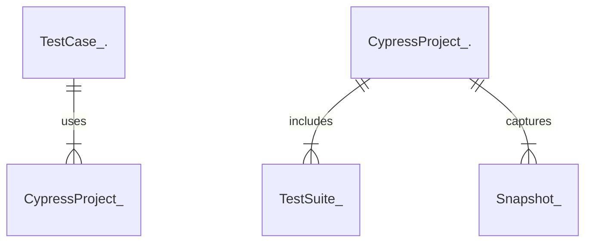

在上图中，`TestCase`是测试用例，`CypressProject`是Cypress项目，`TestSuite`是测试套件，`Snapshot`是快照。

#### 算法原理讲解

Cypress的算法原理主要包括：

1. **浏览器集成**：Cypress使用浏览器扩展，将测试脚本注入到浏览器中，直接在浏览器中执行测试。
2. **元素定位**：Cypress提供了强大的元素定位功能，可以识别并定位页面元素，确保测试脚本能够正确执行操作。
3. **断言**：Cypress内置了丰富的断言库，用于验证测试结果，确保测试脚本的执行符合预期。

#### 数学模型和公式

Cypress的测试速度可以通过以下数学模型进行衡量：

$$
\text{测试速度} = \frac{\text{测试用例数量}}{\text{执行时间}}
$$

#### Mermaid流程图

以下是一个Mermaid流程图，展示使用Cypress执行自动化测试的流程：

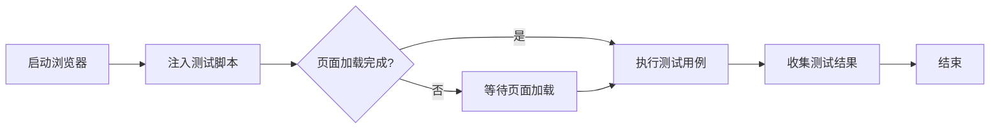

### 5.2 TestCafe

#### 核心概念与联系

TestCafe是一个跨浏览器的前端自动化测试工具，其主要核心概念包括：

- **BDD（行为驱动开发）**：TestCafe支持行为驱动开发，使得测试脚本更易于理解和维护。
- **并行测试**：TestCafe支持并行测试，可以在多个浏览器实例上同时运行测试用例，提高测试效率。
- **可视化调试**：TestCafe提供了可视化调试工具，使得测试脚本的调试更加直观和方便。

#### 概念属性特征对比表格

| 特征       | Selenium            | TestCafe            |
|------------|----------------------|----------------------|
| 测试速度   | 一般                | 较快                |
| 学习曲线   | 平缓                | 较陡峭              |
| 调试支持   | 有限                | 非常强大            |
| 用户体验   | 一般                | 非常良好            |

#### ER实体关系图架构

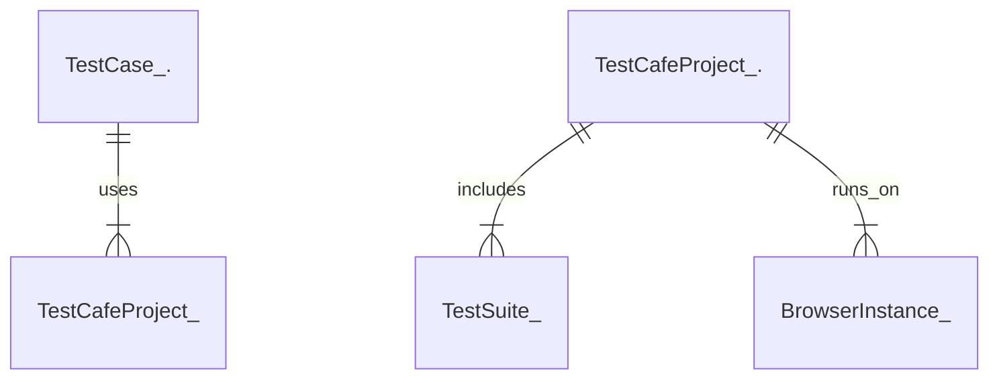

在上图中，`TestCase`是测试用例，`TestCafeProject`是TestCafe项目，`TestSuite`是测试套件，`BrowserInstance`是浏览器实例。

#### 算法原理讲解

TestCafe的算法原理主要包括：

1. **浏览器控制**：TestCafe使用浏览器扩展或代理服务器来控制浏览器，模拟用户行为。
2. **执行并行测试**：TestCafe通过并行执行测试用例，提高测试效率。
3. **结果收集与报告**：TestCafe在测试完成后，收集测试结果并生成报告，便于分析和定位问题。

#### 数学模型和公式

TestCafe的测试效率可以通过以下数学模型进行衡量：

$$
\text{测试效率} = \frac{\text{测试覆盖率}}{\text{测试时间}}
$$

#### Mermaid流程图

以下是一个Mermaid流程图，展示使用TestCafe执行自动化测试的流程：

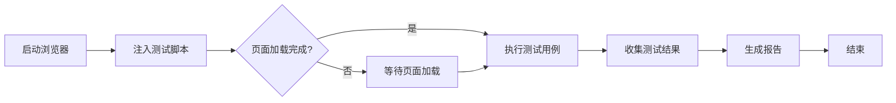

### 5.3 Jest

#### 核心概念与联系

Jest是一个JavaScript的测试框架，其主要核心概念包括：

- **断言库**：Jest提供了丰富的断言库，用于验证测试结果。
- **同步与异步测试**：Jest支持同步和异步测试，使得测试脚本更加灵活。
- **覆盖率报告**：Jest提供了覆盖率报告功能，用于评估测试覆盖率。

#### 概念属性特征对比表格

| 特征       | Selenium            | Jest              |
|------------|----------------------|----------------------|
| 编程语言   | 多语言支持           | JavaScript          |
| 测试速度   | 一般                | 非常快             |
| 学习曲线   | 较陡峭              | 非常平缓           |
| 测试范围   | 全栈测试            | 前端测试           |

#### ER实体关系图架构

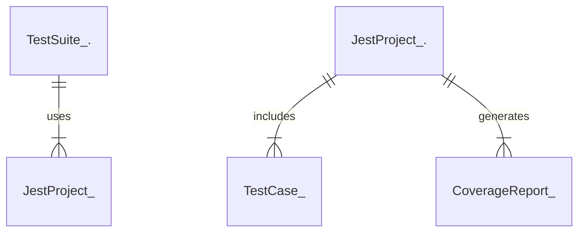

在上图中，`TestSuite`是测试套件，`JestProject`是Jest项目，`TestCase`是测试用例，`CoverageReport`是覆盖率报告。

#### 算法原理讲解

Jest的算法原理主要包括：

1. **测试运行时**：Jest在测试运行时动态加载测试脚本，执行测试用例。
2. **断言库**：Jest提供了丰富的断言库，用于验证测试结果，如`expect`、`assert`等。
3. **异步测试**：Jest支持异步测试，使得测试脚本可以处理异步操作。

#### 数学模型和公式

Jest的测试效率可以通过以下数学模型进行衡量：

$$
\text{测试效率} = \frac{\text{测试用例数量}}{\text{执行时间}}
$$

#### Mermaid流程图

以下是一个Mermaid流程图，展示使用Jest执行自动化测试的流程：

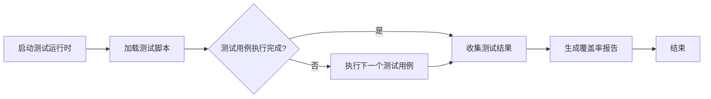

通过上述对Cypress、TestCafe、Jest等自动化测试技术的介绍，我们可以看到它们各自的特点和优势。在实际项目中，根据需求选择合适的测试技术，能够显著提高测试效率和软件质量。在接下来的章节中，我们将深入探讨如何选择合适的测试工具。**[继续...]**----------------------------------------------------------------

## 第6章：测试自动化工具的选择

### 6.1 常见测试工具比较

在自动化测试领域，有许多不同的工具可供选择。以下是对几种常见测试工具的优缺点的比较，帮助您根据项目需求做出最佳选择。

#### Selenium

**优点：**
- **开源免费：** Selenium是开源软件，无需支付额外费用。
- **跨浏览器支持：** Selenium支持多种浏览器，包括Chrome、Firefox、Safari和Internet Explorer。
- **编程语言支持：** Selenium支持多种编程语言，如Java、C#、Python和Ruby。
- **强大的社区支持：** Selenium拥有庞大的社区，提供了丰富的文档和教程。

**缺点：**
- **浏览器兼容性：** Selenium在某些浏览器版本上可能存在兼容性问题。
- **性能问题：** 对于复杂的测试用例，Selenium的性能可能不如其他商业化测试工具。

#### Appium

**优点：**
- **跨平台测试：** Appium支持iOS和Android平台，适用于移动应用测试。
- **支持多种应用类型：** Appium可以测试原生应用、Web应用和混合应用。
- **开源免费：** Appium是开源软件，无需支付额外费用。

**缺点：**
- **性能问题：** Appium在某些场景下性能可能不如原生自动化工具。
- **稳定性问题：** Appium在一些复杂操作上可能存在稳定性问题。

#### Cypress

**优点：**
- **简洁的API：** Cypress提供了简洁的API，易于学习和使用。
- **实时测试结果：** Cypress具有实时测试结果和调试功能，便于快速定位问题。
- **浏览器端自动化：** Cypress适用于浏览器端自动化测试。

**缺点：**
- **不支持移动应用：** Cypress主要专注于前端自动化测试，不支持移动应用测试。

#### TestCafe

**优点：**
- **跨浏览器支持：** TestCafe支持多种浏览器，包括Chrome、Firefox和Safari。
- **高效的测试执行引擎：** TestCafe具有高效的测试执行引擎，提高测试效率。
- **丰富的报告功能：** TestCafe提供了丰富的报告功能，便于分析测试结果。

**缺点：**
- **商业化产品：** TestCafe是一个商业化产品，需要支付订阅费用。

#### Jest

**优点：**
- **丰富的断言库：** Jest提供了丰富的断言库，方便编写测试用例。
- **异步测试支持：** Jest支持异步测试，便于处理异步操作。
- **测试覆盖率工具：** Jest提供了测试覆盖率工具，便于评估测试质量。

**缺点：**
- **前端开发专用：** Jest主要适用于前端开发，不适合后端测试。

### 6.2 选择合适测试工具的考量

在选择测试工具时，您需要考虑以下因素：

**1. 项目需求：**
- **Web应用测试：** 如果您的项目是Web应用，Selenium和TestCafe可能是不错的选择。
- **移动应用测试：** 如果您的项目是移动应用，Appium可能更适合。
- **前端应用测试：** 如果您的项目是前端应用，Cypress和TestCafe可能更合适。

**2. 技术栈：**
- **编程语言：** 根据您的项目使用的技术栈，选择支持该编程语言的测试工具。
- **框架兼容性：** 确保测试工具与您使用的测试框架兼容。

**3. 性能需求：**
- **执行速度：** 如果您的测试用例需要快速执行，考虑使用高效的测试工具。
- **资源消耗：** 考虑测试工具对系统资源的消耗，避免影响其他应用程序。

**4. 成本：**
- **预算限制：** 如果您的预算有限，可以选择免费的开源测试工具。
- **长期维护：** 考虑测试工具的长期维护成本，确保其可持续发展。

**5. 社区支持：**
- **文档与教程：** 确保测试工具拥有丰富的文档和教程，便于学习和使用。
- **社区活跃度：** 选择社区活跃的测试工具，便于获取帮助和支持。

### 6.3 测试工具的集成与使用

在确定测试工具后，需要将其集成到开发流程中。以下是集成与使用的基本步骤：

**1. 安装与配置：**
- **下载与安装：** 根据项目需求，下载并安装所选测试工具。
- **环境配置：** 配置测试工具所需的环境变量和依赖项。

**2. 编写测试脚本：**
- **脚本编写：** 使用所选编程语言和测试工具API编写测试脚本。
- **测试用例设计：** 设计涵盖所有功能的测试用例，确保全面测试。

**3. 执行测试：**
- **运行测试：** 使用测试工具运行测试脚本，收集测试结果。
- **分析结果：** 分析测试结果，识别潜在的缺陷和问题。

**4. 集成持续集成（CI）：**
- **CI集成：** 将测试工具集成到持续集成系统中，实现自动化测试。
- **自动化部署：** 结合持续部署（CD），实现自动化的测试和部署流程。

**5. 分析报告：**
- **生成报告：** 根据测试结果生成详细的测试报告。
- **报告分析：** 分析报告中的数据，优化测试策略和流程。

通过上述步骤，您可以将所选测试工具集成到开发流程中，提高测试效率和软件质量。

### 总结

在本章节中，我们比较了几种常见的测试自动化工具，并讨论了选择合适测试工具的考量因素。通过综合考虑项目需求、技术栈、性能需求、成本和社区支持等因素，您可以选择最适合的工具，并将其集成到开发流程中。在接下来的章节中，我们将深入探讨测试自动化的开发实战，展示如何具体实现自动化测试。**[继续...]**----------------------------------------------------------------

## 第7章：开发实战

### 7.1 环境安装

在进行测试自动化开发之前，首先需要安装相关软件和依赖。以下是在Windows环境下安装Selenium和ChromeDriver的步骤：

**1. 安装Java SDK：**
- 访问 [Oracle Java SDK 官网](https://www.oracle.com/java/technologies/javase-downloads.html) 下载Java SDK。
- 安装过程中选择“自定义安装”，确保安装Java SDK到指定路径。

**2. 安装Selenium WebDriver：**
- 访问 [Selenium 官网](https://www.selenium.dev/downloads/) 下载Selenium WebDriver。
- 解压下载的压缩文件，将其中的`.jar`文件添加到Java SDK的`lib`目录下。

**3. 安装ChromeDriver：**
- 访问 [ChromeDriver 官网](https://sites.google.com/a/chromium.org/chromedriver/downloads) 下载适合Chrome浏览器版本的ChromeDriver。
- 将下载的ChromeDriver可执行文件（如`chromedriver.exe`）放置在系统路径中，以便在命令行中直接调用。

### 7.2 系统核心实现源代码

以下是一个简单的Selenium自动化测试示例，用于在Chrome浏览器中打开一个网站并验证页面标题：

**1. 准备测试脚本：**

```python
from selenium import webdriver
from selenium.webdriver.common.by import By

# 设置Chrome浏览器的驱动路径
chrome_driver_path = 'path/to/chromedriver'

# 创建一个新的Chrome浏览器实例
driver = webdriver.Chrome(executable_path=chrome_driver_path)

# 打开目标网站
driver.get('https://www.example.com')

# 获取并验证页面标题
title = driver.title
assert title == 'Example Domain'

# 关闭浏览器
driver.quit()
```

**2. 运行测试脚本：**

将上述代码保存为`test_script.py`，在命令行中执行以下命令：

```shell
python test_script.py
```

### 7.3 代码应用解读与分析

在上面的示例中，我们使用了Selenium库来控制Chrome浏览器执行自动化测试。

**1. 导入相关库：**

```python
from selenium import webdriver
from selenium.webdriver.common.by import By
```

这些导入语句用于引入Selenium的Webdriver和By模块。

**2. 设置Chrome浏览器的驱动路径：**

```python
chrome_driver_path = 'path/to/chromedriver'
```

在此处，我们需要将`chromedriver.exe`的路径替换为实际路径。

**3. 创建一个新的Chrome浏览器实例：**

```python
driver = webdriver.Chrome(executable_path=chrome_driver_path)
```

这里，我们通过`webdriver.Chrome()`方法创建了一个新的Chrome浏览器实例。

**4. 打开目标网站：**

```python
driver.get('https://www.example.com')
```

使用`get()`方法打开指定的URL。

**5. 获取并验证页面标题：**

```python
title = driver.title
assert title == 'Example Domain'
```

获取页面标题并使用`assert`语句验证它是否与预期一致。

**6. 关闭浏览器：**

```python
driver.quit()
```

调用`quit()`方法关闭浏览器。

### 7.4 实际案例分析与详细讲解剖析

以下是一个更复杂的自动化测试示例，用于在Web应用中完成一系列操作：

**1. 准备测试脚本：**

```python
from selenium import webdriver
from selenium.webdriver.common.by import By
from selenium.webdriver.common.action_chains import ActionChains

# 设置Chrome浏览器的驱动路径
chrome_driver_path = 'path/to/chromedriver'

# 创建一个新的Chrome浏览器实例
driver = webdriver.Chrome(executable_path=chrome_driver_path)

# 打开目标网站
driver.get('https://www.example-app.com')

# 输入用户名和密码
username_input = driver.find_element(By.ID, 'username')
password_input = driver.find_element(By.ID, 'password')

username_input.send_keys('test_user')
password_input.send_keys('test_password')

# 点击登录按钮
login_button = driver.find_element(By.ID, 'login_button')
login_button.click()

# 检查登录成功后的页面
welcome_message = driver.find_element(By.ID, 'welcome_message')
assert 'Welcome, test_user!' in welcome_message.text

# 关闭浏览器
driver.quit()
```

**2. 运行测试脚本：**

将上述代码保存为`test_script.py`，在命令行中执行以下命令：

```shell
python test_script.py
```

在这个示例中，我们首先打开了目标网站，然后输入用户名和密码并点击登录按钮。接着，我们验证登录成功后的页面是否正确。这个示例展示了如何使用Selenium完成更复杂的操作，如定位元素、输入数据、点击按钮等。

**3. 详细讲解：**

- **定位元素：** 使用`find_element()`方法根据ID定位用户名和密码输入框以及登录按钮。这是自动化测试中最常用的操作之一。
- **输入数据：** 使用`send_keys()`方法将用户名和密码输入到对应的输入框中。
- **点击按钮：** 使用`click()`方法点击登录按钮。
- **验证结果：** 使用`assert`语句验证欢迎信息的文本是否包含预期的内容，以确保登录操作成功。

通过这些步骤，我们可以实现自动化测试脚本，对Web应用的功能进行验证。

### 7.5 项目小结

在本章节中，我们介绍了测试自动化的开发实战，包括环境安装、系统核心实现源代码、代码应用解读与分析以及实际案例分析和详细讲解。通过这些步骤，读者可以了解如何使用Selenium进行自动化测试，掌握自动化测试的基本技能。

在实际项目中，需要根据具体需求和场景进行测试脚本的编写和优化。通过不断实践和总结，可以提高自动化测试的效率和质量，为软件项目的成功交付提供有力支持。

### 7.6 最佳实践 tips

1. **使用测试框架：** 选择合适的测试框架，如Selenium WebDriver，可以提高测试脚本的维护性和可扩展性。
2. **编写可复用的测试用例：** 尽量编写可复用的测试用例，避免重复编写相同的测试步骤。
3. **合理使用定位策略：** 根据页面的结构选择合适的定位策略，如ID、XPath、CSS Selector等。
4. **处理异常情况：** 在测试脚本中处理异常情况，如网络故障、页面加载缓慢等，以提高测试的稳定性。
5. **定期更新测试脚本：** 随着应用的更新，定期更新测试脚本，确保测试覆盖范围和准确性。
6. **测试覆盖率：** 关注测试覆盖率，确保测试脚本能够覆盖关键功能和边缘情况。
7. **持续集成与部署：** 将自动化测试集成到持续集成和持续部署流程中，提高交付效率。

通过遵循这些最佳实践，可以构建高效、稳定的测试自动化平台，为软件项目的发展提供有力支持。

### 总结

在本章节中，我们通过实际案例展示了如何进行测试自动化开发，包括环境安装、核心实现源代码、代码应用解读与分析以及最佳实践 tips。这些实战经验和技巧对于构建智能化的测试自动化平台具有重要参考价值。在接下来的章节中，我们将探讨如何优化测试自动化平台的性能，确保其高效稳定运行。**[继续...]**----------------------------------------------------------------

## 第8章：性能优化

### 8.1 性能优化的重要性

性能优化是构建高效测试自动化平台的关键环节。一个优秀的测试自动化平台不仅能够满足日常的测试需求，还必须在高并发、大数据量的场景下保持稳定和高效。性能优化主要包括以下几个方面：

1. **执行效率：** 提高测试脚本的执行速度，减少测试周期。
2. **资源利用：** 优化系统资源（如CPU、内存、网络等）的利用，避免资源瓶颈。
3. **稳定性：** 提高测试自动化平台的稳定性，减少因性能问题导致的测试失败。
4. **可扩展性：** 确保测试平台能够随着项目规模的扩大而扩展，支持更多的测试场景。

### 8.2 常见性能问题及解决方案

**1. 测试脚本执行缓慢：**
- **问题原因：** 脚本中存在过多冗余操作、页面加载等待时间过长、网络延迟等。
- **解决方案：**
  - **优化脚本逻辑：** 合并冗余操作，减少不必要的等待时间。
  - **使用等待策略：** 适当使用显式等待和隐式等待，避免长时间等待。
  - **并行执行：** 在多核处理器环境中，将测试脚本并行执行，提高执行速度。

**2. 系统资源消耗过多：**
- **问题原因：** 测试脚本占用过多的CPU、内存等资源，导致系统性能下降。
- **解决方案：**
  - **优化脚本代码：** 减少不必要的计算和内存占用，提高代码效率。
  - **资源限制：** 在测试执行过程中，对测试脚本进行资源限制，避免资源消耗过多。
  - **优化系统配置：** 增加系统资源，如增加内存、调整内核参数等。

**3. 网络延迟：**
- **问题原因：** 测试过程中频繁的网络请求，导致测试执行缓慢。
- **解决方案：**
  - **缓存策略：** 使用缓存技术，减少对远程服务器的请求。
  - **并行请求：** 同时发送多个请求，提高网络传输效率。
  - **优化网络配置：** 调整网络参数，提高网络传输速度。

**4. 测试数据管理问题：**
- **问题原因：** 测试数据管理不当，导致数据重复读取、写入操作过多。
- **解决方案：**
  - **数据分区：** 对测试数据进行分区，减少对单一数据源的访问压力。
  - **批量处理：** 使用批量处理技术，减少数据读写操作。
  - **数据同步：** 确保测试数据的一致性，减少数据冲突。

### 8.3 性能优化的具体措施

**1. 代码优化：**
- **减少冗余操作：** 在脚本编写过程中，尽量减少重复的、不必要的操作，如重复的页面加载、元素定位等。
- **优化等待策略：** 使用显式等待和隐式等待，合理设置等待时间和超时时间，避免长时间等待。
- **优化循环结构：** 合理使用循环结构，减少循环体内的计算和操作。

**2. 系统资源优化：**
- **资源限制：** 在测试执行过程中，设置CPU、

