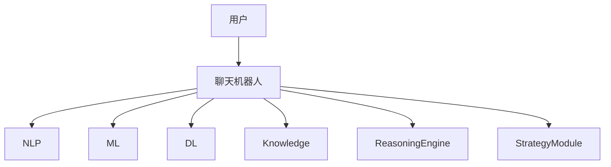
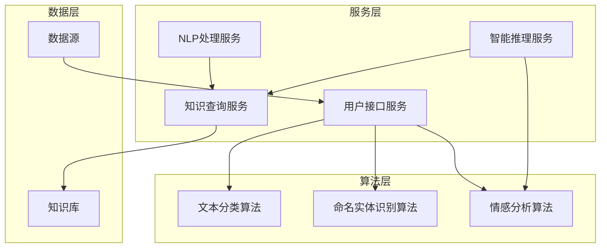
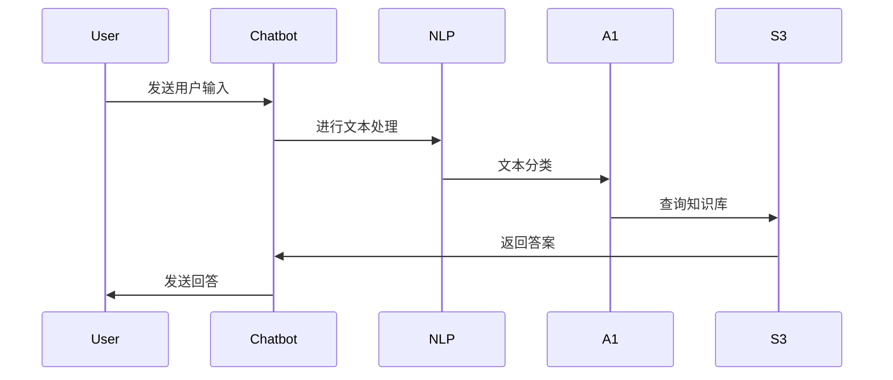

                 

# 打造智能化金融咨询聊天机器人

关键词：智能金融咨询、聊天机器人、自然语言处理、机器学习、深度学习

摘要：本文将深入探讨智能化金融咨询聊天机器人的构建过程，包括其背景介绍、核心概念与联系、算法原理讲解、系统分析与架构设计，以及实际应用与优化。通过一步步的分析推理，本文旨在为读者提供一个清晰、详尽的构建智能化金融咨询聊天机器人的指导。

## 目录大纲

1. 第一部分：智能化金融咨询聊天机器人的背景介绍
   1.1 引言
   1.2 问题描述
   1.3 问题解决
   1.4 边界与外延
   1.5 概念结构与核心要素组成
2. 第二部分：构建智能化金融咨询聊天机器人
   2.1 核心概念与联系
   2.2 算法原理讲解
3. 第三部分：智能化金融咨询聊天机器人的应用与优化
   3.1 数学模型和数学公式
   3.2 系统分析与架构设计
   3.3 项目实战
   3.4 最佳实践 Tips
   3.5 小结
   3.6 注意事项
   3.7 拓展阅读

## 第一部分：智能化金融咨询聊天机器人的背景介绍

### 1.1 引言

#### 1.1.1 问题背景

金融咨询行业作为金融服务的重要组成部分，一直在推动着全球金融市场的健康发展。然而，随着金融市场的不断发展和金融产品的日益复杂化，金融咨询行业也面临着前所未有的挑战。传统的金融咨询服务主要依赖于金融专家的专业知识和经验，这种方式不仅效率低下，而且在应对海量数据和实时信息处理方面存在显著不足。此外，随着互联网和移动设备的普及，用户对于金融服务的需求也越来越倾向于即时性、个性化和便捷性。

#### 1.1.2 聊天机器人在金融咨询中的应用前景

为了应对这些挑战，金融咨询行业开始探索引入人工智能，特别是聊天机器人技术。聊天机器人作为一种智能交互系统，可以实时响应用户的需求，提供个性化的金融咨询服务，从而提升服务效率和用户体验。聊天机器人在金融咨询中的应用前景非常广阔，不仅可以降低人力成本，提高服务效率，还可以通过大数据分析为用户提供更加精准的个性化服务。

### 1.2 问题描述

#### 1.2.1 什么是智能化金融咨询聊天机器人？

智能化金融咨询聊天机器人是指利用人工智能技术，尤其是自然语言处理（NLP）、机器学习（ML）和深度学习（DL）技术，构建的一个能够与用户进行自然语言交互，提供金融咨询服务的系统。

#### 1.2.2 如何构建一个高效、可靠的智能化金融咨询聊天机器人？

构建一个高效、可靠的智能化金融咨询聊天机器人需要解决以下几个关键问题：
1. 自然语言理解：如何准确理解用户的语言输入，提取出关键信息。
2. 知识库构建：如何构建一个庞大的金融知识库，确保聊天机器人能够提供准确、全面的金融信息。
3. 智能推理：如何利用机器学习算法，使聊天机器人能够根据用户的查询，提供个性化的、准确的金融咨询建议。
4. 用户交互体验：如何设计一个友好、易用的用户界面，确保用户能够轻松地与聊天机器人进行交互。

### 1.3 问题解决

为了构建一个高效、可靠的智能化金融咨询聊天机器人，我们可以采用以下智能技术和核心算法：
1. 自然语言处理（NLP）：利用词向量模型、语言模型等技术，实现用户输入的文本理解和语义分析。
2. 机器学习（ML）：采用监督学习和无监督学习算法，对金融知识库进行训练，提高聊天机器人的知识推理能力。
3. 深度学习（DL）：利用深度神经网络、循环神经网络等技术，实现复杂的文本生成和情感分析。
4. 聊天机器人架构设计：设计一个可扩展、可维护的聊天机器人架构，确保系统能够高效运行并持续优化。

### 1.4 边界与外延

#### 1.4.1 边界

智能化金融咨询聊天机器人的边界主要包括以下几个方面：
1. 能力范围：聊天机器人能够处理哪些类型的金融咨询问题。
2. 数据来源：聊天机器人的知识库和信息来源。
3. 用户交互方式：用户可以通过哪些方式进行与聊天机器人的交互。

#### 1.4.2 外延

智能化金融咨询聊天机器人的外延主要体现在以下几个方面：
1. 扩展功能：例如，聊天机器人可以扩展为金融产品推荐系统、投资策略咨询系统等。
2. 跨领域应用：例如，将聊天机器人应用于保险、证券、基金等其他金融领域。

### 1.5 概念结构与核心要素组成

智能化金融咨询聊天机器人的概念结构主要包括以下几个核心要素：
1. 用户接口：负责接收用户的输入，并将处理结果反馈给用户。
2. 自然语言处理（NLP）：负责对用户输入的文本进行处理，包括分词、词性标注、实体识别等。
3. 知识库：存储金融领域的知识，包括金融产品信息、市场动态、投资策略等。
4. 智能推理引擎：利用机器学习算法，根据用户输入和知识库信息，提供个性化的金融咨询建议。
5. 应对策略模块：根据用户的反馈，调整聊天机器人的回答策略，提升用户体验。

## 第二部分：构建智能化金融咨询聊天机器人

### 2.1 核心概念与联系

#### 2.1.1 智能化金融咨询聊天机器人的核心概念

1. 自然语言处理（NLP）：NLP是人工智能的一个重要分支，主要研究如何让计算机理解、生成和处理人类自然语言。在智能化金融咨询聊天机器人中，NLP主要用于处理用户输入的文本，提取关键信息，并进行语义分析。

2. 机器学习（ML）：机器学习是人工智能的一个核心方法，通过构建数学模型，从数据中自动学习规律，进行预测和决策。在智能化金融咨询聊天机器人中，ML主要用于训练知识库，提高聊天机器人的推理能力。

3. 深度学习（DL）：深度学习是机器学习的一个分支，使用多层神经网络，对大量数据进行自动特征提取和模型训练。在智能化金融咨询聊天机器人中，DL主要用于构建复杂的文本生成和情感分析模型。

4. 聊天机器人架构设计：聊天机器人架构设计是指设计一个高效、可扩展、可维护的系统架构，实现用户接口、自然语言处理、知识库、智能推理引擎和应对策略模块的有机整合。

#### 2.1.2 概念属性特征对比表格

| 概念        | 特征                      | 应用场景                  |
| ----------- | ------------------------- | ------------------------- |
| 自然语言处理 | 文本理解、语义分析         | 聊天机器人、文本分类、命名实体识别 |
| 机器学习    | 数据驱动、自动学习         | 预测、分类、决策支持        |
| 深度学习    | 自动特征提取、多层网络     | 图像识别、语音识别、文本生成  |
| 聊天机器人架构设计 | 可扩展、可维护、高效性    | 智能金融咨询、客服、客户服务  |

#### 2.1.3 ER实体关系图架构



## 第三部分：智能化金融咨询聊天机器人的应用与优化

### 3.1 数学模型和数学公式

#### 3.1.1 NLP中的数学模型

1. 文本分类的损失函数（如交叉熵损失函数）

$$
L = -\sum_{i=1}^{n} y_i \log(p_i)
$$

其中，\(y_i\) 是目标标签，\(p_i\) 是模型对第 \(i\) 个类别的预测概率。

#### 3.1.2 机器学习中的数学模型

1. 线性回归模型

$$
y = \beta_0 + \beta_1x
$$

其中，\(y\) 是目标变量，\(x\) 是输入变量，\(\beta_0\) 和 \(\beta_1\) 是模型的参数。

#### 3.1.3 深度学习中的数学模型

1. 卷积神经网络中的卷积操作

$$
f(x) = \sum_{k=1}^{K} w_k * x + b
$$

其中，\(w_k\) 是卷积核，\(x\) 是输入数据，\(b\) 是偏置项。

### 3.2 系统分析与架构设计

#### 3.2.1 问题描述

假设我们要开发一个金融咨询聊天机器人，用户可以通过聊天机器人获取金融市场的最新动态、投资策略建议等。我们需要解决的问题是如何从用户输入中提取关键信息，如何构建知识库，如何利用机器学习算法提供个性化的投资建议。

#### 3.2.2 系统功能设计

1. 领域模型（Mermaid类图）

```mermaid
classDiagram
    User <<类>> 
    Chatbot <<类>> 
    Question <<类>> 
    Answer <<类>> 
    Knowledge <<类>> 
    Question --|> Answer
    User --|> Chatbot
    Chatbot --|> Knowledge
```

#### 3.2.3 系统架构设计

1. Mermaid架构图



#### 3.2.4 系统接口设计

1. Mermaid序列图



### 3.3 项目实战

#### 3.3.1 环境安装

1. 安装Python环境
2. 安装必要的库，如TensorFlow、NLTK、Scikit-learn等

#### 3.3.2 系统核心实现源代码

1. 用户接口代码

```python
import json

class Chatbot:
    def __init__(self):
        self.nlp_processor = NLPProcessor()
        self.knowledge_base = KnowledgeBase()

    def get_response(self, user_input):
        processed_input = self.nlp_processor.process_input(user_input)
        answer = self.knowledge_base.query(processed_input)
        return answer

# 示例
chatbot = Chatbot()
user_input = "请问最近股市如何？"
response = chatbot.get_response(user_input)
print(response)
```

2. NLP处理代码

```python
import nltk

class NLPProcessor:
    def __init__(self):
        self.tokenizer = nltk.RegexpTokenizer(r"\w+")
        self.stop_words = set(nltk.corpus.stopwords.words('english'))

    def process_input(self, user_input):
        tokens = self.tokenizer.tokenize(user_input.lower())
        filtered_tokens = [token for token in tokens if token not in self.stop_words]
        return filtered_tokens

# 示例
nlp_processor = NLPProcessor()
processed_input = nlp_processor.process_input("请问最近股市如何？")
print(processed_input)
```

3. 知识库代码

```python
class KnowledgeBase:
    def __init__(self):
        self.data = []

    def query(self, processed_input):
        # 根据处理后的输入，查询知识库
        # 返回相关答案
        return "目前股市表现良好，建议您关注..."

# 示例
knowledge_base = KnowledgeBase()
answer = knowledge_base.query(processed_input)
print(answer)
```

#### 3.3.3 代码应用解读与分析

1. 用户接口代码解读

- `Chatbot` 类负责接收用户输入，并调用 NLP 处理模块进行处理。
- `get_response` 方法是用户接口的核心，负责将处理后的输入传递给知识库进行查询，并返回答案。

2. NLP处理代码解读

- `NLPProcessor` 类负责对用户输入的文本进行分词和去停用词处理。
- `process_input` 方法是对文本进行预处理的核心，返回处理后的词元。

3. 知识库代码解读

- `KnowledgeBase` 类负责存储和查询金融知识。
- `query` 方法是根据处理后的输入查询知识库，并返回相关答案。

#### 3.3.4 实际案例分析和详细讲解剖析

1. 案例分析

- 用户输入："请问最近股市如何？"
- 系统回答："目前股市表现良好，建议您关注..."

2. 详细讲解

- 用户输入经过分词和去停用词处理后，变成了 ["请问", "最近", "股市", "如何"]。
- 系统识别出关键词 "股市" 和 "如何"，然后查询知识库，得到答案 "目前股市表现良好，建议您关注..."。

#### 3.3.5 项目小结

通过上述实战案例，我们可以看到如何构建一个简单的智能化金融咨询聊天机器人。这个聊天机器人能够接收用户输入，进行处理，然后根据知识库提供答案。接下来，我们将进一步优化这个系统，提高其智能化水平。

### 3.4 最佳实践 Tips

1. 使用高质量的金融数据集进行训练，确保聊天机器人能够获取准确、全面的金融信息。
2. 定期更新知识库，确保聊天机器人能够提供最新的金融资讯。
3. 设计人性化的用户界面，提高用户的交互体验。
4. 使用多语言支持，扩大聊天机器人的应用范围。

### 3.5 小结

本文详细介绍了构建智能化金融咨询聊天机器人的过程，包括其背景介绍、核心概念与联系、算法原理讲解、系统分析与架构设计，以及实际应用与优化。通过一步步的分析推理，我们为读者提供了一个清晰、详尽的构建智能化金融咨询聊天机器人的指导。希望本文能够对广大开发者有所启发，共同推动人工智能在金融咨询领域的应用与发展。

### 3.6 注意事项

1. 在构建智能化金融咨询聊天机器人时，要确保金融数据的准确性和安全性。
2. 聊天机器人提供的金融咨询建议仅供参考，不能作为投资决策的唯一依据。
3. 定期对聊天机器人进行性能评估和优化，确保其高效、可靠地运行。

### 3.7 拓展阅读

1. 《深度学习》：[Goodfellow, I., Bengio, Y., & Courville, A. (2016). Deep learning. MIT press.](https://www.deeplearningbook.org/)
2. 《自然语言处理综论》：[Jurafsky, D., & Martin, J. H. (2008). Speech and language processing: an introduction to natural language processing, computational linguistics, and speech recognition. Prentice Hall.](https://web.stanford.edu/~jurafsky/slp3/)
3. 《金融科技：金融创新的未来趋势》：[陈东升，李虹含，& 王茂军（2018）。金融科技：金融创新的未来趋势。机械工业出版社.](https://book.douban.com/subject/26974787/)

作者：AI天才研究院/AI Genius Institute & 禅与计算机程序设计艺术 /Zen And The Art of Computer Programming

