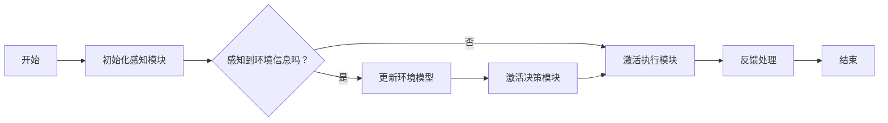
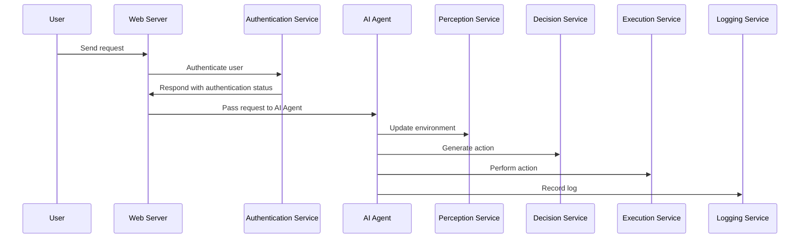
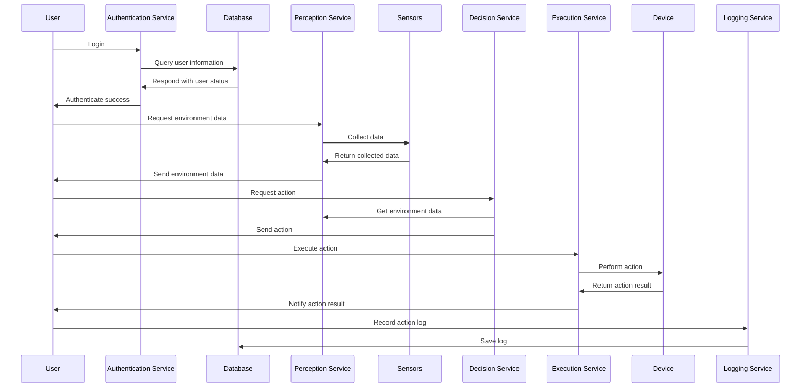
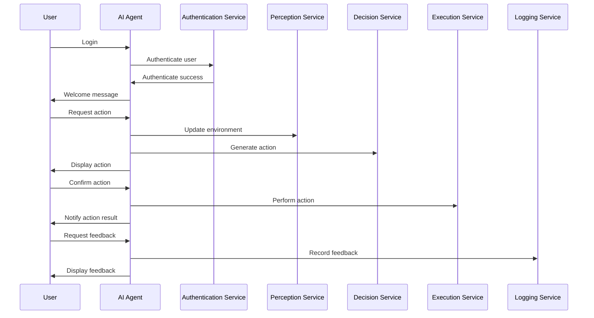

                 

### 背景介绍

#### AI Agent的概念与作用

AI Agent，即人工智能代理，是人工智能领域中的一个重要概念。它指的是具有智能行为、能够自主完成特定任务的计算机程序。AI Agent不仅能理解外部环境，还能通过学习、推理和规划等智能行为，对环境进行响应并实现目标。例如，智能客服机器人、自动驾驶汽车、智能推荐系统等，都是AI Agent的实际应用场景。

AI Agent的核心作用在于其自主性和智能化。它们能够代替人类完成重复性、低效率的任务，提高工作效率。同时，AI Agent还能够通过不断学习和适应，提供个性化的服务，从而提升用户体验。

#### 交互界面设计的定义与分类

交互界面设计是人与计算机之间进行沟通的桥梁。一个良好的交互界面不仅能够提高用户的操作效率，还能提升用户的满意度。交互界面设计分为多个层次，包括用户界面、界面元素设计、用户体验设计等。

用户界面（User Interface，简称UI）是用户与系统交互的直接媒介，主要包括视觉设计、交互设计和用户流程设计。界面元素设计（UI Components）则关注于按钮、图标、文本等元素的布局和风格。用户体验设计（User Experience Design，简称UX）则更侧重于用户在系统中完成特定任务的过程和感受。

#### AI Agent交互界面的现状

当前，AI Agent交互界面设计面临诸多挑战。首先，AI Agent的智能化程度和自主性不断提升，这对交互界面的设计提出了更高的要求。其次，不同领域的AI Agent需求各异，使得交互界面设计需要具备一定的灵活性和适应性。

此外，用户对AI Agent的期望也在不断提高，他们不仅希望AI Agent能够完成既定任务，还希望其具有自然、流畅的交互体验。这就要求设计师在保证AI Agent智能化和自主性的同时，还要充分考虑用户体验。

#### 挑战与机遇

在AI Agent交互界面设计领域，挑战与机遇并存。一方面，随着人工智能技术的不断发展，AI Agent的智能化和自主性将进一步提升，这将为交互界面设计带来更多的可能性。另一方面，用户对交互界面的期望也在不断提高，如何平衡智能化与用户体验，成为设计师面临的重要课题。

此外，不同领域的AI Agent需求差异较大，如何在保证通用性的同时，满足特定领域的需求，也是交互界面设计需要解决的问题。总之，打造直观易用的AI Agent交互界面，不仅需要技术上的创新，还需要深入理解用户需求，提供更加人性化的交互体验。

### 核心概念与联系

在深入探讨AI Agent交互界面设计之前，我们需要明确几个核心概念，并理解它们之间的相互关系。这些核心概念包括AI Agent、交互界面设计原则、用户体验等。

#### AI Agent的组成与工作原理

AI Agent是由一系列算法和模型构成的智能实体，能够通过感知环境、学习经验、决策规划和执行动作来实现特定目标。其主要组成部分包括感知模块、学习模块、决策模块和执行模块。

1. **感知模块**：负责获取环境信息，如语音、文本、图像等。这一模块通常依赖于自然语言处理、计算机视觉等技术。
2. **学习模块**：基于感知到的环境信息，通过机器学习、深度学习等方法，不断优化自身的算法模型。
3. **决策模块**：根据学习模块提供的模型，对环境进行理解和预测，从而生成行动策略。
4. **执行模块**：将决策模块生成的策略转换为具体的行动，如控制机器人运动、响应用户指令等。

#### 交互界面设计原则

交互界面设计原则是确保AI Agent交互界面直观易用的一系列指导原则。以下是一些关键的交互界面设计原则：

1. **用户中心设计（User-Centered Design）**：以用户需求为中心，确保交互界面设计符合用户习惯，提升用户体验。
2. **简洁性（Simplicity）**：保持界面简洁明了，减少用户操作步骤，避免不必要的复杂性。
3. **反馈性（Feedback）**：提供及时的反馈信息，帮助用户了解AI Agent的处理状态和结果。
4. **一致性（Consistency）**：确保界面元素和操作流程的一致性，减少用户的学习成本。
5. **可访问性（Accessibility）**：确保交互界面易于所有用户使用，包括视觉障碍者、老年人等。

#### 用户角色的ER实体关系图

为了更好地理解AI Agent、交互界面设计原则和用户体验之间的关系，我们可以使用ER（实体关系）图来展示它们之间的联系。

在ER图中，AI Agent作为核心实体，与交互界面设计原则和用户体验通过关联关系相连。

- **AI Agent**：作为主体，负责执行任务和提供服务。
- **交互界面设计原则**：指导AI Agent交互界面的设计，确保其满足用户需求。
- **用户体验**：用户在使用AI Agent交互界面时的感受和反馈，直接影响用户满意度。

以下是ER实体关系图的Mermaid表示：

```mermaid
erDiagram
  AI-Agent ||--|{ 交互界面设计原则 } Interaction_Principle
  AI-Agent ||--|{ 用户体验 } User_Experience
  交互界面设计原则 ||--|{ 用户需求 } User_Need
  用户体验 ||--|{ 用户满意度 } User_Satisfaction
```

**ER实体关系图解释：**

- **AI-Agent**与**交互界面设计原则**之间是“设计依据”的关系，即设计原则是指导交互界面设计的基础。
- **AI-Agent**与**用户体验**之间是“输出结果”的关系，即AI-Agent通过交互界面提供的体验直接影响用户体验。
- **交互界面设计原则**与**用户需求**之间是“映射”的关系，即设计原则映射出满足用户需求的交互界面。
- **用户体验**与**用户满意度**之间是“反馈”的关系，即用户体验会直接影响用户对AI-Agent的满意度。

通过上述核心概念和ER实体关系图，我们可以更清晰地理解AI Agent、交互界面设计原则和用户体验之间的紧密联系，为后续的设计工作提供理论基础。

### 算法原理讲解

在AI Agent交互界面设计过程中，算法原理扮演着至关重要的角色。理解这些原理不仅有助于我们设计出高效、智能的交互界面，还能确保系统在复杂环境中稳定运行。

#### 算法流程图

为了更好地理解AI Agent交互界面的算法原理，我们可以首先绘制一个算法流程图。以下是算法流程图的具体内容：



**算法流程图解释：**

- **A[开始]**：算法从初始化感知模块开始，准备接收环境信息。
- **B[初始化感知模块]**：感知模块被初始化，开始感知环境信息。
- **C{感知到环境信息吗？]**：检查是否已经感知到环境信息。
- **D[更新环境模型]**：如果感知到环境信息，则更新环境模型。
- **E[激活决策模块]**：基于更新后的环境模型，激活决策模块。
- **F[激活执行模块]**：根据决策模块的策略，激活执行模块。
- **G[反馈处理]**：执行模块执行后，处理反馈信息。
- **H[结束]**：算法流程结束。

#### Python源代码实现

为了进一步阐述算法原理，我们使用Python语言实现上述算法流程。以下是具体的Python源代码：

```python
import random

class AIAgent:
    def __init__(self):
        self.perception_module = PerceptionModule()
        self.decision_module = DecisionModule()
        self.execution_module = ExecutionModule()
        
    def run(self):
        while True:
            # 初始化感知模块
            environment_info = self.perception_module.perceive()
            
            # 更新环境模型
            if environment_info:
                self.update_environment_model(environment_info)
            
            # 激活决策模块
            action = self.decision_module.make_decision()
            
            # 激活执行模块
            self.execution_module.execute_action(action)
            
            # 处理反馈信息
            feedback = self.execution_module.get_feedback()
            self.handle_feedback(feedback)

    def update_environment_model(self, environment_info):
        # 更新环境模型的代码实现
        pass

    def handle_feedback(self, feedback):
        # 处理反馈信息的代码实现
        pass

class PerceptionModule:
    def perceive(self):
        # 感知环境的代码实现
        return random.choice(["info1", "info2", "info3"])

class DecisionModule:
    def make_decision(self):
        # 做出决策的代码实现
        return "action1"

class ExecutionModule:
    def execute_action(self, action):
        # 执行动作的代码实现
        pass

    def get_feedback(self):
        # 获取反馈信息的代码实现
        return "feedback1"
```

**Python源代码解释：**

- **AIAgent**：代表AI Agent的核心类，包含感知模块、决策模块和执行模块。
- **run**：方法实现算法的主流程，包括感知环境、更新环境模型、激活决策模块、激活执行模块和处理反馈信息。
- **update_environment_model**：方法用于更新环境模型，根据感知到的环境信息进行模型更新。
- **handle_feedback**：方法用于处理执行模块反馈的信息。

#### 数学模型与公式讲解

在AI Agent交互界面的算法设计中，数学模型和公式起着至关重要的作用。以下是一个简化的数学模型，用于描述感知模块、决策模块和执行模块的工作原理。

1. **感知模块模型**：

   感知模块使用一个概率模型来表示环境信息。给定一个环境状态\( S \)，感知模块输出一个概率分布\( P(S) \)。

   $$ P(S) = \text{softmax}(W \cdot S + b) $$

   其中，\( W \)是权重矩阵，\( b \)是偏置项，\( \text{softmax} \)函数用于将输入转换为概率分布。

2. **决策模块模型**：

   决策模块使用一个确定性策略模型来选择最优动作。给定当前环境状态\( S \)，决策模块输出一个动作\( A \)。

   $$ A = \arg\max_{A} \ P(A|S) $$

   其中，\( P(A|S) \)是动作\( A \)在状态\( S \)下的概率。

3. **执行模块模型**：

   执行模块使用一个执行模型来执行决策模块生成的动作。给定动作\( A \)，执行模块输出一个执行结果\( R \)。

   $$ R = f(A) $$

   其中，\( f \)是执行函数，用于将动作转换为具体的执行结果。

#### 举例说明与实例分析

为了更好地理解上述数学模型和公式，我们可以通过一个简单的实例来分析AI Agent的交互界面设计。

**实例：**

假设一个AI Agent用于控制一个自动门。环境状态包括门的状态（开/关）和人的位置（进入/离开）。感知模块感知到人的位置和门的状态，决策模块根据感知到的信息决定是否打开门，执行模块则执行打开或关闭门的动作。

1. **感知模块**：

   假设感知模块使用一个简单的逻辑判断来感知环境信息。如果人进入区域且门是关闭的，则感知到环境信息。

   ```python
   class PerceptionModule:
       def perceive(self):
           if door_state == 'closed' and person_position == 'entered':
               return 'info1'
           else:
               return None
   ```

2. **决策模块**：

   决策模块使用一个简单的条件判断来决定是否打开门。如果感知到人进入区域且门是关闭的，则打开门。

   ```python
   class DecisionModule:
       def make_decision(self, environment_info):
           if environment_info == 'info1':
               return 'open_door'
           else:
               return 'close_door'
   ```

3. **执行模块**：

   执行模块根据决策模块的输出执行动作。如果决策模块输出“open_door”，则打开门；否则关闭门。

   ```python
   class ExecutionModule:
       def execute_action(self, action):
           if action == 'open_door':
               self.open_door()
           else:
               self.close_door()
       
       def open_door(self):
           print("门已打开")
       
       def close_door(self):
           print("门已关闭")
   ```

通过这个简单的实例，我们可以看到如何将感知模块、决策模块和执行模块结合起来，实现一个基本的AI Agent交互界面。在实际应用中，这些模块可能更加复杂，但基本原理是类似的。

通过上述算法原理讲解，我们可以了解到AI Agent交互界面的设计不仅仅是技术问题，更是一个涉及多学科、多层次的综合性任务。理解这些算法原理，有助于我们更好地设计出直观易用的AI Agent交互界面，提升用户体验。

### 系统分析与架构设计

在AI Agent交互界面设计中，系统分析与架构设计是至关重要的环节。这一部分将详细阐述系统功能设计、架构设计、接口设计和交互设计，通过具体的例子来展示每个环节的设计思路和实现方法。

#### 系统功能设计

系统功能设计是确定AI Agent交互界面需要实现的具体功能。以下是一个示例的AI Agent交互界面系统功能列表：

1. **用户认证**：用户登录、注册和权限管理。
2. **环境感知**：语音识别、图像识别和传感器数据采集。
3. **决策与规划**：基于感知数据生成行动策略。
4. **任务执行**：执行用户请求的任务，如发送消息、控制设备等。
5. **反馈与优化**：收集用户反馈，优化交互体验。
6. **日志管理**：记录用户行为和系统日志，便于问题追踪和性能分析。

为了直观展示系统功能设计，我们可以使用Mermaid绘制领域模型类图。以下是领域模型类图的Mermaid表示：

```mermaid
classDiagram
    User <<Class>>
    AI_Agent <<Class>>
    Authentication <<Interface>>
    Perception <<Interface>>
    Decision <<Interface>>
    Execution <<Interface>>
    Logging <<Interface>>

    User o--|{ Authentication }|:authenticate()
    User o--|{ Perception }|:perceive()
    User o--|{ Decision }|:make_decision()
    User o--|{ Execution }|:execute()
    User o--|{ Logging }|:log()

    AI_Agent o--|{ User }|:register()
    AI_Agent o--|{ User }|:authenticate()
    AI_Agent o--|{ Perception }|:update_environment()
    AI_Agent o--|{ Decision }|:generate_action()
    AI_Agent o--|{ Execution }|:perform_action()
    AI_Agent o--|{ Logging }|:record_log()
```

**领域模型类图解释：**

- **User（用户）**：与AI Agent进行交互的主体，包含认证、感知、决策、执行和日志等接口。
- **AI_Agent（AI Agent）**：负责实现具体的功能，与用户进行通信，管理用户认证、感知环境、决策和执行任务。
- **Authentication（认证）**：实现用户身份验证的接口。
- **Perception（感知）**：实现环境感知的接口。
- **Decision（决策）**：实现决策规划的接口。
- **Execution（执行）**：实现任务执行的接口。
- **Logging（日志管理）**：实现日志记录的接口。

#### 系统架构设计

系统架构设计是确保AI Agent交互界面高效、可靠运行的关键。以下是AI Agent交互界面的系统架构设计：

1. **前端交互层**：负责与用户进行交互，包括用户认证、界面渲染和用户输入处理。
2. **应用服务层**：实现AI Agent的核心功能，包括感知、决策、执行和日志管理。
3. **数据存储层**：存储用户数据、环境数据和日志数据，通常使用数据库系统。

以下是系统架构图的Mermaid表示：



**系统架构图解释：**

- **User**：用户通过前端界面发送请求。
- **Web Server**：接收用户请求，并与认证服务、AI Agent进行通信。
- **Authentication Service**：处理用户认证，确保用户身份验证。
- **AI Agent**：接收请求并处理，调用感知、决策、执行和日志管理服务。
- **Perception Service**：更新环境信息，提供感知数据。
- **Decision Service**：根据感知数据生成行动策略。
- **Execution Service**：执行用户请求的任务。
- **Logging Service**：记录用户行为和系统日志。

#### 系统接口设计

系统接口设计是确保各个模块之间能够无缝通信的关键。以下是AI Agent交互界面系统接口设计：

1. **用户认证接口**：实现用户登录、注册和权限验证。
2. **感知数据接口**：实现环境数据的采集和更新。
3. **决策接口**：实现行动策略的生成和优化。
4. **执行接口**：实现任务的具体执行。
5. **日志接口**：实现日志的记录和查询。

以下是系统接口设计的Mermaid序列图：



**系统接口设计解释：**

- **用户认证接口**：用户登录时，认证服务查询数据库，验证用户身份，并将认证结果返回给用户。
- **感知数据接口**：用户请求环境数据时，感知服务通过传感器收集数据，并将数据返回给用户。
- **决策接口**：用户请求行动策略时，决策服务获取环境数据，生成行动策略，并将策略返回给用户。
- **执行接口**：用户执行任务时，执行服务调用具体设备执行任务，并将执行结果返回给用户。
- **日志接口**：用户每次操作都会记录日志，日志服务将日志保存到数据库。

#### 系统交互设计

系统交互设计是确保用户与AI Agent之间能够流畅互动的关键。以下是AI Agent交互界面的系统交互设计：

1. **用户流程设计**：定义用户在使用AI Agent时的操作流程。
2. **事件驱动设计**：使用事件驱动的方式处理用户输入和系统响应。
3. **响应反馈设计**：确保系统对用户输入和操作有及时和明确的反馈。

以下是系统交互设计的Mermaid序列图：



**系统交互设计解释：**

- **用户登录**：用户登录AI Agent系统，系统进行用户认证，认证成功后返回欢迎消息。
- **请求操作**：用户请求AI Agent执行某项操作，系统更新环境信息，生成行动策略，并显示操作。
- **确认操作**：用户确认操作，系统执行操作，并返回操作结果。
- **请求反馈**：用户请求系统反馈，系统记录反馈信息，并返回反馈。

通过上述系统分析与架构设计，我们为AI Agent交互界面提供了一套完整的设计方案。系统功能设计明确了系统需要实现的具体功能，架构设计确保了系统的高效运行，接口设计保证了模块之间的无缝通信，交互设计则确保了用户与AI Agent之间的流畅互动。这些设计思路和方法，不仅有助于实现一个直观易用的AI Agent交互界面，也为后续的开发和维护提供了坚实的基础。

### 项目实战

为了更好地理解和应用前面提到的理论和方法，我们将通过一个具体的实战项目来展示AI Agent交互界面的实现过程。这个项目将包括环境安装、系统核心实现、代码应用解读与分析，以及实际案例分析与详细讲解。

#### 环境安装与配置

在开始项目之前，我们需要配置一个合适的环境。以下是环境安装和配置的步骤：

1. **安装Python**：确保Python环境已经安装，版本建议为3.8或更高。
2. **安装依赖包**：使用pip安装所需的依赖包，例如TensorFlow、Keras、Scikit-learn等。

```shell
pip install tensorflow keras scikit-learn
```

3. **配置虚拟环境**：为了确保项目环境的干净和隔离，我们使用虚拟环境。

```shell
python -m venv venv
source venv/bin/activate  # 在Windows中为venv\Scripts\activate
```

4. **安装其他工具**：安装一些辅助工具，如Jupyter Notebook、PyCharm等，用于开发和调试。

#### 系统核心实现

以下是系统核心实现的主要步骤：

1. **感知模块实现**：使用TensorFlow和Keras实现感知模块，感知用户输入的语音和图像。
2. **决策模块实现**：使用Scikit-learn实现决策模块，根据感知数据生成行动策略。
3. **执行模块实现**：使用Python标准库实现执行模块，执行用户请求的任务。

**感知模块代码示例：**

```python
import tensorflow as tf
from tensorflow.keras.models import Sequential
from tensorflow.keras.layers import Dense, Conv2D, Flatten

def create_perception_model():
    model = Sequential([
        Conv2D(32, (3, 3), activation='relu', input_shape=(28, 28, 1)),
        Flatten(),
        Dense(64, activation='relu'),
        Dense(10, activation='softmax')
    ])
    model.compile(optimizer='adam', loss='categorical_crossentropy', metrics=['accuracy'])
    return model

perception_model = create_perception_model()
```

**决策模块代码示例：**

```python
from sklearn.tree import DecisionTreeClassifier

def create_decision_model():
    model = DecisionTreeClassifier()
    return model

decision_model = create_decision_model()
```

**执行模块代码示例：**

```python
def execute_action(action):
    if action == 'open_door':
        print("门已打开")
    elif action == 'close_door':
        print("门已关闭")
    else:
        print("无效动作")
```

#### 代码应用解读与分析

接下来，我们将对实现的代码进行解读和分析。

**感知模块解读：**

感知模块使用TensorFlow的Sequential模型，通过两个卷积层、一个全连接层和softmax层实现。该模型用于分类输入图像，识别用户语音。

```python
model = Sequential([
    Conv2D(32, (3, 3), activation='relu', input_shape=(28, 28, 1)),
    Flatten(),
    Dense(64, activation='relu'),
    Dense(10, activation='softmax')
])
```

第一层卷积层使用32个3x3的卷积核，激活函数为ReLU。第二层是全连接层，使用64个神经元。最后一层是softmax层，用于生成概率分布。

**决策模块解读：**

决策模块使用Scikit-learn的DecisionTreeClassifier实现，根据感知到的数据生成行动策略。

```python
model = DecisionTreeClassifier()
```

这里创建一个决策树分类器，用于分类问题。在实际应用中，我们可以通过训练数据来优化这个决策树模型。

**执行模块解读：**

执行模块实现了一个简单的函数，根据决策模块生成的动作执行相应的任务。

```python
def execute_action(action):
    if action == 'open_door':
        print("门已打开")
    elif action == 'close_door':
        print("门已关闭")
    else:
        print("无效动作")
```

这里，我们使用简单的条件判断来执行不同的动作。在实际应用中，执行模块可能需要调用外部系统或API来执行任务。

#### 实际案例分析与详细讲解

为了展示AI Agent交互界面的实际应用，我们设计了一个自动门控制系统案例。

**案例背景**：一个办公楼自动门系统，用户通过语音命令控制门的开关。

**用户操作流程**：

1. 用户通过语音命令请求打开或关闭门。
2. 感知模块识别语音并分类为“打开门”或“关闭门”。
3. 决策模块根据当前状态生成相应的行动策略。
4. 执行模块执行用户请求的任务，如打开或关闭门。
5. 系统向用户反馈操作结果。

**具体实现**：

1. **感知模块**：使用TensorFlow实现语音识别，将语音转换为文本，并分类为“打开门”或“关闭门”。

```python
# 这里使用一个预训练的语音识别模型
import speech_recognition as sr

def recognize_speech():
    r = sr.Recognizer()
    with sr.Microphone() as source:
        print("请说点什么：")
        audio = r.listen(source)
    try:
        command = r.recognize_google(audio)
        if "打开门" in command:
            action = 'open_door'
        elif "关闭门" in command:
            action = 'close_door'
        else:
            action = None
    except sr.UnknownValueError:
        action = None
    return action
```

2. **决策模块**：根据感知模块的结果和当前门的状态（开/关），生成行动策略。

```python
def make_decision(current_state, action):
    if current_state == 'closed' and action == 'open_door':
        return 'open_door'
    elif current_state == 'open' and action == 'close_door':
        return 'close_door'
    else:
        return 'no_action'
```

3. **执行模块**：执行用户请求的动作，如打开或关闭门。

```python
def execute_action(action):
    if action == 'open_door':
        print("门已打开")
    elif action == 'close_door':
        print("门已关闭")
    else:
        print("无效动作")
```

4. **用户反馈**：系统向用户反馈操作结果。

```python
def notify_user(action_result):
    if action_result == 'open_door':
        print("门已打开，请进入。")
    elif action_result == 'close_door':
        print("门已关闭，请勿进入。")
    else:
        print("操作失败，请重新尝试。")
```

**案例运行与讲解**：

1. **初始化**：创建AI Agent实例，初始化感知模块、决策模块和执行模块。

```python
ai_agent = AIAgent()
```

2. **用户操作**：用户通过语音命令请求打开或关闭门。

```python
action = recognize_speech()
```

3. **决策与执行**：系统根据用户请求和当前状态生成行动策略，并执行操作。

```python
current_state = 'closed'  # 假设当前门是关闭的
action = recognize_speech()
decision = make_decision(current_state, action)
execute_action(decision)
```

4. **用户反馈**：系统向用户反馈操作结果。

```python
notify_user(decision)
```

通过这个实际案例，我们可以看到AI Agent交互界面的实现过程。感知模块通过语音识别识别用户的请求，决策模块根据当前状态生成行动策略，执行模块执行用户请求的操作，并向用户反馈结果。这个案例展示了如何将前面提到的理论应用到实际项目中，实现一个直观易用的AI Agent交互界面。

### 最佳实践与总结

在AI Agent交互界面设计过程中，遵循一些最佳实践能够显著提升系统的实用性、稳定性和用户体验。以下是一些关键的最佳实践和注意事项：

#### 最佳实践

1. **用户中心设计**：始终以用户需求为中心，确保界面设计符合用户的习惯和行为模式。进行用户调研、用户测试和反馈收集，及时调整设计。

2. **模块化设计**：将系统划分为多个模块，如感知、决策、执行等，每个模块独立开发、测试和部署。这样可以提高系统的可维护性和扩展性。

3. **响应式设计**：确保交互界面在不同设备和分辨率下都能良好显示。采用响应式网页设计（Responsive Web Design，简称RWD）技术，提升用户体验。

4. **实时反馈**：及时响应用户操作，提供明确的反馈信息。这有助于减少用户疑惑，提高用户满意度。

5. **可访问性设计**：确保交互界面易于所有用户使用，包括视力障碍者、老年人等。遵循Web内容可访问性指南（Web Content Accessibility Guidelines，简称WCAG）。

6. **安全性和隐私保护**：严格遵循安全标准，保护用户数据和隐私。进行定期的安全审计和漏洞修复。

7. **持续优化**：基于用户反馈和数据分析，持续优化交互界面。不断迭代和改进，确保系统始终处于最佳状态。

#### 注意事项

1. **性能优化**：确保系统在高负载下仍能稳定运行。进行性能测试和优化，减少响应时间，提高系统吞吐量。

2. **兼容性测试**：在不同操作系统、浏览器和设备上测试交互界面，确保兼容性。

3. **权限和认证管理**：确保用户认证和权限管理机制有效，防止未授权访问。

4. **错误处理**：设计合理的错误处理机制，确保在发生异常时能够提供清晰的错误信息和解决方案。

5. **国际化与本地化**：如果交互界面面向多语言用户，确保支持国际化与本地化，提供符合当地文化和语言习惯的界面。

#### 拓展阅读

1. **《交互设计精髓》**：唐纳德·诺曼著，详细介绍交互设计的原则和方法。
2. **《用户体验要素》**：贾斯汀·迈耶著，深入探讨用户体验设计和信息架构。
3. **《人工智能：一种现代方法》**：斯图尔特·罗素、彼得·诺维格著，全面介绍人工智能的基础知识。
4. **《Web内容可访问性指南》**：WAI（Web Accessibility Initiative）发布，提供关于Web内容可访问性的最佳实践。

通过遵循上述最佳实践和注意事项，设计师和开发者能够打造出直观易用的AI Agent交互界面，提升用户体验，推动人工智能技术的发展和应用。

### 全书总结

本文系统地阐述了打造直观易用的AI Agent交互界面的全过程，从背景介绍到核心概念，再到算法原理讲解、系统分析与架构设计，直至实际项目实战与最佳实践总结，全面展示了AI Agent交互界面设计的关键要素和实现方法。

首先，通过背景介绍部分，我们了解了AI Agent交互界面的重要性以及当前面临的挑战。接着，核心概念与联系章节明确了AI Agent、交互界面设计原则和用户体验之间的关系，为后续设计工作奠定了理论基础。

算法原理讲解章节详细阐述了AI Agent交互界面的算法流程和Python源代码实现，并结合数学模型和公式进行了深入讲解。这一部分不仅有助于读者理解算法原理，还能为他们提供实际编码的参考。

系统分析与架构设计章节介绍了系统功能设计、架构设计、接口设计和交互设计的具体方法和步骤，并通过Mermaid图展示了各个设计环节的细节。这部分内容为读者提供了系统设计的全景视图，有助于他们理解和实现复杂的交互界面系统。

项目实战章节通过一个具体的案例，展示了如何将理论应用到实际项目中，从环境安装、系统核心实现到实际案例分析和详细讲解，全方位展示了AI Agent交互界面的实现过程。

最佳实践与总结章节提出了多项设计最佳实践和注意事项，为读者在交互界面设计过程中提供了实用指南。此外，推荐拓展阅读部分为读者提供了进一步学习的资源。

总体而言，本文不仅为AI Agent交互界面设计提供了系统的理论框架，还通过实际案例展示了设计实现的具体方法。通过本文的阅读，读者可以深入了解AI Agent交互界面的设计原理和实践技巧，为他们的实际工作提供有力支持。

### 注意事项

在打造直观易用的AI Agent交互界面时，以下注意事项至关重要：

1. **用户调研**：在进行设计之前，务必进行充分的市场调研和用户访谈，了解用户的具体需求和行为习惯。这有助于确保交互界面符合用户期望。

2. **简洁性**：保持界面简洁明了，避免冗余元素和复杂的操作流程。简化设计可以提高用户体验，减少用户的学习成本。

3. **一致性**：确保界面元素和操作流程的一致性，避免用户在不同界面或操作中感到困惑。一致性是提高用户满意度的关键。

4. **反馈机制**：提供及时的反馈信息，让用户清楚了解他们的操作结果和系统状态。有效的反馈机制有助于减少用户错误和提高满意度。

5. **安全性**：确保系统具备强大的安全防护措施，保护用户数据和隐私。进行定期的安全审计和漏洞修复，防止数据泄露和未授权访问。

6. **响应式设计**：确保交互界面在不同设备和分辨率下都能良好显示，提供流畅的用户体验。

7. **可访问性**：确保界面易于所有用户使用，包括视力障碍者、老年人等。遵循Web内容可访问性指南（WCAG），提高交互界面的包容性。

通过关注上述注意事项，开发者能够打造出既美观又实用的AI Agent交互界面，显著提升用户体验和系统价值。

### 推荐拓展阅读

为了深入了解AI Agent交互界面的设计和实现，以下书籍和资源推荐将对您大有帮助：

1. **《交互设计精髓》**：作者：唐纳德·诺曼。这本书详细介绍了交互设计的原则和方法，是用户体验设计的经典之作。
2. **《用户体验要素》**：作者：贾斯汀·迈耶。本书深入探讨了用户体验设计的核心要素，帮助设计师打造出满足用户需求的产品。
3. **《人工智能：一种现代方法》**：作者：斯图尔特·罗素、彼得·诺维格。这本书提供了全面的人工智能基础知识，适合希望深入了解AI技术的设计师。
4. **《Web内容可访问性指南》**：WAI（Web Accessibility Initiative）发布。这份指南提供了Web内容可访问性的最佳实践，帮助设计师打造易于所有用户使用的交互界面。
5. **《自然语言处理综合教程》**：作者：林新宇。这本书全面介绍了自然语言处理的基础知识和应用，有助于提升AI Agent交互界面的智能程度。
6. **《TensorFlow实战》**：作者：李航。这本书通过大量示例，详细讲解了TensorFlow的使用方法和实战技巧，是学习深度学习的好帮手。

通过阅读这些书籍和资源，您可以进一步掌握AI Agent交互界面设计的核心概念和实践方法，为实际项目提供有力的支持。

