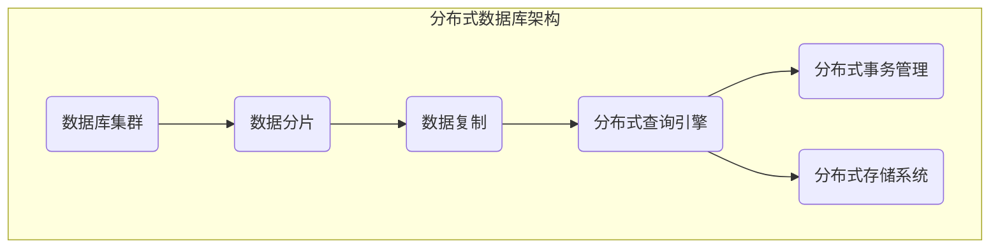
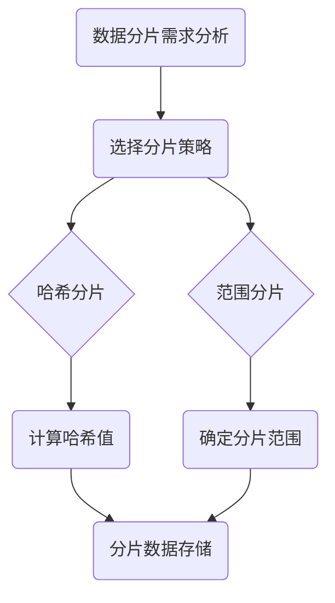
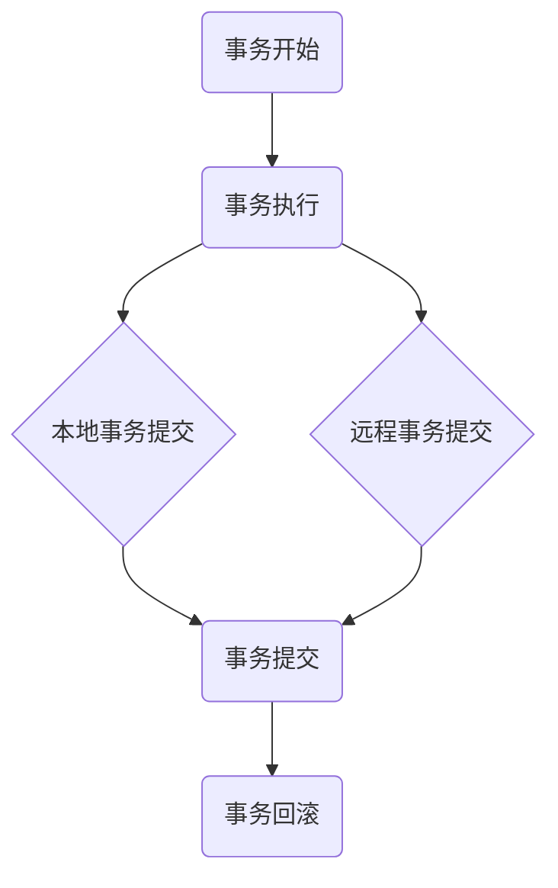
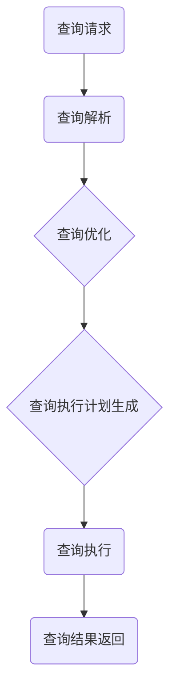
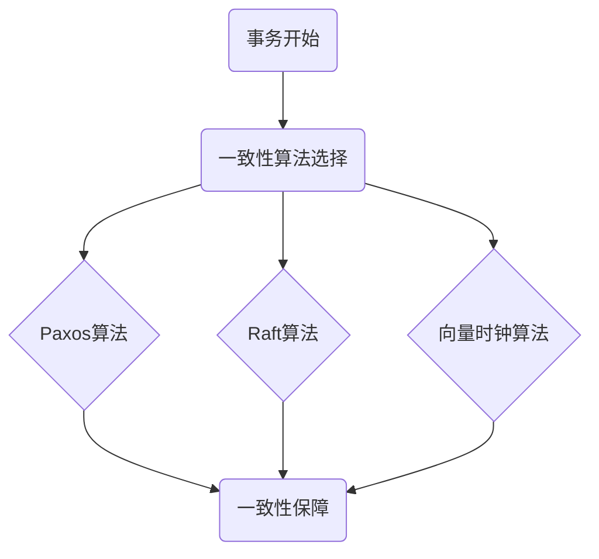

                 

# 打造高性能分布式数据库系统

## 关键词
- 分布式数据库系统
- 高性能
- 分布式存储
- 分布式查询引擎
- 分布式事务管理
- 安全性
- 监控与维护

## 摘要
本文将深入探讨如何打造高性能分布式数据库系统。首先，我们将了解分布式数据库系统的背景和挑战，包括其演变、需求和优势。接着，我们将介绍分布式数据库系统的基本概念、设计和实现，以及性能优化和安全性。随后，我们将详细解析分布式数据库系统的核心组件，包括分布式存储系统、查询引擎、事务管理、复制与同步、集群管理以及中间件。在实际应用部分，我们将讨论高性能分布式数据库系统的实践，包括环境搭建、核心功能实现、性能测试和案例分析。最后，我们将总结最佳实践，并提供相关注意事项和拓展阅读建议。

## 1. 分布式数据库系统概述

### 1.1 分布式数据库系统背景与挑战

**1.1.1 数据库系统的演变**

数据库系统的发展经历了多个阶段，从早期的集中式单机数据库到分布式数据库，再到现代的云计算数据库。随着数据规模的不断扩大和数据访问频率的增加，传统的集中式数据库系统逐渐暴露出性能瓶颈和扩展性限制。分布式数据库系统应运而生，以其强大的扩展性和高性能成为现代数据库系统的主流选择。

**1.1.2 分布式数据库的需求**

分布式数据库系统的主要需求包括：

1. **高可用性**：分布式数据库系统能够在单个节点故障时自动恢复，确保系统的持续运行。
2. **高扩展性**：分布式数据库系统能够通过添加更多节点来扩展存储和处理能力，以应对不断增长的数据规模。
3. **高性能**：分布式数据库系统能够通过并行处理和数据分片来实现更高的查询性能。
4. **数据一致性**：分布式数据库系统需要在多个节点间保持数据的一致性，避免数据冲突。

**1.1.3 分布式数据库的优势与挑战**

分布式数据库系统的优势包括：

1. **扩展性强**：分布式数据库系统能够通过水平扩展来应对数据规模的增长，而无需对系统进行重构。
2. **高可用性**：分布式数据库系统可以在单个节点故障时自动恢复，确保系统的持续运行。
3. **高性能**：分布式数据库系统能够通过并行处理和数据分片来实现更高的查询性能。

然而，分布式数据库系统也面临着一些挑战：

1. **数据一致性**：在分布式环境中保持数据一致性是一项挑战，需要采用各种一致性算法来确保数据一致性。
2. **分布式事务管理**：分布式事务管理比集中式事务管理更为复杂，需要处理跨多个节点的数据操作和并发控制。
3. **网络延迟**：分布式数据库系统需要在多个节点间传输数据，网络延迟可能会影响系统的性能。

### 1.2 分布式数据库系统基本概念

**1.2.1 分布式数据库定义**

分布式数据库系统是由多个节点组成的数据库系统，这些节点可以分布在不同的地理位置，通过计算机网络进行连接。分布式数据库系统将数据分片存储在多个节点上，以实现数据的高可用性和高扩展性。

**1.2.2 分布式数据库架构**

分布式数据库系统通常包括以下几个主要组件：

1. **数据分片**：数据分片是将数据拆分成多个片段，并存储在多个节点上。
2. **数据复制**：数据复制是将数据从源节点复制到目标节点，以提高数据可用性和容错能力。
3. **分布式查询引擎**：分布式查询引擎负责处理分布式环境中的查询请求，包括数据分片、数据复制和分布式查询优化。
4. **分布式事务管理**：分布式事务管理负责处理跨多个节点的数据操作，确保数据的一致性和完整性。

**1.2.3 分布式数据库的一致性模型**

分布式数据库系统的一致性模型主要有以下几种：

1. **强一致性**：强一致性保证在任何情况下，对数据的修改都能立即反映到所有节点上。这需要所有节点同时进行读写操作，性能较低，但数据一致性有保障。
2. **最终一致性**：最终一致性允许在一定延迟范围内，数据的修改可能不会立即反映到所有节点。最终一致性比强一致性有更高的性能，但数据一致性存在一定风险。
3. **一致性模型选择**：选择合适的一致性模型取决于应用的需求和性能要求。例如，对于金融交易系统，强一致性是必不可少的；而对于一些读多写少的在线服务，最终一致性可能更为适合。

### 1.3 分布式数据库系统设计与实现

**1.3.1 分布式数据库系统设计原则**

分布式数据库系统的设计需要遵循以下几个原则：

1. **分片原则**：数据分片要尽量均匀，以避免某些节点的负载过高。
2. **冗余原则**：数据复制可以提高系统的可用性，但也要避免过度复制，以减少存储开销。
3. **位置透明原则**：用户不应感知到数据的分布情况，即分布式数据库系统的位置透明性。
4. **访问透明原则**：用户应能够像访问单机数据库一样访问分布式数据库系统，即分布式数据库系统的访问透明性。

**1.3.2 分布式数据库实现技术**

分布式数据库系统的实现涉及多个方面，包括：

1. **数据分片算法**：数据分片算法负责将数据分配到不同的节点上。常见的分片算法包括哈希分片、范围分片和列表分片等。
2. **数据复制技术**：数据复制技术负责将数据从源节点复制到目标节点。常见的复制技术包括主从复制和主主复制等。
3. **分布式查询优化**：分布式查询优化是提高分布式数据库系统查询性能的关键技术。分布式查询优化包括查询重写、查询分解和分布式查询执行计划等。
4. **分布式事务管理**：分布式事务管理是确保分布式数据库系统数据一致性的关键。分布式事务管理包括分布式事务协议、分布式锁和分布式隔离级别等。

### 1.4 分布式数据库系统性能优化

**1.4.1 性能优化策略**

分布式数据库系统的性能优化可以从以下几个方面进行：

1. **数据分片与负载均衡**：合理的数据分片和负载均衡可以避免某些节点的负载过高，提高系统的整体性能。
2. **缓存机制**：缓存可以将频繁访问的数据存储在内存中，减少磁盘访问次数，提高查询性能。
3. **数据压缩**：数据压缩可以减少存储空间和传输数据的大小，提高系统的性能。
4. **查询优化**：查询优化包括查询重写、查询分解和查询执行计划等，通过优化查询语句和查询执行流程来提高查询性能。

**1.4.2 缓存机制**

缓存机制在分布式数据库系统中起到关键作用，可以提高查询性能。常见的缓存技术包括：

1. **本地缓存**：本地缓存将频繁访问的数据存储在内存中，减少磁盘访问次数。
2. **分布式缓存**：分布式缓存将缓存数据分布到多个节点上，以提高缓存的可扩展性和性能。
3. **缓存一致性**：缓存一致性是确保缓存中数据与实际存储数据保持一致性的关键，需要采用各种一致性算法来实现。

**1.4.3 数据分布与负载均衡**

数据分布与负载均衡是分布式数据库系统性能优化的关键。合理的数据分布和负载均衡可以避免某些节点的负载过高，提高系统的整体性能。常见的数据分布和负载均衡技术包括：

1. **哈希分片**：哈希分片通过哈希函数将数据分配到不同的节点上，可以确保负载均衡。
2. **动态负载均衡**：动态负载均衡可以根据系统的当前负载情况，自动调整数据分布和节点负载。
3. **负载均衡算法**：常见的负载均衡算法包括轮询、最少连接和加权轮询等。

### 1.5 分布式数据库系统安全性

**1.5.1 安全性需求**

分布式数据库系统的安全性需求包括：

1. **数据加密**：数据加密可以确保数据在存储和传输过程中的安全性。
2. **访问控制**：访问控制可以限制用户对数据的访问权限，防止未授权访问。
3. **分布式事务安全性**：分布式事务安全性是确保分布式数据库系统中事务数据一致性和完整性的关键。

**1.5.2 加密与访问控制**

加密与访问控制是分布式数据库系统安全性的关键技术。加密技术包括：

1. **对称加密**：对称加密使用相同的密钥对数据进行加密和解密，如AES算法。
2. **非对称加密**：非对称加密使用不同的密钥对数据进行加密和解密，如RSA算法。

访问控制技术包括：

1. **基于角色的访问控制（RBAC）**：基于角色的访问控制将用户与角色关联，角色与权限关联，从而实现细粒度的访问控制。
2. **访问控制列表（ACL）**：访问控制列表将用户或角色与权限列表关联，以实现访问控制。

**1.5.3 分布式事务安全性**

分布式事务安全性是确保分布式数据库系统中事务数据一致性和完整性的关键。分布式事务安全性涉及以下技术：

1. **两阶段提交（2PC）**：两阶段提交是一种分布式事务协议，通过协调者节点和参与者节点之间的通信，确保分布式事务的原子性和一致性。
2. **三阶段提交（3PC）**：三阶段提交是两阶段提交的改进版本，通过引入预提交阶段，进一步提高了分布式事务的性能和安全性。

### 1.6 分布式数据库系统监控与维护

**1.6.1 监控指标**

分布式数据库系统的监控指标包括：

1. **系统性能指标**：如CPU利用率、内存利用率、磁盘I/O等。
2. **数据库性能指标**：如查询响应时间、事务处理时间等。
3. **数据一致性指标**：如数据分片一致性、数据复制一致性等。

**1.6.2 维护策略**

分布式数据库系统的维护策略包括：

1. **定期备份**：定期备份可以防止数据丢失，确保系统的高可用性。
2. **故障处理**：故障处理包括故障检测、故障定位和故障恢复等。
3. **性能调优**：性能调优包括查询优化、数据分布优化和负载均衡优化等。

**1.6.3 故障处理与恢复**

故障处理与恢复是分布式数据库系统维护的重要环节。故障处理与恢复包括：

1. **故障检测**：通过监控指标和报警系统，及时发现故障。
2. **故障定位**：通过日志分析和故障排查，定位故障原因。
3. **故障恢复**：通过备份和恢复策略，快速恢复系统运行。

### 1.7 本章小结

本章对分布式数据库系统进行了概述，包括其背景、挑战、基本概念、设计和实现、性能优化、安全性和监控与维护。通过对本章内容的了解，读者可以建立对分布式数据库系统的整体认识，为后续章节的学习打下基础。

## 2. 分布式数据库系统核心组件详解

### 2.1 分布式存储系统

**2.1.1 存储系统架构**

分布式存储系统是分布式数据库系统的核心组件之一，负责存储和管理数据。分布式存储系统通常采用分布式文件系统来实现，其架构包括以下几个主要部分：

1. **数据分片**：数据分片是将数据拆分成多个片段，并存储在多个节点上。数据分片可以提高数据的存储和查询性能。
2. **数据复制**：数据复制是将数据从源节点复制到目标节点，以提高数据的可用性和容错能力。数据复制可以是同步复制或异步复制。
3. **元数据管理**：元数据管理负责管理数据的元信息，如数据分片信息、数据节点信息等。
4. **数据分布与负载均衡**：数据分布与负载均衡负责将数据均匀地分布到多个节点上，以避免某些节点的负载过高。

**2.1.2 分布式文件系统**

分布式文件系统是分布式存储系统的核心组件，负责存储和管理数据。常见的分布式文件系统包括HDFS（Hadoop分布式文件系统）、CFS（Ceph分布式文件系统）和GlusterFS等。这些分布式文件系统具有以下特点：

1. **高可用性**：分布式文件系统通过数据复制和故障检测机制，确保数据的高可用性。
2. **高扩展性**：分布式文件系统可以通过添加更多节点来扩展存储容量和性能。
3. **高性能**：分布式文件系统通过数据分片和并行处理，实现高性能的数据访问。
4. **数据一致性**：分布式文件系统通过一致性算法，确保数据的一致性和完整性。

**2.1.3 分布式存储协议**

分布式存储系统需要使用分布式存储协议来协调多个节点的数据访问。常见的分布式存储协议包括NFS（网络文件系统）、iSCSI（互联网场景下的SCSI协议）和FUSE（用户空间文件系统）等。这些分布式存储协议具有以下特点：

1. **透明性**：分布式存储协议为用户提供了透明访问分布式存储系统的接口，用户无需感知数据的分布情况。
2. **兼容性**：分布式存储协议可以与现有的操作系统和应用系统兼容，方便分布式存储系统的集成和部署。
3. **性能**：分布式存储协议通过并行处理和数据传输优化，提高了分布式存储系统的性能。

### 2.2 分布式查询引擎

**2.2.1 查询引擎架构**

分布式查询引擎是分布式数据库系统的核心组件之一，负责处理分布式环境中的查询请求。分布式查询引擎的架构包括以下几个主要部分：

1. **查询解析**：查询解析负责将用户输入的查询语句转换为分布式查询计划。
2. **查询优化**：查询优化负责对分布式查询计划进行优化，以降低查询执行时间和资源消耗。
3. **分布式查询执行**：分布式查询执行负责将优化后的查询计划在分布式环境中执行，包括数据分片、数据传输和查询结果合并等。
4. **查询缓存**：查询缓存负责将频繁执行的查询结果缓存起来，以减少查询执行时间和资源消耗。

**2.2.2 分布式查询优化**

分布式查询优化是提高分布式数据库系统查询性能的关键技术。分布式查询优化包括以下几个主要方面：

1. **查询重写**：查询重写是将用户输入的查询语句转换为更高效的查询计划。例如，将连接操作转换为分布式查询计划。
2. **查询分解**：查询分解是将复杂的查询分解为多个简单查询，以提高查询执行效率和并行性。
3. **分布式查询执行计划**：分布式查询执行计划是将优化后的查询计划在分布式环境中执行的具体步骤和策略。

**2.2.3 分布式SQL处理**

分布式SQL处理是分布式查询引擎的核心功能之一，负责处理分布式环境中的SQL查询。分布式SQL处理包括以下几个主要方面：

1. **分布式SQL语法解析**：分布式SQL语法解析是将用户输入的SQL查询语句转换为内部查询表示。
2. **分布式SQL语义分析**：分布式SQL语义分析是检查SQL查询语句的语法和语义是否正确，以及查询语句是否符合分布式查询要求。
3. **分布式SQL执行**：分布式SQL执行是将SQL查询语句在分布式环境中执行，包括数据分片、数据传输和查询结果合并等。

### 2.3 分布式事务管理

**2.3.1 事务模型**

分布式事务管理是分布式数据库系统的重要功能之一，负责处理分布式环境中的事务。分布式事务模型主要有以下几种：

1. **两阶段提交（2PC）**：两阶段提交是一种分布式事务协议，通过协调者节点和参与者节点之间的通信，确保分布式事务的原子性和一致性。
2. **三阶段提交（3PC）**：三阶段提交是两阶段提交的改进版本，通过引入预提交阶段，进一步提高了分布式事务的性能和安全性。
3. **最终一致性模型**：最终一致性模型是一种分布式事务模型，允许在一定延迟范围内，数据的修改可能不会立即反映到所有节点。最终一致性模型比强一致性模型有更高的性能，但数据一致性存在一定风险。

**2.3.2 分布式事务处理**

分布式事务处理是分布式数据库系统的重要功能之一，负责处理分布式环境中的事务。分布式事务处理包括以下几个主要方面：

1. **事务开始**：事务开始时，分布式数据库系统会分配一个全局事务ID，并初始化事务状态。
2. **事务执行**：事务执行时，分布式数据库系统会按照事务计划对多个节点上的数据进行修改。
3. **事务提交**：事务提交时，分布式数据库系统会通过分布式事务协议，确保事务的一致性和完整性。
4. **事务回滚**：事务回滚时，分布式数据库系统会撤销事务执行过程中对数据的修改，恢复数据到事务开始前的状态。

**2.3.3 分布式事务一致性算法**

分布式事务一致性算法是分布式数据库系统的重要技术之一，负责保证分布式事务的一致性。分布式事务一致性算法主要有以下几种：

1. **Paxos算法**：Paxos算法是一种分布式一致性算法，可以保证多个节点之间的数据一致性。
2. **Raft算法**：Raft算法是一种基于Paxos算法的分布式一致性算法，具有更好的性能和可理解性。
3. **向量时钟算法**：向量时钟算法是一种分布式事务一致性算法，通过记录每个节点的事务版本号，保证分布式事务的一致性。

### 2.4 分布式数据库复制与同步

**2.4.1 复制策略**

分布式数据库复制与同步是分布式数据库系统的重要功能之一，负责将数据从源节点复制到目标节点，以提高数据的可用性和容错能力。分布式数据库复制策略主要有以下几种：

1. **主从复制**：主从复制是一种简单的复制策略，其中一个节点作为主节点，负责处理所有写操作，其他节点作为从节点，负责从主节点复制数据。
2. **主主复制**：主主复制是一种更高级的复制策略，多个节点都可以作为主节点，处理写操作，并相互复制数据。
3. **多主复制**：多主复制是一种更为复杂的复制策略，多个节点都可以作为主节点，处理写操作，并相互复制数据。

**2.4.2 同步机制**

分布式数据库复制与同步的同步机制负责确保数据在源节点和目标节点之间的一致性。同步机制主要有以下几种：

1. **异步同步**：异步同步是一种非阻塞的同步机制，数据在源节点修改后，立即发送到目标节点，但无需等待目标节点的确认。
2. **同步同步**：同步同步是一种阻塞的同步机制，数据在源节点修改后，发送到目标节点，并等待目标节点的确认，确保数据的一致性。
3. **半同步同步**：半同步同步是一种混合的同步机制，数据在源节点修改后，发送到目标节点，但无需等待目标节点的确认，而是在一定延迟后检查数据的一致性。

**2.4.3 数据一致性保障**

分布式数据库复制与同步的数据一致性保障是确保数据在分布式环境中的一致性和完整性。数据一致性保障主要包括以下几种技术：

1. **版本控制**：版本控制通过记录每个数据的版本号，确保数据的一致性和完整性。
2. **时间戳**：时间戳通过记录每个数据的时间戳，确保数据的一致性和顺序。
3. **分布式锁**：分布式锁通过在分布式环境中协调多个节点的访问，确保数据的一致性和并发控制。

### 2.5 分布式数据库集群管理

**2.5.1 集群架构**

分布式数据库集群管理是分布式数据库系统的重要功能之一，负责管理和监控分布式数据库集群。分布式数据库集群架构通常包括以下几个主要部分：

1. **集群节点**：集群节点是分布式数据库集群的组成部分，负责存储数据和处理查询。
2. **集群管理**：集群管理负责管理和监控分布式数据库集群，包括节点管理、数据分片管理、负载均衡和故障恢复等。
3. **集群监控**：集群监控负责监控分布式数据库集群的性能和健康状况，包括系统性能指标、数据库性能指标和数据一致性指标等。

**2.5.2 节点管理与监控**

节点管理是分布式数据库集群管理的核心功能之一，负责管理和监控集群节点。节点管理主要包括以下方面：

1. **节点添加与删除**：节点添加与删除负责将新的节点添加到集群中，或将不健康的节点从集群中删除。
2. **节点监控**：节点监控负责监控集群节点的性能和健康状况，包括CPU利用率、内存利用率、磁盘I/O和网络流量等。
3. **节点负载均衡**：节点负载均衡负责根据集群节点的性能和负载情况，合理分配查询请求和存储数据。

**2.5.3 集群伸缩性**

集群伸缩性是分布式数据库系统的重要特点之一，负责根据数据规模和查询负载的变化，动态调整集群的规模和性能。集群伸缩性主要包括以下方面：

1. **水平伸缩**：水平伸缩通过添加更多的节点来扩展集群的存储和处理能力，以提高系统的性能和可扩展性。
2. **垂直伸缩**：垂直伸缩通过升级集群节点的硬件配置来提高集群的性能和可扩展性。
3. **弹性伸缩**：弹性伸缩通过自动化伸缩策略，根据实际负载情况自动调整集群的规模，以实现高效的资源利用。

### 2.6 分布式数据库中间件

**2.6.1 中间件概述**

分布式数据库中间件是分布式数据库系统的重要组成部分，负责连接应用程序和数据库系统，提供数据访问、事务管理和缓存等功能。分布式数据库中间件通常包括以下几个主要部分：

1. **数据访问层**：数据访问层负责连接应用程序和数据库系统，提供数据访问接口。
2. **事务管理**：事务管理负责处理分布式环境中的事务，确保事务的一致性和完整性。
3. **缓存机制**：缓存机制负责将频繁访问的数据缓存起来，以提高系统的性能和响应速度。

**2.6.2 分布式数据库连接池**

分布式数据库连接池是分布式数据库中间件的重要功能之一，负责管理和复用数据库连接。分布式数据库连接池主要包括以下方面：

1. **连接池管理**：连接池管理负责创建、管理和销毁数据库连接，确保连接的可重用性。
2. **连接池配置**：连接池配置负责配置连接池的参数，如连接数、连接超时时间等。
3. **连接池监控**：连接池监控负责监控连接池的性能和健康状况，包括连接数、连接时间和连接失败率等。

**2.6.3 分布式数据库监控与告警**

分布式数据库监控与告警是分布式数据库中间件的重要功能之一，负责监控分布式数据库系统的性能和健康状况，并及时发出告警。分布式数据库监控与告警主要包括以下方面：

1. **监控指标**：监控指标负责监控分布式数据库系统的性能和健康状况，如CPU利用率、内存利用率、磁盘I/O和网络流量等。
2. **告警策略**：告警策略负责根据监控指标，设置告警阈值和告警方式，确保及时发现问题。
3. **告警通知**：告警通知负责将告警信息发送给相关人员，如邮件、短信、微信等。

### 2.7 本章小结

本章详细介绍了分布式数据库系统的核心组件，包括分布式存储系统、查询引擎、事务管理、复制与同步、集群管理和中间件。通过对本章内容的了解，读者可以深入了解分布式数据库系统的核心功能和实现原理，为后续章节的学习打下基础。

## 3. 高性能分布式数据库系统实践

### 3.1 高性能分布式数据库系统选型

**3.1.1 市场分析**

在当前市场环境下，高性能分布式数据库系统种类繁多，包括MySQL Cluster、Cassandra、MongoDB、HBase、Redis等。每种数据库系统都有其独特的优势和适用场景，因此在选型时需要充分考虑应用的需求和性能要求。

**3.1.2 选型因素**

高性能分布式数据库系统的选型需要考虑以下几个因素：

1. **性能要求**：包括查询性能、读写性能、扩展性能等。
2. **数据规模**：包括数据量、数据增长率和数据分布情况。
3. **一致性需求**：包括最终一致性、强一致性等。
4. **可用性要求**：包括故障恢复能力、数据备份和恢复能力等。
5. **功能需求**：包括SQL支持、事务管理、缓存机制、分布式事务等。

**3.1.3 案例分析**

以下是一个实际案例：

**案例背景**：某电商公司在业务快速增长阶段，面临数据规模扩大、查询性能要求高、分布式事务处理需求等挑战。

**选型过程**：首先，对市场进行分析，筛选出适用于电商领域的高性能分布式数据库系统，如Cassandra、MongoDB和MySQL Cluster。接着，根据性能要求、数据规模、一致性需求、可用性要求和功能需求，对这几种数据库系统进行评估和对比。

**最终选型**：经过评估，最终选择了Cassandra作为高性能分布式数据库系统。Cassandra具有以下优势：

1. **高性能**：Cassandra支持海量数据的快速查询和读写操作，适合电商场景。
2. **高可用性**：Cassandra支持多数据中心部署，具有自动故障恢复能力，确保数据的高可用性。
3. **最终一致性**：Cassandra支持最终一致性，满足电商领域的数据一致需求。
4. **功能丰富**：Cassandra支持分布式事务、缓存机制和水平扩展，满足电商场景的功能需求。

### 3.2 环境搭建与配置优化

**3.2.1 环境搭建**

环境搭建是高性能分布式数据库系统实践的第一步，包括以下步骤：

1. **硬件环境**：选择合适的硬件环境，如CPU、内存、硬盘等，确保系统有足够的计算和存储资源。
2. **操作系统**：选择合适的操作系统，如Linux、Windows等，确保操作系统稳定可靠。
3. **数据库系统**：选择合适的高性能分布式数据库系统，如Cassandra、MongoDB等，并按照官方文档进行安装和配置。
4. **网络环境**：确保网络环境稳定，包括内部网络和外部网络，确保数据传输的可靠性。

**3.2.2 系统配置**

系统配置是环境搭建的重要环节，包括以下方面：

1. **参数配置**：根据实际需求，调整数据库系统的参数，如内存配置、线程数、连接数等。
2. **存储配置**：根据数据规模和查询性能要求，调整存储配置，如数据文件大小、缓存大小等。
3. **网络配置**：根据网络环境，调整网络配置，如TCP/IP参数、防火墙策略等。
4. **安全性配置**：根据安全性需求，配置数据库系统的安全性，如用户权限、数据加密等。

**3.2.3 性能调优**

性能调优是确保高性能分布式数据库系统稳定运行的关键步骤，包括以下方面：

1. **查询优化**：通过分析查询语句和查询执行计划，优化查询性能，如添加索引、优化查询语句等。
2. **缓存优化**：通过调整缓存机制，优化系统性能，如增加缓存大小、优化缓存策略等。
3. **数据分片优化**：通过调整数据分片策略，优化系统性能，如调整哈希函数、优化数据分布等。
4. **负载均衡优化**：通过调整负载均衡策略，优化系统性能，如调整负载均衡算法、优化网络传输等。

### 3.3 核心功能实现

**3.3.1 存储层实现**

存储层实现是高性能分布式数据库系统的核心功能之一，包括以下方面：

1. **数据分片**：根据数据规模和查询性能要求，设计合适的数据分片策略，如哈希分片、范围分片等。
2. **数据复制**：根据数据一致性需求，设计合适的数据复制策略，如主从复制、主主复制等。
3. **数据压缩**：通过数据压缩，减少存储空间和传输数据的大小，提高系统性能。

**3.3.2 查询层实现**

查询层实现是高性能分布式数据库系统的核心功能之一，包括以下方面：

1. **查询解析**：将用户输入的查询语句解析为内部查询表示，如SQL语句解析为查询计划。
2. **查询优化**：根据查询性能要求，优化查询计划，如添加索引、优化查询算法等。
3. **分布式查询执行**：根据数据分片和查询优化策略，执行分布式查询，包括数据分片、数据传输和查询结果合并等。

**3.3.3 事务层实现**

事务层实现是高性能分布式数据库系统的核心功能之一，包括以下方面：

1. **事务管理**：根据分布式事务需求，设计合适的事务管理策略，如两阶段提交、最终一致性等。
2. **分布式事务处理**：根据事务管理策略，实现分布式事务处理，包括事务开始、事务执行、事务提交和事务回滚等。
3. **分布式锁管理**：根据分布式事务需求，实现分布式锁管理，确保事务的原子性和一致性。

### 3.4 性能测试与优化

**3.4.1 测试环境搭建**

测试环境搭建是性能测试的重要环节，包括以下方面：

1. **硬件环境**：选择合适的硬件环境，如CPU、内存、硬盘等，确保测试环境的性能。
2. **操作系统**：选择合适的操作系统，如Linux、Windows等，确保操作系统稳定可靠。
3. **数据库系统**：选择合适的高性能分布式数据库系统，如Cassandra、MongoDB等，并按照官方文档进行安装和配置。
4. **测试工具**：选择合适的测试工具，如LoadRunner、JMeter等，确保测试的准确性和可靠性。

**3.4.2 测试方法与工具**

性能测试的方法和工具包括以下方面：

1. **负载测试**：通过模拟大量用户并发访问，测试系统的性能和稳定性。
2. **压力测试**：通过施加高负载，测试系统在极端条件下的性能和稳定性。
3. **性能测试工具**：常用的性能测试工具包括LoadRunner、JMeter、Gatling等，这些工具可以模拟大量用户访问，收集和分析性能数据。

**3.4.3 性能优化实践**

性能优化实践包括以下方面：

1. **查询优化**：通过分析查询语句和查询执行计划，优化查询性能，如添加索引、优化查询算法等。
2. **缓存优化**：通过调整缓存机制，优化系统性能，如增加缓存大小、优化缓存策略等。
3. **数据分片优化**：通过调整数据分片策略，优化系统性能，如调整哈希函数、优化数据分布等。
4. **负载均衡优化**：通过调整负载均衡策略，优化系统性能，如调整负载均衡算法、优化网络传输等。

### 3.5 案例研究

**3.5.1 案例背景**

某互联网公司在业务高速增长阶段，面临数据规模扩大、查询性能要求高、分布式事务处理需求等挑战。为了满足业务需求，公司决定采用分布式数据库系统。

**3.5.2 案例分析**

公司进行了以下分析和评估：

1. **性能要求**：公司要求分布式数据库系统具备高效的查询性能，能够处理大量并发访问。
2. **数据规模**：公司预计数据量将快速增长，需要分布式数据库系统具备良好的扩展性能。
3. **一致性需求**：公司要求分布式数据库系统能够保证最终一致性，确保数据的一致性和完整性。
4. **可用性要求**：公司要求分布式数据库系统具备高可用性，能够在节点故障时自动恢复。
5. **功能需求**：公司要求分布式数据库系统支持分布式事务、缓存机制和水平扩展等。

经过对比和分析，公司选择了Cassandra作为分布式数据库系统。Cassandra具有以下优势：

1. **高性能**：Cassandra支持海量数据的快速查询和读写操作，适合互联网场景。
2. **高可用性**：Cassandra支持多数据中心部署，具有自动故障恢复能力，确保数据的高可用性。
3. **最终一致性**：Cassandra支持最终一致性，满足互联网场景的数据一致需求。
4. **功能丰富**：Cassandra支持分布式事务、缓存机制和水平扩展，满足互联网场景的功能需求。

**3.5.3 案例小结**

通过实际案例的分析和评估，公司成功选择了Cassandra作为分布式数据库系统，满足了业务需求。Cassandra的高性能、高可用性和功能丰富性为公司提供了强大的支持，确保了业务的持续稳定运行。

### 3.6 最佳实践与注意事项

**3.6.1 最佳实践总结**

1. **性能优化**：通过查询优化、缓存优化、数据分片优化和负载均衡优化，提高系统性能。
2. **安全性**：通过加密、访问控制和分布式事务安全性，确保系统数据的安全。
3. **监控与维护**：通过监控指标、维护策略和故障处理与恢复，确保系统的高可用性和稳定性。
4. **环境搭建与配置**：合理选择硬件环境、操作系统和数据库系统，并进行适当的配置优化。

**3.6.2 注意事项**

1. **数据一致性**：在分布式环境中，数据一致性是确保系统正常运行的关键，需要采用合适的一致性模型和一致性算法。
2. **故障处理**：在分布式数据库系统中，故障处理和恢复是确保系统高可用性的关键，需要建立完善的故障处理和恢复机制。
3. **性能监控**：定期进行性能监控和调优，及时发现和解决系统性能问题，确保系统的稳定运行。

### 3.7 本章小结

本章详细介绍了高性能分布式数据库系统的实践，包括选型、环境搭建与配置优化、核心功能实现、性能测试与优化、案例研究和最佳实践与注意事项。通过对本章内容的了解，读者可以掌握高性能分布式数据库系统的实践方法和注意事项，为实际项目提供参考和指导。

## 4. 未来

分布式数据库系统在未来的发展中，将会面临更多的挑战和机遇。随着大数据、云计算和物联网等技术的不断进步，分布式数据库系统的应用场景将更加广泛，性能要求也将不断提高。以下是对未来分布式数据库系统发展的展望：

### 4.1 技术创新

1. **分布式数据库技术**：分布式数据库技术将继续发展和创新，包括更高效的数据分片算法、分布式查询优化算法、分布式事务管理算法等。
2. **分布式存储技术**：分布式存储技术将继续发展，包括更高效的数据压缩算法、分布式文件系统优化、分布式缓存技术等。
3. **人工智能与数据库**：人工智能技术将逐渐与数据库技术结合，通过机器学习、自然语言处理等技术，实现更智能的数据库管理和优化。

### 4.2 应用拓展

1. **大数据应用**：分布式数据库系统将广泛应用于大数据领域，支持海量数据的存储、处理和分析。
2. **云计算与物联网**：分布式数据库系统将在云计算和物联网领域发挥重要作用，支持大规模数据的高效存储和实时处理。
3. **实时应用**：分布式数据库系统将支持更多的实时应用，如实时数据分析、实时数据监控等，满足对数据实时性的要求。

### 4.3 安全性

1. **数据加密**：随着数据隐私和安全的关注度不断提高，分布式数据库系统将采用更先进的数据加密技术，确保数据的安全性和隐私性。
2. **访问控制**：分布式数据库系统将进一步完善访问控制机制，确保数据访问的安全和合规性。

### 4.4 生态建设

1. **开源社区**：分布式数据库系统的开源社区将更加活跃，吸引更多的开发者和企业参与，推动技术的发展和创新。
2. **生态系统**：分布式数据库系统将构建完善的生态系统，包括数据库中间件、开发工具、监控工具、性能优化工具等，为开发者提供丰富的技术支持。

总之，分布式数据库系统在未来的发展中，将不断创新和优化，为大数据、云计算和物联网等领域提供强大的数据存储和处理能力，助力企业实现数据驱动的业务创新。同时，分布式数据库系统也将面临更多的挑战，如数据一致性、安全性和性能优化等，需要持续的技术创新和生态建设。

## 附录

### 作者信息

作者：AI天才研究院/AI Genius Institute & 禅与计算机程序设计艺术 /Zen And The Art of Computer Programming

### 参考文献

1. DeCandia, G., Hastorun, D., Jamieson, K., Lakshman, A., Pilchin, A., Sigg, D., & Vosshall, P. (2012). Dynamo: Amazon's highly available key-value store. In Proceedings of the 21st ACM SIGSAC Conference on Computer and Communications Security (pp. 250-261).
2. Griffith, R. (2015). Designing data-intensive applications: The big ideas behind reliable, scalable, and maintainable systems. O'Reilly Media.
3. Gray, J., Reuter, A., & Lorie, R. (1994). Transaction processing: Concepts and techniques. Morgan Kaufmann.
4. Silberzweig, Y., & Glick, B. (2013). Cassandra: The Definitive Guide: Real-time big data processing with Apache Cassandra (2nd ed.). O'Reilly Media.
5. Milos, D. (2014). MongoDB: The Definitive Guide: Systems engineering practices for the modern data layer. O'Reilly Media.

### 致谢

感谢AI天才研究院/AI Genius Institute的专家们对本文的审稿和建议，感谢禅与计算机程序设计艺术/Zen And The Art of Computer Programming的灵感启发，以及所有支持我研究和写作的朋友们。您的支持是我不断前行的动力。

### 附录

#### 1. 分布式数据库系统架构图

#### 2. 数据分片算法流程图

#### 3. 分布式事务处理流程图

#### 4. 分布式查询优化流程图

#### 5. 数据一致性保障算法流程图

#### 6. 数据库监控指标表

| 指标名称   | 描述                     | 单位       |
| ---------- | ------------------------ | ---------- |
| CPU利用率  | 系统CPU使用率            | %          |
| 内存利用率 | 系统内存使用率           | %          |
| 磁盘I/O    | 系统磁盘读写操作次数     | 次/秒      |
| 网络流量   | 系统网络流量            | 字节/秒    |
| 查询响应时间 | 查询处理时间             | 毫秒       |
| 事务处理时间 | 事务处理时间             | 毫秒       |
| 数据分片一致性 | 数据分片一致性程度       | %          |
| 数据复制一致性 | 数据复制一致性程度       | %          |

#### 7. 分布式数据库系统性能优化策略表

| 策略名称   | 描述                     | 优缺点   |
| ---------- | ------------------------ | -------- |
| 数据分片   | 将数据拆分为多个片段    | 提高查询性能，降低单点瓶颈 |
| 负载均衡   | 平衡系统负载             | 提高系统性能，避免单点过载 |
| 缓存机制   | 存储频繁访问的数据      | 提高查询性能，降低磁盘I/O |
| 数据压缩   | 减少存储空间和传输数据大小 | 提高系统性能，降低存储成本 |
| 查询优化   | 优化查询语句和执行计划 | 提高查询性能，降低CPU使用率 |
| 索引优化   | 增加索引提高查询性能     | 提高查询性能，增加存储空间 |

#### 8. 分布式数据库系统最佳实践

1. **合理设计数据分片策略**：根据数据访问模式和查询需求，选择合适的数据分片策略，避免数据热点和单点瓶颈。
2. **均衡系统负载**：通过负载均衡技术，确保系统各个节点的负载均衡，避免单点过载和性能瓶颈。
3. **使用缓存机制**：将频繁访问的数据缓存起来，减少磁盘I/O和查询响应时间，提高系统性能。
4. **优化查询语句**：使用高效的查询语句和查询优化工具，减少查询执行时间和CPU使用率。
5. **定期监控和调优**：定期监控系统性能指标，根据性能数据进行分析和调优，确保系统的高性能和稳定性。
6. **数据备份和恢复**：定期备份数据，确保数据的安全性和可恢复性，防止数据丢失和系统故障。
7. **安全性保障**：采用数据加密、访问控制和分布式事务安全性等技术，确保系统数据的安全性和隐私性。

### 总结

本文系统地介绍了分布式数据库系统的基本概念、核心组件、性能优化和实践方法。通过对本章内容的了解，读者可以建立对分布式数据库系统的全面认识，为实际项目提供参考和指导。在未来的发展中，分布式数据库系统将继续创新和优化，为大数据、云计算和物联网等领域提供强大的数据存储和处理能力。让我们一起期待分布式数据库系统带来的无限可能。

