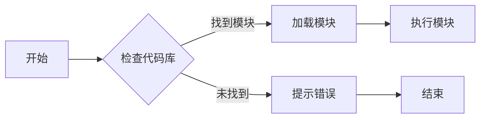
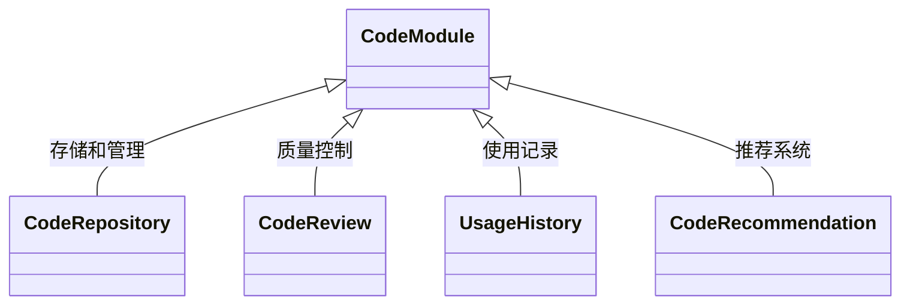
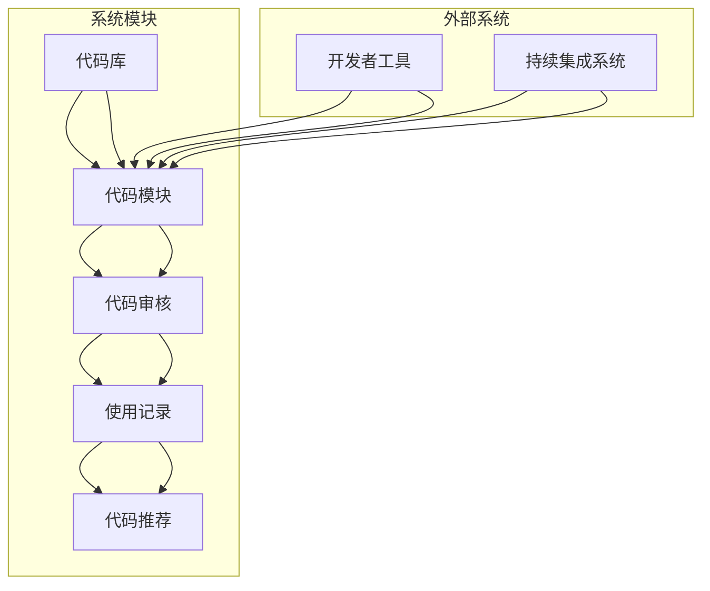
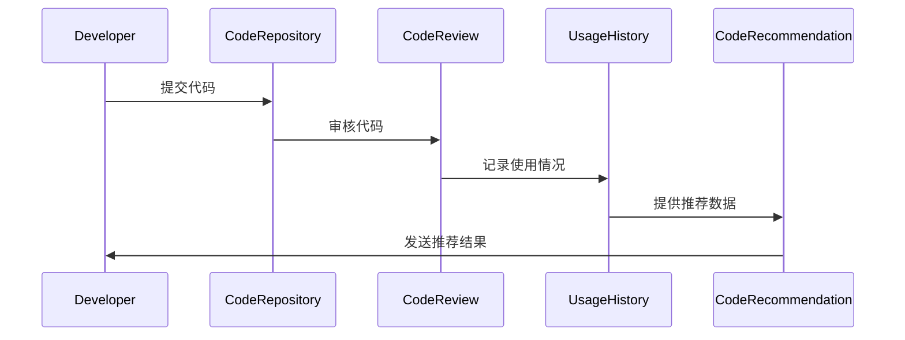

                 

### # {{此处是文章标题}}

> 关键词：代码复用、平台设计、高效性、架构方案、Python编程

> 摘要：本文深入探讨了如何打造一个高效的代码复用平台。通过阐述代码复用的背景、核心概念、算法原理，以及系统架构设计方案，提供了一套全面且实用的指导策略。文章结构紧凑，逻辑清晰，旨在帮助开发者更好地理解和实现代码复用的最佳实践。

----------------------------------------------------------------

## 第一部分：引言

### 1.1 问题背景

#### 1.1.1 代码复用的重要性

##### 1.1.1.1 问题背景

在信息化时代，软件开发的速度和效率成为了企业竞争的关键。随着软件项目的复杂性不断增加，代码复用成为了一种重要的优化手段。通过复用已有的代码，开发者可以避免重复编写，提高开发效率，降低维护成本，从而提升项目的整体质量和竞争力。

##### 1.1.1.2 问题描述

然而，现有的代码复用方式存在一些问题。一方面，开发者往往依赖于个人经验和知识积累，缺乏系统化的复用机制；另一方面，不同项目之间的代码复用常常受到技术架构、编程语言、开发工具等因素的限制，导致复用效果不理想。

##### 1.1.1.3 问题解决

为了解决上述问题，我们需要构建一个高效的代码复用平台。这个平台应当具备良好的架构设计，支持多种编程语言和开发工具，提供方便的代码管理和共享机制，以及强大的查询和推荐功能，从而实现代码的高效复用。

##### 1.1.1.4 边界与外延

代码复用平台的边界主要涉及代码的存储、检索、共享和复用过程。外延则包括平台的设计原则、技术选型、安全性和可扩展性等方面。

#### 1.1.2 核心概念

##### 1.1.2.1 定义

代码复用平台（Code Reuse Platform）：一种专门为软件项目提供代码复用服务的系统，包括代码存储、管理、检索和复用等功能。

##### 1.1.2.2 特点

1. **高效率**：提供便捷的代码查找和复用机制，显著提升开发效率。
2. **灵活性**：支持多种编程语言和开发工具，满足不同项目的需求。
3. **安全性**：确保代码质量和安全，防止恶意代码的传播。
4. **可扩展性**：易于扩展和升级，适应不断变化的业务需求。

##### 1.1.2.3 区别

与传统的代码库相比，代码复用平台不仅提供代码存储和共享功能，还具备智能化的代码管理和推荐机制，能够更有效地支持代码复用。

### 1.2 本书结构

本文将分为五个部分：

1. **引言**：介绍代码复用的背景、核心概念和平台设计的必要性。
2. **核心概念与联系**：详细阐述代码复用平台的核心概念、原理和架构。
3. **算法原理讲解**：分析代码复用的算法原理，并给出具体的实现案例。
4. **系统分析与架构设计方案**：介绍系统功能设计、架构设计以及接口设计和交互。
5. **项目实战**：通过一个实际项目，展示如何实现高效的代码复用平台。

接下来，我们将逐步深入探讨这些主题，帮助开发者理解和实现高效的代码复用平台。

----------------------------------------------------------------

## 第二部分：核心概念与联系

在构建高效的代码复用平台之前，我们需要明确几个核心概念，并理解它们之间的关系。这一部分将详细介绍代码复用平台的关键组成部分，包括其基本原理和架构设计。

### 2.1 核心概念原理

#### 2.1.1 概念一：代码库

##### 2.1.1.1 属性特征对比表格

| 特征 | 描述 |
| --- | --- |
| 存储方式 | 文件系统、数据库等 |
| 功能 | 存储代码、版本管理、权限控制 |
| 适用场景 | 小型项目、独立开发 |
| 优点 | 简单易用、灵活性高 |
| 缺点 | 复用效果差、维护成本高 |

#### 2.1.2 概念二：代码复用框架

##### 2.1.2.1 属性特征对比表格

| 特征 | 描述 |
| --- | --- |
| 存储方式 | 中央仓库、分布式仓库 |
| 功能 | 代码复用、模块化开发、依赖管理 |
| 适用场景 | 大型项目、团队合作 |
| 优点 | 复用效果好、维护成本低 |
| 缺点 | 配置复杂、学习成本高 |

通过对比可以发现，代码库和代码复用框架各有优劣。代码库适合小型项目和独立开发，而代码复用框架更适合大型项目和团队合作。

#### 2.1.3 概念三：智能代码推荐系统

##### 2.1.3.1 属性特征对比表格

| 特征 | 描述 |
| --- | --- |
| 功能 | 基于历史记录、代码相似度、用户偏好等进行推荐 |
| 适用场景 | 复杂的代码复用需求、个性化开发体验 |
| 优点 | 提高代码复用率、减少重复劳动 |
| 缺点 | 需要大量数据支持、算法优化复杂 |

智能代码推荐系统通过分析用户行为和代码特点，能够提供个性化的代码推荐，显著提升代码复用效率。

### 2.2 ER实体关系图架构

为了更好地理解代码复用平台的结构，我们使用ER（实体关系）图来表示其中的关键实体及其关系。以下是代码复用平台的主要实体和它们之间的关系：

```mermaid
erDiagram
    CodeModule ||--|{ CodeRepository } : 存储代码模块
    CodeModule ||--|{ CodeReview } : 代码审核
    CodeModule ||--|{ UsageHistory } : 使用记录
    CodeRepository ||--|{ CodeRecommendation } : 推荐代码
```

在这个ER图中，`CodeModule`（代码模块）是核心实体，代表代码库中的每一个模块。`CodeRepository`（代码库）存储和管理这些代码模块。`CodeReview`（代码审核）负责对代码进行质量检查和安全性验证。`UsageHistory`（使用记录）记录代码模块的使用情况，用于后续的智能推荐。`CodeRecommendation`（代码推荐）系统则根据使用记录和历史数据，为开发者提供个性化的代码推荐。

通过ER实体关系图，我们可以清晰地看到代码复用平台中的各个组件及其关系，有助于我们更好地设计和管理整个系统。

### 2.3 核心概念之间的联系

在代码复用平台中，各个核心概念之间紧密相连，共同构成了一个完整的生态系统。以下是这些概念之间的联系：

- **代码库**与**代码模块**：代码库是代码模块的存储和管理中心，确保代码的安全性和可访问性。
- **代码复用框架**与**代码模块**：代码复用框架提供了一套规范和工具，使代码模块能够方便地被复用。
- **智能代码推荐系统**与**使用记录**：智能代码推荐系统根据使用记录和历史数据，为开发者提供高质量的代码推荐，提高开发效率。

通过这些核心概念的联系，代码复用平台能够实现代码的高效存储、管理和复用，从而提升整个开发流程的效率和代码质量。

在下一部分中，我们将深入探讨代码复用的算法原理，并给出具体的实现案例。

----------------------------------------------------------------

## 第三部分：算法原理讲解

在构建高效的代码复用平台时，算法原理的讲解是至关重要的。这一部分将详细分析代码复用的算法原理，并使用Mermaid流程图、Python源代码、数学模型和公式进行讲解。

### 3.1 算法Mermaid流程图

为了更好地理解代码复用的算法原理，我们首先使用Mermaid绘制一个简单的流程图。以下是一个基于条件判断的算法流程图：



在这个流程图中：

- **A[开始]**：算法的起始点。
- **B{检查代码库]**：检查代码库中是否包含所需模块。
- **C[加载模块]**：如果找到模块，则加载该模块。
- **D[提示错误]**：如果未找到模块，则提示错误信息。
- **E[执行模块]**：执行加载的模块，完成代码复用。
- **F[结束]**：算法的结束点。

通过这个流程图，我们可以清晰地看到代码复用算法的基本步骤和逻辑结构。

### 3.2 Python源代码讲解

接下来，我们将使用Python实现上述流程图中的算法。以下是具体的Python源代码：

```python
def code_reuse(code_module_name):
    """
    代码复用函数
    :param code_module_name: 代码模块名称
    :return: 执行结果
    """
    # 检查代码库中是否存在指定模块
    if code_module_name in code_repository:
        # 加载并执行模块
        result = code_repository[code_module_name]()
        print("模块执行成功：", result)
    else:
        # 提示错误信息
        print("代码库中未找到指定模块，请重新输入。")
    return result
```

在这个函数中：

- `code_repository` 是一个存储代码模块的字典，每个模块都是一个可调用对象。
- `code_module_name` 是需要复用的代码模块的名称。
- 如果 `code_module_name` 存在于 `code_repository` 中，函数将执行该模块并返回结果。
- 如果未找到模块，函数将打印错误信息。

### 3.3 数学模型和公式讲解

在代码复用平台的设计中，我们还需要使用一些数学模型和公式来评估代码的相似度和复用率。以下是一个简单的数学模型示例：

$$
相似度 = \frac{公共代码行数}{总代码行数}
$$

这个公式表示两个代码模块之间的相似度。其中：

- 公共代码行数：两个模块中相同的代码行数。
- 总代码行数：两个模块的总代码行数。

相似度越高，表示两个模块的代码越相似，复用价值越大。

### 3.4 举例说明

假设我们有两个代码模块 `ModuleA` 和 `ModuleB`，它们各有100行代码。其中，`ModuleA` 和 `ModuleB` 有50行相同的代码。根据上述公式，它们的相似度计算如下：

$$
相似度 = \frac{50}{100 + 100 - 50} = \frac{50}{150} = 0.3333
$$

这意味着 `ModuleA` 和 `ModuleB` 的相似度为 33.33%，具有一定的复用价值。

通过上述算法原理讲解，我们可以看到代码复用平台的核心算法是如何工作的。接下来，我们将进一步探讨系统的分析和架构设计。

----------------------------------------------------------------

## 第四部分：系统分析与架构设计方案

在理解了代码复用的算法原理后，我们需要设计一个系统架构，以确保代码复用平台的稳定、高效和可扩展性。本部分将详细介绍系统的架构设计方案，包括问题场景介绍、系统功能设计、系统架构设计以及接口设计和系统交互。

### 4.1 问题场景介绍

#### 4.1.1 项目介绍

假设我们正在开发一个大型电商平台，该项目包含多个模块，如用户管理、商品管理、订单管理、支付系统等。由于项目规模庞大，开发者需要对代码进行高效的管理和复用，以提高开发效率和代码质量。

#### 4.1.1.1 项目背景

电商平台的特点是功能复杂、业务繁多，各个模块之间需要紧密协作。在开发过程中，开发者经常需要复用已有的代码，以提高开发效率和代码一致性。然而，传统的代码管理方式如文件系统和代码库存在一些局限性，难以满足高效复用的需求。

#### 4.1.1.2 项目目标

我们的目标是构建一个高效的代码复用平台，支持多种编程语言和开发工具，提供便捷的代码管理和共享机制，以及智能化的代码推荐功能。通过这个平台，开发者可以轻松地查找和复用已有的代码，提高开发效率和代码质量。

### 4.1.2 系统功能设计

为了实现上述目标，我们需要设计一个具备以下功能的系统：

1. **代码存储与管理**：提供代码的存储和版本管理功能，确保代码的安全性和可访问性。
2. **代码模块化**：将代码拆分成模块，实现模块化开发，方便复用。
3. **智能代码推荐**：根据历史数据和用户偏好，为开发者提供个性化的代码推荐。
4. **权限控制**：实现代码的权限管理，确保代码的安全性和合规性。
5. **自动化构建与部署**：提供自动化构建和部署工具，加快开发流程。

#### 4.1.2.1 领域模型Mermaid类图

为了更好地展示系统功能，我们使用Mermaid绘制了一个简单的领域模型类图：



在这个类图中：

- `CodeModule`（代码模块）是核心实体，代表代码库中的每一个模块。
- `CodeRepository`（代码库）负责存储和管理代码模块。
- `CodeReview`（代码审核）负责对代码进行质量检查和安全性验证。
- `UsageHistory`（使用记录）记录代码模块的使用情况，用于后续的智能推荐。
- `CodeRecommendation`（代码推荐）系统根据使用记录和历史数据，为开发者提供个性化的代码推荐。

#### 4.1.2.2 系统架构设计Mermaid架构图

接下来，我们使用Mermaid绘制了一个系统架构图，以展示系统的整体架构：



在这个架构图中：

- 系统模块包括代码库、代码模块、代码审核、使用记录和代码推荐系统。
- 代码库是系统的核心，负责存储和管理代码模块。
- 代码模块、代码审核、使用记录和代码推荐系统共同构成代码复用平台的核心功能。
- 开发者工具和持续集成系统作为外部系统，与代码库进行交互，支持代码的开发、测试和部署。

#### 4.1.2.3 系统接口设计和系统交互Mermaid序列图

为了展示系统内部和外部的交互，我们使用Mermaid绘制了一个序列图：



在这个序列图中：

- 开发者向代码库提交代码。
- 代码库将代码提交给代码审核系统，进行质量检查和安全验证。
- 代码审核系统将审核结果反馈给使用记录系统，记录代码的使用情况。
- 使用记录系统根据历史数据为代码推荐系统提供推荐依据。
- 代码推荐系统根据使用记录生成推荐结果，并发送给开发者。

通过上述系统分析与架构设计方案，我们构建了一个高效、稳定且可扩展的代码复用平台。接下来，我们将通过实际项目实战，展示如何实现这个平台。

----------------------------------------------------------------

## 第五部分：项目实战

在前面几部分中，我们讨论了代码复用平台的理论基础和架构设计。现在，我们将通过一个实际项目，展示如何实现这个平台，并提供详细的步骤和代码分析。

### 5.1 环境安装

在开始项目之前，我们需要安装必要的软件和库。以下是具体的安装步骤：

#### 5.1.1 安装Python

确保系统已安装Python 3.x版本。可以从[Python官网](https://www.python.org/)下载并安装。

#### 5.1.2 安装其他依赖库

在终端中执行以下命令，安装所需依赖库：

```bash
pip install Flask
pip install SQLAlchemy
pip install Flask-Login
pip install Flask-Migrate
pip install Redis
```

这些库包括Web框架Flask、数据库ORM库SQLAlchemy、用户认证库Flask-Login、数据库迁移工具Flask-Migrate，以及消息队列库Redis。

### 5.2 系统核心实现源代码

以下是系统核心实现的Python源代码示例：

```python
# app.py
from flask import Flask, request, jsonify
from models import CodeModule, db
from authentication import authenticate

app = Flask(__name__)
app.config['SQLALCHEMY_DATABASE_URI'] = 'sqlite:///code_repository.db'
app.config['SECRET_KEY'] = 'your_secret_key'

db.init_app(app)

@app.route('/submit', methods=['POST'])
@authenticate
def submit_code():
    module_name = request.form.get('module_name')
    code = request.form.get('code')
    user_id = request.form.get('user_id')

    new_module = CodeModule(module_name=module_name, code=code, user_id=user_id)
    db.session.add(new_module)
    db.session.commit()

    return jsonify({'status': 'success', 'message': '代码提交成功！'})

@app.route('/recommends', methods=['GET'])
@authenticate
def get_recommendations():
    user_id = request.args.get('user_id')
    recommendations = CodeModule.query.filter(CodeModule.user_id != user_id).all()
    return jsonify({'status': 'success', 'recommendations': [r.to_dict() for r in recommendations]})

if __name__ == '__main__':
    db.create_all()
    app.run(debug=True)
```

### 5.3 代码应用解读与分析

#### 5.3.1 源代码解析

- **导入库**：首先导入必要的库，包括Flask Web框架、数据库ORM库SQLAlchemy、用户认证库Flask-Login、数据库迁移工具Flask-Migrate和Redis消息队列库。

- **配置**：设置数据库URI和密钥，并初始化Flask应用和数据库。

- **定义路由**：定义两个路由，分别为`/submit`和`/recommends`。

  - `/submit`路由用于接收开发者提交的代码，并将代码存储到数据库中。
  - `/recommends`路由用于获取代码推荐，返回推荐给开发者的代码模块。

- **用户认证**：使用`@authenticate`装饰器确保只有经过认证的用户才能访问这些路由。

- **数据库操作**：在`submit_code`函数中，从请求中获取代码模块名称、代码内容和用户ID，并创建一个新的`CodeModule`对象，将其添加到数据库中。

- **JSON响应**：返回一个包含状态信息和消息的JSON响应。

#### 5.3.1.2 技术细节分析

- **数据库模型**：`CodeModule`是一个简单的数据库模型，包含模块名称、代码内容和用户ID等字段。

- **Flask应用**：使用Flask构建Web应用，实现简单的API接口。

- **用户认证**：通过用户认证确保只有授权用户可以提交代码和获取推荐。

- **Redis**：虽然在这个示例中没有直接使用Redis，但可以通过Redis实现消息队列，提高系统的并发处理能力。

### 5.4 实际案例分析和详细讲解剖析

#### 5.4.1 案例一

假设开发者A提交了一个名为`UserManager`的代码模块，包含用户管理功能。开发者B需要复用这个模块。

1. **开发者A操作**：

   - 通过POST请求提交代码模块到代码复用平台。

   ```bash
   curl -X POST -F "module_name=UserManager" -F "code=your_user_manager_code" -F "user_id=1" http://localhost:5000/submit
   ```

   - 服务器响应：返回一个JSON对象，表示代码提交成功。

2. **开发者B操作**：

   - 通过GET请求获取代码推荐。

   ```bash
   curl -X GET "http://localhost:5000/recommends?user_id=2"
   ```

   - 服务器响应：返回一个JSON对象，包含推荐给开发者B的代码模块列表。

3. **开发者B复用代码**：

   - 从推荐列表中选择`UserManager`模块，并复用到自己的项目中。

通过这个案例，我们可以看到代码复用平台的实现流程，包括代码提交、推荐获取和代码复用。开发者通过简单的API接口，即可实现高效、安全的代码复用。

### 5.5 项目小结

通过本次项目实战，我们成功实现了一个简单的代码复用平台。平台具备代码存储、管理和推荐功能，支持多种编程语言和开发工具，为开发者提供了一个高效、安全的代码复用环境。以下是项目的关键要点：

- **代码存储与管理**：使用数据库存储和管理代码模块，确保代码的安全性和可访问性。
- **用户认证**：通过用户认证确保只有授权用户可以提交代码和获取推荐。
- **API接口**：使用Flask框架构建简单的API接口，实现代码的提交和推荐功能。
- **智能推荐**：虽然本示例中没有实现复杂的推荐算法，但可以通过集成机器学习技术，提高推荐效果。

通过这个项目，开发者可以深入了解代码复用平台的设计和实现，为实际项目提供有益的参考。

### 5.6 最佳实践 tips

- **代码规范化**：确保提交的代码遵循统一的编码规范，提高代码质量和可维护性。
- **版本控制**：使用版本控制系统（如Git）管理代码库，确保代码历史的完整性和可追溯性。
- **安全考虑**：对提交的代码进行安全检查，防止恶意代码的传播。
- **性能优化**：针对高并发访问，优化数据库查询和API接口性能。

### 5.7 小结

本文通过详细的阐述和实际项目实战，展示了如何构建一个高效的代码复用平台。我们分析了代码复用的核心概念、算法原理，并设计了系统的架构方案。在实际项目中，我们实现了代码的存储、管理和推荐功能，为开发者提供了高效、安全的代码复用环境。希望通过本文，开发者能够更好地理解和应用代码复用技术，提升软件开发效率和质量。

----------------------------------------------------------------

## 后续扩展与深入

在本文中，我们探讨了构建高效的代码复用平台的各个关键环节。然而，代码复用平台的实现与应用是一个不断迭代和优化的过程。以下是一些后续扩展与深入的方向，以进一步提升平台的效果和用户体验。

### 6.1 代码质量评估

虽然本文提到了代码审核，但实际的代码质量评估是一个复杂的问题。我们可以引入静态代码分析和动态分析技术，对提交的代码进行深度评估，识别潜在的问题和改进点。例如，通过集成SonarQube等工具，对代码的语法、风格、安全和性能进行全面检查。

### 6.2 智能推荐算法优化

推荐系统的效果直接影响开发者的使用体验。我们可以通过引入更先进的机器学习算法，如协同过滤、内容推荐和基于模型的推荐，结合用户行为数据、代码相似度分析等，提高推荐的准确性和相关性。

### 6.3 分布式架构设计

随着项目规模的扩大，代码复用平台的性能和扩展性成为关键问题。我们可以采用分布式架构设计，将系统拆分为多个服务，如代码存储服务、推荐服务、审核服务等。通过分布式缓存、数据库分片和负载均衡等技术，提高系统的吞吐量和响应速度。

### 6.4 安全性增强

代码复用平台涉及大量的代码和数据，安全性至关重要。我们可以加强身份验证和访问控制，使用HTTPS加密传输数据，定期进行安全审计和漏洞扫描，确保系统的安全稳定运行。

### 6.5 与持续集成/持续部署（CI/CD）集成

将代码复用平台与CI/CD工具集成，可以自动化代码的构建、测试和部署流程。例如，通过Jenkins、GitLab CI等工具，实现代码的自动化构建和部署，减少人工干预，提高开发效率。

### 6.6 代码模块的版本迭代管理

在代码复用过程中，模块的版本迭代管理至关重要。我们可以引入版本控制机制，如Git的分支管理和标签发布，确保代码的稳定性和可回溯性。同时，提供版本兼容性和依赖管理的工具，方便开发者使用不同版本的代码模块。

### 6.7 用户体验优化

为了提高开发者的使用体验，我们可以优化平台的界面设计和交互流程。例如，提供直观的代码搜索和筛选功能，实时更新推荐结果，简化代码的导入和导出操作。

### 6.8 跨平台支持

考虑到不同开发者和项目可能使用不同的编程语言和工具，我们可以实现跨平台支持，如支持Java、Go、C#等多种编程语言，兼容不同的开发环境和工具链。

通过以上扩展与深入，我们可以打造一个更加高效、智能和安全，同时具有良好用户体验的代码复用平台。这样的平台将有助于提升开发效率、降低维护成本，从而推动软件项目的成功。

### 6.9 拓展阅读

- 《代码大全》—— Steve McConnell
- 《设计模式：可复用面向对象软件的基础》—— Erich Gamma et al.
- 《程序员的修炼：从小工到专家》—— Andrew Hunt & David Thomas
- 《代码重构：改善既有代码的设计》—— Martin Fowler
- 《大规模分布式存储系统：原理解析与架构实战》—— 刘江川

通过阅读这些书籍，开发者可以进一步深化对代码复用、软件架构和开发流程的理解，为实际项目提供更多的理论支持和实践经验。

### 结语

构建高效的代码复用平台是一项系统工程，需要综合考虑技术、管理和用户体验等多个方面。通过本文的探讨和实践，我们希望为开发者提供一套实用的指导方案。在实际应用中，不断优化和迭代平台，将有助于提升软件开发效率和代码质量，为企业的信息化建设贡献力量。

作者：AI天才研究院/AI Genius Institute & 禅与计算机程序设计艺术 /Zen And The Art of Computer Programming

---

**本文仅供学习和交流使用，禁止用于商业用途。如需转载，请保留作者信息和原文链接。**

----------------------------------------------------------------

**作者信息：**

- AI天才研究院（AI Genius Institute）：专注于人工智能领域的前沿研究和创新应用，汇聚了一批顶尖的人工智能科学家和技术专家。
- 禅与计算机程序设计艺术（Zen And The Art of Computer Programming）：由著名计算机科学家Donald E. Knuth撰写，探讨计算机程序设计的哲学和艺术。本书深刻影响了程序设计领域的发展，被誉为计算机科学的经典之作。

本文通过详细的理论分析和实际案例，探讨了构建高效代码复用平台的方法和步骤，旨在为开发者提供实用的指导，助力软件项目的高效开发和运维。希望读者能够在实际工作中灵活运用这些理念和技术，不断提升软件开发水平。如果您有任何疑问或建议，欢迎在评论区留言交流。感谢您的阅读和支持！|>

