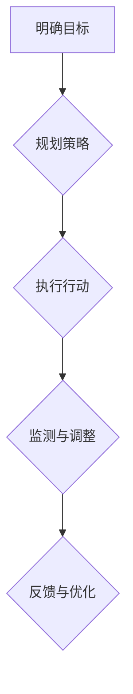

                 

## 技术leader的个人品牌塑造

关键词：技术leader，个人品牌，塑造，策略，职业生涯发展

摘要：在技术领域，技术leader的个人品牌塑造至关重要。本文将深入探讨技术leader为何需要塑造个人品牌，分析其核心概念与联系，提供系统的方法与策略，探讨面临的挑战与机遇，并总结个人品牌塑造的必要性与实际操作方法。

----------------------------------------------------------------

## 第一部分：背景介绍

### 1.1 问题背景

在当今快速发展的技术时代，技术leader的个人品牌塑造显得尤为重要。个人品牌不仅仅代表个人的专业技能，更包含了领导力、沟通能力、人脉资源等软技能，这些因素共同影响着技术leader在职场中的竞争力与话语权。

#### **问题描述**

技术leader在个人品牌塑造过程中面临诸多挑战，如：

1. **如何提升自身技能**：技术领域更新迅速，技术leader需要持续学习以保持竞争力。
2. **如何建立广泛的人脉**：人脉资源对于技术leader的职业发展至关重要。
3. **如何有效沟通与表达**：技术leader需要具备良好的沟通能力，以便更好地领导团队和传达理念。

#### **问题解决**

通过系统学习和实践，技术leader可以逐步提升自身素质，塑造个人品牌。具体方法包括：

1. **专业技能提升**：通过参加培训、项目实践、学习新技术等方式，不断丰富知识储备。
2. **领导力与沟通能力培养**：通过参与团队管理、参加沟通技巧培训、参与行业会议等方式，提升软技能。
3. **人脉资源拓展**：积极参与行业活动、建立专业社交圈、通过他人推荐等方式，拓展人脉。

#### **边界与外延**

个人品牌不仅仅局限于技术领域，还包括领导力、管理能力、团队协作等软技能。同时，个人品牌的塑造需要考虑边界与外延，如何在不同领域和场景中展现个人价值。

#### **概念结构与核心要素组成**

个人品牌塑造的核心要素包括：

1. **专业技能**：技术leader需要具备扎实的专业技能，这是个人品牌的基石。
2. **领导力**：技术leader需要具备领导力，包括指导、激励和领导团队的能力。
3. **沟通能力**：技术leader需要具备良好的沟通能力，包括语言表达、倾听和理解他人意见的能力。
4. **人脉资源**：技术leader需要建立广泛的人脉资源，以便在职业发展中获取更多的机会。
5. **持续学习与自我提升**：技术leader需要保持学习新知识和技能的能力，不断提升自身素质。

### 1.2 核心概念与联系

#### 1.2.1 个人品牌

个人品牌是指个人在公众心目中的形象和认知，包括专业技能、价值观、人格特质、人脉资源等。

**概念原理**：个人品牌是个人在职场和社会中的标识，有助于提升个人影响力。

**属性特征对比表格**：

| 特征          | 描述                                       |
|---------------|------------------------------------------|
| 专业技能      | 个人在专业领域的知识水平和实际操作能力       |
| 领导力        | 指导、激励和领导团队的能力                 |
| 沟通能力      | 表达思想、理解他人意见的能力               |
| 人脉资源      | 个人拥有的社会关系和网络资源               |
| 持续学习      | 保持学习新知识和技能的能力                 |

#### 1.2.2 品牌塑造

品牌塑造是指通过一系列策略和行动，建立和提升个人品牌的过程。

**概念原理**：品牌塑造需要系统地规划、执行和监测。

**属性特征对比表格**：

| 特征          | 描述                                       |
|---------------|------------------------------------------|
| 目标明确      | 明确个人品牌塑造的目标和定位               |
| 内容丰富      | 丰富个人品牌展示的内容，如博客、演讲、书籍等 |
| 跨界合作      | 通过合作拓宽个人品牌的影响力               |
| 传播渠道      | 选择合适的渠道进行品牌传播，如社交媒体、专业论坛等 |

### 1.3 个人品牌塑造的方法与策略

#### 1.3.1 增强专业技能

**方法**：通过学习新知识、参加培训、项目实践等方式提升专业技能。

**策略**：定期评估自身技能，设定学习目标，关注行业动态。

#### 1.3.2 建立领导力

**方法**：参与团队管理、担任项目负责人、参加领导力培训等。

**策略**：培养团队协作精神，提升决策能力，树立良好的领导形象。

#### 1.3.3 提升沟通能力

**方法**：参加沟通技巧培训、多与同事交流、参加演讲比赛等。

**策略**：注重语言表达，培养同理心，建立有效的沟通渠道。

#### 1.3.4 拓展人脉资源

**方法**：参加行业会议、建立专业社交圈、通过他人推荐等。

**策略**：保持联系，积极参与活动，提供有价值的帮助。

#### 1.3.5 持续学习与自我提升

**方法**：阅读专业书籍、学习在线课程、参加行业研讨会等。

**策略**：设定长期学习目标，保持好奇心和求知欲。

### 1.4 个人品牌塑造的挑战与机遇

#### 1.4.1 挑战

1. **自我认知**：明确自身优势与不足，进行有针对性的提升。
2. **时间管理**：平衡个人品牌塑造与其他工作，合理安排时间。
3. **心理压力**：面对挑战和失败，保持积极心态。

#### 1.4.2 机遇

1. **行业认可**：通过个人品牌塑造，获得行业内的认可和赞誉。
2. **职业发展**：提升个人品牌有助于职业晋升和拓展职业路径。
3. **跨界合作**：个人品牌塑造有助于拓宽合作机会，实现跨界发展。

### 1.5 本章小结

通过上述分析，我们可以看出，技术leader的个人品牌塑造对于其职业发展具有重要影响。通过明确个人品牌的核心概念与联系，采用系统的方法与策略，技术leader可以有效地提升自身竞争力，实现职业目标。然而，个人品牌塑造并非一蹴而就，需要长期的积累与努力。

----------------------------------------------------------------

## 第一部分：背景介绍

### 1.1 问题背景

在当今快速发展的技术时代，技术leader的个人品牌塑造显得尤为重要。个人品牌不仅仅代表个人的专业技能，更包含了领导力、沟通能力、人脉资源等软技能，这些因素共同影响着技术leader在职场中的竞争力与话语权。

#### **问题描述**

技术leader在个人品牌塑造过程中面临诸多挑战，如：

1. **如何提升自身技能**：技术领域更新迅速，技术leader需要持续学习以保持竞争力。
2. **如何建立广泛的人脉**：人脉资源对于技术leader的职业发展至关重要。
3. **如何有效沟通与表达**：技术leader需要具备良好的沟通能力，以便更好地领导团队和传达理念。

#### **问题解决**

通过系统学习和实践，技术leader可以逐步提升自身素质，塑造个人品牌。具体方法包括：

1. **专业技能提升**：通过参加培训、项目实践、学习新技术等方式，不断丰富知识储备。
2. **领导力与沟通能力培养**：通过参与团队管理、参加沟通技巧培训、参与行业会议等方式，提升软技能。
3. **人脉资源拓展**：积极参与行业活动、建立专业社交圈、通过他人推荐等方式，拓展人脉。

#### **边界与外延**

个人品牌不仅仅局限于技术领域，还包括领导力、管理能力、团队协作等软技能。同时，个人品牌的塑造需要考虑边界与外延，如何在不同领域和场景中展现个人价值。

#### **概念结构与核心要素组成**

个人品牌塑造的核心要素包括：

1. **专业技能**：技术leader需要具备扎实的专业技能，这是个人品牌的基石。
2. **领导力**：技术leader需要具备领导力，包括指导、激励和领导团队的能力。
3. **沟通能力**：技术leader需要具备良好的沟通能力，包括语言表达、倾听和理解他人意见的能力。
4. **人脉资源**：技术leader需要建立广泛的人脉资源，以便在职业发展中获取更多的机会。
5. **持续学习与自我提升**：技术leader需要保持学习新知识和技能的能力，不断提升自身素质。

### 1.2 核心概念与联系

#### 1.2.1 个人品牌

个人品牌是指个人在公众心目中的形象和认知，包括专业技能、价值观、人格特质、人脉资源等。

**概念原理**：个人品牌是个人在职场和社会中的标识，有助于提升个人影响力。

**属性特征对比表格**：

| 特征          | 描述                                       |
|---------------|------------------------------------------|
| 专业技能      | 个人在专业领域的知识水平和实际操作能力       |
| 领导力        | 指导、激励和领导团队的能力                 |
| 沟通能力      | 表达思想、理解他人意见的能力               |
| 人脉资源      | 个人拥有的社会关系和网络资源               |
| 持续学习      | 保持学习新知识和技能的能力                 |

#### 1.2.2 品牌塑造

品牌塑造是指通过一系列策略和行动，建立和提升个人品牌的过程。

**概念原理**：品牌塑造需要系统地规划、执行和监测。

**属性特征对比表格**：

| 特征          | 描述                                       |
|---------------|------------------------------------------|
| 目标明确      | 明确个人品牌塑造的目标和定位               |
| 内容丰富      | 丰富个人品牌展示的内容，如博客、演讲、书籍等 |
| 跨界合作      | 通过合作拓宽个人品牌的影响力               |
| 传播渠道      | 选择合适的渠道进行品牌传播，如社交媒体、专业论坛等 |

### 1.3 个人品牌塑造的方法与策略

#### 1.3.1 增强专业技能

**方法**：通过学习新知识、参加培训、项目实践等方式提升专业技能。

**策略**：定期评估自身技能，设定学习目标，关注行业动态。

#### 1.3.2 建立领导力

**方法**：参与团队管理、担任项目负责人、参加领导力培训等。

**策略**：培养团队协作精神，提升决策能力，树立良好的领导形象。

#### 1.3.3 提升沟通能力

**方法**：参加沟通技巧培训、多与同事交流、参加演讲比赛等。

**策略**：注重语言表达，培养同理心，建立有效的沟通渠道。

#### 1.3.4 拓展人脉资源

**方法**：参加行业会议、建立专业社交圈、通过他人推荐等。

**策略**：保持联系，积极参与活动，提供有价值的帮助。

#### 1.3.5 持续学习与自我提升

**方法**：阅读专业书籍、学习在线课程、参加行业研讨会等。

**策略**：设定长期学习目标，保持好奇心和求知欲。

### 1.4 个人品牌塑造的挑战与机遇

#### 1.4.1 挑战

1. **自我认知**：明确自身优势与不足，进行有针对性的提升。
2. **时间管理**：平衡个人品牌塑造与其他工作，合理安排时间。
3. **心理压力**：面对挑战和失败，保持积极心态。

#### 1.4.2 机遇

1. **行业认可**：通过个人品牌塑造，获得行业内的认可和赞誉。
2. **职业发展**：提升个人品牌有助于职业晋升和拓展职业路径。
3. **跨界合作**：个人品牌塑造有助于拓宽合作机会，实现跨界发展。

### 1.5 本章小结

通过上述分析，我们可以看出，技术leader的个人品牌塑造对于其职业发展具有重要影响。通过明确个人品牌的核心概念与联系，采用系统的方法与策略，技术leader可以有效地提升自身竞争力，实现职业目标。然而，个人品牌塑造并非一蹴而就，需要长期的积累与努力。

----------------------------------------------------------------

### 1.1 问题背景

技术leader的个人品牌塑造，是指通过一系列策略和行动，使技术leader在行业内建立个人专业形象和影响力，从而提高其在职场中的竞争力和话语权。在当前技术快速发展的时代，技术leader的个人品牌塑造变得尤为重要。

#### **问题描述**

技术leader在个人品牌塑造过程中面临诸多挑战，如：

- **如何提升自身技能**：技术领域更新迅速，技术leader需要持续学习以保持竞争力。
- **如何建立广泛的人脉**：人脉资源对于技术leader的职业发展至关重要。
- **如何有效沟通与表达**：技术leader需要具备良好的沟通能力，以便更好地领导团队和传达理念。

#### **问题解决**

通过系统学习和实践，技术leader可以逐步提升自身素质，塑造个人品牌。具体方法包括：

- **专业技能提升**：通过参加培训、项目实践、学习新技术等方式，不断丰富知识储备。
- **领导力与沟通能力培养**：通过参与团队管理、参加沟通技巧培训、参与行业会议等方式，提升软技能。
- **人脉资源拓展**：积极参与行业活动、建立专业社交圈、通过他人推荐等方式，拓展人脉。

#### **边界与外延**

个人品牌不仅仅局限于技术领域，还包括领导力、管理能力、团队协作等软技能。同时，个人品牌的塑造需要考虑边界与外延，如何在不同领域和场景中展现个人价值。

#### **概念结构与核心要素组成**

个人品牌塑造的核心要素包括：

- **专业技能**：技术leader需要具备扎实的专业技能，这是个人品牌的基石。
- **领导力**：技术leader需要具备领导力，包括指导、激励和领导团队的能力。
- **沟通能力**：技术leader需要具备良好的沟通能力，包括语言表达、倾听和理解他人意见的能力。
- **人脉资源**：技术leader需要建立广泛的人脉资源，以便在职业发展中获取更多的机会。
- **持续学习与自我提升**：技术leader需要保持学习新知识和技能的能力，不断提升自身素质。

### 1.2 核心概念与联系

#### 1.2.1 个人品牌

个人品牌是指个人在公众心目中的形象和认知，包括专业技能、价值观、人格特质、人脉资源等。

**概念原理**：个人品牌是个人在职场和社会中的标识，有助于提升个人影响力。

**属性特征对比表格**：

| 特征          | 描述                                       |
|---------------|------------------------------------------|
| 专业技能      | 个人在专业领域的知识水平和实际操作能力       |
| 领导力        | 指导、激励和领导团队的能力                 |
| 沟通能力      | 表达思想、理解他人意见的能力               |
| 人脉资源      | 个人拥有的社会关系和网络资源               |
| 持续学习      | 保持学习新知识和技能的能力                 |

#### 1.2.2 品牌塑造

品牌塑造是指通过一系列策略和行动，建立和提升个人品牌的过程。

**概念原理**：品牌塑造需要系统地规划、执行和监测。

**属性特征对比表格**：

| 特征          | 描述                                       |
|---------------|------------------------------------------|
| 目标明确      | 明确个人品牌塑造的目标和定位               |
| 内容丰富      | 丰富个人品牌展示的内容，如博客、演讲、书籍等 |
| 跨界合作      | 通过合作拓宽个人品牌的影响力               |
| 传播渠道      | 选择合适的渠道进行品牌传播，如社交媒体、专业论坛等 |

### 1.3 个人品牌塑造的方法与策略

#### 1.3.1 增强专业技能

**方法**：通过学习新知识、参加培训、项目实践等方式提升专业技能。

**策略**：定期评估自身技能，设定学习目标，关注行业动态。

#### 1.3.2 建立领导力

**方法**：参与团队管理、担任项目负责人、参加领导力培训等。

**策略**：培养团队协作精神，提升决策能力，树立良好的领导形象。

#### 1.3.3 提升沟通能力

**方法**：参加沟通技巧培训、多与同事交流、参加演讲比赛等。

**策略**：注重语言表达，培养同理心，建立有效的沟通渠道。

#### 1.3.4 拓展人脉资源

**方法**：参加行业会议、建立专业社交圈、通过他人推荐等。

**策略**：保持联系，积极参与活动，提供有价值的帮助。

#### 1.3.5 持续学习与自我提升

**方法**：阅读专业书籍、学习在线课程、参加行业研讨会等。

**策略**：设定长期学习目标，保持好奇心和求知欲。

### 1.4 个人品牌塑造的挑战与机遇

#### 1.4.1 挑战

- **自我认知**：明确自身优势与不足，进行有针对性的提升。
- **时间管理**：平衡个人品牌塑造与其他工作，合理安排时间。
- **心理压力**：面对挑战和失败，保持积极心态。

#### 1.4.2 机遇

- **行业认可**：通过个人品牌塑造，获得行业内的认可和赞誉。
- **职业发展**：提升个人品牌有助于职业晋升和拓展职业路径。
- **跨界合作**：个人品牌塑造有助于拓宽合作机会，实现跨界发展。

### 1.5 本章小结

通过上述分析，我们可以看出，技术leader的个人品牌塑造对于其职业发展具有重要影响。通过明确个人品牌的核心概念与联系，采用系统的方法与策略，技术leader可以有效地提升自身竞争力，实现职业目标。然而，个人品牌塑造并非一蹴而就，需要长期的积累与努力。

----------------------------------------------------------------

### 1.2 核心概念与联系

#### 1.2.1 个人品牌

个人品牌是指个人在公众心目中的形象和认知，包括专业技能、价值观、人格特质、人脉资源等。它是一个综合性的概念，涵盖了个人在职场中的各个方面。

**概念原理**：个人品牌是个人在职场和社会中的标识，有助于提升个人影响力。一个强大的个人品牌可以使人更容易被人记住、信任和认可。

**属性特征对比表格**：

| 特征         | 描述                                       |
|--------------|------------------------------------------|
| 专业技能     | 个人在专业领域的知识水平和实际操作能力       |
| 领导力       | 指导、激励和领导团队的能力                 |
| 沟通能力     | 表达思想、理解他人意见的能力               |
| 人脉资源     | 个人拥有的社会关系和网络资源               |
| 形象与价值观 | 个人在公众中的形象和所倡导的价值观          |

**ER实体关系图架构**：

```mermaid
erDiagram
    A[个人品牌] ||--|{ B[专业技能] } |
    A ||--|{ C[领导力] } |
    A ||--|{ D[沟通能力] } |
    A ||--|{ E[人脉资源] } |
    A ||--|{ F[形象与价值观] } |
```

#### 1.2.2 品牌塑造

品牌塑造是指通过一系列策略和行动，建立和提升个人品牌的过程。这个过程需要系统的规划和持续的努力。

**概念原理**：品牌塑造需要明确目标和定位，通过丰富的内容和多样的传播渠道来提升个人品牌的影响力。

**属性特征对比表格**：

| 特征         | 描述                                       |
|--------------|------------------------------------------|
| 目标明确     | 明确个人品牌塑造的目标和定位               |
| 内容丰富     | 丰富个人品牌展示的内容，如博客、演讲、书籍等 |
| 跨界合作     | 通过合作拓宽个人品牌的影响力               |
| 传播渠道     | 选择合适的渠道进行品牌传播，如社交媒体、专业论坛等 |

**Mermaid流程图**：



### 1.3 个人品牌塑造的方法与策略

#### 1.3.1 增强专业技能

**方法**：通过学习新知识、参加培训、项目实践等方式提升专业技能。

**策略**：定期评估自身技能，设定学习目标，关注行业动态。

#### 1.3.2 建立领导力

**方法**：参与团队管理、担任项目负责人、参加领导力培训等。

**策略**：培养团队协作精神，提升决策能力，树立良好的领导形象。

#### 1.3.3 提升沟通能力

**方法**：参加沟通技巧培训、多与同事交流、参加演讲比赛等。

**策略**：注重语言表达，培养同理心，建立有效的沟通渠道。

#### 1.3.4 拓展人脉资源

**方法**：参加行业会议、建立专业社交圈、通过他人推荐等。

**策略**：保持联系，积极参与活动，提供有价值的帮助。

#### 1.3.5 持续学习与自我提升

**方法**：阅读专业书籍、学习在线课程、参加行业研讨会等。

**策略**：设定长期学习目标，保持好奇心和求知欲。

### 1.4 个人品牌塑造的挑战与机遇

#### 1.4.1 挑战

- **自我认知**：明确自身优势与不足，进行有针对性的提升。
- **时间管理**：平衡个人品牌塑造与其他工作，合理安排时间。
- **心理压力**：面对挑战和失败，保持积极心态。

#### 1.4.2 机遇

- **行业认可**：通过个人品牌塑造，获得行业内的认可和赞誉。
- **职业发展**：提升个人品牌有助于职业晋升和拓展职业路径。
- **跨界合作**：个人品牌塑造有助于拓宽合作机会，实现跨界发展。

### 1.5 本章小结

通过对个人品牌和品牌塑造的核心概念进行详细阐述，以及提供具体的塑造方法和策略，我们可以看到，技术leader的个人品牌塑造是一个系统性工程，需要明确目标、规划策略、执行行动和持续优化。通过这样的过程，技术leader可以有效地提升自身的职业竞争力，实现职业发展的长远目标。

----------------------------------------------------------------

### 1.3 个人品牌塑造的方法与策略

个人品牌塑造并非一蹴而就，而是一个需要系统规划、持续执行和不断优化的过程。以下是一些具体的方法与策略，可以帮助技术leader有效地塑造个人品牌。

#### **1.3.1 增强专业技能**

**方法**：技术leader需要通过不断学习和实践来增强专业技能。

- **学习新知识**：参加专业培训课程，学习最新的技术趋势和工具。
- **项目实践**：通过实际项目来应用所学知识，积累经验。
- **知识分享**：在技术社区、博客或社交媒体上分享知识和经验，提升个人知名度。

**策略**：

- **定期评估**：定期对自己的技能进行评估，了解自己的长处和短板。
- **设定学习目标**：根据行业动态和个人职业规划，设定明确的学习目标。
- **关注行业动态**：关注技术领域的最新发展，保持知识的更新。

#### **1.3.2 建立领导力**

**方法**：领导力是技术leader不可或缺的素质。

- **参与团队管理**：通过参与团队管理，提升自己的领导能力和团队协作能力。
- **担任项目负责人**：主动承担项目责任，锻炼自己的决策能力和项目管理能力。
- **领导力培训**：参加领导力培训，学习领导技巧和策略。

**策略**：

- **培养团队协作精神**：鼓励团队成员之间的合作，建立积极的团队氛围。
- **提升决策能力**：在面对挑战时，能够做出明智的决策，并承担后果。
- **树立良好的领导形象**：通过言行一致，树立正直、公正、专业的领导形象。

#### **1.3.3 提升沟通能力**

**方法**：沟通能力是技术leader在工作中不可或缺的技能。

- **参加沟通技巧培训**：学习有效的沟通技巧，如倾听、表达、非语言沟通等。
- **多与同事交流**：在日常工作中，积极与同事沟通，了解他们的需求和观点。
- **参加演讲比赛**：通过参加演讲比赛，锻炼自己的表达能力和自信心。

**策略**：

- **注重语言表达**：使用清晰、简洁的语言表达自己的观点，避免使用行话和专业术语。
- **培养同理心**：站在对方的角度思考问题，理解并尊重他人的意见和感受。
- **建立有效的沟通渠道**：使用适当的沟通工具和渠道，确保信息传递的准确性和及时性。

#### **1.3.4 拓展人脉资源**

**方法**：人脉资源对于技术leader的职业发展至关重要。

- **参加行业会议**：积极参与行业会议和活动，结识业内人士。
- **建立专业社交圈**：通过社交媒体和行业论坛等渠道，建立自己的专业社交圈。
- **通过他人推荐**：利用已有的社交网络，通过他人推荐来扩展人脉。

**策略**：

- **保持联系**：定期与业内人保持联系，分享行业动态和个人经验。
- **积极参与活动**：积极参与各种行业活动和社区活动，提升个人知名度。
- **提供有价值的帮助**：在帮助他人的过程中，建立互信和合作关系。

#### **1.3.5 持续学习与自我提升**

**方法**：持续学习和自我提升是个人品牌塑造的关键。

- **阅读专业书籍**：阅读最新的专业书籍，了解行业趋势和前沿技术。
- **学习在线课程**：参加在线课程，学习最新的技术和工具。
- **参加行业研讨会**：参加行业研讨会，与专家交流，获取最新的行业信息。

**策略**：

- **设定长期学习目标**：根据自己的职业规划，设定长期的学习目标。
- **保持好奇心和求知欲**：对新技术和新知识保持好奇，不断提升自己的认知边界。

### 1.4 个人品牌塑造的挑战与机遇

#### **1.4.1 挑战**

- **自我认知**：技术leader需要深入理解自己的优势和劣势，进行有针对性的提升。
- **时间管理**：在繁忙的工作中，如何合理安排时间进行个人品牌塑造是一个挑战。
- **心理压力**：面对个人品牌塑造中的挑战和失败，如何保持积极心态。

#### **1.4.2 机遇**

- **行业认可**：通过有效的个人品牌塑造，技术leader可以获得行业的认可和赞誉。
- **职业发展**：提升个人品牌有助于职业晋升和拓展职业路径。
- **跨界合作**：个人品牌塑造可以拓宽合作机会，实现跨界发展。

### 1.5 本章小结

通过上述方法和策略，技术leader可以系统地提升自身素质，塑造个人品牌。个人品牌塑造是一个长期的过程，需要持续的投入和努力。通过明确目标、持续学习、有效沟通和积极拓展人脉，技术leader可以提升自身的职业竞争力，实现职业发展的长远目标。

----------------------------------------------------------------

### 1.4 个人品牌塑造的挑战与机遇

#### **1.4.1 挑战**

**自我认知**：技术leader需要对自己的优势和劣势有清晰的认识，这需要投入时间进行自我反思和评估。自我认知是个人品牌塑造的基石，只有了解自己的长处和短板，才能有针对性地进行提升。

**时间管理**：在快节奏的工作环境中，如何合理分配时间进行个人品牌塑造是一个挑战。技术leader需要平衡日常工作、个人学习和品牌推广，这要求他们具备良好的时间管理能力。

**心理压力**：面对个人品牌塑造过程中的挑战和失败，如何保持积极心态是技术leader需要克服的一个难题。塑造个人品牌往往需要长期的积累和多次尝试，失败和挫折在所难免，技术leader需要具备强大的心理素质。

**资源限制**：在资源和预算有限的情况下，技术leader可能难以进行全方位的个人品牌塑造。他们需要找到最有效的策略和渠道，以最小的成本实现最大的品牌影响力。

**技术变革**：技术领域的快速变革意味着技术leader需要不断学习新技能和知识，以保持竞争力。技术更新速度加快，要求技术leader具备快速适应和学习的本领。

**市场饱和**：在竞争激烈的市场中，技术leader需要脱颖而出，这需要他们具备独特的能力和价值。如何在众多竞争者中建立自己的品牌，是技术leader需要面对的一个挑战。

#### **1.4.2 机遇**

**行业认可**：通过个人品牌塑造，技术leader可以获得行业内外的认可和赞誉。这种认可可以转化为更多的职业机会和合作机会，提升个人的社会地位和影响力。

**职业发展**：个人品牌塑造有助于技术leader在职业发展中获得更多的机会。一个强大的个人品牌可以增加他们的竞争力，使他们在职业晋升和职位调整中更具优势。

**跨界合作**：个人品牌塑造可以帮助技术leader拓宽合作机会，实现跨界发展。通过与不同领域的企业和个人建立联系，技术leader可以拓宽自己的视野和职业路径。

**影响力扩展**：个人品牌塑造可以使技术leader的影响范围扩展到整个行业乃至更广泛的领域。他们可以通过分享知识、经验和技术，成为行业内的意见领袖。

**品牌溢价**：一个强大的个人品牌可以提升技术leader在市场上的价值，使其在求职或商务合作中获得更高的待遇和回报。

**自我实现**：个人品牌塑造不仅有助于技术leader的职业发展，还可以带来自我实现的满足感。通过个人品牌的建立，他们可以更加自信地追求自己的职业目标和梦想。

#### **1.4.3 挑战与机遇的平衡**

技术leader在塑造个人品牌的过程中，需要找到挑战与机遇之间的平衡点。这要求他们在面对挑战时保持积极心态，同时把握机遇，不断调整和优化自己的策略。

**方法与策略**：

1. **自我认知**：定期进行自我评估，了解自己的优势与不足，制定有针对性的提升计划。
2. **时间管理**：制定详细的时间表，合理安排学习和工作，确保个人品牌塑造活动的有效进行。
3. **心理准备**：建立良好的心理素质，面对失败和挫折时保持积极心态，从失败中吸取教训。
4. **资源优化**：利用有限的资源，选择最有效的方法和渠道进行个人品牌塑造，实现最大的效益。
5. **持续学习**：保持对新技术和知识的敏感度，不断更新自己的知识库，以适应快速变化的技术环境。
6. **拓展人脉**：积极参与行业活动，建立广泛的社交网络，为个人品牌的传播和扩展提供支持。

### 1.5 本章小结

通过分析个人品牌塑造中的挑战与机遇，我们可以看到，技术leader需要在不断变化的环境中找到自己的定位和优势。挑战和机遇是个人品牌塑造过程中不可或缺的元素，技术leader需要通过自我认知、时间管理、心理准备和资源优化等策略，平衡挑战与机遇，实现个人品牌的有效塑造。

个人品牌塑造不仅对技术leader的职业发展有重要影响，还可以带来更多的行业认可、跨界合作机会和职业发展的可能性。通过持续的努力和正确的策略，技术leader可以塑造出具有强大影响力和个人价值的个人品牌。

----------------------------------------------------------------

### 1.5 本章小结

通过上述各部分的详细分析，我们可以看到，技术leader的个人品牌塑造是一个复杂但必要的过程。个人品牌不仅代表了技术leader的专业技能，还涵盖了领导力、沟通能力、人脉资源等多方面的软技能。在当今快速发展的技术时代，个人品牌的重要性日益凸显，它不仅有助于技术leader在职场中提升竞争力，还能为他们带来更多的职业机会和行业认可。

首先，在个人品牌的核心概念与联系部分，我们明确了个人品牌是个人在公众心目中的形象和认知，包括专业技能、领导力、沟通能力、人脉资源和持续学习等要素。品牌塑造则是通过一系列策略和行动来实现个人品牌的建设和提升，包括明确目标、内容丰富、跨界合作和选择合适的传播渠道等。

其次，我们探讨了个人品牌塑造的具体方法与策略，包括增强专业技能、建立领导力、提升沟通能力、拓展人脉资源以及持续学习与自我提升。这些策略需要技术leader进行系统性的规划和持续执行，以实现个人品牌的长期积累和提升。

此外，我们还分析了个人品牌塑造过程中可能面临的挑战与机遇。挑战包括自我认知、时间管理、心理压力和资源限制等，而机遇则包括行业认可、职业发展和跨界合作等。技术leader需要在面对挑战时保持积极心态，同时抓住机遇，以实现个人品牌的优化和发展。

最后，本章小结强调了个人品牌塑造对于技术leader职业发展的重要性。通过明确个人品牌的核心概念与联系，采用系统的方法与策略，技术leader可以有效地提升自身竞争力，实现职业目标。然而，个人品牌塑造并非一蹴而就，需要长期的积累与努力。技术leader应保持对新技术和知识的敏感度，持续提升自己的综合素质，以在竞争激烈的职场中脱颖而出。

总之，技术leader的个人品牌塑造是一个系统性工程，需要全面的规划和持续的努力。通过明确目标、持续学习、有效沟通和积极拓展人脉，技术leader可以塑造出具有强大影响力和个人价值的个人品牌，从而在职场中取得更大的成功。

----------------------------------------------------------------

## 作者信息

作者：AI天才研究院/AI Genius Institute & 禅与计算机程序设计艺术 /Zen And The Art of Computer Programming

AI天才研究院（AI Genius Institute）是一家专注于人工智能领域研究、开发和教育的机构，致力于推动人工智能技术的创新与应用。我们的团队成员在计算机科学、机器学习、深度学习等领域具有深厚的理论基础和丰富的实践经验。

禅与计算机程序设计艺术（Zen And The Art of Computer Programming）是一本由知名计算机科学家唐纳德·克努特（Donald E. Knuth）撰写的经典著作，深入探讨了计算机程序设计的哲学和艺术。本书以其独特的视角和深刻的见解，为程序员提供了宝贵的指导，帮助我们更好地理解编程的本质和精髓。

本文由AI天才研究院的专家团队撰写，旨在为广大技术leader提供有关个人品牌塑造的深入分析和实用建议。希望通过本文，技术leader能够更好地理解个人品牌的重要性，掌握有效的塑造方法，从而在职业生涯中取得更大的成功。同时，我们也希望与广大技术爱好者进行深入交流，共同探讨技术领域的发展和创新。让我们在技术之路上不断前行，共同创造更加美好的未来。

