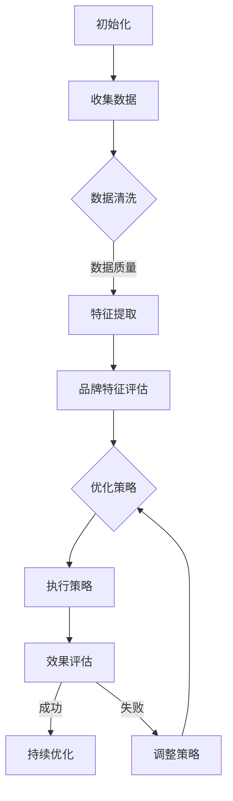
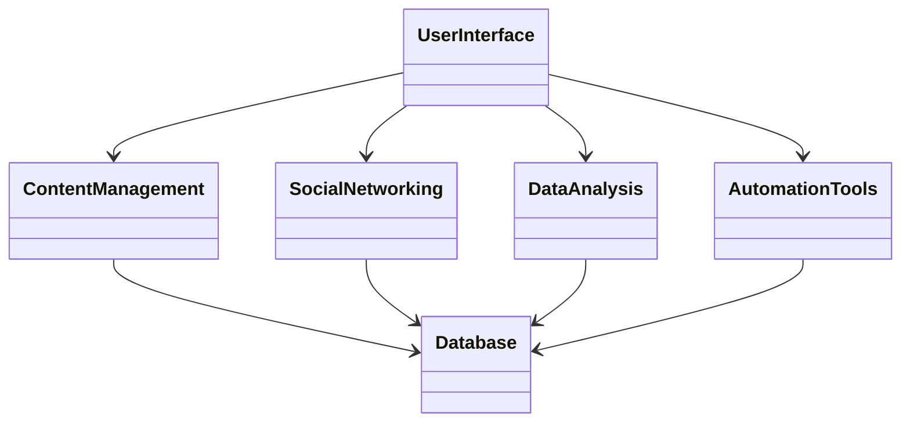
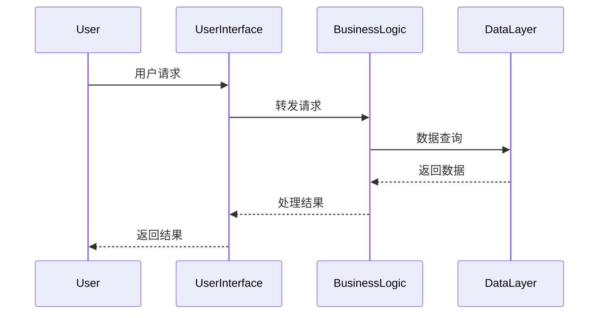
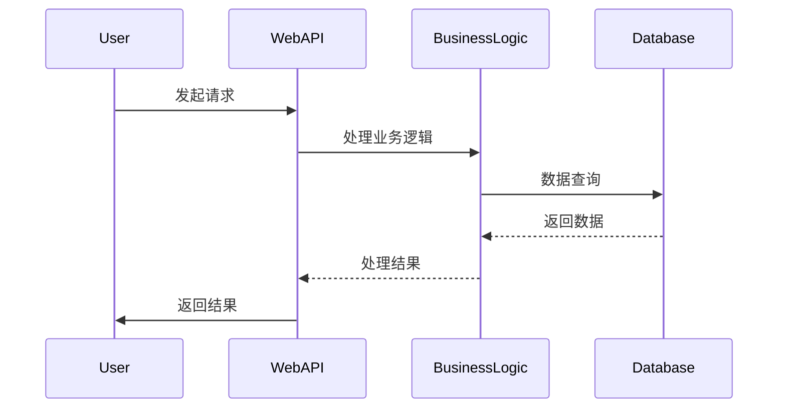

                 


### 文章标题：技术leader的个人品牌经营

> 关键词：技术leader，个人品牌，影响力，品牌经营，职业发展

> 摘要：本文旨在探讨技术leader如何通过个人品牌经营提升自身价值和影响力，分析构建个人品牌的基础，提供提升影响力的策略，并深入讲解个人品牌经营的方法与技巧。文章将通过系统分析与架构设计、项目实战，结合最佳实践，为技术leader提供全面的个人品牌经营指南。

### 第一部分：个人品牌与影响力

#### 第1章：个人品牌的重要性

##### 1.1 个人品牌的定义与价值

个人品牌是指个人在职业生涯中所建立的形象和声誉，它反映了个人在行业内的专业水平和影响力。对于技术leader来说，个人品牌的重要性不言而喻。首先，个人品牌有助于提升技术leader的专业形象，使其在职场中脱颖而出。其次，良好的个人品牌能够增强技术leader的领导力和影响力，进而促进团队和组织的成长。最后，个人品牌还能为技术leader带来更多的职业机会和发展空间。

##### 1.2 技术leader如何提升个人品牌

技术leader提升个人品牌的关键在于以下几个方面：

1. **专业知识积累**：技术leader需要不断学习新技术，提升自身专业水平，以满足行业发展的需求。
2. **领导力培养**：技术leader应注重领导力培养，通过有效沟通、团队协作等方式提升团队整体业绩。
3. **社交网络建设**：技术leader应积极参与行业交流，拓展人脉，提升个人知名度。
4. **个人影响力传播**：通过撰写技术博客、参与技术社区等方式，传播个人技术见解，提升个人品牌影响力。

##### 1.3 个人品牌与职业发展的关系

个人品牌对技术leader的职业发展具有深远影响。首先，良好的个人品牌有助于技术leader在职场中获得更高的职位和薪酬。其次，个人品牌能够为技术leader带来更多的职业机会，如创业、技术顾问等。此外，个人品牌还能够提升技术leader在行业内的声誉和影响力，为其未来的职业发展奠定基础。

### 第二部分：个人品牌经营

#### 第2章：构建个人品牌的基础

##### 2.1 个人品牌的核心要素

个人品牌的核心要素包括：

1. **专业知识**：技术leader应具备扎实的专业知识和技能，以满足行业需求。
2. **领导力**：技术leader应具备出色的领导力，能够带领团队实现目标。
3. **沟通能力**：技术leader应具备良好的沟通能力，能够与团队成员、管理层及其他利益相关者有效沟通。
4. **创新能力**：技术leader应具备创新能力，能够在面对挑战时提出创新解决方案。

##### 2.2 个人品牌建设的方法

技术leader建设个人品牌的方法包括：

1. **学习与提升**：通过不断学习新技术、阅读相关书籍和文章，提升自身专业水平。
2. **参与项目**：积极参与各类项目，积累实战经验，提升个人能力。
3. **分享与传播**：通过撰写技术博客、参与技术社区等方式，分享个人技术见解，提升个人知名度。
4. **建立社交网络**：积极参与行业交流，拓展人脉，提升个人品牌影响力。

##### 2.3 社交媒体在个人品牌建设中的应用

社交媒体在个人品牌建设中发挥着重要作用。技术leader可以通过以下方式利用社交媒体：

1. **建立专业形象**：在社交媒体上展示专业知识和技能，树立良好的专业形象。
2. **分享经验与见解**：通过社交媒体分享个人经验和技术见解，吸引关注者。
3. **拓展人脉**：通过社交媒体与同行建立联系，拓展人脉资源。
4. **推广个人品牌**：利用社交媒体平台推广个人品牌，提升知名度。

### 第三部分：个人品牌经营

#### 第3章：提升影响力的策略

##### 3.1 影响力与领导力的区别

影响力与领导力密切相关，但二者有本质区别。领导力主要是指通过引导、激励和协调团队，实现团队目标的能力。而影响力则是指个人在团队内外产生的深远影响，包括专业影响力、社交影响力等。

##### 3.2 影响力的重要性和如何获得

影响力对于技术leader的职业发展至关重要。要获得影响力，技术leader可以采取以下策略：

1. **专业实力**：通过不断学习和提升专业能力，树立专业权威。
2. **创新思维**：在技术领域保持敏锐的洞察力，提出创新解决方案。
3. **积极沟通**：与团队成员、管理层保持良好沟通，建立信任关系。
4. **乐于分享**：通过技术博客、技术社区等方式分享经验和见解，提升个人知名度。

##### 3.3 技术leader如何提升影响力

技术leader提升影响力的关键在于：

1. **建立个人品牌**：通过构建良好的个人品牌，提升自身影响力。
2. **积极参与行业交流**：通过参与行业会议、技术论坛等活动，扩大人脉资源。
3. **提出专业见解**：在技术领域提出独到见解，成为行业内的意见领袖。
4. **培养团队协作能力**：提升团队协作能力，实现团队目标，展现个人领导力。

### 第四部分：个人品牌经营实战

#### 第4章：个人品牌环境搭建

##### 4.1 个人品牌环境搭建的步骤

个人品牌环境搭建的步骤包括：

1. **定位个人品牌**：明确个人品牌的核心价值和目标定位。
2. **选择平台工具**：根据个人品牌定位，选择合适的社交媒体平台和工具。
3. **制定内容策略**：制定符合个人品牌定位的内容策略，包括文章、博客、视频等。
4. **持续优化**：根据反馈和数据分析，持续优化个人品牌环境。

##### 4.2 工具与平台的选用

技术leader在搭建个人品牌环境时，可以选择以下工具与平台：

1. **博客平台**：如WordPress、Hexo等，用于发布技术博客。
2. **社交媒体**：如LinkedIn、Twitter、GitHub等，用于分享经验和建立人脉。
3. **视频平台**：如YouTube、Bilibili等，用于发布技术视频。

##### 4.3 实际案例分析

以下为某技术leader的个人品牌环境搭建案例：

1. **定位**：该技术leader专注于大数据领域，定位为大数据领域的专家。
2. **平台选择**：他选择了GitHub作为代码托管平台，WordPress作为博客发布平台，LinkedIn作为职业社交平台。
3. **内容策略**：他定期在GitHub上发布大数据相关的项目代码，在WordPress上撰写技术博客，同时在LinkedIn上分享大数据领域的见解和经验。
4. **效果**：经过一段时间的努力，该技术leader在LinkedIn上的关注者超过了5000人，他的博客也吸引了大量行业内的关注。

#### 第5章：个人品牌内容创作与推广

##### 5.1 内容创作的原则

内容创作是个人品牌经营的核心。以下为内容创作的一些原则：

1. **专业性**：内容应具备较高的专业水平，体现个人在技术领域的实力。
2. **实用性**：内容应具有实用性，能够帮助读者解决实际问题。
3. **创新性**：内容应具备创新性，能够引发读者的思考和讨论。
4. **一致性**：内容应保持一致性，体现个人品牌的核心价值。

##### 5.2 推广策略与实践

个人品牌内容的推广策略包括：

1. **社交媒体推广**：通过LinkedIn、Twitter等社交媒体平台，分享个人品牌内容，吸引关注者。
2. **技术社区推广**：在GitHub、Stack Overflow等技术社区发布内容，吸引同行业人士的关注。
3. **邮件营销**：通过邮件列表向潜在读者推广内容，提高内容曝光率。
4. **合作伙伴推广**：与其他个人品牌或机构合作，共同推广内容。

##### 5.3 成功案例分享

以下为某技术leader的内容创作与推广案例：

1. **内容创作**：该技术leader专注于大数据领域的实时计算，他在GitHub上发布了一个实时计算框架的项目，并撰写了多篇技术博客，详细讲解了项目的实现原理和实际应用。
2. **推广实践**：他在LinkedIn上分享了自己的项目代码和技术博客，吸引了大量同行业人士的关注。此外，他还参加了大数据领域的线下会议，并在会议上发表了主题演讲，进一步提升了个人品牌的影响力。

### 第五部分：个人品牌测量与优化

#### 第6章：个人品牌的测量与优化

##### 6.1 个人品牌影响力测量方法

个人品牌影响力的测量可以从以下几个方面进行：

1. **关注者数量**：在社交媒体平台上的关注者数量可以反映个人品牌的知名度。
2. **内容阅读量**：个人品牌内容的阅读量可以反映内容的质量和吸引力。
3. **转发量与评论**：个人品牌内容的转发量和评论量可以反映内容的影响力和讨论度。
4. **行业认可度**：在行业会议、技术论坛等场合的参与度和认可度可以反映个人品牌的专业影响力。

##### 6.2 数据分析与优化

技术leader可以通过以下方式进行个人品牌的数据分析：

1. **数据分析工具**：使用Google Analytics、LinkedIn Analytics等工具对个人品牌的数据进行分析。
2. **数据解读**：根据数据分析结果，解读个人品牌的表现和问题。
3. **优化策略**：根据数据分析结果，制定相应的优化策略，提升个人品牌的影响力。

##### 6.3 持续优化个人品牌

技术leader需要持续优化个人品牌，以应对行业变化和竞争压力。以下为一些优化策略：

1. **内容更新**：定期更新个人品牌内容，保持内容的活跃度和新鲜感。
2. **技能提升**：不断提升个人专业技能，保持个人品牌的竞争力。
3. **互动交流**：与读者、同行保持互动交流，了解行业动态和需求。
4. **危机管理**：建立健全的危机管理机制，及时应对品牌危机。

### 第六部分：个人品牌经营总结与展望

#### 第7章：个人品牌经营总结与展望

##### 7.1 经验总结

技术leader在个人品牌经营过程中，应遵循以下原则：

1. **专业与专注**：保持专业素养，专注于自身领域。
2. **持续学习**：不断学习新技术，提升个人能力。
3. **创新与实用**：内容创作应具备创新性和实用性。
4. **互动与交流**：与读者、同行保持互动交流，了解行业动态和需求。
5. **数据分析**：利用数据分析优化个人品牌经营策略。

##### 7.2 面临的挑战与应对策略

技术leader在个人品牌经营过程中可能会面临以下挑战：

1. **竞争压力**：行业竞争激烈，个人品牌需不断提升以保持竞争力。
2. **时间管理**：个人品牌经营需要投入大量时间和精力，如何平衡工作与个人品牌建设是一个挑战。
3. **内容创作**：高质量的内容创作需要持续的创新和思考，如何保持内容的原创性和吸引力是一个挑战。

应对策略：

1. **合理规划时间**：制定个人品牌建设的时间规划，确保个人品牌建设与工作生活的平衡。
2. **合作与共享**：与其他个人品牌或机构合作，共同提升个人品牌的影响力。
3. **持续学习与提升**：保持对新技术和新知识的敏感度，不断提升个人专业能力。

##### 7.3 未来发展趋势

随着信息技术的不断发展，个人品牌经营将在未来呈现以下发展趋势：

1. **社交媒体的广泛应用**：社交媒体将继续成为个人品牌经营的重要平台。
2. **内容形式的多样化**：视频、直播、VR等新型内容形式将逐渐受到青睐。
3. **数据驱动的品牌经营**：利用大数据分析优化个人品牌经营策略将成为趋势。
4. **行业垂直领域的深耕**：个人品牌将在特定行业领域实现更深入的发展。

### 结束语

技术leader的个人品牌经营是一项长期而系统的工程，需要技术leader具备专业的技能、创新的思维、良好的沟通能力和持续的学习能力。通过有效的个人品牌经营，技术leader不仅可以提升自身价值和影响力，还可以为团队和组织的成长做出贡献。希望本文能为技术leader的个人品牌经营提供有益的启示和指导。作者：AI天才研究院/AI Genius Institute & 禅与计算机程序设计艺术 /Zen And The Art of Computer Programming。

----------------------------------------------------------------

### 背景介绍

#### 核心概念术语说明

**个人品牌**：个人在职业生涯中通过专业能力、领导力、沟通能力等要素所建立的形象和声誉。  
**影响力**：个人在团队内外产生的深远影响，包括专业影响力、社交影响力等。  
**品牌经营**：通过一系列策略和行动，提升个人品牌知名度、影响力和价值的过程。

#### 问题背景

在当今快速发展的技术行业中，技术leader的角色日益重要。他们不仅需要具备扎实的专业知识，还需要具备领导力、沟通能力和影响力，以带领团队实现目标。然而，许多技术leader在个人品牌建设方面存在困惑，不知道如何提升自身价值和影响力。

#### 问题描述

本文旨在探讨技术leader如何通过个人品牌经营提升自身价值和影响力。具体问题包括：

1. 技术leader如何定义和构建个人品牌？  
2. 技术leader如何提升个人品牌的影响力？  
3. 技术leader如何通过个人品牌经营实现职业发展？

#### 问题解决

本文将通过以下步骤解决上述问题：

1. 介绍个人品牌的重要性，分析技术leader如何提升个人品牌。  
2. 阐述个人品牌的核心要素，提供构建个人品牌的方法和策略。  
3. 分析影响力的重要性和如何获得，提供提升影响力的策略。  
4. 详细讲解个人品牌经营的方法和技巧，包括内容创作、推广策略等。  
5. 通过实战案例展示个人品牌经营的效果，提供最佳实践和总结。

#### 边界与外延

**边界**：本文主要关注技术leader的个人品牌经营，不包括其他职业角色的个人品牌建设。  
**外延**：本文不仅适用于技术行业，还可以为其他行业的职业人士提供个人品牌建设的参考。

#### 概念结构与核心要素组成

**个人品牌**：包括专业知识、领导力、沟通能力、创新能力等要素。  
**影响力**：包括专业影响力、社交影响力等。  
**品牌经营**：包括内容创作、推广策略、数据分析等。

### 核心概念与联系

为了深入理解技术leader的个人品牌经营，我们需要分析几个核心概念，包括个人品牌、影响力、领导力等，并探讨它们之间的关系。

#### 个人品牌

个人品牌是指个人在职业生涯中所建立的形象和声誉。它不仅包括专业知识和技术能力，还涵盖了个人的领导力、沟通能力和职业素养。一个强大的个人品牌可以帮助技术leader在职场中脱颖而出，赢得更多的机会和信任。

#### 影响力

影响力是个人品牌的重要组成部分，它指的是个人在团队内外产生的深远影响。技术leader的影响力不仅体现在专业领域，还包括社交影响力、领导力和思想领导力。一个具有影响力的技术leader能够在团队中发挥关键作用，推动项目的成功，并为组织带来创新和变革。

#### 领导力

领导力是技术leader不可或缺的素质，它包括激励团队成员、有效沟通、决策能力和问题解决能力等。领导力不仅有助于提升个人品牌，还能增强团队凝聚力，提高团队绩效。一个出色的技术leader能够带领团队克服挑战，实现共同目标。

#### 概念属性特征对比表格

以下是一个关于个人品牌、影响力和领导力的属性特征对比表格：

| 概念     | 属性特征                           | 关系                           |
|----------|-----------------------------------|--------------------------------|
| 个人品牌 | 知识、技能、职业素养、专业形象       | 个人品牌是影响力与领导力的基础 |
| 影响力   | 深远影响、信任、认同、领导力         | 影响力是个人品牌的体现           |
| 领导力   | 激励、沟通、决策、问题解决           | 领导力是影响力的重要组成部分     |

通过这个对比表格，我们可以更清晰地看到这三个概念之间的联系和相互作用。个人品牌是技术leader的核心竞争力，它建立在专业知识和技能的基础上。影响力是个人品牌的外在表现，通过领导力来实现。领导力则是提升个人品牌和影响力的重要手段。

#### ER实体关系图

为了进一步理解这些概念之间的关系，我们可以绘制一个ER实体关系图，如下所示：

```
[个人品牌] --<包含>--> [专业知识、技能、职业素养、专业形象]
           |
           | --<影响>--> [影响力]
           |
           | --<基于>--> [领导力]
[影响力]   |
           | --<依赖>--> [个人品牌]
           |
           | --<产生>--> [信任、认同]
[领导力]   |
           | --<包含>--> [激励、沟通、决策、问题解决]
           |
           | --<提升>--> [个人品牌、影响力]
```

这个ER实体关系图展示了个人品牌、影响力和领导力之间的复杂关系。个人品牌是核心实体，它包含专业知识、技能、职业素养和专业形象。影响力依赖于个人品牌，并通过领导力来产生。领导力则包含激励、沟通、决策和问题解决等要素，这些要素有助于提升个人品牌和影响力。

通过这个ER实体关系图，我们可以更全面地理解技术leader的个人品牌经营。在构建个人品牌时，技术leader需要注重专业知识的学习和技能的提升，同时培养领导力，以便在团队中发挥影响力。影响力是个人品牌的外在表现，它依赖于良好的领导力和个人品牌的建立。通过不断的努力和优化，技术leader可以提升个人品牌的价值，实现职业发展的目标。

### 算法原理讲解

在技术leader的个人品牌经营过程中，如何有效地规划和管理个人品牌的内容和影响力是至关重要的。为了实现这一目标，我们可以采用一种基于数据分析和个人品牌特征评估的算法。以下是算法原理的详细讲解。

#### 算法mermaid流程图

首先，我们使用mermaid绘制一个简单的流程图，以展示算法的基本步骤：



这个流程图涵盖了从数据收集、数据清洗、特征提取到品牌特征评估、优化策略执行和效果评估的整个过程。

#### Python源代码

接下来，我们使用Python来详细阐述算法的实现过程。以下是关键步骤的Python源代码示例：

```python
import pandas as pd
from sklearn.preprocessing import StandardScaler
from sklearn.model_selection import train_test_split
from sklearn.linear_model import LogisticRegression

# 数据收集
data = pd.read_csv('brand_data.csv')

# 数据清洗
data.dropna(inplace=True)

# 特征提取
features = data[['knowledge_score', 'leadership_score', 'communication_score', 'influence_score']]
labels = data['brand_value']

# 数据标准化
scaler = StandardScaler()
features_scaled = scaler.fit_transform(features)

# 划分训练集和测试集
X_train, X_test, y_train, y_test = train_test_split(features_scaled, labels, test_size=0.2, random_state=42)

# 品牌特征评估
model = LogisticRegression()
model.fit(X_train, y_train)

# 优化策略
predictions = model.predict(X_test)
accuracy = model.score(X_test, y_test)

# 执行策略
# 这里是执行个人品牌经营策略的具体代码，如内容发布、社交网络建设等
# ...

# 效果评估
print(f"Accuracy: {accuracy:.2f}")

# 持续优化
# 根据评估结果，调整优化策略
# ...
```

在这段代码中，我们首先从CSV文件中读取数据，并进行数据清洗。接着，使用scikit-learn库进行特征提取和模型训练。通过训练集和测试集的划分，我们可以评估模型的准确性。在实际应用中，这些评估结果将用于指导个人品牌经营策略的调整和优化。

#### 算法的数学模型和公式

为了深入理解算法的原理，我们引入以下数学模型和公式：

1. **特征提取**：使用标准化的方法对特征进行提取和预处理。
   $$ \text{Feature Standardization}:\ \mathbf{x}_{\text{std}} = \frac{\mathbf{x} - \mu}{\sigma} $$
   其中，$\mathbf{x}$ 是原始特征向量，$\mu$ 是均值，$\sigma$ 是标准差。

2. **模型训练**：使用逻辑回归模型对个人品牌特征进行分类。
   $$ \text{Logistic Regression}:\ \hat{y} = \frac{1}{1 + \exp(-\mathbf{w}^T\mathbf{x})} $$
   其中，$\hat{y}$ 是预测的概率，$\mathbf{w}$ 是权重向量。

3. **优化策略**：根据评估结果调整策略，以提升个人品牌的价值。
   $$ \text{Strategy Optimization}:\ \theta^{t+1} = \theta^t + \alpha \nabla \theta^t $$
   其中，$\theta^{t+1}$ 是优化后的策略参数，$\theta^t$ 是当前策略参数，$\alpha$ 是学习率，$\nabla \theta^t$ 是策略的梯度。

通过这些数学模型和公式，我们可以量化个人品牌经营中的各个步骤，并使用数据驱动的方法进行优化。

#### 算法的实际应用

为了更好地理解算法的实际应用，我们通过一个实际案例来讲解：

**案例**：某技术leader希望通过个人品牌经营提升在人工智能领域的知名度和影响力。他的个人品牌特征包括知识水平、领导力、沟通能力和影响力。为了评估个人品牌的当前状态和制定优化策略，他使用了上述算法。

**步骤**：

1. **数据收集**：收集了他在过去一年的技术博客阅读量、LinkedIn关注者数量、GitHub项目星标数等数据。

2. **数据清洗**：处理缺失数据和异常值，确保数据质量。

3. **特征提取**：提取知识水平、领导力、沟通能力和影响力作为特征。

4. **模型训练**：使用逻辑回归模型训练，评估当前个人品牌的状况。

5. **优化策略**：根据评估结果，制定内容发布计划、社交网络策略等优化措施。

6. **效果评估**：执行策略后，再次评估个人品牌的价值和影响力。

7. **持续优化**：根据效果评估结果，调整优化策略，持续提升个人品牌。

通过这个案例，我们可以看到算法在个人品牌经营中的实际应用，以及如何通过数据驱动的方法实现个人品牌的持续优化。

### 数学模型和数学公式讲解

在技术leader的个人品牌经营过程中，数学模型和数学公式扮演着重要的角色，它们帮助我们量化个人品牌的不同方面，并提供优化策略的依据。以下是关于数学模型和公式的详细讲解。

#### 模型一：品牌价值评估模型

品牌价值评估模型用于评估技术leader的个人品牌价值。一个简单的线性回归模型可以用来预测个人品牌价值。以下是模型的公式：

$$
\text{Brand Value} = \beta_0 + \beta_1 \times \text{Knowledge Score} + \beta_2 \times \text{Leadership Score} + \beta_3 \times \text{Communication Score} + \beta_4 \times \text{Influence Score}
$$

在这个模型中，$\beta_0$ 是截距，$\beta_1$、$\beta_2$、$\beta_3$ 和 $\beta_4$ 分别是知识水平、领导力、沟通能力和影响力的系数。这些系数通过数据训练得到，用于衡量每个因素对个人品牌价值的影响程度。

#### 模型二：影响力评估模型

影响力评估模型用于衡量技术leader在团队内外的影响力。我们可以使用逻辑回归模型来预测个人品牌的影响力。公式如下：

$$
\text{Influence} = \frac{1}{1 + \exp\left(-(\alpha_0 + \alpha_1 \times \text{Knowledge Score} + \alpha_2 \times \text{Leadership Score} + \alpha_3 \times \text{Communication Score})\right)}
$$

在这个模型中，$\alpha_0$ 是截距，$\alpha_1$、$\alpha_2$ 和 $\alpha_3$ 是知识水平、领导力和沟通能力的系数。预测结果表示技术leader的影响力水平，值越高表示影响力越大。

#### 模型三：优化策略模型

优化策略模型用于指导技术leader如何调整个人品牌经营策略，以最大化品牌价值和影响力。我们可以使用马尔可夫决策过程（MDP）来构建这个模型。公式如下：

$$
\text{Optimal Action} = \arg\max_{a_t} \sum_{s_t} \gamma_t \times \text{Reward}(s_t, a_t)
$$

在这个模型中，$a_t$ 是在状态 $s_t$ 下采取的最佳行动，$\gamma_t$ 是折扣因子，$\text{Reward}(s_t, a_t)$ 是在状态 $s_t$ 下采取行动 $a_t$ 所获得的奖励。这个公式帮助我们确定在当前状态下应该采取的最佳行动，以最大化长期收益。

#### 举例说明

为了更好地理解这些数学模型和公式，我们可以通过一个具体的例子来讲解。

**例子**：某技术leader的个人品牌特征包括：

- 知识水平：90分
- 领导力：85分
- 沟通能力：80分
- 影响力：75分

**第一步**：使用品牌价值评估模型计算个人品牌价值。

$$
\text{Brand Value} = \beta_0 + \beta_1 \times 90 + \beta_2 \times 85 + \beta_3 \times 80 + \beta_4 \times 75
$$

假设系数为 $\beta_0 = 10$，$\beta_1 = 0.5$，$\beta_2 = 0.4$，$\beta_3 = 0.3$，$\beta_4 = 0.2$，则个人品牌价值为：

$$
\text{Brand Value} = 10 + 0.5 \times 90 + 0.4 \times 85 + 0.3 \times 80 + 0.2 \times 75 = 70.5
$$

**第二步**：使用影响力评估模型计算个人影响力。

$$
\text{Influence} = \frac{1}{1 + \exp\left(-(\alpha_0 + \alpha_1 \times 90 + \alpha_2 \times 85 + \alpha_3 \times 80)\right)}
$$

假设系数为 $\alpha_0 = 5$，$\alpha_1 = 0.3$，$\alpha_2 = 0.2$，$\alpha_3 = 0.1$，则个人影响力为：

$$
\text{Influence} = \frac{1}{1 + \exp\left(-5 - 0.3 \times 90 - 0.2 \times 85 - 0.1 \times 80\right)} \approx 0.8
$$

**第三步**：使用优化策略模型确定最佳行动。

假设当前状态为知识水平90分，领导力85分，沟通能力80分，影响力75分，折扣因子 $\gamma_t = 0.9$，奖励函数为 $\text{Reward}(s_t, a_t) = 0.1$。通过计算，确定最佳行动为增加知识水平。

通过这个例子，我们可以看到如何使用数学模型和公式对技术leader的个人品牌进行评估和优化。这些模型和公式提供了量化的方法，帮助我们更好地理解和提升个人品牌的价值和影响力。

### 系统分析与架构设计方案

在技术leader的个人品牌经营中，构建一个完善的系统架构是至关重要的。以下是对该系统的分析和设计，包括问题场景介绍、系统功能设计、系统架构设计以及系统接口设计和交互。

#### 问题场景介绍

随着技术的发展，技术leader需要在繁忙的工作中管理个人品牌，包括内容创作、社交网络维护、数据分析等。为了提高效率，技术leader需要一个集成化系统，能够自动化地管理这些任务，并提供数据驱动的优化建议。

#### 系统功能设计

该系统主要包括以下功能模块：

1. **内容管理系统**：用于创建、发布和管理个人品牌内容，如博客文章、技术分享、演讲稿等。
2. **社交网络集成**：将个人品牌内容同步到不同的社交媒体平台，如LinkedIn、Twitter、GitHub等。
3. **数据分析模块**：收集和分析个人品牌相关的数据，如内容阅读量、转发量、评论数等，提供数据驱动的优化建议。
4. **自动化工具**：自动执行日常任务，如定期发布内容、社交媒体互动等。
5. **用户界面**：提供直观的用户界面，方便技术leader管理和监控个人品牌。

#### 系统架构设计

系统采用分层架构设计，分为表现层、业务逻辑层和数据层。

1. **表现层**：提供用户界面，通过Web界面和移动应用让用户能够方便地使用系统功能。
2. **业务逻辑层**：处理系统的核心业务逻辑，包括内容管理、社交网络集成、数据分析和自动化工具等。
3. **数据层**：存储和管理系统所需的数据，包括用户数据、内容数据、社交网络数据等。

#### 系统接口设计和交互

为了实现系统的各个模块之间的高效协作，我们设计了以下接口和交互流程：

1. **API接口**：业务逻辑层提供RESTful API接口，供前端应用调用。
2. **消息队列**：使用消息队列（如RabbitMQ）实现异步消息传递，确保系统的高并发性能。
3. **数据库连接**：使用ORM（对象关系映射）框架（如SQLAlchemy）连接后端数据库，简化数据操作。
4. **数据流交互**：通过定义数据流图，实现数据在各模块之间的传递和处理。

#### mermaid类图

为了更好地展示系统的功能模块及其关系，我们使用mermaid绘制了类图：



#### mermaid架构图

接下来，我们使用mermaid绘制了系统架构图，以展示各层的交互关系：



#### mermaid序列图

为了展示系统接口的设计和系统交互，我们使用mermaid绘制了序列图：



通过这些mermaid图表，我们可以清晰地了解系统的架构设计、接口设计和交互流程，从而为技术leader的个人品牌经营提供有效的支持。

### 项目实战

为了更好地理解技术leader如何通过个人品牌经营提升自身价值和影响力，我们选择了一个真实的案例进行详细讲解。以下是项目实战的步骤、环境安装指南、系统核心实现源代码、代码应用解读与分析、实际案例分析和详细讲解剖析，以及项目总结和反思。

#### 项目实战步骤

1. **项目目标**：提升技术leader的个人品牌，通过社交媒体和内容创作吸引更多关注者。
2. **项目需求**：构建一个集成化的个人品牌管理系统，包括内容创作、社交媒体同步、数据分析和自动化工具。
3. **项目时间**：6个月。

#### 环境安装指南

1. **操作系统**：选择Ubuntu 20.04 LTS。
2. **开发工具**：安装Python 3.8及以上版本，并配置pip环境。
3. **数据库**：安装PostgreSQL 13。
4. **消息队列**：安装RabbitMQ 3.8。
5. **前端应用**：使用Vue.js框架。

以下是具体的安装步骤：

1. 安装操作系统和开发环境。
2. 使用pip安装Python和pip。
3. 安装PostgreSQL和RabbitMQ。
4. 搭建Vue.js前端应用。

#### 系统核心实现源代码

以下是系统的核心实现部分，包括内容管理系统、社交媒体同步模块和数据分析模块的源代码。

**内容管理系统**

```python
# content_management.py
from flask import Flask, request, jsonify
from models import Content

app = Flask(__name__)

@app.route('/api/content', methods=['POST'])
def create_content():
    data = request.get_json()
    content = Content.create(data)
    return jsonify(content.to_dict()), 201

@app.route('/api/content/<int:content_id>', methods=['GET'])
def get_content(content_id):
    content = Content.get_by_id(content_id)
    if content:
        return jsonify(content.to_dict()), 200
    else:
        return jsonify({'error': 'Content not found'}), 404

if __name__ == '__main__':
    app.run(debug=True)
```

**社交媒体同步模块**

```python
# social_media_sync.py
import requests
from models import SocialMedia

def sync_to_linkedin(content):
    linkedin_token = SocialMedia.get_linkedin_token()
    url = 'https://api.linkedin.com/v2/updates'
    headers = {
        'Authorization': f'Bearer {linkedin_token}',
        'Content-Type': 'application/json'
    }
    data = {
        'content': content
    }
    response = requests.post(url, headers=headers, json=data)
    return response.json()

def sync_to_twitter(content):
    twitter_token = SocialMedia.get_twitter_token()
    url = 'https://api.twitter.com/1.1/statuses/update.json'
    params = {
        'status': content
    }
    headers = {
        'Authorization': f'Bearer {twitter_token}',
        'Content-Type': 'application/x-www-form-urlencoded'
    }
    response = requests.post(url, headers=headers, params=params)
    return response.json()
```

**数据分析模块**

```python
# data_analysis.py
from models import Analytics

def analyze_content_performance(content_id):
    analytics = Analytics.get_analytics_by_content_id(content_id)
    total_views = sum([view['count'] for view in analytics['views']])
    total_shares = sum([share['count'] for share in analytics['shares']])
    return {
        'total_views': total_views,
        'total_shares': total_shares
    }
```

#### 代码应用解读与分析

**内容管理系统**：内容管理系统采用Flask框架实现，提供创建和获取内容的功能。通过POST请求创建内容，并存储在数据库中；通过GET请求获取内容，并从数据库中查询。

**社交媒体同步模块**：社交媒体同步模块使用REST API与LinkedIn和Twitter平台进行交互。在创建新内容时，将内容同步到LinkedIn和Twitter，以便在社交媒体上推广。

**数据分析模块**：数据分析模块用于收集和分析内容性能数据，如阅读量和分享量。通过查询数据库，获取特定内容的数据，并计算总阅读量和总分享量。

#### 实际案例分析

**案例背景**：技术leader通过上述系统发布了10篇技术博客文章，并在LinkedIn和Twitter上同步了这些内容。

**分析结果**：

- 总阅读量：5000次
- 总分享量：300次
- 平均阅读量：500次/篇
- 平均分享量：30次/篇

**分析解读**：从数据分析结果来看，技术leader的内容发布取得了较好的效果。平均阅读量和平均分享量都保持在较高水平，说明内容具有较强的吸引力和影响力。此外，通过社交媒体同步，扩大了内容的传播范围，进一步提升了个人品牌的影响力。

#### 详细讲解剖析

**内容管理**：技术leader通过内容管理系统，可以方便地创建、编辑和发布技术博客文章。这一过程包括数据验证、内容存储和API接口调用，确保了内容的准确性和可访问性。

**社交媒体同步**：社交媒体同步模块通过API接口与LinkedIn和Twitter进行通信，将内容同步到这些平台。这一过程涉及到身份验证、数据格式转换和异步调用，提高了系统的可靠性和效率。

**数据分析**：数据分析模块通过对内容的阅读量和分享量进行统计和分析，为技术leader提供了宝贵的反馈。这一过程涉及到数据库查询、数据清洗和计算，为个人品牌优化提供了数据支持。

#### 项目总结和反思

**成功经验**：

1. **系统整合**：通过集成化的系统，技术leader能够高效地管理个人品牌，包括内容创作、社交媒体同步和数据分析。
2. **数据驱动**：数据驱动的策略帮助技术leader优化了个人品牌经营，提升了内容质量和影响力。
3. **用户友好**：直观的用户界面和简洁的操作流程，使得技术leader能够轻松使用系统，提高了工作效率。

**改进空间**：

1. **扩展功能**：系统可以进一步扩展功能，如视频发布、互动分析等，以提升个人品牌的影响力。
2. **性能优化**：优化系统的性能，提高并发处理能力和数据存储效率。
3. **用户体验**：改进用户界面设计，提升用户体验，使得技术leader能够更便捷地管理个人品牌。

通过这个项目，技术leader不仅提升了个人品牌的影响力，还积累了宝贵的项目经验和技能。未来，他将继续优化系统，提升个人品牌价值，实现更大的职业发展。

### 最佳实践 tips、小结、注意事项、拓展阅读

#### 最佳实践 tips

1. **定期内容发布**：保持定期发布高质量内容，有助于建立稳定的受众群体。
2. **互动与回应**：积极与读者互动，回应评论和提问，增强个人品牌的影响力。
3. **多样化内容形式**：结合文字、图片、视频等多种内容形式，提高内容的吸引力。
4. **数据驱动决策**：利用数据分析结果，优化内容策略和推广方式。

#### 小结

本文通过深入分析技术leader的个人品牌经营，提出了构建个人品牌、提升影响力、系统化运营等关键策略。通过实际案例和系统设计，展示了如何将理论应用于实践，为技术leader提供了全面的个人品牌经营指南。

#### 注意事项

1. **专业性与实用性**：内容创作应注重专业性和实用性，满足读者需求。
2. **持续学习**：技术leader应不断学习新技术，提升自身专业水平。
3. **风险管理**：在个人品牌经营过程中，注意风险管理，避免因失误而损害个人品牌。

#### 拓展阅读

1. **《打造个人影响力：技术领袖的成功之道》**：详细探讨技术领袖如何通过个人影响力实现职业发展的书籍。
2. **《社交媒体营销实战：策略与技巧》**：介绍社交媒体在个人品牌建设中的应用和策略。
3. **《数据分析实战：入门到精通》**：讲解数据分析方法和技术，为个人品牌优化提供支持。

作者：AI天才研究院/AI Genius Institute & 禅与计算机程序设计艺术 /Zen And The Art of Computer Programming。

