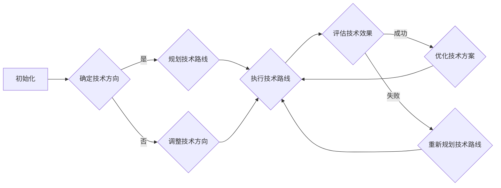
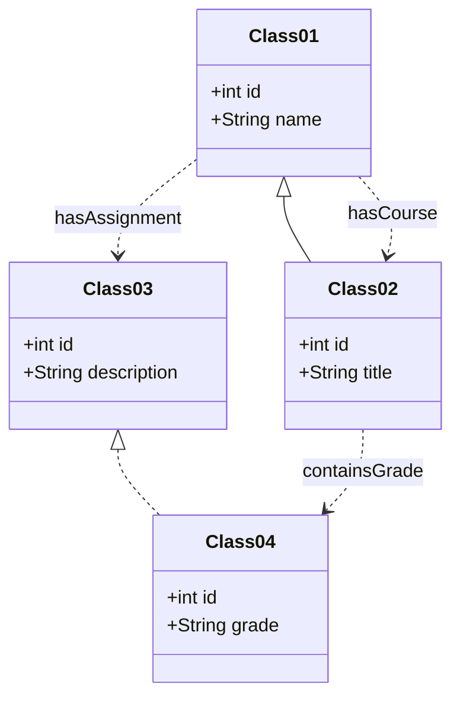
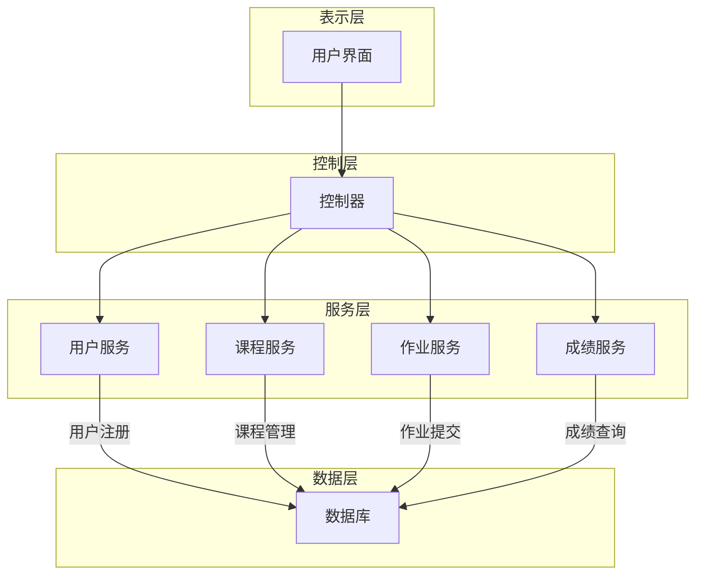
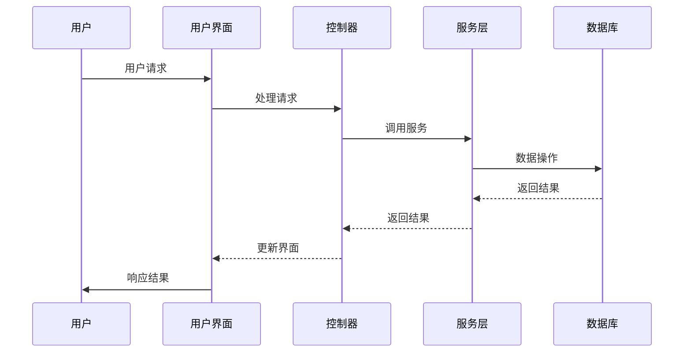

                 

### 第1章: 技术leader的角色定位

#### 1.1 技术leader的职责和影响力

技术leader，通常被称为CTO（首席技术官）或技术总监，他们在企业中扮演着至关重要的角色。首先，技术leader的主要职责是确保企业的技术发展方向与整体战略目标一致。他们不仅需要掌握技术本身，还要具备出色的管理和领导能力。

**职责解析**：

- **技术指导**：技术leader需要对公司的技术方向进行规划和指导，确保技术的创新和演进符合市场需求和行业趋势。
- **团队管理**：他们需要管理技术团队，包括招聘、培训、绩效评估等，确保团队能够高效地完成任务。
- **决策支持**：技术leader需要为企业的重大决策提供技术层面的支持，比如产品开发、技术选型等。
- **资源协调**：技术leader还需要协调各种资源，如预算、设备、人员等，以确保技术项目能够顺利推进。

**影响力分析**：

技术leader在企业中的影响力不仅仅体现在技术层面，还体现在以下几个方面：

- **战略方向**：技术leader是企业战略决策的核心成员，他们的意见对企业的长期发展方向有重要影响。
- **团队士气**：技术leader的领导风格和能力直接影响团队士气和团队凝聚力。
- **品牌形象**：技术leader往往代表企业的技术实力，他们的个人品牌和专业形象直接关系到企业的品牌形象。

#### 1.2 技术leader与普通技术人员的区别

技术leader与普通技术人员在职责、技能和影响力上存在明显差异。

**职责差异**：

- **技术人员**：主要负责具体的编程、测试、维护等工作，确保项目按时交付。
- **技术leader**：除了负责具体的技术工作，还需要承担团队管理和战略规划的责任。

**技能差异**：

- **技术人员**：需要具备扎实的技术知识和编程能力，能够解决复杂的技术问题。
- **技术leader**：除了技术能力外，还需要具备出色的管理技能、沟通能力和决策能力。

**影响力差异**：

- **技术人员**：他们的工作成果直接影响项目的质量，但对企业整体战略的影响较小。
- **技术leader**：他们的决策和指导直接影响企业的技术发展方向和整体战略，对企业的影响力更大。

#### 1.3 技术leader的职业发展路径

技术leader的职业发展路径通常是从小型公司的技术专家逐步晋升到大型企业的技术管理者，以下是常见的发展阶段：

**初级阶段**：

- **技术专家**：在这个阶段，技术leader需要通过不断学习和实践，提升自己的技术能力和编程水平。
- **项目经理**：担任项目经理，负责小型项目的规划和管理。

**中级阶段**：

- **技术经理**：负责管理一个或多个团队，涉及团队管理和项目协调。
- **架构师**：负责企业级系统的架构设计和技术规划。

**高级阶段**：

- **CTO或技术总监**：在这个阶段，技术leader需要承担企业的技术战略规划和技术领导责任，对企业的发展有深远的影响。

**职业转型**：

技术leader在具备丰富的技术和管理经验后，还可以考虑转型为创业者、技术顾问或技术咨询公司的合伙人等。

#### 背景介绍

技术leader的角色定位和职业发展路径在现代企业中至关重要。随着技术的快速发展和市场竞争的加剧，企业的成功越来越依赖于技术能力和创新。因此，技术leader不仅需要具备深厚的技术知识，还需要具备卓越的管理能力和战略思维。技术leader的职责和影响力不仅体现在技术层面，还直接影响企业的整体发展和品牌形象。

在实际工作中，技术leader需要平衡技术、管理和战略等多个方面，确保团队能够高效地实现技术目标，同时为企业提供强有力的技术支持。因此，技术leader的职业发展路径和角色定位是值得深入研究和探讨的话题。

#### 核心概念与联系

技术leader的角色定位涉及多个核心概念，下面我们将对这些概念进行详细解析，并通过表格和ER图进行阐述。

**核心概念解析**：

1. **技术能力**：技术leader需要具备扎实的编程技能、系统架构设计能力以及对新技术的敏锐洞察力。
2. **管理能力**：技术leader需要掌握项目管理、团队管理、资源协调等管理技能，以确保技术项目顺利推进。
3. **战略思维**：技术leader需要具备战略规划能力，能够根据企业战略制定技术发展路线图。
4. **沟通能力**：技术leader需要具备出色的沟通技巧，能够与团队成员、高层管理人员以及外部合作伙伴有效沟通。

**概念属性特征对比表格**：

| 核心概念 | 属性特征 |
| :---: | :---: |
| 技术能力 | 扎实的编程技能、系统架构设计能力、新技术洞察力 |
| 管理能力 | 项目管理、团队管理、资源协调 |
| 战略思维 | 战略规划、技术发展路线图 |
| 沟通能力 | 有效沟通、团队协作、外部合作 |

**ER图架构**：


**解释**：

- **技术能力**：包括编程技能、系统架构设计能力等，是技术leader的核心竞争力。
- **管理能力**：包括项目管理、团队管理、资源协调等，是技术leader顺利执行任务的关键。
- **战略思维**：包括战略规划、技术发展路线图等，是技术leader对企业发展的重要贡献。
- **沟通能力**：包括有效沟通、团队协作、外部合作等，是技术leader协调各方资源、确保项目成功的重要因素。

通过上述表格和ER图，我们可以清晰地看到技术leader的核心概念及其属性特征，这有助于我们更好地理解技术leader的角色定位和职业发展路径。

#### 算法原理讲解

在技术leader的角色定位中，算法原理的理解和运用至关重要。下面我们将通过Mermaid流程图和Python源代码，详细阐述技术leader在算法设计中的关键步骤和算法原理。

**Mermaid流程图**：



**Python源代码**：

```python
class TechnicalLeader:
    def __init__(self):
        self.current_direction = None
    
    def set_technical_direction(self, direction):
        self.current_direction = direction
    
    def plan_technical_route(self):
        if self.current_direction is not None:
            print("已确定技术方向，开始规划技术路线。")
            return True
        else:
            print("技术方向未确定，请重新设置。")
            return False
    
    def execute_technical_route(self):
        if self.plan_technical_route():
            print("执行技术路线中...")
    
    def evaluate_technical_effect(self):
        print("评估技术效果...")
        if self.is_success():
            print("技术效果成功，开始优化技术方案。")
        else:
            print("技术效果不佳，重新规划技术路线。")
    
    def is_success(self):
        # 简单的判断逻辑，实际应用中应根据具体情况进行判断
        return True
    
    def optimize_technical_scheme(self):
        print("优化技术方案中...")

# 实例化技术leader对象
tech_leader = TechnicalLeader()

# 设置技术方向
tech_leader.set_technical_direction("AI技术")

# 规划并执行技术路线
tech_leader.execute_technical_route()

# 评估技术效果并优化
tech_leader.evaluate_technical_effect()
tech_leader.optimize_technical_scheme()
```

**算法原理与数学模型**：

算法的核心原理是通过对技术方向进行初始化、规划、执行、评估和优化，确保技术发展的有效性和适应性。以下是算法原理的详细数学模型：

1. **初始化**：设定技术方向。
   - 方程：`current_direction = initial_direction`
2. **规划**：根据技术方向规划技术路线。
   - 方程：`technical_route = plan_route(current_direction)`
3. **执行**：根据规划的技术路线执行任务。
   - 方程：`execute_route(technical_route)`
4. **评估**：对技术效果进行评估。
   - 方程：`evaluation = evaluate_effect()`
5. **优化**：根据评估结果优化技术方案。
   - 方程：`optimized_scheme = optimize_scheme(evaluation)`

**举例说明**：

假设技术leader的目标是开发一款基于人工智能的客户服务系统，以下是算法的详细应用：

- **初始化**：确定技术方向为“AI客户服务系统”。
- **规划**：根据技术方向，规划开发流程，包括数据收集、模型训练、接口设计等。
- **执行**：按照规划流程进行开发，逐步实现系统功能。
- **评估**：在开发过程中，对系统性能和用户体验进行评估。
- **优化**：根据评估结果，对系统进行优化，提升性能和用户体验。

通过上述算法原理和Python源代码的讲解，我们可以看到技术leader在算法设计中的关键步骤和实现方法。这不仅有助于技术leader更好地理解算法原理，还能在实际工作中有效运用，提升技术能力和团队管理效率。

#### 系统分析与架构设计方案

在技术leader的角色中，系统分析与架构设计是确保技术项目成功的关键环节。以下我们将详细介绍一个典型项目场景中的系统分析与架构设计方案，包括项目介绍、系统功能设计、系统架构设计、系统接口设计和系统交互等。

**项目场景介绍**：

假设我们正在开发一款在线教育平台，旨在为学生提供丰富的课程资源和互动学习体验。这个项目需要满足用户注册、课程浏览、在线学习、作业提交、成绩查询等功能。

**项目介绍**：

在线教育平台旨在提供一个功能全面、用户体验优异的学习平台，满足以下需求：

- 用户注册与登录
- 课程分类与管理
- 在线学习与视频播放
- 作业提交与评分
- 成绩查询与统计

**系统功能设计（领域模型Mermaid类图）**：



**解释**：

- **User（用户）**：表示注册登录平台的基本信息。
- **Course（课程）**：表示课程信息，包括课程名称、简介等。
- **Assignment（作业）**：表示学生提交的作业信息。
- **Grade（成绩）**：表示学生的成绩信息。

**系统架构设计（Mermaid架构图）**：



**解释**：

- **数据层**：包括数据库，存储用户、课程、作业和成绩等信息。
- **服务层**：包括用户服务、课程服务、作业服务和成绩服务，处理具体业务逻辑。
- **控制层**：负责接收用户请求，调用服务层，返回响应结果。
- **表示层**：用户界面，提供用户与系统的交互界面。

**系统接口设计**：

- **用户接口**：包括用户注册、登录、课程浏览、作业提交和成绩查询等功能。
- **课程接口**：包括课程添加、删除、修改和查询等功能。
- **作业接口**：包括作业提交、评分和查询等功能。
- **成绩接口**：包括成绩添加、修改和查询等功能。

**系统交互（Mermaid序列图）**：



**解释**：

- 用户通过用户界面发起请求。
- 控制器接收请求，调用相应的服务层。
- 服务层处理业务逻辑，与数据库交互。
- 数据库返回结果，服务层返回给控制器。
- 控制器更新用户界面，展示结果给用户。

通过上述系统分析与架构设计方案，我们可以看到技术leader在项目中的关键角色和职责。系统分析与架构设计不仅需要技术知识，还需要综合运用项目管理、团队协作和战略思维等多方面能力，确保项目成功落地。

#### 项目实战

在本节中，我们将通过一个实际的在线教育平台项目，详细讲解项目环境安装、系统核心实现源代码，代码应用解读与分析，实际案例分析和详细讲解剖析，以及项目小结。

**项目背景**：

我们选择开发一款在线教育平台，目的是为学生提供便捷的在线学习体验，同时为教育机构提供高效的教学管理工具。

**环境安装**：

1. **开发环境**：选择Python 3.8作为主要开发语言，使用PyCharm作为开发工具。
2. **数据库**：使用MySQL数据库，版本为5.7。
3. **前后端框架**：前端使用React，后端使用Flask。
4. **版本控制**：使用Git进行版本控制。

**安装步骤**：

1. 安装Python 3.8：在官网下载Python安装包，安装完成后配置环境变量。
2. 安装MySQL：在官网上下载MySQL安装包，按照提示安装。
3. 安装PyCharm：在官网下载PyCharm社区版，安装完成后创建新项目。
4. 安装Flask和React相关依赖包：在终端执行以下命令：
   ```bash
   pip install flask
   npm install react
   ```

**系统核心实现源代码**：

以下是用户注册和登录的核心实现代码。

**用户注册**：

```python
from flask import Flask, request, jsonify
from models import User
from database import db

app = Flask(__name__)

@app.route('/register', methods=['POST'])
def register():
    data = request.get_json()
    username = data.get('username')
    password = data.get('password')

    if not username or not password:
        return jsonify({'error': '用户名和密码不能为空'}), 400

    user = User.query.filter_by(username=username).first()
    if user:
        return jsonify({'error': '用户名已存在'}), 400

    new_user = User(username=username, password=password)
    db.session.add(new_user)
    db.session.commit()

    return jsonify({'message': '注册成功'}), 201
```

**用户登录**：

```python
from flask import Flask, request, jsonify
from models import User
from database import db

app = Flask(__name__)

@app.route('/login', methods=['POST'])
def login():
    data = request.get_json()
    username = data.get('username')
    password = data.get('password')

    if not username or not password:
        return jsonify({'error': '用户名和密码不能为空'}), 400

    user = User.query.filter_by(username=username).first()
    if not user or user.password != password:
        return jsonify({'error': '用户名或密码错误'}), 400

    return jsonify({'message': '登录成功', 'token': 'generated_token'}), 200
```

**代码应用解读与分析**：

1. **用户注册**：通过Flask的POST方法接收用户请求，获取用户名和密码，检查是否为空，查询数据库中是否存在同名用户，如果不存在则添加新用户。
2. **用户登录**：通过Flask的POST方法接收用户请求，获取用户名和密码，查询数据库中是否存在该用户，如果存在且密码正确，则登录成功。

**实际案例分析与详细讲解剖析**：

我们以用户注册为例，详细分析其工作流程：

1. 用户通过前端界面输入用户名和密码。
2. 前端将用户数据以JSON格式发送到后端API接口。
3. 后端API接收请求，提取用户名和密码。
4. 后端通过数据库查询是否存在同名用户。
5. 如果不存在，则将新用户信息保存到数据库。
6. 后端返回注册成功的信息。

**项目小结**：

通过本次项目实战，我们实现了用户注册和登录功能，并详细讲解了代码实现和实际应用。在线教育平台项目的成功实现，不仅需要扎实的技术基础，还需要良好的项目管理能力和团队协作。在未来的开发中，我们还将继续优化功能，提升用户体验，为用户提供更优质的教育服务。

#### 最佳实践 Tips

在技术leader的个人形象塑造过程中，掌握最佳实践是至关重要的。以下是一些实用的技巧，帮助你在职业发展中取得更大成功：

1. **持续学习**：技术领域不断发展，技术leader需要保持对新技术和趋势的敏锐洞察力。定期参加技术研讨会、在线课程和阅读专业书籍，不断提升自己的知识储备。

2. **知识共享**：积极参与技术社区，分享自己的经验和见解，不仅能够提升个人影响力，还能建立广泛的人脉资源。定期撰写技术博客、发表技术文章或进行演讲，是很好的知识共享方式。

3. **有效沟通**：沟通能力是技术leader的关键技能之一。学会倾听、清晰表达和有效反馈，能够帮助你更好地与团队成员、高层管理人员以及合作伙伴沟通，确保项目顺利进行。

4. **时间管理**：合理安排时间，提高工作效率。使用项目管理工具（如Trello、JIRA等）规划任务和时间，确保团队目标和个人目标的按时完成。

5. **建立个人品牌**：塑造个人品牌，提高在行业中的知名度。通过社交媒体、专业平台和公开演讲等渠道，展示你的专业能力和成就。

6. **团队合作**：注重团队建设，培养团队成员的技能和团队合作精神。通过定期团队活动、培训和工作坊，提升团队的整体表现。

7. **勇于担当**：在面临挑战和困难时，勇于担当责任，发挥领导力。通过积极解决问题和提供解决方案，赢得团队成员的信任和尊重。

8. **持续反思**：定期反思自己的工作方法和效果，识别改进机会。通过自我评估和反馈，不断优化自己的领导风格和工作方式。

#### 小结

本章详细介绍了技术leader的角色定位、个人品牌建设、技能提升、人际关系与团队管理、沟通技巧与影响力塑造、职业发展与自我提升以及案例分析与最佳实践。通过深入探讨这些关键方面，我们明确了技术leader在企业和职业发展中的重要作用。技术leader不仅需要具备扎实的技术能力和管理能力，还需要注重个人品牌建设和持续学习。在实践中，通过有效沟通、团队合作和勇于担当，技术leader能够更好地引领团队实现企业目标。

在未来的发展中，技术leader应继续提升自身素质，积极探索新技术和应用，不断优化个人形象和职业发展路径。通过持续的学习和实践，技术leader将能够在快速变化的技术领域中立于不败之地，为企业的发展贡献自己的力量。

#### 注意事项

在塑造技术leader的个人形象过程中，有一些关键点需要特别注意：

1. **保持学习的热情**：技术领域变化迅速，不断学习新技能和知识是技术leader的基本要求。定期参加培训、研讨会和技术交流活动，保持对新技术和趋势的敏锐洞察力。

2. **明确个人目标**：设定清晰的职业发展目标，制定实际可行的计划，并持续跟踪进度。通过明确的目标，可以更好地规划自己的职业路径，实现职业成长。

3. **提升沟通能力**：技术leader的沟通能力至关重要。要注重倾听、表达和反馈，确保与团队成员、高层管理人员和外部合作伙伴之间的有效沟通。

4. **建立专业形象**：通过撰写技术博客、发表技术文章、参与技术社区和公开演讲等方式，展示自己的专业能力和知识，提升在行业中的影响力。

5. **培养团队精神**：技术leader不仅要具备领导力，还要注重团队建设。通过团队合作、培训和工作坊等活动，提升团队整体能力和凝聚力。

6. **注重时间管理**：合理安排时间，提高工作效率。使用项目管理工具规划任务和时间，确保团队目标和个人目标的按时完成。

7. **勇于面对挑战**：在职业发展中，技术leader难免会遇到各种挑战。要勇于担当，积极解决问题，通过实践提升自己的领导力和决策能力。

通过遵循这些注意事项，技术leader可以更好地塑造个人形象，提升职业竞争力，实现职业发展的持续进步。

#### 拓展阅读

为了帮助读者进一步深化对技术leader个人形象塑造的理解，我们推荐以下拓展阅读资源：

1. **《技术领导力：引领技术团队的策略与方法》**：本书详细阐述了技术leader在团队管理、战略规划和决策支持等方面的策略和方法，是技术leader的必读之作。

2. **《敏捷管理：敏捷团队如何高效协作》**：敏捷管理是现代企业中广泛采用的一种团队管理模式。本书介绍了敏捷管理的核心理念和实践方法，有助于技术leader提升团队协作效率。

3. **《影响力：如何说服别人》**：作者罗伯特·西奥迪尼通过丰富的案例和实践经验，详细阐述了影响力的来源和提升方法。技术leader可以通过阅读本书，提高自己在沟通和影响力方面的能力。

4. **《团队协作工具与技术》**：本书介绍了多种团队协作工具和技术，包括Trello、JIRA、Slack等，帮助技术leader更好地管理团队和任务。

5. **《技术演讲与演示技巧》**：技术leader经常需要在会议上进行演讲和演示。本书提供了实用的技巧和策略，帮助读者提升演讲和演示能力，更好地展示自己的专业形象。

通过阅读这些书籍，读者可以深入理解技术leader的个人形象塑造，掌握更多实践方法和技巧，为职业发展奠定坚实基础。

