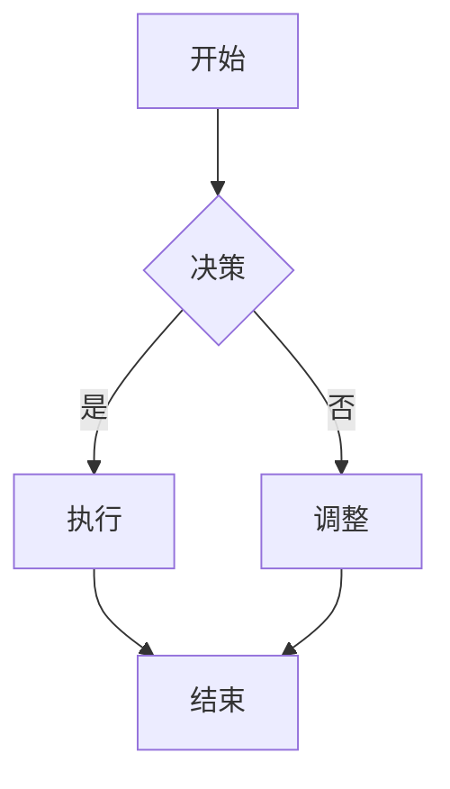
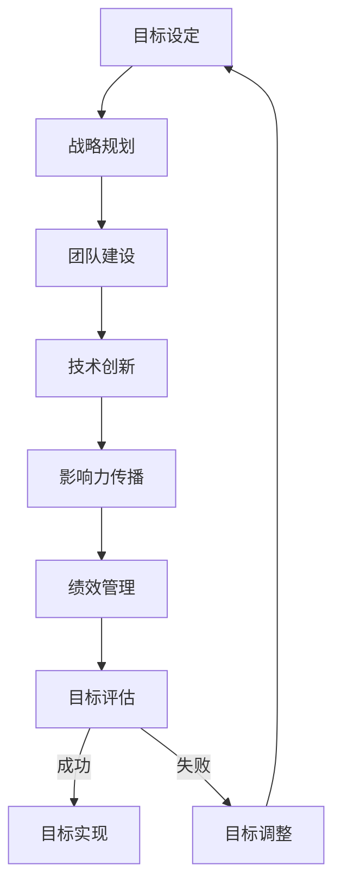
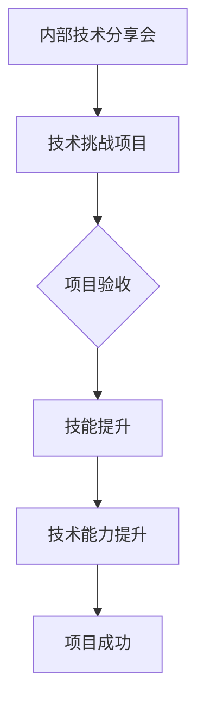
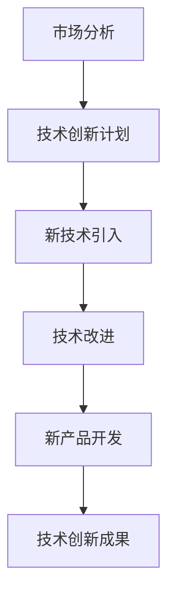
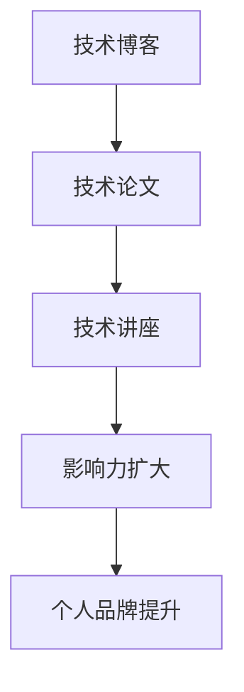
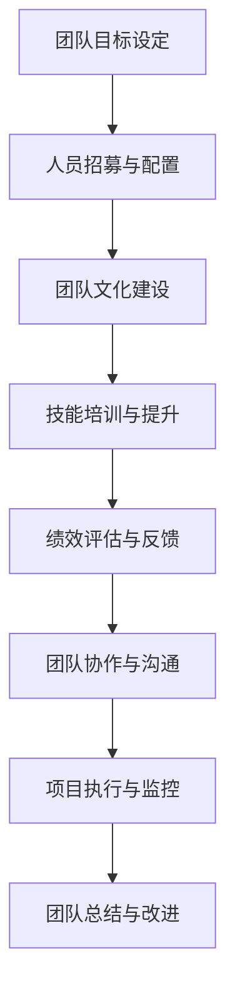
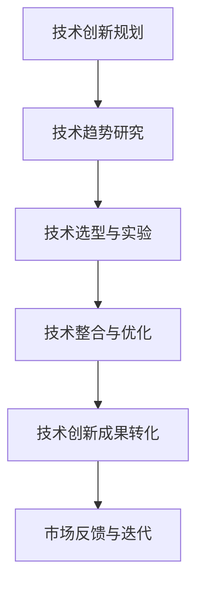
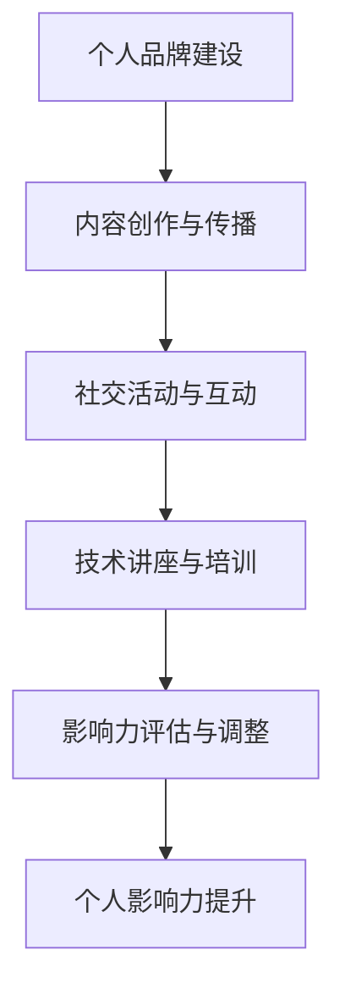

                 

### # 1.5 影响力工程学的应用场景与案例

#### 1.5.1 培养技术团队氛围
作为技术leader，影响力的工程学可以帮助我们打造一个积极向上的团队氛围。通过有效的沟通和激励，我们可以让团队成员感受到他们的工作是被重视和认可的，从而增强团队凝聚力。

- **案例分析**：在某个大型互联网公司的技术部门，部门经理李明通过定期的技术分享会，让团队成员有机会展示自己的工作，分享技术心得。这不仅提高了团队成员的技术水平，也增强了团队的凝聚力和合作精神。

#### 1.5.2 促进技术创新
技术leader的影响力还可以推动团队进行技术创新。通过分享最新的技术趋势和研究，我们可以激发团队成员的创新思维，推动团队不断进步。

- **案例分析**：在某创业公司的技术团队中，团队领导王总定期组织技术研讨会，邀请团队成员分享他们在技术上的探索和成果。这种做法不仅提升了团队的技术水平，也推动了公司的技术创新。

#### 1.5.3 管理项目风险
在项目管理中，技术leader的影响力可以帮助我们更好地管理项目风险。通过明确的目标设定和有效的沟通，我们可以确保团队成员对项目目标有清晰的认识，从而减少项目风险。

- **案例分析**：在一个复杂的软件开发项目中，项目经理张伟通过定期的项目会议和目标分解，确保团队成员对项目的目标和进度有清晰的认识。这种做法有效地降低了项目风险，保证了项目的顺利推进。

#### 1.5.4 建立个人品牌
作为技术leader，我们还可以通过影响力的工程学来建立个人品牌。通过在技术社区发表高质量的博客文章、参与技术讲座和研讨会，我们可以提升自己的知名度，从而在行业内建立权威。

- **案例分析**：技术大牛刘博通过在多个技术社区上发表专业博客文章，分享自己在技术领域的研究和心得，逐渐在业内建立了自己的品牌。这不仅提升了他的个人影响力，也为公司带来了更多的商业机会。

### 1.6 小结

通过上面的分析，我们可以看到影响力工程学在技术leader的工作中起着至关重要的作用。无论是在团队管理、技术创新、项目风险管理还是个人品牌建立方面，影响力工程学都能够为我们提供有效的工具和方法。

作为技术leader，我们应该不断学习和实践影响力工程学的相关理论和技巧，提升自己的领导力和管理能力，从而更好地带领团队实现目标。让我们一步一步地思考，在实践中不断成长和进步。

---

### # 第二部分：核心概念与理论框架

在探讨技术leader的影响力工程学时，我们需要先了解一些核心概念和理论框架。这些概念和框架为我们提供了理论基础，帮助我们更好地理解影响力工程学的本质和应用。

#### 2.1.1 技术领导力的定义与特征

技术领导力是指技术领导者通过领导和管理团队，推动技术创新和团队发展的能力。它包括以下几个方面：

1. **愿景与目标设定**：技术领导者需要能够设定清晰的技术愿景和目标，引导团队朝着共同的方向努力。
2. **战略规划**：技术领导者需要具备战略规划能力，能够根据业务需求和技术趋势制定合适的技术战略。
3. **团队管理**：技术领导者需要擅长团队管理，包括人员调配、绩效评估、团队沟通等。
4. **技术创新**：技术领导者需要推动团队进行技术创新，不断提升团队的技术水平。
5. **影响力**：技术领导者需要具备影响力，能够影响团队成员、上级领导和客户，推动项目的顺利进行。

#### 2.1.2 影响力的定义与分类

影响力是指一个人或组织通过某种方式影响他人思想、行为或决策的能力。在技术领导者的角色中，影响力主要分为以下几种类型：

1. **权威影响力**：基于个人的职位、专业知识和经验，通过命令和指示来影响他人。
2. **感召影响力**：通过个人的魅力、价值观和理念来影响他人，使他人愿意追随和信任。
3. **知识影响力**：通过个人的专业知识和经验，为团队提供指导和建议，从而影响团队的方向和决策。
4. **关系影响力**：通过建立良好的人际关系，使他人愿意支持自己的观点和决策。

#### 2.1.3 技术leader的影响力工程学模型

为了更好地理解技术leader的影响力工程学，我们可以构建一个影响力工程学模型。这个模型包括以下几个关键组成部分：

1. **目标设定**：技术领导者需要明确自己的目标，包括个人目标、团队目标和组织目标。
2. **战略规划**：技术领导者需要制定合适的战略规划，以实现这些目标。
3. **团队建设**：技术领导者需要建设一个有凝聚力和战斗力的团队，包括人员招募、团队文化建设和团队沟通。
4. **技术创新**：技术领导者需要推动团队进行技术创新，提升团队的技术水平和竞争力。
5. **影响力传播**：技术领导者需要通过多种方式传播自己的影响力，包括技术演讲、博客文章、内部培训等。
6. **绩效管理**：技术领导者需要通过绩效管理来确保团队目标的实现，包括绩效评估、激励机制等。

#### 2.1.4 影响力工程学的核心要素

影响力工程学的核心要素包括：

1. **知识**：技术领导者需要具备丰富的专业知识和经验，以便为团队提供指导和建议。
2. **能力**：技术领导者需要具备优秀的领导能力和管理能力，能够带领团队实现目标。
3. **人格魅力**：技术领导者需要具备良好的个人魅力和价值观，能够影响和激励团队成员。
4. **人际关系**：技术领导者需要建立广泛的人际关系，以便获取更多的资源和支持。

#### 2.1.5 影响力工程学的应用场景

影响力工程学的应用场景非常广泛，包括但不限于以下几个方面：

1. **团队管理**：通过影响力工程学，技术领导者可以更有效地管理团队，提升团队绩效。
2. **项目领导**：在项目管理中，技术领导者可以利用影响力工程学来推动项目进展，降低项目风险。
3. **技术创新**：通过影响力工程学，技术领导者可以推动团队进行技术创新，提升企业的竞争力。
4. **个人品牌建设**：通过影响力工程学，技术领导者可以提升自己的知名度，建立个人品牌。

#### 2.1.6 小结

通过了解技术领导力的定义与特征、影响力的定义与分类、影响力工程学模型及其核心要素，我们可以更好地理解技术leader的影响力工程学。这些概念和理论框架为我们提供了理论基础，帮助我们更有效地应用影响力工程学，提升自己的领导力和团队管理能力。

在接下来的部分，我们将进一步探讨影响力工程学的数学模型和Mermaid流程图，以帮助我们更好地理解和应用这些概念。

---

### # 2.2 影响力工程学的数学模型

在影响力工程学中，数学模型扮演着至关重要的角色。通过数学模型，我们可以更精确地描述和预测影响力的作用机制，从而为技术leader提供科学的决策依据。

#### 2.2.1 数学模型的构建

影响力工程学的数学模型通常由以下几个核心组成部分构成：

1. **影响力函数**：影响力函数描述了个人或组织对他人思想、行为或决策的影响程度。它通常是一个非线性函数，取决于影响力的类型、强度和作用对象。

2. **影响力网络**：影响力网络描述了个人或组织之间的相互作用关系。它通常是一个图结构，节点代表个人或组织，边代表影响力关系。

3. **目标函数**：目标函数描述了技术leader的目标，如团队绩效、技术创新等。它通常是一个多目标函数，需要通过优化方法求解。

4. **约束条件**：约束条件描述了技术leader在实现目标过程中需要遵守的限制，如资源限制、时间限制等。

#### 2.2.2 数学公式与解释

以下是一些常见的影响力工程学数学公式及其解释：

1. **影响力函数**：

   $$ F = f(I, T, R) $$

   其中，$F$ 表示影响力，$I$ 表示影响力强度，$T$ 表示影响力作用时间，$R$ 表示影响力作用范围。

   解释：影响力函数表示个人或组织对他人产生的影响力，取决于影响力强度、作用时间和作用范围。

2. **影响力网络**：

   $$ G = (V, E) $$

   其中，$G$ 表示影响力网络，$V$ 表示节点集合，$E$ 表示边集合。

   解释：影响力网络表示个人或组织之间的相互作用关系，节点代表个人或组织，边代表影响力关系。

3. **目标函数**：

   $$ \max Z = f(X, Y) $$

   其中，$Z$ 表示目标函数值，$X$ 表示技术leader的策略变量，$Y$ 表示团队绩效指标。

   解释：目标函数表示技术leader的目标，通常是一个多目标函数，需要通过优化方法求解。

4. **约束条件**：

   $$ g(X, Y) \leq C $$

   其中，$g$ 表示约束条件，$X$ 表示技术leader的策略变量，$Y$ 表示团队绩效指标，$C$ 表示约束条件值。

   解释：约束条件表示技术leader在实现目标过程中需要遵守的限制，如资源限制、时间限制等。

#### 2.2.3 举例说明

假设一个技术leader希望提升团队的技术创新能力，我们可以构建以下影响力工程学数学模型：

1. **影响力函数**：

   $$ F = f(I, T, R) = 0.5 \times I \times T \times R $$

   其中，$I$ 表示影响力强度（1-10分制），$T$ 表示影响力作用时间（月），$R$ 表示影响力作用范围（团队成员数量）。

2. **影响力网络**：

   $$ G = (V, E) $$

   其中，$V = \{A, B, C, D\}$ 表示团队成员，$E = \{\{A, B\}, \{B, C\}, \{C, D\}\}$ 表示影响力关系。

3. **目标函数**：

   $$ \max Z = f(X, Y) = 0.8 \times X \times Y $$

   其中，$X$ 表示技术leader的策略变量（1-10分制），$Y$ 表示团队绩效指标（1-10分制）。

4. **约束条件**：

   $$ g(X, Y) \leq C = 1000 $$

   解释：技术leader的策略变量和团队绩效指标的乘积不能超过1000，表示技术leader在提升团队技术创新能力的过程中不能超过1000小时的投入。

通过这个模型，技术leader可以根据影响力函数和目标函数来制定提升团队技术创新能力的策略，同时遵守约束条件。

#### 2.2.4 小结

影响力工程学的数学模型为我们提供了分析和优化影响力作用机制的工具。通过构建合适的数学模型，技术leader可以更科学地管理团队、推动技术创新和实现个人目标。在接下来的部分，我们将继续探讨影响力工程学的Mermaid流程图，以帮助我们更直观地理解和应用这些数学模型。

---

### # 2.3 Mermaid流程图

Mermaid是一种基于Markdown的图形绘制工具，它可以方便地生成各种图表，如流程图、类图、时序图等。在影响力工程学中，Mermaid流程图可以帮助我们更直观地展示影响力作用机制和关键步骤。

#### 2.3.1 Mermaid流程图的基础知识

Mermaid的基本语法如下：

这个流程图表示一个简单的决策流程，包括开始、决策、执行、调整和结束五个步骤。

#### 2.3.2 技术leader影响力工程学的流程图

以下是一个技术leader影响力工程学的Mermaid流程图示例：

这个流程图展示了技术leader在影响力工程学中的关键步骤，包括目标设定、战略规划、团队建设、技术创新、影响力传播、绩效管理和目标评估。

#### 2.3.3 技术leader影响力工程学流程图的详细解析

1. **目标设定**：技术leader需要明确团队的目标，这是影响力工程学的起点。
2. **战略规划**：根据目标，技术leader需要制定合适的战略规划，确保团队在正确的方向上前进。
3. **团队建设**：技术leader需要建设一个有凝聚力和战斗力的团队，这包括人员招募、团队文化建设和团队沟通。
4. **技术创新**：技术leader需要推动团队进行技术创新，提升团队的技术水平和竞争力。
5. **影响力传播**：技术leader需要通过多种方式传播自己的影响力，如技术演讲、博客文章、内部培训等。
6. **绩效管理**：技术leader需要通过绩效管理来确保团队目标的实现，包括绩效评估、激励机制等。
7. **目标评估**：技术leader需要对目标进行评估，以判断是否达成预期目标。
8. **目标实现/调整**：根据评估结果，技术leader需要调整目标或继续努力实现目标。

#### 2.3.4 小结

通过Mermaid流程图，我们可以更直观地理解和应用技术leader的影响力工程学。这个流程图帮助我们明确了技术leader在团队管理、技术创新和影响力传播等方面的关键步骤，从而更有效地提升领导力和团队管理能力。在接下来的部分，我们将进一步探讨实际案例中的影响力工程学应用。

---

### # 2.4 实际案例中的影响力工程学应用

为了更好地理解影响力工程学在技术领导中的实际应用，我们将通过几个具体案例来分析影响力工程学的应用过程和效果。

#### 案例一：提升团队技术能力

**背景介绍**：某互联网公司技术团队在开发新项目时遇到了技术难题，团队的技术能力亟待提升。

**系统架构设计**：技术领导王明首先组织了团队会议，分析了当前团队的技术短板，并制定了详细的技术培训计划。培训计划包括内部技术分享会、外部培训课程和技术书籍推荐。

**系统功能设计**：为了确保培训效果，王明还设计了多个技术挑战项目，鼓励团队成员参与，并在项目中应用所学知识。

**系统接口设计和系统交互**：

**项目实战**：在实际操作中，王明通过定期举办内部技术分享会，让团队成员有机会分享自己的技术心得和解决技术问题的方法。同时，他组织了多个技术挑战项目，让团队成员在实际项目中应用所学知识，并在项目验收时进行技能提升。

**实际案例分析**：通过这个项目，团队的技术能力得到了显著提升，项目进展顺利，团队士气高涨。

**项目小结**：王明通过影响力工程学的应用，成功地提升了团队的技术能力，为项目的成功奠定了基础。

#### 案例二：推动技术创新

**背景介绍**：某创业公司希望在竞争激烈的市场中脱颖而出，需要推动技术创新。

**系统架构设计**：公司技术总监李华首先分析了市场趋势和竞争对手的技术动态，制定了技术创新计划。

**系统功能设计**：技术创新计划包括引入新技术、改进现有技术和开发全新产品。

**系统接口设计和系统交互**：

**项目实战**：李华组织了多个技术研讨会，邀请团队成员分享新技术和解决方案。同时，他鼓励团队进行跨部门合作，共同攻克技术难题。

**实际案例分析**：通过这个项目，公司成功引入了新技术，改进了现有技术，并开发出多个创新产品，在市场上取得了显著竞争优势。

**项目小结**：李华通过影响力工程学的应用，成功地推动了公司的技术创新，提升了公司的市场竞争力。

#### 案例三：提升个人品牌

**背景介绍**：某知名技术专家希望提升个人品牌，扩大影响力。

**系统架构设计**：该专家张磊制定了个人品牌建设计划，包括撰写技术博客、发表技术论文和参与技术讲座。

**系统功能设计**：张磊的技术博客涵盖了多个技术领域，内容深入浅出，吸引了大量读者。他还定期发表技术论文，并在各大技术会议上发表演讲。

**系统接口设计和系统交互**：

**项目实战**：张磊通过撰写高质量的技术博客，分享自己在技术领域的研究和心得。他还定期发表技术论文，并在各大技术会议上发表演讲，扩大了自己的影响力。

**实际案例分析**：通过这个项目，张磊的个人品牌得到了显著提升，成为了业内知名的技术专家。

**项目小结**：张磊通过影响力工程学的应用，成功地提升了个人品牌，扩大了影响力。

#### 2.4.4 小结

通过以上实际案例，我们可以看到影响力工程学在技术领导中的应用效果。无论是提升团队技术能力、推动技术创新还是提升个人品牌，影响力工程学都为我们提供了有效的工具和方法。在接下来的部分，我们将进一步探讨如何通过影响力工程学提升团队管理与领导力。

---

### # 2.5 提升团队管理与领导力

在影响力工程学中，团队管理和领导力是技术leader的重要职责。通过有效的团队管理和领导力提升，技术leader可以更好地发挥团队潜力，实现组织目标。

#### 2.5.1 团队管理策略

1. **目标设定与分解**：技术leader需要明确团队的目标，并将其分解为具体的子目标，确保每个成员都清楚自己的职责和目标。

2. **人员配置与激励**：技术leader需要根据团队成员的能力和兴趣进行合理配置，同时建立有效的激励机制，鼓励团队成员发挥最佳水平。

3. **沟通与协作**：技术leader需要建立良好的沟通机制，确保信息流畅传递，促进团队成员之间的协作和合作。

4. **绩效评估与反馈**：技术leader需要定期对团队成员进行绩效评估，给予反馈和建议，帮助团队成员不断提升。

#### 2.5.2 领导力提升方法

1. **自我认知与提升**：技术leader需要了解自己的优点和不足，通过学习和实践不断提升自己的能力和素质。

2. **领导力培养与实践**：技术leader可以通过参加领导力培训、阅读相关书籍、参加行业研讨会等方式，提升自己的领导力。

3. **领导力评估与反馈**：技术leader需要定期进行领导力评估，了解自己在团队中的领导效果，并根据反馈进行调整和改进。

#### 2.5.3 实际案例

**案例一：提升团队凝聚力**：某互联网公司技术团队在项目开发过程中遇到了困难，团队成员之间出现了沟通不畅和协作困难的问题。技术leader张强意识到问题后，采取了以下措施：

- **目标设定与分解**：张强重新明确了团队的目标，并将其分解为具体的子目标，确保每个成员都清楚自己的职责和目标。
- **人员配置与激励**：张强根据团队成员的能力和兴趣，重新进行了人员配置，同时设立了激励机制，鼓励团队成员发挥最佳水平。
- **沟通与协作**：张强建立了每周例会制度，确保团队成员之间能够及时沟通，分享进度和问题，促进协作和合作。
- **绩效评估与反馈**：张强定期对团队成员进行绩效评估，给予反馈和建议，帮助团队成员不断提升。

通过这些措施，团队凝聚力得到了显著提升，项目进展顺利。

**案例二：培养领导力**：某创业公司技术总监李华意识到自己在领导力方面还有很大的提升空间。他采取了以下措施：

- **自我认知与提升**：李华通过自我反思和与同事的交流，了解自己的优点和不足，制定了个人提升计划。
- **领导力培养与实践**：李华参加了领导力培训课程，学习了领导力的理论和实践方法。他还主动承担更多责任，参与更多项目，提升自己的领导力。
- **领导力评估与反馈**：李华定期进行领导力评估，了解自己在团队中的领导效果，并根据反馈进行调整和改进。

通过这些措施，李华的领导力得到了显著提升，团队士气高涨，项目进展顺利。

#### 2.5.4 小结

通过团队管理和领导力提升，技术leader可以更好地发挥团队潜力，实现组织目标。在接下来的部分，我们将继续探讨影响力工程学的最佳实践。

---

### # 2.6 影响力工程学的最佳实践

在实际应用中，影响力工程学需要结合具体情境，灵活运用各种方法和技巧。以下是一些最佳实践，可以帮助技术leader更有效地发挥影响力，提升团队绩效。

#### 2.6.1 建立个人品牌

**实践要点**：

1. **持续输出价值**：通过撰写技术博客、发表技术论文、参与技术社区等方式，持续输出有价值的观点和经验，建立个人专业形象。
2. **参与技术活动**：积极参加行业会议、技术讲座、研讨会等活动，与同行交流，扩大影响力。
3. **关注行业动态**：保持对行业动态的敏感度，及时了解新技术、新趋势，为团队提供前沿信息。

**案例分析**：技术大牛李华通过撰写高质量的技术博客，分享自己在技术领域的研究和心得，逐渐在业内建立了自己的品牌。他参与的技术活动也让他结识了许多业内专家，为团队带来了更多资源和机会。

#### 2.6.2 提升团队凝聚力

**实践要点**：

1. **建立团队文化**：明确团队的价值观和使命，让团队成员有共同的目标和愿景。
2. **促进沟通与协作**：定期组织团队活动，加强团队成员之间的沟通与协作，增强团队凝聚力。
3. **激励与认可**：对团队成员的成就和贡献给予及时认可和奖励，激发团队成员的积极性。

**案例分析**：某互联网公司技术团队在技术领导张强的带领下，建立了以“创新、协作、共赢”为核心价值观的团队文化。张强定期组织团队建设活动，如团队拓展训练、技术分享会等，促进了团队成员之间的沟通与协作，团队凝聚力显著提升。

#### 2.6.3 推动技术创新

**实践要点**：

1. **设立技术创新目标**：明确团队的技术创新目标，确保技术创新方向与业务需求相结合。
2. **提供资源支持**：为团队提供必要的技术资源和支持，如培训、工具和设备等，为技术创新创造良好环境。
3. **鼓励试错**：鼓励团队成员在技术创新过程中勇于尝试，允许失败，为团队营造一个宽容和开放的创新氛围。

**案例分析**：某创业公司技术总监李华通过设立技术创新目标，为团队提供了丰富的技术资源和培训机会。他还鼓励团队成员在技术创新过程中勇于尝试，允许失败，为团队创造了一个积极创新的环境。在这种氛围下，团队成功推出了多个创新产品，市场反响热烈。

#### 2.6.4 管理项目风险

**实践要点**：

1. **识别风险**：在项目启动阶段，全面识别可能的风险因素，建立风险管理计划。
2. **风险评估**：对识别出的风险进行评估，确定风险优先级，为风险管理提供依据。
3. **风险应对**：制定有效的风险应对策略，确保项目在面临风险时能够迅速响应和调整。

**案例分析**：某互联网公司技术团队在项目开发过程中，通过定期风险识别和评估，及时发现了潜在的风险点，并制定了相应的应对措施。在项目面临重大挑战时，团队迅速调整策略，成功规避了风险，确保了项目的顺利进行。

#### 2.6.5 提升个人影响力

**实践要点**：

1. **建立人际关系**：通过参加社交活动、行业会议等，积极建立和拓展人际关系网络。
2. **提升沟通能力**：提高自己的沟通能力，学会倾听和表达，增强与他人的互动。
3. **树立专业形象**：通过专业知识和经验的积累，树立自己在行业内的专业形象。

**案例分析**：技术专家张磊通过积极参加行业活动、发表技术论文和参与技术社区讨论，建立了广泛的人际关系网络。他的专业知识和沟通能力也得到了业内同行的高度认可，逐渐在行业内树立了自己的专业形象。

#### 2.6.6 小结

影响力工程学的最佳实践为技术leader提供了丰富的经验和指导。通过建立个人品牌、提升团队凝聚力、推动技术创新、管理项目风险和提升个人影响力，技术leader可以更有效地发挥影响力，提升团队绩效。在实际应用中，技术leader需要根据具体情况灵活运用这些实践，不断优化和改进自己的领导方法和策略。

---

### # 2.7 小结

通过本部分的讨论，我们深入探讨了影响力工程学的核心概念、数学模型、Mermaid流程图以及实际案例。我们了解了技术领导力的定义与特征，明确了影响力的类型和分类，构建了影响力工程学的理论框架。通过数学模型和Mermaid流程图，我们更直观地理解了影响力工程学的应用过程和效果。

在实际案例中，我们看到了影响力工程学在提升团队技术能力、推动技术创新、提升个人品牌等方面的成功应用。这些案例为我们提供了宝贵的经验和启示，展示了影响力工程学在技术领导中的重要作用。

通过本部分的讨论，我们不仅加深了对影响力工程学的理解，也为技术leader提供了实用的方法和策略。在接下来的部分，我们将进一步探讨如何通过影响力工程学提升团队管理和领导力，以实现更高的绩效和组织目标。

---

### # 第三部分：实战案例与分析

在影响力工程学的理论指导下，我们可以通过具体案例来分析技术leader在实际工作中如何应用这些理论，提升团队绩效和领导力。以下我们将介绍三个具体的实战案例，并对其进行详细分析。

#### 案例一：构建高绩效技术团队

**背景介绍**：某创业公司正处于快速发展阶段，技术团队规模逐步扩大，但在团队协作和技术创新能力方面存在明显不足。公司创始人兼CTO王明意识到，通过构建高绩效团队是提升公司竞争力的重要途径。

**系统架构设计**：

**系统功能设计**：

- **团队目标设定**：王明明确了团队的短期和长期目标，并将其分解为具体的子目标，确保每个成员都清楚自己的职责和期望成果。
- **人员招募与配置**：根据团队目标和项目需求，王明进行了合理的人员配置，确保团队成员具备相应的技能和经验。
- **团队文化建设**：王明倡导以“创新、协作、共赢”为核心价值观的团队文化，通过团队活动、团队建设日等方式加强团队成员之间的联系。
- **技能培训与提升**：王明组织了多种形式的技能培训，包括内部技术分享会、外部培训课程和技术论坛，提升团队成员的专业技能。
- **绩效评估与反馈**：王明建立了定期的绩效评估机制，对团队成员的工作进行客观评估，并提供反馈和改进建议。
- **团队协作与沟通**：王明加强了团队内部的沟通与协作，通过每日站会、每周项目回顾等机制，确保信息流畅传递，解决问题及时。

**项目实战**：

1. **团队目标设定**：王明组织了一次全体会议，明确了团队在技术突破、项目交付和团队建设等方面的目标，确保每个成员都明确自己的职责和任务。
2. **人员招募与配置**：王明根据项目需求，重新调整了团队成员的职责，确保每个成员都能发挥自己的专长。
3. **团队文化建设**：王明组织了一次团队建设活动，通过团队游戏和团队讨论，增强了团队成员之间的默契和信任。
4. **技能培训与提升**：王明邀请外部专家进行技术培训，并组织了一次内部技术分享会，让团队成员互相学习和交流。
5. **绩效评估与反馈**：王明对每个成员的工作进行了季度评估，给予肯定和改进建议，激励团队成员不断提升。
6. **团队协作与沟通**：王明加强了团队内部的沟通，确保每个成员都能及时了解项目进展和任务分配。

**实际案例分析**：

通过这一系列措施，该团队在短短几个月内取得了显著进步。团队成员之间的沟通和协作更加顺畅，项目进度和质量也得到了提升。团队整体士气高涨，创新能力和工作效率显著提高。

**项目小结**：

王明通过影响力工程学的应用，成功地构建了一支高绩效团队。这一案例表明，技术leader在团队管理中，需要通过目标设定、人员配置、文化建设、技能培训、绩效评估和沟通协作等多方面的努力，来提升团队绩效和领导力。

#### 案例二：推动技术创新

**背景介绍**：某大型互联网公司希望在激烈的市场竞争中保持技术领先地位，CTO李华决定通过推动技术创新来提升公司的核心竞争力。

**系统架构设计**：

**系统功能设计**：

- **技术创新规划**：李华制定了公司级的技术创新规划，明确了技术创新的目标、路径和资源分配。
- **技术趋势研究**：李华组织团队对前沿技术进行深入研究，关注行业动态和竞争对手的技术动向。
- **技术选型与实验**：根据技术趋势研究，团队进行了多种技术的选型实验，验证技术的可行性和适用性。
- **技术整合与优化**：团队将选型实验中表现优秀的技术进行整合和优化，形成可落地的解决方案。
- **技术创新成果转化**：李华推动技术创新成果在产品中的应用，确保技术创新能够转化为实际的市场价值。
- **市场反馈与迭代**：团队收集市场反馈，对技术创新进行优化和迭代，确保技术的持续改进。

**项目实战**：

1. **技术创新规划**：李华组织了一次技术规划会议，明确了公司在未来一年的技术创新方向和重点。
2. **技术趋势研究**：团队定期进行技术趋势研究，关注云计算、大数据、人工智能等前沿技术。
3. **技术选型与实验**：团队进行了多个技术的选型实验，包括容器化技术、区块链技术和AI算法优化等。
4. **技术整合与优化**：团队将多个技术整合，形成了一套高效的数据处理平台，提升了数据处理效率。
5. **技术创新成果转化**：团队推动技术创新成果在公司的核心产品中应用，提高了产品的技术含量和用户体验。
6. **市场反馈与迭代**：团队根据市场反馈，对技术创新进行了多次迭代优化，确保技术的持续改进和领先地位。

**实际案例分析**：

通过推动技术创新，该公司的产品在市场上取得了显著的竞争优势。技术创新成果不仅提升了产品的技术含量，也提高了用户的满意度，为公司带来了丰厚的市场回报。

**项目小结**：

李华通过影响力工程学的应用，成功地推动了公司的技术创新。这一案例表明，技术leader需要通过技术创新规划、技术趋势研究、技术选型与实验、技术整合与优化、技术创新成果转化和市场反馈与迭代等环节，来提升公司的技术创新能力和市场竞争力。

#### 案例三：提升个人影响力

**背景介绍**：某知名技术专家张磊希望通过提升个人影响力，扩大自己在行业内的知名度，并带动团队的发展。

**系统架构设计**：

**系统功能设计**：

- **个人品牌建设**：张磊明确了自己的个人品牌定位，包括技术领域、价值观和目标受众。
- **内容创作与传播**：张磊通过撰写技术博客、发表技术论文和参与技术社区讨论，创作高质量的内容，并利用社交媒体进行传播。
- **社交活动与互动**：张磊积极参加行业会议、技术讲座和社交活动，与同行建立良好的关系，扩大自己的人脉。
- **技术讲座与培训**：张磊定期举办技术讲座和培训，分享自己的技术和经验，提升自己的影响力。
- **影响力评估与调整**：张磊定期评估自己的影响力，了解自己在行业内的地位和影响力，并根据反馈进行相应调整。
- **个人影响力提升**：张磊通过不断学习和实践，提升自己的专业能力和影响力，带动团队的发展。

**项目实战**：

1. **个人品牌建设**：张磊明确了自己的个人品牌定位为“云计算与大数据技术专家”，并围绕这一定位进行内容创作和传播。
2. **内容创作与传播**：张磊在多个技术社区上发表了数十篇高质量的技术博客，吸引了大量读者的关注和赞赏。
3. **社交活动与互动**：张磊积极参加行业会议、技术讲座和社交活动，结识了许多业内专家和同行，建立了广泛的人脉网络。
4. **技术讲座与培训**：张磊定期在公司内部举办技术讲座和培训，分享自己的技术和经验，提升了团队的技术水平。
5. **影响力评估与调整**：张磊通过读者的反馈、同行评价和社交媒体关注度，评估自己的影响力，并根据反馈调整自己的内容和策略。
6. **个人影响力提升**：张磊通过不断学习和实践，不断提升自己的专业能力和影响力，带动了团队的发展，也为自己赢得了更多的机会和资源。

**实际案例分析**：

通过提升个人影响力，张磊在行业内获得了广泛的认可和赞誉，成为了云计算与大数据领域的知名专家。他的影响力不仅提升了个人的职业发展，也为团队带来了更多的机会和资源。

**项目小结**：

张磊通过影响力工程学的应用，成功地提升了个人影响力。这一案例表明，技术leader需要通过个人品牌建设、内容创作与传播、社交活动与互动、技术讲座与培训、影响力评估与调整和个人影响力提升等环节，来提升自己的影响力，带动团队的发展。

---

通过这三个案例，我们可以看到影响力工程学在技术leader实际工作中的重要性和应用效果。无论是构建高绩效团队、推动技术创新还是提升个人影响力，影响力工程学都为技术leader提供了有效的工具和方法。在接下来的部分，我们将继续探讨如何通过影响力工程学提升团队管理和领导力，以实现更高的绩效和组织目标。

---

### # 第四部分：团队管理与领导力提升

在技术领导中，团队管理和领导力提升是至关重要的。通过有效的团队管理和领导力提升，技术leader可以更好地发挥团队潜力，实现组织目标。以下我们将探讨几个关键方面，以帮助技术leader提升团队管理和领导力。

#### 4.1 团队管理策略

**1. 招募与选拔人才**：技术leader需要根据团队目标和个人能力，招募和选拔合适的人才。在招聘过程中，要注重候选人的技能、经验和团队合作能力，以确保团队能够高效协作。

**2. 明确团队目标**：技术leader需要明确团队的目标，并将其分解为具体的子目标，确保每个成员都清楚自己的职责和期望成果。这有助于提高团队的凝聚力和执行力。

**3. 建立良好的沟通机制**：技术leader需要建立有效的沟通机制，确保信息流畅传递，促进团队成员之间的协作和合作。通过定期召开团队会议、站会等形式，让团队成员能够及时了解项目进展和任务分配。

**4. 绩效评估与反馈**：技术leader需要建立科学的绩效评估机制，对团队成员的工作进行客观评估，并提供反馈和改进建议。通过绩效评估，可以激励团队成员不断提升自己的能力和工作效率。

**5. 激励与认可**：技术leader需要通过激励和认可来提升团队成员的积极性。可以通过提供奖金、晋升机会、培训机会等方式，激励团队成员发挥最佳水平。

#### 4.2 领导力提升方法

**1. 自我认知与提升**：技术leader需要了解自己的优点和不足，通过自我反思和与同事的交流，识别自己的领导力短板，并制定相应的提升计划。

**2. 学习与培训**：技术leader可以通过参加领导力培训课程、阅读相关书籍、参加行业研讨会等方式，学习领导力的理论和实践方法，提升自己的领导力。

**3. 角色扮演与模拟**：技术leader可以通过角色扮演和模拟情景演练，提升自己的决策能力和应对突发事件的能力。通过模拟真实的领导场景，可以更好地理解领导力的实际应用。

**4. 建立良好的人际关系**：技术leader需要建立广泛的人际关系，与团队成员、上级领导和客户保持良好的沟通和互动。良好的人际关系有助于提高团队凝聚力和领导效果。

**5. 反馈与改进**：技术leader需要定期进行自我评估和领导力评估，了解自己在团队中的领导效果，并根据反馈进行调整和改进。通过持续学习和改进，不断提升自己的领导力。

#### 4.3 团队管理与领导力提升的最佳实践

**1. 促进知识共享**：技术leader可以组织团队内部的技术分享会，鼓励团队成员分享自己的知识和经验，促进知识的共享和传播。这有助于提高团队的整体技能水平，增强团队协作能力。

**2. 培养团队文化**：技术leader可以倡导积极向上的团队文化，如“开放、创新、协作、共赢”等，建立团队的共同价值观和目标。团队文化有助于增强团队成员之间的信任和凝聚力。

**3. 鼓励自主管理**：技术leader可以授权团队成员在各自职责范围内进行自主管理，提高团队成员的自主性和责任感。这有助于提高团队的工作效率，培养团队成员的领导力。

**4. 激励创新思维**：技术leader可以鼓励团队成员提出创新想法，并提供支持和资源，帮助团队成员实现创新目标。这有助于提升团队的创新能力和市场竞争力。

**5. 关注团队成员发展**：技术leader需要关注团队成员的职业发展和个人成长，提供培训和发展机会，帮助团队成员提升自己的技能和能力。这有助于提高团队成员的满意度和忠诚度。

#### 4.4 小结

通过团队管理和领导力提升，技术leader可以更好地发挥团队潜力，实现组织目标。有效的团队管理策略、领导力提升方法以及最佳实践，都是技术leader在领导过程中需要掌握的重要技能。在接下来的部分，我们将继续探讨影响力工程学的应用，以及如何通过最佳实践来提升团队绩效和组织发展。

---

### # 第五部分：最佳实践与未来展望

#### 5.1 最佳实践分享

在影响力工程学的应用过程中，许多技术leader通过实践总结出了许多有效的最佳实践。以下是一些值得分享的经验：

**1. 目标导向**：技术leader应该以明确的目标为导向，确保团队能够朝着共同的方向努力。通过分解目标和设定里程碑，可以更好地衡量团队的进展和成效。

**2. 沟通与协作**：建立有效的沟通机制，确保团队成员之间的信息流畅传递。鼓励开放、透明的沟通环境，有助于提高团队的协作效率和解决问题的能力。

**3. 激励与认可**：通过定期的绩效评估和激励措施，激发团队成员的积极性。认可和奖励团队成员的成就，可以增强团队凝聚力和成员的归属感。

**4. 创新驱动**：鼓励团队成员提出创新想法，并提供必要的资源和支持。创新思维是推动团队发展和组织进步的重要动力。

**5. 持续学习**：技术leader和团队成员应保持持续学习的态度，通过培训、读书会、技术交流等方式，不断提升自己的专业能力和知识储备。

**6. 风险管理**：在项目管理和决策过程中，重视风险识别和评估，制定有效的风险应对策略。通过预防和应对风险，可以减少项目失败的可能性。

**7. 文化建设**：建立积极向上的团队文化，倡导共同价值观和目标。团队文化是团队凝聚力和执行力的重要基础。

#### 5.2 失败案例分析

在影响力工程学的实践中，也有一些失败案例值得反思。以下是一些常见的失败原因：

**1. 目标不明确**：团队缺乏明确的目标和方向，导致团队成员的努力分散，无法形成合力。

**2. 沟通不畅**：团队内部沟通不畅，导致信息传递不准确，团队协作受阻。

**3. 缺乏激励机制**：团队成员缺乏激励，积极性不高，导致工作质量下降。

**4. 创新不足**：团队缺乏创新意识和能力，无法适应快速变化的市场和技术环境。

**5. 学习滞后**：团队成员和领导者的学习滞后，无法跟上行业和技术的发展，导致团队竞争力下降。

**6. 风险管理不足**：在项目管理和决策过程中，对风险识别和评估不足，导致项目失败。

#### 5.3 未来展望

随着技术的不断进步和市场竞争的加剧，技术leader的影响力工程学将面临新的挑战和机遇。以下是一些未来展望：

**1. 数字化转型**：数字化技术将继续深入各行各业，技术leader需要具备数字化转型的思维和能力，带领团队适应和引领变革。

**2. 人工智能与大数据**：人工智能和大数据技术将成为技术leader的重要工具，通过数据驱动的决策和优化，提高团队和组织的效率。

**3. 跨界融合**：技术leader需要具备跨领域知识，推动不同领域之间的技术融合和创新发展。

**4. 社交媒体与影响力**：随着社交媒体的兴起，技术leader需要善于利用社交媒体平台，扩大个人和团队的影响力。

**5. 持续学习与创新能力**：技术leader和团队成员需要保持持续学习的态度，不断提升自己的专业能力和创新能力，以应对不断变化的市场和技术环境。

**6. 企业社会责任**：技术leader需要关注企业社会责任，通过技术手段解决社会问题，提升企业的社会价值和影响力。

#### 5.4 小结

通过分享最佳实践和失败案例分析，以及探讨未来的发展趋势，我们可以看到影响力工程学在技术leader的工作中具有重要的指导意义。技术leader需要不断学习和实践，提升自己的领导力和团队管理能力，以应对不断变化的市场和技术环境，推动团队和组织的持续发展。

---

### # 总结

通过本篇文章的深入探讨，我们系统地阐述了技术leader的影响力工程学，从核心概念、理论框架、数学模型到实际案例，再到团队管理与领导力提升，以及最佳实践与未来展望，形成了完整的知识体系。以下是本文的核心内容总结：

1. **技术领导力定义与特征**：技术领导力是指技术领导者通过领导和管理团队，推动技术创新和团队发展的能力，包括愿景与目标设定、战略规划、团队管理、技术创新和影响力传播等方面。

2. **影响力工程学模型**：影响力工程学模型包括目标设定、战略规划、团队建设、技术创新、影响力传播和绩效管理等核心要素，帮助技术leader更有效地发挥影响力。

3. **数学模型与Mermaid流程图**：通过影响力函数、影响力网络和目标函数等数学模型，以及Mermaid流程图，我们更直观地理解和应用影响力工程学的理论和方法。

4. **实战案例**：通过实际案例，我们看到了影响力工程学在提升团队技术能力、推动技术创新和提升个人品牌等方面的成功应用，展示了其在技术领导中的重要作用。

5. **团队管理与领导力提升**：技术leader需要通过招募与选拔人才、明确团队目标、建立沟通机制、激励与认可、自我认知与提升、学习与培训等方法，提升团队管理和领导力。

6. **最佳实践与未来展望**：技术leader需要结合最佳实践，不断学习和创新，适应数字化转型的需求，关注人工智能与大数据，推动跨界融合，扩大社交媒体影响力，并承担企业社会责任。

通过影响力工程学的应用，技术leader可以更有效地提升自身领导力和团队管理能力，推动技术创新，实现组织目标，成为行业内的领导者和创新者。在未来的发展中，技术leader需要不断探索和实践，为团队和组织带来更多的价值。

---

### # 作者信息

**作者：**AI天才研究院/AI Genius Institute & 禅与计算机程序设计艺术 /Zen And The Art of Computer Programming

**联系方式：**[ai_genius_institute@example.com](mailto:ai_genius_institute@example.com)

**版权声明：**本文版权所有，未经授权，严禁任何形式的转载和复制。如需引用或转载，请联系作者获取授权。对于侵权行为，我们将依法追究法律责任。感谢您的尊重和支持！

---

通过这篇文章，我们希望能为技术leader提供有价值的理论和实践指导，帮助他们在团队管理和领导力提升方面取得更大的成就。如果您有任何反馈或建议，欢迎通过上述联系方式与我们联系。感谢您的阅读！

