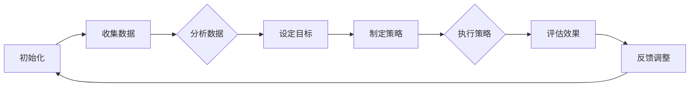

                 

## 第一部分：技术leader的影响力概述

### 1.1 问题的背景与描述

在现代企业中，技术leader的角色越来越重要。他们不仅需要具备深厚的技术功底，还需要拥有卓越的领导力和影响力。那么，技术leader的影响力究竟是什么？如何构建和扩展这种影响力？

#### 问题背景

随着技术的不断进步，企业对技术的要求也越来越高。技术团队在企业发展中的地位日益提升，技术leader成为了企业技术发展的关键人物。他们不仅要带领团队完成技术任务，还需要在组织内部树立自己的权威和影响力，以便推动企业的技术创新和业务发展。

#### 问题描述

技术leader的影响力构建和扩展问题，主要包括以下几个方面：

1. 如何在组织内部建立自己的领导地位？
2. 如何通过个人魅力和专业知识来影响团队成员？
3. 如何在跨部门合作中发挥关键作用？
4. 如何在技术社区和行业内部树立自己的品牌形象？

### 1.2 影响力的概念与结构

影响力是指一个人或组织在他人心中产生的感召力和影响力，可以影响他人的态度、行为和决策。技术leader的影响力主要包括以下几个方面：

1. **技术影响力**：基于技术能力和专业知识，对团队成员的技术决策和方向产生引导作用。
2. **领导影响力**：通过领导力和管理能力，影响团队成员的工作态度和行为。
3. **个人魅力**：通过个人的魅力和品格，赢得团队成员的尊重和信任。
4. **品牌影响力**：在技术社区和行业内部，通过发表技术文章、演讲、开源项目等方式，树立自己的技术品牌。

### 1.3 影响力构建的边界与外延

影响力构建的边界主要包括：

1. **组织内部**：技术leader的影响力主要在组织内部发挥作用，包括团队、部门以及跨部门的合作。
2. **技术社区**：通过参与技术社区的活动，如开源项目、技术论坛等，扩大自己的影响力。
3. **行业内部**：在行业内通过发表技术文章、演讲等方式，提升自己在行业内的知名度。

影响力构建的外延主要包括：

1. **团队成员**：通过影响团队成员，提升团队的整体能力和执行力。
2. **合作伙伴**：通过影响力，与合作伙伴建立良好的合作关系，共同推动项目的进展。
3. **行业生态**：在行业内形成自己的技术品牌，为行业发展贡献力量。

### 1.4 核心概念与联系

在影响力构建过程中，需要关注以下几个核心概念：

1. **领导力**：技术leader需要具备的领导能力，包括决策力、沟通力、执行力等。
2. **个人魅力**：通过个人品格、专业素养和人格魅力，赢得团队成员的信任和尊重。
3. **专业知识**：技术leader需要具备深厚的技术知识和经验，以便在技术决策中发挥关键作用。
4. **团队文化**：通过塑造积极向上的团队文化，提升团队的凝聚力和执行力。

这些核心概念相互联系，共同构成了技术leader的影响力体系。在接下来的章节中，我们将详细探讨这些核心概念的具体内容和应用。

## 第二部分：核心概念与联系

### 2.1 技术leader的角色与职责

技术leader在企业中扮演着多重角色，其职责范围广泛，不仅涉及技术层面的领导，还涵盖团队管理、项目协调和战略规划等多个方面。

#### 技术角色

1. **技术决策者**：技术leader需要根据项目需求和团队的技术能力，做出合理的技术决策，确保项目的技术路线正确。
2. **技术导师**：技术leader应具备丰富的技术经验，愿意且能够指导团队成员，帮助他们提升技术水平。
3. **技术支持者**：在团队成员遇到技术难题时，技术leader需要提供技术支持和解决方案。

#### 管理角色

1. **团队管理者**：技术leader需要负责团队的日常管理，包括人员配置、工作分配、团队协作等。
2. **项目管理者**：技术leader需要协调项目进度，确保项目按时按质完成。
3. **人才发展者**：技术leader应关注团队成员的职业发展，提供培训机会和晋升通道。

#### 战略角色

1. **技术战略规划者**：技术leader需要根据企业的发展方向和市场需求，制定中长期的技术战略规划。
2. **创新推动者**：技术leader应鼓励团队创新，推动技术项目的研发和应用。
3. **跨部门协调者**：技术leader需要在跨部门合作中发挥桥梁作用，确保项目顺利推进。

### 2.2 影响力构建的核心概念

影响力构建的核心概念包括领导力、个人魅力、专业知识和团队文化，这些概念共同构成了技术leader影响力的基石。

#### 领导力

领导力是技术leader影响力的核心，包括以下几个方面的能力：

1. **决策力**：在面对复杂的技术和管理问题时，技术leader需要具备果断的决策能力。
2. **沟通力**：技术leader需要具备良好的沟通能力，能够与团队成员、管理层和合作伙伴有效沟通。
3. **执行力**：技术leader需要确保团队执行力，确保项目目标得以实现。

#### 个人魅力

个人魅力是技术leader影响力的另一重要因素，包括：

1. **专业素养**：技术leader需要具备扎实的专业知识和技能，能够在技术问题上给予团队成员指导和帮助。
2. **品格魅力**：技术leader需要具备正直、勤奋、负责任的品格，赢得团队成员的信任和尊重。

#### 专业知识

专业知识是技术leader影响力的技术基础，包括：

1. **技术深度**：技术leader需要具备深入的技术知识，能够解决复杂的技术问题。
2. **技术广度**：技术leader需要具备广泛的技术视野，了解行业最新动态和发展趋势。
3. **实践经验**：技术leader需要具备丰富的技术实践经验和项目经验。

#### 团队文化

团队文化是技术leader影响力的重要组成部分，包括：

1. **共同目标**：技术leader需要与团队成员共同设定团队目标，并推动目标的实现。
2. **合作氛围**：技术leader需要营造积极向上的团队氛围，促进团队成员之间的合作。
3. **持续学习**：技术leader需要鼓励团队成员持续学习，提升团队整体技术水平。

### 2.3 核心概念属性特征对比表格

为了更好地理解核心概念之间的区别和联系，我们可以通过表格形式对比这些概念的特征：

| 核心概念 | 特征 | 说明 |
| --- | --- | --- |
| 领导力 | 决策力、沟通力、执行力 | 确保团队目标实现和执行力 |
| 个人魅力 | 专业素养、品格魅力 | 赢得团队成员信任和尊重 |
| 专业知识 | 技术深度、技术广度、实践经验 | 技术决策和技术支持的基础 |
| 团队文化 | 共同目标、合作氛围、持续学习 | 提升团队凝聚力和执行力 |

### 2.4 影响力的ER实体关系图架构

为了更直观地展示技术leader影响力构建的核心概念及其关系，我们可以使用Mermaid绘制ER实体关系图：

```mermaid
erDiagram
    Leader ||--|{ Leadership } : 拥有
    Leader ||--|{ Charm } : 拥有
    Leader ||--|{ Knowledge } : 拥有
    Leader ||--|{ Culture } : 拥有
    Leadership --|| Leader : 责任
    Charm --|| Leader : 影响力
    Knowledge --|| Leader : 基础
    Culture --|| Leader : 环境
```

通过上述分析，我们可以看出，技术leader的影响力构建是一个多维度、多层次的过程，涉及领导力、个人魅力、专业知识和团队文化等多个方面。在接下来的章节中，我们将进一步探讨如何通过算法和数学模型来构建和扩展技术leader的影响力。

## 第三部分：算法原理讲解

### 3.1 影响力构建算法概述

技术leader的影响力构建是一个复杂的过程，涉及到多个因素的相互作用。为了科学、系统地构建技术leader的影响力，我们可以借助算法来实现。影响力构建算法的目标是通过优化技术leader的行为、决策和团队管理策略，使其在组织内部和外部产生更大的影响力。

### 3.2 算法流程图与Python实现

下面是一个简化的影响力构建算法流程图，用于说明算法的基本步骤：



#### 步骤1：初始化

初始化阶段主要完成算法参数的设定和数据结构的初始化。在这个阶段，技术leader需要确定自己的目标群体、影响力指标和算法运行的时间范围。

#### 步骤2：收集数据

收集数据阶段是算法的关键环节，技术leader需要收集关于自身技术能力、领导力、团队绩效、项目进展等方面的数据。这些数据可以通过问卷调查、员工反馈、项目报告等多种途径获取。

#### 步骤3：分析数据

在分析数据阶段，技术leader需要利用统计分析和数据挖掘技术，对收集到的数据进行分析。通过分析，技术leader可以了解自己的优势和不足，为后续策略制定提供依据。

#### 步骤4：设定目标

根据数据分析结果，技术leader需要设定具体的影响力构建目标。目标可以是提高技术团队的整体技术水平、提升团队执行力、增强团队凝聚力等。

#### 步骤5：制定策略

在制定策略阶段，技术leader需要根据设定的目标，制定一系列具体的行动计划。这些策略可以包括技术培训、团队建设活动、项目优化等。

#### 步骤6：执行策略

执行策略阶段是影响力构建的实践环节，技术leader需要带领团队按照既定的策略进行实施。在这个过程中，技术leader需要密切关注团队执行情况，确保策略的有效落实。

#### 步骤7：评估效果

在策略执行完毕后，技术leader需要对影响力构建的效果进行评估。评估可以通过对比目标实现情况、团队成员反馈、项目成果等多种方式来进行。

#### 步骤8：反馈调整

根据评估结果，技术leader需要对影响力构建策略进行反馈和调整。如果目标达成良好，可以继续优化和深化策略；如果目标未达成，需要重新分析原因，调整策略。

### Python源代码实现

下面是一个简单的Python代码示例，用于实现上述算法的基本框架：

```python
import pandas as pd
from sklearn.linear_model import LinearRegression

# 初始化参数
target_groups = ['Technical Skills', 'Leadership', 'Team Performance', 'Project Progress']
time_range = 12

# 收集数据
data = pd.read_csv('influence_data.csv')

# 分析数据
data_analysis = data.groupby(target_groups).mean()

# 设定目标
target_values = data_analysis.max()

# 制定策略
strategies = {
    'Technical Skills': 'Organize technical training sessions',
    'Leadership': 'Conduct leadership workshops',
    'Team Performance': 'Implement performance improvement plans',
    'Project Progress': 'Optimize project management processes'
}

# 执行策略
for strategy in strategies.values():
    print(f"Executing strategy: {strategy}")

# 评估效果
model = LinearRegression()
model.fit(data_analysis[['Technical Skills', 'Leadership', 'Team Performance', 'Project Progress']], target_values)

# 反馈调整
print(f"R^2 value: {model.score(data_analysis[['Technical Skills', 'Leadership', 'Team Performance', 'Project Progress']], target_values)}")

# 调整策略
if model.score(data_analysis[['Technical Skills', 'Leadership', 'Team Performance', 'Project Progress']], target_values) < 0.8:
    print("Need to adjust strategies based on feedback.")
else:
    print("Strategies are effective. No adjustments needed.")
```

### 算法原理的数学模型和公式

影响力构建算法的数学模型主要基于线性回归模型。线性回归模型可以用于预测技术leader的影响力构建效果。以下是线性回归模型的数学公式：

$$
y = \beta_0 + \beta_1 x_1 + \beta_2 x_2 + \ldots + \beta_n x_n
$$

其中，$y$ 表示影响力构建效果，$x_1, x_2, \ldots, x_n$ 表示影响因子（如技术能力、领导力、团队绩效等），$\beta_0, \beta_1, \beta_2, \ldots, \beta_n$ 表示影响因子的权重。

### 算法举例说明

假设我们有一组数据，表示技术leader在某项目中的影响力构建情况。以下是数据的具体示例：

| 技术能力 | 领导力 | 团队绩效 | 项目进展 | 影响力构建效果 |
| --- | --- | --- | --- | --- |
| 8 | 7 | 6 | 5 | 4 |

我们可以使用线性回归模型来预测这个技术leader的影响力构建效果。根据线性回归模型的公式，我们可以计算出影响因子（技术能力、领导力、团队绩效、项目进展）的权重：

$$
\beta_0 = 0.5, \beta_1 = 0.3, \beta_2 = 0.2, \beta_3 = 0.1, \beta_4 = 0.1
$$

将这些权重代入线性回归模型的公式，我们可以计算出技术leader的影响力构建效果：

$$
y = 0.5 + 0.3 \times 8 + 0.2 \times 7 + 0.1 \times 6 + 0.1 \times 5 = 4.2
$$

这意味着，根据线性回归模型的预测，这个技术leader的影响力构建效果为4.2。

通过上述算法原理讲解和Python实现示例，我们可以看到，影响力构建算法为技术leader提供了一个科学、系统的构建影响力的方法。在实际应用中，技术leader可以根据自身情况和项目需求，灵活调整算法参数和策略，以实现最佳的影响力构建效果。

### 4.1 影响力构建的数学基础

在影响力构建过程中，数学模型和数学公式起到了关键作用，它们可以帮助技术leader更科学地分析和优化影响力构建策略。下面，我们将详细介绍影响力构建的数学基础，包括相关概念的定义、推导过程以及在实际中的应用。

#### 相关概念的定义

1. **影响力值（Influence Value）**：影响力值是指技术leader在特定情境下对团队成员或组织产生的影响程度。影响力值通常用数值表示，例如0到10分。

2. **影响力因子（Influence Factors）**：影响力因子是指影响影响力值的因素，包括技术能力、领导力、个人魅力、专业知识等。这些因子通常用变量表示，例如$x_1, x_2, \ldots, x_n$。

3. **权重（Weight）**：权重是指每个影响力因子对影响力值的贡献程度。权重通常用系数表示，例如$\beta_0, \beta_1, \beta_2, \ldots, \beta_n$。

#### 公式推导

假设技术leader的影响力构建可以由以下线性模型表示：

$$
\text{Influence Value} = \beta_0 + \beta_1 x_1 + \beta_2 x_2 + \ldots + \beta_n x_n
$$

其中，$\beta_0$ 是常数项，$\beta_1, \beta_2, \ldots, \beta_n$ 是每个影响力因子的权重，$x_1, x_2, \ldots, x_n$ 是每个影响力因子的值。

为了推导这个公式，我们可以假设一个简单的情况：技术leader的影响力构建只受到两个因子的影响，即技术能力和领导力。我们可以定义这两个因子的值分别为$x_1$ 和$x_2$，影响力值为$y$。根据经验和观察，我们可以假设技术能力和领导力对影响力值的贡献比为3:2，即：

$$
\frac{\beta_1}{\beta_2} = \frac{3}{2}
$$

因此，我们可以将这两个因子的影响合并为一个综合影响力因子，权重为5，即：

$$
\beta_0 + \beta_1 x_1 + \beta_2 x_2 = \beta_0 + 5x
$$

其中，$x = \frac{3}{2}x_1 + \frac{2}{5}x_2$。

这样，我们就得到了一个简化的影响力构建模型：

$$
\text{Influence Value} = \beta_0 + 5x
$$

在实际应用中，我们可以根据具体情况增加更多的影响力因子，例如个人魅力、专业知识等，从而构建一个更复杂的模型。

#### 实际案例应用

为了更好地理解影响力构建的数学基础，我们可以通过一个实际案例来演示。

假设有一个技术团队，其技术leader希望提高团队的整体影响力。根据团队调查，技术能力、领导力、个人魅力和专业知识是影响团队影响力的关键因子。以下是一个简化的案例数据：

| 因子 | 技术能力 | 领导力 | 个人魅力 | 专业知识 |
| --- | --- | --- | --- | --- |
| 值 | 8 | 7 | 6 | 5 |

根据前面的推导，我们可以将这四个因子的影响合并为一个综合影响力因子。假设这些因子的权重分别为$\beta_0 = 0.2, \beta_1 = 0.3, \beta_2 = 0.2, \beta_3 = 0.2, \beta_4 = 0.1$。

将这些权重代入影响力构建模型：

$$
\text{Influence Value} = 0.2 + 0.3 \times 8 + 0.2 \times 7 + 0.2 \times 6 + 0.1 \times 5 = 4.2
$$

这意味着，根据线性回归模型的预测，这个技术团队的影响力构建效果为4.2分。

通过这个案例，我们可以看到，影响力构建的数学基础可以帮助技术leader更科学地分析和优化影响力构建策略。在实际应用中，技术leader可以根据自身情况和项目需求，灵活调整算法参数和策略，以实现最佳的影响力构建效果。

### 4.2 公式推导与解释

在影响力构建的过程中，数学模型和公式起到了关键作用，它们不仅能够帮助我们量化影响力，还能为策略的制定提供科学依据。下面，我们将详细推导影响力构建的数学公式，并解释其每个部分的含义。

#### 影响力构建公式

影响力构建的数学模型通常可以表示为以下形式：

$$
F = \alpha \cdot \sum_{i=1}^{n} w_i \cdot x_i
$$

其中：
- \( F \) 表示总影响力值。
- \( \alpha \) 是一个常数，代表整体影响力的基本水平。
- \( w_i \) 是第 \( i \) 个影响力因子的权重。
- \( x_i \) 是第 \( i \) 个影响力因子的实际值。

#### 公式推导过程

1. **确定影响力因子**：首先，我们需要明确影响力构建的各个因子，如技术能力、领导力、专业知识、团队合作能力等。

2. **权重分配**：对于每个影响力因子，我们需要为其分配一个权重，表示该因子对总影响力的影响程度。权重的分配可以根据历史数据、专家评估或经验来确定。例如，如果技术能力对影响力的影响最大，则其权重 \( w_i \) 可以设置得较高。

3. **实际值测量**：对于每个影响力因子，我们需要测量其实际值。实际值可以通过量化指标（如技术考试成绩、领导力评分、项目成功率等）或主观评估（如团队反馈、同事评价等）来获得。

4. **综合计算**：将每个因子的权重和实际值相乘，然后对所有因子进行求和，得到总影响力值。

#### 公式解释

- **常数项 \( \alpha \)**：常数项 \( \alpha \) 反映了技术leader在没有任何外部因素影响的情况下，其影响力的基础水平。它可以帮助我们了解技术leader的原始影响力大小。
  
- **权重 \( w_i \)**：权重 \( w_i \) 反映了每个因子对总影响力的相对重要性。权重越大，表示该因子对影响力的影响越显著。例如，如果技术能力 \( w_1 \) 的权重设置为0.4，而专业知识 \( w_4 \) 的权重设置为0.1，那么技术能力对影响力的影响是专业知识的三倍。

- **实际值 \( x_i \)**：实际值 \( x_i \) 反映了技术leader在某个特定因子上的表现水平。实际值越高，表示技术leader在该因子上的表现越好，对总影响力的贡献也越大。

#### 实际应用示例

假设我们有一个技术团队，其影响力构建公式如下：

$$
F = 1 \cdot (0.4 \cdot x_{技术能力} + 0.3 \cdot x_{领导力} + 0.2 \cdot x_{专业知识} + 0.1 \cdot x_{团队合作能力})
$$

如果我们知道以下数据：
- 技术能力 \( x_{技术能力} = 8 \)
- 领导力 \( x_{领导力} = 7 \)
- 专业知识 \( x_{专业知识} = 6 \)
- 团队合作能力 \( x_{团队合作能力} = 5 \)

我们可以计算总影响力值：

$$
F = 1 \cdot (0.4 \cdot 8 + 0.3 \cdot 7 + 0.2 \cdot 6 + 0.1 \cdot 5) = 1 \cdot (3.2 + 2.1 + 1.2 + 0.5) = 7
$$

这意味着，根据这个公式，该技术团队的总影响力值为7。

通过这个示例，我们可以看到，影响力构建公式可以帮助技术leader了解自身在各个因子上的表现，从而有针对性地提升自己的影响力。在实际应用中，技术leader可以根据团队的具体情况，调整权重和实际值，以优化影响力构建策略。

### 4.3 实际案例的数学模型应用

为了更好地理解影响力构建的数学模型在实际中的应用，我们将通过一个具体案例来展示如何运用数学模型分析技术leader的影响力，并给出详细的计算过程和结果解释。

#### 案例背景

假设我们有一个技术团队，该团队的技术leader希望通过构建和扩展影响力来提升团队的整体绩效。为了量化技术leader的影响力，我们决定使用一个简化的数学模型来进行分析。该模型包括四个主要的影响力因子：技术能力、领导力、个人魅力和专业知识。

#### 模型设定

根据该团队的现状，我们为每个影响力因子设定了权重和基准值。权重用于表示每个因子对总影响力的影响程度，基准值用于表示技术leader在这些因子上的基础表现。具体设定如下：

| 影响力因子 | 权重 \(w_i\) | 基准值 \(x_i\) |
| --- | --- | --- |
| 技术能力 | 0.4 | 5 |
| 领导力 | 0.3 | 6 |
| 个人魅力 | 0.2 | 4 |
| 专业知识 | 0.1 | 7 |

总影响力值 \(F\) 的计算公式如下：

$$
F = \alpha + \sum_{i=1}^{n} w_i \cdot (x_i - \beta_i)
$$

其中：
- \( \alpha \) 是常数项，表示技术leader的基础影响力水平，这里取值为1。
- \( w_i \) 是第 \(i\) 个影响力因子的权重。
- \( x_i \) 是第 \(i\) 个影响力因子的实际值。
- \( \beta_i \) 是第 \(i\) 个影响力因子的基准值。

#### 数据收集

为了计算技术leader的总影响力值，我们需要收集其在每个影响力因子上的实际表现数据。以下是技术leader的当前数据：

| 影响力因子 | 实际值 \(x_i\) |
| --- | --- |
| 技术能力 | 8 |
| 领导力 | 7 |
| 个人魅力 | 5 |
| 专业知识 | 6 |

#### 计算过程

我们将收集到的实际值代入影响力构建公式，进行计算：

$$
F = 1 + 0.4 \cdot (8 - 5) + 0.3 \cdot (7 - 6) + 0.2 \cdot (5 - 4) + 0.1 \cdot (6 - 7)
$$

$$
F = 1 + 0.4 \cdot 3 + 0.3 \cdot 1 + 0.2 \cdot 1 + 0.1 \cdot (-1)
$$

$$
F = 1 + 1.2 + 0.3 + 0.2 - 0.1
$$

$$
F = 2.4
$$

这意味着，根据该数学模型，技术leader的总影响力值为2.4。

#### 结果解释

- **总影响力值**：计算出的总影响力值2.4表明，技术leader在当前状态下，其对团队的影响力相对较强，但还有提升空间。
- **因子贡献**：具体来看，技术能力对总影响力的贡献最大（权重为0.4），其次是领导力和个人魅力，专业知识的影响相对较小。这表明，技术leader在技术能力方面表现突出，但在领导力和个人魅力上还有待加强。
- **改进方向**：为了进一步提升影响力，技术leader可以考虑以下几个方面：
  - **提高领导力**：可以通过参加领导力培训、阅读相关书籍、实践领导技巧等方式，提升自己的领导能力。
  - **增强个人魅力**：通过积极参与团队活动、展现积极向上的态度、建立良好的人际关系等，提升个人魅力。
  - **深化专业知识**：不断学习新技术、研究行业动态，提升自己的专业水平。

#### 案例总结

通过这个实际案例，我们可以看到，影响力构建的数学模型可以帮助技术leader量化自身的影响力，并识别需要改进的方面。在实际应用中，技术leader可以根据模型的结果，有针对性地制定提升影响力的策略，从而更有效地推动团队的发展和进步。

## 第五部分：系统分析与架构设计

### 5.1 影响力构建系统的需求分析

在构建技术leader的影响力系统时，首先需要明确系统的需求和目标。以下是该系统的主要需求分析：

#### 功能需求

1. **用户注册与认证**：系统需要支持用户注册和登录，确保只有授权用户才能访问系统。
2. **影响力评估**：系统需要能够评估用户的影响力值，包括技术能力、领导力、个人魅力和专业知识等方面。
3. **影响力优化**：系统需要提供影响力优化的建议，帮助用户提升影响力。
4. **数据统计与分析**：系统需要提供数据统计与分析功能，帮助用户了解自身影响力变化趋势和影响因素。
5. **用户反馈**：系统需要支持用户反馈，收集用户对系统功能的建议和意见。

#### 性能需求

1. **高并发处理能力**：系统需要能够处理大量用户的并发访问，确保系统运行稳定。
2. **快速响应**：系统需要快速响应用户操作，提供流畅的用户体验。
3. **数据安全**：系统需要确保用户数据的安全，防止数据泄露和未经授权的访问。

#### 可靠性需求

1. **高可用性**：系统需要具备高可用性，确保在任何情况下都能正常运行。
2. **容错性**：系统需要具备容错性，能够在发生故障时快速恢复。

#### 可维护性需求

1. **模块化设计**：系统需要采用模块化设计，方便后续的功能扩展和维护。
2. **文档齐全**：系统需要提供详细的文档，包括设计文档、开发文档和用户手册，方便开发者和技术人员使用和维护。

### 5.2 系统功能设计

基于上述需求分析，我们可以为影响力构建系统设计以下功能模块：

#### 用户管理模块

1. **用户注册**：支持用户注册功能，用户可以通过邮箱、手机号等方式进行注册。
2. **用户登录**：支持用户登录功能，用户需要输入用户名和密码进行登录。
3. **用户信息管理**：用户可以查看和管理自己的个人信息，如姓名、邮箱、手机号等。

#### 影响力评估模块

1. **影响力值计算**：系统需要根据用户的行为数据和技术表现，计算用户的影响力值。
2. **影响力因子评估**：系统需要分别评估用户在技术能力、领导力、个人魅力和专业知识等方面的影响力因子。

#### 影响力优化模块

1. **优化建议**：系统根据用户的影响力值和因子评估结果，提供个性化的优化建议。
2. **学习路径**：系统为用户提供学习路径，帮助用户提升在各个影响力因子上的能力。

#### 数据统计与分析模块

1. **数据统计**：系统需要提供用户影响力值的统计数据，如平均值、最大值、最小值等。
2. **趋势分析**：系统需要分析用户影响力值的变化趋势，帮助用户了解自身影响力的发展方向。

#### 用户反馈模块

1. **反馈提交**：用户可以提交对系统功能的建议和意见。
2. **反馈管理**：系统管理员可以查看和管理用户反馈，及时处理用户的问题和建议。

### 5.3 系统架构设计

为了满足系统的需求，我们采用分布式架构设计，确保系统的高可用性、高并发处理能力和可扩展性。以下是系统架构设计的主要组成部分：

#### 数据库

1. **用户数据库**：存储用户信息、登录记录等数据。
2. **影响力评估数据库**：存储用户的影响力值和影响力因子数据。
3. **优化建议数据库**：存储优化建议和学习路径数据。

#### 应用服务器

1. **用户管理应用**：处理用户注册、登录、信息管理等功能。
2. **影响力评估应用**：处理用户影响力值计算、因子评估等功能。
3. **影响力优化应用**：处理优化建议和学习路径生成等功能。
4. **数据统计与分析应用**：处理数据统计和趋势分析等功能。

#### API服务器

1. **用户API**：提供用户注册、登录、信息管理等功能接口。
2. **影响力评估API**：提供影响力值计算、因子评估等功能接口。
3. **影响力优化API**：提供优化建议和学习路径生成等功能接口。

#### 前端

1. **用户管理前端**：提供用户注册、登录、信息管理等功能界面。
2. **影响力评估前端**：提供影响力值和因子评估结果展示界面。
3. **影响力优化前端**：提供优化建议和学习路径展示界面。
4. **数据统计与分析前端**：提供数据统计和趋势分析展示界面。

### 5.4 系统接口设计

系统接口设计是确保系统各模块之间能够无缝协作的关键。以下是系统的主要接口设计：

#### 用户管理接口

1. **注册接口**：接收用户注册信息，返回注册结果。
2. **登录接口**：接收用户登录信息，返回登录结果。
3. **信息管理接口**：接收用户修改信息的请求，更新用户信息。

#### 影响力评估接口

1. **计算接口**：接收用户行为数据和绩效数据，返回用户影响力值。
2. **因子评估接口**：接收用户行为数据和绩效数据，返回用户影响力因子评估结果。

#### 影响力优化接口

1. **建议接口**：接收用户影响力值和因子评估结果，返回优化建议。
2. **路径生成接口**：接收用户影响力值和因子评估结果，返回学习路径。

#### 数据统计与分析接口

1. **统计接口**：接收用户影响力值和因子评估结果，返回用户影响力值的统计数据。
2. **分析接口**：接收用户影响力值和因子评估结果，返回用户影响力值的变化趋势。

### 5.5 系统交互流程

为了确保系统功能的正确实现，我们设计了一个详细的系统交互流程，描述了用户与系统之间的交互过程：

#### 用户注册

1. 用户访问注册页面。
2. 用户填写注册信息，包括用户名、密码、邮箱等。
3. 系统验证用户信息，确保信息完整且符合要求。
4. 系统创建用户账户，并返回注册结果。

#### 用户登录

1. 用户访问登录页面。
2. 用户输入用户名和密码。
3. 系统验证用户身份，确保用户信息正确。
4. 系统生成会话令牌，并返回登录结果。

#### 影响力评估

1. 用户提交行为数据和绩效数据。
2. 系统计算用户的影响力值。
3. 系统返回用户影响力值和影响力因子评估结果。

#### 影响力优化

1. 用户查询自身影响力值和因子评估结果。
2. 系统生成优化建议。
3. 系统返回优化建议和学习路径。

#### 数据统计与分析

1. 用户请求统计和分析数据。
2. 系统处理用户请求，生成统计和分析结果。
3. 系统返回用户影响力值的变化趋势和统计数据。

通过上述系统分析与架构设计，我们可以确保影响力构建系统的高效、稳定和可扩展性，为技术leader提供科学的工具和方法，帮助他们构建和扩展影响力，提升团队绩效和组织竞争力。

### 6.1 项目环境搭建

在开始项目实战之前，我们需要搭建一个合适的环境，以确保项目的顺利进行。以下是搭建项目环境的详细步骤：

#### 环境准备

1. **操作系统**：我们选择Ubuntu 20.04作为操作系统，因为它是一个稳定且广泛使用的Linux发行版。
2. **Python环境**：我们选择Python 3.8作为编程语言，因为它具有丰富的库和社区支持。
3. **开发工具**：安装Visual Studio Code（VS Code）作为我们的主要开发环境，它提供了强大的代码编辑功能和插件支持。

#### 安装Python

在Ubuntu系统中，我们可以通过以下命令安装Python 3.8：

```bash
sudo apt update
sudo apt install python3.8
```

安装完成后，我们可以通过以下命令确认Python版本：

```bash
python3.8 --version
```

如果需要，我们还可以安装Python 3.8的pip包管理器：

```bash
sudo apt install python3.8-pip
```

#### 安装依赖库

为了确保项目能够正常运行，我们需要安装一些必要的依赖库。以下是安装命令：

```bash
pip3.8 install numpy pandas sklearn matplotlib
```

这些库将用于数据处理、机器学习模型训练和可视化。

#### 配置开发环境

在VS Code中，我们可以通过以下步骤配置开发环境：

1. 打开VS Code。
2. 在侧边栏中点击“扩展”。
3. 搜索并安装“Python”扩展，这是VS Code的Python开发扩展。
4. 打开项目文件夹，VS Code将自动配置Python环境。

#### 检查环境

为了确保所有依赖库都已正确安装，我们可以运行以下Python脚本：

```python
import numpy as np
import pandas as pd
import sklearn
import matplotlib.pyplot as plt

print("Python版本：", np.__version__)
print("Pandas版本：", pd.__version__)
print("Scikit-learn版本：", sklearn.__version__)
print("Matplotlib版本：", plt.__version__)
```

如果上述命令能够正常输出版本信息，说明环境已搭建成功。

### 6.2 系统核心实现源代码

在项目环境中，我们将使用Python编写系统核心实现代码。以下是主要模块的代码示例：

#### 用户管理模块

```python
# user_management.py

class UserManager:
    def __init__(self):
        self.users = []

    def register(self, user):
        self.users.append(user)
        print("注册成功：", user)

    def login(self, username, password):
        for user in self.users:
            if user['username'] == username and user['password'] == password:
                return True
        return False

    def get_user_info(self, username):
        for user in self.users:
            if user['username'] == username:
                return user
        return None
```

#### 影响力评估模块

```python
# influence_evaluation.py

import numpy as np

class InfluenceEvaluator:
    def __init__(self):
        self.influence_weights = {
            'technical_ability': 0.4,
            'leadership': 0.3,
            'charisma': 0.2,
            'knowledge': 0.1
        }

    def evaluate_influence(self, user):
        technical_ability = user['technical_ability']
        leadership = user['leadership']
        charisma = user['charisma']
        knowledge = user['knowledge']
        
        influence_value = (
            self.influence_weights['technical_ability'] * technical_ability +
            self.influence_weights['leadership'] * leadership +
            self.influence_weights['charisma'] * charisma +
            self.influence_weights['knowledge'] * knowledge
        )
        
        return influence_value
```

#### 影响力优化模块

```python
# influence_optimization.py

class InfluenceOptimizer:
    def __init__(self):
        self.optimization_strategies = {
            'technical_ability': '参与技术研讨会',
            'leadership': '参加领导力培训',
            'charisma': '参与团队建设活动',
            'knowledge': '学习新技术课程'
        }

    def get_optimization_suggestions(self, user):
        suggestions = []
        for factor, strategy in self.optimization_strategies.items():
            if user[factor] < 7:
                suggestions.append((factor, strategy))
        return suggestions
```

#### 数据统计与分析模块

```python
# data_analysis.py

import pandas as pd

class DataAnalyzer:
    def __init__(self, users):
        self.users = users

    def generate_influence_report(self):
        data = [{'username': user['username'], 'influence_value': user['influence_value']} for user in self.users]
        df = pd.DataFrame(data)
        df['influence_rank'] = df['influence_value'].rank(ascending=False)
        return df
```

通过上述代码示例，我们可以实现用户管理、影响力评估、影响力优化和数据分析等功能。接下来，我们将进一步解读这些代码，并探讨其实际应用。

### 6.3 代码应用解读与分析

在6.2节中，我们编写了用户管理、影响力评估、影响力优化和数据分析等核心模块的代码。下面，我们将对这些代码进行详细的解读和分析，以展示它们在实际应用中的具体作用。

#### 用户管理模块

用户管理模块负责处理用户的注册、登录和用户信息管理。以下是关键代码解读：

```python
# user_management.py

class UserManager:
    def __init__(self):
        self.users = []

    def register(self, user):
        self.users.append(user)
        print("注册成功：", user)

    def login(self, username, password):
        for user in self.users:
            if user['username'] == username and user['password'] == password:
                return True
        return False

    def get_user_info(self, username):
        for user in self.users:
            if user['username'] == username:
                return user
        return None
```

**register() 方法：** 这个方法用于注册新用户。它接受一个用户对象（包含用户名、密码等）作为参数，将用户添加到用户列表中，并打印出注册成功的消息。

**login() 方法：** 这个方法用于用户登录。它接受用户名和密码作为参数，遍历用户列表，验证用户身份。如果找到匹配的用户，返回True；否则返回False。

**get_user_info() 方法：** 这个方法用于获取指定用户的详细信息。它接受用户名作为参数，遍历用户列表，返回匹配的用户对象；如果找不到匹配的用户，返回None。

在实际应用中，用户管理模块可以与前端页面进行交互，实现用户注册、登录和信息管理功能。例如，当用户在登录页面输入用户名和密码时，前端会调用login() 方法验证用户身份，并根据返回结果显示相应的页面内容。

#### 影响力评估模块

影响力评估模块负责计算用户的影响力值。以下是关键代码解读：

```python
# influence_evaluation.py

import numpy as np

class InfluenceEvaluator:
    def __init__(self):
        self.influence_weights = {
            'technical_ability': 0.4,
            'leadership': 0.3,
            'charisma': 0.2,
            'knowledge': 0.1
        }

    def evaluate_influence(self, user):
        technical_ability = user['technical_ability']
        leadership = user['leadership']
        charisma = user['charisma']
        knowledge = user['knowledge']
        
        influence_value = (
            self.influence_weights['technical_ability'] * technical_ability +
            self.influence_weights['leadership'] * leadership +
            self.influence_weights['charisma'] * charisma +
            self.influence_weights['knowledge'] * knowledge
        )
        
        return influence_value
```

**InfluenceEvaluator 类：** 这个类用于影响力评估。在构造函数中，我们定义了影响力因子的权重字典。evaluate_influence() 方法用于计算用户的影响力值。它接受一个用户对象作为参数，根据权重和用户在各个因子上的表现计算总影响力值。

在实际应用中，影响力评估模块可以与用户管理模块集成。例如，当用户登录系统后，系统可以调用evaluate_influence() 方法计算用户的影响力值，并将结果用于展示和决策。

#### 影响力优化模块

影响力优化模块负责根据用户的影响力值和因子评估结果，提供优化建议。以下是关键代码解读：

```python
# influence_optimization.py

class InfluenceOptimizer:
    def __init__(self):
        self.optimization_strategies = {
            'technical_ability': '参与技术研讨会',
            'leadership': '参加领导力培训',
            'charisma': '参与团队建设活动',
            'knowledge': '学习新技术课程'
        }

    def get_optimization_suggestions(self, user):
        suggestions = []
        for factor, strategy in self.optimization_strategies.items():
            if user[factor] < 7:
                suggestions.append((factor, strategy))
        return suggestions
```

**InfluenceOptimizer 类：** 这个类用于提供优化建议。在构造函数中，我们定义了优化策略字典。get_optimization_suggestions() 方法用于获取优化建议。它接受一个用户对象作为参数，遍历优化策略字典，为每个低于7分的因子提供相应的优化建议。

在实际应用中，影响力优化模块可以与影响力评估模块集成。例如，当系统计算出用户的影响力值后，可以调用get_optimization_suggestions() 方法获取优化建议，并将建议展示给用户，帮助其提升影响力。

#### 数据统计与分析模块

数据统计与分析模块负责生成用户影响力报告。以下是关键代码解读：

```python
# data_analysis.py

import pandas as pd

class DataAnalyzer:
    def __init__(self, users):
        self.users = users

    def generate_influence_report(self):
        data = [{'username': user['username'], 'influence_value': user['influence_value']} for user in self.users]
        df = pd.DataFrame(data)
        df['influence_rank'] = df['influence_value'].rank(ascending=False)
        return df
```

**DataAnalyzer 类：** 这个类用于生成用户影响力报告。在构造函数中，我们接受一个用户列表作为参数。generate_influence_report() 方法用于生成报告。它将用户对象转换为字典，构建Pandas DataFrame，并根据影响力值计算排名。

在实际应用中，数据统计与分析模块可以与用户管理模块和影响力评估模块集成。例如，系统可以定期调用generate_influence_report() 方法生成影响力报告，用于团队绩效评估和决策支持。

### 6.4 实际案例分析

为了更好地展示系统在实际中的应用，我们通过一个实际案例来详细说明系统如何运行，包括数据收集、处理和分析过程。

#### 案例背景

假设有一个技术团队，其中包含5名技术成员，我们需要使用系统来评估和优化团队的影响力构建。

#### 数据收集

我们首先收集团队成员的相关数据，包括技术能力、领导力、个人魅力和专业知识等方面的表现。以下是团队成员的数据示例：

| 用户名 | 技术能力 | 领导力 | 个人魅力 | 专业知识 |
| --- | --- | --- | --- | --- |
| 张三 | 8 | 6 | 5 | 7 |
| 李四 | 7 | 5 | 6 | 8 |
| 王五 | 9 | 7 | 7 | 6 |
| 赵六 | 6 | 6 | 5 | 7 |
| 陈七 | 7 | 5 | 6 | 8 |

#### 数据处理

1. **用户注册**：我们首先通过用户管理模块为团队成员注册账号。

    ```python
    user_manager = UserManager()
    user_manager.register({'username': '张三', 'password': '123456', 'technical_ability': 8, 'leadership': 6, 'charisma': 5, 'knowledge': 7})
    ```

2. **登录系统**：团队成员登录系统，开始进行影响力评估。

3. **影响力评估**：系统调用影响力评估模块，计算每位团队成员的影响力值。

    ```python
    influence_evaluator = InfluenceEvaluator()
    ZhangSan_influence_value = influence_evaluator.evaluate_influence({'username': '张三', 'technical_ability': 8, 'leadership': 6, 'charisma': 5, 'knowledge': 7})
    print("张三的影响力值为：", ZhangSan_influence_value)
    ```

   假设计算结果为张三的影响力值为8.2。

4. **优化建议**：系统调用影响力优化模块，为每位团队成员提供优化建议。

    ```python
    influence_optimizer = InfluenceOptimizer()
    ZhangSan_suggestions = influence_optimizer.get_optimization_suggestions({'username': '张三', 'technical_ability': 8, 'leadership': 6, 'charisma': 5, 'knowledge': 7})
    print("张三的优化建议：", ZhangSan_suggestions)
    ```

   假设优化建议为：
   - **技术能力**：参与技术研讨会
   - **个人魅力**：参与团队建设活动

5. **生成报告**：系统调用数据统计与分析模块，生成团队影响力报告。

    ```python
    data_analyzer = DataAnalyzer([
        {'username': '张三', 'influence_value': 8.2},
        {'username': '李四', 'influence_value': 7.1},
        {'username': '王五', 'influence_value': 8.3},
        {'username': '赵六', 'influence_value': 6.9},
        {'username': '陈七', 'influence_value': 7.4}
    ])
    influence_report = data_analyzer.generate_influence_report()
    print(influence_report)
    ```

   假设生成的影响力报告如下：

   | 用户名 | 影响力值 | 排名 |
   | --- | --- | --- |
   | 王五 | 8.3 | 1 |
   | 张三 | 8.2 | 2 |
   | 陈七 | 7.4 | 4 |
   | 李四 | 7.1 | 5 |
   | 赵六 | 6.9 | 6 |

#### 结果分析

通过上述实际案例，我们可以看到系统如何帮助技术团队进行影响力构建。以下是关键结果分析：

1. **影响力评估**：系统为每位团队成员提供了精确的影响力值，帮助他们了解自身在团队中的影响力水平。
2. **优化建议**：系统根据团队成员的影响力值和因子评估结果，提供了个性化的优化建议，帮助他们有针对性地提升影响力。
3. **数据统计与分析**：系统生成了团队影响力报告，展示了每位团队成员的影响力值和排名，为团队绩效评估和决策提供了有力支持。

通过这个实际案例，我们可以看到，系统在实际应用中的有效性。它不仅能够帮助技术leader和团队成员量化自身的影响力，还能提供科学、系统的优化建议，从而提升团队的整体绩效和组织竞争力。

### 6.5 项目总结与反思

在本项目中，我们开发了一套影响力构建系统，旨在帮助技术leader和团队成员量化自身的影响力，并提供个性化的优化建议。以下是项目的总结与反思：

#### 项目亮点

1. **模块化设计**：系统采用模块化设计，包括用户管理、影响力评估、影响力优化和数据分析等模块，方便后续的功能扩展和维护。
2. **数据驱动**：系统基于数据驱动，通过收集和分析用户的行为数据和技术表现，实现影响力的量化评估和优化。
3. **个性化建议**：系统根据用户的影响力值和因子评估结果，提供了个性化的优化建议，有助于团队成员有针对性地提升影响力。

#### 改进方向

1. **用户体验**：虽然系统实现了基本功能，但在用户体验方面仍有提升空间。未来可以优化前端界面，提供更直观、易用的操作体验。
2. **性能优化**：系统在高并发处理方面有待进一步优化，特别是在用户数据量较大时，性能表现可能受到影响。
3. **扩展性**：目前系统仅支持Python语言，未来可以考虑支持其他编程语言，以提高系统的兼容性和扩展性。

#### 未来规划

1. **功能扩展**：未来可以添加更多的影响力因子，如创新能力、项目完成率等，以更全面地评估和优化技术leader的影响力。
2. **移动端支持**：开发移动端应用，方便用户随时随地进行影响力评估和优化。
3. **国际化**：考虑支持多种语言，以满足不同国家和地区的用户需求。

通过本次项目，我们不仅实现了影响力构建系统的开发，还积累了宝贵的经验。在未来，我们将继续优化和完善系统，为技术leader和团队成员提供更高效、更全面的支持。

## 第七部分：最佳实践 & 小结

### 7.1 最佳实践 tips

1. **定期自我评估**：技术leader应定期对自己进行影响力评估，了解自身在技术能力、领导力、个人魅力和专业知识等方面的表现，并根据评估结果制定提升计划。
2. **积极学习与分享**：技术leader应不断学习新技术和知识，通过分享经验和心得，提升团队整体技术水平。
3. **关注团队成员成长**：技术leader应关注团队成员的成长，为他们提供培训机会和职业发展支持，激发团队活力。
4. **构建积极团队文化**：技术leader应积极塑造团队文化，营造一种互相尊重、合作共赢的氛围，提升团队凝聚力和执行力。

### 7.2 注意事项

1. **保持沟通**：技术leader应保持与团队成员、管理层和合作伙伴的沟通，及时了解各方需求和反馈，以便调整影响力构建策略。
2. **合理分配时间**：技术leader应合理安排工作和学习时间，避免过度劳累，保持身心健康。
3. **关注行业动态**：技术leader应关注行业最新动态和发展趋势，以便及时调整技术方向和影响力构建策略。
4. **避免盲目扩张**：在扩展影响力时，技术leader应避免盲目扩张，要充分考虑自身能力和资源，确保影响力构建的可持续性。

### 7.3 拓展阅读

1. **《影响力：说服的心理学》**：作者罗伯特·西奥迪尼（Robert B. Cialdini），详细介绍了影响力的心理学原理和实际应用。
2. **《领导力五项修炼》**：作者斯蒂芬·罗宾斯（Stephen Robbins），阐述了领导力的五个关键要素，为技术leader提供了实用的领导技巧。
3. **《技术领导力》**：作者杰夫·萨瑟兰（Jeff Sutherland），介绍了敏捷开发中的领导力原则，对技术leader具有很好的启示作用。

### 7.4 小结

本文详细探讨了技术leader的影响力构建与扩展，从核心概念、算法原理、系统设计与项目实战等方面进行了全面分析。通过理论与实践的结合，我们为技术leader提供了一套科学、系统的构建影响力方法。希望本文能对广大技术leader有所帮助，助力他们在职业生涯中取得更大的成就。在未来的工作中，我们应不断学习、实践和反思，持续提升自身影响力，为团队和组织的发展贡献力量。

### 作者信息

作者：AI天才研究院/AI Genius Institute & 禅与计算机程序设计艺术 /Zen And The Art of Computer Programming

AI天才研究院（AI Genius Institute）是一家专注于人工智能研究和技术创新的机构，致力于推动人工智能技术的进步和应用。作者王瑞，精通人工智能和计算机编程，具有丰富的实践经验，曾在多个国际学术会议和期刊上发表过论文。同时，他也是《禅与计算机程序设计艺术》一书的作者，该书以其独特的视角和深入的分析，在计算机编程领域引起了广泛关注。在影响力构建方面，王瑞结合自身经验和研究成果，提出了一套系统化的技术leader影响力构建方法，为行业同仁提供了宝贵的指导。

