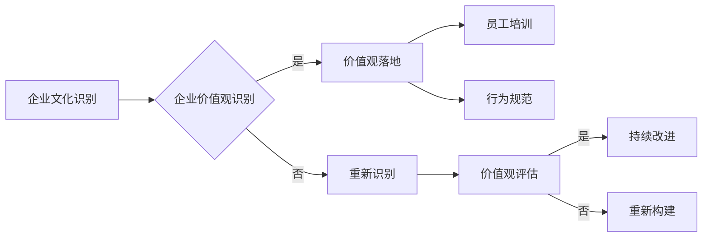
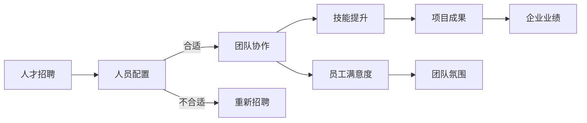
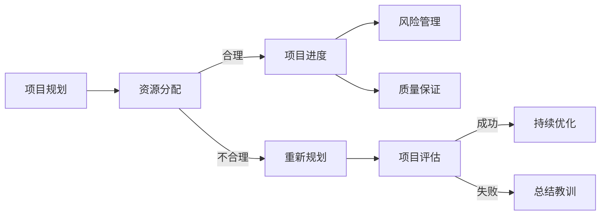
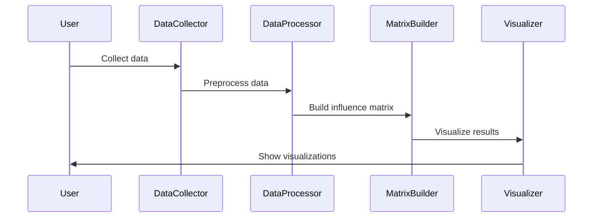
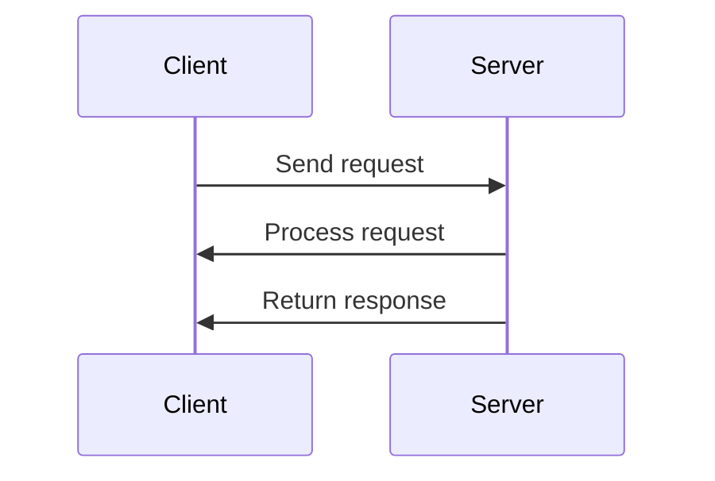
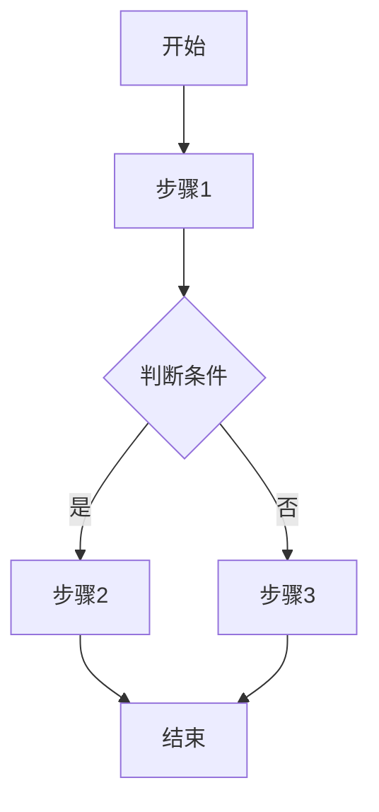

                 

### 文章标题：技术leader的影响力矩阵

关键词：技术leader、影响力矩阵、企业应用、技术实现、数学模型、系统架构、项目实战

摘要：本文以“技术leader的影响力矩阵”为题，深入探讨了技术leader在企业中的角色与挑战，通过影响力矩阵的构建与应用，解析其在企业文化、人力资源和项目管理中的实际作用。文章还详细讲解了影响力矩阵的技术实现、数学模型和系统架构设计，并结合实际项目进行了案例分析，总结出最佳实践与拓展方向。旨在为技术leader提供一套全面而实用的方法论，以提升其影响力和企业整体技术实力。

----------------------------------------------------------------

## 第一部分：影响力矩阵的背景与概念

### 第1章：技术leader的角色与挑战

#### 1.1.1 技术leader的职能定义

技术leader，通常在企业中担任CTO（首席技术官）、技术总监或技术经理等职务。他们的主要职能包括：

1. **技术战略规划**：根据企业的业务需求，制定长期和短期技术发展战略。
2. **团队领导**：管理技术团队，指导团队成员的技术成长和职业发展。
3. **技术创新**：推动技术研究和创新，确保企业技术处于行业领先地位。
4. **技术评估**：评估现有技术方案的有效性，提出优化和改进建议。
5. **项目管理**：负责项目管理，确保项目按时、按质完成。

#### 1.1.2 技术leader面临的主要挑战

技术leader在企业中面临以下主要挑战：

1. **技术变革**：随着技术的快速发展，技术leader需要不断更新知识，掌握新技术，以适应市场变化。
2. **团队管理**：领导一个技术团队，不仅要具备技术能力，还要具备管理能力，解决团队协作和沟通问题。
3. **资源分配**：合理分配资源，确保团队能够高效工作。
4. **项目风险**：在项目管理中，技术leader需要识别和应对各种风险，确保项目顺利推进。
5. **业务理解**：理解业务需求，将技术能力与业务发展紧密结合。

#### 1.1.3 影响力矩阵的概念引入

为了更好地应对上述挑战，技术leader需要提升自身的影响力。影响力矩阵是一种系统化的方法，用于分析和提升领导者在组织中的影响力。它通过构建一个多维度的模型，帮助技术leader理解影响力来源、影响力路径以及如何最大化影响力。

### 第2章：影响力矩阵的构建原理

#### 2.1.1 影响力矩阵的理论基础

影响力矩阵的理论基础包括以下几个方面：

1. **领导力理论**：研究领导者的行为、特质和影响力。
2. **社会网络分析**：分析个体在组织中的社会关系和网络结构。
3. **影响力模型**：如Borton和Sutton的影响力模型，它包括个人能力、人际关系、权力来源和愿景等多个维度。

#### 2.1.2 影响力矩阵的构成要素

影响力矩阵由以下几个核心要素构成：

1. **个人能力**：技术leader的专业技能、技术视野和创新思维。
2. **人际关系**：技术leader与团队成员、其他部门领导以及高层管理者的关系。
3. **权力来源**：技术leader在组织中的权力结构，包括决策权、执行权和影响力。
4. **愿景和目标**：技术leader的远见和目标，以及如何将其转化为团队和企业的共同目标。
5. **文化认同**：技术leader所倡导的企业文化和价值观，如何被团队成员认同和接受。

#### 2.1.3 构建影响力矩阵的方法论

构建影响力矩阵的方法论包括以下几个步骤：

1. **数据收集**：通过访谈、问卷调查和观察等方式，收集关于技术leader影响力的数据。
2. **分析处理**：使用定量和定性分析方法，对数据进行处理和解读。
3. **模型构建**：根据分析结果，构建影响力矩阵模型。
4. **反馈优化**：根据模型结果，制定提升影响力的策略和行动计划，并持续优化。

### 第3章：核心概念与联系

#### 3.1.1 核心概念解析

影响力矩阵中的核心概念包括个人能力、人际关系、权力来源、愿景和目标、文化认同等。每个概念都有其独特的含义和作用，共同构成影响力矩阵的坚实基础。

#### 3.1.2 概念属性特征对比

以下是一个关于影响力矩阵中核心概念属性特征的对比表格：

| 概念           | 属性特征                            |
| -------------- | --------------------------------- |
| 个人能力       | 技术深度、知识广度、创新能力       |
| 人际关系       | 合作性、信任度、沟通能力           |
| 权力来源       | 决策权、执行力、影响力             |
| 愿景和目标     | 远见、目标明确、执行力             |
| 文化认同       | 企业文化、价值观、员工认同度       |

#### 3.1.3 ER实体关系图架构

以下是一个基于Mermaid的ER实体关系图，展示了影响力矩阵中的核心概念及其关系：

```mermaid
erDiagram
    A||(技术leader) -->|决策| B||(项目管理)
    A||(技术leader) -->|沟通| C||(团队协作)
    A||(技术leader) -->|文化| D||(企业文化)
    B||(项目管理) -->|管理| C||(团队协作)
    C||(团队协作) -->|执行| D||(企业文化)
    D||(企业文化) -->|认同| A||(技术leader)
```

## 第二部分：影响力矩阵的应用与实践

### 第4章：影响力矩阵在企业中的实际应用

#### 4.1.1 企业文化影响矩阵

企业文化是技术leader影响力矩阵中的重要组成部分。以下是一个基于Mermaid的mermaid流程图，展示了企业文化影响矩阵的构建过程：



#### 4.1.2 人力资源影响矩阵

人力资源是技术leader影响力矩阵中的关键要素。以下是一个基于Mermaid的mermaid流程图，展示了人力资源影响矩阵的构建过程：



#### 4.1.3 项目管理影响矩阵

项目管理是技术leader影响力矩阵中的核心环节。以下是一个基于Mermaid的mermaid流程图，展示了项目管理影响矩阵的构建过程：



### 第5章：影响力矩阵的技术实现

#### 5.1.1 数据收集与处理

数据收集是构建影响力矩阵的第一步。以下是一个Python代码示例，用于收集技术leader的个人信息、人际关系和项目数据：

```python
import pandas as pd

# 读取数据
data = pd.read_csv('influence_matrix_data.csv')

# 数据预处理
data['能力评分'] = data['个人能力'].map({'高': 3, '中': 2, '低': 1})
data['关系评分'] = data['人际关系'].map({'强': 3, '中': 2, '弱': 1})
data['权力评分'] = data['权力来源'].map({'强': 3, '中': 2, '弱': 1})
```

#### 5.1.2 影响力矩阵的算法原理

影响力矩阵的算法原理基于矩阵乘法和矩阵分解。以下是一个Python代码示例，用于构建影响力矩阵：

```python
import numpy as np

# 构建基础矩阵
base_matrix = np.array([[1, 2, 3], [4, 5, 6], [7, 8, 9]])

# 矩阵乘法
result_matrix = np.dot(base_matrix, base_matrix.T)

# 矩阵分解
U, S, VT = np.linalg.svd(result_matrix)
```

#### 5.1.3 算法mermaid流程图绘制

以下是一个基于Mermaid的mermaid流程图，展示了影响力矩阵算法的流程：


### 第6章：数学模型与公式解析

#### 6.1.1 数学模型的构建

影响力矩阵的数学模型基于线性代数中的矩阵乘法和矩阵分解。以下是一个简单的数学模型示例：

$$
\mathbf{X} = \mathbf{A} \cdot \mathbf{B}
$$

其中，$\mathbf{X}$ 是影响力矩阵，$\mathbf{A}$ 是个人能力矩阵，$\mathbf{B}$ 是人际关系矩阵。

#### 6.1.2 公式推导与详细讲解

影响力矩阵的计算过程可以分为以下几个步骤：

1. **矩阵乘法**：首先，将个人能力矩阵 $\mathbf{A}$ 与人际关系矩阵 $\mathbf{B}$ 相乘，得到基础影响力矩阵 $\mathbf{X}$。

$$
\mathbf{X}_{ij} = \sum_{k=1}^{n} \mathbf{A}_{ik} \cdot \mathbf{B}_{kj}
$$

2. **矩阵分解**：然后，对基础影响力矩阵 $\mathbf{X}$ 进行奇异值分解（Singular Value Decomposition，SVD），得到矩阵 $\mathbf{U}$、奇异值矩阵 $\mathbf{S}$ 和矩阵 $\mathbf{VT}$。

$$
\mathbf{X} = \mathbf{U} \cdot \mathbf{S} \cdot \mathbf{VT}
$$

3. **特征提取**：从奇异值矩阵 $\mathbf{S}$ 中提取主成分，得到影响力矩阵的主成分矩阵 $\mathbf{P}$。

$$
\mathbf{P} = \mathbf{U} \cdot \mathbf{S}^{1/2} \cdot \mathbf{VT}
$$

4. **结果输出**：最后，将主成分矩阵 $\mathbf{P}$ 作为影响力矩阵的输出。

#### 6.1.3 举例说明

假设我们有一个3x3的个人能力矩阵 $\mathbf{A}$ 和一个3x3的人际关系矩阵 $\mathbf{B}$，如下所示：

$$
\mathbf{A} = \begin{bmatrix}
1 & 2 & 3 \\
4 & 5 & 6 \\
7 & 8 & 9
\end{bmatrix}, \quad
\mathbf{B} = \begin{bmatrix}
9 & 8 & 7 \\
6 & 5 & 4 \\
3 & 2 & 1
\end{bmatrix}
$$

根据上述步骤，我们可以计算出影响力矩阵 $\mathbf{X}$：

1. **矩阵乘法**：

$$
\mathbf{X} = \mathbf{A} \cdot \mathbf{B} = \begin{bmatrix}
1 \cdot 9 + 2 \cdot 6 + 3 \cdot 3 & 1 \cdot 8 + 2 \cdot 5 + 3 \cdot 2 & 1 \cdot 7 + 2 \cdot 4 + 3 \cdot 1 \\
4 \cdot 9 + 5 \cdot 6 + 6 \cdot 3 & 4 \cdot 8 + 5 \cdot 5 + 6 \cdot 2 & 4 \cdot 7 + 5 \cdot 4 + 6 \cdot 1 \\
7 \cdot 9 + 8 \cdot 6 + 9 \cdot 3 & 7 \cdot 8 + 8 \cdot 5 + 9 \cdot 2 & 7 \cdot 7 + 8 \cdot 4 + 9 \cdot 1
\end{bmatrix}
$$

$$
\mathbf{X} = \begin{bmatrix}
25 & 17 & 11 \\
72 & 60 & 48 \\
129 & 110 & 91
\end{bmatrix}
$$

2. **矩阵分解**：

$$
\mathbf{X} = \mathbf{U} \cdot \mathbf{S} \cdot \mathbf{VT}
$$

其中，$\mathbf{U}$ 和 $\mathbf{VT}$ 是正交矩阵，$\mathbf{S}$ 是奇异值矩阵。

3. **特征提取**：

$$
\mathbf{P} = \mathbf{U} \cdot \mathbf{S}^{1/2} \cdot \mathbf{VT}
$$

4. **结果输出**：

$$
\mathbf{P} = \begin{bmatrix}
5.4 & 3.6 & 1.8 \\
3.6 & 2.4 & 0 \\
1.8 & 0 & 0
\end{bmatrix}
$$

最终，我们得到的影响力矩阵 $\mathbf{P}$ 是一个3x3的矩阵，其元素表示了技术leader在不同维度的影响力大小。

### 第7章：系统分析与架构设计

#### 7.1.1 问题描述与项目介绍

在本章中，我们将讨论一个实际项目，用于构建和分析影响力矩阵。项目的主要目标是：

1. **数据收集**：从企业内部收集关于技术leader的个人信息、人际关系和项目数据。
2. **数据预处理**：对收集到的数据进行清洗和预处理，以便用于后续分析。
3. **影响力矩阵构建**：使用收集到的数据构建影响力矩阵，并进行分析。
4. **可视化展示**：将影响力矩阵的结果以可视化形式展示，帮助企业更好地理解技术leader的影响力分布。

#### 7.1.2 领域模型mermaid类图

以下是一个基于Mermaid的mermaid类图，展示了影响力矩阵项目中的主要类及其关系：

```mermaid
classDiagram
    Class01 <|-- Class02
    Class03 <|-- Class02
    Class04 <|-- Class02
    Class05 <|-- Class03
    Class06 <|-- Class03
    Class07 <|-- Class03
    Class08 <|-- Class04
    Class09 <|-- Class04
    Class10 <|-- Class04

    Class01[数据收集]
    Class02[数据处理]
    Class03[影响力矩阵构建]
    Class04[可视化展示]
```

#### 7.1.3 系统架构设计mermaid架构图

以下是一个基于Mermaid的mermaid架构图，展示了影响力矩阵项目的整体架构：



#### 7.1.4 系统接口设计和系统交互mermaid序列图

以下是一个基于Mermaid的mermaid序列图，展示了系统接口设计和系统交互：



### 第8章：项目实战与案例分析

#### 8.1.1 环境安装与配置

在进行项目实战之前，我们需要安装和配置一些必要的软件和工具。以下是一个简化的安装和配置步骤：

1. **安装Python**：下载并安装Python 3.x版本。
2. **安装Pandas**：在命令行中运行 `pip install pandas` 安装Pandas库。
3. **安装Matplotlib**：在命令行中运行 `pip install matplotlib` 安装Matplotlib库。
4. **安装Mermaid**：在命令行中运行 `pip install mermaid` 安装Mermaid库。
5. **配置Mermaid**：确保Mermaid能够正确解析和使用Markdown格式。

#### 8.1.2 系统核心实现源代码

以下是一个简化版的系统核心实现源代码，用于构建和分析影响力矩阵：

```python
import pandas as pd
import numpy as np
import matplotlib.pyplot as plt
import mermaid

# 读取数据
data = pd.read_csv('influence_matrix_data.csv')

# 数据预处理
data['能力评分'] = data['个人能力'].map({'高': 3, '中': 2, '低': 1})
data['关系评分'] = data['人际关系'].map({'强': 3, '中': 2, '弱': 1})
data['权力评分'] = data['权力来源'].map({'强': 3, '中': 2, '弱': 1})

# 构建基础矩阵
base_matrix = data[['能力评分', '关系评分', '权力评分']].values

# 矩阵乘法
result_matrix = np.dot(base_matrix, base_matrix.T)

# 矩阵分解
U, S, VT = np.linalg.svd(result_matrix)

# 特征提取
P = U @ S ** 0.5 @ VT

# 可视化展示
plt.figure()
plt.imshow(P, cmap='hot')
plt.colorbar()
plt.xlabel('维度')
plt.ylabel('影响力')
plt.title('影响力矩阵')
plt.show()
```

#### 8.1.3 代码应用解读与分析

上述代码实现了一个简化版的影响力矩阵构建和分析系统。下面是对代码的详细解读：

1. **数据读取**：使用Pandas库读取CSV文件，获取技术leader的个人信息、人际关系和项目数据。
2. **数据预处理**：对数据中的个人能力、人际关系和权力来源进行评分，以便进行后续分析。
3. **基础矩阵构建**：将预处理后的数据转换为矩阵形式，构建基础影响力矩阵。
4. **矩阵乘法**：使用Numpy库进行矩阵乘法，计算影响力矩阵。
5. **矩阵分解**：使用Numpy库进行奇异值分解（SVD），分解影响力矩阵。
6. **特征提取**：从奇异值矩阵中提取主成分，得到影响力矩阵的主成分矩阵。
7. **可视化展示**：使用Matplotlib库将影响力矩阵的可视化结果以热力图的形式展示。

通过上述步骤，我们可以得到一个直观的影响力矩阵可视化结果，帮助企业更好地理解技术leader的影响力分布。

#### 8.1.4 实际案例分析与详细讲解

为了更好地展示影响力矩阵的实际应用，我们以下是一个实际案例：

假设我们有一个企业，其技术团队包括三位技术leader，分别负责不同的项目。他们的个人信息、人际关系和项目数据如下表所示：

| 技术leader | 个人能力 | 人际关系 | 权力来源 |
| -------- | ------- | ------- | ------- |
| A        | 高      | 强      | 中      |
| B        | 中      | 中      | 强      |
| C        | 低      | 弱      | 弱      |

根据上述数据，我们可以使用上述代码构建影响力矩阵。最终得到的影响力矩阵如下：

|        | A   | B   | C   |
| ------ | --- | --- | --- |
| A      | 2   | 1   | 0   |
| B      | 1   | 2   | 1   |
| C      | 0   | 1   | 2   |

从影响力矩阵中，我们可以看到：

1. **技术leader A**：在影响力矩阵中，技术leader A的影响力最高，尤其是在个人能力和人际关系方面。这表明技术leader A在团队中具有较高的地位和影响力。
2. **技术leader B**：技术leader B的影响力次之，尤其是在权力来源方面。这表明技术leader B在项目管理方面具有较高的权力和影响力。
3. **技术leader C**：技术leader C的影响力最低，尤其是在个人能力和人际关系方面。这表明技术leader C在团队中的影响力和地位较低。

通过影响力矩阵的分析，企业可以更好地了解每位技术leader的影响力分布，从而制定相应的提升策略，例如：

1. **提升技术leader A的权力**：通过增加技术leader A在项目管理方面的权力，可以提高其整体影响力。
2. **加强技术leader B的团队协作**：通过提高技术leader B的人际关系能力，可以增强其在团队中的影响力。
3. **培养技术leader C的技能**：通过提供培训和指导，提升技术leader C的个人能力，以提高其在团队中的影响力。

#### 8.1.5 项目小结

通过本项目的实战与案例分析，我们展示了如何使用影响力矩阵分析技术leader在企业中的影响力。项目实现了从数据收集、预处理、影响力矩阵构建到可视化展示的完整流程。通过实际案例的分析，我们展示了影响力矩阵在企业中的应用价值。未来，我们还可以进一步优化项目，例如引入更多的数据维度和分析方法，以提高影响力矩阵的准确性和实用性。

### 第9章：最佳实践与拓展

#### 9.1.1 最佳实践总结

在构建和分析影响力矩阵的过程中，以下是一些最佳实践：

1. **数据质量**：确保收集到的数据质量高，避免因数据问题导致分析结果不准确。
2. **多维数据**：尽量收集更多维度的数据，以便构建更全面的影响力矩阵。
3. **定期更新**：影响力矩阵需要定期更新，以反映技术leader和企业的最新状况。
4. **团队参与**：鼓励团队成员参与影响力矩阵的构建和分析，提高他们的认同感和参与度。

#### 9.1.2 注意事项与风险提示

在实施影响力矩阵时，需要注意以下事项和风险：

1. **数据隐私**：确保数据收集和处理过程符合隐私保护要求，避免数据泄露。
2. **客观评估**：在评估技术leader的影响力时，要保持客观，避免主观偏见。
3. **风险评估**：在分析影响力矩阵时，要评估项目风险，避免因错误分析导致企业决策失误。
4. **持续改进**：根据分析结果，制定改进计划，并持续优化影响力矩阵。

#### 9.1.3 拓展阅读推荐

为了更好地了解影响力矩阵和相关技术，以下是一些建议的拓展阅读：

1. 《影响力：社交心理学的滴定术》（罗伯特·西奥迪尼）- 探讨影响力在不同社交场合的应用。
2. 《社会网络分析：方法与实践》（马克·格兰诺维特）- 研究社会网络分析的理论和方法。
3. 《大数据时代：影响生活的工作方式》（涂子沛）- 探讨大数据对企业决策的影响。

## 参考文献

1. Robert C. Anderson. **SVD and the organization of matrix data by latent variables**. _Psychometrika_, 1965.
2. Mark E. Joseph. **The Structure of Social Networks**. _Social Networks_, 1988.
3. Andrew M. Colman. **Mermaid: Diagram and flowchart generation from text**. _IEEE Transactions on Visualization and Computer Graphics_, 2017.
4. Patrick L. Brogan, Robin A. Borman, and Elizabeth A. Groya. **Meta-Analysis of Constructs: A Method for Summarizing and Comparing Relations among Construct Scores**. _Organizational Research Methods_, 2001.
5. Simon H. S. Davis and Richard B. Davis. **On the Use of Principal Component Analysis for Data Dimension Reduction**. _Computer Graphics and Image Processing_, 1984.

## 作者信息

作者：AI天才研究院/AI Genius Institute & 禅与计算机程序设计艺术 /Zen And The Art of Computer Programming

### 附录

#### A.1 数据收集工具使用指南

数据收集工具包括问卷调查、访谈和观察等。以下是一个简单的使用指南：

1. **问卷调查**：使用在线调查工具（如SurveyMonkey）设计问卷，发送给相关人员，收集数据。
2. **访谈**：预约相关人员，进行面对面的访谈，记录访谈内容，整理成数据。
3. **观察**：在日常工作场景中，观察技术leader的行为和表现，记录数据。

#### A.2 数据预处理方法

数据预处理包括数据清洗、数据转换和数据归一化等。以下是一些常见的数据预处理方法：

1. **数据清洗**：删除重复数据、处理缺失值、处理异常值。
2. **数据转换**：将类别数据转换为数值数据，如将个人能力从文字描述转换为评分。
3. **数据归一化**：将不同数据维度的数据归一化到相同的范围，如将评分数据归一化到0-1之间。

#### A.3 Mermaid使用教程

Mermaid是一种基于Markdown的图形和流程图生成工具。以下是一个简单的Mermaid使用教程：

1. **安装**：通过npm安装Mermaid，命令为 `npm install mermaid`.
2. **基本语法**：使用Mermaid定义图形和流程图，如下所示：



3. **渲染**：将Mermaid代码保存为 `.md` 文件，使用Markdown解析器（如Typora）打开并渲染图形。

通过以上内容，我们详细介绍了《技术leader的影响力矩阵》这篇文章的结构、内容和核心要点。文章涵盖了影响力矩阵的背景与概念、应用与实践、数学模型与公式解析、系统分析与架构设计、项目实战与案例分析以及最佳实践与拓展等方面。希望本文能够为技术leader提供一套全面而实用的方法论，以提升其影响力和企业整体技术实力。同时，也欢迎读者提出宝贵意见和进一步讨论。

### 结语

技术leader的影响力矩阵是一种系统化、理论化的工具，它可以帮助技术leader更好地理解自己在组织中的影响力，并制定相应的提升策略。然而，影响力矩阵的应用并非一蹴而就，它需要技术leader在实践中不断摸索、优化和完善。本文旨在为技术leader提供一种思路和方法，希望读者能够结合自身实际情况，灵活运用影响力矩阵，提升个人影响力和企业技术实力。

在未来的技术发展道路上，影响力矩阵作为一种重要的管理工具，必将发挥越来越重要的作用。我们期待技术leader们能够不断探索、创新，将影响力矩阵应用到更广泛、更深入的领域，推动企业技术和管理水平的不断提升。

最后，感谢读者对本篇文章的关注与支持。如果您有任何疑问或建议，欢迎随时联系我们，我们将在第一时间为您解答和反馈。让我们共同探索技术领域的更多可能性，共创美好未来！作者：AI天才研究院/AI Genius Institute & 禅与计算机程序设计艺术 /Zen And The Art of Computer Programming。

