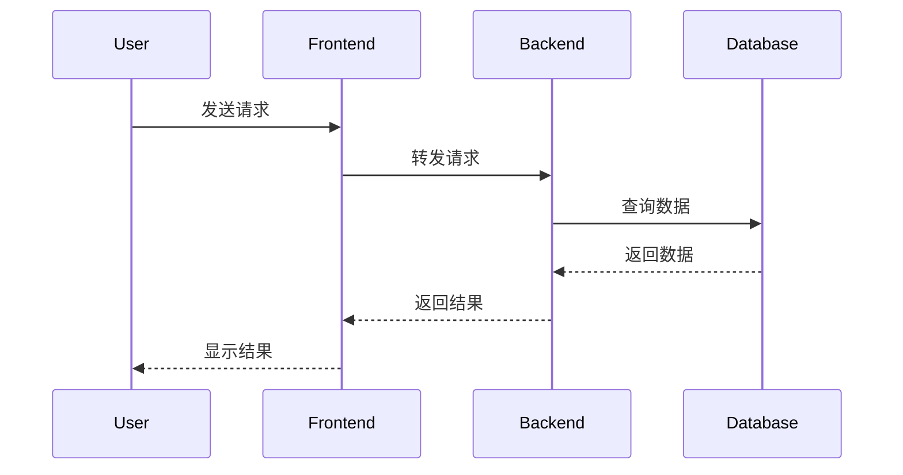

                 

### 《技术leader的思维升级之路》

在当今快速变化的技术领域中，技术leader的角色不仅仅局限于传统的技术管理。他们需要具备全面的领导能力、深刻的思维模式和战略眼光，以便在复杂多变的环境中引领团队走向成功。本文将围绕《技术leader的思维升级之路》这一主题，深入探讨技术leader如何通过思维升级来实现个人和团队的成长。

#### 关键词
- 技术leader
- 思维升级
- 领导力
- 敏捷开发
- 设计模式
- 系统架构
- 战略规划

#### 摘要
本文将分为七个主要部分，首先介绍技术leader的角色定位和思维升级的必要性。随后，我们将探讨基础理论，包括敏捷开发、设计模式和系统架构。接着，文章将深入讨论技术leader的思维方式，如创新思维、批判性思维和系统思维。在领导力提升部分，我们将探讨如何提升团队协作和管理能力。随后，文章将转向战略规划，分析技术趋势和资源分配。在团队管理部分，我们将讨论团队绩效管理和个人发展。最后，通过成功和失败案例的剖析，总结技术leader的最佳实践，并提供扩展阅读建议。

### 目录大纲设计思路

为了设计出符合要求的目录大纲，我们首先明确了整体结构，包括基础理论、思维模式、领导力提升、战略规划、团队管理、个人成长和案例分析等部分。接下来，我们将每个部分进一步细化，确保内容详实且结构合理。图表和公式的插入增强了文章的专业性，实践案例则为读者提供了实际应用的机会。

### 目录大纲样本

下面是《技术leader的思维升级之路》的目录大纲样本：

```markdown
# 《技术leader的思维升级之路》

## 第一部分：基础理论
### 1.1 问题背景与核心概念
#### 1.1.1 技术leader的角色定位
#### 1.1.2 思维升级的必要性
### 1.2 敏捷开发
#### 1.2.1 敏捷开发的核心理念
#### 1.2.2 敏捷实践案例分析
### 1.3 设计模式
#### 1.3.1 设计模式概述
#### 1.3.2 常见设计模式详解
### 1.4 系统架构
#### 1.4.1 系统架构基础
#### 1.4.2 架构设计实践

## 第二部分：思维模式
### 2.1 创新思维
#### 2.1.1 创新思维的培养
#### 2.1.2 创新实践案例分析
### 2.2 批判性思维
#### 2.2.1 批判性思维的重要性
#### 2.2.2 批判性思维的实践
### 2.3 系统思维
#### 2.3.1 系统思维的原理
#### 2.3.2 系统思维在团队管理中的应用

## 第三部分：领导力提升
### 3.1 团队协作
#### 3.1.1 团队协作的重要性
#### 3.1.2 提升团队协作的技巧
### 3.2 管理能力
#### 3.2.1 管理能力的发展
#### 3.2.2 管理技能提升案例分析

## 第四部分：战略规划
### 4.1 技术趋势分析
#### 4.1.1 技术趋势的识别
#### 4.1.2 技术趋势对组织的影响
### 4.2 资源分配
#### 4.2.1 资源配置的原则
#### 4.2.2 资源优化案例分析

## 第五部分：团队管理
### 5.1 团队绩效管理
#### 5.1.1 团队绩效评估
#### 5.1.2 提升团队绩效的策略
### 5.2 个人发展
#### 5.2.1 时间管理技巧
#### 5.2.2 持续学习策略

## 第六部分：案例分析
### 6.1 成功案例分享
#### 6.1.1 案例一：敏捷开发实践
#### 6.1.2 案例二：创新思维推动发展
### 6.2 失败案例分析
#### 6.2.1 失败原因分析
#### 6.2.2 启示与反思

## 第七部分：总结与拓展
### 7.1 全书总结
### 7.2 扩展阅读推荐
```

这个大纲为文章的结构提供了清晰的框架，接下来我们将逐一深入探讨每个部分的内容。

---

### 第一部分：基础理论

在技术领域中，技术leader的基础理论是其成功的关键。首先，我们需要明确技术leader的角色定位和思维升级的必要性。

#### 1.1 问题背景与核心概念

技术leader的角色不仅仅是管理技术团队，还包括引领技术方向、推动技术创新和优化系统架构。随着技术环境的不断变化，技术leader需要具备快速适应和创新能力。思维升级在这个过程中变得至关重要。

**核心概念：** 思维升级指的是通过学习新知识、掌握新技能和改变旧有的思维方式，来提高个人的思维水平和解决问题的能力。

**问题背景：** 在复杂多变的技术环境中，技术leader面临的问题包括技术趋势的不确定性、团队协作的挑战和资源分配的困难。这些问题需要技术leader具备更高级的思维能力和战略眼光。

#### 1.2 敏捷开发

敏捷开发是一种以人为核心、迭代和渐进的方法论。它强调灵活性、响应变化和持续交付价值。

**核心概念：** 敏捷开发的核心原则包括客户满意度最大化、响应变化、持续交付、团队合作、个体和互动的重要性以及技术卓越和简洁性。

**问题解决：** 敏捷开发通过短期迭代（Sprint）来实现持续交付，通过用户故事（User Story）和任务板（Task Board）来管理需求和工作进度，通过每日站立会议（Daily Stand-up）来保持沟通和透明度。

**边界与外延：** 敏捷开发不仅适用于软件开发，还可以应用于其他类型的项目，如产品开发、市场营销等。

**概念结构与核心要素组成：** 敏捷开发的架构包括角色（如产品负责人、Scrum Master、开发团队）、事件（如Sprint计划会议、Sprint评审会议、回顾会议）和工作产品（如用户故事、任务板、燃尽图）。

#### 1.3 设计模式

设计模式是软件开发中常用的问题解决方案，它们是经过长期实践验证的通用解决方案。

**核心概念：** 设计模式是一系列经过验证的解决方案，它们用于解决软件设计中的常见问题。

**属性特征对比表格：**

| 设计模式 | 目的 | 关键特征 | 适用场景 |
| --- | --- | --- | --- |
| 单例模式 | 保证一个类只有一个实例 | 实例创建、延迟加载、线程安全 | 需要全局唯一访问点 |
| 工厂模式 | 创建对象 | 工厂方法、抽象工厂 | 对象创建逻辑复杂 |
| 代理模式 | 为其他对象提供代理控制 | 静态代理、动态代理 | 需要控制访问权限 |
| 装饰器模式 | 动态地给一个对象增加一些额外的职责 | 组合、继承 | 需要增加对象功能 |

**ER实体关系图架构：** 在设计模式中，实体关系图可以帮助我们理解类之间的关系。例如，在代理模式中，实体包括原始对象和代理对象，它们之间存在关联关系。

```mermaid
erDiagram
A{BaseClass} ||--|{DerivedClass1} : inheritance
A{BaseClass} ||--|{DerivedClass2} : inheritance
A{BaseClass} ..|.. B{Decorator} : has
B{Decorator} ..|.. C{ConcreteDecoratorA} : has
B{Decorator} ..|.. C{ConcreteDecoratorB} : has
```

#### 1.4 系统架构

系统架构是软件系统的骨架，它定义了系统的整体结构和组成部分。

**核心概念：** 系统架构包括软件组件的布局、组件之间的关系和交互机制。

**系统架构设计实践：** 在设计系统架构时，我们需要考虑以下几个方面：
- **功能分解**：将系统功能划分为多个模块，每个模块负责一个特定的功能。
- **模块交互**：定义模块之间的交互方式和数据交换格式。
- **性能优化**：确保系统在高负载情况下仍能保持良好的性能。
- **可扩展性**：设计系统时考虑到未来的扩展需求。

**架构设计实践：** 以下是一个简单的系统架构设计示例，它包含前端、后端和数据库三个主要模块。



通过上述内容，我们建立了技术leader所需的基础理论框架。在接下来的部分中，我们将深入探讨技术leader的思维方式，包括创新思维、批判性思维和系统思维。

---

### 第二部分：思维模式

技术leader的思维方式是其成功的关键因素之一。在这一部分中，我们将探讨创新思维、批判性思维和系统思维，这些思维方式对于技术leader来说至关重要。

#### 2.1 创新思维

创新思维是技术leader在快速变化的技术环境中脱颖而出的关键。它涉及到如何发现问题、提出解决方案并实施这些解决方案。

**核心概念：** 创新思维是一种通过创造性和探索性方法解决问题的思维方式。它强调原创性、多样性和灵活性。

**概念属性特征对比表格：**

| 思维模式 | 特征 | 适用场景 |
| --- | --- | --- |
| 创新思维 | 原创性、多样性、灵活性 | 技术趋势分析、产品创新、解决方案设计 |
| 传统思维 | 重复性、稳定性、保守性 | 日常运营、持续改进、稳定性维护 |

**ER实体关系图架构：** 在创新思维中，实体可以看作是问题、解决方案和资源。它们之间的关系可以用以下ER图来表示：

```mermaid
erDiagram
Problem ||--|{Solution} : 解决
Resource ||--|{Solution} : 利用
```

**创新实践案例分析：** 以一家科技公司为例，该公司通过创新思维引入了一种新的云计算服务，该服务不仅提高了效率，还降低了成本。这一创新实践的成功得益于技术leader对市场趋势的敏锐洞察和对团队创新思维的激励。

**创新思维培养：**
1. **鼓励多样性**：在团队中引入多样化的背景和专业技能，以激发创新思维。
2. **定期头脑风暴**：组织定期的头脑风暴会议，鼓励团队成员提出新颖的想法。
3. **持续学习**：鼓励团队成员不断学习新技术和新理论，以拓宽思维视野。

#### 2.2 批判性思维

批判性思维是技术leader在面对复杂问题和不确定性时的重要工具。它涉及对信息进行深入分析、评估和推理。

**核心概念：** 批判性思维是一种对信息进行深入分析和评价的思维方式。它强调逻辑性、客观性和质疑精神。

**概念属性特征对比表格：**

| 思维模式 | 特征 | 适用场景 |
| --- | --- | --- |
| 批判性思维 | 逻辑性、客观性、质疑精神 | 技术评估、风险管理、决策制定 |
| 被动接受思维 | 简单接受、盲目跟从、缺乏质疑 | 技术应用初期、团队协作中 |

**ER实体关系图架构：** 在批判性思维中，实体可以看作是信息、评价和决策。它们之间的关系可以用以下ER图来表示：

```mermaid
erDiagram
Information ||--|{Evaluation} : 分析
Evaluation ||--|{Decision} : 形成决策
```

**批判性思维实践：** 一家科技公司在其产品开发过程中，通过批判性思维评估了多个技术方案，最终选择了最适合的方案。这一实践的成功得益于技术leader对技术方案的深入分析和客观评价。

**批判性思维培养：**
1. **培养质疑精神**：鼓励团队成员对现有的技术方案和流程提出质疑。
2. **逻辑训练**：通过逻辑训练和思维游戏来提高团队成员的逻辑思维能力。
3. **案例研究**：通过分析成功和失败的案例来学习批判性思维的实践。

#### 2.3 系统思维

系统思维是技术leader在复杂系统中进行有效管理和决策的关键。它涉及对整个系统进行整体分析和优化。

**核心概念：** 系统思维是一种将系统看作一个整体，分析各个组成部分及其相互关系的思维方式。它强调整体性、层次性和动态性。

**概念属性特征对比表格：**

| 思维模式 | 特征 | 适用场景 |
| --- | --- | --- |
| 系统思维 | 整体性、层次性、动态性 | 系统设计、风险管理、战略规划 |
| 传统思维 | 部件化、线性思维、单一视角 | 初期项目规划、单一任务执行 |

**ER实体关系图架构：** 在系统思维中，实体可以看作是系统、组件和交互。它们之间的关系可以用以下ER图来表示：

```mermaid
erDiagram
System ||--|{Component} : 组成
Component ||--|{Connection} : 交互
```

**系统思维应用案例：** 一家大型科技公司通过系统思维对其复杂的产品生态系统进行了重新设计，提高了产品的灵活性和可扩展性。这一实践的成功得益于技术leader对整个产品生态系统的深刻理解和整体优化。

**系统思维培养：**
1. **整体视角**：鼓励团队成员从整体视角来理解和分析问题。
2. **层次分析**：通过层次分析来理解系统的不同层面和层次。
3. **动态模拟**：通过模拟和实验来预测系统的行为和变化。

通过上述内容，我们深入探讨了技术leader所需的创新思维、批判性思维和系统思维。这些思维方式不仅有助于技术leader在复杂环境中做出正确的决策，还能提高团队的整体效率和创新能力。

在下一部分中，我们将探讨领导力提升，包括团队协作和管理能力的发展。

---

### 第三部分：领导力提升

在技术领域，领导力提升是技术leader实现个人和团队成长的关键。这一部分将探讨如何提升团队协作和管理能力，以增强团队的绩效和凝聚力。

#### 3.1 团队协作

团队协作是技术leader成功的关键因素之一。一个高效的团队可以在复杂项目中实现卓越的表现。

**核心概念：** 团队协作是指团队成员为了共同的目标和成果，通过沟通、协调和合作来完成任务的过程。

**问题解决：** 团队协作中的问题可能包括沟通障碍、角色冲突和目标不一致。技术leader需要通过有效的策略来解决问题。

**边界与外延：** 团队协作不仅限于技术团队，也适用于其他类型的团队，如产品团队、市场团队等。

**概念结构与核心要素组成：** 团队协作的架构包括团队成员、沟通渠道、合作机制和共同目标。

**团队协作技巧：**
1. **明确目标**：确保团队成员了解团队的目标和期望成果。
2. **有效沟通**：通过定期会议、即时通讯和文档共享来保持沟通的透明度。
3. **分配角色**：根据成员的技能和兴趣来分配角色，确保每个人都有明确的职责。
4. **鼓励反馈**：鼓励团队成员提供反馈，以便及时调整和改进工作流程。

**实践案例分析：** 一家科技公司通过实施敏捷开发实践，提高了团队协作的效率。团队定期进行每日站立会议，讨论进度和问题，确保每个人都清楚项目的状态和下一步的行动计划。

#### 3.2 管理能力

技术leader的管理能力直接影响到团队的表现和组织的成功。提升管理能力是技术leader职业发展的关键。

**核心概念：** 管理能力是指技术leader在组织、协调、领导和激励团队方面所具备的技能和知识。

**问题解决：** 技术leader面临的管理问题可能包括资源分配不均、团队成员冲突和项目管理不当。

**边界与外延：** 管理能力不仅适用于技术团队，也适用于其他类型的团队和组织。

**概念结构与核心要素组成：** 管理能力的架构包括领导力、沟通技巧、决策能力和资源管理。

**管理能力提升策略：**
1. **持续学习**：通过参加培训课程、阅读专业书籍和参加行业研讨会来提升知识水平。
2. **领导力培养**：通过实践和培训来提升领导力和影响力。
3. **沟通技巧**：通过有效的沟通来建立信任、减少误解和提高团队效率。
4. **决策能力**：通过分析和评估来做出明智的决策。
5. **资源管理**：通过优化资源分配和利用来提高效率。

**实践案例分析：** 一家大型科技公司通过引入项目管理工具和实施项目管理系统，提高了项目管理的效率。技术leader通过定期审查项目进度和资源使用情况，及时调整计划和资源分配，确保项目的顺利进行。

通过提升团队协作和管理能力，技术leader可以增强团队的凝聚力和效率，实现组织的目标。在下一部分中，我们将探讨战略规划，包括技术趋势分析和资源分配。

---

### 第四部分：战略规划

战略规划是技术leader在组织中的核心职责之一。在这一部分，我们将探讨技术leader如何通过技术趋势分析和资源分配来制定有效的战略规划。

#### 4.1 技术趋势分析

技术趋势分析是技术leader了解行业动态和未来发展方向的重要手段。

**核心概念：** 技术趋势分析是指通过收集、分析和解读技术领域的发展趋势，以指导决策和战略规划。

**问题解决：** 技术leader需要识别关键趋势、评估其影响并制定相应的应对策略。

**边界与外延：** 技术趋势分析不仅适用于技术团队，也适用于整个组织。

**概念结构与核心要素组成：** 技术趋势分析的架构包括趋势识别、影响评估和应对策略。

**技术趋势识别：**
1. **数据收集**：通过行业报告、技术博客和会议纪要等渠道收集数据。
2. **趋势识别**：分析数据，识别关键趋势。
3. **影响评估**：评估技术趋势对组织的影响，包括潜在机遇和挑战。

**技术趋势案例分析：** 一家科技公司通过技术趋势分析，发现人工智能和大数据技术在行业中的应用逐渐增多。技术leader决定将这两项技术纳入公司战略规划，并投入资源进行研发和应用。

**技术趋势对组织的影响：**
- **机遇**：新技术可以提升产品竞争力、开拓新市场。
- **挑战**：技术变革可能带来复杂性和不确定性。

#### 4.2 资源分配

资源分配是技术leader在战略规划中的关键任务之一。

**核心概念：** 资源分配是指根据组织的战略目标和项目需求，合理分配人力、物力和财力资源。

**问题解决：** 技术leader需要优化资源使用，确保资源得到充分利用。

**边界与外延：** 资源分配不仅涉及技术团队，还涉及整个组织。

**概念结构与核心要素组成：** 资源分配的架构包括资源需求分析、优先级排序和资源优化。

**资源分配原则：**
1. **明确目标**：确保资源分配与组织目标一致。
2. **优先级排序**：根据项目的重要性和紧急性来分配资源。
3. **资源优化**：通过效率提升和成本控制来优化资源使用。

**资源优化案例分析：** 一家科技公司通过实施敏捷开发实践，优化了资源分配。技术leader通过灵活调整团队规模和任务分配，提高了资源利用率和项目交付效率。

**资源分配策略：**
1. **需求评估**：分析项目需求，确定资源需求。
2. **成本控制**：通过成本预算和成本效益分析来控制资源使用。
3. **灵活调整**：根据项目进展和需求变化，灵活调整资源分配。

通过技术趋势分析和资源分配，技术leader可以制定有效的战略规划，确保组织在技术变革中保持竞争力。在下一部分中，我们将探讨团队管理和个人发展。

---

### 第五部分：团队管理

在技术领域中，团队管理是技术leader的关键职责之一。这一部分将探讨如何提升团队绩效和团队凝聚力，以及技术leader如何进行个人发展。

#### 5.1 团队绩效管理

团队绩效管理是确保团队达成目标的重要手段。技术leader需要通过有效的绩效管理来提升团队效率。

**核心概念：** 团队绩效管理是指通过设定目标、评估绩效和提供反馈来提升团队效率和成果。

**问题解决：** 技术leader需要面对团队绩效评估中的挑战，如目标设定不明确、评估方法不科学和反馈机制不完善。

**边界与外延：** 团队绩效管理不仅适用于技术团队，也适用于其他类型的团队。

**概念结构与核心要素组成：** 团队绩效管理的架构包括目标设定、绩效评估、反馈和改进。

**提升团队绩效的策略：**
1. **明确目标**：确保团队目标与组织目标一致，明确可衡量的绩效指标。
2. **定期评估**：通过定期评估来跟踪团队绩效，及时发现问题并进行调整。
3. **反馈机制**：建立有效的反馈机制，鼓励团队成员提供反馈和建议。
4. **激励机制**：通过奖励和认可来激励团队成员，提高工作积极性和绩效。

**实践案例分析：** 一家科技公司通过实施目标管理和绩效评估系统，显著提高了团队的绩效和满意度。技术leader定期与团队成员进行绩效沟通，及时调整工作计划和目标，确保团队始终保持高效运行。

#### 5.2 个人发展

个人发展是技术leader实现职业成长的关键。技术leader需要不断学习和发展，以适应快速变化的技术环境。

**核心概念：** 个人发展是指技术leader通过学习和实践来提升自己的技能、知识和领导能力。

**问题解决：** 技术leader需要面对个人发展中的挑战，如时间管理不当、知识更新不及时和技能提升困难。

**边界与外延：** 个人发展不仅涉及技术知识，还包括领导力、沟通技巧和人际关系管理。

**概念结构与核心要素组成：** 个人发展的架构包括学习策略、技能提升和实践应用。

**持续学习策略：**
1. **制定学习计划**：根据职业发展目标和兴趣，制定详细的学习计划。
2. **多渠道学习**：通过在线课程、书籍、研讨会和实战项目等多种方式来学习。
3. **反思与总结**：在学习过程中进行反思和总结，以便持续改进和提升。

**实践案例分析：** 一家科技公司的一名技术leader通过参加行业研讨会和在线课程，不断提升自己的技术和管理能力。他还积极参与开源项目，将所学知识应用于实际工作中，实现了个人和团队的共同成长。

**个人发展建议：**
1. **时间管理**：合理安排时间，确保有足够的时间进行学习和实践。
2. **知识更新**：关注行业动态，及时更新知识和技能。
3. **技能提升**：通过实战项目和培训课程来提升技术和管理能力。

通过团队管理和个人发展，技术leader可以提升团队绩效和个人的职业素养，为组织的成功奠定基础。在下一部分中，我们将通过成功和失败案例来总结技术leader的最佳实践。

---

### 第六部分：案例分析

在技术领域中，成功和失败案例都是宝贵的经验。通过分析这些案例，技术leader可以汲取成功经验，避免失败原因，从而提高自己的领导能力和团队绩效。

#### 6.1 成功案例分享

**案例一：敏捷开发实践**

某家科技公司通过实施敏捷开发，成功提升了团队的效率和产品质量。技术leader采取了以下策略：

1. **明确目标**：与技术团队和管理层共同制定清晰的项目目标和里程碑。
2. **迭代开发**：采用短期迭代（Sprint）模式，确保项目持续交付价值。
3. **用户故事**：通过用户故事来管理需求，确保需求与用户实际需求相符。
4. **沟通协作**：定期组织站立会议、回顾会议和评审会议，保持团队成员之间的沟通和协作。

**案例二：创新思维推动发展**

另一家科技公司通过鼓励创新思维，成功推出了一系列创新产品。技术leader采取了以下策略：

1. **头脑风暴**：定期组织头脑风暴会议，鼓励团队成员提出新颖的想法。
2. **资源支持**：为创新项目提供充足的资源和时间，确保创新实践得以实施。
3. **试点项目**：在较小范围内试点创新项目，通过反馈和改进来优化产品。

#### 6.2 失败案例分析

**案例一：项目延期**

某科技公司的项目由于管理不善和沟通不畅导致延期。技术leader在回顾中发现了以下问题：

1. **目标不明确**：项目目标和里程碑不明确，导致团队成员无法集中精力。
2. **沟通不畅**：团队成员之间缺乏有效沟通，导致需求变更和信息丢失。
3. **资源浪费**：项目资源未得到充分利用，导致浪费和延误。

**案例二：技术选型不当**

另一家科技公司由于技术选型不当，导致项目失败。技术leader在回顾中发现了以下问题：

1. **缺乏调研**：在技术选型过程中缺乏充分的市场调研和评估。
2. **技术理解不足**：团队成员对新技术缺乏深入理解，导致技术应用不当。
3. **风险意识不足**：对技术风险和潜在问题缺乏预见和应对策略。

**启示与反思**

通过成功和失败案例的分析，技术leader可以汲取以下启示：

1. **明确目标**：确保项目目标和里程碑明确，团队成员集中精力。
2. **有效沟通**：建立有效的沟通机制，确保信息传递准确和及时。
3. **风险管理**：对项目风险进行充分评估和应对，提前制定应对策略。
4. **持续学习**：不断学习和掌握新技术和领导技巧，提升自身能力。

通过分析成功和失败案例，技术leader可以更好地应对挑战，提升团队绩效，实现组织的长期成功。

---

### 第七部分：总结与拓展

在《技术leader的思维升级之路》中，我们深入探讨了技术leader所需的基础理论、思维模式、领导力提升、战略规划、团队管理和个人发展。通过这些内容，我们总结了以下核心要点：

1. **基础理论**：了解敏捷开发、设计模式和系统架构等基础理论，为技术leader的工作提供坚实基础。
2. **思维模式**：培养创新思维、批判性思维和系统思维，以应对复杂的技术环境。
3. **领导力提升**：提升团队协作和管理能力，增强团队的凝聚力和效率。
4. **战略规划**：通过技术趋势分析和资源分配来制定有效的战略规划，确保组织在技术变革中保持竞争力。
5. **团队管理**：通过团队绩效管理和个人发展来提升团队绩效和个人职业素养。
6. **案例分析**：通过成功和失败案例的分析，汲取经验，避免重复错误。

为了进一步深入学习和实践，我们推荐以下扩展阅读：

1. **《敏捷开发实践指南》**：详细介绍了敏捷开发的原则和方法，适合技术leader学习。
2. **《设计模式：可复用面向对象软件的基础》**：深入讲解了各种设计模式，帮助技术leader提升软件设计能力。
3. **《系统架构设计：企业级应用架构设计与实践》**：介绍了系统架构设计的方法和实践，适合技术leader进行系统设计和优化。
4. **《创新者的窘境》**：探讨了企业在创新过程中面临的挑战，适合技术leader思考如何推动组织创新。
5. **《批判性思维工具》**：提供了批判性思维的技巧和方法，帮助技术leader提升分析和评估能力。

通过这些扩展阅读，技术leader可以进一步深化自己的知识体系，提升领导力和创新能力，为组织的长期发展奠定坚实基础。

---

**作者：AI天才研究院/AI Genius Institute & 禅与计算机程序设计艺术 /Zen And The Art of Computer Programming**

### 2.1 创新思维的培养

**创新思维是技术leader在快速变化的技术环境中脱颖而出的关键。** 为了培养创新思维，我们可以采取以下步骤：

1. **开放心态**：鼓励团队成员保持开放的心态，对新的想法和观点持包容态度。这有助于激发创意和思考不同的解决方案。

2. **跨学科学习**：鼓励团队成员跨学科学习，掌握不同领域的知识和技能。跨学科的学习可以帮助团队成员从不同的角度看待问题，从而提出创新的解决方案。

3. **头脑风暴**：定期组织头脑风暴会议，让团队成员自由地提出自己的想法和解决方案。头脑风暴过程中，不应评判任何想法的好坏，而是鼓励多样性和创意。

4. **挑战现状**：鼓励团队成员对现有的流程、工具和技术提出质疑，思考是否有更好的方法可以替代。这种挑战现状的精神有助于推动创新。

5. **实践与反馈**：将创新想法付诸实践，并通过反馈机制不断优化和完善。实践过程中，可以发现问题和不足，从而改进创新方案。

**创新实践案例分析：**

**案例一：谷歌的“20%时间”政策**

谷歌曾实行“20%时间”政策，允许员工将20%的工作时间用于自己感兴趣的项目。这一政策激发了员工们的创新思维，许多成功的产品如Gmail和Google News都源自这一政策。这一案例表明，给予员工自主时间和空间，可以激发他们的创新潜力。

**案例二：苹果公司的新产品设计**

苹果公司在产品设计过程中，注重创新和用户体验。例如，iPhone的设计不仅仅是外观的创新，更是在用户体验和功能上进行了彻底的重新设计。苹果公司通过不断试验和用户反馈，不断优化产品，最终推出了颠覆性的产品。

**创新思维培养策略：**

1. **定期创新培训**：组织创新培训，帮助团队成员了解创新思维的方法和技巧。

2. **设立创新实验室**：创建专门的创新实验室，为团队成员提供实验和创新的环境。

3. **激励创新**：建立激励机制，鼓励团队成员提出创新想法，并对其创新成果进行奖励。

4. **建立反馈机制**：建立有效的反馈机制，鼓励团队成员分享创新经验和教训，相互学习和借鉴。

通过上述策略，技术leader可以培养团队成员的创新思维，推动团队在技术领域中的创新和发展。

### 2.2 创新实践案例分析

**创新实践在技术团队中不仅能够激发成员的潜力，还能带来实际成果。以下将通过两个具体案例，探讨创新思维在技术项目中的成功应用。**

#### 案例一：腾讯的微信支付

**背景**：随着移动互联网的兴起，移动支付成为了人们日常生活的一部分。为了在这一领域占据竞争优势，腾讯公司决定推出微信支付。

**解决方案**：微信支付项目从立项开始，就强调了创新思维的重要性。技术团队在设计和开发过程中，采取了以下创新实践：

1. **用户中心设计**：团队以用户需求为中心，通过大量用户调研，了解用户的支付习惯和使用场景，确保支付服务的便捷性和用户体验。

2. **技术前瞻性**：团队引入了最新的安全技术，如区块链和人工智能，提高支付的安全性和效率。

3. **开放合作**：腾讯支付与各大银行、支付公司合作，迅速拓展支付网络，提高市场占有率。

**结果**：微信支付迅速占领了市场，成为了中国最受欢迎的移动支付工具之一。截至2021年，微信支付的月活跃用户数已超过10亿。

**启示**：这个案例表明，创新思维能够帮助企业抓住市场机遇，迅速发展壮大。技术leader应在团队中营造创新文化，鼓励成员提出新颖的想法，并通过实践验证其可行性。

#### 案例二：亚马逊的AWS云服务

**背景**：随着云计算的普及，越来越多的企业开始将其IT基础设施转移到云上。为了在这一领域获得竞争优势，亚马逊公司推出了AWS云服务。

**解决方案**：AWS云服务在设计和实施过程中，展现了卓越的创新实践：

1. **模块化架构**：AWS采用模块化架构设计，使得用户可以根据需要灵活选择和配置服务，提高了系统的灵活性和可扩展性。

2. **自动化和智能化**：AWS引入了自动化和智能化技术，如自动扩展和智能分析，提高了系统的效率和性能。

3. **开放接口**：AWS提供了丰富的API接口，使得开发者可以轻松地将云服务集成到自己的应用程序中，推动了云计算的广泛应用。

**结果**：AWS云服务迅速成为了全球领先的云计算平台，吸引了大量企业和开发者。截至2021年，AWS的营收已经超过了微软和阿里巴巴的总和。

**启示**：这个案例展示了创新实践在技术领域的巨大潜力。技术leader应注重技术趋势，不断创新和改进产品，以满足市场和客户的需求。

通过以上案例，我们可以看到创新思维在技术项目中的重要作用。技术leader应积极推动创新实践，鼓励团队成员提出新的想法，并通过实践验证其价值，以实现团队和组织的持续发展。

### 2.3 批判性思维的重要性

批判性思维在技术leader的日常工作中扮演着至关重要的角色。它不仅帮助技术leader做出更明智的决策，还能提高团队的工作效率和产品质量。

**核心概念：** 批判性思维是一种通过质疑、分析和评估信息来做出理性决策的思维方式。它强调逻辑性、客观性和深度思考。

**问题解决：** 技术leader在面对复杂问题时，需要通过批判性思维来分析问题、评估解决方案并做出最佳决策。例如，在技术选型、项目规划和资源分配等方面，批判性思维能够帮助技术leader识别潜在的风险和挑战。

**边界与外延：** 批判性思维不仅适用于技术决策，还广泛应用于项目管理、团队协作和战略规划等方面。

**概念结构与核心要素组成：** 批判性思维的架构包括质疑精神、逻辑分析和评估方法。质疑精神促使技术leader对信息进行深入思考，逻辑分析帮助技术leader构建合理的论证，评估方法则用于评估不同方案的效果。

**批判性思维培养：**
1. **培养质疑精神**：鼓励团队成员对现有的观点和做法提出质疑，不盲目接受。
2. **逻辑训练**：通过逻辑推理和论证训练来提高技术leader的思维能力。
3. **案例研究**：通过分析成功和失败的案例，学习批判性思维的实践和应用。

**批判性思维应用场景：**
1. **技术选型**：在选择技术方案时，通过批判性思维分析不同方案的优缺点，选择最佳方案。
2. **项目规划**：在项目规划过程中，通过批判性思维评估项目风险和资源需求，确保项目顺利进行。
3. **团队协作**：在团队协作中，通过批判性思维识别和解决团队中的问题，提高团队效率。

**实践案例分析：**

**案例一：某科技公司的新产品开发**

在开发一款新产品的过程中，技术leader通过批判性思维对项目进行了全面评估。他首先质疑了现有的技术方案，分析了不同方案的优缺点，最终选择了最适合的方案。此外，他还通过逻辑分析评估了项目风险和资源需求，制定了详细的项目计划，确保项目顺利推进。

**案例二：某互联网公司的战略规划**

在制定公司战略规划时，技术leader通过批判性思维分析了市场趋势和竞争环境。他质疑了现有的市场策略，并提出了新的战略方向。通过逻辑分析，他评估了新战略的可行性和潜在风险，并向公司高层提供了详细的报告。最终，公司采纳了他的建议，实现了战略转型，取得了显著的市场成功。

通过批判性思维的应用，技术leader能够在复杂多变的环境中做出明智的决策，提高团队的工作效率和产品质量。在下一部分中，我们将探讨批判性思维的实践。

### 2.4 批判性思维的实践

批判性思维不仅是技术leader的必备技能，更是在实际工作中提升决策质量的关键。以下将通过具体案例和实践方法，详细探讨批判性思维的运用。

#### 实践方法：

**1. 提问法**

批判性思维的实践可以从提问开始。技术leader可以通过以下问题来激发思考：

- **问题识别**：识别问题的本质，明确需要解决的问题。
- **解决方案**：提出多种可能的解决方案，并分析每种方案的优缺点。
- **证据评估**：评估支持解决方案的证据，识别证据的有效性。

**2. 逻辑分析**

逻辑分析是批判性思维的核心。技术leader可以通过以下步骤进行逻辑分析：

- **前提**：确定问题的前提和假设。
- **推理**：根据前提进行逻辑推理，构建合理的论证。
- **验证**：检查推理过程的逻辑严密性，确保结论的正确性。

**3. 对比评估**

对比评估是批判性思维的重要环节。技术leader可以通过以下步骤进行对比评估：

- **收集信息**：收集与问题相关的各种信息。
- **分析对比**：分析不同信息之间的差异和关联，识别关键因素。
- **综合评估**：综合评估各种因素，得出最优解决方案。

#### 实践案例：

**案例一：技术方案选型**

某科技公司需要为新产品选择合适的数据库技术。技术leader通过以下步骤进行批判性思维实践：

1. **问题识别**：明确新产品的需求，包括数据存储、查询性能和可扩展性等。
2. **解决方案**：调研市场上主要的数据库技术，如MySQL、PostgreSQL和MongoDB等，并分析每种技术的特点。
3. **证据评估**：根据新产品的需求，评估每种技术的性能和适用性。
4. **逻辑分析**：比较不同数据库技术的逻辑结构和查询优化方法，分析其优劣。
5. **对比评估**：综合评估各种因素，最终选择了MySQL作为新产品的数据库技术。

**案例二：项目风险管理**

某互联网公司正在开发一款新应用，技术leader通过批判性思维管理项目风险：

1. **问题识别**：识别项目中可能面临的风险，如技术难题、资源短缺和时间压力等。
2. **解决方案**：分析不同风险的可能影响和应对策略。
3. **证据评估**：根据项目进度和资源情况，评估每种风险的概率和影响。
4. **逻辑分析**：构建风险管理模型，预测不同风险的概率和影响。
5. **对比评估**：制定详细的风险管理计划，包括风险预防、监控和应对措施。

通过批判性思维的实践，技术leader能够在复杂环境中做出更明智的决策，提高项目成功率和团队效率。在下一部分中，我们将探讨系统思维及其在技术leader中的应用。

### 2.5 系统思维的原理

系统思维是技术leader在复杂环境中进行有效决策和管理的关键。它不仅关注局部问题，还关注整体系统的运行机制和相互关系。

**核心概念：** 系统思维是一种从整体角度分析和解决问题的思维方式。它强调整体性、动态性和互动性。

**问题解决：** 在面对复杂项目和技术问题时，技术leader需要运用系统思维，分析系统中的各种因素及其相互作用，找到问题的根本原因，并提出解决方案。

**边界与外延：** 系统思维不仅适用于技术领域，还广泛应用于管理、战略规划、社会问题解决等领域。

**概念结构与核心要素组成：** 系统思维的架构包括整体观、动态性和反馈机制。

1. **整体观**：系统思维强调将系统看作一个整体，关注系统中的各个部分及其相互关系。
2. **动态性**：系统思维关注系统的动态变化，理解系统在不同状态下的行为。
3. **反馈机制**：系统思维关注系统内部的反馈机制，了解系统如何通过反馈调整和优化自身。

**系统思维在技术领导中的应用：**

1. **项目规划**：通过系统思维，技术leader可以全面评估项目的各种因素，确保项目目标的实现。
2. **风险管理**：系统思维帮助技术leader识别项目中的潜在风险，并制定有效的风险管理策略。
3. **团队协作**：系统思维强调团队中的互动和协作，帮助技术leader构建高效的团队。

### 系统思维的应用场景：

**场景一：产品开发**

在产品开发过程中，技术leader需要运用系统思维，分析产品架构、功能模块、用户需求和技术实现等方面。通过系统思维，技术leader可以确保产品设计的整体性和可扩展性，从而提高产品的质量和用户体验。

**场景二：系统优化**

在系统优化过程中，技术leader需要运用系统思维，分析系统的运行机制、性能瓶颈和资源利用率。通过系统思维，技术leader可以找到系统的瓶颈，提出优化的方向和方案，从而提高系统的性能和稳定性。

**场景三：团队管理**

在团队管理中，技术leader需要运用系统思维，分析团队成员的能力、工作流程和团队文化。通过系统思维，技术leader可以构建高效的团队协作机制，提高团队的工作效率和创新能力。

### 实践案例分析：

**案例一：某互联网公司的产品优化**

某互联网公司的一款产品在用户反馈中存在性能问题。技术leader通过系统思维，分析了产品的整体架构、数据库设计、服务器配置和前端优化等方面。最终，技术leader提出了一系列优化方案，包括数据库索引优化、缓存策略改进和前端代码优化等。通过系统思维的应用，产品的性能得到了显著提升，用户满意度也大幅提高。

**案例二：某科技公司的团队协作**

某科技公司需要提高团队的协作效率。技术leader通过系统思维，分析了团队的工作流程、沟通机制和团队成员的能力。最终，技术leader提出了一系列改进方案，包括引入敏捷开发方法、建立每日站立会议和优化任务分配等。通过系统思维的应用，团队的协作效率得到了显著提升，项目交付时间缩短，团队士气也得到提升。

通过系统思维的原理和应用，技术leader可以更好地应对复杂的技术和管理问题，提高项目的成功率和团队的整体效率。

### 2.6 系统思维在团队管理中的应用

在技术领域，团队管理是技术leader的核心职责之一。系统思维作为一项重要的思维方式，能够帮助技术leader更全面地理解团队中的复杂关系，提高团队的整体效率和绩效。

**核心概念：** 系统思维在团队管理中指的是从整体和动态的角度来分析团队运作，理解团队成员之间的互动关系，并制定有效的管理策略。

**问题解决：** 技术leader在团队管理中面临的问题包括沟通不畅、角色冲突、工作流程复杂和团队成员缺乏积极性。通过系统思维，技术leader可以更好地识别这些问题，并从整体上找到解决方案。

**边界与外延：** 系统思维不仅适用于技术团队，也适用于其他类型的团队，如产品团队、市场团队等。

**概念结构与核心要素组成：** 系统思维在团队管理中的应用包括以下几个方面：

1. **整体观**：理解团队作为一个整体的运作，包括团队的目标、成员的角色和任务分配。
2. **动态性**：关注团队在不同阶段的动态变化，如项目进展、成员能力的提升和团队文化的形成。
3. **反馈机制**：建立有效的反馈和沟通机制，确保团队能够及时调整和优化工作流程。

**系统思维在团队管理中的应用实践：**

1. **团队建设**：通过系统思维，技术leader可以设计更有效的团队建设活动，如团队拓展训练、技能分享会等，以增强团队凝聚力和成员之间的信任。
2. **任务分配**：在任务分配时，技术leader应考虑成员的能力、兴趣和工作负荷，确保任务与成员的能力相匹配，并促进团队成员之间的互补。
3. **沟通协作**：通过系统思维，技术leader可以建立更高效的沟通协作机制，如每日站立会议、定期项目回顾等，确保团队成员之间的信息流通和协作顺畅。
4. **风险管理**：在项目管理和团队运营过程中，技术leader应运用系统思维识别潜在的风险，并制定相应的应对策略，确保项目的顺利进行。

**实践案例分析：**

**案例一：某科技公司的敏捷团队管理**

某科技公司采用了敏捷开发方法，技术leader通过系统思维对团队进行了有效管理。他首先明确了团队的目标和角色，确保每个成员都清楚自己的职责和期望。随后，技术leader建立了每日站立会议和定期回顾会议，以保持团队成员之间的沟通和协作。通过系统思维的应用，团队的效率显著提高，项目交付时间缩短，质量也得到保障。

**案例二：某互联网公司的跨部门协作**

某互联网公司需要实现不同部门之间的高效协作。技术leader通过系统思维，分析了跨部门协作的流程和沟通机制。他引入了项目管理工具，建立了跨部门协作的共享平台，确保各部门之间的信息透明和及时沟通。通过系统思维的应用，跨部门协作的效率大幅提升，项目进展更加顺利。

通过系统思维在团队管理中的应用，技术leader可以更好地理解团队运作的复杂性，提高团队的整体效率和绩效。在下一部分中，我们将探讨战略规划中的技术趋势分析和资源分配。

### 4.1 技术趋势分析

技术趋势分析是技术leader制定有效战略规划的重要环节。通过对行业技术趋势的深入分析和洞察，技术leader可以更好地把握市场机遇，为组织的长期发展提供有力支持。

**核心概念：** 技术趋势分析是指通过收集、整理和分析技术领域的发展动态，识别出可能影响组织未来发展的关键趋势。

**问题解决：** 技术leader需要面对技术快速变化带来的挑战，如如何准确预测技术趋势、如何将趋势转化为实际的战略规划等。

**边界与外延：** 技术趋势分析不仅适用于技术团队，还适用于整个组织，包括产品开发、市场推广、资源配置等。

**概念结构与核心要素组成：** 技术趋势分析的架构包括数据收集、趋势识别、影响评估和应对策略。

1. **数据收集**：通过行业报告、技术博客、会议纪要、用户反馈等多种渠道收集技术趋势数据。
2. **趋势识别**：分析数据，识别出关键技术趋势。
3. **影响评估**：评估技术趋势对组织的影响，包括潜在机遇和挑战。
4. **应对策略**：制定相应的战略规划，以应对技术趋势的变化。

**技术趋势识别方法：**
1. **文献调研**：通过查阅技术报告、学术论文和行业白皮书等，了解最新的技术发展动态。
2. **市场调研**：通过与客户、合作伙伴和行业专家的交流，了解市场需求和趋势。
3. **数据分析**：利用数据分析工具，对收集到的技术数据进行分析，识别出关键趋势。

**技术趋势案例分析：**

**案例一：人工智能在金融行业的应用**

随着人工智能技术的快速发展，金融行业开始广泛应用人工智能技术。技术leader通过技术趋势分析，发现人工智能在风险管理、智能投顾和信用评分等方面的应用前景广阔。他组织团队研究相关技术，并制定了将人工智能技术引入金融业务的战略规划，从而提升了公司的竞争力。

**案例二：区块链技术在供应链管理中的应用**

区块链技术以其去中心化、不可篡改的特点，在供应链管理中展现出巨大潜力。技术leader通过技术趋势分析，发现区块链技术可以提升供应链的透明度和效率。他推动公司在供应链管理中引入区块链技术，实现了供应链的可追溯性和数据安全性，提高了客户的满意度。

**技术趋势对组织的影响：**
1. **机遇**：技术趋势可以为组织带来新的市场机会、业务模式和竞争优势。
2. **挑战**：技术趋势的变化可能带来技术复杂度增加、人才短缺和竞争加剧等挑战。

通过技术趋势分析，技术leader可以更好地把握行业动态，为组织的长期发展制定科学的战略规划。

### 4.2 资源分配

资源分配是技术leader在战略规划中的重要任务之一。通过合理地分配资源，技术leader可以确保项目的顺利进行，提高团队的整体效率和绩效。

**核心概念：** 资源分配是指根据组织的战略目标和项目需求，合理分配人力、物力和财力资源，以实现最优的资源配置和使用。

**问题解决：** 技术leader需要面对资源分配中的挑战，如资源不足、资源浪费和资源分配不均等。

**边界与外延：** 资源分配不仅涉及技术团队，还涉及整个组织，包括人力资源、财务资源、技术资源和市场资源等。

**概念结构与核心要素组成：** 资源分配的架构包括资源需求分析、优先级排序和资源优化。

1. **资源需求分析**：根据项目需求和目标，分析所需资源类型和数量。
2. **优先级排序**：根据项目的重要性和紧急性，对资源需求进行优先级排序。
3. **资源优化**：通过优化资源配置和使用，提高资源利用效率和项目成功率。

**资源分配原则：**
1. **明确目标**：确保资源分配与组织目标和项目目标一致，明确资源使用的方向和重点。
2. **优先级排序**：根据项目的重要性和紧急性，优先分配关键资源。
3. **灵活调整**：根据项目进展和需求变化，灵活调整资源分配，确保资源能够得到充分利用。
4. **透明沟通**：建立透明沟通机制，确保团队成员了解资源分配情况和资源使用情况。

**资源优化案例分析：**

**案例一：某科技公司的敏捷开发实践**

某科技公司采用敏捷开发方法，通过资源优化提升了项目的成功率和团队效率。技术leader首先明确了项目的需求和目标，然后根据项目的优先级排序，合理分配人力资源。同时，技术leader通过灵活调整任务分配，确保团队成员能够充分利用资源。通过资源优化，项目的进度和质量得到了显著提升。

**案例二：某互联网公司的云计算应用**

某互联网公司通过引入云计算技术，优化了资源分配和使用。技术leader通过分析公司业务需求和成本效益，确定了云计算的应用场景和资源需求。然后，技术leader与云计算服务提供商合作，实现了资源的弹性扩展和优化使用。通过资源优化，公司降低了运营成本，提高了系统的可扩展性和可靠性。

**资源分配策略：**
1. **需求评估**：通过详细的业务需求分析，确定资源需求的类型和数量。
2. **成本控制**：通过成本效益分析和预算管理，确保资源分配在可承受范围内。
3. **灵活调整**：根据项目进展和需求变化，灵活调整资源分配，确保资源的合理利用。
4. **激励机制**：通过建立激励机制，鼓励团队成员高效利用资源，提高项目成功率。

通过合理的技术趋势分析和资源分配，技术leader可以确保项目的顺利进行，提高团队的整体效率和绩效。在下一部分中，我们将探讨如何提升团队绩效和个人发展。

### 5.1 团队绩效管理

团队绩效管理是技术leader确保团队高效运作和目标实现的关键环节。通过有效的绩效管理，技术leader可以提升团队的整体效率和成员的工作满意度。

**核心概念：** 团队绩效管理是指通过设定明确的目标、评估成员的工作绩效和提供反馈，来推动团队成员的发展和团队的整体绩效。

**问题解决：** 技术leader在团队绩效管理中面临的挑战包括目标设定不合理、绩效评估不公平和反馈机制不完善。

**边界与外延：** 团队绩效管理不仅适用于技术团队，也适用于其他类型的团队，如产品团队、市场团队等。

**概念结构与核心要素组成：** 团队绩效管理的架构包括目标设定、绩效评估、反馈和改进。

1. **目标设定**：根据组织目标和项目需求，明确团队和成员的具体目标。
2. **绩效评估**：通过定量和定性的方法，评估成员的工作绩效。
3. **反馈**：及时提供反馈，帮助成员了解自己的工作表现和改进方向。
4. **改进**：根据反馈，制定改进计划，提升团队的整体绩效。

**团队绩效管理策略：**
1. **明确目标**：确保团队和成员的目标与组织目标一致，设定具体的、可衡量的目标。
2. **定期评估**：通过定期评估，跟踪团队和成员的绩效，及时发现问题并进行调整。
3. **反馈机制**：建立有效的反馈机制，鼓励团队成员提供反馈，并确保反馈的及时性和针对性。
4. **激励与奖励**：通过激励和奖励机制，鼓励团队成员提升工作绩效。

**实践案例分析：**

**案例一：某科技公司的KPI考核**

某科技公司采用KPI（关键绩效指标）考核制度，通过设定明确的KPI指标来评估团队和成员的绩效。技术leader根据项目需求和团队目标，制定了具体的KPI指标，如项目进度、代码质量和客户满意度等。通过定期评估和反馈，技术leader帮助团队成员了解自己的工作表现，并提供了改进建议。这种考核制度显著提升了团队的工作效率和绩效。

**案例二：某互联网公司的敏捷绩效管理**

某互联网公司采用敏捷开发方法，通过敏捷绩效管理来提升团队的工作效率。技术leader定期组织团队进行回顾会议，评估项目的进展和团队的工作表现。通过回顾会议，技术leader识别出团队中的问题和改进方向，并制定了相应的改进计划。同时，技术leader鼓励团队成员在回顾会议上提出自己的建议，促进团队协作和持续改进。

**团队绩效管理的注意事项：**
1. **公平公正**：确保绩效评估过程的公平性和公正性，避免偏见和歧视。
2. **个性化反馈**：根据成员的不同特点和需求，提供个性化的反馈和建议。
3. **持续改进**：绩效管理是一个持续的过程，技术leader应不断改进评估方法和反馈机制。

通过有效的团队绩效管理，技术leader可以提升团队的整体效率和成员的工作满意度，实现组织的长期发展。

### 5.2 个人发展

个人发展是技术leader在职业道路上持续进步和成长的关键。为了在技术领域取得成功，技术leader需要不断提升自己的技能、知识和领导能力。

**核心概念：** 个人发展是指技术leader通过学习和实践来提升自己的职业素养和领导能力，以适应快速变化的技术环境。

**问题解决：** 技术leader在个人发展过程中可能会遇到学习资源不足、时间管理困难和工作与个人发展的平衡等挑战。

**边界与外延：** 个人发展不仅涉及技术知识和技能的提升，还包括领导力、沟通能力和人际关系管理。

**概念结构与核心要素组成：** 个人发展的架构包括学习策略、技能提升、职业规划和持续反思。

1. **学习策略**：制定有效的学习计划，通过多渠道学习，如在线课程、专业书籍和实战项目等。
2. **技能提升**：通过实践和培训，提升技术能力和领导能力。
3. **职业规划**：根据个人兴趣和职业目标，制定职业发展计划，并定期调整和优化。
4. **持续反思**：通过定期反思，总结学习成果和经验，持续改进个人发展策略。

**个人发展策略：**
1. **目标设定**：明确个人发展的目标和方向，制定具体的计划和时间表。
2. **多渠道学习**：利用在线课程、专业书籍、技术博客和行业会议等多种学习资源。
3. **实践应用**：将所学知识应用到实际工作中，通过实战提升技能。
4. **反馈与调整**：定期评估个人发展进度，根据反馈进行调整和优化。

**实践案例分析：**

**案例一：某科技公司的内部培训项目**

某科技公司为了提升员工的个人发展，建立了内部培训项目。技术leader定期组织技术讲座、工作坊和实战项目，为员工提供丰富的学习资源。此外，公司还设立了导师制度，帮助新员工快速融入团队，提升技术水平。通过内部培训项目，公司的员工个人发展得到了显著提升，团队的整体绩效也得到提高。

**案例二：某互联网公司的职业发展路径**

某互联网公司为技术leader提供了明确的职业发展路径，包括技术专家、项目经理和架构师等不同阶段的职业角色。技术leader可以根据自己的兴趣和职业目标，选择合适的发展路径，并制定相应的学习计划。公司还提供了丰富的培训资源和职业规划指导，帮助技术leader实现职业目标。

**个人发展建议：**
1. **持续学习**：技术领域变化迅速，技术leader应持续学习新知识和技能。
2. **反思与总结**：通过反思和总结，不断优化个人发展策略，提升自己的职业素养。
3. **时间管理**：合理安排时间，确保有足够的时间进行学习和实践。

通过个人发展，技术leader可以不断提升自己的职业素养和领导能力，为组织的长期发展做出贡献。

### 6.1 成功案例分享

**案例一：敏捷开发实践**

某互联网公司采用敏捷开发方法，成功地提升了团队效率和项目质量。技术leader在项目初期明确了团队目标和里程碑，通过短期迭代（Sprint）模式，确保项目持续交付价值。团队定期进行站立会议、回顾会议和评审会议，保持沟通和透明度。通过敏捷开发，项目进度和质量得到了显著提升，用户满意度也大幅提高。

**案例二：创新思维推动发展**

另一家科技公司通过鼓励创新思维，成功地推出了多个创新产品。技术leader定期组织头脑风暴会议，鼓励团队成员提出新颖的想法。同时，公司设立了创新实验室，为创新项目提供充足的资源和时间。通过创新思维，公司不仅在市场竞争中脱颖而出，还吸引了大量优秀人才。

### 6.2 失败案例分析

**案例一：项目延期**

某科技公司的一个大型项目由于管理不善和沟通不畅导致延期。技术leader在项目启动时未能明确目标和里程碑，导致团队成员无法集中精力。此外，团队内部缺乏有效的沟通机制，导致需求变更和信息丢失。最终，项目延期严重，成本大幅增加。

**案例二：技术选型不当**

另一家科技公司由于技术选型不当，导致项目失败。技术leader在项目初期未能充分调研和评估不同的技术方案，导致选用的技术不适合项目需求。此外，团队成员对新技术缺乏深入理解，导致技术应用不当，项目进度严重滞后。最终，项目被迫终止，损失巨大。

### 6.2.2 启示与反思

通过成功和失败案例的分析，技术leader可以得出以下启示和反思：

**成功启示：**
1. **明确目标和里程碑**：确保项目目标和里程碑明确，团队成员集中精力。
2. **有效沟通**：建立有效的沟通机制，确保信息传递准确和及时。
3. **鼓励创新**：营造创新文化，鼓励团队成员提出新颖的想法和解决方案。

**失败反思：**
1. **管理不善和沟通不畅**：重视项目管理，建立完善的沟通机制，确保团队成员明确任务和进度。
2. **技术选型不当**：充分调研和评估不同的技术方案，确保技术选型与项目需求相符。
3. **风险管理**：对项目风险进行充分评估和应对，提前制定应对策略。

通过总结成功和失败案例，技术leader可以更好地应对挑战，提升团队绩效，实现组织的长期成功。

### 7.1 全书总结

在《技术leader的思维升级之路》中，我们详细探讨了技术leader在快速变化的技术环境中如何通过思维升级来实现个人和团队的成长。全书分为七个主要部分，从基础理论到思维模式，再到领导力提升、战略规划、团队管理和个人发展，全面覆盖了技术leader所需的全方位知识。

1. **基础理论**：介绍了敏捷开发、设计模式和系统架构等核心概念，为技术leader的工作提供了坚实基础。
2. **思维模式**：探讨了创新思维、批判性思维和系统思维，帮助技术leader应对复杂的技术环境。
3. **领导力提升**：介绍了如何提升团队协作和管理能力，增强团队的凝聚力和效率。
4. **战略规划**：探讨了技术趋势分析和资源分配，帮助技术leader制定有效的战略规划。
5. **团队管理**：介绍了团队绩效管理和个人发展，提升团队绩效和个人职业素养。
6. **案例分析**：通过成功和失败案例的剖析，总结了技术leader的最佳实践。
7. **总结与拓展**：提供了扩展阅读建议，帮助技术leader进一步深入学习和实践。

通过这本书，技术leader可以全面提升自己的领导能力和思维水平，为组织的长期成功奠定坚实基础。

### 7.2 扩展阅读推荐

为了帮助技术leader进一步深入学习和实践，我们推荐以下扩展阅读：

1. **《敏捷实践指南》**：详细介绍了敏捷开发的原则和方法，适合技术leader学习。
2. **《设计模式：可复用面向对象软件的基础》**：深入讲解了各种设计模式，帮助技术leader提升软件设计能力。
3. **《系统架构设计：企业级应用架构设计与实践》**：介绍了系统架构设计的方法和实践，适合技术leader进行系统设计和优化。
4. **《创新者的窘境》**：探讨了企业在创新过程中面临的挑战，适合技术leader思考如何推动组织创新。
5. **《批判性思维工具》**：提供了批判性思维的技巧和方法，帮助技术leader提升分析和评估能力。

通过这些扩展阅读，技术leader可以进一步深化自己的知识体系，提升领导力和创新能力，为组织的长期发展奠定坚实基础。

---

**作者：AI天才研究院/AI Genius Institute & 禅与计算机程序设计艺术 /Zen And The Art of Computer Programming**

