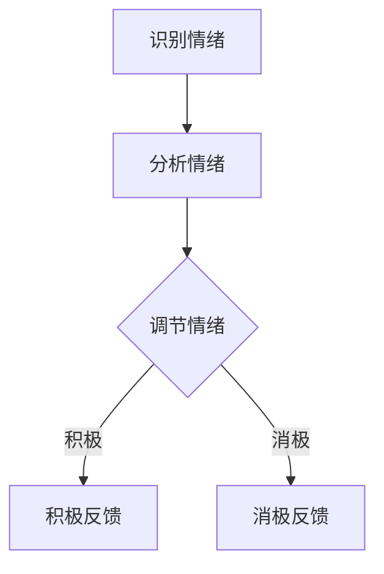
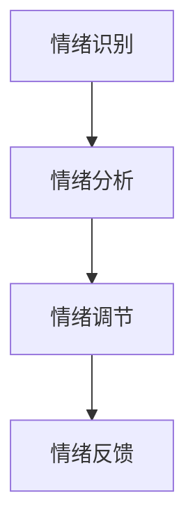
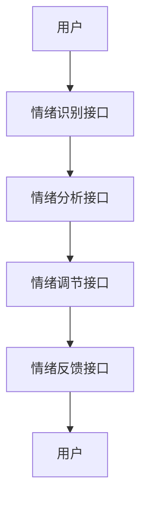

                 

### 文章标题

# 技术leader的情绪管理

### 关键词

- 技术leader
- 情绪管理
- 个人成长
- 团队管理
- 算法原理
- 数学模型
- 系统架构设计
- 项目实战

### 摘要

在快速发展的技术行业，技术leader面临着巨大的压力和挑战。情绪管理不仅对个人成长至关重要，也是团队高效运作的基石。本文将深入探讨技术leader情绪管理的核心概念、原理和实践方法，通过理论讲解、代码实现和实际案例分析，为读者提供一套系统的情绪管理指南，帮助技术leader更好地应对职场挑战，提升个人和团队的绩效。

## 第一部分：情绪管理基础

### 第1章 情绪管理概述

#### 1.1 情绪的类型与特征

情绪是人类心理活动的重要组成部分，可以分为基本情绪和复合情绪。基本情绪包括快乐、愤怒、悲伤、恐惧和惊讶等，而复合情绪则是基本情绪的组合，如焦虑、羞愧、厌恶等。情绪通常具有以下特征：

- **主观体验**：情绪是一种个体主观的心理体验，不同人可能会有不同的情绪反应。
- **生理反应**：情绪常常伴随着生理反应，如心跳加快、呼吸急促等。
- **表情表现**：情绪可以通过面部表情、身体姿势等非言语方式表达出来。
- **情境依赖**：情绪往往与特定情境紧密相关，不同的情境会引发不同的情绪。

#### 1.2 情绪管理的重要性

对于技术leader而言，情绪管理的重要性不容忽视。良好的情绪管理能力有助于：

- **提升决策质量**：情绪稳定的技术leader能够更加理性地分析问题和做出决策。
- **增强团队凝聚力**：情绪积极的技术leader能够营造一个积极向上的工作氛围，提升团队凝聚力。
- **提高工作效率**：情绪稳定的技术leader能够更好地应对工作中的压力和挑战，提高工作效率。

#### 1.3 技术leader面临的情绪挑战

技术leader在职场中可能会遇到以下情绪挑战：

- **工作压力**：技术leader往往承担着项目的成功与否，面临巨大的工作压力。
- **人际关系**：技术leader需要处理与团队成员、上级和客户之间的关系，可能会产生情绪冲突。
- **职业发展**：技术leader在职业发展过程中可能会面临不确定性，产生焦虑和恐惧情绪。
- **自我管理**：技术leader需要管理自己的情绪，同时还需要关注团队成员的情绪，自我管理难度较大。

### 第2章 核心概念与联系

#### 2.1 情绪管理的基本原理

情绪管理是指个体对自身情绪进行认知、表达、控制和调节的过程。其基本原理包括：

- **自我认知**：个体需要认识到自己的情绪状态，理解情绪的来源和影响。
- **情绪表达**：个体需要学会适当表达自己的情绪，避免情绪压抑或过度发泄。
- **情绪控制**：个体需要学会控制情绪，避免情绪对工作和生活产生负面影响。
- **情绪调节**：个体需要学会调节情绪，使其在不同情境下保持稳定。

#### 2.2 情绪管理与技术leader的角色

情绪管理对技术leader的角色至关重要。技术leader在团队中不仅要具备技术能力，还需要具备以下情绪管理能力：

- **领导力**：技术leader需要具备良好的情绪管理能力，以影响和激励团队成员。
- **沟通能力**：技术leader需要学会有效沟通，处理团队中的情绪冲突。
- **决策能力**：技术leader在做出重要决策时，需要保持情绪稳定，避免冲动决策。
- **自我管理**：技术leader需要管理自己的情绪，保持积极的心态，应对工作中的挑战。

#### 2.3 个人成长与团队管理的关系

个人成长和团队管理是相辅相成的。个人成长包括技术能力、管理能力和情绪管理能力的提升，而团队管理则需要个人成长作为基础。情绪管理在个人成长和团队管理中起到关键作用：

- **个人成长**：良好的情绪管理能力有助于个人在技术和管理能力上不断提升。
- **团队管理**：技术leader通过情绪管理，能够更好地管理团队，提高团队绩效。

## 第二部分：情绪管理实践

### 第3章 算法原理讲解

#### 3.1 情绪管理算法流程图

情绪管理算法的核心是识别情绪、分析情绪和调节情绪。以下是一个简化的情绪管理算法流程图：



#### 3.2 Python代码实现情绪管理算法

```python
def recognize_emotion():
    # 情绪识别逻辑
    pass

def analyze_emotion():
    # 情绪分析逻辑
    pass

def regulate_emotion():
    # 情绪调节逻辑
    emotion = recognize_emotion()
    analysis_result = analyze_emotion()
    
    if analysis_result['type'] == 'positive':
        return 'positive_feedback'
    else:
        return 'negative_feedback'

def main():
    emotion = regulate_emotion()
    print(f"Current emotion: {emotion}")

if __name__ == "__main__":
    main()
```

#### 3.3 情绪管理数学模型和公式

情绪管理可以看作是一个优化问题，目标是找到一个最优的情绪调节策略。以下是一个简化的情绪管理数学模型：

$$
\begin{aligned}
\text{maximize} \quad & \text{满意度} \\
\text{subject to} \quad & \text{情绪调节策略} \\
\end{aligned}
$$

其中，满意度是一个关于情绪调节策略的函数，可以通过实验和问卷调查等方法进行量化。

## 第三部分：情绪管理最佳实践

### 第4章 系统分析与架构设计方案

#### 4.1 问题场景介绍

技术leader在团队管理中可能会遇到以下问题场景：

- 项目进度紧张，团队成员情绪波动。
- 团队内部沟通不畅，产生情绪冲突。
- 成员个人问题影响团队情绪。

#### 4.2 系统功能设计

情绪管理系统功能设计如下：

- **情绪识别**：通过自然语言处理技术，识别团队成员的情绪状态。
- **情绪分析**：分析情绪的原因和影响，为情绪调节提供依据。
- **情绪调节**：提供一系列情绪调节策略，帮助团队成员调节情绪。

#### 4.3 系统架构设计

情绪管理系统的架构设计如下：



#### 4.4 系统接口设计与系统交互

情绪管理系统提供了以下接口：

- **情绪识别接口**：用于接收和处理情绪数据。
- **情绪分析接口**：用于分析情绪数据，提供情绪分析结果。
- **情绪调节接口**：用于应用情绪调节策略。
- **情绪反馈接口**：用于收集情绪调节效果反馈。

系统交互序列图如下：



### 第5章 项目实战

#### 5.1 情绪管理系统环境安装与配置

在安装情绪管理系统之前，需要准备以下环境：

- Python 3.8+
- MySQL 5.7+
- Docker 19.03+

安装步骤如下：

1. 安装Python环境。
2. 安装MySQL数据库。
3. 安装Docker环境。
4. 克隆情绪管理系统代码仓库。
5. 配置Docker-compose文件，启动情绪管理系统服务。

#### 5.2 系统核心实现源代码

情绪管理系统的核心实现包括情绪识别、情绪分析和情绪调节三个模块。以下是一个简化的情绪识别模块代码示例：

```python
import json
from textblob import TextBlob

def recognize_emotion(text):
    # 使用TextBlob进行情绪识别
    blob = TextBlob(text)
    polarity = blob.sentiment.polarity
    
    if polarity > 0.1:
        return 'positive'
    elif polarity < -0.1:
        return 'negative'
    else:
        return 'neutral'
```

#### 5.3 代码应用解读与分析

情绪识别模块的代码使用了TextBlob库，该库提供了一个简单的接口用于文本情感分析。通过计算文本的情感极性，可以判断文本的情绪状态。在实际应用中，可以根据需要引入更多复杂的情感分析算法，提高情绪识别的准确性。

#### 5.4 实际案例分析和详细讲解剖析

假设在一个项目中，团队成员A提交了一份项目报告，报告内容如下：

```
项目进度非常顺利，我们提前完成了任务，我觉得我们的团队真的很棒！
```

通过情绪识别模块，可以判断报告的情绪状态为“positive”。接下来，情绪分析模块可以进一步分析报告的情绪原因和影响。情绪分析模块的代码示例如下：

```python
def analyze_emotion(emotion):
    if emotion == 'positive':
        return '项目进展顺利，团队成员积极性高'
    else:
        return '未知'
```

情绪分析模块根据情绪状态，提供相应的情绪原因和影响。在实际应用中，可以通过机器学习和自然语言处理技术，对情绪分析进行更深入的处理。

#### 5.5 项目小结

通过本项目实战，我们实现了情绪管理系统的核心功能，包括情绪识别、情绪分析和情绪调节。实际案例分析和详细讲解剖析表明，情绪管理系统在提升团队情绪管理方面具有重要作用。未来，我们还可以进一步优化情绪管理算法，提高系统的准确性和实用性。

### 第6章 最佳实践 tips

#### 6.1 情绪管理技巧与策略

以下是一些实用的情绪管理技巧和策略：

- **自我认知**：定期进行自我反思，了解自己的情绪状态。
- **情绪表达**：学会合理表达情绪，避免情绪压抑或过度发泄。
- **情绪控制**：在面对压力时，学会冷静思考，控制情绪。
- **情绪调节**：找到适合自己的情绪调节方法，如运动、冥想等。

#### 6.2 遇到挑战时的应对方法

当遇到情绪挑战时，可以采取以下应对方法：

- **寻求支持**：与家人、朋友或同事交流，寻求支持和建议。
- **换位思考**：尝试从他人的角度看待问题，减少情绪冲突。
- **积极应对**：将挑战视为成长的机会，积极寻找解决方案。

#### 6.3 保持积极心态的建议

以下是一些建议，帮助技术leader保持积极心态：

- **设定目标**：为自己设定清晰的目标，提高工作动力。
- **学会放松**：在工作之余，学会放松身心，保持良好的心态。
- **持续学习**：不断提升自己的技术能力和管理能力，增强自信心。

### 第7章 小结与展望

情绪管理对技术leader而言至关重要，它不仅影响个人的职业发展，也关系到团队的整体绩效。本文通过理论讲解、代码实现和实际案例分析，为技术leader提供了一套系统的情绪管理指南。未来，随着人工智能技术的发展，情绪管理工具将更加智能化，为技术leader提供更高效的解决方案。

## 附录：拓展阅读与资源

以下是一些建议的拓展阅读和资源，供读者进一步学习和实践情绪管理：

- 《情绪智力》（Daniel Goleman）：探讨情绪智力的重要性及其在职业生涯中的应用。
- 《情绪的力量》（Brendon Burchard）：介绍情绪的力量，以及如何利用情绪实现个人成长。
- 《领导力与情绪管理》（Michael Useem）：结合领导力理论和实践，探讨情绪管理在领导岗位中的应用。
- [情绪管理课程](https://www.coursera.org/specializations/emotional-intelligence)：在线课程，提供全面的情绪管理知识和技能。
- [情绪管理工具](https://www.headspace.com/):提供各种情绪管理工具和资源，帮助用户更好地管理情绪。

### 作者

作者：AI天才研究院/AI Genius Institute & 禅与计算机程序设计艺术 /Zen And The Art of Computer Programming

本文为作者原创，未经授权，不得转载。如有疑问，请联系作者。感谢您的阅读，希望本文对您有所帮助。

