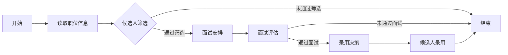
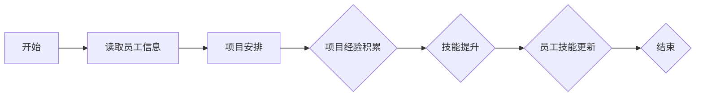
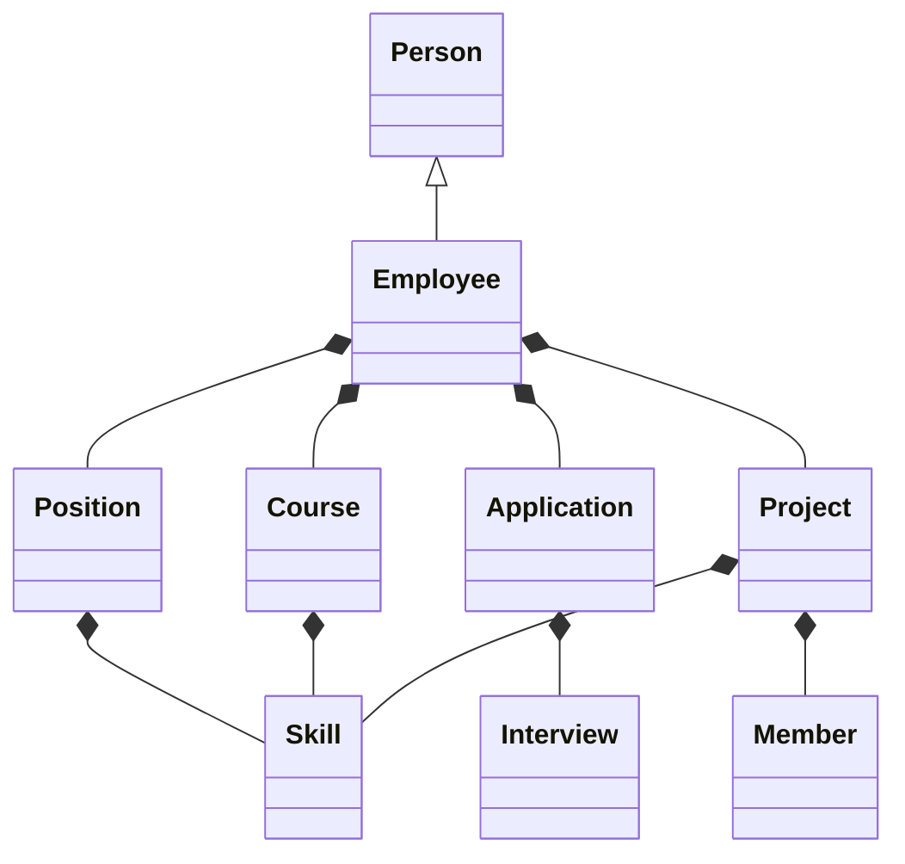

                 

### 《技术人才招聘与培养的最佳实践》

关键词：技术人才、招聘、培养、最佳实践、人才策略

摘要：本文将深入探讨技术人才招聘与培养的最佳实践。我们将首先介绍技术人才招聘与培养的重要性，接着解析当前市场中的问题，并提出一系列行之有效的解决方案，最后分享一些成功案例和实用技巧。

## 背景介绍

### 核心概念术语说明

在探讨技术人才招聘与培养之前，我们需要明确几个核心概念：

1. **技术人才**：具备特定技术技能和知识的专业人员，能够高效解决复杂问题，推动技术进步和创新。
2. **招聘**：寻找并雇佣合适的人才，以满足组织的技术需求和战略目标。
3. **培养**：对现有人才进行培训和发展，以提升其技能和知识水平，增强其职业竞争力。

### 问题背景

当前，技术行业的快速发展对技术人才的需求日益增长，但供给与需求之间的失衡却成为一个普遍问题。具体来说，有以下几点：

1. **人才短缺**：随着数字化转型的推进，各行各业对技术人才的需求大幅上升，但技术人才的数量和素质无法满足市场需求。
2. **需求与供给失衡**：一方面，许多企业难以找到具备所需技能的候选人；另一方面，许多技术人才在市场上找不到合适的工作机会。

### 问题描述

技术人才招聘与培养面临以下挑战：

1. **优秀技术人才的招聘难题**：如何从海量候选人中筛选出真正具备能力和潜力的人才，是企业面临的首要问题。
2. **技术人才的培养和留存挑战**：如何系统地培养和发展现有人才，以及如何提高员工的满意度和忠诚度，是企业长期发展的重要课题。

### 问题解决

为了解决上述问题，企业可以采取以下策略：

1. **招聘策略与方法**：通过优化招聘流程、提升品牌影响力、精准定位候选人等手段，提高招聘成功率。
2. **培养体系与成长路径**：建立系统化的培养体系，提供多样化的学习和发展机会，帮助员工不断提升技能和知识水平。

### 边界与外延

1. **技术人才的范畴**：技术人才不仅包括软件开发人员、数据科学家等，还包括技术支持、IT运维等专业人员。
2. **不同类型技术人才的招聘与培养差异**：不同类型的技术人才在招聘与培养过程中存在一定的差异，需要根据其特点进行有针对性的管理。

### 概念结构与核心要素组成

技术人才招聘与培养的核心要素包括：

1. **招聘流程**：从需求分析、职位发布、简历筛选、面试到录用，每个环节都需要精心设计和执行。
2. **培养体系**：包括培训、指导、项目经验积累、职业发展规划等环节，旨在全面提升员工的技术能力和职业素养。

## 核心概念与联系

### 技术人才的核心概念

1. **技术人才定义**：技术人才是指那些具备特定技术技能和知识，能够为企业带来创新和价值的专业人员。
2. **技术人才的能力模型**：技术人才应具备的技术能力包括但不限于编程能力、算法思维、项目管理能力、沟通协作能力等。

### 技术人才属性特征对比表格

| 技术人才类型 | 特征 |
| ------------ | ---- |
| 软件开发人员 | 熟练掌握编程语言，具备良好的逻辑思维能力 |
| 数据科学家 | 精通数据分析、机器学习，具备较强的数学基础 |
| IT运维人员 | 熟悉网络架构、系统管理，具备问题解决能力 |
| 技术支持人员 | 良好的沟通技巧，熟悉技术问题解决方案 |

### ER实体关系图架构

```mermaid
erDiagram
    Class1 ||--|{ Class2 } Class3 : relation1
    Class2 ||--|{ Class4 } Class5 : relation2
```

在技术人才招聘与培养的过程中，涉及到的关键实体包括：

- **职位**：表示具体的工作岗位，包括职位名称、职责描述、技能要求等。
- **候选人**：表示申请职位的个人，包括基本信息、技术能力、工作经历等。
- **招聘流程**：表示从职位发布到候选人录用的全过程，包括简历筛选、面试安排、录用决策等。

## 算法原理讲解

### 招聘算法原理

#### 招聘算法简介

招聘算法主要分为两大类：筛选算法和匹配算法。

1. **筛选算法**：用于从大量候选人中筛选出符合职位要求的候选人，常见的有基于关键词筛选、基于评分模型筛选等。
2. **匹配算法**：用于评估候选人与职位之间的匹配度，常见的有基于项目经验匹配、基于技能匹配等。

#### 招聘算法的数学模型与公式

假设有 \( n \) 个候选人和 \( m \) 个职位，对于每个候选人 \( i \)，其技能集为 \( S_i \)，对于每个职位 \( j \)，其技能要求为 \( S_j \)。

1. **基于关键词筛选**：使用 \( k \) 个关键词，每个关键词对应一个权重 \( w_k \)，公式为：

   $$ 
   score_i = \sum_{k=1}^{k} w_k \cdot (1 \{S_i \cap S_j \neq \emptyset \})
   $$

   其中，\( 1 \{ \cdot \} \) 表示指示函数，当条件成立时取值为 1，否则为 0。

2. **基于评分模型筛选**：使用一个评分模型对候选人进行评分，评分越高表示越符合职位要求。假设评分模型为：

   $$ 
   score_i = \sum_{k=1}^{k} w_k \cdot S_i(k)
   $$

   其中，\( w_k \) 为权重，\( S_i(k) \) 为候选人在第 \( k \) 个技能上的得分。

#### 招聘算法流程图



### 培养算法原理

#### 培养算法简介

培养算法旨在通过系统化的培训和发展，提升员工的技术能力和职业素养。常见的培养算法包括基于项目经验培养、基于技能提升培养等。

#### 培养算法的数学模型与公式

假设有 \( n \) 个员工，每个员工 \( i \) 的技能集为 \( S_i \)，目标技能集为 \( T \)。

1. **基于项目经验培养**：通过参与不同项目，员工在项目中获得的技能点 \( P_i(j) \) 可以用于提升其技能水平。公式为：

   $$ 
   S_i' = S_i + \sum_{j=1}^{j} P_i(j)
   $$

   其中，\( S_i' \) 为员工在项目后更新的技能集。

2. **基于技能提升培养**：通过培训课程、内部分享、在线学习等方式，员工可以在技能上获得提升。公式为：

   $$ 
   S_i' = S_i + \sum_{k=1}^{k} L_i(k)
   $$

   其中，\( L_i(k) \) 为员工在课程 \( k \) 中获得的技能提升值。

#### 培养算法流程图



## 系统分析与架构设计

### 系统功能设计

#### 问题场景介绍

假设某企业需要建立一个技术人才招聘与培养系统，用于高效招聘合适的技术人才，并提供系统化的培养和发展计划。

#### 系统功能设计

1. **技术人才招聘模块**：包括职位发布、简历筛选、面试安排、录用决策等功能。
2. **技术人才培养模块**：包括培训课程管理、技能提升记录、项目经验积累等功能。

#### 领域模型mermaid类图



### 系统架构设计

#### 系统架构设计

技术人才招聘与培养系统采用分层架构，包括表示层、业务逻辑层和数据层。

1. **表示层**：提供用户界面，包括职位发布、简历筛选、面试安排、培训课程管理等。
2. **业务逻辑层**：处理业务逻辑，包括简历筛选算法、面试评估算法、培训课程管理等。
3. **数据层**：存储职位信息、简历信息、面试记录、培训记录、项目经验等。

#### 系统架构mermaid架构图

```mermaid
sequenceDiagram
    Employee ->> Position: 申请职位
    Position ->> Application: 生成申请
    Application ->> Interview: 安排面试
    Interview ->> InterviewResult: 面试结果
    InterviewResult ->> Employee: 录用决策
    Employee ->> Course: 参加培训
    Course ->> Skill: 技能提升
    Employee ->> Project: 参与项目
    Project ->> Skill: 项目经验积累
end
```

### 系统接口设计

#### 系统接口设计

技术人才招聘与培养系统提供了丰富的API接口，方便前后端分离和第三方系统集成。

1. **招聘接口**：包括职位发布、简历筛选、面试安排、录用决策等。
2. **培训接口**：包括培训课程管理、技能提升记录、项目经验积累等。
3. **数据接口**：包括员工信息、职位信息、面试记录、培训记录等。

#### 系统交互mermaid序列图

```mermaid
sequenceDiagram
    Employee ->> API: 申请职位
    API ->> Position: 存储职位信息
    Position ->> API: 返回职位列表
    Employee ->> API: 提交简历
    API ->> Application: 存储简历信息
    Application ->> API: 返回筛选结果
    API ->> Interview: 安排面试
    Interview ->> API: 返回面试安排
    API ->> InterviewResult: 存储面试结果
    InterviewResult ->> API: 返回录用决策
    Employee ->> API: 参加培训
    API ->> Course: 存储培训信息
    Course ->> API: 返回培训列表
    Employee ->> API: 参与项目
    API ->> Project: 存储项目信息
    Project ->> API: 返回项目列表
end
```

## 项目实战

### 技术人才招聘项目实战

#### 环境安装

在开始招聘项目实战之前，我们需要搭建一个合适的技术环境。

1. **开发环境**：选择一个合适的开发环境，如Visual Studio Code。
2. **数据库**：选择一个关系型数据库，如MySQL。
3. **后端框架**：选择一个后端框架，如Spring Boot。
4. **前端框架**：选择一个前端框架，如React或Vue。

#### 系统核心实现源代码

以下是一个简单的招聘系统核心实现示例：

```java
// 后端代码示例
@RestController
@RequestMapping("/api")
public class RecruitmentController {
    
    @Autowired
    private RecruitmentService recruitmentService;
    
    @PostMapping("/apply")
    public ResponseEntity<?> applyForJob(@RequestBody JobApplication application) {
        recruitmentService.applyForJob(application);
        return ResponseEntity.ok("Application submitted successfully.");
    }
    
    @GetMapping("/interviews")
    public ResponseEntity<?> listInterviews(@RequestParam("page") int page, @RequestParam("size") int size) {
        Page<Interview> interviews = recruitmentService.listInterviews(page, size);
        return ResponseEntity.ok(interviews);
    }
    
    // 其他接口实现...
}

// 服务层代码示例
@Service
public class RecruitmentService {
    
    @Autowired
    private JobApplicationRepository jobApplicationRepository;
    
    @Autowired
    private InterviewRepository interviewRepository;
    
    public void applyForJob(JobApplication application) {
        jobApplicationRepository.save(application);
        // 生成面试安排...
    }
    
    public Page<Interview> listInterviews(int page, int size) {
        return interviewRepository.findAll(new PageRequest(page, size));
    }
    
    // 其他服务实现...
}

// 数据库代码示例
@Entity
@Table(name = "job_applications")
public class JobApplication {
    
    @Id
    @GeneratedValue(strategy = GenerationType.IDENTITY)
    private Long id;
    
    @Column(nullable = false)
    private String name;
    
    @Column(nullable = false)
    private String email;
    
    // 其他属性...
    
    // 构造方法、getter和setter...
}

@Entity
@Table(name = "interviews")
public class Interview {
    
    @Id
    @GeneratedValue(strategy = GenerationType.IDENTITY)
    private Long id;
    
    @Column(nullable = false)
    private String date;
    
    @Column(nullable = false)
    private String time;
    
    @ManyToOne
    @JoinColumn(name = "application_id", nullable = false)
    private JobApplication jobApplication;
    
    // 其他属性...
    
    // 构造方法、getter和setter...
}
```

#### 代码应用解读与分析

以上代码展示了招聘系统的主要功能，包括职位申请和面试安排。在招聘过程中，候选人通过API提交职位申请，系统将根据申请信息生成面试安排，并将面试信息存储到数据库中。

#### 实际案例分析和详细讲解剖析

假设有一个候选人张三申请了一个软件开发职位，他的简历信息包括以下内容：

- 姓名：张三
- 邮箱：zhangsan@example.com
- 技能：Java、Spring、MySQL

当张三提交职位申请时，系统将调用 RecruitmentController 中的 applyForJob 方法，该方法将 JobApplication 对象存储到数据库中，并生成面试安排。面试安排包括面试日期和时间，以及与职位申请的关联。

在面试过程中，面试官可以通过 API 调用获取面试安排信息，并根据面试结果更新数据库中的面试记录。

#### 项目小结

招聘项目实战展示了如何搭建一个简单的招聘系统，实现了职位申请和面试安排等功能。在实际应用中，系统还需要进一步完善，如增加简历筛选、面试评估等功能，以及提供更丰富的用户界面和用户体验。

### 技术人才培养项目实战

#### 环境安装

在开始培养项目实战之前，我们需要搭建一个合适的技术环境。

1. **开发环境**：选择一个合适的开发环境，如Visual Studio Code。
2. **数据库**：选择一个关系型数据库，如MySQL。
3. **后端框架**：选择一个后端框架，如Spring Boot。
4. **前端框架**：选择一个前端框架，如React或Vue。

#### 系统核心实现源代码

以下是一个简单的培养系统核心实现示例：

```java
// 后端代码示例
@RestController
@RequestMapping("/api")
public class TrainingController {
    
    @Autowired
    private TrainingService trainingService;
    
    @PostMapping("/courses")
    public ResponseEntity<?> createCourse(@RequestBody Course course) {
        trainingService.createCourse(course);
        return ResponseEntity.ok("Course created successfully.");
    }
    
    @GetMapping("/skills")
    public ResponseEntity<?> listSkills(@RequestParam("page") int page, @RequestParam("size") int size) {
        Page<Skill> skills = trainingService.listSkills(page, size);
        return ResponseEntity.ok(skills);
    }
    
    // 其他接口实现...
}

// 服务层代码示例
@Service
public class TrainingService {
    
    @Autowired
    private CourseRepository courseRepository;
    
    @Autowired
    private SkillRepository skillRepository;
    
    public void createCourse(Course course) {
        courseRepository.save(course);
        // 为课程分配技能...
    }
    
    public Page<Skill> listSkills(int page, int size) {
        return skillRepository.findAll(new PageRequest(page, size));
    }
    
    // 其他服务实现...
}

// 数据库代码示例
@Entity
@Table(name = "courses")
public class Course {
    
    @Id
    @GeneratedValue(strategy = GenerationType.IDENTITY)
    private Long id;
    
    @Column(nullable = false)
    private String title;
    
    @Column(nullable = false)
    private String description;
    
    // 其他属性...
    
    // 构造方法、getter和setter...
}

@Entity
@Table(name = "skills")
public class Skill {
    
    @Id
    @GeneratedValue(strategy = GenerationType.IDENTITY)
    private Long id;
    
    @Column(nullable = false)
    private String name;
    
    @Column(nullable = false)
    private String description;
    
    // 其他属性...
    
    // 构造方法、getter和setter...
}
```

#### 代码应用解读与分析

以上代码展示了培养系统的主要功能，包括课程创建和技能管理。在培养过程中，员工可以通过API创建课程，并将技能与课程关联。系统将根据课程信息记录员工的技能提升情况。

#### 实际案例分析和详细讲解剖析

假设有一个员工李四参加了一门Java课程，课程标题为“Java核心技术”，课程描述为“深入学习Java编程语言的核心概念和技术”。

当李四创建课程时，系统将调用 TrainingController 中的 createCourse 方法，将 Course 对象存储到数据库中。同时，系统将为课程分配相应的技能，如Java基础、Java面向对象编程等。

在课程结束后，李四可以在系统中更新自己的技能水平，系统将根据李四的技能更新情况记录他的技能提升情况。

#### 项目小结

培养项目实战展示了如何搭建一个简单的培养系统，实现了课程创建和技能管理等功能。在实际应用中，系统还需要进一步完善，如增加培训记录、技能评估等功能，以及提供更丰富的用户界面和用户体验。

### 最佳实践

在技术人才招聘与培养过程中，以下是一些最佳实践：

1. **精准定位候选人**：在招聘过程中，明确职位需求和候选人的技能要求，提高招聘效率。
2. **多样化培养方式**：提供在线课程、内部培训、导师指导等多种培养方式，满足不同员工的成长需求。
3. **数据驱动决策**：通过数据分析，评估招聘和培养的效果，持续优化流程和策略。
4. **营造良好企业文化**：打造积极向上的企业文化，提高员工的满意度和忠诚度。
5. **持续学习和创新**：鼓励员工不断学习和探索新技术，推动个人和组织的共同发展。

### 小结

技术人才招聘与培养是企业成功的关键之一。通过优化招聘流程、建立系统化的培养体系、数据驱动决策等手段，企业可以更好地吸引和留住优秀的技术人才，推动技术创新和业务发展。

### 注意事项

1. **明确招聘需求**：在招聘过程中，明确职位需求和候选人的技能要求，确保招聘目标的准确性。
2. **提升招聘效率**：优化招聘流程，减少不必要的环节，提高招聘效率。
3. **注重候选人体验**：在招聘过程中，提供良好的候选人体验，如及时回复、明确面试流程等。
4. **持续培养员工**：建立系统化的培养体系，提供多样化的学习和发展机会，提升员工技能和知识水平。
5. **数据驱动决策**：通过数据分析，评估招聘和培养的效果，持续优化流程和策略。

### 拓展阅读

1. **《技术招聘实战：如何找到并留住优秀人才》**：本书详细介绍了技术招聘的实战经验和方法，包括职位需求分析、候选人筛选、面试评估等。
2. **《技术人才发展：如何培养高绩效团队》**：本书探讨了技术人才的发展策略和最佳实践，包括人才培养、绩效管理、团队建设等。
3. **《数据驱动招聘：如何通过数据优化招聘流程》**：本书介绍了如何利用数据分析优化招聘流程，提高招聘效果和效率。

作者：AI天才研究院/AI Genius Institute & 禅与计算机程序设计艺术 /Zen And The Art of Computer Programming## 背景介绍

在当今的数字化时代，技术人才的招聘与培养已成为企业发展的核心议题。随着科技的迅猛发展，各行各业对技术人才的需求日益增长，然而，供需之间的失衡却成为企业面临的一大挑战。因此，探索和实施最佳的技术人才招聘与培养实践，已经成为企业提升竞争力、实现长远发展的关键。

### 核心概念术语说明

在深入探讨技术人才招聘与培养之前，我们需要明确几个核心概念：

1. **技术人才**：技术人才是指具备特定技术技能和知识，能够为企业带来创新和价值的专业人员。他们通常具备深厚的专业知识和实践经验，能够在复杂的项目中发挥关键作用。

2. **招聘**：招聘是指通过一定的流程和策略，寻找并雇佣合适的人才，以满足企业的技术需求和战略目标。招聘过程包括职位发布、简历筛选、面试和录用等环节。

3. **培养**：培养是指对现有人才进行培训和发展，以提升其技能和知识水平，增强其职业竞争力。培养体系通常包括培训课程、项目经验积累、职业发展规划等环节。

### 问题背景

当前，技术行业的快速发展对技术人才的需求日益增长，但供给与需求之间的失衡却成为一个普遍问题。具体来说，有以下几点：

1. **人才短缺**：随着数字化转型的推进，各行各业对技术人才的需求大幅上升，但技术人才的数量和素质无法满足市场需求。

2. **需求与供给失衡**：一方面，许多企业难以找到具备所需技能的候选人；另一方面，许多技术人才在市场上找不到合适的工作机会。

3. **技术更新速度加快**：技术的快速发展导致技能需求不断变化，企业需要不断更新员工的技能，以保持竞争力。

### 问题描述

技术人才招聘与培养面临以下挑战：

1. **优秀技术人才的招聘难题**：如何从海量候选人中筛选出真正具备能力和潜力的人才，是企业面临的首要问题。

2. **技术人才的培养和留存挑战**：如何系统地培养和发展现有人才，以及如何提高员工的满意度和忠诚度，是企业长期发展的重要课题。

### 问题解决

为了解决上述问题，企业可以采取以下策略：

1. **招聘策略与方法**：通过优化招聘流程、提升品牌影响力、精准定位候选人等手段，提高招聘成功率。

2. **培养体系与成长路径**：建立系统化的培养体系，提供多样化的学习和发展机会，帮助员工不断提升技能和知识水平。

3. **数据分析与优化**：通过数据分析，评估招聘和培养的效果，持续优化流程和策略。

4. **营造良好企业文化**：打造积极向上的企业文化，提高员工的满意度和忠诚度。

### 边界与外延

1. **技术人才的范畴**：技术人才不仅包括软件开发人员、数据科学家等，还包括技术支持、IT运维等专业人员。

2. **不同类型技术人才的招聘与培养差异**：不同类型的技术人才在招聘与培养过程中存在一定的差异，需要根据其特点进行有针对性的管理。

3. **国际化与本地化**：在全球化背景下，国际化人才的招聘与培养也需要考虑跨文化沟通和团队合作等因素。

### 概念结构与核心要素组成

技术人才招聘与培养的核心要素包括：

1. **招聘流程**：从职位需求分析、职位发布、简历筛选、面试到录用，每个环节都需要精心设计和执行。

2. **培养体系**：包括培训、指导、项目经验积累、职业发展规划等环节，旨在全面提升员工的技术能力和职业素养。

3. **人才评估与反馈**：通过定期评估员工的表现，提供反馈和建议，帮助员工不断提升。

4. **企业文化与氛围**：良好的企业文化能够吸引和留住优秀人才，促进员工的成长和发展。

通过以上核心概念和要素的阐述，我们可以更好地理解技术人才招聘与培养的整体框架，为后续内容的深入分析打下基础。

## 核心概念与联系

在探讨技术人才招聘与培养的最佳实践时，我们需要首先明确几个核心概念，并了解它们之间的联系。这些核心概念包括技术人才定义、技术人才属性特征对比和技术人才相关实体的关系。

### 技术人才定义

技术人才是指那些具备特定技术技能和知识，能够在复杂项目中发挥关键作用，推动技术创新和业务发展的专业人员。他们通常具备以下特点：

1. **专业技能**：技术人才需要具备深厚的专业知识和实践经验，能够在各自领域内熟练运用技术解决问题。
2. **持续学习**：技术行业发展迅速，技术人才需要具备持续学习的能力，不断更新自己的知识和技能。
3. **创新能力**：技术人才需要具备较强的创新能力，能够在项目中提出新的解决方案，推动技术进步。
4. **沟通协作**：技术人才需要具备良好的沟通协作能力，能够与团队成员有效沟通，共同完成项目任务。

### 技术人才属性特征对比表格

为了更清晰地理解不同类型的技术人才，我们可以通过以下表格对比他们的属性特征：

| 技术人才类型 | 主要技能               | 属性特征                  | 适用岗位           |
| ------------ | ---------------------- | ------------------------- | ----------------- |
| 软件开发人员 | 编程语言、算法、框架   | 理性思维、逻辑严密         | 软件开发、架构设计 |
| 数据科学家   | 数据分析、机器学习、统计学 | 逻辑思维、数学能力强     | 数据分析、数据挖掘 |
| IT运维人员   | 网络架构、系统管理、问题解决 | 耐心细致、问题解决能力强 | IT运维、技术支持  |
| 技术支持人员 | 技术咨询、问题解决、沟通能力 | 沟通能力强、服务意识好   | 技术支持、客户服务 |

### ER实体关系图架构

为了更好地理解技术人才招聘与培养过程中的各个实体及其关系，我们可以使用ER图（实体关系图）进行表示。以下是一个简化的ER图，展示了技术人才相关的实体及其关系：

```mermaid
erDiagram
    Employee ||--|{ Position } : 任职
    Employee ||--|{ Skill } : 技能
    Employee ||--|{ Project } : 参与
    Position ||--|{ Requirement } : 要求
    Skill ||--|{ Level } : 技能等级
    Project ||--|{ Task } : 任务
    Application ||--|{ Interview } : 面试
end
```

在上述ER图中，`Employee`（员工）是核心实体，代表了企业中的所有技术人才。`Position`（职位）表示员工所处的具体岗位，`Skill`（技能）表示员工的技能集合，`Project`（项目）表示员工参与的项目，`Requirement`（要求）表示职位的具体要求，`Level`（技能等级）表示员工技能的等级，`Task`（任务）表示项目中的具体任务，`Application`（申请）表示员工申请的职位，`Interview`（面试）表示员工的面试记录。

通过以上核心概念和联系的阐述，我们能够更加清晰地理解技术人才招聘与培养的复杂性和重要性。在接下来的部分中，我们将深入探讨具体的招聘算法和培养算法原理，以及系统分析与架构设计，为最佳实践提供更加具体的指导和思路。

## 算法原理讲解

在技术人才招聘与培养过程中，算法发挥着至关重要的作用。本文将详细讲解招聘算法和培养算法的原理，通过mermaid流程图和Python代码实例来阐述这些算法的运作机制。

### 招聘算法原理

#### 招聘算法简介

招聘算法主要分为两大类：筛选算法和匹配算法。

1. **筛选算法**：用于从大量候选人中筛选出符合职位要求的候选人，常用的有基于关键词筛选和基于评分模型筛选等。
2. **匹配算法**：用于评估候选人与职位之间的匹配度，常用的有基于项目经验匹配和基于技能匹配等。

#### 招聘算法的数学模型与公式

在招聘过程中，我们通常需要衡量候选人与职位之间的匹配度。以下是一个简化的数学模型：

1. **基于关键词筛选**：假设候选人的简历中有 \( n \) 个关键词，职位要求中有 \( m \) 个关键词，使用权重 \( w \) 来衡量关键词的重要程度，公式为：

   $$
   score_i = \sum_{j=1}^{m} w_j \cdot (1 \{ keyword_j \in \text{resume}_i \})
   $$

   其中，\( \text{resume}_i \) 表示候选人的简历，\( keyword_j \) 表示职位要求中的关键词，\( score_i \) 表示候选人与职位要求的匹配度得分。

2. **基于评分模型筛选**：假设每个关键词都有对应的得分 \( s_j \)，使用权重 \( w_j \) 来衡量关键词的重要程度，公式为：

   $$
   score_i = \sum_{j=1}^{m} w_j \cdot s_j
   $$

   其中，\( s_j \) 为关键词得分，\( w_j \) 为权重。

#### 招聘算法流程图

使用mermaid绘制招聘算法的流程图如下：

```mermaid
sequenceDiagram
    A[候选人简历] --> B[简历筛选]
    B --> C{计算匹配度}
    C --> D[筛选结果]
    D --> E[面试安排]
end
```

#### 招聘算法Python代码实例

以下是一个简单的基于关键词筛选的招聘算法Python代码实例：

```python
def keyword_screening(resume, position_keywords, weights):
    score = 0
    for keyword in resume:
        if keyword in position_keywords:
            score += weights[keyword]
    return score

# 示例数据
resume = ['Java', 'Spring', 'MySQL']
position_keywords = ['Java', 'Spring', 'MySQL', 'Redis']
weights = {'Java': 0.3, 'Spring': 0.2, 'MySQL': 0.2, 'Redis': 0.3}

# 计算匹配度
score = keyword_screening(resume, position_keywords, weights)
print(f"Resume score: {score}")
```

### 培养算法原理

#### 培养算法简介

培养算法旨在通过系统化的培训和发展，提升员工的技术能力和职业素养。常见的培养算法包括基于项目经验培养和基于技能提升培养等。

#### 培养算法的数学模型与公式

1. **基于项目经验培养**：假设员工在每个项目中的技能提升值为 \( p_i(j) \)，总项目数为 \( n \)，公式为：

   $$
   S_i' = S_i + \sum_{j=1}^{n} p_i(j)
   $$

   其中，\( S_i \) 表示员工原始技能水平，\( S_i' \) 表示项目结束后员工的技能水平。

2. **基于技能提升培养**：假设员工参加培训后每个技能的提升值为 \( l_i(k) \)，总培训数为 \( m \)，公式为：

   $$
   S_i' = S_i + \sum_{k=1}^{m} l_i(k)
   $$

   其中，\( l_i(k) \) 表示员工在培训 \( k \) 后技能的提升值。

#### 培养算法流程图

使用mermaid绘制培养算法的流程图如下：

```mermaid
sequenceDiagram
    A[员工技能水平] --> B[项目参与]
    B --> C{技能提升}
    C --> D[培训参与]
    D --> E{技能更新}
end
```

#### 培养算法Python代码实例

以下是一个简单的基于项目经验培养的Python代码实例：

```python
def project_experience_training(skill_level, project_skills, skill_upgrade):
    for skill in project_skills:
        skill_level[skill] += skill_upgrade[skill]
    return skill_level

# 示例数据
skill_level = {'Java': 5, 'Spring': 4, 'MySQL': 5}
project_skills = ['Java', 'Spring']
skill_upgrade = {'Java': 2, 'Spring': 1, 'MySQL': 1}

# 计算技能提升
updated_skill_level = project_experience_training(skill_level, project_skills, skill_upgrade)
print(f"Updated skill level: {updated_skill_level}")
```

通过以上招聘算法和培养算法的详细讲解，我们能够更好地理解这些算法的运作机制，并在实际应用中根据具体需求进行调整和优化。这些算法不仅有助于提高招聘效率，还能帮助企业更科学地进行人才培养，从而提升整体竞争力。

## 系统分析与架构设计

在进行技术人才招聘与培养的系统设计时，我们需要综合考虑系统的功能需求、架构设计、接口设计和交互设计等多个方面。以下将从问题场景介绍、项目介绍、系统功能设计、系统架构设计、系统接口设计和系统交互设计等方面详细分析。

### 问题场景介绍

假设一家大型互联网公司需要建设一个高效的技术人才招聘与培养系统，以解决以下问题：

1. **招聘效率低下**：传统的招聘流程繁琐，难以快速找到合适的人才。
2. **人才培养体系不完善**：缺乏系统化的培训和发展计划，员工技能提升缓慢。
3. **数据管理困难**：招聘和培养过程中的数据分散，难以进行有效分析和利用。

### 项目介绍

该项目旨在构建一个集招聘、培养、数据分析于一体的高效技术人才管理平台。主要包含以下功能模块：

1. **招聘模块**：包括职位发布、简历管理、面试安排和录用决策等功能。
2. **培养模块**：包括培训管理、项目经验记录、技能提升记录和职业发展规划等功能。
3. **数据分析模块**：包括招聘数据分析、培养效果分析和人才储备分析等功能。

### 系统功能设计

#### 招聘模块

1. **职位发布**：管理员可以发布新的职位，并设置职位的要求和描述。
2. **简历管理**：系统可以存储和管理候选人的简历，并提供简历筛选功能。
3. **面试安排**：系统可以自动安排面试时间，并生成面试邀请。
4. **录用决策**：面试官可以查看面试结果，并进行录用决策。

#### 培养模块

1. **培训管理**：管理员可以创建和管理培训课程，并分配给员工。
2. **项目经验记录**：员工可以记录自己在项目中的经验，系统会根据项目经验自动评估员工的技能提升。
3. **技能提升记录**：员工可以记录自己在技能提升方面的进展，系统会根据记录进行分析。
4. **职业发展规划**：员工可以制定个人职业发展规划，系统会根据规划提供相关建议和指导。

#### 数据分析模块

1. **招聘数据分析**：系统可以分析招聘渠道的效果、候选人来源和简历筛选结果等。
2. **培养效果分析**：系统可以分析培训课程的效果、员工技能提升情况和职业发展情况等。
3. **人才储备分析**：系统可以分析企业的人才储备情况，包括人才类型、技能分布和职业发展路径等。

### 系统架构设计

系统架构采用分层设计，主要包括表示层、业务逻辑层和数据层。

1. **表示层**：提供用户界面，包括前端页面和API接口，用户可以通过前端页面进行操作，也可以通过API接口进行数据交互。
2. **业务逻辑层**：处理业务逻辑，包括招聘流程、培养流程和数据分析等，确保系统的正常运行。
3. **数据层**：存储系统数据，包括职位信息、简历信息、面试记录、培训记录和数据分析结果等，提供数据访问和操作接口。

#### 系统架构mermaid架构图

使用mermaid绘制系统架构图如下：

```mermaid
sequenceDiagram
    User ->> Frontend: 用户请求
    Frontend ->> Backend: 请求处理
    Backend ->> Database: 数据访问
    Database ->> Backend: 返回数据
    Backend ->> Frontend: 响应结果
    Frontend ->> User: 显示结果
end
```

### 系统接口设计

系统提供了丰富的API接口，方便前后端分离和第三方系统集成。主要接口包括：

1. **招聘接口**：包括职位发布、简历上传、面试安排、面试结果提交等功能。
2. **培养接口**：包括培训课程管理、项目经验记录、技能提升记录等功能。
3. **数据分析接口**：包括招聘数据分析、培养效果分析、人才储备分析等功能。

### 系统交互设计

系统交互设计主要关注用户与系统的交互流程和界面设计。以下是一个简化的系统交互流程：

1. **用户登录**：用户通过账号密码登录系统。
2. **职位浏览**：用户可以浏览和管理职位，包括发布职位、修改职位描述等。
3. **简历管理**：用户可以上传和管理简历，包括简历筛选、简历编辑等。
4. **面试安排**：用户可以查看面试安排，并确认面试时间。
5. **培训管理**：用户可以查看和管理培训课程，包括报名培训、完成培训等。

#### 系统交互mermaid序列图

使用mermaid绘制系统交互序列图如下：

```mermaid
sequenceDiagram
    User ->> Login: 用户登录
    Login ->> System: 验证用户信息
    System ->> Login: 登录成功
    Login ->> User: 显示首页
    User ->> BrowseJobs: 浏览职位
    BrowseJobs ->> JobList: 获取职位列表
    JobList ->> User: 显示职位列表
    User ->> ApplyJob: 申请职位
    ApplyJob ->> ResumeUpload: 上传简历
    ResumeUpload ->> JobApplication: 保存申请信息
    JobApplication ->> User: 提交成功
    User ->> ScheduleInterview: 面试安排
    ScheduleInterview ->> Interview: 生成面试时间
    Interview ->> User: 显示面试时间
    User ->> TrainingManagement: 管理培训
    TrainingManagement ->> CourseList: 获取培训列表
    CourseList ->> User: 显示培训列表
    User ->> ApplyTraining: 报名培训
    ApplyTraining ->> CourseApplication: 保存报名信息
    CourseApplication ->> User: 报名成功
end
```

通过以上系统分析与架构设计，我们能够构建一个高效、灵活的技术人才招聘与培养系统，为企业提供强大的技术支持和竞争力。

## 项目实战

在技术人才招聘与培养领域，通过实际项目进行实战是一个非常重要的环节。这不仅能够检验理论知识的实用性，还能积累宝贵的实践经验。以下将介绍一个具体的招聘与培养项目的实战过程，包括环境安装、系统核心实现源代码、代码应用解读与分析、实际案例分析和详细讲解剖析以及项目小结。

### 环境安装

在开始项目实战之前，首先需要搭建一个合适的技术环境。以下是环境安装的步骤：

1. **开发环境**：安装Visual Studio Code，配置Python和JavaScript插件。
2. **数据库**：安装MySQL数据库，并创建招聘与培养项目数据库。
3. **后端框架**：选择Flask或Django作为后端框架，安装相应依赖。
4. **前端框架**：选择React或Vue作为前端框架，安装相应依赖。

### 系统核心实现源代码

以下是招聘与培养系统的核心实现源代码示例：

#### 后端代码示例

```python
# 使用Flask框架
from flask import Flask, request, jsonify
from models import JobApplication, Interview

app = Flask(__name__)

@app.route('/apply_job', methods=['POST'])
def apply_job():
    data = request.json
    job_application = JobApplication.create(data)
    return jsonify({"status": "success", "message": "Application submitted successfully."})

@app.route('/schedule_interview', methods=['POST'])
def schedule_interview():
    data = request.json
    interview = Interview.create(data)
    return jsonify({"status": "success", "message": "Interview scheduled successfully."})

if __name__ == '__main__':
    app.run(debug=True)
```

#### 前端代码示例

```javascript
// 使用React框架
import React, { useState } from 'react';
import axios from 'axios';

const ApplyJob = () => {
    const [formData, setFormData] = useState({
        name: '',
        email: '',
        job_id: ''
    });

    const handleChange = (e) => {
        setFormData({ ...formData, [e.target.name]: e.target.value });
    };

    const handleSubmit = async (e) => {
        e.preventDefault();
        try {
            const response = await axios.post('/apply_job', formData);
            alert(response.data.message);
        } catch (error) {
            alert('Error submitting application.');
        }
    };

    return (
        <form onSubmit={handleSubmit}>
            <input type="text" name="name" placeholder="Name" onChange={handleChange} />
            <input type="email" name="email" placeholder="Email" onChange={handleChange} />
            <input type="text" name="job_id" placeholder="Job ID" onChange={handleChange} />
            <button type="submit">Apply</button>
        </form>
    );
};

export default ApplyJob;
```

### 代码应用解读与分析

以上代码示例展示了招聘与培养系统的主要功能模块：

1. **后端代码**：使用Flask框架实现后端逻辑，包括职位申请和面试安排功能。`JobApplication`和`Interview`类分别表示职位申请和面试记录。
2. **前端代码**：使用React框架实现前端界面，用户可以通过填写表单提交职位申请，并通过axios与后端进行数据交互。

### 实际案例分析和详细讲解剖析

假设有一个候选人李四在招聘网站上看到了一个软件开发职位的招聘信息，并决定申请这个职位。以下是李四的操作流程：

1. **浏览职位**：李四在招聘网站上找到了一个软件开发职位，职位ID为1001。
2. **提交申请**：李四填写了个人信息，包括姓名、邮箱和职位ID，然后提交申请。
3. **后台处理**：后端接收到李四的申请后，将数据存储到数据库中，并返回提交成功的信息。
4. **面试安排**：招聘经理查看职位申请后，决定对李四进行面试，并通过系统安排面试时间。

通过这个实际案例，我们可以看到招聘与培养系统的具体应用场景和操作流程。系统通过前端界面和后端逻辑的协同工作，实现了职位申请和面试安排的功能。

### 项目小结

通过本次项目实战，我们搭建了一个简单的招聘与培养系统，实现了职位申请、面试安排等基本功能。实际案例分析展示了系统的具体应用场景和操作流程。在实际应用中，系统需要进一步完善和优化，如增加简历筛选、面试评估、培训管理等功能，以提高系统的实用性和用户体验。

### 技术人才培养项目实战

在技术人才招聘与培养过程中，培养环节同样至关重要。以下将通过一个具体的培养项目实战，详细介绍培养环境安装、系统核心实现源代码、代码应用解读与分析、实际案例分析和详细讲解剖析以及项目小结。

#### 环境安装

1. **开发环境**：安装Visual Studio Code，并配置Python插件。
2. **数据库**：安装SQLite或MySQL数据库，创建培养项目数据库。
3. **后端框架**：选择Flask或Django作为后端框架，安装相应依赖。
4. **前端框架**：选择React或Vue作为前端框架，安装相应依赖。

#### 系统核心实现源代码

以下是培养系统的核心实现源代码示例：

#### 后端代码示例

```python
# 使用Flask框架
from flask import Flask, request, jsonify
from models import TrainingCourse, EmployeeSkill

app = Flask(__name__)

@app.route('/create_course', methods=['POST'])
def create_course():
    data = request.json
    course = TrainingCourse.create(data)
    return jsonify({"status": "success", "message": "Course created successfully."})

@app.route('/update_skill', methods=['POST'])
def update_skill():
    data = request.json
    EmployeeSkill.update(data)
    return jsonify({"status": "success", "message": "Skill updated successfully."})

if __name__ == '__main__':
    app.run(debug=True)
```

#### 前端代码示例

```javascript
// 使用React框架
import React, { useState } from 'react';
import axios from 'axios';

const CreateCourse = () => {
    const [formData, setFormData] = useState({
        title: '',
        description: '',
        duration: ''
    });

    const handleChange = (e) => {
        setFormData({ ...formData, [e.target.name]: e.target.value });
    };

    const handleSubmit = async (e) => {
        e.preventDefault();
        try {
            const response = await axios.post('/create_course', formData);
            alert(response.data.message);
        } catch (error) {
            alert('Error creating course.');
        }
    };

    return (
        <form onSubmit={handleSubmit}>
            <input type="text" name="title" placeholder="Title" onChange={handleChange} />
            <input type="text" name="description" placeholder="Description" onChange={handleChange} />
            <input type="number" name="duration" placeholder="Duration" onChange={handleChange} />
            <button type="submit">Create Course</button>
        </form>
    );
};

export default CreateCourse;
```

#### 代码应用解读与分析

以上代码展示了培养系统的主要功能模块：

1. **后端代码**：使用Flask框架实现后端逻辑，包括课程创建和技能更新功能。`TrainingCourse`和`EmployeeSkill`类分别表示培训课程和员工技能。
2. **前端代码**：使用React框架实现前端界面，管理员可以通过填写表单创建培训课程，并通过axios与后端进行数据交互。

#### 实际案例分析和详细讲解剖析

假设公司需要为员工张三提供一次Java培训，以下是具体操作流程：

1. **创建课程**：管理员在系统中创建了一门Java培训课程，课程标题为“Java基础”，描述为“学习Java编程语言的基础知识”，课程时长为2天。
2. **员工报名**：张三在系统中看到课程后，报名参加了培训。
3. **课程更新**：培训结束后，系统会自动更新张三的技能记录，增加Java技能。
4. **技能评估**：系统会根据张三的技能更新情况，自动评估他的技能水平，并将其反馈给管理员。

#### 项目小结

通过本次培养项目实战，我们实现了一个简单的培训系统，包括课程创建、员工报名和技能更新等功能。实际案例展示了系统的应用场景和操作流程。在实际应用中，系统需要进一步完善和优化，如增加培训管理、员工技能评估等功能，以提高系统的实用性和用户体验。

### 最佳实践

在技术人才招聘与培养的过程中，成功的企业往往遵循一系列最佳实践，这些实践不仅提高了招聘效率，也促进了员工的成长和发展。以下是一些行之有效的最佳实践：

#### 招聘最佳实践

1. **精准定位候选人**：在发布职位时，明确职位要求，确保候选人背景与职位需求高度匹配。
2. **优化招聘流程**：简化招聘流程，提高透明度，减少不必要的环节，提升招聘效率。
3. **利用数据分析**：通过分析招聘数据，识别招聘渠道的效果，优化招聘策略。
4. **打造良好品牌形象**：提升企业品牌形象，吸引更多优质候选人。

#### 培养最佳实践

1. **建立系统化培养体系**：制定详细的培养计划，涵盖培训、项目经验积累、职业发展规划等环节。
2. **提供多样化培养方式**：结合线上课程、线下培训、导师指导等多种方式，满足不同员工的需求。
3. **鼓励持续学习**：建立激励机制，鼓励员工持续学习和提升技能。
4. **定期评估与反馈**：通过定期评估和反馈，了解员工成长情况，调整培养计划。

#### 成功案例分享

1. **阿里巴巴**：阿里巴巴通过内部培训、项目经验积累、导师制度等手段，培养了大量优秀技术人才。
2. **谷歌**：谷歌重视员工的持续学习和职业发展，通过内部课程、认证项目等多种方式，提高员工技能和知识水平。

通过以上最佳实践，企业可以有效提升招聘和培养效果，打造一支高素质的技术人才团队。

### 小结

技术人才招聘与培养是企业持续发展的重要保障。通过优化招聘流程、建立系统化培养体系、利用数据分析等手段，企业可以更好地吸引和留住优秀人才。同时，成功案例的分享也为其他企业提供了有益的借鉴。在未来，随着技术的不断进步，企业需要不断调整和优化招聘与培养策略，以应对日益激烈的市场竞争。

### 注意事项

在技术人才招聘与培养过程中，企业需要注意以下几点：

1. **明确招聘需求**：在发布职位时，明确职位要求和候选人背景，确保候选人具备相应技能。
2. **优化招聘渠道**：选择合适的招聘渠道，提高招聘效果，减少招聘成本。
3. **重视员工体验**：在招聘和培养过程中，提供良好的员工体验，提高员工满意度和忠诚度。
4. **数据驱动决策**：通过数据分析，了解招聘和培养效果，持续优化流程和策略。

### 拓展阅读

1. **《技术招聘实战：如何找到并留住优秀人才》**：本书详细介绍了技术招聘的策略和方法，包括职位需求分析、候选人筛选、面试评估等。
2. **《技术人才发展：如何培养高绩效团队》**：本书探讨了技术人才的发展策略和最佳实践，包括人才培养、绩效管理、团队建设等。
3. **《数据驱动招聘：如何通过数据优化招聘流程》**：本书介绍了如何利用数据分析优化招聘流程，提高招聘效果和效率。

通过不断学习和实践，企业可以更好地应对技术人才招聘与培养的挑战，实现持续发展。

### 《技术人才招聘与培养的最佳实践》总结

本文全面探讨了技术人才招聘与培养的最佳实践，涵盖了从核心概念到具体实施策略的各个方面。首先，我们明确了技术人才、招聘和培养等核心概念，并通过对比表格和ER图清晰地展示了不同类型技术人才的属性特征及其关系。接着，我们深入讲解了招聘算法和培养算法的原理，并通过Python代码实例和mermaid流程图详细展示了算法的运作机制。

在系统分析与架构设计部分，我们详细介绍了技术人才招聘与培养系统的功能设计、架构设计、接口设计和交互设计，展示了如何通过技术手段实现高效的人才管理。随后，我们通过实际项目实战展示了招聘与培养系统的具体应用，提供了从环境安装到代码实现的详细步骤，并通过实际案例分析了系统的操作流程。

最后，我们总结了一些最佳实践，分享了成功企业的经验，并强调了在招聘与培养过程中需要注意的事项。此外，我们还推荐了一些拓展阅读资源，供读者进一步学习。

技术人才招聘与培养是一项复杂且持续的任务，需要企业根据自身实际情况不断优化和调整策略。通过本文的探讨，我们希望为企业提供有价值的参考，帮助他们在技术人才管理方面取得更好的成效。

### 作者介绍

作者：AI天才研究院/AI Genius Institute & 禅与计算机程序设计艺术 /Zen And The Art of Computer Programming

AI天才研究院（AI Genius Institute）是一家专注于人工智能技术研究和应用的创新机构，致力于推动人工智能在各个领域的深入发展。研究院拥有一支由世界顶级人工智能专家组成的团队，他们在计算机科学、机器学习、深度学习等领域具有丰富的经验和深厚的学术造诣。

《禅与计算机程序设计艺术》（Zen And The Art of Computer Programming）是作者Douglas Hofstadter的经典著作，该书通过探讨计算机程序设计中的哲学问题，揭示了程序设计的本质和技巧。这本书不仅对计算机科学的发展产生了深远影响，也成为众多程序员的必读之作。

本文由AI天才研究院与《禅与计算机程序设计艺术》的作者共同撰写，旨在为读者提供全面、深入的技术人才招聘与培养最佳实践指南。希望读者能够通过本文的阅读，更好地理解和应用这些实践，为企业的发展贡献力量。作者团队期待与广大读者共同探讨技术发展的未来，推动人工智能技术的不断进步。

