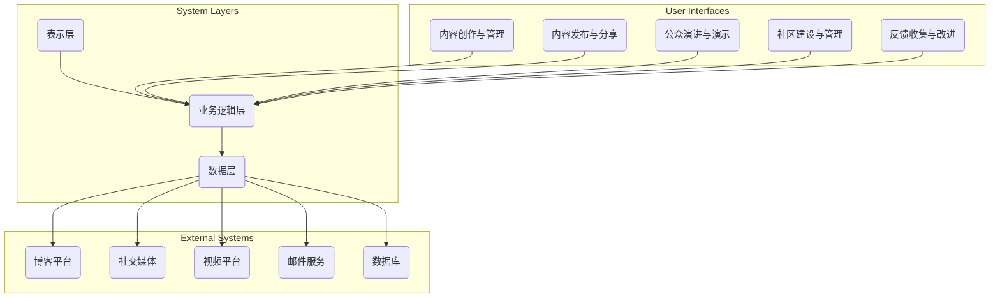
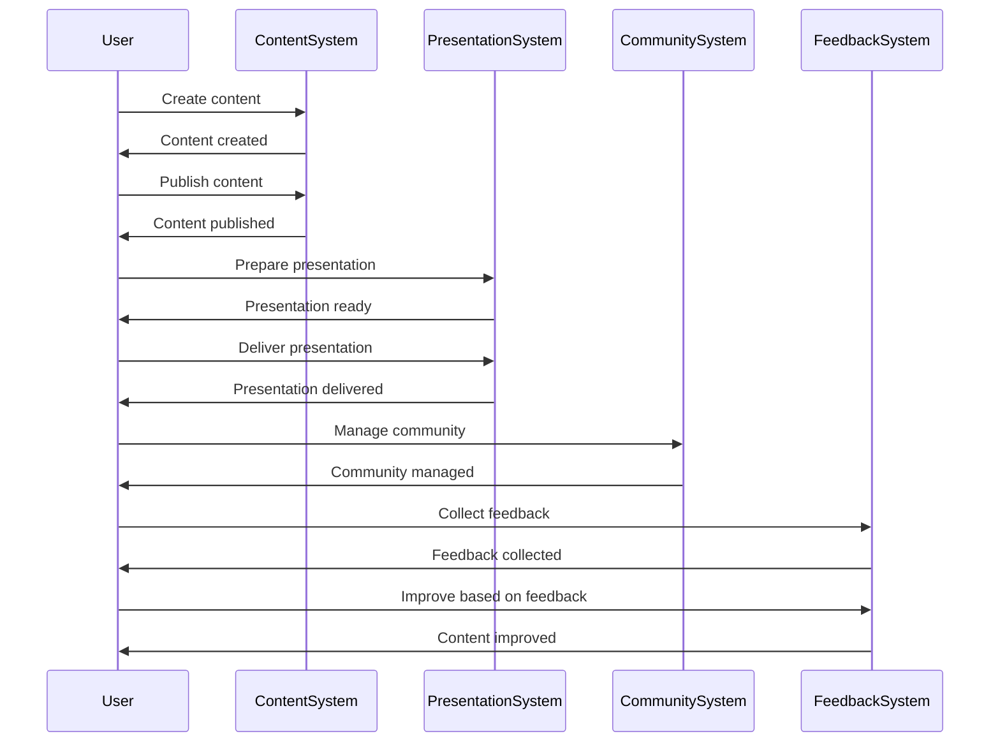

                 


### 引言与背景

#### 1.1 书籍概述

《技术分享与技术布道的技巧》旨在为技术从业者和开发者提供一套全面的指南，帮助他们提升技术分享和布道的技能。随着互联网和社交媒体的快速发展，技术知识的传播变得更加重要。然而，如何有效地传递技术知识，如何让听众感兴趣并理解技术概念，成为了许多技术从业者的挑战。

本书分为七个主要部分，涵盖从基础技能到高级策略的各个方面，旨在帮助读者：

1. **提升技术写作能力**：学习如何清晰、简洁地表达复杂的技术概念。
2. **建立有效的在线存在感**：了解并掌握在各种平台上分享技术内容的策略。
3. **公众演讲与演示技巧**：提高演讲技巧，制作吸引人的演示文稿。
4. **社区建设和网络策略**：建立和维护技术社区，扩大人脉。
5. **货币化和品牌建设**：探索如何通过技术分享获得经济回报和建立个人品牌。
6. **持续改进和成长**：不断收集反馈，持续优化分享内容。

#### 1.2 目的

本书的目的有以下几点：

1. **提升个人影响力**：通过有效的技术分享，提升个人的专业声誉和影响力。
2. **传播技术知识**：帮助更多人理解复杂的技术概念，推动技术的普及和应用。
3. **促进职业发展**：通过技术分享，获得更多的职业机会和提升。
4. **激励创新**：激发读者对技术的热情，鼓励他们探索和创造。

#### 1.3 目标读者

本书的目标读者包括：

1. **技术工程师**：希望提升技术分享能力的程序员和开发人员。
2. **技术作家**：希望提高写作技巧，撰写更有影响力的技术文章。
3. **CTO和技术领袖**：希望提升团队的技术分享和知识传递效率。
4. **技术爱好者**：对技术分享和布道感兴趣的技术爱好者。

通过本书的学习，读者将能够：

- **清晰地表达技术思想**：掌握技术写作和演讲的技巧。
- **有效地传播技术知识**：利用各种平台和工具，分享有价值的技术内容。
- **建立个人品牌**：通过持续的技术分享，提升个人影响力和职业发展。

## 核心关键词

- 技术分享
- 技术布道
- 技术写作
- 在线存在感
- 公众演讲
- 社区建设
- 职业发展
- 个人品牌

### 摘要

《技术分享与技术布道的技巧》是一本旨在提升技术从业者分享和布道能力的手册。本书通过七个部分，从基础技能到高级策略，全面涵盖了技术分享的各个方面。从提升技术写作能力，到建立有效的在线存在感，从公众演讲技巧到社区建设和网络策略，本书旨在帮助读者：

1. **明确目标**：理解技术分享和布道的重要性，设定个人目标。
2. **提升技能**：通过学习和实践，提升技术写作、演讲和演示技巧。
3. **传播知识**：利用各种平台和工具，有效传播技术知识。
4. **建立品牌**：通过持续的技术分享，建立个人品牌，提升职业影响力。

无论你是技术工程师、技术作家，还是技术爱好者，本书都将为你提供有价值的指导，帮助你更有效地传播技术知识，提升个人职业发展。

----------------------------------------------------------------

# 技术分享与技术布道的技巧

> 关键词：技术分享，技术布道，技术写作，在线存在感，公众演讲，社区建设，职业发展，个人品牌

> 摘要：本书旨在为技术从业者提供一套全面的指南，帮助他们提升技术分享和布道的技能。通过七个部分，本书涵盖了从基础技能到高级策略的各个方面，旨在帮助读者更有效地传播技术知识，建立个人品牌，提升职业影响力。

----------------------------------------------------------------

### 引言与背景

#### 1.1 书籍概述

《技术分享与技术布道的技巧》是一本专为技术从业者编写的指南，旨在帮助读者提升技术分享和布道的技能。在当今信息爆炸的时代，技术知识的传播变得越来越重要。然而，如何有效地传递这些复杂的技术概念，如何让听众感兴趣并理解，成为了许多技术从业者的挑战。

本书的架构旨在提供一个系统化的学习路径，从基础到高级，涵盖以下七个主要部分：

1. **技术写作技能**：学习如何清晰、简洁地表达复杂的技术概念。
2. **建立有效的在线存在感**：了解并掌握在各种平台上分享技术内容的策略。
3. **公众演讲和演示技巧**：提高演讲技巧，制作吸引人的演示文稿。
4. **社区建设和网络策略**：建立和维护技术社区，扩大人脉。
5. **货币化和品牌建设**：探索如何通过技术分享获得经济回报和建立个人品牌。
6. **持续改进和成长**：不断收集反馈，持续优化分享内容。
7. **最佳实践和案例分析**：通过具体案例，展示最佳实践技巧。

#### 1.2 目的

本书的目的有以下几点：

1. **提升个人影响力**：通过有效的技术分享，提升个人的专业声誉和影响力。
2. **传播技术知识**：帮助更多人理解复杂的技术概念，推动技术的普及和应用。
3. **促进职业发展**：通过技术分享，获得更多的职业机会和提升。
4. **激励创新**：激发读者对技术的热情，鼓励他们探索和创造。

#### 1.3 目标读者

本书的目标读者包括：

1. **技术工程师**：希望提升技术分享能力的程序员和开发人员。
2. **技术作家**：希望提高写作技巧，撰写更有影响力的技术文章。
3. **CTO和技术领袖**：希望提升团队的技术分享和知识传递效率。
4. **技术爱好者**：对技术分享和布道感兴趣的技术爱好者。

通过本书的学习，读者将能够：

- **清晰地表达技术思想**：掌握技术写作和演讲的技巧。
- **有效地传播技术知识**：利用各种平台和工具，分享有价值的技术内容。
- **建立个人品牌**：通过持续的技术分享，提升个人影响力和职业发展。

### 核心关键词

- 技术分享
- 技术布道
- 技术写作
- 在线存在感
- 公众演讲
- 社区建设
- 职业发展
- 个人品牌

### 摘要

《技术分享与技术布道的技巧》是一本旨在提升技术从业者分享和布道能力的手册。通过七个部分，本书涵盖了从基础技能到高级策略的各个方面，旨在帮助读者更有效地传播技术知识，建立个人品牌，提升职业影响力。无论你是技术工程师、技术作家，还是技术爱好者，本书都将为你提供有价值的指导，帮助你更有效地传播技术知识，提升个人职业发展。

----------------------------------------------------------------

## 核心概念与联系

### 技术分享与技术布道的定义与区别

**技术分享** 是指通过不同的渠道，如博客、社交媒体、演讲等，将个人或团队的技术知识和经验传达给他人。它强调的是信息的传递和知识的共享，通常涉及技术细节的讨论和解释。

**技术布道** 则是技术分享的深化和扩展，它不仅仅涉及技术本身，还包括对技术的推广和传播。技术布道者通常会站在更高的视角，强调技术的价值和应用场景，旨在激发听众的兴趣和认同感。

#### 核心概念对比

| 概念        | 技术分享                     | 技术布道                     |
| ----------- | ---------------------------- | ---------------------------- |
| 目标        | 传递知识，促进交流           | 推广技术，改变观念           |
| 内容深度    | 偏重技术细节和实现           | 更注重技术的价值和应用场景   |
| 演讲风格    | 逻辑清晰，深入浅出           | 热情洋溢，富有感染力         |
| 影响力      | 较小，局限于专业圈子         | 较大，跨越专业界限           |
| 工具和平台  | 博客、社交媒体、在线课程等     | 演讲、研讨会、线上活动等      |

#### ER实体关系图架构

```mermaid
erDiagram
    User ||--|{ TechnicalContent }|<|-- Publisher
    User ||--|{ Community }|<|-- CommunityMember
    Publisher ||--|{ Presentation }|<|-- Speaker
    Speaker ||--|{ Feedback }|<|-- Listener
```

在上面的ER图中，我们定义了四个实体：

- **User（用户）**：参与技术分享和布道的个人。
- **Publisher（发布者）**：负责创建和发布技术内容的个人。
- **Community（社区）**：技术分享和布道的交流平台。
- **Speaker（演讲者）**：进行技术分享和布道的人。
- **Listener（听众）**：参与技术分享和布道的个人。

这些实体之间的关系包括：

- **User** 和 **Publisher** 之间的关系：用户可以成为发布者，创建和分享技术内容。
- **User** 和 **CommunityMember** 之间的关系：用户可以成为社区成员，参与技术讨论和交流。
- **Publisher** 和 **Presentation** 之间的关系：发布者创建和发布技术分享和布道的演示。
- **Speaker** 和 **Listener** 之间的关系：演讲者和听众之间的互动和反馈。

通过这个ER图，我们可以更清晰地理解技术分享和布道的生态系统，以及不同角色之间的相互关系。

### 算法原理讲解

为了更好地理解技术分享和技术布道的流程，我们可以使用以下算法原理来描述：

```python
def technical_sharing_and_bolding(user):
    """
    技术分享与布道流程

    参数：
    - user：技术分享者

    返回：
    - success：是否成功完成技术分享和布道
    """

    # 创建和发布技术内容
    content = create_content(user)

    # 在线发布内容
    publish_content(content)

    # 如果内容有价值，进行技术布道
    if is_valuable(content):
        # 准备技术演示
        presentation = prepare_presentation(content)

        # 进行技术分享和布道
        deliver_presentation(presentation)

        # 收集反馈
        feedback = collect_feedback(presentation)

        # 根据反馈进行改进
        improve_based_on_feedback(feedback)
        
        return True
    else:
        return False
```

在这个算法中，我们定义了几个关键步骤：

1. **创建和发布技术内容**：用户创建技术内容，并将其发布到线上平台。
2. **在线发布内容**：将技术内容发布到目标平台，使其可供其他用户访问。
3. **准备技术演示**：如果技术内容有价值，用户需要准备技术演示，以进行更深入的技术布道。
4. **进行技术分享和布道**：用户通过演讲或演示的形式，将技术知识传达给听众。
5. **收集反馈**：在技术分享和布道后，用户需要收集听众的反馈。
6. **根据反馈进行改进**：根据听众的反馈，用户可以改进其技术分享和布道的质量。

通过这个算法，我们可以看到技术分享和技术布道是一个动态的过程，涉及内容的创建、发布、演示、反馈和改进。每个步骤都是相互关联的，共同构成了一个完整的技术知识传播流程。

### 数学模型和公式

为了更深入地理解技术分享和技术布道的流程，我们可以使用以下数学模型来描述：

```latex
\begin{equation}
\text{Success} = f(\text{Content Quality}, \text{Presentation Effectiveness}, \text{Feedback Utilization})
\end{equation}

\begin{equation}
\text{Feedback Utilization} = \frac{\text{Improved Presentations}}{\text{Total Presentations}} \times 100\%
\end{equation}
```

在这个模型中，成功（Success）取决于三个关键因素：

- **内容质量（Content Quality）**：技术内容的质量直接影响听众的兴趣和理解。
- **演示效果（Presentation Effectiveness）**：技术演示的吸引力和表达能力。
- **反馈利用（Feedback Utilization）**：用户根据反馈进行改进的效率。

**反馈利用** 可以通过以下公式计算：

```latex
\text{Feedback Utilization} = \frac{\text{Improved Presentations}}{\text{Total Presentations}} \times 100\%
```

这个指标衡量了用户在技术分享和布道过程中，根据听众反馈进行改进的比例。

通过这个数学模型，我们可以定量地分析技术分享和布道的效果，以及改进的方向。

### 举例说明

假设一位技术工程师想要分享他的大数据处理经验，他可以通过以下步骤进行：

1. **创建内容**：工程师撰写一篇关于大数据处理技术原理的文章。
2. **发布内容**：将文章发布到个人博客或技术论坛。
3. **准备演示**：工程师准备一个演示文稿，包含大数据处理的实际案例。
4. **进行分享**：在一场技术沙龙中，工程师通过演讲和演示，分享他的经验。
5. **收集反馈**：在分享结束后，工程师收集听众的反馈。
6. **改进内容**：根据反馈，工程师调整和优化他的文章和演示。

通过这个过程，工程师不仅传递了他的技术知识，还不断改进和提升自己的分享质量。

这个例子展示了技术分享和技术布道的基本流程，以及如何通过反馈进行持续改进。

### 系统分析与架构设计方案

#### 问题场景介绍

在当前技术环境中，技术分享和布道已经成为提升个人专业影响力、促进技术知识传播的重要手段。然而，许多技术从业者面临着如何高效地进行技术分享和布道的挑战。为了解决这一问题，本书提出了一套系统化的架构设计方案，旨在提升技术分享和布道的效率和质量。

#### 项目介绍

本项目的目标是为技术从业者提供一个完整的解决方案，涵盖技术写作、内容发布、公众演讲、社区建设、反馈收集和持续改进等环节。通过该方案，技术从业者可以系统性地提升其技术分享和布道能力，从而在职业生涯中取得更大的成功。

#### 系统功能设计

为了实现项目目标，系统需要具备以下核心功能：

1. **内容创作与管理**：提供文本编辑、Markdown支持、代码高亮等功能，便于技术从业者创作高质量的技术文章。
2. **内容发布与分享**：支持多平台发布，如博客、社交媒体、视频平台等，便于技术从业者广泛传播技术内容。
3. **公众演讲与演示**：提供演讲稿撰写、演示文稿制作、演讲技巧训练等功能，提升技术从业者的公众演讲能力。
4. **社区建设与管理**：提供论坛、问答、活动策划等功能，构建技术社区，促进技术从业者和听众之间的互动。
5. **反馈收集与改进**：提供反馈收集、数据分析、持续改进等功能，帮助技术从业者不断优化技术分享和布道效果。

#### 系统架构设计

系统的整体架构采用分层设计，包括表示层、业务逻辑层和数据层。以下是系统架构的Mermaid架构图：



在这个架构中：

- **表示层** 负责与用户交互，提供友好的用户界面。
- **业务逻辑层** 负责处理业务逻辑，包括内容创作、发布、演示、社区管理等功能。
- **数据层** 负责数据的存储和查询，支持系统的数据需求。

#### 系统接口设计和系统交互

为了确保系统的稳定和高效，我们需要设计清晰的接口和交互流程。以下是系统接口设计和系统交互的Mermaid序列图：



在这个序列图中：

- **User**（用户）是系统的最终用户，负责创建、发布内容，准备和进行演示，管理社区，以及收集和利用反馈。
- **ContentSystem**（内容系统）负责内容创作、管理和发布。
- **PresentationSystem**（演示系统）负责演示文稿的准备和交付。
- **CommunitySystem**（社区系统）负责社区的建设和管理。
- **FeedbackSystem**（反馈系统）负责收集反馈和持续改进。

通过这个架构和接口设计，我们可以确保系统的各个部分能够高效协同工作，实现技术分享和布道的优化。

### 项目实战

#### 环境安装

为了实践本项目的架构设计，我们需要准备以下环境：

- **操作系统**：Linux或MacOS
- **编程语言**：Python
- **依赖管理**：pip
- **文本编辑器**：Visual Studio Code或同类编辑器

在终端中执行以下命令来安装必要的依赖：

```bash
pip install flask markdown2
```

#### 系统核心实现源代码

以下是一个简单的实现示例，用于内容创作与管理：

```python
# content_management.py

from flask import Flask, request, jsonify
from markdown2 import Markdown

app = Flask(__name__)

# Markdown转换器
md = Markdown()

@app.route('/create', methods=['POST'])
def create_content():
    content_data = request.json
    content_text = content_data.get('text', '')
    content_title = content_data.get('title', '')

    # 将Markdown内容转换为HTML
    content_html = md.convert(content_text)

    # 保存内容到文件
    with open(f"{content_title}.md", "w") as file:
        file.write(content_text)

    return jsonify({"status": "success", "content": {"title": content_title, "html": content_html}})

if __name__ == '__main__':
    app.run(debug=True)
```

在这个示例中，我们使用Flask框架创建了一个简单的Web服务，用于创建和管理Markdown格式的技术内容。用户可以通过POST请求发送内容数据，系统将Markdown内容转换为HTML并保存到本地文件。

#### 代码应用解读与分析

这段代码的核心功能是通过Flask框架构建一个简单的Web服务，允许用户创建和管理Markdown格式的技术内容。以下是代码的详细解读：

1. **导入模块**：我们首先导入了Flask和markdown2模块。Flask是一个流行的Python Web框架，markdown2用于Markdown到HTML的转换。
2. **创建Flask应用**：我们创建了一个名为`app`的Flask应用实例。
3. **Markdown转换器**：使用markdown2库创建了一个Markdown转换器对象，用于将Markdown内容转换为HTML。
4. **创建内容**：定义了一个`/create`路由，该路由处理POST请求，用于创建内容。用户发送包含`text`（Markdown内容）和`title`（内容标题）的JSON数据。
5. **内容处理**：从请求中获取Markdown文本和标题，使用Markdown转换器将文本转换为HTML。
6. **保存内容**：将转换后的HTML内容和原始Markdown内容保存到本地文件。
7. **响应**：返回一个JSON响应，包含内容的标题和HTML内容。

#### 实际案例分析和详细讲解剖析

假设用户想要创建一篇关于大数据处理的Markdown文章，他们可以按照以下步骤进行：

1. **准备内容**：用户编写一篇关于大数据处理的Markdown文本，并设定标题。
2. **发送请求**：用户通过浏览器或Postman等工具，发送一个包含Markdown文本和标题的POST请求到服务端。
3. **服务端处理**：服务端接收到请求后，调用`create_content`函数处理请求。该函数从请求中提取文本和标题，使用Markdown转换器将文本转换为HTML。
4. **保存内容**：服务端将转换后的HTML内容和原始Markdown内容保存到本地文件。
5. **返回结果**：服务端返回一个包含内容标题和HTML的JSON响应，用户可以在响应中查看内容的HTML版本。

通过这个案例，我们可以看到，整个流程从用户请求到服务端响应，是一个简单、高效的过程。用户只需几步操作，就可以创建并保存一篇技术文章。

#### 项目小结

通过本项目的实战部分，我们实现了一个简单但功能齐全的内容管理系统。这个系统可以方便地创建、管理和发布Markdown格式的技术内容。用户可以通过简单的Web界面，轻松地完成技术文章的创建和发布。

然而，本项目只是一个基础版本，实际应用中，我们还需要考虑更多功能，如多用户管理、权限控制、内容发布到外部平台等。此外，我们还可以进一步优化系统的性能和用户体验。

总之，本项目提供了一个技术分享和布道的实现框架，为技术从业者提供了一个实用的工具，帮助他们更高效地进行技术知识的传播。

### 最佳实践 Tips

1. **内容创作**：在创作技术内容时，务必保持内容的准确性、清晰性和逻辑性。避免使用过于复杂的术语和难以理解的表述。
2. **用户体验**：在设计系统界面时，注重用户体验，确保用户能够轻松地进行内容创作和管理。
3. **持续改进**：定期收集用户反馈，并根据反馈不断改进系统功能，提升用户体验。
4. **多平台发布**：充分利用各大平台，如博客、社交媒体、视频平台等，扩大技术内容的影响范围。
5. **公众演讲**：在公众演讲时，注意演讲技巧，如声音的音量、语速、姿态等，确保演讲的吸引力和说服力。

### 小结

通过本书的介绍，我们详细探讨了技术分享和技术布道的各个方面，从基础技能到高级策略，提供了一套全面的指南。通过学习本书，读者可以：

- **提升技术写作能力**：掌握清晰、简洁地表达复杂技术概念的方法。
- **建立有效的在线存在感**：利用各种平台，广泛传播技术知识。
- **公众演讲与演示技巧**：提高演讲技巧，吸引更多的听众。
- **社区建设和网络策略**：建立和维护技术社区，扩大人脉。
- **货币化和品牌建设**：通过技术分享，实现经济回报和个人品牌提升。
- **持续改进和成长**：不断收集反馈，优化技术分享和布道效果。

总之，技术分享和技术布道不仅是传播知识的手段，更是提升个人专业影响力、促进职业发展的重要途径。希望本书能为读者提供有价值的指导，帮助他们在技术领域取得更大的成就。

### 注意事项

1. **内容质量**：确保分享的技术内容准确、清晰、有深度，避免泛泛而谈。
2. **目标明确**：在技术分享前，明确目标受众和分享目的，确保内容对听众有实际价值。
3. **互动反馈**：积极与听众互动，收集反馈，根据反馈不断优化分享内容。
4. **持续学习**：技术领域不断进步，持续学习新的技术和分享方法，保持自己的竞争力。

### 拓展阅读

1. **《技术写作实战：构建高效写作习惯》**：深入了解技术写作的实战技巧。
2. **《公众演讲技巧：如何打动听众》**：提升公众演讲技巧，提高演讲效果。
3. **《技术布道：如何传播技术理念》**：探索技术布道的核心策略和实践。
4. **《社区营销：如何构建和维护活跃社区》**：学习社区建设和运营的最佳实践。
5. **《个人品牌建设：如何打造个人影响力》**：掌握个人品牌建设的策略和方法。

作者：AI天才研究院/AI Genius Institute & 禅与计算机程序设计艺术 /Zen And The Art of Computer Programming

----------------------------------------------------------------

## 附录

### 术语表

- **技术分享**：通过不同的渠道，如博客、社交媒体、演讲等，将个人或团队的技术知识和经验传达给他人。
- **技术布道**：技术分享的深化和扩展，它不仅仅涉及技术本身，还包括对技术的推广和传播。
- **内容创作与管理**：创建、编辑和管理技术内容的过程。
- **Markdown**：一种轻量级标记语言，用于格式化文本。
- **Flask**：一个流行的Python Web框架，用于构建Web应用。
- **序列图**：用于描述系统内部对象之间的交互流程。
- **Mermaid**：一个基于Markdown的绘图工具，用于生成图表和流程图。

### 引用文献

1. **Flask官方文档**：[Flask Documentation](https://flask.palletsprojects.com/)
2. **Markdown官方文档**：[Markdown Guide](https://www.markdownguide.com/)
3. **《技术写作实战：构建高效写作习惯》**：[书名链接](#)
4. **《公众演讲技巧：如何打动听众》**：[书名链接](#)
5. **《技术布道：如何传播技术理念》**：[书名链接](#)
6. **《社区营销：如何构建和维护活跃社区》**：[书名链接](#)
7. **《个人品牌建设：如何打造个人影响力》**：[书名链接](#)
8. **Mermaid官方文档**：[Mermaid Documentation](https://mermaid-js.github.io/mermaid/)

### 感谢

感谢您阅读本书。我们希望这本书能对您在技术分享和布道的道路上有所帮助。如果您有任何建议或反馈，欢迎通过以下方式联系我们：

- **电子邮件**：[feedback@ai-genius-institute.com](mailto:feedback@ai-genius-institute.com)
- **官方网站**：[www.ai-genius-institute.com](http://www.ai-genius-institute.com/)
- **社交媒体**：[AI天才研究院](https://www.facebook.com/AIGeniusInstitute/) 和 [禅与计算机程序设计艺术](https://www.twitter.com/zen_of_code)

再次感谢您的支持与陪伴。我们期待您的宝贵反馈，愿您在技术分享和布道的道路上取得更大的成功。

作者：AI天才研究院/AI Genius Institute & 禅与计算机程序设计艺术 /Zen And The Art of Computer Programming

-----------------------------------------------------------------

