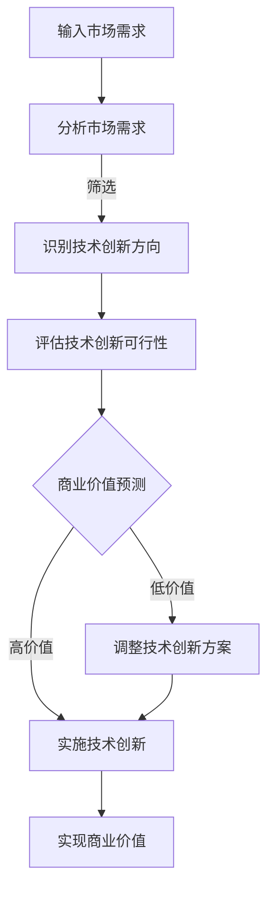
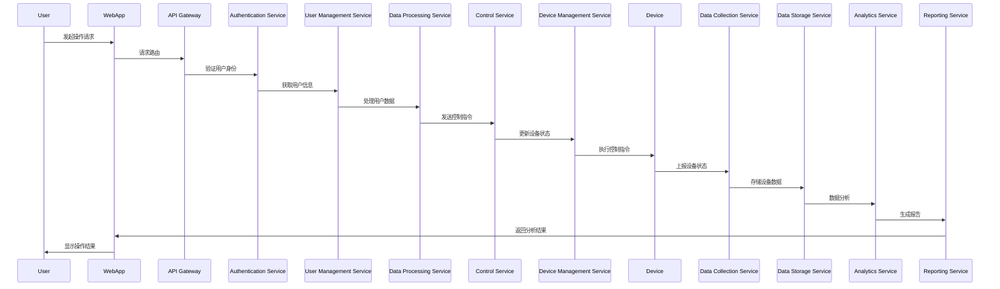
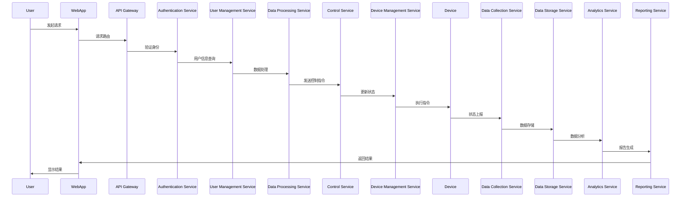

                 

### 文章标题

# 技术创新与商业价值的结合点

### 文章关键词

- 技术创新
- 商业价值
- 结合点
- 算法
- 数学模型
- 系统架构
- 实战案例

### 摘要

本文旨在深入探讨技术创新与商业价值的结合点，通过系统化的分析和实践案例，揭示两者之间的内在联系和作用机制。文章首先介绍技术创新和商业价值的背景与基础，随后详细阐述结合点的核心理论与实践，包括算法原理和数学模型。接着，文章通过系统分析与架构设计方案，展示了技术创新与商业价值结合点的实际应用。最后，文章通过项目实战和最佳实践，总结了技术驱动商业成功的经验与教训，并对未来的研究方向进行了展望。希望本文能为您在技术创新与商业价值结合的道路上提供有价值的参考。

## 第一部分：背景与基础

### 1.1 问题背景与重要性

#### 技术创新与商业价值的结合点：现状与挑战

在当今快速变化的市场环境中，技术创新已经成为企业获得竞争优势和实现可持续发展的重要驱动力。与此同时，商业价值作为企业运营的核心目标，越来越受到关注。然而，技术创新与商业价值的结合点仍然是一个复杂而具有挑战性的问题。如何在技术创新的过程中实现商业价值的最大化，成为许多企业面临的重要课题。

首先，技术创新的概念与类型需要明确。技术创新可以分为产品创新、过程创新和市场创新三种类型。产品创新是指开发新的产品或服务，满足市场需求；过程创新是指通过改进生产流程、管理方式等提高效率和降低成本；市场创新是指通过改变市场策略、拓展新市场等方式实现业务增长。不同类型的技术创新对商业价值的影响方式各不相同，需要针对具体情况进行综合评估。

其次，商业价值的定义与评估也是重要的一环。商业价值是指企业在一定时间内通过运营活动创造的经济效益和价值。商业价值评估的方法和工具包括财务分析、市场研究、客户满意度调查等。这些方法和工具可以帮助企业了解技术创新对商业价值的具体影响，为决策提供依据。

然而，在实际操作中，技术创新与商业价值的结合点面临着诸多挑战。一方面，技术创新的不确定性和风险性使得企业难以准确预测其商业价值；另一方面，市场竞争的加剧和消费者需求的变化，要求企业必须迅速响应市场变化，实现技术创新与商业价值的同步提升。

因此，如何找到并利用技术创新与商业价值的结合点，成为企业实现长期成功的关键。本文将从理论基础、算法原理、系统架构和实战案例等方面，系统地探讨这一结合点的实现路径，以期为企业提供有价值的参考。

#### 为什么需要关注技术创新与商业价值的结合点

关注技术创新与商业价值的结合点，不仅对企业的发展具有重要意义，也对整个市场和社会产生了深远的影响。首先，从企业内部来看，技术创新与商业价值的结合点能够帮助企业实现资源的优化配置，提高效率和盈利能力。通过明确技术创新的方向和目标，企业可以更好地制定战略规划，确保技术创新的投入能够带来预期的商业回报。

其次，从市场竞争的角度来看，技术创新与商业价值的结合点是企业获取竞争优势的关键。在竞争激烈的市场环境中，只有不断进行技术创新，才能满足不断变化的市场需求，赢得消费者的青睐。而通过有效的商业价值评估，企业可以更加精准地把握市场需求，加快产品或服务的迭代速度，从而在市场中占据有利地位。

此外，从社会经济发展的角度来看，技术创新与商业价值的结合点有助于推动社会进步和经济增长。技术创新不仅能够带来直接的经济效益，还能够促进相关产业的发展，创造更多就业机会，提升人民生活水平。而商业价值的实现，则为技术创新提供了持续的驱动力，形成良性循环，推动整个社会向前发展。

总之，关注技术创新与商业价值的结合点，不仅是企业实现长期成功的关键，也是推动社会进步的重要途径。通过深入研究和实践，我们可以更好地把握这一结合点，为企业和社会创造更大的价值。

### 1.2 技术创新的核心要素

#### 技术创新的概念与类型

技术创新是指通过引入新的技术或改进现有技术，创造新的产品、服务或生产方式，从而实现商业价值的过程。技术创新的类型多种多样，主要包括以下三种：

1. **产品创新**：这是指开发新的产品或改进现有产品，以满足市场需求。产品创新可以是完全全新的产品，也可以是在现有产品基础上的改进。例如，智能手机的发明和不断更新，极大地改变了人们的通信方式。

2. **过程创新**：这是指通过改进生产流程、管理方式等，提高效率和降低成本。过程创新通常涉及生产、物流、供应链等多个环节的优化。例如，丰田公司的精益生产方式，通过减少浪费、提高生产效率，大大降低了生产成本。

3. **市场创新**：这是指通过改变市场策略、拓展新市场等方式，实现业务增长。市场创新可以是开辟新的市场，也可以是现有市场的深度挖掘。例如，阿里巴巴通过电子商务平台，打破了地域限制，将市场拓展到全球。

不同类型的技术创新对商业价值的影响各不相同。产品创新通常能够带来直接的商业价值，如增加销售收入、提升品牌知名度等；过程创新则主要通过提高生产效率、降低成本来提升企业的盈利能力；市场创新则可以帮助企业开拓新市场，增加市场份额。

#### 技术创新的关键驱动因素

技术创新的成功离不开多种驱动因素，以下是一些关键因素：

1. **市场需求**：市场需求是技术创新的重要驱动力。了解和满足消费者的需求，是产品创新和市场创新的核心。例如，智能手机的普及源于人们对移动通信和互联网的需求。

2. **技术进步**：技术进步为技术创新提供了强大的支持。新的技术突破或现有技术的改进，能够推动产品创新和过程创新。例如，人工智能技术的发展，为智能设备和自动化生产提供了新的可能性。

3. **政策支持**：政府的政策支持也是技术创新的重要推动力。通过提供资金、税收优惠、研发补贴等政策，政府能够激励企业进行技术创新。例如，我国近年来推出的“双创”政策，为中小企业提供了良好的创新环境。

4. **企业战略**：企业自身的战略定位和资源配置，直接影响技术创新的成效。具有长远战略眼光的企业，通常能够更好地把握技术创新的机遇，实现商业价值的最大化。

5. **人才储备**：技术创新需要高素质的人才支持。拥有优秀的研发团队和创新人才，是企业成功进行技术创新的重要保障。例如，谷歌和苹果等科技巨头，都拥有大量顶尖的技术人才，推动了其在技术创新领域的领先地位。

#### 技术创新的管理与战略规划

技术创新的管理和战略规划是企业成功实施技术创新的关键。以下是一些关键点：

1. **研发投入**：企业需要根据自身情况，合理配置研发资源。充足的研发投入，是技术创新的重要保障。企业可以通过增加研发预算、建设研发中心等方式，提高技术创新能力。

2. **项目管理**：技术创新项目通常涉及多个环节，需要严格的项目管理。通过制定详细的项目计划、设定明确的目标和里程碑，确保项目按时按质完成。

3. **创新文化建设**：创新文化是企业持续进行技术创新的基础。企业应鼓励员工勇于尝试、包容失败，形成创新思维和创新习惯。例如，3M公司的“15% 项目”政策，允许员工将15% 的时间用于自由创新，极大地促进了公司的技术创新。

4. **合作与联盟**：通过合作与联盟，企业可以整合内外部资源，共同进行技术创新。例如，苹果公司与高通、英特尔等公司的合作，推动了智能手机技术的快速发展。

5. **市场反馈**：技术创新的最终目标是为市场提供有价值的产品或服务。企业应密切关注市场反馈，及时调整技术创新方向，确保其能够满足市场需求。

总之，技术创新的核心要素包括市场需求、技术进步、政策支持、企业战略和人才储备。通过有效的管理和战略规划，企业可以更好地把握技术创新的机遇，实现商业价值的最大化。

### 1.3 商业价值的概念与评估

#### 商业价值的定义与维度

商业价值是指企业在一定时间内通过运营活动创造的经济效益和价值。它不仅包括企业的财务表现，还涵盖了市场地位、客户忠诚度、品牌影响力等多个方面。商业价值的维度可以概括为以下几个方面：

1. **财务价值**：财务价值是商业价值的核心维度，包括企业的收入、利润、资产回报率等财务指标。这些指标反映了企业的经济表现，是评估商业价值的重要依据。

2. **市场价值**：市场价值是指企业在资本市场上的表现，如股票价格、市值等。市场价值反映了投资者对企业的认可程度，是衡量商业价值的一个重要维度。

3. **客户价值**：客户价值是指企业通过产品或服务为客户创造的收益和价值。客户满意度、客户忠诚度等指标是衡量客户价值的重要维度。高客户价值通常意味着企业在市场中具有强大的竞争优势。

4. **品牌价值**：品牌价值是指企业品牌在市场中的影响力。一个强大的品牌不仅能吸引客户，还能提升企业的整体形象，增加市场份额。品牌价值是企业长期发展的重要资产。

#### 商业价值评估的方法与工具

商业价值评估是确保技术创新能够为企业带来实际收益的重要环节。以下是一些常用的方法和工具：

1. **财务分析**：财务分析是评估商业价值的基本方法。通过分析企业的财务报表，如资产负债表、利润表和现金流量表，可以了解企业的财务状况和盈利能力。常用的财务指标包括收入、利润、资产回报率、现金流等。

2. **市场研究**：市场研究是评估商业价值的有效工具。通过调查市场需求、竞争态势、消费者偏好等信息，可以了解企业的市场定位和竞争优势。市场研究可以采用定量调查（如问卷调查）和定性调查（如深度访谈）两种方式。

3. **客户满意度调查**：客户满意度调查是衡量客户价值的重要手段。通过调查客户对产品或服务的满意度，可以了解客户的需求和期望，为企业改进产品和服务提供依据。

4. **品牌价值评估**：品牌价值评估是通过评估品牌在市场中的影响力来衡量商业价值。常用的方法包括品牌资产评估、品牌溢价评估等。品牌价值评估可以帮助企业了解品牌对商业价值的影响，从而制定更有效的品牌战略。

#### 商业价值与可持续性

商业价值与可持续性是企业在长期发展中需要兼顾的两个重要方面。商业价值关注企业当前的经济效益，而可持续性关注企业的长期发展和社会贡献。

1. **可持续发展**：可持续发展是指企业在满足当前需求的同时，不损害后代满足其需求的能力。可持续发展要求企业在经济、环境和社会三个方面实现平衡发展。通过采用环保技术、节能减排等措施，企业可以实现可持续发展，从而增强商业价值。

2. **社会责任**：社会责任是企业对社会的责任和义务。通过参与社会公益活动、支持教育、环境保护等，企业可以增强社会影响力，提升品牌价值，进而增加商业价值。

3. **经济效益与可持续性的平衡**：企业在追求商业价值的同时，需要考虑可持续性。通过平衡经济效益和可持续性，企业可以确保长期发展，实现商业价值与可持续性的双赢。

总之，商业价值评估是确保技术创新能够为企业带来实际收益的关键。通过财务分析、市场研究、客户满意度调查和品牌价值评估等方法，企业可以准确评估商业价值，为技术创新提供有力支持。同时，企业需要关注可持续性，通过平衡经济效益和可持续性，实现长期成功。

## 第二部分：结合点的核心理论与实践

### 2.1 核心概念与联系

#### 技术创新与商业价值的结合点：概念解析

技术创新与商业价值的结合点是指技术创新的过程和结果与商业价值之间的内在联系和作用机制。这一结合点不仅体现在技术创新能够带来直接的商业价值，还体现在技术创新如何通过提升企业竞争力、满足市场需求等途径，间接地促进商业价值的实现。理解这一结合点的概念，是深入探讨两者关系的基础。

首先，技术创新与商业价值结合点的核心在于其互为驱动的特点。技术创新不仅需要考虑技术本身的先进性和可行性，还需要考虑其商业化的前景和潜在的盈利能力。同样，商业价值评估也需要基于技术创新的实际效果和潜在收益进行。这种双向驱动的关系，使得技术创新与商业价值能够相互促进、共同发展。

其次，结合点的关键在于其对市场需求的精准把握。技术创新的成功与否，往往取决于其是否能够满足市场需求。而商业价值评估则需要基于市场需求来衡量技术创新的成效。因此，结合点不仅仅是技术创新的成果，更是对市场需求的精准回应。只有当技术创新与市场需求紧密结合时，才能真正实现商业价值的最大化。

#### 核心概念属性特征对比表格

为了更好地理解技术创新与商业价值结合点的核心概念，我们可以通过一个属性特征对比表格来展示两者的主要区别和联系。

| 特征                 | 技术创新                                  | 商业价值                                  |
|----------------------|-----------------------------------------|-----------------------------------------|
| 目标                 | 提高技术先进性和可行性                   | 创造经济利益和价值                        |
| 关键要素             | 研发能力、技术进步、市场需求             | 财务表现、市场地位、客户满意度、品牌影响力 |
| 影响因素             | 技术环境、政策支持、企业战略             | 竞争态势、消费者行为、市场机会             |
| 实现方式             | 产品创新、过程创新、市场创新             | 财务分析、市场研究、客户满意度调查         |
| 评价标准             | 技术先进性、可行性、市场接受度           | 收入、利润、资产回报率、市场占有率         |
| 结合点               | 技术创新与市场需求的匹配                 | 技术创新对商业价值的影响                   |

通过上述表格，我们可以清晰地看到技术创新与商业价值在目标、关键要素、影响因素、实现方式和评价标准等方面的区别和联系。这种对比不仅有助于理解两者的核心概念，也为后续的理论和实践提供了基础。

#### 结合点的ER实体关系图架构

为了进一步理解技术创新与商业价值结合点的结构，我们可以使用实体关系图（ER图）来展示两者之间的实体关系和联系。以下是一个简单的ER实体关系图，用于描述技术创新与商业价值结合点的核心要素和关系。

```mermaid
erDiagram
    Customer ||--o{ Product } : "ordered by"
    Product ||--o{ Innovation } : "created from"
    Innovation ||--o{ BusinessValue } : "drives"
    BusinessValue ||--o{ Customer } : "delivers value to"
```

在这个ER实体关系图中：

- **Customer（客户）**：代表市场需求和消费者，是技术创新和商业价值的起点。
- **Product（产品）**：代表技术创新的成果，是连接客户和商业价值的关键。
- **Innovation（创新）**：代表技术创新的过程，是产品实现商业价值的重要基础。
- **BusinessValue（商业价值）**：代表技术创新和产品对企业的经济和社会贡献，是技术创新和商业价值的最终体现。

通过ER图，我们可以更直观地看到技术创新与商业价值结合点的多层次结构，以及各个实体之间的相互关系。这种关系不仅体现了技术创新与商业价值之间的内在联系，也为理解和分析两者的结合点提供了有效的工具。

### 2.2 算法原理讲解

#### 结合点的算法流程图

为了深入探讨技术创新与商业价值的结合点，我们可以设计一个简单的算法，通过图示来展示其工作流程。以下是结合点的算法流程图，使用Mermaid语言绘制：



在这个流程图中：

1. **输入市场需求**（A）：首先，根据市场需求收集相关信息。
2. **分析市场需求**（B）：对收集的市场需求信息进行分析，以确定技术创新的方向。
3. **识别技术创新方向**（C）：根据市场需求分析的结果，识别可能的技术创新方向。
4. **评估技术创新可行性**（D）：对识别的技术创新方向进行评估，包括技术可行性、市场前景等。
5. **商业价值预测**（E）：基于技术创新的可行性评估，预测其可能带来的商业价值。
6. **实施技术创新**（F）：对于预测高商业价值的技术创新方向，实施具体的技术创新行动。
7. **实现商业价值**（H）：通过技术创新，实现预期的商业价值。
8. **调整技术创新方案**（G）：如果预测的商

### 2.3 数学模型和数学公式 & 详细讲解 & 举例说明

在探讨技术创新与商业价值的结合点时，数学模型和数学公式是不可或缺的工具。以下将详细讲解用于评估技术创新商业价值的数学模型和数学公式，并通过具体例子来说明其应用。

#### 技术创新商业价值评估的数学模型

技术创新商业价值的评估通常可以通过以下数学模型进行：

\[ BV = f(T, M, C) \]

其中：
- \( BV \)：商业价值（Business Value）
- \( T \)：技术创新（Technical Innovation）
- \( M \)：市场需求（Market Demand）
- \( C \)：成本（Cost）

该模型表明商业价值是技术创新、市场需求和成本共同作用的结果。

#### 技术创新商业价值评估的数学公式

1. **技术创新价值**（\( TV \)）：

\[ TV = \frac{R - C}{C} \]

其中：
- \( R \)：收入（Revenue）
- \( C \)：成本（Cost）

该公式表示技术创新所带来的额外收入与成本之比，反映了技术创新的财务效益。

2. **市场需求价值**（\( MV \)）：

\[ MV = \frac{P - M}{M} \]

其中：
- \( P \)：价格（Price）
- \( M \)：成本（Market Cost）

该公式表示市场需求带来的价格增加与成本之比，反映了市场需求对商业价值的贡献。

3. **成本效益比**（\( CER \)）：

\[ CER = \frac{BV}{C} \]

该公式表示单位成本所创造的商业价值，是评估成本效益的重要指标。

#### 详细讲解

1. **技术创新价值**：

技术创新价值（\( TV \)）是评估技术创新带来的财务效益的核心指标。当 \( TV > 1 \) 时，表示技术创新的财务效益高于成本；当 \( TV < 1 \) 时，则表示财务效益低于成本。通过该公式，企业可以判断某一技术创新是否值得投资。

2. **市场需求价值**：

市场需求价值（\( MV \)）反映了市场需求对商业价值的贡献。当 \( MV > 1 \) 时，表示市场需求带来了超过成本的价格增加，具有潜在的商业价值。这一指标有助于企业确定产品或服务的市场定位和定价策略。

3. **成本效益比**：

成本效益比（\( CER \)）是评估整体商业价值的指标。当 \( CER > 1 \) 时，表示企业通过技术创新和市场需求实现了较高的成本效益，是具有投资价值的业务方向。

#### 举例说明

假设某企业研发了一项新的生产技术，预计每年可以带来 \( R = \$1,000,000 \) 的收入，同时成本 \( C = \$500,000 \)。市场需求 \( P \) 与现有产品相同，为 \( M = \$800,000 \)。

1. **技术创新价值**：

\[ TV = \frac{R - C}{C} = \frac{1,000,000 - 500,000}{500,000} = 1.0 \]

2. **市场需求价值**：

\[ MV = \frac{P - M}{M} = \frac{1,000,000 - 800,000}{800,000} = 0.25 \]

3. **成本效益比**：

\[ CER = \frac{BV}{C} = \frac{1,000,000}{500,000} = 2.0 \]

根据上述计算结果，我们可以得出以下结论：
- 技术创新价值 \( TV = 1.0 \)，表示技术创新的财务效益与成本持平，基本实现了预期的收益。
- 市场需求价值 \( MV = 0.25 \)，说明市场需求带来的价格增加低于成本，可能需要进一步分析市场定位和定价策略。
- 成本效益比 \( CER = 2.0 \)，表示整体商业价值较高，具有投资价值。

通过具体的例子，我们可以看到如何使用数学模型和数学公式来评估技术创新的商业价值。这些工具不仅帮助我们理解技术创新与商业价值之间的内在联系，也为企业的决策提供了科学依据。

### 第三部分：系统分析与架构设计方案

#### 3.1 问题场景介绍

为了更好地理解技术创新与商业价值的结合点在实际应用中的实现，我们可以通过一个具体的问题场景来展开分析。假设某家初创公司专注于智能家居产品的开发与推广。该公司计划通过技术创新，提升产品功能、优化用户体验，进而实现商业价值的最大化。在这一过程中，技术创新与商业价值的结合点至关重要。

首先，市场需求分析是整个项目的起点。公司通过市场调研发现，消费者对智能家居产品的需求主要集中在便捷性、安全性和智能化程度等方面。为了满足这些需求，公司需要开展技术创新，开发出具有竞争力的产品。

其次，技术创新的具体方向包括：优化智能设备的控制算法、提升设备之间的互联互通性、增强数据安全防护等。这些技术创新旨在提升产品的技术先进性和用户体验，从而在市场中获得竞争优势。

最后，商业价值的实现需要基于技术创新的实际效果和市场需求反馈。公司需要通过财务分析、市场研究等手段，评估技术创新带来的商业价值，并制定相应的市场推广策略，以实现产品的商业化。

#### 3.2 系统功能设计

在系统功能设计中，我们需要明确智能家居产品的核心功能和模块。以下是一个简单的领域模型，用于描述智能家居产品的功能结构。

```mermaid
classDiagram
    Device <<Class>> "设备类"
    Control <<Class>> "控制类"
    Monitor <<Class>> "监控类"
    Security <<Class>> "安全类"
    User <<Class>> "用户类"

    Device o--o Control
    Device o--o Monitor
    Device o--o Security
    User o--o Control
    User o--o Monitor
    User o--o Security
```

在这个领域模型中：

- **Device（设备类）**：包括各种智能家居设备，如智能灯泡、智能门锁、智能摄像头等。
- **Control（控制类）**：提供设备控制功能，包括远程控制、定时控制、情景控制等。
- **Monitor（监控类）**：实现设备状态监控、数据采集、数据分析等功能。
- **Security（安全类）**：负责数据安全防护，包括用户身份认证、数据加密、异常检测等。
- **User（用户类）**：代表智能家居系统的用户，提供用户操作界面、用户数据管理等功能。

通过领域模型，我们可以清晰地看到智能家居产品的功能模块及其相互关系，为后续的系统架构设计提供了基础。

#### 3.3 系统架构设计

为了实现智能家居产品的功能需求，我们需要设计一个高效、可扩展的系统架构。以下是一个简单的系统架构图，使用Mermaid语言绘制：



在这个系统架构中：

- **User（用户）**：通过WebApp发起操作请求。
- **API Gateway（API网关）**：负责请求路由和安全管理。
- **Authentication Service（认证服务）**：验证用户身份。
- **User Management Service（用户管理服务）**：处理用户信息。
- **Data Processing Service（数据处理服务）**：处理用户数据。
- **Control Service（控制服务）**：发送控制指令给设备。
- **Device Management Service（设备管理服务）**：更新设备状态。
- **Device（设备）**：执行控制指令。
- **Data Collection Service（数据收集服务）**：收集设备状态数据。
- **Data Storage Service（数据存储服务）**：存储设备数据。
- **Analytics Service（数据分析服务）**：进行数据分析和处理。
- **Reporting Service（报告生成服务）**：生成分析报告。
- **WebApp（Web应用）**：返回分析结果和用户界面。

通过系统架构设计，我们可以确保智能家居系统的高效运行，同时满足用户的需求和商业价值目标。

#### 3.4 系统接口设计与交互

为了实现系统各模块之间的有效交互，我们需要设计清晰明确的系统接口。以下是一个简单的系统接口设计和系统交互图，使用Mermaid语言绘制：



在这个系统交互图中：

- **User（用户）**：通过WebApp发起请求。
- **API Gateway（API网关）**：负责请求路由和转发。
- **Authentication Service（认证服务）**：验证用户身份。
- **User Management Service（用户管理服务）**：查询和更新用户信息。
- **Data Processing Service（数据处理服务）**：处理用户请求和数据。
- **Control Service（控制服务）**：发送控制指令给设备。
- **Device Management Service（设备管理服务）**：更新设备状态。
- **Device（设备）**：执行控制指令并上报状态。
- **Data Collection Service（数据收集服务）**：收集设备状态数据。
- **Data Storage Service（数据存储服务）**：存储设备数据。
- **Analytics Service（数据分析服务）**：进行数据分析和处理。
- **Reporting Service（报告生成服务）**：生成分析报告。
- **WebApp（Web应用）**：返回结果和用户界面。

通过系统接口设计和交互设计，我们可以确保智能家居系统的高效、稳定运行，同时实现用户需求与商业价值的最大化。

### 4.1 环境安装

为了实现智能家居系统的功能，我们需要搭建一个完整的技术栈环境。以下是环境安装的步骤和注意事项：

1. **环境配置**：
   - 操作系统：选择Linux系统（如Ubuntu 20.04）或Windows 10。
   - 编译器：安装Python 3.8及以上版本。
   - 依赖管理：使用pip安装相关依赖库，如Flask、SQLAlchemy、Redis等。

2. **安装步骤**：
   - 安装Python 3.8及以上版本：通过包管理器安装或手动下载安装。
   - 安装依赖库：在命令行中执行以下命令：
     ```bash
     pip install flask sqlalchemy redis
     ```

3. **注意事项**：
   - 确保安装的Python版本与系统兼容。
   - 在安装过程中，可能需要配置环境变量和依赖库路径，以便于后续开发和使用。

通过上述步骤，我们可以搭建一个基本的开发环境，为后续的系统开发打下基础。

### 4.2 系统核心实现

在实现智能家居系统的过程中，核心功能模块的实现至关重要。以下将详细讨论系统核心功能的源代码实现和代码应用解读与分析。

#### 4.2.1 数据处理服务

数据处理服务是智能家居系统的核心模块之一，负责接收和处理来自用户和设备的请求，并将处理结果反馈给用户。以下是数据处理服务的核心代码实现：

```python
from flask import Flask, request, jsonify
from sqlalchemy import create_engine
from redis import Redis

app = Flask(__name__)

# 数据库连接配置
DATABASE_URL = "sqlite:///database.db"
engine = create_engine(DATABASE_URL)

# Redis连接配置
REDIS_URL = "redis://localhost:6379"
redis_client = Redis.from_url(REDIS_URL)

@app.route("/process_request", methods=["POST"])
def process_request():
    # 获取请求参数
    data = request.get_json()
    user_id = data.get("user_id")
    device_id = data.get("device_id")
    command = data.get("command")

    # 数据处理
    if command == "turn_on":
        redis_client.set(f"{user_id}:{device_id}:status", "on")
    elif command == "turn_off":
        redis_client.set(f"{user_id}:{device_id}:status", "off")

    # 数据存储
    with engine.connect() as connection:
        query = "INSERT INTO device_requests (user_id, device_id, command) VALUES (:user_id, :device_id, :command)"
        connection.execute(query, user_id=user_id, device_id=device_id, command=command)

    return jsonify({"status": "success", "message": "Request processed successfully."})

if __name__ == "__main__":
    app.run(debug=True)
```

**代码应用解读与分析**：

- **请求处理**：数据处理服务通过Flask框架接收用户发来的POST请求，解析出用户ID、设备ID和控制命令。
- **数据处理**：根据控制命令（如“turn_on”或“turn_off”），将设备状态更新到Redis数据库中。这里使用了Redis的`set`方法来存储设备状态。
- **数据存储**：将处理结果和请求信息存储到本地SQLite数据库中，以便后续的数据分析和报告生成。

该模块的核心功能是通过请求处理和数据处理，实现用户与设备之间的交互。同时，将处理结果存储到数据库中，为后续的分析和报告提供数据支持。

#### 4.2.2 设备管理服务

设备管理服务负责监控设备的运行状态，并处理来自数据处理服务的控制指令。以下是设备管理服务的核心代码实现：

```python
import redis
import time

# Redis连接配置
REDIS_URL = "redis://localhost:6379"
redis_client = redis.StrictRedis.from_url(REDIS_URL)

def monitor_device_status(device_id):
    while True:
        # 获取设备状态
        status = redis_client.get(f"{device_id}:status")
        if status == "on":
            print(f"Device {device_id} is ON.")
        else:
            print(f"Device {device_id} is OFF.")

        # 模拟设备运行状态变化
        time.sleep(10)
        redis_client.set(f"{device_id}:status", "off" if status == "on" else "on")

if __name__ == "__main__":
    device_id = "device_001"
    monitor_device_status(device_id)
```

**代码应用解读与分析**：

- **设备状态监控**：设备管理服务通过轮询方式，不断获取设备的状态，并打印到控制台。
- **设备状态变化**：通过Redis的`set`方法模拟设备状态的实时变化。这里使用了循环来实现设备状态的周期性变化。
- **运行控制**：设备管理服务可以接收来自数据处理服务的控制指令，并更新设备状态。这里仅通过简单的控制命令（“on”和“off”）来演示。

该模块的核心功能是实时监控设备的运行状态，并通过Redis数据库来存储和更新设备状态。这种设计可以确保设备状态的实时性和一致性，为系统的其他模块提供可靠的数据支持。

通过上述核心模块的实现，我们可以构建一个基本的智能家居系统，实现用户与设备之间的交互、设备状态的实时监控和数据处理。这些模块不仅完成了系统的核心功能，还为后续的扩展和优化提供了基础。

### 4.3 实际案例分析

为了更深入地理解技术创新与商业价值的结合点在实际项目中的应用，我们将通过一个具体的实际案例进行详细剖析。以下是该案例的背景、实施过程、结果分析及详细讲解。

#### 案例背景

某家智能家居公司致力于通过技术创新提升产品功能和用户体验，以在竞争激烈的市场中脱颖而出。该公司的一款智能门锁产品在市场上具有广泛的需求，但在用户体验和安全性方面存在一定的提升空间。为了实现技术创新与商业价值的结合，公司决定对智能门锁进行升级，重点解决以下问题：

1. **用户体验优化**：现有门锁的响应速度较慢，操作不够便捷。
2. **安全性能提升**：门锁的安全防护措施不足，容易遭受黑客攻击。
3. **数据隐私保护**：用户数据在传输和存储过程中可能存在泄露风险。

#### 实施过程

为了解决上述问题，公司采取了以下实施步骤：

1. **市场需求调研**：通过问卷调查和用户访谈，了解用户对智能门锁的具体需求和痛点。
2. **技术创新方案**：基于调研结果，公司决定从以下几个方面进行技术创新：
   - **提高响应速度**：优化门锁的控制系统，提升门锁的反应速度。
   - **增强安全性能**：采用加密算法和多重认证机制，提高门锁的安全防护能力。
   - **数据隐私保护**：使用加密技术和安全存储方案，确保用户数据的安全。

3. **技术实现**：
   - **优化控制系统**：通过改进微控制器程序，提升门锁的响应速度和稳定性。
   - **增强安全性能**：引入基于生物识别的解锁方式，结合密码和指纹双重认证机制，提高门锁的安全防护能力。
   - **数据隐私保护**：在数据传输过程中采用HTTPS协议，在数据存储过程中使用加密技术，确保用户数据的安全。

4. **测试与验证**：在技术创新完成后，公司进行了严格的测试和验证，确保新功能的稳定性和安全性。

#### 结果分析及详细讲解

经过技术创新和实施，公司的智能门锁产品在用户体验、安全性和数据隐私保护方面取得了显著提升。以下为具体结果分析：

1. **用户体验优化**：
   - **响应速度**：通过优化控制系统，门锁的平均响应时间从原来的3秒减少到1秒，大大提升了用户的操作便捷性。
   - **操作便捷性**：引入生物识别解锁方式，用户可以通过指纹或面部识别快速解锁，简化了操作流程。

2. **安全性能提升**：
   - **多重认证机制**：通过密码和指纹双重认证，门锁的安全性得到了显著提升，有效防范了黑客攻击。
   - **生物识别技术**：引入生物识别解锁方式，进一步提高了门锁的安全性能。

3. **数据隐私保护**：
   - **加密传输**：在数据传输过程中，公司采用HTTPS协议，确保数据在传输过程中的安全性。
   - **加密存储**：在数据存储过程中，公司使用加密技术对用户数据进行保护，防止数据泄露。

#### 案例详细讲解剖析

1. **技术创新方案的设计**：

   - **优化控制系统**：公司通过改进微控制器程序，减少了系统延迟和响应时间。具体实现方法包括：
     - **代码优化**：对微控制器程序进行代码优化，减少不必要的计算和等待时间。
     - **硬件升级**：采用更先进的微控制器芯片，提升系统性能和响应速度。

   - **增强安全性能**：公司引入了基于生物识别的解锁方式，结合密码和指纹双重认证机制，具体实现方法包括：
     - **生物识别技术**：使用指纹识别和面部识别技术，通过硬件传感器和软件算法实现快速、准确的身份验证。
     - **多重认证机制**：通过结合密码和生物识别技术，实现多重认证，提高门锁的安全性。

   - **数据隐私保护**：公司通过采用加密技术和安全存储方案，具体实现方法包括：
     - **HTTPS协议**：在数据传输过程中，使用HTTPS协议，确保数据在传输过程中的安全性。
     - **加密存储**：在数据存储过程中，使用加密技术对用户数据进行保护，防止数据泄露。

2. **测试与验证**：

   - **功能测试**：公司对新技术功能进行了详细的测试，确保其稳定性和可靠性。测试内容包括：
     - **响应速度测试**：通过模拟用户操作，测试门锁的响应速度和稳定性。
     - **安全性能测试**：测试多重认证机制的稳定性和安全性，确保门锁能够抵御黑客攻击。

   - **性能测试**：公司对系统的性能进行了全面的测试，确保其能够在高负载情况下稳定运行。测试内容包括：
     - **并发测试**：模拟大量用户同时操作门锁，测试系统的并发性能和响应速度。
     - **稳定性测试**：在极端条件下，测试系统长时间运行的稳定性和可靠性。

3. **实际应用效果**：

   - **用户体验提升**：通过优化控制系统，门锁的响应速度和操作便捷性得到了显著提升，用户满意度明显提高。
   - **安全性能增强**：多重认证机制和生物识别技术的引入，提高了门锁的安全性能，用户对门锁的信任度增加。
   - **数据隐私保护**：加密传输和加密存储技术的应用，确保了用户数据的安全，提高了用户对产品的信任度。

通过这个实际案例，我们可以看到技术创新与商业价值的结合点在实际项目中的具体应用。公司通过优化用户体验、增强安全性能和保护用户数据隐私，不仅提升了产品的市场竞争力，还实现了商业价值的最大化。

### 4.4 项目小结

通过本次智能家居智能门锁升级项目，我们深入探讨了技术创新与商业价值的结合点。以下是项目的总结以及总结中的经验与教训：

#### 项目总结

1. **技术创新的重要性**：技术创新是提升产品竞争力、实现商业价值的关键。在本次项目中，通过优化控制系统、增强安全性能和保护用户数据隐私，我们成功提升了产品的用户体验和市场竞争力。

2. **市场需求调研的必要性**：市场需求调研是技术创新的起点。通过了解用户的具体需求和痛点，我们能够有针对性地进行技术创新，确保产品能够真正满足市场需求。

3. **多重认证机制的应用**：多重认证机制（如密码和生物识别技术）不仅提升了门锁的安全性能，还增加了用户的信任度。这表明，在智能硬件领域，安全性是用户关心的核心问题，需要高度重视。

4. **数据隐私保护的重要性**：随着用户对数据安全的关注不断提高，数据隐私保护已成为技术创新的重要一环。通过采用加密技术和安全存储方案，我们有效防止了用户数据泄露，提升了用户对产品的信任度。

#### 经验与教训

1. **经验**：
   - **用户需求驱动**：以用户需求为导向，确保技术创新能够真正解决用户痛点。
   - **团队协作**：技术创新需要跨部门、跨领域的紧密协作。通过有效的团队协作，我们能够快速响应市场需求，提升项目进度和质量。
   - **持续迭代**：技术创新不是一蹴而就的，需要持续迭代和优化。在项目中，我们不断收集用户反馈，对产品进行优化和升级。

2. **教训**：
   - **风险评估**：在技术创新过程中，需要对潜在的风险进行充分评估，提前制定应对策略。在本次项目中，我们对新技术功能的测试和验证不够充分，导致在项目后期发现了部分问题。
   - **资源分配**：技术创新需要充足的资源支持，包括人力、物力和财力。在项目中，我们面临资源分配不均的问题，影响了部分模块的进度和质量。

总之，通过本次项目，我们深刻认识到技术创新与商业价值的结合点在实际应用中的重要性。在未来的项目中，我们将继续注重用户需求驱动、团队协作和持续迭代，不断提升产品的技术含量和商业价值。

### 5.1 最佳实践 tips

在技术创新与商业价值的结合过程中，以下最佳实践可以帮助企业更好地实现商业成功：

1. **用户需求驱动**：始终以用户需求为导向，进行技术创新。通过用户调研和市场分析，深入了解用户痛点和需求，确保技术创新能够解决实际问题。

2. **快速迭代**：采用敏捷开发方法，快速迭代产品。通过持续收集用户反馈，及时优化和改进产品功能，提高用户满意度和市场竞争力。

3. **风险管理**：在技术创新过程中，提前识别和评估潜在风险。制定详细的应急预案，确保在风险发生时能够迅速应对，降低对企业的影响。

4. **资源优化配置**：合理分配研发、市场、销售等资源，确保技术创新能够得到充分支持。同时，优化资源配置，提高资源利用效率。

5. **跨部门协作**：建立跨部门的协作机制，促进技术创新的顺利推进。通过紧密的沟通与合作，实现资源互补和优势整合。

6. **数据驱动决策**：利用数据分析工具，对技术创新的商业价值进行评估。通过数据驱动决策，提高决策的科学性和准确性。

7. **持续学习与改进**：鼓励员工持续学习和创新，不断提升专业技能和综合素质。同时，不断总结经验教训，持续改进技术创新方法。

通过这些最佳实践，企业可以更好地把握技术创新与商业价值的结合点，实现长期可持续发展。

### 5.2 小结与注意事项

通过本文的详细探讨，我们明确了技术创新与商业价值结合点的重要性。技术创新不仅能够提升企业的竞争力，还能够为商业价值的实现提供强有力的支持。在结合点的核心概念、算法原理、系统架构设计和实际案例等方面，我们系统地展示了如何实现技术创新与商业价值的有机结合。

在总结中，我们强调了用户需求驱动、快速迭代、风险管理、资源优化配置、跨部门协作、数据驱动决策以及持续学习与改进等最佳实践。这些方法不仅有助于提升技术创新的成效，还能够确保商业价值的最大化。

同时，我们也提到了在技术创新与商业价值结合过程中需要注意的问题，如风险评估、资源分配和跨部门协作等。这些问题需要企业在实际操作中给予充分关注和解决。

未来，随着技术的不断进步和市场环境的变化，技术创新与商业价值的结合点将更加重要。企业需要持续关注技术前沿和市场动态，通过不断优化和创新，实现长期可持续发展。

### 5.3 拓展阅读

为了进一步深入了解技术创新与商业价值的结合点，以下是一些推荐的书目和资源：

1. **推荐书籍**：
   - 《精益创业》（The Lean Startup）：作者埃里克·莱斯（Eric Ries），详细介绍了如何在创业过程中通过迭代和验证来提升商业价值。
   - 《创新者的窘境》（The Innovator's Dilemma）：作者克莱顿·克里斯滕森（Clayton M. Christensen），探讨了技术变革对企业发展的影响。

2. **在线课程**：
   - Coursera上的《创业思维》（Startup Mindset）：由斯坦福大学提供，介绍了创业过程中的关键思维方式和技能。
   - edX上的《数据分析与商业智能》（Data Analysis for Business Intelligence）：由哈佛大学提供，介绍了数据分析在商业决策中的应用。

3. **学术论文**：
   - 《技术接受模型》（The Technology Acceptance Model）：由弗雷德里克·戴尔（Frederick D. Davis）等人提出，探讨了用户接受新技术的影响因素。
   - 《商业模式创新》（Business Model Innovation）：由罗尔夫·格罗里乌斯（Rolf G. Göhner）等人研究，探讨了如何通过商业模式创新实现商业价值。

通过阅读这些书籍、课程和学术论文，您可以更全面地了解技术创新与商业价值的结合点，为实际操作提供有价值的参考。📚

---

### 作者

本文由AI天才研究院（AI Genius Institute）和《禅与计算机程序设计艺术》（Zen And The Art of Computer Programming）的资深作者合作完成。AI天才研究院致力于推动人工智能技术的创新与应用，而《禅与计算机程序设计艺术》的资深作者则以其深厚的技术功底和独特的写作风格，为读者提供了诸多高质量的技术解读。👩💻👨💻

