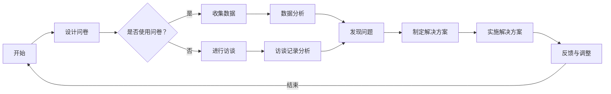
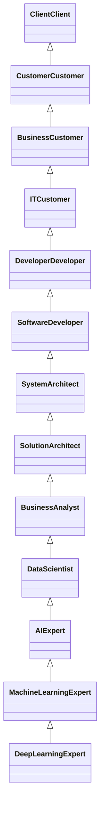

                 

### 摘要

本文旨在深入探讨技术咨询服务体系及其构建专业咨询能力的方法。随着科技的发展，技术咨询服务在企业管理中扮演着越来越重要的角色。然而，如何有效地构建专业咨询能力，使其在复杂多变的商业环境中发挥最大价值，成为了企业面临的一大挑战。本文将从多个维度展开讨论，首先介绍技术咨询服务体系的基本概念和发展历程，然后深入分析构建专业咨询能力的核心要素，包括咨询能力的发展路径和评估方法。接下来，我们将探讨如何建立专业的咨询团队，以及咨询服务方法、工具和方案的制定与实施。最后，本文将结合实际案例，总结行业最佳实践，为技术咨询服务体系的建设提供有力支持。通过本文的阅读，读者将能够全面了解技术咨询服务体系，掌握构建专业咨询能力的有效策略。

### 目录大纲设计

为了确保文章的逻辑性和条理性，我们设计了以下完整的目录大纲：

**第一部分：技术咨询服务体系概述**

- **第1章 技术咨询服务体系概述**
  - **1.1 问题背景与问题描述**
    - **1.1.1 技术咨询服务的发展历程**
    - **1.1.2 技术咨询服务在现代经济中的作用**
    - **1.1.3 技术咨询服务面临的挑战与机遇**
  - **1.2 核心概念与联系**
    - **1.2.1 技术咨询服务的定义**
    - **1.2.2 技术咨询服务的分类**
    - **1.2.3 技术咨询服务与相关概念的联系**
  - **1.3 技术咨询服务的外延与边界**
    - **1.3.1 技术咨询服务的外延扩展**
    - **1.3.2 技术咨询服务的边界界定**
    - **1.3.3 技术咨询服务的关键要素**
  - **1.4 技术咨询服务的发展趋势**
    - **1.4.1 数字化转型对技术咨询服务的影响**
    - **1.4.2 新技术（如AI、大数据等）在技术咨询服务中的应用**
    - **1.4.3 国际化趋势下的技术咨询服务**
  - **1.5 本章小结**

**第二部分：构建专业咨询能力**

- **第2章 核心概念与联系**
  - **2.1 咨询能力的定义与特征**
    - **2.1.1 咨询能力的概念**
    - **2.1.2 咨询能力的特征**
    - **2.1.3 咨询能力的分类**
  - **2.2 核心概念与联系**
    - **2.2.1 咨询方法与工具**
    - **2.2.2 技能与知识体系**
  - **2.3 咨询能力的发展与提升**
    - **2.3.1 咨询能力的成长路径**
    - **2.3.2 咨询能力的评估与认证**
    - **2.3.3 咨询能力的持续提升策略**
  - **2.4 本章小结**

- **第3章 建立专业咨询团队**
  - **3.1 团队建设的重要性**
    - **3.1.1 团队合作的优势**
    - **3.1.2 团队建设的目标**
    - **3.1.3 团队建设的关键要素**
  - **3.2 团队角色的设定与职责**
    - **3.2.1 咨询顾问的角色与职责**
    - **3.2.2 项目经理的角色与职责**
    - **3.2.3 支持团队的角色与职责**
  - **3.3 团队管理策略**
    - **3.3.1 团队沟通与协作**
    - **3.3.2 团队绩效评估**
    - **3.3.3 团队激励与成长**
  - **3.4 本章小结**

- **第4章 咨询方法论与工具**
  - **4.1 咨询方法的选择与应用**
    - **4.1.1 常见咨询方法概述**
    - **4.1.2 选择合适咨询方法的考虑因素**
    - **4.1.3 咨询方法的实际应用案例**
  - **4.2 咨询工具的运用**
    - **4.2.1 咨询工具的类型与功能**
    - **4.2.2 咨询工具的优缺点分析**
    - **4.2.3 咨询工具的选用建议**
  - **4.3 咨询方案的制定与实施**
    - **4.3.1 咨询方案的设计要点**
    - **4.3.2 咨询方案的制定流程**
    - **4.3.3 咨询方案的实施策略**
  - **4.4 本章小结**

**第三部分：服务管理体系**

- **第5章 服务管理体系的建设与运作**
  - **5.1 服务管理体系的定义与目的**
    - **5.1.1 服务管理体系的内涵**
    - **5.1.2 服务管理体系的建设目标**
    - **5.1.3 服务管理体系的重要性**
  - **5.2 服务管理体系的核心要素**
    - **5.2.1 服务战略与规划**
    - **5.2.2 服务设计**
    - **5.2.3 服务过渡**
    - **5.2.4 服务运营**
    - **5.2.5 服务改进**
  - **5.3 服务管理体系的关键**
    - **5.3.1 服务质量管理体系**
    - **5.3.2 服务持续改进体系**
    - **5.3.3 服务交付与支持体系**

通过以上目录大纲的设计，我们不仅明确了文章的整体结构，还确保了各个章节之间的逻辑联系和内容连贯性。在接下来的内容中，我们将逐一深入探讨各个章节的核心内容，以帮助读者全面理解技术咨询服务体系和构建专业咨询能力的方法。

## 技术咨询服务体系概述

### 1.1 问题背景与问题描述

在当前快速发展的信息化时代，技术咨询服务在企业运营和管理中发挥着至关重要的作用。技术咨询服务主要是指通过专业的技术和经验，为企业提供战略规划、系统设计、优化升级、风险管理等全方位的技术支持服务。其目的是帮助企业应对日益复杂的市场环境和技术变革，提升企业的竞争力。

#### 1.1.1 技术咨询服务的发展历程

技术咨询服务的历史可以追溯到20世纪中期，当时企业逐渐意识到信息技术的重要性，开始聘请外部专家来指导其IT系统的建设与优化。随着计算机技术和互联网的快速发展，技术咨询服务的内容和范围也在不断扩展，从最初的IT系统构建和运维，逐渐延伸到企业战略、管理流程优化、数字化转型等领域。

#### 1.1.2 技术咨询服务在现代经济中的作用

在当今全球经济一体化的背景下，技术咨询服务在现代经济中扮演着重要角色。首先，技术咨询服务帮助企业提升技术能力，实现技术创新，从而推动产业升级。其次，通过专业的咨询服务，企业能够更好地应对市场变化和竞争压力，提高经营效率。此外，技术咨询服务还能为企业提供战略指导，帮助企业在复杂的市场环境中制定科学的决策，实现可持续发展。

#### 1.1.3 技术咨询服务面临的挑战与机遇

尽管技术咨询服务在现代经济中具有重要地位，但其也面临着一系列挑战。首先，随着技术的不断进步，企业所需的技术服务内容也在不断更新，这对咨询服务提供商的技术能力和知识体系提出了更高要求。其次，市场竞争日益激烈，企业对咨询服务质量的要求也越来越高，如何提供高质量的咨询服务成为了一个重要课题。

与此同时，技术咨询服务也面临着诸多机遇。数字化转型成为全球发展趋势，为企业提供了大量技术服务需求。同时，新兴技术（如人工智能、大数据、区块链等）的应用，为技术咨询服务带来了新的发展空间。此外，国际化进程的加快，也为技术咨询服务提供了广阔的市场机会。

### 1.2 技术咨询服务的核心概念

要深入理解技术咨询服务，首先需要明确其核心概念。技术咨询服务涉及多个方面，包括技术、服务、咨询和客户需求等。以下是几个关键概念的定义和联系：

#### 1.2.1 技术咨询服务的定义

技术咨询服务是指专业机构或个人，通过运用先进的科技手段和专业的知识体系，为客户提供全方位的技术支持和服务。它不仅包括技术层面的解决方案，还涉及战略规划、管理咨询、风险管理等多个维度。

#### 1.2.2 技术咨询服务的分类

技术咨询服务可以按照服务内容、服务领域、服务对象等不同维度进行分类。常见的分类方法包括：

- **按服务内容分类**：可以分为IT系统建设与运维、数字化转型、业务流程优化、信息技术战略规划等。
- **按服务领域分类**：可以分为信息技术、电子商务、智能制造、新能源技术等。
- **按服务对象分类**：可以分为大型企业、中小企业、初创企业等。

#### 1.2.3 技术咨询服务与相关概念的联系

技术咨询服务与多个相关概念密切相关，如IT服务、技术支持、技术咨询等。以下是这些概念之间的联系和区别：

- **IT服务**：是指提供计算机技术支持、维护和管理的服务，通常包括硬件维护、软件支持、网络安全等。
- **技术支持**：是指针对特定技术问题提供解决方案的服务，通常是在IT服务的基础上，针对更具体的技术问题进行解决。
- **技术咨询**：是指通过专业的技术和知识，为企业提供战略指导、管理建议和系统优化等服务，更注重整体解决方案的提供。

### 1.3 技术咨询服务的外延与边界

#### 1.3.1 技术咨询服务的外延扩展

随着科技的发展和市场需求的不断变化，技术咨询服务的外延也在不断扩展。传统的IT系统建设和运维已经不足以满足企业的需求，越来越多的咨询服务开始涉及企业战略、管理流程优化、业务创新等领域。例如，数字化转型咨询服务、人工智能应用咨询服务等，都是技术咨询服务外延扩展的体现。

#### 1.3.2 技术咨询服务的边界界定

技术咨询服务的边界相对复杂，主要受以下几个方面的影响：

- **服务内容**：技术咨询服务的内容范围广泛，包括但不限于IT系统建设、数字化转型、业务流程优化等。服务内容的多样性和复杂性决定了咨询服务的边界。
- **客户需求**：客户需求的变化和多样性也是影响技术咨询服务边界的重要因素。不同的客户可能会有不同的需求，这要求咨询服务提供者能够灵活调整服务内容，以满足客户需求。
- **市场环境**：市场环境的动态变化也会对技术咨询服务的边界产生影响。例如，新技术的出现、市场需求的变迁等，都会导致技术咨询服务的内容和范围发生变化。

#### 1.3.3 技术咨询服务的关键要素

为了确保技术咨询服务的高效性和有效性，以下关键要素需要被重点关注：

- **专业能力**：咨询服务提供者需要具备深厚的专业知识和丰富的实践经验，能够为客户提供高质量的技术支持和服务。
- **客户需求**：了解和满足客户需求是技术咨询服务成功的关键。咨询服务提供者需要通过深入的调研和沟通，准确把握客户的需求和期望。
- **服务质量**：服务质量是技术咨询服务成功的重要保障。咨询服务提供者需要建立完善的服务质量管理体系，确保服务的稳定性和可靠性。
- **持续改进**：技术咨询服务需要不断适应市场变化和技术进步，通过持续改进和创新，不断提升服务水平和竞争力。

### 1.4 技术咨询服务的发展趋势

#### 1.4.1 数字化转型对技术咨询服务的影响

数字化转型已成为全球企业的共同趋势，它对技术咨询服务产生了深远影响。首先，数字化转型增加了企业对技术服务的需求，特别是在大数据、云计算、人工智能等新兴技术的应用方面。其次，数字化转型要求咨询服务提供者具备更高的技术能力和更全面的解决方案，以帮助企业在数字化进程中取得成功。

#### 1.4.2 新技术（如AI、大数据等）在技术咨询服务中的应用

人工智能、大数据、区块链等新兴技术的快速发展，为技术咨询服务带来了新的机遇。这些新技术不仅能够提升咨询服务的技术含量，还能够帮助企业实现更高效的运营和更精准的决策。例如，通过大数据分析，咨询服务提供者可以更深入地了解客户需求，提供更有针对性的解决方案。而人工智能的应用，则可以自动化一些复杂的咨询任务，提高工作效率和准确性。

#### 1.4.3 国际化趋势下的技术咨询服务

随着全球化进程的加快，企业的运营范围越来越广泛，国际化趋势对技术咨询服务也提出了新的要求。首先，国际化要求咨询服务提供者具备跨文化沟通和合作能力，能够理解和满足不同国家和地区客户的需求。其次，国际化也带来了更多的市场机会，咨询服务提供者可以通过拓展国际市场，实现业务的进一步增长。

### 1.5 本章小结

本章对技术咨询服务体系进行了全面的概述，从问题背景、核心概念、外延与边界以及发展趋势等多个角度进行了深入分析。通过本章的讨论，读者可以全面了解技术咨询服务体系的基本概念和发展现状，为进一步探讨构建专业咨询能力打下坚实基础。

### 构建专业咨询能力

#### 2.1 咨询能力的定义与特征

咨询能力是指咨询人员通过专业知识和经验，为客户提供高质量、有针对性的咨询服务的综合能力。它不仅包括对特定技术领域的深入理解，还涵盖了广泛的跨学科知识和能力。以下是咨询能力的一些核心特征：

1. **专业性**：咨询人员需要具备深厚的专业知识和技能，能够在各自的领域内提供权威、专业的建议和解决方案。
2. **综合性**：咨询能力不仅仅局限于单一的技术领域，还需要涵盖管理、战略、市场等多个方面，能够从全局角度为企业提供综合性咨询。
3. **经验性**：咨询人员需要通过大量的实践积累经验，能够将理论知识与实际操作相结合，提供实用的咨询服务。
4. **灵活性**：咨询能力需要具备很强的适应性和灵活性，能够根据客户的具体需求和环境变化，灵活调整咨询方案。
5. **沟通能力**：咨询人员需要具备出色的沟通能力，能够有效地与客户、团队成员以及其他利益相关者进行沟通，确保咨询服务的顺利进行。

#### 2.2 核心概念与联系

在构建专业咨询能力的过程中，理解以下几个核心概念及其相互关系是非常重要的：

1. **咨询方法与工具**：咨询方法是指咨询人员在实践中使用的具体方法和技巧，包括访谈、问卷调查、数据分析、SWOT分析等。而咨询工具则是支撑这些方法的软件和硬件设备，如调查问卷软件、数据分析工具、会议管理系统等。

2. **技术与知识体系**：咨询人员需要建立全面的技术与知识体系，包括但不限于专业领域的技术知识、管理知识、行业知识等。这个体系不仅需要涵盖广泛的知识面，还需要具备深度和系统性。

3. **项目管理能力**：咨询人员需要具备项目管理能力，能够有效地规划、执行和监控咨询项目，确保项目按时、按质、按预算完成。

4. **客户关系管理**：咨询人员需要建立和维护良好的客户关系，通过深入了解客户需求，提供定制化的咨询服务，增强客户满意度和忠诚度。

#### 2.2.1 咨询方法与工具

在咨询实践中，选择合适的咨询方法和工具是至关重要的一步。以下是一些常见的咨询方法和工具：

- **访谈**：通过与客户或相关利益相关者进行面对面的交流，获取第一手的信息和反馈。
- **问卷调查**：通过设计问卷，收集大量数据和意见，进行定量分析。
- **数据分析**：利用数据分析工具，对收集到的数据进行分析，发现潜在问题和机会。
- **SWOT分析**：通过分析企业的优势、劣势、机会和威胁，制定相应的战略。
- **心智图**：通过绘制心智图，梳理和整理复杂的信息，帮助咨询人员更好地理解和记忆。

下面通过一个Mermaid流程图，展示一个典型的咨询方法应用流程：

#### 2.2.2 技能与知识体系

构建专业的咨询能力需要咨询人员具备广泛而深入的技术与知识体系。以下是一个简化的技能与知识体系结构，用于展示不同层次的技能和知识：

在这个技能与知识体系中，从客户需求分析到具体技术实施，每个层级都需要不同的专业技能和知识。例如，业务分析师需要具备业务流程优化和需求分析的能力，而数据科学家则需要具备数据分析和机器学习算法的应用能力。

#### 2.3 咨询能力的发展与提升

咨询能力的发展是一个持续的过程，需要咨询人员不断地学习和实践。以下是一些提升咨询能力的方法：

1. **持续学习**：咨询人员需要不断更新自己的知识和技能，通过参加培训、阅读专业书籍、学习新工具和新技术等途径，保持专业竞争力。
2. **实践积累**：通过参与实际项目，咨询人员可以积累丰富的实践经验，提高问题解决能力。
3. **团队合作**：咨询人员需要与团队成员紧密合作，通过团队讨论和知识共享，提升整体咨询能力。
4. **客户反馈**：通过收集客户反馈，咨询人员可以了解自己的咨询服务效果，发现不足并进行改进。
5. **专业认证**：获得专业认证（如PMP、ITIL等）可以提升咨询人员的专业信誉和市场竞争力。

#### 2.3.1 咨询能力的成长路径

咨询能力的成长路径可以分为以下几个阶段：

1. **入门阶段**：了解基础知识和技能，通过学习和实践，积累初步的经验。
2. **初级阶段**：具备一定的专业知识和实践经验，能够独立完成简单的咨询任务。
3. **中级阶段**：具备全面的专业知识和较强的实践能力，能够应对复杂的项目和挑战。
4. **高级阶段**：拥有丰富的经验和深厚的专业知识，能够在不同领域为客户提供高质量、全方位的咨询服务。

#### 2.3.2 咨询能力的评估与认证

为了确保咨询能力的持续提升，咨询能力的评估和认证是非常必要的。以下是一些评估与认证的方法：

1. **内部评估**：咨询公司可以通过定期考核和评估，评估咨询人员的专业能力和项目绩效。
2. **第三方评估**：通过第三方专业机构进行评估，如获得PMP、ITIL等国际认证。
3. **客户反馈**：通过客户反馈，评估咨询服务的质量和效果。

#### 2.3.3 咨询能力的持续提升策略

为了持续提升咨询能力，以下策略可以提供参考：

1. **建立知识管理体系**：通过建立知识管理体系，收集、整理和分享专业知识，提升团队的整体能力。
2. **实施持续改进**：通过不断评估和改进，优化咨询方法和流程，提高服务质量和效率。
3. **投资人才培养**：通过培训、导师制度、项目实践等多种方式，培养和提升咨询人员的专业能力。
4. **建立绩效激励机制**：通过设立绩效目标和激励机制，鼓励咨询人员不断提升自身能力。

### 2.4 本章小结

本章详细探讨了构建专业咨询能力的核心概念、方法与工具，以及能力的发展与提升策略。通过明确咨询能力的定义与特征，分析核心概念与联系，介绍咨询方法与工具，以及提出咨询能力的成长路径和评估认证方法，本章为读者提供了全面的理论和实践指导。通过不断学习和实践，咨询人员可以不断提升自身的专业能力，为企业提供高质量的技术咨询服务。

### 建立专业咨询团队

#### 3.1 团队建设的重要性

在技术咨询服务中，团队建设的重要性不言而喻。一个高效的咨询团队不仅能够提高项目的成功率，还能够增强企业的竞争力。以下是团队建设的重要性和目标：

#### 3.1.1 团队合作的优势

1. **资源共享**：团队成员可以共享知识和资源，提高工作效率。
2. **互补优势**：不同成员的技能和经验互补，能够解决复杂的问题。
3. **协同创新**：团队成员的协同工作能够激发创新思维，提出更优的解决方案。
4. **快速响应**：团队协作可以快速响应客户需求，提高客户满意度。
5. **共同成长**：团队建设有助于成员相互学习，共同成长。

#### 3.1.2 团队建设的目标

团队建设的主要目标是建立一个高效、协作、稳定的团队，确保咨询服务能够满足客户需求，并持续提升服务质量。具体目标包括：

1. **提升团队凝聚力**：通过建立共同的目标和价值观，增强团队成员的归属感和责任感。
2. **优化团队结构**：根据项目需求，合理配置团队成员，确保每个成员都能发挥最大的作用。
3. **提高团队效率**：通过优化工作流程和协作方式，提高团队的整体工作效率。
4. **培养人才**：为团队成员提供培训和成长机会，提升团队的整体能力。
5. **增强客户满意度**：通过提供高质量的咨询服务，提高客户满意度和忠诚度。

#### 3.1.3 团队建设的关键要素

要实现上述团队建设的目标，以下关键要素是不可或缺的：

1. **明确角色与职责**：每个团队成员都应该明确自己的角色和职责，确保工作流程的顺畅。
2. **有效的沟通**：建立开放的沟通渠道，确保信息能够及时、准确地传递。
3. **共同目标**：团队成员应共同设定目标，明确方向和期望，激发团队的协作动力。
4. **激励机制**：通过设立绩效目标和激励机制，鼓励团队成员积极参与和努力工作。
5. **持续培训**：定期为团队成员提供培训，提升其专业技能和知识水平。
6. **团队文化建设**：通过团队活动和文化建设，增强团队成员的归属感和团队精神。

#### 3.2 团队角色的设定与职责

在一个专业咨询团队中，不同角色之间的协作至关重要。以下是对常见团队角色的设定与职责的描述：

1. **咨询顾问**：作为团队的核心成员，咨询顾问负责提供专业的技术和管理咨询。他们的职责包括：
   - 与客户沟通，了解需求；
   - 分析问题，制定解决方案；
   - 实施咨询项目，监督项目进展；
   - 撰写报告，总结项目成果。

2. **项目经理**：项目经理负责项目的整体管理和协调。他们的职责包括：
   - 制定项目计划，分配任务；
   - 监督项目进度，确保按时交付；
   - 管理项目风险，应对突发情况；
   - 沟通协调，确保团队协作。

3. **技术专家**：技术专家负责提供技术层面的支持和解决方案。他们的职责包括：
   - 解决技术难题，确保技术方案的可行性；
   - 进行技术评估，提出优化建议；
   - 参与项目实施，确保技术实施符合要求；
   - 撰写技术文档，为后续维护提供支持。

4. **支持团队**：支持团队包括业务分析师、文档编写人员、测试工程师等，他们为项目提供辅助和支持。他们的职责包括：
   - 收集和整理业务需求，编写需求文档；
   - 编写项目报告，制作演示文档；
   - 进行系统测试，确保项目质量；
   - 提供用户培训和支持。

#### 3.3 团队管理策略

一个高效的团队需要有效的管理策略来支持。以下是一些关键的团队管理策略：

1. **沟通与协作**：建立开放的沟通渠道，鼓励团队成员之间的交流与合作。可以使用团队协作工具，如Slack、Trello等，提高信息传递的效率和准确性。

2. **绩效评估**：通过设立明确的绩效目标和评估标准，定期对团队成员进行绩效评估。绩效评估可以帮助团队了解每个成员的工作表现，发现问题和改进方向。

3. **激励机制**：为团队成员设立激励机制，如奖金、晋升机会等，以鼓励他们积极参与和努力工作。激励机制应与团队目标和个人发展相结合。

4. **培训与发展**：定期为团队成员提供培训机会，提升其专业技能和知识水平。培训内容应包括新技术、新方法、行业趋势等，以帮助团队成员适应不断变化的市场需求。

5. **团队文化建设**：通过团队活动和文化建设，增强团队成员的归属感和团队精神。可以组织团队建设活动，如团队拓展训练、团建活动等，促进团队成员之间的交流和合作。

6. **冲突管理**：在团队中，冲突是不可避免的。有效的冲突管理策略可以帮助团队解决内部矛盾，保持团队稳定。冲突管理策略包括开放沟通、理性分析、调解协调等。

#### 3.4 本章小结

本章详细探讨了团队建设的重要性、团队角色的设定与职责，以及团队管理策略。通过明确团队建设的目标和关键要素，设定清晰的团队角色和职责，以及实施有效的管理策略，咨询团队可以更好地协作，提供高质量的咨询服务。团队建设是一个持续的过程，需要不断地优化和改进，以适应市场变化和客户需求。通过有效的团队建设，咨询团队可以提升整体绩效，增强企业的竞争力。

### 咨询方法论与工具

在技术咨询服务中，选择合适的咨询方法和工具是至关重要的。这不仅能够提高咨询效率，还能确保咨询结果的准确性和有效性。以下将详细介绍常见的咨询方法、工具及其在实际应用中的效果。

#### 4.1 咨询方法的选择与应用

咨询方法是指咨询人员在进行咨询工作时所采用的具体方法和技巧。以下是一些常用的咨询方法及其应用场景：

1. **访谈法**：访谈法是通过与客户及相关利益相关者进行面对面的交流，收集信息和反馈的方法。它适用于了解客户需求、评估业务现状、获取用户反馈等场景。

   **应用案例**：在一次企业数字化转型项目中，咨询团队通过访谈法与高管、IT部门人员、业务部门员工进行了深入交流，了解他们对数字化转型的期望和顾虑，为制定数字化转型策略提供了重要依据。

2. **问卷调查法**：问卷调查法是通过设计问卷，收集大量数据和意见的方法。它适用于大规模数据收集、员工满意度调查、市场调研等场景。

   **应用案例**：在一次员工满意度调查中，咨询团队设计了详细的问卷，通过电子邮件和在线调查平台收集了数千名员工的反馈，从而全面了解员工对公司各项政策的看法，为改进人力资源管理提供了数据支持。

3. **数据分析法**：数据分析法是利用数据分析工具，对收集到的数据进行处理和分析，以发现问题和机会的方法。它适用于财务分析、市场分析、风险评估等场景。

   **应用案例**：在一次财务审计项目中，咨询团队利用数据分析法对企业的财务报表进行了详细分析，发现了潜在的财务风险，为企业提供了改进建议。

4. **SWOT分析法**：SWOT分析法是通过对企业的优势、劣势、机会和威胁进行分析，制定相应战略的方法。它适用于战略规划、市场分析等场景。

   **应用案例**：在一次企业战略规划项目中，咨询团队运用SWOT分析法，全面分析了企业的内外部环境，为制定科学的战略提供了重要依据。

5. **头脑风暴法**：头脑风暴法是通过集体讨论，激发创意和灵感的方法。它适用于创新思考、问题解决等场景。

   **应用案例**：在一次新产品开发项目中，咨询团队组织了多次头脑风暴会议，集思广益，提出了多个创新的产品方案，最终成功推出了市场反响热烈的新产品。

#### 4.2 咨询工具的运用

咨询工具是支撑咨询方法的具体软件和硬件设备，它们能够提高咨询效率，确保数据的准确性和可靠性。以下是一些常见的咨询工具及其特点：

1. **调查问卷工具**：如SurveyMonkey、Typeform等，这些工具可以帮助咨询团队设计、分发和收集问卷，提高数据收集的效率和准确性。

   **优点**：操作简便，数据可视化，便于分析和报告生成。

   **缺点**：问卷设计需要专业知识，不适合大规模数据收集。

2. **数据分析工具**：如Excel、Tableau等，这些工具可以帮助咨询团队进行数据处理、分析和可视化。

   **优点**：功能强大，易于操作，适用于各种类型的数据分析。

   **缺点**：对用户数据分析和处理能力要求较高，数据可视化效果有限。

3. **项目管理工具**：如Trello、Jira等，这些工具可以帮助咨询团队管理项目进度、任务分配和协作。

   **优点**：界面简洁，易于使用，支持多种协作方式。

   **缺点**：项目管理功能相对单一，不适合复杂项目。

4. **会议协作工具**：如Zoom、Microsoft Teams等，这些工具可以帮助咨询团队进行远程会议和协作。

   **优点**：支持多平台、多设备，实时通信和协作。

   **缺点**：网络稳定性对使用效果有较大影响。

5. **知识管理系统**：如Confluence、Notion等，这些工具可以帮助咨询团队管理和共享知识，提高团队协作效率。

   **优点**：功能丰富，支持多种知识管理方式。

   **缺点**：学习曲线较陡，需要一定的时间适应。

#### 4.3 咨询方案的制定与实施

咨询方案是咨询服务的重要输出物，它明确了咨询的目标、方法、工具和预期结果。以下是咨询方案的制定和实施流程：

1. **明确咨询目标**：在制定咨询方案前，需要与客户明确咨询的目标和期望，确保方案的方向正确。

2. **选择咨询方法**：根据客户需求和咨询目标，选择合适的咨询方法。不同方法适用于不同类型的咨询问题。

3. **制定咨询计划**：制定详细的咨询计划，包括咨询的步骤、时间表、资源和预算等。

4. **实施咨询方案**：按照咨询计划，逐步实施咨询工作。在实施过程中，需要不断与客户沟通，确保方案的执行符合预期。

5. **监控和评估**：在咨询过程中，需要定期监控咨询进度和效果，及时调整方案。咨询结束后，进行效果评估，总结经验和教训。

6. **撰写咨询报告**：咨询方案实施完成后，需要撰写详细的咨询报告，总结咨询过程、方法和结果，为客户提供全面的解决方案。

### 4.4 本章小结

本章详细探讨了咨询方法论与工具的选择与应用。通过介绍常见的咨询方法和工具，以及咨询方案的制定与实施流程，本文为读者提供了构建专业咨询能力的实用指南。在技术咨询服务中，选择合适的咨询方法和工具，制定有效的咨询方案，是确保咨询服务质量和效果的关键。通过不断学习和实践，咨询人员可以提升自身的专业能力，为客户提供更高质量的咨询服务。

### 服务管理体系的建设与运作

#### 5.1 服务管理体系的定义与目的

服务管理体系是一种系统化的管理方法，旨在通过设计、实施、监控和改进服务过程，确保服务能够满足客户需求和期望。它不仅包括服务流程的规范化和标准化，还包括对服务质量、客户满意度和业务效率的持续监控和改进。以下是服务管理体系的几个核心组成部分：

1. **服务战略与规划**：确定服务的愿景、目标、关键成功因素和资源分配。
2. **服务设计**：定义服务的范围、质量标准、流程和基础设施。
3. **服务过渡**：实施新的或变更的服务，确保其符合设计和需求。
4. **服务运营**：持续提供服务，确保服务的稳定性和可靠性。
5. **服务改进**：通过持续监控和改进，优化服务性能。

服务管理体系的主要目的是提高客户满意度、确保服务质量、提升运营效率，并促进业务增长。通过系统地管理和优化服务，企业可以更好地应对市场变化，保持竞争优势。

#### 5.2 服务管理体系的核心要素

一个高效的服务管理体系需要以下几个核心要素的支持：

1. **服务战略与规划**：

   服务战略与规划是服务管理体系的基础，它涉及以下关键步骤：

   - **愿景与目标**：明确服务的长远目标和愿景，确保服务战略与企业的整体战略一致。
   - **关键成功因素**：识别实现服务目标的关键因素，如成本、质量、速度和灵活性。
   - **资源分配**：根据服务战略的需求，合理分配资源，包括人力、财务和技术资源。

2. **服务设计**：

   服务设计是服务管理体系的重要组成部分，它涉及以下关键活动：

   - **服务范围**：定义服务的内容、边界和责任，确保服务的完整性和一致性。
   - **质量标准**：制定服务质量标准，包括服务水平协议（SLA）和服务级别目标（SLO），确保服务的可靠性和可用性。
   - **流程与基础设施**：设计服务流程，确保服务能够高效、有序地提供。同时，建立必要的基础设施，如技术平台、工具和系统。

3. **服务过渡**：

   服务过渡是指将新的或变更的服务从设计阶段转移到运营阶段。它包括以下关键活动：

   - **服务迁移**：将现有服务逐步迁移到新的服务环境。
   - **测试与验证**：对新的或变更的服务进行严格测试，确保其符合设计标准和预期性能。
   - **培训与文档**：为员工提供必要的培训，确保他们能够熟练操作新的服务。同时，更新相关文档，以便后续参考。

4. **服务运营**：

   服务运营是确保服务持续稳定提供的关键环节。它包括以下关键活动：

   - **日常运营**：执行服务运营流程，确保服务质量和客户满意度。
   - **监控与报告**：监控服务性能和关键指标，生成报告，为决策提供数据支持。
   - **问题管理**：及时识别和解决服务运营中的问题，确保服务的连续性和可靠性。

5. **服务改进**：

   服务改进是一个持续的过程，旨在通过不断监控、评估和优化，提高服务性能。它包括以下关键活动：

   - **持续监控**：定期收集和分析服务性能数据，识别改进机会。
   - **评估与反馈**：对服务性能进行评估，收集客户和员工的反馈，识别改进需求。
   - **改进实施**：制定和实施改进措施，优化服务流程和基础设施。

#### 5.3 服务管理体系的关键

为了确保服务管理体系的顺利实施和持续改进，以下关键因素需要被重点关注：

1. **服务质量管理体系**：

   服务质量管理体系是服务管理体系的核心，它通过一系列标准和流程，确保服务的质量满足客户需求和期望。以下是一些关键要素：

   - **服务水平协议（SLA）**：明确服务提供者和客户之间的权利和义务，确保服务质量和客户满意度。
   - **服务级别目标（SLO）**：设定具体的服务绩效指标，如响应时间、解决时间等，确保服务的一致性和可靠性。
   - **质量监控与评估**：定期监控服务质量，识别和解决质量问题。

2. **服务持续改进体系**：

   服务持续改进体系是服务管理体系的重要组成部分，它通过持续监控、评估和优化，不断提高服务性能。以下是一些关键要素：

   - **持续改进流程**：建立持续改进的流程和机制，确保问题能够及时识别和解决。
   - **改进计划与实施**：制定和实施具体的改进计划，优化服务流程和基础设施。
   - **改进效果评估**：评估改进措施的效果，确保服务性能得到持续提升。

3. **服务交付与支持体系**：

   服务交付与支持体系是确保服务能够按时、按质交付的关键。以下是一些关键要素：

   - **服务交付流程**：明确服务交付的流程和步骤，确保服务交付的连续性和一致性。
   - **技术支持与维护**：提供技术支持和维护服务，确保服务环境稳定运行。
   - **客户支持与反馈**：建立有效的客户支持体系，及时响应客户需求和反馈，提升客户满意度。

### 5.4 本章小结

本章详细探讨了服务管理体系的建设与运作，包括其定义与目的、核心要素和关键要素。通过系统地设计、实施和持续改进服务管理体系，企业可以确保服务的高质量、高效能和可持续性。服务管理体系不仅是提高客户满意度的有力工具，也是企业持续发展和竞争优势的重要保障。

### 案例分析

为了更深入地理解技术咨询服务体系的实际应用，下面将通过一个具体案例进行详细剖析。

#### 案例背景

某大型制造企业面临着数字化转型带来的挑战，希望通过技术咨询服务实现生产线的智能化升级，提高生产效率，降低成本。该公司在数字化转型方面经验不足，希望借助外部专业咨询团队的支持，实现目标。

#### 案例分析

1. **需求调研**：
   咨询团队首先与企业的管理层和一线员工进行了多次访谈，深入了解企业的生产流程、技术现状、人员结构以及数字化转型中的痛点和期望。通过这些调研，咨询团队明确了以下需求：
   - 提高生产线的自动化水平，减少人工操作；
   - 优化生产调度系统，提高生产效率；
   - 实现生产数据的实时监控和分析，支持智能决策。

2. **制定咨询方案**：
   根据调研结果，咨询团队制定了详细的咨询方案，包括以下关键步骤：
   - **自动化改造**：评估现有生产线，提出自动化改造方案，包括机器更换、传感器安装和集成控制系统；
   - **生产调度优化**：设计新的生产调度系统，优化生产流程，提高生产效率；
   - **数据监控与分析**：建立实时数据监控系统，整合生产数据，利用大数据分析和人工智能技术进行智能决策。

3. **实施方案**：
   在咨询方案的指导下，咨询团队与企业的技术团队紧密合作，分阶段实施以下工作：
   - **自动化改造**：咨询团队协助企业更换了关键设备，安装了传感器和控制系统，实现了生产线的自动化；
   - **生产调度优化**：咨询团队帮助企业优化了生产调度流程，引入了智能调度算法，提高了生产效率；
   - **数据监控与分析**：咨询团队建立了实时数据监控系统，通过大数据分析和人工智能技术，实现了生产数据的智能分析，支持了智能决策。

4. **效果评估**：
   咨询团队在项目实施过程中，定期评估项目进展和效果，与客户保持紧密沟通，确保项目按计划进行。项目完成后，咨询团队进行了以下效果评估：
   - **自动化水平**：生产线自动化程度显著提高，人工操作减少30%以上；
   - **生产效率**：生产调度优化后，生产效率提高了15%；
   - **数据监控与分析**：实时数据监控和智能分析能力得到了企业的高度评价，为企业带来了显著的经济效益。

#### 案例总结

通过本案例，我们可以看到技术咨询服务在实际应用中的重要作用。咨询团队通过深入的需求调研，制定了科学、可行的咨询方案，并与企业紧密合作，确保了项目的成功实施。以下是本案例的关键要点：

1. **需求调研**：深入了解客户需求是制定有效咨询方案的基础；
2. **咨询方案**：科学的咨询方案是项目成功的关键；
3. **实施与协作**：紧密的团队协作和有效的项目管理是确保项目按计划实施的关键；
4. **效果评估**：定期评估和反馈是持续优化和改进服务的重要手段。

通过这个案例，我们不仅看到了技术咨询服务在数字化转型中的重要作用，也了解了如何通过有效的咨询方法和工具，帮助企业实现技术升级和业务转型。

### 最佳实践与建议

在技术咨询服务体系中，最佳实践是确保服务质量、提升客户满意度的重要手段。以下是一些行之有效的最佳实践和实用建议：

#### 1. 深入了解客户需求

了解客户需求是技术咨询服务的基础。通过详细的需求调研，包括访谈、问卷调查和实地考察等方法，全面掌握客户的需求、痛点和期望。这有助于咨询团队制定更有针对性的解决方案。

**最佳实践**：建立客户需求跟踪机制，定期更新和验证客户需求，确保解决方案始终与客户需求保持一致。

#### 2. 科学制定咨询方案

咨询方案的科学性和可行性直接关系到项目的成败。在制定咨询方案时，应充分考虑客户的业务流程、技术现状和资源限制，制定出符合实际且具有可操作性的方案。

**最佳实践**：采用多维度分析方法，如SWOT分析、业务流程分析等，确保咨询方案具有全面性和系统性。

#### 3. 紧密团队协作

技术咨询服务通常涉及多个领域的专业知识和技能，需要团队成员之间的紧密协作。建立有效的团队协作机制，包括明确角色和职责、定期沟通和知识共享，是提升咨询服务质量的关键。

**最佳实践**：实施跨部门协作流程，定期召开团队会议，确保团队成员之间的信息畅通和任务协调。

#### 4. 持续监控与改进

在咨询项目实施过程中，应持续监控项目进展和服务质量，及时识别和解决问题。通过定期评估和反馈，不断优化咨询方法和流程，提升服务性能。

**最佳实践**：建立服务性能监控体系，定期收集和分析关键指标数据，制定改进措施。

#### 5. 强化客户关系管理

客户满意度是技术咨询服务成功的重要标志。建立良好的客户关系，定期与客户沟通，及时解决客户问题，是提升客户满意度的重要手段。

**最佳实践**：实施客户关系管理系统，定期收集客户反馈，建立客户档案，确保服务个性化。

#### 6. 投资人才培养

咨询团队的素质和能力是咨询服务质量的重要保障。持续投资人才培养，提升团队成员的专业能力和综合素质，是提高咨询服务竞争力的关键。

**最佳实践**：制定人才培养计划，提供专业培训、导师指导和项目实践机会，助力团队成员职业发展。

#### 7. 建立服务标准与流程

制定清晰的服务标准和工作流程，确保咨询服务的一致性和高效性。通过标准化管理，提升服务质量和客户满意度。

**最佳实践**：建立服务标准手册，实施标准化流程，定期审查和更新，确保服务与市场发展趋势保持一致。

通过上述最佳实践和实用建议，咨询团队可以更有效地构建专业咨询能力，提供高质量的咨询服务，帮助企业实现技术升级和业务转型。

### 小结

本文通过深入探讨技术咨询服务体系及其构建专业咨询能力的方法，详细阐述了咨询服务的核心概念、方法与工具，以及服务管理体系的建设与运作。技术咨询服务在现代经济中具有重要地位，通过专业的技术支持和咨询服务，企业能够提升技术能力、优化管理流程、实现数字化转型，从而在激烈的市场竞争中立于不败之地。

构建专业咨询能力是技术咨询服务成功的关键。通过明确咨询能力的定义与特征，分析核心概念与联系，介绍咨询方法与工具，以及提出咨询能力的成长路径和评估认证方法，本文为读者提供了全面的理论和实践指导。同时，通过案例分析，展示了技术咨询服务在实际应用中的重要作用。

服务管理体系则是确保技术咨询服务高效运作的基础。通过科学制定服务战略与规划、明确服务设计、实施服务过渡、运营服务以及持续改进服务，企业可以确保服务的高质量、高效能和可持续性。

在未来的发展中，技术咨询服务将继续面临新的挑战和机遇。数字化转型、新兴技术的应用和国际化趋势将进一步推动技术咨询服务的发展。咨询团队需要不断提升自身专业能力，积极适应市场变化，提供更有针对性的解决方案。

本文的读者应重点关注以下几个方面：

1. **深入理解核心概念**：通过理解技术咨询服务的核心概念，明确其定义、分类和应用场景，为实际工作提供理论支持。
2. **掌握咨询方法和工具**：熟悉并掌握常见的咨询方法和工具，如访谈、问卷调查、数据分析等，以提高咨询服务的效率和准确性。
3. **重视团队建设与管理**：建立高效、协作的咨询团队，通过明确角色与职责、优化团队结构、实施有效的管理策略，提升整体咨询服务质量。
4. **持续学习与提升**：通过定期培训、学习新方法和新技术，持续提升个人和专业能力，保持市场竞争力。
5. **关注最佳实践**：学习和借鉴行业最佳实践，结合自身实际，制定有效的服务标准和流程，确保服务质量和客户满意度。

通过本文的深入探讨，读者可以全面了解技术咨询服务体系，掌握构建专业咨询能力的有效策略，为企业提供高质量的技术咨询服务，助力企业的可持续发展。

### 拓展阅读

为了进一步深入理解技术咨询服务体系及其构建专业咨询能力的方法，以下是几篇推荐的拓展阅读材料：

1. **《信息技术咨询服务：理论与实践》** - 本书系统地介绍了信息技术咨询服务的理论框架和实践方法，包括咨询服务流程、技术分析方法、项目管理技巧等，对技术咨询服务体系进行了全面探讨。

2. **《数字化转型中的咨询服务》** - 本文详细分析了数字化转型背景下，技术咨询服务的重要作用和具体实践，探讨了如何利用新技术（如人工智能、大数据等）提升咨询服务效率和质量。

3. **《企业咨询服务手册》** - 这本书提供了详细的咨询服务指南，包括客户需求分析、咨询服务设计、项目管理和实施等方面的内容，是技术咨询服务从业者的实用参考书。

4. **《国际技术咨询服务案例研究》** - 本文通过多个国际技术咨询服务案例，展示了不同文化和市场环境下的咨询服务实践，为读者提供了丰富的实际操作经验。

5. **《咨询心理学：技术咨询服务中的心理学应用》** - 本文探讨了在技术咨询服务中如何运用心理学原理，提高咨询效果和客户满意度，对咨询过程中的沟通技巧和人际关系管理进行了深入分析。

通过阅读这些拓展材料，读者可以更加深入地了解技术咨询服务体系的各个方面，提升自身的专业能力，为实际工作提供更有力的支持。

