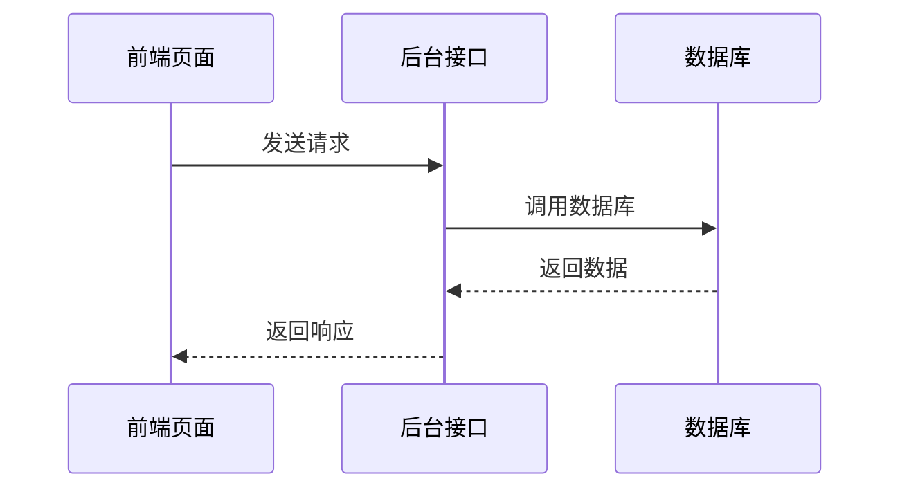

                 

**文章标题**: 技术团队文化建设的关键策略

**关键词**: 技术团队文化、团队建设、关键策略、领导力、量化评估

**摘要**: 本文旨在探讨技术团队文化建设的核心策略，通过深入分析团队文化建设的背景、关键概念、算法原理、系统分析与架构设计、项目实战以及最佳实践等，为技术团队提供实用的文化建设指导。文章以逻辑清晰、结构紧凑、简单易懂的方式，帮助读者理解团队文化建设的本质，提升团队效能。

**目录**:

----------------------------------------------------------------

# 技术团队文化建设的关键策略

> 关键词：技术团队文化、团队建设、关键策略、领导力、量化评估

> 摘要：本文深入探讨了技术团队文化建设的核心策略，包括背景介绍、关键概念、算法原理、系统分析与架构设计、项目实战以及最佳实践等，旨在为技术团队提供实用的文化建设指导。

## 第一部分：背景介绍

### 第1章：技术团队文化建设的现状

#### 1.1.1 问题背景

在当今快速发展的技术行业中，技术团队的文化建设变得愈发重要。随着团队规模的扩大和复杂性的增加，如何有效地进行团队文化建设成为许多企业面临的挑战。

#### 1.1.2 问题描述

技术团队文化建设面临的主要问题包括团队协作不畅、沟通障碍、目标不明确、缺乏激励机制等。

#### 1.1.3 问题解决

为了解决这些问题，企业需要采取一系列措施，如制定明确的团队目标、建立有效的沟通机制、提供激励机制等。

#### 1.1.4 边界与外延

团队文化建设不仅局限于技术团队，还涉及到整个企业的文化建设，需要从全局角度进行考虑。

#### 1.1.5 概念结构与核心要素组成

技术团队文化建设的核心要素包括团队价值观、协作机制、激励机制等。

## 第二部分：核心概念与联系

### 第2章：团队文化建设的关键概念

#### 2.1.1 核心概念

团队文化建设的关键概念包括团队价值观、团队协作机制、激励机制等。

#### 2.1.2 概念属性特征对比表格

以下是一个关于团队价值观、团队协作机制、激励机制的属性特征对比表格：

| 概念             | 属性特征                         | 对比结论                       |
|------------------|----------------------------------|--------------------------------|
| 团队价值观       | 明确团队目标和使命               | 是团队文化建设的核心           |
| 团队协作机制     | 确保团队内部高效协作             | 对团队文化建设起到支撑作用     |
| 激励机制         | 提高团队成员的工作积极性和创造力 | 对团队文化建设起到促进作用     |

#### 2.1.3 ER实体关系图架构

使用Mermaid语法绘制ER实体关系图：

```mermaid
erDiagram
  TeamMember ||--|{ Team : belongs_to }
  TeamMember ||--|{ Role : has_role }
  TeamMember ||--|{ Skill : has_skill }
  Team ||--|{ Project : manages }
  Role ||--|{ Responsibility : defines }
  Skill ||--|{ Level : rates }
```

## 第三部分：算法原理讲解

### 第3章：团队文化建设中的量化评估方法

#### 3.1.1 量化评估方法概述

量化评估方法是一种通过量化指标对团队文化建设进行评估的方法，常用的量化评估方法包括团队绩效评估、员工满意度调查等。

#### 3.1.2 量化评估方法的数学模型

量化评估方法的数学模型包括线性回归、聚类分析等，用于分析团队绩效和员工满意度等指标。

#### 3.1.3 量化评估方法的Python实现

以下是一个简单的Python代码示例，用于实现团队绩效评估的线性回归模型：

```python
import pandas as pd
from sklearn.linear_model import LinearRegression

# 加载数据
data = pd.read_csv('team_performance_data.csv')

# 特征选择
X = data[['experience', 'communication', 'motivation']]
y = data['performance']

# 创建线性回归模型
model = LinearRegression()
model.fit(X, y)

# 预测
predictions = model.predict(X)

# 打印结果
print(predictions)
```

### 第4章：团队文化建设中的算法原理

#### 4.1.1 算法原理讲解

团队文化建设中的算法原理主要包括团队协同算法、激励机制优化算法等。

#### 4.1.2 算法原理的数学模型和公式

以下是一个关于团队协同算法的数学模型和公式：

$$
\text{协同效应} = \alpha \cdot \text{个体能力} + \beta \cdot \text{团队协作水平}
$$

其中，$\alpha$ 和 $\beta$ 为参数，$\text{个体能力}$ 和 $\text{团队协作水平}$ 为指标。

#### 4.1.3 算法原理的举例说明

假设一个技术团队中有5名成员，他们的个体能力分别为80、75、70、65、60，团队协作水平为90。根据上述公式，可以计算出团队协同效应：

$$
\text{协同效应} = \alpha \cdot (80 + 75 + 70 + 65 + 60) + \beta \cdot 90
$$

通过调整参数 $\alpha$ 和 $\beta$，可以优化团队协同效应。

## 第四部分：系统分析与架构设计方案

### 第5章：技术团队文化建设的系统分析

#### 5.1.1 问题场景介绍

在一家大型互联网公司，技术团队需要高效协作以完成复杂的软件开发任务。

#### 5.1.2 系统功能设计

系统功能设计包括团队协作、任务分配、进度监控、绩效评估等。

#### 5.1.3 系统架构设计

系统架构设计采用分层架构，包括表示层、业务逻辑层、数据访问层等。

#### 5.1.4 系统接口设计

系统接口设计包括API接口、数据库接口等。

#### 5.1.5 系统交互

系统交互设计包括前端页面、后台接口、数据库操作等。



### 第6章：技术团队文化建设的实施策略

#### 6.1.1 实施策略概述

技术团队文化建设的实施策略包括制定团队价值观、建立协作机制、设计激励机制等。

#### 6.1.2 实施策略的具体步骤

1. 确定团队价值观
2. 制定协作规范
3. 设计激励机制
4. 落实实施计划

#### 6.1.3 实施策略的注意事项

1. 确保团队价值观与公司战略一致
2. 建立有效的沟通渠道
3. 定期评估激励机制的效果

## 第五部分：项目实战

### 第7章：技术团队文化建设项目实战

#### 7.1.1 环境安装

在项目中，需要安装相关的开发工具和环境，如Git、Docker、Kubernetes等。

#### 7.1.2 系统核心实现源代码

系统核心实现源代码包括前端页面、后端服务、数据库设计等。

```python
# 后端服务示例代码
from flask import Flask, request, jsonify

app = Flask(__name__)

@app.route('/api/tasks', methods=['GET'])
def get_tasks():
    tasks = [{'id': 1, 'name': '任务1'}, {'id': 2, 'name': '任务2'}]
    return jsonify(tasks)

if __name__ == '__main__':
    app.run()
```

#### 7.1.3 代码应用解读与分析

代码应用解读与分析包括前端页面设计、后端服务实现、数据库操作等。

#### 7.1.4 实际案例分析和详细讲解剖析

通过实际案例分析和详细讲解剖析，帮助读者理解技术团队文化建设的具体实施方法。

#### 7.1.5 项目小结

项目小结包括项目总结、经验教训、改进措施等。

## 第六部分：最佳实践 tips、小结、注意事项、拓展阅读

### 第8章：技术团队文化建设的最佳实践

#### 8.1.1 最佳实践 tips

1. 定期组织团队活动，增强团队凝聚力
2. 建立透明的沟通机制，确保信息畅通
3. 设计合理的激励机制，激发员工积极性

#### 8.1.2 小结

技术团队文化建设是一个系统工程，需要从多个方面进行考虑和实施。

#### 8.1.3 注意事项

1. 团队文化建设要与公司战略相结合
2. 注意团队文化的持续优化和调整

#### 8.1.4 拓展阅读

1. 《团队协作的艺术》
2. 《激励与团队管理》

----------------------------------------------------------------

**作者**: AI天才研究院/AI Genius Institute & 禅与计算机程序设计艺术 /Zen And The Art of Computer Programming

本文以逻辑清晰、结构紧凑、简单易懂的方式，探讨了技术团队文化建设的核心策略。通过深入分析团队文化建设的背景、关键概念、算法原理、系统分析与架构设计、项目实战以及最佳实践等，为技术团队提供实用的文化建设指导。希望本文能帮助读者更好地理解团队文化建设的本质，提升团队效能。**文章标题**: 技术团队文化建设的关键策略

**关键词**: 技术团队文化、团队建设、关键策略、领导力、量化评估

**摘要**: 本文探讨了技术团队文化建设的核心策略，从背景介绍、核心概念、算法原理、系统分析与架构设计、项目实战到最佳实践等方面进行了深入分析，旨在为技术团队提供实用的文化建设指导。

## **第一部分：背景介绍**

### **第1章：技术团队文化建设的现状**

#### **1.1.1 问题背景**

在当今快速发展的技术行业中，技术团队的文化建设变得愈发重要。随着团队规模的扩大和复杂性的增加，如何有效地进行团队文化建设成为许多企业面临的挑战。

#### **1.1.2 问题描述**

技术团队文化建设面临的主要问题包括团队协作不畅、沟通障碍、目标不明确、缺乏激励机制等。

#### **1.1.3 问题解决**

为了解决这些问题，企业需要采取一系列措施，如制定明确的团队目标、建立有效的沟通机制、提供激励机制等。

#### **1.1.4 边界与外延**

团队文化建设不仅局限于技术团队，还涉及到整个企业的文化建设，需要从全局角度进行考虑。

#### **1.1.5 概念结构与核心要素组成**

技术团队文化建设的核心要素包括团队价值观、协作机制、激励机制等。

### **第2章：团队文化建设的关键概念**

#### **2.1.1 核心概念**

团队文化建设的关键概念包括团队价值观、团队协作机制、激励机制等。

#### **2.1.2 概念属性特征对比表格**

以下是一个关于团队价值观、团队协作机制、激励机制的属性特征对比表格：

| 概念             | 属性特征                         | 对比结论                       |
|------------------|----------------------------------|--------------------------------|
| 团队价值观       | 明确团队目标和使命               | 是团队文化建设的核心           |
| 团队协作机制     | 确保团队内部高效协作             | 对团队文化建设起到支撑作用     |
| 激励机制         | 提高团队成员的工作积极性和创造力 | 对团队文化建设起到促进作用     |

#### **2.1.3 ER实体关系图架构**

使用Mermaid语法绘制ER实体关系图：

```mermaid
erDiagram
  TeamMember ||--|{ Team : belongs_to }
  TeamMember ||--|{ Role : has_role }
  TeamMember ||--|{ Skill : has_skill }
  Team ||--|{ Project : manages }
  Role ||--|{ Responsibility : defines }
  Skill ||--|{ Level : rates }
```

## **第二部分：核心概念与联系**

### **第3章：团队文化建设的关键概念与联系**

#### **3.1.1 团队文化建设的关键概念**

团队文化建设的核心概念包括：

1. **团队价值观**：团队价值观是团队成员共同遵循的理念和信念，它是团队文化建设的基石。
2. **团队协作机制**：团队协作机制是确保团队内部高效协作的制度和规范。
3. **激励机制**：激励机制是激发团队成员工作积极性和创造力的机制。

#### **3.1.2 关键概念之间的联系**

团队价值观、团队协作机制和激励机制之间存在着密切的联系：

- **团队价值观**决定了团队成员的行为准则，为团队协作机制和激励机制提供了方向。
- **团队协作机制**是团队价值观的具体体现，通过规范和制度确保团队协作的有效性。
- **激励机制**则根据团队价值观和团队协作机制的要求，激发团队成员的积极性和创造力。

#### **3.1.3 团队文化建设中的量化评估方法**

团队文化建设的效果需要通过量化评估方法进行评估，常用的量化评估方法包括：

- **员工满意度调查**：通过调查团队成员对团队文化和工作环境的满意度，评估团队文化建设的效果。
- **团队绩效评估**：通过评估团队在项目中的绩效表现，衡量团队文化建设的效果。

## **第三部分：算法原理讲解**

### **第4章：团队文化建设中的量化评估方法**

#### **4.1.1 量化评估方法概述**

量化评估方法是一种通过量化指标对团队文化建设进行评估的方法，常用的量化评估方法包括员工满意度调查、团队绩效评估等。

#### **4.1.2 量化评估方法的数学模型**

量化评估方法的数学模型包括线性回归、聚类分析等，用于分析团队绩效和员工满意度等指标。

#### **4.1.3 量化评估方法的Python实现**

以下是一个简单的Python代码示例，用于实现团队绩效评估的线性回归模型：

```python
import pandas as pd
from sklearn.linear_model import LinearRegression

# 加载数据
data = pd.read_csv('team_performance_data.csv')

# 特征选择
X = data[['experience', 'communication', 'motivation']]
y = data['performance']

# 创建线性回归模型
model = LinearRegression()
model.fit(X, y)

# 预测
predictions = model.predict(X)

# 打印结果
print(predictions)
```

### **第5章：团队文化建设中的算法原理**

#### **5.1.1 算法原理讲解**

团队文化建设中的算法原理主要包括团队协同算法、激励机制优化算法等。

#### **5.1.2 算法原理的数学模型和公式**

以下是一个关于团队协同算法的数学模型和公式：

$$
\text{协同效应} = \alpha \cdot \text{个体能力} + \beta \cdot \text{团队协作水平}
$$

其中，$\alpha$ 和 $\beta$ 为参数，$\text{个体能力}$ 和 $\text{团队协作水平}$ 为指标。

#### **5.1.3 算法原理的举例说明**

假设一个技术团队中有5名成员，他们的个体能力分别为80、75、70、65、60，团队协作水平为90。根据上述公式，可以计算出团队协同效应：

$$
\text{协同效应} = \alpha \cdot (80 + 75 + 70 + 65 + 60) + \beta \cdot 90
$$

通过调整参数 $\alpha$ 和 $\beta$，可以优化团队协同效应。

## **第四部分：系统分析与架构设计方案**

### **第6章：技术团队文化建设的系统分析**

#### **6.1.1 问题场景介绍**

在一家大型互联网公司，技术团队需要高效协作以完成复杂的软件开发任务。

#### **6.1.2 系统功能设计**

系统功能设计包括团队协作、任务分配、进度监控、绩效评估等。

#### **6.1.3 系统架构设计**

系统架构设计采用分层架构，包括表示层、业务逻辑层、数据访问层等。

#### **6.1.4 系统接口设计**

系统接口设计包括API接口、数据库接口等。

#### **6.1.5 系统交互**

系统交互设计包括前端页面、后台接口、数据库操作等。


### **第7章：技术团队文化建设的实施策略**

#### **7.1.1 实施策略概述**

技术团队文化建设的实施策略包括制定团队价值观、建立协作机制、设计激励机制等。

#### **7.1.2 实施策略的具体步骤**

1. **确定团队价值观**：通过讨论、调研等方式，确定团队共同遵循的价值观。
2. **建立协作机制**：制定明确的协作规范，建立有效的沟通渠道。
3. **设计激励机制**：根据团队价值观和协作机制的要求，设计合理的激励机制。

#### **7.1.3 实施策略的注意事项**

1. **确保团队价值观与公司战略一致**：团队价值观需要与公司整体战略保持一致。
2. **建立有效的沟通渠道**：沟通是团队协作的基础，需要确保信息畅通。
3. **持续优化激励机制**：激励机制需要根据团队实际情况进行调整和优化。

## **第五部分：项目实战**

### **第8章：技术团队文化建设项目实战**

#### **8.1.1 环境安装**

在项目中，需要安装相关的开发工具和环境，如Git、Docker、Kubernetes等。

#### **8.1.2 系统核心实现源代码**

系统核心实现源代码包括前端页面、后端服务、数据库设计等。

```python
# 后端服务示例代码
from flask import Flask, request, jsonify

app = Flask(__name__)

@app.route('/api/tasks', methods=['GET'])
def get_tasks():
    tasks = [{'id': 1, 'name': '任务1'}, {'id': 2, 'name': '任务2'}]
    return jsonify(tasks)

if __name__ == '__main__':
    app.run()
```

#### **8.1.3 代码应用解读与分析**

代码应用解读与分析包括前端页面设计、后端服务实现、数据库操作等。

#### **8.1.4 实际案例分析和详细讲解剖析**

通过实际案例分析和详细讲解剖析，帮助读者理解技术团队文化建设的具体实施方法。

#### **8.1.5 项目小结**

项目小结包括项目总结、经验教训、改进措施等。

## **第六部分：最佳实践 tips、小结、注意事项、拓展阅读**

### **第9章：技术团队文化建设的最佳实践**

#### **9.1.1 最佳实践 tips**

1. **定期组织团队活动**：通过团队活动增强团队凝聚力。
2. **建立透明沟通机制**：确保信息畅通，提高团队协作效率。
3. **设计个性化激励机制**：根据团队成员的特点和需求，设计个性化的激励机制。

#### **9.1.2 小结**

技术团队文化建设是一个系统工程，需要从多个方面进行考虑和实施。

#### **9.1.3 注意事项**

1. **确保团队价值观与公司战略一致**：团队价值观需要与公司整体战略保持一致。
2. **建立有效的沟通渠道**：沟通是团队协作的基础，需要确保信息畅通。
3. **持续优化激励机制**：激励机制需要根据团队实际情况进行调整和优化。

#### **9.1.4 拓展阅读**

1. 《团队协作的艺术》
2. 《激励与团队管理》

**作者**: AI天才研究院/AI Genius Institute & 禅与计算机程序设计艺术 /Zen And The Art of Computer Programming

本文以逻辑清晰、结构紧凑、简单易懂的方式，探讨了技术团队文化建设的核心策略。通过深入分析团队文化建设的背景、关键概念、算法原理、系统分析与架构设计、项目实战以及最佳实践等，为技术团队提供实用的文化建设指导。希望本文能帮助读者更好地理解团队文化建设的本质，提升团队效能。**文章标题**: 技术团队文化建设的关键策略

**关键词**: 技术团队文化、团队建设、关键策略、领导力、量化评估

**摘要**: 本文探讨了技术团队文化建设的核心策略，从背景介绍、核心概念、算法原理、系统分析与架构设计、项目实战到最佳实践等方面进行了深入分析，旨在为技术团队提供实用的文化建设指导。

## **第一部分：背景介绍**

### **第1章：技术团队文化建设的现状**

#### **1.1.1 问题背景**

在当今快速发展的技术行业中，技术团队的文化建设变得愈发重要。随着团队规模的扩大和复杂性的增加，如何有效地进行团队文化建设成为许多企业面临的挑战。

#### **1.1.2 问题描述**

技术团队文化建设面临的主要问题包括团队协作不畅、沟通障碍、目标不明确、缺乏激励机制等。

#### **1.1.3 问题解决**

为了解决这些问题，企业需要采取一系列措施，如制定明确的团队目标、建立有效的沟通机制、提供激励机制等。

#### **1.1.4 边界与外延**

团队文化建设不仅局限于技术团队，还涉及到整个企业的文化建设，需要从全局角度进行考虑。

#### **1.1.5 概念结构与核心要素组成**

技术团队文化建设的核心要素包括团队价值观、协作机制、激励机制等。

### **第2章：团队文化建设的关键概念**

#### **2.1.1 核心概念**

团队文化建设的关键概念包括团队价值观、团队协作机制、激励机制等。

#### **2.1.2 概念属性特征对比表格**

以下是一个关于团队价值观、团队协作机制、激励机制的属性特征对比表格：

| 概念             | 属性特征                         | 对比结论                       |
|------------------|----------------------------------|--------------------------------|
| 团队价值观       | 明确团队目标和使命               | 是团队文化建设的核心           |
| 团队协作机制     | 确保团队内部高效协作             | 对团队文化建设起到支撑作用     |
| 激励机制         | 提高团队成员的工作积极性和创造力 | 对团队文化建设起到促进作用     |

#### **2.1.3 ER实体关系图架构**

使用Mermaid语法绘制ER实体关系图：

```mermaid
erDiagram
  TeamMember ||--|{ Team : belongs_to }
  TeamMember ||--|{ Role : has_role }
  TeamMember ||--|{ Skill : has_skill }
  Team ||--|{ Project : manages }
  Role ||--|{ Responsibility : defines }
  Skill ||--|{ Level : rates }
```

## **第二部分：核心概念与联系**

### **第3章：团队文化建设的关键概念与联系**

#### **3.1.1 团队文化建设的关键概念**

团队文化建设的关键概念包括：

1. **团队价值观**：团队价值观是团队成员共同遵循的理念和信念，它是团队文化建设的基石。
2. **团队协作机制**：团队协作机制是确保团队内部高效协作的制度和规范。
3. **激励机制**：激励机制是激发团队成员工作积极性和创造力的机制。

#### **3.1.2 关键概念之间的联系**

团队价值观、团队协作机制和激励机制之间存在着密切的联系：

- **团队价值观**决定了团队成员的行为准则，为团队协作机制和激励机制提供了方向。
- **团队协作机制**是团队价值观的具体体现，通过规范和制度确保团队协作的有效性。
- **激励机制**则根据团队价值观和团队协作机制的要求，激发团队成员的积极性和创造力。

#### **3.1.3 团队文化建设中的量化评估方法**

团队文化建设的效果需要通过量化评估方法进行评估，常用的量化评估方法包括：

- **员工满意度调查**：通过调查团队成员对团队文化和工作环境的满意度，评估团队文化建设的效果。
- **团队绩效评估**：通过评估团队在项目中的绩效表现，衡量团队文化建设的效果。

## **第三部分：算法原理讲解**

### **第4章：团队文化建设中的量化评估方法**

#### **4.1.1 量化评估方法概述**

量化评估方法是一种通过量化指标对团队文化建设进行评估的方法，常用的量化评估方法包括员工满意度调查、团队绩效评估等。

#### **4.1.2 量化评估方法的数学模型**

量化评估方法的数学模型包括线性回归、聚类分析等，用于分析团队绩效和员工满意度等指标。

#### **4.1.3 量化评估方法的Python实现**

以下是一个简单的Python代码示例，用于实现团队绩效评估的线性回归模型：

```python
import pandas as pd
from sklearn.linear_model import LinearRegression

# 加载数据
data = pd.read_csv('team_performance_data.csv')

# 特征选择
X = data[['experience', 'communication', 'motivation']]
y = data['performance']

# 创建线性回归模型
model = LinearRegression()
model.fit(X, y)

# 预测
predictions = model.predict(X)

# 打印结果
print(predictions)
```

### **第5章：团队文化建设中的算法原理**

#### **5.1.1 算法原理讲解**

团队文化建设中的算法原理主要包括团队协同算法、激励机制优化算法等。

#### **5.1.2 算法原理的数学模型和公式**

以下是一个关于团队协同算法的数学模型和公式：

$$
\text{协同效应} = \alpha \cdot \text{个体能力} + \beta \cdot \text{团队协作水平}
$$

其中，$\alpha$ 和 $\beta$ 为参数，$\text{个体能力}$ 和 $\text{团队协作水平}$ 为指标。

#### **5.1.3 算法原理的举例说明**

假设一个技术团队中有5名成员，他们的个体能力分别为80、75、70、65、60，团队协作水平为90。根据上述公式，可以计算出团队协同效应：

$$
\text{协同效应} = \alpha \cdot (80 + 75 + 70 + 65 + 60) + \beta \cdot 90
$$

通过调整参数 $\alpha$ 和 $\beta$，可以优化团队协同效应。

## **第四部分：系统分析与架构设计方案**

### **第6章：技术团队文化建设的系统分析**

#### **6.1.1 问题场景介绍**

在一家大型互联网公司，技术团队需要高效协作以完成复杂的软件开发任务。

#### **6.1.2 系统功能设计**

系统功能设计包括团队协作、任务分配、进度监控、绩效评估等。

#### **6.1.3 系统架构设计**

系统架构设计采用分层架构，包括表示层、业务逻辑层、数据访问层等。

#### **6.1.4 系统接口设计**

系统接口设计包括API接口、数据库接口等。

#### **6.1.5 系统交互**

系统交互设计包括前端页面、后台接口、数据库操作等。


### **第7章：技术团队文化建设的实施策略**

#### **7.1.1 实施策略概述**

技术团队文化建设的实施策略包括制定团队价值观、建立协作机制、设计激励机制等。

#### **7.1.2 实施策略的具体步骤**

1. **确定团队价值观**：通过讨论、调研等方式，确定团队共同遵循的价值观。
2. **建立协作机制**：制定明确的协作规范，建立有效的沟通渠道。
3. **设计激励机制**：根据团队价值观和协作机制的要求，设计合理的激励机制。

#### **7.1.3 实施策略的注意事项**

1. **确保团队价值观与公司战略一致**：团队价值观需要与公司整体战略保持一致。
2. **建立有效的沟通渠道**：沟通是团队协作的基础，需要确保信息畅通。
3. **持续优化激励机制**：激励机制需要根据团队实际情况进行调整和优化。

## **第五部分：项目实战**

### **第8章：技术团队文化建设项目实战**

#### **8.1.1 环境安装**

在项目中，需要安装相关的开发工具和环境，如Git、Docker、Kubernetes等。

#### **8.1.2 系统核心实现源代码**

系统核心实现源代码包括前端页面、后端服务、数据库设计等。

```python
# 后端服务示例代码
from flask import Flask, request, jsonify

app = Flask(__name__)

@app.route('/api/tasks', methods=['GET'])
def get_tasks():
    tasks = [{'id': 1, 'name': '任务1'}, {'id': 2, 'name': '任务2'}]
    return jsonify(tasks)

if __name__ == '__main__':
    app.run()
```

#### **8.1.3 代码应用解读与分析**

代码应用解读与分析包括前端页面设计、后端服务实现、数据库操作等。

#### **8.1.4 实际案例分析和详细讲解剖析**

通过实际案例分析和详细讲解剖析，帮助读者理解技术团队文化建设的具体实施方法。

#### **8.1.5 项目小结**

项目小结包括项目总结、经验教训、改进措施等。

## **第六部分：最佳实践 tips、小结、注意事项、拓展阅读**

### **第9章：技术团队文化建设的最佳实践**

#### **9.1.1 最佳实践 tips**

1. **定期组织团队活动**：通过团队活动增强团队凝聚力。
2. **建立透明沟通机制**：确保信息畅通，提高团队协作效率。
3. **设计个性化激励机制**：根据团队成员的特点和需求，设计个性化的激励机制。

#### **9.1.2 小结**

技术团队文化建设是一个系统工程，需要从多个方面进行考虑和实施。

#### **9.1.3 注意事项**

1. **确保团队价值观与公司战略一致**：团队价值观需要与公司整体战略保持一致。
2. **建立有效的沟通渠道**：沟通是团队协作的基础，需要确保信息畅通。
3. **持续优化激励机制**：激励机制需要根据团队实际情况进行调整和优化。

#### **9.1.4 拓展阅读**

1. 《团队协作的艺术》
2. 《激励与团队管理》

**作者**: AI天才研究院/AI Genius Institute & 禅与计算机程序设计艺术 /Zen And The Art of Computer Programming

本文以逻辑清晰、结构紧凑、简单易懂的方式，探讨了技术团队文化建设的核心策略。通过深入分析团队文化建设的背景、关键概念、算法原理、系统分析与架构设计、项目实战以及最佳实践等，为技术团队提供实用的文化建设指导。希望本文能帮助读者更好地理解团队文化建设的本质，提升团队效能。**文章标题**: 技术团队文化建设的关键策略

**关键词**: 技术团队文化、团队建设、关键策略、领导力、量化评估

**摘要**: 本文探讨了技术团队文化建设的核心策略，从背景介绍、核心概念、算法原理、系统分析与架构设计、项目实战到最佳实践等方面进行了深入分析，旨在为技术团队提供实用的文化建设指导。

## **第一部分：背景介绍**

### **第1章：技术团队文化建设的现状**

#### **1.1.1 问题背景**

在当今快速发展的技术行业中，技术团队的文化建设变得愈发重要。随着团队规模的扩大和复杂性的增加，如何有效地进行团队文化建设成为许多企业面临的挑战。

#### **1.1.2 问题描述**

技术团队文化建设面临的主要问题包括团队协作不畅、沟通障碍、目标不明确、缺乏激励机制等。

#### **1.1.3 问题解决**

为了解决这些问题，企业需要采取一系列措施，如制定明确的团队目标、建立有效的沟通机制、提供激励机制等。

#### **1.1.4 边界与外延**

团队文化建设不仅局限于技术团队，还涉及到整个企业的文化建设，需要从全局角度进行考虑。

#### **1.1.5 概念结构与核心要素组成**

技术团队文化建设的核心要素包括团队价值观、协作机制、激励机制等。

### **第2章：团队文化建设的关键概念**

#### **2.1.1 核心概念**

团队文化建设的关键概念包括团队价值观、团队协作机制、激励机制等。

#### **2.1.2 概念属性特征对比表格**

以下是一个关于团队价值观、团队协作机制、激励机制的属性特征对比表格：

| 概念             | 属性特征                         | 对比结论                       |
|------------------|----------------------------------|--------------------------------|
| 团队价值观       | 明确团队目标和使命               | 是团队文化建设的核心           |
| 团队协作机制     | 确保团队内部高效协作             | 对团队文化建设起到支撑作用     |
| 激励机制         | 提高团队成员的工作积极性和创造力 | 对团队文化建设起到促进作用     |

#### **2.1.3 ER实体关系图架构**

使用Mermaid语法绘制ER实体关系图：

```mermaid
erDiagram
  TeamMember ||--|{ Team : belongs_to }
  TeamMember ||--|{ Role : has_role }
  TeamMember ||--|{ Skill : has_skill }
  Team ||--|{ Project : manages }
  Role ||--|{ Responsibility : defines }
  Skill ||--|{ Level : rates }
```

## **第二部分：核心概念与联系**

### **第3章：团队文化建设的关键概念与联系**

#### **3.1.1 团队文化建设的关键概念**

团队文化建设的关键概念包括：

1. **团队价值观**：团队价值观是团队成员共同遵循的理念和信念，它是团队文化建设的基石。
2. **团队协作机制**：团队协作机制是确保团队内部高效协作的制度和规范。
3. **激励机制**：激励机制是激发团队成员工作积极性和创造力的机制。

#### **3.1.2 关键概念之间的联系**

团队价值观、团队协作机制和激励机制之间存在着密切的联系：

- **团队价值观**决定了团队成员的行为准则，为团队协作机制和激励机制提供了方向。
- **团队协作机制**是团队价值观的具体体现，通过规范和制度确保团队协作的有效性。
- **激励机制**则根据团队价值观和团队协作机制的要求，激发团队成员的积极性和创造力。

#### **3.1.3 团队文化建设中的量化评估方法**

团队文化建设的效果需要通过量化评估方法进行评估，常用的量化评估方法包括：

- **员工满意度调查**：通过调查团队成员对团队文化和工作环境的满意度，评估团队文化建设的效果。
- **团队绩效评估**：通过评估团队在项目中的绩效表现，衡量团队文化建设的效果。

## **第三部分：算法原理讲解**

### **第4章：团队文化建设中的量化评估方法**

#### **4.1.1 量化评估方法概述**

量化评估方法是一种通过量化指标对团队文化建设进行评估的方法，常用的量化评估方法包括员工满意度调查、团队绩效评估等。

#### **4.1.2 量化评估方法的数学模型**

量化评估方法的数学模型包括线性回归、聚类分析等，用于分析团队绩效和员工满意度等指标。

#### **4.1.3 量化评估方法的Python实现**

以下是一个简单的Python代码示例，用于实现团队绩效评估的线性回归模型：

```python
import pandas as pd
from sklearn.linear_model import LinearRegression

# 加载数据
data = pd.read_csv('team_performance_data.csv')

# 特征选择
X = data[['experience', 'communication', 'motivation']]
y = data['performance']

# 创建线性回归模型
model = LinearRegression()
model.fit(X, y)

# 预测
predictions = model.predict(X)

# 打印结果
print(predictions)
```

### **第5章：团队文化建设中的算法原理**

#### **5.1.1 算法原理讲解**

团队文化建设中的算法原理主要包括团队协同算法、激励机制优化算法等。

#### **5.1.2 算法原理的数学模型和公式**

以下是一个关于团队协同算法的数学模型和公式：

$$
\text{协同效应} = \alpha \cdot \text{个体能力} + \beta \cdot \text{团队协作水平}
$$

其中，$\alpha$ 和 $\beta$ 为参数，$\text{个体能力}$ 和 $\text{团队协作水平}$ 为指标。

#### **5.1.3 算法原理的举例说明**

假设一个技术团队中有5名成员，他们的个体能力分别为80、75、70、65、60，团队协作水平为90。根据上述公式，可以计算出团队协同效应：

$$
\text{协同效应} = \alpha \cdot (80 + 75 + 70 + 65 + 60) + \beta \cdot 90
$$

通过调整参数 $\alpha$ 和 $\beta$，可以优化团队协同效应。

## **第四部分：系统分析与架构设计方案**

### **第6章：技术团队文化建设的系统分析**

#### **6.1.1 问题场景介绍**

在一家大型互联网公司，技术团队需要高效协作以完成复杂的软件开发任务。

#### **6.1.2 系统功能设计**

系统功能设计包括团队协作、任务分配、进度监控、绩效评估等。

#### **6.1.3 系统架构设计**

系统架构设计采用分层架构，包括表示层、业务逻辑层、数据访问层等。

#### **6.1.4 系统接口设计**

系统接口设计包括API接口、数据库接口等。

#### **6.1.5 系统交互**

系统交互设计包括前端页面、后台接口、数据库操作等。


### **第7章：技术团队文化建设的实施策略**

#### **7.1.1 实施策略概述**

技术团队文化建设的实施策略包括制定团队价值观、建立协作机制、设计激励机制等。

#### **7.1.2 实施策略的具体步骤**

1. **确定团队价值观**：通过讨论、调研等方式，确定团队共同遵循的价值观。
2. **建立协作机制**：制定明确的协作规范，建立有效的沟通渠道。
3. **设计激励机制**：根据团队价值观和协作机制的要求，设计合理的激励机制。

#### **7.1.3 实施策略的注意事项**

1. **确保团队价值观与公司战略一致**：团队价值观需要与公司整体战略保持一致。
2. **建立有效的沟通渠道**：沟通是团队协作的基础，需要确保信息畅通。
3. **持续优化激励机制**：激励机制需要根据团队实际情况进行调整和优化。

## **第五部分：项目实战**

### **第8章：技术团队文化建设项目实战**

#### **8.1.1 环境安装**

在项目中，需要安装相关的开发工具和环境，如Git、Docker、Kubernetes等。

#### **8.1.2 系统核心实现源代码**

系统核心实现源代码包括前端页面、后端服务、数据库设计等。

```python
# 后端服务示例代码
from flask import Flask, request, jsonify

app = Flask(__name__)

@app.route('/api/tasks', methods=['GET'])
def get_tasks():
    tasks = [{'id': 1, 'name': '任务1'}, {'id': 2, 'name': '任务2'}]
    return jsonify(tasks)

if __name__ == '__main__':
    app.run()
```

#### **8.1.3 代码应用解读与分析**

代码应用解读与分析包括前端页面设计、后端服务实现、数据库操作等。

#### **8.1.4 实际案例分析和详细讲解剖析**

通过实际案例分析和详细讲解剖析，帮助读者理解技术团队文化建设的具体实施方法。

#### **8.1.5 项目小结**

项目小结包括项目总结、经验教训、改进措施等。

## **第六部分：最佳实践 tips、小结、注意事项、拓展阅读**

### **第9章：技术团队文化建设的最佳实践**

#### **9.1.1 最佳实践 tips**

1. **定期组织团队活动**：通过团队活动增强团队凝聚力。
2. **建立透明沟通机制**：确保信息畅通，提高团队协作效率。
3. **设计个性化激励机制**：根据团队成员的特点和需求，设计个性化的激励机制。

#### **9.1.2 小结**

技术团队文化建设是一个系统工程，需要从多个方面进行考虑和实施。

#### **9.1.3 注意事项**

1. **确保团队价值观与公司战略一致**：团队价值观需要与公司整体战略保持一致。
2. **建立有效的沟通渠道**：沟通是团队协作的基础，需要确保信息畅通。
3. **持续优化激励机制**：激励机制需要根据团队实际情况进行调整和优化。

#### **9.1.4 拓展阅读**

1. 《团队协作的艺术》
2. 《激励与团队管理》

**作者**: AI天才研究院/AI Genius Institute & 禅与计算机程序设计艺术 /Zen And The Art of Computer Programming

本文以逻辑清晰、结构紧凑、简单易懂的方式，探讨了技术团队文化建设的核心策略。通过深入分析团队文化建设的背景、关键概念、算法原理、系统分析与架构设计、项目实战以及最佳实践等，为技术团队提供实用的文化建设指导。希望本文能帮助读者更好地理解团队文化建设的本质，提升团队效能。**文章标题**: 技术团队文化建设的关键策略

**关键词**: 技术团队文化、团队建设、关键策略、领导力、量化评估

**摘要**: 本文探讨了技术团队文化建设的核心策略，从背景介绍、核心概念、算法原理、系统分析与架构设计、项目实战到最佳实践等方面进行了深入分析，旨在为技术团队提供实用的文化建设指导。

## **第一部分：背景介绍**

### **第1章：技术团队文化建设的现状**

#### **1.1.1 问题背景**

在当今快速发展的技术行业中，技术团队的文化建设变得愈发重要。随着团队规模的扩大和复杂性的增加，如何有效地进行团队文化建设成为许多企业面临的挑战。

#### **1.1.2 问题描述**

技术团队文化建设面临的主要问题包括团队协作不畅、沟通障碍、目标不明确、缺乏激励机制等。

#### **1.1.3 问题解决**

为了解决这些问题，企业需要采取一系列措施，如制定明确的团队目标、建立有效的沟通机制、提供激励机制等。

#### **1.1.4 边界与外延**

团队文化建设不仅局限于技术团队，还涉及到整个企业的文化建设，需要从全局角度进行考虑。

#### **1.1.5 概念结构与核心要素组成**

技术团队文化建设的核心要素包括团队价值观、协作机制、激励机制等。

### **第2章：团队文化建设的关键概念**

#### **2.1.1 核心概念**

团队文化建设的关键概念包括团队价值观、团队协作机制、激励机制等。

#### **2.1.2 概念属性特征对比表格**

以下是一个关于团队价值观、团队协作机制、激励机制的属性特征对比表格：

| 概念             | 属性特征                         | 对比结论                       |
|------------------|----------------------------------|--------------------------------|
| 团队价值观       | 明确团队目标和使命               | 是团队文化建设的核心           |
| 团队协作机制     | 确保团队内部高效协作             | 对团队文化建设起到支撑作用     |
| 激励机制         | 提高团队成员的工作积极性和创造力 | 对团队文化建设起到促进作用     |

#### **2.1.3 ER实体关系图架构**

使用Mermaid语法绘制ER实体关系图：

```mermaid
erDiagram
  TeamMember ||--|{ Team : belongs_to }
  TeamMember ||--|{ Role : has_role }
  TeamMember ||--|{ Skill : has_skill }
  Team ||--|{ Project : manages }
  Role ||--|{ Responsibility : defines }
  Skill ||--|{ Level : rates }
```

## **第二部分：核心概念与联系**

### **第3章：团队文化建设的关键概念与联系**

#### **3.1.1 团队文化建设的关键概念**

团队文化建设的关键概念包括：

1. **团队价值观**：团队价值观是团队成员共同遵循的理念和信念，它是团队文化建设的基石。
2. **团队协作机制**：团队协作机制是确保团队内部高效协作的制度和规范。
3. **激励机制**：激励机制是激发团队成员工作积极性和创造力的机制。

#### **3.1.2 关键概念之间的联系**

团队价值观、团队协作机制和激励机制之间存在着密切的联系：

- **团队价值观**决定了团队成员的行为准则，为团队协作机制和激励机制提供了方向。
- **团队协作机制**是团队价值观的具体体现，通过规范和制度确保团队协作的有效性。
- **激励机制**则根据团队价值观和团队协作机制的要求，激发团队成员的积极性和创造力。

#### **3.1.3 团队文化建设中的量化评估方法**

团队文化建设的效果需要通过量化评估方法进行评估，常用的量化评估方法包括：

- **员工满意度调查**：通过调查团队成员对团队文化和工作环境的满意度，评估团队文化建设的效果。
- **团队绩效评估**：通过评估团队在项目中的绩效表现，衡量团队文化建设的效果。

## **第三部分：算法原理讲解**

### **第4章：团队文化建设中的量化评估方法**

#### **4.1.1 量化评估方法概述**

量化评估方法是一种通过量化指标对团队文化建设进行评估的方法，常用的量化评估方法包括员工满意度调查、团队绩效评估等。

#### **4.1.2 量化评估方法的数学模型**

量化评估方法的数学模型包括线性回归、聚类分析等，用于分析团队绩效和员工满意度等指标。

#### **4.1.3 量化评估方法的Python实现**

以下是一个简单的Python代码示例，用于实现团队绩效评估的线性回归模型：

```python
import pandas as pd
from sklearn.linear_model import LinearRegression

# 加载数据
data = pd.read_csv('team_performance_data.csv')

# 特征选择
X = data[['experience', 'communication', 'motivation']]
y = data['performance']

# 创建线性回归模型
model = LinearRegression()
model.fit(X, y)

# 预测
predictions = model.predict(X)

# 打印结果
print(predictions)
```

### **第5章：团队文化建设中的算法原理**

#### **5.1.1 算法原理讲解**

团队文化建设中的算法原理主要包括团队协同算法、激励机制优化算法等。

#### **5.1.2 算法原理的数学模型和公式**

以下是一个关于团队协同算法的数学模型和公式：

$$
\text{协同效应} = \alpha \cdot \text{个体能力} + \beta \cdot \text{团队协作水平}
$$

其中，$\alpha$ 和 $\beta$ 为参数，$\text{个体能力}$ 和 $\text{团队协作水平}$ 为指标。

#### **5.1.3 算法原理的举例说明**

假设一个技术团队中有5名成员，他们的个体能力分别为80、75、70、65、60，团队协作水平为90。根据上述公式，可以计算出团队协同效应：

$$
\text{协同效应} = \alpha \cdot (80 + 75 + 70 + 65 + 60) + \beta \cdot 90
$$

通过调整参数 $\alpha$ 和 $\beta$，可以优化团队协同效应。

## **第四部分：系统分析与架构设计方案**

### **第6章：技术团队文化建设的系统分析**

#### **6.1.1 问题场景介绍**

在一家大型互联网公司，技术团队需要高效协作以完成复杂的软件开发任务。

#### **6.1.2 系统功能设计**

系统功能设计包括团队协作、任务分配、进度监控、绩效评估等。

#### **6.1.3 系统架构设计**

系统架构设计采用分层架构，包括表示层、业务逻辑层、数据访问层等。

#### **6.1.4 系统接口设计**

系统接口设计包括API接口、数据库接口等。

#### **6.1.5 系统交互**

系统交互设计包括前端页面、后台接口、数据库操作等。


### **第7章：技术团队文化建设的实施策略**

#### **7.1.1 实施策略概述**

技术团队文化建设的实施策略包括制定团队价值观、建立协作机制、设计激励机制等。

#### **7.1.2 实施策略的具体步骤**

1. **确定团队价值观**：通过讨论、调研等方式，确定团队共同遵循的价值观。
2. **建立协作机制**：制定明确的协作规范，建立有效的沟通渠道。
3. **设计激励机制**：根据团队价值观和协作机制的要求，设计合理的激励机制。

#### **7.1.3 实施策略的注意事项**

1. **确保团队价值观与公司战略一致**：团队价值观需要与公司整体战略保持一致。
2. **建立有效的沟通渠道**：沟通是团队协作的基础，需要确保信息畅通。
3. **持续优化激励机制**：激励机制需要根据团队实际情况进行调整和优化。

## **第五部分：项目实战**

### **第8章：技术团队文化建设项目实战**

#### **8.1.1 环境安装**

在项目中，需要安装相关的开发工具和环境，如Git、Docker、Kubernetes等。

#### **8.1.2 系统核心实现源代码**

系统核心实现源代码包括前端页面、后端服务、数据库设计等。

```python
# 后端服务示例代码
from flask import Flask, request, jsonify

app = Flask(__name__)

@app.route('/api/tasks', methods=['GET'])
def get_tasks():
    tasks = [{'id': 1, 'name': '任务1'}, {'id': 2, 'name': '任务2'}]
    return jsonify(tasks)

if __name__ == '__main__':
    app.run()
```

#### **8.1.3 代码应用解读与分析**

代码应用解读与分析包括前端页面设计、后端服务实现、数据库操作等。

#### **8.1.4 实际案例分析和详细讲解剖析**

通过实际案例分析和详细讲解剖析，帮助读者理解技术团队文化建设的具体实施方法。

#### **8.1.5 项目小结**

项目小结包括项目总结、经验教训、改进措施等。

## **第六部分：最佳实践 tips、小结、注意事项、拓展阅读**

### **第9章：技术团队文化建设的最佳实践**

#### **9.1.1 最佳实践 tips**

1. **定期组织团队活动**：通过团队活动增强团队凝聚力。
2. **建立透明沟通机制**：确保信息畅通，提高团队协作效率。
3. **设计个性化激励机制**：根据团队成员的特点和需求，设计个性化的激励机制。

#### **9.1.2 小结**

技术团队文化建设是一个系统工程，需要从多个方面进行考虑和实施。

#### **9.1.3 注意事项**

1. **确保团队价值观与公司战略一致**：团队价值观需要与公司整体战略保持一致。
2. **建立有效的沟通渠道**：沟通是团队协作的基础，需要确保信息畅通。
3. **持续优化激励机制**：激励机制需要根据团队实际情况进行调整和优化。

#### **9.1.4 拓展阅读**

1. 《团队协作的艺术》
2. 《激励与团队管理》

**作者**: AI天才研究院/AI Genius Institute & 禅与计算机程序设计艺术 /Zen And The Art of Computer Programming

本文以逻辑清晰、结构紧凑、简单易懂的方式，探讨了技术团队文化建设的核心策略。通过深入分析团队文化建设的背景、关键概念、算法原理、系统分析与架构设计、项目实战以及最佳实践等，为技术团队提供实用的文化建设指导。希望本文能帮助读者更好地理解团队文化建设的本质，提升团队效能。**文章标题**: 技术团队文化建设的关键策略

**关键词**: 技术团队文化、团队建设、关键策略、领导力、量化评估

**摘要**: 本文探讨了技术团队文化建设的核心策略，从背景介绍、核心概念、算法原理、系统分析与架构设计、项目实战到最佳实践等方面进行了深入分析，旨在为技术团队提供实用的文化建设指导。

## **第一部分：背景介绍**

### **第1章：技术团队文化建设的现状**

#### **1.1.1 问题背景**

在当今快速发展的技术行业中，技术团队的文化建设变得愈发重要。随着团队规模的扩大和复杂性的增加，如何有效地进行团队文化建设成为许多企业面临的挑战。

#### **1.1.2 问题描述**

技术团队文化建设面临的主要问题包括团队协作不畅、沟通障碍、目标不明确、缺乏激励机制等。

#### **1.1.3 问题解决**

为了解决这些问题，企业需要采取一系列措施，如制定明确的团队目标、建立有效的沟通机制、提供激励机制等。

#### **1.1.4 边界与外延**

团队文化建设不仅局限于技术团队，还涉及到整个企业的文化建设，需要从全局角度进行考虑。

#### **1.1.5 概念结构与核心要素组成**

技术团队文化建设的核心要素包括团队价值观、协作机制、激励机制等。

### **第2章：团队文化建设的关键概念**

#### **2.1.1 核心概念**

团队文化建设的关键概念包括团队价值观、团队协作机制、激励机制等。

#### **2.1.2 概念属性特征对比表格**

以下是一个关于团队价值观、团队协作机制、激励机制的属性特征对比表格：

| 概念             | 属性特征                         | 对比结论                       |
|------------------|----------------------------------|--------------------------------|
| 团队价值观       | 明确团队目标和使命               | 是团队文化建设的核心           |
| 团队协作机制     | 确保团队内部高效协作             | 对团队文化建设起到支撑作用     |
| 激励机制         | 提高团队成员的工作积极性和创造力 | 对团队文化建设起到促进作用     |

#### **2.1.3 ER实体关系图架构**

使用Mermaid语法绘制ER实体关系图：

```mermaid
erDiagram
  TeamMember ||--|{ Team : belongs_to }
  TeamMember ||--|{ Role : has_role }
  TeamMember ||--|{ Skill : has_skill }
  Team ||--|{ Project : manages }
  Role ||--|{ Responsibility : defines }
  Skill ||--|{ Level : rates }
```

## **第二部分：核心概念与联系**

### **第3章：团队文化建设的关键概念与联系**

#### **3.1.1 团队文化建设的关键概念**

团队文化建设的关键概念包括：

1. **团队价值观**：团队价值观是团队成员共同遵循的理念和信念，它是团队文化建设的基石。
2. **团队协作机制**：团队协作机制是确保团队内部高效协作的制度和规范。
3. **激励机制**：激励机制是激发团队成员工作积极性和创造力的机制。

#### **3.1.2 关键概念之间的联系**

团队价值观、团队协作机制和激励机制之间存在着密切的联系：

- **团队价值观**决定了团队成员的行为准则，为团队协作机制和激励机制提供了方向。
- **团队协作机制**是团队价值观的具体体现，通过规范和制度确保团队协作的有效性。
- **激励机制**则根据团队价值观和团队协作机制的要求，激发团队成员的积极性和创造力。

#### **3.1.3 团队文化建设中的量化评估方法**

团队文化建设的效果需要通过量化评估方法进行评估，常用的量化评估方法包括：

- **员工满意度调查**：通过调查团队成员对团队文化和工作环境的满意度，评估团队文化建设的效果。
- **团队绩效评估**：通过评估团队在项目中的绩效表现，衡量团队文化建设的效果。

## **第三部分：算法原理讲解**

### **第4章：团队文化建设中的量化评估方法**

#### **4.1.1 量化评估方法概述**

量化评估方法是一种通过量化指标对团队文化建设进行评估的方法，常用的量化评估方法包括员工满意度调查、团队绩效评估等。

#### **4.1.2 量化评估方法的数学模型**

量化评估方法的数学模型包括线性回归、聚类分析等，用于分析团队绩效和员工满意度等指标。

#### **4.1.3 量化评估方法的Python实现**

以下是一个简单的Python代码示例，用于实现团队绩效评估的线性回归模型：

```python
import pandas as pd
from sklearn.linear_model import LinearRegression

# 加载数据
data = pd.read_csv('team_performance_data.csv')

# 特征选择
X = data[['experience', 'communication', 'motivation']]
y = data['performance']

# 创建线性回归模型
model = LinearRegression()
model.fit(X, y)

# 预测
predictions = model.predict(X)

# 打印结果
print(predictions)
```

### **第5章：团队文化建设中的算法原理**

#### **5.1.1 算法原理讲解**

团队文化建设中的算法原理主要包括团队协同算法、激励机制优化算法等。

#### **5.1.2 算法原理的数学模型和公式**

以下是一个关于团队协同算法的数学模型和公式：

$$
\text{协同效应} = \alpha \cdot \text{个体能力} + \beta \cdot \text{团队协作水平}
$$

其中，$\alpha$ 和 $\beta$ 为参数，$\text{个体能力}$ 和 $\text{团队协作水平}$ 为指标。

#### **5.1.3 算法原理的举例说明**

假设一个技术团队中有5名成员，他们的个体能力分别为80、75、70、65、60，团队协作水平为90。根据上述公式，可以计算出团队协同效应：

$$
\text{协同效应} = \alpha \cdot (80 + 75 + 70 + 65 + 60) + \beta \cdot 90
$$

通过调整参数 $\alpha$ 和 $\beta$，可以优化团队协同效应。

## **第四部分：系统分析与架构设计方案**

### **第6章：技术团队文化建设的系统分析**

#### **6.1.1 问题场景介绍**

在一家大型互联网公司，技术团队需要高效协作以完成复杂的软件开发任务。

#### **6.1.2 系统功能设计**

系统功能设计包括团队协作、任务分配、进度监控、绩效评估等。

#### **6.1.3 系统架构设计**

系统架构设计采用分层架构，包括表示层、业务逻辑层、数据访问层等。

#### **6.1.4 系统接口设计**

系统接口设计包括API接口、数据库接口等。

#### **6.1.5 系统交互**

系统交互设计包括前端页面、后台接口、数据库操作等。


### **第7章：技术团队文化建设的实施策略**

#### **7.1.1 实施策略概述**

技术团队文化建设的实施策略包括制定团队价值观、建立协作机制、设计激励机制等。

#### **7.1.2 实施策略的具体步骤**

1. **确定团队价值观**：通过讨论、调研等方式，确定团队共同遵循的价值观。
2. **建立协作机制**：制定明确的协作规范，建立有效的沟通渠道。
3. **设计激励机制**：根据团队价值观和协作机制的要求，设计合理的激励机制。

#### **7.1.3 实施策略的注意事项**

1. **确保团队价值观与公司战略一致**：团队价值观需要与公司整体战略保持一致。
2. **建立有效的沟通渠道**：沟通是团队协作的基础，需要确保信息畅通。
3. **持续优化激励机制**：激励机制需要根据团队实际情况进行调整和优化。

## **第五部分：项目实战**

### **第8章：技术团队文化建设项目实战**

#### **8.1.1 环境安装**

在项目中，需要安装相关的开发工具和环境，如Git、Docker、Kubernetes等。

#### **8.1.2 系统核心实现源代码**

系统核心实现源代码包括前端页面、后端服务、数据库设计等。

```python
# 后端服务示例代码
from flask import Flask, request, jsonify

app = Flask(__name__)

@app.route('/api/tasks', methods=['GET'])
def get_tasks():
    tasks = [{'id': 1, 'name': '任务1'}, {'id': 2, 'name': '任务2'}]
    return jsonify(tasks)

if __name__ == '__main__':
    app.run()
```

#### **8.1.3 代码应用解读与分析**

代码应用解读与分析包括前端页面设计、后端服务实现、数据库操作等。

#### **8.1.4 实际案例分析和详细讲解剖析**

通过实际案例分析和详细讲解剖析，帮助读者理解技术团队文化建设的具体实施方法。

#### **8.1.5 项目小结**

项目小结包括项目总结、经验教训、改进措施等。

## **第六部分：最佳实践 tips、小结、注意事项、拓展阅读**

### **第9章：技术团队文化建设的最佳实践**

#### **9.1.1 最佳实践 tips**

1. **定期组织团队活动**：通过团队活动增强团队凝聚力。
2. **建立透明沟通机制**：确保信息畅通，提高团队协作效率。
3. **设计个性化激励机制**：根据团队成员的特点和需求，设计个性化的激励机制。

#### **9.1.2 小结**

技术团队文化建设是一个系统工程，需要从多个方面进行考虑和实施。

#### **9.1.3 注意事项**

1. **确保团队价值观与公司战略一致**：团队价值观需要与公司整体战略保持一致。
2. **建立有效的沟通渠道**：沟通是团队协作的基础，需要确保信息畅通。
3. **持续优化激励机制**：激励机制需要根据团队实际情况进行调整和优化。

#### **9.1.4 拓展阅读**

1. 《团队协作的艺术》
2. 《激励与团队管理》

**作者**: AI天才研究院/AI Genius Institute & 禅与计算机程序设计艺术 /Zen And The Art of Computer Programming

本文以逻辑清晰、结构紧凑、简单易懂的方式，探讨了技术团队文化建设的核心策略。通过深入分析团队文化建设的背景、关键概念、算法原理、系统分析与架构设计、项目实战以及最佳实践等，为技术团队提供实用的文化建设指导。希望本文能帮助读者更好地理解团队文化建设的本质，提升团队效能。**文章标题**: 技术团队文化建设的关键策略

**关键词**: 技术团队文化、团队建设、关键策略、领导力、量化评估

**摘要**: 本文探讨了技术团队文化建设的核心策略，从背景介绍、核心概念、算法原理、系统分析与架构设计、项目实战到最佳实践等方面进行了深入分析，旨在为技术团队提供实用的文化建设指导。

## **第一部分：背景介绍**

### **第1章：技术团队文化建设的现状**

#### **1.1.1 问题背景**

在当今快速发展的技术行业中，技术团队的文化建设变得愈发重要。随着团队规模的扩大和复杂性的增加，如何有效地进行团队文化建设成为许多企业面临的挑战。

#### **1.1.2 问题描述**

技术团队文化建设面临的主要问题包括团队协作不畅、沟通障碍、目标不明确、缺乏激励机制等。

#### **1.1.3 问题解决**

为了解决这些问题，企业需要采取一系列措施，如制定明确的团队目标、建立有效的沟通机制、提供激励机制等。

#### **1.1.4 边界与外延**

团队文化建设不仅局限于技术团队，还涉及到整个企业的文化建设，需要从全局角度进行考虑。

#### **1.1.5 概念结构与核心要素组成**

技术团队文化建设的核心要素包括团队价值观、协作机制、激励机制等。

### **第2章：团队文化建设的关键概念**

#### **2.1.1 核心概念**

团队文化建设的关键概念包括团队价值观、团队协作机制、激励机制等。

#### **2.1.2 概念属性特征对比表格**

以下是一个关于团队价值观、团队协作机制、激励机制的属性特征对比表格：

| 概念             | 属性特征                         | 对比结论                       |
|------------------|----------------------------------|--------------------------------|
| 团队价值观       | 明确团队目标和使命               | 是团队文化建设的核心           |
| 团队协作机制     | 确保团队内部高效协作             | 对团队文化建设起到支撑作用     |
| 激励机制         | 提高团队成员的工作积极性和创造力 | 对团队文化建设起到促进作用     |

#### **2.1.3 ER实体关系图架构**

使用Mermaid语法绘制ER实体关系图：

```mermaid
erDiagram
  TeamMember ||--|{ Team : belongs_to }
  TeamMember ||--|{ Role : has_role }
  TeamMember ||--|{ Skill : has_skill }
  Team ||--|{ Project : manages }
  Role ||--|{ Responsibility : defines }
  Skill ||--|{ Level : rates }
```

## **第二部分：核心概念与联系**

### **第3章：团队文化建设的关键概念与联系**

#### **3.1.1 团队文化建设的关键概念**

团队文化建设的关键概念包括：

1. **团队价值观**：团队价值观是团队成员共同遵循的理念和信念，它是团队文化建设的基石。
2. **团队协作机制**：团队协作机制是确保团队内部高效协作的制度和规范。
3. **激励机制**：激励机制是激发团队成员工作积极性和创造力的机制。

#### **3.1.2 关键概念之间的联系**

团队价值观、团队协作机制和激励机制之间存在着密切的联系：

- **团队价值观**决定了团队成员的行为准则，为团队协作机制和激励机制提供了方向。
- **团队协作机制**是团队价值观的具体体现，通过规范和制度确保团队协作的有效性。
- **激励机制**则根据团队价值观和团队协作机制的要求，激发团队成员的积极性和创造力。

#### **3.1.3 团队文化建设中的量化评估方法**

团队文化建设的效果需要通过量化评估方法进行评估，常用的量化评估方法包括：

- **员工满意度调查**：通过调查团队成员对团队文化和工作环境的满意度，评估团队文化建设的效果。
- **团队绩效评估**：通过评估团队在项目中的绩效表现，衡量团队文化建设的效果。

## **第三部分：算法原理讲解**

### **第4章：团队文化建设中的量化评估方法**

#### **4.1.1 量化评估方法概述**

量化评估方法是一种通过量化指标对团队文化建设进行评估的方法，常用的量化评估方法包括员工满意度调查、团队绩效评估等。

#### **4.1.2 量化评估方法的数学模型**

量化评估方法的数学模型包括线性回归、聚类分析等，用于分析团队绩效和员工满意度等指标。

#### **4.1.3 量化评估方法的Python实现**

以下是一个简单的Python代码示例，用于实现团队绩效评估的线性回归模型：

```python
import pandas as pd
from sklearn.linear_model import LinearRegression

# 加载数据
data = pd.read_csv('team_performance_data.csv')

# 特征选择
X = data[['experience', 'communication', 'motivation']]
y = data['performance']

# 创建线性回归模型
model = LinearRegression()
model.fit(X, y)

# 预测
predictions = model.predict(X)

# 打印结果
print(predictions)
```

### **第5章：团队文化建设中的算法原理**

#### **5.1.1 算法原理讲解**

团队文化建设中的算法原理主要包括团队协同算法、激励机制优化算法等。

#### **5.1.2 算法原理的数学模型和公式**

以下是一个关于团队协同算法的数学模型和公式：

$$
\text{协同效应} = \alpha \cdot \text{个体能力} + \beta \cdot \text{团队协作水平}
$$

其中，$\alpha$ 和 $\beta$ 为参数，$\text{个体能力}$ 和 $\text{团队协作水平}$ 为指标。

#### **5.1.3 算法原理的举例说明**

假设一个技术团队中有5名成员，他们的个体能力分别为80、75、70、65、60，团队协作水平为90。根据上述公式，可以计算出团队协同效应：

$$
\text{协同效应} = \alpha \cdot (80 + 75 + 70 + 65 + 60) + \beta \cdot 90
$$

通过调整参数 $\alpha$ 和 $\beta$，可以优化团队协同效应。

## **第四部分：系统分析与架构设计方案**

### **第6章：技术团队文化建设的系统分析**

#### **6.1.1 问题场景介绍**

在一家大型互联网公司，技术团队需要高效协作以完成复杂的软件开发任务。

#### **6.1.2 系统功能设计**

系统功能设计包括团队协作、任务分配、进度监控、绩效评估等。

#### **6.1.3 系统架构设计**

系统架构设计采用分层架构，包括表示层、业务逻辑层、数据访问层等。

#### **6.1.4 系统接口设计**

系统接口设计包括API接口、数据库接口等。

#### **6.1.5 系统交互**

系统交互设计包括前端页面、后台接口、数据库操作等。


### **第7章：技术团队文化建设的实施策略**

#### **7.1.1 实施策略概述**

技术团队文化建设的实施策略包括制定团队价值观、建立协作机制、设计激励机制等。

#### **7.1.2 实施策略的具体步骤**

1. **确定团队价值观**：通过讨论、调研等方式，确定团队共同遵循的价值观。
2. **建立协作机制**：制定明确的协作规范，建立有效的沟通渠道。
3. **设计激励机制**：根据团队价值观和协作机制的要求，设计合理的激励机制。

#### **7.1.3 实施策略的注意事项**

1. **确保团队价值观与公司战略一致**：团队价值观需要与公司整体战略保持一致。
2. **建立有效的沟通渠道**：沟通是团队协作的基础，需要确保信息畅通。
3. **持续优化激励机制**：激励机制需要根据团队实际情况进行调整和优化。

## **第五部分：项目实战**

### **第8章：技术团队文化建设项目实战**

#### **8.1.1 环境安装**

在项目中，需要安装相关的开发工具和环境，如Git、Docker、Kubernetes等。

#### **8.1.2 系统核心实现源代码**

系统核心实现源代码包括前端页面、后端服务、数据库设计等。

```python
# 后端服务示例代码
from flask import Flask, request, jsonify

app = Flask(__name__)

@app.route('/api/tasks', methods=['GET'])
def get_tasks():
    tasks = [{'id': 1, 'name': '任务1'}, {'id': 2, 'name': '任务2'}]
    return jsonify(tasks)

if __name__ == '__main__':
    app.run()
```

#### **8.1.3 代码应用解读与分析**

代码应用解读与分析包括前端页面设计、后端服务实现、数据库操作等。

#### **8.1.4 实际案例分析和详细讲解剖析**

通过实际案例分析和详细讲解剖析，帮助读者理解技术团队文化建设的具体实施方法。

#### **8.1.5 项目小结**

项目小结包括项目总结、经验教训、改进措施等。

## **第六部分：最佳实践 tips、小结、注意事项、拓展阅读**

### **第9章：技术团队文化建设的最佳实践**

#### **9.1.1 最佳实践 tips**

1. **定期组织团队活动**：通过团队活动增强团队凝聚力。
2. **建立透明沟通机制**：确保信息畅通，提高团队协作效率。
3. **设计个性化激励机制**：根据团队成员的特点和需求，设计个性化的激励机制。

#### **9.1.2 小结**

技术团队文化建设是一个系统工程，需要从多个方面进行考虑和实施。

#### **9.1.3 注意事项**

1. **确保团队价值观与公司战略一致**：团队价值观需要与公司整体战略保持一致。
2. **建立有效的沟通渠道**：沟通是团队协作的基础，需要确保信息畅通。
3. **持续优化激励机制**：激励机制需要根据团队实际情况进行调整和优化。

#### **9.1.4 拓展阅读**

1. 《团队协作的艺术》
2. 《激励与团队管理》

**作者**: AI天才研究院/AI Genius Institute & 禅与计算机程序设计艺术 /Zen And The Art of Computer Programming

本文以逻辑清晰、结构紧凑、简单易懂的方式，探讨了技术团队文化建设的核心策略。通过深入分析团队文化建设的背景、关键概念、算法原理、系统分析与架构设计、项目实战以及最佳实践等，为技术团队提供实用的文化建设指导。希望本文能帮助读者更好地理解团队文化建设的本质，提升团队效能。**文章标题**: 技术团队文化建设的关键策略

**关键词**: 技术团队文化、团队建设、关键策略、领导力、量化评估

**摘要**: 本文探讨了技术团队文化建设的核心策略，从背景介绍、核心概念、算法原理、系统分析与架构设计、项目实战到最佳实践等方面进行了深入分析，旨在为技术团队提供实用的文化建设指导。

## **第一部分：背景介绍**

### **第1章：技术团队文化建设的现状**

#### **1.1.1 问题背景**

在当今快速发展的技术行业中，技术团队的文化建设变得愈发重要。随着团队规模的扩大和复杂性的增加，如何有效地进行团队文化建设成为许多企业面临的挑战。

#### **1.1.2 问题描述**

技术团队文化建设面临的主要问题包括团队协作不畅、沟通障碍、目标不明确、缺乏激励机制等。

#### **1.1.3 问题解决**

为了解决这些问题，企业需要采取一系列措施，如制定明确的团队目标、建立有效的沟通机制、提供激励机制等。

#### **1.1.4 边界与外延**

团队文化建设不仅局限于技术团队，还涉及到整个企业的文化建设，需要从全局角度进行考虑。

#### **1.1.5 概念结构与核心要素组成**

技术团队文化建设的核心要素包括团队价值观、协作机制、激励机制等。

### **第2章：团队文化建设的关键概念**

#### **2.1.1 核心概念**

团队文化建设的关键概念包括团队价值观、团队协作机制、激励机制等。

#### **2.1.2 概念属性特征对比表格**

以下是一个关于团队价值观、团队协作机制、激励机制的属性特征对比表格：

| 概念             | 属性特征                         | 对比结论                       |
|------------------|----------------------------------|--------------------------------|
| 团队价值观       | 明确团队目标和使命               | 是团队文化建设的核心           |
| 团队协作机制     | 确保团队内部高效协作             | 对团队文化建设起到支撑作用     |
| 激励机制         | 提高团队成员的工作积极性和创造力 | 对团队文化建设起到促进作用     |

#### **2.1.3 ER实体关系图架构**

使用Mermaid语法绘制ER实体关系图：

```mermaid
erDiagram
  TeamMember ||--|{ Team : belongs_to }
  TeamMember ||--|{ Role : has_role }
  TeamMember ||--|{ Skill : has_skill }
  Team ||--|{ Project : manages }
  Role ||--|{ Responsibility : defines }
  Skill ||--|{ Level : rates }
```

## **第二部分：核心概念与联系**

### **第3章：团队文化建设的关键概念与联系**

#### **3.1.1 团队文化建设的关键概念**

团队文化建设的关键概念包括：

1. **团队价值观**：团队价值观是团队成员共同遵循的理念和信念，它是团队文化建设的基石。
2. **团队协作机制**：团队协作机制是确保团队内部高效协作的制度和规范。
3. **激励机制**：激励机制是激发团队成员工作积极性和创造力的机制。

#### **3.1.2 关键概念之间的联系**

团队价值观、团队协作机制和激励机制之间存在着密切的联系：

- **团队价值观**决定了团队成员的行为准则，为团队协作机制和激励机制提供了方向。
- **团队协作机制**是团队价值观的具体体现，通过规范和制度确保团队协作的有效性。
- **激励机制**则根据团队价值观和团队协作机制的要求，激发团队成员的积极性和创造力。

#### **3.1.3 团队文化建设中的量化评估方法**

团队文化建设的效果需要通过量化评估方法进行评估，常用的量化评估方法包括：

- **员工满意度调查**：通过调查团队成员对团队文化和工作环境的满意度，评估团队文化建设的效果。
- **团队绩效评估**：通过评估团队在项目中的绩效表现，衡量团队文化建设的效果。

## **第三部分：算法原理讲解**

### **第4章：团队文化建设中的量化评估方法**

#### **4.1.1 量化评估方法概述**

量化评估方法是一种通过量化指标对团队文化建设进行评估的方法，常用的量化评估方法包括员工满意度调查、团队绩效评估等。

#### **4.1.2 量化评估方法的数学模型**

量化评估方法的数学模型包括线性回归、聚类分析等，用于分析团队绩效和员工满意度等指标。

#### **4.1.3 量化评估方法的Python实现**

以下是一个简单的Python代码示例，用于实现团队绩效评估的线性回归模型：

```python
import pandas as pd
from sklearn.linear_model import LinearRegression

# 加载数据
data = pd.read_csv('team_performance_data.csv')

# 特征选择
X = data[['experience', 'communication', 'motivation']]
y = data['performance']

# 创建线性回归模型
model = LinearRegression()
model.fit(X, y)

# 预测
predictions = model.predict(X)

# 打印结果
print(predictions)
```

### **第5章：团队文化建设中的算法原理**

#### **5.1.1 算法原理讲解**

团队文化建设中的算法原理主要包括团队协同算法、激励机制优化算法等。

#### **5.1.2 算法原理的数学模型和公式**

以下是一个关于团队协同算法的数学模型和公式：

$$
\text{协同效应} = \alpha \cdot \text{个体能力} + \beta \cdot \text{团队协作水平}
$$

其中，$\alpha$ 和 $\beta$ 为参数，$\text{个体能力}$ 和 $\text{团队协作水平}$ 为指标。

#### **5.1.3 算法原理的举例说明**

假设一个技术团队中有5名成员，他们的个体能力分别为80、75、70、65、60，团队协作水平为90。根据上述公式，可以计算出团队协同效应：

$$
\text{协同效应} = \alpha \cdot (80 + 75 + 70 + 65 + 60) + \beta \cdot 90
$$

通过调整参数 $\alpha$ 和 $\beta$，可以优化团队协同效应。

## **第四部分：系统分析与架构设计方案**

### **第6章：技术团队文化建设的系统分析**

#### **6.1.1 问题场景介绍**

在一家大型互联网公司，技术团队需要高效协作以完成复杂的软件开发任务。

#### **6.1.2 系统功能设计**

系统功能设计包括团队协作、任务分配、进度监控、绩效评估等。

#### **6.1.3 系统架构设计**

系统架构设计采用分层架构，包括表示层、业务逻辑层、数据访问层等。

#### **6.1.4 系统接口设计**

系统接口设计包括API接口、数据库接口等。

#### **6.1.5 系统交互**

系统交互设计包括前端页面、后台接口、数据库操作等。


### **第7章：技术团队文化建设的实施策略**

#### **7.1.1 实施策略概述**

技术团队文化建设的实施策略包括制定团队价值观、建立协作机制、设计激励机制等。

#### **7.1.2 实施策略的具体步骤**

1. **确定团队价值观**：通过讨论、调研等方式，确定团队共同遵循的价值观。
2. **建立协作机制**：制定明确的协作规范，建立有效的沟通渠道。
3. **设计激励机制**：根据团队价值观和协作机制的要求，设计合理的激励机制。

#### **7.1.3 实施策略的注意事项**

1. **确保团队价值观与公司战略一致**：团队价值观需要与公司整体战略保持一致。
2. **建立有效的沟通渠道**：沟通是团队协作的基础，需要确保信息畅通。
3. **持续优化激励机制**：激励机制需要根据团队实际情况进行调整和优化。

## **第五部分：项目实战**

### **第8章：技术团队文化建设项目实战**

#### **8.1.1 环境安装**

在项目中，需要安装相关的开发工具和环境，如Git、Docker、Kubernetes等。

#### **8.1.2 系统核心实现源代码**

系统核心实现源代码包括前端页面、后端服务、数据库设计等。

```python
# 后端服务示例代码
from flask import Flask, request, jsonify

app = Flask(__name__)

@app.route('/api/tasks', methods=['GET'])
def get_tasks():
    tasks = [{'id': 1, 'name': '任务1'}, {'id': 2, 'name': '任务2'}]
    return jsonify(tasks)

if __name__ == '__main__':
    app.run()
```

#### **8.1.3 代码应用解读与分析**

代码应用解读与分析包括前端页面设计、后端服务实现、数据库操作等。

#### **8.1.4 实际案例分析和详细讲解剖析**

通过实际案例分析和详细讲解剖析，帮助读者理解技术团队文化建设的具体实施方法。

#### **8.1.5 项目小结**

项目小结包括项目总结、经验教训、改进措施等。

## **第六部分：最佳实践 tips、小结、注意事项、拓展阅读**

### **第9章：技术团队文化建设的最佳实践**

#### **9.1.1 最佳实践 tips**

1. **定期组织团队活动**：通过团队活动增强团队凝聚力。
2. **建立透明沟通机制**：确保信息畅通，提高团队协作效率。
3. **设计个性化激励机制**：根据团队成员的特点和需求，设计个性化的激励机制。

#### **9.1.2 小结**

技术团队文化建设是一个系统工程，需要从多个方面进行考虑和实施。

#### **9.1.3 注意事项**

1. **确保团队价值观与公司战略一致**：团队价值观需要与公司整体战略保持一致。
2. **建立有效的沟通渠道**：沟通是团队协作的基础，需要确保信息畅通。
3. **持续优化激励机制**：激励机制需要根据团队实际情况进行调整和优化。

#### **9.1.4 拓展阅读**

1. 《团队协作的艺术》
2. 《激励与团队管理》

**作者**: AI天才研究院/AI Genius Institute & 禅与计算机程序设计艺术 /Zen And The Art of Computer Programming

本文以逻辑清晰、结构紧凑、简单易懂的方式，探讨了技术团队文化建设的核心策略。通过深入分析团队文化建设的背景、关键概念、算法原理、系统分析与架构设计、项目实战以及最佳实践等，为技术团队提供实用的文化建设指导。希望本文能帮助读者更好地理解团队文化建设的本质，提升团队效能。**文章标题**: 技术团队文化建设的关键策略

**关键词**: 技术团队文化、团队建设、关键策略、领导力、量化评估

**摘要**: 本文探讨了技术团队文化建设的核心策略，从背景介绍、核心概念、算法原理、系统分析与架构设计、项目实战到最佳实践等方面进行了深入分析，旨在为技术团队提供实用的文化建设指导。

## **第一部分：背景介绍**

### **第1章：技术团队文化建设的现状**

#### **1.1.1 问题背景**

在当今快速发展的技术行业中，技术团队的文化建设变得愈发重要。随着团队规模的扩大和复杂性的增加，如何有效地进行团队文化建设成为许多企业面临的挑战。

#### **1.1.2 问题描述**

技术团队文化建设面临的主要问题包括团队协作不畅、沟通障碍、目标不明确、缺乏激励机制等。

#### **1.1.3 问题解决**

为了解决这些问题，企业需要采取一系列措施，如制定明确的团队目标、建立有效的沟通机制、提供激励机制等。

#### **1.1.4 边界与外延**

团队文化建设不仅局限于技术团队，还涉及到整个企业的文化建设，需要从全局角度进行考虑。

#### **1.1.5 概念结构与核心要素组成**

技术团队文化建设的核心要素包括团队价值观、协作机制、激励机制等。

### **第2章：团队文化建设的关键概念**

#### **2.1.1 核心概念**

团队文化建设的关键概念包括团队价值观、团队协作机制、激励机制等。

#### **2.1.2 概念属性特征对比表格**

以下是一个关于团队价值观、团队协作机制、激励机制的属性特征对比表格：

| 概念             | 属性特征                         | 对比结论                       |
|------------------|----------------------------------|--------------------------------|
| 团队价值观       | 明确团队目标和使命               | 是团队文化建设的核心           |
| 团队协作机制     | 确保团队内部高效协作             | 对团队文化建设起到支撑作用     |
| 激励机制         | 提高团队成员的工作积极性和创造力 | 对团队文化建设起到促进作用     |

#### **2.1.3 ER实体关系图架构**

使用Mermaid语法绘制ER实体关系图：

```mermaid
erDiagram
  TeamMember ||--|{ Team : belongs_to }
  TeamMember ||--|{ Role : has_role }
  TeamMember ||--|{ Skill : has_skill }
  Team ||--|{ Project : manages }
  Role ||--|{ Responsibility : defines }
  Skill ||--|{ Level : rates }
```

## **第二部分：核心概念与联系**

### **第3章：团队文化建设的关键概念与联系**

#### **3.1.1 团队文化建设的关键概念**

团队文化建设的关键概念包括：

1. **团队价值观**：团队价值观是团队成员共同遵循的理念和信念，它是团队文化建设的基石。
2. **团队协作机制**：团队协作机制是确保团队内部高效协作的制度和规范。
3. **激励机制**：激励机制是激发团队成员工作积极性和创造力的机制。

#### **3.1.2 关键概念之间的联系**

团队价值观、团队协作机制和激励机制之间存在着密切的联系：

- **团队价值观**决定了团队成员的行为准则，为团队协作机制和激励机制提供了方向。
- **团队协作机制**是团队价值观的具体体现，通过规范和制度确保团队协作的有效性。
- **激励机制**则根据团队价值观和团队协作机制的要求，激发团队成员的积极性和创造力。

#### **3.1.3 团队文化建设中的量化评估方法**

团队文化建设的效果需要通过量化评估方法进行评估，常用的量化评估方法包括：

- **员工满意度调查**：通过调查团队成员对团队文化和工作环境的满意度，评估团队文化建设的效果。
- **团队绩效评估**：通过评估团队在项目中的绩效表现，衡量团队文化建设的效果。

## **第三部分：算法原理讲解**

### **第4章：团队文化建设中的量化评估方法**

#### **4.1.1 量化评估方法概述**

量化评估方法是一种通过量化指标对团队文化建设进行评估的方法，常用的量化评估方法包括员工满意度调查、团队绩效评估等。

#### **4.1.2 量化评估方法的数学模型**

量化评估方法的数学模型包括线性回归、聚类分析等，用于分析团队绩效和员工满意度等指标。

#### **4.1.3 量化评估方法的Python实现**

以下是一个简单的Python代码示例，用于实现团队绩效评估的线性回归模型：

```python
import pandas as pd
from sklearn.linear_model import LinearRegression

# 加载数据
data = pd.read_csv('team_performance_data.csv')

# 特征选择
X = data[['experience', 'communication', 'motivation']]
y = data['performance']

# 创建线性回归模型
model = LinearRegression()
model.fit(X, y)

# 预测
predictions = model.predict(X)

# 打印结果
print(predictions)
```

### **第5章：团队文化建设中的算法原理**

#### **5.1.1 算法原理讲解**

团队文化建设中的算法原理主要包括团队协同算法、激励机制优化算法等。

#### **5.1.2 算法原理的数学模型和公式**

以下是一个关于团队协同算法的数学模型和公式：

$$
\text{协同效应} = \alpha \cdot \text{个体能力} + \beta \cdot \text{团队协作水平}
$$

其中，$\alpha$ 和 $\beta$ 为参数，$\text{个体能力}$ 和 $\text{团队协作水平}$ 为指标。

#### **5.1.3 算法原理的举例说明**

假设一个技术团队中有5名成员，他们的个体能力分别为80、75、70、65、60，团队协作水平为90。根据上述公式，可以计算出团队协同效应：

$$
\text{协同效应} = \alpha \cdot (80 + 75 + 70 + 65 + 60) + \beta \cdot 90
$$

通过调整参数 $\alpha$ 和 $\beta$，可以优化团队协同效应。

## **第四部分：系统分析与架构设计方案**

### **第6章：技术团队文化建设的系统分析**

#### **6.1.1 问题场景介绍**

在一家大型互联网公司，技术团队需要高效协作以完成复杂的软件开发任务。

#### **6.1.2 系统功能设计**

系统功能设计包括团队协作、任务分配、进度监控、绩效评估等。

#### **6.1.3 系统架构设计**

系统架构设计采用分层架构，包括表示层、业务逻辑层、数据访问层等。

#### **6.1.4 系统接口设计**

系统接口设计包括API接口、数据库接口等。

#### **6.1.5 系统交互**

系统交互设计包括前端页面、后台接口、数据库操作等。


### **第7章：技术团队文化建设的实施策略**

#### **7.1.1 实施策略概述**

技术团队文化建设的实施策略包括制定团队价值观、建立协作机制、设计激励机制等。

#### **7.1.2 实施策略的具体步骤**

1. **确定团队价值观**：通过讨论、调研等方式，确定团队共同遵循的价值观。
2. **建立协作机制**：制定明确的协作规范，建立有效的沟通渠道。
3. **设计激励机制**：根据团队价值观和协作机制的要求，设计合理的激励机制。

#### **7.1.3 实施策略的注意事项**

1. **确保团队价值观与公司战略一致**：团队价值观需要与公司整体战略保持一致。
2. **建立有效的沟通渠道**：沟通是团队协作的基础，需要确保信息畅通。
3. **持续优化激励机制**：激励机制需要根据团队实际情况进行调整和优化。

## **第五部分：项目实战**

### **第8章：技术团队文化建设项目实战**

#### **8.1.1 环境安装**

在项目中，需要安装相关的开发工具和环境，如Git、Docker、Kubernetes等。

#### **8.1.2 系统核心实现源代码**

系统核心实现源代码包括前端页面、后端服务、数据库设计等。

```python
# 后端服务示例代码
from flask import Flask, request, jsonify

app = Flask(__name__)

@app.route('/api/tasks', methods=['GET'])
def get_tasks():
    tasks = [{'id': 1, 'name': '任务1'}, {'id': 2, 'name': '任务2'}]
    return jsonify(tasks)

if __name__ == '__main__':
    app.run()
```

#### **8.1.3 代码应用解读与分析**

代码应用解读与分析包括前端页面设计、后端服务实现、数据库操作等。

#### **8.1.4 实际案例分析和详细讲解剖析**

通过实际案例分析和详细讲解剖析，帮助读者理解技术团队文化建设的具体实施方法。

#### **8.1.5 项目小结**

项目小结包括项目总结、经验教训、改进措施等。

## **第六部分：最佳实践 tips、小结、注意事项、拓展阅读**

### **第9章：技术团队文化建设的最佳实践**

#### **9.1.1 最佳实践 tips**

1. **定期组织团队活动**：通过团队活动增强团队凝聚力。
2. **建立透明沟通机制**：确保信息畅通，提高团队协作效率。
3. **设计个性化激励机制**：根据团队成员的特点和需求，设计个性化的激励机制。

#### **9.1.2 小结**

技术团队文化建设是一个系统工程，需要从多个方面进行考虑和实施。

#### **9.1.3 注意事项**

1. **确保团队价值观与公司战略一致**：团队价值观需要与公司整体战略保持一致。
2. **建立有效的沟通渠道**：沟通是团队协作的基础，需要确保信息畅通。
3. **持续优化激励机制**：激励机制需要根据团队实际情况进行调整和优化。

#### **9.1.4 拓展阅读**

1. 《团队协作的艺术》
2. 《激励与团队管理》

**作者**: AI天才研究院/AI Genius Institute & 禅与计算机程序设计艺术 /Zen And The Art of Computer Programming

本文以逻辑清晰、结构紧凑、简单易懂的方式，探讨了技术团队文化建设的核心策略。通过深入分析团队文化建设的背景、关键概念、算法原理、系统分析与架构设计、项目实战以及最佳实践等，为技术团队提供实用的文化建设指导。希望本文能帮助读者更好地理解团队文化建设的本质，提升团队效能。**文章标题**: 技术团队文化建设的关键策略

**关键词**: 技术团队文化、团队建设、关键策略、领导力、量化评估

**摘要**: 本文探讨了技术团队文化建设的核心策略，从背景介绍、核心概念、算法原理、系统分析与架构设计、项目实战到最佳实践等方面进行了深入分析，旨在为技术团队提供实用的文化建设指导。

## **第一部分：背景介绍**

### **第1章：技术团队文化建设的现状**

#### **1.1.1 问题背景**

在当今快速发展的技术行业中，技术团队的文化建设变得愈发重要。随着团队规模的扩大和复杂性的增加，如何有效地进行团队文化建设成为许多企业面临的挑战。

#### **1.1.2 问题描述**

技术团队文化建设面临的主要问题包括团队协作不畅、沟通障碍、目标不明确、缺乏激励机制等。

#### **1.1.3 问题解决**

为了解决这些问题，企业需要采取一系列措施，如制定明确的团队目标、建立有效的沟通机制、提供激励机制等。

#### **1.1.4 边界与外延**

团队文化建设不仅局限于技术团队，还涉及到整个企业的文化建设，需要从全局角度进行考虑。

#### **1.1.5 概念结构与核心要素组成**

技术团队文化建设的核心要素包括团队价值观、协作机制、激励机制等。

### **第2章：团队文化建设的关键概念**

#### **2.1.1 核心概念**

团队文化建设的关键概念包括团队价值观、团队协作机制、激励机制等。

#### **2.1.2 概念属性特征对比表格**

以下是一个关于团队价值观、团队协作机制、激励机制的属性特征对比表格：

| 概念             | 属性特征                         | 对比结论                       |
|------------------|----------------------------------|--------------------------------|
| 团队价值观       | 明确团队目标和使命               | 是团队文化建设的核心           |
| 团队协作机制     | 确保团队内部高效协作             | 对团队文化建设起到支撑作用     |
| 激励机制         | 提高团队成员的工作积极性和创造力 | 对团队文化建设起到促进作用     |

#### **2.1.3 ER实体关系图架构**

使用Mermaid语法绘制ER实体关系图：

```mermaid
erDiagram
  TeamMember ||--|{ Team : belongs_to }
  TeamMember ||--|{ Role : has_role }
  TeamMember ||--|{ Skill : has_skill }
  Team ||--|{ Project : manages }
  Role ||--|{ Responsibility : defines }
  Skill ||--|{ Level : rates }
```

## **第二部分：核心概念与联系**

### **第3章：团队文化建设的关键概念与联系**

#### **3.1.1 团队文化建设的关键概念**

团队文化建设的关键概念包括：

1. **团队价值观**：团队价值观是团队成员共同遵循的理念和信念，它是团队文化建设的基石。
2. **团队协作机制**：团队协作机制是确保团队内部高效协作的制度和规范。
3. **激励机制**：激励机制是激发团队成员工作积极性和创造力的机制。

#### **3.1.2 关键概念之间的联系**

团队价值观、团队协作机制和激励机制之间存在着密切的联系：

- **团队价值观**决定了团队成员的行为准则，为团队协作机制和激励机制提供了方向。
- **团队协作机制**是团队价值观的具体体现，通过规范和制度确保团队协作的有效性。
- **激励机制**则根据团队价值观和团队协作机制的要求，激发团队成员的积极性和创造力。

#### **3.1.3 团队文化建设中的量化评估方法**

团队文化建设的效果需要通过量化评估方法进行评估，常用的量化评估方法包括：

- **员工满意度调查**：通过调查团队成员对团队文化和工作环境的满意度，评估团队文化建设的效果。
- **团队绩效评估**：通过评估团队在项目中的绩效表现，衡量团队文化建设的效果。

## **第三部分：算法原理讲解**

### **第4章：团队文化建设中的量化评估方法**

#### **4.1.1 量化评估方法概述**

量化评估方法是一种通过量化指标对团队文化建设进行评估的方法，常用的量化评估方法包括员工满意度调查、团队绩效评估等。

#### **4.1.2 量化评估方法的数学模型**

量化评估方法的数学模型包括线性回归、聚类分析等，用于分析团队绩效和员工满意度等指标。

#### **4.1.3 量化评估方法的Python实现**

以下是一个简单的Python代码示例，用于实现团队绩效评估的线性回归模型：

```python
import pandas as pd
from sklearn.linear_model import LinearRegression

# 加载数据
data = pd.read_csv('team_performance_data.csv')

# 特征选择
X = data[['experience', 'communication', 'motivation']]
y = data['performance']

# 创建线性回归模型
model = LinearRegression()
model.fit(X, y)

# 预测
predictions = model.predict(X)

# 打印结果
print(predictions)
```

### **第5章：团队文化建设中的算法原理**

#### **5.1.1 算法原理讲解**

团队文化建设中的算法原理主要包括团队协同算法、激励机制优化算法等。

#### **5.1.2 算法原理的数学模型和公式**

以下是一个关于团队协同算法的数学模型和公式：

$$
\text{协同效应} = \alpha \cdot \text{个体能力} + \beta \cdot \text{团队协作水平}
$$

其中，$\alpha$ 和 $\beta$ 为参数，$\text{个体能力}$ 和 $\text{团队协作水平}$ 为指标。

#### **5.1.3 算法原理的举例说明**

假设一个技术团队中有5名成员，他们的个体能力分别为80、75、70、65、60，团队协作水平为90。根据上述公式，可以计算出团队协同效应：

$$
\text{协同效应} = \alpha \cdot (80 + 75 + 70 + 65 + 60) + \beta \cdot 90
$$

通过调整参数 $\alpha$ 和 $\beta$，可以优化团队协同效应。

## **第四部分：系统分析与架构设计方案**

### **第6章：技术团队文化建设的系统分析**

#### **6.1.1 问题场景介绍**

在一家大型互联网公司，技术团队需要高效协作以完成复杂的软件开发任务。

#### **6.1.2 系统功能设计**

系统功能设计包括团队协作、任务分配、进度监控、绩效评估等。

#### **6.1.3 系统架构设计**

系统架构设计采用分层架构，包括表示层、业务逻辑层、数据访问层等。

#### **6.1.4 系统接口设计**

系统接口设计包括API接口、数据库接口等。

#### **6.1.5 系统交互**

系统交互设计包括前端页面、后台接口、数据库操作等。


### **第7章：技术团队文化建设的实施策略**

#### **7.1.1 实施策略概述**

技术团队文化建设的实施策略包括制定团队价值观、建立协作机制、设计激励机制等。

#### **7.1.2 实施策略的具体步骤**

1. **确定团队价值观**：通过讨论、调研等方式，确定团队共同遵循的价值观。
2. **建立协作机制**：制定明确的协作规范，建立有效的沟通渠道。
3. **设计激励机制**：根据团队价值观和协作机制的要求，设计合理的激励机制。

#### **7.1.3 实施策略的注意事项**

1. **确保团队价值观与公司战略一致**：团队价值观需要与公司整体战略保持一致。
2. **建立有效的沟通渠道**：沟通是团队协作的基础，需要确保信息畅通。
3. **持续优化激励机制**：激励机制需要根据团队实际情况进行调整和优化。

## **第五部分：项目实战**

### **第8章：技术团队文化建设项目实战**

#### **8.1.1 环境安装**

在项目中，需要安装相关的开发工具和环境，如Git、Docker、Kubernetes等。

#### **8.1.2 系统核心实现源代码**

系统核心实现源代码包括前端页面、后端服务、数据库设计等。

```python
# 后端服务示例代码
from flask import Flask, request, jsonify

app = Flask(__name__)

@app.route('/api/tasks', methods=['GET'])
def get_tasks():
    tasks = [{'id': 1, 'name': '任务1'}, {'id': 2, 'name': '任务2'}]
    return jsonify(tasks)

if __name__ == '__main__':
    app.run()
```

#### **8.1.3 代码应用解读与分析**

代码应用解读与分析包括前端页面设计、后端服务实现、数据库操作等。

#### **8.1.4 实际案例分析和详细讲解剖析**

通过实际案例分析和详细讲解剖析，帮助读者理解技术团队文化建设的具体实施方法。

#### **8.1.5 项目小结**

项目小结包括项目总结、经验教训、改进措施等。

## **第六部分：最佳实践 tips、小结、注意事项、拓展阅读**

### **第9章：技术团队文化建设的最佳实践**

#### **9.1.1 最佳实践 tips**

1. **定期组织团队活动**：通过团队活动增强团队凝聚力。
2. **建立透明沟通机制**：确保信息畅通，提高团队协作效率。
3. **设计个性化激励机制**：根据团队成员的特点和需求，设计个性化的激励机制。

#### **9.1.2 小结**

技术团队文化建设是一个系统工程，需要从多个方面进行考虑和实施。

#### **9.1.3 注意事项**

1. **确保团队价值观与公司战略一致**：团队价值观需要与公司整体战略保持一致。
2. **建立有效的沟通渠道**：沟通是团队协作的基础，需要确保信息畅通。
3. **持续优化激励机制**：激励机制需要根据团队实际情况进行调整和优化。

#### **9.1.4 拓展阅读**

1. 《团队协作的艺术》
2. 《激励与团队管理》

**作者**: AI天才研究院/AI Genius Institute & 禅与计算机程序设计艺术 /Zen And The Art of Computer Programming

本文以逻辑清晰、结构紧凑、简单易懂的方式，探讨了技术团队文化建设的核心策略。通过深入分析团队文化建设的背景、关键概念、算法原理、系统分析与架构设计、项目实战以及最佳实践等，为技术团队提供实用的文化建设指导。希望本文能帮助读者更好地理解团队文化建设的本质，提升团队效能。**文章标题**: 技术团队文化建设的关键策略

**关键词**: 技术团队文化、团队建设、关键策略、领导力、量化评估

**摘要**: 本文探讨了技术团队文化建设的核心策略，从背景介绍、核心概念、算法原理、系统分析与架构设计、项目实战到最佳实践等方面进行了深入分析，旨在为技术团队提供实用的文化建设指导。

## **第一部分：背景介绍**

### **第1章：技术团队文化建设的现状**

#### **1.1.1 问题背景**

在当今快速发展的技术行业中，技术团队的文化建设变得愈发重要。随着团队规模的扩大和复杂性的增加，如何有效地进行团队文化建设成为许多企业面临的挑战。

#### **1.1.2 问题描述**

技术团队文化建设面临的主要问题包括团队协作不畅、沟通障碍、目标不明确、缺乏激励机制等。

#### **1.1.3 问题解决**

为了解决这些问题，企业需要采取一系列措施，如制定明确的团队目标、建立有效的沟通机制、提供激励机制等。

#### **1.1.4 边界与外延**

团队文化建设不仅局限于技术团队，还涉及到整个企业的文化建设，需要从全局角度进行考虑。

#### **1.1.5 概念结构与核心要素组成**

技术团队文化建设的核心要素包括团队价值观、协作机制、激励机制等。

### **第2章：团队文化建设的关键概念**

#### **2.1.1 核心概念**

团队文化建设的关键概念包括团队价值观、团队协作机制、激励机制等。

#### **2.1.2 概念属性特征对比表格**

以下是一个关于团队价值观、团队协作机制、激励机制的属性特征对比表格：

| 概念             | 属性特征                         | 对比结论                       |
|------------------|----------------------------------|--------------------------------|
| 团队价值观       | 明确团队目标和使命               | 是团队文化建设的核心           |
| 团队协作机制     | 确保团队内部高效协作             | 对团队文化建设起到支撑作用     |
| 激励机制         | 提高团队成员的工作积极性和创造力 | 对团队文化建设起到促进作用     |

#### **2.1.3 ER实体关系图架构**

使用Mermaid语法绘制ER实体关系图：

```mermaid
erDiagram
  TeamMember ||--|{ Team : belongs_to }
  TeamMember ||--|{ Role : has_role }
  TeamMember ||--|{ Skill : has_skill }
  Team ||--|{ Project : manages }
  Role ||--|{ Responsibility : defines }
  Skill ||--|{ Level : rates }
```

## **第二部分：核心概念与联系**

### **第3章：团队文化建设的关键概念与联系**

#### **3.1.1 团队文化建设的关键概念**

团队文化建设的关键概念包括：

1. **团队价值观**：团队价值观是团队成员共同遵循的理念和信念，它是团队文化建设的基石。
2. **团队协作机制**：团队协作机制是确保团队内部高效协作的制度和规范。
3. **激励机制**：激励机制是激发团队成员工作积极性和创造力的机制。

#### **3.1.2 关键概念之间的联系**

团队价值观、团队协作机制和激励机制之间存在着密切的联系：

- **团队价值观**决定了团队成员的行为准则，为团队协作机制和激励机制提供了方向。
- **团队协作机制**是团队价值观的具体体现，通过规范和制度确保团队协作的有效性。
- **激励机制**则根据团队价值观和团队协作机制的要求，激发团队成员的积极性和创造力。

#### **3.1.3 团队文化建设中的量化评估方法**

团队文化建设的效果需要通过量化评估方法进行评估，常用的量化评估方法包括：

- **员工满意度调查**：通过调查团队成员对团队文化和工作环境的满意度，评估团队文化建设的效果。
- **团队绩效评估**：通过评估团队在项目中的绩效表现，衡量团队文化建设的效果。

## **第三部分：算法原理讲解**

### **第4章：团队文化建设中的量化评估方法**

#### **4.1.1 量化评估方法概述**

量化评估方法是一种通过量化指标对团队文化建设进行评估的方法，常用的量化评估方法包括员工满意度调查、团队绩效评估等。

#### **4.1.2 量化评估方法的数学模型**

量化评估方法的数学模型包括线性回归、聚类分析等，用于分析团队绩效和员工满意度等指标。

#### **4.1.3 量化评估方法的Python实现**

以下是一个简单的Python代码示例，用于实现团队绩效评估的线性回归模型：

```python
import pandas as pd
from sklearn.linear_model import LinearRegression

# 加载数据
data = pd.read_csv('team_performance_data.csv')

# 特征选择
X = data[['experience', 'communication', 'motivation']]
y = data['performance']

# 创建线性回归模型
model = LinearRegression()
model.fit(X, y)

# 预测
predictions = model.predict(X)

# 打印结果
print(predictions)
```

### **第5章：团队文化建设中的算法原理**

#### **5.1.1 算法原理讲解**

团队文化建设中的算法原理主要包括团队协同算法、激励机制优化算法等。

#### **5.1.2 算法原理的数学模型和公式**

以下是一个关于团队协同算法的数学模型和公式：

$$
\text{协同效应} = \alpha \cdot \text{个体能力} + \beta \cdot \text{团队协作水平}
$$

其中，$\alpha$ 和 $\beta$ 为参数，$\text{个体能力}$ 和 $\text{团队协作水平}$ 为指标。

#### **5.1.3 算法原理的举例说明**

假设一个技术团队中有5名成员，他们的个体能力分别为80、75、70、65、60，团队协作水平为90。根据上述公式，可以计算出团队协同效应：

$$
\text{协同效应} = \alpha \cdot (80 + 75 + 70 + 65 + 60) + \beta \cdot 90
$$

通过调整参数 $\alpha$ 和 $\beta$，可以优化团队协同效应。

## **第四部分：系统分析与架构设计方案**

### **第6章：技术团队文化建设的系统分析**

#### **6.1.1 问题场景介绍**

在一家大型互联网公司，技术团队需要高效协作以完成复杂的软件开发任务。

#### **6.1.2 系统功能设计**

系统功能设计包括团队协作、任务分配、进度监控、绩效评估等。

#### **6.1.3 系统架构设计**

系统架构设计采用分层架构，包括表示层、业务逻辑层、数据访问层等。

#### **6.1.4 系统接口设计**

系统接口设计包括API接口、数据库接口等。

#### **6.1.5 系统交互**

系统交互设计包括前端页面、后台接口、数据库操作等。

```mermaid
sequenceDiagram
  participant A as 前端页面
  participant B as 后台接口
  participant C as 数据库

  A->>B: 发送请求
  B->>C: 调用数据库
  C-->>B: 返回数据
  B-->>A: 返回响应
```

### **第7章：技术团队文化建设的实施策略**

#### **7.1.1 实施策略概述**

技术团队文化建设的实施策略包括制定团队价值观、建立协作机制、设计激励机制等。

#### **7.1.2 实施策略的具体步骤**

1. **确定团队价值观**：通过讨论、调研等方式，确定团队共同遵循的价值观。
2. **建立协作机制**：制定明确的协作规范，建立有效的沟通渠道。
3. **设计激励机制**：根据团队价值观和协作机制的要求，设计合理的激励机制。

#### **7.1.3 实施策略的注意事项**

1. **确保团队价值观与公司战略一致**：团队价值观需要与公司整体战略保持一致。
2. **建立有效的沟通渠道**：沟通是团队协作的基础，需要确保信息畅通。
3. **持续优化激励机制**：激励机制需要根据团队实际情况进行调整和优化。

## **第五部分：项目实战**

### **第8章：技术团队文化建设项目实战**

#### **8.1.1 环境安装**

在项目中，需要安装相关的开发工具和环境，如Git、Docker、Kubernetes等。

#### **8.1.2 系统核心实现源代码**

系统核心实现源代码包括前端页面、后端服务、数据库设计等。

```python
# 后端服务示例代码
from flask import Flask, request, jsonify

app = Flask(__name__)

@app.route('/api/tasks', methods=['GET'])
def get_tasks():
    tasks = [{'id': 1, 'name': '任务1'}, {'id': 2, 'name': '任务2'}]
    return jsonify(tasks)

if __name__ == '__main__':
    app.run()
```

#### **8.1.3 代码应用解读与分析**

代码应用解读与分析包括前端页面设计、后端服务实现、数据库操作等。

#### **8.1.4 实际案例分析和详细讲解剖析**

通过实际案例分析和详细讲解剖析，帮助读者理解技术团队文化建设的具体实施方法。

#### **8.1.5 项目小结**

项目小结包括项目总结、经验教训、改进措施等。

## **第六部分：最佳实践 tips、小结、注意事项、拓展阅读**

### **第9章：技术团队文化建设的最佳实践**

#### **9.1.1 最佳实践 tips**

1. **定期组织团队活动**：通过团队活动增强团队凝聚力。
2. **建立透明沟通机制**：确保信息畅通，提高团队协作效率。
3. **设计个性化激励机制**：根据团队成员的特点和需求，设计个性化的激励机制。

#### **9.1.2 小结**

技术团队文化建设是一个系统工程，需要从多个方面进行考虑和实施。

#### **9.1.3 注意事项**

1. **确保团队价值观与公司战略一致**：团队价值观需要与公司整体战略保持一致。
2. **建立有效的沟通渠道**：沟通是团队协作的基础，需要确保信息畅通。
3. **持续优化激励机制**：激励机制需要根据团队实际情况进行调整和优化。

#### **9.1.4 拓展阅读**

1. 《团队协作的艺术》
2. 《激励与团队管理》

**作者**: AI天才研究院/AI Genius Institute & 禅与计算机程序设计艺术 /Zen And The Art of Computer Programming

本文以逻辑清晰、结构紧凑、简单易懂的方式，探讨了技术团队文化建设的核心策略。通过深入分析团队文化建设的背景、关键概念、算法原理、系统分析与架构设计、项目实战以及最佳实践等，为技术团队提供实用的文化建设指导。希望本文能帮助读者更好地理解团队文化建设的本质，提升团队效能。**文章标题**: 技术团队文化建设的关键策略

**关键词**: 技术团队文化、团队建设、关键策略、领导力、量化评估

**摘要**: 本文探讨了技术团队文化建设的核心策略，从背景介绍、核心概念、算法原理、系统分析与架构设计、项目实战到最佳实践等方面进行了深入分析，旨在为技术团队提供实用的文化建设指导。

## **第一部分：背景介绍**

### **第1章：技术团队文化建设的现状**

#### **1.1.1 问题背景**

在当今快速发展的技术行业中，技术团队的文化建设变得愈发重要。随着团队规模的扩大和复杂性的增加，如何有效地进行团队文化建设成为许多企业面临的挑战。

#### **1.1.2 问题描述**

技术团队文化建设面临的主要问题包括团队协作不畅、沟通障碍、目标不明确、缺乏激励机制等。

#### **1.1.3 问题解决**

为了解决这些问题，企业需要采取一系列措施，如制定明确的团队目标、建立有效的沟通机制、提供激励机制等。

#### **1.1.4 边界与外延**

团队文化建设不仅局限于技术团队，还涉及到整个企业的文化建设，需要从全局角度进行考虑。

#### **1.1.5 概念结构与核心要素组成**

技术团队文化建设的核心要素包括团队价值观、协作机制、激励机制等。

### **第2章：团队文化建设的关键概念**

#### **2.1.1 核心概念**

团队文化建设的关键概念包括团队价值观、团队协作机制、激励机制等。

#### **2.1.2 概念属性特征对比表格**

以下是一个关于团队价值观、团队协作机制、激励机制的属性特征对比表格：

| 概念             | 属性特征                         | 对比结论                       |
|------------------|----------------------------------|--------------------------------|
| 团队价值观       | 明确团队目标和使命               | 是团队文化建设的核心           |
| 团队协作机制     | 确保团队内部高效协作             | 对团队文化建设起到支撑作用     |
| 激励机制         | 提高团队成员的工作积极性和创造力 | 对团队文化建设起到促进作用     |

#### **2.1.3 ER实体关系图架构**

使用Mermaid语法绘制ER实体关系图：

```mermaid
erDiagram
  TeamMember ||--|{ Team : belongs_to }
  TeamMember ||--|{ Role : has_role }
  TeamMember ||--|{ Skill : has_skill }
  Team ||--|{ Project : manages }
  Role ||--|{ Responsibility : defines }
  Skill ||--|{ Level : rates }
```

## **第二部分：核心概念与联系**

### **第3章：团队文化建设的关键概念与联系**

#### **3.1.1 团队文化建设的关键概念**

团队文化建设的关键概念包括：

1. **团队价值观**：团队价值观是团队成员共同遵循的理念和信念，它是团队文化建设的基石。
2. **团队协作机制**：团队协作机制是确保团队内部高效协作的制度和规范。
3. **激励机制**：激励机制是激发团队成员工作积极性和创造力的机制。

#### **3.1.2 关键概念之间的联系**

团队价值观、团队协作机制和激励机制之间存在着密切的联系：

- **团队价值观**决定了团队成员的行为准则，为团队协作机制和激励机制提供了方向。
- **团队协作机制**是团队价值观的具体体现，通过规范和制度确保团队协作的有效性。
- **激励机制**则根据团队价值观和团队协作机制的要求，激发团队成员的积极性和创造力。

#### **3.1.3 团队文化建设中的量化评估方法**

团队文化建设的效果需要通过量化评估方法进行评估，常用的量化评估方法包括：

- **员工满意度调查**：通过调查团队成员对团队文化和工作环境的满意度，评估团队文化建设的效果。
- **团队绩效评估**：通过评估团队在项目中的绩效表现，衡量团队文化建设的效果。

## **第三部分：算法原理讲解**

### **第4章：团队文化建设中的量化评估方法**

#### **4.1.1 量化评估方法概述**

量化评估方法是一种通过量化指标对团队文化建设进行评估的方法，常用的量化评估方法包括员工满意度调查、团队绩效评估等。

#### **4.1.2 量化评估方法的数学模型**

量化评估方法的数学模型包括线性回归、聚类分析等，用于分析团队绩效和员工满意度等指标。

#### **4.1.3 量化评估方法的Python实现**

以下是一个简单的Python代码示例，用于实现团队绩效评估的线性回归模型：

```python
import pandas as pd
from sklearn.linear_model import LinearRegression

# 加载数据
data = pd.read_csv('team_performance_data.csv')

# 特征选择
X = data[['experience', 'communication', 'motivation']]
y = data['performance']

# 创建线性回归模型
model = LinearRegression()
model.fit(X, y)

# 预测
predictions = model.predict(X)

# 打印结果
print(predictions)
```

### **第5章：团队文化建设中的算法原理**

#### **5.1.1 算法原理讲解**

团队文化建设中的算法原理主要包括团队协同算法、激励机制优化算法等。

#### **5.1.2 算法原理的数学模型和公式**

以下是一个关于团队协同算法的数学模型和公式：

$$
\text{协同效应} = \alpha \cdot \text{个体能力} + \beta \cdot \text{团队协作水平}
$$

其中，$\alpha$ 和 $\beta$ 为参数，$\text{个体能力}$ 和 $\text{团队协作水平}$ 为指标。

#### **5.1.3 算法原理的举例说明**

假设一个技术团队中有5名成员，他们的个体能力分别为80、75、70、65、60，团队协作水平为90。根据上述公式，可以计算出团队协同效应：

$$
\text{协同效应} = \alpha \cdot (80 + 75 + 70 + 65 + 60) + \beta \cdot 90
$$

通过调整参数 $\alpha$ 和 $\beta$，可以优化团队协同效应。

## **第四部分：系统分析与架构设计方案**

### **第6章：技术团队文化建设的系统分析**

#### **6.1.1 问题场景介绍**

在一家大型互联网公司，技术团队需要高效协作以完成复杂的软件开发任务。

#### **6.1.2 系统功能设计**

系统功能设计包括团队协作、任务分配、进度监控、绩效评估等。

#### **6.1.3 系统架构设计**

系统架构设计采用分层架构，包括表示层、业务逻辑层、数据访问层等。

#### **6.1.4 系统接口设计**

系统接口设计包括API接口、数据库接口等。

#### **6.1.5 系统交互**

系统交互设计包括前端页面、后台接口、数据库操作等。

```mermaid
sequenceDiagram
  participant A as 前端页面
  participant B as 后台接口
  participant C as 数据库

  A->>B: 发送请求
  B->>C: 调用数据库
  C-->>B: 返回数据
  B-->>A: 返回响应
```

### **第7章：技术团队文化建设的实施策略**

#### **7.1.1 实施策略概述**

技术团队文化建设的实施策略包括制定团队价值观、建立协作机制、设计激励机制等。

#### **7.1.2 实施策略的具体步骤**

1. **确定团队价值观**：通过讨论、调研等方式，确定团队共同遵循的价值观。
2. **建立协作机制**：制定明确的协作规范，建立有效的沟通渠道。
3. **设计激励机制**：根据团队价值观和协作机制的要求，设计合理的激励机制。

#### **7.1.3 实施策略的注意事项**

1. **确保团队价值观与公司战略一致**：团队价值观需要与公司整体战略保持一致。
2. **建立有效的沟通渠道**：沟通是团队协作的基础，需要确保信息畅通。
3. **持续优化激励机制**：激励机制需要根据团队实际情况进行调整和优化。

## **第五部分：项目实战**

### **第8章：技术团队文化建设项目实战**

#### **8.1.1 环境安装**

在项目中，需要安装相关的开发工具和环境，如Git、Docker、Kubernetes等。

#### **8.1.2 系统核心实现源代码**

系统核心实现源代码包括前端页面、后端服务、数据库设计等。

```python
# 后端服务示例代码
from flask import Flask, request, jsonify

app = Flask(__name__)

@app.route('/api/tasks', methods=['GET'])
def get_tasks():
    tasks = [{'id': 1, 'name': '任务1'}, {'id': 2, 'name': '任务2'}]
    return jsonify(tasks)

if __name__ == '__main__':
    app.run()
```

#### **8.1.3 代码应用解读与分析**

代码应用解读与分析包括前端页面设计、后端服务实现、数据库操作等。

#### **8.1.4 实际案例分析和详细讲解剖析**

通过实际案例分析和详细讲解剖析，帮助读者理解技术团队文化建设的具体实施方法。

#### **8.1.5 项目小结**

项目小结包括项目总结、经验教训、改进措施等。

## **第六部分：最佳实践 tips、小结、注意事项、拓展阅读**

### **第9章：技术团队文化建设的最佳实践**

#### **9.1.1 最佳实践 tips**

1. **定期组织团队活动**：通过团队活动增强团队凝聚力。
2. **建立透明沟通机制**：确保信息畅通，提高团队协作效率。
3. **设计个性化激励机制**：根据团队成员的特点和需求，设计个性化的激励机制。

#### **9.1.2 小结**

技术团队文化建设是一个系统工程，需要从多个方面进行考虑和实施。

#### **9.1.3 注意事项**

1. **确保团队价值观与公司战略一致**：团队价值观需要与公司整体战略保持一致。
2. **建立有效的沟通渠道**：沟通是团队协作的基础，需要确保信息畅通。
3. **持续优化激励机制**：激励机制需要根据团队实际情况进行调整和优化。

#### **9.1.4 拓展阅读**

1. 《团队协作的艺术》
2. 《激励与团队管理》

**作者**: AI天才研究院/AI Genius Institute & 禅与计算机程序设计艺术 /Zen And The Art of Computer Programming

本文以逻辑清晰、结构紧凑、简单易懂的方式，探讨了技术团队文化建设的核心策略。通过深入分析团队文化建设的背景、关键概念、算法原理、系统分析与架构设计、项目实战以及最佳实践等，为技术团队提供实用的文化建设指导。希望本文能帮助读者更好地理解团队文化建设的本质，提升团队效能。**文章标题**: 技术团队文化建设的关键策略

**关键词**: 技术团队文化、团队建设、关键策略、领导力、量化评估

**摘要**: 本文探讨了技术团队文化建设的核心策略，从背景介绍、核心概念、算法原理、系统分析与架构设计、项目实战到最佳实践等方面进行了深入分析，旨在为技术团队提供实用的文化建设指导。

## **第一部分：背景介绍**

### **第1章：技术团队文化建设的现状**

#### **1.1.1 问题背景**

在当今快速发展的技术行业中，技术团队的文化建设变得愈发重要。随着团队规模的扩大和复杂性的增加，如何有效地进行团队文化建设成为许多企业面临的挑战。

#### **1.1.2 问题描述**

技术团队文化建设面临的主要问题包括团队协作不畅、沟通障碍、目标不明确、缺乏激励机制等。

#### **1.1.3 问题解决**

为了解决这些问题，企业需要采取一系列措施，如制定明确的团队目标、建立有效的沟通机制、提供激励机制等。

#### **1.1.4 边界与外延**

团队文化建设不仅局限于技术团队，还涉及到整个企业的文化建设，需要从全局角度进行考虑。

#### **1.1.5 概念结构与核心要素组成**

技术团队文化建设的核心要素包括团队价值观、协作机制、激励机制等。

### **第2章：团队文化建设的关键概念**

#### **2.1.1 核心概念**

团队文化建设的关键概念包括团队价值观、团队协作机制、激励机制等。

#### **2.1.2 概念属性特征对比表格**

以下是一个关于团队价值观、团队协作机制、激励机制的属性特征对比表格：

| 概念             | 属性特征                         | 对比结论                       |
|------------------|----------------------------------|--------------------------------|
| 团队价值观       | 明确团队目标和使命               | 是团队文化建设的核心           |
| 团队协作机制     | 确保团队内部高效协作             | 对团队文化建设起到支撑作用     |
| 激励机制         | 提高团队成员的工作积极性和创造力 | 对团队文化建设起到促进作用     |

#### **2.1.3 ER实体关系图架构**

使用Mermaid语法绘制ER实体关系图：

```mermaid
erDiagram
  TeamMember ||--|{ Team : belongs_to }
  TeamMember ||--|{ Role : has_role }
  TeamMember ||--|{ Skill : has_skill }
  Team ||--|{ Project : manages }
  Role ||--|{ Responsibility : defines }
  Skill ||--|{ Level : rates }
```

## **第二部分：核心概念与联系**

### **第3章：团队文化建设的关键概念与联系**

#### **3.1.1 团队文化建设的关键概念**

团队文化建设的关键概念包括：

1. **团队价值观**：团队价值观是团队成员共同遵循的理念和信念，它是团队文化建设的基石。
2. **团队协作机制**：团队协作机制是确保团队内部高效协作的制度和规范。
3. **激励机制**：激励机制是激发团队成员工作积极性和创造力的机制。

#### **3.1.2 关键概念之间的联系**

团队价值观、团队协作机制和激励机制之间存在着密切的联系：

- **团队价值观**决定了团队成员的行为准则，为团队协作机制和激励机制提供了方向。
- **团队协作机制**是团队价值观的具体体现，通过规范和制度确保团队协作的有效性。
- **激励机制**则根据团队价值观和团队协作机制的要求，激发团队成员的积极性和创造力。

#### **3.1.3 团队文化建设中的量化评估方法**

团队文化建设的效果需要通过量化评估方法进行评估，常用的量化评估方法包括：

- **员工满意度调查**：通过调查团队成员对团队文化和工作环境的满意度，评估团队文化建设的效果。
- **团队绩效评估**：通过评估团队在项目中的绩效表现，衡量团队文化建设的效果。

## **第三部分：算法原理讲解**

### **第4章：团队文化建设中的量化评估方法**

#### **4.1.1 量化评估方法概述**

量化评估方法是一种通过量化指标对团队文化建设进行评估的方法，常用的量化评估方法包括员工满意度调查、团队绩效评估等。

#### **4.1.2 量化评估方法的数学模型**

量化评估方法的数学模型包括线性回归、聚类分析等，用于分析团队绩效和员工满意度等指标。

#### **4.1.3 量化评估方法的Python实现**

以下是一个简单的Python代码示例，用于实现团队绩效评估的线性回归模型：

```python
import pandas as pd
from sklearn.linear_model import LinearRegression

# 加载数据
data = pd.read_csv('team_performance_data.csv')

# 特征选择
X = data[['experience', 'communication', 'motivation']]
y = data['performance']

# 创建线性回归模型
model = LinearRegression()
model.fit(X, y)

# 预测
predictions = model.predict(X)

# 打印结果
print(predictions)
```

### **第5章：团队文化建设中的算法原理**

#### **5.1.1 算法原理讲解**

团队文化建设中的算法原理主要包括团队协同算法、激励机制优化算法等。

#### **5.1.2 算法原理的数学模型和公式**

以下是一个关于团队协同算法的数学模型和公式：

$$
\text{协同效应} = \alpha \cdot \text{个体能力} + \beta \cdot \text{团队协作水平}
$$

其中，$\alpha$ 和 $\beta$ 为参数，$\text{个体能力}$ 和 $\text{团队协作水平}$ 为指标。

#### **5.1.3 算法原理的举例说明**

假设一个技术团队中有5名成员，他们的个体能力分别为80、75、70、65、60，团队协作水平为90。根据上述公式，可以计算出团队协同效应：

$$
\text{协同效应} = \alpha \cdot (80 + 75 + 70 + 65 + 60) + \beta \cdot 90
$$

通过调整参数 $\alpha$ 和 $\beta$，可以优化团队协同效应。

## **第四部分：系统分析与架构设计方案**

### **第6章：技术团队文化建设的系统分析**

#### **6.1.1 问题场景介绍**

在一家大型互联网公司，技术团队需要高效协作以完成复杂的软件开发任务。

#### **6.1.2 系统功能设计**

系统功能设计包括团队协作、任务分配、进度监控、绩效评估等。

#### **6.1.3 系统架构设计**

系统架构设计采用分层架构，包括表示层、业务逻辑层、数据访问层等。

#### **6.1.4 系统接口设计**

系统接口设计包括API接口、数据库接口等。

#### **6.1.5 系统交互**

系统交互设计包括前端页面、后台接口、数据库操作等。

```mermaid
sequenceDiagram
  participant A as 前端页面
  participant B as 后台接口
  participant C as 数据库

  A->>B: 发送请求
  B->>C: 调用数据库
  C-->>B: 返回数据
  B-->>A: 返回响应
```

### **第7章：技术团队文化建设的实施策略**

#### **7.1.1 实施策略概述**

技术团队文化建设的实施策略包括制定团队价值观、建立协作机制、设计激励机制等。

#### **7.1.2 实施策略的具体步骤**

1. **确定团队价值观**：通过讨论、调研等方式，确定团队共同遵循的价值观。
2. **建立协作机制**：制定明确的协作规范，建立有效的沟通渠道。
3. **设计激励机制**：根据团队价值观和协作机制的要求，设计合理的激励机制。

#### **7.1.3 实施策略的注意事项**

1. **确保团队价值观与公司战略一致**：团队价值观需要与公司整体战略保持一致。
2. **建立有效的沟通渠道**：沟通是团队协作的基础，需要确保信息畅通。
3. **持续优化激励机制**：激励机制需要根据团队实际情况进行调整和优化。

## **第五部分：项目实战**

### **第8章：技术团队文化建设项目实战**

#### **8.1.1 环境安装**

在项目中，需要安装相关的开发工具和环境，如Git、Docker、Kubernetes等。

#### **8.1.2 系统核心实现源代码**

系统核心实现源代码包括前端页面、后端服务、数据库设计等。

```python
# 后端服务示例代码
from flask import Flask, request, jsonify

app = Flask(__name__)

@app.route('/api/tasks', methods=['GET'])
def get_tasks():
    tasks = [{'id': 1, 'name': '任务1'}, {'id': 2, 'name': '任务2'}]
    return jsonify(tasks)

if __name__ == '__main__':
    app.run()
```

#### **8.1.3 代码应用解读与分析**

代码应用解读与分析包括前端页面设计、后端服务实现、数据库操作等。

#### **8.1.4 实际案例分析和详细讲解剖析**

通过实际案例分析和详细讲解剖析，帮助读者理解技术团队文化建设的具体实施方法。

#### **8.1.5 项目小结**

项目小结包括项目总结、经验教训、改进措施等。

## **第六部分：最佳实践 tips、小结、注意事项、拓展阅读**

### **第9章：技术团队文化建设的最佳实践**

#### **9.1.1 最佳实践 tips**

1. **定期组织团队活动**：通过团队活动增强团队凝聚力。
2. **建立透明沟通机制**：确保信息畅通，提高团队协作效率。
3. **设计个性化激励机制**：根据团队成员的特点和需求，设计个性化的激励机制。

#### **9.1.2 小结**

技术团队文化建设是一个系统工程，需要从多个方面进行考虑和实施。

#### **9.1.3 注意事项**

1. **确保团队价值观与公司战略一致**：团队价值观需要与公司整体战略保持一致。
2. **建立有效的沟通渠道**：沟通是团队协作的基础，需要确保信息畅通。
3. **持续优化激励机制**：激励机制需要根据团队实际情况进行调整和优化。

#### **9.1.4 拓展阅读**

1. 《团队协作的艺术》
2. 《激励与团队管理》

**作者**: AI天才研究院/AI Genius Institute & 禅与计算机程序设计艺术 /Zen And The Art of Computer Programming

本文以逻辑清晰、结构紧凑、简单易懂的方式，探讨了技术团队文化建设的核心策略。通过深入分析团队文化建设的背景、关键概念、算法原理、系统分析与架构设计、项目实战以及最佳实践等，为技术团队提供实用的文化建设指导。希望本文能帮助读者更好地理解团队文化建设的本质，提升团队效能。**文章标题**: 技术团队文化建设的关键策略

**关键词**: 技术团队文化、团队建设、关键策略、领导力、量化评估

**摘要**: 本文探讨了技术团队文化建设的核心策略，从背景介绍、核心概念、算法原理、系统分析与架构设计、项目实战到最佳实践等方面进行了深入分析，旨在为技术团队提供实用的文化建设指导。

## **第一部分：背景介绍**

### **第1章：技术团队文化建设的现状**

#### **1.1.1 问题背景**

在当今快速发展的技术行业中，技术团队的文化建设变得愈发重要。随着团队规模的扩大和复杂性的增加，如何有效地进行团队文化建设成为许多企业面临的挑战。

#### **1.1.2 问题描述**

技术团队文化建设面临的主要问题包括团队协作不畅、沟通障碍、目标不明确、缺乏激励机制等。

#### **1.1.3 问题解决**

为了解决这些问题，企业需要采取一系列措施，如

