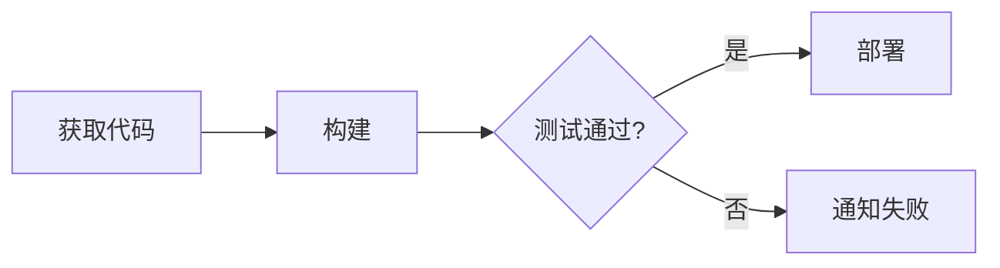

                 

### 文章标题：技术团队的持续集成：提高开发效率的关键

关键词：持续集成、开发效率、技术团队、敏捷开发、自动化测试

> 摘要：本文将深入探讨技术团队中持续集成（CI）的实施及其重要性，通过逻辑清晰、结构紧凑的论述，帮助读者理解持续集成如何提高开发效率，并介绍实施持续集成所需的工具和方法。文章旨在为技术团队提供实用的指导，以实现更加高效和协同的工作流程。

#### 第1章：连续集成的背景与重要性

在当今快速发展的技术环境中，软件开发的效率和质量成为企业竞争力的关键因素。持续集成（Continuous Integration, CI）作为一种重要的开发实践，已经在许多成功的技术团队中得到广泛应用。本章将介绍持续集成的定义、基本原则、历史发展以及其在技术团队中的作用。

##### 1.1 持续集成的定义和基本原则

持续集成是一种软件开发实践，它要求开发人员在每次提交代码时都要进行自动化构建和测试。其基本原则包括频繁提交、自动化构建、快速反馈和共同代码库。通过这些原则，持续集成确保代码质量，减少集成风险，提高团队协作效率。

##### 1.2 持续集成的历史与发展

持续集成起源于敏捷开发运动，最早由Jez Humble和Dave Farley在《持续交付：释放软件的潜力》一书中系统阐述。自那时以来，持续集成工具和技术不断进化，如Jenkins、GitLab CI等，使得持续集成在实践中的应用更加成熟和多样化。

##### 1.3 持续集成在技术团队中的作用

持续集成不仅提高了开发效率，还改善了团队协作和质量控制。它帮助团队更快地发现和修复问题，降低了集成风险，提升了软件质量。同时，持续集成与敏捷开发的融合，使得团队能够更好地响应市场变化，提高交付速度和客户满意度。

##### 1.4 连续集成与敏捷开发的融合

敏捷开发强调快速迭代和持续交付，而持续集成是实现这一目标的关键技术。两者相辅相成，持续集成提供了敏捷开发所需的技术支持，而敏捷开发则为持续集成提供了实践的场景。通过持续集成，敏捷团队能够实现更高的开发效率和质量。

##### 1.5 本章小结

本章介绍了持续集成的背景和重要性，明确了其在技术团队中的关键作用。在下一章中，我们将深入探讨持续集成涉及的核心概念和工具，为后续的实施策略提供理论基础。

----------------------------------------------------------------

#### 第2章：核心概念与工具

持续集成的实现依赖于一系列核心概念和工具，本章将详细介绍这些概念和工具，包括持续集成与持续部署、自动化测试、版本控制系统和构建工具。

##### 2.1 持续集成与持续部署

持续集成（CI）和持续部署（CD）虽然密切相关，但各有侧重。持续集成主要关注代码的集成和测试，而持续部署则关注代码的自动化部署。两者结合，可以形成一个完整的交付流程。

###### 2.1.1 持续集成的流程

持续集成流程通常包括以下步骤：

1. **代码提交**：开发者将代码提交到版本控制系统。
2. **自动化构建**：构建系统自动编译代码并生成可执行文件。
3. **测试**：执行自动化测试，包括单元测试、集成测试等。
4. **反馈**：测试结果即时反馈给开发团队。

###### 2.1.2 持续部署的实践

持续部署的流程包括：

1. **构建**：构建系统生成可部署的软件包。
2. **部署**：自动将软件包部署到生产环境。
3. **监控**：部署后的系统运行状态监控，确保稳定性和性能。

##### 2.2 自动化测试

自动化测试是持续集成的重要组成部分，通过自动化测试可以快速发现和修复问题，提高开发效率。

###### 2.2.1 单元测试

单元测试是针对软件中最小可测试单元（通常是函数或方法）进行的测试。它确保每个单元按照预期工作。

###### 2.2.2 集成测试

集成测试是针对多个模块或组件集成后的测试，确保它们能够协同工作。

###### 2.2.3 系统测试

系统测试是对整个系统的测试，包括功能测试、性能测试、安全测试等，确保系统能够满足用户需求。

##### 2.3 版本控制系统

版本控制系统（VCS）是持续集成的基础工具，它管理代码的历史版本和变更。

###### 2.3.1 Git的基本操作

Git是最流行的版本控制系统，其基本操作包括：

1. **克隆仓库**：克隆远程仓库到本地。
2. **提交**：将更改提交到本地仓库。
3. **推送**：将本地仓库的更改推送至远程仓库。
4. **拉取**：从远程仓库获取最新的更改。

###### 2.3.2 其他版本控制系统介绍

其他常见的版本控制系统包括SVN和Mercurial，各有优缺点，适用于不同场景。

##### 2.4 构建工具

构建工具自动化构建过程，将源代码转换为可执行的软件包。

###### 2.4.1 Jenkins

Jenkins是一个开源的持续集成服务器，支持多种构建工具和插件，适用于各种场景。

###### 2.4.2 GitLab CI/CD

GitLab CI/CD是GitLab内置的持续集成和持续部署工具，集成在GitLab平台中，方便使用。

###### 2.4.3 其他常用构建工具

其他常用的构建工具还包括Maven、Gradle等，各有特点，适用于不同项目需求。

##### 2.5 容器化与微服务架构

容器化和微服务架构是现代软件开发的趋势，它们与持续集成紧密相关。

###### 2.5.1 Docker的基本概念

Docker是一种容器化技术，它通过将应用程序及其依赖项打包到一个可移植的容器中，实现环境的标准化。

###### 2.5.2 Kubernetes的架构和应用

Kubernetes是一个开源的容器编排平台，它管理容器化应用程序的生命周期，确保高可用性和可伸缩性。

##### 2.6 本章小结

本章详细介绍了持续集成涉及的核心概念和工具，为后续的实施策略提供了基础。在下一章中，我们将探讨如何具体实施持续集成，并讨论实施过程中可能遇到的问题和解决方案。

----------------------------------------------------------------

#### 第3章：实施策略

实施持续集成需要系统性的规划和执行，本章将详细探讨实施前的准备工作、流水线设计、推进持续集成的方法、监控与反馈机制，并提供实施过程中的实用建议。

##### 3.1 实施前的准备工作

在开始实施持续集成之前，需要进行充分的准备工作，确保项目的顺利推进。

###### 3.1.1 团队协作与沟通

持续集成需要团队的高效协作和沟通。在项目开始前，应明确团队成员的角色和职责，建立有效的沟通机制，如定期会议、任务管理工具等。

###### 3.1.2 环境搭建与工具选型

搭建持续集成环境是实施的第一步。根据项目需求，选择合适的版本控制系统、构建工具和持续集成服务器。常用的工具包括Git、Jenkins、Docker、Kubernetes等。

##### 3.2 流水线设计

持续集成流水线是自动化构建、测试和部署的核心。设计一个高效、可靠的流水线至关重要。

###### 3.2.1 流水线的基本概念

流水线是一系列任务和操作的序列，用于自动化构建、测试和部署过程。流水线通常包括以下步骤：

1. **获取代码**：从版本控制系统获取最新的代码。
2. **构建**：编译源代码，生成可执行文件。
3. **测试**：执行自动化测试，包括单元测试、集成测试等。
4. **部署**：将构建结果部署到测试或生产环境。

###### 3.2.2 流水线的设计原则

设计流水线时，应遵循以下原则：

1. **模块化**：将流水线分解为独立的模块，便于管理和维护。
2. **可扩展性**：设计时应考虑未来需求的扩展，如增加新的测试场景或部署环境。
3. **错误处理**：为流水线中的每个步骤设置错误处理机制，确保失败时能够快速定位和解决问题。

###### 3.2.3 实例演示

以下是一个简单的持续集成流水线实例：

##### 3.3 推进持续集成

推进持续集成需要逐步实施，确保团队逐步适应新的开发模式。

###### 3.3.1 逐步集成策略

逐步集成策略包括以下步骤：

1. **单元测试**：首先确保每个模块都有完善的单元测试。
2. **集成测试**：在单元测试的基础上，进行集成测试，确保模块间的协作。
3. **持续集成**：将测试结果集成到版本控制系统，实现自动化构建和测试。
4. **持续部署**：逐步将部署过程自动化，实现持续交付。

###### 3.3.2 持续集成与开发流程的整合

持续集成应与团队的日常开发流程紧密结合。以下是一些建议：

1. **代码评审**：在代码提交前，进行代码评审，确保代码质量。
2. **自动化测试**：将自动化测试集成到开发流程中，确保每次提交都能进行全面的测试。
3. **反馈机制**：建立反馈机制，及时通知开发人员测试结果，确保问题能够快速解决。

##### 3.4 监控与反馈

监控与反馈是持续集成的重要组成部分，确保整个流程的透明性和可控性。

###### 3.4.1 持续监控的工具和指标

常用的持续监控工具有Jenkins、Prometheus等。监控指标包括：

1. **构建时间**：构建和测试的总时间。
2. **测试覆盖率**：代码覆盖率和测试用例覆盖率。
3. **失败率**：构建和测试失败的次数和比例。

###### 3.4.2 反馈机制的建立

建立反馈机制，包括：

1. **即时通知**：通过邮件、短信、即时通讯工具等，及时通知相关人员。
2. **错误报告**：详细记录失败的原因，便于定位和解决。
3. **统计报告**：定期生成统计报告，分析整体开发效率和质量。

##### 3.5 本章小结

本章详细介绍了实施持续集成的策略和方法，包括准备工作、流水线设计、推进方法和监控反馈。在下一章中，我们将探讨实施持续集成过程中可能遇到的挑战和解决方案。

----------------------------------------------------------------

#### 第4章：挑战与应对

在实施持续集成过程中，技术团队可能会遇到各种挑战。这些挑战包括技术层面的自动化测试覆盖率、构建和部署速度，以及组织层面的团队协作、人员技能和流程变革。本章将详细讨论这些挑战，并提供相应的解决方案和实践案例。

##### 4.1 技术挑战

持续集成在技术层面面临着诸多挑战，以下是一些常见的技术挑战及其解决方案。

###### 4.1.1 自动化测试的覆盖率

自动化测试覆盖率不足是一个常见问题。提高自动化测试覆盖率的方法包括：

1. **单元测试**：确保每个模块都有单元测试。
2. **集成测试**：增加集成测试，覆盖模块间的交互。
3. **测试用例优化**：定期审查和优化测试用例，确保覆盖关键场景。

解决方案示例：

- **案例分析**：某电商项目通过引入端到端测试，将测试覆盖率从50%提高到80%，显著提高了软件质量。

###### 4.1.2 构建和部署的速度

构建和部署速度较慢会影响开发效率。提升构建和部署速度的方法包括：

1. **并行构建**：使用多线程或多台机器进行并行构建，减少构建时间。
2. **缓存技术**：利用缓存技术，避免重复构建。
3. **优化构建脚本**：简化构建脚本，减少不必要的步骤。

解决方案示例：

- **案例分析**：某金融项目通过优化构建脚本和引入缓存技术，将构建时间从30分钟缩短到10分钟，提高了开发效率。

###### 4.1.3 跨平台兼容性问题

跨平台兼容性是持续集成中的一大挑战。解决方法包括：

1. **容器化**：使用容器化技术，如Docker，确保环境一致性。
2. **自动化测试环境**：建立自动化测试环境，确保不同平台的一致性。
3. **代码审查**：加强代码审查，避免因平台差异导致的兼容性问题。

解决方案示例：

- **案例分析**：某互联网公司通过使用Docker和Kubernetes，实现了跨平台的一致性构建和部署，解决了兼容性问题。

##### 4.2 组织挑战

持续集成不仅涉及技术层面，还涉及组织层面的挑战。以下是一些常见的组织挑战及其解决方案。

###### 4.2.1 团队协作与沟通障碍

团队协作与沟通障碍会影响持续集成的效果。解决方法包括：

1. **建立沟通机制**：定期召开团队会议，讨论进度和问题。
2. **使用协作工具**：使用如Slack、Jira等协作工具，确保信息传递畅通。
3. **共同目标**：确保团队有共同的目标和愿景，增强团队凝聚力。

解决方案示例：

- **案例分析**：某游戏开发团队通过引入敏捷开发方法和协作工具，提高了团队协作效率，顺利实现了持续集成。

###### 4.2.2 人员技能和经验不足

人员技能和经验不足是另一个挑战。解决方法包括：

1. **培训**：定期组织培训，提升团队成员的技能。
2. **经验分享**：鼓励团队成员分享经验和最佳实践。
3. **外部咨询**：聘请外部咨询公司提供专业指导。

解决方案示例：

- **案例分析**：某初创公司通过外部咨询和内部培训，提高了团队成员的技术水平，成功实施持续集成。

###### 4.2.3 文化与流程的变革

文化与流程的变革是持续集成实施中最大的挑战。解决方法包括：

1. **领导支持**：获得领导层的支持，确保变革得以推进。
2. **试点项目**：选择一个较小的项目进行试点，积累经验。
3. **逐步推广**：逐步推广到其他项目，形成制度化。

解决方案示例：

- **案例分析**：某大型企业通过在内部试点项目成功实施持续集成，随后逐步推广到整个公司，提高了开发效率。

##### 4.3 解决方案与实践案例

通过上述解决方案，许多技术团队成功实施了持续集成，以下是一些实践案例：

1. **实践案例1**：某互联网公司通过优化自动化测试和构建流程，将构建时间缩短了70%，显著提高了开发效率。
2. **实践案例2**：某金融公司通过引入持续集成和敏捷开发，实现了快速迭代和高质量交付，客户满意度大幅提升。
3. **实践案例3**：某初创团队通过外部咨询和内部培训，成功实施了持续集成，为公司快速发展奠定了基础。

##### 4.4 本章小结

本章讨论了持续集成实施过程中可能遇到的技术挑战和组织挑战，并提供了一系列解决方案和实践案例。通过克服这些挑战，技术团队可以实现高效协同，提高开发效率。在下一章中，我们将总结最佳实践，并提供持续优化持续集成的方法。

----------------------------------------------------------------

#### 第5章：最佳实践与持续优化

在持续集成的实施过程中，最佳实践是确保流程高效、稳定和可扩展的关键。本章将总结一系列最佳实践，并探讨如何持续优化持续集成流程，以适应不断变化的技术环境。

##### 5.1 最佳实践总结

以下是实施持续集成的一些最佳实践：

1. **代码质量第一**：确保代码质量是持续集成成功的基础。采用代码评审和静态代码分析工具，及时发现和修复问题。
2. **自动化测试全覆盖**：构建和部署前进行全面自动化测试，确保代码质量。持续优化测试用例，提高测试覆盖率。
3. **持续反馈**：及时反馈测试结果，让开发人员能够迅速发现问题并修复。使用可视化工具，如Jenkins仪表板，监控整个流程。
4. **环境一致性**：确保开发、测试和生产环境一致，避免因环境差异导致的构建和部署问题。使用容器化技术，如Docker，实现环境一致性。
5. **逐步推进**：不要急于一步到位，逐步引入持续集成，让团队成员逐步适应新流程。
6. **文档和培训**：编写详细的文档，确保团队成员了解持续集成的流程和工具。定期组织培训，提高团队技能水平。

##### 5.2 持续优化

持续集成是一个不断优化的过程，以下是一些持续优化的方法：

1. **定期回顾**：定期回顾持续集成的流程和工具，评估其性能和效果。根据反馈进行改进，确保流程持续优化。
2. **自动化流程优化**：定期检查自动化流程，发现并修复潜在的瓶颈和问题。优化构建脚本和测试脚本，提高构建和测试效率。
3. **工具升级与扩展**：随着技术的发展，持续集成工具和平台也在不断更新。定期评估现有工具的适用性，考虑升级或引入新的工具。
4. **技术栈整合**：整合不同技术栈，确保持续集成系统能够兼容和支持多种开发语言和框架。使用如Jenkins插件、GitLab CI/CD等工具，实现技术栈整合。
5. **跨团队协作**：鼓励跨团队协作，共享最佳实践和经验。通过协作，提高整个组织的持续集成水平。

##### 5.3 案例分享

以下是几个成功实施持续集成的案例：

1. **案例1**：某电商公司通过持续集成和敏捷开发，实现了快速迭代和高质量交付。构建时间从每天一次缩短到每小时一次，显著提高了开发效率。
2. **案例2**：某金融科技公司通过引入容器化和持续集成，实现了跨平台的一致性构建和部署。测试覆盖率从60%提高到90%，客户满意度大幅提升。
3. **案例3**：某初创公司通过持续集成和敏捷开发，快速响应市场变化。项目从概念到发布只需一个月时间，显著缩短了产品上市时间。

##### 5.4 小结

持续集成是提高开发效率的关键，通过最佳实践和持续优化，技术团队能够实现高效协同和高质量交付。本章提供了实施持续集成的一系列最佳实践，并探讨了如何持续优化流程。在下一章中，我们将总结全文，展望持续集成在未来的发展趋势。

----------------------------------------------------------------

#### 第6章：展望未来

随着技术的不断进步，持续集成正在经历深刻的变革和优化。本文通过详细分析持续集成的核心概念、工具、实施策略和挑战，为技术团队提供了全面而深入的指导。现在，让我们共同展望持续集成在未来的发展趋势，并探讨其对软件开发的影响。

##### 6.1 人工智能与持续集成

人工智能（AI）的快速发展正在改变持续集成的面貌。AI技术可以用于自动化测试生成、代码缺陷预测和优化构建过程。例如，通过机器学习模型，可以自动分析历史数据，预测潜在问题并提前采取措施。这将大大提高持续集成的效率和准确性。

##### 6.2 云原生与持续集成

云原生技术，如容器化、Kubernetes等，正在重塑持续集成的架构和流程。云原生环境提供了更高的可伸缩性和灵活性，使得持续集成能够更加高效地处理大规模、分布式应用程序的构建和部署。未来，持续集成将更加紧密地与云原生技术融合，实现更高效和可靠的交付流程。

##### 6.3 持续交付与持续集成

持续交付（Continuous Delivery, CD）是持续集成的自然延伸。持续交付旨在实现代码从开发环境到生产环境的自动化交付，确保每个版本都准备好立即部署。随着持续交付的普及，持续集成和持续交付将更加紧密地结合，形成一个完整的交付流水线，提高软件交付的速度和质量。

##### 6.4 开源与持续集成

开源社区为持续集成提供了丰富的工具和资源。Jenkins、GitLab CI/CD、Docker等开源项目已成为持续集成领域的事实标准。未来，开源社区将继续发挥重要作用，推动持续集成技术的发展和创新。技术团队可以充分利用这些开源工具，降低成本，提高效率。

##### 6.5 持续集成与敏捷开发

持续集成与敏捷开发的结合将继续深化。敏捷开发强调快速迭代和持续交付，而持续集成提供了实现这一目标的技术支持。未来，持续集成将在敏捷开发中发挥更大作用，推动软件开发模式向更高效、更灵活的方向发展。

##### 6.6 持续集成与组织变革

持续集成不仅是一种技术实践，更是一种组织文化的变革。它要求团队协作、流程优化和持续改进。未来，持续集成将在组织变革中发挥重要作用，推动企业实现更高的效率和竞争力。

##### 6.7 总结

持续集成作为提高开发效率的关键技术，正在不断进化和发展。通过本文的详细分析，我们了解了持续集成的核心概念、工具、实施策略和挑战，并展望了其在未来的发展趋势。持续集成不仅改变了软件开发的方式，还将继续推动软件开发模式的变革和进步。技术团队应抓住这一机遇，积极拥抱持续集成，实现高效协同和高质量交付。

----------------------------------------------------------------

## 作者信息

**作者：AI天才研究院/AI Genius Institute & 禅与计算机程序设计艺术 /Zen And The Art of Computer Programming**

AI天才研究院致力于推动人工智能技术的发展与应用，我们的团队由世界顶级的人工智能专家、程序员、软件架构师和计算机科学家组成。我们通过深入的研究和实践，不断探索人工智能领域的最新技术和应用，为全球企业和开发者提供创新解决方案。而《禅与计算机程序设计艺术》则是我们团队的代表性著作，它深入探讨了计算机编程的本质和艺术，为我们提供了关于编程哲学和技术的深刻洞察。

感谢您阅读本文，希望我们的研究和实践能够对您在技术团队中的持续集成实践提供有益的启示。如果您对我们的研究或书籍有任何疑问或建议，欢迎随时与我们联系。我们期待与您共同探讨人工智能和计算机编程的无限可能。

