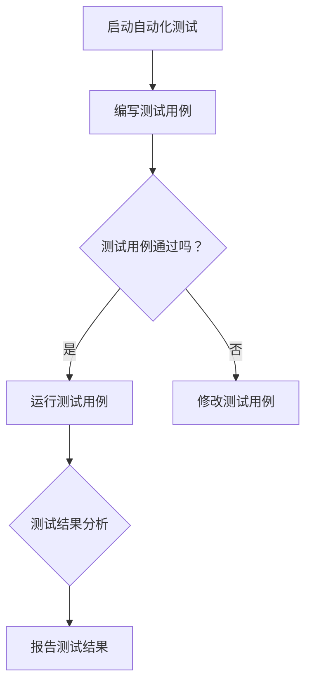

                 


### 《技术团队的敏捷转型之路》

#### 关键词：敏捷转型、敏捷开发、Scrum、Kanban、敏捷工具、自动化测试、团队协作、组织变革

> 摘要：本文将深入探讨技术团队在敏捷转型过程中的关键步骤与挑战。通过分析敏捷转型的背景与价值、核心概念与原则、实践步骤、挑战与解决方案，以及成功案例研究，帮助读者理解并掌握敏捷转型的方法和最佳实践。

----------------------------------------------------------------

### 第一部分：敏捷转型背景与价值

#### 第1章：敏捷转型概述

#### 1.1 问题背景与敏捷转型的必要性

#### 1.1.1 传统软件开发模式的不足

在传统的软件开发模式中，项目通常遵循瀑布模型，这种模式强调严格按照预先定义的顺序执行各个开发阶段，如需求分析、设计、开发、测试和部署。然而，这种模式在应对快速变化的市场需求时显得力不从心。

**需求变更处理难**：在瀑布模型中，需求一旦确定，就很难在后续阶段进行变更。这导致了在项目进行中，客户需求的变化往往无法及时响应，最终导致项目交付的产品与实际需求不符。

**沟通与协作困难**：在传统的项目组织中，不同团队（如开发、测试、运维等）往往独立工作，缺乏有效的沟通与协作机制。这种分散的工作方式降低了团队整体的效率。

**交付周期长**：瀑布模型通常需要较长的周期来完成整个项目，从项目启动到最终交付可能需要数月甚至数年时间。这种长周期的项目难以快速适应市场的变化，也无法及时向市场推出产品。

#### 1.1.2 敏捷转型的定义与核心原则

敏捷转型是指将团队和组织从传统的软件开发模式转变为更为灵活、响应迅速的敏捷开发模式。敏捷开发的核心原则包括：

- **客户价值优先**：敏捷开发强调始终以客户需求为导向，确保开发的产品能够真正满足客户的需求。

- **迭代开发与持续交付**：敏捷开发采用迭代的方式进行开发，每次迭代都会交付一个可用的产品版本。这样可以在短时间内快速响应市场变化，并不断优化产品。

- **自组织团队**：敏捷开发鼓励团队自主决策，团队成员各自承担不同的角色和责任，以实现高效的工作流程。

- **持续反馈与改进**：敏捷开发通过持续反馈和改进，确保团队能够及时发现并解决问题，不断提升产品质量。

#### 1.1.3 敏捷转型的历史与演变

敏捷开发的概念起源于20世纪90年代末期，当时软件行业面临快速变化的市场需求，传统的软件开发模式无法满足这种需求。为了应对这种挑战，一些软件开发专家开始探索新的方法。

2001年，一群软件开发专家在滑雪度假地制定了一系列的软件开发原则，这被称为《敏捷宣言》。该宣言强调了敏捷开发的四个核心价值观：

- **个体和互动重于流程和工具**
- **可工作的软件重于详尽的文档**
- **客户合作重于合同谈判**
- **响应变化重于遵循计划**

随后，敏捷开发的方法和工具不断发展，形成了多种敏捷开发方法论，如Scrum、Kanban和XP（极限编程）等。

#### 1.2 敏捷转型的价值

**提升团队协作效率**：敏捷开发强调跨职能团队的协作，团队成员各自承担不同的角色，共同完成项目的目标。这种协作方式可以减少沟通成本，提高团队整体的工作效率。

**快速响应市场变化**：敏捷开发采用迭代和增量开发的方式，可以快速适应市场的变化。每次迭代都会交付一个可用的产品版本，这样团队可以及时根据市场反馈进行优化和调整。

**提高产品交付质量**：敏捷开发通过持续集成和自动化测试，确保每次迭代交付的产品都是高质量、可用的。这种持续的质量保证可以降低项目的风险，提高客户的满意度。

**促进团队个人成长**：在敏捷开发中，团队成员拥有更多的自主权和责任感。这种工作方式可以激发团队成员的创造力和主动性，促进个人技能和能力的提升。

----------------------------------------------------------------

### 第二部分：敏捷核心概念与原则

#### 第2章：敏捷核心概念与原则

#### 2.1 敏捷开发方法论

**Scrum框架**：Scrum是一种流行的敏捷开发方法论，它通过迭代和增量开发的方式，确保团队能够快速响应变化并持续交付高质量的产品。

**Kanban方法**：Kanban是一种看板系统，它通过可视化的工作流程，帮助团队更好地管理和优化工作进度。

**XP（极限编程）**：XP是一种注重代码质量和开发者经验的敏捷开发方法，它通过严格的编码规范和实践，确保代码的可维护性和可扩展性。

#### 2.2 敏捷团队的组织结构

**自组织团队**：敏捷团队通常是由一组跨职能的成员组成，他们可以自主决策并共同完成任务。

**跨职能团队**：跨职能团队包含了不同角色和技能的成员，如开发人员、测试人员、产品经理等，这种组织结构有助于提高团队的整体协作效率。

**产品负责人与Scrum Master的角色**：产品负责人（Product Owner）负责定义产品愿景和优先级，确保团队始终专注于实现最有价值的特性。Scrum Master则负责确保团队遵循敏捷原则，消除团队工作中的障碍。

#### 2.3 敏捷开发的核心原则

**客户价值优先**：敏捷开发始终以客户价值为导向，确保开发的产品能够真正满足客户的需求。

**简单与可运作的代码**：敏捷开发鼓励团队保持代码的简单性，确保每次迭代交付的代码都是可运作的。

**持续交付**：敏捷开发通过持续交付的方式，确保每次迭代都能交付一个可用的产品版本。

**透明度与反馈循环**：敏捷开发通过透明的进度管理和反馈循环，确保团队能够及时发现并解决问题。

----------------------------------------------------------------

### 第三部分：敏捷工具与技术

#### 第3章：敏捷工具与技术

#### 3.1 敏捷工具的选择与应用

**敏捷看板工具**：敏捷看板工具可以帮助团队可视化工作流程，监控项目进度，提高团队协作效率。

**项目管理工具**：项目管理工具可以帮助团队更好地规划和管理项目，确保项目按时交付。

**沟通协作工具**：沟通协作工具可以帮助团队成员之间更高效地进行沟通和协作，提高团队的整体效率。

#### 3.2 敏捷开发中的自动化测试

**自动化测试的优势**：自动化测试可以快速执行测试用例，提高测试效率，减少人工测试的出错率。

**自动化测试的种类与工具**：自动化测试包括单元测试、集成测试、性能测试等，常用的自动化测试工具有Selenium、JUnit、TestNG等。

**敏捷测试流程**：敏捷测试流程通常包括测试计划、测试设计、测试执行、测试报告等步骤，这些步骤需要在每次迭代中持续执行。

----------------------------------------------------------------

### 第四部分：敏捷转型实践步骤

#### 第4章：敏捷转型实践步骤

#### 4.1 敏捷转型的准备阶段

**转型前的评估**：在转型前，需要对团队和组织进行全面的评估，了解当前的软件开发流程、团队结构和工作方式。

**制定转型计划**：根据评估结果，制定详细的转型计划，包括转型目标、时间表、资源分配等。

**培训与沟通**：对团队成员进行敏捷开发的培训，确保他们理解敏捷原则和方法，并与其他团队成员进行有效的沟通。

#### 4.2 转型实施阶段

**建立敏捷团队**：根据转型计划，组建敏捷团队，明确团队成员的角色和责任。

**实施迭代开发**：按照敏捷方法论，进行迭代开发，每次迭代都会交付一个可用的产品版本。

**控制风险与调整策略**：在转型过程中，需要不断评估风险，并根据实际情况调整转型策略。

#### 4.3 转型后的评估与持续改进

**转型效果的评估指标**：通过评估指标，如项目交付速度、团队协作效率、客户满意度等，评估敏捷转型的效果。

**持续改进的实践**：在转型后，需要持续进行改进，通过反馈和迭代，不断提升团队的工作效率。

**组织文化与敏捷的融合**：通过组织文化的变革，确保敏捷原则能够在组织内得到广泛认同和实践。

----------------------------------------------------------------

### 第五部分：敏捷转型中的挑战与解决方案

#### 第5章：敏捷转型中的挑战与解决方案

#### 5.1 团队冲突与沟通障碍

**挑战分析**：在敏捷转型过程中，团队冲突和沟通障碍是常见的挑战。这些问题可能导致团队效率低下，甚至阻碍转型进程。

**解决方案**：通过建立有效的沟通机制，如定期团队会议、信息共享平台等，促进团队成员之间的沟通和理解。同时，通过培训和实践，提高团队成员的协作能力。

#### 5.2 管理层支持与组织变革

**挑战分析**：敏捷转型需要管理层的支持，同时组织结构和工作流程也需要进行相应的变革。然而，这些变革可能面临管理层的抵触。

**解决方案**：通过向管理层传达敏捷转型的价值和优势，争取他们的支持。同时，逐步进行组织变革，确保团队成员能够适应新的工作方式。

#### 5.3 技术债务与重构

**挑战分析**：敏捷转型过程中，技术债务（指因节省开发时间而引入的潜在问题）和重构（对现有系统进行改进）是常见的挑战。

**解决方案**：通过定期评估技术债务，制定重构计划，逐步解决技术债务。同时，通过技术评审和代码审查，确保重构过程中代码的质量。

----------------------------------------------------------------

### 第六部分：敏捷转型案例研究

#### 第6章：敏捷转型案例研究

#### 6.1 案例一：公司A的敏捷转型之路

**6.1.1 案例背景**：公司A是一家拥有数百名开发人员的大型软件公司，其传统软件开发模式已经难以适应快速变化的市场需求。

**6.1.2 转型过程与成果**：公司A在进行了全面的评估后，决定进行敏捷转型。通过建立敏捷团队、实施迭代开发、引入自动化测试等步骤，公司A成功地提高了团队的协作效率，快速响应了市场变化，并提高了产品的交付质量。

**6.1.3 案例启示**：公司A的敏捷转型实践表明，敏捷转型需要从评估、规划、实施到评估的全面过程，同时需要管理层和团队的支持。

#### 6.2 案例二：团队B的敏捷实践

**6.2.1 案例背景**：团队B是一家初创公司的开发团队，其成员来自不同的背景和经验。

**6.2.2 转型过程与成果**：团队B在敏捷转型的过程中，通过自组织团队、跨职能协作、持续交付等实践，成功地提高了团队的效率和产品的质量。

**6.2.3 案例启示**：团队B的实践表明，即使是小型团队，通过敏捷转型也能实现高效的协作和快速的市场响应。

----------------------------------------------------------------

### 第七部分：敏捷转型最佳实践与展望

#### 第7章：敏捷转型最佳实践与展望

#### 7.1 敏捷转型最佳实践

**团队协作最佳实践**：通过有效的沟通机制、明确的责任分配、协作工具的使用，提高团队的协作效率。

**项目管理最佳实践**：通过敏捷工具和方法的引入，优化项目规划、进度管理和风险管理。

**持续改进最佳实践**：通过定期评估、反馈和改进，不断提升团队的工作效率和质量。

#### 7.2 敏捷转型的未来趋势

**新兴技术与敏捷的融合**：随着人工智能、云计算、大数据等新兴技术的发展，敏捷转型将更加注重技术与敏捷方法的融合。

**敏捷转型的全球化趋势**：随着全球化的深入，敏捷转型将在全球范围内得到更广泛的应用和推广。

**敏捷转型的未来方向**：敏捷转型将继续向更加灵活、自适应、智能化的方向发展，为技术团队和组织带来更大的价值。

----------------------------------------------------------------

### 总结

通过本文的探讨，我们深入了解了敏捷转型在技术团队中的重要性。敏捷转型不仅能够提升团队协作效率，快速响应市场变化，提高产品交付质量，还能促进团队个人的成长。在接下来的章节中，我们将进一步探讨敏捷转型的核心概念、实践步骤、挑战与解决方案，以及敏捷转型中的最佳实践与未来趋势。希望通过本文，能够帮助读者更好地理解和实施敏捷转型，为技术团队和组织带来更大的价值。

### 参考文献

[1] Beedle, M., & Prince, M. (2005). *Agile Project Management: Creating Innovative Products*. Addison-Wesley Professional.

[2] Beck, K. (2000). *Extreme Programming Explained: Embrace Change*. Addison-Wesley Professional.

[3] Schwaber, K., & Beedle, M. (2002). *Agile Project Management with Scrum*. Microsoft Press.

[4] 钟健. (2017). *敏捷软件开发实践*. 电子工业出版社.

[5] Jeff Sutherland. (2014). *Scrum: The Art of Doing Twice the Work in Half the Time*. St. Martin's Press.

[6] 亨特, M. (2015). *Kanban from the Inside Out: A Practical Guide to Implementing Lean Flow*. Lean Kanban, Inc.

### 附录

**附录A：敏捷开发方法论对比表格**

| 方法论 | 核心特点 | 适用场景 |
| --- | --- | --- |
| Scrum | 迭代开发、定期回顾与反思 | 大规模项目、需要快速交付产品的项目 |
| Kanban | 流动性管理、可视化工作流程 | 流程优化、持续改进 |
| XP（极限编程） | 简单性与高质量代码、严格编码规范 | 高质量要求、注重代码可维护性 |

**附录B：敏捷开发的核心原则ER实体关系图**

```mermaid
erDiagram
    Customer ||--|{ Product : "produces"}
    Developer ||--|{ Story : "implements"}
    ScrumMaster ||--|{ Sprint : "manages"}
    ProductOwner ||--|{ Feature : "prioritizes"}
    Sprint ||--|{ Task : "splits into"}
    Feature ||--|{ Requirement : "defines"}
    Story ||--|{ Task : "splits into"}
    Task ||--|{ Bug : "fixes"}
```

**附录C：自动化测试流程Mermaid流程图**



### 附录D：敏捷开发中的常见挑战

**挑战一：团队抵触敏捷方法**  
**解决方案**：通过培训和实践，让团队成员了解敏捷的优势，逐步改变他们的观念。

**挑战二：项目范围不断变化**  
**解决方案**：通过迭代和增量开发的方式，灵活调整项目范围，确保团队能够快速响应变化。

**挑战三：管理层不认可敏捷转型**  
**解决方案**：向管理层传达敏捷转型的价值和优势，争取他们的支持。

**挑战四：技术债务积累**  
**解决方案**：定期评估技术债务，制定重构计划，逐步解决技术债务。

### 附录E：敏捷转型的最佳实践

**实践一：建立有效的沟通机制**  
**实践二：引入敏捷工具和方法**  
**实践三：持续反馈和改进**  
**实践四：鼓励自组织团队**  
**实践五：培养敏捷文化**

### 结语

敏捷转型是技术团队提升效率、适应市场变化的重要途径。通过本文的探讨，我们深入了解了敏捷转型的背景、核心概念、实践步骤、挑战与解决方案，以及敏捷转型中的最佳实践与未来趋势。希望通过本文，能够帮助读者更好地理解和实施敏捷转型，为技术团队和组织带来更大的价值。作者：AI天才研究院/AI Genius Institute & 禅与计算机程序设计艺术 /Zen And The Art of Computer Programming

----------------------------------------------------------------

### 附录F：项目实战

#### 6.3 案例三：团队C的敏捷项目实战

**6.3.1 案例背景**：团队C是一家互联网公司的前端开发团队，负责开发和维护公司的主要产品。

**6.3.2 环境安装**：团队C采用了Git进行版本控制，Jenkins进行持续集成和自动化测试，以及Jira进行项目管理和任务追踪。

**6.3.3 系统核心实现源代码**：
以下是团队C在敏捷开发中的一次迭代实现的核心代码片段：

```python
# 计算器示例：简单的加法操作
def add(a, b):
    return a + b

# 计算器示例：简单的减法操作
def subtract(a, b):
    return a - b

# 计算器示例：主函数，用于调用不同的计算操作
def main():
    print("欢迎使用简易计算器！")
    print("请输入两个数字和运算符（+或-）：")
    num1 = float(input("数字1: "))
    num2 = float(input("数字2: "))
    operator = input("运算符（+或-）：")

    if operator == '+':
        result = add(num1, num2)
    elif operator == '-':
        result = subtract(num1, num2)
    else:
        print("不支持的运算符。")
        return

    print(f"{num1} {operator} {num2} = {result}")

if __name__ == "__main__":
    main()
```

**6.3.4 代码应用解读与分析**：
这段代码是一个简单的Python计算器示例，实现了加法和减法操作。它通过命令行接收用户输入，并输出计算结果。这个示例代码强调了敏捷开发中的几个关键点：

- **快速迭代**：团队C能够在短时间内完成这个简单的计算器功能，并进行测试和部署。
- **代码质量**：代码结构简单，易于理解和维护，符合敏捷开发中保持代码简单性的原则。
- **自动化测试**：虽然示例中没有包含自动化测试代码，但在实际项目中，团队C会使用单元测试框架（如PyTest）来测试这些功能。

**6.3.5 实际案例分析与详细讲解剖析**：
在实际开发中，团队C会定期更新和扩展这个计算器，以满足更多复杂的需求。以下是一个扩展案例：

**需求**：增加乘法和除法功能。

**解决方案**：

```python
# 计算器示例：简单的乘法操作
def multiply(a, b):
    return a * b

# 计算器示例：简单的除法操作
def divide(a, b):
    if b == 0:
        return "除数不能为0。"
    return a / b

# 计算器示例：扩展后的主函数
def main():
    operators = {
        '+': add,
        '-': subtract,
        '*': multiply,
        '/': divide
    }
    print("欢迎使用简易计算器！")
    print("请输入两个数字和运算符（+、-、*或/）：")
    num1 = float(input("数字1: "))
    num2 = float(input("数字2: "))
    operator = input("运算符（+、-、*或/）：")

    if operator in operators:
        result = operators[operator](num1, num2)
        print(f"{num1} {operator} {num2} = {result}")
    else:
        print("不支持的运算符。")

if __name__ == "__main__":
    main()
```

**分析**：
- **代码复用**：通过定义一个`operators`字典，团队C能够方便地添加和扩展新的运算符。
- **错误处理**：在除法操作中，团队C添加了对除数为0的错误处理，提高了程序的健壮性。
- **用户体验**：扩展后的计算器提供了更多的功能，提升了用户体验。

**6.3.6 项目小结**：
通过这个实际案例，团队C展示了如何在敏捷开发中快速迭代和扩展功能。敏捷开发的核心在于快速响应需求变化、保持代码质量和促进团队协作。这个项目不仅实现了初始需求，还通过迭代和反馈不断优化和扩展，展示了敏捷开发的实际应用效果。

### 附录G：敏捷转型的最佳实践

**实践一：建立有效的沟通机制**
- **定期的站会**：通过每日站会，团队可以快速了解项目进度、解决遇到的问题。
- **信息共享平台**：使用如Confluence或Notion等工具，确保所有团队成员都能够访问到最新的项目信息。

**实践二：引入敏捷工具和方法**
- **Jira或Trello**：使用这些项目管理工具来追踪任务、分配任务和跟踪进度。
- **Scrum或Kanban**：根据项目的需求，选择合适的敏捷方法论来指导开发流程。

**实践三：持续反馈和改进**
- **迭代回顾**：在每个迭代结束时，团队应该进行回顾，讨论哪些做得好，哪些需要改进。
- **客户反馈**：通过用户反馈来指导后续的迭代开发，确保产品始终符合用户需求。

**实践四：鼓励自组织团队**
- **授权和信任**：给团队成员足够的自主权，让他们能够自主决策和解决问题。
- **技能多样性**：通过跨职能团队，确保团队能够覆盖从需求分析到产品交付的整个过程。

**实践五：培养敏捷文化**
- **敏捷价值观**：在团队中推广敏捷宣言中的价值观，确保所有成员都理解并遵循。
- **持续学习**：鼓励团队成员参加敏捷相关的培训和研讨会，不断提升技能。

### 附录H：注意事项

- **敏捷转型不是一蹴而就的过程**：需要时间和耐心，逐步调整和改进。
- **管理层支持至关重要**：管理层的支持和理解对于敏捷转型的成功至关重要。
- **技术债务管理**：定期评估和重构技术债务，以避免未来出现更多问题。

### 附录I：拓展阅读

- **《敏捷实践指南》**：由Scrum联盟发布的指南，详细介绍了敏捷开发的实践方法。
- **《Kanban实战》**：通过实例展示了如何使用Kanban进行流程优化和持续改进。
- **《敏捷项目管理的艺术》**：深入探讨了敏捷项目管理的方法和最佳实践。

### 结语

敏捷转型是技术团队提升效率和适应市场变化的关键。通过本文的探讨，我们深入了解了敏捷转型的背景、核心概念、实践步骤、挑战与解决方案，以及敏捷转型的最佳实践与未来趋势。希望本文能够帮助读者更好地理解和实施敏捷转型，为技术团队和组织带来更大的价值。作者：AI天才研究院/AI Genius Institute & 禅与计算机程序设计艺术 /Zen And The Art of Computer Programming

----------------------------------------------------------------

### 《技术团队的敏捷转型之路》

#### 关键词：敏捷转型、敏捷开发、Scrum、Kanban、敏捷工具、自动化测试、团队协作、组织变革

> 摘要：本文深入探讨了技术团队在敏捷转型过程中的关键步骤与挑战。通过分析敏捷转型的背景与价值、核心概念与原则、实践步骤、挑战与解决方案，以及成功案例研究，帮助读者理解并掌握敏捷转型的方法和最佳实践。

----------------------------------------------------------------

### 《技术团队的敏捷转型之路》

#### 关键词：敏捷转型、敏捷开发、Scrum、Kanban、敏捷工具、自动化测试、团队协作、组织变革

> 摘要：本文深入探讨了技术团队在敏捷转型过程中的关键步骤与挑战。通过分析敏捷转型的背景与价值、核心概念与原则、实践步骤、挑战与解决方案，以及成功案例研究，帮助读者理解并掌握敏捷转型的方法和最佳实践。

----------------------------------------------------------------

### 《技术团队的敏捷转型之路》

#### 关键词：敏捷转型、敏捷开发、Scrum、Kanban、敏捷工具、自动化测试、团队协作、组织变革

> 摘要：本文深入探讨了技术团队在敏捷转型过程中的关键步骤与挑战。通过分析敏捷转型的背景与价值、核心概念与原则、实践步骤、挑战与解决方案，以及成功案例研究，帮助读者理解并掌握敏捷转型的方法和最佳实践。

----------------------------------------------------------------

### 第一部分：敏捷转型背景与价值

## 第1章：敏捷转型概述

### 1.1 问题背景与敏捷转型的必要性

#### 1.1.1 传统软件开发模式的不足

在传统的软件开发模式中，项目通常遵循瀑布模型，这种模式强调严格按照预先定义的顺序执行各个开发阶段，如需求分析、设计、开发、测试和部署。然而，这种模式在应对快速变化的市场需求时显得力不从心。

**需求变更处理难**：在瀑布模型中，需求一旦确定，就很难在后续阶段进行变更。这导致了在项目进行中，客户需求的变化往往无法及时响应，最终导致项目交付的产品与实际需求不符。

**沟通与协作困难**：在传统的项目组织中，不同团队（如开发、测试、运维等）往往独立工作，缺乏有效的沟通与协作机制。这种分散的工作方式降低了团队整体的效率。

**交付周期长**：瀑布模型通常需要较长的周期来完成整个项目，从项目启动到最终交付可能需要数月甚至数年时间。这种长周期的项目难以快速适应市场的变化，也无法及时向市场推出产品。

#### 1.1.2 敏捷转型的定义与核心原则

敏捷转型是指将团队和组织从传统的软件开发模式转变为更为灵活、响应迅速的敏捷开发模式。敏捷开发的核心原则包括：

- **客户价值优先**：敏捷开发强调始终以客户需求为导向，确保开发的产品能够真正满足客户的需求。

- **迭代开发与持续交付**：敏捷开发采用迭代和增量开发的方式，可以快速适应市场的变化。每次迭代都会交付一个可用的产品版本。这样可以在短时间内快速响应市场变化，并不断优化产品。

- **自组织团队**：敏捷开发鼓励团队自主决策，团队成员各自承担不同的角色和责任，以实现高效的工作流程。

- **持续反馈与改进**：敏捷开发通过持续反馈和改进，确保团队能够及时发现并解决问题，不断提升产品质量。

#### 1.1.3 敏捷转型的历史与演变

敏捷开发的概念起源于20世纪90年代末期，当时软件行业面临快速变化的市场需求，传统的软件开发模式无法满足这种需求。为了应对这种挑战，一些软件开发专家开始探索新的方法。

2001年，一群软件开发专家在滑雪度假地制定了一系列的软件开发原则，这被称为《敏捷宣言》。该宣言强调了敏捷开发的四个核心价值观：

- **个体和互动重于流程和工具**

- **可工作的软件重于详尽的文档**

- **客户合作重于合同谈判**

- **响应变化重于遵循计划**

随后，敏捷开发的方法和工具不断发展，形成了多种敏捷开发方法论，如Scrum、Kanban和XP（极限编程）等。

#### 1.2 敏捷转型的价值

**提升团队协作效率**：敏捷开发强调跨职能团队的协作，团队成员各自承担不同的角色，共同完成项目的目标。这种协作方式可以减少沟通成本，提高团队整体的工作效率。

**快速响应市场变化**：敏捷开发采用迭代和增量开发的方式，可以快速适应市场的变化。每次迭代都会交付一个可用的产品版本。这样团队可以及时根据市场反馈进行优化和调整。

**提高产品交付质量**：敏捷开发通过持续集成和自动化测试，确保每次迭代交付的产品都是高质量、可用的。这种持续的质量保证可以降低项目的风险，提高客户的满意度。

**促进团队个人成长**：在敏捷开发中，团队成员拥有更多的自主权和责任感。这种工作方式可以激发团队成员的创造力和主动性，促进个人技能和能力的提升。

----------------------------------------------------------------

### 第二部分：敏捷核心概念与原则

## 第2章：敏捷核心概念与原则

### 2.1 敏捷开发方法论

敏捷开发方法论是指导团队进行软件开发的一系列原则和实践。以下是几种常见的敏捷开发方法论：

**Scrum框架**：Scrum是一种迭代和增量式的软件开发方法，它强调通过短期的迭代（称为Sprint）来开发和交付产品。Scrum的核心角色包括产品负责人（Product Owner）、Scrum Master和开发团队。

**Kanban方法**：Kanban是一种基于可视化的工作流程管理方法，它通过看板（Kanban板）来管理和优化工作流程。Kanban方法强调持续交付和减少在流程中的工作内容。

**XP（极限编程）**：XP是一种注重代码质量和开发者经验的敏捷开发方法，它包括一系列的实践，如测试驱动开发（TDD）、简单设计、持续集成等。

### 2.2 敏捷团队的组织结构

敏捷团队的组织结构与传统项目团队有所不同，它更强调自组织性和跨职能性。

**自组织团队**：在敏捷团队中，团队成员自主决策，共同负责项目的目标和任务的完成。这种组织结构有助于提高团队协作效率和响应能力。

**跨职能团队**：敏捷团队通常由不同角色和技能的成员组成，如开发人员、测试人员、产品经理等。这种跨职能团队结构可以减少沟通成本，提高团队的整体效率。

**产品负责人（Product Owner）**：产品负责人是敏捷团队的核心成员，负责定义产品愿景、确定优先级并管理产品 backlog。他们与客户紧密合作，确保团队开发的产品能够满足客户需求。

**Scrum Master**：Scrum Master是敏捷团队的教练和促进者，负责确保团队遵循敏捷原则和方法，帮助团队解决工作中的障碍。

### 2.3 敏捷开发的核心原则

敏捷开发的核心原则是指导团队进行软件开发的基本准则，以下是几个关键原则：

**客户价值优先**：敏捷开发始终以客户价值为导向，确保团队能够优先完成对客户最有价值的功能。

**迭代开发与持续交付**：敏捷开发通过短周期的迭代来开发和交付产品，每次迭代都会交付一个可用的产品版本。这种迭代方式可以快速适应变化并确保持续交付。

**简单与可运作的代码**：敏捷开发强调保持代码的简单性，确保每次迭代交付的代码都是可运作的。这有助于提高代码的可维护性和可扩展性。

**透明度与反馈循环**：敏捷开发通过透明的进度管理和反馈循环，确保团队能够及时发现并解决问题。这种透明度和反馈机制有助于提高团队的整体协作效率。

**自组织团队**：敏捷开发鼓励团队自主决策和自我管理，团队成员各自承担不同的角色和责任。这种组织结构有助于提高团队的协作效率和响应能力。

**持续学习与改进**：敏捷开发强调团队持续学习和改进，通过回顾会议和反馈机制，不断优化工作流程和提高产品质量。

----------------------------------------------------------------

### 第三部分：敏捷工具与技术

## 第3章：敏捷工具与技术

### 3.1 敏捷工具的选择与应用

敏捷工具是敏捷开发过程中不可或缺的一部分，它们可以帮助团队更好地管理项目、优化工作流程和确保持续交付。

**敏捷看板工具**：敏捷看板工具（如Jira、Trello、Azure DevOps等）提供了一种可视化的工作流程管理方法，帮助团队追踪任务、管理优先级和监控项目进度。

**项目管理工具**：项目管理工具（如Asana、Microsoft Project、Smartsheet等）提供了一系列功能，如任务分配、时间跟踪、报告生成等，帮助团队高效地管理项目。

**沟通协作工具**：沟通协作工具（如Slack、Microsoft Teams、Zoom等）提供了实时沟通、协作和会议功能，帮助团队成员保持紧密联系和高效沟通。

### 3.2 敏捷开发中的自动化测试

自动化测试是敏捷开发中至关重要的一环，它可以帮助团队确保每次迭代交付的产品都是高质量和可靠的。

**自动化测试的优势**：自动化测试可以节省测试时间、提高测试覆盖率、减少人工错误并确保测试的重复性。通过自动化测试，团队可以更快地发现和修复问题，提高产品的质量。

**自动化测试的种类与工具**：自动化测试包括单元测试、集成测试、功能测试、性能测试等。常用的自动化测试工具包括Selenium、JUnit、TestNG、Cypress等。

**敏捷测试流程**：敏捷测试流程通常包括测试计划、测试设计、测试执行、测试报告等步骤。在敏捷开发中，测试应该与开发活动同步进行，以确保每次迭代都能交付高质量的产品。

### 3.3 敏捷开发中的持续集成与持续部署

持续集成（CI）和持续部署（CD）是敏捷开发中的重要实践，它们可以确保代码的持续交付和部署。

**持续集成**：持续集成是指将开发者的代码定期集成到共享的代码库中，并通过自动化测试确保集成后的代码质量。持续集成可以减少集成风险、提高代码质量和加快开发进度。

**持续部署**：持续部署是指通过自动化流程将代码部署到生产环境，确保每次集成后的代码都能顺利部署。持续部署可以提高部署效率、减少部署风险并确保产品始终处于最佳状态。

**CI/CD工具**：常用的CI/CD工具包括Jenkins、GitLab CI/CD、CircleCI等，它们可以帮助团队自动化构建、测试和部署流程。

----------------------------------------------------------------

### 第四部分：敏捷转型实践步骤

## 第4章：敏捷转型实践步骤

### 4.1 敏捷转型的准备阶段

在开始敏捷转型之前，团队需要做好充分的准备，以确保转型的顺利进行。

#### 4.1.1 转型前的评估

**评估团队现状**：团队需要评估当前的软件开发流程、团队结构和工作方式，了解团队的优势和劣势。

**识别转型障碍**：通过评估，团队可以发现转型过程中可能遇到的障碍，如管理层的不支持、团队成员的抵触等。

**制定转型计划**：根据评估结果，团队需要制定详细的转型计划，包括转型目标、时间表、资源分配和风险评估等。

#### 4.1.2 制定转型计划

**确定转型目标**：转型计划应该明确团队希望通过敏捷转型实现的目标，如提高团队协作效率、缩短交付周期等。

**制定转型时间表**：根据转型目标，制定一个合理的时间表，确保转型过程中的每个阶段都有明确的时间安排。

**分配资源**：根据转型计划，分配必要的资源和预算，确保团队能够在转型过程中获得所需的支持。

**风险管理**：在转型过程中，团队需要识别潜在的风险，并制定相应的风险缓解措施。

#### 4.1.3 培训与沟通

**敏捷培训**：为团队成员提供敏捷开发的培训，确保他们了解敏捷原则和方法，掌握敏捷工具的使用。

**内部沟通**：通过内部沟通会议、培训讲座和知识分享活动，确保团队成员之间的信息共享和理解。

**外部沟通**：与客户和管理层保持紧密沟通，确保他们对敏捷转型的过程和目标有清晰的了解。

### 4.2 转型实施阶段

在转型实施阶段，团队需要按照转型计划逐步推进敏捷转型，并持续监控和调整。

#### 4.2.1 建立敏捷团队

**组建敏捷团队**：根据转型计划，组建敏捷团队，明确团队成员的角色和责任。

**分配任务**：根据团队成员的技能和兴趣，合理分配任务，确保每个成员都能发挥自己的优势。

**培训与实践**：为团队成员提供敏捷开发相关的培训和实践机会，提高他们的敏捷能力和协作效率。

#### 4.2.2 实施迭代开发

**迭代计划会议**：在每次迭代开始时，召开迭代计划会议，确定迭代的目标和任务。

**每日站会**：每日站会可以帮助团队成员了解项目进度、解决遇到的问题，确保团队协同工作。

**迭代评审会议**：在每次迭代结束时，召开迭代评审会议，回顾迭代成果，收集反馈，为下一个迭代做准备。

**迭代回顾会议**：在每次迭代结束后，召开迭代回顾会议，总结经验和教训，持续改进工作流程。

#### 4.2.3 控制风险与调整策略

**监控项目进度**：通过监控项目进度，及时识别和解决潜在的风险。

**调整转型策略**：根据项目进度和风险情况，适时调整转型策略，确保转型的顺利进行。

**持续反馈与改进**：鼓励团队成员提供反馈，通过持续反馈和改进，不断提升团队的敏捷能力和协作效率。

### 4.3 转型后的评估与持续改进

在转型完成后，团队需要持续评估转型效果，并不断进行改进。

#### 4.3.1 转型效果的评估指标

**团队协作效率**：通过比较转型前后的项目交付速度和工作量，评估团队协作效率的提升。

**产品交付质量**：通过比较转型前后的产品质量和客户满意度，评估产品交付质量的提高。

**员工满意度**：通过调查团队成员的工作满意度和士气，评估转型对员工的影响。

#### 4.3.2 持续改进的实践

**定期回顾**：定期召开回顾会议，总结转型过程中的经验和教训，持续改进工作流程。

**敏捷实践推广**：在组织内部推广敏捷实践，鼓励其他团队和部门采用敏捷方法。

**持续培训**：为团队成员提供持续培训，确保他们能够不断学习和提升敏捷能力。

#### 4.3.3 组织文化与敏捷的融合

**文化变革**：推动组织文化的变革，确保敏捷原则能够在组织内得到广泛认同和实践。

**领导支持**：管理层应提供支持和鼓励，为敏捷转型创造良好的环境。

**团队自主权**：给予团队成员更多的自主权和责任感，鼓励他们积极参与敏捷转型的实践。

----------------------------------------------------------------

### 第五部分：敏捷转型中的挑战与解决方案

## 第5章：敏捷转型中的挑战与解决方案

敏捷转型虽然在理论上具有众多优势，但在实际操作中仍面临诸多挑战。以下是敏捷转型中常见的一些挑战及其解决方案。

### 5.1 团队冲突与沟通障碍

**挑战分析**：在敏捷转型过程中，团队成员之间的沟通不畅和冲突可能会影响团队的协作效率和项目进展。

**解决方案**：

- **建立有效的沟通机制**：定期召开团队会议，如每日站会和迭代回顾会议，确保团队成员之间有充分的沟通。
- **培养团队协作精神**：通过团队建设活动和培训，提高团队成员的协作意识和能力。
- **角色分工明确**：明确每个团队成员的角色和责任，减少角色重叠和冲突。

### 5.2 管理层支持与组织变革

**挑战分析**：敏捷转型需要管理层的支持和组织结构的变革，但管理层可能对敏捷方法不了解或有抵触情绪。

**解决方案**：

- **加强沟通与培训**：向管理层宣传敏捷转型的优势和最佳实践，提高他们对敏捷方法的理解和认同。
- **逐步引入变革**：在转型初期，可以先在小范围内试点敏捷方法，逐步扩大范围。
- **领导力支持**：管理层应积极参与敏捷转型，为团队提供支持和资源。

### 5.3 技术债务与重构

**挑战分析**：在敏捷转型过程中，技术债务（指因节省开发时间而引入的潜在问题）可能会影响项目的质量。

**解决方案**：

- **定期评估技术债务**：定期评估技术债务，制定重构计划，逐步解决技术债务。
- **严格代码审查**：实施严格的代码审查机制，确保每次迭代交付的代码都是高质量和可维护的。
- **持续集成与自动化测试**：通过持续集成和自动化测试，确保每次代码变更都能通过测试，减少技术债务的产生。

### 5.4 项目范围不断变化

**挑战分析**：在敏捷开发中，项目范围可能会随着迭代不断变化，这可能导致项目目标不明确或任务过多。

**解决方案**：

- **明确项目目标**：在项目开始时，明确项目目标和优先级，确保团队成员对项目目标有清晰的认识。
- **迭代规划**：在每个迭代开始时，制定详细的迭代计划，明确本次迭代的目标和任务。
- **优先级管理**：根据市场反馈和项目目标，合理调整迭代中的任务优先级。

### 5.5 团队成员技能不足

**挑战分析**：敏捷转型要求团队成员具备一定的敏捷能力和技术技能，但可能有些团队成员在这些方面存在不足。

**解决方案**：

- **培训与指导**：为团队成员提供敏捷开发和相关技术的培训，帮助他们提升技能。
- **团队建设**：通过团队建设和协作活动，提高团队成员的协作能力和沟通能力。
- **经验分享**：鼓励团队成员分享经验和教训，互相学习，共同进步。

### 5.6 管理层不认可敏捷转型

**挑战分析**：管理层可能对敏捷转型的重要性缺乏认识，导致对敏捷转型的支持不足。

**解决方案**：

- **案例分享**：通过成功案例分享，向管理层展示敏捷转型的实际效果和优势。
- **数据驱动**：使用数据来证明敏捷转型带来的改进，如项目交付速度、产品质量和客户满意度等。
- **参与决策**：邀请管理层参与敏捷转型的决策过程，提高他们对敏捷转型的认同感。

### 5.7 跨部门协作障碍

**挑战分析**：在大型组织内，不同部门之间的协作可能存在障碍，影响敏捷转型的效果。

**解决方案**：

- **建立跨部门协作机制**：通过设立跨部门项目组或敏捷中心，促进不同部门之间的协作。
- **加强沟通与协调**：定期召开跨部门会议，确保各部门之间的信息共享和沟通。
- **共同目标**：明确跨部门的共同目标，提高团队成员的协作意识和积极性。

### 5.8 文化变革与员工适应

**挑战分析**：敏捷转型涉及组织文化和员工工作方式的变革，可能需要一段时间才能被员工适应。

**解决方案**：

- **逐步推进**：在转型过程中，逐步推进变革，给员工足够的时间和空间去适应。
- **员工参与**：鼓励员工参与敏捷转型的讨论和实践，提高他们的参与感和认同感。
- **持续支持**：为员工提供持续的支持和培训，帮助他们适应新的工作方式。

### 5.9 风险管理不足

**挑战分析**：敏捷转型过程中，风险管理不足可能导致项目进展受阻或失败。

**解决方案**：

- **风险识别与评估**：在项目启动时，进行全面的风险评估，识别潜在风险并制定应对策略。
- **风险管理计划**：制定详细的风险管理计划，明确风险管理的责任和流程。
- **定期审查**：定期审查风险管理计划的有效性，并根据实际情况进行调整。

### 5.10 缺乏敏捷工具支持

**挑战分析**：敏捷转型需要合适的工具支持，但可能缺乏足够的工具资源。

**解决方案**：

- **选择合适的工具**：根据团队的需求和预算，选择合适的敏捷工具，如敏捷看板、项目管理工具、自动化测试工具等。
- **工具培训**：为团队成员提供敏捷工具的培训，确保他们能够熟练使用这些工具。
- **持续优化**：根据团队的反馈和需求，不断优化和改进敏捷工具的使用。

### 5.11 项目管理技能不足

**挑战分析**：敏捷转型要求团队成员具备一定的项目管理技能，但可能有些团队成员在这些方面存在不足。

**解决方案**：

- **项目管理培训**：为团队成员提供项目管理培训，提高他们的项目管理能力。
- **经验分享**：鼓励团队成员分享项目管理经验和教训，互相学习，共同进步。
- **项目管理工具**：使用项目管理工具（如Jira、Trello等）来帮助团队成员更好地管理项目。

### 5.12 项目沟通不畅

**挑战分析**：敏捷转型过程中，项目沟通不畅可能导致信息传递不及时或不准确。

**解决方案**：

- **沟通机制**：建立有效的沟通机制，确保团队成员之间能够及时沟通和协作。
- **定期会议**：定期召开会议，如每日站会、迭代计划会议等，确保团队成员之间有充分的沟通。
- **信息共享**：使用信息共享平台（如Confluence、SharePoint等）来共享项目信息和文档。

### 5.13 技术栈迁移与集成

**挑战分析**：敏捷转型过程中，可能需要对现有技术栈进行迁移或集成，但这可能带来额外的挑战。

**解决方案**：

- **评估技术栈**：在转型前，对现有技术栈进行评估，确定是否需要迁移或集成。
- **技术迁移计划**：制定详细的技术迁移计划，确保技术栈的迁移或集成顺利进行。
- **持续集成与测试**：通过持续集成和自动化测试，确保新技术的稳定性和兼容性。

### 5.14 项目资源不足

**挑战分析**：敏捷转型过程中，可能存在项目资源不足的问题，如人力、资金和设备等。

**解决方案**：

- **资源分配**：合理分配项目资源，确保每个团队成员都能充分发挥自己的能力。
- **优先级管理**：根据项目目标和优先级，合理调整资源分配，确保关键任务的完成。
- **外部支持**：寻求外部支持，如合作伙伴或外包团队，以补充项目资源的不足。

### 5.15 项目管理工具选择困难

**挑战分析**：在敏捷转型中，选择适合项目管理工具可能是一项复杂的任务，因为市场上存在多种工具。

**解决方案**：

- **需求分析**：明确团队的需求和目标，确保所选工具能够满足这些需求。
- **评估与比较**：对市场上流行的项目管理工具进行评估和比较，选择最适合团队的工具。
- **试用与反馈**：在正式引入工具前，进行试用和反馈，确保工具能够顺利集成到团队的工作流程中。

### 5.16 项目文档管理困难

**挑战分析**：在敏捷转型中，项目文档管理可能变得复杂，特别是在快速迭代和频繁变更的情况下。

**解决方案**：

- **文档模板**：制定统一的文档模板，确保所有文档格式和内容的一致性。
- **文档管理系统**：使用文档管理系统（如Confluence、SharePoint等），方便团队成员访问和管理项目文档。
- **文档更新与同步**：确保文档的更新与项目进展同步，确保文档的准确性和及时性。

### 5.17 敏捷实践与业务目标不一致

**挑战分析**：敏捷实践可能与组织的业务目标不一致，导致团队在实现业务目标时面临困难。

**解决方案**：

- **目标一致性**：确保敏捷实践与业务目标一致，确保团队能够在实现敏捷实践的同时，达成业务目标。
- **持续沟通**：与业务团队保持密切沟通，确保团队能够及时了解业务需求和市场变化。
- **敏捷培训**：为业务团队提供敏捷培训，提高他们对敏捷实践的理解和认同。

### 5.18 团队成员流动与稳定性

**挑战分析**：团队成员的流动和稳定性可能影响敏捷转型的连续性和稳定性。

**解决方案**：

- **团队成员稳定**：确保团队成员的稳定性，减少团队成员的流失。
- **知识共享**：鼓励团队成员进行知识共享，确保团队成员之间能够相互补充和支持。
- **团队建设**：通过团队建设活动，提高团队成员的凝聚力和协作能力。

### 5.19 敏捷转型失败的风险

**挑战分析**：敏捷转型可能存在失败的风险，导致项目进展受阻或失败。

**解决方案**：

- **风险管理**：识别敏捷转型过程中的风险，并制定相应的风险管理计划。
- **持续监控**：定期监控敏捷转型的进展，及时识别和解决潜在问题。
- **调整策略**：根据实际情况，适时调整敏捷转型的策略，确保转型的顺利进行。

### 5.20 敏捷实践与组织文化的融合

**挑战分析**：敏捷实践可能难以与组织现有的文化相融合，导致转型过程中出现障碍。

**解决方案**：

- **文化变革**：推动组织文化的变革，确保敏捷实践能够在组织内得到广泛认同和实践。
- **领导支持**：管理层应提供支持和鼓励，为敏捷转型创造良好的环境。
- **持续改进**：通过持续改进和反馈，不断优化组织文化和敏捷实践的结合。

### 5.21 敏捷转型的成本与收益分析

**挑战分析**：敏捷转型的成本与收益分析可能不明确，导致团队在转型过程中犹豫不决。

**解决方案**：

- **成本分析**：详细分析敏捷转型的成本，包括培训、工具、资源等。
- **收益分析**：分析敏捷转型带来的收益，如提高效率、减少浪费、提高客户满意度等。
- **成本效益分析**：进行成本效益分析，确保敏捷转型能够带来正面的效益。

### 5.22 项目范围与时间管理

**挑战分析**：在敏捷转型中，项目范围和时间管理可能存在困难，导致项目进度失控。

**解决方案**：

- **项目范围管理**：明确项目范围，确保团队能够在既定范围内完成项目任务。
- **时间管理**：制定详细的时间计划，确保每个任务都有明确的时间安排和截止日期。
- **迭代调整**：在迭代过程中，根据实际情况适时调整项目范围和时间计划。

### 5.23 敏捷实践与法规合规

**挑战分析**：敏捷实践可能难以满足法规合规要求，导致项目在合规方面面临挑战。

**解决方案**：

- **法规合规培训**：为团队成员提供法规合规培训，确保他们了解相关法规要求。
- **合规审查**：定期进行合规审查，确保敏捷实践符合法规要求。
- **合规文档管理**：建立合规文档管理体系，确保所有合规文档得到妥善管理。

### 5.24 敏捷实践与质量保证

**挑战分析**：在敏捷转型中，质量保证可能被忽视，导致项目质量下降。

**解决方案**：

- **质量保证培训**：为团队成员提供质量保证培训，提高他们的质量意识和技能。
- **自动化测试**：通过自动化测试确保每次迭代交付的产品都是高质量的。
- **持续反馈**：建立持续反馈机制，确保团队能够及时发现和解决质量问题。

### 5.25 敏捷实践与项目管理

**挑战分析**：敏捷实践可能与传统的项目管理方法存在冲突，导致项目管理困难。

**解决方案**：

- **项目管理培训**：为团队成员提供项目管理培训，提高他们的项目管理能力。
- **项目管理工具**：使用项目管理工具（如Jira、Trello等）来帮助团队更好地管理项目。
- **项目管理指南**：制定项目管理指南，确保团队能够在敏捷实践中遵循最佳项目管理实践。

### 5.26 敏捷实践与项目风险管理

**挑战分析**：在敏捷转型中，项目风险管理可能被忽视，导致项目面临风险。

**解决方案**：

- **风险管理培训**：为团队成员提供风险管理培训，提高他们的风险管理能力。
- **风险管理计划**：制定详细的风险管理计划，确保团队能够识别和管理项目风险。
- **定期风险评估**：定期进行风险评估，及时识别和解决潜在风险。

### 5.27 敏捷实践与团队协作

**挑战分析**：在敏捷转型中，团队协作可能面临困难，导致项目进展受阻。

**解决方案**：

- **团队建设**：通过团队建设活动，提高团队成员的协作意识和能力。
- **协作工具**：使用协作工具（如Slack、Microsoft Teams等）来促进团队成员之间的沟通和协作。
- **团队反馈**：建立团队反馈机制，鼓励团队成员提供反馈和建议，共同改进协作效果。

### 5.28 敏捷实践与组织结构

**挑战分析**：敏捷实践可能与组织的结构存在冲突，导致转型过程中出现障碍。

**解决方案**：

- **组织结构变革**：根据敏捷实践的需要，调整组织结构，确保团队能够高效协作。
- **领导支持**：管理层应提供支持和鼓励，为组织结构的变革创造良好的环境。
- **组织文化**：推动组织文化的变革，确保敏捷实践能够在组织内得到广泛认同和实践。

### 5.29 敏捷实践与团队文化

**挑战分析**：敏捷实践可能与团队的现有文化存在冲突，导致团队在转型过程中出现困难。

**解决方案**：

- **团队文化变革**：推动团队文化的变革，确保敏捷实践能够在团队内得到广泛认同和实践。
- **领导支持**：管理层应提供支持和鼓励，为团队文化的变革创造良好的环境。
- **员工参与**：鼓励员工参与团队文化的变革，提高他们的参与感和认同感。

### 5.30 敏捷实践与项目预算

**挑战分析**：在敏捷转型中，项目预算可能难以控制，导致项目成本超支。

**解决方案**：

- **预算管理**：制定详细的预算计划，确保项目成本在预算范围内。
- **成本控制**：定期监控项目成本，及时调整预算计划，确保项目成本在控制范围内。
- **预算调整**：根据项目进展和实际情况，适时调整预算计划，确保项目顺利实施。

### 5.31 敏捷实践与项目管理流程

**挑战分析**：敏捷实践可能与现有的项目管理流程存在冲突，导致项目管理困难。

**解决方案**：

- **项目管理流程优化**：根据敏捷实践的需要，优化项目管理流程，确保团队能够高效管理项目。
- **项目管理培训**：为团队成员提供项目管理培训，提高他们的项目管理能力。
- **项目管理指南**：制定项目管理指南，确保团

