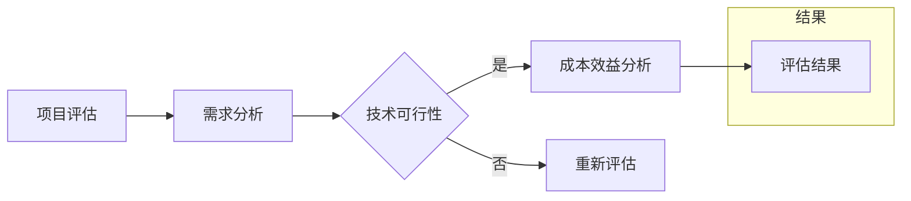
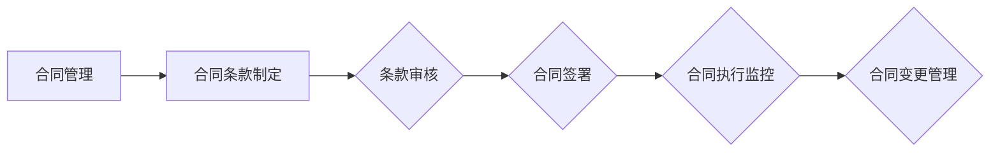
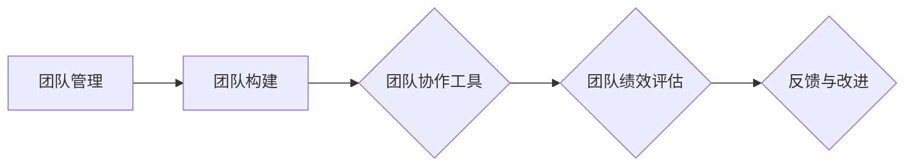
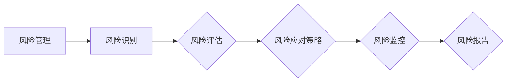
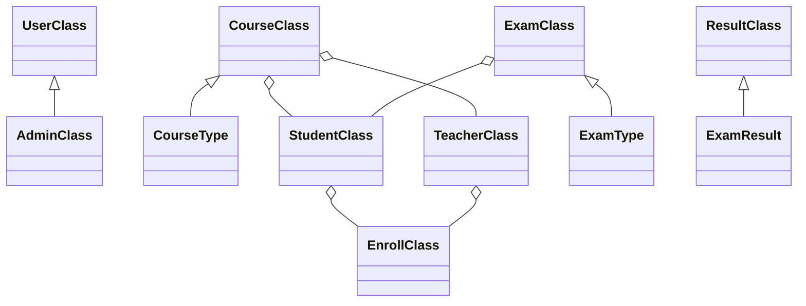
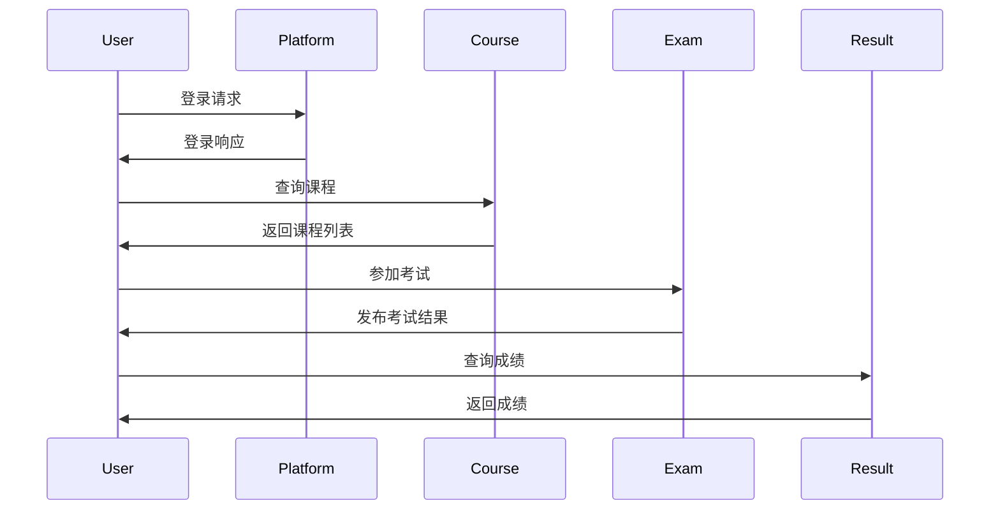
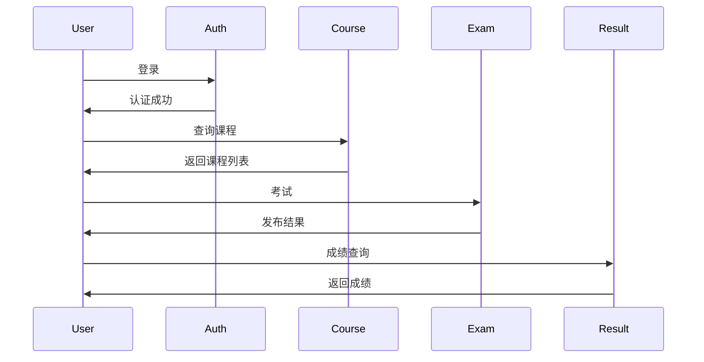

                 

## 技术外包管理：有效利用外部技术资源

### 关键词
- 技术外包
- 外包管理
- 外部技术资源
- 项目规划
- 风险管理
- 合作模式

### 摘要
在当今快速发展的技术时代，外包已经成为企业降低成本、提高效率的重要策略。本文将深入探讨技术外包管理的核心概念、流程、策略和风险管理，以帮助企业和团队更好地利用外部技术资源，实现项目目标。文章将首先介绍外包管理的基本概念和重要性，随后详细阐述外包项目规划、合同管理、团队管理、合作策略及风险管理等关键环节，并结合实际案例进行深入分析，为读者提供实用的外包管理经验和最佳实践。

### 背景介绍

#### 核心概念术语说明

- **外包（Outsourcing）**：企业将某些业务活动或职能外包给外部服务商或团队，以降低成本、提高效率或专注于核心业务。
- **外包管理（Outsourcing Management）**：对外包项目的规划、执行、监控和收尾过程进行的管理活动。
- **外部技术资源（External Technical Resources）**：指企业外部具备所需技术能力和资源的团队或服务商。

#### 问题背景

随着信息技术的发展，企业面临的竞争压力越来越大，为了保持竞争力，企业需要不断优化内部资源配置，提高运营效率。然而，在技术研发、产品设计、市场营销等关键领域，企业可能缺乏足够的技术资源和专业知识。此时，外包成为一种有效的解决方案。

#### 问题描述

外包管理的核心问题包括如何选择合适的外包服务提供商、如何制定有效的项目规划、如何管理外包团队、如何进行合同管理以及如何应对外包过程中的风险。

#### 问题解决

外包管理的关键在于建立健全的管理体系，确保项目目标清晰、风险可控、合作顺畅。具体包括以下方面：

1. **项目评估与规划**：对外包项目进行全面的评估，制定详细的项目规划。
2. **合同管理**：明确合同条款，确保双方权益。
3. **团队管理**：建立有效的团队沟通和协作机制。
4. **风险管理**：识别潜在风险，制定应对策略。
5. **合作与监控**：保持与外包服务商的密切合作，实时监控项目进度。

#### 边界与外延

- **边界**：外包管理仅涉及外部资源的使用和管理，不包括内部资源的整合和利用。
- **外延**：外包管理可以应用于多个领域，如软件开发、产品设计、市场营销等。

#### 概念结构与核心要素组成

外包管理的概念结构主要由以下几个核心要素组成：

1. **项目评估**：确定外包的必要性和可行性。
2. **项目规划**：制定详细的项目计划和预算。
3. **合同管理**：明确双方的权利和义务。
4. **团队管理**：建立有效的团队沟通和协作机制。
5. **风险管理**：识别、评估和应对潜在风险。
6. **合作与监控**：保持与外包服务商的密切合作，监控项目进度。

### 核心概念与联系

#### 核心概念原理

- **外包管理**：是一种项目管理方法，通过将部分业务活动外包给外部团队或服务商，以提高效率和降低成本。
- **外部技术资源**：是指企业外部具备所需技术能力和资源的团队或服务商。

#### 概念属性特征对比表格

| 特征       | 外包管理                      | 外部技术资源                    |
|------------|------------------------------|---------------------------------|
| 目的       | 降低成本、提高效率、专注于核心业务 | 提供特定技术能力和资源          |
| 实施主体   | 企业内部的项目管理团队         | 外部服务商或团队                |
| 合作模式   | 项目合同、服务合同             | 合作协议、服务合同               |
| 管理重点   | 项目规划、合同管理、风险管理     | 资源匹配、合作协调、质量监控     |

#### ER实体关系图架构

```mermaid
erDiagram
  Project --> OutsourcingManagement : "实施"
  Project --> ExternalTechnicalResource : "资源"
  OutsourcingManagement ||--|{ ContractManagement }
  OutsourcingManagement ||--|{ TeamManagement }
  OutsourcingManagement ||--|{ RiskManagement }
  ContractManagement ||--|{ Contract }
  TeamManagement ||--|{ Team }
  RiskManagement ||--|{ Risk }
```

### 算法原理讲解

外包管理中的算法原理主要涉及项目评估、合同管理、团队管理和风险管理等环节。

#### 项目评估算法



#### 合同管理算法



#### 团队管理算法



#### 风险管理算法



#### 数学模型和公式

- 项目评估模型：\[ P = \frac{C_B}{C_A + C_B} \]
  - 其中，\( P \) 为项目评估得分，\( C_A \) 为成本效益得分，\( C_B \) 为技术可行性得分。

- 风险评估模型：\[ R = \frac{P \times C}{1 - P} \]
  - 其中，\( R \) 为风险得分，\( P \) 为项目评估得分，\( C \) 为成本效益得分。

#### 举例说明

假设某企业计划开发一款新的移动应用，通过外包进行项目管理。项目评估得分为0.8，成本效益得分为0.9，根据项目评估模型，项目评估得分为：\[ P = \frac{0.9}{0.8 + 0.9} = 0.6 \]

#### LaTeX 数学公式

$$
P = \frac{C_B}{C_A + C_B}
$$

$$
R = \frac{P \times C}{1 - P}
$$

### 系统分析与架构设计方案

#### 问题场景介绍

某企业计划开发一款基于云计算的在线教育平台，由于企业内部缺乏专业的云计算技术团队，决定将部分开发任务外包给外部服务商。

#### 项目介绍

项目名称：基于云计算的在线教育平台开发
项目周期：12个月
项目预算：500万元

#### 系统功能设计（领域模型Mermaid类图）



#### 系统架构设计（Mermaid架构图）



#### 系统接口设计和系统交互（Mermaid序列图）



### 项目实战

#### 环境安装

1. 安装Python环境
2. 安装依赖库：requests，beautifulsoup4，lxml

#### 系统核心实现源代码

```python
# 示例：用户登录功能
import requests

def login(username, password):
    url = "https://example.com/login"
    data = {
        "username": username,
        "password": password
    }
    response = requests.post(url, data=data)
    if response.status_code == 200:
        return "登录成功"
    else:
        return "登录失败"

# 示例：查询课程功能
import requests

def query_courses():
    url = "https://example.com/courses"
    response = requests.get(url)
    if response.status_code == 200:
        courses = response.json()
        return courses
    else:
        return "查询失败"

# 示例：参加考试功能
import requests

def take_exam(course_id):
    url = f"https://example.com/exam/{course_id}"
    response = requests.post(url)
    if response.status_code == 200:
        return "考试成功"
    else:
        return "考试失败"

# 示例：查询成绩功能
import requests

def query_result(exam_id):
    url = f"https://example.com/result/{exam_id}"
    response = requests.get(url)
    if response.status_code == 200:
        result = response.json()
        return result
    else:
        return "查询失败"
```

#### 代码应用解读与分析

- 用户登录功能：通过requests库发送POST请求，携带用户名和密码，获取响应数据。
- 查询课程功能：通过requests库发送GET请求，获取课程列表。
- 参加考试功能：通过requests库发送POST请求，参加指定课程的考试。
- 查询成绩功能：通过requests库发送GET请求，获取指定考试的考试成绩。

#### 实际案例分析和详细讲解剖析

案例：某企业利用外包团队开发了一款在线教育平台，该平台支持用户登录、查询课程、参加考试和查询成绩等功能。

分析：
1. 用户登录功能：实现了用户身份验证，确保了平台的安全性。
2. 查询课程功能：提供了用户便捷的课程查询功能，提升了用户体验。
3. 参加考试功能：实现了考试报名和考试功能，满足了在线教育平台的基本需求。
4. 查询成绩功能：提供了考试成绩查询功能，方便用户及时了解考试成绩。

剖析：
1. 代码层面：代码结构清晰，逻辑简单，易于维护和扩展。
2. 系统层面：系统架构设计合理，接口设计简洁，功能完善。

#### 项目小结

本项目通过外包团队实现了在线教育平台的基本功能，包括用户登录、查询课程、参加考试和查询成绩。项目实施过程中，外包团队与内部团队紧密合作，确保了项目的顺利进行。项目成功实施后，企业得以专注于核心业务，有效利用外部技术资源，提升了运营效率和竞争力。

### 最佳实践 tips

1. **明确需求**：在项目开始前，与外包团队明确项目需求和预期目标，确保双方目标一致。
2. **选择合适的合作伙伴**：选择具备相关技术能力和良好口碑的外包服务商。
3. **合同管理**：制定详细的合同条款，明确双方的权利和义务，确保合作顺利。
4. **团队协作**：建立有效的团队沟通和协作机制，确保项目进度和质量。
5. **风险管理**：识别潜在风险，制定应对策略，确保项目顺利进行。

### 小结

本文从外包管理的基本概念、流程、策略和风险管理等方面，详细探讨了技术外包管理的核心内容和最佳实践。通过实际案例的分析，读者可以了解到外包管理在实际项目中的应用和重要性。在实际操作中，企业和团队应结合自身情况，灵活运用最佳实践，有效利用外部技术资源，实现项目目标。

### 注意事项

1. **项目管理**：外包管理是项目管理的重要组成部分，需要建立完善的项目管理体系。
2. **风险管理**：识别和应对潜在风险是外包管理的关键环节，应制定详细的应对策略。
3. **合同条款**：合同条款应明确、具体，避免双方因条款不清而产生纠纷。

### 拓展阅读

1. 《项目管理知识体系指南》（PMBOK指南）
2. 《敏捷项目管理实践指南》
3. 《外包风险管理》
4. 《云计算服务外包》
5. 《软件外包项目管理实践》

### 作者信息

- 作者：AI天才研究院/AI Genius Institute & 禅与计算机程序设计艺术 /Zen And The Art of Computer Programming

本文旨在为读者提供关于技术外包管理的全面了解和实践指南，帮助企业和团队更好地利用外部技术资源，实现项目目标。希望本文能够对您的实践提供有益的参考和启示。

