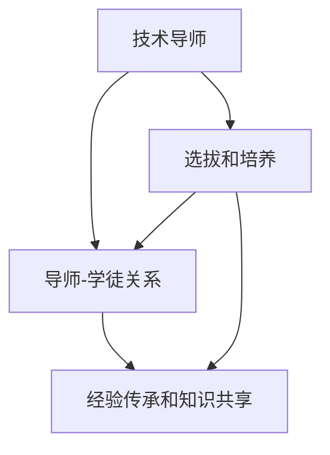

                 

### 技术导师制度设计：建立有效的经验传承机制

#### 关键词：技术导师、经验传承、制度设计、经验共享、组织发展

> **摘要：** 本文探讨了技术导师制度的设计，分析了其背景、重要性、核心概念和构建原则，详细描述了设计流程、关键要素及其实施方法。通过理论和实践的结合，为建立有效的技术经验传承机制提供了全面指导。

---

## 第1章 引言

### 1.1 问题背景

#### 1.1.1 技术发展的挑战

在快速发展的技术领域，新的概念、工具和框架层出不穷，技术人员需要不断地更新知识和技能。这种快速变化不仅带来了学习上的挑战，也对组织的知识传承提出了更高的要求。

#### 1.1.2 经验传承的重要性

经验是技术人员在长期实践中积累的宝贵财富，它包括了对问题解决方法的深刻理解、对技术的深刻洞察以及对工作流程的优化。然而，经验的传承通常面临着以下问题：

- 缺乏系统性的方法：现有的培训和教育体系往往注重理论的传授，而忽视实际工作经验的传递。
- 人员流动带来的风险：技术团队中的核心成员可能会因为各种原因离职，导致其宝贵经验无法传承。
- 缺乏有效的交流平台：技术人员之间的交流往往局限于日常的工作任务，缺乏系统性的经验分享和讨论。

#### 1.1.3 技术导师制度的设计需求

为了解决上述问题，技术导师制度的设计显得尤为重要。技术导师制度不仅有助于构建经验传承的机制，还能促进团队成员之间的知识共享和协作，提升团队的整体技术水平。

### 1.2 问题描述

#### 1.2.1 缺乏系统性的经验传承方法

当前，许多组织在经验传承方面缺乏系统性的方法，往往依赖个人的记忆和经验分享，这种方式既不系统，也难以持久。

#### 1.2.2 技术团队缺乏稳定性和可持续性

由于缺乏有效的经验传承机制，技术团队在面对人员流动时，往往难以保持稳定性和可持续性，新成员难以快速融入并发挥其潜力。

#### 1.2.3 技术传承中的常见问题

- **知识碎片化：** 技术人员往往掌握的是碎片化的知识，难以将这些知识整合成系统的经验。
- **缺乏指导：** 新技术人员缺乏有效的指导，难以在短时间内快速成长。
- **经验沉淀不足：** 技术人员的经验往往难以沉淀下来，导致重复性工作较多。

### 1.3 问题解决

#### 1.3.1 技术导师制度的核心概念

技术导师制度是一种通过系统化的导师-学徒关系，实现技术经验传承和知识共享的机制。它包括以下几个核心概念：

- **技术导师：** 拥有丰富经验和专业知识的技术人员，负责指导和培养学徒。
- **学徒：** 需要学习和成长的新技术人员，通过导师的指导和帮助，提升自己的技能和经验。
- **导师-学徒关系：** 一种长期的、动态的互动关系，旨在实现知识传承和技能提升。

#### 1.3.2 技术导师制度的构建原则

设计技术导师制度时，需要遵循以下原则：

- **明确目标：** 明确技术导师制度的目的是提升团队的技能和经验，促进知识传承。
- **考虑组织特点：** 考虑组织的规模、文化、技术方向等因素，设计适合的制度。
- **确保资源充足：** 确保制度设计时有足够的资源和支持，包括时间、人力和资金。
- **保持灵活性：** 制度设计应保持灵活性，以适应组织和技术的发展变化。

#### 1.3.3 技术导师制度的关键要素

技术导师制度的关键要素包括：

- **选拔和培养技术导师：** 确保技术导师具备足够的知识和经验。
- **建立导师-学徒关系：** 通过明确的目标和期望，建立有效的导师-学徒关系。
- **经验传承和知识共享：** 通过多种方式实现经验传承和知识共享。
- **评估和激励：** 对技术导师和学徒进行定期评估，并给予适当的激励。

### 1.4 边界与外延

#### 1.4.1 技术导师制度的适用范围

技术导师制度适用于各种类型的技术团队，无论其规模大小、技术方向如何，都可以通过制度设计，实现有效的经验传承。

#### 1.4.2 技术导师制度与现有机制的差异

技术导师制度与现有的培训和教育机制有所不同，它更注重实践经验的传承和实际技能的提升。

#### 1.4.3 技术导师制度的影响因素

技术导师制度的影响因素包括：

- **组织文化：** 组织文化对技术导师制度的有效实施有着重要的影响。
- **团队规模：** 团队规模会影响导师-学徒关系的建立和维持。
- **技术方向：** 技术方向的不同可能需要不同的导师制度设计。

### 1.5 概念结构与核心要素组成

#### 1.5.1 技术导师制度的概念结构

技术导师制度由以下几个核心部分组成：

- **导师：** 拥有丰富经验和专业知识的技术人员。
- **学徒：** 需要学习和成长的新技术人员。
- **导师-学徒关系：** 双方的互动和合作。
- **经验传承和知识共享：** 制度实现的核心目标。

#### 1.5.2 核心要素及其关系

技术导师制度的核心要素及其关系如下图所示：



#### 1.5.3 技术导师制度的设计要点

设计技术导师制度时，需要考虑以下几个要点：

- **明确目标和期望：** 明确导师和学徒的职责和目标。
- **建立有效的导师-学徒关系：** 确保双方能够有效沟通和合作。
- **提供必要的资源和支持：** 包括时间、人力和资金。
- **定期评估和反馈：** 对导师和学徒的进展进行定期评估，并给予反馈。

### 1.6 本章小结

本章介绍了技术导师制度的背景、重要性、核心概念和构建原则。通过明确的目标、有效的导师-学徒关系、经验传承和知识共享，技术导师制度能够为技术团队提供有效的经验传承机制，促进组织的可持续发展。

---

## 第2章 核心概念与联系

### 2.1 技术导师制度原理

#### 2.1.1 技术导师的定义与角色

技术导师是指在某一技术领域拥有丰富经验和专业知识的人员，他们通过指导和培养学徒，帮助学徒提升技能和经验，传承技术知识。

技术导师的角色包括：

- **指导与监督：** 指导学徒的学习过程，监督学徒的工作进度。
- **知识与经验传承：** 通过实践经验和理论知识，帮助学徒理解和掌握技术。
- **技能提升与职业发展：** 帮助学徒提升技能水平，为学徒的职业发展提供支持。

#### 2.1.2 导师-学徒关系的特点

导师-学徒关系具有以下几个特点：

- **长期性：** 导师-学徒关系通常是一个长期的过程，涉及学徒的整个成长过程。
- **互动性：** 双方的互动和合作是实现经验传承的关键。
- **动态性：** 导师-学徒关系是动态的，随着学徒的成长，双方的角色和关系也会发生变化。

#### 2.1.3 技术导师制度在组织中的功能

技术导师制度在组织中的功能包括：

- **知识传承：** 技术导师通过传授经验和知识，帮助组织保留和传承技术知识。
- **技能提升：** 通过导师的指导和培养，提高团队成员的技能水平。
- **团队协作：** 促进团队成员之间的知识共享和协作，提升团队的整体效能。

### 2.2 概念属性特征对比表格

#### 2.2.1 技术导师与其他培训角色的对比

| 对比项        | 技术导师               | 内部培训师               | 外部培训师               |
| ------------- | ---------------------- | ------------------------ | ------------------------ |
| 定义          | 在某一技术领域拥有丰富经验和专业知识的人员 | 组织内部负责培训的人员 | 来自组织外部的专业培训人员 |
| 角色          | 指导和培养学徒         | 负责组织内部的培训工作    | 负责为组织提供外部培训    |
| 特点          | 长期性、互动性、动态性  | 系统性、针对性           | 专业化、灵活           |
| 目的          | 知识传承、技能提升、团队协作 | 增强员工能力、提高工作效率 | 提供专业培训、提升员工技能 |
| 适用范围      | 组织内部的技术团队      | 组织内部的所有员工        | 组织外部的专业人员       |

#### 2.2.2 技术导师制度与传统培训制度的对比

| 对比项        | 技术导师制度             | 传统培训制度             |
| ------------- | ------------------------ | ------------------------ |
| 形式          | 长期、互动、个性化       | 短期、单向、标准化       |
| 内容          | 实践经验、理论知识       | 知识点、技能点           |
| 目标          | 技能提升、知识传承、团队协作 | 增强员工能力、提高工作效率 |
| 主体          | 技术导师与学徒           | 培训师与学员           |
| 效果          | 持久、深入、灵活         | 短期、表面、固化         |

#### 2.2.3 技术导师制度与项目管理制度的对比

| 对比项        | 技术导师制度             | 项目管理制度             |
| ------------- | ------------------------ | ------------------------ |
| 范围          | 技术层面的指导与培养     | 项目执行和管理的整体框架 |
| 内容          | 知识传承、技能提升       | 项目规划、执行、监控和收尾 |
| 目标          | 技术团队的整体发展       | 项目的成功完成           |
| 关系          | 导师-学徒的互动和合作    | 项目经理-团队成员的协作   |
| 责任          | 知识传承、团队协作       | 项目目标的实现           |

### 2.3 ER实体关系图架构

#### 2.3.1 实体与关系的识别

在技术导师制度中，主要的实体包括：

- **技术导师**
- **学徒**
- **组织**
- **项目**
- **知识**

实体之间的关系如下：

- **技术导师**与**学徒**之间是导师-学徒关系。
- **技术导师**与**组织**之间是隶属关系。
- **技术导师**与**项目**之间是参与关系。
- **学徒**与**项目**之间是参与关系。
- **知识**与**技术导师**之间是知识传承关系。

#### 2.3.2 关系图的绘制

以下是技术导师制度的ER实体关系图：

```mermaid
erDiagram
  Class1 ||--|{ Class2 }|-- Class3
  Class1 ||--|{ Class4 }|-- Class5
  Class1 ||--|{ Class6 }|-- Class7
  Class1 ||--|{ Class8 }|-- Class9
```

#### 2.3.3 实体关系的解释

- **技术导师**：负责指导和培养学徒，拥有丰富的技术经验和专业知识。
- **学徒**：需要通过导师的指导和培养，提升自己的技能和经验。
- **组织**：为技术导师和学徒提供平台和资源，支持导师制度的实施。
- **项目**：技术导师和学徒参与的实践项目，用于检验和提升技能。
- **知识**：技术导师通过项目实践和指导，向学徒传授的技术知识和经验。

---

### 2.4 本章小结

本章详细介绍了技术导师制度的核心概念和原理，包括技术导师的定义、导师-学徒关系的特点、技术导师制度在组织中的功能，以及与其他培训制度和项目管理制度的对比。通过ER实体关系图的绘制，明确了技术导师制度中各实体的关系和作用，为后续章节的设计和实施提供了基础。

---

## 第3章 设计原则与流程

### 3.1 设计原则

技术导师制度的设计应遵循以下原则：

#### 3.1.1 明确目标

设计技术导师制度时，首先要明确其目标，包括：

- **提升技能：** 通过导师的指导和培养，提高团队成员的技能水平。
- **传承知识：** 通过经验分享和知识传递，确保组织的知识得到有效传承。
- **促进协作：** 通过导师-学徒关系，促进团队成员之间的协作和知识共享。

#### 3.1.2 考虑组织特点

不同组织的规模、文化、技术方向和需求各异，因此在设计技术导师制度时，应考虑以下因素：

- **组织规模：** 大型组织可能需要更复杂的制度设计，中小型组织则可能更注重简单和高效。
- **文化背景：** 组织的文化氛围会影响导师制度的实施效果，需要确保制度与组织文化相契合。
- **技术方向：** 技术导师制度应根据组织的核心技术方向进行设计，以更好地满足技术需求。

#### 3.1.3 确保资源充足

技术导师制度的实施需要充足的人力、物力和财力支持，包括：

- **时间资源：** 确保导师和学徒有足够的时间进行交流和指导。
- **人力资源：** 选择合适的技术导师，并为他们提供必要的培训和资源。
- **资金资源：** 提供必要的资金支持，用于培训、研讨会和其他相关活动。

#### 3.1.4 保持灵活性

技术导师制度应保持灵活性，以适应组织和技术的发展变化。具体包括：

- **制度调整：** 随着组织和技术环境的变化，及时调整制度以保持其适用性。
- **反馈机制：** 通过定期收集反馈，及时了解制度实施的效果，并根据反馈进行改进。

### 3.2 设计流程

设计技术导师制度应遵循以下流程：

#### 3.2.1 需求分析

在开始设计之前，需要进行详细的需求分析，包括：

- **技术需求分析：** 分析团队当前的技术能力和需求，确定需要提升的技能和知识。
- **组织需求分析：** 分析组织的战略目标和业务需求，确保技术导师制度能够支持组织的发展。
- **团队需求分析：** 分析团队成员的技能水平和职业发展需求，为导师制度的设计提供依据。

#### 3.2.2 制度规划

根据需求分析的结果，进行制度规划，包括：

- **明确技术导师的角色和职责：** 确定技术导师的职责范围，如指导、培养、知识传承等。
- **制定导师-学徒匹配策略：** 根据团队成员的技能水平和职业发展需求，制定合理的导师-学徒匹配策略。
- **设定评估和激励机制：** 设定评估标准和激励机制，以激励技术导师和学徒积极参与制度。

#### 3.2.3 实施与推广

制度规划完成后，进入实施与推广阶段，包括：

- **培训导师和学徒：** 对导师和学徒进行培训，确保他们了解制度的要求和操作流程。
- **开展导师-学徒活动：** 组织定期的导师-学徒交流活动，促进知识和经验的传承。
- **监督与调整：** 监督制度的实施效果，根据反馈进行必要的调整和改进。

### 3.3 本章小结

本章详细介绍了技术导师制度的设计原则和流程，包括明确目标、考虑组织特点、确保资源充足和保持灵活性。通过需求分析、制度规划和实施推广，设计出适合组织的技术导师制度，实现有效的经验传承和知识共享。

---

## 第4章 关键要素设计与实施

### 4.1 技术导师的选择与培养

#### 4.1.1 技术导师的选拔标准

选择合适的技术导师是技术导师制度成功的关键。选拔技术导师应遵循以下标准：

- **技术能力：** 技术导师应具备深厚的技术背景和实际操作经验，能够解决复杂的技术问题。
- **教育背景：** 技术导师应拥有相关的学历背景，如计算机科学、软件工程等相关专业。
- **工作经验：** 技术导师应具备至少5年以上的工作经验，尤其在某一技术领域有深入的研究和实际应用。
- **沟通能力：** 技术导师应具备良好的沟通和表达能力，能够清晰、准确地传授知识和经验。
- **教学经验：** 技术导师应具备一定的教学经验，能够有效地指导和培养学徒。

#### 4.1.2 技术导师的培养计划

为了确保技术导师能够有效地履行职责，需要制定系统的培养计划，包括：

- **基础技能培训：** 技术导师需要掌握基本的教学方法和沟通技巧，包括如何进行有效的授课、如何管理课堂、如何进行反馈和评估等。
- **导师角色培训：** 技术导师需要了解导师的职责和角色，包括指导、培养、知识传承等，以及如何在团队中发挥积极作用。
- **专业领域提升：** 技术导师应不断提升自己在专业领域的知识水平，通过参加研讨会、研究项目、发表论文等方式，保持技术的领先性。

#### 4.1.3 技术导师的培养评估

对技术导师的培养效果进行定期评估是确保制度成功的重要环节。评估标准包括：

- **知识传承：** 技术导师是否能够有效地将知识和经验传授给学徒。
- **学徒成长：** 学徒在导师的指导下是否取得了显著的进步。
- **团队协作：** 技术导师是否能够促进团队成员之间的协作和知识共享。
- **个人发展：** 技术导师是否在职业发展上得到了提升。

评估方法包括：

- **定期反馈：** 通过定期的反馈会议，收集学徒和团队成员的意见，了解技术导师的表现。
- **绩效评估：** 根据技术导师在项目中的表现，进行绩效评估，包括任务的完成情况、团队的满意度等。
- **360度评估：** 通过团队成员、上级领导和学徒的反馈，全面了解技术导师的表现。

### 4.2 导师-学徒关系建立与维护

#### 4.2.1 导师-学徒关系的建立

建立有效的导师-学徒关系是技术导师制度成功的关键。建立关系的过程包括：

- **双向选择：** 技术导师和学徒应进行双向选择，确保双方都有共同的目标和期望。
- **明确目标和期望：** 双方应明确各自的目标和期望，包括技能提升、知识传承、职业发展等。
- **签订协议：** 双方应签订协议，明确各自的职责和义务，以及期望的结果和时间表。

#### 4.2.2 导师-学徒关系的维护

导师-学徒关系的维护需要双方的努力和持续的投入，包括：

- **定期交流：** 双方应定期进行交流，包括定期会议、一对一辅导等，确保双方保持紧密的联系。
- **反馈与支持：** 技术导师应给予学徒及时的反馈和支持，帮助学徒解决遇到的问题和挑战。
- **评估与调整：** 定期评估导师-学徒关系的进展，根据评估结果进行必要的调整和改进。

### 4.3 经验传承与知识共享

#### 4.3.1 经验传承的方法

经验传承是技术导师制度的核心目标之一，可以采用以下方法：

- **一对一指导：** 技术导师通过一对一的指导，对学徒进行个性化培养，传授具体的技能和经验。
- **团队讨论：** 技术导师组织定期的团队讨论，鼓励团队成员分享经验和见解，促进知识的交流和共享。
- **文档整理：** 技术导师和学徒应将实践过程中的经验和知识整理成文档，作为组织的知识资产。

#### 4.3.2 知识共享平台的设计与实施

为了更好地实现经验传承和知识共享，可以设计并实施一个知识共享平台，包括：

- **平台功能规划：** 平台应具备文档管理、知识库构建、在线讨论等功能，方便团队成员获取和分享知识。
- **系统架构设计：** 平台应采用分布式架构，确保高可用性和可扩展性。
- **用户界面设计：** 平台的用户界面应简洁易用，便于团队成员快速获取所需信息。
- **内容审核与管理：** 制定严格的内容审核和管理流程，确保知识的准确性和完整性。

---

### 4.4 本章小结

本章详细介绍了技术导师制度中的关键要素设计和实施方法，包括技术导师的选择与培养、导师-学徒关系的建立与维护，以及经验传承与知识共享的方法和平台设计。通过这些关键要素的有效实施，可以建立一套完善的技术导师制度，实现有效的经验传承和知识共享，提升团队的整体技能和效能。

---

## 总结

技术导师制度是一种有效的经验传承机制，通过建立导师-学徒关系，实现知识和经验的传递和共享。本文从背景介绍、核心概念与联系、设计原则与流程、关键要素设计与实施等多个方面，详细探讨了技术导师制度的构建方法和实施要点。通过明确目标、考虑组织特点、确保资源充足和保持灵活性，设计出适合组织的技术导师制度，实现技能提升、知识传承和团队协作。

在实施技术导师制度时，应注重技术导师的选择与培养，建立和维护良好的导师-学徒关系，通过多种方法实现经验传承和知识共享。同时，通过评估和反馈，不断完善和优化制度，确保其持续有效。

展望未来，随着技术的不断进步和组织的发展，技术导师制度将不断演进和优化，为技术团队提供更加有效的支持和保障。通过持续的努力和探索，技术导师制度将成为推动组织技术发展和人才培养的重要力量。

---

### 拓展阅读

1. **《技术领导力：技术团队的领导艺术》** - 这本书深入探讨了技术领导力的重要性，以及如何通过领导力提升技术团队的效能。
2. **《敏捷团队管理：高效团队协作的最佳实践》** - 该书介绍了敏捷团队管理的方法和实践，对于技术导师制度的实施具有重要的参考价值。
3. **《知识管理与共享：构建组织智慧》** - 本书详细介绍了知识管理和共享的方法，为技术导师制度中的知识传承提供了宝贵的经验。

---

### 注意事项

在设计和实施技术导师制度时，需要注意以下几点：

1. **明确目标：** 确保制度设计的目标与组织的战略目标和业务需求相一致。
2. **资源保障：** 确保制度实施过程中有充足的资源和支持，包括时间、人力和资金。
3. **灵活性：** 制度设计应保持灵活性，以适应组织和技术环境的变化。
4. **持续优化：** 通过定期的评估和反馈，不断优化制度，提高其有效性和适应性。

---

### 作者信息

**作者：** AI天才研究院 / AI Genius Institute & 禅与计算机程序设计艺术 / Zen And The Art of Computer Programming

AI天才研究院致力于推动人工智能技术的发展和应用，禅与计算机程序设计艺术则探索计算机科学中的哲学和艺术。本文旨在为技术团队提供一套有效的经验传承机制，助力组织的可持续发展和人才培养。希望本文能对读者在技术导师制度的设计和实施中提供有益的参考和启示。

