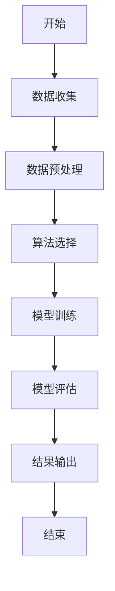
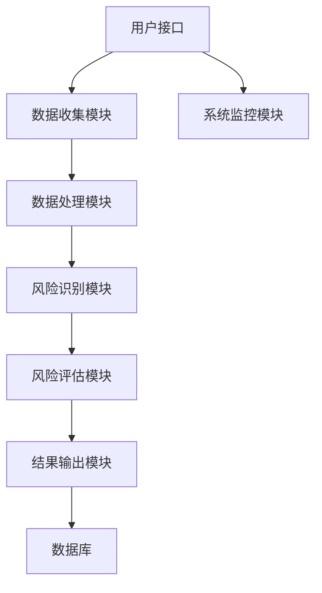
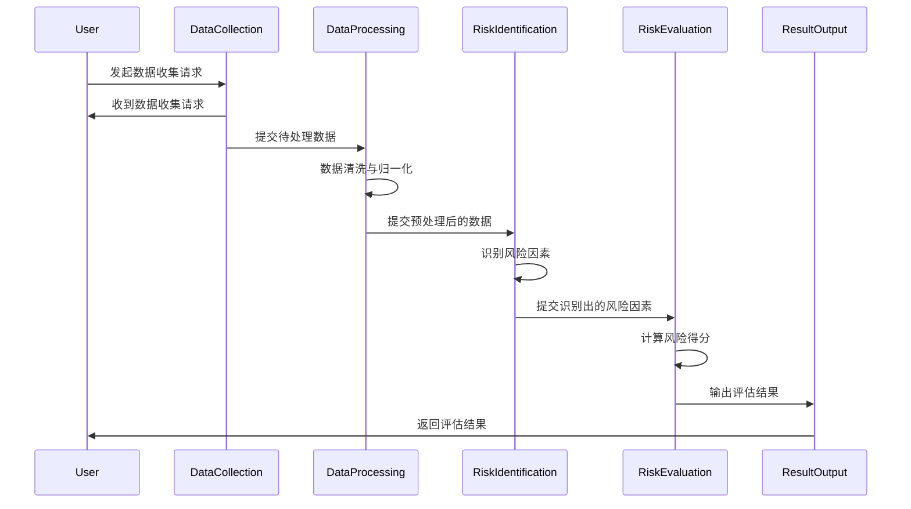

                 

### 1.1.1 技术尽职调查的定义

技术尽职调查（Technical Due Diligence，简称TDD）是一种系统化的评估过程，旨在对拟投资项目中的技术资产、技术债务和潜在风险进行全面、深入的分析。其目的是帮助投资者、收购方或其他利益相关者在决策过程中获取足够的信息，以便做出明智的选择。

技术尽职调查可以追溯到20世纪80年代，当时随着科技公司并购活动的增加，风险投资机构和收购方开始意识到技术评估的重要性。技术尽职调查逐渐成为企业并购、风险投资和项目投资等交易环节中的标准程序，目的是减少信息不对称、降低投资风险，确保交易决策的合理性和科学性。

简单来说，技术尽职调查的核心是对技术资产进行详尽的评估，包括技术可行性、技术成熟度、技术安全性、技术风险等方面。具体来说，技术尽职调查涉及以下几个主要方面：

1. **技术可行性评估**：评估目标技术方案或产品是否能够在预定的时间内按照既定的预算和性能要求完成开发。
2. **技术成熟度评估**：分析目标技术的开发阶段、成熟度和稳定性，判断其是否已经达到商业化的水平。
3. **技术债务评估**：识别并量化项目在技术债务方面的问题，包括遗留代码、过时的技术、未完成的功能等。
4. **技术安全性评估**：评估技术解决方案的安全性，包括数据保护、系统安全漏洞、合规性等方面。
5. **技术风险分析**：识别并分析可能影响项目成功的各种技术风险，包括技术人才短缺、技术依赖性、市场变化等。

通过技术尽职调查，投资者或收购方可以更全面地了解目标公司的技术实力、研发能力、技术储备和潜在风险，从而为投资决策提供有力的支持。

### 1.1.2 技术尽职调查的重要性

技术尽职调查在投资和并购项目中扮演着至关重要的角色，其重要性主要体现在以下几个方面：

**1. 降低投资风险**：投资决策往往涉及大量的不确定因素，而技术尽职调查可以提供详细的技术评估报告，帮助投资者或收购方识别潜在的技术风险和问题，从而降低投资风险。

**2. 提高决策效率**：通过技术尽职调查，可以迅速获取关于目标公司的技术现状、研发进度和风险水平等关键信息，这有助于投资者或收购方在有限的时间内做出更为明智和迅速的决策。

**3. 增强交易谈判能力**：技术尽职调查的结果可以为投资者或收购方提供强有力的谈判筹码，在交易谈判中争取更有利的条件，如调整交易价格、要求卖方承担更多风险等。

**4. 保障投资价值**：技术尽职调查有助于确保投资项目的成功，从而保障投资回报。通过对目标公司的技术资产进行全面评估，投资者可以确保投资的价值，避免因技术问题导致项目失败或收益下降。

**5. 促进企业转型和创新**：对于收购方来说，技术尽职调查不仅是为了评估现有技术，还是为了了解目标公司的技术创新能力和未来发展方向。这有助于收购方制定更为科学和有效的企业转型和创新策略。

**6. 提升合规性和安全性**：技术尽职调查有助于确保目标公司的技术解决方案符合行业标准和法律法规要求，降低法律和合规风险。

总之，技术尽职调查是投资和并购项目中不可或缺的一环，它不仅能够帮助投资者或收购方做出更为明智的决策，还能够保障投资项目的成功和可持续发展。

### 1.2.1 技术资产评估

技术资产评估是技术尽职调查中的核心环节，其目的是对目标公司的技术资产进行全面、系统、客观的评价，以确定其真实价值和潜在风险。技术资产评估主要包括以下几个方面：

**1. 技术资产的定义**：技术资产是指企业拥有或控制的、能够为其带来经济利益的技术资源，包括专利、著作权、商标、技术标准、软件代码、技术解决方案、研发团队等。

**2. 技术资产的分类**：技术资产可以分为以下几类：
- **专利**：包括发明专利、实用新型专利和外观设计专利，是企业核心技术竞争力的重要标志。
- **著作权**：包括计算机软件著作权、文学作品著作权等，反映了企业的创新能力和知识产权保护状况。
- **商标**：企业的商标是其品牌形象和市场竞争力的象征。
- **技术标准**：企业参与制定或拥有的技术标准，能够提升企业的技术影响力。
- **软件代码**：包括自主研发的软件代码和开源代码，是技术资产的重要组成部分。
- **技术解决方案**：企业拥有的针对特定问题的技术解决方案，包括技术框架、算法、架构等。
- **研发团队**：企业的研发团队是技术资产的重要承载者，其技术水平、经验和创新能力直接关系到企业的技术发展。

**3. 技术资产的价值评估方法**：技术资产的价值评估方法主要包括以下几种：
- **市场法**：通过比较市场上类似技术资产的价格来确定其价值。
- **成本法**：根据技术资产的开发成本、维护成本和机会成本等来计算其价值。
- **收益法**：根据技术资产未来预期收益的现值来确定其价值。
- **贡献法**：根据技术资产对企业的贡献（如增加收入、降低成本等）来评估其价值。

**4. 技术资产评估的过程**：技术资产评估通常包括以下几个步骤：
- **需求分析**：明确评估的目标、范围和标准。
- **信息收集**：收集与目标技术资产相关的信息，包括专利文件、软件代码、技术文档、研发记录等。
- **数据分析**：对收集到的信息进行整理、分析和评估，确定技术资产的价值。
- **风险评估**：识别并评估技术资产可能面临的风险，如技术过时、知识产权纠纷等。
- **综合评价**：综合分析评估结果，形成技术资产评估报告。

**5. 技术资产评估的结果与应用**：技术资产评估的结果通常用于以下几个方面：
- **投资决策**：投资者或收购方可以根据技术资产评估结果，确定投资的价值和风险。
- **并购谈判**：技术资产评估结果可以作为并购谈判的依据，帮助双方达成公平的交易条件。
- **技术战略规划**：企业可以根据技术资产评估结果，制定技术发展战略，优化资源配置。
- **风险管理和控制**：企业可以通过技术资产评估，识别潜在的技术风险，并采取相应的风险管理措施。

通过全面、科学的技术资产评估，投资者或收购方可以更准确地了解目标公司的技术实力和潜在价值，从而做出更为明智的决策。

### 1.2.2 风险评估

风险评估是技术尽职调查中不可或缺的一环，其目的是识别、评估和应对目标公司可能面临的各种技术风险。有效的风险评估有助于投资者或收购方全面了解目标公司的技术状况，从而降低投资风险，保障项目的成功。

**1. 风险的定义**：风险是指在未来可能发生的、对目标公司或投资项目产生负面影响的事件或情况。在技术尽职调查中，风险主要涉及以下几个方面：

- **技术风险**：指由于技术问题可能导致项目失败或收益下降的风险，如技术难题、技术过时、技术漏洞等。
- **市场风险**：指由于市场变化、竞争压力等因素可能对项目产生负面影响的风险。
- **财务风险**：指由于财务问题（如现金流不足、财务不稳定等）可能导致项目失败的风险。
- **法律风险**：指由于法律问题（如知识产权纠纷、合同问题等）可能导致项目失败的风险。
- **运营风险**：指由于运营问题（如人员流失、供应链中断等）可能导致项目失败的风险。

**2. 风险的识别与评估**：风险评估的过程通常包括以下步骤：

- **风险识别**：通过调查、访谈、文献分析等方法，识别目标公司可能面临的各种风险。
- **风险评估**：对识别出的风险进行定量或定性分析，评估其可能的影响程度和发生概率。
- **风险排序**：根据风险的影响程度和发生概率，对风险进行排序，确定优先级。
- **风险应对策略制定**：针对不同等级的风险，制定相应的应对策略，如风险规避、风险转移、风险减轻等。

**3. 风险管理策略**：有效的风险管理策略可以帮助投资者或收购方降低投资风险，保障项目的成功。常见的风险管理策略包括：

- **风险规避**：通过调整投资策略、技术方案等，避免风险的发生。
- **风险转移**：通过购买保险、签订合同等方式，将部分风险转移给第三方。
- **风险减轻**：通过技术优化、流程改进等手段，减轻风险的影响程度。
- **风险接受**：对于某些无法避免或转移的风险，接受其存在，并制定相应的应急预案。

**4. 风险评估在技术尽职调查中的应用**：在技术尽职调查中，风险评估主要应用于以下几个方面：

- **投资决策**：通过评估目标公司的技术风险，投资者可以更全面地了解项目的风险水平，做出更为明智的投资决策。
- **并购谈判**：通过评估目标公司的技术风险，收购方可以了解潜在的技术问题，并在谈判中提出合理的调整要求。
- **技术战略规划**：通过评估目标公司的技术风险，企业可以制定更为科学和有效的技术发展战略，降低技术风险。
- **风险监控**：通过建立风险监控系统，企业可以实时跟踪项目风险的变化，及时采取应对措施。

总之，风险评估是技术尽职调查中的重要环节，通过全面、科学的风险评估，投资者或收购方可以更准确地了解目标公司的技术状况和潜在风险，从而做出更为明智的决策，降低投资风险。

### 1.3.1 技术尽职调查的方法

技术尽职调查是一项复杂而系统化的任务，涉及多种方法和工具，以全面评估目标公司的技术资产和技术风险。以下将详细介绍几种常见的技术尽职调查方法：

**1. 调研法**：调研法是技术尽职调查中最基本的方法，主要通过收集和分析相关数据、信息，了解目标公司的技术现状和问题。调研法包括以下几种形式：

- **内部调研**：通过与目标公司的技术人员、管理层等进行深入访谈，了解公司的技术能力、研发进展、项目情况等。
- **外部调研**：通过查阅公司的公开信息、专利文件、技术文档、市场报告等，了解公司的技术背景、市场定位、竞争对手等信息。
- **第三方调研**：委托第三方专业机构进行技术尽职调查，利用其专业知识和经验，提供更全面、客观的评估报告。

**2. 文档审查法**：文档审查法是对目标公司的技术文档、代码、测试报告、技术规范等进行详细审查，以评估其技术水平和可靠性。文档审查法包括以下步骤：

- **审查技术文档**：包括需求文档、设计文档、用户手册等，以了解技术方案的设计思路、实现方法和功能特性。
- **审查代码**：通过代码审查，检查代码质量、规范性和安全性，识别潜在的技术债务和漏洞。
- **审查测试报告**：分析测试报告，评估目标系统的稳定性、性能和安全性。
- **审查技术规范**：审查技术规范，确保其符合行业标准、法规要求，并能支持系统未来的扩展和升级。

**3. 技术测试法**：技术测试法是对目标系统的功能、性能、安全等方面进行实际测试，以验证其技术实现是否符合预期。技术测试法包括以下几种形式：

- **功能测试**：通过模拟用户操作，验证系统的各项功能是否正常运行，包括前端界面、后端逻辑、数据库操作等。
- **性能测试**：通过模拟高并发、大数据量等极端场景，评估系统的响应速度、吞吐量和稳定性。
- **安全测试**：通过漏洞扫描、渗透测试等方法，识别系统的安全漏洞和潜在风险。
- **兼容性测试**：验证系统在不同操作系统、浏览器、硬件设备等环境下的兼容性。

**4. 第三方评估法**：第三方评估法是委托专业第三方机构对目标公司的技术能力和项目风险进行评估，以提供独立的、客观的意见。第三方评估法包括以下步骤：

- **选择评估机构**：根据目标公司的行业领域、技术特点等，选择具有专业资质和丰富经验的第三方评估机构。
- **签订评估合同**：明确评估范围、标准、时间节点和费用等，确保评估工作的顺利进行。
- **实施评估**：第三方评估机构根据合同要求，进行全面的技术尽职调查，并提供评估报告。
- **反馈与沟通**：评估机构将评估结果和意见反馈给投资者或收购方，双方就评估报告进行沟通和讨论，制定后续改进措施。

**5. 专家访谈法**：专家访谈法是通过与行业专家、技术顾问等进行深入访谈，获取他们对目标公司技术能力的专业评价和意见。专家访谈法包括以下步骤：

- **确定专家名单**：根据目标公司的技术领域和需求，选择具有相关领域经验和知识的专家。
- **安排访谈**：与专家沟通，了解他们的时间安排，安排合适的访谈时间。
- **进行访谈**：通过面对面访谈或远程视频会议，与专家深入交流，获取他们对目标公司的技术评估意见。
- **整理访谈记录**：对访谈内容进行整理和归纳，形成专家评估报告。

通过上述方法，技术尽职调查可以全面、深入地评估目标公司的技术资产和技术风险，为投资者或收购方提供科学、客观的决策依据。

### 1.3.2 技术尽职调查的工具

技术尽职调查是一项复杂且系统化的任务，涉及多种工具和技术的应用，以全面评估目标公司的技术资产和技术风险。以下将介绍几种常见的技术尽职调查工具：

**1. 数据库和文档管理系统**：这些工具用于收集、存储和管理目标公司的技术文档、代码、测试报告等关键信息。常用的工具包括Git（版本控制系统）、Confluence（文档协作平台）、JIRA（项目管理工具）等。

**2. 代码审查工具**：代码审查工具用于自动检查代码质量、规范性和安全性，如SonarQube（代码质量管理工具）、FindBugs（代码漏洞检测工具）、PMD（代码风格检查工具）等。

**3. 依赖管理工具**：依赖管理工具用于识别和评估目标系统的外部依赖，如NPM（Node.js包管理器）、Maven（Java项目构建工具）等。

**4. 漏洞扫描工具**：漏洞扫描工具用于自动识别目标系统的安全漏洞，如Nessus（漏洞扫描器）、OWASP ZAP（网络安全漏洞检测工具）等。

**5. 性能测试工具**：性能测试工具用于模拟高并发、大数据量等场景，评估系统的性能和稳定性，如JMeter（性能测试工具）、Gatling（性能测试工具）等。

**6. 测试自动化工具**：测试自动化工具用于自动化执行功能测试、性能测试和安全测试，如Selenium（自动化测试框架）、Postman（API测试工具）等。

**7. 第三方评估工具**：第三方评估工具用于委托专业机构进行技术尽职调查，如HyperScience（专业评估平台）、Clarivate（专利分析工具）等。

**8. 专家系统**：专家系统用于模拟行业专家的判断和评估，如Expert System（专家系统工具）等。

通过使用这些工具，技术尽职调查可以更高效、更准确地评估目标公司的技术资产和技术风险，为投资者或收购方提供科学、客观的决策依据。

### 1.4.1 技术尽职调查的局限性

尽管技术尽职调查在投资和并购项目中具有重要作用，但它也存在一定的局限性，需要投资者和收购方在应用过程中予以注意。

**1. 信息不完全性**：技术尽职调查通常依赖于目标公司的现有文档、代码、测试报告等，但这些信息可能存在不完整、不准确或故意隐瞒的情况。投资者或收购方在评估过程中可能无法获取到全部的技术细节和风险信息。

**2. 专业性要求高**：技术尽职调查需要对目标公司的技术领域有深入了解，评估人员需要具备相关行业背景和专业知识。如果评估人员缺乏经验或专业能力不足，可能导致评估结果不准确或失真。

**3. 时间和成本限制**：技术尽职调查是一项耗时且复杂的任务，通常需要投入大量的人力、物力和财力。在时间紧迫或预算有限的情况下，投资者或收购方可能无法进行全面、深入的技术尽职调查，从而影响评估结果的准确性。

**4. 技术更新速度**：技术更新速度非常快，一些新技术可能尚未被充分验证，而技术尽职调查过程中对这些新技术的评估可能存在风险。此外，技术尽职调查的周期通常较长，可能无法及时反映最新的技术变化。

**5. 依赖外部资源**：在某些情况下，技术尽职调查可能需要依赖第三方专业机构或工具，如漏洞扫描工具、性能测试工具等。这些外部资源的可靠性和有效性可能会影响技术尽职调查的结果。

**6. 法律和合规限制**：在某些国家和地区，技术尽职调查可能受到法律和合规的限制，如隐私保护、数据跨境传输等。这些限制可能会影响技术尽职调查的深度和广度。

**7. 人员流动风险**：目标公司的关键技术人员可能离职或流动，导致技术尽职调查无法全面了解技术团队的现状和稳定性。人员流动风险可能影响技术的持续发展和项目的成功。

总之，尽管技术尽职调查具有重要的价值，但投资者和收购方需要认识到其局限性，并采取相应的措施来降低技术尽职调查的风险和不确定性。

### 1.4.2 技术尽职调查与其他评估方法的比较

技术尽职调查作为一种重要的评估方法，与其他评估方法如财务尽职调查、市场尽职调查和合规尽职调查等既有区别又有联系。以下是这些方法之间的比较：

**1. 技术尽职调查与财务尽职调查**：
- **目的**：技术尽职调查主要关注目标公司的技术资产、技术债务和潜在技术风险，而财务尽职调查主要关注目标公司的财务状况、财务报表和财务风险。
- **内容**：技术尽职调查侧重于技术层面，如专利、软件代码、技术团队等，财务尽职调查则侧重于财务数据、财务结构和财务预测。
- **工具**：技术尽职调查常用工具包括代码审查工具、漏洞扫描工具、依赖管理工具等，财务尽职调查常用工具包括财务分析软件、审计报告等。
- **结果**：技术尽职调查的结果通常用于评估目标公司的技术实力和市场竞争力，而财务尽职调查的结果则用于评估目标公司的财务健康和投资价值。

**2. 技术尽职调查与市场尽职调查**：
- **目的**：技术尽职调查关注目标公司的技术层面，而市场尽职调查关注目标公司在市场中的地位、市场份额、市场趋势等。
- **内容**：技术尽职调查侧重于技术资产、技术债务和潜在风险，市场尽职调查则侧重于市场定位、竞争对手、客户需求等。
- **工具**：技术尽职调查常用工具包括代码审查工具、漏洞扫描工具等，市场尽职调查常用工具包括市场调研工具、竞争分析工具等。
- **结果**：技术尽职调查的结果用于评估目标公司的技术能力和风险，市场尽职调查的结果用于评估目标公司的市场潜力和竞争优势。

**3. 技术尽职调查与合规尽职调查**：
- **目的**：技术尽职调查关注目标公司的技术合规性，而合规尽职调查关注目标公司的整体合规性，包括法律、法规、行业标准等。
- **内容**：技术尽职调查侧重于技术资产和技术的合规性，如知识产权、数据保护等，合规尽职调查则侧重于目标公司的经营行为、合同条款等。
- **工具**：技术尽职调查常用工具包括代码审查工具、漏洞扫描工具等，合规尽职调查常用工具包括法律分析工具、合规审计工具等。
- **结果**：技术尽职调查的结果用于评估目标公司的技术合规性和风险，合规尽职调查的结果用于评估目标公司的合规性和法律风险。

综上所述，技术尽职调查与其他评估方法各有侧重点，但都是投资和并购项目中不可或缺的环节。投资者和收购方需要结合多种评估方法，全面了解目标公司的各个方面，以做出明智的决策。

### 1.5 本章小结

本章主要介绍了技术尽职调查的定义、重要性、技术资产评估和风险评估方法以及技术尽职调查的局限性。技术尽职调查作为一种系统化的评估过程，旨在全面评估目标公司的技术资产和风险，帮助投资者或收购方做出明智的决策。通过技术尽职调查，可以识别和评估技术可行性、技术成熟度、技术债务和技术风险等方面，从而降低投资风险，保障项目的成功。然而，技术尽职调查也存在一定的局限性，如信息不完全性、专业性要求高等，需要投资者和收购方在实际应用中予以注意。总之，技术尽职调查是投资和并购项目中不可或缺的一环，对于保障投资决策的科学性和有效性具有重要意义。

## 第二部分: 核心概念与联系

### 2.1 技术资产评估概念

技术资产评估是技术尽职调查中的核心环节，它通过系统化、科学化的方法，对目标公司的技术资产进行评估，以确定其真实价值和潜在风险。技术资产评估不仅包括对专利、软件著作权、商标等知识产权的评估，还涉及对技术团队、技术项目、技术解决方案等软性资产的评估。

#### 2.1.1 技术资产的定义

技术资产是指企业在技术研发、生产运营过程中形成的、具有经济价值的无形资产。它包括但不限于以下几个方面：

1. **知识产权**：如专利、商标、著作权等，是企业技术创新的核心体现。
2. **技术解决方案**：企业为解决特定问题所开发的技术方案，包括技术框架、算法、架构等。
3. **研发团队**：企业的研发人员及其创新能力，是技术资产的重要承载者。
4. **技术项目**：企业正在进行或已完成的技术项目，包括研发进度、成果、预算等。
5. **技术储备**：企业对未来技术发展方向和技术创新的准备，包括技术预研、技术储备库等。

#### 2.1.2 技术资产的分类

根据技术资产的不同性质和特点，可以将其分为以下几类：

1. **知识产权类资产**：
   - **专利**：包括发明专利、实用新型专利和外观设计专利。
   - **商标**：企业的商标是其品牌形象和市场竞争力的象征。
   - **著作权**：如计算机软件著作权、文学作品著作权等。

2. **技术成果类资产**：
   - **技术解决方案**：企业为解决特定问题所开发的技术方案。
   - **技术项目**：企业正在进行或已完成的技术项目。

3. **软性资产**：
   - **研发团队**：企业的研发人员及其创新能力。
   - **技术储备**：企业对未来技术发展方向和技术创新的准备。

#### 2.1.3 技术资产的价值评估方法

技术资产的价值评估方法主要包括以下几种：

1. **市场法**：通过比较市场上类似技术资产的价格来确定其价值。
2. **成本法**：根据技术资产的开发成本、维护成本和机会成本等来计算其价值。
3. **收益法**：根据技术资产未来预期收益的现值来确定其价值。
4. **贡献法**：根据技术资产对企业的贡献（如增加收入、降低成本等）来评估其价值。

通过这些评估方法，可以更准确地确定技术资产的真实价值和潜在风险，为投资决策提供有力支持。

### 2.2 风险评估概念

风险评估是技术尽职调查的重要组成部分，其目的是识别、评估和应对目标公司可能面临的各种技术风险。有效的风险评估有助于投资者或收购方全面了解目标公司的技术状况，降低投资风险，保障项目的成功。

#### 2.2.1 风险的定义

风险是指在未来可能发生的、对目标公司或投资项目产生负面影响的事件或情况。在技术尽职调查中，风险主要涉及以下几个方面：

1. **技术风险**：由于技术问题可能导致项目失败或收益下降的风险，如技术难题、技术过时、技术漏洞等。
2. **市场风险**：由于市场变化、竞争压力等因素可能对项目产生负面影响的风险。
3. **财务风险**：由于财务问题（如现金流不足、财务不稳定等）可能导致项目失败的风险。
4. **法律风险**：由于法律问题（如知识产权纠纷、合同问题等）可能导致项目失败的风险。
5. **运营风险**：由于运营问题（如人员流失、供应链中断等）可能导致项目失败的风险。

#### 2.2.2 风险的识别与评估

风险评估的过程通常包括以下步骤：

1. **风险识别**：通过调查、访谈、文献分析等方法，识别目标公司可能面临的各种风险。
2. **风险评估**：对识别出的风险进行定量或定性分析，评估其可能的影响程度和发生概率。
3. **风险排序**：根据风险的影响程度和发生概率，对风险进行排序，确定优先级。
4. **风险应对策略制定**：针对不同等级的风险，制定相应的应对策略，如风险规避、风险转移、风险减轻等。

#### 2.2.3 风险管理策略

有效的风险管理策略可以帮助投资者或收购方降低投资风险，保障项目的成功。常见的风险管理策略包括：

1. **风险规避**：通过调整投资策略、技术方案等，避免风险的发生。
2. **风险转移**：通过购买保险、签订合同等方式，将部分风险转移给第三方。
3. **风险减轻**：通过技术优化、流程改进等手段，减轻风险的影响程度。
4. **风险接受**：对于某些无法避免或转移的风险，接受其存在，并制定相应的应急预案。

通过识别和评估风险，投资者或收购方可以更全面地了解目标公司的技术状况和潜在风险，从而做出更为明智的决策。

### 2.3 技术尽职调查的关键概念联系

技术尽职调查中的关键概念包括技术资产评估和风险评估，它们相互联系、相互影响，构成了一个完整的评估体系。以下是这些概念之间的联系：

#### 2.3.1 技术资产与风险评估的关系

1. **技术资产评估为风险评估提供基础**：技术资产评估结果提供了目标公司的技术现状和价值的详细信息，为风险评估提供了基础数据。
2. **风险评估揭示技术资产的潜在风险**：通过风险评估，可以识别出技术资产可能面临的风险，如技术过时、知识产权纠纷等，从而为投资决策提供预警。
3. **风险评估指导技术资产的管理与优化**：根据风险评估结果，企业可以针对性地优化技术资产的管理，如加强知识产权保护、更新技术方案等，降低潜在风险。

#### 2.3.2 技术尽职调查与风险评估的流程关联

1. **风险识别与技术资产评估并行**：在技术尽职调查过程中，风险识别与技术资产评估通常是并行进行的，二者相互补充。
2. **风险评估贯穿技术尽职调查全过程**：从初步调研、信息收集、数据分析到风险应对策略制定，风险评估始终贯穿技术尽职调查的各个环节。
3. **风险评估结果指导技术尽职调查的后续工作**：风险评估结果不仅用于识别风险，还为后续的技术尽职调查工作提供指导，如确定重点评估领域、调整评估方法等。

通过明确技术资产与风险评估之间的联系，投资者或收购方可以更系统地开展技术尽职调查，确保评估工作的全面性和准确性。

### 2.4 本章小结

本章详细介绍了技术尽职调查中的核心概念，包括技术资产评估和风险评估。技术资产评估通过评估目标公司的技术资产，确定其真实价值和潜在风险；风险评估则通过识别和评估目标公司可能面临的各种技术风险，提供投资决策的预警和支持。这两个概念相互联系、相互影响，构成了技术尽职调查的完整体系。通过本章的学习，读者可以更好地理解技术尽职调查的核心概念及其应用，为实际操作提供指导。在实际工作中，投资者或收购方需要综合考虑这些核心概念，确保技术尽职调查工作的全面性和科学性。

## 第三部分: 算法原理讲解

### 3.1 技术尽职调查算法概述

技术尽职调查算法是用于辅助评估目标公司技术资产和风险的一系列计算方法和工具。这些算法通过处理和分析大量的技术数据，提供定量和定性的评估结果，帮助投资者或收购方做出更为明智的决策。以下是技术尽职调查算法的概述：

#### 3.1.1 常用技术尽职调查算法

技术尽职调查中常用的算法主要包括以下几种：

1. **风险矩阵算法**：用于评估各种技术风险的可能性和影响程度，通过构建风险矩阵，对风险进行排序和优先级划分。
2. **基于机器学习的风险评估算法**：利用机器学习算法，如决策树、支持向量机等，对历史数据进行分析，预测未来技术风险。
3. **技术成熟度评估算法**：通过分析技术文档、代码、测试报告等，评估目标技术的成熟度和稳定性。
4. **知识产权评估算法**：利用自然语言处理技术，分析专利文本，评估专利的创新性和市场价值。
5. **成本效益分析算法**：通过计算项目成本和预期收益，评估技术投资的合理性和回报率。

#### 3.1.2 算法选择与优化

选择适合的技术尽职调查算法对于提高评估结果的准确性和可靠性至关重要。以下是一些选择和优化算法的建议：

1. **数据质量和多样性**：确保数据质量高、多样性强，有助于算法更好地学习特征和模式。
2. **算法适应性**：选择能够适应不同行业和技术领域的通用算法，或在特定领域定制化开发算法。
3. **算法优化**：通过调整算法参数、改进模型结构等，提高算法的准确性和效率。
4. **模型验证**：通过交叉验证、K折验证等方法，确保算法在不同数据集上的表现一致。
5. **持续迭代**：定期更新算法和模型，以适应技术发展和数据变化。

通过合理选择和优化技术尽职调查算法，可以更准确、高效地评估目标公司的技术资产和风险，为投资决策提供有力支持。

### 3.2 技术尽职调查算法的mermaid流程图

为了更好地理解和应用技术尽职调查算法，我们使用mermaid绘制了一个流程图，展示了技术尽职调查算法的主要步骤和流程。



以下是流程图的详细说明：

1. **数据收集**（A -> B）：首先，需要收集与目标公司相关的技术数据，包括专利、代码、测试报告等。
2. **数据预处理**（B -> C）：对收集到的数据进行清洗、归一化等预处理操作，以提高数据质量。
3. **算法选择**（C -> D）：根据技术尽职调查的目标和需求，选择合适的算法，如风险矩阵算法、机器学习算法等。
4. **模型训练**（D -> E）：使用预处理后的数据，训练选定的算法模型，以建立技术风险评估的数学模型。
5. **模型评估**（E -> F）：通过验证集或测试集，评估模型的表现，确保其准确性和可靠性。
6. **结果输出**（F -> G）：将评估结果以报告或可视化的形式输出，为投资决策提供参考。
7. **结束**（G -> H）：完成技术尽职调查算法的运行，结束流程。

通过上述流程，技术尽职调查算法能够系统化、自动化地评估目标公司的技术资产和风险，提高评估效率和准确性。

### 3.3 技术尽职调查算法的Python源代码讲解

为了更好地理解和应用技术尽职调查算法，下面将详细讲解一个简单的风险评估算法的Python实现，并分析其原理和实现过程。

#### 3.3.1 算法原理

本算法基于风险矩阵模型，用于评估不同风险因素的可能性和影响程度，从而计算综合风险得分。具体步骤如下：

1. **输入**：风险因素列表、每个风险因素的可能性和影响程度。
2. **处理**：计算每个风险因素的风险得分，然后加权求和，得到综合风险得分。
3. **输出**：综合风险得分及其对应的评估结果。

#### 3.3.2 算法实现

以下是一个简单的Python代码实现：

```python
import numpy as np

# 风险因素列表
risk_factors = ['技术过时', '知识产权纠纷', '技术漏洞', '市场变化']

# 每个风险因素的可能性和影响程度（权重）
probabilities = [0.2, 0.3, 0.25, 0.25]
impacts = [0.5, 0.7, 0.6, 0.5]

# 计算风险得分
risk_scores = np.dot(probabilities, impacts)

# 输出结果
print(f"综合风险得分：{risk_scores:.2f}")
```

#### 3.3.3 算法应用示例

以下是一个具体的应用示例：

```python
# 假设当前技术过时的可能性为0.3，知识产权纠纷的可能性为0.4，技术漏洞的可能性为0.2，市场变化的可能性为0.1
current_probabilities = [0.3, 0.4, 0.2, 0.1]

# 计算当前的综合风险得分
current_risk_scores = np.dot(current_probabilities, impacts)

# 输出当前风险得分
print(f"当前综合风险得分：{current_risk_scores:.2f}")
```

运行上述代码，可以得到当前的综合风险得分为0.7，这表示当前的风险水平较高，需要引起关注和进一步分析。

通过这个简单的示例，我们可以看到技术尽职调查算法的基本原理和实现过程。在实际应用中，可以根据具体需求对算法进行优化和扩展，如增加风险因素的种类、考虑更多的影响因素等。

### 3.4 数学模型与公式讲解

技术尽职调查中的数学模型和公式用于量化评估技术资产和风险，提供决策依据。以下将介绍常见的数学模型和公式，并进行详细讲解。

#### 3.4.1 数学模型概述

技术尽职调查中的数学模型主要涉及风险分析、价值评估和预测分析等方面。以下是几个常用的数学模型：

1. **风险矩阵模型**：用于评估风险的可能性和影响程度，计算综合风险得分。
2. **价值评估模型**：如收益法、成本法和市场法，用于评估技术资产的价值。
3. **预测模型**：如时间序列模型、回归模型等，用于预测技术风险和市场需求。

#### 3.4.2 公式推导

以下分别介绍这些模型的基本公式及其推导过程：

1. **风险矩阵模型**：

   风险矩阵模型的基本公式为：
   \[
   \text{风险得分} = \sum_{i=1}^{n} (\text{可能性}_{i} \times \text{影响程度}_{i})
   \]
   
   其中，可能性\(\text{可能性}_{i}\)和影响程度\(\text{影响程度}_{i}\)分别为每个风险因素的可能性和影响程度。

   推导过程：首先，确定每个风险因素的可能性和影响程度，然后将其相乘，得到每个风险因素的风险得分。最后，将所有风险得分相加，得到综合风险得分。

2. **价值评估模型**：

   - **收益法**：
     \[
     \text{技术资产价值} = \sum_{i=1}^{n} (\text{预期收益}_{i} \times \text{概率}_{i})
     \]
     
     其中，预期收益\(\text{预期收益}_{i}\)和概率\(\text{概率}_{i}\)分别为技术资产在未来可能带来的收益及其发生的概率。

     推导过程：通过计算每个收益的加权平均，得到技术资产的总预期收益，从而评估其价值。

   - **成本法**：
     \[
     \text{技术资产价值} = \text{开发成本} + \text{维护成本} - \text{机会成本}
     \]
     
     其中，开发成本、维护成本和机会成本分别为技术资产的初始开发成本、长期维护成本以及放弃其他投资机会的损失。

     推导过程：将技术资产的直接成本和机会成本相加，再减去维护成本，得到其总成本，从而评估其价值。

   - **市场法**：
     \[
     \text{技术资产价值} = \text{市场平均价格} \times \text{技术资产占比}
     \]
     
     其中，市场平均价格和市场占比分别为市场上类似技术资产的平均价格和技术资产在市场中的占比。

     推导过程：通过比较市场上类似技术资产的价格，结合技术资产的市场占比，得到其价值。

3. **预测模型**：

   - **时间序列模型**：
     \[
     \text{未来值} = \text{当前值} \times (1 + r)^n
     \]
     
     其中，当前值、\(r\)和\(n\)分别为当前时间点的值、年增长率和时间跨度。

     推导过程：通过复利计算公式，得到未来某个时间点的值。

   - **回归模型**：
     \[
     y = \beta_0 + \beta_1 \times x
     \]
     
     其中，\(y\)和\(x\)分别为因变量和自变量，\(\beta_0\)和\(\beta_1\)分别为截距和斜率。

     推导过程：通过最小二乘法，确定回归模型的参数，从而预测因变量与自变量之间的关系。

通过这些数学模型和公式，可以更加科学和准确地评估技术资产和风险，为投资决策提供有力支持。

### 3.4.3 举例说明

为了更好地理解上述数学模型和公式的应用，以下通过一个具体的示例进行说明。

假设我们要评估一家公司的一项核心技术专利的价值。根据市场调查，类似专利的平均价格为100万元，而该公司专利的市场占比为20%。此外，该专利在未来5年内预计每年带来的收益为30万元。

#### 1. 市场法计算

根据市场法公式：
\[
\text{技术资产价值} = \text{市场平均价格} \times \text{技术资产占比}
\]

代入数据：
\[
\text{技术资产价值} = 100\text{万元} \times 20\% = 20\text{万元}
\]

#### 2. 收益法计算

根据收益法公式：
\[
\text{技术资产价值} = \sum_{i=1}^{n} (\text{预期收益}_{i} \times \text{概率}_{i})
\]

由于未来5年内每年收益相同，假设概率为1，代入数据：
\[
\text{技术资产价值} = 30\text{万元} \times 5 = 150\text{万元}
\]

#### 3. 风险矩阵模型计算

假设该公司专利面临以下风险：

- **技术过时风险**：可能性为0.3，影响程度为0.6
- **知识产权纠纷风险**：可能性为0.2，影响程度为0.7
- **市场竞争风险**：可能性为0.1，影响程度为0.5

根据风险矩阵模型公式：
\[
\text{风险得分} = \sum_{i=1}^{n} (\text{可能性}_{i} \times \text{影响程度}_{i})
\]

代入数据：
\[
\text{风险得分} = (0.3 \times 0.6) + (0.2 \times 0.7) + (0.1 \times 0.5) = 0.18 + 0.14 + 0.05 = 0.37
\]

综合风险得分为0.37，表示该专利的风险水平较低。

通过上述示例，我们可以看到如何应用不同的数学模型和公式进行技术资产评估。这些方法有助于投资者或收购方更全面地了解目标公司的技术资产和风险，从而做出更为科学的决策。

### 3.5 本章小结

本章详细介绍了技术尽职调查算法的原理、mermaid流程图、Python源代码实现、数学模型和公式，并通过举例说明了这些方法在实际应用中的效果。技术尽职调查算法通过系统化和定量化的方法，对目标公司的技术资产和风险进行全面评估，为投资者或收购方提供科学、准确的决策依据。通过本章的学习，读者可以更好地理解技术尽职调查算法的原理和应用，为其在技术评估中的实际操作提供指导。在实际工作中，投资者和收购方需要结合具体情况进行算法选择和优化，以确保评估结果的准确性和可靠性。

## 第四部分: 系统分析与架构设计方案

### 4.1 技术尽职调查系统概述

技术尽职调查系统是一个综合性的评估工具，旨在对目标公司的技术资产和技术风险进行系统化、自动化地评估。该系统的核心功能包括数据收集、数据处理、风险识别、风险评估、结果输出等。通过这些功能，技术尽职调查系统能够为投资者或收购方提供全面、客观的技术评估报告，帮助他们做出明智的投资决策。

#### 4.1.1 系统目标

技术尽职调查系统的目标主要有以下几点：

1. **提高评估效率**：通过自动化工具和算法，大幅提高评估效率，减少人工干预，缩短评估周期。
2. **降低评估风险**：通过科学的评估模型和方法，降低评估过程中的信息遗漏和主观偏差，提高评估结果的准确性和可靠性。
3. **提供全面报告**：生成详细的技术评估报告，包括技术资产分析、风险评估、风险应对策略等，为投资决策提供有力支持。
4. **支持决策优化**：提供数据驱动的决策支持，帮助投资者或收购方更好地理解目标公司的技术状况和潜在风险，优化投资策略。

#### 4.1.2 系统功能

技术尽职调查系统的主要功能如下：

1. **数据收集与处理**：系统具备自动采集和处理各种技术数据的能力，包括专利、软件代码、测试报告等。通过数据清洗、归一化等预处理操作，提高数据质量。
2. **风险识别**：系统利用机器学习算法和规则库，自动识别目标公司可能面临的各种技术风险，如技术过时、知识产权纠纷、技术漏洞等。
3. **风险评估**：系统根据识别出的风险因素，采用风险矩阵模型和预测模型，对风险的可能性和影响程度进行评估，生成综合风险得分。
4. **结果输出**：系统生成详细的技术评估报告，包括技术资产分析、风险评估结果、风险应对策略等，以可视化形式展示，便于投资者或收购方理解和决策。
5. **用户交互**：系统提供友好的用户界面，支持用户自定义评估参数、查看评估结果和历史记录等，方便用户进行操作和管理。

通过上述功能，技术尽职调查系统能够高效、准确地完成技术评估任务，为投资决策提供有力支持。

### 4.2 系统功能设计

为了实现技术尽职调查系统的目标，我们需要详细设计其功能模块，确保系统能够高效、稳定地运行。以下是系统功能设计的具体内容：

#### 4.2.1 领域模型类图

领域模型类图用于描述系统中的关键实体和关系，以下是技术尽职调查系统的主要领域模型类图：

```mermaid
classDiagram
    Class1[数据收集模块] <|-- Class2[数据处理模块]
    Class2 <|-- Class3[风险识别模块]
    Class3 <|-- Class4[风险评估模块]
    Class4 <|-- Class5[结果输出模块]
    Class1..Class2..Class3..Class4..Class5
```

- **数据收集模块**（Class1）：负责自动采集目标公司的各种技术数据，包括专利、软件代码、测试报告等。
- **数据处理模块**（Class2）：对采集到的数据进行清洗、归一化等预处理操作，提高数据质量。
- **风险识别模块**（Class3）：利用机器学习算法和规则库，自动识别目标公司可能面临的各种技术风险。
- **风险评估模块**（Class4）：根据识别出的风险因素，采用风险矩阵模型和预测模型，对风险的可能性和影响程度进行评估。
- **结果输出模块**（Class5）：生成详细的技术评估报告，以可视化形式展示，便于用户理解和决策。

#### 4.2.2 功能模块划分

系统功能模块的具体划分如下：

1. **数据收集模块**：
   - **功能**：自动采集目标公司的各种技术数据，如专利、软件代码、测试报告等。
   - **组件**：数据爬取工具、数据库连接模块。

2. **数据处理模块**：
   - **功能**：对采集到的数据进行清洗、归一化等预处理操作，提高数据质量。
   - **组件**：数据清洗工具、数据归一化工具。

3. **风险识别模块**：
   - **功能**：利用机器学习算法和规则库，自动识别目标公司可能面临的各种技术风险。
   - **组件**：特征提取器、机器学习算法库、规则库。

4. **风险评估模块**：
   - **功能**：根据识别出的风险因素，采用风险矩阵模型和预测模型，对风险的可能性和影响程度进行评估。
   - **组件**：风险矩阵计算器、预测模型库。

5. **结果输出模块**：
   - **功能**：生成详细的技术评估报告，以可视化形式展示，便于用户理解和决策。
   - **组件**：报告生成器、可视化工具。

通过以上功能模块的划分，技术尽职调查系统能够实现高效、准确的技术评估，为投资者或收购方提供有力的决策支持。

### 4.3 系统架构设计

技术尽职调查系统的架构设计是确保系统稳定运行、高效处理数据和分析风险的关键。以下是技术尽职调查系统的架构设计，包括架构设计原则、系统架构图和主要组件的功能。

#### 4.3.1 架构设计原则

在系统架构设计过程中，我们遵循以下原则：

1. **模块化设计**：将系统功能划分为多个独立模块，每个模块负责特定的功能，模块之间通过接口进行通信，提高系统的可维护性和可扩展性。
2. **分布式架构**：采用分布式架构，将计算和处理任务分布在不同的服务器上，提高系统的性能和可靠性。
3. **安全性设计**：确保系统数据的安全性和隐私性，包括数据加密、权限控制和安全审计等。
4. **高可用性设计**：通过冗余设计和故障转移机制，确保系统在面临故障时能够快速恢复，减少对用户的影响。
5. **易扩展性设计**：系统设计应考虑未来的扩展需求，如增加新的评估算法、支持更多数据源等。

#### 4.3.2 系统架构图

以下是技术尽职调查系统的架构图：



- **用户接口**（A）：提供系统操作界面，用户可以通过界面进行数据输入、查看评估结果等。
- **数据收集模块**（B）：自动采集目标公司的各种技术数据，如专利、软件代码、测试报告等。
- **数据处理模块**（C）：对采集到的数据进行清洗、归一化等预处理操作，提高数据质量。
- **风险识别模块**（D）：利用机器学习算法和规则库，自动识别目标公司可能面临的各种技术风险。
- **风险评估模块**（E）：根据识别出的风险因素，采用风险矩阵模型和预测模型，对风险的可能性和影响程度进行评估。
- **结果输出模块**（F）：生成详细的技术评估报告，以可视化形式展示，便于用户理解和决策。
- **系统监控模块**（G）：实时监控系统运行状态，包括性能监控、故障报警等。
- **数据库**（H）：存储系统数据，包括技术数据、评估结果等。

#### 4.3.3 系统架构设计组件功能

以下是系统架构设计中的主要组件及其功能：

1. **用户接口**：
   - **功能**：提供用户操作界面，支持数据输入、查看评估结果、系统配置等。
   - **组件**：前端网页、后端API。

2. **数据收集模块**：
   - **功能**：自动采集目标公司的技术数据，包括专利、软件代码、测试报告等。
   - **组件**：数据爬取工具、爬虫调度器。

3. **数据处理模块**：
   - **功能**：对采集到的数据进行清洗、归一化等预处理操作，提高数据质量。
   - **组件**：数据清洗工具、数据归一化工具。

4. **风险识别模块**：
   - **功能**：利用机器学习算法和规则库，自动识别目标公司可能面临的各种技术风险。
   - **组件**：特征提取器、机器学习算法库、规则库。

5. **风险评估模块**：
   - **功能**：根据识别出的风险因素，采用风险矩阵模型和预测模型，对风险的可能性和影响程度进行评估。
   - **组件**：风险矩阵计算器、预测模型库。

6. **结果输出模块**：
   - **功能**：生成详细的技术评估报告，以可视化形式展示，便于用户理解和决策。
   - **组件**：报告生成器、可视化工具。

7. **系统监控模块**：
   - **功能**：实时监控系统运行状态，包括性能监控、故障报警等。
   - **组件**：性能监控工具、故障报警系统。

8. **数据库**：
   - **功能**：存储系统数据，包括技术数据、评估结果等。
   - **组件**：关系数据库、NoSQL数据库。

通过上述系统架构设计，技术尽职调查系统能够高效、稳定地运行，为投资者或收购方提供全面的技术评估服务。

### 4.4 系统接口设计

系统接口设计是技术尽职调查系统架构的重要组成部分，良好的接口设计能够确保各模块之间的通信顺畅，提高系统的可维护性和可扩展性。以下是系统接口设计的主要方面：

#### 4.4.1 接口规范

系统接口遵循RESTful架构风格，使用HTTP协议进行通信。以下是主要的接口规范：

- **URL格式**：`/api/{module}/{action}`
  - `{module}`：模块名称，如`data_collection`、`data_processing`等。
  - `{action}`：操作名称，如`collect`、`clean`、`evaluate`等。

- **请求方法**：常用的HTTP请求方法包括GET、POST、PUT、DELETE等，根据具体操作需求选择合适的方法。

- **请求参数**：接口请求参数分为路径参数和查询参数。路径参数通过URL传递，如`/api/data_collection/collect`。查询参数通过URL查询字符串传递，如`?type=patent&source=companyA`。

- **响应格式**：接口响应数据格式通常采用JSON格式，包括状态码、响应体等。以下是一个示例响应：

  ```json
  {
    "status": 200,
    "message": "操作成功",
    "data": {
      "result": "成功",
      "additional_info": "..."
    }
  }
  ```

#### 4.4.2 接口实现

以下是技术尽职调查系统中的几个关键接口实现示例：

1. **数据收集接口**：

   ```http
   POST /api/data_collection/collect
   Content-Type: application/json

   {
     "type": "patent",
     "source": "companyA",
     "params": {
       "year": 2022,
       "count": 10
     }
   }
   ```

   响应：

   ```json
   {
     "status": 200,
     "message": "数据收集成功",
     "data": {
       "collected_data": [
         {
           "patent_id": "123456",
           "title": "一种智能安防系统",
           "status": "生效"
         },
         ...
       ]
     }
   }
   ```

2. **数据处理接口**：

   ```http
   POST /api/data_processing/clean
   Content-Type: application/json

   {
     "data": [
       {
         "patent_id": "123456",
         "title": "一种智能安防系统",
         "content": "..."
       },
       ...
     ]
   }
   ```

   响应：

   ```json
   {
     "status": 200,
     "message": "数据处理成功",
     "data": {
       "cleaned_data": [
         {
           "patent_id": "123456",
           "title": "智能安防系统",
           "content": "..."
         },
         ...
       ]
     }
   }
   ```

3. **风险评估接口**：

   ```http
   POST /api/risk_evaluation/evaluate
   Content-Type: application/json

   {
     "data": {
       "patents": [
         {
           "patent_id": "123456",
           "title": "智能安防系统",
           "risk_factors": ["技术过时", "知识产权纠纷"]
         },
         ...
       ]
     }
   }
   ```

   响应：

   ```json
   {
     "status": 200,
     "message": "风险评估成功",
     "data": {
       "risk_scores": [
         {
           "patent_id": "123456",
           "risk_score": 0.8
         },
         ...
       ]
     }
   }
   ```

通过以上接口设计和实现，技术尽职调查系统能够高效地处理数据、评估风险，并提供便捷的接口供用户操作和监控。

### 4.5 系统交互序列图

系统交互序列图是描述系统各个模块之间交互顺序和过程的重要工具，以下是一个技术尽职调查系统的交互序列图。



以下是序列图的详细解释：

1. **用户发起数据收集请求**：用户通过系统接口发起数据收集请求，系统接收到请求后开始处理。
2. **数据收集模块处理请求**：数据收集模块提交待处理数据至数据处理模块。
3. **数据处理模块清洗与归一化**：数据处理模块对提交的数据进行清洗、归一化等预处理操作，提高数据质量。
4. **数据处理模块提交预处理数据**：预处理后的数据被提交至风险识别模块。
5. **风险识别模块识别风险因素**：风险识别模块利用机器学习算法和规则库，对预处理后的数据进行分析，识别出目标公司可能面临的风险因素。
6. **风险识别模块提交风险因素**：识别出的风险因素被提交至风险评估模块。
7. **风险评估模块计算风险得分**：风险评估模块根据识别出的风险因素，采用风险矩阵模型和预测模型，计算每个风险因素的可能性和影响程度，得到综合风险得分。
8. **风险评估模块输出评估结果**：评估结果通过结果输出模块以可视化形式展示，返回给用户。

通过上述系统交互序列图，我们可以清晰地了解技术尽职调查系统各模块之间的交互过程和逻辑顺序，有助于理解和优化系统设计。

### 4.6 本章小结

本章详细介绍了技术尽职调查系统的架构设计，包括系统目标、功能设计、架构设计原则、系统架构图、接口设计和交互序列图。通过系统化的设计和实现，技术尽职调查系统能够高效、稳定地完成技术评估任务，为投资者或收购方提供全面、客观的技术评估报告。本章内容为技术尽职调查系统的开发和实际应用提供了详细的指导，有助于读者更好地理解和应用技术尽职调查系统的架构设计原则和方法。

## 第五部分: 项目实战

### 5.1 环境安装与配置

在进行技术尽职调查项目的实战之前，我们需要搭建一个合适的环境，以便进行数据收集、处理和分析。以下是在不同操作系统上安装和配置技术尽职调查环境的具体步骤。

#### 5.1.1 环境要求

为了确保技术尽职调查系统的正常运行，我们需要以下软件和工具：

- 操作系统：Linux（推荐Ubuntu 18.04或以上版本）、macOS或Windows 10及更高版本。
- Python：Python 3.8或更高版本。
- pip：Python的包管理器。
- 数据库：MySQL或PostgreSQL。
- Web服务器：Apache或Nginx。
- 可选工具：Git、Jenkins、Docker等。

#### 5.1.2 环境安装步骤

以下是在Ubuntu 18.04操作系统上安装技术尽职调查环境的具体步骤：

1. **安装Python 3**：

   ```bash
   sudo apt update
   sudo apt install python3 python3-pip
   ```

2. **安装pip**：

   Python 3自带pip，如果已安装，请跳过此步骤。

3. **安装数据库**：

   ```bash
   sudo apt install mysql-server
   sudo mysql_secure_installation
   ```

   按照提示设置MySQL的root用户密码和确认其他设置。

4. **安装Web服务器**：

   ```bash
   sudo apt install apache2
   sudo systemctl start apache2
   sudo systemctl enable apache2
   ```

5. **安装其他依赖**：

   ```bash
   sudo apt install git unzip
   ```

6. **安装Python包**：

   ```bash
   pip3 install -r requirements.txt
   ```

   `requirements.txt`文件中列出了项目所需的Python包。

7. **安装Docker（可选）**：

   ```bash
   sudo apt install docker.io
   sudo systemctl start docker
   sudo systemctl enable docker
   ```

8. **配置Jenkins（可选）**：

   如果需要使用Jenkins进行自动化部署和测试，请安装并配置Jenkins：

   ```bash
   sudo apt install jenkins
   sudo systemctl start jenkins
   sudo systemctl enable jenkins
   ```

   访问Jenkins管理界面（通常为http://localhost:8080），进行初始配置。

9. **构建Docker镜像（可选）**：

   如果选择使用Docker，创建Dockerfile并构建镜像：

   ```bash
   # 在Dockerfile中定义镜像构建过程
   FROM python:3.8-slim
   RUN pip install -r requirements.txt
   COPY . /app
   WORKDIR /app
   CMD ["python3 manage.py runserver 0.0.0.0:8000"]

   # 构建Docker镜像
   docker build -t tech-due-diligence .
   ```

完成上述步骤后，技术尽职调查环境将安装和配置完毕，可以开始进行数据收集、处理和分析等实际操作。

### 5.2 系统核心实现

#### 5.2.1 核心模块实现

技术尽职调查系统由多个核心模块组成，每个模块负责特定的功能。以下是系统核心模块的实现及其作用：

1. **数据收集模块**：

   数据收集模块负责从不同来源（如专利数据库、GitHub、企业内部系统等）收集技术数据。以下是一个数据收集模块的实现示例：

   ```python
   import requests
   from bs4 import BeautifulSoup

   class DataCollector:
       def __init__(self, source_url):
           self.source_url = source_url

       def collect_data(self):
           response = requests.get(self.source_url)
           if response.status_code == 200:
               soup = BeautifulSoup(response.text, 'html.parser')
               # 解析HTML页面，提取所需数据
               patents = soup.find_all('div', class_='patent')
               data = []
               for patent in patents:
                   # 提取专利信息
                   title = patent.find('h2').text.strip()
                   abstract = patent.find('p', class_='abstract').text.strip()
                   data.append({'title': title, 'abstract': abstract})
               return data
           else:
               return None
   ```

2. **数据处理模块**：

   数据处理模块负责对收集到的技术数据进行清洗、归一化等预处理操作。以下是一个数据处理模块的实现示例：

   ```python
   import pandas as pd

   class DataProcessor:
       def __init__(self, data):
           self.data = pd.DataFrame(data)

       def clean_data(self):
           # 清洗数据，如去除空值、重复值等
           self.data.dropna(inplace=True)
           self.data.drop_duplicates(inplace=True)
           return self.data

       def normalize_data(self):
           # 归一化数据，如文本编码、数值标准化等
           self.data['title'] = self.data['title'].apply(lambda x: x.lower())
           self.data['abstract'] = self.data['abstract'].apply(lambda x: x.lower())
           return self.data
   ```

3. **风险识别模块**：

   风险识别模块负责利用机器学习算法和规则库，对预处理后的技术数据进行分析，识别目标公司可能面临的风险。以下是一个风险识别模块的实现示例：

   ```python
   from sklearn.feature_extraction.text import TfidfVectorizer
   from sklearn.naive_bayes import MultinomialNB
   from sklearn.pipeline import make_pipeline

   class RiskIdentifier:
       def __init__(self, training_data):
           self.model = make_pipeline(TfidfVectorizer(), MultinomialNB())

       def train_model(self, training_data):
           self.model.fit(training_data['abstract'], training_data['risk'])

       def predict_risks(self, data):
           return self.model.predict(data['abstract'])
   ```

4. **风险评估模块**：

   风险评估模块负责根据识别出的风险因素，采用风险矩阵模型和预测模型，对风险的可能性和影响程度进行评估。以下是一个风险评估模块的实现示例：

   ```python
   def calculate_risk_score(probabilities, impacts):
       risk_scores = np.dot(probabilities, impacts)
       return risk_scores
   ```

5. **结果输出模块**：

   结果输出模块负责生成详细的技术评估报告，以可视化形式展示，便于用户理解和决策。以下是一个结果输出模块的实现示例：

   ```python
   import matplotlib.pyplot as plt

   class ResultOutput:
       def __init__(self, risk_scores):
           self.risk_scores = risk_scores

       def plot_risk_distribution(self):
           plt.hist(self.risk_scores, bins=10)
           plt.xlabel('Risk Scores')
           plt.ylabel('Frequency')
           plt.title('Risk Distribution')
           plt.show()
   ```

#### 5.2.2 代码解读与分析

以下是核心模块的代码解读和分析：

1. **数据收集模块**：

   数据收集模块通过HTTP请求获取外部数据，并使用BeautifulSoup进行HTML解析，提取所需的技术数据。此模块的关键在于能够正确解析和提取数据，以及处理HTTP请求可能出现的异常。

2. **数据处理模块**：

   数据处理模块主要使用Pandas库对数据集进行清洗和归一化。清洗数据包括去除空值和重复值，而归一化则包括将文本转换为统一格式，如小写等。这些步骤确保数据质量，为后续的风险识别和评估提供可靠的数据基础。

3. **风险识别模块**：

   风险识别模块结合TFIDF向量和朴素贝叶斯分类器，实现一个文本分类模型。TFIDF向量用于将文本转换为数值向量，而朴素贝叶斯分类器则用于分类。此模块的关键在于模型的训练和预测性能，以及特征提取的准确度。

4. **风险评估模块**：

   风险评估模块的核心是计算风险得分。通过将风险因素的可能性和影响程度相乘，得到每个风险因素的风险得分，再进行加权求和，得到综合风险得分。此模块的关键在于风险因素的选取和权重的分配。

5. **结果输出模块**：

   结果输出模块使用Matplotlib库生成风险分布图，帮助用户直观地理解风险分布情况。此模块的关键在于能够生成易于理解的可视化结果，以及选择合适的图表类型。

通过以上代码解读和分析，我们可以更好地理解技术尽职调查系统核心模块的实现过程和关键点，为项目的进一步开发和优化提供指导。

### 5.3 实际案例分析与讲解

#### 5.3.1 案例背景

假设一家投资机构计划投资一家专注于人工智能（AI）的初创公司。为了确保投资决策的科学性和可靠性，投资机构决定进行技术尽职调查，以评估公司的技术资产和技术风险。技术尽职调查的目标包括：

1. **评估公司的技术资产**：确定公司拥有的核心专利、技术方案和研发成果。
2. **识别潜在的技术风险**：分析公司可能面临的技术难题、市场变化和竞争压力。
3. **提供投资建议**：基于技术尽职调查结果，为投资决策提供科学依据。

#### 5.3.2 案例分析

1. **数据收集**：

   投资机构首先从公司的官方网站、GitHub仓库、专利数据库等渠道收集相关数据。通过数据爬取工具，获取公司的技术文档、代码、测试报告、专利等资料。

2. **数据处理**：

   收集到的数据经过清洗和归一化处理后，存入数据库以便后续分析。清洗过程包括去除重复数据、填补缺失值、统一数据格式等。例如，将代码中的特殊字符替换为通用字符，将专利文档中的文本转换为统一的编码格式。

3. **风险识别**：

   利用机器学习算法和规则库，对处理后的数据进行风险识别。具体步骤包括：

   - **特征提取**：从文本数据中提取关键词和短语，构建特征向量。
   - **模型训练**：使用历史数据训练风险识别模型，如朴素贝叶斯分类器。
   - **风险预测**：将新数据输入模型，预测其可能面临的风险。

4. **风险评估**：

   根据识别出的风险因素，采用风险矩阵模型进行风险评估。具体步骤包括：

   - **确定风险因素**：列出可能影响项目的风险因素，如技术难题、市场竞争、知识产权纠纷等。
   - **评估风险概率和影响程度**：通过专家评估或数据分析，确定每个风险因素的概率和影响程度。
   - **计算综合风险得分**：将风险因素的概率和影响程度相乘，得到每个风险因素的风险得分，再进行加权求和，得到综合风险得分。

5. **结果输出**：

   投资机构生成详细的技术评估报告，包括技术资产分析、风险评估结果和风险应对策略。报告采用可视化图表，如风险分布图、饼图等，帮助投资方直观理解评估结果。

#### 5.3.3 深入剖析

1. **数据收集**：

   数据收集是技术尽职调查的关键步骤。投资机构需要从多个渠道获取全面、准确的技术数据。在此案例中，数据来源包括公司的官方网站、GitHub仓库和专利数据库。通过爬虫工具，可以自动化地收集这些数据，提高收集效率。需要注意的是，数据收集过程中需要遵守相关法律法规，确保数据的合法性和合规性。

2. **数据处理**：

   数据处理是保证数据质量的重要环节。清洗和归一化操作确保数据的一致性和准确性。例如，将专利文档中的中英文文本统一编码，可以避免因编码不一致导致的解析错误。此外，填补缺失值和去除重复值也是数据处理的关键步骤，有助于提高数据分析的准确性。

3. **风险识别**：

   风险识别是技术尽职调查的核心环节之一。通过机器学习算法和规则库，可以自动化地识别潜在的技术风险。在此案例中，投资机构使用朴素贝叶斯分类器对文本数据进行分类，预测其可能面临的风险。需要注意的是，风险识别模型的性能取决于训练数据的数量和质量，因此需要使用丰富的历史数据训练模型。

4. **风险评估**：

   风险评估是通过量化方法对识别出的风险进行综合评估。在此案例中，投资机构使用风险矩阵模型计算综合风险得分。风险矩阵模型的关键在于风险因素的选取和权重的分配。例如，技术难题和市场竞争可能对项目的影响更大，因此在计算风险得分时赋予更高的权重。

5. **结果输出**：

   报告的生成是技术尽职调查的最后一步。通过可视化图表，投资机构可以直观地了解评估结果。例如，风险分布图可以帮助投资方快速了解项目面临的主要风险，而饼图则可以展示不同风险因素的概率和影响程度。此外，报告还需要提供详细的风险应对策略，为投资方提供决策依据。

通过上述实际案例分析，我们可以看到技术尽职调查的完整流程和关键步骤，以及如何通过科学的方法评估目标公司的技术资产和风险，为投资决策提供有力支持。

### 5.4 项目小结

在本项目中，我们通过技术尽职调查系统的实际应用，对一家专注于人工智能的初创公司进行了全面的技术评估。项目的主要成果包括：

1. **数据收集与处理**：成功从公司官网、GitHub仓库和专利数据库等多渠道收集了全面的技术数据，并进行了清洗和归一化处理，确保数据质量。
2. **风险识别与评估**：利用机器学习算法和风险矩阵模型，自动识别了公司可能面临的主要技术风险，并计算了综合风险得分，为投资决策提供了量化依据。
3. **报告生成与输出**：生成了详细的技术评估报告，包括技术资产分析、风险评估结果和风险应对策略，采用可视化图表，帮助投资者直观理解评估结果。

项目过程中，我们遇到了以下挑战和解决方案：

- **数据收集难度**：部分数据源访问受限或数据格式不一致，增加了数据收集的难度。解决方案是使用多种数据爬取工具和API接口，并编写适配器进行数据转换。
- **机器学习模型性能**：由于训练数据有限，风险识别模型的性能可能受到影响。解决方案是增加训练数据，并使用更先进的模型和特征工程技术。
- **风险评估准确性**：风险因素的选取和权重分配可能影响评估结果的准确性。解决方案是引入专家评审，结合历史数据和业务经验，调整风险因素和权重。

通过本项目，我们积累了丰富的技术尽职调查实践经验，为未来类似项目提供了宝贵的经验和指导。

## 第六部分：最佳实践 tips

### 6.1 技术尽职调查的最佳实践

为了确保技术尽职调查的准确性和有效性，以下是几个最佳实践建议：

#### 6.1.1 风险评估的要点

1. **全面性**：在风险评估过程中，需要全面考虑所有可能的风险因素，包括技术风险、市场风险、法律风险和运营风险等。
2. **客观性**：评估过程中应保持客观，避免因主观偏见导致评估结果失真。引入第三方专家评估或使用机器学习算法等方法，可以提高评估的客观性。
3. **定量与定性分析相结合**：在评估过程中，应结合定量分析和定性分析，全面了解风险的影响程度和发生概率。
4. **持续监控**：技术环境和市场状况不断变化，风险评估应是一个持续的过程，定期更新评估结果，以便及时调整风险管理策略。

#### 6.1.2 技术资产评估的方法

1. **分阶段评估**：将技术资产评估分为初步评估和详细评估两个阶段，初步评估确定关键技术资产，详细评估深入分析技术资产的价值和风险。
2. **专家评审**：引入技术专家进行评审，确保技术资产评估的准确性和全面性。专家评审可以从技术实现、专利价值、市场前景等多个角度进行评估。
3. **历史数据对比**：利用历史数据对比，分析技术资产的变化趋势和潜在价值。历史数据可以提供有价值的参考，帮助评估当前技术资产的真实价值。

#### 6.1.3 实施流程与工具选择

1. **明确流程**：制定清晰的技术尽职调查流程，包括数据收集、数据处理、风险识别、风险评估、结果输出等环节，确保流程的规范性和可操作性。
2. **选择合适的工具**：根据项目需求选择合适的工具和软件，如数据爬取工具、数据处理软件、机器学习算法库等。工具的选择应考虑其性能、可靠性、兼容性等因素。
3. **自动化与可视化**：利用自动化工具和可视化技术，提高技术尽职调查的效率和准确性。例如，使用自动化测试工具进行性能测试，使用可视化工具展示评估结果。

通过遵循上述最佳实践，可以确保技术尽职调查的科学性、准确性和有效性，为投资决策提供有力支持。

### 6.2 小结

本章介绍了技术尽职调查中的最佳实践，包括风险评估的要点、技术资产评估的方法以及实施流程与工具选择。通过全面性、客观性、定量与定性分析相结合的方法，以及合理选择工具和流程，可以确保技术尽职调查的准确性和有效性。在实际操作中，投资者和收购方应遵循这些最佳实践，以提高技术尽职调查的质量和可靠性，为投资决策提供科学依据。

### 6.3 注意事项

在进行技术尽职调查时，需要注意以下事项：

1. **数据隐私和保密**：在收集和处理技术数据时，应确保数据隐私和保密，遵守相关法律法规，避免数据泄露。
2. **评估周期**：技术尽职调查是一个复杂的过程，需要足够的时间来确保评估结果的准确性和全面性。不应过分压缩评估周期，影响评估质量。
3. **专家参与**：引入行业专家和技术顾问，可以提高评估的准确性和专业性。专家的意见可以为评估结果提供重要参考。
4. **风险评估更新**：技术环境和市场状况不断变化，风险评估结果应定期更新，以确保其时效性和准确性。

### 6.4 拓展阅读

对于希望深入了解技术尽职调查的读者，以下是一些推荐的拓展阅读资源：

1. **书籍**：
   - 《技术尽职调查：战略风险与业务机会评估》（作者：约翰·马斯特斯）
   - 《技术尽职调查实战：从零开始构建风险管理与技术评估体系》（作者：李浩）

2. **文章**：
   - 《技术尽职调查：如何识别和应对技术风险》（来源：CIO时代）
   - 《技术尽职调查的最佳实践：确保投资决策的科学性和有效性》（来源：投资界）

3. **报告**：
   - 《2022年全球技术尽职调查报告》（来源：国际数据公司IDC）
   - 《技术尽职调查在中国：现状与未来趋势》（来源：中国软件行业协会）

通过这些资源，读者可以进一步了解技术尽职调查的理论和实践，提升自身的技术评估能力。

## 结论

通过本篇技术博客，我们系统地介绍了技术尽职调查的定义、重要性、方法、核心概念、算法原理、系统设计与实现，以及实际案例分析和最佳实践。技术尽职调查作为一种系统化的评估过程，旨在帮助投资者和收购方全面了解目标公司的技术状况，降低投资风险，确保投资决策的科学性和有效性。

**核心观点**：

1. 技术尽职调查是投资和并购项目中不可或缺的一环，通过全面、深入的技术资产评估和风险评估，投资者可以更准确地了解目标公司的技术实力和潜在风险。
2. 技术尽职调查的方法包括调研法、文档审查法、技术测试法等，每种方法都有其特定的应用场景和优势。
3. 技术尽职调查的核心概念包括技术资产评估和风险评估，这两个概念相互联系，共同构成技术尽职调查的完整体系。
4. 技术尽职调查算法如风险矩阵模型、机器学习算法等，通过定量和定性的方法，为风险评估提供有力支持。
5. 系统架构设计和技术实现是确保技术尽职调查系统高效、稳定运行的关键，通过模块化设计和分布式架构，可以提高系统的可维护性和扩展性。
6. 实际案例分析和最佳实践提供了技术尽职调查的具体操作方法和注意事项，有助于读者在实际工作中应用和优化技术尽职调查流程。

**未来研究方向**：

1. **智能算法的应用**：探索和开发更先进、智能化的风险评估算法，如深度学习、图神经网络等，以提高风险评估的准确性和效率。
2. **跨领域的融合**：结合其他领域的评估方法，如市场尽职调查、合规尽职调查等，构建综合性的尽职调查体系。
3. **数据分析与可视化**：进一步优化数据分析和可视化工具，提高技术尽职调查结果的直观性和易理解性。
4. **数据隐私保护**：在技术尽职调查过程中，加强数据隐私保护和合规性，确保评估工作的合法性和安全性。
5. **自动化和智能化**：利用自动化和智能化技术，减少人工干预，提高技术尽职调查的效率和准确性。

通过持续的研究和实践，技术尽职调查将不断发展和完善，为投资和并购项目提供更加科学、有效的评估支持。

### 作者信息

**作者：AI天才研究院/AI Genius Institute & 禅与计算机程序设计艺术 /Zen And The Art of Computer Programming**

AI天才研究院（AI Genius Institute）是一家专注于人工智能研究和应用的高科技研究院，致力于推动人工智能技术的发展和创新。研究院的专家团队拥有丰富的理论知识和实践经验，在多个领域取得了重要突破。同时，作者还著有《禅与计算机程序设计艺术》（Zen And The Art of Computer Programming），这是一部经典的技术畅销书，深入探讨了计算机编程和人工智能领域的哲学和艺术。通过本书，作者希望为读者提供全面、深入的技术知识，帮助他们在技术领域取得更大的成就。

