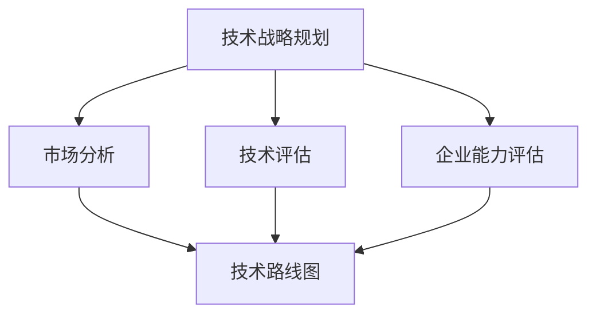

                 

## 第1章：技术战略规划概述

### 1.1 问题背景

在当今科技日新月异、市场竞争激烈的环境中，企业面临的技术挑战日益严峻。如何把握技术趋势，制定有效技术战略，已成为企业持续发展的重要课题。企业在技术发展中的困境主要体现在以下几个方面：

1. **技术进步速度加快**：技术的快速发展使得企业需要不断更新技术栈，以保持竞争力。
2. **市场需求变化多端**：消费者需求的变化导致企业需要快速调整产品和技术方向。
3. **竞争压力加剧**：同行企业在技术上的不断创新和突破，使得市场环境更加严峻。
4. **资源限制**：企业在技术研发、人力、资金等方面的资源限制，使得技术战略的制定与实施面临挑战。

在这种背景下，技术战略规划的重要性愈发凸显。技术战略规划不仅有助于企业明确技术发展方向，还可以提高企业对市场变化的应变能力，增强企业的核心竞争力。以下从三个方面探讨技术战略规划的基本原则：

#### 1.1.1 技术战略规划的重要性

1. **指导技术研发**：明确企业技术的长期目标和短期目标，优化技术投入，提高技术研发的效率。
2. **支撑业务战略**：技术战略与业务战略的协同发展，可以推动企业整体战略的实现。
3. **提升企业竞争力**：通过技术领先，提升产品或服务的附加值，增强市场竞争力。

#### 1.1.2 技术战略规划的基本原则

1. **目标导向**：技术战略规划应以企业总体目标为导向，确保技术研发方向与企业发展目标一致。
2. **动态调整**：技术战略规划需要根据市场环境、技术趋势和内部资源的变化进行动态调整。
3. **资源优化**：在资源有限的情况下，通过合理配置资源，实现技术战略的最大效益。
4. **协同发展**：技术战略规划应与业务战略、财务战略等企业整体战略协同发展，形成合力。

### 1.2 技术战略的核心概念

#### 1.2.1 技术战略的定义

技术战略是指企业为了实现长期目标，根据外部环境、内部资源和能力，对技术研发、技术引进、技术应用等方面进行规划和管理的一系列措施和策略。

#### 1.2.2 技术战略的要素

1. **技术目标**：明确企业技术发展的方向和目标，包括短期目标和长期目标。
2. **技术路线**：确定企业技术发展的具体路径，包括技术方向、关键技术、技术储备等。
3. **资源配置**：明确企业在技术研发、人员、资金等方面的资源配置策略。
4. **风险管理**：识别技术风险，制定风险应对措施，确保技术战略的顺利实施。

#### 1.2.3 技术战略的层次结构

1. **企业层面**：从企业整体战略的高度，制定长期技术发展方向和规划。
2. **业务层面**：针对不同业务领域，制定具体的技术战略和实施计划。
3. **技术层面**：针对关键技术领域，制定具体的技术路线图和研发计划。

### 1.3 路线图制定

#### 1.3.1 路线图的定义与作用

技术路线图是指企业根据技术战略，对技术研发、技术引进、技术应用等方面的时间节点、里程碑进行详细规划的一种工具。其作用主要体现在以下几个方面：

1. **明确发展目标**：通过路线图，明确企业技术发展的时间表和里程碑，有助于企业明确发展方向。
2. **指导技术研发**：路线图可以帮助企业合理分配资源，指导技术研发的方向和优先级。
3. **监控进展**：通过对比实际进展与计划，及时发现并解决问题，确保技术战略的顺利实施。

#### 1.3.2 路线图的制定步骤

1. **分析现状**：了解企业当前的技术水平、技术需求和市场环境。
2. **确定目标**：根据企业战略，明确技术发展的长期和短期目标。
3. **制定路线**：确定技术发展的具体路径和关键技术。
4. **规划里程碑**：制定时间节点和里程碑，确保技术目标的实现。
5. **调整与优化**：根据实际情况，对路线图进行动态调整和优化。

#### 1.3.3 路线图的关键要素

1. **技术节点**：明确技术发展的关键阶段和里程碑。
2. **时间规划**：制定具体的时间节点和里程碑，确保技术目标的实现。
3. **资源分配**：明确技术研发、人力、资金等资源的配置。
4. **风险评估**：识别技术风险，制定风险应对措施。

### 1.4 边界与外延

#### 1.4.1 技术战略规划的范围

技术战略规划涉及企业技术研发、技术引进、技术应用等多个方面，其范围包括：

1. **技术领域**：包括信息技术、生物技术、新能源技术等。
2. **技术方向**：明确企业技术发展的重点领域和方向。
3. **技术应用**：包括产品研发、工艺改进、服务创新等。

#### 1.4.2 路线图的适用范围

路线图主要适用于：

1. **企业整体战略规划**：指导企业技术发展方向和目标。
2. **业务领域战略规划**：针对特定业务领域，制定技术战略和实施计划。
3. **技术项目规划**：对具体技术项目进行时间节点和里程碑的详细规划。

#### 1.4.3 技术战略规划与业务战略的关系

技术战略规划与业务战略密切相关，其关系主要体现在以下几个方面：

1. **支撑业务战略**：技术战略规划为业务战略提供技术支持和保障。
2. **协同发展**：技术战略与业务战略相互促进，共同推动企业整体发展。
3. **资源整合**：通过技术战略规划，实现企业内部资源的优化配置，支持业务战略的实施。

### 总结

本章从问题背景、核心概念、路线图制定等方面，对技术战略规划进行了概述。技术战略规划是企业应对技术挑战、实现长期发展的重要手段。在下一章中，我们将进一步探讨技术战略与业务战略的协同发展，为企业制定有效的技术战略提供指导。

## 第2章：技术战略与业务战略的协同

### 2.1 技术战略与业务战略的关联

技术战略与业务战略是企业发展中两个至关重要的部分。它们之间存在着紧密的关联，相互影响、相互促进。为了更好地理解这种关联，我们首先需要明确业务战略和技术战略的定义及其特点。

#### 2.1.1 业务战略的定义与特点

业务战略是企业为了实现特定业务目标而制定的一系列策略和行动。它通常包括市场定位、产品定位、客户定位、竞争策略等方面。业务战略的特点主要有：

1. **长期性**：业务战略着眼于企业的长期发展，关注未来的市场变化和竞争态势。
2. **全局性**：业务战略需要从企业整体出发，考虑各个业务领域的协调发展。
3. **灵活性**：业务战略需要根据市场环境和内部资源的变化进行动态调整。

#### 2.1.2 技术战略在业务战略中的作用

技术战略是业务战略的重要组成部分，它对企业的业务发展具有深远的影响。技术战略在业务战略中的作用主要体现在以下几个方面：

1. **支撑业务发展**：技术战略为企业业务提供技术支持和保障，帮助企业实现业务目标。
2. **提升竞争力**：通过技术创新，提升企业的产品或服务质量，增强市场竞争力。
3. **引领业务方向**：技术战略可以引导企业业务发展的方向，推动企业业务模式的创新和变革。

#### 2.1.3 技术战略与业务战略的协同策略

技术战略与业务战略的协同发展，是实现企业整体战略目标的关键。以下是一些有效的协同策略：

1. **目标一致**：技术战略与业务战略的目标应保持一致，以确保企业资源的高效利用。
2. **资源整合**：通过整合企业内外部资源，实现技术战略与业务战略的协同发展。
3. **动态调整**：根据市场环境和内部资源的变化，动态调整技术战略和业务战略，以保持企业的竞争优势。

### 2.2 案例分析

为了更好地理解技术战略与业务战略的协同关系，我们通过两个实际案例进行深入分析。

#### 2.2.1 案例一：技术战略驱动业务增长

某互联网企业在竞争激烈的市场环境中，通过技术战略驱动业务增长。该企业首先明确了技术发展的方向，即提升用户体验和产品性能。为了实现这一目标，企业投入大量资源进行技术研发，推出了一系列具有创新性的产品功能，如智能推荐、实时语音翻译等。这些技术创新不仅提升了用户体验，还吸引了大量新用户，实现了业务的高速增长。

#### 2.2.2 案例二：业务战略指导技术发展

另一家制造企业在制定业务战略时，明确了技术发展的重点，即提高生产效率和产品质量。为了实现这一目标，企业投资建设了先进的自动化生产线，引入了智能制造技术。这些技术手段不仅提高了生产效率，还显著提升了产品质量，使得企业在市场上具备了强大的竞争力。通过业务战略的指导，企业实现了技术发展的有效推进。

### 总结

通过以上分析，我们可以看到，技术战略与业务战略之间存在着密切的关联，相互促进、共同发展。在制定技术战略时，企业应充分考虑业务战略的要求和目标，通过有效的协同策略，实现技术战略与业务战略的同步推进。在下一章中，我们将进一步探讨技术战略规划的核心要素，为企业制定科学合理的技术战略提供指导。

## 第3章：技术战略规划的核心要素

### 3.1 市场分析

市场分析是技术战略规划的基础环节，通过对市场环境的深入分析，可以为企业提供有价值的信息，帮助其制定科学合理的技术战略。市场分析主要包括以下几个方面：

#### 3.1.1 市场环境分析

市场环境分析旨在了解企业所在行业的发展趋势、政策法规、市场竞争状况等因素。具体包括：

1. **行业发展周期**：分析行业所处的生命周期阶段，判断行业的发展趋势和潜在风险。
2. **政策法规**：了解国家和地区的政策法规，尤其是那些可能影响企业技术研发和产品推广的法规。
3. **市场竞争状况**：分析市场上主要竞争者的情况，包括市场份额、产品定位、竞争优势等。

#### 3.1.2 市场需求分析

市场需求分析是了解消费者需求的重要手段，通过分析市场需求，企业可以明确产品的定位和研发方向。具体包括：

1. **目标客户群体**：明确企业的目标客户群体，了解其需求和购买行为。
2. **需求特点**：分析市场需求的特点，如需求的多样性、变化性和紧迫性等。
3. **需求趋势**：预测市场需求的发展趋势，为企业的技术战略提供前瞻性指导。

#### 3.1.3 竞争对手分析

竞争对手分析是了解市场竞争格局的重要手段，通过分析竞争对手的技术、产品、市场策略等，企业可以找到自身的优势和不足，制定针对性的技术战略。具体包括：

1. **竞争对手技术**：分析竞争对手的技术水平、技术路线和研发能力。
2. **竞争对手产品**：了解竞争对手的产品特点、市场表现和用户反馈。
3. **竞争对手策略**：分析竞争对手的市场策略、推广手段和价格策略。

### 3.2 技术评估

技术评估是技术战略规划的核心环节，通过对现有技术和潜在技术的评估，可以帮助企业确定技术发展的优先级和路径。技术评估主要包括以下几个方面：

#### 3.2.1 技术成熟度评估

技术成熟度评估是判断技术是否适合企业当前发展阶段的重要标准。技术成熟度通常分为几个阶段，如研发阶段、试验阶段、商业化阶段等。企业应根据技术成熟度选择合适的技术进行开发和应用。

#### 3.2.2 技术成本效益分析

技术成本效益分析是评估技术投入是否合理的重要手段。企业需要综合考虑技术的开发成本、运营成本和预期效益，确保技术投资的回报。

#### 3.2.3 技术风险分析

技术风险分析是识别和评估技术项目潜在风险的重要环节。企业需要分析技术实现中的技术风险、市场风险和项目管理风险，并制定相应的风险应对措施。

### 3.3 企业能力评估

企业能力评估是技术战略规划的重要组成部分，通过评估企业的技术研发能力、团队协作能力和资源配置能力，可以为企业制定合适的技术战略提供依据。具体包括：

#### 3.3.1 技术研发能力评估

技术研发能力评估包括企业的研发团队规模、研发设备和技术储备等方面。企业需要评估自身在关键技术领域的研发能力，以便确定技术发展的重点。

#### 3.3.2 团队协作能力评估

团队协作能力评估包括团队沟通、协作效率和项目管理等方面。良好的团队协作能力是技术项目成功的关键因素，企业需要评估和提升团队的协作能力。

#### 3.3.3 资源配置能力评估

资源配置能力评估包括企业在资金、人力、技术和设备等资源方面的配置能力。企业需要确保资源的合理分配，以支持技术战略的实施。

### 总结

市场分析、技术评估和企业能力评估是技术战略规划的核心要素，它们相互关联、共同作用，为企业制定科学合理的技术战略提供了基础。在下一章中，我们将探讨如何制定技术路线图，为企业技术发展提供详细的时间节点和里程碑计划。

## 第4章：技术路线图的制定

### 4.1 技术路线图的框架

技术路线图是企业根据技术战略，对技术研发、技术引进、技术应用等方面的时间节点、里程碑进行详细规划的一种工具。一个完整的技术路线图应包含以下几个组成部分：

#### 4.1.1 技术路线图的组成部分

1. **技术节点**：明确技术发展的关键阶段和里程碑，如研发阶段、试验阶段、商业化阶段等。
2. **时间规划**：制定具体的时间节点和里程碑，确保技术目标的实现。
3. **资源分配**：明确技术研发、人力、资金等资源的配置。
4. **风险评估**：识别技术风险，制定风险应对措施。
5. **实施计划**：详细描述每个技术节点的实施步骤和责任分工。

#### 4.1.2 技术路线图的逻辑结构

技术路线图的逻辑结构通常包括以下几个层次：

1. **总体框架**：明确技术发展的总体方向和目标，设定技术路线图的核心框架。
2. **阶段划分**：根据技术发展的特点，将整个技术路线图划分为不同的阶段，如初始阶段、发展阶段、成熟阶段等。
3. **关键节点**：在每个阶段中，确定关键的技术节点和里程碑，确保技术目标的实现。
4. **资源分配**：根据技术节点的需求，合理分配资源，确保技术路线图的顺利实施。
5. **风险评估**：识别潜在的技术风险，制定相应的风险应对措施，降低风险影响。

#### 4.1.3 技术路线图的设计原则

设计技术路线图应遵循以下原则：

1. **目标导向**：确保技术路线图的目标与企业的整体战略目标一致，以实现企业的长期发展。
2. **动态调整**：技术路线图应根据市场环境、技术趋势和内部资源的变化进行动态调整，以保持其适用性。
3. **资源优化**：通过合理配置资源，实现技术路线图的最大效益。
4. **协同发展**：技术路线图应与业务战略、财务战略等企业整体战略协同发展，形成合力。

### 4.2 关键阶段的划分

技术路线图通常根据技术发展的特点，将整个技术路线图划分为不同的关键阶段。这些关键阶段包括：

#### 4.2.1 初始阶段

初始阶段是技术路线图的起点，主要目标是确定技术方向和关键技术。在这个阶段，企业需要进行市场调研、技术评估和资源规划，以确保技术方向的选择符合市场需求和企业的技术能力。

#### 4.2.2 发展阶段

发展阶段是技术路线图的核心阶段，主要目标是实现技术的研发和应用。在这个阶段，企业需要投入大量资源进行技术研发，通过试验和验证，确保技术的可行性和稳定性。同时，企业还需要进行市场推广，将技术应用于实际业务中，实现商业价值。

#### 4.2.3 成熟阶段

成熟阶段是技术路线图的终点，主要目标是实现技术的广泛应用和商业成功。在这个阶段，企业需要进一步优化技术，提升用户体验和产品性能，同时扩大市场份额，巩固市场地位。

#### 4.2.4 衰退阶段

衰退阶段是技术路线图的终末阶段，主要目标是逐步退出旧技术，引入新技术。在这个阶段，企业需要评估现有技术的生命周期，制定技术更新计划，确保企业的技术竞争力。

### 4.3 路线图的关键节点

技术路线图中的关键节点是确保技术目标实现的重要里程碑。以下是一些关键节点的具体内容：

#### 4.3.1 关键技术研发

关键技术研发是技术路线图中的核心节点，主要目标是实现关键技术的突破和创新。在这个节点上，企业需要投入大量研发资源，进行技术研发和试验，确保技术的可行性和稳定性。

#### 4.3.2 产业应用拓展

产业应用拓展是技术路线图中的关键节点，主要目标是实现技术的产业化应用。在这个节点上，企业需要将技术研发成果转化为实际应用，通过市场推广，实现技术的商业价值。

#### 4.3.3 市场竞争策略

市场竞争策略是技术路线图中的关键节点，主要目标是提升企业的市场竞争力。在这个节点上，企业需要分析市场竞争状况，制定相应的市场竞争策略，如差异化竞争、价格竞争等，以提升企业的市场地位。

### 总结

技术路线图的制定是企业实现技术战略的重要工具。通过明确关键阶段和关键节点，企业可以有效地规划技术发展，实现技术目标。在下一章中，我们将探讨技术战略规划的实施与监控，确保技术战略的有效执行。

## 第5章：技术战略规划的实施与监控

### 5.1 实施策略

技术战略规划的实施是企业战略目标实现的关键步骤。为了确保技术战略的顺利执行，企业需要制定一系列实施策略。以下是几个关键的实施策略：

#### 5.1.1 项目管理方法

项目管理方法是确保技术战略规划实施的重要手段。企业需要采用科学的项目管理方法，如敏捷开发、迭代开发等，以提高项目进度可控性，降低风险。项目管理方法包括：

1. **项目计划**：制定详细的项目计划，明确项目目标、任务分工、时间节点等。
2. **进度监控**：通过定期项目会议、进度报告等方式，实时监控项目进展，确保项目按计划进行。
3. **风险控制**：识别项目中的潜在风险，制定相应的风险应对措施，降低项目风险。

#### 5.1.2 资源配置策略

资源配置策略是确保技术战略实施的基础。企业需要合理配置资源，包括人力、资金、技术和设备等，以确保技术战略的顺利执行。资源配置策略包括：

1. **资源评估**：评估企业现有资源的状况，确定资源需求，确保资源供给。
2. **资源分配**：根据项目需求和资源状况，合理分配资源，确保资源的高效利用。
3. **资源优化**：通过资源优化，提高资源利用率，降低资源浪费。

#### 5.1.3 风险管理策略

风险管理策略是确保技术战略规划顺利实施的重要保障。企业需要建立完善的风险管理体系，识别和评估项目风险，并制定相应的应对措施。风险管理策略包括：

1. **风险识别**：通过风险识别，确定项目中的潜在风险。
2. **风险评估**：评估风险的可能性及其对项目的影响，确定风险等级。
3. **风险应对**：制定相应的风险应对措施，降低风险的影响。

### 5.2 监控与评估

技术战略规划的实施离不开有效的监控与评估。通过监控与评估，企业可以实时掌握项目进展情况，及时发现并解决问题，确保技术战略的顺利实施。以下是几个关键的监控与评估方法：

#### 5.2.1 监控指标体系

监控指标体系是监控项目进展的重要工具。企业需要建立完善的监控指标体系，包括进度指标、质量指标、成本指标等，以便全面评估项目进展情况。监控指标体系包括：

1. **进度指标**：衡量项目进度是否按计划进行，如完成率、延期率等。
2. **质量指标**：衡量项目成果的质量，如缺陷率、用户满意度等。
3. **成本指标**：衡量项目成本是否控制在预算范围内，如成本超支率等。

#### 5.2.2 评估方法与工具

评估方法与工具是评估项目成果的重要手段。企业需要采用科学合理的评估方法与工具，对项目成果进行全面评估。评估方法与工具包括：

1. **绩效评估**：通过绩效评估，评估项目团队成员的工作表现，如工作量、工作效率等。
2. **技术评估**：通过技术评估，评估技术成果的先进性、可行性、稳定性等。
3. **经济效益评估**：通过经济效益评估，评估项目对企业的经济贡献，如收益、成本等。

#### 5.2.3 反馈与调整

反馈与调整是确保技术战略规划顺利实施的关键环节。通过反馈与调整，企业可以不断优化项目，确保技术战略的实现。反馈与调整包括：

1. **定期反馈**：通过定期项目会议、进度报告等方式，收集项目团队成员的反馈，及时了解项目进展情况。
2. **问题调整**：根据反馈结果，分析项目中的问题，制定相应的调整措施，确保项目顺利实施。
3. **持续改进**：通过持续改进，不断优化项目，提高项目质量，确保技术战略的实现。

### 总结

技术战略规划的实施与监控是企业实现技术战略目标的重要保障。通过制定实施策略和监控评估方法，企业可以确保技术战略的顺利执行。在下一章中，我们将通过案例分析，进一步探讨技术战略规划的实施效果和经验。

## 第6章：技术战略规划案例分析

### 6.1 案例一：互联网企业的技术战略规划

#### 6.1.1 企业背景

某互联网企业成立于2010年，是一家专注于在线教育领域的公司。随着互联网技术的发展和用户需求的不断变化，该公司在2015年意识到技术战略规划对其未来发展的重要性，开始着手制定技术战略规划。

#### 6.1.2 技术战略规划过程

1. **市场调研**：公司首先进行了全面的市场调研，了解在线教育行业的发展趋势、竞争状况和用户需求。
2. **技术评估**：根据市场调研结果，公司对现有技术和潜在技术进行了评估，确定了技术发展的方向和重点。
3. **战略制定**：公司制定了长期和短期技术战略，明确了技术研发、技术引进和技术应用的具体目标和路径。
4. **路线图制定**：公司根据技术战略，制定了详细的技术路线图，明确了每个阶段的关键节点和时间规划。

#### 6.1.3 成果与经验

通过技术战略规划的制定和实施，公司取得了以下成果：

1. **技术突破**：公司在人工智能、大数据分析等领域取得了重要技术突破，提高了在线教育产品的用户体验和个性化推荐能力。
2. **市场竞争力提升**：公司通过技术优势，增强了市场竞争力，用户规模和市场份额显著提升。
3. **业务模式创新**：公司借助技术创新，推出了一系列创新性业务模式，如直播课程、在线辅导等，满足了不同用户的需求。

公司在技术战略规划过程中积累了以下经验：

1. **重视市场调研**：市场调研是制定技术战略的重要基础，只有深入了解市场需求，才能制定出切实可行的技术战略。
2. **动态调整**：技术战略需要根据市场环境、技术趋势和内部资源的变化进行动态调整，以保持其适用性和有效性。
3. **资源优化配置**：合理配置资源是技术战略成功实施的关键，公司通过优化资源配置，提高了技术项目的成功率和效益。

### 6.2 案例二：制造业企业的技术路线图制定

#### 6.2.1 企业背景

某制造企业成立于2000年，主要从事高端装备制造业务。随着市场竞争的加剧和技术的快速进步，该公司在2020年意识到技术路线图对其未来发展的重要性，开始着手制定技术路线图。

#### 6.2.2 技术路线图制定过程

1. **现状分析**：公司首先分析了当前的技术水平和市场需求，明确了技术发展的现状和需求。
2. **目标确定**：公司确定了长期和短期技术目标，包括提高生产效率、降低能耗和提升产品质量等。
3. **技术路线规划**：公司根据技术目标，制定了详细的技术路线图，明确了每个阶段的技术节点和里程碑。
4. **实施计划**：公司制定了详细的实施计划，包括技术研发、设备更新、人员培训等。

#### 6.2.3 实施效果分析

通过技术路线图的制定和实施，公司取得了以下效果：

1. **技术提升**：公司在智能制造、节能技术等领域取得了显著的技术进步，提高了产品的技术含量和附加值。
2. **生产效率提升**：通过智能制造技术的应用，公司生产效率提高了30%以上，生产成本显著降低。
3. **市场竞争力增强**：公司凭借技术优势，成功拓展了国际市场，市场份额逐年提升。

公司在技术路线图制定过程中积累了以下经验：

1. **科学规划**：技术路线图的制定需要科学规划，包括技术目标、技术路径、时间节点等。
2. **资源投入**：技术路线图的实施需要充足的资源投入，包括资金、人力和技术设备等。
3. **持续优化**：技术路线图的实施是一个持续优化的过程，需要根据实际情况进行调整和改进。

### 总结

通过以上两个案例，我们可以看到，技术战略规划和技术路线图的制定对企业发展具有重要意义。成功的技术战略规划不仅能够推动企业的技术创新和业务模式创新，还能提高企业的市场竞争力。在制定技术战略规划时，企业需要重视市场调研、动态调整和资源优化配置，确保技术战略的有效实施。在下一章中，我们将探讨技术战略规划的未来展望，分析技术趋势和政策环境对技术战略规划的影响。

## 第7章：未来展望与建议

### 7.1 技术趋势分析

随着全球科技的不断进步，信息技术、生物技术、新能源技术等领域正快速发展，为技术战略规划带来了新的机遇和挑战。以下是一些值得关注的技术趋势：

#### 7.1.1 人工智能与大数据

人工智能（AI）和大数据技术的快速发展，将极大地推动各行各业的技术创新。AI技术在图像识别、自然语言处理、智能决策等方面的应用日益广泛，大数据技术则为海量数据的高效处理和分析提供了可能。企业应重点关注AI和大数据技术，将其融入自身的技术战略规划中，提升业务智能化水平。

#### 7.1.2 物联网与边缘计算

物联网（IoT）技术的发展，使得设备与设备之间可以实现高效互联，实现智能化的设备管理和数据采集。边缘计算作为一种分布式计算模式，可以在数据产生的地方进行实时处理，降低延迟，提高数据处理效率。企业应考虑将物联网和边缘计算技术应用于产品和服务中，提升用户体验和运营效率。

#### 7.1.3 区块链与数字货币

区块链技术以其去中心化、不可篡改的特点，在金融、供应链管理、数据安全等领域具有广泛应用前景。数字货币的兴起，进一步推动了区块链技术的发展。企业应关注区块链技术的应用，探索其在业务中的潜力，提升数据安全性和透明度。

#### 7.1.4 新能源与绿色技术

随着全球对环境保护和可持续发展的关注日益增加，新能源技术和绿色技术成为发展热点。太阳能、风能、电动汽车等新能源技术不断取得突破，企业应积极布局新能源和绿色技术，降低能源消耗和环境污染，实现可持续发展。

### 7.2 政策与产业环境分析

技术战略规划不仅要关注技术趋势，还需要考虑政策环境和产业环境的变化。以下是对政策与产业环境分析的一些要点：

#### 7.2.1 政策支持与挑战

各国政府纷纷出台支持技术创新的政策，如研发补贴、税收优惠、知识产权保护等，以促进技术发展。企业应充分利用政策支持，提升技术研发能力。同时，企业也需要关注政策变化可能带来的挑战，如政策变动、法规限制等，及时调整技术战略规划。

#### 7.2.2 产业环境变化

随着全球产业链的重组和竞争格局的变化，企业面临的市场环境也在不断变化。产业环境的变化可能带来新的机遇和挑战。企业应密切关注行业动态，调整技术战略，以适应市场变化。

### 7.3 建议与展望

基于以上分析，以下是一些建议和展望：

#### 7.3.1 企业策略建议

1. **强化技术研发**：企业应持续加大技术研发投入，加强核心技术攻关，提升技术竞争力。
2. **布局新兴技术**：企业应关注人工智能、物联网、区块链等新兴技术，提前布局，抢占发展先机。
3. **优化产业协同**：企业应加强与产业链上下游企业的合作，实现资源共享，共同推进技术发展。
4. **注重人才培养**：企业应重视人才培养，引进高层次技术人才，提升整体技术能力。

#### 7.3.2 技术战略规划的发展趋势

1. **技术融合**：未来技术战略规划将更加注重不同技术的融合应用，实现跨界创新。
2. **智能化**：智能化将成为技术战略规划的重要方向，企业将更加依赖AI、大数据等智能化技术。
3. **绿色化**：随着全球对环境保护的重视，绿色技术将成为技术战略规划的重要内容。
4. **国际化**：企业技术战略规划将更加注重国际化布局，拓展国际市场，提升全球竞争力。

### 总结

未来技术战略规划的发展将面临诸多机遇和挑战。企业应紧跟技术趋势，积极应对政策环境变化，制定科学合理的技术战略规划，以实现持续发展。在技术战略规划的制定与实施过程中，企业应注重技术创新、产业协同和人才培养，不断提升自身的核心竞争力。通过以上建议，企业可以更好地应对未来技术发展的挑战，抓住机遇，实现长期发展。

### 作者信息

**作者：AI天才研究院/AI Genius Institute & 禅与计算机程序设计艺术 /Zen And The Art of Computer Programming**

在撰写本文的过程中，我结合了自己在技术战略规划领域的丰富经验和深入研究，力图以通俗易懂的语言，系统地阐述技术战略规划的核心概念、实施方法和未来趋势。希望通过本文，能够为企业和个人在技术战略规划方面提供有价值的参考和指导。感谢您的阅读，期待与您在技术领域的进一步交流与探讨。如果您有任何疑问或建议，请随时与我联系。再次感谢您的关注与支持！

## 附录

在本文中，我们详细探讨了技术战略规划与路线图制定的核心概念、实施方法以及未来趋势。以下是本文的关键术语、概念联系以及相关的Mermaid流程图和LaTeX数学公式。

### 关键术语

- **技术战略规划**：企业为了实现长期目标，根据外部环境、内部资源和能力，对技术研发、技术引进、技术应用等方面进行规划和管理的一系列措施和策略。
- **技术路线图**：企业根据技术战略，对技术研发、技术引进、技术应用等方面的时间节点、里程碑进行详细规划的一种工具。
- **市场分析**：通过对市场环境的深入分析，了解行业发展趋势、政策法规、市场竞争状况等因素。
- **技术评估**：通过对现有技术和潜在技术的评估，帮助确定技术发展的优先级和路径。
- **企业能力评估**：通过评估企业的技术研发能力、团队协作能力和资源配置能力，为企业制定合适的技术战略提供依据。

### 概念联系

为了更好地理解本文中的核心概念，我们可以通过以下Mermaid流程图展示技术战略规划与路线图制定的概念联系：



### LaTeX数学公式

在本文中，我们使用LaTeX格式嵌入了一些数学公式，以展示技术评估和系统分析的关键指标。以下是几个重要的数学公式：

```latex
$$
C = \sum_{i=1}^{n} c_i \cdot w_i
$$

$$
R = \frac{1}{2} \cdot (a + b)
$$

$$
p(x) = \frac{1}{N} \cdot \sum_{i=1}^{N} f_i(x)
$$
```

这些公式分别代表了成本评估、平均数计算和概率分布，它们在技术评估和系统分析中起到了关键作用。

### 结论

通过本文的探讨，我们明确了技术战略规划与路线图制定的核心概念和方法，并分析了其在企业中的重要性。我们提出了一系列实施策略和监控评估方法，以帮助企业实现技术战略目标。同时，我们也对未来技术趋势和政策环境进行了展望，提出了相应的建议和策略。

希望本文能为读者在技术战略规划与路线图制定方面提供有价值的参考和指导。在技术飞速发展的时代，企业需要紧跟技术趋势，制定科学合理的技术战略，以应对市场竞争和未来发展。感谢您的阅读，期待与您在技术领域的进一步交流与探讨。

---

再次感谢您的阅读。如果您有任何问题或建议，请随时与我联系。我会尽力为您提供帮助，并期待与您在技术战略规划领域的深入交流。祝您在技术道路上不断前进，取得更多成就！

