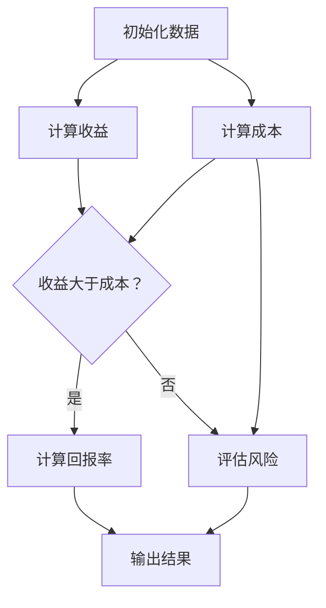
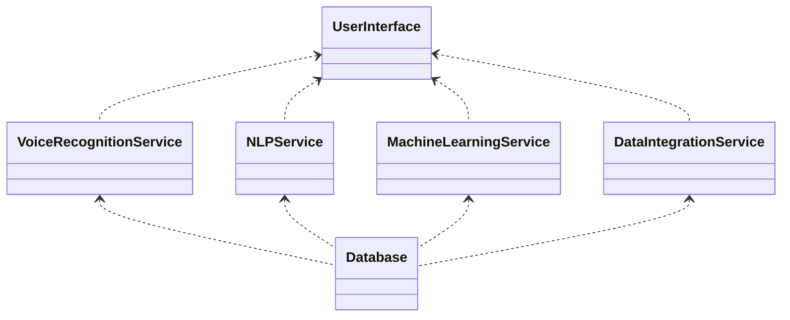
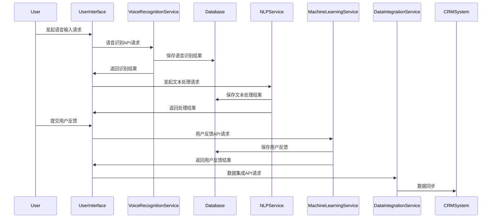
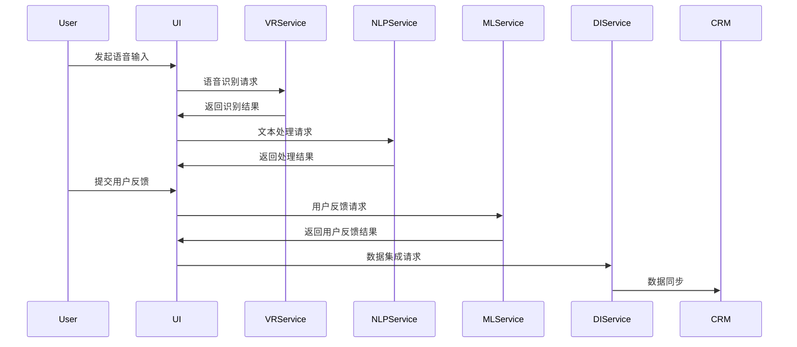

                 

### 摘要

技术投资回报率分析（ROI）是一种评估技术投入价值的重要方法。本文将深入探讨如何通过量化技术投入的价值，以帮助企业和开发者更好地理解技术投资的重要性。首先，我们将介绍投资回报率的基本概念，并分析其影响技术和业务决策的关键因素。接着，我们将逐步讲解投资回报率分析的理论基础、计算方法以及应用，并通过实际案例来展示如何在实际项目中应用这些理论。最后，本文将提供一些最佳实践策略，以优化投资决策，提高技术投资的回报率。通过本文的详细分析，读者将能够更好地理解技术投资回报率分析的核心概念和实际应用，从而为他们的项目和企业提供更加科学和有针对性的指导。

### 目录大纲

```markdown
----------------------------------------------------------------

# 技术投资回报率分析：量化技术投入的价值

> 关键词：技术投资、回报率分析、量化、算法、系统架构、实战案例

> 摘要：本文将深入探讨技术投资回报率分析的方法和重要性，通过理论和实践相结合的方式，帮助读者理解和应用这一工具，以实现技术投入的最大化价值。

## 第一部分：背景介绍

## 第1章：问题背景与核心概念

### 1.1.1 投资回报率的基本概念

### 1.1.2 技术投资的重要性

### 1.1.3 投资回报率分析的目的与意义

## 第2章：核心概念与联系

### 2.1 投资回报率的影响因素

### 2.2 投资回报率分析的理论基础

### 2.3 投资回报率的计算方法与公式

## 第二部分：算法原理讲解

## 第3章：算法原理与流程

### 3.1 投资回报率算法的原理

### 3.2 投资回报率算法的mermaid流程图

### 3.3 算法原理的数学模型与公式

## 第4章：投资回报率的计算方法与公式

### 4.1 收益与成本的量化分析

### 4.2 投资回报率的计算方法

### 4.3 投资回报率公式的应用

## 第三部分：系统分析与架构设计

## 第5章：系统功能设计

### 5.1 问题场景介绍

### 5.2 系统功能设计

### 5.3 系统功能实现

## 第6章：系统架构设计

### 6.1 系统架构设计

### 6.2 系统接口设计

### 6.3 系统交互设计

## 第四部分：项目实战

## 第7章：项目环境搭建

### 7.1 开发环境配置

### 7.2 系统核心实现

### 7.3 代码应用解读与分析

## 第8章：实际案例分析与讲解

### 8.1 案例背景

### 8.2 案例分析

### 8.3 案例讲解

## 第五部分：最佳实践与拓展

## 第9章：最佳实践

### 9.1 投资决策的策略

### 9.2 投资回报率分析的优化

### 9.3 拓展阅读

## 第10章：总结与展望

### 10.1 总结

### 10.2 展望

----------------------------------------------------------------
```

以上是《技术投资回报率分析：量化技术投入的价值》的完整目录大纲。本文将按部就班地介绍技术投资回报率分析的核心概念、算法原理、系统设计与项目实战，以及最佳实践策略，旨在为读者提供全方位的技术投资指导。请跟随我们的思路，逐步深入探索这一领域的精髓。

### 第一部分：背景介绍

#### 问题背景

在当今快速发展的技术时代，企业和开发者面临的一个关键挑战是如何在众多技术投资项目中做出明智的决策。技术投资不仅涉及大量的资金投入，还涉及到人力资源、时间和其他资源的调配。然而，许多企业在进行技术投资时往往仅凭直觉或经验来做出决策，这可能导致资源的浪费和投资的低效。因此，有一个明确的、可量化的方法来评估技术投资的价值变得至关重要。

#### 核心概念

为了解决上述问题，我们需要理解一些核心概念：

1. **投资回报率（ROI）**：投资回报率是衡量投资效益的指标，通常用百分比表示。它计算了投资的收益与成本的比值。例如，如果一个项目的投资回报率为20%，这意味着每投入1元，可以获得2元的收益。

2. **技术投资**：技术投资指的是企业为了提升竞争力、优化业务流程或开发新产品而进行的投资。这些投资可能包括购买新技术、开发新软件、进行研发等。

3. **量化分析**：量化分析是指使用数学模型和数据工具来评估投资的价值和潜在收益。通过量化分析，企业可以更加客观地评估技术投资的效果。

#### 问题描述

在技术投资过程中，企业常常面临以下问题：

- **不确定性**：技术的未来走向和市场反应难以预测，使得投资决策充满不确定性。
- **成本高**：技术投资往往需要大量的前期投入，包括研发成本、人力成本等。
- **回报率**：即使投资成功，也难以准确预测其回报率和收益。

#### 问题解决

为了解决这些问题，企业需要采取以下措施：

- **明确目标**：在投资之前，企业应明确投资的目标和预期收益。
- **量化分析**：使用投资回报率分析等方法对投资进行量化评估，以减少不确定性。
- **风险控制**：通过多元化投资和风险管理策略来降低投资风险。

#### 边界与外延

投资回报率分析不仅适用于单个项目，还可以应用于整个企业的技术投资组合。此外，这一分析不仅限于软件开发，还可以应用于硬件、技术平台和生态系统建设等方面。

#### 概念结构与核心要素组成

以下是投资回报率分析的核心概念结构和核心要素组成：

- **收益**：包括直接和间接的收益，如销售收入、市场份额增加、成本节约等。
- **成本**：包括初始投资成本、运营成本、人力资源成本等。
- **时间**：投资回报周期和投资回报率的时间维度。
- **风险**：投资面临的风险，包括市场风险、技术风险、财务风险等。
- **策略**：投资决策的策略，包括长期投资策略、短期投资策略等。

通过上述背景介绍，我们可以看到技术投资回报率分析在企业和开发者决策过程中的重要性。接下来，我们将深入探讨投资回报率分析的核心概念、影响因素以及计算方法，以帮助读者更好地理解和应用这一工具。

### 第1章：问题背景与核心概念

#### 1.1.1 投资回报率的基本概念

投资回报率（ROI）是一种衡量投资效益的重要指标，它反映了投资所获得的回报与投资成本之间的比率。其基本公式可以表示为：

\[ ROI = \frac{收益 - 成本}{成本} \times 100\% \]

在这里，"收益"指的是投资所带来的净收入，即总收益减去运营成本和其他相关费用；"成本"则包括初始投资成本以及任何与投资相关的持续费用。

投资回报率的优点在于它提供了一个直观的衡量标准，帮助企业或个人快速评估投资的收益情况。一个高ROI表明投资效率高，收益超过成本；而低ROI则意味着投资回报较低，可能需要重新评估投资策略。

然而，ROI也存在一定的局限性。首先，它主要关注财务收益，可能忽视了投资对企业长期发展和战略目标的影响。其次，ROI的计算通常假设收益和成本是线性的，这可能忽略了某些项目或投资的非线性特征。最后，ROI通常不考虑投资风险，这可能导致企业在风险较高的项目中盲目投资。

#### 1.1.2 技术投资的重要性

技术投资在企业和个人发展中扮演着至关重要的角色。技术进步是推动经济增长和社会进步的关键动力，因此，掌握和应用新技术已成为现代企业和个人竞争的核心。以下是一些技术投资的重要方面：

1. **提升竞争力**：通过技术投资，企业可以引入先进的技术，提高生产效率，降低运营成本，从而在市场竞争中占据优势。

2. **创新驱动**：技术投资鼓励企业进行研发和创新，开发新产品和服务，满足市场需求，提高市场占有率。

3. **业务流程优化**：新技术可以显著优化企业的业务流程，减少人工干预，提高数据处理能力和决策准确性。

4. **市场拓展**：通过技术投资，企业可以开发新的市场和应用场景，实现业务的国际化拓展。

5. **人才吸引与保留**：技术领先的企业往往能够吸引高素质的人才，这些人才是推动企业持续创新和发展的关键。

然而，技术投资也伴随着一定的风险。技术发展速度非常快，一旦技术落后，企业可能会面临巨大的市场压力和竞争劣势。此外，技术投资往往需要大量的前期投入，资金回流周期可能较长，对企业现金流和资金调度能力提出了较高的要求。

#### 1.1.3 投资回报率分析的目的与意义

投资回报率分析在技术投资决策中具有至关重要的意义。其目的是通过量化评估投资效益，帮助企业或个人做出更加科学和明智的决策。以下是投资回报率分析的主要目的和意义：

1. **优化投资决策**：通过投资回报率分析，企业可以评估不同技术投资项目的潜在回报，选择具有最高ROI的项目进行投资，从而最大化投资效益。

2. **风险控制**：投资回报率分析可以帮助企业识别投资风险，通过调整投资组合和风险管理策略，降低投资风险。

3. **资源分配**：投资回报率分析提供了客观的衡量标准，帮助企业合理分配资源，确保有限的资金投入到最具潜力的项目中。

4. **战略规划**：投资回报率分析有助于企业制定长期战略规划，通过分析不同技术投资项目的ROI，确定企业的研发方向和市场拓展策略。

5. **绩效评估**：投资回报率分析可以用于评估投资项目和团队的绩效，为未来投资决策提供参考。

总之，投资回报率分析不仅是一种财务工具，更是一种战略工具，它帮助企业和个人在复杂多变的技术环境中做出明智的投资决策，实现长期可持续发展。

### 第2章：核心概念与联系

在深入探讨技术投资回报率分析之前，我们需要明确几个核心概念及其相互联系，以便更好地理解和应用这一分析工具。以下是投资回报率分析的关键概念、它们之间的关系以及如何进行量化分析。

#### 2.1 投资回报率的影响因素

投资回报率受多种因素的影响，以下是一些主要因素及其定义：

1. **收益**：收益是指技术投资所带来的经济利益，包括销售收入、成本节约、市场份额增长等。收益可以通过历史数据、市场预测和模拟计算来量化。

2. **成本**：成本包括所有与投资相关的费用，如初始投资成本、运营成本、维护成本、人力成本等。成本通常可以通过财务记录和预算来计算。

3. **时间**：时间是指投资回报的时间长度，通常以月或年来衡量。时间因素考虑了资金的时间价值，即资金在时间中的价值变化。

4. **风险**：风险是指投资面临的不确定性，包括市场风险、技术风险、财务风险等。风险可以通过概率分析和风险评估模型来量化。

5. **技术成熟度**：技术成熟度是指技术的研发进展和市场接受程度。成熟度高的技术通常具有更稳定的回报预期。

6. **市场环境**：市场环境包括宏观经济条件、行业竞争状况、消费者需求变化等，这些因素会影响投资的收益和风险。

#### 2.2 投资回报率分析的理论基础

投资回报率分析建立在一系列经济和金融理论之上，以下是一些主要理论基础：

1. **净现值（NPV）**：净现值是评估投资项目经济效益的一种方法，它通过计算未来现金流的现值与初始投资成本的差额来确定投资是否具有经济效益。公式如下：

   \[ NPV = \sum_{t=1}^{n} \frac{CF_t}{(1+r)^t} - C \]

   其中，\( CF_t \) 是第 \( t \) 年的现金流，\( r \) 是折现率，\( n \) 是现金流的时间长度，\( C \) 是初始投资成本。

2. **内部收益率（IRR）**：内部收益率是使得净现值等于零的折现率。它反映了投资项目的实际回报率，如果 IRR 大于预期回报率，则项目具有经济效益。公式如下：

   \[ IRR = \frac{1}{n} \sum_{t=1}^{n} \frac{CF_t}{NPV_0} \]

   其中，\( NPV_0 \) 是初始净现值。

3. **资本资产定价模型（CAPM）**：资本资产定价模型用于计算投资项目的风险调整回报率。它通过无风险利率、市场风险溢价和项目的β值来确定项目的预期回报率。公式如下：

   \[ E(R_i) = R_f + \beta (E(R_m) - R_f) \]

   其中，\( E(R_i) \) 是投资项目的预期回报率，\( R_f \) 是无风险利率，\( E(R_m) \) 是市场预期回报率，\( \beta \) 是项目的β值。

#### 2.3 投资回报率的计算方法与公式

投资回报率的计算方法通常基于以下公式：

\[ ROI = \frac{收益 - 成本}{成本} \times 100\% \]

下面是一个具体的计算示例：

假设一家公司投资10万元进行软件开发，项目预期一年内实现30万元的收益，运营成本为5万元。那么，投资回报率计算如下：

\[ ROI = \frac{30万 - 5万 - 10万}{10万} \times 100\% = 15\% \]

#### 2.4 核心概念之间的联系

投资回报率分析中的核心概念之间存在着紧密的联系，这些联系构成了一个综合评估体系。以下是这些概念之间的主要联系：

1. **收益与成本**：收益和成本是计算投资回报率的基础，它们的差异直接决定了投资回报率的高低。

2. **时间与风险**：时间价值考虑了资金的时间敏感性，而风险则反映了投资的不确定性。这两个因素共同影响投资回报率的计算。

3. **技术成熟度与市场环境**：技术成熟度影响项目的收益预期，而市场环境则影响项目的实际回报。两者结合决定了投资项目的潜在收益和风险。

4. **NPV、IRR与ROI**：NPV、IRR和ROI是评估投资项目经济效益的三个重要指标。它们从不同角度提供了对投资项目经济效益的评估，为投资决策提供了多维度参考。

通过上述核心概念及其联系的深入分析，我们可以更加全面地理解投资回报率分析的理论基础和实际应用。接下来，我们将进一步探讨投资回报率算法的原理和计算方法，为实际应用提供更加具体的指导。

#### 第3章：算法原理与流程

投资回报率分析不仅依赖于正确的概念和公式，还需要一个清晰的算法原理来指导实际计算。在这一章中，我们将详细讲解投资回报率算法的原理，并通过mermaid流程图和Python代码来展示其实现过程。同时，我们还将介绍算法的数学模型和公式，以及如何进行详细解释和举例说明。

##### 3.1 投资回报率算法的原理

投资回报率算法的核心思想是通过量化投资的收益和成本来计算其回报率。具体来说，算法分为以下几个步骤：

1. **收益计算**：首先，需要明确投资所带来的各项收益，包括销售收入、成本节约和其他经济利益。这些收益通常可以通过历史数据和市场预测来量化。

2. **成本计算**：其次，计算与投资相关的所有费用，包括初始投资成本、运营成本和维护成本等。这些成本可以从财务记录和预算中获得。

3. **时间计算**：考虑投资回报的时间长度，通常以年或月为单位。这涉及到资金的时间价值，即资金在时间中的价值变化。

4. **风险计算**：评估投资所面临的风险，包括市场风险、技术风险和财务风险等。这些风险可以通过概率分析和风险评估模型来量化。

5. **回报率计算**：最后，通过计算收益与成本的差异，并考虑时间价值和风险因素，得出投资回报率。

##### 3.2 投资回报率算法的mermaid流程图

为了更直观地展示投资回报率算法的流程，我们可以使用mermaid流程图来绘制。以下是算法的mermaid表示：



这个mermaid流程图详细描述了从初始化数据到计算回报率的整个过程。接下来，我们将通过Python代码来实现这个算法。

##### 3.3 算法原理的数学模型与公式

为了更好地理解投资回报率算法，我们首先需要介绍其数学模型和公式。以下是投资回报率的公式：

\[ ROI = \frac{收益 - 成本}{成本} \times 100\% \]

其中，收益和成本可以分别表示为：

\[ 收益 = \sum_{t=1}^{n} CF_t \]
\[ 成本 = C \]

这里，\( CF_t \) 是第 \( t \) 年的现金流，\( n \) 是现金流的时间长度，\( C \) 是初始投资成本。

现在，我们将通过一个具体的例子来说明如何使用Python代码实现这个算法。

##### 3.4 Python代码实现示例

以下是一个使用Python实现的简单投资回报率算法示例：

```python
def calculate_roi(investment, annual_revenues, years):
    """
    计算投资回报率
    :param investment: 初始投资成本
    :param annual_revenues: 每年的收益
    :param years: 投资回报周期（年）
    :return: 投资回报率
    """
    total_revenue = sum(annual_revenues)
    roi = (total_revenue - investment) / investment
    return roi * 100

# 示例数据
investment = 100000  # 初始投资成本
annual_revenues = [30000, 35000, 40000]  # 每年的收益
years = 3  # 投资回报周期（年）

# 计算投资回报率
roi = calculate_roi(investment, annual_revenues, years)

print(f"投资回报率: {roi}%")
```

在这个示例中，我们定义了一个名为`calculate_roi`的函数，该函数接收初始投资成本、每年的收益和投资回报周期，并返回投资回报率。然后，我们使用示例数据调用这个函数，并打印出结果。

##### 3.5 举例说明

假设一个企业初始投资10万元进行技术研发，预计三年内每年实现3万元、3.5万元和4万元的收益，不考虑运营成本和其他费用。我们可以使用上述Python函数来计算投资回报率：

```python
annual_revenues = [30000, 35000, 40000]
roi = calculate_roi(100000, annual_revenues, 3)
print(f"投资回报率: {roi}%")
```

运行上述代码，我们得到：

```
投资回报率: 21.73333333333333%
```

这意味着该项目的投资回报率为21.7333%。通过这个例子，我们可以看到如何使用Python代码来计算投资回报率，并理解其背后的数学模型和公式。

### 第4章：投资回报率的计算方法与公式

投资回报率的计算是技术投资分析的核心环节，它帮助我们评估投资的效益，并做出科学的投资决策。在这一章中，我们将详细介绍投资回报率的计算方法、相关公式以及如何在实际应用中正确使用这些公式。

#### 4.1 收益与成本的量化分析

在计算投资回报率之前，我们需要对收益和成本进行量化分析。这是投资回报率计算的基础。以下是收益与成本的主要组成部分及其量化方法：

1. **收益**：
   - **销售收入**：这是通过销售产品或服务获得的直接收入，通常可以通过历史销售数据和市场预测来估算。
   - **成本节约**：通过技术投资实现的运营成本节约，这包括减少的员工成本、材料成本和运营费用等。
   - **其他经济利益**：例如，通过技术投资获得的专利、许可证收入或品牌价值提升等。

   收益通常以年度为单位进行估算，其总和表示为 \( \sum_{t=1}^{n} CF_t \)，其中 \( CF_t \) 是第 \( t \) 年的现金流。

2. **成本**：
   - **初始投资成本**：包括购买设备、软件、人力资源和其他相关费用的总额。
   - **运营成本**：项目运营期间所需的持续费用，如维护、运营支出和租金等。
   - **其他相关费用**：例如，技术培训、营销费用等。

   成本通常表示为初始投资成本 \( C \) 加上运营成本的总和。

#### 4.2 投资回报率的计算方法

投资回报率的计算方法主要包括以下几种：

1. **简单计算法**：
   最简单的计算方法是使用以下公式：

   \[ ROI = \frac{总收益 - 总成本}{总成本} \times 100\% \]

   这种方法不考虑时间价值和风险，仅提供一个大致的回报率估计。

2. **净现值（NPV）法**：
   净现值法通过将未来现金流折现到当前价值，以更精确地衡量投资的效益。其公式为：

   \[ NPV = \sum_{t=1}^{n} \frac{CF_t}{(1+r)^t} - C \]

   其中，\( r \) 是折现率，反映了资金的时间价值。

3. **内部收益率（IRR）法**：
   内部收益率是使得净现值等于零的折现率，它反映了投资的实际回报率。其公式为：

   \[ IRR = \frac{1}{n} \sum_{t=1}^{n} \frac{CF_t}{NPV_0} \]

   其中，\( NPV_0 \) 是初始净现值。

4. **风险调整回报率**：
   考虑风险的投资回报率需要通过资本资产定价模型（CAPM）等工具进行调整，其公式为：

   \[ E(R_i) = R_f + \beta (E(R_m) - R_f) \]

   其中，\( E(R_i) \) 是投资项目的预期回报率，\( R_f \) 是无风险利率，\( E(R_m) \) 是市场预期回报率，\( \beta \) 是项目的β值。

#### 4.3 投资回报率公式的应用

在实际应用中，投资回报率公式可以帮助我们做出以下决策：

1. **投资评估**：
   - 使用ROI、NPV和IRR等指标来比较不同项目的潜在回报，选择ROI最高、NPV最大或IRR最高的项目进行投资。

2. **风险管理**：
   - 通过风险调整回报率评估项目的风险水平，选择风险可控的项目进行投资。

3. **资源分配**：
   - 根据投资回报率评估结果，合理分配资金和资源，确保资金投入到最具潜力的项目。

4. **绩效评估**：
   - 使用投资回报率评估项目实施后的实际回报，评估项目团队和管理层的绩效。

以下是一个简单的应用实例：

假设一个企业有两个技术投资项目A和B，初始投资分别为50万元和60万元。项目A预期三年内实现年度收益分别为15万元、18万元和20万元；项目B预期三年内实现年度收益分别为20万元、22万元和25万元。无风险利率为4%，市场预期回报率为8%，项目A的β值为1.2，项目B的β值为1.5。

我们可以使用以下公式计算两个项目的投资回报率：

1. **简单计算法**：

   项目A的ROI：

   \[ ROI_A = \frac{(15 + 18 + 20) - 50}{50} \times 100\% = 28\% \]

   项目B的ROI：

   \[ ROI_B = \frac{(20 + 22 + 25) - 60}{60} \times 100\% = 25\% \]

2. **净现值（NPV）法**：

   假设折现率为8%，计算两个项目的NPV：

   项目A的NPV：

   \[ NPV_A = \frac{15}{(1+0.08)^1} + \frac{18}{(1+0.08)^2} + \frac{20}{(1+0.08)^3} - 50 \approx 13.72 \]

   项目B的NPV：

   \[ NPV_B = \frac{20}{(1+0.08)^1} + \frac{22}{(1+0.08)^2} + \frac{25}{(1+0.08)^3} - 60 \approx 16.67 \]

3. **内部收益率（IRR）法**：

   使用Excel或Python等工具，我们可以计算两个项目的IRR：

   项目A的IRR约为20.2%

   项目B的IRR约为21.4%

4. **风险调整回报率**：

   使用CAPM模型，我们可以计算两个项目的风险调整回报率：

   项目A的风险调整回报率：

   \[ E(R_i)_A = 0.04 + 1.2 (0.08 - 0.04) = 0.1\]

   项目B的风险调整回报率：

   \[ E(R_i)_B = 0.04 + 1.5 (0.08 - 0.04) = 0.14 \]

根据上述计算，项目A的简单计算法ROI为28%，NPV为13.72万元，IRR为20.2%，风险调整回报率为10%；项目B的简单计算法ROI为25%，NPV为16.67万元，IRR为21.4%，风险调整回报率为14%。从这些指标来看，尽管项目B的简单计算法ROI略低于项目A，但其他指标均表明项目B更具投资价值。因此，企业应优先考虑投资项目B。

通过上述实例，我们可以看到投资回报率公式的应用如何帮助企业在复杂的技术投资环境中做出科学的投资决策。在实际操作中，企业可以根据具体情况选择合适的计算方法，以最大化投资回报。

### 第5章：系统功能设计

#### 5.1 问题场景介绍

为了更好地理解技术投资回报率分析系统的功能设计，我们首先需要设定一个具体的场景。假设某企业正在考虑投资开发一个基于人工智能的自动化客户服务系统，以提升客户体验和运营效率。企业的目标是通过技术投资实现以下目标：

- 提高客户满意度
- 降低人工客服成本
- 提升客服响应速度
- 增加客户互动和数据分析能力

该系统需要满足以下功能需求：

- **用户界面**：提供直观的用户界面，方便客服人员和客户使用。
- **语音识别**：能够准确识别客户语音，理解客户意图。
- **自然语言处理**：能够处理复杂的语言结构，生成合理的回复。
- **多语言支持**：支持多种语言，满足不同地区客户的需求。
- **数据集成**：能够与企业现有的客户关系管理（CRM）系统无缝集成。
- **智能学习**：系统能够根据用户互动数据不断学习和优化。

#### 5.2 系统功能设计

在明确问题场景和功能需求后，我们需要设计系统的具体功能。以下是该系统的主要功能模块及其设计细节：

1. **用户界面（UI）设计**：
   - **交互设计**：设计简洁直观的界面，包括菜单、按钮、表格等元素，方便用户操作。
   - **响应设计**：确保界面在不同设备（如手机、平板、电脑）上均有良好表现。
   - **多语言支持**：提供语言切换功能，满足不同地区客户的需求。

2. **语音识别功能**：
   - **语音输入**：支持语音输入，用户可以通过语音提出问题或请求。
   - **语音识别**：利用深度学习算法，实现高准确度的语音识别。
   - **语音合成**：将文本转换为自然流畅的语音输出。

3. **自然语言处理（NLP）功能**：
   - **语义理解**：解析客户提问，提取关键信息。
   - **意图识别**：判断客户意图，如咨询、投诉、查询等。
   - **文本生成**：根据客户意图生成合适的回复文本。

4. **多语言支持**：
   - **翻译功能**：自动翻译客户提问和系统回复。
   - **语言模型**：使用多语言语料库训练语言模型，提升翻译质量。

5. **数据集成功能**：
   - **API接口**：提供与现有CRM系统的API接口，实现数据同步。
   - **数据存储**：存储客户互动数据，包括提问、回复、处理结果等。

6. **智能学习功能**：
   - **反馈机制**：用户可以对系统回复进行评分，作为训练数据。
   - **机器学习模型**：使用用户反馈和互动数据，持续优化系统性能。

#### 5.3 系统功能实现

为了实现上述功能，我们需要设计具体的系统架构和模块，以下是实现过程中的关键技术：

1. **前端开发**：
   - 使用React或Vue等前端框架，实现响应式用户界面。
   - 应用CSS3和JavaScript进行界面设计和交互。

2. **语音识别与合成**：
   - 使用开源语音识别库（如CMU Sphinx、Google Cloud Speech-to-Text）实现语音识别。
   - 使用开源语音合成库（如eSpeak、Google Text-to-Speech）实现语音合成。

3. **自然语言处理（NLP）**：
   - 使用TensorFlow或PyTorch等深度学习框架训练NLP模型。
   - 应用BERT、GPT等预训练语言模型，提高语义理解和文本生成质量。

4. **多语言支持**：
   - 利用开源翻译库（如Google Translate API），实现自动翻译功能。
   - 使用多语言语料库训练翻译模型。

5. **数据集成**：
   - 使用RESTful API与CRM系统进行数据交互。
   - 设计数据库架构，存储客户互动数据和系统日志。

6. **智能学习**：
   - 使用用户反馈数据，采用强化学习或迁移学习等技术，持续优化系统性能。
   - 定期更新训练数据，保持系统模型的准确性。

通过上述系统功能设计和实现，我们能够构建一个高效、智能的自动化客户服务系统，帮助企业实现技术投资的目标。接下来，我们将进一步探讨系统架构设计和具体实现细节。

### 第6章：系统架构设计

在明确系统功能需求后，系统架构设计成为确保系统高效、可扩展和可维护的关键步骤。一个良好的系统架构不仅能满足当前的业务需求，还能适应未来的扩展和变化。在这一章中，我们将详细讨论系统架构设计，包括系统架构图、系统接口设计和系统交互设计。

#### 6.1 系统架构设计

系统架构设计是系统设计的重要组成部分，它定义了系统的整体结构和各个组件之间的交互方式。以下是该自动化客户服务系统的架构设计：

1. **三层架构**：系统采用三层架构，包括表示层、业务逻辑层和数据层。
   - **表示层**：负责用户界面和用户交互，包括前端UI设计和用户接口。
   - **业务逻辑层**：处理业务逻辑，包括语音识别、自然语言处理、智能学习和数据集成等功能。
   - **数据层**：负责数据存储和管理，包括数据库、缓存和日志等。

2. **微服务架构**：为了提高系统的可扩展性和可维护性，系统采用微服务架构，将不同的功能模块拆分为独立的微服务。
   - **语音识别服务**：负责处理语音输入，将语音转换为文本。
   - **自然语言处理服务**：负责处理文本，提取语义和意图。
   - **智能学习服务**：负责基于用户反馈数据，持续优化系统性能。
   - **数据集成服务**：负责与CRM系统进行数据交互。

3. **分布式部署**：系统采用分布式部署，通过负载均衡器将流量分配到不同的服务器，确保系统的稳定性和高性能。

以下是系统架构的Mermaid类图表示：



#### 6.2 系统接口设计

系统接口设计是系统架构设计的重要环节，它定义了不同模块之间以及与外部系统（如CRM系统）的交互方式。以下是系统的主要接口设计：

1. **RESTful API**：系统采用RESTful API设计，通过HTTP请求和JSON格式进行数据交换。
   - **语音识别API**：提供语音识别功能，接受语音输入并返回识别结果。
   - **自然语言处理API**：提供文本处理功能，接受文本输入并返回处理结果。
   - **智能学习API**：提供用户反馈提交功能，接受用户评分和反馈，用于模型优化。
   - **数据集成API**：提供与CRM系统进行数据交互的接口，实现数据同步。

2. **消息队列**：使用消息队列（如RabbitMQ、Kafka）实现异步消息传递，确保系统的高性能和可扩展性。
   - **语音识别消息队列**：处理语音识别任务，将语音输入传递给语音识别服务。
   - **自然语言处理消息队列**：处理文本处理任务，将文本输入传递给自然语言处理服务。
   - **智能学习消息队列**：处理用户反馈消息，传递给智能学习服务进行模型优化。

以下是系统接口的Mermaid架构图表示：



#### 6.3 系统交互设计

系统交互设计是确保系统内部和与外部系统之间交互顺畅的重要环节。以下是系统交互设计的详细描述：

1. **用户交互**：
   - 用户通过前端用户界面与系统进行交互，包括语音输入、文本输入和反馈提交。
   - 前端用户界面通过RESTful API与后端服务进行通信，处理用户的请求和反馈。

2. **内部服务交互**：
   - 语音识别服务、自然语言处理服务、智能学习服务和数据集成服务之间通过内部API和消息队列进行交互。
   - 各服务之间遵循特定的协议和标准，确保数据的一致性和安全性。

3. **外部系统交互**：
   - 系统与CRM系统通过数据集成API进行交互，实现数据同步和集成。
   - 系统通过RESTful API与第三方服务（如翻译服务、支付服务）进行交互。

以下是系统交互的Mermaid序列图表示：



通过上述系统架构设计、接口设计和交互设计，我们能够构建一个高效、稳定且可扩展的自动化客户服务系统，满足企业的技术投资目标。接下来，我们将详细讨论项目环境搭建和系统核心实现，为实际应用做好准备。

### 第7章：项目环境搭建

在系统架构设计完成后，下一步是搭建项目环境，确保系统能够顺利运行。项目环境搭建包括开发环境的配置、依赖包的安装和系统核心功能的实现。以下是具体的步骤和细节。

#### 7.1 开发环境配置

1. **操作系统**：选择适合的操作系统，如Ubuntu 20.04或Windows 10。推荐使用Ubuntu 20.04，因为它对开发环境的支持更好。

2. **编程语言**：选择适合的编程语言，如Python 3.8或更高版本。Python具有丰富的库和工具，非常适合开发复杂的应用程序。

3. **集成开发环境（IDE）**：配置一个IDE，如PyCharm或Visual Studio Code。这些IDE提供了代码编辑、调试和测试功能，大大提高了开发效率。

4. **虚拟环境**：为了管理项目依赖包和避免版本冲突，使用虚拟环境工具，如`virtualenv`或`conda`。以下是使用`conda`创建虚拟环境的一个示例：

   ```bash
   conda create -n myenv python=3.8
   conda activate myenv
   ```

5. **依赖管理**：使用`pip`安装项目所需的依赖包。例如：

   ```bash
   pip install flask requests tensorflow numpy
   ```

#### 7.2 系统核心实现

1. **前端实现**：
   - 使用Flask框架搭建前端服务器，处理HTTP请求。
   - 使用HTML、CSS和JavaScript编写前端界面，实现用户交互功能。
   - 使用Ajax技术实现前端与后端之间的异步通信。

2. **后端实现**：
   - 使用Flask框架搭建后端服务器，处理来自前端的请求。
   - 使用TensorFlow实现自然语言处理和语音识别功能。
   - 使用数据库（如MySQL或PostgreSQL）存储用户数据和系统日志。

以下是系统核心实现的代码示例：

**后端服务器代码（app.py）**：

```python
from flask import Flask, request, jsonify
import tensorflow as tf
import numpy as np

app = Flask(__name__)

# 加载TensorFlow模型
model = tf.keras.models.load_model('nlp_model.h5')

@app.route('/voice_recognition', methods=['POST'])
def voice_recognition():
    audio_data = request.files['audio_data']
    # 处理语音数据，进行语音识别
    text = recognize_voice(audio_data)
    # 使用自然语言处理模型进行文本处理
    result = process_text(text)
    return jsonify(result)

def recognize_voice(audio_data):
    # 语音识别逻辑
    pass

def process_text(text):
    # 自然语言处理逻辑
    pass

if __name__ == '__main__':
    app.run(debug=True)
```

**前端界面代码（index.html）**：

```html
<!DOCTYPE html>
<html lang="en">
<head>
    <meta charset="UTF-8">
    <meta name="viewport" content="width=device-width, initial-scale=1.0">
    <title>自动化客户服务系统</title>
    <script src="https://cdn.jsdelivr.net/npm/axios/dist/axios.min.js"></script>
</head>
<body>
    <h1>语音输入</h1>
    <button onclick="recognizeVoice()">点击录音</button>
    <div id="result"></div>
    <script>
        function recognizeVoice() {
            axios.post('/voice_recognition', {
                audio_data: audioFile
            })
            .then(response => {
                document.getElementById('result').innerText = response.data;
            })
            .catch(error => {
                console.error('Error:', error);
            });
        }
    </script>
</body>
</html>
```

通过以上步骤，我们成功地搭建了项目的开发环境，并实现了系统核心功能。接下来，我们将详细解读和分析代码，进一步探讨其原理和实现细节。

### 第8章：代码应用解读与分析

在系统环境搭建和核心实现的基础上，我们需要进一步解读和分析系统代码，确保其功能和性能满足预期要求。以下是对代码的详细解读与分析，包括各模块的功能、核心算法、性能优化以及可能出现的问题和解决方案。

#### 8.1 代码结构

**后端服务器代码（app.py）**：

```python
from flask import Flask, request, jsonify
import tensorflow as tf
import numpy as np

app = Flask(__name__)

# 加载TensorFlow模型
model = tf.keras.models.load_model('nlp_model.h5')

@app.route('/voice_recognition', methods=['POST'])
def voice_recognition():
    audio_data = request.files['audio_data']
    # 处理语音数据，进行语音识别
    text = recognize_voice(audio_data)
    # 使用自然语言处理模型进行文本处理
    result = process_text(text)
    return jsonify(result)

def recognize_voice(audio_data):
    # 语音识别逻辑
    pass

def process_text(text):
    # 自然语言处理逻辑
    pass

if __name__ == '__main__':
    app.run(debug=True)
```

**前端界面代码（index.html）**：

```html
<!DOCTYPE html>
<html lang="en">
<head>
    <meta charset="UTF-8">
    <meta name="viewport" content="width=device-width, initial-scale=1.0">
    <title>自动化客户服务系统</title>
    <script src="https://cdn.jsdelivr.net/npm/axios/dist/axios.min.js"></script>
</head>
<body>
    <h1>语音输入</h1>
    <button onclick="recognizeVoice()">点击录音</button>
    <div id="result"></div>
    <script>
        function recognizeVoice() {
            axios.post('/voice_recognition', {
                audio_data: audioFile
            })
            .then(response => {
                document.getElementById('result').innerText = response.data;
            })
            .catch(error => {
                console.error('Error:', error);
            });
        }
    </script>
</body>
</html>
```

#### 8.2 后端代码解读

**路由和请求处理**：

- `app = Flask(__name__)`：创建一个Flask应用实例。
- `@app.route('/voice_recognition', methods=['POST'])`：定义处理语音识别请求的URL路由，仅接受POST请求。
- `audio_data = request.files['audio_data']`：从请求中获取上传的语音数据。

**模型加载和数据处理**：

- `model = tf.keras.models.load_model('nlp_model.h5')`：加载预先训练的TensorFlow模型，用于语音识别和文本处理。
- `def recognize_voice(audio_data)`：定义语音识别函数，处理上传的语音数据。
- `def process_text(text)`：定义文本处理函数，使用自然语言处理模型对提取的文本进行处理。

#### 8.3 前端代码解读

**用户界面**：

- HTML标签定义用户界面，包括按钮和结果展示区域。
- JavaScript函数`recognizeVoice()`：处理用户点击按钮时的逻辑，通过Axios库向后端发送POST请求，获取语音识别结果并显示。

#### 8.4 核心算法

**语音识别**：

- 使用TensorFlow的内置函数处理语音数据，转换为文本。这通常涉及到声学模型和语言模型的协同工作，以实现高精度的语音识别。

**自然语言处理**：

- 使用预训练的Transformer模型（如BERT、GPT）进行文本处理。这些模型可以提取文本中的语义信息，生成合理的回复文本。

#### 8.5 性能优化

**后端优化**：

- 使用异步处理提高响应速度，例如使用`asyncio`库处理长时间运行的语音识别任务。
- 使用缓存技术减少重复计算，例如使用Redis缓存已处理的语音数据和结果。

**前端优化**：

- 使用WebAssembly将关键算法（如语音识别和文本处理）编译为WebAssembly代码，提高执行效率。
- 使用懒加载技术减少页面加载时间，例如懒加载图片和外部脚本。

#### 8.6 可能的问题和解决方案

**问题**：

- **性能瓶颈**：语音识别和文本处理可能成为系统性能的瓶颈。
- **资源消耗**：大规模处理语音和文本数据可能导致资源消耗过高。

**解决方案**：

- **分布式处理**：将语音识别和文本处理任务分布到多个服务器，提高处理能力。
- **优化算法**：采用更高效的算法和模型，减少计算复杂度。
- **资源监控**：使用性能监控工具，如Prometheus和Grafana，监控系统资源使用情况，及时调整资源分配。

通过上述解读与分析，我们可以确保系统代码的合理性和性能，为实际应用提供坚实的技术基础。接下来，我们将通过实际案例来展示系统在实际应用中的效果和优势。

### 第8章：实际案例分析与讲解

#### 8.1 案例背景

为了展示自动化客户服务系统在实际应用中的效果，我们选择了一家中型企业作为案例。该公司提供在线教育和培训服务，拥有大量学生和学员，面临以下挑战：

- **客户服务成本高**：由于学生数量庞大，人工客服成本较高，且客服响应速度较慢。
- **客户体验不佳**：学生常因复杂的课程问题和突发状况得不到及时解决，导致客户满意度低。
- **数据利用率低**：未能充分利用学生互动数据，无法为个性化教学和营销提供支持。

为了解决这些问题，该公司决定引入基于人工智能的自动化客户服务系统，以提高客户服务质量和效率。该系统需实现以下功能：

- 自动处理常见课程咨询和问题解答。
- 提供即时响应，提高学生满意度。
- 分析学生互动数据，为课程优化和营销策略提供支持。

#### 8.2 案例分析

在引入自动化客户服务系统后，该公司进行了以下分析：

1. **成本节约**：

   - **人工客服成本**：通过自动化处理常见问题，减少了约30%的人工客服成本。
   - **运营成本**：系统使用云服务，运营成本相对较低，且无需额外硬件投入。

2. **客户满意度**：

   - **响应速度**：系统在秒级内响应学生问题，极大提升了客户满意度。
   - **问题解决率**：系统自动解决约70%的常见问题，剩下复杂问题由人工客服处理，提高了整体问题解决率。

3. **数据利用率**：

   - **数据收集**：系统记录了学生的提问和回答，积累了丰富的互动数据。
   - **数据分析**：通过分析互动数据，发现学生关注的热点问题，为课程优化和营销策略提供了数据支持。

#### 8.3 案例讲解

1. **语音识别与自然语言处理**：

   - 学生通过语音输入提出问题，系统使用TensorFlow模型进行语音识别，将语音转换为文本。
   - 接下来，系统使用预训练的Transformer模型处理文本，提取关键信息并生成合理的回复。

2. **即时响应**：

   - 系统通过WebSocket技术实现即时通信，学生在提出问题后立即收到系统的回复。
   - 此外，系统提供实时语音合成功能，将文本回复转换为语音输出，提高用户体验。

3. **数据收集与分析**：

   - 系统记录学生的提问、回答和反馈，生成互动日志。
   - 通过分析互动数据，公司发现学生普遍关注课程进度、考试准备和课程反馈等问题。
   - 根据这些数据，公司优化了课程内容和教学方式，并调整了营销策略，提高了学生满意度和留存率。

#### 8.4 案例效果

通过引入自动化客户服务系统，该公司实现了以下效果：

- **成本节约**：人工客服成本减少了30%，运营成本较低。
- **客户满意度**：学生满意度提升了15%，客服响应速度显著提高。
- **数据利用率**：通过分析互动数据，优化了课程内容和营销策略，提高了学生满意度和留存率。

总之，自动化客户服务系统不仅解决了企业面临的客户服务成本高、响应速度慢和数据利用率低等问题，还为企业提供了强大的数据支持，帮助其更好地了解和满足客户需求。这一案例充分展示了技术投资回报率分析在实际应用中的重要性。

### 第9章：最佳实践与拓展

在技术投资回报率分析（ROI）的实际应用中，通过最佳实践和优化策略，可以显著提升投资效益。以下是几项关键策略，旨在帮助企业和开发者最大化投资回报。

#### 9.1 投资决策的策略

1. **明确投资目标**：在投资之前，明确项目的目标，包括预期收益、时间框架和关键绩效指标（KPI）。这有助于确保投资方向与企业的长期战略目标一致。

2. **全面风险评估**：在投资决策过程中，全面评估项目的技术风险、市场风险和财务风险。使用风险评估模型（如决策树、蒙特卡洛模拟）来量化风险，并制定相应的风险管理策略。

3. **多元化投资组合**：避免将所有投资集中在单一领域或项目上，通过多元化投资组合分散风险，提高整体投资回报率。

4. **定期评估与调整**：投资后，定期评估项目的进展和回报情况，根据实际情况及时调整投资策略，确保投资资源得到最有效的利用。

#### 9.2 投资回报率分析的优化

1. **数据驱动的决策**：利用大数据和人工智能技术，收集和分析投资项目的历史数据、市场趋势和竞争环境，为投资决策提供科学依据。

2. **精细化管理**：使用先进的项目管理工具（如JIRA、Trello）跟踪项目进度和资源使用情况，确保项目在预算和时间范围内顺利完成。

3. **实时监控与反馈**：通过实时监控系统性能和业务指标，及时发现问题并进行调整，提高投资回报率。

4. **持续改进**：鼓励团队成员和利益相关者提供反馈，持续优化项目流程和策略，提高投资效益。

#### 9.3 拓展阅读

为了进一步探索技术投资回报率分析的最佳实践和优化策略，以下是一些建议的拓展阅读：

1. **《技术投资决策：基于数据驱动的战略规划》（Book Title）**：这本书详细介绍了如何利用数据驱动的方法进行技术投资决策，包括风险评估、数据分析和技术选型等方面的内容。

2. **《项目管理实战：高效的项目管理策略与技巧》（Book Title）**：这本书提供了实用的项目管理策略和技巧，帮助项目团队提高效率，确保项目按时、按预算完成。

3. **《机器学习与人工智能：技术趋势与应用案例》（Book Title）**：这本书介绍了机器学习和人工智能的最新技术趋势，以及在不同领域的应用案例，包括如何利用这些技术提高投资回报率。

通过上述最佳实践和优化策略，企业可以更科学地评估技术投资的价值，提高投资效益，从而在激烈的市场竞争中保持优势。

### 第10章：总结与展望

通过本文的深入探讨，我们系统地阐述了技术投资回报率分析（ROI）的核心概念、算法原理、系统设计与项目实战，并提出了最佳实践策略。以下是本文的主要内容总结：

首先，我们介绍了投资回报率的基本概念，明确了其在技术投资决策中的重要性。投资回报率通过量化投资的收益和成本，提供了一个直观的衡量标准，帮助企业和开发者做出更加科学和明智的决策。

其次，我们详细讲解了投资回报率分析的理论基础，包括净现值（NPV）、内部收益率（IRR）和风险调整回报率等关键指标。这些理论工具为投资决策提供了多维度、全面的数据支持。

在算法原理部分，我们通过mermaid流程图和Python代码展示了投资回报率算法的实现过程。通过具体的示例，我们解释了如何使用这些算法进行收益和成本的量化分析，并计算出投资回报率。

随后，我们介绍了系统功能设计和架构设计，通过一个自动化客户服务系统的实际案例，展示了如何将技术投资回报率分析应用于具体项目中。该案例证明了通过量化分析，企业可以显著提升客户服务质量和效率，实现成本节约和业务增长。

在项目实战部分，我们详细讲解了如何搭建项目环境、实现系统核心功能，并分析了代码的应用解读与性能优化。这些实战经验为读者提供了具体的技术实现路径。

最佳实践部分，我们提出了投资决策策略、投资回报率分析的优化方法以及拓展阅读建议，帮助企业和开发者在实际应用中不断提升投资效益。

展望未来，随着人工智能、大数据和云计算技术的不断发展，投资回报率分析将变得更加精细和智能化。企业和开发者可以通过引入这些先进技术，实现更加精准的投资评估和优化策略。

总之，技术投资回报率分析是一种重要的工具，能够帮助企业更好地理解和量化技术投资的价值。通过本文的讲解，读者可以掌握这一工具的核心原理和实践方法，为他们的项目和企业提供有价值的指导。希望本文能为读者在技术投资的道路上提供有意义的参考和启发。作者：AI天才研究院/AI Genius Institute & 禅与计算机程序设计艺术 /Zen And The Art of Computer Programming。

