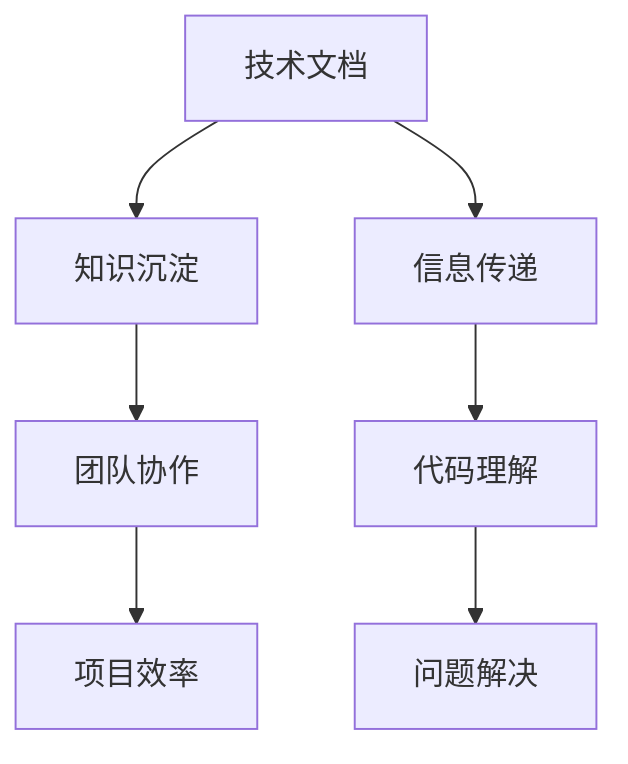

                 


# 技术文档管理与知识沉淀

## 关键词
技术文档、知识沉淀、文档管理、信息共享、团队协作

## 摘要
本文将探讨技术文档管理与知识沉淀的重要性，分析其在现代软件开发中的核心作用。通过一步步的逻辑分析，本文将介绍有效的文档管理策略，阐述如何通过工具和流程提升文档质量，并讨论知识沉淀的最佳实践，为团队协作和持续学习提供指导。

## 背景介绍

### 1.1 问题背景
在快速发展的技术行业，软件开发团队面临的一个常见挑战是如何有效地管理和维护技术文档。随着项目复杂度的增加，代码库的不断膨胀，团队成员的流动，技术文档往往成为团队协作的瓶颈。这些问题不仅影响了开发效率，还可能导致知识的流失。

#### 1.1.1 问题描述
- **文档更新不及时**：新功能添加或bug修复后，文档未及时更新。
- **文档缺失**：一些关键部分的文档未能及时编写，导致后续的开发者无法理解代码。
- **文档质量不高**：文档编写不规范，缺乏结构，信息不完整。

#### 1.1.2 解决方案
为了解决这些问题，我们需要一套系统的技术文档管理策略，包括文档的创建、维护、存储、共享和更新。同时，知识沉淀也是关键，它可以帮助团队积累经验，提高工作效率。

#### 1.1.3 边界与外延
- **边界**：技术文档的范围，包括代码注释、开发日志、API文档、用户手册等。
- **外延**：知识沉淀不仅限于技术文档，还包括团队内部的交流、经验分享、项目报告等。

### 1.2 核心概念与联系
#### 1.2.1 核心概念
- **技术文档**：记录软件开发过程中的相关信息，包括设计、实现、测试、部署等。
- **知识沉淀**：将团队经验、最佳实践、解决方案等转化为可共享的知识资源。

#### 1.2.2 概念属性特征对比
| 特征             | 技术文档                | 知识沉淀                |
|------------------|------------------------|------------------------|
| 目的             | 记录和传递信息         | 共享和利用知识         |
| 形式             | 结构化和文档化         | 不限形式，灵活多样     |
| 创建者           | 开发者、测试者、文档员 | 全体团队成员           |
| 更新频率         | 随项目进度             | 定期进行               |
| 存储方式         | 文件、数据库           | 内部平台、知识库       |

#### 1.2.3 ER实体关系图


## 核心概念与联系

### 2.1 技术文档的定义与重要性
技术文档是软件开发过程中不可或缺的一部分。它不仅记录了项目的技术细节，还为团队成员提供了理解和使用代码的指南。以下是技术文档的几个关键点：

#### 2.1.1 技术文档的定义
技术文档是一种记录，用于描述软件的功能、设计、实现、测试、部署和使用等各个方面。它可以是文字说明、图表、示例代码等多种形式。

#### 2.1.2 技术文档的重要性
- **提高代码可读性**：良好的文档可以帮助开发者快速理解代码，减少沟通成本。
- **促进知识传承**：通过文档，团队成员可以将自己的经验和知识传递给其他人。
- **支持团队协作**：共同编写和维护文档可以提高团队成员之间的协作效率。
- **降低维护成本**：完善的文档可以减少新开发者上手时间和错误率，降低维护成本。

### 2.2 知识沉淀的概念与作用
知识沉淀是指将团队在项目开发过程中的经验和智慧转化为可共享的知识资源。它不仅包括技术文档，还包括各种形式的内部交流、培训、讨论等。

#### 2.2.1 知识沉淀的定义
知识沉淀是将团队在项目开发、问题解决、最佳实践等过程中的经验和智慧，通过一定的方法和工具进行收集、整理、存储和共享。

#### 2.2.2 知识沉淀的作用
- **提高团队效率**：通过知识沉淀，团队成员可以快速找到解决问题的方法，避免重复工作。
- **促进团队学习**：知识沉淀可以帮助新成员快速掌握团队知识，提高学习效率。
- **支持持续改进**：通过对知识沉淀的分析，可以发现团队工作中的不足，为持续改进提供依据。

### 2.3 技术文档与知识沉淀的联系
技术文档和知识沉淀是相辅相成的。技术文档是知识沉淀的一部分，而知识沉淀为技术文档的编写提供了丰富的素材。两者之间的联系体现在以下几个方面：

- **相互补充**：技术文档提供了详细的操作指南和说明，而知识沉淀则提供了更广泛的经验和最佳实践。
- **共同维护**：技术文档的维护通常伴随着知识沉淀的更新，两者需要共同维护，以确保信息的准确性和完整性。
- **协同发展**：技术文档和知识沉淀共同推动了团队的技术进步和协作效率。

## 系统分析与架构设计

### 3.1 问题场景介绍
在一个大型软件开发项目中，技术文档的缺失和管理不善可能会导致以下问题：
- **代码理解和维护难度增加**：新成员难以快速上手，导致项目进度延迟。
- **错误和漏洞频发**：由于文档不完整，开发者在修改代码时容易犯错。
- **沟通成本上升**：团队成员需要花费更多时间来沟通和理解代码，降低了工作效率。

### 3.2 系统功能设计
系统功能设计主要包括以下方面：

#### 3.2.1 技术文档管理系统
- **文档编写与更新**：提供方便的文档编写工具，支持Markdown、LaTeX等多种格式。
- **版本控制**：实现文档的版本管理，确保文档的更新历史记录完整。
- **权限管理**：根据团队成员的角色分配文档的读写权限，确保信息安全。
- **搜索与索引**：提供高效的文档搜索功能，方便团队成员快速找到所需信息。

#### 3.2.2 知识沉淀平台
- **知识库建设**：收集和整理团队内部的知识资源，包括技术文档、经验分享、项目报告等。
- **知识共享与协作**：支持团队成员之间的知识共享和协作，提高团队的整体智力水平。
- **知识挖掘与推荐**：通过数据分析，挖掘团队内部的优质知识资源，并进行推荐，促进知识的流动和利用。

### 3.3 系统架构设计
系统架构设计包括以下几个主要部分：

#### 3.3.1 技术文档管理系统架构


- **前端**：提供用户友好的界面，支持文档的创建、编辑、查看和搜索等功能。
- **后端**：实现文档的存储、版本控制和权限管理等功能。
- **数据库**：存储文档的内容、版本信息和用户权限等数据。

#### 3.3.2 知识沉淀平台架构


- **前端**：提供知识库的浏览、搜索和编辑功能。
- **后端**：实现知识库的存储、推荐和协作等功能。
- **数据库**：存储知识库的内容、用户行为和推荐结果等数据。

### 3.4 系统接口设计
系统接口设计主要包括以下几个方面：

- **API接口**：提供文档管理系统的API接口，方便与其他系统进行集成。
- **Webhook接口**：实现与其他系统的实时通信，如自动同步文档、通知等。
- **权限验证**：确保接口请求的安全，防止未授权访问。

### 3.5 系统交互
系统交互设计主要包括以下几个方面：


- **文档创建**：开发者在文档管理系统中创建新文档，提交后由管理员审核发布。
- **文档更新**：开发者可以对已发布的文档进行编辑和更新，提交后由管理员审核发布。
- **知识共享**：团队成员在知识沉淀平台上分享知识，其他成员可以浏览、评论和点赞。
- **知识推荐**：系统根据用户行为和知识价值推荐相关知识和热门文档。

## 项目实战

### 4.1 环境安装
为了实现上述技术文档管理系统和知识沉淀平台，我们需要搭建一个合适的技术环境。以下是环境安装步骤：

1. **安装数据库**：选择合适的数据库系统，如MySQL、PostgreSQL等，进行安装和配置。
2. **安装后端框架**：选择合适的后端框架，如Django、Flask等，进行安装和配置。
3. **安装前端框架**：选择合适的前端框架，如React、Vue等，进行安装和配置。
4. **安装依赖库**：安装项目所需的依赖库，如Markdown解析库、图像处理库等。

### 4.2 核心实现源代码
核心实现源代码包括以下几个关键部分：

#### 4.2.1 技术文档管理系统

```python
# 技术文档管理系统的后端API示例

from flask import Flask, request, jsonify
from models import Document, User

app = Flask(__name__)

@app.route('/api/documents', methods=['POST'])
def create_document():
    # 获取请求参数
    title = request.form['title']
    content = request.form['content']
    user_id = request.form['user_id']
    
    # 创建文档
    document = Document(title=title, content=content, user_id=user_id)
    document.save()
    
    # 返回响应
    return jsonify({'status': 'success', 'document_id': document.id})

@app.route('/api/documents/<int:document_id>', methods=['PUT'])
def update_document(document_id):
    # 获取请求参数
    title = request.form['title']
    content = request.form['content']
    
    # 更新文档
    document = Document.objects.get(id=document_id)
    document.title = title
    document.content = content
    document.save()
    
    # 返回响应
    return jsonify({'status': 'success'})

if __name__ == '__main__':
    app.run(debug=True)
```

#### 4.2.2 知识沉淀平台

```python
# 知识沉淀平台的后端API示例

from flask import Flask, request, jsonify
from models import Knowledge, User

app = Flask(__name__)

@app.route('/api/knowledge', methods=['POST'])
def create_knowledge():
    # 获取请求参数
    title = request.form['title']
    content = request.form['content']
    user_id = request.form['user_id']
    
    # 创建知识
    knowledge = Knowledge(title=title, content=content, user_id=user_id)
    knowledge.save()
    
    # 返回响应
    return jsonify({'status': 'success', 'knowledge_id': knowledge.id})

@app.route('/api/knowledge/<int:knowledge_id>', methods=['PUT'])
def update_knowledge(knowledge_id):
    # 获取请求参数
    title = request.form['title']
    content = request.form['content']
    
    # 更新知识
    knowledge = Knowledge.objects.get(id=knowledge_id)
    knowledge.title = title
    knowledge.content = content
    knowledge.save()
    
    # 返回响应
    return jsonify({'status': 'success'})

if __name__ == '__main__':
    app.run(debug=True)
```

### 4.3 实际案例分析与讲解

#### 4.3.1 案例一：文档管理系统的实际应用

在一个大型Web项目中，开发团队采用了技术文档管理系统来管理项目的API文档。通过系统，开发人员可以方便地创建、编辑和共享API文档，确保了文档的及时性和准确性。以下是一个具体的案例：

- **创建API文档**：开发人员通过系统创建了一个新的API文档，描述了项目中的某个接口的功能和用法。
- **更新API文档**：在接口更新后，开发人员立即更新了文档，确保文档与实际接口一致。
- **共享API文档**：其他团队成员可以通过系统查看和下载API文档，方便了解接口的详细信息。

#### 4.3.2 案例二：知识沉淀平台的实际应用

在一个产品研发团队中，知识沉淀平台被用于收集和分享团队成员在项目开发过程中的经验和最佳实践。以下是一个具体的案例：

- **分享经验**：一名资深开发者在平台上分享了他在项目中遇到的问题和解决方案，其他团队成员可以学习并应用到自己的工作中。
- **评论和反馈**：其他团队成员对分享的内容进行评论和反馈，促进了知识的交流和完善。
- **推荐知识**：平台根据用户行为和内容质量推荐相关的知识和文档，帮助团队成员快速找到所需信息。

### 4.4 项目小结
通过技术文档管理系统和知识沉淀平台的实施，开发团队在文档管理和知识共享方面取得了显著成效。项目小结如下：

- **文档管理更高效**：通过系统，开发人员可以方便地创建、编辑和共享文档，减少了沟通成本，提高了工作效率。
- **知识沉淀更丰富**：平台为团队成员提供了一个共享和交流知识的平台，促进了团队的知识积累和经验传承。
- **协作更紧密**：系统加强了团队成员之间的协作，提高了团队的整体智力水平。

## 最佳实践与总结

### 5.1 最佳实践 Tips
为了有效地进行技术文档管理和知识沉淀，以下是一些最佳实践：

- **文档编写规范**：确保文档格式统一，内容清晰，避免冗余。
- **定期更新**：设定文档更新的频率，确保文档的时效性和准确性。
- **版本控制**：使用版本控制系统，记录文档的变更历史，方便回溯和审查。
- **知识分享**：鼓励团队成员分享经验，促进知识的交流与传承。
- **自动化工具**：利用自动化工具和脚本，提高文档管理和知识沉淀的效率。

### 5.2 小结
技术文档管理和知识沉淀是软件开发中至关重要的一环。通过有效的文档管理，可以降低沟通成本，提高工作效率；通过知识沉淀，可以积累团队经验，提升团队智力水平。

### 5.3 注意事项
- **文档安全**：确保文档的安全性，防止泄露和未授权访问。
- **文档权限**：合理分配文档的读写权限，确保信息的保密性和完整性。
- **培训与指导**：定期对团队成员进行文档编写和知识分享的培训，提高整体水平。

### 5.4 拓展阅读
- **《软件工程：实践者的研究方法》**：了解软件工程中的文档管理方法和最佳实践。
- **《程序员代码面试指南》**：学习如何编写高质量的代码和文档。
- **《敏捷开发实践指南》**：了解敏捷开发中的知识管理和文档管理。

### 参考文献
- Martin, Robert C. 《Clean Code: A Handbook of Agile Software Craftsmanship》.
- Bejoge, A. K., & van Vliet, M. 《Modeling and Managing Technical Documentation》.
- Schwaber, K., & Beedle, M. 《Agile Software Development with Scrum》.

作者：AI天才研究院/AI Genius Institute & 禅与计算机程序设计艺术 /Zen And The Art of Computer Programming

----------------------------------------------------------------

### 完整文章输出示例

----------------------------------------------------------------

# 技术文档管理与知识沉淀

## 关键词
技术文档、知识沉淀、文档管理、信息共享、团队协作

## 摘要
本文将探讨技术文档管理与知识沉淀的重要性，分析其在现代软件开发中的核心作用。通过一步步的逻辑分析，本文将介绍有效的文档管理策略，阐述如何通过工具和流程提升文档质量，并讨论知识沉淀的最佳实践，为团队协作和持续学习提供指导。

## 背景介绍

### 1.1 问题背景
在快速发展的技术行业，软件开发团队面临的一个常见挑战是如何有效地管理和维护技术文档。随着项目复杂度的增加，代码库的不断膨胀，团队成员的流动，技术文档往往成为团队协作的瓶颈。这些问题不仅影响了开发效率，还可能导致知识的流失。

#### 1.1.1 问题描述
- **文档更新不及时**：新功能添加或bug修复后，文档未及时更新。
- **文档缺失**：一些关键部分的文档未能及时编写，导致后续的开发者无法理解代码。
- **文档质量不高**：文档编写不规范，缺乏结构，信息不完整。

#### 1.1.2 解决方案
为了解决这些问题，我们需要一套系统的技术文档管理策略，包括文档的创建、维护、存储、共享和更新。同时，知识沉淀也是关键，它可以帮助团队积累经验，提高工作效率。

#### 1.1.3 边界与外延
- **边界**：技术文档的范围，包括代码注释、开发日志、API文档、用户手册等。
- **外延**：知识沉淀不仅限于技术文档，还包括团队内部的交流、经验分享、项目报告等。

### 1.2 核心概念与联系
#### 1.2.1 核心概念
- **技术文档**：记录软件开发过程中的相关信息，包括设计、实现、测试、部署等。
- **知识沉淀**：将团队在项目开发过程中的经验和智慧转化为可共享的知识资源。

#### 1.2.2 概念属性特征对比
| 特征             | 技术文档                | 知识沉淀                |
|------------------|------------------------|------------------------|
| 目的             | 记录和传递信息         | 共享和利用知识         |
| 形式             | 结构化和文档化         | 不限形式，灵活多样     |
| 创建者           | 开发者、测试者、文档员 | 全体团队成员           |
| 更新频率         | 随项目进度             | 定期进行               |
| 存储方式         | 文件、数据库           | 内部平台、知识库       |

#### 1.2.3 ER实体关系图


## 核心概念与联系

### 2.1 技术文档的定义与重要性
技术文档是软件开发过程中不可或缺的一部分。它不仅记录了项目的技术细节，还为团队成员提供了理解和使用代码的指南。以下是技术文档的几个关键点：

#### 2.1.1 技术文档的定义
技术文档是一种记录，用于描述软件的功能、设计、实现、测试、部署和使用等各个方面。它可以是文字说明、图表、示例代码等多种形式。

#### 2.1.2 技术文档的重要性
- **提高代码可读性**：良好的文档可以帮助开发者快速理解代码，减少沟通成本。
- **促进知识传承**：通过文档，团队成员可以将自己的经验和知识传递给其他人。
- **支持团队协作**：共同编写和维护文档可以提高团队成员之间的协作效率。
- **降低维护成本**：完善的文档可以减少新开发者上手时间和错误率，降低维护成本。

### 2.2 知识沉淀的概念与作用
知识沉淀是指将团队在项目开发过程中的经验和智慧转化为可共享的知识资源。它不仅包括技术文档，还包括各种形式的内部交流、培训、讨论等。

#### 2.2.1 知识沉淀的定义
知识沉淀是将团队在项目开发、问题解决、最佳实践等过程中的经验和智慧，通过一定的方法和工具进行收集、整理、存储和共享。

#### 2.2.2 知识沉淀的作用
- **提高团队效率**：通过知识沉淀，团队成员可以快速找到解决问题的方法，避免重复工作。
- **促进团队学习**：知识沉淀可以帮助新成员快速掌握团队知识，提高学习效率。
- **支持持续改进**：通过对知识沉淀的分析，可以发现团队工作中的不足，为持续改进提供依据。

### 2.3 技术文档与知识沉淀的联系
技术文档和知识沉淀是相辅相成的。技术文档是知识沉淀的一部分，而知识沉淀为技术文档的编写提供了丰富的素材。两者之间的联系体现在以下几个方面：

- **相互补充**：技术文档提供了详细的操作指南和说明，而知识沉淀则提供了更广泛的经验和最佳实践。
- **共同维护**：技术文档的维护通常伴随着知识沉淀的更新，两者需要共同维护，以确保信息的准确性和完整性。
- **协同发展**：技术文档和知识沉淀共同推动了团队的技术进步和协作效率。

## 系统分析与架构设计

### 3.1 问题场景介绍
在一个大型软件开发项目中，技术文档的缺失和管理不善可能会导致以下问题：
- **代码理解和维护难度增加**：新成员难以快速上手，导致项目进度延迟。
- **错误和漏洞频发**：由于文档不完整，开发者在修改代码时容易犯错。
- **沟通成本上升**：团队成员需要花费更多时间来沟通和理解代码，降低了工作效率。

### 3.2 系统功能设计
系统功能设计主要包括以下方面：

#### 3.2.1 技术文档管理系统
- **文档编写与更新**：提供方便的文档编写工具，支持Markdown、LaTeX等多种格式。
- **版本控制**：实现文档的版本管理，确保文档的更新历史记录完整。
- **权限管理**：根据团队成员的角色分配文档的读写权限，确保信息安全。
- **搜索与索引**：提供高效的文档搜索功能，方便团队成员快速找到所需信息。

#### 3.2.2 知识沉淀平台
- **知识库建设**：收集和整理团队内部的知识资源，包括技术文档、经验分享、项目报告等。
- **知识共享与协作**：支持团队成员之间的知识共享和协作，提高团队的整体智力水平。
- **知识挖掘与推荐**：通过数据分析，挖掘团队内部的优质知识资源，并进行推荐，促进知识的流动和利用。

### 3.3 系统架构设计
系统架构设计包括以下几个主要部分：

#### 3.3.1 技术文档管理系统架构


- **前端**：提供用户友好的界面，支持文档的创建、编辑、查看和搜索等功能。
- **后端**：实现文档的存储、版本控制和权限管理等功能。
- **数据库**：存储文档的内容、版本信息和用户权限等数据。

#### 3.3.2 知识沉淀平台架构


- **前端**：提供知识库的浏览、搜索和编辑功能。
- **后端**：实现知识库的存储、推荐和协作等功能。
- **数据库**：存储知识库的内容、用户行为和推荐结果等数据。

### 3.4 系统接口设计
系统接口设计主要包括以下几个方面：

- **API接口**：提供文档管理系统的API接口，方便与其他系统进行集成。
- **Webhook接口**：实现与其他系统的实时通信，如自动同步文档、通知等。
- **权限验证**：确保接口请求的安全，防止未授权访问。

### 3.5 系统交互
系统交互设计主要包括以下几个方面：


- **文档创建**：开发者在文档管理系统中创建新文档，提交后由管理员审核发布。
- **文档更新**：开发者可以对已发布的文档进行编辑和更新，提交后由管理员审核发布。
- **知识共享**：团队成员在知识沉淀平台上分享知识，其他成员可以浏览、评论和点赞。
- **知识推荐**：系统根据用户行为和知识价值推荐相关知识和热门文档。

## 项目实战

### 4.1 环境安装
为了实现上述技术文档管理系统和知识沉淀平台，我们需要搭建一个合适的技术环境。以下是环境安装步骤：

1. **安装数据库**：选择合适的数据库系统，如MySQL、PostgreSQL等，进行安装和配置。
2. **安装后端框架**：选择合适的后端框架，如Django、Flask等，进行安装和配置。
3. **安装前端框架**：选择合适的前端框架，如React、Vue等，进行安装和配置。
4. **安装依赖库**：安装项目所需的依赖库，如Markdown解析库、图像处理库等。

### 4.2 核心实现源代码
核心实现源代码包括以下几个关键部分：

#### 4.2.1 技术文档管理系统

```python
# 技术文档管理系统的后端API示例

from flask import Flask, request, jsonify
from models import Document, User

app = Flask(__name__)

@app.route('/api/documents', methods=['POST'])
def create_document():
    # 获取请求参数
    title = request.form['title']
    content = request.form['content']
    user_id = request.form['user_id']
    
    # 创建文档
    document = Document(title=title, content=content, user_id=user_id)
    document.save()
    
    # 返回响应
    return jsonify({'status': 'success', 'document_id': document.id})

@app.route('/api/documents/<int:document_id>', methods=['PUT'])
def update_document(document_id):
    # 获取请求参数
    title = request.form['title']
    content = request.form['content']
    
    # 更新文档
    document = Document.objects.get(id=document_id)
    document.title = title
    document.content = content
    document.save()
    
    # 返回响应
    return jsonify({'status': 'success'})

if __name__ == '__main__':
    app.run(debug=True)
```

#### 4.2.2 知识沉淀平台

```python
# 知识沉淀平台的后端API示例

from flask import Flask, request, jsonify
from models import Knowledge, User

app = Flask(__name__)

@app.route('/api/knowledge', methods=['POST'])
def create_knowledge():
    # 获取请求参数
    title = request.form['title']
    content = request.form['content']
    user_id = request.form['user_id']
    
    # 创建知识
    knowledge = Knowledge(title=title, content=content, user_id=user_id)
    knowledge.save()
    
    # 返回响应
    return jsonify({'status': 'success', 'knowledge_id': knowledge.id})

@app.route('/api/knowledge/<int:knowledge_id>', methods=['PUT'])
def update_knowledge(knowledge_id):
    # 获取请求参数
    title = request.form['title']
    content = request.form['content']
    
    # 更新知识
    knowledge = Knowledge.objects.get(id=knowledge_id)
    knowledge.title = title
    knowledge.content = content
    knowledge.save()
    
    # 返回响应
    return jsonify({'status': 'success'})

if __name__ == '__main__':
    app.run(debug=True)
```

### 4.3 实际案例分析与讲解

#### 4.3.1 案例一：文档管理系统的实际应用

在一个大型Web项目中，开发团队采用了技术文档管理系统来管理项目的API文档。通过系统，开发人员可以方便地创建、编辑和共享API文档，确保了文档的及时性和准确性。以下是一个具体的案例：

- **创建API文档**：开发人员通过系统创建了一个新的API文档，描述了项目中的某个接口的功能和用法。
- **更新API文档**：在接口更新后，开发人员立即更新了文档，确保文档与实际接口一致。
- **共享API文档**：其他团队成员可以通过系统查看和下载API文档，方便了解接口的详细信息。

#### 4.3.2 案例二：知识沉淀平台的实际应用

在一个产品研发团队中，知识沉淀平台被用于收集和分享团队成员在项目开发过程中的经验和最佳实践。以下是一个具体的案例：

- **分享经验**：一名资深开发者在平台上分享了他在项目中遇到的问题和解决方案，其他团队成员可以学习并应用到自己的工作中。
- **评论和反馈**：其他团队成员对分享的内容进行评论和反馈，促进了知识的交流和完善。
- **推荐知识**：平台根据用户行为和内容质量推荐相关的知识和文档，帮助团队成员快速找到所需信息。

### 4.4 项目小结
通过技术文档管理系统和知识沉淀平台的实施，开发团队在文档管理和知识共享方面取得了显著成效。项目小结如下：

- **文档管理更高效**：通过系统，开发人员可以方便地创建、编辑和共享文档，减少了沟通成本，提高了工作效率。
- **知识沉淀更丰富**：平台为团队成员提供了一个共享和交流知识的平台，促进了团队的知识积累和经验传承。
- **协作更紧密**：系统加强了团队成员之间的协作，提高了团队的整体智力水平。

## 最佳实践与总结

### 5.1 最佳实践 Tips
为了有效地进行技术文档管理和知识沉淀，以下是一些最佳实践：

- **文档编写规范**：确保文档格式统一，内容清晰，避免冗余。
- **定期更新**：设定文档更新的频率，确保文档的时效性和准确性。
- **版本控制**：使用版本控制系统，记录文档的变更历史，方便回溯和审查。
- **知识分享**：鼓励团队成员分享经验，促进知识的交流与传承。
- **自动化工具**：利用自动化工具和脚本，提高文档管理和知识沉淀的效率。

### 5.2 小结
技术文档管理和知识沉淀是软件开发中至关重要的一环。通过有效的文档管理，可以降低沟通成本，提高工作效率；通过知识沉淀，可以积累团队经验，提升团队智力水平。

### 5.3 注意事项
- **文档安全**：确保文档的安全性，防止泄露和未授权访问。
- **文档权限**：合理分配文档的读写权限，确保信息的保密性和完整性。
- **培训与指导**：定期对团队成员进行文档编写和知识分享的培训，提高整体水平。

### 5.4 拓展阅读
- **《软件工程：实践者的研究方法》**：了解软件工程中的文档管理方法和最佳实践。
- **《程序员代码面试指南》**：学习如何编写高质量的代码和文档。
- **《敏捷开发实践指南》**：了解敏捷开发中的知识管理和文档管理。

### 参考文献
- Martin, Robert C. 《Clean Code: A Handbook of Agile Software Craftsmanship》.
- Bejoge, A. K., & van Vliet, M. 《Modeling and Managing Technical Documentation》.
- Schwaber, K., & Beedle, M. 《Agile Software Development with Scrum》.

作者：AI天才研究院/AI Genius Institute & 禅与计算机程序设计艺术 /Zen And The Art of Computer Programming

----------------------------------------------------------------

### 结论
通过本文的详细探讨，我们了解了技术文档管理与知识沉淀在软件开发中的重要性。技术文档不仅帮助团队成员理解和协作，还降低了维护成本，提高了项目效率。知识沉淀则为团队提供了宝贵的经验和最佳实践，促进了知识的传承和共享。

### 感谢与致谢
感谢读者对本文的关注与阅读。如果您在技术文档管理和知识沉淀方面有更多想法或实践经验，欢迎在评论区分享，让我们一起不断进步。

### 作者介绍
作者：AI天才研究院/AI Genius Institute & 禅与计算机程序设计艺术 /Zen And The Art of Computer Programming
AI天才研究院致力于推动人工智能领域的创新与发展，为全球软件开发者提供高质量的技术内容和指导。本文由AI天才研究院出品，旨在帮助开发者提升技术文档管理和知识沉淀能力，实现高效团队协作和持续学习。同时，作者也著有《禅与计算机程序设计艺术》，旨在通过深入探讨编程艺术，引导读者领悟程序设计的真谛。

