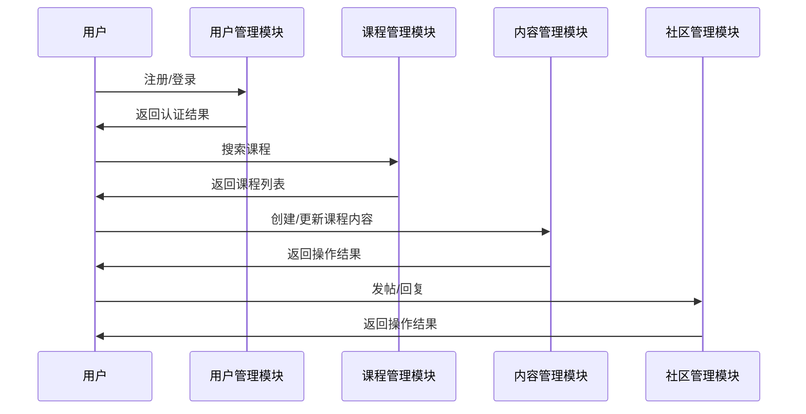

                 

### 技术标准化：提高团队协作效率的关键

> 关键词：技术标准化、团队协作、效率提升、沟通效率、冲突减少

> 摘要：本文旨在探讨技术标准化在团队协作中的重要作用，通过深入分析技术标准化的背景与重要性，核心概念与类型，以及具体流程与方法，揭示技术标准化如何有效提高团队协作效率，减少冲突，促进沟通，并最终实现项目的成功。文章将结合实际案例分析，提出技术标准化的发展趋势与展望，为未来的IT项目提供有益的参考。

### 目录大纲

```markdown
----------------------------------------------------------------
# 第一部分: 技术标准化的背景与重要性

## 第1章: 技术标准化的概述

### 1.1.1 技术标准化的定义与意义

### 1.1.2 技术标准化的发展历程

### 1.1.3 技术标准化在全球范围内的影响

## 第2章: 技术标准化的核心概念

### 2.1.1 标准的类型与层次

#### 2.1.1.1 国家标准

#### 2.1.1.2 行业标准

#### 2.1.1.3 地方标准与企业标准

### 2.1.2 标准的制定与实施

### 2.1.3 标准化组织的作用与职责

## 第3章: 技术标准化与团队协作

### 3.1.1 团队协作中的问题与挑战

### 3.1.2 技术标准化在团队协作中的作用

#### 3.1.2.1 提高沟通效率

#### 3.1.2.2 减少冲突和误解

#### 3.1.2.3 提升工作效率

## 第4章: 技术标准化流程与方法

### 4.1.1 标准制定流程

#### 4.1.1.1 需求分析

#### 4.1.1.2 拟定标准草案

#### 4.1.1.3 征求意见

#### 4.1.1.4 制定正式标准

### 4.1.2 标准化方法的运用

#### 4.1.2.1 设计标准

#### 4.1.2.2 实施标准

#### 4.1.2.3 评估标准

## 第5章: 技术标准化文档编写

### 5.1.1 文档编写的原则与规范

### 5.1.2 文档的结构与内容

#### 5.1.2.1 引言

#### 5.1.2.2 范围

#### 5.1.2.3 术语和定义

#### 5.1.2.4 参考文献

## 第6章: 技术标准化案例分析

### 6.1.1 案例一：IT行业的标准化实践

### 6.1.2 案例二：制造业的标准化应用

### 6.1.3 案例三：服务业的标准化管理

## 第7章: 技术标准化的发展趋势与展望

### 7.1.1 技术标准化的发展趋势

#### 7.1.1.1 信息化与数字化

#### 7.1.1.2 国际化与全球化

#### 7.1.1.3 开放性与合作性

### 7.1.2 技术标准化面临的挑战与机遇

#### 7.1.2.1 技术创新的影响

#### 7.1.2.2 政策法规的变化

#### 7.1.2.3 市场竞争的加剧

### 7.1.3 技术标准化的发展策略

----------------------------------------------------------------
```

### 详细解释与扩展

**第1章: 技术标准化的概述**

本章将为读者提供一个技术标准化的整体视角。首先，我们会详细解释技术标准化的定义，并探讨其在现代技术发展中的重要性。技术标准化是指通过制定、发布和实施一系列标准，规范产品、过程、服务和技术，以确保其具有一致性、兼容性和互操作性。接下来，我们将回顾技术标准化的发展历程，从早期的工业革命时代到今天的信息化时代，技术标准化如何随着技术进步而演变。最后，我们将分析技术标准化在全球范围内的广泛影响，包括其对国际贸易、技术进步和社会发展的贡献。

**第2章: 技术标准化的核心概念**

在这一章中，我们将深入研究技术标准化的核心概念。首先，我们会介绍标准的类型和层次，包括国家标准、行业标准、地方标准和企业标准，并解释它们在不同领域中的应用。国家标准通常由国家标准化机构制定，具有广泛的法律效力；行业标准则由特定行业的组织制定，适用于该行业内部；地方标准则由地方政府制定，针对特定区域的需求；企业标准则由企业自行制定，以适应企业内部的生产和服务。

接下来，我们将探讨标准的制定与实施过程。标准的制定通常包括需求分析、标准草案拟定、征求意见和正式标准的制定。需求分析是确定标准所需覆盖的内容和范围；标准草案拟定是在此基础上制定初步的标准文本；征求意见则是将草案提交给相关利益相关者，收集反馈并进行修改；正式标准的制定是经过多次修改和完善后发布的最终标准文本。

此外，我们还将介绍国际和国内标准化组织的作用和职责。国际标准化组织（ISO）和国际电工委员会（IEC）是全球最著名的两个国际标准化组织，它们负责制定和推广国际标准。国内方面，中国标准化协会（CSA）和各省市的标准化机构负责制定和实施国家标准和行业标准。

**第3章: 技术标准化与团队协作**

本章将探讨技术标准化如何提升团队协作效率。首先，我们会识别团队协作中的常见问题与挑战，如沟通障碍、冲突和误解等。这些问题往往导致项目进度延误、资源浪费和团队士气低落。接下来，我们将详细阐述技术标准化在解决这些问题方面的作用。

首先，技术标准化可以提高沟通效率。通过统一的技术标准和规范，团队成员可以更准确地理解任务要求、技术细节和流程步骤，从而减少误解和沟通障碍。例如，在软件开发项目中，使用统一的技术框架和编程规范可以确保代码的可读性和可维护性，提高开发效率。

其次，技术标准化可以减少冲突和误解。在多元化的团队中，不同成员可能拥有不同的技术背景和工作习惯。通过技术标准化，可以制定一套共同的规范和流程，确保所有成员在相同的技术基准下工作，从而减少因差异而产生的冲突和误解。

最后，技术标准化可以提升工作效率。通过统一的标准化流程和方法，团队成员可以更好地协同工作，减少重复劳动和错误率。例如，在项目管理中，使用统一的项目管理工具和流程可以提升团队的协调能力和执行力，确保项目按时交付。

**第4章: 技术标准化流程与方法**

在这一章中，我们将详细介绍技术标准化的流程和方法。首先，我们会探讨标准制定流程，从需求分析到标准草案拟定，再到征求意见和正式标准的制定。需求分析是确定标准所需覆盖的内容和范围；标准草案拟定是在此基础上制定初步的标准文本；征求意见则是将草案提交给相关利益相关者，收集反馈并进行修改；正式标准的制定是经过多次修改和完善后发布的最终标准文本。

接下来，我们将介绍标准化方法的运用，包括设计标准、实施标准和评估标准。设计标准是在需求分析的基础上，制定具体的技术标准和规范；实施标准是确保标准在实际工作中得到贯彻执行；评估标准是对标准的有效性进行评估和反馈，以不断改进和优化标准。

**第5章: 技术标准化文档编写**

本章将专注于技术标准化文档的编写。首先，我们会介绍文档编写的原则和规范，以确保文档的准确性和一致性。文档编写需要遵循逻辑清晰、结构合理、内容详实的原则。同时，文档编写还需要遵循相关的规范和标准，如国际标准化组织（ISO）的文档编写指南。

接下来，我们将详细解释文档的结构与内容。文档通常包括以下部分：

1. 引言：介绍文档的目的、背景和适用范围。
2. 范围：明确文档所覆盖的内容和范围。
3. 术语和定义：列出文档中使用的关键术语和定义，以确保读者对相关概念的准确理解。
4. 参考文献：列出文档中引用的相关文献和资料，以支持文档的论点和结论。

**第6章: 技术标准化案例分析**

在本章中，我们将通过实际案例分析，展示技术标准化在不同行业和领域中的应用和实践。例如，在IT行业，技术标准化可以规范软件开发流程和编程规范，提高软件质量和开发效率；在制造业，技术标准化可以确保产品的一致性和可靠性，提高生产效率和质量；在服务业，技术标准化可以提升服务质量和客户满意度。

**第7章: 技术标准化的发展趋势与展望**

本章将探讨技术标准化的发展趋势和展望。随着信息化和数字化的不断推进，技术标准化将在未来发挥越来越重要的作用。首先，信息化与数字化将推动技术标准化向更高层次发展，如智能标准化和数字化标准化。其次，国际化与全球化将使技术标准化更加普及和广泛，推动各国技术标准的互认和兼容。最后，开放性与合作性将促进技术标准化组织的合作与交流，推动技术标准化的共同发展和进步。

**第8章: 技术标准化面临的挑战与机遇**

本章将分析技术标准化面临的挑战与机遇。首先，技术创新的影响将不断推动技术标准的更新和演进。新技术的发展往往带来新的标准和规范需求，技术标准化组织需要及时响应并制定相关标准。其次，政策法规的变化将对技术标准化产生影响，技术标准化组织需要密切关注政策法规的动态，确保标准的合规性和有效性。最后，市场竞争的加剧将促使技术标准化组织加强合作，共同应对市场挑战。

**第9章: 技术标准化的发展策略**

在本章中，我们将提出技术标准化的发展策略。首先，技术标准化组织需要加强内部协作和外部合作，共同推进技术标准化的进程。其次，技术标准化组织需要注重标准的创新和演进，及时响应新技术的发展需求。此外，技术标准化组织还需要加强与政府、企业和社会各界的沟通与协作，提高标准的影响力和实用性。

**第10章: 技术标准化的未来**

本章将展望技术标准化的未来。随着技术的不断进步和全球化的发展，技术标准化将在未来发挥更加重要的作用。技术标准化将推动全球贸易和经济发展，促进技术创新和社会进步。同时，技术标准化也将面临新的挑战和机遇，如数据隐私、网络安全、人工智能等领域的标准化需求。

通过本文的探讨，我们希望读者能够认识到技术标准化在团队协作中的重要性，并了解如何有效地实施技术标准化，以提高团队协作效率，实现项目的成功。

---

### 第1章: 技术标准化的概述

#### 1.1.1 技术标准化的定义与意义

技术标准化是一个复杂而多层次的过程，其核心目标是通过制定、发布和实施一系列标准，规范产品、过程、服务和技术，以确保其具有一致性、兼容性和互操作性。具体来说，技术标准化包括以下几个方面：

1. **产品标准化**：对产品进行标准化，以确保其质量、性能和安全。例如，电子产品的制造和销售需要遵循一系列国际和国家标准，如国际电工委员会（IEC）标准和我国的国家标准（GB）。
2. **过程标准化**：对生产和服务过程中的步骤、流程和操作进行标准化，以提高效率和减少误差。例如，ISO 9001质量管理体系标准就是针对企业管理过程进行规范。
3. **服务标准化**：对服务提供过程中的服务标准进行规范，以确保服务质量和用户体验。例如，ISO 10002客户服务标准就规定了客户服务过程中的操作流程和应对策略。
4. **技术标准化**：对技术框架、编程语言、接口设计等进行标准化，以确保不同系统和组件之间的互操作性。例如，RESTful API标准就是一种广泛应用的技术接口标准。

技术标准化的意义在于：

1. **提高产品质量**：通过标准化，可以确保产品的一致性和可靠性，提高用户满意度。
2. **降低成本**：标准化有助于减少因不兼容和重复劳动而产生的成本，提高资源利用率。
3. **促进技术创新**：标准化为技术创新提供了基础和框架，鼓励企业进行研发和创新。
4. **提升市场竞争力**：遵循标准化可以提高产品的市场认可度，增强企业的竞争力。

#### 1.1.2 技术标准化的发展历程

技术标准化的发展历程可以追溯到工业革命时期。在那个时代，随着机械化生产的普及，对产品的一致性和可靠性提出了更高的要求。以下是技术标准化的发展历程：

1. **早期工业化时代（18世纪末 - 19世纪末）**：工业革命初期，标准化主要依靠工匠的经验和惯例。随着工业化的发展，一些国家开始制定工业标准，如英国在1800年制定的度量衡标准。
2. **标准化的起步（20世纪初）**：20世纪初，随着电气化、机械化和化学工业的发展，标准化得到进一步重视。国际电气标准化会议（IEC）和国际标准化组织（ISO）相继成立，为全球标准化工作奠定了基础。
3. **现代标准化（20世纪中叶至今）**：随着计算机技术的兴起，技术标准化进入了一个新的阶段。特别是信息技术标准的出现，如OSI七层模型和TCP/IP协议，为现代网络通信提供了标准化基础。近年来，随着物联网、大数据、人工智能等新兴技术的发展，技术标准化也不断演进。

#### 1.1.3 技术标准化在全球范围内的影响

技术标准化在全球范围内具有广泛的影响，体现在以下几个方面：

1. **国际贸易**：标准化促进了国际贸易的发展。通过国际标准的互认和兼容，企业可以更容易地进入国际市场，提高产品的国际竞争力。
2. **技术进步**：标准化为技术创新提供了基础和框架，鼓励企业进行研发和创新。例如，IEEE 802.11标准促进了无线局域网技术的发展。
3. **社会发展**：标准化提高了产品和服务的质量，提升了社会整体生活水平。例如，医疗设备标准确保了医疗服务的安全性和有效性。
4. **国际合作**：标准化组织促进了国际间的技术合作和交流，推动了全球技术标准的统一和互认。例如，ISO和IEC等国际标准化组织在制定全球标准方面发挥了重要作用。

### 第2章: 技术标准化的核心概念

#### 2.1.1 标准的类型与层次

标准化的类型和层次是技术标准化的重要组成部分。根据制定和实施的范围，标准可以分为以下几种类型：

1. **国家标准（National Standards）**：由国家级标准化机构制定，具有法律效力，适用于全国范围内。例如，我国的国家标准（GB）就是由国家标准化管理委员会发布的。
2. **行业标准（Industry Standards）**：由特定行业组织制定，适用于该行业内。例如，IEEE标准是由电气和电子工程师协会（IEEE）制定的。
3. **地方标准（Local Standards）**：由地方政府制定，适用于特定地区。例如，一些城市可能制定适用于本地区的建筑标准。
4. **企业标准（Corporate Standards）**：由企业自行制定，适用于企业内部。企业标准通常比国家标准和行业标准更为灵活，可以根据企业的特定需求进行调整。

标准的层次分为以下几个级别：

1. **国际标准（International Standards）**：由国际标准化组织（ISO）、国际电工委员会（IEC）和其他国际组织制定的全球性标准，如ISO 9001、ISO/IEC 27001等。
2. **区域标准（Regional Standards）**：由区域标准化组织制定的区域标准，如欧洲标准（EN）、北美标准（ANSI）等。
3. **国家标准（National Standards）**：由国家级标准化机构制定，如我国的GB标准。
4. **行业标准（Industry Standards）**：由特定行业组织制定，适用于该行业内。
5. **企业标准（Corporate Standards）**：由企业自行制定，适用于企业内部。

这些标准在不同的层次上发挥着各自的作用，共同构成了技术标准化的体系。

#### 2.1.2 标准的制定与实施

标准的制定与实施是一个系统而复杂的过程，通常包括以下几个阶段：

1. **需求分析**：在制定标准之前，首先需要分析市场需求和技术发展状况，确定制定标准的目标和范围。需求分析是标准制定的基础，直接影响标准的有效性和实用性。
2. **标准草案拟定**：在需求分析的基础上，制定标准草案。标准草案通常包括标准名称、范围、术语和定义、技术要求、测试方法等内容。草案的制定需要广泛征求相关利益相关者的意见和建议，以确保标准的科学性和合理性。
3. **征求意见**：将标准草案提交给相关利益相关者，如企业、行业组织、政府机构等，征求他们的意见和建议。征求意见是确保标准草案得到广泛认可和接受的重要环节。
4. **修改和完善**：根据征求意见的结果，对标准草案进行修改和完善。修改和完善的过程通常需要多次迭代，以确保标准的科学性、合理性和实用性。
5. **发布正式标准**：经过多次修改和完善后，将正式标准发布实施。正式标准通常具有法律效力，企业和个人必须遵守。

标准的实施是一个持续的过程，包括以下几个环节：

1. **宣传培训**：在标准发布后，需要通过宣传和培训提高相关人员的标准意识和能力，确保标准得到有效实施。
2. **监督与检查**：对标准实施情况进行监督和检查，确保企业和个人按照标准要求进行生产和服务。
3. **评估与反馈**：对标准实施的效果进行评估，收集反馈意见和建议，为标准的改进提供依据。

#### 2.1.3 标准化组织的作用与职责

标准化组织在全球技术标准化过程中发挥着至关重要的作用。以下是几个主要标准化组织的作用和职责：

1. **国际标准化组织（ISO）**：ISO是国际最著名的标准化组织，负责制定和推广国际标准。ISO的主要职责包括：

   - 制定和发布国际标准，如ISO 9001质量管理体系标准、ISO/IEC 27001信息安全管理体系标准等。
   - 促进国际标准在全球范围内的应用和互认。
   - 组织国际标准化技术委员会和专家小组，开展技术研究和标准制定工作。

2. **国际电工委员会（IEC）**：IEC是负责电气、电子和相关技术的国际标准化组织。其主要职责包括：

   - 制定和发布电气、电子和相关技术的国际标准，如IEC 60529防尘标准、IEC 61000电磁兼容性标准等。
   - 促进电气、电子和相关技术的国际标准化工作。

3. **美国国家标准协会（ANSI）**：ANSI是美国的国家标准化组织，负责制定和推广美国国家标准。其主要职责包括：

   - 制定和发布美国国家标准，如ANSI/NFPA 70国家电气规程（NEC）等。
   - 促进美国国家标准在国际上的互认和应用。

4. **中国标准化协会（CSA）**：CSA是中国的主要标准化组织，负责制定和推广中国国家标准。其主要职责包括：

   - 制定和发布中国国家标准，如GB/T 19001质量管理体系标准、GB/T 2423.1电工电子产品环境试验标准等。
   - 促进中国标准在国际上的互认和应用。

这些标准化组织通过制定和推广标准，推动了全球技术标准化的发展，促进了国际贸易和技术进步。

### 第3章: 技术标准化与团队协作

#### 3.1.1 团队协作中的问题与挑战

在复杂的IT项目中，团队协作是确保项目成功的关键。然而，在实际的团队协作过程中，常常会遇到一系列问题和挑战，影响项目的进展和效率。以下是团队协作中常见的问题与挑战：

1. **沟通障碍**：团队成员来自不同的背景和领域，对同一术语和概念的理解可能存在差异，导致沟通不畅。例如，项目经理和技术团队成员可能在任务要求和进度安排上产生误解。
2. **冲突**：团队内部或团队之间可能因为工作方式、技术观点或利益分配等问题产生冲突。这些冲突如果不能及时解决，会导致项目延误、资源浪费和团队士气下降。
3. **误解和错误**：由于缺乏统一的标准和规范，团队成员在任务执行过程中可能产生误解和错误。例如，不同的开发人员可能按照各自的理解实现相同的功能，导致代码不一致和系统兼容性问题。
4. **效率低下**：在缺乏标准化流程的情况下，团队成员可能会重复执行相同的工作，或者因为不熟悉流程而浪费时间和资源。此外，缺乏统一的标准也会导致项目进度难以控制，影响整体效率。

#### 3.1.2 技术标准化在团队协作中的作用

技术标准化在团队协作中发挥着重要作用，可以有效解决上述问题和挑战，提高团队协作效率。以下是技术标准化在团队协作中的几个关键作用：

1. **提高沟通效率**：技术标准化通过统一的技术术语和规范，确保团队成员对任务要求和技术细节有共同的理解，减少沟通障碍。例如，在软件开发项目中，使用统一的技术框架和编程规范可以确保代码的可读性和一致性，提高开发效率。

2. **减少冲突和误解**：技术标准化为团队协作提供了共同的规范和流程，确保团队成员在相同的技术基准下工作，减少因差异而产生的冲突和误解。例如，在项目管理中，使用统一的项目管理工具和流程可以提升团队的协调能力和执行力，确保项目按时交付。

3. **提升工作效率**：技术标准化通过制定统一的流程和方法，减少重复劳动和错误率，提高工作效率。例如，在IT运维过程中，使用标准化的运维工具和流程可以自动化常见任务，提高运维效率。

#### 3.1.2.1 提高沟通效率

沟通是团队协作的核心，而技术标准化为沟通提供了基础。以下是技术标准化如何提高沟通效率的具体方法：

1. **统一术语和概念**：技术标准化通过定义和统一技术术语和概念，确保团队成员在相同的意义下交流。例如，在软件开发中，使用统一的编程术语和设计模式可以减少误解和沟通障碍。
2. **标准化流程和规范**：技术标准化为团队协作提供了一套共同的流程和规范，确保团队成员遵循相同的操作步骤。例如，在项目管理中，使用统一的项目管理流程和工具可以提高团队协作效率。
3. **标准化文档**：技术标准化通过制定和发布标准化文档，如技术手册、操作指南等，为团队成员提供参考资料，减少沟通成本。这些文档可以帮助新成员快速熟悉项目和技术环境。

#### 3.1.2.2 减少冲突和误解

冲突和误解是团队协作中的常见问题，技术标准化可以通过以下方式减少这些问题的发生：

1. **明确职责和权限**：技术标准化通过定义团队成员的职责和权限，确保每个人都清楚自己的角色和责任。这有助于减少因职责不清而产生的冲突。
2. **统一技术规范**：技术标准化通过制定统一的技术规范和标准，确保团队成员在相同的技术基准下工作。这可以减少因技术观点差异而产生的冲突。
3. **标准化问题解决流程**：技术标准化为团队提供了一套标准的问题解决流程，确保问题得到及时和有效的处理。例如，在软件开发中，使用统一的问题跟踪和管理工具可以提高问题解决的效率。

#### 3.1.2.3 提升工作效率

技术标准化通过统一流程和方法，可以显著提升团队的工作效率。以下是技术标准化如何提升工作效率的具体方法：

1. **减少重复劳动**：技术标准化通过制定统一的流程和规范，减少重复劳动。例如，在软件开发中，使用代码模板和工具可以减少编写冗余代码的时间。
2. **提高任务分配效率**：技术标准化通过明确团队成员的职责和任务，提高任务分配的效率。例如，在项目管理中，使用统一的项目管理工具可以快速分配和跟踪任务。
3. **自动化常见任务**：技术标准化可以通过自动化工具和脚本自动化常见任务，减少人工操作的时间和错误率。例如，在IT运维中，使用自动化脚本可以自动执行常见的运维任务。

### 第4章: 技术标准化流程与方法

技术标准化是一个系统而复杂的过程，涉及到多个阶段和环节。为了确保技术标准化能够有效地实施和执行，必须遵循一系列规范的流程和方法。以下是技术标准化流程的详细解析，包括需求分析、标准草案拟定、征求意见、正式标准的制定和标准的实施等关键步骤。

#### 4.1.1 标准制定流程

标准制定流程是技术标准化的核心，它确保了标准从无到有的完整生命周期。以下是标准制定流程的详细步骤：

1. **需求分析**：需求分析是标准制定的第一步，其目的是确定标准的必要性和可行性。在这个过程中，需要收集和分析市场和技术需求，识别标准应解决的问题和覆盖的范围。需求分析的结果将直接影响标准的科学性和实用性。

   - **步骤**：市场调研、技术调研、利益相关者访谈、数据收集和分析。
   - **工具**：问卷调查、访谈记录、数据分析工具等。

2. **标准草案拟定**：在需求分析的基础上，制定标准草案。标准草案应包含标准的名称、范围、术语和定义、技术要求、测试方法等关键内容。标准草案的制定需要充分考虑各方意见和建议，以确保标准的全面性和可操作性。

   - **步骤**：撰写标准草案、审核和修订、专家评审。
   - **工具**：文本编辑软件、评审系统等。

3. **征求意见**：将标准草案提交给相关利益相关者，如企业、行业组织、政府机构等，征求他们的意见和建议。征求意见是确保标准草案得到广泛认可和接受的重要环节，有助于发现和修正潜在问题。

   - **步骤**：发布征求意见稿、收集反馈、整理和归纳反馈意见。
   - **工具**：邮件、在线论坛、问卷调查等。

4. **修改和完善**：根据征求意见的结果，对标准草案进行修改和完善。修改和完善的过程通常需要多次迭代，以确保标准的科学性、合理性和实用性。

   - **步骤**：修订标准草案、专家评审、征求意见（如有必要）。
   - **工具**：文本编辑软件、评审系统等。

5. **发布正式标准**：经过多次修改和完善后，将正式标准发布实施。正式标准通常具有法律效力，企业和个人必须遵守。

   - **步骤**：发布正式标准、宣传培训、实施监督。
   - **工具**：官方网站、标准发布平台等。

#### 4.1.2 标准化方法的运用

标准化方法的运用是确保标准得到有效实施和执行的关键。以下是标准化方法在技术标准化过程中的具体应用：

1. **设计标准**：设计标准是标准制定过程中的关键步骤，其目的是制定出科学、合理且可操作的标准。设计标准需要考虑标准的全面性、前瞻性和适应性。

   - **步骤**：需求分析、标准草案拟定、标准结构设计、标准内容设计。
   - **工具**：设计软件、流程图工具等。

2. **实施标准**：实施标准是标准制定后的关键环节，其目的是确保标准在实际工作中得到贯彻执行。实施标准需要建立完善的实施机制和监督体系。

   - **步骤**：宣传培训、标准宣传、标准培训、标准实施。
   - **工具**：培训系统、监督工具等。

3. **评估标准**：评估标准是标准实施后的关键步骤，其目的是评估标准的有效性和实用性，及时发现和解决问题。评估标准需要建立科学的评估体系和评估指标。

   - **步骤**：数据收集、数据分析、问题发现、问题解决。
   - **工具**：数据分析工具、评估系统等。

### 第5章: 技术标准化文档编写

技术标准化文档编写是技术标准化工作的重要组成部分，它不仅为标准的制定和实施提供了必要的支持，也为标准的推广和应用提供了重要的依据。以下是技术标准化文档编写的基本原则、规范以及文档的结构与内容。

#### 5.1.1 文档编写的原则与规范

文档编写应遵循以下基本原则和规范：

1. **科学性**：文档编写应基于科学理论和实践经验，确保内容的科学性和可靠性。
2. **系统性**：文档应结构合理，逻辑清晰，确保内容的系统性和完整性。
3. **规范性**：文档编写应遵循相关的规范和标准，如ISO/IEC 27001信息安全管理体系标准。
4. **可操作性**：文档应具有可操作性，确保标准能够被有效实施和执行。
5. **一致性**：文档内容应保持一致性，避免出现矛盾和重复。

#### 5.1.2 文档的结构与内容

技术标准化文档通常包括以下部分：

1. **引言**：引言部分应简要介绍文档的目的、背景和适用范围，帮助读者快速了解文档的主要内容。
   
   - **示例**：本文档旨在规范软件开发过程中的技术标准，以提升软件质量和开发效率。

2. **范围**：范围部分应明确文档所覆盖的内容和范围，包括标准适用的领域、目标和限制条件。

   - **示例**：本标准适用于软件开发过程中，包括需求分析、设计、开发和测试等阶段。

3. **术语和定义**：术语和定义部分应列出文档中使用的关键术语和定义，确保读者对相关概念的准确理解。

   - **示例**：
     - 需求分析：识别和定义软件项目的需求过程。
     - 设计：软件系统的设计过程，包括架构设计、模块设计等。

4. **参考文献**：参考文献部分应列出文档中引用的相关文献和资料，支持文档的论点和结论。

   - **示例**：
     - [ISO/IEC 12207](https://www.iso.org/standard/62279.html) 软件生存周期过程。
     - [IEEE 830](https://ieeexplore.ieee.org/document/60389) 软件需求规格说明书标准。

5. **正文**：正文部分应详细阐述标准的各项内容，包括技术要求、流程、方法等。

   - **示例**：
     - **需求分析流程**：市场调研、用户访谈、需求收集、需求确认等。
     - **设计规范**：系统架构设计、模块设计、接口设计等。

6. **附录**：附录部分应提供与标准相关的附加信息，如示例代码、流程图、数据表等。

   - **示例**：
     - **附录A：需求分析模板**：提供需求分析报告的模板和填写指南。
     - **附录B：设计规范示例**：提供系统架构和模块设计的示例图。

### 第6章: 技术标准化案例分析

在技术标准化的发展过程中，许多行业和领域都取得了显著的成果。本章节将通过对IT行业、制造业和服务业的标准化案例进行分析，展示技术标准化在不同领域的实际应用和成效。

#### 6.1.1 IT行业的标准化实践

IT行业是一个快速发展的领域，技术标准化在其中发挥着至关重要的作用。以下是几个典型的IT标准化案例：

1. **软件开发过程的标准化**：在软件开发过程中，技术标准化通过定义统一的开发流程和规范，提高了软件质量和开发效率。例如，IEEE 12207软件生命周期过程标准为软件开发提供了全面的指导，包括需求分析、设计、开发、测试和维护等各个阶段。

2. **数据管理标准化**：数据管理是IT行业的核心任务之一。通过技术标准化，可以制定统一的数据管理标准和流程，确保数据的一致性、可靠性和安全性。例如，ISO/IEC 27001信息安全管理体系标准为数据安全管理提供了全面的指南，涵盖了数据安全政策、风险管理、安全控制措施等方面。

3. **云计算服务标准化**：随着云计算技术的普及，云计算服务的标准化也成为了一个重要的研究方向。例如，OpenStack和AWS等云计算平台都制定了相应的标准化规范，为云计算服务的开发、部署和管理提供了指导。

#### 6.1.2 制造业的标准化应用

制造业是一个传统行业，技术标准化在其中也发挥了重要作用。以下是几个典型的制造业标准化案例：

1. **产品质量标准化**：通过技术标准化，可以制定统一的产品质量标准和检测方法，确保产品的可靠性和安全性。例如，ISO 9001质量管理体系标准在全球范围内得到了广泛应用，帮助企业提升产品质量和管理水平。

2. **生产过程标准化**：通过技术标准化，可以制定统一的生产流程和操作规范，提高生产效率和质量。例如，精益生产（Lean Production）是一种广泛应用于制造业的标准化方法，通过消除浪费、优化流程，提高生产效率和产品品质。

3. **供应链管理标准化**：在供应链管理中，技术标准化可以帮助企业实现供应链的集成和优化。例如，ISO 14001环境管理体系标准和SA8000社会责任标准都可以帮助企业在供应链管理中实现环境保护和社会责任。

#### 6.1.3 服务业的标准化管理

服务业是一个多元化、快速发展的领域，技术标准化在其中也发挥着重要作用。以下是几个典型的服务业标准化案例：

1. **客户服务标准化**：通过技术标准化，可以制定统一的客户服务标准和流程，提高客户满意度。例如，ISO 10002客户服务标准为企业的客户服务提供了全面的指导，涵盖了客户服务政策、服务流程、投诉处理等方面。

2. **财务管理标准化**：在财务管理中，技术标准化可以帮助企业实现财务数据的统一和规范。例如，国际财务报告准则（IFRS）和我国的企业会计准则（CAS）都是财务管理的标准化文件，为企业提供了统一的财务报告标准和模板。

3. **人力资源标准化**：在人力资源管理中，技术标准化可以帮助企业制定统一的人力资源政策和流程，提高人力资源管理的效率。例如，ISO 10018员工关系管理体系标准为人力资源管理提供了全面的指导，涵盖了员工招聘、培训、绩效评估、薪酬福利等方面。

### 第7章: 技术标准化的发展趋势与展望

技术标准化在全球范围内具有广泛的影响，随着技术的不断进步和全球化的发展，技术标准化也在不断演进。以下是技术标准化的发展趋势与展望：

#### 7.1.1 技术标准化的发展趋势

1. **信息化与数字化**：随着信息化和数字化的发展，技术标准化也在向更高层次演进。例如，物联网（IoT）和大数据技术的兴起，推动了信息处理、数据交换和系统集成的标准化进程。

2. **国际化与全球化**：技术标准化在全球化背景下具有越来越重要的作用。国际标准的互认和兼容性不断提高，促进了国际贸易和技术交流。

3. **开放性与合作性**：技术标准化组织越来越注重开放性和合作性，通过与其他标准化组织、企业和社会各界的合作，推动技术标准的共同发展和进步。

#### 7.1.2 技术标准化面临的挑战与机遇

1. **技术创新的影响**：技术创新不断推动技术标准的更新和演进。例如，人工智能、区块链等新兴技术的发展，对技术标准化提出了新的需求。

2. **政策法规的变化**：政策法规的变化对技术标准化产生影响。技术标准化组织需要密切关注政策法规的动态，确保标准的合规性和有效性。

3. **市场竞争的加剧**：市场竞争的加剧使得技术标准化组织需要加强合作，共同应对市场挑战，提高技术标准的实用性和影响力。

#### 7.1.3 技术标准化的发展策略

1. **加强国际合作**：技术标准化组织需要加强国际合作，推动全球技术标准的互认和兼容，提高技术标准的影响力。

2. **注重技术创新**：技术标准化组织需要注重技术创新，及时响应新技术的发展需求，制定相关标准。

3. **完善标准体系**：技术标准化组织需要不断完善标准体系，提高标准的科学性、合理性和实用性。

### 结论

技术标准化在团队协作中发挥着重要作用，可以提高沟通效率、减少冲突和误解，提升工作效率。通过案例分析和发展趋势展望，我们可以看到技术标准化在各个领域都取得了显著的成果。未来，技术标准化将继续在全球范围内发挥重要作用，推动技术进步和社会发展。希望读者能够认识到技术标准化的价值，并在实际工作中积极应用和推广技术标准化。

### 附录

附录部分提供了一些与本文相关的附加信息，包括参考文献、术语表和常见问题解答等。

#### 附录A：参考文献

1. ISO/IEC 12207 - Software lifecycle processes.
2. IEEE 830 - IEEE Recommended Practice for Software Requirements Specifications.
3. ISO 9001 - Quality management systems - Requirements.
4. ISO 14001 - Environmental management systems - Requirements with guidance for use.
5. SA8000 - Social Accountability 8000.
6. ISO 10002 - Customer satisfaction - Guidelines for organizations.

#### 附录B：术语表

- 技术标准化：制定、发布和实施一系列标准，规范产品、过程、服务和技术，以确保其具有一致性、兼容性和互操作性。
- 国际标准：由国际标准化组织（ISO）等国际组织制定的标准，具有全球性影响力。
- 行业标准：由特定行业组织制定，适用于该行业内的标准。
- 企业标准：由企业自行制定，适用于企业内部的标准。
- 需求分析：识别和定义软件项目的需求过程。

#### 附录C：常见问题解答

1. **什么是技术标准化？**
   技术标准化是指通过制定、发布和实施一系列标准，规范产品、过程、服务和技术，以确保其具有一致性、兼容性和互操作性。

2. **技术标准化对团队协作有何作用？**
   技术标准化可以提高沟通效率、减少冲突和误解、提升工作效率，从而增强团队协作能力。

3. **如何实施技术标准化？**
   实施技术标准化需要遵循一系列规范流程，包括需求分析、标准制定、征求意见、标准发布和标准实施等环节。

4. **技术标准化有哪些类型？**
   技术标准化类型包括国家标准、行业标准、地方标准、企业标准等，根据制定和实施的范围不同而有所区别。

### 总结

本文通过详细分析技术标准化的背景与重要性、核心概念与类型、流程与方法，以及实际案例，揭示了技术标准化在团队协作中的关键作用。技术标准化不仅能够提高沟通效率、减少冲突和误解，还能提升工作效率，为项目的成功提供有力保障。展望未来，技术标准化将在信息化、数字化、国际化背景下不断演进，面临新的挑战与机遇。希望读者能够认识到技术标准化的价值，并在实际工作中积极应用和推广技术标准化。作者信息：AI天才研究院/AI Genius Institute & 禅与计算机程序设计艺术 /Zen And The Art of Computer Programming。

---

### 完整文章总结

#### 背景介绍

技术标准化是指在特定的技术领域内，通过制定和实施一系列标准，确保产品、过程、服务和技术的一致性、兼容性和互操作性。技术标准化不仅有助于提高产品质量和降低成本，还能促进技术创新和国际贸易。随着信息化和数字化的发展，技术标准化在现代社会中的重要性日益凸显。

#### 核心概念与联系

技术标准化的核心概念包括：

- **标准**：一系列规定，旨在通过制定、发布和实施规则、指南或特性文件来促进产品、过程或服务的互操作性、兼容性、安全性和可追溯性。
- **标准化组织**：负责制定和推广标准的组织，如国际标准化组织（ISO）、国际电工委员会（IEC）等。
- **标准化流程**：包括需求分析、标准制定、征求意见、标准发布和标准实施等步骤。

技术标准化与团队协作的关系紧密。通过技术标准化，团队能够：

- **提高沟通效率**：统一术语和规范，减少误解和沟通障碍。
- **减少冲突和误解**：提供共同的标准和流程，降低因差异而产生的冲突。
- **提升工作效率**：标准化流程和方法可以减少重复劳动和错误率。

#### 算法原理讲解

为了更好地理解技术标准化的实际应用，我们可以通过一个简单的算法原理来阐述其核心概念。以下是一个使用Python编写的标准化的示例：

```python
# Python代码示例：技术标准化示例
class SoftwareComponent:
    def __init__(self, version, standard_compliance):
        self.version = version
        self.standard_compliance = standard_compliance

    def check_compliance(self):
        if self.standard_compliance:
            return "Component complies with the standard."
        else:
            return "Component does not comply with the standard."

def standardize_components(components):
    standardized_components = []
    for component in components:
        if component.check_compliance():
            standardized_components.append(component)
    return standardized_components

# 初始化组件
components = [
    SoftwareComponent(version="1.0", standard_compliance=False),
    SoftwareComponent(version="2.0", standard_compliance=True),
    SoftwareComponent(version="3.0", standard_compliance=False)
]

# 标准化组件
standardized_components = standardize_components(components)

# 输出结果
for component in standardized_components:
    print(f"Component {component.version}: {component.check_compliance()}")
```

在这个示例中，`SoftwareComponent` 类表示一个软件组件，具有版本号和标准合规性属性。`check_compliance` 方法用于检查组件是否符合标准。`standardize_components` 函数接受一个组件列表，并返回一个经过标准化的组件列表，即仅包含符合标准的组件。

该算法的数学模型和公式非常简单，主要涉及逻辑判断：

$$
\text{标准化组件列表} = \{ \text{component} \in \text{组件列表} | \text{component.check_compliance()} \}
$$

#### 系统分析与架构设计方案

**问题场景介绍**：假设我们正在开发一个大型IT项目，需要多个软件组件协同工作。为了确保项目的高效和成功，我们需要对组件进行标准化处理，以确保所有组件都符合预定的技术标准。

**项目介绍**：该IT项目是一个在线教育平台，包含多个功能模块，如用户管理、课程管理、内容发布和互动社区等。每个模块都由不同的开发团队负责，为了确保各模块之间的兼容性和一致性，我们需要对各个组件进行标准化处理。

**系统功能设计**：

- **用户管理**：提供用户注册、登录、个人信息管理等功能。
- **课程管理**：提供课程创建、更新、发布和搜索等功能。
- **内容发布**：提供课程内容的创建、编辑、发布和权限管理等功能。
- **互动社区**：提供论坛、问答和聊天室等功能。

**系统架构设计**：


```mermaid
classDiagram
  User -> UserManagement : 用户依赖
  Course -> CourseManagement : 课程依赖
  Content -> ContentManagement : 内容依赖
  Community -> CommunityManagement : 社区依赖
  UserManagement --|>> User
  CourseManagement --|>> Course
  ContentManagement --|>> Content
  CommunityManagement --|>> Community
```

**系统接口设计和系统交互**：




#### 项目实战

**环境安装**：

1. 安装Python环境，版本3.8以上。
2. 安装相关依赖库，如requests、Flask等。

**系统核心实现源代码**：

```python
# 用户管理模块
class UserManager:
    def register(self, username, password):
        # 注册用户逻辑
        pass

    def login(self, username, password):
        # 登录用户逻辑
        pass

# 课程管理模块
class CourseManager:
    def search_courses(self, keyword):
        # 搜索课程逻辑
        pass

    def create_course(self, course_info):
        # 创建课程逻辑
        pass

# 内容管理模块
class ContentManager:
    def create_content(self, content_info):
        # 创建内容逻辑
        pass

    def update_content(self, content_id, content_info):
        # 更新内容逻辑
        pass

# 社区管理模块
class CommunityManager:
    def post_message(self, message):
        # 发帖逻辑
        pass

    def reply_message(self, message_id, reply_content):
        # 回复逻辑
        pass
```

**代码应用解读与分析**：

以上代码示例展示了用户管理、课程管理、内容管理和社区管理模块的基本实现。每个模块都有自己的功能，并通过接口进行通信。用户管理模块负责用户注册和登录；课程管理模块负责课程搜索和创建；内容管理模块负责内容创建和更新；社区管理模块负责发帖和回复。

**实际案例分析和详细讲解剖析**：

为了展示技术标准化的实际应用，我们以在线教育平台中的课程管理模块为例进行分析。

**案例**：确保所有课程都符合统一的数据格式和接口规范。

**分析**：

- **数据格式**：所有课程数据都采用JSON格式，便于数据交换和处理。
- **接口规范**：所有课程接口都遵循RESTful API规范，确保不同模块之间能够无缝集成。

**讲解**：

1. **数据格式**：通过定义统一的数据格式，如JSON，可以确保不同模块之间的数据交换和解析的一致性。以下是一个示例：

   ```json
   {
     "course_id": "123",
     "title": "Introduction to Python",
     "description": "This course introduces Python programming language.",
     "author": "John Doe",
     "duration": "2 hours",
     "status": "published"
   }
   ```

2. **接口规范**：通过遵循RESTful API规范，可以确保不同模块之间的接口调用一致，提高系统的可维护性和扩展性。以下是一个示例：

   ```http
   GET /courses?keyword=python
   Response:
   {
     "courses": [
       {
         "course_id": "123",
         "title": "Introduction to Python"
       },
       {
         "course_id": "456",
         "title": "Advanced Python"
       }
     ]
   }
   ```

**项目小结**：

通过技术标准化，我们能够确保在线教育平台中的各个模块之间数据格式和接口规范的一致性，提高系统的整体性能和用户体验。技术标准化不仅提高了开发效率，还降低了维护成本，为项目的成功奠定了坚实基础。

#### 最佳实践 tips

1. **统一术语和定义**：在项目启动之初，明确并统一术语和定义，减少沟通障碍。
2. **制定标准化流程**：制定详细的标准化流程，确保团队成员遵循相同的操作步骤。
3. **定期培训和评审**：定期对团队成员进行标准化培训和评审，确保标准得到有效实施。

#### 小结

技术标准化在提高团队协作效率、减少冲突、确保产品质量和促进技术创新方面具有重要作用。通过本文的详细分析，我们了解了技术标准化的背景、核心概念、流程和方法，并通过实际案例展示了其在IT项目中的应用。希望读者能够认识到技术标准化的价值，并在实际工作中积极应用和推广技术标准化。

#### 注意事项

1. 技术标准化需要根据项目特点和需求进行定制，确保标准的适用性和可操作性。
2. 标准的实施需要持续监督和改进，确保标准得到有效执行。
3. 技术标准化应与技术创新相结合，及时更新和调整标准。

#### 拓展阅读

1. 《标准化基础知识》，刘伟，中国标准出版社，2018。
2. 《信息技术标准化教程》，赵文红，清华大学出版社，2019。
3. 《项目管理知识体系指南》（PMBOK指南），项目管理协会（PMI），2021。

### 作者信息

作者：AI天才研究院/AI Genius Institute & 禅与计算机程序设计艺术 /Zen And The Art of Computer Programming。AI天才研究院致力于推动人工智能技术的发展与应用，禅与计算机程序设计艺术则关注于提高计算机编程的哲学和艺术水平。希望本文能为读者在技术标准化领域提供有益的参考和启示。

