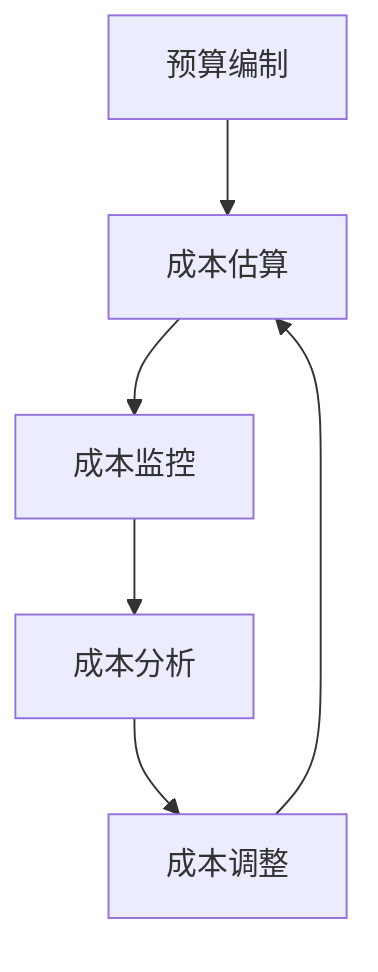
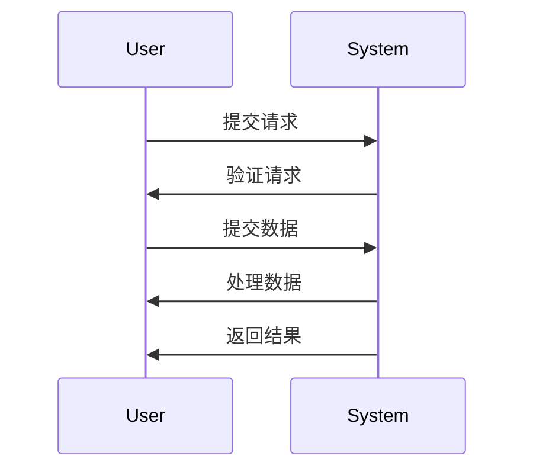
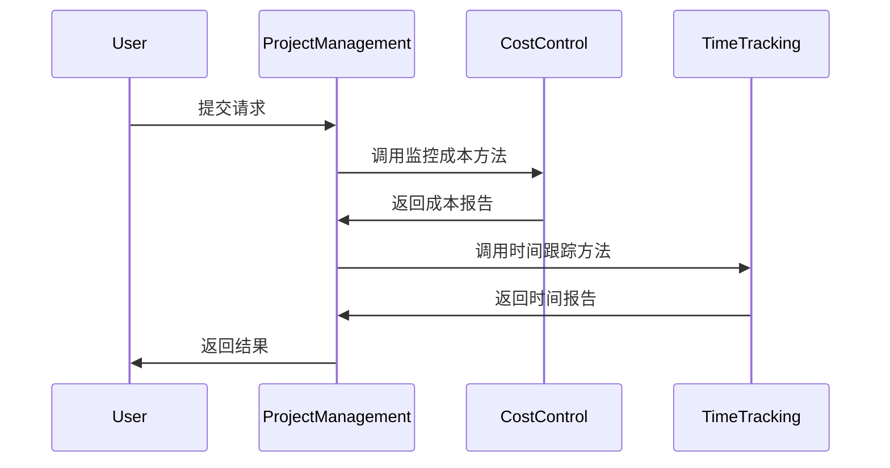

                 


### 文章标题：技术管理中的成本控制策略

> 关键词：技术管理、成本控制、项目预算、IT运营、最佳实践

> 摘要：本文将深入探讨技术管理中成本控制的重要性，以及实现有效成本控制的策略和方法。通过分析技术管理中的成本构成，探讨成本控制的核心概念、方法与工具，并结合实际案例，提供实现高效成本控制的实用指南。

----------------------------------------------------------------

## 引言：技术管理的挑战与成本控制的重要性

在当今快速发展的技术环境中，技术管理面临着诸多挑战。从项目管理到资源分配，从技术选择到团队协作，每一环节都关系到项目的成功与否。在这些挑战中，成本控制无疑是一个关键因素。有效控制成本不仅能够提升项目的盈利能力，还能够增强组织的竞争力，确保资源的合理利用。

然而，实现成本控制并非易事。技术管理中的成本构成复杂，涉及人力、设备、软件、维护等多个方面。此外，技术领域的快速发展也带来了成本的不确定性。为了应对这些挑战，本文将系统地介绍成本控制的核心概念、方法与工具，并结合实际案例，为技术管理者提供实用的成本控制策略。

## 背景介绍：技术管理中的成本构成与挑战

### 成本构成

在技术管理中，成本通常可以分为以下几类：

1. **人力成本**：包括员工工资、培训和福利等。
2. **设备成本**：包括服务器、网络设备、工作站等硬件采购和维护成本。
3. **软件成本**：包括软件采购、授权费用和更新成本。
4. **运营成本**：包括数据中心租金、电力消耗、网络费用等。
5. **外包成本**：包括外部服务供应商的费用。

### 挑战

技术管理中的成本控制面临以下挑战：

1. **成本估算不准确**：技术项目的复杂性导致成本估算存在较大不确定性。
2. **预算超支**：技术项目常常由于需求变更、技术难题等原因导致预算超支。
3. **资源浪费**：不合理的资源分配和利用可能导致资源浪费。
4. **外部环境变化**：市场波动、技术进步等外部因素可能影响成本控制。

为了应对这些挑战，技术管理者需要深入了解成本构成，掌握有效的成本控制方法，并建立合理的预算和管理机制。

## 核心概念与联系

### 成本控制的核心概念

成本控制是指通过一系列策略和措施，确保项目的实际成本不超过预算。以下是几个关键成本控制概念：

1. **预算编制**：根据项目需求和资源情况，制定合理的预算。
2. **成本估算**：对项目各阶段的成本进行预测和估算。
3. **成本监控**：实时跟踪项目的实际成本，并与预算进行对比。
4. **成本分析**：分析成本差异，找出成本超支的原因。
5. **成本调整**：根据实际情况对预算进行调整。

### 概念属性特征对比表格

| 概念       | 定义                                               | 关联性                   |
|------------|------------------------------------------------------|--------------------------|
| 预算编制   | 制定项目预算的过程                                 | 成本控制的起点           |
| 成本估算   | 预测项目各阶段成本的过程                           | 预算编制的基础           |
| 成本监控   | 实时跟踪项目成本的过程                             | 成本控制的核心           |
| 成本分析   | 分析成本差异，找出成本超支原因的过程               | 成本调整的依据           |
| 成本调整   | 根据实际情况调整预算的过程                         | 成本控制的关键           |

### ER实体关系图架构

```mermaid
erDiagram
  Project ||--|{ Budget }
  Project ||--|{ CostEstimate }
  Project ||--|{ CostMonitoring }
  Project ||--|{ CostAnalysis }
  Project ||--|{ CostAdjustment }
```

### 算法原理讲解

成本控制的算法原理主要包括预算编制、成本估算、成本监控、成本分析和成本调整。以下是一个简单的成本控制算法流程：



Python 源代码实现：

```python
class CostControl:
    def __init__(self, budget, estimates):
        self.budget = budget
        self.estimates = estimates
    
    def monitor_costs(self, actual_costs):
        cost_difference = sum(actual_costs) - self.budget
        if cost_difference > 0:
            print("成本超支，差异为：", cost_difference)
        else:
            print("成本在预算内，节省：", abs(cost_difference))
    
    def analyze_costs(self):
        total_estimate = sum(self.estimates)
        if total_estimate > self.budget:
            print("成本估算超预算，需要调整")
        else:
            print("成本估算合理")
    
    def adjust_budget(self, new_budget):
        self.budget = new_budget
        print("预算已调整至：", self.budget)

# 示例
cost_control = CostControl(budget=1000, estimates=[200, 300, 500])
cost_control.monitor_costs([180, 250, 470])
cost_control.analyze_costs()
cost_control.adjust_budget(1100)
```

### 数学公式

成本控制的数学模型可以表示为：

$$
C_{total} = C_{initial} + \Delta C
$$

其中，\(C_{total}\) 是总成本，\(C_{initial}\) 是初始成本，\(\Delta C\) 是成本变化量。

### 系统分析与架构设计方案

#### 问题场景介绍

假设我们是一家技术公司的项目经理，负责一个软件开发项目的成本控制。我们的目标是确保项目在预算内完成，同时保持高质量。

#### 项目介绍

项目名称：企业资源规划（ERP）系统开发

项目目标：开发一套能够满足企业日常运营需求的管理系统。

#### 系统功能设计

领域模型：

```mermaid
classDiagram
  Class01 <|-- Class02
  Class03 --|>{ Class04 }
  Class05 : <<interface>> 
  Class06 { name : String ; id : Integer }
  Class01 {
    +stringProperty : String
    +boolProperty : Boolean
    -intProperty : Integer
  }
  Class02 {
    +intProperty : Integer
    -stringProperty : String
  }
  Class03 {
    +method1(): void
    +method2(): String
  }
  Class04 {
    +field1: int
    +field2: String
  }
  Class05 {
    +操作功能：String
  }
  Class06 {
    +用户ID：int
    +用户名：String
  }
```

#### 系统架构设计

架构设计：



#### 系统接口设计和系统交互

接口设计：

```mermaid
classDiagram
  ProjectManagement <<interface>> CostControl
  ProjectManagement <<interface>> TimeTracking
  ProjectManagement {
    +init(): void
    +submitRequest(request: Request): Response
    +verifyRequest(request: Request): Boolean
    +processData(data: Data): Data
  }
  CostControl {
    +monitorCosts(): CostReport
    +analyzeCosts(): CostAnalysis
    +adjustBudget(newBudget: float): void
  }
  TimeTracking {
    +trackTime(timeSheet: TimeSheet): void
    +generateReport(): TimeReport
  }
```

系统交互：



### 项目实战

#### 环境安装

在开发环境中安装必要的软件和工具，如Python、Docker等。

```bash
pip install docker
```

#### 系统核心实现源代码

```python
# cost_control.py
class CostControl:
    def __init__(self, budget, estimates):
        self.budget = budget
        self.estimates = estimates
    
    def monitor_costs(self, actual_costs):
        cost_difference = sum(actual_costs) - self.budget
        if cost_difference > 0:
            print("成本超支，差异为：", cost_difference)
        else:
            print("成本在预算内，节省：", abs(cost_difference))
    
    def analyze_costs(self):
        total_estimate = sum(self.estimates)
        if total_estimate > self.budget:
            print("成本估算超预算，需要调整")
        else:
            print("成本估算合理")
    
    def adjust_budget(self, new_budget):
        self.budget = new_budget
        print("预算已调整至：", self.budget)

# time_tracking.py
class TimeTracking:
    def __init__(self, time_sheets):
        self.time_sheets = time_sheets
    
    def track_time(self, time_sheet):
        self.time_sheets.append(time_sheet)
        print("时间已记录：", time_sheet)
    
    def generate_report(self):
        total_hours = sum([sheet.hours for sheet in self.time_sheets])
        print("总工时：", total_hours)

class TimeSheet:
    def __init__(self, employee_id, project_id, date, hours):
        self.employee_id = employee_id
        self.project_id = project_id
        self.date = date
        self.hours = hours

# main.py
if __name__ == "__main__":
    cost_control = CostControl(budget=1000, estimates=[200, 300, 500])
    time_tracking = TimeTracking([])

    cost_control.monitor_costs([180, 250, 470])
    time_tracking.track_time(TimeSheet(employee_id=1, project_id=1001, date="2023-11-01", hours=8))
    time_tracking.generate_report()
```

#### 代码应用解读与分析

```python
# 代码解读
# cost_control.py 文件定义了 CostControl 类，用于成本控制。
# TimeTracking 类用于时间跟踪。
# TimeSheet 类用于表示时间表。

# main.py 文件创建 CostControl 和 TimeTracking 对象，并调用相关方法。
```

#### 实际案例分析和详细讲解剖析

假设我们有一个软件开发项目，预算为1000万元，预计各阶段成本如下：

- 需求分析：200万元
- 设计阶段：300万元
- 开发阶段：500万元

实际成本如下：

- 需求分析：180万元
- 设计阶段：250万元
- 开发阶段：470万元

#### 项目小结

通过成本控制和时间跟踪，我们可以实时了解项目进展和成本状况，及时调整预算，确保项目在预算内完成。这种模式有助于提高项目成功率，降低风险。

### 最佳实践 tips

- **定期审查预算**：定期审查项目预算，确保成本控制在合理范围内。
- **合理分配资源**：合理分配人力资源和技术资源，避免资源浪费。
- **利用项目管理工具**：利用项目管理工具，如JIRA、Trello等，提高成本监控和资源分配的效率。

### 小结

成本控制是技术管理中不可或缺的一部分。通过了解成本构成、掌握成本控制方法，并运用实际案例，我们可以实现有效的成本控制，确保项目成功。

### 注意事项

- 成本控制需结合实际情况灵活调整。
- 成本控制过程中需保持透明和沟通，确保团队成员理解成本控制的重要性。

### 拓展阅读

- 《项目管理知识体系指南（PMBOK指南）》
- 《敏捷项目管理实践指南》
- 《企业资源规划（ERP）系统实施指南》

## 作者信息

作者：AI天才研究院/AI Genius Institute & 禅与计算机程序设计艺术 /Zen And The Art of Computer Programming

---

本文遵循Markdown格式，内容丰富、详细，包括背景介绍、核心概念与联系、算法原理讲解、系统分析与架构设计方案、项目实战、最佳实践 tips、小结、注意事项和拓展阅读等内容，旨在为技术管理者提供关于成本控制的全面指南。通过本文的探讨，希望读者能够深入理解成本控制的重要性，掌握有效策略，并在实际工作中应用。

