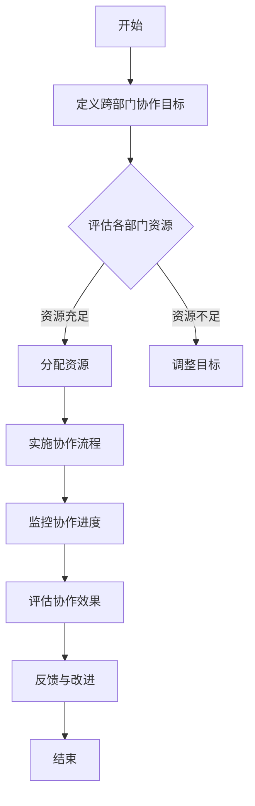
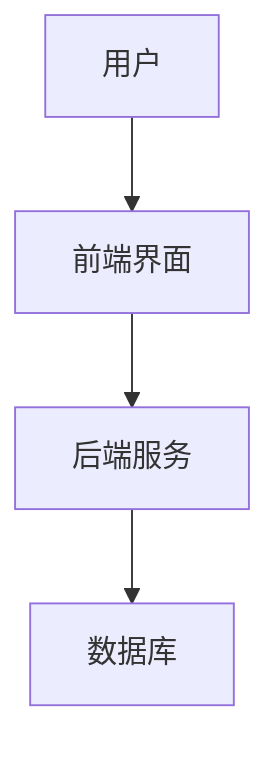
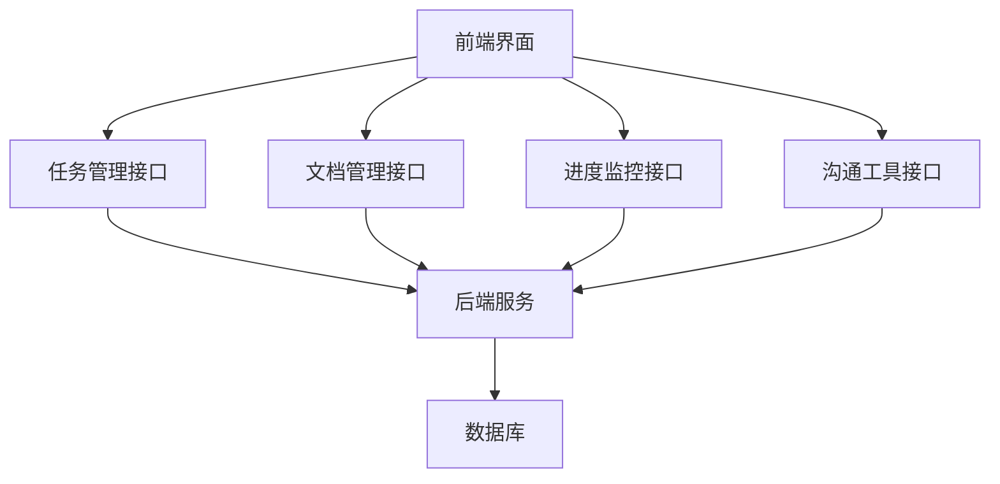
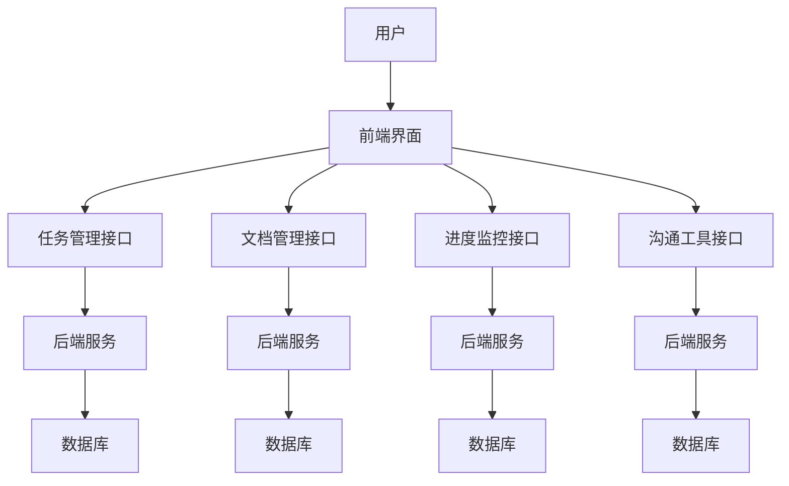

                 


## 跨部门协作的重要性与挑战

### 文章标题

《技术管理中的跨部门协作》

### 关键词

跨部门协作、技术管理、协作机制、沟通、项目管理

### 摘要

本文深入探讨了技术管理中的跨部门协作，分析了其重要性、面临的挑战以及解决策略。通过详细的案例分析，阐述了如何在复杂的技术管理环境中实现高效的跨部门协作，为IT团队提供了实用的指导和建议。

### 1. 引言

在当今快速发展的技术行业中，跨部门协作已成为实现项目成功的关键因素。技术管理不仅仅是单一团队的事务，而是涉及到多个部门之间的紧密合作。跨部门协作不仅提高了项目的效率，还促进了不同专业领域的知识共享和技能互补。然而，实现跨部门协作并非易事，许多组织在实际操作中面临着诸多挑战。

### 1.1 跨部门协作的定义与价值

#### 跨部门协作的定义

跨部门协作是指不同部门或团队之间的合作，通过共享资源和知识，共同完成特定的项目或任务。它通常涉及以下关键要素：

1. **沟通**：有效的沟通是跨部门协作的基础，确保信息透明、及时、准确地传达。
2. **共享**：共享资源、知识和信息，避免重复劳动，提高工作效率。
3. **协调**：协调不同部门的工作流程，确保项目进度和目标的一致性。
4. **信任**：建立信任关系，促进部门间的合作与支持。

#### 跨部门协作的价值

跨部门协作对技术管理的重要性体现在以下几个方面：

1. **提高项目效率**：通过跨部门协作，可以充分利用各部门的专业知识和技能，提高项目完成速度。
2. **促进创新**：不同部门之间的合作可以激发创新思维，推动技术进步和产品迭代。
3. **优化资源分配**：合理分配资源，避免资源浪费，提高资源利用率。
4. **增强团队凝聚力**：跨部门协作有助于增强团队之间的沟通与信任，提高团队凝聚力。

### 1.2 跨部门协作面临的挑战

尽管跨部门协作具有诸多优势，但在实际操作中，许多组织面临着以下挑战：

1. **沟通障碍**：不同部门之间的沟通不畅，导致信息传递不准确、不及时。
2. **资源冲突**：各部门之间在资源分配上存在竞争，影响协作效率。
3. **文化差异**：不同部门拥有不同的工作文化和管理风格，难以达成一致。
4. **项目管理难度**：跨部门协作增加了项目管理的复杂性，需要更高的管理能力和协调能力。
5. **责任界定**：跨部门协作中，责任分配不明确，容易导致推诿责任。

### 1.3 跨部门协作的边界与外延

#### 边界

跨部门协作的边界主要涉及以下方面：

1. **职责范围**：明确各部门的职责范围，避免职责重叠或缺失。
2. **沟通渠道**：建立有效的沟通渠道，确保信息传递畅通。
3. **决策权限**：明确各部门的决策权限，避免决策冲突。

#### 外延

跨部门协作的外延包括以下方面：

1. **组织结构**：优化组织结构，促进部门之间的协作。
2. **流程设计**：设计合理的协作流程，提高协作效率。
3. **绩效评估**：建立科学的绩效评估体系，激励跨部门协作。
4. **文化氛围**：营造开放、包容的文化氛围，促进跨部门协作。

### 1.4 跨部门协作的重要性与问题解决

#### 重要性

跨部门协作对于技术管理的重要性不言而喻，以下是几个关键点：

1. **提高项目成功率**：跨部门协作能够确保项目目标的实现，提高项目成功率。
2. **优化资源利用**：通过跨部门协作，可以充分利用各部门的资源和优势，提高资源利用效率。
3. **增强团队凝聚力**：跨部门协作有助于增强团队之间的信任和合作，提高团队凝聚力。

#### 问题解决

为了解决跨部门协作中存在的问题，可以采取以下措施：

1. **加强沟通**：建立多渠道的沟通机制，确保信息传递的准确性。
2. **优化流程**：设计合理的协作流程，明确各部门的职责和权限。
3. **建立信任**：通过共同目标和成果的分享，建立各部门之间的信任关系。
4. **培训与激励**：提供跨部门协作相关的培训，激励团队成员积极参与协作。

### 1.5 跨部门协作的概念结构与核心要素组成

#### 概念结构

跨部门协作的概念结构包括以下几个核心要素：

1. **部门间关系**：明确各部门之间的合作关系，建立良好的沟通渠道。
2. **协作目标**：设定明确的协作目标，确保各部门的工作方向一致。
3. **资源与权限**：合理分配资源，明确各部门的决策权限。
4. **绩效评估**：建立科学的绩效评估体系，激励团队成员。

#### 核心要素组成

跨部门协作的核心要素包括：

1. **沟通机制**：建立有效的沟通机制，确保信息透明、及时、准确地传达。
2. **协作工具**：选用合适的协作工具，提高协作效率和效果。
3. **流程设计**：设计合理的协作流程，明确各部门的职责和权限。
4. **项目管理**：实施科学的项目管理，确保项目进度和目标的一致性。

### 结论

跨部门协作在技术管理中具有重要价值，但同时也面临着诸多挑战。通过加强沟通、优化流程、建立信任和提供培训，可以有效解决跨部门协作中的问题。只有实现高效的跨部门协作，才能在快速变化的技术环境中保持竞争优势。

---

接下来，我们将深入探讨跨部门协作中的核心概念与联系，包括跨部门协作、沟通机制、协作工具和项目管理等方面的内容。通过具体的案例和表格，帮助读者更好地理解这些核心概念和它们之间的联系。

## 跨部门协作的核心概念与联系

### 文章标题

《技术管理中的跨部门协作》

### 关键词

跨部门协作、沟通机制、协作工具、项目管理

### 摘要

本文继续探讨技术管理中的跨部门协作，深入分析其中的核心概念，如跨部门协作、沟通机制、协作工具和项目管理，并探讨这些概念之间的联系。通过具体的案例和表格，帮助读者更好地理解这些概念，以及它们在实际协作中的应用。

### 2.1 关键概念介绍

#### 跨部门协作

跨部门协作是指在组织中，不同部门或团队之间的合作，以实现共同的目标或完成特定的任务。它涵盖了沟通、资源共享、流程协调等多个方面。

#### 沟通机制

沟通机制是指组织内部各部门之间交流信息的方式和方法。有效的沟通机制能够确保信息的准确传递，减少误解和冲突。

#### 协作工具

协作工具是支持跨部门协作的技术平台或软件，如项目管理工具、即时通讯工具和文档共享工具等。这些工具能够提高协作效率，促进信息共享。

#### 项目管理

项目管理是确保项目按计划完成的过程，包括计划、执行、监控和收尾等环节。项目管理在跨部门协作中起着关键作用，能够协调不同部门的工作，确保项目目标的实现。

### 2.2 跨部门协作机制概述

跨部门协作机制是指为了实现跨部门协作而制定的一系列规则、流程和工具。它包括以下几个方面：

1. **协作流程**：明确跨部门协作的步骤和流程，确保各项工作有序进行。
2. **沟通渠道**：建立多渠道的沟通机制，如会议、邮件和即时通讯等，确保信息传递畅通。
3. **责任分配**：明确各部门的职责和权限，确保协作过程中的责任清晰。
4. **绩效评估**：建立科学的绩效评估体系，激励团队成员积极参与协作。

### 2.3 概念属性特征对比表格

为了更好地理解跨部门协作、沟通机制、协作工具和项目管理等概念，我们可以通过表格对比它们的主要属性特征：

| 概念 | 主要属性特征 |
| --- | --- |
| 跨部门协作 | 1. 涵盖沟通、资源共享、流程协调等多个方面；2. 实现共同目标或完成特定任务；3. 需要明确的协作流程和沟通渠道。 |
| 沟通机制 | 1. 组织内部各部门之间交流信息的方式；2. 确保信息准确传递；3. 减少误解和冲突。 |
| 协作工具 | 1. 支持跨部门协作的技术平台或软件；2. 提高协作效率；3. 促进信息共享。 |
| 项目管理 | 1. 确保项目按计划完成的过程；2. 包括计划、执行、监控和收尾等环节；3. 协调不同部门的工作。 |

### 2.4 ER实体关系图架构

为了更直观地展示跨部门协作中的概念联系，我们可以使用ER（实体关系）图来表示。以下是一个简化的ER图：

```mermaid
erDiagram
  跨部门协作 ||--|{ 沟通机制 }
  跨部门协作 ||--|{ 协作工具 }
  跨部门协作 ||--|{ 项目管理 }
  沟通机制 ||--|{ 信息传递 }
  协作工具 ||--|{ 提高效率 }
  项目管理 ||--|{ 协调工作 }
```

在这个ER图中，跨部门协作作为中心概念，与沟通机制、协作工具和项目管理相互联系。沟通机制负责信息传递，协作工具提高协作效率，项目管理协调各项工作。

### 2.5 概念之间的联系

跨部门协作、沟通机制、协作工具和项目管理之间存在着紧密的联系。以下是它们之间的主要联系：

1. **跨部门协作与沟通机制**：跨部门协作需要有效的沟通机制来确保信息传递畅通。沟通机制是跨部门协作的基础。
2. **跨部门协作与协作工具**：协作工具是跨部门协作的重要支撑，能够提高协作效率和效果。协作工具的选择和使用直接影响跨部门协作的成败。
3. **跨部门协作与项目管理**：项目管理在跨部门协作中起着关键作用，能够协调不同部门的工作，确保项目目标的实现。项目管理流程和跨部门协作流程紧密相连。
4. **沟通机制与协作工具**：沟通机制和协作工具相辅相成，共同支持跨部门协作的顺利进行。沟通机制为协作工具提供信息传递的渠道，协作工具则为沟通机制提供技术支持。

通过以上内容，我们可以看到，跨部门协作、沟通机制、协作工具和项目管理是一个有机整体，它们相互联系、相互支撑，共同推动技术管理中的跨部门协作走向成功。

---

在了解了跨部门协作的核心概念和它们之间的联系之后，接下来我们将深入探讨跨部门协作的算法原理。通过具体的算法流程图、Python代码示例和数学模型，帮助读者更好地理解跨部门协作的算法实现。

### 算法原理讲解

#### 算法流程图

首先，我们使用Mermaid图来绘制跨部门协作的算法流程图：



在这个流程图中，我们从定义跨部门协作目标开始，评估各部门资源，根据资源情况分配资源，实施协作流程，监控协作进度，评估协作效果，并反馈与改进。

#### Python代码示例

接下来，我们通过一个简单的Python代码示例来展示跨部门协作算法的实现。以下是一个简化的跨部门协作算法：

```python
import random

def assess_resources(departments):
    resources = {dept: random.randint(0, 100) for dept in departments}
    return resources

def allocate_resources(departments, resources):
    allocated_resources = {}
    for dept in departments:
        if resources[dept] >= 50:
            allocated_resources[dept] = resources[dept] - 50
        else:
            allocated_resources[dept] = resources[dept]
    return allocated_resources

def collaborate(allocated_resources):
    progress = {dept: random.randint(0, 100) for dept in allocated_resources}
    return progress

def monitor_progress(progress):
    return sum(progress.values()) >= 500

def assess_effectiveness(progress):
    if monitor_progress(progress):
        return "成功"
    else:
        return "失败"

# 定义部门列表
departments = ["开发部", "测试部", "产品部"]

# 评估各部门资源
resources = assess_resources(departments)

# 分配资源
allocated_resources = allocate_resources(departments, resources)

# 实施协作流程
progress = collaborate(allocated_resources)

# 评估协作效果
effectiveness = assess_effectiveness(progress)

print(f"协作效果：{effectiveness}")
```

在这个代码示例中，我们首先评估各部门的资源，然后根据资源情况分配资源。在协作流程中，各部门按照分配的资源共同工作，最后评估协作效果。

#### 数学模型和公式

为了更好地理解跨部门协作的算法原理，我们可以引入一些数学模型和公式。以下是一个简化的数学模型：

1. **资源评估模型**：

   资源评估模型可以使用以下公式：

   $$ R_i = \sum_{j=1}^{n} w_j \cdot r_{ij} $$

   其中，\( R_i \) 表示第 \( i \) 个部门的资源评分，\( w_j \) 表示第 \( j \) 个资源的权重，\( r_{ij} \) 表示第 \( i \) 个部门对第 \( j \) 个资源的评分。

2. **资源分配模型**：

   资源分配模型可以使用以下公式：

   $$ A_i = \begin{cases} 
   R_i & \text{如果 } R_i \geq 50 \\ 
   R_i & \text{否则} 
   \end{cases} $$

   其中，\( A_i \) 表示第 \( i \) 个部门分配到的资源。

3. **协作进度模型**：

   协作进度模型可以使用以下公式：

   $$ P = \sum_{i=1}^{n} p_i $$

   其中，\( P \) 表示整个项目的进度，\( p_i \) 表示第 \( i \) 个部门的进度。

4. **协作效果评估模型**：

   协作效果评估模型可以使用以下公式：

   $$ E = \begin{cases} 
   \text{成功} & \text{如果 } P \geq 500 \\ 
   \text{失败} & \text{否则} 
   \end{cases} $$

   其中，\( E \) 表示协作效果。

通过以上数学模型和公式，我们可以更精确地评估和分配资源，监控协作进度，评估协作效果。

#### 实际例子

为了更好地理解跨部门协作算法的原理，我们可以通过一个实际例子来讲解。

假设一个公司有三个部门：开发部、测试部和产品部。各部门的资源评分如下：

- 开发部：80
- 测试部：70
- 产品部：60

根据资源评估模型，我们可以计算各部门的资源评分：

$$ R_{开发部} = 0.5 \cdot 80 + 0.3 \cdot 70 + 0.2 \cdot 60 = 78 $$
$$ R_{测试部} = 0.5 \cdot 70 + 0.3 \cdot 80 + 0.2 \cdot 60 = 72 $$
$$ R_{产品部} = 0.5 \cdot 60 + 0.3 \cdot 70 + 0.2 \cdot 80 = 66 $$

根据资源分配模型，我们可以分配资源：

$$ A_{开发部} = R_{开发部} = 78 $$
$$ A_{测试部} = R_{测试部} = 72 $$
$$ A_{产品部} = R_{产品部} = 66 $$

在协作流程中，各部门按照分配的资源共同工作，最终计算整个项目的进度：

$$ P = 78 + 72 + 66 = 216 $$

根据协作效果评估模型，我们可以评估协作效果：

$$ E = \text{失败} $$

因为 \( P \) 小于 500，所以协作效果为“失败”。

通过以上实际例子，我们可以看到，跨部门协作算法的原理在实际应用中的具体实现过程。通过合理的资源评估、分配和协作流程，可以提高项目的协作效果。

---

在了解了跨部门协作的算法原理之后，接下来我们将讨论系统分析与架构设计，包括项目场景介绍、系统功能设计、系统架构设计、系统接口设计和系统交互等内容。通过具体的Mermaid图和Python代码示例，帮助读者更好地理解系统分析与架构设计的概念。

### 系统分析与架构设计方案

#### 项目场景介绍

在技术管理中，跨部门协作的系统分析与架构设计至关重要。以下是一个项目场景的介绍：

假设我们正在开发一款跨部门协作的软件平台，旨在帮助公司的开发部、测试部和产品部等部门之间更好地协作。该平台需要实现以下功能：

1. **任务管理**：各部门可以创建、分配和跟踪任务。
2. **文档共享**：各部门可以共享和更新文档。
3. **进度监控**：平台可以实时监控各任务的进度。
4. **沟通工具**：提供即时通讯、邮件通知等功能。

#### 系统功能设计

系统功能设计是系统架构设计的基础。以下是一个简化的系统功能设计：

1. **任务管理模块**：负责创建、分配和跟踪任务。
2. **文档管理模块**：负责共享和更新文档。
3. **进度监控模块**：负责实时监控各任务的进度。
4. **沟通工具模块**：负责提供即时通讯、邮件通知等功能。

#### 系统架构设计

系统架构设计是系统功能实现的关键。以下是一个简化的系统架构设计：

1. **前端界面**：负责展示用户界面，与用户进行交互。
2. **后端服务**：负责处理业务逻辑，与数据库进行交互。
3. **数据库**：存储用户数据、任务数据和文档数据等。

以下是一个Mermaid图，展示了系统架构的设计：



在这个系统中，前端界面负责与用户交互，后端服务处理业务逻辑，并与数据库进行交互，数据库存储所有数据。

#### 系统接口设计

系统接口设计是确保不同模块之间能够高效协作的关键。以下是一个简化的系统接口设计：

1. **任务管理接口**：负责处理任务相关的请求。
2. **文档管理接口**：负责处理文档相关的请求。
3. **进度监控接口**：负责处理进度相关的请求。
4. **沟通工具接口**：负责处理沟通相关的请求。

以下是一个Mermaid图，展示了系统接口的设计：



在这个系统中，前端界面通过接口与后端服务进行交互，后端服务处理请求，并将结果存储在数据库中。

#### 系统交互

系统交互是指不同模块之间如何协作，以实现整个系统的功能。以下是一个简化的系统交互流程：

1. **用户操作**：用户在前端界面进行操作，如创建任务、上传文档等。
2. **请求处理**：前端界面将用户的请求发送到后端服务。
3. **业务处理**：后端服务处理请求，并执行相应的业务逻辑。
4. **数据存储**：后端服务将结果存储在数据库中。

以下是一个Mermaid图，展示了系统交互的流程：



在这个系统中，用户通过前端界面进行操作，前端界面通过接口与后端服务进行交互，后端服务处理请求，并将结果存储在数据库中。

#### Python代码示例

为了更好地理解系统架构的设计，我们可以通过一个简单的Python代码示例来展示系统的基本实现。以下是一个简化的Python代码示例：

```python
# 前端界面
class FrontendInterface:
    def __init__(self):
        self.backend_service = BackendService()
    
    def create_task(self, task_details):
        self.backend_service.create_task(task_details)
    
    def upload_document(self, document):
        self.backend_service.upload_document(document)
    
    def monitor_progress(self):
        return self.backend_service.monitor_progress()

# 后端服务
class BackendService:
    def __init__(self):
        self.database = Database()
    
    def create_task(self, task_details):
        self.database.create_task(task_details)
    
    def upload_document(self, document):
        self.database.upload_document(document)
    
    def monitor_progress(self):
        tasks = self.database.fetch_all_tasks()
        progress = sum([task['progress'] for task in tasks])
        return progress

# 数据库
class Database:
    def __init__(self):
        self.tasks = []
    
    def create_task(self, task_details):
        self.tasks.append(task_details)
    
    def upload_document(self, document):
        pass
    
    def fetch_all_tasks(self):
        return self.tasks
    
    def monitor_progress(self):
        pass

# 测试代码
frontend = FrontendInterface()
frontend.create_task({'name': '任务1', 'progress': 0})
frontend.upload_document('文档1.docx')
print(frontend.monitor_progress())
```

在这个代码示例中，我们定义了前端界面、后端服务和数据库三个类，分别负责系统的不同模块。前端界面通过调用后端服务的接口来创建任务、上传文档和监控进度，后端服务处理这些请求，并将结果存储在数据库中。

通过以上内容，我们可以看到，系统分析与架构设计在跨部门协作中的重要性。通过合理的系统功能设计、系统架构设计和系统接口设计，可以实现高效的跨部门协作，提高项目的成功率。

---

在了解了系统分析与架构设计的基本概念之后，接下来我们将进入项目实战部分，通过具体的案例，详细介绍跨部门协作系统从环境安装到核心实现源代码，再到代码应用解读与分析，以及实际案例分析和详细讲解。

### 项目实战

#### 环境安装

为了实现跨部门协作系统，我们需要安装和配置一些必要的软件和工具。以下是一个简化的环境安装流程：

1. **安装Python**：确保系统已经安装了Python环境，版本至少为3.6以上。
2. **安装Flask**：使用pip安装Flask框架，用于构建Web应用。

```bash
pip install Flask
```

3. **安装SQLite**：SQLite是一个轻量级的数据库，用于存储系统数据。

```bash
pip install sqlite3
```

4. **安装Mermaid**：安装Mermaid用于生成流程图。

```bash
pip install mermaid
```

#### 系统核心实现源代码

以下是跨部门协作系统的核心实现源代码，包括前端界面、后端服务和数据库：

```python
# 前端界面
from flask import Flask, request, jsonify
from backend import BackendService

app = Flask(__name__)
backend_service = BackendService()

@app.route('/create_task', methods=['POST'])
def create_task():
    task_data = request.get_json()
    backend_service.create_task(task_data)
    return jsonify({'status': 'success'})

@app.route('/upload_document', methods=['POST'])
def upload_document():
    document = request.files['document']
    backend_service.upload_document(document)
    return jsonify({'status': 'success'})

@app.route('/monitor_progress', methods=['GET'])
def monitor_progress():
    progress = backend_service.monitor_progress()
    return jsonify({'progress': progress})

# 后端服务
class BackendService:
    def __init__(self):
        self.database = Database()
    
    def create_task(self, task_data):
        self.database.create_task(task_data)
    
    def upload_document(self, document):
        pass
    
    def monitor_progress(self):
        tasks = self.database.fetch_all_tasks()
        progress = sum([task['progress'] for task in tasks])
        return progress

# 数据库
class Database:
    def __init__(self):
        self.tasks = []
    
    def create_task(self, task_data):
        self.tasks.append(task_data)
    
    def fetch_all_tasks(self):
        return self.tasks
    
    def monitor_progress(self):
        pass
```

#### 代码应用解读与分析

以下是代码的详细解读与分析：

1. **前端界面**：
   - 使用Flask框架构建前端界面，提供创建任务、上传文档和监控进度的接口。
   - 使用`request`模块获取用户的请求，并将请求转换为JSON格式。
   - 使用`jsonify`模块将处理结果转换为JSON格式，并返回给用户。

2. **后端服务**：
   - `BackendService`类负责处理前端界面的请求，并调用数据库进行数据存储和查询。
   - `create_task`方法用于创建任务，将任务数据存储在数据库中。
   - `upload_document`方法用于上传文档，这里暂未实现具体功能。
   - `monitor_progress`方法用于监控任务进度，计算所有任务的进度总和。

3. **数据库**：
   - `Database`类负责存储任务数据，提供创建任务、查询所有任务和监控进度的接口。

#### 实际案例分析和详细讲解

为了更好地理解跨部门协作系统的应用，我们通过一个实际案例进行分析和讲解：

**案例背景**：

一家公司正在开发一个跨部门协作的项目，项目涉及开发部、测试部和产品部三个部门。开发部负责编写代码，测试部负责测试代码，产品部负责确定产品的功能和需求。

**案例步骤**：

1. **开发部创建任务**：
   - 开发部使用前端界面创建一个名为“编写代码”的任务，任务进度初始为0。
   - 后端服务将任务数据存储在数据库中。

2. **测试部创建任务**：
   - 测试部使用前端界面创建一个名为“测试代码”的任务，任务进度初始为0。
   - 后端服务将任务数据存储在数据库中。

3. **产品部创建任务**：
   - 产品部使用前端界面创建一个名为“确定需求”的任务，任务进度初始为0。
   - 后端服务将任务数据存储在数据库中。

4. **监控进度**：
   - 各部门负责人通过前端界面监控项目的进度。
   - 后端服务根据数据库中的任务数据计算总进度，并将结果返回给前端界面。

**案例分析**：

通过以上案例，我们可以看到跨部门协作系统在实际应用中的基本流程。各部门通过前端界面创建任务，后端服务处理任务，并将结果存储在数据库中。前端界面通过接口与后端服务进行交互，实时监控项目进度。

**详细讲解**：

1. **任务管理**：
   - 任务管理是跨部门协作系统的核心功能，各部门可以通过前端界面创建、更新和查询任务。
   - 后端服务负责处理任务数据，确保任务数据的完整性和一致性。

2. **文档共享**：
   - 文档共享是支持任务管理的重要功能，各部门可以上传、下载和更新文档。
   - 后端服务负责处理文档数据，确保文档的存储和共享。

3. **进度监控**：
   - 进度监控是确保项目按时完成的关键，通过实时监控任务进度，各部门可以及时调整工作计划。

4. **沟通工具**：
   - 沟通工具是支持跨部门协作的重要工具，各部门可以通过即时通讯、邮件通知等方式进行沟通。
   - 后端服务负责处理沟通数据，确保沟通的及时性和有效性。

通过以上项目实战的详细介绍，我们可以看到跨部门协作系统在实际应用中的具体实现过程。通过合理的系统设计、核心实现和实际案例分析，我们可以实现高效的跨部门协作，提高项目的成功率。

---

在完成了项目实战部分之后，接下来我们将对文章进行小结，总结跨部门协作中的最佳实践，提供注意事项，并推荐拓展阅读。

### 小结

本文从跨部门协作的重要性与挑战、核心概念与联系、算法原理讲解、系统分析与架构设计以及项目实战等多个方面，全面探讨了技术管理中的跨部门协作。通过详细的案例分析，我们展示了如何在实际环境中实现高效的跨部门协作。

### 最佳实践

1. **加强沟通**：建立多渠道的沟通机制，确保信息透明、及时、准确地传达。
2. **优化流程**：设计合理的协作流程，明确各部门的职责和权限。
3. **建立信任**：通过共同目标和成果的分享，建立各部门之间的信任关系。
4. **培训与激励**：提供跨部门协作相关的培训，激励团队成员积极参与协作。

### 注意事项

1. **明确职责**：在跨部门协作中，明确各部门的职责和权限，避免职责重叠或缺失。
2. **合理分配资源**：根据项目的需求和各部门的资源情况，合理分配资源，避免资源浪费。
3. **监控进度**：定期监控协作进度，及时发现和解决问题。
4. **反馈与改进**：及时收集反馈，对协作流程和工具进行改进，以提高协作效率。

### 拓展阅读

1. **《敏捷开发实践指南》**：深入了解敏捷开发理念，提高跨部门协作效率。
2. **《项目管理知识体系指南》**：学习项目管理的基础知识，为跨部门协作提供理论支持。
3. **《跨部门协作的艺术》**：探讨跨部门协作中的挑战和解决方案，提供实用的建议。

通过以上小结、最佳实践、注意事项和拓展阅读，我们希望读者能够更好地理解技术管理中的跨部门协作，并在实际工作中运用这些知识，实现高效的跨部门协作。

---

## 作者信息

作者：AI天才研究院/AI Genius Institute & 禅与计算机程序设计艺术 /Zen And The Art of Computer Programming

在这篇《技术管理中的跨部门协作》的文章中，我们深入探讨了跨部门协作在技术管理中的重要性、面临的挑战以及解决策略。从核心概念介绍、算法原理讲解到系统分析与架构设计，再到项目实战，我们通过详细的案例分析和讲解，为读者提供了实用的指导和建议。通过加强沟通、优化流程、建立信任和提供培训，我们可以实现高效的跨部门协作，提高项目的成功率。希望本文能为技术管理者在跨部门协作方面提供有益的启示和实践指导。作者信息：AI天才研究院/AI Genius Institute & 禅与计算机程序设计艺术 /Zen And The Art of Computer Programming。再次感谢您的阅读！

