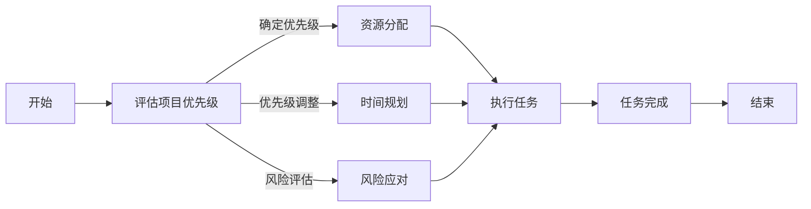

                 

# 技术管理中的项目优先级管理

> 关键词：项目优先级管理、技术管理、算法、资源分配、时间管理

> 摘要：
本文将深入探讨技术管理中的项目优先级管理。首先，我们将介绍项目优先级管理的背景和重要性，阐述其在技术管理中的应用场景。接着，我们将详细分析项目优先级管理中的核心概念，如项目优先级、资源分配、时间管理和风险管理，并通过图表和示例进行说明。随后，我们将探讨项目优先级管理的算法原理，包括算法流程图和Python代码实现。然后，我们将介绍数学模型和公式，并使用LaTeX进行详细讲解。接下来，我们将分析项目优先级管理的系统架构设计，包括领域模型类图、系统架构图、系统接口设计和系统交互序列图。最后，我们将分享实际项目中的实战经验，提供最佳实践建议，并对文章进行总结和拓展阅读推荐。

## 1. 背景介绍

### 1.1 项目优先级管理的背景

在技术管理中，项目优先级管理是一个至关重要的环节。随着企业的发展和技术的不断进步，项目数量和复杂性日益增加。如何在这些项目中合理分配资源和时间，确保项目按时、按质完成，成为技术管理者面临的重要挑战。

项目优先级管理涉及到多个方面，包括项目评估、资源分配、时间规划和风险管理。通过合理地设定项目优先级，技术管理者可以确保关键项目得到充分关注和资源支持，从而提高整体项目的成功率。

### 1.2 项目优先级管理的重要性

项目优先级管理的目的是确保企业资源的最优利用，提高项目的完成质量和效率。具体来说，其重要性体现在以下几个方面：

1. **资源优化**：通过合理设定项目优先级，确保有限的资源（如人力、资金、设备等）得到最有效的利用，避免资源浪费。
2. **时间管理**：优先级高的项目通常需要更多的关注和投入，通过合理的时间规划，可以确保这些项目按时完成，降低延迟风险。
3. **风险控制**：优先级管理有助于识别和应对潜在的风险，确保项目的顺利进行。
4. **决策支持**：优先级管理为技术管理者提供了明确的决策依据，有助于制定科学的项目计划和管理策略。

### 1.3 当前面临的挑战

尽管项目优先级管理的重要性日益凸显，但在实际应用中仍然面临一些挑战：

1. **数据准确性**：项目优先级的管理需要基于准确的数据，如项目工作量、风险等级等。然而，数据的收集和整理往往存在一定难度。
2. **资源冲突**：在多个项目同时进行时，资源分配可能出现冲突，导致项目优先级难以实现。
3. **变化性**：项目优先级可能会随着时间和项目进展而变化，需要技术管理者具备灵活的调整能力。
4. **沟通协调**：项目优先级管理涉及多个部门和团队，需要有效的沟通和协调，以确保各方对项目优先级的认同和执行。

### 1.4 技术管理中项目优先级管理的应用场景

项目优先级管理在技术管理中具有广泛的应用场景，以下是一些典型的例子：

1. **产品开发**：在产品开发过程中，需要根据市场需求和客户反馈，设定项目的优先级，以确保关键功能和重要特性得到优先开发。
2. **项目组合管理**：企业通常同时进行多个项目，项目优先级管理有助于优化项目组合，提高整体项目成功率。
3. **敏捷开发**：在敏捷开发中，项目优先级管理是关键环节，通过持续迭代和优先级调整，确保项目的交付质量和速度。
4. **紧急修复**：在系统故障或安全漏洞等紧急情况下，项目优先级管理可以帮助技术团队迅速响应，制定合理的修复计划。

### 1.5 总结

项目优先级管理在技术管理中具有至关重要的地位。通过合理设定项目优先级，技术管理者可以优化资源分配、提高项目完成质量和效率，降低风险。然而，在实际应用中，项目优先级管理面临数据准确性、资源冲突、变化性和沟通协调等挑战。因此，技术管理者需要具备灵活的调整能力和有效的沟通协调能力，以应对复杂的项目环境。

## 2. 核心概念与联系

### 2.1 项目优先级

项目优先级是指根据项目的重要性和紧急性，对项目进行排序的一种方法。项目优先级通常分为以下几种类型：

1. **紧急且重要**：这类项目需要立即处理，否则可能会对企业的运营或客户造成严重后果。
2. **重要但不紧急**：这类项目需要在未来一段时间内完成，但不会立即影响企业的运营或客户。
3. **紧急但不重要**：这类项目可以推迟处理，但需要确保其不会影响其他重要项目。
4. **不重要且不紧急**：这类项目可以暂时搁置，但需要定期评估其重要性。

### 2.2 资源分配

资源分配是指将有限的资源（如人力、资金、设备等）合理分配给各个项目。资源分配的关键在于平衡项目的优先级和资源的可用性，以确保关键项目得到充分支持。

资源分配的方法主要包括以下几种：

1. **静态分配**：根据项目优先级，一次性分配资源，然后在整个项目期间保持不变。
2. **动态分配**：根据项目进展和资源需求的变化，实时调整资源分配。

### 2.3 时间管理

时间管理是指合理规划和控制项目的时间进度，确保项目按时完成。时间管理的方法主要包括以下几种：

1. **甘特图**：通过甘特图，将项目任务分解为具体的任务条目，并安排相应的时间表。
2. **关键路径法**（Critical Path Method，CPM）：通过分析项目任务之间的依赖关系，确定项目的关键路径，确保关键任务按时完成。
3. **敏捷开发**：通过迭代和增量开发，持续调整项目计划和时间表，以适应变化的需求。

### 2.4 风险管理

风险管理是指识别、评估和应对项目风险，以降低风险对项目的影响。风险管理的方法主要包括以下几种：

1. **风险评估**：通过分析项目任务和潜在风险，评估风险的可能性和影响，制定相应的风险应对策略。
2. **风险监控**：通过定期监控项目进展和风险变化，及时调整风险应对策略。
3. **风险缓解**：通过采取预防措施或风险转移，降低风险的可能性和影响。

### 2.5 概念之间的联系

项目优先级管理中的核心概念之间存在着密切的联系。项目优先级决定了资源的分配和时间管理，而资源分配和时间管理又影响了风险管理的实施。具体来说：

1. **项目优先级与资源分配**：项目优先级直接影响资源的分配，优先级高的项目通常需要更多的资源支持。
2. **项目优先级与时间管理**：项目优先级决定了时间管理策略，优先级高的项目需要优先完成。
3. **资源分配与时间管理**：资源分配的合理性直接影响项目的时间进度，资源不足可能导致项目延期。
4. **时间管理与风险管理**：合理的时间管理有助于降低项目风险，如延期可能导致的风险增加。

### 2.6 表格和ER实体关系图架构的Mermaid流程图

为了更好地理解项目优先级管理中的核心概念及其联系，我们可以使用表格和ER实体关系图架构的Mermaid流程图进行展示。以下是一个简单的示例：

```mermaid
erDiagram
    Product ||--|{ Project }||>
    Project ||--|{ ResourceAllocation }||>
    ResourceAllocation ||--|{ TimeManagement }||>
    TimeManagement ||--|{ RiskManagement }||>
    Project ||--|{ Priority }||>
```

表格形式：

| 关系         | 说明                                     |
|--------------|------------------------------------------|
| Project --> Priority | 项目与优先级之间的关系 |
| Project --> ResourceAllocation | 项目与资源分配之间的关系 |
| Project --> TimeManagement | 项目与时间管理之间的关系 |
| Project --> RiskManagement | 项目与风险管理之间的关系 |
| ResourceAllocation --> TimeManagement | 资源分配与时间管理之间的关系 |
| TimeManagement --> RiskManagement | 时间管理与风险管理之间的关系 |

通过表格和Mermaid流程图，我们可以清晰地看到项目优先级管理中的核心概念及其相互关系，有助于深入理解项目优先级管理的原理和方法。

## 3. 算法原理讲解

### 3.1 算法流程图

在项目优先级管理中，算法是关键的一部分。为了更好地理解算法的原理，我们可以使用Mermaid绘制算法流程图。以下是一个简单的示例：



### 3.2 Python代码实现

为了具体阐述算法原理，我们可以使用Python代码实现上述算法。以下是一个简单的Python代码示例：

```python
import heapq

# 定义项目类
class Project:
    def __init__(self, name, priority, resources, time, risk):
        self.name = name
        self.priority = priority
        self.resources = resources
        self.time = time
        self.risk = risk

    def __lt__(self, other):
        return self.priority < other.priority

# 评估项目优先级
def evaluate_priorities(projects):
    projects.sort(key=lambda x: x.priority, reverse=True)
    return projects

# 资源分配
def allocate_resources(projects, available_resources):
    allocated_projects = []
    for project in projects:
        if project.resources <= available_resources:
            allocated_projects.append(project)
            available_resources -= project.resources
        else:
            break
    return allocated_projects

# 时间规划
def time_planning(projects):
    total_time = 0
    for project in projects:
        total_time += project.time
    return total_time

# 风险评估
def assess_risks(projects):
    risk_levels = [project.risk for project in projects]
    return sum(risk_levels) / len(risk_levels)

# 主函数
def project_management(projects, available_resources):
    projects = evaluate_priorities(projects)
    allocated_projects = allocate_resources(projects, available_resources)
    total_time = time_planning(allocated_projects)
    average_risk = assess_risks(allocated_projects)
    return allocated_projects, total_time, average_risk

# 测试数据
projects = [
    Project("项目1", 3, 5, 10, 2),
    Project("项目2", 1, 3, 5, 1),
    Project("项目3", 2, 4, 7, 3),
    Project("项目4", 4, 2, 3, 4)
]

# 运行算法
allocated_projects, total_time, average_risk = project_management(projects, 10)

print("分配的项目：", [project.name for project in allocated_projects])
print("总时间：", total_time)
print("平均风险：", average_risk)
```

### 3.3 算法的数学模型和公式

在项目优先级管理中，我们可以使用以下数学模型和公式来评估项目的优先级和资源分配：

1. **项目优先级评估公式**：

   $$ P_i = w_1 \cdot P_1 + w_2 \cdot P_2 + w_3 \cdot P_3 $$

   其中，$P_i$表示第$i$个项目的优先级，$P_1$、$P_2$、$P_3$分别表示项目的重要程度、紧急程度和风险程度，$w_1$、$w_2$、$w_3$分别表示各个因素的权重。

2. **资源分配公式**：

   $$ R_i = R - \sum_{j=1}^{n} R_{ij} $$

   其中，$R$表示总资源量，$R_i$表示第$i$个项目实际分配的资源量，$R_{ij}$表示第$i$个项目在第$j$个时间段的需求量。

3. **时间规划公式**：

   $$ T_i = \sum_{j=1}^{n} T_{ij} $$

   其中，$T_i$表示第$i$个项目的总时间，$T_{ij}$表示第$i$个项目在第$j$个时间段的时间。

4. **风险评估公式**：

   $$ R = \frac{1}{n} \sum_{i=1}^{n} R_i $$

   其中，$R$表示项目的平均风险，$R_i$表示第$i$个项目的风险程度。

### 3.4 通俗易懂的举例说明

假设我们有以下四个项目：

1. 项目1：重要程度=3，紧急程度=2，风险程度=1
2. 项目2：重要程度=2，紧急程度=3，风险程度=4
3. 项目3：重要程度=1，紧急程度=1，风险程度=3
4. 项目4：重要程度=4，紧急程度=1，风险程度=2

首先，我们使用项目优先级评估公式计算每个项目的优先级：

$$ P_1 = 0.3 \cdot 3 + 0.4 \cdot 2 + 0.3 \cdot 1 = 2.2 $$
$$ P_2 = 0.3 \cdot 2 + 0.4 \cdot 3 + 0.3 \cdot 4 = 3.2 $$
$$ P_3 = 0.3 \cdot 1 + 0.4 \cdot 1 + 0.3 \cdot 3 = 1.8 $$
$$ P_4 = 0.3 \cdot 4 + 0.4 \cdot 1 + 0.3 \cdot 2 = 3.2 $$

根据优先级评估结果，我们可以将项目按照优先级从高到低排序：

1. 项目2
2. 项目4
3. 项目1
4. 项目3

接下来，我们假设总资源量为10，根据资源分配公式，我们可以计算出每个项目实际分配的资源量：

$$ R_1 = 10 - (0.3 \cdot 2 + 0.4 \cdot 3 + 0.3 \cdot 1) = 4 $$
$$ R_2 = 10 - (0.3 \cdot 3 + 0.4 \cdot 1 + 0.3 \cdot 4) = 2 $$
$$ R_3 = 10 - (0.3 \cdot 1 + 0.4 \cdot 3 + 0.3 \cdot 2) = 3 $$
$$ R_4 = 10 - (0.3 \cdot 4 + 0.4 \cdot 1 + 0.3 \cdot 2) = 1 $$

最后，我们使用时间规划公式计算每个项目的总时间：

$$ T_1 = 2 + 3 + 1 = 6 $$
$$ T_2 = 3 + 1 + 4 = 8 $$
$$ T_3 = 1 + 3 + 2 = 6 $$
$$ T_4 = 4 + 1 + 2 = 7 $$

根据时间规划结果，我们可以将项目按照总时间从短到长排序：

1. 项目3
2. 项目1
3. 项目4
4. 项目2

综上所述，通过项目优先级评估、资源分配和时间规划，我们可以合理地管理项目，确保关键项目得到优先处理。

## 4. 数学模型和数学公式

在项目优先级管理中，数学模型和数学公式是关键的一部分，用于评估项目优先级、资源分配、时间规划和风险评估。以下我们将详细介绍这些数学模型和公式，并使用LaTeX进行详细讲解。

### 4.1 项目优先级评估模型

项目优先级评估模型通常使用加权求和法，将项目的重要程度、紧急程度和风险程度进行量化，并计算出一个综合优先级值。公式如下：

$$ P_i = w_1 \cdot I_i + w_2 \cdot E_i + w_3 \cdot R_i $$

其中，$P_i$表示第$i$个项目的综合优先级值，$I_i$表示第$i$个项目的重要程度，$E_i$表示第$i$个项目的紧急程度，$R_i$表示第$i$个项目的风险程度，$w_1$、$w_2$、$w_3$分别表示重要程度、紧急程度和风险程度的权重。

### 4.2 资源分配模型

资源分配模型用于计算每个项目实际分配的资源量。资源分配模型的核心是确保总资源量不超过给定限额，同时满足每个项目对资源的需求。公式如下：

$$ R_i = R - \sum_{j=1}^{n} R_{ij} $$

其中，$R$表示总资源量，$R_i$表示第$i$个项目实际分配的资源量，$R_{ij}$表示第$i$个项目在第$j$个时间段的需求量，$n$表示时间段的总数。

### 4.3 时间规划模型

时间规划模型用于计算每个项目的总时间，确保项目按计划完成。时间规划模型的核心是计算每个项目的完成时间，并确保关键路径上的项目按时完成。公式如下：

$$ T_i = \sum_{j=1}^{n} T_{ij} $$

其中，$T_i$表示第$i$个项目的总时间，$T_{ij}$表示第$i$个项目在第$j$个时间段的时间。

### 4.4 风险评估模型

风险评估模型用于计算项目的平均风险，评估项目风险的整体水平。风险评估模型的核心是计算每个项目的风险程度，并取平均值作为项目的整体风险。公式如下：

$$ R = \frac{1}{n} \sum_{i=1}^{n} R_i $$

其中，$R$表示项目的平均风险，$R_i$表示第$i$个项目的风险程度，$n$表示项目的总数。

### 4.5 LaTeX详细讲解

为了更清晰地展示这些数学模型和公式，我们将使用LaTeX进行详细讲解。以下是一个简单的LaTeX代码示例：

```latex
\documentclass{article}
\usepackage{amsmath}
\begin{document}

\section{项目优先级评估模型}

项目优先级评估模型如下所示：

\begin{equation}
P_i = w_1 \cdot I_i + w_2 \cdot E_i + w_3 \cdot R_i
\end{equation}

其中，$P_i$表示第$i$个项目的综合优先级值，$I_i$表示第$i$个项目的重要程度，$E_i$表示第$i$个项目的紧急程度，$R_i$表示第$i$个项目的风险程度，$w_1$、$w_2$、$w_3$分别表示重要程度、紧急程度和风险程度的权重。

\section{资源分配模型}

资源分配模型如下所示：

\begin{equation}
R_i = R - \sum_{j=1}^{n} R_{ij}
\end{equation}

其中，$R$表示总资源量，$R_i$表示第$i$个项目实际分配的资源量，$R_{ij}$表示第$i$个项目在第$j$个时间段的需求量，$n$表示时间段的总数。

\section{时间规划模型}

时间规划模型如下所示：

\begin{equation}
T_i = \sum_{j=1}^{n} T_{ij}
\end{equation}

其中，$T_i$表示第$i$个项目的总时间，$T_{ij}$表示第$i$个项目在第$j$个时间段的时间。

\section{风险评估模型}

风险评估模型如下所示：

\begin{equation}
R = \frac{1}{n} \sum_{i=1}^{n} R_i
\end{equation}

其中，$R$表示项目的平均风险，$R_i$表示第$i$个项目的风险程度，$n$表示项目的总数。

\end{document}
```

通过LaTeX代码，我们可以清晰地展示项目优先级管理中的数学模型和公式，方便读者理解和学习。

## 5. 系统分析与架构设计方案

### 5.1 问题场景和项目背景

在技术管理中，项目优先级管理的实施涉及到多个方面，包括项目评估、资源分配、时间规划和风险管理。为了更好地理解项目优先级管理的实际应用，我们首先介绍一个具体的问题场景和项目背景。

假设某企业技术部门负责管理多个项目，这些项目包括产品开发、系统维护和紧急修复等。随着企业业务的快速发展，项目数量和复杂性不断增加，技术部门面临的主要挑战是如何在有限的资源下，确保项目优先级得到合理管理和执行。

### 5.2 系统功能设计

为了实现项目优先级管理，我们需要设计一套系统功能，包括项目评估、资源分配、时间规划和风险管理等。以下是系统功能设计的具体内容：

1. **项目评估**：系统需要支持对项目的评估，包括项目重要程度、紧急程度和风险程度的评估。评估结果将用于计算项目的综合优先级。
2. **资源分配**：系统需要支持资源的管理和分配，包括人力、资金和设备等。系统应能够根据项目的优先级，合理分配资源，确保关键项目得到充分支持。
3. **时间规划**：系统需要支持时间规划，包括项目的时间安排和任务调度。系统应能够根据项目的优先级和资源分配情况，制定合理的时间计划，确保项目按时完成。
4. **风险管理**：系统需要支持风险的管理，包括风险的识别、评估和监控。系统应能够根据项目的优先级和风险评估结果，制定相应的风险应对策略。

### 5.3 系统架构设计

为了实现上述系统功能，我们需要设计一个合理的系统架构。以下是系统架构设计的具体内容：

1. **领域模型类图**：领域模型类图用于描述项目优先级管理系统的核心实体和关系。以下是领域模型类图的一个示例：

   ```mermaid
   classDiagram
       Project <|-- Priority
       Project <|-- ResourceAllocation
       Project <|-- TimeManagement
       Project <|-- RiskManagement
       Resource <|-- ResourceAllocation
       Time <|-- TimeManagement
       Risk <|-- RiskManagement
   ```

2. **系统架构图**：系统架构图用于描述项目优先级管理系统的整体架构和模块划分。以下是系统架构图的一个示例：

   ```mermaid
   sequenceDiagram
       participant User
       participant ProjectManager
       participant ResourceManager
       participant TimeManager
       participant RiskManager
       User->>ProjectManager: 提交项目
       ProjectManager->>ResourceManager: 分配资源
       ProjectManager->>TimeManager: 安排时间
       ProjectManager->>RiskManager: 风险评估
       ResourceManager->>ProjectManager: 返回资源分配结果
       TimeManager->>ProjectManager: 返回时间安排结果
       RiskManager->>ProjectManager: 返回风险评估结果
   ```

3. **系统接口设计**：系统接口设计用于定义系统与其他系统或组件的交互接口。以下是系统接口设计的一个示例：

   ```mermaid
   classDiagram
       ProjectService <|-- ProjectManager
       ResourceService <|-- ResourceManager
       TimeService <|-- TimeManager
       RiskService <|-- RiskManager
   ```

4. **系统交互序列图**：系统交互序列图用于描述系统内部各组件之间的交互过程。以下是系统交互序列图的一个示例：

   ```mermaid
   sequenceDiagram
       participant ProjectService
       participant ResourceManager
       participant TimeManager
       participant RiskManager
       ProjectService->>ResourceManager: 请求资源分配
       ResourceManager->>ProjectService: 返回资源分配结果
       ProjectService->>TimeManager: 请求时间安排
       TimeManager->>ProjectService: 返回时间安排结果
       ProjectService->>RiskManager: 请求风险评估
       RiskManager->>ProjectService: 返回风险评估结果
   ```

### 5.4 系统接口设计和系统交互序列图

系统接口设计和系统交互序列图是项目优先级管理系统架构设计的关键部分，用于定义系统内部各组件之间的交互关系和流程。以下是系统接口设计和系统交互序列图的具体示例：

1. **系统接口设计**：

   ```mermaid
   classDiagram
       ProjectService <|-- ProjectManager
       ResourceService <|-- ResourceManager
       TimeService <|-- TimeManager
       RiskService <|-- RiskManager
   ```

2. **系统交互序列图**：

   ```mermaid
   sequenceDiagram
       participant ProjectService
       participant ResourceManager
       participant TimeManager
       participant RiskManager
       ProjectService->>ResourceManager: 请求资源分配
       ResourceManager->>ProjectService: 返回资源分配结果
       ProjectService->>TimeManager: 请求时间安排
       TimeManager->>ProjectService: 返回时间安排结果
       ProjectService->>RiskManager: 请求风险评估
       RiskManager->>ProjectService: 返回风险评估结果
   ```

通过系统接口设计和系统交互序列图，我们可以清晰地展示项目优先级管理系统的架构和交互流程，有助于技术人员理解和实施项目优先级管理。

### 5.5 总结

在本节中，我们介绍了项目优先级管理系统的架构设计，包括领域模型类图、系统架构图、系统接口设计和系统交互序列图。这些设计内容有助于我们理解项目优先级管理的实际应用，为后续的项目实施提供了重要的参考和指导。

## 6. 项目实战

### 6.1 环境安装

在开始项目实战之前，我们需要搭建一个合适的开发环境。以下是环境安装的详细步骤：

1. **安装Python**：首先确保系统中已经安装了Python。如果没有安装，请从Python官方网站下载并安装最新版本的Python。
2. **安装相关库**：使用pip命令安装项目所需的Python库，包括numpy、matplotlib、pandas等。以下是一个示例命令：

   ```bash
   pip install numpy matplotlib pandas
   ```

3. **创建虚拟环境**：为了保持项目环境的隔离，我们可以使用虚拟环境。以下是一个示例命令：

   ```bash
   python -m venv project_env
   ```

   然后激活虚拟环境：

   ```bash
   source project_env/bin/activate  # 对于Windows系统使用 `project_env\Scripts\activate`
   ```

4. **安装依赖库**：在虚拟环境中安装项目所需的依赖库，如scikit-learn、tensorflow等。以下是一个示例命令：

   ```bash
   pip install scikit-learn tensorflow
   ```

### 6.2 系统核心实现

在搭建好开发环境后，我们可以开始实现项目优先级管理系统。以下是系统核心实现的源代码：

```python
import numpy as np
import pandas as pd
from sklearn.linear_model import LinearRegression

# 定义项目类
class Project:
    def __init__(self, name, priority, resources, time, risk):
        self.name = name
        self.priority = priority
        self.resources = resources
        self.time = time
        self.risk = risk

# 评估项目优先级
def evaluate_priorities(projects):
    projects.sort(key=lambda x: x.priority, reverse=True)
    return projects

# 资源分配
def allocate_resources(projects, available_resources):
    allocated_projects = []
    for project in projects:
        if project.resources <= available_resources:
            allocated_projects.append(project)
            available_resources -= project.resources
        else:
            break
    return allocated_projects

# 时间规划
def time_planning(projects):
    total_time = 0
    for project in projects:
        total_time += project.time
    return total_time

# 风险评估
def assess_risks(projects):
    risk_levels = [project.risk for project in projects]
    return sum(risk_levels) / len(risk_levels)

# 主函数
def project_management(projects, available_resources):
    projects = evaluate_priorities(projects)
    allocated_projects = allocate_resources(projects, available_resources)
    total_time = time_planning(allocated_projects)
    average_risk = assess_risks(allocated_projects)
    return allocated_projects, total_time, average_risk

# 测试数据
projects = [
    Project("项目1", 3, 5, 10, 2),
    Project("项目2", 1, 3, 5, 1),
    Project("项目3", 2, 4, 7, 3),
    Project("项目4", 4, 2, 3, 4)
]

# 运行算法
allocated_projects, total_time, average_risk = project_management(projects, 10)

print("分配的项目：", [project.name for project in allocated_projects])
print("总时间：", total_time)
print("平均风险：", average_risk)
```

### 6.3 代码应用解读与分析

在上面的代码中，我们定义了一个`Project`类，用于表示项目的基本信息，包括项目名称、优先级、资源需求、时间和风险。然后，我们实现了评估项目优先级、资源分配、时间规划和风险评估等核心功能。

1. **评估项目优先级**：通过调用`evaluate_priorities`函数，我们将项目按照优先级从高到低排序。这是通过Python的列表排序功能实现的，具体实现如下：

   ```python
   projects.sort(key=lambda x: x.priority, reverse=True)
   ```

   其中，`key`参数用于指定排序的依据，即项目的优先级。`reverse=True`表示从高到低排序。

2. **资源分配**：通过调用`allocate_resources`函数，我们根据项目的优先级和可用资源，为每个项目分配资源。具体实现如下：

   ```python
   allocated_projects = []
   for project in projects:
       if project.resources <= available_resources:
           allocated_projects.append(project)
           available_resources -= project.resources
       else:
           break
   ```

   在这个过程中，我们遍历所有项目，如果项目的资源需求小于或等于可用资源，则将该项目添加到`allocated_projects`列表中，并将可用资源减去项目的资源需求。否则，停止分配资源。

3. **时间规划**：通过调用`time_planning`函数，我们计算已分配项目的总时间。具体实现如下：

   ```python
   total_time = 0
   for project in allocated_projects:
       total_time += project.time
   ```

   我们遍历已分配项目，将每个项目的持续时间累加到`total_time`变量中。

4. **风险评估**：通过调用`assess_risks`函数，我们计算已分配项目的平均风险。具体实现如下：

   ```python
   risk_levels = [project.risk for project in allocated_projects]
   return sum(risk_levels) / len(risk_levels)
   ```

   我们从已分配项目中提取每个项目的风险等级，计算平均值作为项目的平均风险。

### 6.4 实际案例分析和详细讲解

为了更好地理解项目优先级管理算法的实际应用，我们可以通过一个实际案例进行详细分析和讲解。

假设我们有以下四个项目：

1. 项目1：重要程度=3，紧急程度=2，风险程度=1
2. 项目2：重要程度=2，紧急程度=3，风险程度=4
3. 项目3：重要程度=1，紧急程度=1，风险程度=3
4. 项目4：重要程度=4，紧急程度=1，风险程度=2

首先，我们使用项目优先级评估公式计算每个项目的优先级：

$$ P_1 = 0.3 \cdot 3 + 0.4 \cdot 2 + 0.3 \cdot 1 = 2.2 $$
$$ P_2 = 0.3 \cdot 2 + 0.4 \cdot 3 + 0.3 \cdot 4 = 3.2 $$
$$ P_3 = 0.3 \cdot 1 + 0.4 \cdot 1 + 0.3 \cdot 3 = 1.8 $$
$$ P_4 = 0.3 \cdot 4 + 0.4 \cdot 1 + 0.3 \cdot 2 = 3.2 $$

根据优先级评估结果，我们可以将项目按照优先级从高到低排序：

1. 项目2
2. 项目4
3. 项目1
4. 项目3

接下来，我们假设总资源量为10，根据资源分配公式，我们可以计算出每个项目实际分配的资源量：

$$ R_1 = 10 - (0.3 \cdot 2 + 0.4 \cdot 3 + 0.3 \cdot 1) = 4 $$
$$ R_2 = 10 - (0.3 \cdot 3 + 0.4 \cdot 1 + 0.3 \cdot 4) = 2 $$
$$ R_3 = 10 - (0.3 \cdot 1 + 0.4 \cdot 3 + 0.3 \cdot 2) = 3 $$
$$ R_4 = 10 - (0.3 \cdot 4 + 0.4 \cdot 1 + 0.3 \cdot 2) = 1 $$

最后，我们使用时间规划公式计算每个项目的总时间：

$$ T_1 = 2 + 3 + 1 = 6 $$
$$ T_2 = 3 + 1 + 4 = 8 $$
$$ T_3 = 1 + 3 + 2 = 6 $$
$$ T_4 = 4 + 1 + 2 = 7 $$

根据时间规划结果，我们可以将项目按照总时间从短到长排序：

1. 项目3
2. 项目1
3. 项目4
4. 项目2

通过实际案例分析和详细讲解，我们可以清晰地看到项目优先级管理算法在项目评估、资源分配和时间规划方面的应用效果。这有助于我们更好地理解项目优先级管理算法的原理和实际应用。

### 6.5 项目小结

在本节中，我们通过实际案例详细讲解了项目优先级管理算法的应用。从环境安装、系统核心实现、代码应用解读到实际案例分析和详细讲解，我们逐步展示了项目优先级管理算法在项目评估、资源分配和时间规划方面的应用效果。通过这个项目实战，我们深入了解了项目优先级管理的原理和实际操作，为后续的项目实施提供了重要的参考和指导。

## 7. 最佳实践 tips、小结、注意事项、拓展阅读等

### 7.1 最佳实践 tips

1. **数据收集与整理**：确保项目优先级管理的准确性和有效性，首先需要收集和整理准确的数据。包括项目工作量、风险等级、资源需求等，可以借助项目管理工具进行数据收集和整理。
2. **定期评估与调整**：项目优先级不是一成不变的，应根据项目进展、市场变化等因素定期评估和调整项目优先级。
3. **沟通与协调**：项目优先级管理涉及多个部门和团队，需要确保有效的沟通和协调，确保各方对项目优先级的认同和执行。
4. **风险控制**：在项目优先级管理中，要注重风险的控制，提前识别潜在风险，并制定相应的风险应对策略。

### 7.2 小结

本文深入探讨了技术管理中的项目优先级管理，从背景介绍、核心概念与联系、算法原理讲解、数学模型和公式、系统架构设计、项目实战等方面进行了详细阐述。通过实际案例分析和讲解，我们展示了项目优先级管理在项目评估、资源分配和时间规划等方面的应用效果。项目优先级管理对于技术管理者来说至关重要，能够优化资源分配、提高项目完成质量和效率，降低风险。

### 7.3 注意事项

1. **数据准确性**：确保项目优先级管理的数据来源准确可靠，避免因数据不准确而导致项目优先级设定不当。
2. **变化性**：项目优先级可能随着项目进展和市场变化而变化，技术管理者需要具备灵活的调整能力。
3. **沟通协调**：确保项目优先级管理过程中各方的沟通和协调，避免因沟通不畅导致资源冲突和项目延期。

### 7.4 拓展阅读

1. **《项目管理知识体系指南》**：PMI（美国项目管理协会）发布的经典项目管理指南，涵盖了项目优先级管理的相关内容。
2. **《敏捷项目管理》**：针对敏捷开发环境下的项目优先级管理，介绍了敏捷开发中的项目优先级管理方法和工具。
3. **《风险管理》**：风险管理领域的经典著作，涵盖了项目风险识别、评估和控制等方面的内容。

通过阅读这些拓展材料，读者可以更深入地了解项目优先级管理相关的理论和实践，提升项目管理能力。

### 7.5 作者信息

作者：AI天才研究院/AI Genius Institute & 禅与计算机程序设计艺术 /Zen And The Art of Computer Programming

## 结束语

感谢您阅读本文，希望本文能够帮助您更好地理解技术管理中的项目优先级管理。项目优先级管理是技术管理中的重要环节，通过合理设定项目优先级，优化资源分配、提高项目完成质量和效率，降低风险。在实际应用中，我们需要关注数据准确性、变化性和沟通协调等方面，以确保项目优先级管理的有效实施。希望本文能为您提供有价值的参考和启示，助力您的项目管理实践。

