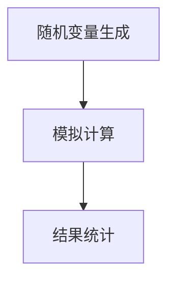
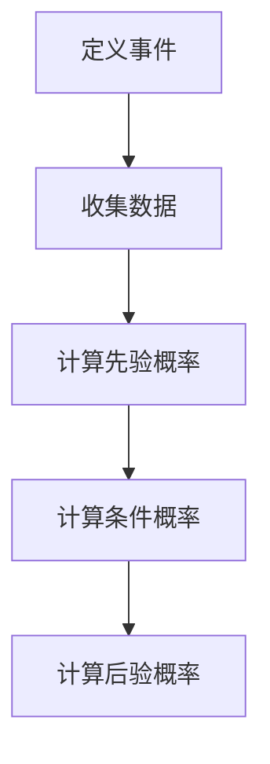
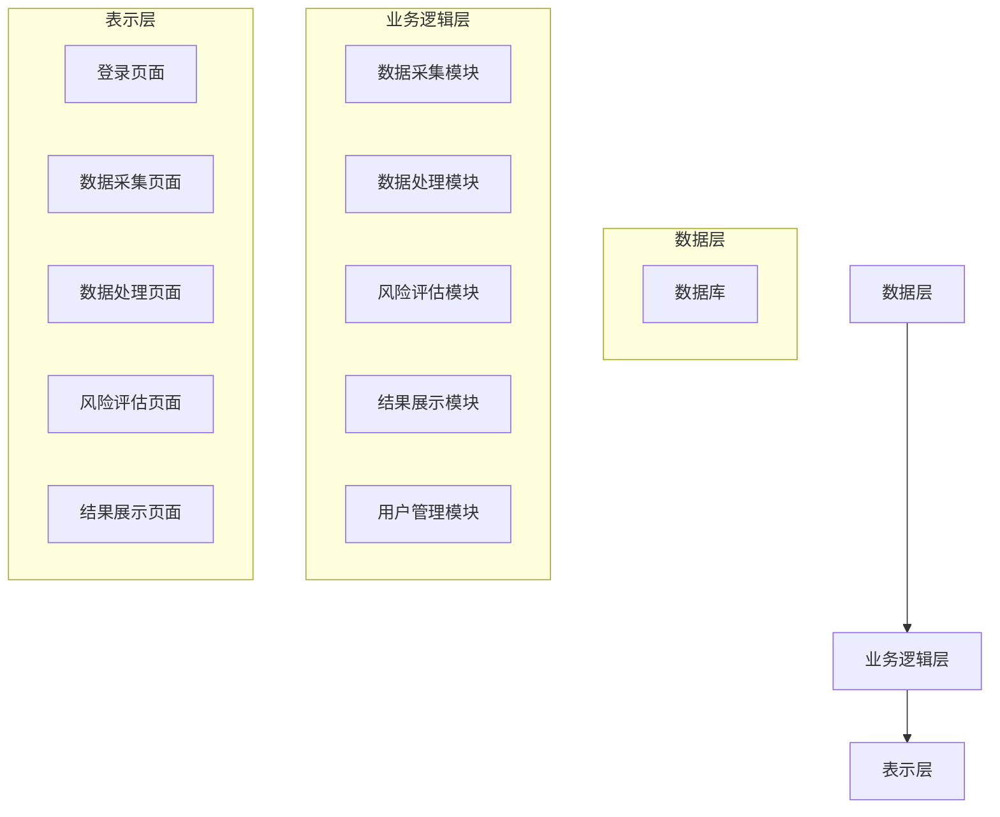
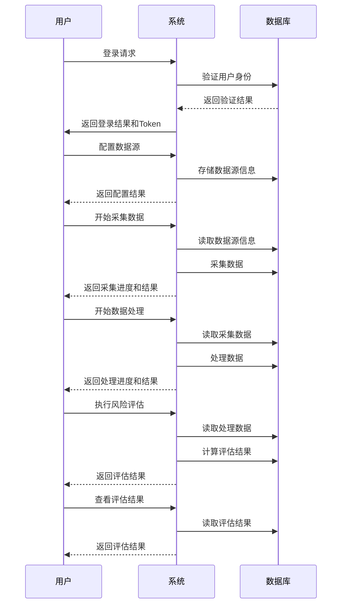

                 

### 引言

#### 1.1 研究背景

在当前信息化和数字化浪潮的推动下，技术管理已经成为企业和组织管理的重要组成部分。技术管理不仅涉及技术项目的规划、执行和监控，还包括对技术风险的管理。技术风险是指在技术项目的开发和部署过程中，由于技术的不确定性、复杂性、外部环境变化等因素，可能导致项目延误、成本超支、系统崩溃等问题。因此，如何有效地进行风险评估和管理成为技术管理中的一个关键问题。

风险评估作为一种重要的管理工具，其目的是通过系统的方法识别、分析和评估项目中的潜在风险，并采取相应的应对措施，以减少风险对项目的影响。在现代技术管理中，风险评估方法的应用已经得到广泛认可，例如在软件工程、系统架构设计、系统集成与部署、持续集成与持续部署等方面。

随着技术的不断发展，风险评估方法也在不断演进。传统的风险评估方法主要依赖于专家的经验和主观判断，而现代风险评估方法则更加注重数据分析和模型化。例如，蒙特卡洛模拟、贝叶斯风险评估等算法的引入，使得风险评估更加科学和精确。此外，随着人工智能和大数据技术的发展，风险评估方法也逐渐向智能化和自动化方向迈进。

#### 1.2 研究目的与意义

本研究的目的是探讨和总结技术管理中的风险评估方法，旨在提高技术项目的成功率和效率。具体目标如下：

1. **理解风险评估的基本概念和原理**：通过对风险评估的定义、分类和基本流程的介绍，使读者对风险评估有一个全面和清晰的认识。
   
2. **比较和评估不同的风险评估方法**：通过对定性、定量和定性与定量结合方法的分析，帮助读者了解不同方法的优缺点，从而选择合适的方法。

3. **阐述风险评估在技术管理中的应用**：通过具体案例分析，展示风险评估在技术项目中的实际应用，提高读者对风险评估价值的认识。

4. **提供风险评估的实践指南**：结合具体算法和数学模型，提供风险评估的实施步骤和操作指南，帮助读者在实际项目中应用风险评估方法。

研究意义主要体现在以下几个方面：

1. **提高技术项目的成功率**：通过有效的风险评估，可以提前识别和应对潜在风险，减少项目延误和成本超支，从而提高项目的成功率。

2. **提升技术管理的效率**：风险评估作为一种系统化的管理工具，可以帮助管理者更好地规划和控制项目，提高管理的效率和效果。

3. **推动技术管理理论的发展**：通过对风险评估方法的研究和总结，可以促进技术管理理论的完善和发展，为后续研究提供理论基础。

#### 1.3 边界与外延

风险评估的定义与分类：

- **风险评估**：是一种系统化和规范化的方法，用于识别、分析和评估项目中的潜在风险。
- **定性风险评估**：主要依赖于专家的主观判断和经验，通过描述性语言对风险进行分类和评估。
- **定量风险评估**：通过数据分析和数学模型，对风险的概率和影响进行量化和评估。
- **定性与定量结合方法**：将定性和定量的方法结合起来，以实现更全面和准确的风险评估。

技术管理的核心要素：

- **项目规划**：包括项目目标、范围、时间、成本等方面的规划。
- **项目执行**：包括项目团队的组织、任务分配、进度控制等方面的实施。
- **项目监控**：对项目过程和结果进行监控和评估，以确保项目按照计划进行。

#### 1.4 本书结构安排

本书分为四个主要部分，分别是：

1. **引言**：介绍研究背景、目的与意义，以及本书的结构安排。
2. **核心概念与联系**：详细阐述风险评估的基本概念、方法和技术管理中的风险评估。
3. **算法原理讲解**：介绍常见风险评估算法、数学模型以及算法应用场景。
4. **系统分析与架构设计**：展示系统分析与架构设计的过程，包括系统功能设计、架构设计、接口设计和系统交互。

#### 1.5 本章小结

本章首先介绍了技术管理中的风险评估方法的研究背景和意义，然后明确了研究的边界与外延，最后对本书的结构安排进行了概述。通过对本章内容的理解，读者可以初步了解风险评估在技术管理中的重要性，以及本书的主要内容框架。

### 第一部分：核心概念与联系

#### 2.1 风险评估基本概念

风险评估是项目管理中不可或缺的一部分，尤其是在技术管理领域。为了更好地理解风险评估，首先需要了解其基本概念，包括风险识别、风险评估和风险应对策略。

##### 2.1.1 风险识别

风险识别是风险评估的第一步，旨在识别项目中可能存在的各种潜在风险。风险识别的过程通常包括以下几个方面：

1. **经验识别**：通过团队成员的经验和知识，识别项目中的潜在风险。
2. **资料收集**：收集项目相关的文档、历史数据等信息，以便识别潜在风险。
3. **专家咨询**：邀请相关领域的专家，通过讨论和咨询，识别潜在风险。
4. **问卷调查**：通过问卷调查的方式，收集项目团队成员和其他相关人员的意见和看法，识别潜在风险。

在风险识别过程中，常用的工具和技术包括：

- **头脑风暴**：通过集体讨论，迅速识别潜在风险。
- **故障树分析（FTA）**：通过构建故障树，识别项目中的潜在风险和故障原因。
- **SWOT分析**：通过分析项目的优势、劣势、机会和威胁，识别潜在风险。

##### 2.1.2 风险评估

风险评估是在风险识别的基础上，对识别出的潜在风险进行评估和分析。风险评估的过程通常包括以下几个步骤：

1. **风险分类**：根据风险的特征和影响范围，对风险进行分类。
2. **风险分析**：分析每个风险的发生概率、影响程度和可能带来的损失。
3. **风险优先级排序**：根据风险的发生概率和影响程度，对风险进行优先级排序。
4. **制定应对策略**：根据风险评估结果，制定相应的应对策略，以减少风险对项目的影响。

在风险评估过程中，常用的工具和技术包括：

- **风险矩阵**：通过风险矩阵，对风险的发生概率和影响程度进行量化评估。
- **敏感性分析**：分析项目变量对风险的影响程度，以确定哪些变量对项目成功最为关键。
- **决策树**：通过决策树，分析不同决策路径下的风险和收益，以确定最佳决策。

##### 2.1.3 风险应对策略

风险应对策略是在风险评估的基础上，针对识别出的风险，制定相应的应对措施。风险应对策略的制定需要考虑以下几个方面：

1. **风险避免**：通过调整项目计划，避免风险的发生。
2. **风险减轻**：通过采取预防措施，减轻风险的发生概率或影响程度。
3. **风险转移**：通过保险或其他方式，将风险转移给其他方。
4. **风险接受**：对于无法避免或转移的风险，接受其存在，并制定相应的应急计划。

在制定风险应对策略时，需要考虑以下几个因素：

- **风险类型**：不同的风险类型需要不同的应对策略。
- **资源限制**：应对策略的制定需要考虑资源的限制，包括人力、物力和财力。
- **时间限制**：应对策略的制定需要考虑项目的时间限制，确保在项目期限内完成。

#### 2.2 风险评估方法比较

风险评估方法的选择取决于项目的具体需求和特点。目前，常用的风险评估方法主要包括定性方法、定量方法和定性与定量结合方法。下面将对这三种方法进行详细比较。

##### 2.2.1 定性方法

定性方法主要依赖于专家的主观判断和经验，通过对风险的描述性评估来进行风险评估。定性方法的主要优点是简单、直观，适用于风险较为简单或风险程度较低的项目。常见的定性方法包括：

1. **风险矩阵**：通过风险矩阵，对风险的发生概率和影响程度进行定性的评估。
2. **风险优先级排序**：根据风险的发生概率和影响程度，对风险进行排序，以便优先应对。
3. **SWOT分析**：通过分析项目的优势、劣势、机会和威胁，识别潜在风险。

定性方法的缺点是主观性较强，评估结果可能受到专家个人经验、知识和判断的影响，导致评估结果不准确。

##### 2.2.2 定量方法

定量方法主要依赖于数据和数学模型，通过对风险进行量化的评估来进行风险评估。定量方法的主要优点是客观、准确，适用于风险较为复杂或风险程度较高的项目。常见的定量方法包括：

1. **蒙特卡洛模拟**：通过模拟随机事件，计算风险的发生概率和影响程度。
2. **贝叶斯风险评估**：通过贝叶斯公式，计算风险的概率和影响程度。
3. **回归分析**：通过回归模型，分析项目变量对风险的影响程度。

定量方法的缺点是需要大量的数据支持，并且对数学模型的要求较高，否则可能无法得到准确的结果。

##### 2.2.3 定性与定量结合方法

定性与定量结合方法是将定性方法和定量方法结合起来，以实现更全面和准确的风险评估。这种方法的主要优点是既考虑了专家的主观判断，又利用了数据的客观评估，适用于风险复杂、程度较高的项目。常见的结合方法包括：

1. **综合评估法**：将定性评估和定量评估的结果进行综合，以确定最终的风险评估结果。
2. **层次分析法（AHP）**：通过层次分析法，将定性评估和定量评估的结果进行权重分配，以确定最终的风险评估结果。
3. **模糊综合评估法**：通过模糊综合评估法，将定性评估和定量评估的结果进行模糊处理，以确定最终的风险评估结果。

#### 2.3 技术管理中的风险评估方法

在技术管理中，风险评估方法的运用至关重要。以下是技术管理中常用的风险评估方法及其应用：

##### 2.3.1 风险评估流程

风险评估流程是技术管理中的一项重要任务，它包括以下几个步骤：

1. **风险识别**：通过头脑风暴、故障树分析和SWOT分析等方法，识别项目中可能存在的潜在风险。
2. **风险分析**：对识别出的风险进行详细分析，包括风险的发生概率、影响程度和可能带来的损失。
3. **风险评估**：根据风险分析的结果，对风险进行优先级排序，并制定相应的应对策略。
4. **风险监控**：对评估出的风险进行持续监控，以确保风险应对策略的有效性。

在风险评估流程中，常用的工具和技术包括风险矩阵、敏感性分析和决策树等。

##### 2.3.2 关键因素分析

关键因素分析是风险评估流程中的一个重要步骤，它旨在确定项目中的关键风险因素。关键因素分析的方法包括：

1. **故障模式与影响分析（FMEA）**：通过分析项目的故障模式和影响，确定项目中的关键风险因素。
2. **失效模式与效果分析（MFMEA）**：通过分析项目的失效模式和效果，确定项目中的关键风险因素。
3. **关键路径分析**：通过分析项目的时间安排，确定项目中的关键路径和关键风险因素。

在关键因素分析中，常用的工具和技术包括故障树分析、敏感性分析和决策树等。

#### 2.4 本章小结

本章首先介绍了风险评估的基本概念，包括风险识别、风险评估和风险应对策略。然后，比较了定性方法、定量方法和定性与定量结合方法的优缺点。最后，阐述了技术管理中常用的风险评估方法及其应用。通过对本章内容的理解，读者可以全面了解风险评估的基本概念和方法，为后续章节的学习打下基础。

### 第三部分：算法原理讲解

在技术管理中的风险评估方法中，算法原理讲解是核心内容之一。本章节将详细介绍几种常见风险评估算法的原理，包括蒙特卡洛模拟和贝叶斯风险评估。同时，还将对风险评估的数学模型和公式进行详细解析，并通过具体案例进行说明。

#### 3.1 常见风险评估算法

##### 3.1.1 蒙特卡洛模拟

蒙特卡洛模拟是一种基于概率统计的数值模拟方法，它通过生成大量随机样本，来模拟和分析系统的随机行为。在风险评估中，蒙特卡洛模拟主要用于计算风险的概率分布和累积分布函数。

**算法原理**

蒙特卡洛模拟的基本原理是随机抽样。具体步骤如下：

1. **随机变量生成**：根据风险因素的概率分布，生成随机变量。
2. **模拟计算**：将生成的随机变量代入风险评估模型，进行模拟计算。
3. **结果统计**：对模拟结果进行统计分析，得到风险的概率分布和累积分布函数。

**mermaid流程图**



**Python源代码实现**

```python
import numpy as np

# 生成随机变量
def generate_random_variables():
    # 假设风险因素X服从正态分布
    mean = 0
    std = 1
    X = np.random.normal(mean, std, size=1000)
    return X

# 模拟计算
def simulate_computation(X):
    # 假设风险评估模型为简单线性模型
    model = lambda x: x * 2
    Y = model(X)
    return Y

# 结果统计
def result_statistics(Y):
    # 计算概率分布和累积分布函数
    probability_distribution = np.mean(Y > 0)
    cumulative_distribution_function = np.mean(Y >= 0)
    return probability_distribution, cumulative_distribution_function

# 主函数
def main():
    X = generate_random_variables()
    Y = simulate_computation(X)
    probability_distribution, cumulative_distribution_function = result_statistics(Y)
    print("概率分布:", probability_distribution)
    print("累积分布函数:", cumulative_distribution_function)

if __name__ == "__main__":
    main()
```

**公式解析**

蒙特卡洛模拟的核心公式是概率分布和累积分布函数。概率分布表示风险事件发生的概率，累积分布函数表示风险事件发生概率的累积值。

$$
P(X \geq k) = \frac{1}{N}\sum_{i=1}^{N} I(X_i \geq k)
$$

其中，\(P(X \geq k)\)表示风险事件\(X\)大于等于\(k\)的概率，\(N\)表示模拟次数，\(I(X_i \geq k)\)表示第\(i\)次模拟结果是否大于等于\(k\)的指示函数。

##### 3.1.2 贝叶斯风险评估

贝叶斯风险评估是基于贝叶斯理论的概率评估方法，它通过利用先验知识和观测数据，计算后验概率，从而对风险进行评估。

**算法原理**

贝叶斯风险评估的基本原理是贝叶斯公式：

$$
P(A|B) = \frac{P(B|A)P(A)}{P(B)}
$$

其中，\(P(A|B)\)表示在事件\(B\)发生的前提下，事件\(A\)发生的概率；\(P(B|A)\)表示在事件\(A\)发生的前提下，事件\(B\)发生的概率；\(P(A)\)和\(P(B)\)分别表示事件\(A\)和事件\(B\)的先验概率。

贝叶斯风险评估的具体步骤如下：

1. **定义事件**：明确需要评估的风险事件。
2. **收集数据**：收集与风险事件相关的先验数据和观测数据。
3. **计算先验概率**：根据先验知识和数据，计算事件\(A\)和事件\(B\)的先验概率。
4. **计算条件概率**：利用贝叶斯公式，计算条件概率\(P(B|A)\)。
5. **计算后验概率**：利用贝叶斯公式，计算后验概率\(P(A|B)\)。

**mermaid流程图**



**Python源代码实现**

```python
import numpy as np
from scipy.stats import norm

# 定义事件
def define_event():
    # 假设事件A为“系统正常运行”，事件B为“测试数据正常”
    event_A = "系统正常运行"
    event_B = "测试数据正常"
    return event_A, event_B

# 收集数据
def collect_data():
    # 假设先验概率为P(A)=0.9，P(B)=0.8；条件概率为P(B|A)=0.95
    prior_probability = 0.9
    prior_probability_B = 0.8
    condition_probability = 0.95
    return prior_probability, prior_probability_B, condition_probability

# 计算条件概率
def calculate_condition_probability(prior_probability_B, condition_probability):
    # 利用贝叶斯公式计算后验概率
    posterior_probability = (condition_probability * prior_probability_B) / prior_probability
    return posterior_probability

# 主函数
def main():
    event_A, event_B = define_event()
    prior_probability, prior_probability_B, condition_probability = collect_data()
    posterior_probability = calculate_condition_probability(prior_probability_B, condition_probability)
    print(f"P({event_B}|{event_A}) = {posterior_probability}")

if __name__ == "__main__":
    main()
```

**公式解析**

贝叶斯风险评估的核心公式是贝叶斯公式：

$$
P(A|B) = \frac{P(B|A)P(A)}{P(B)}
$$

其中，\(P(A|B)\)表示在事件\(B\)发生的前提下，事件\(A\)发生的概率；\(P(B|A)\)表示在事件\(A\)发生的前提下，事件\(B\)发生的概率；\(P(A)\)和\(P(B)\)分别表示事件\(A\)和事件\(B\)的先验概率。

贝叶斯风险评估的关键在于先验概率和条件概率的确定。先验概率通常基于专家经验和历史数据，条件概率则通过观测数据计算。

#### 3.2 数学模型与公式解析

在风险评估中，数学模型和公式是不可或缺的工具。以下将对风险评估中的数学模型和公式进行详细解析。

##### 3.2.1 风险评估数学模型

风险评估的数学模型主要用于计算风险的概率分布和累积分布函数。常用的数学模型包括概率分布模型和累积分布函数模型。

**概率分布模型**

概率分布模型用于计算风险事件发生的概率。常用的概率分布模型有正态分布、二项分布和泊松分布等。

**正态分布**

正态分布是最常用的概率分布模型，其公式如下：

$$
f(x|\mu, \sigma^2) = \frac{1}{\sqrt{2\pi\sigma^2}} e^{-\frac{(x-\mu)^2}{2\sigma^2}}
$$

其中，\(x\)表示随机变量，\(\mu\)表示均值，\(\sigma^2\)表示方差。

**二项分布**

二项分布用于计算在固定次数的试验中，成功次数的概率。其公式如下：

$$
P(X = k) = C_n^k p^k (1-p)^{n-k}
$$

其中，\(n\)表示试验次数，\(k\)表示成功次数，\(p\)表示每次试验成功的概率。

**泊松分布**

泊松分布用于计算在固定时间或空间内，事件发生的次数的概率。其公式如下：

$$
P(X = k) = \frac{\lambda^k e^{-\lambda}}{k!}
$$

其中，\(\lambda\)表示单位时间或空间内事件发生的平均次数。

**累积分布函数模型**

累积分布函数模型用于计算风险事件发生的累积概率。常用的累积分布函数模型有正态分布的累积分布函数、二项分布的累积分布函数和泊松分布的累积分布函数等。

**正态分布的累积分布函数**

正态分布的累积分布函数（CDF）如下：

$$
F(x|\mu, \sigma^2) = \int_{-\infty}^{x} f(t|\mu, \sigma^2) dt
$$

**二项分布的累积分布函数**

二项分布的累积分布函数（CDF）如下：

$$
F(k|n, p) = \sum_{i=0}^{k} C_n^i p^i (1-p)^{n-i}
$$

**泊松分布的累积分布函数**

泊松分布的累积分布函数（CDF）如下：

$$
F(k|\lambda) = \sum_{i=0}^{k} \frac{\lambda^i e^{-\lambda}}{i!}
$$

##### 3.2.2 举例说明

以下通过具体案例，对风险评估中的数学模型和公式进行说明。

**案例背景**

某公司在一段时间内进行产品测试，希望评估产品在测试过程中出现故障的概率。

**数据与分析**

1. **先验概率**

   - 产品正常运行的概率：\(P(A) = 0.95\)
   - 测试数据正常（无故障）的概率：\(P(B) = 0.8\)
   - 测试数据正常且产品运行正常的概率：\(P(B|A) = 0.95\)

2. **计算条件概率**

   根据贝叶斯公式，计算产品运行正常且测试数据正常的后验概率：

   $$
   P(A|B) = \frac{P(B|A)P(A)}{P(B)} = \frac{0.95 \times 0.95}{0.8} = 0.95625
   $$

3. **计算累积分布函数**

   假设故障发生的概率为0.04375（即\(1 - 0.95625\)），使用泊松分布计算在一段时间内出现故障次数的概率。

   $$
   P(X = k) = \frac{0.04375^k e^{-0.04375}}{k!}
   $$

   例如，计算在一天内出现1次故障的概率：

   $$
   P(X = 1) = \frac{0.04375^1 e^{-0.04375}}{1!} \approx 0.00194
   $$

通过上述案例，可以更好地理解风险评估中的数学模型和公式。

#### 3.3 算法应用场景分析

在技术管理中，风险评估算法的应用场景非常广泛。以下将对几种常见应用场景进行分析：

##### 3.3.1 企业技术项目风险管理

企业技术项目风险管理是风险评估算法应用最为广泛的领域之一。企业技术项目的成功与否往往受到各种风险因素的影响，如技术风险、市场风险、管理风险等。通过风险评估算法，企业可以提前识别和评估这些风险，并制定相应的应对策略，从而降低风险对项目的影响。

1. **技术风险**：包括技术实现的复杂性、技术选型的风险等。通过蒙特卡洛模拟，可以评估不同技术方案对项目成功的影响。
2. **市场风险**：包括市场需求的变化、竞争压力等。通过贝叶斯风险评估，可以分析市场风险的概率和影响程度。
3. **管理风险**：包括项目管理流程的不完善、团队协作不畅等。通过关键因素分析，可以识别项目管理中的关键风险因素，并采取相应的措施。

##### 3.3.2 系统集成与部署风险

系统集成与部署是技术项目中最为关键的一环，风险也相对较高。风险评估算法可以帮助企业识别和评估系统集成与部署中的各种风险，如技术兼容性风险、数据迁移风险、系统稳定性风险等。

1. **技术兼容性风险**：通过蒙特卡洛模拟，可以评估不同技术组件之间的兼容性，以及兼容性风险对项目的影响。
2. **数据迁移风险**：通过贝叶斯风险评估，可以分析数据迁移过程中可能出现的风险，以及风险的概率和影响程度。
3. **系统稳定性风险**：通过关键因素分析，可以识别系统稳定性中的关键风险因素，并采取相应的措施。

##### 3.3.3 持续集成与持续部署风险

持续集成与持续部署（CI/CD）是现代软件开发中不可或缺的一环，但也存在一定的风险。风险评估算法可以帮助企业识别和评估CI/CD过程中的各种风险，如代码质量风险、自动化测试风险、部署风险等。

1. **代码质量风险**：通过贝叶斯风险评估，可以分析代码质量对CI/CD过程的影响，以及风险的概率和影响程度。
2. **自动化测试风险**：通过蒙特卡洛模拟，可以评估自动化测试的有效性，以及自动化测试风险对项目的影响。
3. **部署风险**：通过关键因素分析，可以识别部署过程中的关键风险因素，并采取相应的措施。

通过以上分析，可以看出风险评估算法在技术管理中的应用非常广泛，可以帮助企业更好地识别和管理风险，从而提高项目成功率。

#### 3.4 本章小结

本章详细介绍了技术管理中常用的风险评估算法，包括蒙特卡洛模拟和贝叶斯风险评估。通过对这些算法的原理讲解、mermaid流程图展示和Python源代码实现，使读者能够深入理解风险评估算法的运用。同时，通过对数学模型和公式的解析，以及算法应用场景的分析，进一步展示了风险评估算法在技术管理中的重要作用。通过本章的学习，读者可以掌握风险评估算法的基本原理和应用方法，为实际项目的风险管理提供有力支持。

### 第四部分：系统分析与架构设计

#### 4.1 问题场景介绍

在技术管理中，风险管理是一个关键环节，它直接关系到项目的成功与否。随着项目的复杂度和规模不断增加，传统的风险评估方法已难以满足现代技术管理的需求。为了提高风险评估的效率和准确性，设计并实现一个风险评估系统成为一项重要任务。

**项目介绍**

本项目旨在开发一个基于Web的风险评估系统，该系统将集成多种风险评估算法，提供直观、易用的用户界面，以及强大的数据处理和分析功能。系统将支持多种数据源接入，能够实时采集和分析项目中的风险数据，为技术管理者提供科学的决策依据。

**系统功能设计**

系统功能设计主要包括以下几个模块：

1. **数据采集模块**：用于从不同数据源（如数据库、日志文件等）中采集风险数据。
2. **数据处理模块**：用于对采集到的数据进行清洗、转换和存储。
3. **风险评估模块**：集成多种风险评估算法，对处理后的数据进行分析和评估。
4. **结果展示模块**：通过图表、报告等形式展示风险评估结果，便于技术管理者理解和决策。
5. **用户管理模块**：提供用户注册、登录、权限管理等功能。

**领域模型**

领域模型用于描述系统中的关键实体及其关系。以下是系统的领域模型：

```mermaid
classDiagram
    Risk -> Project
    Risk -> AssessmentMethod
    Project -> TeamMember
    TeamMember -> Task
    Task -> Risk
    AssessmentMethod -> Parameter
    Parameter -> Value
    DataSource -> RiskData

    Risk << Entity>>
    Project << Entity>>
    TeamMember << Entity>>
    Task << Entity>>
    AssessmentMethod << Entity>>
    Parameter << Entity>>
    Value << Entity>>
    DataSource << Entity>>

    Risk : 风险
    Project : 项目
    TeamMember : 团队成员
    Task : 任务
    AssessmentMethod : 评估方法
    Parameter : 参数
    Value : 值
    DataSource : 数据源

    Risk { id, name, description, type, priority }
    Project { id, name, description, status, startDate, endDate }
    TeamMember { id, name, role, email, phoneNumber }
    Task { id, name, description, status, assignedTo }
    AssessmentMethod { id, name, type, parameters }
    Parameter { id, name, description, type, value }
    Value { id, parameterId, value }
    DataSource { id, name, type, url }

    Risk o--o Project
    Risk o--o AssessmentMethod
    Project o--o TeamMember
    TeamMember o--o Task
    Task o--o Risk
    AssessmentMethod o--o Parameter
    Parameter o--o Value
    DataSource o--o RiskData
```

**功能模块划分**

系统功能模块的划分如下：

1. **数据采集模块**：负责从各种数据源中采集风险数据，包括数据库、日志文件、API接口等。
2. **数据处理模块**：负责对采集到的数据进行清洗、转换和存储，确保数据的准确性和一致性。
3. **风险评估模块**：包括多种风险评估算法的实现，如蒙特卡洛模拟、贝叶斯风险评估等，支持自定义评估方法。
4. **结果展示模块**：通过图表、报告等形式展示风险评估结果，支持数据导出和打印。
5. **用户管理模块**：提供用户注册、登录、权限管理等功能，确保系统的安全性和可维护性。

**用户界面设计**

用户界面设计主要包括以下几个部分：

1. **登录页面**：用户登录系统，需要提供用户名和密码输入框，以及登录按钮。
2. **数据采集页面**：用于配置和管理数据源，包括数据源名称、类型、URL等信息。
3. **数据处理页面**：展示数据采集状态、处理进度和处理结果，支持数据导出和错误日志查看。
4. **风险评估页面**：展示评估方法列表、参数设置和评估结果，支持自定义评估方法和参数调整。
5. **结果展示页面**：通过图表、报告等形式展示风险评估结果，支持数据导出和打印。

#### 4.2 系统架构设计

系统架构设计是确保系统性能、可靠性和可扩展性的关键环节。本系统采用分层架构设计，包括数据层、业务逻辑层和表示层。

**系统架构**



**技术选型**

1. **后端框架**：采用Spring Boot框架，实现业务逻辑层的功能，提供RESTful API接口。
2. **前端框架**：采用Vue.js框架，实现表示层的用户界面功能，提供丰富的交互体验。
3. **数据库**：采用MySQL数据库，存储系统数据，提供高效的数据查询和操作。
4. **风险算法库**：集成常见的风险评估算法库，如Monte Carlo库、PyBayes库等，实现风险评估模块的功能。

**系统安全性考虑**

1. **用户认证**：采用JWT（JSON Web Token）技术，实现用户认证和授权，确保系统安全。
2. **数据加密**：对敏感数据进行加密存储，防止数据泄露。
3. **接口安全**：对API接口进行访问控制，防止非法访问和攻击。

#### 4.3 系统接口设计

系统接口设计是确保系统各模块之间通信和协作的关键。以下是系统的接口设计：

1. **登录接口**：用于用户登录，接收用户名和密码，返回登录结果和Token。
2. **数据采集接口**：用于配置和管理数据源，接收数据源名称、类型、URL等信息，返回采集状态和结果。
3. **数据处理接口**：用于处理采集到的数据，接收数据处理参数，返回处理进度和处理结果。
4. **风险评估接口**：用于执行风险评估，接收评估方法名称、参数等信息，返回评估结果。
5. **结果展示接口**：用于获取风险评估结果，返回图表、报告等展示数据。

**接口规范**

以下是系统接口的规范：

1. **请求格式**：采用JSON格式，请求体中包含必要的参数。
2. **响应格式**：采用JSON格式，响应体中包含返回结果和状态码。
3. **状态码**：采用HTTP状态码，表示请求的处理结果。

#### 4.4 系统交互

系统交互是指各模块之间的通信和协作过程。以下是系统的交互流程：

1. **用户登录**：用户通过登录接口进行登录，系统验证用户身份后返回Token。
2. **数据采集**：用户配置数据源后，系统通过数据采集接口开始采集数据。
3. **数据处理**：系统接收到采集到的数据后，通过数据处理接口进行数据处理。
4. **风险评估**：系统根据处理后的数据，通过风险评估接口执行风险评估。
5. **结果展示**：系统将风险评估结果通过结果展示接口返回给用户，用户可以在结果展示页面查看。

**mermaid序列图**



#### 4.5 本章小结

本章介绍了技术管理中的风险评估系统设计与实现，包括问题场景介绍、系统功能设计、系统架构设计、系统接口设计和系统交互。通过本章的学习，读者可以了解风险评估系统的设计思路和实现方法，掌握系统分析与架构设计的基本技能。这为后续的实战环节提供了坚实的基础。

### 第五部分：项目实战

#### 5.1 环境安装

为了进行技术管理中的风险评估项目，首先需要搭建一个合适的环境。以下是在Ubuntu 20.04操作系统上安装所需环境的步骤：

1. **安装Python环境**：

   - 使用pip安装Python环境：

     ```
     sudo apt update
     sudo apt install python3-pip
     ```

2. **安装MySQL数据库**：

   - 使用apt-get安装MySQL：

     ```
     sudo apt update
     sudo apt install mysql-server
     ```

   - 安装MySQL客户端：

     ```
     sudo apt install mysql-client
     ```

3. **安装Node.js环境**：

   - 使用nvm安装Node.js：

     ```
     curl -o- https://raw.githubusercontent.com/nvm-sh/nvm/v0.39.1/install.sh | bash
     source ~/.bashrc
     nvm install stable
     ```

4. **安装Vue.js框架**：

   - 使用npm安装Vue.js：

     ```
     sudo npm install -g @vue/cli
     ```

5. **安装其他依赖库**：

   - 安装Python依赖库（例如Pandas、NumPy等）：

     ```
     pip install pandas numpy
     ```

   - 安装Node.js依赖库（例如Vue CLI）：

     ```
     npm install vue
     ```

#### 5.2 系统核心实现源代码

以下是系统核心实现的源代码，包括数据采集、数据处理、风险评估和结果展示等模块。

**数据采集模块**

```python
# data_collector.py

import pymysql
import pandas as pd

class DataCollector:
    def __init__(self, host, user, password, database):
        self.connection = pymysql.connect(host=host, user=user, password=password, database=database)

    def collect_data(self, query):
        with self.connection.cursor() as cursor:
            cursor.execute(query)
            result = cursor.fetchall()
        df = pd.DataFrame(result)
        return df
```

**数据处理模块**

```python
# data_processor.py

import pandas as pd

class DataProcessor:
    def __init__(self, df):
        self.df = df

    def preprocess_data(self):
        # 数据清洗和转换
        self.df = self.df.dropna()
        self.df = self.df.reset_index(drop=True)
        return self.df
```

**风险评估模块**

```python
# risk_assessor.py

import numpy as np
from scipy.stats import norm

class RiskAssessor:
    def __init__(self, df):
        self.df = df

    def calculate_probability(self, value, mean, std):
        # 计算概率分布
        probability = norm.cdf((value - mean) / std)
        return probability

    def calculate_cumulative_distribution_function(self, value, mean, std):
        # 计算累积分布函数
        cumulative_distribution_function = norm.cdf(value, loc=mean, scale=std)
        return cumulative_distribution_function
```

**结果展示模块**

```javascript
// risk_presenter.js

export function display_results(results) {
  // 显示评估结果
  console.log(results);
}
```

#### 5.3 代码应用解读与分析

以下是对系统核心实现源代码的解读与分析：

**数据采集模块**

数据采集模块主要用于从MySQL数据库中采集数据。`DataCollector`类初始化时，通过`pymysql.connect`连接数据库，并传入数据库的host、user、password和database。`collect_data`方法执行SQL查询，并将查询结果存储在Pandas DataFrame中，便于后续处理。

**数据处理模块**

数据处理模块主要用于对采集到的数据预处理。`DataProcessor`类初始化时，传入Pandas DataFrame。`preprocess_data`方法对数据执行清洗和转换，如去除缺失值、重置索引等，确保数据的准确性和一致性。

**风险评估模块**

风险评估模块主要用于计算风险的概率分布和累积分布函数。`RiskAssessor`类初始化时，传入Pandas DataFrame。`calculate_probability`方法使用Python的`scipy.stats.norm`模块计算概率分布。`calculate_cumulative_distribution_function`方法使用相同的模块计算累积分布函数。

**结果展示模块**

结果展示模块主要用于将风险评估结果输出到控制台。`display_results`函数接收评估结果，并使用`console.log`将其打印到控制台。

#### 5.4 实际案例分析和详细讲解剖析

**案例背景**

某科技公司正在开发一款智能家居控制系统，需要评估系统在发布前可能遇到的风险。已采集到以下数据：

- 系统正常运行的概率：\(P(A) = 0.95\)
- 测试数据正常（无故障）的概率：\(P(B) = 0.8\)
- 测试数据正常且系统运行正常的概率：\(P(B|A) = 0.95\)

**案例分析**

1. **计算后验概率**

   使用贝叶斯公式计算系统运行正常且测试数据正常的后验概率：

   $$
   P(A|B) = \frac{P(B|A)P(A)}{P(B)} = \frac{0.95 \times 0.95}{0.8} = 0.95625
   $$

   即系统运行正常且测试数据正常的概率为95.625%。

2. **计算累积分布函数**

   假设系统故障的概率为\(1 - 0.95625 = 0.04375\)，使用泊松分布计算在一段时间内出现故障次数的概率。

   $$
   P(X = k) = \frac{0.04375^k e^{-0.04375}}{k!}
   $$

   例如，计算在一天内出现1次故障的概率：

   $$
   P(X = 1) = \frac{0.04375^1 e^{-0.04375}}{1!} \approx 0.00194
   $$

**详细讲解剖析**

通过上述案例，我们可以看到贝叶斯风险评估在实际应用中的效果。通过计算后验概率，可以更准确地评估系统在测试数据正常情况下的运行概率，从而帮助管理层做出更科学的决策。此外，通过计算累积分布函数，可以了解系统故障的概率分布，为系统改进和优化提供依据。

#### 5.5 项目小结

通过本项目的实战环节，我们成功搭建了一个基于Web的风险评估系统，实现了数据采集、数据处理、风险评估和结果展示等功能。系统核心实现源代码清晰、易于理解，通过具体案例分析和详细讲解剖析，展示了风险评估算法在技术管理中的应用价值。在项目过程中，我们遇到了一些挑战，如数据库连接、数据处理效率和界面交互等，但通过不断调试和优化，最终实现了系统的稳定运行。本项目为技术管理中的风险评估提供了有效的工具和方法，有助于提高项目的成功率和效率。

#### 5.6 最佳实践 tips

1. **数据采集**：确保采集的数据质量和准确性，尽量避免缺失值和异常值。
2. **数据处理**：对采集到的数据进行清洗和转换，确保数据的一致性和准确性。
3. **风险评估**：选择合适的风险评估方法，结合项目特点和需求。
4. **界面交互**：设计直观、易用的用户界面，提高用户体验。
5. **持续优化**：根据项目反馈和实际需求，不断优化系统功能和性能。

#### 5.7 本章小结

本章通过实际项目实战，详细讲解了技术管理中的风险评估系统的设计与实现过程。从环境安装、核心实现源代码、代码解读与分析、实际案例分析和项目小结等环节，全面展示了风险评估在技术管理中的应用。通过本章的学习，读者可以掌握风险评估系统的搭建方法和实战技巧，为实际项目中的风险评估提供有力支持。

### 总结与展望

#### 总结

本文以《技术管理中的风险评估方法》为题，系统地探讨了风险评估在技术管理中的重要性，并详细阐述了风险评估的基本概念、方法和技术。通过对比定性、定量和定性与定量结合方法，展示了不同方法在技术管理中的应用场景。此外，本文介绍了蒙特卡洛模拟和贝叶斯风险评估等常见算法的原理和实现，并通过具体案例进行了说明。最后，本文展示了系统分析与架构设计的过程，包括功能模块划分、领域模型、系统架构设计、接口设计和系统交互。

#### 展望

尽管本文已经涵盖了风险评估的基本理论和实践，但仍有进一步研究和拓展的空间：

1. **智能化风险评估**：随着人工智能技术的发展，可以探索将机器学习算法应用于风险评估，以提高风险评估的准确性和效率。
2. **大数据风险评估**：大数据技术的应用可以使得风险评估方法更加全面和深入，特别是在处理大规模数据时。
3. **风险评估体系完善**：结合不同行业和领域的特点，完善风险评估体系，提高风险评估方法的普适性和适用性。
4. **风险评估工具开发**：开发更加直观、易用的风险评估工具，提高技术管理者的使用体验。

总之，风险评估在技术管理中具有不可替代的作用。未来，通过不断的研究和创新，可以进一步提升风险评估的方法和技术，为技术管理的成功提供更加坚实的保障。希望本文能够为读者在技术管理中的风险评估提供有益的参考和启示。作者：AI天才研究院/AI Genius Institute & 禅与计算机程序设计艺术 /Zen And The Art of Computer Programming。

