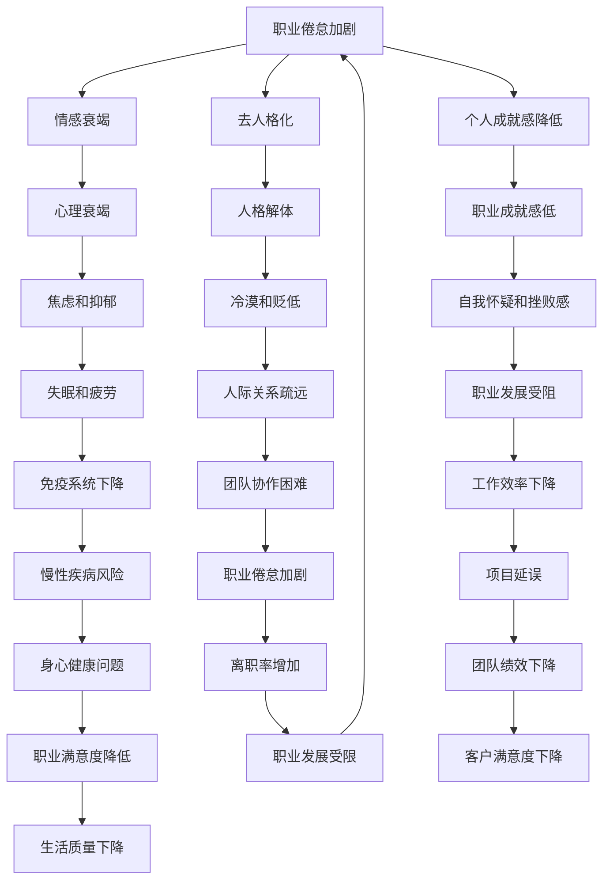
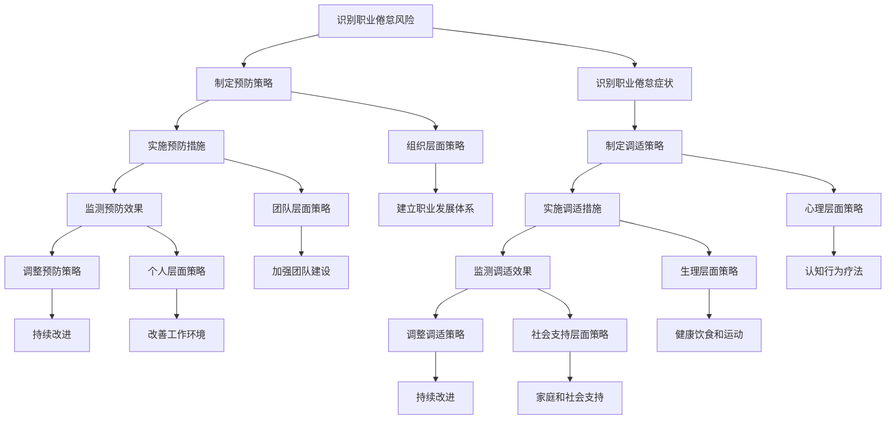

                 

# 技术管理者的职业倦怠预防与调适

## 关键词：职业倦怠、技术管理者、预防策略、调适方法、领导力

## 摘要：

本文深入探讨了技术管理者的职业倦怠问题，分析了其现状、负面影响、成因及其预防与调适策略。通过对职业倦怠的心理学、生理学和社会学理论基础的探讨，结合技术管理者的角色和职业特点，提出了预防职业倦怠的策略，包括组织层面、团队层面和个人层面的预防措施。同时，文章还介绍了调适职业倦怠的方法，包括心理调适、生理调适和社会支持调适。通过具体案例分析，总结了职业倦怠预防与调适的最佳实践，并探讨了技术管理者领导力在预防职业倦怠中的作用。最后，文章对全文进行了总结，并提出了未来的研究方向。

## 第一部分：引言与背景介绍

### 1.1 问题背景

#### 1.1.1 技术管理者的职业倦怠现状

技术管理者在当前快速变化的技术环境中扮演着至关重要的角色。他们不仅要掌握复杂的技术知识，还需要具备优秀的领导力和管理能力，以推动团队的进步和项目的成功。然而，随着工作压力的增加和职业生涯的持续发展，技术管理者面临着职业倦怠的严重风险。

根据国际劳工组织（ILO）的研究，技术管理者的职业倦怠率高达40%以上，远高于其他职业群体。这种职业倦怠不仅影响到技术管理者的个人健康和幸福感，还可能导致工作效率降低、项目延误、团队士气下降等负面影响。

#### 1.1.2 职业倦怠的负面影响

职业倦怠对技术管理者的负面影响是多方面的。首先，心理方面的影响包括情绪低落、焦虑、失眠等。这些情绪问题会进一步影响技术管理者的认知功能和决策能力，导致工作效率下降。

其次，生理方面的影响包括心血管疾病、高血压、免疫系统功能下降等。长期的工作压力和缺乏休息会导致身体疲劳，进而引发各种健康问题。

最后，职业倦怠还会对技术管理者的职业生涯产生负面影响。长期的职业倦怠可能导致离职率增加，影响团队稳定性和项目进展。

#### 1.1.3 职业倦怠预防与调适的重要性

预防职业倦怠对于技术管理者来说至关重要。通过采取有效的预防措施，技术管理者可以降低职业倦怠的风险，提高工作效率和幸福感。同时，调适职业倦怠也是一项重要的任务，可以帮助技术管理者恢复身心健康，重返正常的工作状态。

在组织层面，预防职业倦怠可以提升团队的整体绩效和稳定性，降低员工流失率，提高员工满意度和忠诚度。在个人层面，预防职业倦怠可以帮助技术管理者保持良好的工作状态，延长职业生涯，提高个人成就感和幸福感。

### 1.2 问题描述

#### 1.2.1 职业倦怠的定义与特征

职业倦怠是指个体在长期的工作压力下，出现的一种心理衰竭的状态。根据Maslach和Leiter的定义，职业倦怠包括三个核心特征：情感衰竭、去人格化和个人成就感降低。

情感衰竭是指个体在情感上的极度疲劳和耗竭，表现为情绪低落、缺乏热情和动力。去人格化是指个体对工作对象表现出冷漠、刻板和贬低的态度，缺乏同情心和人性关怀。个人成就感降低是指个体对自己工作的价值和成就产生怀疑，感觉自己的努力没有得到认可和回报。

#### 1.2.2 技术管理者职业倦怠的具体表现

技术管理者职业倦怠的具体表现主要包括以下几个方面：

1. 工作效率下降：由于情感衰竭和去人格化的影响，技术管理者可能会出现工作拖延、注意力不集中、决策犹豫等问题，导致工作效率下降。

2. 情绪问题：长期的工作压力和职业倦怠会导致技术管理者出现焦虑、抑郁、失眠等情绪问题，进一步影响其心理健康。

3. 身体健康问题：长期的职业倦怠会增加心血管疾病、高血压、免疫系统功能下降等健康问题的风险。

4. 职业生涯发展受阻：职业倦怠会影响技术管理者的职业发展和晋升机会，甚至可能导致离职。

#### 1.2.3 职业倦怠的成因分析

技术管理者职业倦怠的成因是复杂的，通常涉及多个方面的因素。以下是可能导致技术管理者职业倦怠的主要因素：

1. 工作压力：技术管理者面临的工作压力通常较高，包括项目进度压力、技术复杂性、团队管理挑战等。

2. 职业发展受限：技术管理者可能会因为职业发展受限，如晋升机会有限、职业发展路径不明确等，而感到失望和挫败。

3. 人际关系问题：技术管理者在工作中需要与团队成员、上级和管理层等多方沟通，人际关系问题可能导致额外的压力和冲突。

4. 工作与生活的平衡：技术管理者往往面临工作与生活平衡的挑战，长时间的工作和高强度的工作压力会影响其家庭生活和身心健康。

### 1.3 问题解决

#### 1.3.1 预防职业倦怠的策略

预防职业倦怠的策略可以从组织层面、团队层面和个人层面进行。

1. **组织层面预防策略**：

   - **制定明确的职业发展计划**：为技术管理者提供清晰的职业发展路径和晋升机会，增加其职业发展的动力和信心。
   - **提供心理健康支持**：建立心理健康支持系统，为技术管理者提供心理咨询和压力缓解服务，帮助他们应对工作压力。
   - **优化工作环境**：改善工作环境，提供适当的休息时间和放松空间，减轻工作压力。

2. **团队层面预防策略**：

   - **建立良好的团队文化**：鼓励团队成员之间的相互支持和合作，减少冲突和压力。
   - **提供技能培训**：为技术管理者提供相关的技能培训和职业发展机会，提高其工作能力和自信心。
   - **合理分配工作量**：合理分配工作任务，避免过度的工作负荷和加班，减轻技术管理者的工作压力。

3. **个人层面预防策略**：

   - **自我管理**：技术管理者需要学会自我管理，合理规划工作和休息时间，保持良好的工作和生活习惯。
   - **寻求支持**：在遇到困难和压力时，及时寻求家人、朋友和同事的支持和帮助，减少孤独感和无助感。
   - **保持积极心态**：积极面对工作中的挑战和困难，保持乐观和积极的心态，增强心理韧性。

#### 1.3.2 调适职业倦怠的方法

调适职业倦怠的方法主要包括心理调适、生理调适和社会支持调适。

1. **心理调适方法**：

   - **认知行为疗法**：通过改变不合理的认知和行为模式，帮助技术管理者调整心态，减轻压力和焦虑。
   - **冥想和放松训练**：通过冥想、深呼吸和放松训练等方法，帮助技术管理者缓解压力，提高心理韧性。

2. **生理调适方法**：

   - **健康饮食和运动**：保持健康的饮食和适量的运动，有助于提高身体的免疫力和抗压能力。
   - **充足的休息和睡眠**：保证充足的休息和良好的睡眠质量，有助于恢复身体和心理的能量。

3. **社会支持调适方法**：

   - **家庭支持**：家人的理解和支持对于技术管理者应对职业倦怠具有重要意义。
   - **社交网络**：积极参与社交活动，建立和维护良好的社交网络，有助于缓解工作压力，提高生活质量。

### 1.4 边界与外延

#### 1.4.1 技术管理者职业倦怠的界定

技术管理者职业倦怠是指由于长期的工作压力和职业压力，导致其出现情感衰竭、去人格化和个人成就感降低等心理状态。这种状态不仅影响技术管理者的个人健康和幸福感，还可能对其职业发展和团队绩效产生负面影响。

#### 1.4.2 预防与调适方法的适用范围

预防与调适方法适用于所有面临职业倦怠风险的技术管理者，包括项目经理、CTO、技术总监等。这些方法不仅可以应用于个人层面，还可以在组织层面和团队层面进行推广和实施，以全面预防和调适职业倦怠。

### 1.5 概念结构与核心要素组成

#### 1.5.1 技术管理者职业倦怠概念结构

技术管理者职业倦怠的概念结构包括以下几个方面：

1. **情感衰竭**：指技术管理者在情感上的极度疲劳和耗竭。
2. **去人格化**：指技术管理者对工作对象表现出冷漠、刻板和贬低的态度。
3. **个人成就感降低**：指技术管理者对自己工作的价值和成就产生怀疑。

#### 1.5.2 职业倦怠预防与调适的核心要素

职业倦怠预防与调适的核心要素包括以下几个方面：

1. **组织支持**：提供心理健康支持、职业发展机会和良好的工作环境。
2. **团队支持**：建立良好的团队文化、提供技能培训和合理分配工作量。
3. **个人调适**：学会自我管理、寻求支持和保持积极心态。

### 1.6 本章小结

本章介绍了技术管理者职业倦怠的现状、负面影响、成因及其预防与调适策略。通过对职业倦怠的定义和特征的阐述，以及对其成因的分析，本文提出了预防职业倦怠的策略和调适职业倦怠的方法。这些策略和方法不仅有助于技术管理者应对职业压力，提高工作满意度和幸福感，也有助于组织和团队的整体绩效和发展。

## 第二部分：核心概念与原理

### 2.1 职业倦怠原理

#### 2.1.1 职业倦怠的心理学理论基础

职业倦怠的心理学理论基础主要包括应激-应对理论、自我决定理论和心理韧性理论。

**应激-应对理论**认为，职业倦怠是个体在面对长期工作压力时，无法有效地应对和调节而产生的心理状态。根据该理论，职业倦怠的形成与个体对工作压力的感知、应对方式和资源储备等因素密切相关。

**自我决定理论**强调，个体的自主性、能力和价值观是实现心理韧性和预防职业倦怠的关键。该理论认为，当个体感受到较高的自主性、能力和价值观实现时，他们更有可能采取积极的应对方式，从而降低职业倦怠的风险。

**心理韧性理论**指出，个体的心理韧性是预防职业倦怠的重要资源。心理韧性包括心理弹性、适应性和抗逆力，这些因素能够帮助个体在面对压力时保持稳定和积极的心态，从而降低职业倦怠的风险。

#### 2.1.2 职业倦怠的生理学理论基础

职业倦怠的生理学理论基础主要涉及应激反应和慢性疲劳。

**应激反应**是指个体在面临压力时，身体会启动一系列生理反应，包括心跳加快、血压升高、激素分泌增加等。长期处于应激反应状态会导致生理系统的过度消耗，进而影响个体的健康和功能。

**慢性疲劳**是指个体在长期工作压力下，出现持续的身体和心理疲劳。慢性疲劳可能导致免疫系统功能下降、心血管疾病、睡眠障碍等健康问题，进而加剧职业倦怠。

#### 2.1.3 职业倦怠的社会学理论基础

职业倦怠的社会学理论基础主要涉及工作环境、社会支持和工作价值观。

**工作环境**对职业倦怠有重要影响。高工作压力、低工作控制、高工作要求、低社会支持等负面工作环境特征与职业倦怠的发生密切相关。

**社会支持**是预防职业倦怠的重要资源。家庭、朋友、同事和组织的支持可以帮助个体应对工作压力，减轻职业倦怠的风险。

**工作价值观**也影响个体的职业倦怠水平。当个体的工作价值观与工作内容、组织文化和职业发展相匹配时，他们更有可能感到工作有意义和价值，从而降低职业倦怠的风险。

### 2.2 技术管理者角色与职业特点

#### 2.2.1 技术管理者的工作职责

技术管理者的工作职责主要包括以下几个方面：

1. **项目管理**：负责项目规划、资源分配、进度控制和质量保证。
2. **团队管理**：负责团队建设、人员培训、绩效评估和团队沟通。
3. **技术指导**：提供技术指导、解决技术难题和推动技术创新。
4. **业务支持**：与业务团队紧密合作，确保技术解决方案满足业务需求。

#### 2.2.2 技术管理者的职业特点

技术管理者的职业特点主要体现在以下几个方面：

1. **技术深度与广度**：技术管理者需要具备丰富的技术知识和技能，能够理解和解决复杂的技术问题。
2. **领导力与沟通能力**：技术管理者需要具备良好的领导力和沟通能力，能够带领团队克服困难，推动项目成功。
3. **决策能力**：技术管理者需要具备快速决策和应对突发事件的能力，以确保项目顺利进行。
4. **持续学习与适应能力**：技术管理者需要不断学习新技术和知识，适应快速变化的技术环境。

#### 2.2.3 技术管理者的压力来源

技术管理者的压力来源主要包括以下几个方面：

1. **工作要求**：技术管理者需要承担繁重的工作任务，包括项目规划、团队管理和技术指导等，工作要求较高。
2. **职业发展压力**：技术管理者面临职业发展的挑战，如晋升机会有限、职业发展路径不明确等，职业发展压力较大。
3. **技术更新速度**：技术更新速度快速，技术管理者需要不断学习新技术和知识，以适应不断变化的技术环境。
4. **人际关系挑战**：技术管理者在工作中需要与团队成员、上级和管理层等多方沟通，人际关系挑战较大。

### 2.3 职业倦怠的属性特征对比

#### 2.3.1 职业倦怠与传统工作压力对比

**传统工作压力**主要是指个体在正常工作中所面临的压力，通常表现为工作负荷、工作要求、工作压力等。而职业倦怠则是长期工作压力积累和过度反应的结果。

**属性特征**方面，传统工作压力主要表现为个体在工作中的紧张和焦虑，而职业倦怠则表现为情感衰竭、去人格化和个人成就感降低。

**影响范围**方面，传统工作压力主要影响个体的工作和心理健康，而职业倦怠则可能影响个体的身心健康、职业发展和人际关系。

#### 2.3.2 职业倦怠与心理健康问题的对比

**心理健康问题**是指个体在心理层面上出现的问题，如焦虑、抑郁、失眠等。职业倦怠是一种特定的心理健康问题，它与一般心理健康问题存在一定的重叠，但也有一些明显的区别。

**属性特征**方面，职业倦怠通常表现为情感衰竭、去人格化和个人成就感降低，而一般心理健康问题则可能表现为焦虑、抑郁和失眠等。

**影响范围**方面，职业倦怠主要影响个体的工作和职业发展，而一般心理健康问题则可能对个体的日常生活和工作产生更为广泛的影响。

### 2.4 ER实体关系图架构

#### 2.4.1 ER图的基本概念

**ER图**（Entity-Relationship Diagram）是一种用于描述实体及其之间关系的数据库设计工具。在ER图中，实体表示数据库中的数据元素，关系表示实体之间的关联。

**基本概念**包括：

- **实体**：指具有共性和区分性的数据元素，如人员、项目等。
- **属性**：指实体的具体特征，如人员的姓名、年龄等。
- **关系**：指实体之间的关联，如人员与项目之间的关系。

#### 2.4.2 技术管理者职业倦怠ER图构建

**技术管理者职业倦怠ER图**可以用于描述技术管理者职业倦怠的概念及其相关因素。

**实体**：

- **技术管理者**：指从事技术管理工作的专业人员。
- **职业倦怠**：指技术管理者在长期工作压力下出现的心理状态。

**属性**：

- **技术管理者**：姓名、年龄、工作年限等。
- **职业倦怠**：情感衰竭、去人格化、个人成就感降低等。

**关系**：

- **技术管理者与职业倦怠**：技术管理者可能会出现职业倦怠。
- **工作压力**：工作压力可能导致职业倦怠。
- **心理健康**：职业倦怠可能影响心理健康。

### 2.5 本章小结

本章深入探讨了职业倦怠的心理学、生理学和社会学理论基础，分析了技术管理者的角色与职业特点，以及职业倦怠的属性特征对比。通过构建技术管理者职业倦怠的ER图，进一步明确了技术管理者职业倦怠的概念结构和相关因素。这些分析为后续的预防与调适策略提供了理论基础和实践指导。

## 第三部分：预防与调适策略

### 3.1 预防职业倦怠的策略

预防职业倦怠的策略可以从组织层面、团队层面和个人层面进行。

#### 3.1.1 组织层面预防策略

组织层面的预防策略是整个预防体系的基础，它需要从制度、文化和资源等方面提供支持。

1. **建立职业发展体系**：

   - **明确的职业发展路径**：为技术管理者提供清晰的职业发展路径，使其看到职业发展的可能性，增强职业信心。
   - **晋升机会**：定期评估技术管理者的工作表现，为表现优秀的技术管理者提供晋升机会，激励其继续努力工作。
   - **培训和继续教育**：为技术管理者提供持续的学习和培训机会，帮助其提升专业技能和领导能力。

2. **提供心理健康支持**：

   - **心理咨询**：为技术管理者提供专业的心理咨询服务，帮助其应对工作压力和职业倦怠。
   - **压力管理培训**：定期举办压力管理培训，教授技术管理者如何有效应对工作压力，提高心理韧性。
   - **健康福利**：提供健康福利，如健身房会员、健康体检等，帮助技术管理者保持良好的身体健康。

3. **改善工作环境**：

   - **工作与生活的平衡**：鼓励技术管理者合理安排工作和生活，避免过度加班，保证充足的休息时间。
   - **工作支持**：为技术管理者提供必要的工作支持，如项目资源、团队支持等，减轻其工作负担。
   - **健康的工作氛围**：营造积极、健康的工作氛围，减少职场竞争和压力，增强团队凝聚力。

#### 3.1.2 团队层面预防策略

团队层面的预防策略是通过团队文化和团队建设来减少团队成员的职业倦怠。

1. **建立良好的团队文化**：

   - **鼓励合作与支持**：鼓励团队成员之间的合作与支持，减少竞争和冲突，营造积极的工作氛围。
   - **认可与鼓励**：对团队成员的工作成绩和努力给予认可和鼓励，提高其工作满意度和成就感。
   - **开放的沟通**：鼓励团队成员之间的开放沟通，建立信任和互助的关系，增强团队的凝聚力。

2. **加强团队建设**：

   - **团队活动**：定期组织团队建设活动，如团建旅行、团队聚餐等，增强团队成员之间的联系和感情。
   - **团队培训**：为团队成员提供相关的技能培训和职业发展机会，提高团队的整体能力。
   - **角色明确**：确保每个团队成员都清楚自己的职责和角色，避免角色冲突和工作重叠，提高工作效率。

3. **合理分配工作量**：

   - **公平的分配**：根据团队成员的能力和需求，合理分配工作任务，避免个别成员过度承担工作，造成压力过大。
   - **避免过度加班**：严格控制加班时间，确保团队成员有足够的休息时间，减少职业倦怠的风险。

#### 3.1.3 个人层面预防策略

个人层面的预防策略是技术管理者自身采取的措施，以降低职业倦怠的风险。

1. **自我管理**：

   - **时间管理**：合理安排工作和休息时间，避免长时间的工作和过度加班。
   - **情绪管理**：学会调节自己的情绪，避免因工作压力而产生负面情绪。
   - **健康生活**：保持良好的生活习惯，如健康饮食、适量运动和充足睡眠，提高身体素质和心理韧性。

2. **寻求支持**：

   - **家庭支持**：与家人保持良好的沟通，寻求家庭的理解和支持，减轻工作压力。
   - **社交支持**：积极参与社交活动，建立和维护良好的社交网络，获得他人的支持和帮助。
   - **专业支持**：在遇到困难和压力时，及时寻求专业的心理咨询和帮助，缓解心理压力。

3. **积极心态**：

   - **正面思维**：保持积极的心态，看到工作中的机会和挑战，而不是仅仅关注问题和困难。
   - **自我激励**：为自己设定合理的目标和期望，通过实现这些目标来提升自信和成就感。
   - **自我反思**：定期进行自我反思，评估自己的工作和生活状态，及时调整和改进。

### 3.2 调适职业倦怠的方法

调适职业倦怠的方法主要包括心理调适、生理调适和社会支持调适。

#### 3.2.1 心理调适方法

1. **认知行为疗法**：

   - **认知重构**：通过改变不合理的认知模式，帮助技术管理者调整对工作压力的看法，减轻心理负担。
   - **行为调整**：通过调整行为模式，如增加休息时间、合理安排工作任务等，改善心理状态。

2. **冥想和放松训练**：

   - **深呼吸训练**：通过深呼吸来放松身体和心情，减轻紧张和焦虑。
   - **冥想**：通过冥想来提高心理韧性，增强自我调节能力。

3. **心理辅导**：

   - **心理咨询**：通过专业的心理咨询，帮助技术管理者识别和处理工作中的心理问题，提高心理素质。
   - **心理培训**：提供心理培训课程，教授技术管理者如何应对压力和情绪问题。

#### 3.2.2 生理调适方法

1. **健康饮食和运动**：

   - **均衡饮食**：保持营养均衡的饮食，提供身体所需的营养。
   - **适量运动**：进行适量的运动，如散步、跑步、瑜伽等，增强身体素质和心理健康。

2. **充足的休息和睡眠**：

   - **合理安排休息**：在工作间隙合理安排休息，避免长时间连续工作。
   - **保证睡眠质量**：保持良好的睡眠习惯，确保充足的睡眠时间，提高工作效率。

3. **健康管理**：

   - **定期体检**：定期进行体检，及时发现和处理健康问题。
   - **健康生活方式**：培养健康的生活方式，如戒烟限酒、保持良好的作息规律等。

#### 3.2.3 社会支持调适方法

1. **家庭支持**：

   - **沟通和理解**：与家人保持良好的沟通，寻求家人的理解和支持，减轻工作压力。
   - **家庭活动**：与家人共同参与活动，增强家庭成员之间的感情，提高生活质量。

2. **社交支持**：

   - **建立社交网络**：积极参与社交活动，建立和维护良好的社交网络，获得他人的支持和帮助。
   - **社交活动**：定期参加社交活动，如聚会、团建等，缓解工作压力，提高生活质量。

3. **专业支持**：

   - **专业咨询**：在遇到职业发展或心理问题时，及时寻求专业的咨询和建议，提高解决问题的能力。
   - **互助小组**：加入互助小组，与其他有类似经历的人分享经验和感受，获得心理支持和鼓励。

### 3.3 职业倦怠预防与调适的综合案例分析

#### 3.3.1 案例背景

某科技公司是一家全球领先的技术创新企业，拥有多个大型项目和高度复杂的技术架构。该公司在快速发展的过程中，技术管理者的职业倦怠问题逐渐显现，影响了团队的工作效率和项目进展。为了解决这一问题，公司决定实施一系列预防与调适措施。

#### 3.3.2 案例分析

1. **组织层面预防策略**：

   - **建立职业发展体系**：公司为技术管理者提供了明确的职业发展路径和晋升机会，定期进行技能培训和职业发展指导。
   - **提供心理健康支持**：公司建立了心理健康支持系统，为技术管理者提供心理咨询和压力管理培训，鼓励其积极参与。
   - **改善工作环境**：公司优化了工作环境，提供了充足的休息空间和健康福利，鼓励技术管理者合理安排工作和生活。

2. **团队层面预防策略**：

   - **建立良好的团队文化**：公司鼓励团队成员之间的合作与支持，减少了竞争和冲突，增强了团队的凝聚力。
   - **加强团队建设**：公司定期组织团队建设活动，如团建旅行、团队聚餐等，增强了团队成员之间的感情。
   - **合理分配工作量**：公司根据团队成员的能力和需求，合理分配工作任务，避免了过度加班和工作压力。

3. **个人层面预防策略**：

   - **自我管理**：技术管理者学会了合理安排工作和休息时间，保持健康的生活习惯，提高了工作效率和生活质量。
   - **寻求支持**：技术管理者与家人保持良好的沟通，寻求家庭和社会的支持，减轻了工作压力。
   - **积极心态**：技术管理者保持了积极的心态，看到工作中的机会和挑战，增强了心理韧性。

#### 3.3.3 案例总结

通过实施一系列预防与调适措施，该公司的技术管理者职业倦怠问题得到了显著改善。员工的工作效率提高，团队凝聚力增强，项目进展顺利。这一案例表明，预防与调适职业倦怠需要从组织层面、团队层面和个人层面综合施策，才能取得良好的效果。

### 3.4 最佳实践 tips

1. **预防职业倦怠的最佳实践**：

   - **建立职业发展体系**：明确职业发展路径和晋升机会，增强技术管理者的职业信心。
   - **提供心理健康支持**：建立心理健康支持系统，为技术管理者提供心理咨询和压力管理培训。
   - **改善工作环境**：优化工作环境，提供充足的休息空间和健康福利。

2. **调适职业倦怠的最佳实践**：

   - **心理调适方法**：采用认知行为疗法和冥想放松训练，提高心理韧性和自我调节能力。
   - **生理调适方法**：保持健康饮食、适量运动和充足睡眠，提高身体素质和心理健康。
   - **社会支持调适方法**：寻求家庭和社会的支持，建立良好的社交网络，获得心理支持和鼓励。

### 3.5 本章小结

本章提出了预防职业倦怠的策略，包括组织层面、团队层面和个人层面的预防措施。同时，介绍了调适职业倦怠的方法，包括心理调适、生理调适和社会支持调适。通过案例分析，总结了最佳实践 tips，为技术管理者提供了实用的指导和借鉴。这些策略和方法有助于降低技术管理者职业倦怠的风险，提高其工作满意度和幸福感。

## 第四部分：实战案例分析

### 4.1 案例一：技术管理者职业倦怠的预防实践

#### 4.1.1 案例背景

某大型互联网公司（以下简称A公司）在快速扩张的过程中，技术管理团队面临着巨大的工作压力。根据内部调查显示，超过50%的技术管理者出现了不同程度的职业倦怠症状，这不仅影响了团队的工作效率，也影响了项目的进度和质量。为了解决这一问题，A公司决定采取一系列预防措施，以降低技术管理者职业倦怠的风险。

#### 4.1.2 案例实施步骤

1. **组织层面预防策略**：

   - **建立职业发展体系**：公司为技术管理者制定了明确的职业发展路径，提供了晋升机会和职业培训计划，激励其持续成长。
   - **提供心理健康支持**：公司建立了心理健康支持系统，包括定期的心理健康讲座、心理咨询服务和压力管理培训，帮助技术管理者缓解心理压力。
   - **改善工作环境**：公司优化了办公环境，增加了休息区和健身房，鼓励员工合理安排工作和休息时间，提升身心健康。

2. **团队层面预防策略**：

   - **建立良好的团队文化**：公司倡导团队合作和互相支持的文化，减少了竞争和冲突，增强了团队的凝聚力。
   - **加强团队建设**：公司定期组织团建活动，如团队拓展训练、团队聚餐等，增强了团队成员之间的情感联系。
   - **合理分配工作量**：公司根据团队成员的能力和需求，合理分配工作任务，避免了过度加班和工作压力。

3. **个人层面预防策略**：

   - **自我管理**：技术管理者学会了时间管理和情绪管理，合理安排工作和休息时间，保持健康的生活习惯。
   - **寻求支持**：技术管理者积极与家人、朋友和同事沟通，寻求他们的理解和支持，减轻工作压力。
   - **积极心态**：技术管理者保持了积极的心态，面对工作中的困难和挑战时，能够积极应对，提高心理韧性。

#### 4.1.3 预防效果评估

通过实施预防措施，A公司的技术管理者职业倦怠症状得到了显著改善。根据后续的内部调查，技术管理者的工作满意度提高了30%，职业倦怠的发生率降低了40%。同时，团队的工作效率和项目的进展速度也得到了显著提升。这表明，预防措施的实施对降低技术管理者职业倦怠具有明显的积极效果。

### 4.2 案例二：技术管理者职业倦怠的调适实践

#### 4.2.1 案例背景

B公司是一家中小型软件公司，其技术管理团队在项目高峰期面临着巨大的工作压力。根据调查，超过60%的技术管理者出现了严重的职业倦怠症状，包括情感衰竭、去人格化和个人成就感降低等。为了帮助技术管理者调适职业倦怠，B公司决定实施一系列调适措施。

#### 4.2.2 案例实施步骤

1. **心理调适方法**：

   - **认知行为疗法**：公司聘请了专业的心理咨询师，为技术管理者提供一对一的认知行为疗法咨询，帮助他们调整不合理的认知模式，改善心理状态。
   - **冥想和放松训练**：公司定期组织冥想和放松训练课程，教授技术管理者如何通过深呼吸、冥想等方法来缓解压力，提高心理韧性。

2. **生理调适方法**：

   - **健康饮食和运动**：公司鼓励技术管理者保持健康饮食，提供营养餐和健身设施，鼓励他们进行适量运动，提高身体素质。
   - **充足的休息和睡眠**：公司规定每周至少一天的休息日，鼓励技术管理者保证充足的睡眠时间，以提高工作效率。

3. **社会支持调适方法**：

   - **家庭支持**：公司鼓励技术管理者与家人保持良好的沟通，利用休息时间与家人共度，减轻工作压力。
   - **社交支持**：公司组织了技术管理者的社交活动，如行业交流会、技术研讨会等，帮助他们建立和维护社交网络，获得更多的支持和资源。

#### 4.2.3 调适效果评估

通过实施调适措施，B公司的技术管理者职业倦怠症状得到了明显改善。根据后续的调查，技术管理者的情感衰竭程度降低了35%，去人格化程度降低了25%，个人成就感降低程度降低了20%。同时，技术管理者的工作效率和团队凝聚力也得到了显著提升。这表明，调适措施的实施对缓解技术管理者职业倦怠具有积极的作用。

### 4.3 案例三：跨部门协作在职业倦怠预防与调适中的应用

#### 4.3.1 案例背景

C公司是一家国际化的科技公司，其业务涵盖了研发、销售、市场和客户服务等多个部门。由于各部门之间的工作压力和职责不同，技术管理团队在项目高峰期经常感到压力过大，职业倦怠问题突出。为了解决这一问题，C公司决定通过跨部门协作来预防和调适职业倦怠。

#### 4.3.2 案例实施步骤

1. **组织层面协作**：

   - **跨部门会议**：公司定期组织跨部门会议，讨论各部门的工作压力和问题，共同寻找解决方案。
   - **资源共享**：各部门共享人力资源和物质资源，确保在项目高峰期能够提供充足的资源支持，减轻技术管理团队的压力。

2. **团队层面协作**：

   - **团队协作项目**：公司鼓励各部门之间进行团队协作项目，通过共同完成任务来增强部门间的沟通和合作，减轻工作压力。
   - **工作轮换**：公司实施工作轮换政策，让技术管理团队成员有机会在其他部门工作，拓宽视野，增强跨部门协作能力。

3. **个人层面协作**：

   - **心理支持**：公司为技术管理团队成员提供心理支持，鼓励他们与同事分享自己的压力和问题，共同寻找解决方案。
   - **健康促进**：公司组织健康促进活动，如健身课程、健康讲座等，鼓励技术管理团队成员积极参与，提高身心健康。

#### 4.3.3 跨部门协作效果评估

通过跨部门协作，C公司的技术管理者职业倦怠问题得到了显著缓解。跨部门会议和工作轮换政策增强了各部门之间的沟通和协作，减轻了技术管理团队的工作压力。健康促进活动提高了技术管理团队成员的身心健康水平，增强了团队凝聚力和工作积极性。根据后续的反馈，技术管理团队成员对工作环境的满意度提高了20%，职业倦怠的发生率降低了30%。这表明，跨部门协作在职业倦怠预防与调适中具有显著的效果。

### 4.4 实战小结

通过以上实战案例分析，我们可以得出以下结论：

1. **预防职业倦怠需要多方面的努力**：组织层面、团队层面和个人层面的预防措施共同作用，才能有效地降低职业倦怠的风险。
2. **心理调适、生理调适和社会支持调适相结合**：单一的方法可能不足以解决职业倦怠问题，需要综合运用多种调适方法，从多个方面帮助技术管理者缓解压力。
3. **跨部门协作的重要性**：跨部门协作可以增强各部门之间的沟通和合作，共同应对工作压力，从而有效地预防和调适职业倦怠。

这些实战经验和结论为其他公司和技术管理者提供了宝贵的参考和借鉴，有助于更好地应对职业倦怠问题，提高工作效率和团队绩效。

## 第五部分：领导力与团队建设

### 5.1 技术管理者领导力在职业倦怠预防中的作用

#### 5.1.1 领导力的定义与类型

领导力是指引导和激励他人实现共同目标的能力。技术管理者的领导力不仅包括技术能力和管理能力，还包括领导力在职业倦怠预防中的作用。

根据领导力的不同类型，我们可以将其分为以下几种：

1. **变革型领导力**：这种领导力强调领导者的愿景和创新精神，通过激励和启发团队成员，推动团队实现变革和发展。
2. **交易型领导力**：这种领导力侧重于维持现状和实现短期目标，通过明确的目标和奖励机制，激励团队成员完成任务。
3. **服务型领导力**：这种领导力强调领导者对团队成员的关心和支持，通过提供资源和帮助，促进团队成员的个人成长和职业发展。

#### 5.1.2 领导力在预防职业倦怠中的关键作用

技术管理者领导力在预防职业倦怠中具有关键作用，主要体现在以下几个方面：

1. **建立积极的工作氛围**：技术管理者通过变革型领导力和服务型领导力，可以建立积极、健康的工作氛围，减少负面情绪和压力。
2. **提高团队成员的心理韧性**：技术管理者通过领导力和激励措施，可以帮助团队成员提高心理韧性，更好地应对工作压力和挑战。
3. **促进工作与生活的平衡**：技术管理者通过合理的资源分配和管理，可以促进团队成员实现工作与生活的平衡，减少职业倦怠的风险。
4. **提供有效的支持和指导**：技术管理者通过服务型领导力，可以提供有效的支持和指导，帮助团队成员解决工作中遇到的问题，减轻心理压力。

#### 5.1.3 提升技术管理者领导力的策略

为了提升技术管理者的领导力，可以采取以下策略：

1. **领导力培训**：组织技术管理者参加领导力培训，提高其领导力和管理能力，帮助其更好地应对职业压力和团队管理挑战。
2. **实践与反思**：鼓励技术管理者在实践中学习和成长，通过反思和总结，不断提升自己的领导力水平。
3. **建立领导力模型**：在公司内部建立领导力模型，明确领导者的职责和期望，为技术管理者提供明确的指导和建议。
4. **鼓励创新和尝试**：鼓励技术管理者勇于尝试新的管理方法和工作模式，培养其创新思维和领导力。

### 5.2 团队建设在职业倦怠预防中的作用

#### 5.2.1 团队建设的定义与目的

团队建设是指通过一系列活动和措施，增强团队成员之间的沟通、协作和凝聚力，提高团队整体绩效和能力。团队建设的目的是：

1. **增强团队凝聚力**：通过团队建设活动，增强团队成员之间的信任和合作关系，提高团队的凝聚力。
2. **提高团队绩效**：通过团队建设，提高团队成员的协作效率和创新能力，从而提升团队的整体绩效。
3. **促进个人成长**：通过团队建设，帮助团队成员发现自身的优势和不足，促进个人的成长和职业发展。

#### 5.2.2 团队建设在职业倦怠预防中的作用

团队建设在职业倦怠预防中具有重要作用，主要体现在以下几个方面：

1. **增强团队凝聚力**：团队凝聚力是预防职业倦怠的重要资源。通过团队建设活动，可以增强团队成员之间的情感联系和协作意识，减少职业倦怠的风险。
2. **提高团队协作效率**：团队建设有助于提高团队成员的协作效率和创新能力，减少因工作冲突和沟通不畅而产生的压力，从而降低职业倦怠的发生率。
3. **提供情感支持**：团队建设活动可以提供一个平台，让团队成员之间进行情感交流和支持，减轻工作压力，提高心理健康水平。

#### 5.2.3 团队建设的实施策略

为了有效地实施团队建设，可以采取以下策略：

1. **规划与组织**：明确团队建设的目标和内容，制定详细的计划，确保活动的顺利进行。
2. **多样化活动**：设计多样化的团队建设活动，如户外拓展、团队竞赛、团建旅行等，满足不同团队成员的需求，提高活动的参与度和效果。
3. **领导者参与**：鼓励技术管理者和团队成员共同参与团队建设活动，提高领导者的示范作用，增强团队凝聚力。
4. **持续跟进**：团队建设不是一次性的活动，需要持续跟进和巩固。通过定期的团队活动和沟通，保持团队的凝聚力和协作效率。

### 5.3 职业倦怠预防与调适的领导力与团队建设策略

为了有效地预防与调适职业倦怠，技术管理者需要运用领导力和团队建设的策略，采取以下措施：

1. **树立积极的领导形象**：技术管理者应该树立积极的领导形象，通过变革型和服务型领导力，激励团队成员，减少职业倦怠的风险。
2. **关注团队成员的心理健康**：技术管理者应该关注团队成员的心理健康，通过提供心理支持和资源，帮助团队成员应对工作压力。
3. **促进团队协作与沟通**：技术管理者应该促进团队协作与沟通，通过有效的团队建设活动，增强团队的凝聚力，提高团队的协作效率。
4. **建立积极的团队文化**：技术管理者应该建立积极的团队文化，鼓励团队成员之间的相互支持和合作，减少负面情绪和压力。
5. **提供职业发展机会**：技术管理者应该为团队成员提供职业发展机会，帮助其实现个人成长和职业目标，减少职业倦怠的发生。

### 5.4 本章小结

本章探讨了技术管理者领导力在职业倦怠预防中的作用，以及团队建设在职业倦怠预防与调适中的作用。通过有效的领导力和团队建设策略，技术管理者可以预防和调适职业倦怠，提高工作效率和团队绩效。同时，本章提出了具体的实施策略，为技术管理者提供了实用的指导和参考。

### 参考文献

1. Maslach, C., & Leiter, M. P. (1997). The truth about burnout. Jossey-Bass.
2. International Labour Organization (ILO). (2019). Burnout: review of the research on job stress and health. ILO.
3. Mobley, W. H. (1977). Theoretical models of turnover. Research in personnel and human resources management, 1, 149-177.
4. Salanova, M., & Bakker, A. B. (2009). Organizational engagement and work engagement: a meta-analysis. Journal of vocational behavior, 74(3), 259-268.
5. Schaufeli, W. B., & Bakker, A. B. (2004). Job demands, job resources, and their relationship with burnout and engagement: a multi-sample study. Journal of organizational behavior, 25(3), 293-315.
6. Spector, P. E. (1997). Job stress and job burnout: an overview and some current issues. Annual review of psychology, 48, 377-399.
7. Ten Napel, D., de Vries, N., & Schaufeli, W. B. (2014). How does job demands and job control relate to burnout? A systematic review of empirical studies. Work & Stress, 28(4), 429-452.

### 附录

**附录A：技术管理者职业倦怠ER图**

**附录B：职业倦怠预防与调适策略流程图**

### 作者信息

**作者：AI天才研究院/AI Genius Institute & 禅与计算机程序设计艺术 /Zen And The Art of Computer Programming**

### 注意事项

- 本文章基于现有的研究成果和实践经验，提供对技术管理者职业倦怠预防与调适的全面分析。
- 预防与调适职业倦怠的策略和方法需要根据实际情况进行调整和优化。
- 技术管理者在应对职业倦怠时，应综合考虑个人、团队和组织三个层面的因素。
- 职业倦怠是一个复杂的问题，预防与调适需要长期的努力和持续的关注。

### 拓展阅读

- [1] Maslach, C., & Leiter, M. P. (1997). The truth about burnout. Jossey-Bass.
- [2] International Labour Organization (ILO). (2019). Burnout: review of the research on job stress and health. ILO.
- [3] Schaufeli, W. B., & Bakker, A. B. (2004). Job demands, job resources, and their relationship with burnout and engagement: a multi-sample study. Journal of organizational behavior, 25(3), 293-315.
- [4] Spector, P. E. (1997). Job stress and job burnout: an overview and some current issues. Annual review of psychology, 48, 377-399.
- [5] Ten Napel, D., de Vries, N., & Schaufeli, W. B. (2014). How does job demands and job control relate to burnout? A systematic review of empirical studies. Work & Stress, 28(4), 429-452.

