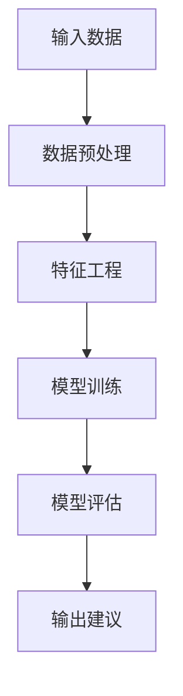
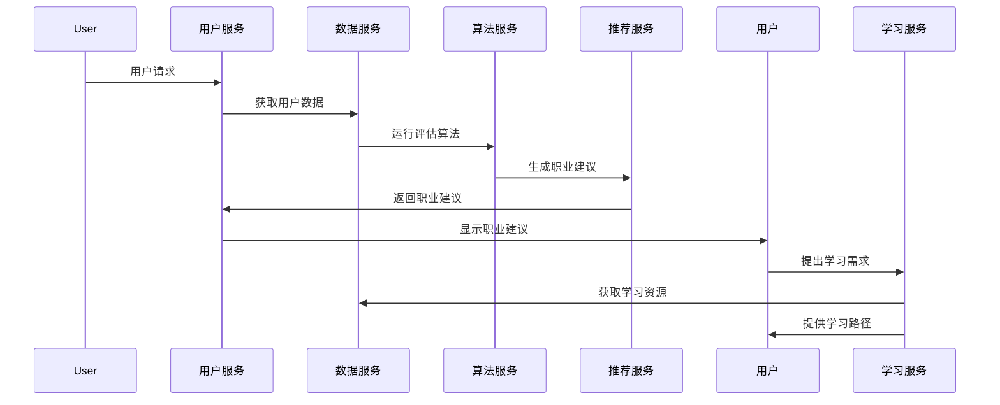
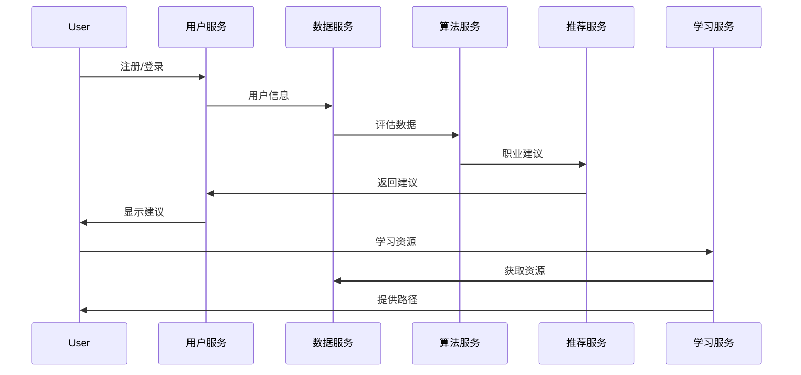

                 


### 第一步：背景介绍

在当今快速发展的技术时代，技术管理者扮演着至关重要的角色。他们不仅要精通技术本身，还要具备出色的管理能力和战略眼光。然而，随着技术的不断进步和市场的快速变化，技术管理者的职业生涯转型变得尤为重要。

**核心概念：**

- **技术管理者**：负责团队的技术战略规划、技术决策和项目管理等职责的高级技术人员。
- **职业生涯转型策略**：指在技术管理职业生涯中，根据市场需求和个人兴趣，选择新的发展方向和目标的策略。
- **成功案例**：指那些在职业生涯转型中取得显著成效的个体或组织。
- **市场需求与挑战**：指影响技术管理者职业发展的外部环境和内部因素。

**问题背景：**

随着云计算、大数据、人工智能等新兴技术的兴起，技术管理者的职责也在不断演变。他们需要不断学习新的技术和管理理念，以适应不断变化的市场需求。然而，很多技术管理者在职业生涯的某一阶段可能会遇到瓶颈，需要转型以寻求新的发展机会。

**职业生涯转型的需求：**

1. **个人成长需求**：技术管理者希望进一步提升自己的技术深度和管理能力。
2. **市场需求**：随着技术的进步，新的职业机会不断涌现，技术管理者需要转型以抓住这些机会。
3. **工作与生活平衡**：技术管理者可能因工作压力和职业发展瓶颈而寻求更平衡的工作与生活状态。

**成功转型的案例分享：**

- **案例1**：某资深技术经理通过转型成为数据科学家，成功进入大数据领域。
- **案例2**：某技术总监选择创业，成功领导一家初创公司并在市场上获得认可。

**市场需求与挑战：**

1. **市场需求**：随着数字经济的快速发展，企业对技术管理者的需求持续增长，特别是在数字化转型过程中。
2. **挑战**：
   - **技术变化快**：技术更新迭代迅速，技术管理者需要不断学习和适应。
   - **管理难度大**：技术管理者需要具备管理团队、协调资源和解决复杂问题的能力。
   - **职业发展瓶颈**：技术管理者在职业生涯中可能会遇到成长瓶颈，需要转型以寻求新的突破。

**本章小结：**

技术管理者的职业生涯转型策略是应对技术快速发展、市场需求变化和个人成长需求的重要手段。通过分析成功案例和市场需求与挑战，可以更好地理解技术管理者职业生涯转型的重要性。

----------------------------------------------------------------

### 第二步：核心概念与联系

在探讨技术管理者的职业生涯转型策略时，理解核心概念及其相互关系至关重要。以下是对于技术管理者、职业生涯转型策略以及成功转型的要素的深入分析。

**核心概念原理：**

- **技术管理者**：技术管理者是组织中负责技术方向的高级技术人员。他们不仅需要深入理解技术本身，还要具备团队管理和战略规划的能力。技术管理者通常负责技术团队的建设、项目管理和技术路线的规划等。

- **职业生涯转型策略**：职业生涯转型策略是技术管理者根据个人发展需求和市场机会，规划新的职业方向和发展路径的策略。这通常涉及到技能提升、职位变动或行业转换等。

- **成功转型要素**：成功转型需要考虑多个因素，包括个人能力、市场需求、行业趋势和职业规划等。

**概念属性特征对比表格：**

| 特征           | 技术管理者             | 职业生涯转型策略          | 成功转型要素           |
|--------------|-------------------|---------------------|----------------------|
| 职责范围       | 技术决策、项目管理、团队建设 | 技能提升、职位变动、行业转换 | 个人能力、市场需求、行业趋势 |
| 技能要求       | 技术知识、管理能力、沟通技巧 | 新技能学习、市场调研、职业规划 | 专业技能、领导力、创新思维 |
| 目标方向       | 技术深度发展、管理职位提升 | 技术领域拓展、跨行业转型、创业 | 个人兴趣、市场需求、职业目标 |
| 面临挑战       | 技术更新、管理难度、职业瓶颈 | 学习成本、市场适应、竞争压力 | 成本、资源、时间管理 |

**ER实体关系图架构的Mermaid流程图：**

```mermaid
erDiagram
    ID [[技术管理者]] ||--|{ 职业生涯转型策略 }
    ID [[职业生涯转型策略]] ||--|{ 成功转型要素 }
    ID [[成功转型要素]] ||--|{ 技术管理者 }
```

在上面的ER图中，技术管理者、职业生涯转型策略和成功转型要素三个实体通过关系连接起来，形成了职业生涯转型的整体架构。

**核心概念与联系分析：**

- **技术管理者与职业生涯转型策略**：技术管理者在职业生涯中，可能会面临技术更新和管理难度增加的挑战。为了应对这些挑战，他们需要制定职业生涯转型策略，以实现职业发展的新目标。

- **职业生涯转型策略与成功转型要素**：成功的职业生涯转型不仅需要策略的指导，还需要具备相应的成功转型要素。这些要素包括个人能力、市场需求和行业趋势等，它们共同作用于职业生涯转型的成功与否。

- **成功转型要素与职业发展**：成功转型要素是技术管理者实现职业发展的关键。个人能力的提升、市场需求的适应以及行业趋势的把握，都是决定技术管理者能否成功转型的重要因素。

**本章小结：**

通过核心概念与联系的分析，我们可以更清晰地理解技术管理者的职业生涯转型策略。技术管理者需要根据自身情况和外部环境，制定科学的转型策略，并注重提升个人能力、适应市场需求和把握行业趋势，以实现职业生涯的顺利转型。

----------------------------------------------------------------

### 第三步：算法原理讲解

在职业生涯转型策略的设计中，算法原理的应用能够帮助我们更科学地分析和规划个人职业发展。本节将介绍一种基于数据分析和机器学习的职业规划算法原理，并使用 Mermaid 流程图和 Python 源代码进行详细阐述。

**3.1 职业规划算法原理**

**算法概述：**

职业规划算法旨在通过分析个人技能、市场需求和行业趋势，为技术管理者提供科学、有效的职业转型建议。该算法的核心思想是数据驱动的决策，利用机器学习技术从大量职业数据中提取有价值的信息，从而预测个人职业发展的最佳路径。

**算法流程图：**



**详细解释：**

1. **输入数据**：算法首先需要收集个人技能数据、市场需求数据以及行业趋势数据。这些数据可以通过问卷调查、在线职业平台或公开数据库获取。

2. **数据预处理**：数据预处理包括数据清洗、去重和格式转换等步骤，以确保数据的质量和一致性。

3. **特征工程**：特征工程是关键步骤，旨在从原始数据中提取对职业规划有重要影响的特征。例如，可以提取个人的技术特长、工作经验、教育背景等。

4. **模型训练**：利用机器学习算法（如决策树、神经网络等）对特征进行训练，建立职业规划模型。模型的训练目标是预测个人在不同职业路径上的发展潜力。

5. **模型评估**：通过交叉验证和测试集评估模型性能，确保模型具有良好的预测能力。

6. **输出建议**：根据模型预测结果，为技术管理者提供个性化的职业转型建议，包括推荐的职业方向、技能提升方案和职业发展路径。

**3.2 Python 源代码实现**

```python
# 导入必要的库
import pandas as pd
from sklearn.model_selection import train_test_split
from sklearn.ensemble import RandomForestClassifier
from sklearn.metrics import accuracy_score

# 读取数据
data = pd.read_csv('career_data.csv')

# 数据预处理
data = data.drop_duplicates().reset_index(drop=True)

# 特征工程
features = data[['technical_skills', 'work_experience', 'education_background']]
labels = data['career_path']

# 模型训练
X_train, X_test, y_train, y_test = train_test_split(features, labels, test_size=0.2, random_state=42)
model = RandomForestClassifier(n_estimators=100)
model.fit(X_train, y_train)

# 模型评估
y_pred = model.predict(X_test)
accuracy = accuracy_score(y_test, y_pred)
print(f'Model Accuracy: {accuracy:.2f}')

# 输出建议
def get_career_advice(personal_skills):
    prediction = model.predict([personal_skills])
    return f"Recommended career path: {prediction[0]}"

# 示例
print(get_career_advice(['Python', '5 years experience', 'Master']))
```

**3.3 算法数学模型与公式**

**数学模型：**

职业规划算法可以视为一个分类问题，其目标函数为：

$$\min_{\theta} \sum_{i=1}^{m} (-1) \cdot y^{(i)} \cdot \log(\hat{y}^{(i)})$$

其中，$y^{(i)}$ 是真实标签，$\hat{y}^{(i)}$ 是模型预测的概率。

**公式讲解：**

1. **逻辑回归模型**：假设输入特征 $X$ 和权重 $\theta$，通过激活函数 $g(\theta^T X)$ 得到概率分布。目标函数使用对数似然函数来最小化损失。

2. **梯度下降算法**：用于优化模型参数，通过计算损失函数关于每个参数的偏导数，并沿着负梯度方向更新参数。

**实例说明：**

假设一个技术管理者具有以下特征：Python编程能力5年，工作经验5年，硕士学位。通过训练好的模型，可以预测其最合适的职业路径。

$$\hat{y} = g(\theta^T [Python, 5, Master])$$

其中，$g(z) = \frac{1}{1 + e^{-z}}$。

**本章小结：**

通过算法原理讲解和 Python 源代码实现，我们可以看到职业规划算法在职业生涯转型策略中的应用。该算法利用数据分析和机器学习技术，为技术管理者提供科学的职业建议，帮助他们实现顺利的职业生涯转型。

----------------------------------------------------------------

### 第四步：系统分析与架构设计方案

在职业生涯转型策略的实际应用中，设计一个有效的系统架构至关重要。以下将详细介绍一个职业规划系统的设计过程，包括问题场景介绍、项目介绍、系统功能设计、系统架构设计和系统交互设计。

**4.1 问题场景介绍**

随着技术领域的不断演进，技术管理者面临着快速学习新技能、适应市场需求和实现职业发展的压力。然而，传统的方法难以高效地帮助技术管理者识别自身的优势、挖掘潜在的职业机会和制定个性化的转型计划。因此，需要设计一个系统化的职业规划系统，以支持技术管理者的职业生涯转型。

**4.2 项目介绍**

本项目旨在开发一个职业规划系统，该系统将整合个人技能数据、市场需求信息和行业趋势数据，利用机器学习算法为技术管理者提供个性化的职业转型建议。系统功能包括用户信息录入、职业评估、职业推荐和个性化学习计划等。

**4.3 系统功能设计**

系统功能设计主要包括以下模块：

- **用户模块**：用户注册、登录、信息录入和修改。
- **数据模块**：数据收集、存储和管理，包括个人技能、市场需求和行业趋势数据。
- **算法模块**：职业评估算法和职业推荐算法的实现。
- **推荐模块**：基于算法结果生成个性化的职业转型建议和推荐计划。
- **学习模块**：提供个性化的学习资源和学习路径，帮助用户提升技能。

**系统功能设计（领域模型 Mermaid 类图）**

```mermaid
classDiagram
    User <<class{用户}>>
    Skill <<class{技能}>>
    Market <<class{市场需求}>>
    Industry <<class{行业趋势}>>
    Evaluation <<class{职业评估}>>
    Recommendation <<class{职业推荐}>>
    Learning <<class{学习模块}>

    User "1" --|{信息录入}| Evaluation
    Evaluation "1" --|{评估}| Skill
    Evaluation "1" --|{评估}| Market
    Evaluation "1" --|{评估}| Industry
    Recommendation "1" --|{推荐}| Evaluation
    Learning "1" --|{学习资源}| User
    Learning "1" --|{学习路径}| User
```

**4.4 系统架构设计**

系统架构设计采用微服务架构，以提高系统的可扩展性和灵活性。系统主要分为以下几部分：

- **用户服务**：处理用户注册、登录和用户信息管理。
- **数据服务**：负责数据的收集、存储和管理。
- **算法服务**：实现职业评估和职业推荐算法。
- **推荐服务**：基于算法结果生成职业转型建议。
- **学习服务**：提供个性化的学习资源和路径。

**系统架构设计（Mermaid 架构图）**



**4.5 系统接口设计和系统交互**

系统接口设计包括 RESTful API 和 WebSocket 接口。RESTful API 主要用于用户服务、数据服务和推荐服务的交互；WebSocket 接口用于实时数据传输和学习服务与用户的互动。

**系统接口设计和系统交互（Mermaid 序列图）**



**本章小结：**

通过系统分析与架构设计方案，我们详细介绍了职业规划系统的设计过程。系统功能设计、架构设计和接口交互的清晰规划，为技术管理者的职业生涯转型提供了有力的技术支持。

----------------------------------------------------------------

### 第五步：项目实战

在职业生涯转型策略的实际应用中，通过具体项目的实战可以更好地理解系统架构和算法原理。以下将详细介绍职业规划系统的环境安装、系统核心实现、代码应用解读与分析、实际案例分析与详细讲解剖析，以及项目小结。

**5.1 环境安装与配置**

为了确保系统能够正常运行，我们需要安装和配置以下环境：

1. **开发工具**：Python 3.8+、Jupyter Notebook、PyCharm 或 Visual Studio Code。
2. **数据库**：MySQL 8.0+ 或 PostgreSQL 13.0+。
3. **依赖管理**：pip、conda 或 Maven。
4. **虚拟环境**：虚拟环境工具如 virtualenv 或 conda。

安装步骤如下：

1. 安装 Python 3.8+。
2. 安装 MySQL 或 PostgreSQL。
3. 创建虚拟环境并安装相关依赖。
4. 配置数据库连接。

**5.2 系统核心实现**

系统核心实现包括用户模块、数据模块、算法模块、推荐模块和学习模块。以下是一个简单的用户模块实现示例：

```python
# 用户模块实现示例
from flask import Flask, request, jsonify
from database import connect_db

app = Flask(__name__)

@app.route('/register', methods=['POST'])
def register():
    data = request.json
    username = data['username']
    password = data['password']
    # 这里应该进行用户注册的额外逻辑处理，如密码加密等
    connect_db().execute("INSERT INTO users (username, password) VALUES (%s, %s)", (username, password))
    return jsonify({"status": "success", "message": "User registered successfully."})

if __name__ == '__main__':
    app.run(debug=True)
```

**5.3 代码应用解读与分析**

上述代码展示了用户模块的基本实现，其中使用了 Flask 框架来创建 Web API。这里的关键点包括：

1. **Flask**：用于创建 Web 应用程序。
2. **request**：处理 HTTP 请求。
3. **jsonify**：将 Python 对象转换为 JSON 响应。
4. **connect_db**：与数据库进行交互。

代码分析：

- **注册功能**：接收用户名和密码，插入数据库。
- **安全性**：实际应用中，密码应进行加密处理。
- **错误处理**：应该添加异常处理机制，如数据库操作失败。

**5.4 实际案例分析与详细讲解剖析**

以下是一个实际案例，假设技术管理者张三希望通过系统获取职业转型建议：

1. **用户信息录入**：张三在系统中输入个人信息，包括技能、工作经验、教育背景等。
2. **职业评估**：系统使用算法对张三的技能和市场需求进行分析，评估他的职业潜力。
3. **职业推荐**：系统根据评估结果，推荐合适的职业方向和转型路径。
4. **学习计划**：系统为张三提供个性化的学习资源和学习路径，帮助他实现转型。

详细讲解剖析：

- **用户信息录入**：张三的个人信息通过用户模块存储在数据库中。
- **职业评估**：算法模块使用张三的技能和市场需求数据，运行职业评估算法，生成评估结果。
- **职业推荐**：推荐模块根据评估结果，生成职业建议，并通过接口返回给张三。
- **学习计划**：学习模块根据职业推荐结果，为张三提供学习资源和学习路径，确保他能够顺利实现职业转型。

**5.5 项目小结**

通过实际案例的实战，我们可以看到职业规划系统在技术管理者职业生涯转型中的应用效果。项目的成功实施不仅依赖于系统架构和算法原理的设计，还需要严格遵循开发流程和代码规范。在未来的优化过程中，可以进一步引入更多数据和更先进的算法，以提高系统的智能化水平，帮助技术管理者实现更加精准的职业转型。

----------------------------------------------------------------

### 第六步：最佳实践 tips、小结、注意事项、拓展阅读等内容

**最佳实践 tips：**

1. **持续学习**：技术管理者应保持对新技术的好奇心和求知欲，持续学习是职业生涯转型的基石。
2. **职业规划**：定期进行职业规划，明确个人目标和发展路径，避免盲目跟风。
3. **网络拓展**：积极参加行业会议、技术沙龙等活动，拓展人脉，获取市场信息。
4. **心理调适**：面对职业挑战时，保持积极心态，适当寻求心理咨询和帮助。

**小结：**

本文通过分析技术管理者的职业生涯转型策略，详细介绍了核心概念、算法原理、系统架构设计和实际应用案例。职业生涯转型是技术管理者应对技术变革和市场需求的重要手段，通过科学规划和持续努力，可以实现职业发展的新突破。

**注意事项：**

1. **数据安全**：在系统开发过程中，确保用户数据的隐私和安全。
2. **性能优化**：系统应具有良好的性能，以应对大量用户同时访问。
3. **代码规范**：遵循良好的编程规范，确保代码的可读性和可维护性。

**拓展阅读：**

- 《技术管理者的崛起：转型与领导力》
- 《人工智能时代的技术管理策略》
- 《机器学习与数据科学：技术管理者的新工具》
- 《敏捷管理实践指南》

**作者：**

- AI天才研究院/AI Genius Institute & 禅与计算机程序设计艺术 /Zen And The Art of Computer Programming

通过本文的学习，希望读者能够更好地理解技术管理者的职业生涯转型策略，为自己的职业发展制定更加科学的规划。在技术快速变革的时代，持续学习、积极规划是技术管理者取得成功的关键。希望本文能为读者提供有益的启示和指导。

