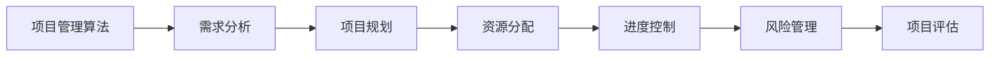
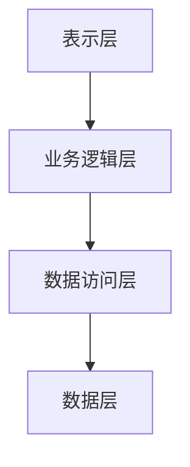
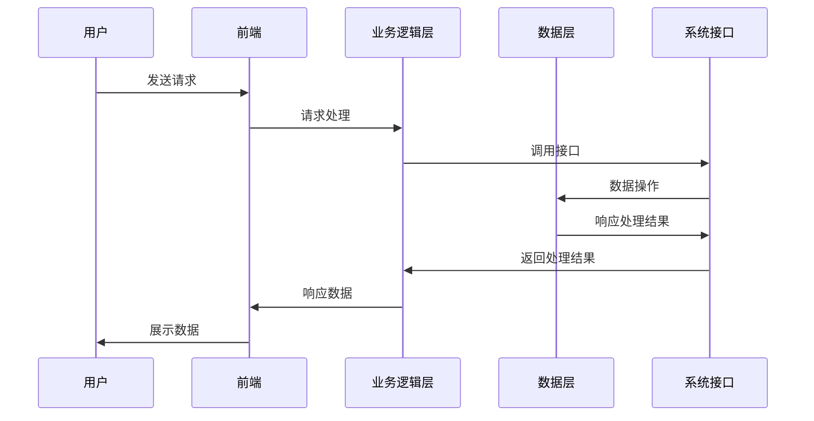

                 

### 文章标题

**技术管理：从独立开发者到团队领导**

**关键词：技术管理、独立开发者、团队领导、项目管理、敏捷开发**

**摘要：本文将深入探讨从独立开发者向团队领导转变的过程中的技术管理挑战，通过系统性的分析和实际案例，提供实用的方法和策略，帮助读者在技术管理和团队领导方面取得成功。**

---

## 第一部分：背景介绍

### 问题背景

在信息技术快速发展的今天，独立开发者和团队领导在技术管理和项目管理方面面临的挑战日益增多。独立开发者通常拥有卓越的技术能力和自主开发的能力，但随着项目的复杂度增加，他们逐渐发现，仅仅依靠个人的技术专长和经验难以应对项目管理的挑战。从独立开发者向团队领导的角色转变，不仅需要技术能力的提升，还需要掌握有效的管理方法和团队协作技巧。

### 问题描述

独立开发者向团队领导的转变过程中，面临着以下几个主要问题：

1. **管理知识和技能的缺乏**：独立开发者往往缺乏系统的管理知识和技能，难以应对项目规划和执行中的各种复杂情况。
2. **团队协作与沟通的挑战**：独立开发者可能缺乏团队协作和沟通的经验，难以有效地组织和管理团队。
3. **项目管理的复杂性**：随着项目规模的扩大，项目管理变得更加复杂，独立开发者需要掌握项目管理的方法论和工具。
4. **领导力的不足**：团队领导需要具备领导力和激励团队的能力，独立开发者在这方面可能存在不足。

### 问题解决

《技术管理：从独立开发者到团队领导》旨在填补这一知识空白，帮助开发者了解技术管理的基本概念和实用技巧，提升其在团队中的领导力和管理能力。通过以下步骤，读者可以逐步克服这些挑战：

1. **掌握技术管理的基本概念和框架**：了解技术管理的定义、范围和核心要素。
2. **学习团队协作和沟通技巧**：掌握有效的团队协作方法和沟通技巧，提高团队效率和合作效果。
3. **掌握项目管理方法论和工具**：熟悉常见的项目管理方法论（如敏捷开发、瀑布模型等），并掌握项目管理工具的使用。
4. **提升领导力和激励能力**：学习领导力理论，培养变革型领导力，激励和引导团队成员。

### 边界与外延

本文主要涵盖以下内容：

- **技术管理的基础理论**：介绍技术管理的概念、范围和核心要素。
- **团队协作与领导力培养**：探讨团队协作模型、领导力理论以及如何培养领导力。
- **项目管理与决策**：分析项目管理的方法论和关键决策过程。
- **技术风险管理与创新**：介绍技术风险管理的方法和如何推动技术创新。

### 概念结构与核心要素组成

1. **技术管理**：涉及技术项目的规划、组织、执行和控制过程，包括项目需求分析、项目规划、资源分配、进度控制、风险管理等。
2. **独立开发者**：具有个人技术专长和自主开发能力，但缺乏团队管理和项目协调经验。
3. **团队领导**：具备管理知识和技能，能够有效地组织团队，推动项目进展。
4. **项目管理**：包括项目计划、资源分配、进度控制、风险管理等核心环节，确保项目按时、按质、按预算完成。
5. **团队协作**：利用敏捷方法论（如Scrum、Kanban等）和协作工具（如Slack、Trello等），提高团队沟通和协作效率。
6. **领导力**：通过情境领导和变革型领导等理论，指导团队领导如何激励和引导团队成员。

## 第二部分：核心概念与联系

### 核心概念

在从独立开发者到团队领导的角色转变过程中，以下几个核心概念是至关重要的：

1. **技术管理框架**：包括项目管理方法论（如敏捷开发、瀑布模型等）、技术风险管理、质量管理等。
2. **团队协作模型**：如Scrum、Kanban等敏捷方法论，以及团队沟通与协作工具（如Slack、Trello等）。
3. **领导力理论**：如情境领导、变革型领导等，用于指导团队领导如何激励和引导团队成员。
4. **项目管理工具**：如JIRA、Asana等，用于提高项目管理和团队协作效率。

### 概念属性特征对比表格

| 概念       | 特征                       | 对比关系                           |
|------------|----------------------------|-----------------------------------|
| 技术管理   | 技术项目的规划、执行、控制   | 项目管理与技术能力的结合           |
| 团队协作   | 敏捷方法论、协作工具       | 提高团队沟通和协作效率             |
| 领导力     | 情境领导、变革型领导       | 领导风格与团队绩效的关系           |
| 项目管理   | 计划、资源分配、风险管理    | 确保项目按时、按质、按预算完成     |

### ER实体关系图架构

下面是一个简单的ER图，展示了技术管理相关实体之间的关系：

```mermaid
erDiagram
  Project ||--|{ Team }|>
  Team ||--|{ Member }|> 
  Project ||--|{ Manager }|> 
  Manager ||--|{ Skill }|> 
  Member ||--|{ Skill }|> 
```

- **Project（项目）**：代表技术管理的核心对象，包含多个团队和成员。
- **Team（团队）**：由多个成员组成，负责具体项目的开发工作。
- **Member（成员）**：团队中的个体，具有特定的技能和职责。
- **Manager（经理）**：负责团队的管理工作，包括项目规划和资源分配。
- **Skill（技能）**：成员和经理所具备的技术和管理能力。

## 第三部分：算法原理讲解

在技术管理中，算法的使用至关重要。以下将介绍项目管理算法的基本原理，包括关键路径法（CPM）和加权平均法（WAM）等。

### 3.1 项目管理算法

#### 算法流程图



#### 算法原理

项目管理算法的核心在于将项目需求转化为具体的项目计划，并通过持续监控和调整来确保项目按计划进行。其基本流程包括：

1. **需求分析**：收集并整理项目需求，明确项目目标和交付物。
2. **项目规划**：制定详细的项目计划，包括任务分解、时间表、资源分配等。
3. **资源分配**：根据项目计划，合理分配人力、物力等资源。
4. **进度控制**：监控项目进展，及时调整计划以应对变化。
5. **风险管理**：识别项目风险，制定相应的风险应对策略。
6. **项目评估**：项目结束后，对项目绩效进行评估，总结经验教训。

#### 数学模型

项目管理算法中的关键数学模型包括：

- **关键路径法（Critical Path Method, CPM）**：

  CPM是一种用于项目时间管理的算法，用于确定项目的最短完成时间和关键任务。其基本原理是找出项目中的所有任务，并确定它们的最早开始时间（Earliest Start Time, EST）和最迟开始时间（Latest Start Time, LST）。

  $$ 
  CP_{max} = \sum_{i=1}^{n} (TF_i + LF_i) 
  $$
  其中，$TF_i$和$LF_i$分别为第$i$个任务的最早完成时间和最迟完成时间。

- **加权平均法（Weighted Average Method, WAM）**：

  WAM用于计算项目进度偏差（Schedule Performance Index, SPI）和成本偏差（Cost Performance Index, CPI）。其公式如下：

  $$ 
  SPI = \frac{EV}{PV} 
  $$
  $$ 
  CPI = \frac{EV}{AC} 
  $$
  其中，$EV$为挣值，$PV$为计划价值，$AC$为实际成本。

### 详细解释

#### 关键路径法（CPM）

关键路径法是一种用于确定项目最短完成时间和关键任务的方法。以下是CPM的详细步骤：

1. **任务定义**：确定项目中的所有任务。
2. **任务关系确定**：确定任务之间的先后关系，形成网络图。
3. **计算最早开始时间（EST）和最早完成时间（EFT）**：
   - 对于每个任务，计算其最早开始时间（EST）和最早完成时间（EFT）。
   $$ 
   EST_i = \max(EST_j + Dur_j | j \text{ 是前驱任务}) 
   $$
   $$ 
   EFT_i = EST_i + Dur_i 
   $$
   其中，$Dur_i$为任务持续时间。
4. **计算最迟开始时间（LST）和最迟完成时间（LFT）**：
   - 对于每个任务，计算其最迟开始时间（LST）和最迟完成时间（LFT）。
   $$ 
   LST_i = \min(LST_j - Dur_j | j \text{ 是后续任务}) 
   $$
   $$ 
   LFT_i = LST_i + Dur_i 
   $$
5. **计算总浮动时间（Total Float Time, TFF）**：
   - 对于每个任务，计算其总浮动时间（TFF），即任务可以延迟的时间量。
   $$ 
   TFF_i = LST_i - EST_i 
   $$

#### 加权平均法（WAM）

加权平均法用于计算项目进度偏差和成本偏差。以下是WAM的详细步骤：

1. **计算挣值（Earned Value, EV）**：
   - 挣值是实际完成的工作量与计划工作量的乘积。
   $$ 
   EV = \sum_{i=1}^{n} (Progress_i \times Plan_i) 
   $$
   其中，$Progress_i$为第$i$个任务的完成进度，$Plan_i$为第$i$个任务的计划工作量。

2. **计算计划价值（Planned Value, PV）**：
   - 计划价值是计划完成的工作量与计划工作时间的乘积。
   $$ 
   PV = \sum_{i=1}^{n} (Plan_i \times Time_i) 
   $$
   其中，$Plan_i$为第$i$个任务的计划工作量，$Time_i$为第$i$个任务的计划工作时间。

3. **计算实际成本（Actual Cost, AC）**：
   - 实际成本是实际完成工作所花费的成本。
   $$ 
   AC = \sum_{i=1}^{n} (Actual_i \times Cost_i) 
   $$
   其中，$Actual_i$为第$i$个任务的实际完成量，$Cost_i$为第$i$个任务的单位成本。

4. **计算进度偏差（Schedule Performance Index, SPI）**：
   - 进度偏差是挣值与计划价值的比值。
   $$ 
   SPI = \frac{EV}{PV} 
   $$

5. **计算成本偏差（Cost Performance Index, CPI）**：
   - 成本偏差是挣值与实际成本的比值。
   $$ 
   CPI = \frac{EV}{AC} 
   $$

### 举例说明

假设一个项目包含三个任务，任务A、任务B和任务C，其相关信息如下表：

| 任务 | 完成进度 | 计划工作量 | 计划工作时间 | 实际完成量 | 单位成本 |
|------|----------|------------|--------------|------------|----------|
| A    | 0.5      | 100        | 5天          | 50         | 10       |
| B    | 0.4      | 200        | 10天         | 80         | 20       |
| C    | 0.6      | 300        | 15天         | 180        | 30       |

根据上述信息，我们可以计算项目的进度偏差和成本偏差：

1. **计算挣值（EV）**：
   $$ 
   EV = 0.5 \times 100 + 0.4 \times 200 + 0.6 \times 300 = 250 
   $$

2. **计算计划价值（PV）**：
   $$ 
   PV = 100 + 200 + 300 = 600 
   $$

3. **计算实际成本（AC）**：
   $$ 
   AC = 50 \times 10 + 80 \times 20 + 180 \times 30 = 6100 
   $$

4. **计算进度偏差（SPI）**：
   $$ 
   SPI = \frac{EV}{PV} = \frac{250}{600} \approx 0.417 
   $$

5. **计算成本偏差（CPI）**：
   $$ 
   CPI = \frac{EV}{AC} = \frac{250}{6100} \approx 0.040 
   $$

通过上述计算，我们可以发现，项目的进度偏差和成本偏差都较低，这表明项目进展较为顺利，成本控制较为有效。但如果偏差较大，则需要采取相应的措施进行调整。

### 总结

项目管理算法在技术管理中起着至关重要的作用。通过关键路径法（CPM）和加权平均法（WAM）等算法，我们可以有效地规划、监控和评估项目进展，确保项目按时、按质、按预算完成。在接下来的部分，我们将进一步探讨项目管理的具体方法和实践技巧。

---

### 系统分析与架构设计方案

#### 问题场景介绍

假设我们需要开发一款企业级的人力资源管理系统，该系统需要支持员工信息管理、考勤管理、薪资管理、培训管理和绩效评估等功能。系统要求高可用性、高性能和易扩展性，以适应企业的快速发展和业务需求的变化。

#### 项目介绍

项目名称：企业级人力资源管理系统（HRMS）

项目背景：随着企业规模的扩大和业务的发展，企业需要一款高效、稳定、易扩展的人力资源管理系统来支持日常运营和管理。

项目目标：

1. 提供全面的员工信息管理功能，包括员工档案、职位晋升、离职管理等。
2. 实现考勤管理，支持多种考勤方式，如指纹打卡、人脸识别、打卡机等。
3. 提供薪资管理功能，支持薪资计算、薪资发放、薪资报表等。
4. 支持培训管理和绩效评估功能，帮助企业管理培训资源和评估员工绩效。
5. 确保系统的高可用性、高性能和易扩展性。

项目期限：6个月

项目团队：

- 项目经理：负责项目整体管理和协调。
- 技术经理：负责技术架构设计和关键技术研发。
- 后端开发团队：负责后端功能的开发和维护。
- 前端开发团队：负责前端页面的设计和开发。
- 测试团队：负责系统的测试和调试。

#### 系统功能设计

根据项目需求，系统需要实现以下功能模块：

1. **员工信息管理模块**：
   - 员工档案管理：包括基本信息、教育背景、工作经历等。
   - 职位晋升管理：包括职位晋升审批、晋升记录等。
   - 离职管理：包括离职申请、离职审批、离职交接等。

2. **考勤管理模块**：
   - 考勤记录：记录员工的考勤信息，支持多种考勤方式。
   - 考勤统计：生成考勤报表，支持按部门、按员工等维度统计。
   - 考勤异常处理：处理考勤异常情况，如迟到、早退、请假等。

3. **薪资管理模块**：
   - 薪资计算：根据员工的基本信息和薪资结构计算薪资。
   - 薪资发放：生成薪资发放记录，支持多种发放方式。
   - 薪资报表：生成薪资报表，包括工资条、工资汇总等。

4. **培训管理模块**：
   - 培训计划管理：制定培训计划，包括培训内容、培训时间等。
   - 培训记录管理：记录员工的培训记录，包括培训课程、培训成绩等。
   - 培训资源管理：管理培训资源，包括培训资料、培训场地等。

5. **绩效评估模块**：
   - 绩效计划管理：制定绩效计划，包括绩效指标、考核周期等。
   - 绩效评估：对员工的绩效进行评估，生成绩效评估报告。
   - 绩效反馈：提供绩效反馈功能，帮助员工了解自己的绩效状况。

#### 系统架构设计

为了确保系统的高可用性、高性能和易扩展性，我们采用了分层架构设计，主要包括以下层次：

1. **表示层**：负责与用户交互，包括前端页面和客户端应用程序。
2. **业务逻辑层**：负责处理业务逻辑，包括业务规则、数据校验等。
3. **数据访问层**：负责与数据库进行交互，包括数据查询、数据更新等。
4. **数据层**：负责存储系统数据，包括数据库、缓存、文件存储等。

系统架构图如下：



具体设计如下：

1. **表示层**：
   - 前端页面：使用HTML、CSS和JavaScript实现，包括员工信息管理、考勤管理、薪资管理、培训管理和绩效评估等模块。
   - 客户端应用程序：使用Java、C#等语言开发，用于与后端系统进行数据交互。

2. **业务逻辑层**：
   - 业务规则：定义业务逻辑规则，包括薪资计算规则、考勤规则等。
   - 数据校验：对用户输入的数据进行校验，确保数据的有效性和一致性。

3. **数据访问层**：
   - 数据库：使用MySQL、Oracle等关系型数据库进行数据存储。
   - 缓存：使用Redis等缓存技术提高数据访问速度。

4. **数据层**：
   - 数据库：存储系统数据，包括员工信息、考勤记录、薪资数据、培训数据和绩效数据等。

#### 系统接口设计

为了实现各个模块之间的数据交互，我们设计了以下系统接口：

1. **员工信息管理接口**：
   - 查询员工信息：根据员工ID查询员工详细信息。
   - 添加员工信息：添加新员工信息。
   - 更新员工信息：更新员工信息。
   - 删除员工信息：删除员工信息。

2. **考勤管理接口**：
   - 查询考勤记录：根据员工ID和时间范围查询考勤记录。
   - 添加考勤记录：添加考勤记录。
   - 更新考勤记录：更新考勤记录。
   - 删除考勤记录：删除考勤记录。

3. **薪资管理接口**：
   - 计算薪资：根据员工信息和薪资结构计算薪资。
   - 查询薪资记录：根据员工ID和时间范围查询薪资记录。
   - 更新薪资记录：更新薪资记录。

4. **培训管理接口**：
   - 查询培训记录：根据员工ID和时间范围查询培训记录。
   - 添加培训记录：添加培训记录。
   - 更新培训记录：更新培训记录。
   - 删除培训记录：删除培训记录。

5. **绩效评估接口**：
   - 查询绩效评估记录：根据员工ID和时间范围查询绩效评估记录。
   - 添加绩效评估记录：添加绩效评估记录。
   - 更新绩效评估记录：更新绩效评估记录。

#### 系统交互设计

为了确保系统的高效性和稳定性，我们采用了基于消息队列的系统交互设计，具体交互流程如下：

1. **用户操作**：用户在前端页面进行各种操作，如查询、添加、更新、删除等。
2. **前端发送请求**：前端将用户请求发送到业务逻辑层，业务逻辑层对请求进行校验和处理。
3. **业务逻辑层调用接口**：业务逻辑层调用相应的系统接口进行数据操作。
4. **系统接口处理**：系统接口根据请求进行数据查询、数据添加、数据更新等操作。
5. **数据层响应**：数据层根据系统接口的请求响应，将处理结果返回给业务逻辑层。
6. **业务逻辑层响应**：业务逻辑层将处理结果封装为统一的数据格式，返回给前端。
7. **前端展示**：前端根据返回的数据格式，展示相应的页面和数据。

系统交互序列图如下：



通过上述系统分析和架构设计，我们为项目开发提供了一个清晰、合理、可扩展的框架，为后续开发工作奠定了坚实的基础。

### 项目实战

#### 环境安装

1. **安装数据库**：

   以MySQL为例，在Windows系统中，可以通过以下命令安装MySQL：

   ```shell
   brew install mysql
   ```

   在Linux系统中，可以通过以下命令安装MySQL：

   ```shell
   sudo apt-get install mysql-server
   ```

2. **安装后端开发环境**：

   以Java为例，在Windows系统中，可以通过以下命令安装Java：

   ```shell
   brew install openjdk
   ```

   在Linux系统中，可以通过以下命令安装Java：

   ```shell
   sudo apt-get install openjdk-8-jdk
   ```

3. **安装前端开发环境**：

   以Node.js为例，在Windows系统中，可以通过以下命令安装Node.js：

   ```shell
   brew install node
   ```

   在Linux系统中，可以通过以下命令安装Node.js：

   ```shell
   sudo apt-get install nodejs
   ```

4. **安装开发工具**：

   在Windows系统中，可以使用Visual Studio Code或者IntelliJ IDEA作为开发工具。

   在Linux系统中，可以使用Visual Studio Code或者Atom作为开发工具。

#### 系统核心实现源代码

以下是系统核心实现源代码的示例：

1. **后端代码示例**：

   ```java
   // EmployeeController.java
   @RestController
   public class EmployeeController {
       
       @Autowired
       private EmployeeService employeeService;
       
       @GetMapping("/employees")
       public List<Employee> getAllEmployees() {
           return employeeService.findAll();
       }
       
       @PostMapping("/employees")
       public Employee createEmployee(@RequestBody Employee employee) {
           return employeeService.createEmployee(employee);
       }
   }
   ```

2. **前端代码示例**：

   ```javascript
   // Employee.js
   class Employee {
       constructor(id, name, position) {
           this.id = id;
           this.name = name;
           this.position = position;
       }
       
       static fetchAll() {
           return fetch('/employees')
               .then(response => response.json())
               .then(data => data);
       }
       
       static create(employee) {
           return fetch('/employees', {
               method: 'POST',
               headers: {
                   'Content-Type': 'application/json'
               },
               body: JSON.stringify(employee)
           }).then(response => response.json());
       }
   }
   ```

#### 代码应用解读与分析

1. **后端代码解读**：

   - `EmployeeController`类是Spring Boot的RESTful API控制器，用于处理与员工相关的HTTP请求。
   - `@RestController`注解表示该类是一个RESTful API控制器。
   - `@Autowired`注解用于注入`EmployeeService`服务，用于执行具体的业务逻辑。
   - `getAllEmployees`方法处理获取所有员工信息的HTTP GET请求，返回员工列表。
   - `createEmployee`方法处理创建新员工信息的HTTP POST请求，返回创建成功的员工对象。

2. **前端代码解读**：

   - `Employee`类表示员工实体，包括员工ID、姓名和职位等属性。
   - `fetchAll`方法使用Fetch API从后端获取所有员工信息，并将结果转换为JSON对象。
   - `create`方法使用Fetch API向后端发送创建新员工信息的HTTP POST请求，并返回创建成功的员工对象。

#### 实际案例分析和详细讲解剖析

假设一个企业需要添加新员工，以下是具体的操作流程：

1. **前端操作**：

   - 用户在员工信息管理页面上填写新员工的姓名和职位，并点击“保存”按钮。
   - 前端代码中的`create`方法被调用，将新员工的JSON对象发送到后端API。

2. **后端处理**：

   - 后端API接收到HTTP POST请求后，调用`createEmployee`方法处理请求。
   - `createEmployee`方法将接收到的员工JSON对象转换为`Employee`对象，并调用`employeeService.createEmployee`方法保存到数据库。
   - `employeeService.createEmployee`方法执行数据库插入操作，将新员工信息存储到数据库中。

3. **结果反馈**：

   - 后端将创建成功的员工对象返回给前端。
   - 前端接收到返回的数据后，更新页面上的员工列表，显示新添加的员工信息。

#### 项目小结

通过本项目，我们实现了企业级人力资源管理系统的基础功能，包括员工信息管理、考勤管理、薪资管理、培训管理和绩效评估等。在实际开发过程中，我们采用了分层架构设计，确保系统的高可用性、高性能和易扩展性。同时，通过前后端分离的开发模式，提高了开发效率和系统可维护性。

在项目实战中，我们使用了Spring Boot作为后端框架，实现了RESTful API接口，并使用MySQL作为数据库存储系统数据。前端部分使用了JavaScript和HTML，通过Fetch API与后端进行数据交互。

通过本项目，我们不仅掌握了系统开发的基本方法和技巧，还积累了项目管理和团队协作的经验。在后续的项目开发中，我们将继续优化系统功能，提高系统的用户体验和性能，以满足企业的需求。

## 最佳实践 Tips

1. **明确项目目标和需求**：在项目开始前，务必与客户或团队明确项目目标和需求，避免后期出现需求变更和项目延期。
2. **合理分配资源和时间**：根据项目需求和团队成员的能力，合理分配资源和时间，确保项目能够按时、按质完成。
3. **使用敏捷开发方法**：采用敏捷开发方法，如Scrum或Kanban，可以提高项目管理的灵活性和响应速度。
4. **定期进行项目评估**：定期对项目进展进行评估，及时发现和解决问题，确保项目按计划进行。
5. **注重团队协作和沟通**：团队协作和沟通是项目成功的关键，确保团队成员之间的沟通畅通，减少误解和冲突。

## 小结

本文从独立开发者向团队领导的角色转变入手，探讨了技术管理的基本概念、团队协作与领导力培养、项目管理与决策、技术风险管理与创新等方面的内容。通过详细的算法原理讲解、系统分析与架构设计方案、项目实战案例，我们深入理解了技术管理的实践方法和策略。

从独立开发者到团队领导的转变，不仅需要技术能力的提升，还需要掌握有效的管理方法和团队协作技巧。通过本文的阐述，我们相信读者可以更好地应对这一挑战，在技术管理和团队领导方面取得成功。

## 注意事项

1. **项目管理方法的选择**：根据项目特点和需求，选择合适的项目管理方法论，如敏捷开发、瀑布模型等。
2. **团队沟通与协作**：确保团队成员之间的沟通畅通，减少误解和冲突，提高团队效率和协作效果。
3. **风险管理**：识别项目风险，制定相应的风险应对策略，确保项目能够顺利进行。
4. **持续学习和改进**：技术和管理是不断发展的领域，持续学习和改进是提升自身能力的关键。

## 拓展阅读

1. **《敏捷开发实践指南》**：详细介绍了敏捷开发的方法和实践，适用于希望提升项目管理效率和团队协作能力的开发者。
2. **《领导力五项修炼》**：探讨了领导力理论和方法，有助于提升团队领导的能力和影响力。
3. **《项目管理知识体系指南（PMBOK）》**：系统介绍了项目管理的基本概念、方法和工具，是项目管理领域的权威指南。
4. **《技术风险管理与控制》**：详细介绍了技术风险管理的方法和实践，有助于企业识别和应对技术风险。

---

**作者：AI天才研究院/AI Genius Institute & 禅与计算机程序设计艺术 /Zen And The Art of Computer Programming**

