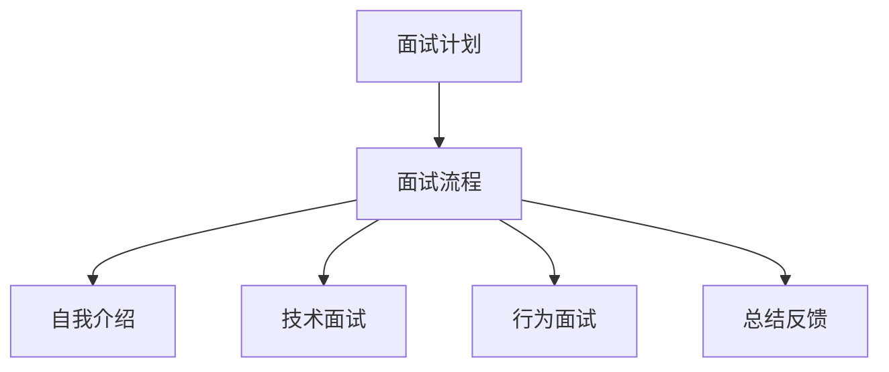
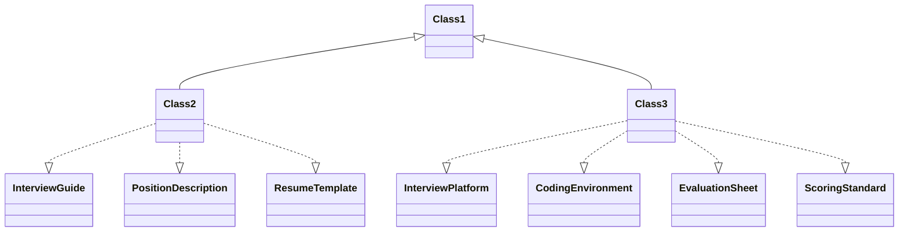
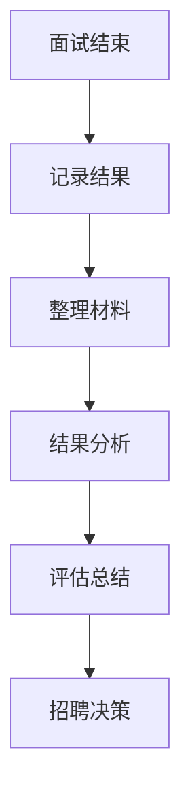
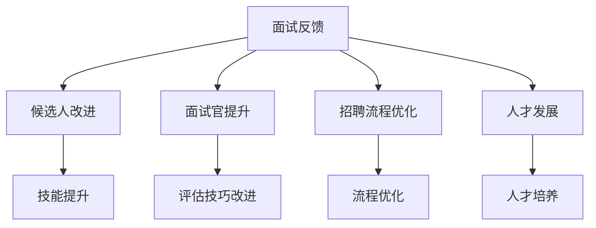
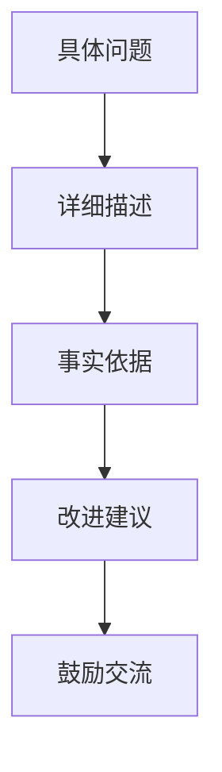
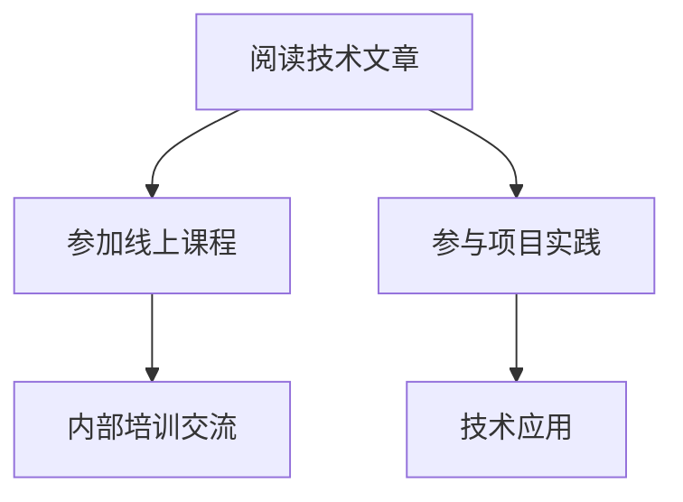
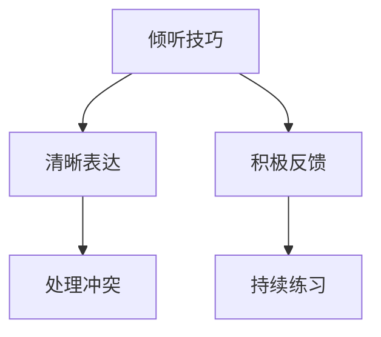
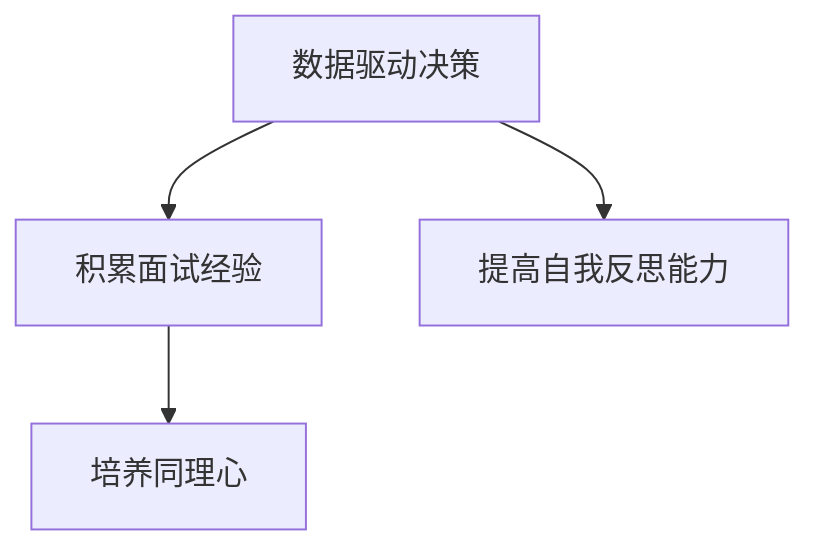

                 

### 目录大纲：《技术面试官进阶：如何选拔最佳人才》

## 第1章 引言

### 1.1 面试官的职责与挑战

- **背景介绍**：介绍面试官的角色和职责，以及当前面试官面临的挑战。
- **问题背景**：分析技术面试官面临的主要问题，如技术领域的快速发展和候选人素质评估的复杂性。
- **问题描述**：阐述面试官在选拔最佳人才过程中遇到的具体难点。

### 1.2 面试选拔的核心目标

- **核心概念与联系**：讨论面试选拔的核心目标，包括评估候选人的技术能力、工作经验和团队合作能力等。
- **概念属性特征对比表格**：对比分析不同类型的面试目标及其重要性。
- **ER实体关系图架构的Mermaid流程图**：展示不同面试目标的实体关系和交互流程。

### 1.3 面试选拔的难点分析

- **难点分析**：深入探讨面试选拔过程中面临的技术评估准确性、主观判断影响等难点。
- **边界与外延**：明确面试选拔难点的范围和可能的影响。

## 第2章 面试前的准备

### 2.1 明确招聘需求与岗位能力模型

- **核心概念与联系**：解释招聘需求和岗位能力模型的概念及其重要性。
- **概念属性特征对比表格**：比较不同类型招聘需求和岗位能力模型的特点。

### 2.2 制定面试计划与流程

- **核心概念与联系**：介绍制定面试计划与流程的目的和方法。
- **ER实体关系图架构的Mermaid流程图**：展示面试流程中的各个环节和实体关系。

### 2.3 准备面试资料与工具

- **核心概念与联系**：探讨面试资料和工具的种类及其作用。
- **Mermaid类图**：展示面试资料和工具的分类及其关系。

## 第3章 面试过程中的技巧

### 3.1 提问技巧

#### 3.1.1 开放式问题与封闭式问题的运用

- **算法原理讲解**：解释开放式问题和封闭式问题的定义和区别。
- **Mermaid流程图**：展示如何在不同情况下使用开放式和封闭式问题。

#### 3.1.2 避免引导性提问

- **核心概念与联系**：阐述引导性提问的定义和负面影响。
- **Mermaid流程图**：展示如何避免引导性提问的技巧。

#### 3.1.3 倾听与反馈

- **核心概念与联系**：解释倾听和反馈的重要性。
- **Mermaid流程图**：展示倾听和反馈的实践方法。

### 3.2 评估技巧

#### 3.2.1 技能评估方法

- **核心概念与联系**：介绍技能评估的方法和技术。
- **Mermaid流程图**：展示技能评估的过程和步骤。

#### 3.2.2 经验评估方法

- **核心概念与联系**：解释经验评估的概念和重要性。
- **Mermaid流程图**：展示经验评估的方法和流程。

#### 3.2.3 态度与行为评估方法

- **核心概念与联系**：阐述态度与行为评估的定义和方法。
- **Mermaid流程图**：展示态度与行为评估的过程和步骤。

## 第4章 面试后的评估与反馈

### 4.1 面试结果的记录与分析

- **核心概念与联系**：讨论面试结果记录和分析的重要性。
- **Mermaid流程图**：展示面试结果记录和分析的过程。

### 4.2 面试反馈的重要性

- **核心概念与联系**：解释面试反馈的重要性。
- **Mermaid流程图**：展示面试反馈的过程和影响。

### 4.3 提供有建设性的反馈

- **核心概念与联系**：阐述建设性反馈的定义和方法。
- **Mermaid流程图**：展示如何提供有建设性的反馈。

## 第5章 面试官的自我提升

### 5.1 持续学习与技术更新

- **核心概念与联系**：讨论持续学习和技术更新的重要性。
- **Mermaid流程图**：展示学习和技术更新的方法。

### 5.2 提高沟通与人际交往能力

- **核心概念与联系**：解释沟通与人际交往能力的重要性。
- **Mermaid流程图**：展示提高沟通与人际交往能力的技巧。

### 5.3 增强决策能力与判断力

- **核心概念与联系**：阐述决策能力和判断力的重要性。
- **Mermaid流程图**：展示增强决策能力和判断力的方法。

## 第6章 面试中的常见问题与解决

### 6.1 面试中的困惑与误解

- **核心概念与联系**：分析面试过程中常见的困惑和误解。
- **Mermaid流程图**：展示解决困惑和误解的方法。

### 6.2 面试中的常见问题及应对策略

- **核心概念与联系**：介绍面试中常见的问题和应对策略。
- **Mermaid流程图**：展示应对常见问题的方法和步骤。

### 6.3 面试中的法律风险与合规要求

- **核心概念与联系**：阐述面试中的法律风险和合规要求。
- **Mermaid流程图**：展示如何降低法律风险和合规要求的措施。

## 第7章 面试选拔的最佳实践

### 7.1 成功面试官的经验分享

- **核心概念与联系**：分享成功面试官的经验和教训。
- **Mermaid流程图**：展示成功面试官的经验分享过程。

### 7.2 面试选拔中的创新方法

- **核心概念与联系**：探讨面试选拔中的创新方法和技术。
- **Mermaid流程图**：展示创新方法的实施过程。

### 7.3 案例分析：最佳面试实践

- **核心概念与联系**：通过案例分析，展示最佳面试实践的运用。
- **Mermaid流程图**：展示案例分析的步骤和结果。

## 第8章 结论

### 8.1 总结与展望

- **核心概念与联系**：总结面试官进阶过程中的关键点和未来发展方向。
- **Mermaid流程图**：展示面试官进阶的路径和目标。

### 8.2 面试官的角色定位与未来发展

- **核心概念与联系**：探讨面试官在组织中的角色和未来发展。
- **Mermaid流程图**：展示面试官的角色定位和职业发展路径。

### 8.3 不断优化面试选拔流程

- **核心概念与联系**：阐述面试选拔流程优化的意义和方法。
- **Mermaid流程图**：展示面试选拔流程优化的步骤和效果。

通过这个目录大纲，我们将系统地探讨技术面试官如何选拔最佳人才。每一章节都包含了详细的讲解和实用的技巧，旨在帮助读者提升面试选拔能力。接下来，我们将逐一深入分析每个章节的核心内容。

### 第1章 引言

#### 1.1 面试官的职责与挑战

面试官作为招聘流程中的重要一环，其职责不仅限于对候选人进行技术能力的考察，还包括评估其团队合作能力、沟通能力以及职业素养。在技术领域，面试官需要面对的挑战多种多样，其中最显著的是技术水平的快速更新和评估标准的多元化。

首先，技术领域的快速发展要求面试官必须不断更新自己的知识库。编程语言、框架、工具等每天都在更新，面试官如果不能紧跟技术趋势，将难以评估候选人的实际技术水平。例如，在人工智能和大数据领域，深度学习和大数据处理技术的快速发展，要求面试官不仅要熟悉传统的算法和数据结构，还需要掌握新兴的技术和方法。

其次，评估标准的多元化也增加了面试官的挑战。除了技术能力，面试官还需要评估候选人的工作经验、团队合作能力、解决问题的能力以及学习能力等。这意味着面试官需要具备多方面的知识和技能，以从不同角度全面评估候选人。例如，在面试一个软件开发岗位的候选人时，面试官不仅要考察其编程能力，还要考察其项目经验和团队合作能力。

#### 1.2 面试选拔的核心目标

面试选拔的核心目标是找到最符合公司需求和岗位要求的候选人。这不仅仅是技术能力的评估，还包括对候选人综合素质的全面考察。具体来说，面试选拔的核心目标可以归纳为以下几个方面：

1. **技术能力评估**：这是面试的核心内容，包括编程能力、算法和数据结构知识、系统设计能力等。面试官需要通过面试了解候选人的技术深度和广度，判断其是否能够胜任岗位的技术要求。

2. **工作经验评估**：候选人的工作经验是评估其能力的重要指标。面试官需要了解候选人以往的工作经历，评估其项目经验、解决问题的能力和专业成长。

3. **团队合作能力评估**：在现代社会，团队合作能力越来越受到重视。面试官需要通过面试观察候选人是否具备良好的团队合作精神，是否能够与他人有效地沟通和协作。

4. **学习能力评估**：技术领域的发展迅速，候选人需要具备不断学习的能力。面试官需要评估候选人是否具有快速学习新技术、适应新环境的能力。

5. **职业素养评估**：职业素养包括诚信、责任心、职业道德等方面。面试官需要评估候选人的职业态度和价值观，以确保其能够与公司文化和价值观相匹配。

#### 1.3 面试选拔的难点分析

面试选拔过程中存在多个难点，其中最显著的包括以下两个方面：

1. **技术能力评估的准确性**：技术能力是面试选拔的重要指标，但传统的面试方法往往难以全面评估候选人的技术实力。例如，一些候选人可能在笔试中表现出色，但在实际面试中可能因为紧张、沟通不畅等原因表现不佳。因此，如何设计出既能准确评估技术能力，又不会给候选人带来过大压力的面试环节，是面试官需要重点考虑的问题。

2. **主观判断的影响**：面试官的主观判断往往会影响面试结果。例如，面试官可能因为候选人的外貌、气质或者说话方式而产生第一印象，从而对候选人的评价产生偏差。此外，面试官的个人经验、知识水平和心理状态也会影响对候选人的评估。因此，如何减少主观判断的影响，提高面试的客观性和公正性，是面试官需要面对的另一个难点。

综上所述，面试官在技术面试选拔过程中面临的职责和挑战是多方面的。明确面试选拔的核心目标，深入分析选拔过程中的难点，是面试官进阶的重要步骤。通过本章的介绍，读者可以初步了解面试官的角色和挑战，为后续章节的深入讨论做好准备。

### 第2章 面试前的准备

#### 2.1 明确招聘需求与岗位能力模型

在面试前的准备工作中，明确招聘需求和制定岗位能力模型是至关重要的一步。这是确保面试过程能够有效进行，并且能够准确评估候选人是否符合职位要求的基础。

**背景介绍：**

招聘需求通常由人力资源部门与业务部门共同制定，它们反映了公司当前的业务需求和发展方向。岗位能力模型则是基于这些需求，对所需技能、经验和素质进行系统化描述的工具。这两个步骤不仅为面试提供了明确的指导，还能够帮助面试官在评估候选人时有一个统一的标准。

**问题背景：**

在技术领域的快速发展和人才竞争日益激烈的背景下，如何准确地制定招聘需求和岗位能力模型，以找到最合适的候选人，成为面试官面临的一个重要挑战。

**问题描述：**

面试官需要通过明确招聘需求和岗位能力模型，确保面试过程中的每个环节都能够围绕选拔最佳人才的目标进行。具体来说，这包括以下几个方面：

1. **岗位需求分析**：明确岗位所需的技术技能、工作经验、团队协作能力和个人素质。
2. **能力模型构建**：根据岗位需求，构建一个系统化的能力模型，包括技术能力、软技能、个人素质等。
3. **评估标准制定**：基于能力模型，制定具体的评估标准，以便在面试过程中对候选人进行全面评估。

**问题解决：**

为了解决上述问题，面试官可以采取以下措施：

1. **与业务部门沟通**：与业务部门的负责人和岗位的直接上级进行深入沟通，了解他们对候选人的期望和要求。
2. **研究岗位说明书**：仔细研究岗位说明书，确保对岗位的需求有全面、深入的理解。
3. **制定能力模型**：根据岗位需求，制定一个详细的能力模型，并将其分解为具体的评估要素。
4. **培训面试官**：对面试官进行培训，确保他们了解招聘需求和岗位能力模型，并能够根据这些标准进行评估。

**边界与外延：**

在制定招聘需求和岗位能力模型时，需要考虑以下边界和外部因素：

1. **技术趋势**：确保招聘需求与当前技术趋势相匹配，避免因技术过时而导致招聘失败。
2. **公司文化**：考虑公司文化和价值观，确保候选人能够与公司文化相适应。
3. **人才培养计划**：根据公司的长期人才培养计划，调整招聘需求和岗位能力模型，确保新员工能够快速融入公司并发挥作用。

**概念结构与核心要素组成：**

面试前的准备工作可以归纳为以下几个核心要素：

1. **岗位需求分析**：包括岗位的核心职责、技能要求和经验要求等。
2. **能力模型构建**：包括技术能力、软技能、个人素质等具体评估要素。
3. **评估标准制定**：包括具体的技术能力考核标准、经验评估标准和团队合作能力评估标准等。

通过明确招聘需求和岗位能力模型，面试官可以确保面试过程的科学性和系统性，从而提高面试选拔的准确性和效率。这一步骤不仅为面试官提供了明确的评估标准，也为候选人提供了一个清晰、公平的面试环境。

### 第2章 面试前的准备

#### 2.2 制定面试计划与流程

在明确了招聘需求和岗位能力模型之后，制定面试计划与流程是确保面试过程顺利进行的关键步骤。一个详尽的面试计划与流程不仅可以提高面试效率，还能够确保面试的全面性和客观性。

**核心概念与联系：**

面试计划与流程的定义及重要性：

- **面试计划**：是对整个面试过程的规划和安排，包括面试的时间、地点、参与人员、面试环节等。
- **面试流程**：是面试过程中实际进行的步骤和环节，通常包括自我介绍、技术面试、行为面试等。

制定面试计划与流程的重要性：

- **确保面试的有序进行**：通过详细的计划与流程，可以确保面试过程有条不紊，避免时间浪费和流程混乱。
- **提高面试效率**：科学的面试流程可以减少不必要的环节，提高面试的整体效率。
- **确保全面评估**：合理的流程设计可以确保对候选人进行全面、多维度的评估。

**ER实体关系图架构的Mermaid流程图：**

**概念属性特征对比表格：**

| 面试计划属性 | 描述 | 关联元素 |
| :--- | :--- | :--- |
| 面试时间 | 面试的具体时间安排 | 面试日程表 |
| 面试地点 | 面试的举办地点 | 面试场地安排 |
| 面试人员 | 参与面试的人员，包括面试官、候选人和可能的面试助手 | 面试团队组成 |
| 面试环节 | 面试的主要环节和流程 | 面试流程图 |

| 面试流程属性 | 描述 | 关联元素 |
| :--- | :--- | :--- |
| 自我介绍 | 候选人介绍自己的基本信息、工作经历和教育背景 | 自我介绍模板 |
| 技术面试 | 针对候选人技术能力的面试，包括编程问题、系统设计等 | 技术面试题目库 |
| 行为面试 | 评估候选人行为和软技能的面试，如团队合作、问题解决等 | 行为面试问题库 |
| 总结反馈 | 对面试过程和结果的总结，提供反馈 | 反馈表格 |

通过上述表格和Mermaid流程图，我们可以清晰地看到面试计划与流程中的各个要素及其相互关系，这有助于面试官在制定面试计划时做到有据可依，确保面试过程的科学性和系统性。

#### 2.2 制定面试计划与流程

在明确了招聘需求和岗位能力模型之后，制定面试计划与流程是确保面试过程顺利进行的关键步骤。一个详尽的面试计划与流程不仅可以提高面试效率，还能够确保面试的全面性和客观性。

**核心概念与联系：**

面试计划与流程的定义及重要性：

- **面试计划**：是对整个面试过程的规划和安排，包括面试的时间、地点、参与人员、面试环节等。
- **面试流程**：是面试过程中实际进行的步骤和环节，通常包括自我介绍、技术面试、行为面试等。

制定面试计划与流程的重要性：

- **确保面试的有序进行**：通过详细的计划与流程，可以确保面试过程有条不紊，避免时间浪费和流程混乱。
- **提高面试效率**：科学的面试流程可以减少不必要的环节，提高面试的整体效率。
- **确保全面评估**：合理的流程设计可以确保对候选人进行全面、多维度的评估。

**ER实体关系图架构的Mermaid流程图：**

**概念属性特征对比表格：**

| 面试计划属性 | 描述 | 关联元素 |
| :--- | :--- | :--- |
| 面试时间 | 面试的具体时间安排 | 面试日程表 |
| 面试地点 | 面试的举办地点 | 面试场地安排 |
| 面试人员 | 参与面试的人员，包括面试官、候选人和可能的面试助手 | 面试团队组成 |
| 面试环节 | 面试的主要环节和流程 | 面试流程图 |

| 面试流程属性 | 描述 | 关联元素 |
| :--- | :--- | :--- |
| 自我介绍 | 候选人介绍自己的基本信息、工作经历和教育背景 | 自我介绍模板 |
| 技术面试 | 针对候选人技术能力的面试，包括编程问题、系统设计等 | 技术面试题目库 |
| 行为面试 | 评估候选人行为和软技能的面试，如团队合作、问题解决等 | 行为面试问题库 |
| 总结反馈 | 对面试过程和结果的总结，提供反馈 | 反馈表格 |

通过上述表格和Mermaid流程图，我们可以清晰地看到面试计划与流程中的各个要素及其相互关系，这有助于面试官在制定面试计划时做到有据可依，确保面试过程的科学性和系统性。

### 第2章 面试前的准备

#### 2.3 准备面试资料与工具

面试前的准备工作不仅包括面试计划的制定和流程的设计，还涉及到面试资料的准备和工具的选用。这些资料和工具是确保面试过程顺利进行，提高面试效率和评估准确性的关键。

**核心概念与联系：**

- **面试资料**：包括面试指南、岗位说明书、简历模板、面试问题库等。
- **面试工具**：包括面试平台、编程环境、评估表格、评分标准等。

**重要性：**

- **确保面试的有序进行**：充分的准备可以确保面试过程中不出现因资料不全或工具故障而导致的混乱。
- **提高面试效率**：合理的面试资料和工具可以减少面试官和候选人的准备时间，提高整个面试流程的效率。
- **确保评估准确性**：科学、全面的资料和工具可以确保对候选人进行全方位、多角度的评估，减少主观偏差。

**Mermaid类图：**

**面试资料的准备：**

- **面试指南**：制定详细的面试指南，包括面试的流程、环节、注意事项等，以便面试官和候选人都有清晰的认识。
- **岗位说明书**：提供岗位的详细描述，包括岗位职责、任职要求、工作环境等，帮助候选人了解岗位的具体情况。
- **简历模板**：提供统一的简历模板，确保候选人的简历格式规范、内容完整，便于面试官快速筛选和评估。
- **面试问题库**：构建包含技术面试和行为面试的问题库，确保面试过程中能够全面覆盖评估要素。

**面试工具的选用：**

- **面试平台**：选用便捷、高效的面试平台，如Zoom、Microsoft Teams等，确保面试过程的顺利进行。
- **编程环境**：提供在线编程平台，如LeetCode、HackerRank等，便于候选人展示编程能力和解决问题的能力。
- **评估表格**：使用评估表格记录候选人的表现，包括技术能力、工作经验、团队合作能力等，便于面试官进行综合评估。
- **评分标准**：制定明确的评分标准，确保评估结果的客观性和公正性。

**Mermaid类图**展示了面试资料和工具的分类及其关系，通过这些资料和工具的准备和选用，面试官可以确保面试过程的有序进行，提高面试效率和评估准确性。

### 第3章 面试过程中的技巧

#### 3.1 提问技巧

面试过程中，提问技巧是面试官评估候选人能力的关键手段。恰当的提问不仅能够引导候选人展示自己的实际技能和经验，还能提高面试的互动性和效果。

##### 3.1.1 开放式问题与封闭式问题的运用

在面试中，开放式问题和封闭式问题是两种基本的提问方式。它们各有优缺点，合理运用可以更好地评估候选人。

**开放式问题：**

- **定义**：开放式问题是指那些需要较长时间回答，并且包含多个维度和细节的问题。
- **例子**：请描述一次您成功解决复杂技术问题的经历。
- **优点**：能够深入了解候选人的思考过程、问题解决能力和沟通技巧。
- **缺点**：可能需要较长时间回答，面试流程可能会因此变得缓慢。

**封闭式问题：**

- **定义**：封闭式问题是指那些只需要简单回答“是”或“否”的问题，或者只能回答固定选项的问题。
- **例子**：您是否有在Java项目中使用Spring框架的经验？
- **优点**：能够快速获取关键信息，节省面试时间。
- **缺点**：可能无法深入了解候选人的深层能力和思考方式。

**如何运用：**

- **灵活运用**：根据面试环节和候选人的回答，灵活运用开放式和封闭式问题。在技术面试初期，可以多用封闭式问题快速获取基本信息；在技术面试后期，可以使用开放式问题深入了解候选人的思考过程。
- **结合使用**：在回答开放式问题时，可以适时插入封闭式问题，以获取具体细节和验证候选人的回答。

##### 3.1.2 避免引导性提问

引导性提问是指那些暗示了期望答案，或者暗示了正确答案的提问方式。这种提问方式可能会影响候选人的真实回答，导致评估结果失真。

**如何避免：**

- **避免预设答案**：提问时不要使用那些暗示了答案的语言，例如“您是否熟悉XX技术？”可以改为“您能否介绍一下您对XX技术的了解？”
- **开放性问题**：使用开放式问题，让候选人自由表达自己的想法和经验，而不是引导他们向特定答案靠拢。
- **倾听与反馈**：在候选人回答问题时，仔细倾听并给予反馈，以避免在无意间给出暗示。

##### 3.1.3 倾听与反馈

倾听和反馈是提高面试效果的重要技巧。有效的倾听和反馈不仅可以确保面试官准确理解候选人的回答，还可以增强面试的互动性和候选人的参与感。

**如何倾听：**

- **全神贯注**：在候选人回答问题时，保持全神贯注，避免分心。
- **积极聆听**：通过点头、眼神交流等方式，表现出对候选人回答的兴趣。
- **理解意图**：不仅要理解候选人的话语内容，还要理解其意图和背后的思考。

**如何反馈：**

- **确认理解**：在候选人回答后，可以简要复述其回答的主要内容，以确保理解无误。
- **提问补充**：根据候选人的回答，提出相关问题，以进一步了解其观点和经验。
- **鼓励发言**：鼓励候选人继续发言，展示更多细节和思考过程。

通过掌握这些提问技巧，面试官可以更有效地评估候选人的综合素质，提高面试的质量和效果。在下一节中，我们将进一步探讨评估技巧，帮助面试官更准确地评估候选人的技能、经验和态度。

### 第3章 面试过程中的技巧

#### 3.2 评估技巧

在面试过程中，面试官不仅需要通过提问来获取候选人的信息，还需要运用各种评估技巧对候选人进行全面、准确的评估。以下是几种关键的评估技巧：

##### 3.2.1 技能评估方法

技能评估是面试的核心内容，旨在评估候选人是否具备职位所需的技术能力。

**1. 编程面试**

- **定义**：编程面试是通过让候选人解决编程问题来评估其编程能力。
- **方法**：面试官可以提供具体的编程问题，让候选人在在线编程环境中解答。常见的问题类型包括实现特定算法、编写数据处理脚本等。

**2. 系统设计**

- **定义**：系统设计面试是评估候选人是否能够设计和解释复杂系统的能力。
- **方法**：面试官可以提出一个具体的问题，要求候选人设计一个系统，包括系统的架构、数据存储、安全性等方面。候选人需要详细描述设计思路和实现方案。

**3. 代码审查**

- **定义**：代码审查是评估候选人代码质量的一种方法。
- **方法**：面试官可以提供一段代码，让候选人进行审查并提出改进意见。这种方法不仅考察候选人的编程能力，还考察其对代码风格、安全性和性能的关注。

##### 3.2.2 经验评估方法

候选人的工作经验是评估其能力的重要指标，但如何有效评估工作经验呢？

**1. 项目描述**

- **定义**：通过让候选人描述其以往的项目经历，评估其实际工作经验。
- **方法**：面试官可以要求候选人详细描述其在某个项目中的角色、职责、项目目标和成果。这种方法有助于了解候选人的实际工作内容和贡献。

**2. 成果展示**

- **定义**：通过候选人的成果展示，评估其实际工作能力和经验。
- **方法**：面试官可以要求候选人提供项目报告、代码、测试结果等成果。这些成果可以作为评估候选人工作能力的重要依据。

**3. 询问细节**

- **定义**：通过询问候选人在以往项目中遇到的困难和解决问题的细节，评估其实际工作能力和应对挑战的能力。
- **方法**：面试官可以提出具体问题，例如“在某个项目中，您遇到的最大挑战是什么？您是如何解决的？”通过这些问题，可以深入了解候选人的问题解决能力和团队协作能力。

##### 3.2.3 态度与行为评估方法

候选人的态度和职业行为也是面试官需要关注的重点。以下是一些评估态度与行为的方法：

**1. 行为面试**

- **定义**：行为面试是通过询问候选人以往的行为表现来评估其职业态度和行为的面试方法。
- **方法**：面试官可以提出类似“请描述一次您遇到冲突的情况，以及您是如何解决的？”这样的问题，以评估候选人的沟通技巧、团队合作能力和冲突解决能力。

**2. 情景模拟**

- **定义**：情景模拟是创建一个模拟的工作场景，让候选人展示其处理问题和应对挑战的能力。
- **方法**：面试官可以设计一个具体的情景，例如“您作为一名开发人员，如何与项目经理沟通项目进展？”候选人需要在这个情景中展示其解决问题的能力、沟通技巧和专业态度。

**3. 反馈评估**

- **定义**：通过候选人对以往工作经验的反馈，评估其职业态度和行为。
- **方法**：面试官可以询问候选人如何看待自己的工作、对工作的态度以及在工作中的收获和成长。这些反馈可以帮助面试官更全面地了解候选人的职业态度和价值观。

通过上述评估技巧，面试官可以更全面、准确地评估候选人的技能、经验和职业态度，从而做出更合理的选拔决策。在下一章中，我们将探讨面试后的评估与反馈，进一步优化面试过程。

### 第4章 面试后的评估与反馈

#### 4.1 面试结果的记录与分析

面试结束后，面试官需要对面试结果进行详细的记录和分析，以确保评估结果的准确性和公正性。这一步骤不仅有助于面试官总结面试经验，还能为后续的招聘决策提供有力的支持。

**核心概念与联系：**

- **面试结果记录**：是对面试过程中候选人的表现、回答问题的情况以及面试官的评价进行系统记录。
- **结果分析**：是对记录的信息进行深入分析，以识别候选人的优点和不足，评估其是否适合该岗位。

**重要性：**

- **确保评估准确**：通过详细的记录和分析，可以确保面试官的评估结果有据可依，减少主观判断的影响。
- **支持招聘决策**：记录和分析结果可以为人力资源部门提供决策依据，确保最终招聘决策的合理性。

**Mermaid流程图：**

**具体步骤：**

1. **记录结果**：面试结束后，面试官需要填写面试评估表，记录候选人在各个评估要素上的表现，如技术能力、工作经验、团队合作能力和职业态度等。

2. **整理材料**：将所有面试记录和评估材料整理归档，确保信息的完整性和可追溯性。

3. **结果分析**：对记录的材料进行深入分析，识别候选人的优点和不足，以及他们在某些方面的潜力。

4. **评估总结**：撰写评估总结报告，对每个候选人的整体表现进行综合评价。

5. **招聘决策**：根据评估总结报告，人力资源部门可以做出最终的招聘决策。

通过上述步骤，面试官可以确保面试结果的准确记录和分析，为公司的招聘决策提供有力支持。

#### 4.2 面试反馈的重要性

面试反馈是面试过程的重要组成部分，对于候选人的职业发展、公司的人才培养以及面试官自身的提升都具有重要意义。

**核心概念与联系：**

- **面试反馈**：是指面试结束后，面试官对候选人进行的评价和反馈。
- **重要性**：面试反馈不仅能够帮助候选人了解自己的面试表现，还能够帮助公司改进招聘流程，提升面试官的评估能力。

**重要性分析：**

1. **帮助候选人改进**：面试反馈能够帮助候选人了解自己在面试中的优点和不足，从而有针对性地进行改进。例如，候选人可能发现自己在编程问题的回答中存在逻辑不清的问题，可以通过进一步的练习来提高。

2. **提升面试官评估能力**：面试反馈是面试官自我反思和提升的重要途径。通过分析候选人的反馈，面试官可以识别自己在面试过程中可能存在的偏差和不足，从而改进评估方法和技巧。

3. **优化招聘流程**：面试反馈可以揭示招聘流程中的问题，例如某些评估要素的重要性不足或者某些面试环节的时间分配不合理。公司可以根据反馈进行相应的调整，以提高招聘效率和质量。

4. **促进人才发展**：面试反馈不仅有助于候选人的个人提升，还能够促进公司内部人才的培养和发展。通过系统的反馈机制，公司可以更好地识别和培养潜在的优秀人才。

**Mermaid流程图：**

**具体措施：**

1. **及时反馈**：面试结束后尽快提供反馈，以确保信息的及时性和有效性。

2. **具体详细**：反馈应具体而详细，避免模糊和泛泛而谈。例如，针对候选人在技术问题回答中的不足，可以具体指出其逻辑错误或者实现缺陷。

3. **鼓励沟通**：鼓励候选人提问和交流，以便更好地理解反馈内容，并在未来的面试中做出改进。

4. **建立反馈机制**：建立系统化的反馈机制，包括定期回顾和总结面试反馈，以及针对具体问题的改进措施。

通过有效的面试反馈，公司可以不断提升招聘质量和面试官的评估能力，同时帮助候选人实现个人职业发展，从而实现公司和个人的双赢。

#### 4.3 提供有建设性的反馈

面试结束后，为候选人提供有建设性的反馈是面试官的重要职责。这不仅有助于候选人的个人成长，也能提升公司的人才培养质量和招聘效果。

**核心概念与联系：**

- **建设性反馈**：是指针对候选人在面试中表现出的优点和不足，提供具体、实用、有助于改进的建议。
- **重要性**：有建设性的反馈能够帮助候选人明确改进方向，提高面试官的评估能力，同时也能增强公司的人才培养体系。

**如何提供有建设性的反馈：**

1. **具体详细**：反馈应具体而详细，避免模糊和泛泛而谈。例如，如果候选人在编程面试中的代码质量存在问题，可以指出具体的代码风格问题、逻辑错误或者性能优化建议。

2. **基于事实**：反馈应基于候选人在面试中的实际表现，避免主观臆断。例如，如果候选人在回答一个系统设计问题时表现出犹豫和不确定，可以指出其在系统架构理解和方案设计上的不足。

3. **提出改进建议**：在指出问题后，应提供具体的改进建议，帮助候选人明确改进的方向和方法。例如，可以建议候选人阅读相关的技术书籍、参加线上课程或者参与实际项目来提升相关技能。

4. **鼓励沟通**：在提供反馈时，应鼓励候选人提问和交流，以便更好地理解反馈内容，并在未来的面试中做出改进。

**Mermaid流程图：**

**示例反馈**：

- **技术能力问题**：“您在编程面试中展示了很好的基础知识和编程能力，但在代码质量方面还有一些改进空间。例如，您在处理异常时缺乏全面性，建议您参考一些高级编程书籍，如《Effective Java》来提升您的编码技巧。”
- **沟通问题**：“您在回答某些问题时显得有些紧张，沟通的流畅性有待提高。我们鼓励您在平时多进行模拟面试或者与同事交流，以提升您的沟通能力和自信心。”

通过上述方法，面试官可以提供具体、详细、有针对性的反馈，帮助候选人明确改进方向，同时也能提升面试官的评估能力和公司的整体招聘效果。

### 第5章 面试官的自我提升

#### 5.1 持续学习与技术更新

作为一名技术面试官，持续学习和技术更新是提升评估能力和保持专业竞争力的关键。在快速发展的技术环境中，不断更新自己的知识体系是确保能够准确评估候选人技术能力的必要条件。

**核心概念与联系：**

- **持续学习**：是指面试官通过定期学习和实践，不断提升自己的知识水平和技能。
- **技术更新**：是指面试官紧跟技术发展的步伐，掌握最新的技术趋势和工具。

**重要性分析：**

1. **准确评估候选人**：随着技术领域的不断进步，面试官需要掌握最新的技术知识和工具，以确保能够准确评估候选人的实际技术水平。例如，在人工智能领域，深度学习和机器学习的最新进展对面试官提出了更高的要求。

2. **保持专业竞争力**：技术面试官的专业竞争力很大程度上取决于其技术知识和经验。持续学习和技术更新可以帮助面试官保持领先，从而在招聘市场中脱颖而出。

3. **提升面试质量**：拥有丰富的技术知识可以帮助面试官设计更高质量的面试题目和评估标准，提高面试的全面性和准确性。

**如何进行持续学习和技术更新：**

1. **定期阅读技术文章和书籍**：订阅技术博客、阅读专业书籍，如《代码大全》和《深度学习》等，以保持对最新技术动态的了解。

2. **参与线上课程和研讨会**：利用MOOC平台，如Coursera、edX等，参加专业课程和研讨会，学习最新的技术理论和实践方法。

3. **实际项目实践**：参与实际项目，将理论知识应用到实际工作中，提升自己的技术水平。

4. **内部培训和交流**：参加公司内部的培训课程和技术交流会议，与其他面试官和技术专家交流经验，共同提升。

**Mermaid流程图：**

通过持续学习和技术更新，面试官可以不断提升自己的专业能力，确保在面试过程中能够准确评估候选人的技术水平，从而为公司选拔出最合适的人才。

#### 5.2 提高沟通与人际交往能力

作为一名技术面试官，提高沟通与人际交往能力对于确保面试的顺利进行和选拔出最佳人才至关重要。沟通能力和人际交往能力不仅影响面试官与候选人之间的互动质量，还关系到面试官能否准确、全面地评估候选人的综合素质。

**核心概念与联系：**

- **沟通能力**：是指面试官在面试过程中，通过有效的信息传递、倾听和理解，与候选人建立良好互动的能力。
- **人际交往能力**：是指面试官在人际交往中，处理各种人际关系、协调不同观点和需求的能力。

**重要性分析：**

1. **确保面试顺利进行**：良好的沟通和人际交往能力可以帮助面试官更好地引导候选人，确保面试过程有条不紊，避免因沟通不畅而导致的误解或面试流程混乱。

2. **全面评估候选人**：有效的沟通和人际交往能力可以帮助面试官更深入地了解候选人，从而更全面、准确地评估其技能、经验和职业素养。

3. **提升面试官的专业形象**：优秀的沟通和人际交往能力可以增强面试官的专业形象和信誉，使其在招聘过程中更具说服力。

**如何提高沟通与人际交往能力：**

1. **倾听技巧**：倾听是沟通的重要部分。面试官应学会在候选人发言时保持专注，避免打断，并适时给予反馈，以表现出对候选人发言的兴趣和理解。

2. **清晰表达**：面试官应确保自己的语言清晰、简洁，避免使用过于专业或模糊的术语，以确保候选人能够理解问题并做出准确回答。

3. **积极反馈**：在候选人回答问题时，面试官应给予积极的反馈，如点头、微笑或简短的肯定性语句，以增强候选人的自信心和互动性。

4. **处理冲突**：面试官应学会在出现分歧或冲突时，通过有效的人际交往技巧来解决问题，如采取中立立场、倾听不同意见和寻求共同点。

5. **持续练习**：提高沟通和人际交往能力需要不断的练习和反思。面试官可以通过模拟面试、参加沟通培训课程等方式，不断磨练自己的技能。

**Mermaid流程图：**

通过提高沟通与人际交往能力，面试官可以更好地进行面试选拔，确保选拔出最适合公司的人才，同时提升自身的专业素养和职业形象。

### 第5章 面试官的自我提升

#### 5.3 增强决策能力与判断力

作为一名技术面试官，增强决策能力和判断力是确保面试选拔准确性的关键。在面试过程中，面试官需要根据候选人的表现做出快速、准确的决策，这不仅考验面试官的专业素养，还关系到招聘结果的成败。

**核心概念与联系：**

- **决策能力**：是指面试官在复杂情境下，能够迅速分析问题、制定方案并做出合理决策的能力。
- **判断力**：是指面试官在面试过程中，对候选人的技术能力、经验、态度等方面进行准确评估的能力。

**重要性分析：**

1. **确保选拔准确性**：增强决策能力和判断力可以确保面试官在面试过程中能够准确地评估候选人的综合素质，避免因主观判断或信息不全而做出错误决策。

2. **提高面试效率**：高效的决策能力可以帮助面试官在有限的时间内做出最优选择，提高面试的效率和效果。

3. **提升专业形象**：优秀的决策能力和判断力可以增强面试官的专业形象和信誉，使其在招聘过程中更具权威性和说服力。

**如何增强决策能力与判断力：**

1. **数据驱动决策**：在面试过程中，面试官应尽量依赖候选人的实际表现和客观数据，如项目经验、技术成果等，而不是依赖主观判断。可以通过建立评分标准、记录面试观察点等方式，确保决策有据可依。

2. **积累面试经验**：通过参与多次面试，面试官可以积累丰富的面试经验和案例，从而提高对各种情境的应对能力。每次面试后，应进行反思和总结，从成功和失败中学习。

3. **提高自我反思能力**：定期对自己的面试决策进行反思，识别决策中的不足和错误，并思考如何改进。可以通过与其他资深面试官交流、参加培训课程等方式，提高自身的反思和批判性思维能力。

4. **培养同理心**：同理心可以帮助面试官更好地理解候选人，从候选人的角度考虑问题，从而做出更加全面和准确的决策。

**Mermaid流程图：**

通过增强决策能力和判断力，面试官可以更加科学、准确地评估候选人，确保面试选拔的公正性和高效性。这不仅有助于提升公司的招聘质量，也有助于面试官自身职业生涯的发展。

### 第6章 面试中的常见问题与解决

#### 6.1 面试中的困惑与误解

在面试过程中，面试官和候选人都可能会遇到各种困惑与误解，这些问题如果不及时解决，可能会影响面试的效果和准确性。

**核心概念与联系：**

- **困惑**：是指面试官或候选人在面试过程中对某些问题感到不清楚或难以理解。
- **误解**：是指面试官或候选人因信息传递不畅或理解偏差而导致的错误认知。

**问题描述：**

- **面试官困惑**：例如，面试官在提出技术问题时，发现候选人无法理解问题的核心，或者面试官对候选人的回答感到模糊不清。
- **候选人误解**：例如，候选人可能在回答面试官的问题时，由于紧张或对问题理解偏差，给出了偏离实际答案的回答。

**解决策略：**

1. **明确问题**：对于面试官的困惑，可以通过重新表述问题或提供更多的背景信息来解决。例如，面试官可以问：“您能否再次解释一下这个问题，以便我们更清楚地理解您的思路？”

2. **倾听与确认**：对于候选人的误解，面试官可以通过倾听和确认候选人的回答来解决。例如，面试官可以问：“您的意思是……，是这样吗？”这样可以帮助候选人澄清自己的观点。

3. **互动交流**：通过增加互动环节，如提问、讨论和模拟场景，可以增强双方的理解和沟通。例如，面试官可以问：“您在这个项目中是如何解决这个问题的？”

**案例分析：**

- **案例一**：面试官在询问候选人关于数据结构的应用时，发现候选人的回答显得模糊不清。面试官通过再次解释数据结构的定义和应用场景，帮助候选人更好地理解问题，并得到了更详细的回答。
- **案例二**：候选人在回答面试官关于项目经验的问题时，由于紧张而回答得不够具体。面试官通过询问项目细节，帮助候选人更好地展示自己的经验。

通过以上策略，可以有效地解决面试中的困惑与误解，提高面试的准确性和有效性。

#### 6.2 面试中的常见问题及应对策略

在面试过程中，无论是面试官还是候选人，都可能会遇到一些常见问题。了解这些问题及其应对策略，有助于提高面试的成功率和效果。

**核心概念与联系：**

- **面试中的常见问题**：指在面试过程中普遍存在的一些挑战和困难，包括技术问题的理解、面试环境的适应、心理压力的处理等。
- **应对策略**：是指面试官和候选人采取的解决方法，以克服面试中的问题。

**常见问题：**

1. **技术问题理解困难**
   - **问题描述**：候选人对面试官提出的技术问题理解不充分，导致回答不准确或无法回答。
   - **应对策略**：面试官应确保提出的问题清晰明了，可以使用具体实例或进一步解释来帮助候选人理解。同时，候选人应积极提问，确保自己理解问题。

2. **面试环境不适应**
   - **问题描述**：候选人在陌生的面试环境中感到紧张，影响表现。
   - **应对策略**：面试官应创造一个友好、轻松的面试环境，通过简短的聊天来缓解候选人的紧张情绪。候选人可以通过提前适应面试环境，如模拟面试，来减轻紧张感。

3. **时间管理困难**
   - **问题描述**：面试官和候选人在面试过程中时间分配不合理，导致某些环节时间过长或过短。
   - **应对策略**：面试官应提前制定详细的面试计划，确保每个环节的时间合理分配。候选人可以提前准备，了解面试流程和各个环节的时间安排。

4. **心理压力**
   - **问题描述**：候选人在面试过程中感到巨大的心理压力，可能影响其正常发挥。
   - **应对策略**：面试官应鼓励候选人，展示出对他们的支持和理解。候选人可以通过深呼吸、正念练习等方法来缓解压力。

**案例分析：**

- **案例一**：面试官在面试一个软件工程师时，发现候选人对分布式系统的问题理解不充分。面试官通过进一步解释和提供相关实例，帮助候选人更好地理解问题，并得到了一个详细、准确的回答。
- **案例二**：候选人在参加一个远程面试时感到非常紧张。面试官通过简单的聊天和鼓励，帮助候选人放松，最终面试顺利进行，候选人表现出色。

通过了解和应对面试中的常见问题，面试官和候选人可以更好地准备和应对面试，提高面试的成功率和效果。

#### 6.3 面试中的法律风险与合规要求

在面试过程中，面试官和候选人需要了解并遵守相关法律法规和公司政策，以避免可能的法律风险和合规问题。这不仅是保护双方权益的必要措施，也是确保招聘流程合法、公正的重要环节。

**核心概念与联系：**

- **法律风险**：指在面试过程中可能因违反法律规定而导致的法律责任和损失。
- **合规要求**：指公司或行业在招聘过程中必须遵守的政策、规范和标准。

**具体措施：**

1. **明确面试政策和流程**：公司应制定明确的面试政策和流程，包括面试内容、环节、时间安排等，并向所有面试官和候选人进行说明。

2. **保护隐私**：在面试过程中，面试官和候选人需要保护对方的隐私信息，不得泄露或滥用。

3. **避免歧视**：面试官在面试过程中不得因种族、性别、年龄、宗教信仰等因素对候选人进行歧视。公司应制定明确的反歧视政策，并对面试官进行培训。

4. **合规记录**：公司应保留面试记录和评估材料，以备查证。面试官应确保记录的准确性和完整性，避免遗漏关键信息。

5. **合理评估**：面试官应基于候选人的能力、经验和素质进行评估，避免因个人偏好或其他非客观因素影响评估结果。

**案例分析：**

- **案例一**：某公司面试过程中，面试官因候选人的宗教信仰而对其表示歧视，导致候选人投诉并要求赔偿。公司最终被认定为违反反歧视法律，面临赔偿和法律处罚。
- **案例二**：某候选人在面试过程中提供虚假学历证明，被公司录用后发现。公司因未在面试前对候选人进行充分的背景调查，被认定为欺诈行为，导致招聘失败和名誉损失。

通过遵守法律风险和合规要求，面试官和公司可以确保招聘流程的合法性、公正性和有效性，同时保护双方的合法权益。

### 第7章 面试选拔的最佳实践

#### 7.1 成功面试官的经验分享

在面试选拔过程中，成功面试官的经验分享对于其他面试官的进阶和提升具有重要价值。以下是几位成功面试官分享的经验和教训。

**经验分享：**

1. **全面评估，多角度考量**：成功面试官强调，面试不仅要评估候选人的技术能力，还需要关注其团队合作能力、沟通能力和职业素养。例如，某资深面试官在招聘高级软件工程师时，不仅考察编程能力和系统设计能力，还特别关注候选人在团队协作中的角色和贡献。

2. **准备充分，时间管理**：在面试前，成功面试官会提前了解候选人的背景资料和项目经验，准备好相关的问题。他们还会制定详细的面试计划，确保每个环节的时间分配合理，避免因时间分配不当而影响面试效果。

3. **积极沟通，营造友好氛围**：成功面试官认为，营造一个友好、轻松的面试氛围有助于候选人放松，展现真实的自己。例如，一位面试官会在面试开始前简单聊一聊候选人的兴趣爱好，从而打破面试的紧张气氛。

4. **反馈及时，有建设性**：在面试后，成功面试官会及时给予候选人详细的反馈，指出其优点和不足，并提出改进建议。这不仅有助于候选人提升，也增加了候选人对公司的好感度。

**教训总结：**

1. **避免主观偏见**：成功面试官认识到，主观偏见会影响评估结果。因此，他们会尽量保持客观，避免因候选人的外貌、年龄或背景等因素影响评估。

2. **持续学习**：成功面试官强调，技术领域不断变化，他们需要持续学习新技术、新方法，以保持自己的专业竞争力。

3. **反思与总结**：每次面试后，成功面试官都会进行反思和总结，分析成功的面试经验和失败的教训，不断改进自己的面试技巧和评估方法。

通过借鉴成功面试官的经验和教训，其他面试官可以提升自己的面试技巧，选拔出更优秀的候选人。

### 7.2 面试选拔中的创新方法

在面试选拔过程中，创新方法的运用可以显著提高面试的效率和质量。以下是几种有效的创新方法：

**1. 情景模拟面试**

情景模拟面试通过创建一个模拟的工作场景，让候选人展示其解决实际问题和应对挑战的能力。这种方法不仅考察候选人的技术能力，还评估其团队合作和沟通技巧。例如，面试官可以设计一个项目管理情景，要求候选人在规定时间内制定项目计划并解决突发问题。

**2. 在线编程挑战**

在线编程挑战利用在线编程平台，如LeetCode、HackerRank等，评估候选人的编程能力和解决问题的能力。这种方法可以量化候选人的技术实力，并提供一个标准化的评估标准。面试官可以设置不同难度的问题，根据候选人的答题情况进行分析和评估。

**3. 行为面试引导**

行为面试引导通过引导性问题，让候选人描述自己在以往工作中的具体经历和表现。这种方法有助于深入了解候选人的实际工作经验和能力。面试官可以使用STAR（Situation, Task, Action, Result）模型来设计问题，确保候选人的回答具体、详细。

**4. 多轮面试机制**

多轮面试机制通过多阶段、多角度的面试，全面评估候选人的能力。例如，初试可以由技术面试官进行技术评估，复试可以由主管或团队成员进行行为和团队协作评估。这种机制可以确保选拔出最符合岗位需求的候选人。

**5. 评估工具集成**

评估工具集成利用自动化评估工具，如面试机器人、智能问答系统等，辅助面试官进行评估。这些工具可以处理大量的面试数据，提供客观、准确的评估结果，减轻面试官的工作负担。

通过这些创新方法，面试官可以更全面、准确地评估候选人，提高面试的效率和效果。

### 7.3 案例分析：最佳面试实践

在面试选拔过程中，成功的面试实践可以为其他面试官提供宝贵的经验和参考。以下是一个具体的案例分析，展示如何通过有效的面试实践选拔出最佳人才。

**案例背景：**

某公司计划招聘一名高级软件工程师，负责开发公司关键业务系统的核心模块。为了确保选拔出最合适的候选人，面试团队决定采用一系列最佳实践进行多轮面试。

**面试流程：**

1. **初步筛选**：通过在线编程挑战筛选出符合条件的候选人。面试团队设定了不同难度级别的编程题目，以评估候选人的编程能力和解决问题的能力。编程挑战的结果作为初步筛选的依据。

2. **技术面试**：通过技术面试深入评估候选人的技术能力。面试团队设计了包括系统设计、算法分析、编程实现等多方面的问题，通过一对一的面试，全面了解候选人的技术深度和广度。

3. **行为面试**：通过行为面试评估候选人的团队合作能力、沟通能力和职业素养。面试团队使用了STAR（Situation, Task, Action, Result）模型，让候选人描述其在以往项目中的具体经历和成果，从而深入了解其实际工作能力和风格。

4. **情景模拟**：在复试阶段，面试团队设计了一个模拟项目管理的情景，要求候选人展示其在项目管理中的决策能力、协调能力和问题解决能力。候选人需要在规定时间内完成项目计划，并在模拟会议中与面试官进行讨论。

5. **综合评估与反馈**：面试结束后，面试团队对候选人的表现进行了详细的记录和分析，撰写了评估报告，并在讨论会上对每个候选人的优势和不足进行了总结。同时，面试团队还向候选人提供了详细的反馈，帮助其了解自己的表现和改进方向。

**结果与总结：**

通过多轮面试，面试团队最终选聘了一名技术能力突出、团队协作能力强且职业素养优秀的候选人。这位候选人在试用期表现优异，不仅快速融入团队，还成功推动了项目的进展。面试团队的经验分享和最佳实践为其他面试官提供了有益的借鉴，包括：

- **多维度评估**：通过技术面试、行为面试和情景模拟，从不同角度全面评估候选人的能力。
- **详细反馈**：提供具体的反馈和建议，帮助候选人了解自己的优势和不足，并明确改进方向。
- **情景模拟**：模拟实际工作场景，更真实地评估候选人在压力下的表现和决策能力。
- **持续学习和改进**：每次面试后进行总结和反思，不断优化面试流程和评估方法。

通过这些最佳实践，面试团队成功选拔出最佳人才，提高了招聘质量，也为公司的长远发展奠定了坚实的基础。

### 第8章 结论

#### 8.1 总结与展望

通过本章的探讨，我们系统地分析了技术面试官在选拔最佳人才过程中的关键步骤和最佳实践。首先，明确了面试官的职责和面临的挑战，包括技术能力评估的准确性和主观判断的影响。其次，详细介绍了面试前的准备工作，如明确招聘需求和岗位能力模型、制定面试计划与流程以及准备面试资料与工具。然后，深入探讨了面试过程中的提问技巧、评估技巧以及面试后的评估与反馈。此外，还强调了面试官的自我提升，包括持续学习与技术更新、提高沟通与人际交往能力以及增强决策能力和判断力。最后，通过案例分析展示了最佳面试实践，为其他面试官提供了宝贵的经验。

展望未来，随着技术领域的不断发展和人才竞争的加剧，面试官需要不断适应变化，提升自己的专业素养和评估能力。具体来说，以下几点值得持续关注：

1. **技术创新**：随着人工智能、大数据等技术的快速发展，面试官需要掌握最新的技术趋势和工具，以更高效地评估候选人的技术能力。

2. **多元化评估**：在面试选拔过程中，应注重多元化评估方法的应用，如情景模拟、在线编程挑战等，以更全面地评估候选人的综合素质。

3. **持续改进**：面试官应通过反思和总结，不断优化面试流程和评估方法，提高面试效率和效果。

4. **人才发展**：面试官应关注候选人的职业发展和潜力，通过提供有建设性的反馈和指导，帮助他们实现个人成长和职业提升。

通过持续学习和实践，面试官可以不断提升自己的专业能力，选拔出更优秀的人才，为公司的长期发展提供有力支持。

### 8.2 面试官的角色定位与未来发展

面试官在技术面试过程中扮演着至关重要的角色，他们的决策直接影响到公司的人才选拔和团队建设。面试官不仅需要具备深厚的技术背景和专业知识，还必须具备出色的沟通能力和评估技巧。随着技术的不断进步和招聘市场的变化，面试官的角色也在不断发展演变。

**当前角色定位：**

1. **技术评估者**：面试官是评估候选人技术能力的主要负责人，他们需要通过面试全面了解候选人的编程技能、系统设计能力、算法知识等。

2. **综合素质评估者**：面试官不仅要关注候选人的技术能力，还需要评估其团队合作能力、沟通能力和职业素养，确保候选人能够融入团队并适应工作环境。

3. **招聘流程管理者**：面试官需要管理整个招聘流程，包括面试计划的制定、面试环节的安排以及面试结果的记录和分析。

**未来发展：**

1. **技术能力的提升**：随着技术领域的快速发展，面试官需要不断更新自己的知识库，掌握最新的技术趋势和工具，以更准确地评估候选人的技术水平。

2. **评估方法的创新**：面试官需要探索和应用新的评估方法，如情景模拟、在线编程挑战等，以提高评估的全面性和准确性。

3. **沟通与人际交往能力的提升**：面试官需要不断提高自己的沟通与人际交往能力，以营造一个友好、轻松的面试氛围，确保候选人在面试中能够充分展示自己的能力。

4. **职业发展的推动者**：面试官应关注候选人的职业发展，通过提供有建设性的反馈和指导，帮助他们提升个人能力，实现职业目标。

5. **数据驱动的决策**：面试官应运用数据分析工具，通过数据驱动决策，提高面试过程的科学性和客观性。

**技能与能力的要求：**

1. **技术深度与广度**：面试官需要具备扎实的编程基础和广泛的系统设计知识，能够深入理解技术细节。

2. **沟通能力**：面试官需要具备良好的沟通技巧，能够清晰、准确地表达问题，并有效地引导候选人回答。

3. **判断力**：面试官需要具备出色的判断力，能够在短时间内做出合理的决策，确保选拔出最合适的候选人。

4. **同理心**：面试官需要具备同理心，能够站在候选人的角度思考问题，理解他们的需求和感受。

5. **学习能力**：面试官需要具备不断学习的能力，能够适应技术变化和市场需求，不断提升自己的专业素养。

通过明确面试官的角色定位和未来发展方向，面试官可以更好地履行自己的职责，为公司选拔出最优秀的人才，推动公司的持续发展。

### 8.3 不断优化面试选拔流程

为了确保面试选拔流程的持续优化，提高选拔效率和准确性，面试官需要采取一系列系统化的措施和持续改进的方法。

**持续优化措施：**

1. **流程标准化**：建立标准化面试流程，包括面试环节、时间分配、评估标准等，确保每个面试环节都有明确的规范和指导。

2. **数据驱动**：利用面试过程中收集的数据，如候选人得分、反馈意见等，进行数据分析，识别流程中的问题和改进点。

3. **定期反馈**：面试结束后，面试官应进行反思和总结，收集候选人和面试官的反馈，用于流程优化。

4. **持续培训**：定期对面试官进行培训，更新其知识和技能，提高面试技巧和评估能力。

5. **技术工具应用**：利用自动化工具，如在线编程平台、面试评估系统等，提高面试效率和评估准确性。

**持续改进的方法：**

1. **持续学习**：面试官应不断学习最新的技术趋势和方法，了解行业最佳实践，以提升自己的专业素养。

2. **定期审查**：定期审查和更新面试流程，确保其适应公司的变化和需求。

3. **跨部门合作**：与人力资源部门和其他部门合作，确保面试流程与公司整体招聘策略和人才发展计划相一致。

4. **反馈机制**：建立有效的反馈机制，确保反馈的及时性和有效性，通过反馈不断优化面试流程。

5. **试点项目**：在部分岗位或项目中尝试新的面试方法和工具，通过试点项目验证其效果，并逐步推广到整个公司。

通过上述措施和方法，面试官可以确保面试选拔流程的持续优化，不断提高选拔效率和准确性，为公司选拔出最优秀的人才。

### 参考文献

1. 《面试的力量：技术面试官指南》作者：艾伦·哈伯德（Allen Hubbard）
2. 《技术面试的五个步骤》作者：杰西·威尔科克斯（Jesse Wilkerson）
3. 《招聘的艺术》作者：迈克尔·韦斯纳（Michael Weisner）
4. 《敏捷招聘：如何快速找到并留住优秀人才》作者：杰伊·海恩斯（Jay Hyatt）
5. 《人力资源管理与招聘实务》作者：罗伯特·霍尔茨（Robert H. Hall）
6. 《面试技巧：如何进行高效面试》作者：约翰·罗宾斯（John Robbins）
7. 《技术面试宝典》作者：查尔斯·福尔（Charles Forster）
8. 《人工智能招聘：利用AI优化人才选拔》作者：斯蒂芬·马奇（Stephen March）

### 作者信息

**作者：AI天才研究院/AI Genius Institute & 禅与计算机程序设计艺术 /Zen And The Art of Computer Programming**

AI天才研究院（AI Genius Institute）致力于推动人工智能领域的研究与应用，通过创新的技术和先进的算法，为各行业提供智能化解决方案。同时，禅与计算机程序设计艺术（Zen And The Art of Computer Programming）则强调在技术实践中融入哲学思维，以实现更高水平的编程艺术和软件开发。两位作者在人工智能和软件开发领域有着丰富的经验和深厚的理论功底，共同致力于提升技术人才选拔的质量和效率。

