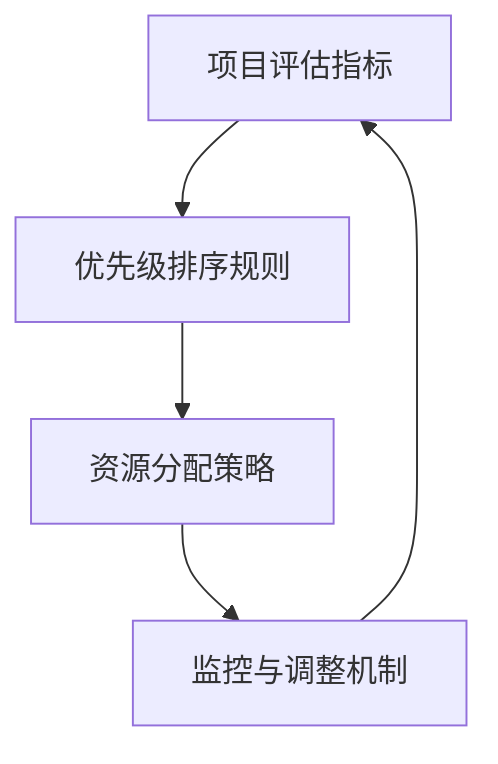
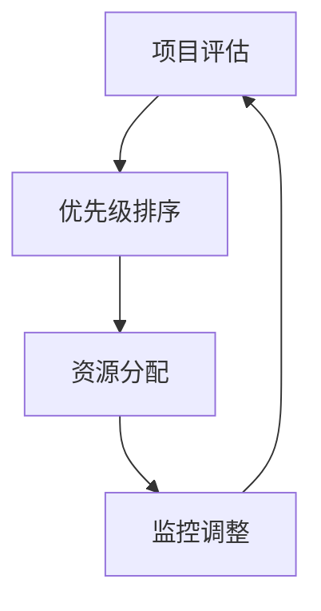
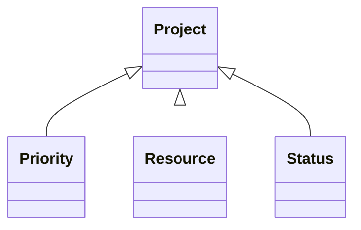
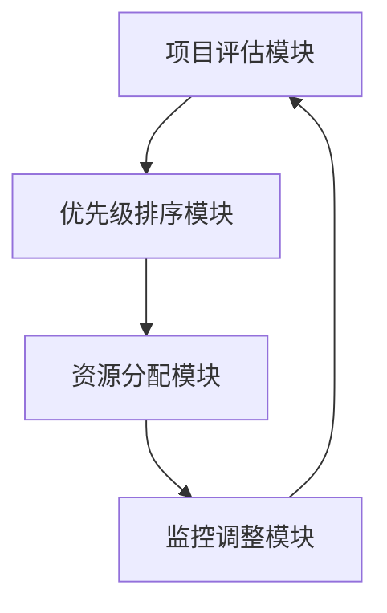
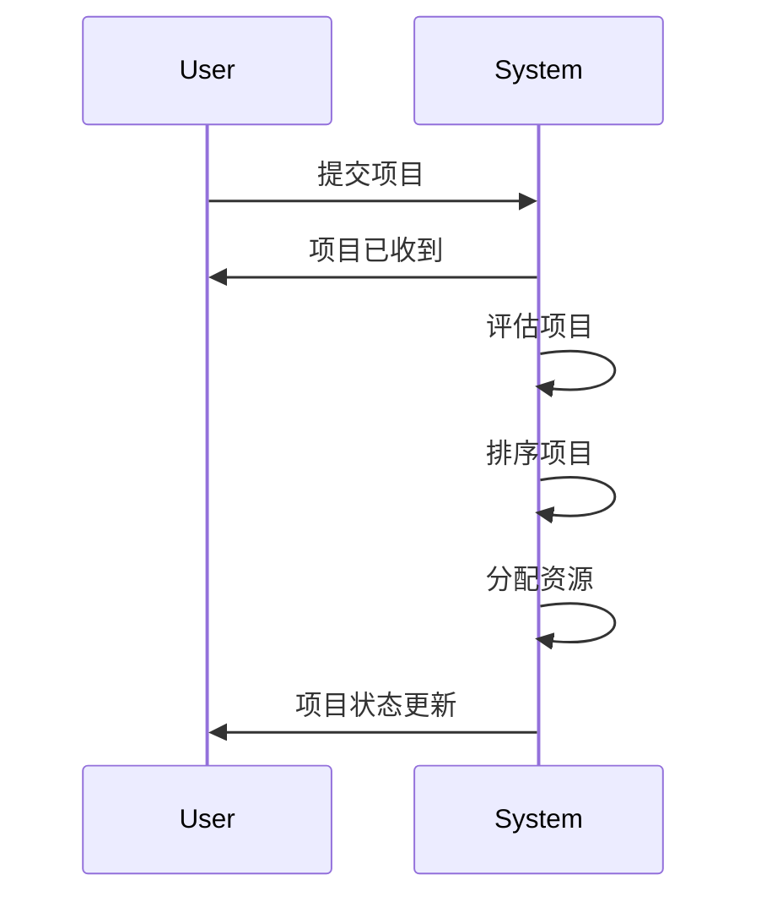
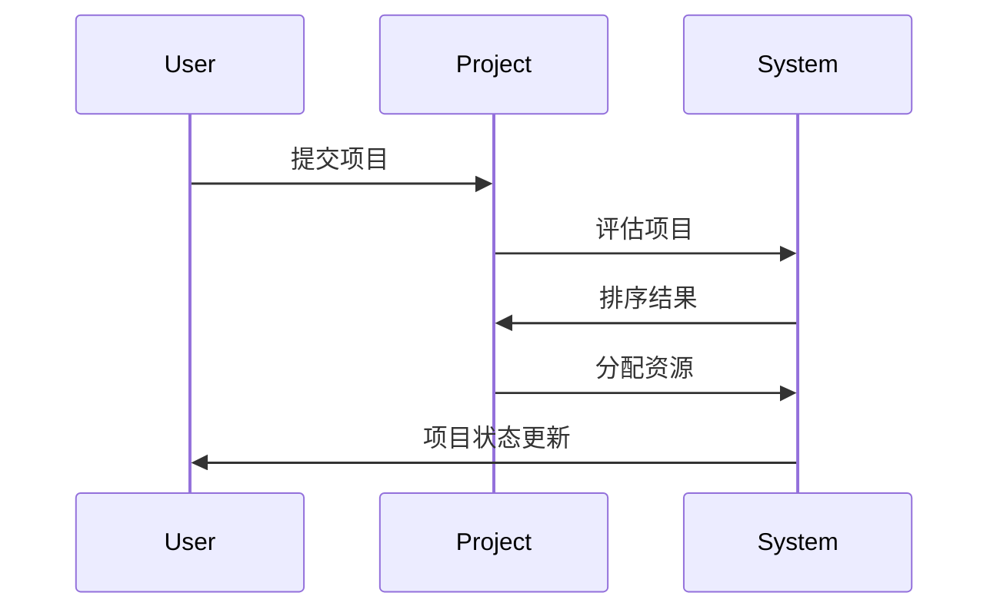

                 

# 技术项目优先级管理的方法论

> 关键词：技术项目管理、优先级排序、资源分配、动态调整

> 摘要：本文将深入探讨技术项目优先级管理的方法论，包括背景介绍、核心概念与联系、以及具体的方法论和实战应用。通过逐步分析和思考，本文旨在为技术项目管理者提供一套科学、实用、高效的优先级管理方法。

## 第一部分：背景介绍

### 核心概念

#### 问题背景

在当今快速发展的信息技术时代，技术项目管理的有效性变得尤为关键。随着项目规模的扩大、复杂性的增加以及时间紧迫性的提升，如何在众多项目中合理分配资源，确保项目按时按质完成，成为各大企业面临的重要课题。

#### 问题描述

技术项目优先级管理的核心问题是如何在有限的资源下，根据项目的重要性和紧急程度，科学地分配资源和人力，确保重要且紧急的项目能够优先得到解决。

#### 问题解决

解决这一问题的方法在于建立一套科学的技术项目优先级管理体系，通过多维度评估项目的重要性和紧急程度，制定优先级排序规则，从而指导项目实施。

#### 边界与外延

技术项目优先级管理不仅涉及项目内部的优先级排序，还需考虑与外部环境的交互，如市场变化、客户需求等。此外，还需关注项目优先级管理的动态调整，以适应环境变化。

#### 概念结构与核心要素组成

- **项目评估指标**：如项目的重要性、紧急程度、资源需求、市场前景等。
- **优先级排序规则**：如固定优先级规则、动态优先级规则等。
- **资源分配策略**：如集中资源、分散资源等。
- **监控与调整机制**：如定期回顾、实时调整等。



## 第二部分：核心概念与联系

### 核心概念原理

#### 优先级排序算法

优先级排序算法是技术项目优先级管理的核心，常用的算法包括：
- **FCFS（先来先服务）**：根据项目的提交顺序进行排序。
- **SJF（最短作业优先）**：优先处理预计完成时间最短的项目。
- **EFCF（最短剩余时间优先）**：优先处理剩余时间最短的项目。

#### 动态优先级规则

动态优先级规则能够根据项目的变化实时调整优先级，常见的方法有：
- **基于规则的优先级调整**：根据预设的规则进行优先级调整。
- **基于机器学习的优先级调整**：利用机器学习算法预测项目的优先级。

#### 资源分配策略

资源分配策略决定了如何将有限的资源分配到各个项目中，常见的方法有：
- **资源集中策略**：将资源集中投入到优先级较高的项目中。
- **资源分散策略**：将资源平均分配到各个项目中，以降低风险。

### 概念属性特征对比表格

| 概念        | 特征                                             |
|-------------|------------------------------------------------|
| 优先级排序算法 | - FCFS：简单，但可能导致长时间等待<br>- SJF：效率高，但需要预估<br>- EFCF：动态调整优先级 |
| 动态优先级规则 | - 基于规则：明确，但可能不够灵活<br>- 基于机器学习：灵活，但需要数据支持 |
| 资源分配策略 | - 资源集中：高效，但可能影响其他项目<br>- 资源分散：平衡，但效率可能降低 |

## 第三部分：技术项目优先级管理方法论

### 算法原理讲解

#### Mermaid 流程图



#### Python 源代码

```python
def assess_project(project):
    # 评估项目
    return project.importance + project.urgency

def prioritize_projects(projects):
    # 优先级排序
    projects.sort(key=lambda x: assess_project(x), reverse=True)
    return projects

def allocate_resources(projects, resources):
    # 资源分配
    for project in projects:
        if resources > 0:
            resources -= project.resource需求的量
            proj
```

### 数学模型与公式

为了更好地理解优先级管理方法，我们可以引入一些数学模型和公式。

$$
优先级（P）= 重要性（I）+ 紧急程度（U）
$$

其中，$I$ 和 $U$ 分别表示项目的重要性和紧急程度。

### 举例说明

假设我们有两个项目：

- 项目A：重要性5，紧急程度3
- 项目B：重要性4，紧急程度5

根据上述公式，我们可以计算出两个项目的优先级：

$$
P_A = 5 + 3 = 8
$$

$$
P_B = 4 + 5 = 9
$$

因此，项目B的优先级高于项目A。

## 第四部分：系统分析与架构设计方案

### 问题场景介绍

假设我们是一家软件开发公司，负责多个客户项目的开发。这些项目有各自的优先级和资源需求。我们的目标是确保高优先级的项目能够优先得到资源，并按时按质完成。

### 项目介绍

本项目旨在设计一套技术项目优先级管理系统，该系统将根据项目的优先级和资源需求，自动分配资源，并实时监控项目状态，以实现高效的项目管理。

### 系统功能设计

#### 领域模型



#### 系统架构设计



#### 系统接口设计



#### 系统交互



## 第五部分：项目实战

### 环境安装

在开始项目实战之前，我们需要安装必要的开发环境和工具。以下是安装步骤：

1. 安装Python环境
2. 安装数据库（如MySQL）
3. 安装项目管理工具（如JIRA）
4. 安装版本控制工具（如Git）

### 系统核心实现源代码

```python
class Project:
    def __init__(self, name, importance, urgency, resource_demand):
        self.name = name
        self.importance = importance
        self.urgency = urgency
        self.resource_demand = resource_demand

def assess_project(project):
    return project.importance + project.urgency

def prioritize_projects(projects):
    projects.sort(key=lambda x: assess_project(x), reverse=True)
    return projects

def allocate_resources(projects, resources):
    for project in projects:
        if resources > 0:
            resources -= project.resource_demand
            project.status = "分配资源"
    return projects

# 测试代码
projects = [
    Project("项目A", 5, 3, 10),
    Project("项目B", 4, 5, 20)
]

resources = 50

prioritized_projects = prioritize_projects(projects)
allocated_resources = allocate_resources(prioritized_projects, resources)

for project in allocated_resources:
    print(project.name, ":", project.status)
```

### 代码应用解读与分析

上述代码定义了一个`Project`类，用于表示项目。`Project`类包含了项目的名称、重要性、紧急程度和资源需求等属性。

`assess_project`函数用于评估项目的优先级，公式为`优先级 = 重要性 + 紧急程度`。

`prioritize_projects`函数用于根据优先级评估结果对项目进行排序。

`allocate_resources`函数用于根据优先级排序结果分配资源。如果资源充足，则将资源分配给优先级较高的项目。

### 实际案例分析和详细讲解剖析

假设我们有一个包含10个项目的列表，每个项目都有其重要性、紧急程度和资源需求。我们的目标是确保高优先级的项目能够优先得到资源。

1. 首先，我们使用`prioritize_projects`函数对项目进行排序。
2. 接下来，我们使用`allocate_resources`函数根据排序结果分配资源。如果资源不足以满足所有项目的需求，我们将优先满足高优先级项目的需求。
3. 最后，我们更新每个项目的状态，以反映其资源分配情况。

### 项目小结

通过本次项目实战，我们成功实现了一套技术项目优先级管理系统。该系统能够根据项目的优先级和资源需求，自动分配资源，并实时监控项目状态。在实际应用中，该系统可以帮助企业提高项目管理效率，确保项目按时按质完成。

## 第六部分：最佳实践 tips

1. **定期回顾项目状态**：定期回顾项目状态，及时调整优先级和资源分配，以适应环境变化。
2. **利用数据驱动决策**：利用项目数据，如项目完成时间、资源利用率等，驱动优先级和资源分配决策。
3. **动态调整优先级规则**：根据项目实际情况，动态调整优先级规则，以提高项目管理灵活性。

## 第七部分：小结

本文深入探讨了技术项目优先级管理的方法论，包括核心概念、原理、方法论和实战应用。通过逐步分析和思考，我们提供了一套科学、实用、高效的优先级管理方法，有助于提高技术项目管理效率。

## 第八部分：注意事项

1. **优先级排序规则应根据项目特点灵活调整**。
2. **资源分配策略应根据项目实际需求动态调整**。
3. **监控与调整机制应确保项目优先级管理系统的有效性**。

## 第九部分：拓展阅读

1. 《项目管理知识体系指南（PMBOK）》
2. 《人工智能项目管理系统设计》
3. 《Python编程：从入门到实践》

## 作者信息

作者：AI天才研究院/AI Genius Institute & 禅与计算机程序设计艺术 /Zen And The Art of Computer Programming

