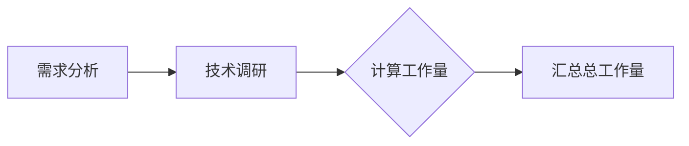
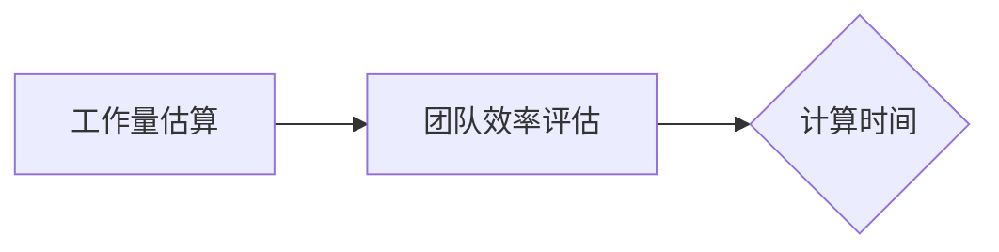
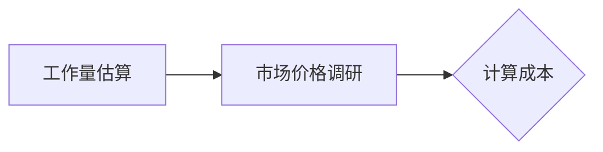
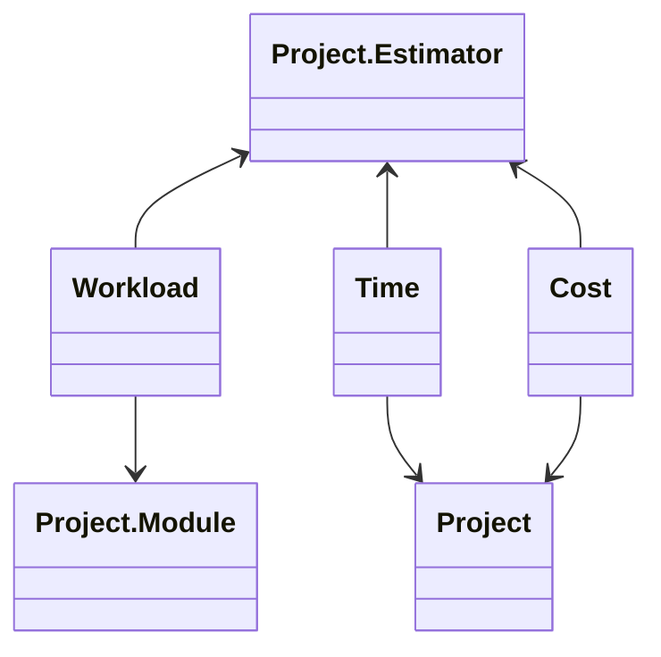
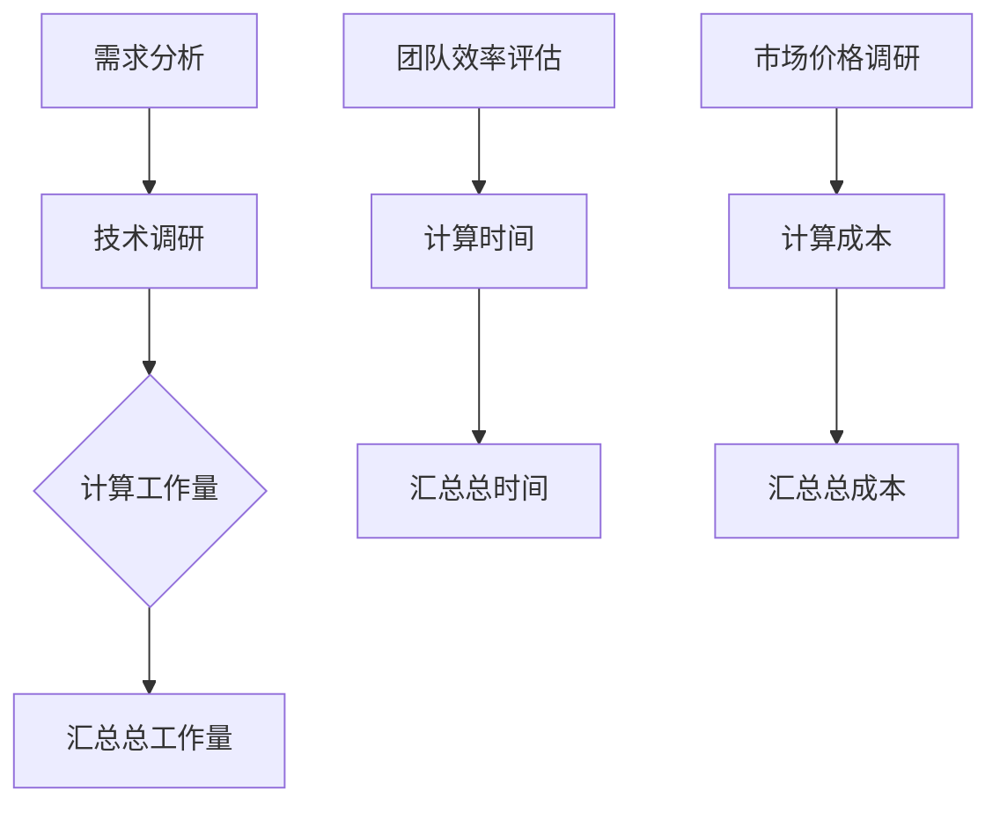
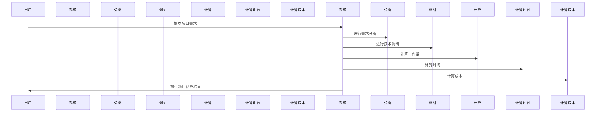

                 

# 技术项目估算：提高项目预算准确性的技巧

> 关键词：技术项目估算、项目预算、预算准确性、技巧

> 摘要：本文旨在探讨技术项目估算的关键要素，分析项目预算准确性的重要性，并提供一系列实用的估算技巧和方法。通过深入的需求分析、风险评估、团队协作、历史数据利用以及技术预研，项目管理者能够提高项目预算的准确性，确保项目顺利实施。

## 第一部分：背景介绍

### 1.1 问题背景

随着技术领域的不断进步，计算机技术在各行各业中得到了广泛应用。然而，在实际的技术项目中，项目估算一直是困扰企业和项目管理者的一大难题。项目估算的不准确会导致项目延期、成本超支等问题，严重影响到项目的成功实施。因此，提高项目预算准确性成为项目管理者迫切需要解决的问题。

### 1.2 问题描述

项目估算通常包括工作量估算、时间估算和成本估算。工作量估算是指根据项目需求、技术难度等因素，估算项目所需的工作量；时间估算是指根据工作量、团队效率等因素，估算项目完成所需的时间；成本估算是指根据项目工作量、市场价格等因素，估算项目的总成本。在这三个环节中，任何一个环节的估算不准确都会对整个项目产生负面影响。

### 1.3 问题解决

为了提高项目预算准确性，本书将介绍一系列提高项目预算准确性的技巧。这些技巧包括但不限于：

1. **需求分析**：通过深入的需求分析，确保项目需求的明确性和完整性，从而减少后续变更的可能性。
2. **风险评估**：对项目可能遇到的风险进行评估，提前制定应对策略，降低风险对项目进度和成本的影响。
3. **团队协作**：建立高效的团队协作机制，提高团队的工作效率，确保项目按计划进行。
4. **历史数据**：利用历史项目数据，对相似项目的估算结果进行分析，总结出具有指导意义的估算方法和经验。
5. **技术预研**：在项目启动阶段进行必要的技术预研，了解技术实现的可行性和复杂性，为项目估算提供依据。

### 1.4 边界与外延

本部分主要讨论技术项目估算的技巧和方法，适用于各种类型的技术项目。无论是软件开发、系统集成还是其他类型的技术项目，都可以借鉴本书中的估算技巧，提高项目预算的准确性。

## 第2章 核心概念与联系

### 2.1 核心概念

**项目估算**：项目估算是指对项目的工作量、时间、成本进行预测和评估的过程。

**工作量估算**：工作量估算是指根据项目需求、技术难度等因素，对项目所需的工作量进行预测和评估。

**时间估算**：时间估算是指根据工作量、团队效率等因素，对项目完成所需的时间进行预测和评估。

**成本估算**：成本估算是指根据项目工作量、市场价格等因素，对项目的总成本进行预测和评估。

### 2.2 概念属性特征对比表格

| 概念      | 属性特征                                                      | 对比                                                                                                   |
| --------- | ------------------------------------------------------------ | ------------------------------------------------------------------------------------------------------ |
| 工作量估算 | 需要根据项目需求、技术难度等因素进行评估                     | 时间估算主要关注完成项目所需的时间，成本估算主要关注项目的总成本                                     |
| 时间估算   | 需要根据工作量、团队效率等因素进行评估                       | 工作量估算主要关注项目的工作量，成本估算主要关注项目的总成本                                     |
| 成本估算   | 需要根据工作量、市场价格等因素进行评估                       | 工作量估算主要关注项目的工作量，时间估算主要关注完成项目所需的时间                                   |

### 2.3 ER实体关系图架构

```mermaid
erDiagram
    Project ||--|{ Workload }|| Estimation
    Project ||--|{ Time }|| Estimation
    Project ||--|{ Cost }|| Estimation
```

- **Project（项目）**：表示技术项目，包含项目名称、项目描述等信息。
- **Workload（工作量）**：表示对项目所需的工作量进行估算的实体。

## 第二部分：算法原理讲解

### 2.1 工作量估算算法原理

工作量估算通常是基于项目的需求和技术难度等因素进行。以下是一种常见的工作量估算算法：

1. **需求分析**：首先，对项目需求进行深入分析，明确项目的具体功能和技术实现要求。
2. **技术调研**：根据需求分析的结果，对所需技术进行调研，了解技术的实现难度和复杂度。
3. **工作量计算**：根据需求分析和技术调研的结果，估算每个功能模块所需的工作量，并将其汇总为总工作量。

以下是一个简单的工作量估算算法的mermaid流程图：



### 2.2 时间估算算法原理

时间估算通常是基于工作量估算和团队效率等因素进行。以下是一种常见的时间估算算法：

1. **工作量估算**：首先，根据需求分析和技术调研的结果，进行工作量估算。
2. **团队效率评估**：评估团队的整体工作效率，包括开发人员的技能水平、团队协作情况等。
3. **时间计算**：根据工作量估算和团队效率评估的结果，计算项目完成所需的时间。

以下是一个简单的时间估算算法的mermaid流程图：



### 2.3 成本估算算法原理

成本估算通常是基于工作量估算和市场价格等因素进行。以下是一种常见的成本估算算法：

1. **工作量估算**：首先，根据需求分析和技术调研的结果，进行工作量估算。
2. **市场价格调研**：调研市场上类似项目的成本，了解市场价格水平。
3. **成本计算**：根据工作量估算和市场价格调研的结果，计算项目的总成本。

以下是一个简单的成本估算算法的mermaid流程图：



### 2.4 算法原理数学模型和公式

**工作量估算**的数学模型可以表示为：

$$
W = \sum_{i=1}^{n} w_i
$$

其中，$W$表示总工作量，$w_i$表示第$i$个功能模块的工作量。

**时间估算**的数学模型可以表示为：

$$
T = \frac{W}{E}
$$

其中，$T$表示项目完成所需的时间，$W$表示总工作量，$E$表示团队效率。

**成本估算**的数学模型可以表示为：

$$
C = \sum_{i=1}^{n} c_i
$$

其中，$C$表示总成本，$c_i$表示第$i$个功能模块的成本。

通过这些数学模型和公式，我们可以对项目的工作量、时间和成本进行计算和估算。

## 第三部分：系统分析与架构设计方案

### 3.1 问题场景介绍

在一个大型企业中，为了提高项目管理的效率，需要进行技术项目估算。企业希望对项目的工作量、时间和成本进行准确估算，以便制定合理的项目计划和预算。

### 3.2 项目介绍

本项目的目标是开发一个企业级应用系统，该系统需要实现多个功能模块，包括用户管理、数据统计、报表生成等。项目团队由项目经理、开发人员、测试人员和质量保证人员组成。

### 3.3 系统功能设计（领域模型）

以下是一个简化的系统功能领域的mermaid类图：



在这个类图中，`Project.Estimator`表示项目估算器，负责对项目的工作量、时间和成本进行估算；`Workload`表示工作量，`Time`表示时间，`Cost`表示成本；`Project.Module`表示项目模块，包括用户管理、数据统计、报表生成等功能模块。

### 3.4 系统架构设计

以下是一个简化的系统架构设计mermaid架构图：



在这个架构图中，`需求分析`、`技术调研`、`计算工作量`、`汇总总工作量`、`团队效率评估`、`计算时间`、`汇总总时间`、`市场价格调研`和`计算成本`分别表示项目的各个阶段。

### 3.5 系统接口设计和系统交互

以下是一个简化的系统接口设计和系统交互mermaid序列图：



在这个序列图中，用户提交项目需求，项目估算系统根据需求进行分析和技术调研，然后计算工作量、时间和成本，最后将估算结果提供给用户。

## 第四部分：项目实战

### 4.1 环境安装

为了进行技术项目估算，我们首先需要安装相关的开发工具和软件。以下是一个简化的环境安装流程：

1. 安装Python环境：从Python官方网站下载Python安装包并安装。
2. 安装依赖库：使用pip命令安装项目所需的依赖库，例如numpy、pandas等。
3. 配置开发环境：配置Python的开发环境，包括代码编辑器、调试工具等。

### 4.2 系统核心实现源代码

以下是一个简单的技术项目估算系统的Python源代码示例：

```python
import numpy as np

class ProjectEstimator:
    def __init__(self, demand, technical_research):
        self.demand = demand
        self.technical_research = technical_research
    
    def calculate_workload(self):
        workload = 0
        for module in self.demand:
            workload += self.technical_research[module]
        return workload
    
    def calculate_time(self, efficiency):
        workload = self.calculate_workload()
        time = workload / efficiency
        return time
    
    def calculate_cost(self, market_price):
        workload = self.calculate_workload()
        cost = workload * market_price
        return cost

# 示例
demand = {'用户管理': 10, '数据统计': 20, '报表生成': 30}
technical_research = {'用户管理': 2, '数据统计': 3, '报表生成': 4}
efficiency = 8
market_price = 100

estimator = ProjectEstimator(demand, technical_research)
workload = estimator.calculate_workload()
time = estimator.calculate_time(efficiency)
cost = estimator.calculate_cost(market_price)

print(f"总工作量：{workload}")
print(f"总时间：{time}")
print(f"总成本：{cost}")
```

### 4.3 代码应用解读与分析

在上面的示例代码中，我们定义了一个`ProjectEstimator`类，用于实现技术项目估算。该类包含以下方法：

- `__init__(self, demand, technical_research)`：初始化方法，接收项目需求和技术调研数据。
- `calculate_workload(self)`：计算工作量，遍历项目需求，累加每个模块的工作量。
- `calculate_time(self, efficiency)`：计算时间，根据工作量和工作效率计算项目完成所需的时间。
- `calculate_cost(self, market_price)`：计算成本，根据工作量和市场价格计算项目的总成本。

通过实例化`ProjectEstimator`类，我们可以对项目的工作量、时间和成本进行计算和估算。在实际应用中，我们可以根据需求、技术调研和市场价格等参数，调整代码中的参数值，得到更准确的估算结果。

### 4.4 实际案例分析和详细讲解剖析

假设我们有一个实际项目，需要实现用户管理、数据统计和报表生成三个功能模块。根据技术调研，用户管理需要10个工作量单位，数据统计需要20个工作量单位，报表生成需要30个工作量单位。

1. **需求分析**：首先，我们需要对项目需求进行深入分析，明确项目的具体功能和技术实现要求。根据需求分析的结果，我们得到项目需求列表。

2. **技术调研**：然后，我们对所需技术进行调研，了解技术的实现难度和复杂度。根据技术调研的结果，我们得到每个功能模块的工作量。

3. **工作量计算**：根据需求分析和技术调研的结果，我们计算每个功能模块的工作量，并将其汇总为总工作量。

   ```python
   workload = {'用户管理': 10, '数据统计': 20, '报表生成': 30}
   total_workload = sum(workload.values())
   ```

4. **团队效率评估**：接下来，我们需要评估团队的整体工作效率，包括开发人员的技能水平、团队协作情况等。假设团队的工作效率为8个工作量单位/天。

5. **时间计算**：根据工作量估算和团队效率评估的结果，我们计算项目完成所需的时间。

   ```python
   time = total_workload / efficiency
   ```

6. **市场价格调研**：最后，我们需要调研市场上类似项目的成本，了解市场价格水平。假设市场价格为100元/工作量单位。

7. **成本计算**：根据工作量估算和市场价格调研的结果，我们计算项目的总成本。

   ```python
   cost = total_workload * market_price
   ```

通过以上步骤，我们得到了项目的工作量、时间和成本估算结果。

### 4.5 项目小结

通过本文的介绍，我们了解到了技术项目估算的重要性和核心概念。在实际项目中，项目管理者需要通过深入的需求分析、技术调研、工作量计算、时间计算和成本计算等步骤，提高项目预算的准确性。同时，本文还介绍了实际案例中的项目估算过程，帮助读者更好地理解项目估算的实际应用。

## 第五部分：最佳实践 tips、小结、注意事项、拓展阅读

### 最佳实践 tips

1. **明确需求**：在项目估算过程中，明确项目需求是至关重要的。确保项目需求明确、完整，有助于提高估算的准确性。
2. **风险评估**：对项目可能遇到的风险进行评估，并提前制定应对策略，可以有效降低风险对项目进度和成本的影响。
3. **团队协作**：建立高效的团队协作机制，提高团队的工作效率，有助于确保项目按计划进行。
4. **历史数据利用**：利用历史项目数据，对相似项目的估算结果进行分析，可以总结出具有指导意义的估算方法和经验。
5. **技术预研**：在项目启动阶段进行必要的技术预研，了解技术实现的可行性和复杂性，为项目估算提供依据。

### 小结

本文介绍了技术项目估算的关键要素，分析了项目预算准确性的重要性，并提供了一系列实用的估算技巧和方法。通过深入的需求分析、风险评估、团队协作、历史数据利用以及技术预研，项目管理者能够提高项目预算的准确性，确保项目顺利实施。

### 注意事项

1. **避免过度依赖历史数据**：虽然历史数据对项目估算具有一定的参考价值，但历史数据不一定适用于所有项目，因此不能完全依赖历史数据。
2. **定期更新估算模型**：随着技术领域的不断进步，项目估算模型也需要定期更新，以适应新的技术环境和市场需求。
3. **保持团队沟通**：在项目估算过程中，保持团队沟通至关重要。通过团队成员的协同合作，可以更准确地估算项目的工作量、时间和成本。

### 拓展阅读

1. 《项目管理知识体系指南（PMBOK指南）》
2. 《软件工程：实践者的研究方法》
3. 《估算的艺术：软件开发时间估算与成本估算》

### 作者信息

作者：AI天才研究院/AI Genius Institute & 禅与计算机程序设计艺术 /Zen And The Art of Computer Programming

