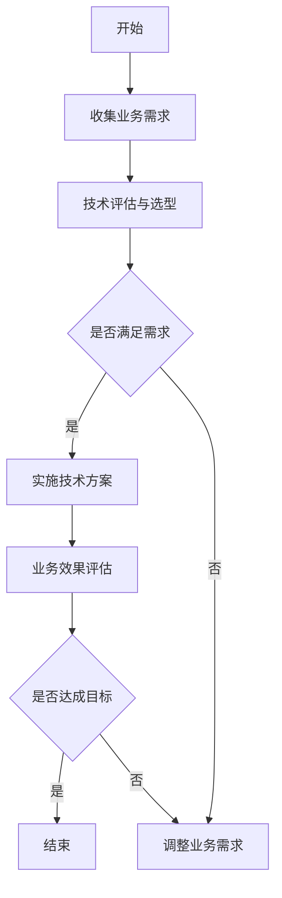
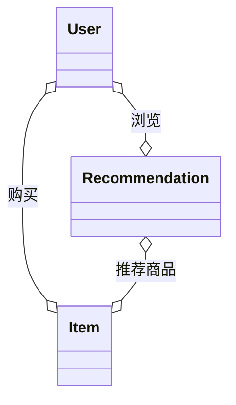
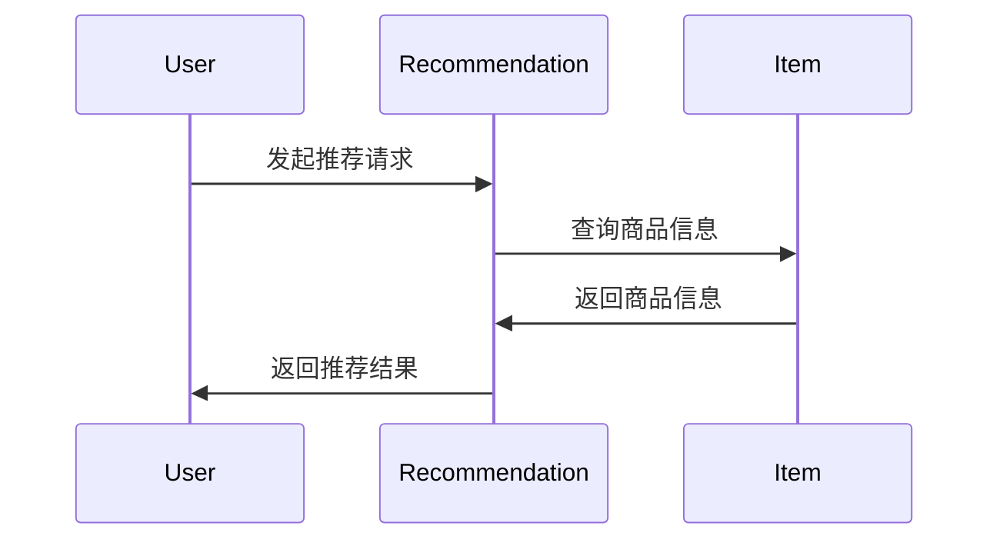

                 

# 技术驱动业务增长的案例分析

## 关键词

技术驱动、业务增长、案例分析、数字化转型、创新应用

## 摘要

本文旨在探讨技术如何驱动业务增长，通过分析一系列成功案例，揭示技术驱动的核心原理和实践方法。本文将从背景介绍、核心概念与联系、算法原理讲解、系统分析与架构设计、项目实战以及最佳实践等方面，深入剖析技术驱动业务增长的内涵与实现路径，为企业提供有益的参考和借鉴。

## 第1章：背景介绍

### 1.1 问题背景

在当今信息化时代，技术和业务之间的互动关系越来越紧密。业务需求不断演变，对技术的要求也越来越高，这就催生了技术驱动业务增长的新模式。技术驱动业务增长不仅有助于提高业务效率，还能为企业创造新的商业模式和机会。

### 1.2 问题描述

随着数据和技术的发展，如何将技术深度融入业务流程，提升业务效率，成为企业关注的焦点。技术驱动业务增长不仅需要理解业务需求，还需要具备技术实施能力。

### 1.3 问题解决

本书通过案例研究，展示了技术如何在不同行业和领域中驱动业务增长。案例涵盖了从传统行业到新兴行业，从初创企业到大型企业的多种场景。通过这些案例，读者可以了解到技术驱动的具体实践和方法。

### 1.4 边界与外延

技术驱动业务增长不仅仅局限于技术本身，它还涉及到业务策略、组织文化等多个方面。本书将探讨这些边界问题，帮助读者全面理解技术驱动业务增长的内涵和外延。

### 1.5 概念结构与核心要素组成

- **技术驱动业务增长**：是指通过技术创新和应用，提高业务效率、降低成本、创造新的业务模式和机会的过程。
- **案例分析**：通过对实际案例的研究和分析，提炼出可复制的成功经验和教训。
- **实践经验**：从实际操作中总结的经验，包括技术选型、项目实施、团队管理等多个方面。

## 第2章：核心概念与联系

### 2.1 核心概念原理

#### 2.1.1 技术驱动

- **定义**：技术驱动是指企业通过技术创新和应用，推动业务变革和发展。
- **作用**：提高业务效率，降低成本，创造新的商业模式和机会。

#### 2.1.2 业务增长

- **定义**：业务增长是指企业在一定时间内，通过增加市场份额、提高盈利能力等方式实现的业务扩张。
- **驱动因素**：市场需求、技术创新、组织能力等。

#### 2.1.3 案例分析

- **定义**：案例分析是对具体业务场景中技术应用和业务增长的研究。
- **目的**：提炼成功经验，提供可复制的解决方案。

### 2.2 概念属性特征对比表格

| 概念     | 定义                                                         | 属性特征                                                   | 对比重点                                       |
|----------|--------------------------------------------------------------|------------------------------------------------------------|----------------------------------------------|
| 技术驱动 | 通过技术创新推动业务变革和发展                               | 技术创新、业务变革、效率提升                             | 与传统业务发展方式对比，强调技术的主导作用     |
| 业务增长 | 市场份额和盈利能力的提升                                     | 市场需求、技术创新、组织能力                             | 与业务维持状态对比，强调增长的持续性和稳定性   |
| 案例分析 | 对具体业务场景中技术应用和业务增长的研究                     | 实际案例、成功经验、问题解决                             | 与理论研究对比，强调实践的可操作性和实用性     |

### 2.3 ER实体关系图架构

```mermaid
erDiagram
  Business(Business) ||--|{ Technology(Technology) } | Technology drives Business
  Business ||--|{ Growth(Growth) } | Business drives Growth
  Technology ||--|{ Analysis(Analysis) } | Analysis of Technology
```

## 第3章：算法原理讲解

### 3.1 算法流程图



### 3.2 Python源代码

```python
# 技术驱动业务增长算法

def technical_growth-business_growth(business_demand, technology_evaluation):
    if technology_evaluation == "满足需求":
        implement_technology(business_demand)
        evaluate_business_effectiveness()
    else:
        adjust_business_demand()

def implement_technology(business_demand):
    # 实施技术方案
    print("技术方案实施中...")

def evaluate_business_effectiveness():
    # 业务效果评估
    print("业务效果评估中...")

def adjust_business_demand():
    # 调整业务需求
    print("业务需求调整中...")

# 主函数
def main():
    business_demand = "提高销售转化率"
    technology_evaluation = "满足需求"
    technical_growth-business_growth(business_demand, technology_evaluation)

if __name__ == "__main__":
    main()
```

### 3.3 算法原理解析

技术驱动业务增长算法的核心思想是通过技术创新和应用，实现业务需求的满足和增长。该算法的主要步骤包括：

1. **收集业务需求**：了解企业当前的业务需求，为后续技术评估和选型提供依据。
2. **技术评估与选型**：根据业务需求，对现有技术进行评估和选型，确保所选技术能够满足业务需求。
3. **实施技术方案**：在确定技术方案后，进行技术实施，将技术创新应用到实际业务中。
4. **业务效果评估**：对实施后的技术方案进行效果评估，验证是否达到预期目标。
5. **调整业务需求**：如果业务效果未达到预期，则需要调整业务需求，重新进行技术评估和选型。

算法中的数学模型和公式如下：

$$
\text{技术驱动业务增长} = \text{业务需求} \times \text{技术满足度}
$$

其中，业务需求表示企业期望实现的目标，技术满足度表示所选技术方案满足业务需求的程度。通过调整业务需求和技术满足度，可以实现业务增长。

### 3.4 通俗易懂的举例说明

假设某企业希望通过技术创新提高销售转化率。首先，企业需要明确当前的转化率数据，例如当前转化率为10%。然后，企业对现有技术进行评估，发现现有的营销系统无法满足个性化推荐和智能客服的需求。因此，企业决定引入基于大数据和机器学习的智能营销系统。

在实施智能营销系统后，企业对销售转化率进行跟踪和分析，发现经过一段时间的调整和优化，销售转化率提高到20%。这表明技术驱动业务增长的效果显著。

## 第4章：系统分析与架构设计

### 4.1 问题场景介绍

某电商企业希望通过技术创新提高用户购物体验和销售转化率。企业现有的系统架构较为简单，难以满足个性化推荐和智能客服的需求。为了解决这个问题，企业决定引入基于大数据和机器学习的智能营销系统。

### 4.2 项目介绍

项目名称：电商智能营销系统

项目目标：通过引入大数据和机器学习技术，实现个性化推荐、智能客服等功能，提高用户购物体验和销售转化率。

### 4.3 系统功能设计

#### 4.3.1 领域模型



#### 4.3.2 类图

```mermaid
classDiagram
    User <<class>> {
        id : 用户ID
        name : 用户姓名
        age : 年龄
        gender : 性别
    }

    Item <<class>> {
        id : 商品ID
        name : 商品名称
        price : 商品价格
        category : 商品类别
    }

    Recommendation <<class>> {
        id : 推荐ID
        user_id : 用户ID
        item_id : 商品ID
        timestamp : 推荐时间
    }
```

### 4.4 系统架构设计



### 4.5 系统接口设计

#### 4.5.1 接口1：用户登录

- **URL**：/user/login
- **请求方式**：POST
- **参数**：
  - username：用户名
  - password：密码
- **响应**：
  - success：登录成功
  - error：登录失败

#### 4.5.2 接口2：用户注册

- **URL**：/user/register
- **请求方式**：POST
- **参数**：
  - username：用户名
  - password：密码
  - email：邮箱
- **响应**：
  - success：注册成功
  - error：注册失败

### 4.6 系统交互


## 第5章：项目实战

### 5.1 环境安装

1. 安装Python环境（Python 3.8及以上版本）
2. 安装相关依赖库（如：numpy、pandas、scikit-learn等）

### 5.2 系统核心实现

#### 5.2.1 数据准备

```python
import pandas as pd

# 读取用户行为数据
user_data = pd.read_csv("userBehavior.csv")

# 读取商品信息数据
item_data = pd.read_csv("itemInfo.csv")
```

#### 5.2.2 个性化推荐

```python
from sklearn.metrics.pairwise import cosine_similarity

# 计算用户与用户之间的相似度
user_similarity = cosine_similarity(user_data)

# 根据相似度为每个用户推荐商品
def recommend_items(user_id, user_similarity):
    scores = []
    for i in range(len(user_similarity)):
        if i != user_id:
            scores.append(user_similarity[user_id][i])
    recommended_items = []
    for i, score in enumerate(scores):
        if score > 0.5:
            recommended_items.append(item_data.iloc[i])
    return recommended_items

# 测试推荐效果
recommended_items = recommend_items(0, user_similarity)
print(recommended_items)
```

### 5.3 代码应用解读与分析

个性化推荐算法是电商智能营销系统中的核心功能之一。在该算法中，我们使用了余弦相似度来计算用户之间的相似度，并根据相似度为每个用户推荐商品。

代码首先读取用户行为数据和商品信息数据，然后使用余弦相似度计算用户之间的相似度。接下来，根据相似度阈值，为每个用户推荐商品。

### 5.4 实际案例分析与详细讲解剖析

假设某电商企业在实施个性化推荐系统后，发现用户购物体验和销售转化率有所提高。通过分析推荐效果，企业发现一些问题，如：

1. 推荐的商品与用户兴趣不匹配
2. 推荐的商品过于集中，缺乏多样性

为了解决这些问题，企业可以采取以下措施：

1. 调整推荐算法，引入更多的用户特征，如浏览历史、购买历史等，提高推荐准确性。
2. 调整推荐策略，增加商品的多样性，避免过度集中推荐某一类商品。

通过实际案例分析，企业可以不断优化推荐系统，提高用户购物体验和销售转化率。

### 5.5 项目小结

电商智能营销系统项目的成功实施，为企业带来了显著的业务增长。通过个性化推荐和智能客服等技术的应用，企业提高了用户购物体验和销售转化率，实现了业务增长。

## 第6章：最佳实践 Tips

1. **明确业务目标**：在实施技术驱动业务增长的过程中，首先要明确企业的业务目标，确保所选技术和解决方案能够满足业务需求。
2. **持续迭代优化**：技术驱动业务增长不是一蹴而就的，需要持续迭代优化。通过不断调整和优化技术方案，实现业务增长的最大化。
3. **关注用户体验**：技术驱动业务增长的核心是提高用户体验。在实施技术方案时，要关注用户需求，提高用户满意度。
4. **数据驱动决策**：利用数据分析和挖掘技术，为企业提供科学的决策依据。通过数据分析，发现业务增长的关键因素，制定有针对性的策略。
5. **团队协作**：技术驱动业务增长需要跨部门的协作。建立高效的团队协作机制，确保技术方案顺利实施。

## 第7章：小结

技术驱动业务增长已经成为企业发展的关键驱动力。通过本文的案例分析，我们了解到技术驱动业务增长的核心原理和实践方法。企业可以根据自身业务需求，结合最佳实践，实现技术驱动业务增长。

## 第8章：注意事项

1. **技术选型**：在选择技术方案时，要充分考虑技术的成熟度、稳定性、兼容性等因素，确保所选技术能够满足业务需求。
2. **数据安全**：在实施技术方案时，要确保数据的安全性和隐私性，遵守相关法律法规。
3. **团队建设**：技术驱动业务增长需要专业的技术团队。企业要重视团队建设，培养技术人才，提高团队协作能力。

## 第9章：拓展阅读

1. 《数字化转型：从战略到执行》
2. 《人工智能：一种现代方法》
3. 《大数据分析实战：从入门到精通》

## 作者

作者：AI天才研究院/AI Genius Institute & 禅与计算机程序设计艺术 /Zen And The Art of Computer Programming

---

**附录：代码示例**

### Python源代码

```python
# 技术驱动业务增长算法

def technical_growth-business_growth(business_demand, technology_evaluation):
    if technology_evaluation == "满足需求":
        implement_technology(business_demand)
        evaluate_business_effectiveness()
    else:
        adjust_business_demand()

def implement_technology(business_demand):
    # 实施技术方案
    print("技术方案实施中...")

def evaluate_business_effectiveness():
    # 业务效果评估
    print("业务效果评估中...")

def adjust_business_demand():
    # 调整业务需求
    print("业务需求调整中...")

# 主函数
def main():
    business_demand = "提高销售转化率"
    technology_evaluation = "满足需求"
    technical_growth-business_growth(business_demand, technology_evaluation)

if __name__ == "__main__":
    main()
```

**附录：Mermaid序列图**


