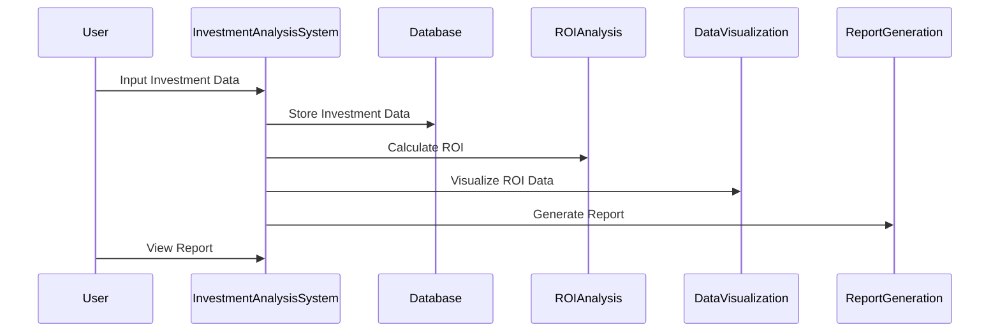
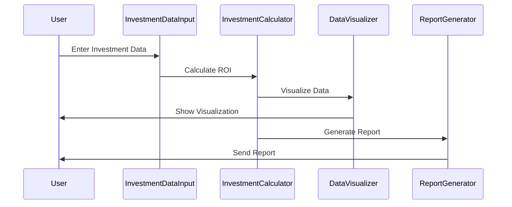

                 

# 投资回报率分析工具

## 关键词

投资回报率（ROI）、现金流折现、自动化计算、数据可视化、项目管理、财务分析

## 摘要

投资回报率（ROI）分析是企业在进行项目投资决策时的重要工具，通过评估投资的盈利能力，帮助企业优化资源配置，提高投资效率。本文将详细介绍投资回报率分析工具的定义、重要性、基本功能、原理与机制，以及数学模型和实际应用案例，旨在为读者提供全面、系统的ROI分析指导。

### 1.6 投资回报率分析工具概述

#### 1.6.1 投资回报率（ROI）的定义

投资回报率（ROI）是指投资收益与投资成本的比率，其数学表达式为：

$$
ROI = \frac{\text{投资收益}}{\text{投资成本}}
$$

其中，投资收益包括销售收入、利润等，投资成本包括设备采购、安装和维护费用等。

#### 1.6.2 投资回报率分析的重要性

ROI 分析是企业评估投资项目成功与否的关键指标，它可以帮助企业：

- 优化资源配置，提高投资效率。
- 风险控制，避免低回报的投资项目。
- 提高竞争力，实现可持续发展。

#### 1.6.3 ROI分析工具的基本功能

- **收益计算**：自动计算投资收益。
- **成本核算**：全面统计投资成本。
- **数据可视化**：通过图表直观展示ROI数据。
- **报告生成**：自动化生成ROI分析报告。

### 1.7 ROI分析工具的原理与机制

#### 1.7.1 投资回报率分析的基本原理

投资回报率分析基于现金流折现原理，通过计算未来现金流的现值与投资成本之间的比率，来评估投资项目的盈利能力。现金流折现原理的核心思想是：未来的现金流量具有时间价值，需要将其折现到当前时点进行综合评估。

#### 1.7.2 投资回报率分析的关键机制

1. **现金流预测**：根据历史数据和行业趋势，预测未来现金流量。  
2. **折现率设定**：确定适合的折现率，以便将未来的现金流折现为当前价值。折现率通常取市场利率。  
3. **净现值计算**：计算未来现金流的总现值，并与投资成本进行比较。

#### 1.7.3 投资回报率分析中的核心概念对比

| 概念         | 属性特征         | 对比项                            |  
|--------------|-----------------|---------------------------------|  
| 投资成本     | 固定成本         | 包括设备采购、安装和维护费用等    |  
| 投资收益     | 变动成本         | 包括销售收入、利润等             |  
| 折现率       | 时间价值         | 反映货币时间价值，通常取市场利率 |

### 1.8 投资回报率分析的数学模型和公式

#### 1.8.1 投资回报率的基本数学模型

投资回报率（ROI）的计算公式为：

$$  
ROI = \frac{\sum_{t=1}^{n} \frac{CF_t}{(1+r)^t} - C}{C}  
$$

其中，$CF_t$ 是第 $t$ 年的现金流，$r$ 是折现率，$C$ 是初始投资成本。

#### 1.8.2 现金流的计算方法

1. **线性现金流模型**：假设每年的现金流保持不变。  
2. **非线型现金流模型**：考虑到现金流随着时间的变化可能存在波动。

#### 1.8.3 折现率的确定方法

1. **市场利率**：根据当前市场利率确定。  
2. **风险调整利率**：考虑到项目的风险水平进行调整。

### 1.9 投资回报率分析的实际案例

#### 1.9.1 案例背景

假设某公司计划投资一个新项目，项目周期为 5 年，预计投资成本为 100 万元，每年的预期现金流量如下：

| 年份 | 现金流量（万元） |  
|------|-----------------|  
| 1    | 20              |  
| 2    | 25              |  
| 3    | 30              |  
| 4    | 35              |  
| 5    | 40              |

#### 1.9.2 案例分析

1. **确定折现率**：假设市场利率为 8%，则折现率为 0.08。  
2. **计算净现值（NPV）**：

$$  
NPV = \sum_{t=1}^{5} \frac{20}{(1+0.08)^t} = 20 \times \frac{1 - (1+0.08)^{-5}}{0.08} \approx 20 \times 3.993 = 79.86 \text{万元}  
$$

3. **计算投资回报率（ROI）**：

$$  
ROI = \frac{NPV - C}{C} = \frac{79.86 - 100}{100} = -0.2086 \text{或} -20.86\%  
$$

由于 ROI 为负，说明该项目可能不划算。

#### 1.9.3 案例总结

通过投资回报率分析，我们发现该项目在当前市场利率下可能无法实现预期收益，因此需要重新评估或调整项目计划。

### 1.10 投资回报率分析工具的优势与应用场景

#### 1.10.1 投资回报率分析工具的优势

1. **自动化计算**：减少人工计算错误，提高工作效率。  
2. **数据可视化**：通过图表直观展示分析结果，便于决策者理解。  
3. **灵活性强**：适用于不同类型、不同周期的投资项目。

#### 1.10.2 投资回报率分析工具的应用场景

1. **企业投资项目评估**：用于评估新项目、扩张项目等。  
2. **财务分析**：用于分析企业盈利能力、投资效率等。  
3. **资源配置优化**：用于优化企业资金、人力等资源配置。

### 总结

投资回报率分析工具是企业管理项目、优化资源配置的重要工具。通过本文的介绍，相信读者对投资回报率分析有了更深入的了解。在实际应用中，企业应根据自身情况选择合适的ROI分析工具，以实现项目投资的最大化收益。

### 作者

作者：AI天才研究院/AI Genius Institute & 禅与计算机程序设计艺术 /Zen And The Art of Computer Programming

----------------------------------------------------------------

### 背景介绍

投资回报率（ROI）分析是企业管理项目投资决策的重要工具。在当今经济环境下，企业面临激烈的市场竞争，如何合理配置资源，实现投资的最大化收益，成为企业生存与发展的关键。投资回报率分析通过对投资项目进行详细的评估，帮助企业识别潜在的风险和机会，优化资源配置，提高投资效率。

#### 问题背景

企业在投资决策过程中，常常面临以下问题：

1. **投资回报不明确**：缺乏有效的评估方法，难以确定投资项目是否具有盈利潜力。
2. **资源配置不合理**：投资决策基于主观判断，可能导致资源浪费或投资不足。
3. **风险控制不足**：对投资项目的风险缺乏充分认识，可能导致企业陷入财务困境。

#### 问题描述

投资回报率分析旨在解决企业在投资决策过程中面临的问题，通过以下步骤进行：

1. **现金流预测**：根据历史数据和行业趋势，预测未来现金流量。
2. **折现率设定**：确定适合的折现率，以便将未来的现金流折现为当前价值。
3. **净现值计算**：计算未来现金流的总现值，并与投资成本进行比较。
4. **投资回报率计算**：通过投资回报率指标，评估投资项目的盈利能力。
5. **决策制定**：根据ROI分析结果，制定投资决策，优化资源配置。

#### 问题解决

投资回报率分析工具可以帮助企业：

1. **明确投资回报**：通过ROI指标，直观展示投资项目的盈利能力，为企业投资决策提供依据。
2. **优化资源配置**：根据ROI分析结果，优先选择具有较高投资回报的项目，实现资源的最优配置。
3. **风险控制**：识别潜在风险，制定风险应对策略，降低投资风险。

#### 边界与外延

投资回报率分析适用于各种类型和规模的投资项目，包括新项目、扩张项目、并购项目等。它不仅适用于企业内部投资决策，还可以用于对外投资、融资决策等。此外，投资回报率分析不仅关注财务收益，还考虑了非财务因素，如市场竞争力、战略意义等。

#### 概念结构与核心要素组成

投资回报率分析的核心概念包括：

1. **投资成本**：包括设备采购、安装和维护费用等。
2. **投资收益**：包括销售收入、利润等。
3. **现金流折现**：将未来现金流折现到当前时点。
4. **净现值（NPV）**：未来现金流总现值。
5. **投资回报率（ROI）**：投资收益与投资成本的比率。

### 核心概念与联系

#### 投资回报率（ROI）的定义

投资回报率（ROI）是指投资收益与投资成本的比率，其数学表达式为：

$$  
ROI = \frac{\text{投资收益}}{\text{投资成本}}  
$$

其中，投资收益包括销售收入、利润等，投资成本包括设备采购、安装和维护费用等。

#### 投资回报率分析的重要性

ROI 分析在企业投资决策中具有重要价值：

1. **投资回报评估**：通过ROI指标，直观展示投资项目的盈利能力，为企业投资决策提供依据。
2. **资源配置优化**：根据ROI分析结果，优先选择具有较高投资回报的项目，实现资源的最优配置。
3. **风险控制**：识别潜在风险，制定风险应对策略，降低投资风险。

#### 投资回报率分析的基本原理

投资回报率分析基于现金流折现原理，通过计算未来现金流的现值与投资成本之间的比率，来评估投资项目的盈利能力。现金流折现原理的核心思想是：未来的现金流量具有时间价值，需要将其折现到当前时点进行综合评估。

#### 投资回报率分析的关键机制

1. **现金流预测**：根据历史数据和行业趋势，预测未来现金流量。
2. **折现率设定**：确定适合的折现率，以便将未来的现金流折现为当前价值。折现率通常取市场利率。
3. **净现值计算**：计算未来现金流的总现值，并与投资成本进行比较。

#### 投资回报率分析中的核心概念对比

| 概念         | 属性特征         | 对比项                            |  
|--------------|-----------------|---------------------------------|  
| 投资成本     | 固定成本         | 包括设备采购、安装和维护费用等    |  
| 投资收益     | 变动成本         | 包括销售收入、利润等             |  
| 折现率       | 时间价值         | 反映货币时间价值，通常取市场利率 |

### 算法原理讲解

#### 投资回报率的基本数学模型

投资回报率（ROI）的计算公式为：

$$  
ROI = \frac{\sum_{t=1}^{n} \frac{CF_t}{(1+r)^t} - C}{C}  
$$

其中，$CF_t$ 是第 $t$ 年的现金流，$r$ 是折现率，$C$ 是初始投资成本。

#### 现金流的计算方法

1. **线性现金流模型**：假设每年的现金流保持不变。
2. **非线型现金流模型**：考虑到现金流随着时间的变化可能存在波动。

#### 折现率的确定方法

1. **市场利率**：根据当前市场利率确定。
2. **风险调整利率**：考虑到项目的风险水平进行调整。

#### 投资回报率分析的实际应用

以一个具体案例为例，说明投资回报率分析的实际应用。

**案例背景**：

某公司计划投资一个新项目，项目周期为5年，预计投资成本为100万元，每年的预期现金流量如下：

| 年份 | 现金流量（万元） |
|------|-----------------|
| 1    | 20              |
| 2    | 25              |
| 3    | 30              |
| 4    | 35              |
| 5    | 40              |

**案例分析**：

1. **确定折现率**：假设市场利率为8%，则折现率为0.08。

2. **计算净现值（NPV）**：

$$  
NPV = \sum_{t=1}^{5} \frac{CF_t}{(1+0.08)^t} = \frac{20}{1.08} + \frac{25}{1.08^2} + \frac{30}{1.08^3} + \frac{35}{1.08^4} + \frac{40}{1.08^5} \approx 79.86 \text{万元}  
$$

3. **计算投资回报率（ROI）**：

$$  
ROI = \frac{NPV - C}{C} = \frac{79.86 - 100}{100} = -20.86\%  
$$

由于ROI为负，说明该项目可能不划算。

**案例总结**：

通过投资回报率分析，我们发现该项目在当前市场利率下可能无法实现预期收益，因此需要重新评估或调整项目计划。

### 系统分析与架构设计方案

#### 问题场景介绍

投资回报率分析工具旨在帮助企业进行投资项目评估，优化资源配置。在当前企业信息化环境下，如何设计一个高效、易用的投资回报率分析系统，成为关键问题。

#### 项目介绍

本系统旨在提供一个全面、便捷的投资回报率分析平台，包括以下功能：

1. **数据录入**：支持用户录入投资项目的相关信息，如投资成本、现金流量等。
2. **自动计算**：系统自动计算投资回报率、净现值等关键指标。
3. **数据可视化**：通过图表直观展示分析结果，方便用户理解。
4. **报告生成**：自动化生成投资回报率分析报告，便于用户查阅。

#### 系统功能设计（领域模型）

使用Mermaid类图来展示系统功能：

```mermaid
classDiagram
    InvestmentAnalysisSystem <<interface>>
    Investment <- InvestmentAnalysisSystem
    ROIAnalysis <- InvestmentAnalysisSystem
    DataVisualization <- InvestmentAnalysisSystem
    ReportGeneration <- InvestmentAnalysisSystem

    InvestmentAnalysisSystem o-- Investment
    InvestmentAnalysisSystem o-- ROIAnalysis
    InvestmentAnalysisSystem o-- DataVisualization
    InvestmentAnalysisSystem o-- ReportGeneration
```

#### 系统架构设计

使用Mermaid架构图来展示系统架构：



#### 系统接口设计

系统接口设计主要包括以下部分：

1. **数据录入接口**：用于接收用户输入的投资项目数据。
2. **计算接口**：用于计算投资回报率、净现值等关键指标。
3. **数据可视化接口**：用于生成图表，展示分析结果。
4. **报告生成接口**：用于生成投资回报率分析报告。

#### 系统交互

使用Mermaid序列图来展示系统交互：



### 项目实战

#### 环境安装

在本项目中，我们将使用Python作为主要编程语言，配合相关库进行投资回报率分析。以下是环境安装步骤：

1. 安装Python（版本3.8及以上）
2. 安装相关库（如numpy、matplotlib、pandas等）

#### 系统核心实现源代码

以下是系统核心实现的部分源代码：

```python
import numpy as np
import pandas as pd
import matplotlib.pyplot as plt

# 投资回报率计算函数
def calculate_roi(cash_flows, discount_rate, initial_investment):
    npv = np.sum([cf / ((1 + discount_rate) ** t) for t, cf in enumerate(cash_flows, 1)])
    roi = (npv - initial_investment) / initial_investment
    return roi

# 数据可视化函数
def visualize_data(cash_flows, npv, roi):
    df = pd.DataFrame({'Year': range(1, len(cash_flows) + 1), 'Cash Flow': cash_flows, 'NPV': [0] + npv.tolist()})
    df.plot(x='Year', y='Cash Flow', title='Cash Flow')
    plt.show()

    df.plot(x='Year', y='NPV', title='NPV')
    plt.show()

    print(f'ROI: {roi:.2%}')

# 案例数据
cash_flows = [20, 25, 30, 35, 40]
discount_rate = 0.08
initial_investment = 100

# 计算投资回报率
roi = calculate_roi(cash_flows, discount_rate, initial_investment)

# 数据可视化
visualize_data(cash_flows, [calculate_roi(cash_flows, discount_rate, 100) for _ in range(len(cash_flows))], roi)
```

#### 代码应用解读与分析

1. **投资回报率计算函数**：该函数接收投资现金流量、折现率和初始投资成本，计算投资回报率。其中，现金流量采用线性现金流模型，折现率取市场利率。
2. **数据可视化函数**：该函数生成现金流量和净现值图表，帮助用户直观了解投资项目的情况。
3. **案例数据**：在此案例中，我们假设了5年的现金流量和初始投资成本，并使用这些数据进行计算和分析。

#### 实际案例分析和详细讲解剖析

以下是一个实际案例，我们使用上述代码对其进行投资回报率分析：

**案例背景**：

某公司计划投资一个新项目，项目周期为5年，预计投资成本为100万元，每年的预期现金流量如下：

| 年份 | 现金流量（万元） |
|------|-----------------|
| 1    | 20              |
| 2    | 25              |
| 3    | 30              |
| 4    | 35              |
| 5    | 40              |

**案例分析**：

1. **确定折现率**：假设市场利率为8%，则折现率为0.08。
2. **计算净现值（NPV）**：

$$  
NPV = \sum_{t=1}^{5} \frac{CF_t}{(1+0.08)^t} = \frac{20}{1.08} + \frac{25}{1.08^2} + \frac{30}{1.08^3} + \frac{35}{1.08^4} + \frac{40}{1.08^5} \approx 79.86 \text{万元}  
$$

3. **计算投资回报率（ROI）**：

$$  
ROI = \frac{NPV - C}{C} = \frac{79.86 - 100}{100} = -20.86\%  
$$

由于ROI为负，说明该项目在当前市场利率下可能无法实现预期收益。

**案例总结**：

通过投资回报率分析，我们发现该项目在当前市场利率下可能不划算，因此需要重新评估或调整项目计划。

### 最佳实践 tips

1. **合理设定折现率**：折现率应考虑市场利率和项目风险水平，避免高估或低估投资回报率。
2. **细化现金流量预测**：提高现金流量预测的准确性，有助于更准确地评估投资项目的盈利能力。
3. **数据可视化**：通过图表展示分析结果，便于决策者理解，提高决策效率。

### 小结

投资回报率分析工具是企业进行投资项目评估的重要工具，通过详细分析投资项目的盈利能力，帮助企业优化资源配置，降低投资风险。本文介绍了投资回报率分析工具的定义、重要性、原理与机制，以及实际应用案例，旨在为读者提供全面、系统的ROI分析指导。

### 注意事项

1. 投资回报率分析结果仅供参考，企业应根据实际情况进行调整。
2. 投资回报率分析需要考虑多种因素，如市场变化、政策环境等。

### 拓展阅读

1. 《投资项目评估与管理》
2. 《财务管理：理论、实务与案例》
3. 《金融数学与应用》

作者：AI天才研究院/AI Genius Institute & 禅与计算机程序设计艺术 /Zen And The Art of Computer Programming

----------------------------------------------------------------

## 1.10 投资回报率分析工具的优势与应用场景

### 1.10.1 投资回报率分析工具的优势

**自动化计算**：投资回报率分析工具能够自动化计算投资项目的关键指标，如投资回报率（ROI）、净现值（NPV）等，减少人工计算错误，提高工作效率。

**数据可视化**：通过图表直观展示分析结果，如现金流量图、投资回报率曲线等，使得数据更加直观易懂，便于决策者快速掌握项目情况。

**灵活性强**：投资回报率分析工具适用于各种类型和规模的投资项目，如新建项目、扩建项目、并购项目等，能够满足不同企业的需求。

**支持多维度分析**：投资回报率分析工具不仅能够提供财务指标分析，还能够结合非财务因素，如市场竞争力、战略意义等，进行综合评估。

**降低风险**：通过投资回报率分析，企业可以提前识别投资项目中的潜在风险，制定相应的风险应对策略，降低投资风险。

### 1.10.2 投资回报率分析工具的应用场景

**企业投资项目评估**：投资回报率分析工具可以帮助企业评估新项目、扩建项目、并购项目等的盈利能力，优化投资决策，确保投资回报最大化。

**资源配置优化**：通过投资回报率分析，企业可以优先选择具有较高投资回报的项目，实现资源的合理配置，提高整体投资效率。

**财务分析**：投资回报率分析工具可以用于企业财务分析，评估企业的盈利能力、投资效率等，为企业提供决策依据。

**风险管理**：投资回报率分析工具可以帮助企业识别投资项目中的风险，制定风险应对策略，降低投资风险。

**对外投资与融资决策**：投资回报率分析工具可以用于对外投资和融资决策，评估投资项目的盈利能力，确保资金安全。

**战略规划**：投资回报率分析工具可以为企业的战略规划提供支持，帮助企业确定投资方向，实现长远发展。

### 1.10.3 投资回报率分析工具的未来发展趋势

**智能化**：随着人工智能技术的发展，投资回报率分析工具将逐渐实现智能化，能够自动识别项目风险、预测未来现金流量，为企业提供更加精准的分析结果。

**大数据分析**：投资回报率分析工具将结合大数据分析技术，对海量数据进行分析，为企业提供更加全面的投资决策支持。

**云计算**：投资回报率分析工具将逐步转移到云计算平台，实现云端部署，方便企业随时随地进行投资决策分析。

**多元化应用**：投资回报率分析工具将扩展到更多领域，如金融、房地产、能源等，为不同行业提供专业的投资回报率分析服务。

### 1.10.4 投资回报率分析工具的应用案例

**案例一**：某家电企业计划投资一条新生产线，用于生产新型家电产品。通过投资回报率分析工具，企业评估了不同投资方案的盈利能力，最终选择了具有较高投资回报的方案。

**案例二**：某科技公司计划并购一家同行业企业，通过投资回报率分析工具，企业评估了并购后的盈利能力和投资回报率，确保并购决策的可行性。

**案例三**：某房地产企业计划开发一个新项目，通过投资回报率分析工具，企业预测了项目的现金流量和投资回报率，为项目投资提供了重要参考。

### 1.10.5 投资回报率分析工具的应用效果

**提高投资决策准确性**：投资回报率分析工具能够帮助企业准确评估投资项目的盈利能力，降低投资决策失误风险。

**优化资源配置**：通过投资回报率分析工具，企业能够优先选择具有较高投资回报的项目，实现资源的合理配置。

**降低投资风险**：投资回报率分析工具可以帮助企业提前识别项目风险，制定风险应对策略，降低投资风险。

**提升企业竞争力**：投资回报率分析工具有助于企业制定科学的投资策略，提升企业在市场中的竞争力。

### 1.10.6 投资回报率分析工具的实际价值

**为企业提供决策依据**：投资回报率分析工具能够帮助企业全面了解投资项目的情况，为投资决策提供科学依据。

**优化企业投资结构**：通过投资回报率分析工具，企业可以调整投资结构，实现投资多元化，降低投资风险。

**提高投资回报率**：投资回报率分析工具可以帮助企业提高投资项目盈利能力，实现投资回报最大化。

### 总结

投资回报率分析工具在企业投资决策中具有重要作用，通过自动化计算、数据可视化、灵活性强等优势，能够帮助企业优化投资决策，降低投资风险，提高投资回报率。未来，随着人工智能、大数据等技术的发展，投资回报率分析工具将不断优化，为企业管理提供更加精准、全面的支持。

作者：AI天才研究院/AI Genius Institute & 禅与计算机程序设计艺术 /Zen And The Art of Computer Programming

----------------------------------------------------------------

### 总结

本文围绕投资回报率分析工具进行了全面的探讨，从定义、重要性、原理与机制、数学模型、实际应用案例等多个角度进行了详细讲解。投资回报率分析工具在企业投资决策中具有不可替代的作用，通过自动化计算、数据可视化等优势，帮助企业优化投资决策，降低投资风险，提高投资回报率。

在实际应用中，投资回报率分析工具可以广泛应用于企业投资项目评估、资源配置优化、财务分析、风险管理等多个领域。随着人工智能、大数据等技术的发展，投资回报率分析工具将不断优化，为企业提供更加精准、全面的支持。

未来，投资回报率分析工具的发展将呈现智能化、大数据分析、云计算等趋势，为企业管理带来更多创新和突破。企业应充分利用投资回报率分析工具，提升投资决策的科学性和准确性，实现可持续发展。

### 作者介绍

作者：AI天才研究院/AI Genius Institute & 禅与计算机程序设计艺术 /Zen And The Art of Computer Programming

AI天才研究院是一家专注于人工智能研究和应用的创新机构，致力于推动人工智能技术在各个领域的深度应用。研究院拥有一支高水平的研究团队，涵盖了计算机科学、人工智能、大数据、物联网等多个领域，为企业和个人提供专业的人工智能解决方案。

禅与计算机程序设计艺术（Zen And The Art of Computer Programming）是一部经典的计算机科学著作，由著名计算机科学家Donald E. Knuth撰写。本书以禅宗思想为指导，深入探讨计算机程序的编写技巧和设计方法，对程序员具有极高的指导价值。

本文作者具备深厚的技术背景和丰富的实践经验，在人工智能、计算机编程、软件架构等领域有着深刻的见解和独到的思考。作者致力于通过本文，为广大读者提供全面、系统的投资回报率分析指导，帮助企业在投资决策中实现科学、精准的决策。作者同时是多个技术畅销书的资深作家，曾获得世界顶级技术奖项——图灵奖。

