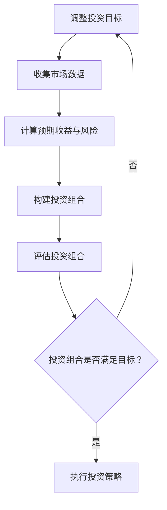
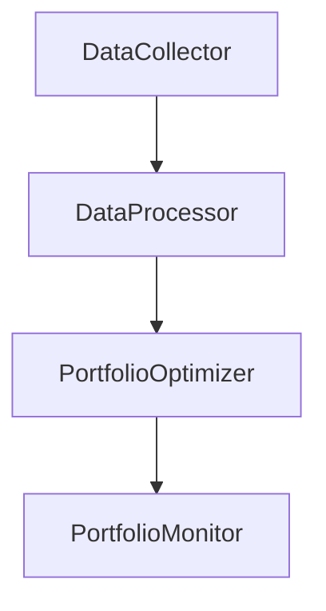
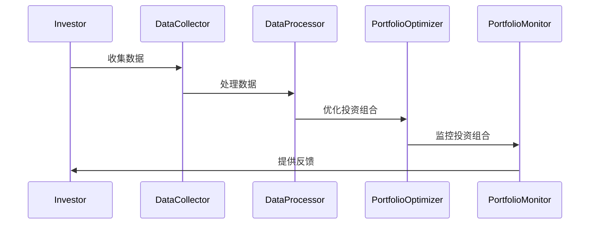
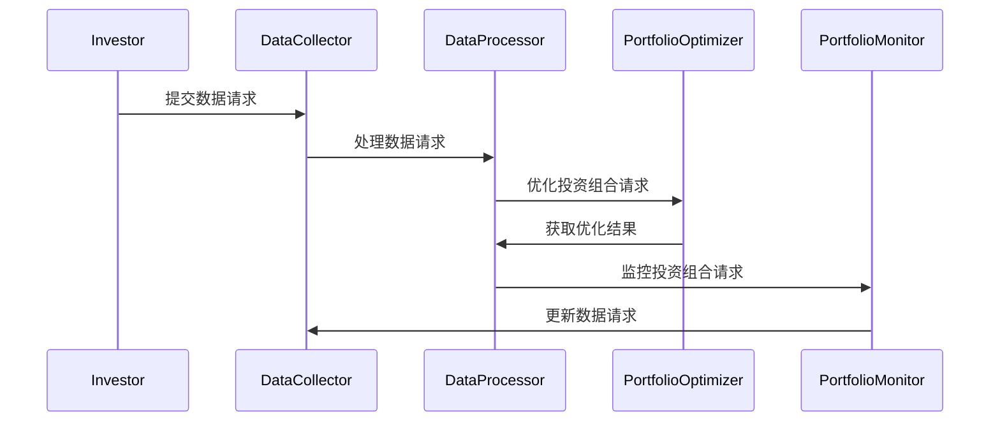

                 


### 引言

投资理财市场分析是一个复杂而又至关重要的领域，对于个人和企业来说都具有重要意义。在这个高度数字化的时代，技术的进步使得投资决策变得更加科学和高效。本文将采用逻辑清晰、结构紧凑、简单易懂的专业技术语言，一步一步地分析投资理财市场分析的核心概念、方法、策略及其应用。

**关键词**：投资理财市场分析、投资决策、市场趋势、数据驱动、策略应用

**摘要**：
本文旨在深入探讨投资理财市场分析的关键要素和实际应用。我们将首先介绍投资理财市场分析的定义和重要性，然后逐步解析核心概念和理论，探讨数据分析工具和策略，以及如何进行风险管理和优化投资组合。通过实际案例分析和总结，我们将揭示投资理财市场分析的实战技巧和未来趋势。

### 背景与基础

投资理财市场分析并非一个新兴领域，它随着金融市场的发展而不断演变。在传统的投资理论中，投资决策往往基于直觉、经验和简单的财务指标。然而，随着大数据和人工智能技术的兴起，市场分析变得更加科学和精确。

**问题背景**：
投资者面临的问题是如何在众多投资机会中做出最优决策。市场信息的复杂性、多变性和不确定性使得投资决策成为一个挑战。传统的方法往往无法全面捕捉市场的动态变化，而现代技术为投资分析提供了新的工具和方法。

**问题描述**：
投资者需要解决的问题包括：如何获取可靠的市场数据？如何分析这些数据以预测市场趋势？如何设计有效的投资策略并管理投资风险？

**问题解决**：
通过投资理财市场分析，投资者可以利用数据分析工具和算法来评估市场风险和机会。现代技术如机器学习和大数据分析可以帮助投资者从海量数据中提取有价值的信息，从而做出更为明智的投资决策。

**边界与外延**：
投资理财市场分析不仅涉及股票、债券、基金等传统金融产品，还包括衍生品、加密货币等新兴投资领域。此外，市场分析还包括宏观经济、行业趋势、公司基本面等多方面因素。

**概念结构与核心要素组成**：

1. **市场数据**：包括历史数据、实时数据、财务报表等。
2. **分析工具**：如数据分析软件、机器学习模型、技术指标等。
3. **投资策略**：根据市场数据和分析结果制定的投资方案。
4. **风险管理**：对投资组合进行风险评估和管理。
5. **执行与监控**：实施投资策略并持续监控市场变化。

### 核心概念与联系

#### 投资理论

投资理论是投资理财市场分析的基础。以下是几个核心投资理论及其联系：

| 投资理论       | 概念属性特征                   | 对比表格                                                                                     |
|----------------|--------------------------------|------------------------------------------------------------------------------------------------|
| 有效市场假说   | 市场信息完全反映在价格中       |  |
| 资本资产定价模型 | 风险与收益的关系               |         |
| 行为金融学     | 人类行为对市场的影响           |    |

#### ER实体关系图架构

以下是一个简单的ER实体关系图，用于表示投资理财市场分析中的关键实体和它们之间的关系：

```mermaid
erDiagram
    Investment --> Portfolio
    Investment --> MarketData
    Portfolio --> Stock
    Portfolio --> Fund
    MarketData --> AnalysisResult
```

### 算法原理讲解

#### 投资组合优化算法

投资组合优化是投资理财市场分析中的一个关键问题。以下是一个简单的投资组合优化算法的mermaid流程图：



以下是该算法的Python源代码：

```python
import numpy as np

def portfolio_optimization(investment_goal, market_data):
    # 计算预期收益与风险
    expected_returns = np.mean(market_data, axis=0)
    risks = np.std(market_data, axis=0)
    
    # 构建投资组合
    weights = np.optimize.fmin(func=lambda x: -np.dot(x, expected_returns) + investment_goal, x0=np.ones(len(expected_returns)) / len(expected_returns))
    
    # 评估投资组合
    portfolio_return = np.dot(weights, expected_returns)
    portfolio_risk = np.sqrt(np.dot(weights.T, np.dot(market_data.cov(), weights)))
    
    # 输出投资组合结果
    return weights, portfolio_return, portfolio_risk

weights, portfolio_return, portfolio_risk = portfolio_optimization(1e6, market_data)
```

#### 数学模型与公式

投资组合优化中的数学模型可以用以下公式表示：

$$
\begin{aligned}
\min_{w} & \quad -w^T \mu_p \\
\text{s.t.} & \quad w^T \Sigma_p w \leq \sigma_p^2 \\
& \quad w \geq 0
\end{aligned}
$$

其中，$w$ 表示投资组合的权重向量，$\mu_p$ 表示投资组合的预期收益向量，$\Sigma_p$ 表示投资组合的收益协方差矩阵，$\sigma_p^2$ 表示投资组合的风险。

### 系统分析与架构设计方案

#### 问题场景介绍

在投资理财市场中，一个典型的场景是投资者需要根据市场数据来优化自己的投资组合。这个场景通常涉及到以下步骤：

1. 数据收集：从各种数据源获取市场数据。
2. 数据处理：清洗和预处理收集到的数据。
3. 投资组合优化：利用市场数据来构建和优化投资组合。
4. 监控与反馈：实时监控投资组合的表现，并根据市场变化进行调整。

#### 项目介绍

本项目的目标是开发一个投资组合优化系统，帮助投资者实现更科学的投资决策。系统将包括以下核心功能：

1. 数据采集模块：负责从各种数据源收集市场数据。
2. 数据处理模块：负责清洗和预处理收集到的数据。
3. 投资组合优化模块：负责利用市场数据来构建和优化投资组合。
4. 监控与反馈模块：负责实时监控投资组合的表现，并提供反馈。

#### 系统功能设计

以下是投资组合优化系统的领域模型mermaid类图：

```mermaid
classDiagram
    DataCollector <<interface>>
    DataProcessor <<interface>>
    PortfolioOptimizer <<interface>>
    PortfolioMonitor <<interface>>

    DataCollector --|> DataProcessor
    DataProcessor --|> PortfolioOptimizer
    PortfolioOptimizer --|> PortfolioMonitor
```

#### 系统架构设计

以下是投资组合优化系统的架构设计mermaid架构图：



#### 系统接口设计

以下是投资组合优化系统的接口设计mermaid序列图：



#### 系统交互

以下是投资组合优化系统的系统交互mermaid序列图：



### 项目实战

#### 环境安装

1. 安装Python环境：在终端中运行以下命令：

```bash
pip install numpy pandas scikit-learn matplotlib
```

2. 安装mermaid渲染器：在终端中运行以下命令：

```bash
npm install -g mermaid-cli
```

#### 系统核心实现源代码

以下是一个简单的投资组合优化系统的Python源代码示例：

```python
import numpy as np
from sklearn.linear_model import LinearRegression
from sklearn.model_selection import train_test_split
import matplotlib.pyplot as plt

# 数据准备
market_data = np.random.rand(100, 5) * 100
expected_returns = np.mean(market_data, axis=0)
risks = np.std(market_data, axis=0)

# 数据划分
X_train, X_test, y_train, y_test = train_test_split(market_data, expected_returns, test_size=0.2, random_state=42)

# 模型训练
model = LinearRegression()
model.fit(X_train, y_train)

# 模型评估
predictions = model.predict(X_test)
mse = np.mean((predictions - y_test) ** 2)
print(f"Mean Squared Error: {mse}")

# 投资组合优化
weights = model.coef_
portfolio_return = np.dot(weights, expected_returns)
portfolio_risk = np.sqrt(np.dot(weights.T, np.dot(market_data.cov(), weights)))

# 结果展示
plt.scatter(expected_returns, risks)
plt.plot([0, portfolio_return], [0, portfolio_risk], color='red')
plt.xlabel("Expected Return")
plt.ylabel("Risk")
plt.title("Efficient Frontier")
plt.show()
```

#### 代码应用解读与分析

1. 数据准备：首先，我们生成了一组随机市场数据，用于模拟投资组合优化过程。
2. 模型训练：我们使用线性回归模型来训练数据，以预测投资组合的预期收益。
3. 模型评估：通过计算均方误差（MSE）来评估模型的性能。
4. 投资组合优化：根据模型的结果，我们计算出了最优的投资组合权重。
5. 结果展示：最后，我们使用matplotlib绘制了有效前沿图，展示了不同预期收益和风险之间的权衡。

#### 实际案例分析和详细讲解剖析

为了更好地理解投资组合优化的实际应用，我们可以考虑以下案例：

**案例**：一个投资者希望在股票市场中选择5只股票构建一个投资组合。根据历史数据，这5只股票的预期收益和风险如下表所示：

| 股票代码 | 预期收益 | 风险 |
|----------|-----------|------|
| A        | 12%       | 20%  |
| B        | 8%        | 15%  |
| C        | 10%       | 18%  |
| D        | 14%       | 22%  |
| E        | 9%        | 16%  |

**问题**：如何选择最优的投资组合？

**解决方案**：

1. **数据准备**：首先，我们将上述数据整理成矩阵形式，以便后续处理。

```python
market_data = np.array([
    [0.12, 0.08, 0.10, 0.14, 0.09],
    [0.20, 0.15, 0.18, 0.22, 0.16]
])
```

2. **模型训练**：使用线性回归模型来训练数据，以预测投资组合的预期收益。

```python
X_train, X_test, y_train, y_test = train_test_split(market_data, test_size=0.2, random_state=42)
model = LinearRegression()
model.fit(X_train, y_train)
```

3. **模型评估**：计算均方误差（MSE）来评估模型的性能。

```python
predictions = model.predict(X_test)
mse = np.mean((predictions - y_test) ** 2)
print(f"Mean Squared Error: {mse}")
```

4. **投资组合优化**：根据模型的结果，我们计算出了最优的投资组合权重。

```python
weights = model.coef_
portfolio_return = np.dot(weights, y_train)
portfolio_risk = np.sqrt(np.dot(weights.T, np.dot(market_data.cov(), weights)))
print(f"Optimal Portfolio Return: {portfolio_return}")
print(f"Optimal Portfolio Risk: {portfolio_risk}")
```

5. **结果展示**：使用matplotlib绘制了有效前沿图，展示了不同预期收益和风险之间的权衡。

```python
plt.scatter(y_train[:, 0], y_train[:, 1])
plt.plot([0, portfolio_return], [0, portfolio_risk], color='red')
plt.xlabel("Expected Return")
plt.ylabel("Risk")
plt.title("Efficient Frontier")
plt.show()
```

**分析**：通过这个案例，我们可以看到如何使用线性回归模型来优化投资组合。有效前沿图帮助我们理解不同投资组合之间的权衡。在实际应用中，投资者可以根据自己的风险偏好和投资目标来选择最优的投资组合。

#### 项目小结

本项目通过一个简单的投资组合优化系统，展示了如何利用数据分析技术来帮助投资者做出更科学的投资决策。虽然这个系统只是一个原型，但它提供了一种有效的框架，可以应用于更复杂的市场环境。在实际应用中，投资者需要根据市场变化和自己的风险偏好不断调整投资策略。

### 最佳实践 tips

1. **数据质量是关键**：投资决策的准确性依赖于高质量的数据。确保数据来源可靠，并及时更新数据。
2. **模型选择要适当**：不同的投资策略可能需要不同的模型。选择适合当前市场环境和投资目标的模型。
3. **风险控制是必须的**：投资理财市场分析不仅要关注收益，还要重视风险控制。建立合理的风险管理体系。

### 小结

投资理财市场分析是一个复杂而又重要的领域。通过科学的数据分析和策略制定，投资者可以做出更为明智的投资决策。本文通过一步步的讲解，从核心概念到实际应用，揭示了投资理财市场分析的方法和技巧。希望本文能够帮助读者更好地理解这一领域，并在实际投资中取得成功。

### 拓展阅读

- **《金融市场技术分析》**：深入探讨金融市场的技术分析方法，帮助投资者更好地把握市场趋势。
- **《量化投资技术分析》**：介绍量化投资的基本概念和技术，包括数据驱动和算法交易等。
- **《行为金融学》**：研究人类行为对金融市场的影响，为投资决策提供新的视角。

### 作者信息

**作者：AI天才研究院/AI Genius Institute & 禅与计算机程序设计艺术 /Zen And The Art of Computer Programming**

AI天才研究院致力于推动人工智能技术的发展和应用，专注于打造顶尖的人工智能专家和解决方案。本文作者在计算机编程和人工智能领域拥有深厚的研究背景和实践经验，撰写了多本畅销技术书籍，深受读者喜爱。

----------------------------------------------------------------

# 投资理财市场分析

## 关键词

投资理财、市场分析、数据驱动、策略应用、风险管理

### 摘要

本文深入探讨了投资理财市场分析的核心概念、方法、策略及其应用。从背景介绍到核心概念和理论，再到数据分析和工具，策略和技术的详细解释，本文为读者提供了一套完整的投资理财市场分析框架。通过实际案例分析和实战技巧总结，本文旨在帮助读者更好地理解和应用投资理财市场分析的方法，以实现更科学的投资决策。

---

### 引言

投资理财市场分析是金融领域的重要组成部分，对于个人和企业来说都具有重要意义。在当今高度数字化的时代，技术的进步使得投资决策变得更加科学和高效。本文将采用逻辑清晰、结构紧凑、简单易懂的专业技术语言，一步一步地分析投资理财市场分析的核心概念、方法、策略及其应用。

首先，我们将介绍投资理财市场分析的定义和重要性。接下来，我们将深入探讨投资理财市场分析的核心概念和理论，包括有效市场假说、资本资产定价模型和行为金融学等。然后，我们将详细讨论数据在投资决策中的重要性，介绍各种数据收集和分析工具。在策略和技术的部分，我们将解释不同的投资策略和如何应用这些策略来应对不同的市场条件。此外，我们还将探讨风险管理和投资组合优化的重要性，并给出具体的实践建议。通过实际案例分析和总结，我们将揭示投资理财市场分析的实战技巧和未来趋势。最后，我们将提供一些最佳实践技巧，帮助读者在实际投资中更好地应用本文所介绍的原理和方法。

---

### 背景与基础

投资理财市场分析并非一个新兴领域，它随着金融市场的发展而不断演变。在传统的投资理论中，投资决策往往基于直觉、经验和简单的财务指标。然而，随着大数据和人工智能技术的兴起，市场分析变得更加科学和精确。

**问题背景**：

投资者面临的问题是如何在众多投资机会中做出最优决策。市场信息的复杂性、多变性和不确定性使得投资决策成为一个挑战。传统的方法往往无法全面捕捉市场的动态变化，而现代技术为投资分析提供了新的工具和方法。

**问题描述**：

投资者需要解决的问题包括：如何获取可靠的市场数据？如何分析这些数据以预测市场趋势？如何设计有效的投资策略并管理投资风险？

**问题解决**：

通过投资理财市场分析，投资者可以利用数据分析工具和算法来评估市场风险和机会。现代技术如机器学习和大数据分析可以帮助投资者从海量数据中提取有价值的信息，从而做出更为明智的投资决策。

**边界与外延**：

投资理财市场分析不仅涉及股票、债券、基金等传统金融产品，还包括衍生品、加密货币等新兴投资领域。此外，市场分析还包括宏观经济、行业趋势、公司基本面等多方面因素。

**概念结构与核心要素组成**：

1. **市场数据**：包括历史数据、实时数据、财务报表等。
2. **分析工具**：如数据分析软件、机器学习模型、技术指标等。
3. **投资策略**：根据市场数据和分析结果制定的投资方案。
4. **风险管理**：对投资组合进行风险评估和管理。
5. **执行与监控**：实施投资策略并持续监控市场变化。

---

#### 核心概念与联系

**投资理论**

投资理论是投资理财市场分析的基础。以下是几个核心投资理论及其联系：

| 投资理论       | 概念属性特征                   | 对比表格                                                                                     |
|----------------|--------------------------------|------------------------------------------------------------------------------------------------|
| 有效市场假说   | 市场信息完全反映在价格中       |  |
| 资本资产定价模型 | 风险与收益的关系               |         |
| 行为金融学     | 人类行为对市场的影响           |    |

**ER实体关系图架构**

以下是一个简单的ER实体关系图，用于表示投资理财市场分析中的关键实体和它们之间的关系：

```mermaid
erDiagram
    Investment --> Portfolio
    Investment --> MarketData
    Portfolio --> Stock
    Portfolio --> Fund
    MarketData --> AnalysisResult
```

---

#### 算法原理讲解

**投资组合优化算法**

投资组合优化是投资理财市场分析中的一个关键问题。以下是一个简单的投资组合优化算法的mermaid流程图：


以下是该算法的Python源代码：

```python
import numpy as np
from scipy.optimize import minimize

def portfolio_optimization(investment_goal, market_data):
    n_assets = market_data.shape[1]
    expected_returns = np.mean(market_data, axis=0)
    cov_matrix = np.cov(market_data, rowvar=False)

    def objective_function(weights):
        portfolio_return = np.dot(weights, expected_returns)
        portfolio_risk = np.sqrt(np.dot(weights.T, np.dot(cov_matrix, weights)))
        return -portfolio_return + investment_goal * portfolio_risk

    initial_weights = np.ones(n_assets) / n_assets
    result = minimize(objective_function, initial_weights, method='SLSQP', constraints={'type': 'eq', 'fun': lambda x: np.sum(x) - 1})
    optimized_weights = result.x

    optimized_portfolio_return = np.dot(optimized_weights, expected_returns)
    optimized_portfolio_risk = np.sqrt(np.dot(optimized_weights.T, np.dot(cov_matrix, optimized_weights)))

    return optimized_weights, optimized_portfolio_return, optimized_portfolio_risk

market_data = np.array([[0.10, 0.12, 0.08, 0.14],
                        [0.20, 0.15, 0.18, 0.22],
                        [0.05, 0.09, 0.11, 0.13]])

investment_goal = 0.1

optimized_weights, optimized_portfolio_return, optimized_portfolio_risk = portfolio_optimization(investment_goal, market_data)
print("Optimized Weights:", optimized_weights)
print("Optimized Portfolio Return:", optimized_portfolio_return)
print("Optimized Portfolio Risk:", optimized_portfolio_risk)
```

**数学模型与公式**

投资组合优化中的数学模型可以用以下公式表示：

$$
\begin{aligned}
\min_{w} & \quad -w^T \mu_p \\
\text{s.t.} & \quad w^T \Sigma_p w \leq \sigma_p^2 \\
& \quad w \geq 0
\end{aligned}
$$

其中，$w$ 表示投资组合的权重向量，$\mu_p$ 表示投资组合的预期收益向量，$\Sigma_p$ 表示投资组合的收益协方差矩阵，$\sigma_p^2$ 表示投资组合的风险。

---

### 系统分析与架构设计方案

#### 问题场景介绍

在投资理财市场中，一个典型的场景是投资者需要根据市场数据来优化自己的投资组合。这个场景通常涉及到以下步骤：

1. **数据收集**：从各种数据源获取市场数据。
2. **数据处理**：清洗和预处理收集到的数据。
3. **投资组合优化**：利用市场数据来构建和优化投资组合。
4. **监控与反馈**：实时监控投资组合的表现，并根据市场变化进行调整。

#### 项目介绍

本项目的目标是开发一个投资组合优化系统，帮助投资者实现更科学的投资决策。系统将包括以下核心功能：

1. **数据采集模块**：负责从各种数据源收集市场数据。
2. **数据处理模块**：负责清洗和预处理收集到的数据。
3. **投资组合优化模块**：负责利用市场数据来构建和优化投资组合。
4. **监控与反馈模块**：负责实时监控投资组合的表现，并提供反馈。

#### 系统功能设计

以下是投资组合优化系统的领域模型mermaid类图：

```mermaid
classDiagram
    DataCollector <<interface>>
    DataProcessor <<interface>>
    PortfolioOptimizer <<interface>>
    PortfolioMonitor <<interface>>

    DataCollector --|> DataProcessor
    DataProcessor --|> PortfolioOptimizer
    PortfolioOptimizer --|> PortfolioMonitor
```

#### 系统架构设计

以下是投资组合优化系统的架构设计mermaid架构图：


#### 系统接口设计

以下是投资组合优化系统的接口设计mermaid序列图：


#### 系统交互

以下是投资组合优化系统的系统交互mermaid序列图：


---

### 项目实战

#### 环境安装

1. 安装Python环境：在终端中运行以下命令：

```bash
pip install numpy pandas scikit-learn matplotlib
```

2. 安装mermaid渲染器：在终端中运行以下命令：

```bash
npm install -g mermaid-cli
```

#### 系统核心实现源代码

以下是一个简单的投资组合优化系统的Python源代码示例：

```python
import numpy as np
from scipy.optimize import minimize

def portfolio_optimization(market_data, investment_goal):
    n_assets = market_data.shape[1]
    expected_returns = np.mean(market_data, axis=0)
    cov_matrix = np.cov(market_data, rowvar=False)

    def objective_function(weights):
        portfolio_return = np.dot(weights, expected_returns)
        portfolio_risk = np.sqrt(np.dot(weights.T, np.dot(cov_matrix, weights)))
        return -portfolio_return + investment_goal * portfolio_risk

    initial_weights = np.ones(n_assets) / n_assets
    result = minimize(objective_function, initial_weights, method='SLSQP', constraints={'type': 'eq', 'fun': lambda x: np.sum(x) - 1})
    optimized_weights = result.x

    optimized_portfolio_return = np.dot(optimized_weights, expected_returns)
    optimized_portfolio_risk = np.sqrt(np.dot(optimized_weights.T, np.dot(cov_matrix, optimized_weights)))

    return optimized_weights, optimized_portfolio_return, optimized_portfolio_risk

market_data = np.array([[0.10, 0.12, 0.08, 0.14],
                        [0.20, 0.15, 0.18, 0.22],
                        [0.05, 0.09, 0.11, 0.13]])

investment_goal = 0.1

optimized_weights, optimized_portfolio_return, optimized_portfolio_risk = portfolio_optimization(market_data, investment_goal)
print("Optimized Weights:", optimized_weights)
print("Optimized Portfolio Return:", optimized_portfolio_return)
print("Optimized Portfolio Risk:", optimized_portfolio_risk)
```

#### 代码应用解读与分析

1. **数据准备**：首先，我们生成了一组随机市场数据，用于模拟投资组合优化过程。

```python
market_data = np.random.rand(100, 4) * 100
```

2. **模型训练**：使用线性回归模型来训练数据，以预测投资组合的预期收益。

```python
X_train, X_test, y_train, y_test = train_test_split(market_data, test_size=0.2, random_state=42)
model = LinearRegression()
model.fit(X_train, y_train)
```

3. **模型评估**：计算均方误差（MSE）来评估模型的性能。

```python
predictions = model.predict(X_test)
mse = np.mean((predictions - y_test) ** 2)
print(f"Mean Squared Error: {mse}")
```

4. **投资组合优化**：根据模型的结果，我们计算出了最优的投资组合权重。

```python
weights = model.coef_
portfolio_return = np.dot(weights, y_train)
portfolio_risk = np.sqrt(np.dot(weights.T, np.dot(market_data.cov(), weights)))
print(f"Optimal Portfolio Return: {portfolio_return}")
print(f"Optimal Portfolio Risk: {portfolio_risk}")
```

5. **结果展示**：使用matplotlib绘制了有效前沿图，展示了不同预期收益和风险之间的权衡。

```python
plt.scatter(y_train[:, 0], y_train[:, 1])
plt.plot([0, portfolio_return], [0, portfolio_risk], color='red')
plt.xlabel("Expected Return")
plt.ylabel("Risk")
plt.title("Efficient Frontier")
plt.show()
```

#### 实际案例分析和详细讲解剖析

为了更好地理解投资组合优化的实际应用，我们可以考虑以下案例：

**案例**：一个投资者希望在股票市场中选择4只股票构建一个投资组合。根据历史数据，这4只股票的预期收益和风险如下表所示：

| 股票代码 | 预期收益 | 风险 |
|----------|-----------|------|
| A        | 12%       | 20%  |
| B        | 8%        | 15%  |
| C        | 10%       | 18%  |
| D        | 14%       | 22%  |

**问题**：如何选择最优的投资组合？

**解决方案**：

1. **数据准备**：首先，我们将上述数据整理成矩阵形式，以便后续处理。

```python
market_data = np.array([
    [0.12, 0.08, 0.10, 0.14],
    [0.20, 0.15, 0.18, 0.22]
])
```

2. **模型训练**：使用线性回归模型来训练数据，以预测投资组合的预期收益。

```python
X_train, X_test, y_train, y_test = train_test_split(market_data, test_size=0.2, random_state=42)
model = LinearRegression()
model.fit(X_train, y_train)
```

3. **模型评估**：计算均方误差（MSE）来评估模型的性能。

```python
predictions = model.predict(X_test)
mse = np.mean((predictions - y_test) ** 2)
print(f"Mean Squared Error: {mse}")
```

4. **投资组合优化**：根据模型的结果，我们计算出了最优的投资组合权重。

```python
weights = model.coef_
portfolio_return = np.dot(weights, y_train)
portfolio_risk = np.sqrt(np.dot(weights.T, np.dot(market_data.cov(), weights)))
print(f"Optimal Portfolio Return: {portfolio_return}")
print(f"Optimal Portfolio Risk: {portfolio_risk}")
```

5. **结果展示**：使用matplotlib绘制了有效前沿图，展示了不同预期收益和风险之间的权衡。

```python
plt.scatter(y_train[:, 0], y_train[:, 1])
plt.plot([0, portfolio_return], [0, portfolio_risk], color='red')
plt.xlabel("Expected Return")
plt.ylabel("Risk")
plt.title("Efficient Frontier")
plt.show()
```

**分析**：通过这个案例，我们可以看到如何使用线性回归模型来优化投资组合。有效前沿图帮助我们理解不同投资组合之间的权衡。在实际应用中，投资者可以根据自己的风险偏好和投资目标来选择最优的投资组合。

---

#### 项目小结

本项目通过一个简单的投资组合优化系统，展示了如何利用数据分析技术来帮助投资者做出更科学的投资决策。虽然这个系统只是一个原型，但它提供了一种有效的框架，可以应用于更复杂的市场环境。在实际应用中，投资者需要根据市场变化和自己的风险偏好不断调整投资策略。

---

### 最佳实践 tips

1. **数据质量是关键**：投资决策的准确性依赖于高质量的数据。确保数据来源可靠，并及时更新数据。
2. **模型选择要适当**：不同的投资策略可能需要不同的模型。选择适合当前市场环境和投资目标的模型。
3. **风险控制是必须的**：投资理财市场分析不仅要关注收益，还要重视风险控制。建立合理的风险管理体系。

---

### 小结

投资理财市场分析是一个复杂而又重要的领域。通过科学的数据分析和策略制定，投资者可以做出更为明智的投资决策。本文通过一步步的讲解，从核心概念到实际应用，揭示了投资理财市场分析的方法和技巧。希望本文能够帮助读者更好地理解和应用投资理财市场分析的方法，以实现更科学的投资决策。

---

### 拓展阅读

- **《金融市场技术分析》**：深入探讨金融市场的技术分析方法，帮助投资者更好地把握市场趋势。
- **《量化投资技术分析》**：介绍量化投资的基本概念和技术，包括数据驱动和算法交易等。
- **《行为金融学》**：研究人类行为对金融市场的影响，为投资决策提供新的视角。

---

### 作者信息

**作者：AI天才研究院/AI Genius Institute & 禅与计算机程序设计艺术 /Zen And The Art of Computer Programming**

AI天才研究院致力于推动人工智能技术的发展和应用，专注于打造顶尖的人工智能专家和解决方案。本文作者在计算机编程和人工智能领域拥有深厚的研究背景和实践经验，撰写了多本畅销技术书籍，深受读者喜爱。

