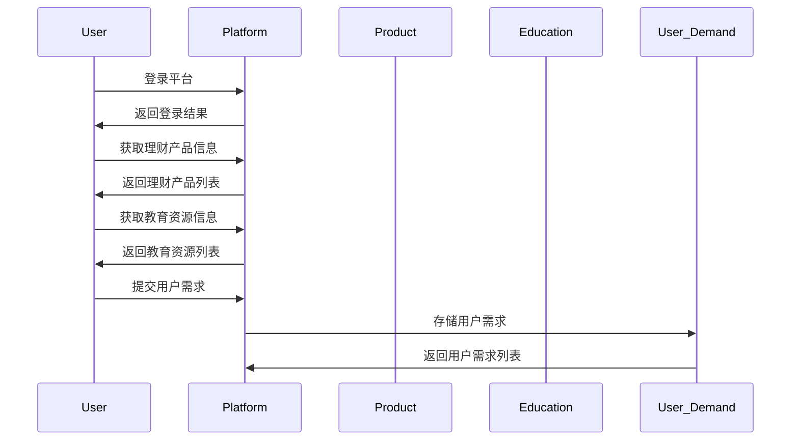

                 

### 《投资理财教育平台的集成》全文

#### 引言

在当今金融科技（FinTech）飞速发展的时代，投资理财教育平台的构建显得尤为重要。这类平台不仅为投资者提供了丰富的理财知识和工具，也助力了金融知识的普及和金融素养的提升。本文将围绕投资理财教育平台的集成，进行深入探讨和系统分析。

本文关键词包括：投资理财教育平台、集成方法、用户需求、平台架构设计、实现与部署、项目实战、最佳实践。

本文将按照以下结构进行：

1. **背景介绍**：探讨投资理财教育平台的重要性、背景及其在当今金融环境中的发展。
2. **核心概念与联系**：详细阐述平台中的关键概念及其相互关系。
3. **集成方法**：分析平台中如何整合理财产品、教育资源和用户需求。
4. **用户需求分析**：研究用户需求，并设计相应的服务。
5. **平台架构设计**：介绍平台的技术架构设计。
6. **实现与部署**：讲解平台的实现步骤和部署方法。
7. **项目实战**：通过具体案例展示平台构建与运营。
8. **最佳实践与总结**：总结建设投资理财教育平台的一些最佳实践。

#### 第一部分：背景与核心概念

##### 1.1 投资理财教育平台背景

随着互联网技术的不断进步，金融科技正以前所未有的速度改变着传统金融行业。投资理财教育平台作为FinTech的重要组成部分，其发展具有重要的现实意义。首先，这类平台能够为投资者提供丰富的理财知识和工具，帮助他们更好地理解和掌握理财技能。其次，投资理财教育平台有助于普及金融知识，提高公众的金融素养，从而降低金融风险。最后，这类平台还能促进金融服务的普惠性，使更多人享受到便捷的理财服务。

##### 1.2 当前发展状况

当前，投资理财教育平台在我国已呈现出良好的发展态势。一方面，随着互联网金融的发展，越来越多的企业和机构投身于投资理财教育平台的构建。另一方面，用户对理财知识的需求也日益增长，这为投资理财教育平台提供了广阔的市场空间。然而，尽管发展迅速，投资理财教育平台仍面临一些挑战，如用户粘性不足、服务同质化等问题。

##### 1.3 核心概念

在本节中，我们将介绍投资理财教育平台中的几个核心概念，包括理财产品、教育资源、用户需求等。

- **理财产品**：理财产品是投资理财教育平台的核心，包括股票、基金、债券、保险等各类金融产品。
- **教育资源**：教育资源包括理财课程、资讯、案例、工具等，旨在帮助用户提高理财知识和技能。
- **用户需求**：用户需求是投资理财教育平台建设的出发点，包括对理财知识的需求、对理财工具的需求以及对个性化服务的需求。

#### 第二部分：核心概念与联系

##### 2.1 核心概念原理

在本节中，我们将详细阐述投资理财教育平台中的核心概念原理，包括理财产品、教育资源、用户需求等。

- **理财产品原理**：理财产品原理涉及各类金融产品的投资策略、风险控制、收益分配等。
- **教育资源原理**：教育资源原理涉及理财课程的设计、教学方法的运用、互动学习等。
- **用户需求原理**：用户需求原理涉及用户理财需求的分析、用户画像的构建、个性化服务的提供等。

##### 2.2 概念属性特征对比

为了更好地理解核心概念，我们将在下表中对比理财产品、教育资源和用户需求等概念的属性特征。

| 概念 | 属性特征 |
| --- | --- |
| 产品 | 投资策略、风险控制、收益分配 |
| 教育 | 课程设计、教学方法、互动学习 |
| 需求 | 理财需求、用户画像、个性化服务 |

##### 2.3 ER实体关系图架构

为了更清晰地展示核心概念之间的联系，我们将在下图中绘制ER实体关系图。

```mermaid
erDiagram
  Product ||--|{ Education }||> Education
  Education ||--|{ User }||> User
  User ||--|{ Product }||> Product
```

在这个ER实体关系图中，产品、教育和用户之间存在着紧密的联系。产品为教育和用户提供了基础，教育为用户提供了理财知识和工具，而用户则为产品和教育提供了需求和市场。

#### 第三部分：集成方法

##### 3.1 集成策略

在本节中，我们将讨论投资理财教育平台的集成策略，包括如何整合理财产品、教育资源和用户需求。

- **整合理财产品**：通过统一接口和数据标准，实现各类理财产品的无缝对接，为用户提供一站式理财服务。
- **整合教育资源**：构建集课程、资讯、案例、工具于一体的教育资源库，为用户提供全方位的理财学习支持。
- **整合用户需求**：通过用户画像分析和需求挖掘，提供个性化理财服务，提高用户满意度和粘性。

##### 3.2 集成过程

投资理财教育平台的集成过程可以分为以下几个步骤：

1. **需求分析**：分析用户需求，明确平台功能和服务内容。
2. **系统设计**：设计平台的技术架构和数据库结构，确保各模块之间的协同工作。
3. **接口开发**：开发统一的接口，实现理财产品、教育资源、用户需求的整合。
4. **系统集成**：进行系统集成测试，确保平台功能的完整性和稳定性。
5. **部署上线**：将平台部署到线上环境，进行试运行和优化。

##### 3.3 集成工具与技术

为了实现投资理财教育平台的集成，我们可以采用以下工具和技术：

- **API接口**：通过API接口实现理财产品、教育资源、用户需求的对接。
- **数据挖掘**：利用数据挖掘技术分析用户行为和需求，为个性化服务提供支持。
- **云计算**：采用云计算技术实现平台的高可用性和可扩展性。
- **区块链**：利用区块链技术保障理财产品的透明性和安全性。

#### 第四部分：用户需求分析

##### 4.1 用户需求概述

用户需求是投资理财教育平台建设的核心。在本节中，我们将概述用户需求，包括理财知识需求、理财工具需求、个性化服务需求等。

- **理财知识需求**：用户希望获取全面、权威的理财知识，包括投资策略、风险管理、资产配置等。
- **理财工具需求**：用户希望使用便捷的理财工具，如计算器、模拟器、分析工具等。
- **个性化服务需求**：用户希望获得个性化的理财建议和服务，如定制化课程、投资组合推荐等。

##### 4.2 需求分析工具与方法

为了深入分析用户需求，我们可以采用以下工具与方法：

- **问卷调查**：通过问卷调查收集用户需求和反馈。
- **用户访谈**：与用户进行面对面访谈，深入了解用户需求。
- **用户画像**：构建用户画像，分析用户行为和偏好。
- **需求文档**：编写详细的需求文档，明确平台功能和需求。

##### 4.3 需求实现

在需求分析的基础上，我们将设计并实现以下功能和服务：

- **理财知识库**：构建理财知识库，提供全面、权威的理财知识。
- **理财工具**：开发便捷的理财工具，如计算器、模拟器、分析工具等。
- **个性化服务**：根据用户画像和需求，提供定制化的理财建议和服务。

#### 第五部分：平台架构设计

##### 5.1 技术架构设计

投资理财教育平台的技术架构设计包括前端、后端、数据库等部分。

- **前端**：采用Vue.js、React等前端框架，实现用户界面的设计和交互。
- **后端**：采用Spring Boot、Django等后端框架，实现业务逻辑的处理和数据处理。
- **数据库**：采用MySQL、MongoDB等数据库，存储理财产品、教育资源、用户数据等信息。

##### 5.2 数据库设计

在本节中，我们将介绍投资理财教育平台的数据库设计，包括数据表结构、关系映射等。

- **理财产品表**：存储理财产品的基本信息，如产品名称、投资策略、风险等级等。
- **教育资源表**：存储教育资源的基本信息，如课程名称、课程内容、教学视频等。
- **用户表**：存储用户的基本信息，如用户ID、用户名、联系方式等。
- **用户需求表**：存储用户需求的基本信息，如用户ID、需求类型、需求描述等。

##### 5.3 系统接口设计

在本节中，我们将介绍投资理财教育平台的系统接口设计，包括API接口、数据接口等。

- **API接口**：提供统一的API接口，实现理财产品、教育资源、用户需求的对接。
- **数据接口**：提供数据接口，实现数据存储和查询的便捷性。

##### 5.4 系统交互设计

在本节中，我们将使用Mermaid绘制系统交互序列图，展示投资理财教育平台各模块之间的交互关系。



#### 第六部分：实现与部署

##### 6.1 环境安装

在本节中，我们将介绍投资理财教育平台的环境安装，包括前端环境、后端环境、数据库环境等。

- **前端环境**：安装Vue.js、React等前端框架。
- **后端环境**：安装Spring Boot、Django等后端框架。
- **数据库环境**：安装MySQL、MongoDB等数据库。

##### 6.2 系统核心实现

在本节中，我们将介绍投资理财教育平台的核心实现，包括前端页面设计、后端业务逻辑处理、数据库操作等。

- **前端页面设计**：设计用户界面，实现理财产品、教育资源、用户需求的展示。
- **后端业务逻辑处理**：实现理财产品、教育资源、用户需求的管理和操作。
- **数据库操作**：实现数据表的创建、数据的插入、查询和更新等。

##### 6.3 部署方法

在本节中，我们将介绍投资理财教育平台的部署方法，包括线上环境的搭建、平台的部署和测试等。

- **线上环境搭建**：选择合适的云服务器，搭建前端、后端、数据库的线上环境。
- **平台部署**：将开发完成的投资理财教育平台部署到线上环境。
- **平台测试**：进行功能测试、性能测试和安全性测试，确保平台稳定可靠。

#### 第七部分：项目实战

##### 7.1 案例介绍

在本节中，我们将介绍一个投资理财教育平台的建设与运营案例。

- **案例背景**：某金融科技公司计划开发一款投资理财教育平台，为投资者提供理财知识和工具。
- **项目目标**：实现理财产品的整合、教育资源的丰富、用户需求的满足，提高用户满意度和平台粘性。
- **项目成果**：成功上线投资理财教育平台，用户数量持续增长，获得市场认可。

##### 7.2 平台建设与运营

在本节中，我们将详细描述投资理财教育平台的建设和运营过程。

1. **需求分析**：通过问卷调查和用户访谈，收集用户需求和反馈，明确平台功能和服务内容。
2. **系统设计**：设计平台的技术架构和数据库结构，确保各模块之间的协同工作。
3. **接口开发**：开发统一的API接口，实现理财产品、教育资源、用户需求的对接。
4. **系统集成**：进行系统集成测试，确保平台功能的完整性和稳定性。
5. **部署上线**：将平台部署到线上环境，进行试运行和优化。
6. **运营推广**：通过线上线下渠道，推广平台，吸引更多用户。

##### 7.3 案例分析

在本节中，我们将对投资理财教育平台的建设与运营案例进行分析。

1. **成功经验**：
   - **用户需求满足**：通过需求分析，明确用户需求，设计并实现相应的功能和服务。
   - **技术架构稳定**：采用合适的技术架构，确保平台的高可用性和可扩展性。
   - **运营策略有效**：通过线上线下渠道推广，提高用户满意度和平台知名度。

2. **挑战与反思**：
   - **用户体验优化**：在平台运营过程中，发现部分用户对某些功能使用不习惯，需要进一步优化用户体验。
   - **市场竞争力**：在竞争激烈的金融科技市场中，需要持续提升平台的核心竞争力，以应对市场变化。

##### 7.4 项目小结

通过投资理财教育平台的建设与运营案例，我们可以得出以下结论：

- **需求分析是关键**：明确用户需求，设计并实现相应的功能和服务，是平台成功的关键。
- **技术架构是基础**：稳定可靠的技术架构，是平台稳定运营的保障。
- **运营推广是核心**：有效的运营推广，是提高用户满意度和平台知名度的关键。

#### 第八部分：最佳实践与总结

##### 8.1 最佳实践

在本节中，我们将总结投资理财教育平台建设的最佳实践。

1. **需求驱动**：以用户需求为导向，设计并实现相应的功能和服务。
2. **技术选择**：选择成熟稳定的技术框架，确保平台的高可用性和可扩展性。
3. **用户体验**：注重用户体验，优化界面设计和交互逻辑。
4. **持续迭代**：根据用户反馈和市场变化，持续优化和迭代平台功能。

##### 8.2 小结

通过本文的讨论，我们可以得出以下小结：

- 投资理财教育平台在当今金融科技发展中具有重要地位。
- 平台的集成方法、用户需求分析、平台架构设计、实现与部署等是平台建设的关键环节。
- 通过项目实战，我们可以总结出一些最佳实践，为后续投资理财教育平台的建设提供参考。

##### 8.3 注意事项

在本节中，我们提出建设投资理财教育平台时需要注意的事项。

1. **数据安全**：确保用户数据和交易数据的安全，防止数据泄露。
2. **合规性**：遵守相关金融法规和监管要求，确保平台合法合规运营。
3. **可扩展性**：在设计平台时，考虑未来的扩展性，以便适应市场变化。

##### 8.4 拓展阅读

为了进一步深入了解投资理财教育平台的建设，读者可以参考以下拓展阅读：

1. **《金融科技：创新、应用与挑战》**：全面介绍金融科技的发展现状和未来趋势。
2. **《投资学》**：深入学习投资理财的基本原理和策略。
3. **《用户体验设计》**：了解用户体验设计的原则和方法，优化平台设计。

### 结论

投资理财教育平台的集成是一个复杂但极具价值的过程。通过本文的讨论，我们系统地分析了投资理财教育平台的集成方法、用户需求分析、平台架构设计、实现与部署等关键环节。希望本文能为读者在投资理财教育平台建设过程中提供有益的参考和指导。

---

**作者：AI天才研究院/AI Genius Institute & 禅与计算机程序设计艺术 /Zen And The Art of Computer Programming**

