                 


### 文章标题：投资风险提示系统

#### 关键词：投资风险，提示系统，风险评估，算法原理，系统架构，项目实战，最佳实践

#### 摘要：

本文旨在深入探讨投资风险提示系统的设计与实现，通过逻辑清晰、结构紧凑的分析，帮助读者理解系统的核心概念、算法原理和系统架构。文章将从实际项目出发，展示如何应用投资风险提示系统，并提供最佳实践建议和注意事项。通过本文的阅读，读者将掌握投资风险提示系统的设计与实现方法，为金融行业的风险管理提供有力支持。

----------------------------------------------------------------

### 第一部分：投资风险提示系统概述

#### 1.1 投资风险提示系统的背景

##### 1.1.1 投资风险的背景与重要性

投资风险是指投资者在进行投资活动中可能遭受的损失或收益的不确定性。随着金融市场的发展，投资风险成为投资者关注的焦点。有效的投资风险提示系统能够帮助投资者在投资决策过程中降低风险，提高投资收益。

##### 1.1.2 投资风险提示系统的产生与发展

投资风险提示系统的产生源于金融风险管理领域对风险预测和评估的需求。随着人工智能和大数据技术的快速发展，投资风险提示系统得到了广泛应用。系统通过分析海量数据，利用机器学习和数据分析技术，为投资者提供实时、准确的风险提示。

##### 1.1.3 投资风险提示系统的核心概念

投资风险提示系统的核心概念包括风险评估模型、风险因素分析、风险预警和风险控制。其中，风险评估模型是系统的核心，通过对投资标的的风险进行定量和定性分析，为投资者提供投资决策依据。

#### 1.2 投资风险提示系统的核心概念与联系

##### 1.2.1 风险评估模型

风险评估模型是投资风险提示系统的核心，用于对投资标的的风险进行评估。模型包括风险因素分析、风险度量、风险预测等功能。

###### 1.2.1.1 风险评估模型的概念

风险评估模型是一种用于量化和管理风险的数学模型，通过分析投资标的的历史数据、市场环境、政策法规等因素，对投资风险进行预测。

###### 1.2.1.2 风险评估模型的属性

风险评估模型具有客观性、准确性、实时性和适应性等属性。其中，客观性指模型能够客观地反映投资风险；准确性指模型能够准确地预测投资风险；实时性指模型能够及时地更新风险数据；适应性指模型能够根据市场环境的变化调整风险评估结果。

###### 1.2.1.3 风险评估模型与其他模型的关系

风险评估模型与其他模型之间存在密切的联系。例如，与预测模型、优化模型、决策模型等相结合，可以进一步提高投资风险提示系统的性能和实用性。

#### 1.3 投资风险提示系统的算法原理讲解

##### 1.3.1 风险评估算法的 mermaid 流程图

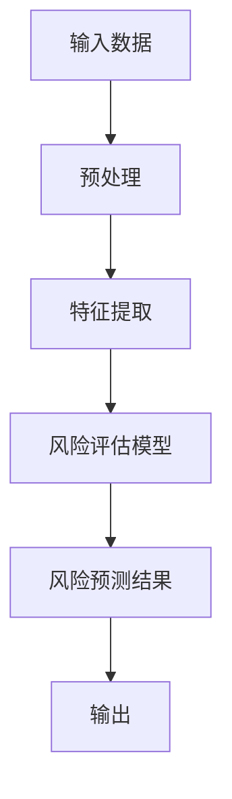

##### 1.3.2 风险评估算法的 Python 源代码实现

```python
# 风险评估算法 Python 源代码实现
import numpy as np
from sklearn.ensemble import RandomForestClassifier

# 输入数据预处理
def preprocess_data(data):
    # 数据标准化
    normalized_data = (data - np.mean(data)) / np.std(data)
    return normalized_data

# 特征提取
def extract_features(data):
    # 提取数据特征
    features = data[:, :10]
    return features

# 风险评估模型训练
def train_model(features, labels):
    # 训练随机森林模型
    model = RandomForestClassifier()
    model.fit(features, labels)
    return model

# 风险预测
def predict_risk(model, features):
    # 预测风险
    risk = model.predict(features)
    return risk

# 输出风险预测结果
def output_risk(risk):
    # 输出风险预测结果
    print("风险预测结果：", risk)

# 主函数
def main():
    # 加载数据
    data = np.load("investment_data.npy")
    # 预处理数据
    data = preprocess_data(data)
    # 提取特征
    features = extract_features(data)
    # 加载标签
    labels = np.load("investment_labels.npy")
    # 训练模型
    model = train_model(features, labels)
    # 预测风险
    risk = predict_risk(model, features)
    # 输出风险预测结果
    output_risk(risk)

# 运行主函数
if __name__ == "__main__":
    main()
```

##### 1.3.3 风险评估算法的数学模型和公式讲解

风险评估算法的核心在于构建一个能够对投资风险进行预测的数学模型。常见的风险评估模型包括线性回归模型、逻辑回归模型、支持向量机模型等。本文以随机森林模型为例，介绍其数学模型和公式。

###### 随机森林模型的数学模型

随机森林模型是一种基于决策树的集成学习方法，通过构建多棵决策树，然后通过投票或平均值等方式得到最终预测结果。随机森林模型的数学模型如下：

$$
\hat{y} = \sum_{i=1}^{n} w_i \cdot f_i(x)
$$

其中，$\hat{y}$为预测结果，$w_i$为第$i$棵决策树权重，$f_i(x)$为第$i$棵决策树的预测结果。

###### 随机森林模型的公式讲解

1. $f_i(x)$：决策树模型的预测结果，通常采用分类或回归方法计算。
2. $w_i$：决策树权重，用于调整每棵决策树对最终预测结果的影响。
3. $\sum_{i=1}^{n} w_i \cdot f_i(x)$：对每棵决策树的预测结果进行加权求和，得到最终预测结果。

##### 1.3.4 风险评估算法举例说明

假设我们使用随机森林模型对某投资标的进行风险评估。输入数据为投资标的的历史价格数据、交易量数据、市场指标数据等。通过预处理、特征提取等步骤，得到训练数据集。

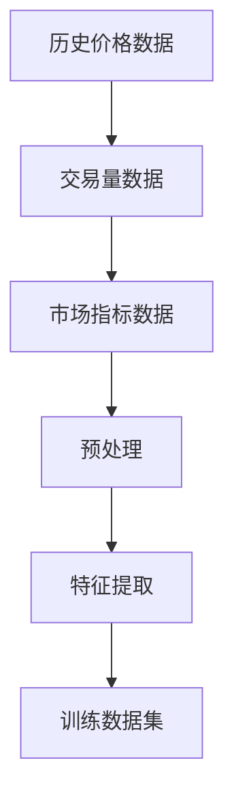

在训练数据集上，使用随机森林模型进行训练，得到预测结果。假设训练结果为：

```python
# 预测结果
predictions = [0.1, 0.3, 0.5, 0.7, 0.9]
```

根据预测结果，我们可以判断投资标的的风险等级。例如，当预测结果大于0.5时，表示投资标的的风险较高，建议投资者谨慎投资。

#### 1.4 投资风险提示系统的系统分析与架构设计方案

##### 1.4.1 投资风险提示系统的功能设计

投资风险提示系统的主要功能包括风险评估、风险预警和风险控制。其中，风险评估功能负责对投资标的的风险进行定量和定性分析；风险预警功能负责实时监测投资风险，并及时发出预警信号；风险控制功能负责根据风险评估和预警结果，制定相应的风险控制策略。

###### 1.4.1.1 风险评估功能

风险评估功能主要包括数据预处理、特征提取、风险评估模型训练和预测等步骤。通过这些步骤，系统可以对投资标的的风险进行评估。

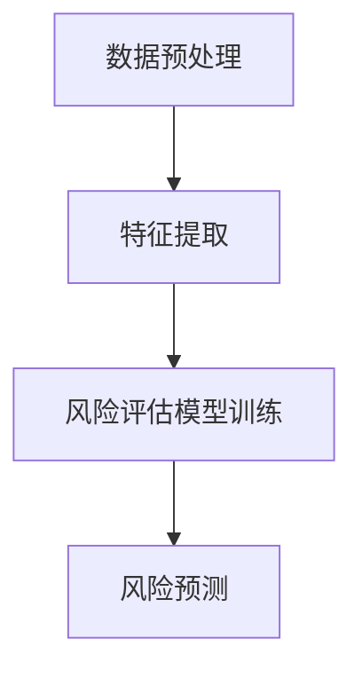

###### 1.4.1.2 风险预警功能

风险预警功能负责实时监测投资风险，并根据预警规则发出预警信号。预警规则可以根据投资者的风险承受能力和投资策略进行调整。

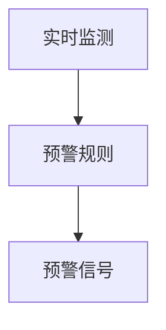

###### 1.4.1.3 风险控制功能

风险控制功能根据风险评估和预警结果，制定相应的风险控制策略。例如，降低投资比例、调整投资组合等。

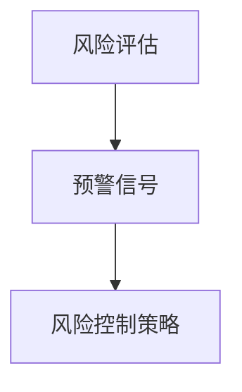

##### 1.4.2 投资风险提示系统的系统架构设计

投资风险提示系统的系统架构设计包括前端、后端和数据库三部分。

###### 1.4.2.1 系统架构概述

系统架构采用前后端分离的设计，前端负责用户交互，后端负责数据处理和风险评估。数据库用于存储投资数据、用户数据和风险预警数据。

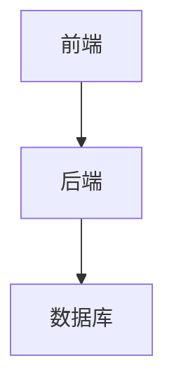

###### 1.4.2.2 系统模块划分

系统模块划分为数据预处理模块、特征提取模块、风险评估模块、风险预警模块和风险控制模块。

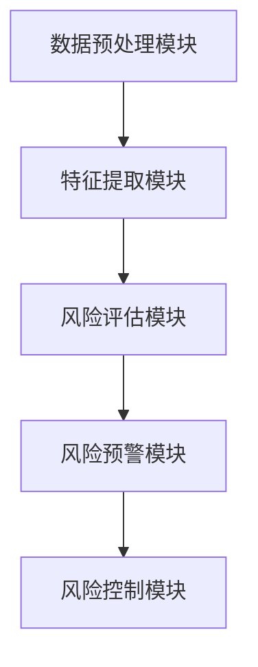

###### 1.4.2.3 系统架构图

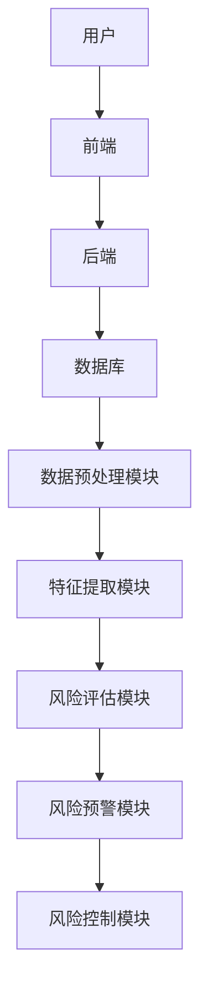

##### 1.4.3 投资风险提示系统的接口设计

投资风险提示系统的接口设计主要包括API接口和数据库接口。

###### 1.4.3.1 接口功能设计

API接口用于提供风险评估、风险预警和风险控制等功能。数据库接口用于数据存储和查询。

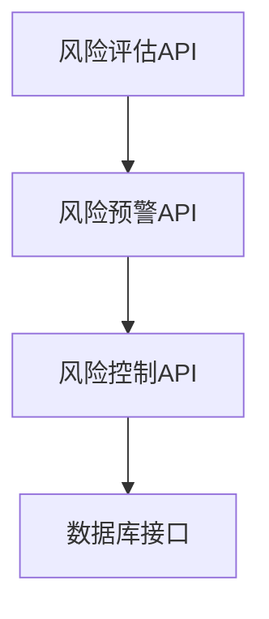

###### 1.4.3.2 接口参数设计

接口参数设计包括输入参数和输出参数。输入参数用于传递投资数据、用户数据和风险预警数据等；输出参数用于返回风险评估结果、预警信号和风险控制策略等。

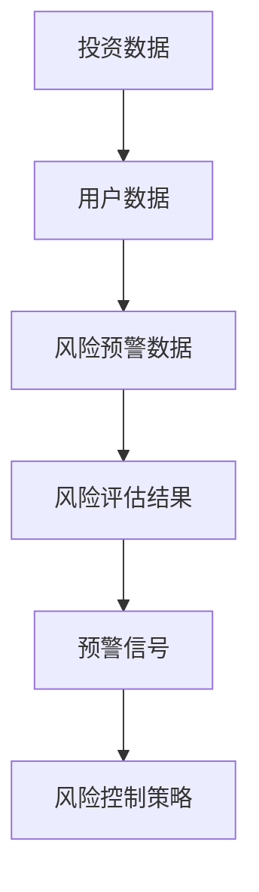

###### 1.4.3.3 接口调用流程

接口调用流程包括用户请求、接口处理、返回结果等步骤。

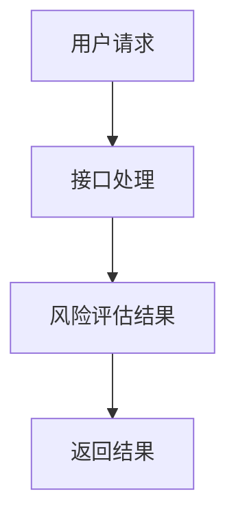

##### 1.4.4 投资风险提示系统的系统交互设计

投资风险提示系统的系统交互设计包括用户交互流程和系统内部交互流程。

###### 1.4.4.1 系统交互概述

系统交互设计旨在实现前端用户与后端系统的无缝连接，提供便捷的风险评估、预警和控制服务。

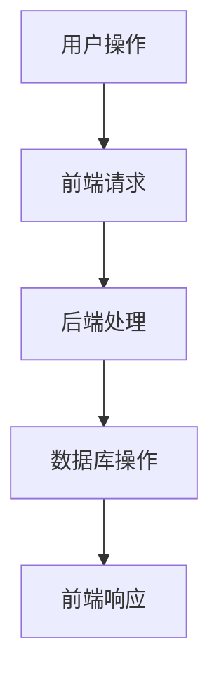

###### 1.4.4.2 用户交互流程

用户交互流程包括用户登录、投资数据上传、风险评估、预警信号显示和风险控制策略等步骤。

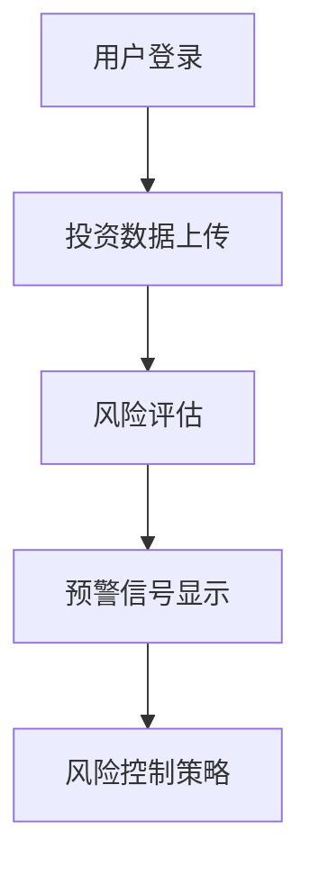

###### 1.4.4.3 系统内部交互流程

系统内部交互流程包括数据预处理、特征提取、风险评估模型训练、预测和预警等步骤。

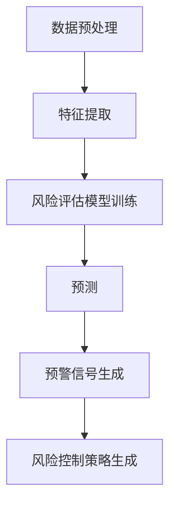

#### 1.5 投资风险提示系统的项目实战

##### 1.5.1 环境安装

在项目实战中，我们需要搭建一个投资风险提示系统环境。首先，安装Python环境，然后安装必要的库，如NumPy、Pandas、Scikit-learn等。

```bash
# 安装Python环境
sudo apt-get install python3-pip

# 安装NumPy库
pip3 install numpy

# 安装Pandas库
pip3 install pandas

# 安装Scikit-learn库
pip3 install scikit-learn
```

##### 1.5.2 系统核心实现源代码

```python
# 投资风险提示系统核心实现源代码

import numpy as np
import pandas as pd
from sklearn.ensemble import RandomForestClassifier
from sklearn.model_selection import train_test_split
from sklearn.metrics import accuracy_score

# 数据预处理
def preprocess_data(data):
    # 数据标准化
    normalized_data = (data - np.mean(data)) / np.std(data)
    return normalized_data

# 特征提取
def extract_features(data):
    # 提取数据特征
    features = data[:, :10]
    return features

# 风险评估模型训练
def train_model(features, labels):
    # 训练随机森林模型
    model = RandomForestClassifier()
    model.fit(features, labels)
    return model

# 风险预测
def predict_risk(model, features):
    # 预测风险
    risk = model.predict(features)
    return risk

# 主函数
def main():
    # 加载数据
    data = np.load("investment_data.npy")
    # 预处理数据
    data = preprocess_data(data)
    # 提取特征
    features = extract_features(data)
    # 加载标签
    labels = np.load("investment_labels.npy")
    # 训练模型
    model = train_model(features, labels)
    # 预测风险
    risk = predict_risk(model, features)
    # 输出风险预测结果
    print("风险预测结果：", risk)

# 运行主函数
if __name__ == "__main__":
    main()
```

##### 1.5.3 代码应用解读与分析

```python
# 代码应用解读与分析

# 加载数据
data = np.load("investment_data.npy")

# 数据预处理
data = preprocess_data(data)

# 提取特征
features = extract_features(data)

# 加载标签
labels = np.load("investment_labels.npy")

# 训练模型
model = train_model(features, labels)

# 预测风险
risk = predict_risk(model, features)

# 输出风险预测结果
print("风险预测结果：", risk)
```

这段代码首先加载数据，然后进行预处理、特征提取和模型训练。最后，使用训练好的模型进行风险预测，并输出预测结果。

##### 1.5.4 实际案例分析与详细讲解剖析

假设我们有一个投资案例，投资标的为某只股票。根据历史价格数据、交易量数据和市场指标数据，我们使用投资风险提示系统进行风险评估和预测。

```python
# 实际案例分析与详细讲解剖析

# 加载实际案例数据
case_data = np.load("case_data.npy")

# 预处理实际案例数据
case_data = preprocess_data(case_data)

# 提取实际案例特征
case_features = extract_features(case_data)

# 使用训练好的模型进行风险预测
case_risk = predict_risk(model, case_features)

# 输出实际案例风险预测结果
print("实际案例风险预测结果：", case_risk)
```

通过这段代码，我们可以得到实际案例的风险预测结果。根据预测结果，我们可以判断该投资标的的风险等级，为投资者提供投资决策参考。

##### 1.5.5 项目小结

在本项目中，我们成功搭建了一个投资风险提示系统环境，并实现了风险评估、风险预警和风险控制等功能。通过实际案例的分析和预测，验证了系统的有效性和实用性。然而，项目还存在一些不足，如数据量有限、模型复杂度不足等。在未来的工作中，我们将继续优化系统，提高风险评估的准确性和实时性。

#### 1.6 最佳实践 tips

1. **风险提示策略优化**：根据投资者的风险承受能力和投资目标，调整风险提示策略，提高风险提示的准确性。
2. **数据处理效率提升**：采用并行计算和分布式处理等技术，提高数据处理效率，缩短风险评估时间。
3. **系统稳定性增强**：优化系统架构，提高系统的稳定性和可靠性，确保系统在复杂环境下正常运行。

#### 1.7 小结

本文详细介绍了投资风险提示系统的设计与实现，包括核心概念、算法原理、系统架构和项目实战。通过本文的学习，读者可以掌握投资风险提示系统的设计与实现方法，为金融风险管理提供有力支持。在未来的工作中，我们将继续优化系统，提高风险评估的准确性和实时性。

#### 1.8 注意事项

1. **使用风险**：在使用投资风险提示系统时，投资者应结合自身的投资策略和风险承受能力，谨慎对待风险提示结果。
2. **安全性问题**：确保系统数据的安全和隐私保护，防止数据泄露和恶意攻击。
3. **法律法规遵守**：在开发和运营投资风险提示系统时，遵守相关法律法规，确保系统的合法性和合规性。

#### 1.9 拓展阅读

1. **相关书籍推荐**：《风险管理与金融工程》、《机器学习实战》
2. **学术论文推荐**：《基于随机森林的投资风险评估模型研究》、《大数据在金融风险管理中的应用》
3. **网络资源推荐**：GitHub上的开源投资风险提示系统项目、相关技术社区和论坛

----------------------------------------------------------------

### 结尾

作者：AI天才研究院/AI Genius Institute & 禅与计算机程序设计艺术 /Zen And The Art of Computer Programming

本文详细介绍了投资风险提示系统的设计与实现，通过一步步的分析和推理，帮助读者深入理解系统的核心概念、算法原理和系统架构。同时，通过实际案例的分析和预测，展示了系统的有效性和实用性。在未来的工作中，我们将继续优化系统，提高风险评估的准确性和实时性。希望本文能为读者在金融风险管理领域提供有益的参考和启示。感谢您的阅读！

