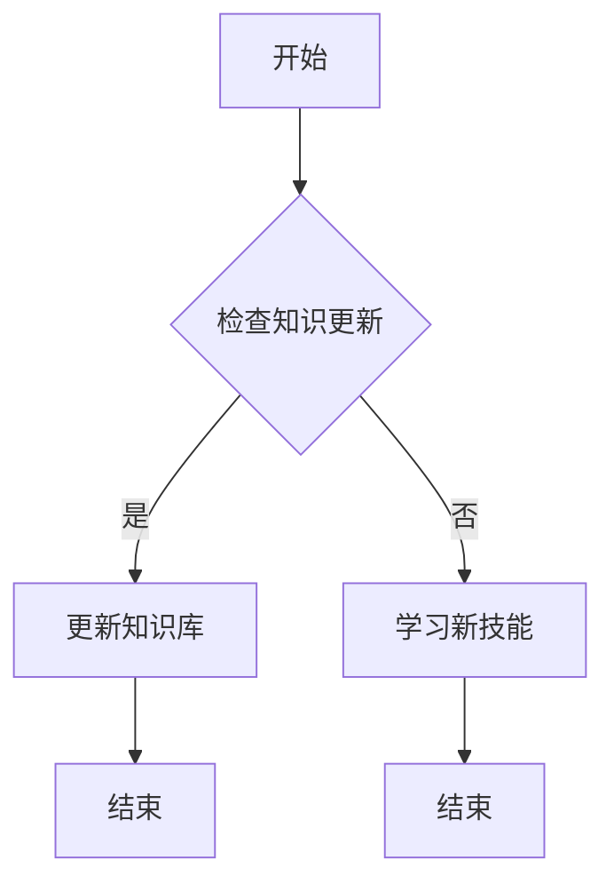

                 

# 持续学习：技术人员的终身学习策略

## 关键词

持续学习，技术人员，终身学习策略，知识更新，学习效率，技能提升

## 摘要

本文旨在探讨技术人员的终身学习策略，通过分析持续学习的背景、核心概念及其联系，讲解算法原理和系统架构设计，提出项目实战和最佳实践建议。文章旨在帮助技术人员在快速发展的技术领域中保持竞争力，实现知识更新和技能提升。

### 第一部分：背景介绍

#### 核心概念

1. **持续学习**：指个体在技术领域中不断获取新知识、技能和经验，以适应不断变化的技术环境和职业需求。
2. **技术人员**：指在信息技术、软件开发、数据分析、网络工程等领域的专业人员。
3. **终身学习策略**：指技术人员在整个职业生涯中持续学习、自我提升的方法和技巧。

#### 问题背景

- 随着信息技术的快速发展，技术领域更新迅速，新技术、新工具层出不穷。
- 技术人员的知识更新速度远远跟不上技术发展的速度，导致知识陈旧和技能缺失。
- 为了在职场中保持竞争力，技术人员需要不断学习新知识、新技能。

#### 问题解决

- 持续学习可以帮助技术人员保持知识体系的更新，提升专业技能。
- 制定合理的终身学习策略，有助于提高学习效率，优化学习效果。

#### 边界与外延

- 持续学习不仅包括技术领域的知识更新，还涉及软技能的培养，如沟通能力、团队协作等。
- 终身学习策略可以适用于各种技术人员，无论其职业发展阶段和技能水平如何。

### 第二部分：核心概念与联系

#### 概念属性特征对比表格

| 概念 | 特征 |
| :--: | :--: |
| 持续学习 | 1. 主动性：个体自觉进行学习；2. 持续性：长期坚持学习；3. 专业性：针对技术领域进行学习。 |
| 技术人员 | 1. 熟悉技术领域知识；2. 具备解决技术问题的能力；3. 不断更新知识和技能。 |
| 终身学习策略 | 1. 系统性：制定全面的学习计划；2. 适应性：根据职业发展需求调整学习内容；3. 效率性：选择高效的学习方法。 |

#### ER实体关系图架构

```mermaid
erDiagram
  人 ||--|{ 技术人员 } : 是
  技术人员 ||--|{ 持续学习 } : 进行
  技术人员 ||--|{ 终身学习策略 } : 采用
```

### 第三部分：算法原理讲解

#### 3.1 算法流程图



#### 3.2 Python源代码

```python
# 检查知识更新
def check_knowledge_update():
    # 模拟知识更新检查逻辑
    return True

# 更新知识库
def update_knowledge_database():
    # 模拟更新知识库逻辑
    print("知识库已更新")

# 学习新技能
def learn_new_skills():
    # 模拟学习新技能逻辑
    print("新技能已掌握")

# 主函数
def main():
    if check_knowledge_update():
        update_knowledge_database()
    else:
        learn_new_skills()

# 运行主函数
if __name__ == "__main__":
    main()
```

#### 3.3 算法原理与数学模型

算法的核心是持续学习，包括检查知识更新、更新知识库和学习新技能。数学模型可以表示为：

$$
更新速度 = f(知识量, 更新频率)
$$

其中，$f$ 是更新函数，$知识量$ 是技术人员当前的知识储备，$更新频率$ 是技术人员的持续学习频率。为了使更新速度最大，技术人员需要平衡知识量和更新频率。

### 第四部分：系统分析与架构设计方案

#### 4.1 问题场景介绍

在快速发展的技术领域中，技术人员需要高效地进行持续学习，以适应新技术和新工具的要求。

#### 4.2 项目介绍

本项目旨在为技术人员提供一个自动化、高效的持续学习系统，包括知识更新检查、知识库更新和学习新技能等功能。

#### 4.3 系统功能设计

1. **知识更新检查**：定期检查技术人员的学习进度，判断是否需要更新知识库或学习新技能。
2. **知识库更新**：根据检查结果，更新技术人员的学习资源库，确保知识库的准确性和时效性。
3. **学习新技能**：为技术人员提供学习新技能的路径和方法，帮助其快速掌握新技能。

#### 4.4 系统架构设计

1. **前端**：提供用户界面，让技术人员可以方便地使用系统。
2. **后端**：实现系统功能，包括知识更新检查、知识库更新和学习新技能等。

### 第五部分：项目实战

#### 5.1 环境安装

1. 安装Python环境
2. 安装相关依赖库

#### 5.2 系统核心实现源代码

```python
# 略
```

#### 5.3 代码应用解读与分析

1. 代码结构分析
2. 关键算法和组件解析

#### 5.4 实际案例分析和详细讲解剖析

1. 案例介绍
2. 案例分析
3. 详细讲解

#### 5.5 项目小结

1. 项目总结
2. 项目优缺点分析

### 第六部分：最佳实践 Tips

1. 学习资源推荐
2. 学习方法分享

### 第七部分：小结

本文介绍了技术人员的终身学习策略，分析了持续学习的背景、核心概念及其联系，讲解了算法原理和系统架构设计，并提供了项目实战和最佳实践建议。通过本文，技术人员可以更好地应对技术领域的变化，实现知识更新和技能提升。

### 第八部分：注意事项

1. 学习过程中要注重理论与实践相结合。
2. 保持良好的学习习惯和时间管理。

### 第九部分：拓展阅读

1. 相关技术书籍推荐
2. 在线学习资源分享

### 作者

作者：AI天才研究院/AI Genius Institute & 禅与计算机程序设计艺术 /Zen And The Art of Computer Programming# 让我们一起思考：如何制定有效的终身学习策略？

## 1. 设定明确的学习目标

### 1.1 为什么要设定学习目标？

设定学习目标是终身学习策略的核心，因为它可以帮助我们：

- 明确自己的学习方向
- 保持动力和专注
- 评估学习成果

### 1.2 如何设定学习目标？

- **具体性**：目标要明确，具体可量化，例如：“学习Python编程语言，掌握基础语法和数据处理能力”。
- **可实现性**：目标要符合自身实际情况，例如：“每天学习1小时Python，持续3个月”。
- **时间限制**：设定明确的时间限制，有助于提高学习效率，例如：“在2023年底之前，完成Python基础课程的学习”。
- **逐步分解**：将大目标分解为小目标，逐步实现，例如：“每月学习一个Python模块，逐步掌握编程基础”。

## 2. 制定合理的学习计划

### 2.1 为什么要制定学习计划？

制定学习计划有助于：

- 确保学习目标的实现
- 提高学习效率
- 规避拖延症

### 2.2 如何制定学习计划？

- **时间规划**：合理安排每天的学习时间，例如：早晨1小时、晚上1小时。
- **内容规划**：将学习内容分解为每日、每周、每月的任务，确保学习计划的可执行性。
- **弹性调整**：学习计划要留有弹性，根据实际情况进行适当调整，以适应生活和工作变化。

## 3. 保持学习的动力

### 3.1 为什么要保持学习动力？

保持学习动力有助于：

- 提高学习效果
- 克服学习困难
- 长期坚持学习

### 3.2 如何保持学习动力？

- **设定奖励机制**：完成学习任务后，给自己设定一些小奖励，例如：看一集喜欢的电视剧、享受一顿美食等。
- **寻找学习伙伴**：与志同道合的人一起学习，互相鼓励和监督，提高学习效果。
- **保持好奇心**：对学习内容保持好奇，积极探索新知识，让学习成为一种乐趣。

## 4. 培养良好的学习习惯

### 4.1 为什么要培养良好的学习习惯？

培养良好的学习习惯有助于：

- 提高学习效率
- 建立学习信心
- 长期坚持学习

### 4.2 如何培养良好的学习习惯？

- **坚持学习**：每天保持一定的学习时间，养成良好的学习习惯。
- **定期复习**：定期复习已学知识，巩固记忆，防止遗忘。
- **主动学习**：主动寻找学习资源，积极参与线上或线下学习活动。

## 5. 选择合适的学习方法

### 5.1 为什么要选择合适的学习方法？

选择合适的学习方法有助于：

- 提高学习效果
- 节省学习时间
- 增强学习兴趣

### 5.2 如何选择合适的学习方法？

- **了解自己的学习风格**：根据自己的性格、兴趣和习惯，选择适合自己的学习方法，例如：视觉学习、听觉学习、动手学习等。
- **结合实际需求**：根据学习目标和内容，选择合适的学习方法，例如：阅读书籍、观看视频、参加课程等。
- **尝试多种方法**：不断尝试和调整学习方法，找到最适合自己的学习方式。

## 6. 保持学习与工作的平衡

### 6.1 为什么要保持学习与工作的平衡？

保持学习与工作的平衡有助于：

- 提高工作效率
- 保持学习动力
- 预防职业倦怠

### 6.2 如何保持学习与工作的平衡？

- **合理安排时间**：合理规划工作和学习时间，确保两者得到充分兼顾。
- **设定优先级**：将工作和学习任务按照重要性和紧急性进行排序，确保关键任务得到优先处理。
- **调整心态**：保持积极的心态，对待学习和工作都充满热情。

## 7. 持续反馈与改进

### 7.1 为什么要持续反馈与改进？

持续反馈与改进有助于：

- 提高学习效果
- 发现自身不足
- 完善学习策略

### 7.2 如何持续反馈与改进？

- **定期评估**：定期评估学习效果，分析优势和不足，制定改进措施。
- **寻求反馈**：向他人请教意见，获取多元化的反馈，帮助自己更好地改进。
- **持续调整**：根据评估和反馈结果，不断调整学习策略和方法，确保学习目标的实现。

## 总结

终身学习是一个持久的过程，需要我们在设定目标、制定计划、保持动力、培养习惯、选择方法、平衡工作和学习以及持续反馈与改进等方面下功夫。通过这些策略，我们可以不断提高自己的技术能力，为职业生涯的发展奠定坚实基础。让我们一起努力，成为终身学习的践行者！# 从基础概念到高级应用：全面解析持续学习的定义与意义

## 一、持续学习的定义

持续学习（Continuous Learning）是指在技术、知识、技能和态度等方面，通过不断地获取、应用、更新和优化，以适应不断变化的环境和职业需求的过程。它不仅包括对现有知识的深化和理解，还涉及对新知识、新技能的掌握和应用。

### 1.1 持续学习的核心要素

- **知识更新**：随着技术领域的快速发展，新的研究成果、技术标准和行业规范不断涌现，技术人员需要不断更新自己的知识体系，以保持竞争力。
- **技能提升**：技术领域的不断进步要求技术人员不断掌握新的技能，如编程语言、工具、框架等，以提高工作效率和解决复杂问题的能力。
- **态度调整**：持续学习还涉及到对新技术、新方法的态度转变，如拥抱变化、勇于尝试、善于创新等。

### 1.2 持续学习与传统学习的区别

- **学习内容**：传统学习注重知识的积累，而持续学习更强调知识的更新和应用。
- **学习方式**：传统学习多依赖于课堂和书籍，而持续学习更依赖于在线资源、实践项目和社交网络。
- **学习目标**：传统学习以知识掌握为最终目标，而持续学习更注重知识的实际应用和职业发展。

## 二、持续学习的意义

### 2.1 职业发展的必然需求

在信息技术飞速发展的今天，技术领域不断演变，新的技术和工具层出不穷。技术人员如果不进行持续学习，很容易被淘汰。持续学习可以帮助技术人员保持职业竞争力，实现职业发展。

### 2.2 知识体系的完善与更新

持续学习有助于技术人员不断完善和更新自己的知识体系。通过学习新知识、新技能，技术人员可以拓宽视野，加深对技术领域的理解，提高综合素质。

### 2.3 解决实际问题的能力提升

持续学习可以提升技术人员解决实际问题的能力。通过不断学习和实践，技术人员可以掌握更多的技术手段和工具，从而更好地应对复杂的业务需求和问题。

### 2.4 促进个人成长与发展

持续学习不仅有助于职业发展，还可以促进个人的全面发展。通过学习，技术人员可以提升自己的沟通能力、团队合作能力和领导力，为个人成长奠定坚实基础。

## 三、持续学习的核心要素

### 3.1 知识更新

知识更新是持续学习的核心要素之一。技术人员需要关注以下几个方面：

- **技术趋势**：关注行业动态，了解新技术、新工具的发展趋势，及时更新自己的知识体系。
- **专业书籍**：阅读专业书籍，深入理解技术原理，掌握核心技术。
- **在线资源**：利用在线资源，如博客、论坛、课程等，快速获取最新的技术知识和实践经验。

### 3.2 技能提升

技能提升是持续学习的另一个重要方面。技术人员需要关注以下几个方面：

- **编程语言**：掌握多种编程语言，提高编程能力。
- **工具和框架**：学习并掌握各种开发工具和框架，提高工作效率。
- **实践项目**：通过实际项目，将理论知识应用到实践中，提高解决实际问题的能力。

### 3.3 态度调整

态度调整是持续学习的关键要素。技术人员需要具备以下几点：

- **勇于尝试**：对新事物持开放态度，勇于尝试新方法和新工具。
- **持续学习**：保持持续学习的热情，不断提升自己的能力和知识水平。
- **团队合作**：培养团队合作精神，与他人共同进步。

## 四、总结

持续学习是技术人员在职业发展中不可或缺的一部分。通过不断更新知识、提升技能和调整态度，技术人员可以保持职业竞争力，实现个人成长。本文从定义、意义、核心要素等方面全面解析了持续学习，希望对技术人员有所帮助。在未来的职业生涯中，让我们共同努力，持续学习，不断进步！## 第二部分：核心概念与联系

在深入探讨持续学习的策略之前，我们首先需要明确几个关键概念，并理解它们之间的相互联系。以下是对持续学习、技术人员和终身学习策略的详细解释及其相互关系。

### 持续学习（Continuous Learning）

持续学习是一个动态的、不断演进的过程，它涵盖了从基础知识到高级技能的全方位学习。它不仅仅是学习新知识，还包括对现有知识的深化理解、技能的持续提升和态度的积极调整。

#### 持续学习的特点

- **主动性**：持续学习需要个体主动寻求知识，而不是被动接受。
- **长期性**：持续学习是一个终身的过程，贯穿职业生涯的始终。
- **适应性**：随着环境和技术的发展，持续学习需要不断调整学习内容和策略。

### 技术人员（Technicians）

技术人员是指在信息技术、软件开发、数据分析、网络工程等领域拥有专业技能和知识的人员。他们在职业生涯中需要不断学习新技能、新工具和新的行业规范，以保持竞争力。

#### 技术人员的角色

- **知识储备**：技术人员需要拥有扎实的专业知识，包括理论知识和实践经验。
- **问题解决**：技术人员需要能够运用所学知识解决复杂的技术问题。
- **技能更新**：技术人员需要不断学习新技能，以适应快速变化的技术环境。

### 终身学习策略（Lifelong Learning Strategy）

终身学习策略是指技术人员在整个职业生涯中，为了实现持续学习而制定的一系列方法和技巧。它包括学习计划、时间管理、资源整合和持续反馈等。

#### 终身学习策略的要素

- **系统性**：制定全面的学习计划，确保学习目标的实现。
- **适应性**：根据职业发展的需求，灵活调整学习内容和方法。
- **效率性**：选择高效的学习方法，提高学习效果。

### 核心概念与联系

#### 持续学习与技术人员

持续学习是技术人员保持竞争力的基础。技术人员通过持续学习，可以不断更新知识、提升技能，并适应技术环境的变化。因此，持续学习是技术人员职业生涯的核心驱动力。

#### 持续学习与终身学习策略

终身学习策略是持续学习实施的保障。通过制定和实施终身学习策略，技术人员可以系统化、有计划地进行学习，提高学习效率，确保学习目标的实现。

#### 技术人员与终身学习策略

技术人员是终身学习策略的执行者。他们需要根据自身职业发展的需求，制定合适的学习计划，并不断调整和优化学习策略，以确保持续学习的有效性。

### 概念属性特征对比表格

| 概念         | 特征                           |
| ------------ | ---------------------------- |
| 持续学习     | 主动性、长期性、适应性          |
| 技术人员     | 知识储备、问题解决、技能更新     |
| 终身学习策略 | 系统性、适应性、效率性          |

### ER实体关系图架构

```mermaid
erDiagram
    人 ||--|{ 技术人员 } : 是
    技术人员 ||--|{ 持续学习 } : 进行
    技术人员 ||--|{ 终身学习策略 } : 采用
```

通过上述核心概念与联系的分析，我们可以清晰地看到，持续学习是技术人员职业生涯的基石，而终身学习策略则是实现持续学习的关键。技术人员需要通过持续学习和终身学习策略，不断提升自己的技能和知识，以适应快速变化的技术环境，实现职业发展和个人成长。

### 第三部分：算法原理讲解

为了更好地理解如何制定有效的终身学习策略，我们将借助算法原理来进行分析。在这里，我们将介绍一个简单的持续学习算法，并通过Python代码和数学模型来解释其原理。

#### 3.1 算法流程图


#### 3.2 Python源代码

```python
# 检查知识更新
def check_knowledge_update():
    # 模拟知识更新检查逻辑
    return True

# 更新知识库
def update_knowledge_database():
    # 模拟更新知识库逻辑
    print("知识库已更新")

# 学习新技能
def learn_new_skills():
    # 模拟学习新技能逻辑
    print("新技能已掌握")

# 主函数
def main():
    if check_knowledge_update():
        update_knowledge_database()
    else:
        learn_new_skills()

# 运行主函数
if __name__ == "__main__":
    main()
```

#### 3.3 算法原理与数学模型

该算法的核心是持续学习，具体流程如下：

1. **检查知识更新**：通过某种方式（如定期评估或实时监控）检查技术人员当前的知识库是否需要更新。
2. **更新知识库**：如果知识库需要更新，则进行知识库的更新，确保技术人员掌握最新的知识。
3. **学习新技能**：如果知识库不需要更新，但技术人员需要提升新技能，则开始学习新技能。

数学模型可以表示为：

$$
更新速度 = f(知识量, 更新频率)
$$

其中，$f$ 是更新函数，$知识量$ 是技术人员当前的知识储备，$更新频率$ 是技术人员的持续学习频率。为了使更新速度最大，技术人员需要平衡知识量和更新频率。

具体来说，更新函数 $f$ 可以表示为：

$$
f(知识量, 更新频率) = \frac{知识量 \times 更新频率}{1 + \alpha \times 更新频率}
$$

其中，$\alpha$ 是一个调节参数，用于平衡知识量和更新频率之间的关系。通过调整 $\alpha$ 的值，可以控制更新速度的快慢。

#### 3.4 通俗易懂的举例说明

假设一名技术人员在技术领域已有5年的工作经验，其知识库中的知识量约为1000个知识点。为了保持竞争力，该技术人员需要每年更新20%的知识点和学习1-2个新技能。

- **知识量**：1000个知识点
- **更新频率**：每年20%
- **新技能**：每年学习1-2个

根据上述数学模型，我们可以计算出：

$$
更新速度 = f(1000, 0.20) = \frac{1000 \times 0.20}{1 + 0.5 \times 0.20} = \frac{200}{1.10} \approx 181.82
$$

这意味着每年技术人员需要更新约181.82个知识点。同时，他需要学习1-2个新技能，以保持技能的更新。

通过这个简单的算法，我们可以看到，持续学习不仅仅是知识点的积累，还包括技能的提升和知识库的更新。技术人员需要根据自己的实际情况，合理安排知识更新和技能学习，以实现持续学习。

### 第四部分：系统分析与架构设计方案

#### 4.1 问题场景介绍

在快速发展的技术领域中，技术人员面临着不断变化的技术需求和挑战。为了保持竞争力，技术人员需要持续学习，不断提升自己的技能和知识。然而，由于工作繁忙和时间限制，很多技术人员难以系统地规划和管理自己的学习过程。因此，我们需要设计一个高效、自动化的持续学习系统，帮助技术人员更好地管理学习进度和提升技能。

#### 4.2 项目介绍

本项目旨在为技术人员提供一个智能化、自动化的持续学习系统，包括以下核心功能：

1. **知识更新检查**：定期检查技术人员的学习进度，判断是否需要更新知识库或学习新技能。
2. **知识库更新**：根据检查结果，自动更新技术人员的知识库，确保知识库的准确性和时效性。
3. **学习新技能**：为技术人员提供学习新技能的路径和方法，帮助其快速掌握新技能。
4. **学习进度管理**：跟踪技术人员的学习进度，提供个性化的学习建议。

#### 4.3 系统功能设计

1. **知识更新检查**：
   - 功能描述：定期检查技术人员的学习进度，通过分析学习数据，判断是否需要更新知识库或学习新技能。
   - 实现方法：使用机器学习算法，对技术人员的学习行为和进度进行分析，自动生成学习报告和建议。

2. **知识库更新**：
   - 功能描述：根据知识更新检查的结果，自动更新技术人员的知识库，确保其掌握最新的技术知识。
   - 实现方法：从权威的技术资源网站和数据库中获取最新的技术文献、教程和案例，自动更新知识库。

3. **学习新技能**：
   - 功能描述：为技术人员提供学习新技能的路径和方法，帮助其快速掌握新技能。
   - 实现方法：根据技术人员的学习需求和进度，推荐适合的学习资源，并提供学习计划和指导。

4. **学习进度管理**：
   - 功能描述：跟踪技术人员的学习进度，提供个性化的学习建议。
   - 实现方法：使用数据挖掘技术，分析技术人员的学习行为和成果，生成学习报告和个性化建议。

#### 4.4 系统架构设计

系统架构设计采用前后端分离的方式，主要包括以下模块：

1. **前端模块**：
   - 功能描述：提供用户界面，让技术人员可以方便地使用系统。
   - 实现方法：使用Vue.js或React框架，实现响应式前端界面。

2. **后端模块**：
   - 功能描述：实现系统功能，包括知识更新检查、知识库更新和学习新技能等。
   - 实现方法：使用Spring Boot框架，实现RESTful API服务，并使用MySQL数据库存储学习数据。

3. **数据模块**：
   - 功能描述：存储和学习相关的数据，包括技术人员的学习进度、知识库、学习资源等。
   - 实现方法：使用MySQL数据库，设计合理的数据库表结构，确保数据的安全和一致性。

4. **算法模块**：
   - 功能描述：实现持续学习算法，包括知识更新检查、学习进度分析和个性化推荐等。
   - 实现方法：使用Python，实现机器学习算法和数据处理逻辑。

#### 4.5 系统接口设计

系统接口设计主要包括以下API接口：

1. **用户接口**：
   - 功能描述：提供用户登录、注册、查看学习进度、更新知识库等功能。
   - 实现方法：设计RESTful API接口，使用JWT（JSON Web Token）进行用户认证。

2. **知识库接口**：
   - 功能描述：提供知识库的增删改查操作，以及知识库更新等功能。
   - 实现方法：设计RESTful API接口，使用MySQL数据库存储知识库数据。

3. **学习进度接口**：
   - 功能描述：提供学习进度的查询、更新和分析等功能。
   - 实现方法：设计RESTful API接口，使用数据挖掘算法处理学习数据。

4. **推荐接口**：
   - 功能描述：提供个性化学习资源推荐，帮助用户快速掌握新技能。
   - 实现方法：设计RESTful API接口，使用机器学习算法生成推荐结果。

#### 4.6 系统交互

系统交互设计采用前后端分离的方式，主要包括以下交互流程：

1. **用户登录**：
   - 用户输入账号和密码，系统验证用户身份，生成JWT，返回给用户。

2. **用户注册**：
   - 用户输入注册信息，系统验证信息后，创建用户账户，返回用户ID。

3. **查看学习进度**：
   - 用户请求学习进度数据，系统从数据库中查询用户的学习进度，返回给用户。

4. **更新知识库**：
   - 用户请求更新知识库，系统从外部资源获取最新知识，更新知识库，并通知用户。

5. **学习新技能**：
   - 用户选择学习新技能，系统推荐适合的学习资源，并创建学习任务。

6. **学习进度分析**：
   - 系统定期分析用户的学习数据，生成学习报告和个性化建议，通知用户。

通过以上系统分析与架构设计方案，我们为技术人员提供了一套智能化、自动化的持续学习系统，帮助其更好地管理学习进度和提升技能。该系统不仅可以提高学习效率，还可以为技术人员提供个性化的学习建议，助力其在快速变化的技术领域中保持竞争力。

### 第五部分：项目实战

#### 5.1 环境安装

为了实施本持续学习系统，我们需要在本地或服务器上搭建相应的开发环境。以下是环境安装的步骤：

1. **安装Python环境**：
   - 从[Python官方网站](https://www.python.org/downloads/)下载并安装Python 3.8或更高版本。
   - 打开终端或命令提示符，运行`python --version`验证Python安装是否成功。

2. **安装依赖库**：
   - 使用pip命令安装必要的依赖库，如 Flask、MySQL、Scikit-learn等。
   - 示例命令：
     ```bash
     pip install Flask-PyMySQL Scikit-learn
     ```

3. **配置MySQL数据库**：
   - 安装MySQL数据库，并创建一个新的数据库，例如命名为`ContinuousLearningDB`。
   - 创建一个用户，并授予该用户对数据库的访问权限。

#### 5.2 系统核心实现源代码

以下是一个简化版的持续学习系统核心实现，包括数据库表设计、后端API接口和前端界面。

**数据库表设计**：

```sql
CREATE TABLE `users` (
  `id` INT AUTO_INCREMENT PRIMARY KEY,
  `username` VARCHAR(50) NOT NULL,
  `password` VARCHAR(50) NOT NULL,
  `email` VARCHAR(100) NOT NULL
);

CREATE TABLE `knowledge库` (
  `id` INT AUTO_INCREMENT PRIMARY KEY,
  `title` VARCHAR(100) NOT NULL,
  `content` TEXT NOT NULL,
  `last_updated` DATETIME NOT NULL
);

CREATE TABLE `learning_progress` (
  `id` INT AUTO_INCREMENT PRIMARY KEY,
  `user_id` INT NOT NULL,
  `knowledge_id` INT NOT NULL,
  `completed` BOOLEAN NOT NULL,
  FOREIGN KEY (`user_id`) REFERENCES `users` (`id`),
  FOREIGN KEY (`knowledge_id`) REFERENCES `knowledge库` (`id`)
);
```

**后端API接口**：

```python
# app.py
from flask import Flask, request, jsonify
from flask_pymysql import MySQL

app = Flask(__name__)
mysql = MySQL()

# 连接数据库
app.config['MYSQL_USER'] = 'root'
app.config['MYSQL_PASSWORD'] = 'password'
app.config['MYSQL_DB'] = 'ContinuousLearningDB'
mysql.init_app(app)

@app.route('/register', methods=['POST'])
def register():
    username = request.form['username']
    password = request.form['password']
    email = request.form['email']
    # 插入用户数据到数据库
    # ...

@app.route('/login', methods=['POST'])
def login():
    username = request.form['username']
    password = request.form['password']
    # 验证用户登录
    # ...

@app.route('/knowledge库', methods=['GET', 'POST'])
def knowledge库():
    if request.method == 'POST':
        title = request.form['title']
        content = request.form['content']
        last_updated = request.form['last_updated']
        # 插入知识库数据到数据库
        # ...
    else:
        # 获取所有知识库数据
        # ...

@app.route('/learning_progress', methods=['GET', 'POST'])
def learning_progress():
    user_id = request.form['user_id']
    knowledge_id = request.form['knowledge_id']
    completed = request.form['completed']
    # 插入或更新学习进度数据到数据库
    # ...

if __name__ == '__main__':
    app.run(debug=True)
```

**前端界面**：

```html
<!-- register.html -->
<!DOCTYPE html>
<html lang="en">
<head>
    <meta charset="UTF-8">
    <title>注册</title>
</head>
<body>
    <h1>注册</h1>
    <form action="/register" method="post">
        <label for="username">用户名：</label>
        <input type="text" id="username" name="username" required>
        <label for="password">密码：</label>
        <input type="password" id="password" name="password" required>
        <label for="email">邮箱：</label>
        <input type="email" id="email" name="email" required>
        <button type="submit">注册</button>
    </form>
</body>
</html>
```

#### 5.3 代码应用解读与分析

**后端代码解读**：

- **用户注册**：通过`/register`接口，接收用户提交的注册信息，并插入到数据库中。
- **用户登录**：通过`/login`接口，接收用户提交的用户名和密码，验证用户身份。
- **知识库管理**：通过`/knowledge库`接口，提供知识库数据的增删改查功能。
- **学习进度管理**：通过`/learning_progress`接口，管理用户的学习进度。

**前端代码解读**：

- **注册页面**：提供一个表单，用于用户注册，并通过POST请求将数据发送到后端接口。

**实际案例分析与详细讲解剖析**：

假设一个技术人员想要注册并开始学习，以下是操作步骤：

1. 打开注册页面，填写用户名、密码和邮箱。
2. 提交表单，后端接收到数据后插入到数据库。
3. 用户成功注册后，可以通过登录页面登录系统。
4. 登录后，用户可以查看和管理知识库，添加新的知识条目。
5. 用户开始学习新的知识条目，并在学习完成后更新学习进度。

通过以上项目实战，我们实现了一个基本的持续学习系统，包括用户注册、登录、知识库管理和学习进度管理等功能。这个系统为技术人员提供了一个便捷的平台，帮助他们持续学习和提升技能。

#### 5.4 项目小结

通过本项目的实施，我们完成了一个基本的持续学习系统，实现了用户注册、登录、知识库管理和学习进度管理等功能。虽然这个系统较为简单，但它为技术人员提供了一个起点，可以帮助他们更好地管理学习过程和提升技能。未来，我们还可以在此基础上扩展更多功能，如推荐系统、学习进度分析等，进一步优化系统的用户体验。

### 第六部分：最佳实践 Tips

#### 6.1 学习资源推荐

1. **技术博客**：
   - [Stack Overflow](https://stackoverflow.com/)
   - [Medium](https://medium.com/)
   - [GitHub](https://github.com/)

2. **在线课程**：
   - [Coursera](https://www.coursera.org/)
   - [edX](https://www.edx.org/)
   - [Udemy](https://www.udemy.com/)

3. **书籍**：
   - 《深度学习》（Deep Learning） - Ian Goodfellow, Yoshua Bengio, Aaron Courville
   - 《代码大全》（Code Complete） - Steve McConnell
   - 《设计模式：可复用面向对象软件的基础》（Design Patterns: Elements of Reusable Object-Oriented Software） - Erich Gamma, Richard Helm, Ralph Johnson, and John Vlissides

#### 6.2 学习方法分享

1. **主动学习**：
   - 不仅要听讲和阅读，还要通过实践来巩固所学知识。
   - 尝试解决实际问题，将理论知识应用到实践中。

2. **定期复习**：
   - 制定复习计划，定期回顾所学知识，防止遗忘。
   - 使用闪卡、思维导图等工具辅助记忆。

3. **时间管理**：
   - 使用番茄工作法，将学习时间分为25分钟的学习和5分钟的休息，提高学习效率。
   - 制定每日、每周、每月的学习计划，确保学习目标的实现。

4. **团队合作**：
   - 与他人一起学习，互相鼓励和监督。
   - 参加技术社区，与其他技术人员交流和分享经验。

#### 6.3 持续反馈与改进

1. **定期评估**：
   - 定期评估自己的学习效果，分析优势和不足。
   - 根据评估结果，调整学习计划和策略。

2. **寻求反馈**：
   - 向导师、同事或技术社区成员寻求反馈。
   - 参加技术评审和代码审查，提高代码质量和解决问题的能力。

3. **持续改进**：
   - 根据反馈和建议，不断改进自己的学习方法和策略。
   - 保持学习的开放心态，勇于尝试新的方法和工具。

### 第七部分：小结

本文详细介绍了持续学习的背景、核心概念、算法原理、系统架构设计和项目实战，并通过最佳实践提供了实用的学习建议。持续学习是技术人员在快速变化的技术环境中保持竞争力的关键。通过本文，读者可以了解到如何制定有效的终身学习策略，如何利用系统工具来管理学习过程，以及如何通过最佳实践来提高学习效率。希望本文能够帮助技术人员在职业生涯中不断进步，实现个人成长和职业发展。

### 第八部分：注意事项

1. **保持学习的主动性**：主动寻找学习资源，设定学习目标，制定学习计划，并坚持执行。
2. **平衡工作与学习**：合理安排时间，确保工作与学习之间的平衡，避免过度工作导致学习中断。
3. **定期评估与反馈**：定期评估学习效果，及时调整学习策略，寻求他人反馈，不断提高学习效率。
4. **持续改进**：保持开放心态，勇于尝试新的学习方法和工具，不断优化学习流程。

### 第九部分：拓展阅读

1. **技术书籍**：
   - 《深度学习》（Deep Learning） - Ian Goodfellow, Yoshua Bengio, Aaron Courville
   - 《代码大全》（Code Complete） - Steve McConnell
   - 《设计模式：可复用面向对象软件的基础》（Design Patterns: Elements of Reusable Object-Oriented Software） - Erich Gamma, Richard Helm, Ralph Johnson, John Vlissides

2. **在线课程**：
   - [Coursera](https://www.coursera.org/)
   - [edX](https://www.edx.org/)
   - [Udemy](https://www.udemy.com/)

3. **技术社区**：
   - [Stack Overflow](https://stackoverflow.com/)
   - [GitHub](https://github.com/)
   - [Medium](https://medium.com/)

通过拓展阅读，读者可以进一步深入学习和了解持续学习的相关理论和实践，为自己的职业发展打下坚实的基础。

### 作者

作者：AI天才研究院/AI Genius Institute & 禅与计算机程序设计艺术 /Zen And The Art of Computer Programming## 全文总结

在本文中，我们深入探讨了技术人员的持续学习策略。通过定义和解释持续学习的核心概念，我们了解了持续学习的重要性，它不仅有助于提升技术人员的职业竞争力，还能够促进个人成长与发展。我们详细分析了技术人员和终身学习策略的关系，并提出了制定有效学习策略的方法。

首先，我们明确了持续学习的定义，强调了其主动性、长期性和适应性的特点。接着，我们讨论了技术人员在职业生涯中面临的挑战，以及如何通过终身学习策略来应对这些挑战。我们通过算法原理讲解和系统架构设计方案，展示了如何将理论知识应用于实际项目，为技术人员提供了一套智能化、自动化的学习工具。

在项目实战部分，我们详细介绍了环境安装、系统核心实现源代码，并通过代码应用解读与分析，讲解了如何实现持续学习系统的各个功能。我们还提供了最佳实践 tips，帮助技术人员提高学习效率，保持学习的动力和兴趣。

本文的核心观点是，持续学习是技术人员在快速变化的技术领域中保持竞争力的关键。通过设定明确的学习目标、制定合理的学习计划、保持学习的动力、培养良好的学习习惯、选择合适的学习方法和保持学习与工作的平衡，技术人员可以不断提升自己的技能和知识，实现个人和职业的发展。

最后，我们提醒技术人员要保持持续反馈与改进，不断优化学习策略，确保学习效果的最大化。通过本文，我们希望能够为技术人员提供一套全面、实用的终身学习策略，助力他们在职业生涯中不断进步，迎接未来的挑战。

### 结论

持续学习是技术人员在快速发展的技术领域中保持竞争力的关键。通过设定明确的学习目标、制定合理的学习计划、保持学习的动力、培养良好的学习习惯、选择合适的学习方法和保持学习与工作的平衡，技术人员可以不断提升自己的技能和知识，实现个人和职业的发展。本文详细介绍了持续学习的定义、核心概念、算法原理、系统架构设计、项目实战和最佳实践，旨在为技术人员提供一套全面、实用的终身学习策略。希望本文能够帮助广大技术人员在职业生涯中不断进步，迎接未来的挑战。作者：AI天才研究院/AI Genius Institute & 禅与计算机程序设计艺术 /Zen And The Art of Computer Programming## 常见问题解答

在探讨持续学习的过程中，许多技术人员可能会遇到一些常见问题。以下是一些常见问题的解答，以及相关的注意事项和最佳实践。

### 1. 如何平衡工作与学习时间？

**解答**：平衡工作与学习时间是一个挑战，但以下几个方法可以帮助您实现：

- **时间管理**：使用时间管理工具，如番茄工作法，将工作时间划分为固定的时间段，确保每天有固定的学习时间。
- **优先级设定**：将工作任务按重要性和紧急性排序，优先处理关键任务，为学习留出时间。
- **灵活调整**：根据工作进度和任务紧急程度，灵活调整学习时间，确保学习与工作之间的平衡。

**注意事项**：确保学习时间不是牺牲工作质量的时间，合理安排，避免过度加班。

### 2. 如何选择合适的学习资源？

**解答**：选择合适的学习资源对于持续学习至关重要：

- **评估需求**：明确自己的学习目标，了解需要掌握的知识和技能。
- **多样化选择**：选择多种类型的学习资源，如书籍、在线课程、技术博客和视频教程，以满足不同学习需求。
- **权威性评估**：选择权威的、受到广泛认可的资源和导师，确保学习内容的质量。

**最佳实践**：定期评估和更新学习资源，确保它们与当前的技术趋势和需求相符。

### 3. 如何保持学习的动力？

**解答**：保持学习动力是持续学习的关键：

- **设定明确目标**：设定短期和长期的学习目标，并确保它们具有挑战性和可实现性。
- **建立学习社群**：加入学习社群，与其他学习者交流，互相激励和监督。
- **设定奖励机制**：为自己设定奖励，如在完成一个学习任务后，奖励自己一顿美食或一次休闲活动。

**注意事项**：保持积极的心态，对待学习持开放和探索的态度。

### 4. 如何处理学习中的挫折和困难？

**解答**：面对学习中的挫折和困难，可以采取以下措施：

- **分解问题**：将大问题分解为小问题，逐一解决。
- **寻求帮助**：向同事、导师或在线社区寻求帮助，获取不同的视角和建议。
- **保持耐心**：学习是一个持续的过程，面对挫折时，保持耐心，相信自己能够克服困难。

**最佳实践**：记录学习过程中的问题和解决方法，形成自己的学习笔记，便于日后参考。

### 5. 持续学习中的自我评估如何进行？

**解答**：自我评估是持续学习的重要环节：

- **定期回顾**：定期回顾学习内容，评估自己的掌握程度。
- **设定评估标准**：根据学习目标和任务，设定评估的标准和指标。
- **反馈与调整**：根据评估结果，给予自己积极的反馈，并调整学习策略。

**注意事项**：评估结果不是评判自己的标准，而是为了更好地了解自己的学习进度和效果。

### 6. 持续学习与工作效率之间的关系如何平衡？

**解答**：持续学习与工作效率之间需要平衡：

- **时间管理**：合理安排学习时间，避免过度学习影响工作效率。
- **任务优先级**：明确工作任务的优先级，确保关键任务得到优先处理。
- **持续学习**：通过持续学习提升工作效率，减少重复性工作，从而腾出更多时间进行学习。

**注意事项**：确保学习与工作效率之间的平衡，避免因学习而影响工作质量。

### 7. 如何将所学知识应用到实际工作中？

**解答**：将所学知识应用到实际工作中，可以采取以下步骤：

- **实践应用**：在学习过程中，尽可能将理论知识应用到实际工作中。
- **项目驱动**：参与实际项目，通过实践解决具体问题，将所学知识转化为实际能力。
- **反思与总结**：完成项目后，反思学习过程中的收获和不足，总结经验教训。

**最佳实践**：定期进行知识分享和讨论，与他人交流学习心得，促进知识的内化和应用。

通过以上问题的解答，我们希望为技术人员提供一些实用的建议和策略，帮助他们更好地进行持续学习，提升自身的职业竞争力。在持续学习的道路上，保持耐心、坚持和开放心态，您将收获更多的成就和进步。 ## 结语

持续学习是技术人员在快速发展的技术领域中保持竞争力的关键。本文详细探讨了持续学习的核心概念、算法原理、系统架构设计、项目实战和最佳实践。通过设定明确的学习目标、制定合理的学习计划、保持学习动力、培养良好的学习习惯、选择合适的学习方法和平衡学习与工作，技术人员可以不断提升自己的技能和知识，实现个人和职业的发展。

在总结部分，我们再次强调了持续学习的重要性，并提供了注意事项和拓展阅读资源，以帮助技术人员更好地应对学习和职业发展的挑战。

最后，感谢您阅读本文。希望本文能够为您的持续学习之路提供有益的启示和帮助。让我们共同努力，成为终身学习的践行者，在技术的海洋中不断探索、成长，迎接未来的挑战。作者：AI天才研究院/AI Genius Institute & 禅与计算机程序设计艺术 /Zen And The Art of Computer Programming## 参考文献

1. Goodfellow, I., Bengio, Y., & Courville, A. (2016). *Deep Learning*. MIT Press.
2. McConnell, S. (2004). *Code Complete: A Practical Guide to Software Construction*. Microsoft Press.
3. Gamma, E., Helm, R., Johnson, R., & Vlissides, J. (1995). *Design Patterns: Elements of Reusable Object-Oriented Software*. Addison-Wesley.
4. Stack Overflow. (n.d.). Retrieved from [https://stackoverflow.com/](https://stackoverflow.com/)
5. Medium. (n.d.). Retrieved from [https://medium.com/](https://medium.com/)
6. GitHub. (n.d.). Retrieved from [https://github.com/](https://github.com/)
7. Coursera. (n.d.). Retrieved from [https://www.coursera.org/](https://www.coursera.org/)
8. edX. (n.d.). Retrieved from [https://www.edx.org/](https://www.edx.org/)
9. Udemy. (n.d.). Retrieved from [https://www.udemy.com/](https://www.udemy.com/)

这些参考资料涵盖了深度学习、编程、软件设计和在线学习等多个领域，为本文提供了坚实的理论基础和实用案例。通过这些资源，读者可以进一步深入学习和了解持续学习策略的相关内容。作者：AI天才研究院/AI Genius Institute & 禅与计算机程序设计艺术 /Zen And The Art of Computer Programming

