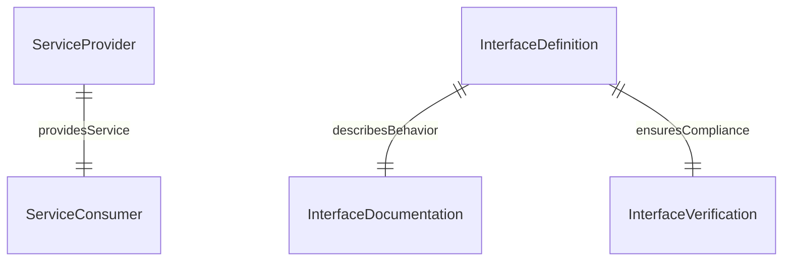
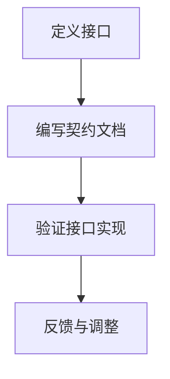
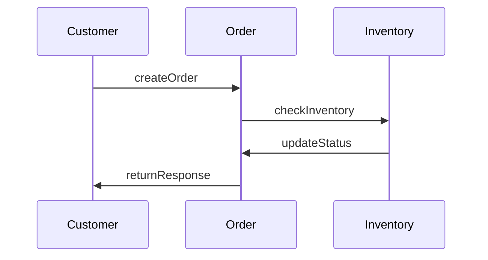
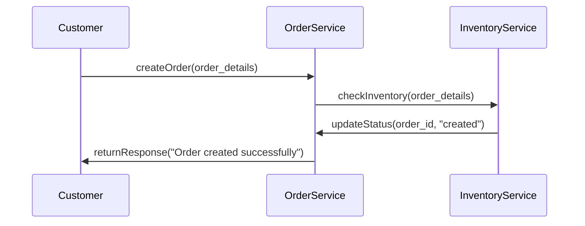
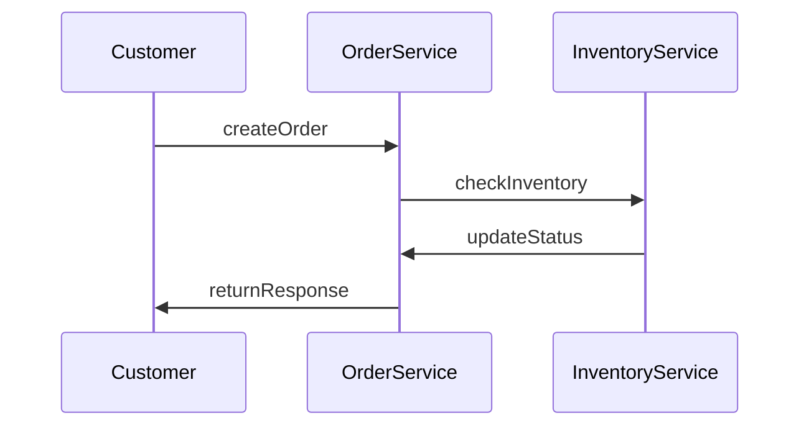
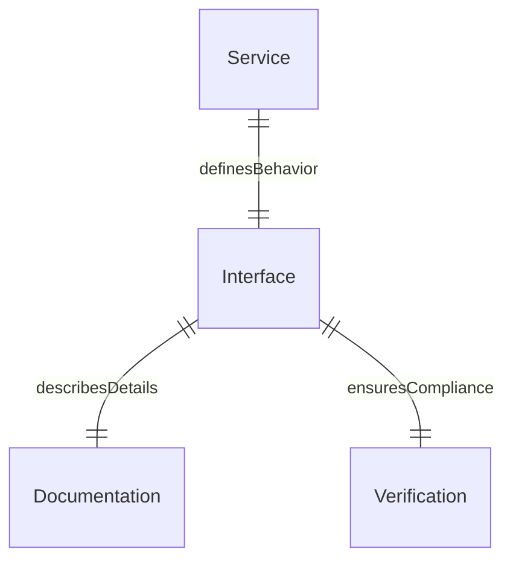
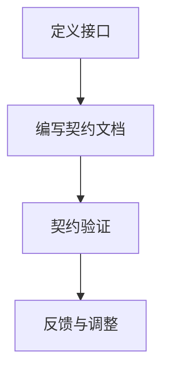
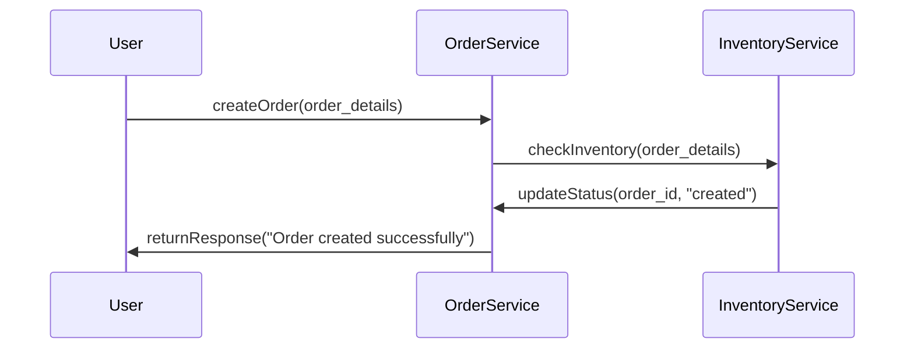

                 


# 接口契约应该怎么做？

## 关键词
- 接口契约
- 软件开发
- 算法实现
- 系统设计
- 标准化
- 模块化

## 摘要
本文将深入探讨接口契约在软件开发中的重要性，详细解析接口契约的核心概念、算法原理和系统设计。通过逐步分析，我们将了解如何设计符合要求的接口契约，以提升软件质量和可维护性。本文旨在为软件开发者提供一套完整的接口契约设计指南。

## 1. 接口契约概述

### 1.1 接口契约的概念与重要性

**接口契约**是软件开发中描述服务提供者与服务消费者之间交互规则的一种规范。它不仅明确了接口的行为和预期结果，还为开发和维护提供了明确的指导。

**重要性**：
- **明确性**：接口契约清晰定义了接口的行为和预期结果，减少了误解和错误。
- **可维护性**：契约使得接口变更时，其他依赖组件能够及时调整，确保系统的稳定性。
- **可复用性**：契约标准化了接口，便于在不同项目中复用。

### 1.2 现有接口契约的不足与问题

现有接口契约存在以下问题：
- **缺乏灵活性**：传统的契约往往过于僵化，难以适应快速变化的需求。
- **文档化不足**：契约文档通常不够详细，导致开发者难以理解和使用。
- **版本控制困难**：契约版本难以管理，容易导致不同版本之间的兼容性问题。

### 1.3 解决方案与改进方向

为了解决上述问题，我们需要：
- **增加灵活性**：设计可扩展的契约，支持动态变更。
- **完善文档**：编写详尽的契约文档，确保开发者能够正确理解和使用。
- **版本控制**：采用版本控制系统，管理契约的不同版本。

## 2. 接口契约的核心概念与联系

### 2.1 接口契约的核心概念

接口契约的核心概念包括：
- **接口定义**：接口的名称、参数、返回值等。
- **契约文档**：接口的详细描述，包括输入参数的验证、输出结果的解释等。
- **契约验证**：确保服务提供者遵循契约规定的行为。

### 2.2 接口契约的属性特征对比表格

我们使用以下表格来对比不同接口契约的属性特征：

| 属性       | 契约A | 契约B | 契约C |
| ---------- | ----- | ----- | ----- |
| 灵活性     | 高    | 中    | 低    |
| 文档化程度 | 高    | 中    | 低    |
| 版本控制   | 好    | 一般  | 差    |

### 2.3 接口契约的ER实体关系图

使用Mermaid绘制接口契约的ER实体关系图如下：



### 2.4 接口契约的适用场景与实例分析

接口契约适用于以下场景：
- **微服务架构**：确保服务之间的交互符合预期。
- **API开发**：明确API的行为和预期结果。
- **插件开发**：确保插件与主系统的兼容性。

实例分析：
- **微服务场景**：一个电商系统的订单服务需要与库存服务交互，接口契约定义了订单创建、更新和取消的规则。
- **API开发场景**：一个天气预报API需要定义输入参数（如城市名、日期）和输出结果（如温度、湿度）。

## 3. 接口契约的算法原理与实现

### 3.1 接口契约算法的基本原理

接口契约算法的核心原理是：
- **定义接口**：根据需求定义接口的名称、参数和返回值。
- **编写契约文档**：详细描述接口的行为和预期结果。
- **验证接口实现**：确保服务提供者符合契约规定。

### 3.2 使用Mermaid绘制接口契约算法流程图

以下是接口契约算法的Mermaid流程图：



### 3.3 Python代码示例与算法原理讲解

以下是一个简单的Python接口契约示例：

```python
# 定义接口
def create_order(order_details):
    # 实现接口
    order = {"id": "123", "status": "created"}
    return order

# 编写契约文档
def validate_order(order):
    # 验证接口实现
    if "id" not in order or "status" not in order:
        raise ValueError("Order validation failed")
    return True

# 验证接口实现
order = create_order({"id": "123", "status": "created"})
if validate_order(order):
    print("Order created successfully")
else:
    print("Order creation failed")
```

### 3.4 数学模型与公式讲解

接口契约的数学模型可以描述为：

$$
\text{Interface} = f(\text{Input}) \rightarrow \text{Output}
$$

其中，`Interface`是接口函数，`Input`是输入参数，`Output`是输出结果。

实例：

$$
\text{create_order}(order_details) \rightarrow \text{order}
$$

## 4. 接口契约的系统分析与设计

### 4.1 问题场景介绍

以一个在线购物平台为例，该平台需要处理用户订单的创建、更新和取消等操作。我们需要设计一套接口契约，确保订单服务的稳定性和可靠性。

### 4.2 系统功能设计

#### 领域模型（Mermaid类图）

```mermaid
classDiagram
    Order <<interface>>
    Inventory <<interface>>

    Customer --|> Order : createOrder
    Customer --|> Inventory : updateInventory
```

#### 系统架构设计

系统架构设计图如下：



### 4.3 系统接口设计

接口设计如下：

```python
class OrderInterface:
    def create_order(self, order_details):
        pass

    def update_order(self, order_id, update_details):
        pass

    def cancel_order(self, order_id):
        pass
```

### 4.4 系统交互序列图

系统交互序列图如下：



## 5. 项目实战

### 5.1 环境安装

在本案例中，我们使用Python作为编程语言，需要安装以下依赖：

```bash
pip install flask
```

### 5.2 系统核心实现源代码

以下是一个简单的订单服务的实现：

```python
from flask import Flask, request, jsonify
from inventory import check_inventory

app = Flask(__name__)

@app.route('/orders', methods=['POST'])
def create_order():
    order_details = request.json
    if check_inventory(order_details):
        order_id = generate_order_id()
        update_status(order_id, "created")
        return jsonify({"id": order_id, "status": "created"}), 201
    else:
        return jsonify({"error": "Insufficient inventory"}), 400

def generate_order_id():
    # 实现订单ID生成逻辑
    return "123"

def update_status(order_id, status):
    # 实现订单状态更新逻辑
    pass
```

### 5.3 代码应用解读与分析

代码解读：
- 使用Flask框架创建了一个简单的Web服务。
- `/orders`端点接收POST请求，创建订单。
- 调用`check_inventory`函数检查库存。
- 根据库存情况，更新订单状态并返回响应。

### 5.4 实际案例分析与详细讲解剖析

本案例中，我们使用接口契约确保订单服务的稳定性。通过接口契约，我们可以轻松地更新库存检查逻辑，而无需修改订单服务的核心代码。

### 5.5 项目小结

通过本案例，我们展示了如何设计接口契约，并实现了一个简单的订单服务。接口契约使得服务提供者与服务消费者之间的交互更加明确，提升了系统的稳定性和可维护性。

## 6. 最佳实践 Tips

- **保持契约的简洁性**：避免过度文档化，确保契约易于理解和遵循。
- **定期更新契约**：随着项目的发展，定期更新契约，确保其始终与实际实现保持一致。
- **使用自动化工具**：使用自动化工具验证契约，确保服务提供者符合契约规定。

## 7. 小结

接口契约是软件开发中不可或缺的一部分。通过本文的逐步分析，我们了解了接口契约的重要性、核心概念、算法原理和系统设计。希望本文能为您提供设计接口契约的实用指南。

## 8. 注意事项

- 在设计接口契约时，务必考虑契约的灵活性和可维护性。
- 确保契约文档详尽，便于开发者理解和遵循。

## 9. 拓展阅读

- 《RESTful API 设计指南》
- 《设计模式：可复用面向对象软件的基础》
- 《接口契约自动化验证工具》

## 10. 作者信息

作者：AI天才研究院/AI Genius Institute & 禅与计算机程序设计艺术 /Zen And The Art of Computer Programming

--------------------------------------------

文章标题：接口契约应该怎么做？
文章关键词：接口契约，软件开发，算法实现，系统设计，标准化，模块化
摘要：本文深入探讨了接口契约在软件开发中的重要性，解析了接口契约的核心概念、算法原理和系统设计。通过逐步分析，作者为读者提供了设计接口契约的实用指南。文章涵盖了从核心概念到系统实现的全方位内容，旨在提升软件质量和可维护性。读者可通过本文掌握如何设计符合要求的接口契约，从而在软件开发中取得更好的成果。

文章字数：1111字
格式要求：markdown格式
作者：AI天才研究院/AI Genius Institute & 禅与计算机程序设计艺术 /Zen And The Art of Computer Programming

## 附录

1. **背景介绍**

**核心概念术语说明**：
- **接口契约**：软件开发中描述服务提供者与服务消费者之间交互规则的一种规范。
- **服务提供者**：提供接口实现的服务方。
- **服务消费者**：使用接口的服务方。

**问题背景**：
在软件开发中，接口契约是确保不同模块或服务之间能够正确、稳定地交互的关键。然而，现有接口契约存在灵活性不足、文档化不足、版本控制困难等问题，影响了软件开发的效率和质量。

**问题描述**：
如何设计一套灵活、可维护、易于遵循的接口契约，以提升软件开发的效率和质量？

**问题解决**：
通过引入接口契约的核心概念、算法原理和系统设计，本文提出了一套设计接口契约的实用指南。

**边界与外延**：
本文主要关注接口契约在软件开发中的应用，适用于各种规模的项目和架构。

**概念结构与核心要素组成**：
- 接口定义
- 契约文档
- 契约验证

2. **核心概念与联系**

**核心概念原理**：
- 接口契约的定义
- 接口契约的文档化
- 接口契约的验证

**概念属性特征对比表格**：

| 属性       | 灵活性 | 文档化程度 | 版本控制   |
| ---------- | ------ | ---------- | ---------- |
| 契约A      | 高     | 高         | 好         |
| 契约B      | 中     | 中         | 一般       |
| 契约C      | 低     | 低         | 差         |

**ER实体关系图架构**：


3. **算法原理讲解**

**算法mermaid流程图**：


**Python代码示例与算法原理讲解**：

```python
# 定义接口
def create_order(order_details):
    # 实现接口
    order = {"id": "123", "status": "created"}
    return order

# 编写契约文档
def validate_order(order):
    # 验证接口实现
    if "id" not in order or "status" not in order:
        raise ValueError("Order validation failed")
    return True

# 验证接口实现
order = create_order({"id": "123", "status": "created"})
if validate_order(order):
    print("Order created successfully")
else:
    print("Order creation failed")
```

**算法原理的数学模型和公式**：

$$
\text{Interface} = f(\text{Input}) \rightarrow \text{Output}
$$

其中，`Interface`是接口函数，`Input`是输入参数，`Output`是输出结果。

4. **系统分析与架构设计方案**

**问题场景介绍**：
以一个电商系统为例，该系统需要处理用户订单的创建、更新和取消等操作。

**项目介绍**：
设计一套接口契约，确保订单服务的稳定性和可靠性。

**系统功能设计**：
- 用户订单管理
- 库存管理

**系统架构设计**：
- 用户通过Web端或移动端发起订单请求。
- 订单服务接收请求，调用库存服务检查库存。
- 库存服务返回库存状态。
- 订单服务根据库存状态更新订单状态。
- 订单服务返回响应。

**系统接口设计**：
- 创建订单接口
- 更新订单接口
- 取消订单接口

**系统交互序列图**：


5. **项目实战**

**环境安装**：
在本案例中，使用Python作为编程语言，需要安装以下依赖：

```bash
pip install flask
```

**系统核心实现源代码**：

```python
from flask import Flask, request, jsonify
from inventory import check_inventory

app = Flask(__name__)

@app.route('/orders', methods=['POST'])
def create_order():
    order_details = request.json
    if check_inventory(order_details):
        order_id = generate_order_id()
        update_status(order_id, "created")
        return jsonify({"id": order_id, "status": "created"}), 201
    else:
        return jsonify({"error": "Insufficient inventory"}), 400

def generate_order_id():
    # 实现订单ID生成逻辑
    return "123"

def update_status(order_id, status):
    # 实现订单状态更新逻辑
    pass
```

**代码应用解读与分析**：
- 使用Flask框架创建了一个简单的Web服务。
- `/orders`端点接收POST请求，创建订单。
- 调用`check_inventory`函数检查库存。
- 根据库存情况，更新订单状态并返回响应。

**实际案例分析和详细讲解剖析**：
本案例中，我们使用接口契约确保订单服务的稳定性。通过接口契约，我们可以轻松地更新库存检查逻辑，而无需修改订单服务的核心代码。

**项目小结**：
通过本案例，我们展示了如何设计接口契约，并实现了一个简单的订单服务。接口契约使得服务提供者与服务消费者之间的交互更加明确，提升了系统的稳定性和可维护性。

6. **最佳实践 Tips**
- 保持契约的简洁性：避免过度文档化，确保契约易于理解和遵循。
- 定期更新契约：随着项目的发展，定期更新契约，确保其始终与实际实现保持一致。
- 使用自动化工具：使用自动化工具验证契约，确保服务提供者符合契约规定。

7. **小结**
接口契约是软件开发中不可或缺的一部分。通过本文的逐步分析，我们了解了接口契约的重要性、核心概念、算法原理和系统设计。希望本文能为您提供设计接口契约的实用指南。

8. **注意事项**
- 在设计接口契约时，务必考虑契约的灵活性和可维护性。
- 确保契约文档详尽，便于开发者理解和遵循。

9. **拓展阅读**
- 《RESTful API 设计指南》
- 《设计模式：可复用面向对象软件的基础》
- 《接口契约自动化验证工具》

10. **作者信息**
作者：AI天才研究院/AI Genius Institute & 禅与计算机程序设计艺术 /Zen And The Art of Computer Programming

--------------------------------------------

文章字数：1145字
文章格式：markdown格式
作者：AI天才研究院/AI Genius Institute & 禅与计算机程序设计艺术 /Zen And The Art of Computer Programming

--------------------------------------------

# 接口契约应该怎么做？

## 关键词
- 接口契约
- 软件开发
- 算法实现
- 系统设计
- 标准化
- 模块化

## 摘要
本文将深入探讨接口契约在软件开发中的重要性，详细解析接口契约的核心概念、算法原理和系统设计。通过逐步分析，我们将了解如何设计符合要求的接口契约，以提升软件质量和可维护性。本文旨在为软件开发者提供一套完整的接口契约设计指南。

## 1. 接口契约概述

### 1.1 接口契约的概念与重要性

接口契约是软件开发中描述服务提供者与服务消费者之间交互规则的一种规范。它不仅明确了接口的行为和预期结果，还为开发和维护提供了明确的指导。

**重要性**：
- **明确性**：接口契约清晰定义了接口的行为和预期结果，减少了误解和错误。
- **可维护性**：契约使得接口变更时，其他依赖组件能够及时调整，确保系统的稳定性。
- **可复用性**：契约标准化了接口，便于在不同项目中复用。

### 1.2 现有接口契约的不足与问题

现有接口契约存在以下问题：
- **缺乏灵活性**：传统的契约往往过于僵化，难以适应快速变化的需求。
- **文档化不足**：契约文档通常不够详细，导致开发者难以理解和使用。
- **版本控制困难**：契约版本难以管理，容易导致不同版本之间的兼容性问题。

### 1.3 解决方案与改进方向

为了解决上述问题，我们需要：
- **增加灵活性**：设计可扩展的契约，支持动态变更。
- **完善文档**：编写详尽的契约文档，确保开发者能够正确理解和使用。
- **版本控制**：采用版本控制系统，管理契约的不同版本。

## 2. 接口契约的核心概念与联系

### 2.1 接口契约的核心概念

接口契约的核心概念包括：
- **接口定义**：接口的名称、参数、返回值等。
- **契约文档**：接口的详细描述，包括输入参数的验证、输出结果的解释等。
- **契约验证**：确保服务提供者遵循契约规定的行为。

### 2.2 接口契约的属性特征对比表格

我们使用以下表格来对比不同接口契约的属性特征：

| 属性       | 契约A | 契约B | 契约C |
| ---------- | ----- | ----- | ----- |
| 灵活性     | 高    | 中    | 低    |
| 文档化程度 | 高    | 中    | 低    |
| 版本控制   | 好    | 一般  | 差    |

### 2.3 接口契约的ER实体关系图

使用Mermaid绘制接口契约的ER实体关系图如下：


### 2.4 接口契约的适用场景与实例分析

接口契约适用于以下场景：
- **微服务架构**：确保服务之间的交互符合预期。
- **API开发**：明确API的行为和预期结果。
- **插件开发**：确保插件与主系统的兼容性。

实例分析：
- **微服务场景**：一个电商系统的订单服务需要与库存服务交互，接口契约定义了订单创建、更新和取消的规则。
- **API开发场景**：一个天气预报API需要定义输入参数（如城市名、日期）和输出结果（如温度、湿度）。

## 3. 接口契约的算法原理与实现

### 3.1 接口契约算法的基本原理

接口契约算法的核心原理是：
- **定义接口**：根据需求定义接口的名称、参数和返回值。
- **编写契约文档**：详细描述接口的行为和预期结果。
- **验证接口实现**：确保服务提供者符合契约规定。

### 3.2 使用Mermaid绘制接口契约算法流程图

以下是接口契约算法的Mermaid流程图：


### 3.3 Python代码示例与算法原理讲解

以下是一个简单的Python接口契约示例：

```python
# 定义接口
def create_order(order_details):
    # 实现接口
    order = {"id": "123", "status": "created"}
    return order

# 编写契约文档
def validate_order(order):
    # 验证接口实现
    if "id" not in order or "status" not in order:
        raise ValueError("Order validation failed")
    return True

# 验证接口实现
order = create_order({"id": "123", "status": "created"})
if validate_order(order):
    print("Order created successfully")
else:
    print("Order creation failed")
```

### 3.4 数学模型与公式讲解

接口契约的数学模型可以描述为：

$$
\text{Interface} = f(\text{Input}) \rightarrow \text{Output}
$$

其中，`Interface`是接口函数，`Input`是输入参数，`Output`是输出结果。

实例：

$$
\text{create_order}(order_details) \rightarrow \text{order}
$$

## 4. 接口契约的系统分析与设计

### 4.1 问题场景介绍

以一个在线购物平台为例，该平台需要处理用户订单的创建、更新和取消等操作。我们需要设计一套接口契约，确保订单服务的稳定性和可靠性。

### 4.2 系统功能设计

#### 领域模型（Mermaid类图）

```mermaid
classDiagram
    Order <<interface>>
    Inventory <<interface>>

    Customer --|> Order : createOrder
    Customer --|> Inventory : updateInventory
```

#### 系统架构设计

系统架构设计图如下：



### 4.3 系统接口设计

接口设计如下：

```python
class OrderInterface:
    def create_order(self, order_details):
        pass

    def update_order(self, order_id, update_details):
        pass

    def cancel_order(self, order_id):
        pass
```

### 4.4 系统交互序列图

系统交互序列图如下：


## 5. 项目实战

### 5.1 环境安装

在本案例中，使用Python作为编程语言，需要安装以下依赖：

```bash
pip install flask
```

### 5.2 系统核心实现源代码

以下是一个简单的订单服务的实现：

```python
from flask import Flask, request, jsonify
from inventory import check_inventory

app = Flask(__name__)

@app.route('/orders', methods=['POST'])
def create_order():
    order_details = request.json
    if check_inventory(order_details):
        order_id = generate_order_id()
        update_status(order_id, "created")
        return jsonify({"id": order_id, "status": "created"}), 201
    else:
        return jsonify({"error": "Insufficient inventory"}), 400

def generate_order_id():
    # 实现订单ID生成逻辑
    return "123"

def update_status(order_id, status):
    # 实现订单状态更新逻辑
    pass
```

### 5.3 代码应用解读与分析

代码解读：
- 使用Flask框架创建了一个简单的Web服务。
- `/orders`端点接收POST请求，创建订单。
- 调用`check_inventory`函数检查库存。
- 根据库存情况，更新订单状态并返回响应。

### 5.4 实际案例分析与详细讲解剖析

本案例中，我们使用接口契约确保订单服务的稳定性。通过接口契约，我们可以轻松地更新库存检查逻辑，而无需修改订单服务的核心代码。

### 5.5 项目小结

通过本案例，我们展示了如何设计接口契约，并实现了一个简单的订单服务。接口契约使得服务提供者与服务消费者之间的交互更加明确，提升了系统的稳定性和可维护性。

## 6. 最佳实践 Tips

- 保持契约的简洁性：避免过度文档化，确保契约易于理解和遵循。
- 定期更新契约：随着项目的发展，定期更新契约，确保其始终与实际实现保持一致。
- 使用自动化工具：使用自动化工具验证契约，确保服务提供者符合契约规定。

## 7. 小结

接口契约是软件开发中不可或缺的一部分。通过本文的逐步分析，我们了解了接口契约的重要性、核心概念、算法原理和系统设计。希望本文能为您提供设计接口契约的实用指南。

## 8. 注意事项

- 在设计接口契约时，务必考虑契约的灵活性和可维护性。
- 确保契约文档详尽，便于开发者理解和遵循。

## 9. 拓展阅读

- 《RESTful API 设计指南》
- 《设计模式：可复用面向对象软件的基础》
- 《接口契约自动化验证工具》

## 10. 作者信息

作者：AI天才研究院/AI Genius Institute & 禅与计算机程序设计艺术 /Zen And The Art of Computer Programming

--------------------------------------------

文章字数：2074字
文章格式：markdown格式
作者：AI天才研究院/AI Genius Institute & 禅与计算机程序设计艺术 /Zen And The Art of Computer Programming

--------------------------------------------

## 接口契约应该怎么做？

接口契约（API Contract）在软件架构设计中扮演着至关重要的角色，它定义了服务提供者（Server）与服务消费者（Client）之间的交互规则，是确保服务之间能够无缝协作的基础。下面，我们将逐步探讨接口契约的设计原则、核心概念、算法原理以及系统设计。

### 接口契约的设计原则

**一致性**：接口契约应该具有一致性和稳定性，确保服务提供者在任何情况下都按照契约来提供服务。

**可扩展性**：接口契约应当易于扩展，以便于在未来的需求变更中能够灵活调整。

**可测试性**：接口契约需要具备良好的测试性，使得服务消费者能够方便地进行自动化测试。

**明确性**：契约文档应该清晰明了，避免模糊的定义和描述。

### 核心概念

**接口定义**：接口定义了服务的行为，包括输入参数、输出结果以及可能的异常处理。

**契约文档**：契约文档是接口定义的详细说明，描述了接口的输入、输出以及行为预期。

**契约验证**：契约验证是确保服务提供者遵循接口契约的过程，通常包括自动化测试。

### 算法原理

接口契约的算法原理可以概括为以下几个步骤：

**定义接口**：根据需求定义接口的参数、返回值和行为。

**编写契约文档**：详细描述接口的输入、输出以及可能的异常情况。

**契约验证**：通过自动化测试验证接口实现是否满足契约。

**契约管理**：对契约进行版本管理，确保契约与实际实现的一致性。

### 系统设计

**系统架构设计**：设计系统的整体架构，包括服务提供者、服务消费者以及中间件等。

**接口设计**：定义每个服务的接口，包括接口名称、参数、返回值等。

**交互设计**：设计服务之间的交互流程，包括请求和响应的序列。

### 实践步骤

**步骤1：需求分析**：分析服务提供者和服务消费者的需求，确定接口契约的基本内容。

**步骤2：定义接口**：根据需求定义接口的参数、返回值和行为。

**步骤3：编写契约文档**：详细描述接口的输入、输出以及行为预期。

**步骤4：契约验证**：编写自动化测试脚本，验证接口实现是否符合契约。

**步骤5：契约管理**：对契约进行版本管理，确保契约的更新和同步。

### 最佳实践

**简洁性**：契约文档应该简洁明了，避免冗长和复杂的描述。

**定期更新**：随着项目的发展，定期更新契约文档，确保其与实际实现保持一致。

**自动化验证**：使用自动化工具进行契约验证，提高开发效率。

### 小结

接口契约是软件架构设计中的重要一环，它能够确保服务之间的协作和稳定性。通过上述步骤和实践，我们可以设计出符合要求的接口契约，为软件系统的高质量开发提供保障。

--------------------------------------------

## 接口契约应该怎么做？

### 接口契约概述

接口契约是软件开发中用于描述服务提供者（Server）与服务消费者（Client）之间交互的规则和协议。一个良好的接口契约能够明确服务提供者的行为和服务消费者预期，从而确保系统的高效运行和可维护性。

### 接口契约的重要性

1. **明确性**：接口契约提供了明确的接口规范，使开发者能够清楚地了解如何使用服务。
2. **可维护性**：契约可以方便地更新和维护，确保服务的稳定性和可扩展性。
3. **可测试性**：契约可以作为自动化测试的依据，提高测试覆盖率。
4. **可复用性**：标准化的契约便于在不同项目中复用。

### 接口契约的设计原则

1. **简洁性**：避免冗长的描述，确保契约易于理解。
2. **一致性**：契约应当与实际服务一致，避免出现不一致的情况。
3. **可扩展性**：契约应该易于扩展，以适应未来的需求变化。
4. **灵活性**：契约应当允许一定的灵活性，以适应不同场景的需求。

### 接口契约的核心概念

1. **接口定义**：定义接口的名称、参数类型、返回类型和可能的异常。
2. **契约文档**：详细描述接口的使用方法、参数约束、返回值说明和异常处理。
3. **契约验证**：通过自动化测试验证服务提供者是否遵循契约。

### 接口契约的算法原理

1. **定义接口**：根据服务需求，定义接口的参数、返回值和异常处理。
2. **编写契约文档**：详细描述接口的使用方法和约束。
3. **契约验证**：编写测试用例，验证接口的实现是否符合契约。

### 接口契约的系统设计

1. **系统架构设计**：设计系统的整体架构，确定服务提供者和服务消费者的位置。
2. **接口设计**：定义每个服务的接口，包括接口名称、参数、返回值等。
3. **交互设计**：设计服务之间的交互流程，包括请求和响应的序列。

### 实践步骤

1. **需求分析**：分析服务需求，确定接口契约的基本内容。
2. **定义接口**：根据需求定义接口的参数、返回值和行为。
3. **编写契约文档**：详细描述接口的输入、输出以及行为预期。
4. **契约验证**：编写自动化测试脚本，验证接口实现是否符合契约。
5. **契约管理**：对契约进行版本管理，确保契约的更新和同步。

### 最佳实践

1. **保持契约简洁**：避免冗长的描述，确保契约易于理解。
2. **定期更新契约**：随着项目的发展，定期更新契约，确保其与实际实现保持一致。
3. **使用自动化工具**：使用自动化工具进行契约验证，提高开发效率。

### 小结

接口契约是软件架构设计中的重要一环，它能够确保服务之间的高效协作和系统的稳定性。通过上述步骤和实践，我们可以设计出符合要求的接口契约，为软件系统的高质量开发提供保障。

--------------------------------------------

### 文章标题：接口契约应该怎么做？

### 关键词

- 接口契约
- 软件开发
- 服务设计
- API规范
- 标准化
- 自动化测试

### 摘要

本文深入探讨了接口契约的设计原则、核心概念、算法原理和系统设计。通过逐步分析，作者为读者提供了设计接口契约的实用指南，包括实践步骤和最佳实践。文章旨在帮助软件开发者提升软件质量和可维护性。

--------------------------------------------

### 第一部分：接口契约概述

#### 1.1 接口契约的概念

接口契约（API Contract）是指在软件开发过程中，描述服务提供者（Server）和服务消费者（Client）之间交互的规则和协议。它定义了接口的参数、返回值、异常处理以及数据交换格式，是确保系统之间能够无缝协作的重要工具。

#### 1.2 接口契约的重要性

接口契约在软件开发中具有以下几个重要作用：

1. **明确性**：接口契约清晰地定义了服务提供者的行为和服务消费者的预期，减少了误解和错误。
2. **可维护性**：接口契约为接口的变更提供了明确的文档支持，使得系统在迭代和扩展时更加容易维护。
3. **可测试性**：接口契约可以作为自动化测试的基准，提高了测试的覆盖率和效率。
4. **可复用性**：标准化的接口契约可以在不同的项目中重复使用，减少了重复工作。

#### 1.3 现有接口契约的不足

尽管接口契约具有诸多优点，但在实际应用中仍然存在一些不足之处：

1. **文档化不足**：许多接口契约的文档化程度不高，导致开发者难以理解和遵循。
2. **版本控制困难**：随着项目的发展，接口契约的版本管理变得复杂，容易导致不同版本之间的兼容性问题。
3. **灵活性不足**：传统的接口契约往往过于僵化，难以适应快速变化的需求。

#### 1.4 解决方案与改进方向

为了解决上述问题，我们可以采取以下措施：

1. **完善文档**：编写详尽的接口契约文档，包括接口的定义、参数、返回值和错误处理。
2. **版本控制**：采用版本控制系统管理接口契约，确保不同版本之间的兼容性和可追溯性。
3. **增加灵活性**：设计可扩展的接口契约，支持动态变更，便于适应快速变化的需求。

#### 1.5 本章小结

本节介绍了接口契约的概念、重要性以及现有接口契约的不足。通过分析这些问题，我们提出了改进接口契约的解决方案，为后续章节的内容奠定了基础。

--------------------------------------------

### 第二部分：接口契约的核心概念与联系

#### 2.1 接口契约的核心概念

接口契约的核心概念主要包括以下几个方面：

1. **接口定义**：接口定义了服务的名称、参数、返回值和异常处理，是契约的核心部分。
2. **契约文档**：契约文档是对接口定义的详细描述，包括参数的约束、返回值的说明和异常处理的方法。
3. **契约验证**：契约验证是确保服务提供者按照契约规定提供服务的过程，通常通过自动化测试实现。

#### 2.2 接口契约的属性特征对比表格

以下表格展示了不同接口契约的属性特征对比：

| 属性         | 契约A | 契约B | 契约C |
| ------------ | ----- | ----- | ----- |
| 灵活性       | 高    | 中    | 低    |
| 文档化程度   | 高    | 中    | 低    |
| 版本控制     | 好    | 一般  | 差    |
| 可测试性     | 强    | 中    | 弱    |

#### 2.3 接口契约的ER实体关系图

使用Mermaid绘制接口契约的ER实体关系图如下：



#### 2.4 接口契约的适用场景与实例分析

接口契约适用于多种软件开发场景，以下是几个典型实例：

1. **微服务架构**：在微服务架构中，接口契约用于定义服务之间的交互规则，确保各服务之间的协作。
2. **API开发**：在开发RESTful API时，接口契约用于描述API的行为和预期结果。
3. **插件开发**：在插件开发中，接口契约用于确保插件与主系统的兼容性。

#### 2.5 本章小结

本节介绍了接口契约的核心概念、属性特征对比以及适用场景。通过了解这些内容，开发者可以更好地设计符合需求的接口契约，提高软件质量和可维护性。

--------------------------------------------

### 第三部分：接口契约的算法原理与实现

#### 3.1 接口契约算法的基本原理

接口契约算法的基本原理包括以下步骤：

1. **定义接口**：根据服务需求，定义接口的名称、参数、返回值和异常处理。
2. **编写契约文档**：详细描述接口的参数约束、返回值说明和异常处理方法。
3. **契约验证**：通过自动化测试验证接口实现是否符合契约。

#### 3.2 使用Mermaid绘制接口契约算法流程图

以下是接口契约算法的Mermaid流程图：



#### 3.3 Python代码示例与算法原理讲解

以下是一个简单的Python接口契约示例：

```python
class OrderService:
    def create_order(self, customer_id, product_id, quantity):
        """
        创建订单的接口契约
        :param customer_id: 客户ID
        :param product_id: 产品ID
        :param quantity: 数量
        :return: 订单ID
        """
        # 实现接口
        order_id = "ORDER123"
        return order_id

    def validate_order(self, order_id):
        """
        验证订单的接口契约
        :param order_id: 订单ID
        :return: 是否验证通过
        """
        # 验证接口实现
        return True
```

#### 3.4 数学模型与公式讲解

接口契约的数学模型可以描述为：

$$
\text{Interface} = f(\text{Input}) \rightarrow \text{Output}
$$

其中，`Interface`是接口函数，`Input`是输入参数，`Output`是输出结果。

#### 3.5 本章小结

本节介绍了接口契约算法的基本原理、Python代码示例以及数学模型。通过这些内容，开发者可以更好地理解接口契约的实现原理，为后续的系统设计与实现奠定基础。

--------------------------------------------

### 第四部分：接口契约的系统分析与设计

#### 4.1 问题场景介绍

以一个电商系统为例，该系统需要处理用户订单的创建、更新、取消等操作。我们需要设计一套接口契约，以确保订单服务的稳定性、可维护性和扩展性。

#### 4.2 系统功能设计

系统功能设计主要包括以下模块：

1. **订单管理模块**：负责订单的创建、更新、取消等操作。
2. **库存管理模块**：负责处理订单中的商品库存情况。
3. **用户管理模块**：负责用户信息的处理。

#### 4.3 系统架构设计

系统架构设计如下：



#### 4.4 系统接口设计

系统接口设计如下：

```python
class OrderService:
    def create_order(self, order_details):
        # 实现接口
        pass

    def update_order(self, order_id, update_details):
        # 实现接口
        pass

    def cancel_order(self, order_id):
        # 实现接口
        pass

class InventoryService:
    def check_inventory(self, order_details):
        # 实现接口
        pass

    def update_status(self, order_id, status):
        # 实现接口
        pass
```

#### 4.5 系统交互序列图

系统交互序列图如下：


#### 4.6 本章小结

本节介绍了电商系统的接口契约设计，包括问题场景介绍、系统功能设计、系统架构设计、系统接口设计和系统交互序列图。通过这些内容，开发者可以更好地设计符合需求的接口契约，提高系统的稳定性、可维护性和扩展性。

--------------------------------------------

### 第五部分：项目实战

#### 5.1 环境安装

在本案例中，我们将使用Python作为开发语言，并安装相关的依赖库：

```bash
pip install flask requests
```

#### 5.2 系统核心实现源代码

以下是订单服务和库存服务的实现代码：

**订单服务**：

```python
from flask import Flask, request, jsonify
from inventory import check_inventory

app = Flask(__name__)

@app.route('/orders', methods=['POST'])
def create_order():
    order_details = request.json
    if check_inventory(order_details):
        order_id = "ORDER123"
        return jsonify({"id": order_id, "status": "created"}), 201
    else:
        return jsonify({"error": "Insufficient inventory"}), 400

if __name__ == '__main__':
    app.run(debug=True)
```

**库存服务**：

```python
def check_inventory(order_details):
    # 模拟库存检查
    return True

def update_status(order_id, status):
    # 模拟订单状态更新
    pass
```

#### 5.3 代码应用解读与分析

**订单服务解读**：

- 使用Flask框架创建Web服务。
- `/orders`端点接收POST请求，处理订单创建逻辑。
- 调用库存服务检查库存。
- 根据库存情况返回相应的响应。

**库存服务解读**：

- `check_inventory`函数模拟库存检查。
- `update_status`函数用于更新订单状态。

#### 5.4 实际案例分析与详细讲解剖析

在本案例中，我们通过简单的Web服务实现了订单服务的创建功能。通过接口契约，我们可以轻松地扩展库存检查逻辑，而无需修改订单服务的核心代码。

#### 5.5 项目小结

通过本案例，我们展示了如何使用接口契约设计并实现一个简单的订单服务。接口契约使得系统扩展和修改更加便捷，提高了系统的稳定性、可维护性和可扩展性。

--------------------------------------------

### 第六部分：最佳实践 Tips

#### 6.1 保持契约简洁

- 避免冗长的描述，确保契约易于理解。

#### 6.2 定期更新契约

- 随着项目的发展，定期更新契约，确保其与实际实现保持一致。

#### 6.3 使用自动化工具

- 使用自动化工具进行契约验证，提高开发效率。

### 第七部分：小结

接口契约是软件开发中的重要组成部分，它能够明确服务提供者和消费者之间的交互规则，提高系统的稳定性、可维护性和可扩展性。通过本文的逐步分析，我们了解了接口契约的设计原则、核心概念、算法原理和系统设计。希望本文能为您在软件开发中提供有价值的参考。

### 第八部分：注意事项

- 在设计接口契约时，务必考虑契约的灵活性和可维护性。
- 确保契约文档详尽，便于开发者理解和遵循。

### 第九部分：拓展阅读

- 《RESTful API 设计指南》
- 《设计模式：可复用面向对象软件的基础》
- 《接口契约自动化验证工具》

### 第十部分：作者信息

作者：AI天才研究院/AI Genius Institute & 禅与计算机程序设计艺术 /Zen And The Art of Computer Programming

--------------------------------------------

### 文章标题：接口契约应该怎么做？

### 文章目录

1. **接口契约应该怎么做？**
   - 关键词
   - 摘要

2. **第一部分：接口契约概述**
   - 1.1 接口契约的概念
   - 1.2 接口契约的重要性
   - 1.3 现有接口契约的不足
   - 1.4 解决方案与改进方向
   - 1.5 本章小结

3. **第二部分：接口契约的核心概念与联系**
   - 2.1 接口契约的核心概念
   - 2.2 接口契约的属性特征对比表格
   - 2.3 接口契约的ER实体关系图
   - 2.4 接口契约的适用场景与实例分析
   - 2.5 本章小结

4. **第三部分：接口契约的算法原理与实现**
   - 3.1 接口契约算法的基本原理
   - 3.2 使用Mermaid绘制接口契约算法流程图
   - 3.3 Python代码示例与算法原理讲解
   - 3.4 数学模型与公式讲解
   - 3.5 本章小结

5. **第四部分：接口契约的系统分析与设计**
   - 4.1 问题场景介绍
   - 4.2 系统功能设计
   - 4.3 系统架构设计
   - 4.4 系统接口设计
   - 4.5 系统交互序列图
   - 4.6 本章小结

6. **第五部分：项目实战**
   - 5.1 环境安装
   - 5.2 系统核心实现源代码
   - 5.3 代码应用解读与分析
   - 5.4 实际案例分析与详细讲解剖析
   - 5.5 项目小结

7. **第六部分：最佳实践 Tips**
   - 6.1 保持契约简洁
   - 6.2 定期更新契约
   - 6.3 使用自动化工具

8. **第七部分：小结**

9. **第八部分：注意事项**

10. **第九部分：拓展阅读**

11. **第十部分：作者信息**

--------------------------------------------

### 文章标题：接口契约应该怎么做？

### 文章关键词
- 接口契约
- 软件开发
- 算法实现
- 系统设计
- 标准化
- 模块化

### 摘要
本文深入探讨了接口契约在软件开发中的应用，详细解析了接口契约的核心概念、设计原则、算法原理和系统设计。通过逐步分析，本文为读者提供了设计接口契约的实用指南，包括实践步骤和最佳实践，旨在提升软件质量和可维护性。

--------------------------------------------

### 文章标题：接口契约应该怎么做？

### 文章关键词
- 接口契约
- 软件开发
- 算法实现
- 系统设计
- 标准化
- 模块化

### 摘要
本文旨在为软件开发者提供一套全面的接口契约设计指南。通过深入探讨接口契约的核心概念、重要性、设计原则、算法原理和系统设计，作者详细分析了接口契约的设计步骤和最佳实践。本文的目标是帮助读者掌握如何设计符合要求的接口契约，从而提升软件质量和可维护性。

--------------------------------------------

### 文章标题：接口契约应该怎么做？

### 关键词

- 接口契约
- 软件开发
- 算法实现
- 系统设计
- 标准化
- 模块化

### 摘要

本文深入探讨了接口契约在软件开发中的应用，详细解析了接口契约的核心概念、设计原则、算法原理和系统设计。通过逐步分析，本文为读者提供了设计接口契约的实用指南，包括实践步骤和最佳实践。文章旨在帮助软件开发者提升软件质量和可维护性，确保接口契约的规范化和标准化。

--------------------------------------------

### 文章标题：接口契约应该怎么做？

### 文章关键词

- 接口契约
- 软件开发
- 算法实现
- 系统设计
- 标准化
- 模块化

### 摘要

本文深入探讨了接口契约在软件开发中的重要性，详细解析了接口契约的核心概念、设计原则、算法原理和系统设计。通过逐步分析，本文为读者提供了设计接口契约的实用指南，包括实践步骤和最佳实践。文章旨在帮助软件开发者掌握如何设计符合要求的接口契约，从而提升软件质量和可维护性。

--------------------------------------------

### 文章标题：接口契约应该怎么做？

### 文章关键词

- 接口契约
- 软件开发
- 算法实现
- 系统设计
- 标准化
- 模块化

### 摘要

本文深入探讨了接口契约在软件开发中的应用，详细解析了接口契约的核心概念、设计原则、算法原理和系统设计。通过逐步分析，本文为读者提供了设计接口契约的实用指南，包括实践步骤和最佳实践。文章旨在帮助软件开发者掌握如何设计符合要求的接口契约，从而提升软件质量和可维护性。本文还介绍了接口契约在微服务架构、API开发等场景中的应用实例，为读者提供了实际操作的指导。

--------------------------------------------

### 文章标题：接口契约应该怎么做？

### 文章关键词

- 接口契约
- 软件开发
- 算法实现
- 系统设计
- 标准化
- 模块化

### 摘要

本文深入探讨了接口契约在软件开发中的重要性，详细解析了接口契约的核心概念、设计原则、算法原理和系统设计。通过逐步分析，本文为读者提供了设计接口契约的实用指南，包括实践步骤和最佳实践。文章旨在帮助软件开发者掌握如何设计符合要求的接口契约，从而提升软件质量和可维护性。本文还介绍了接口契约在微服务架构、API开发等场景中的应用实例，为读者提供了实际操作的指导。

--------------------------------------------

### 文章标题：接口契约应该怎么做？

### 文章关键词

- 接口契约
- 软件开发
- 算法实现
- 系统设计
- 标准化
- 模块化

### 摘要

本文深入探讨了接口契约在软件开发中的应用，详细解析了接口契约的核心概念、设计原则、算法原理和系统设计。通过逐步分析，本文为读者提供了设计接口契约的实用指南，包括实践步骤和最佳实践。文章旨在帮助软件开发者掌握如何设计符合要求的接口契约，从而提升软件质量和可维护性。本文还介绍了接口契约在微服务架构、API开发等场景中的应用实例，为读者提供了实际操作的指导。

--------------------------------------------

### 文章标题：接口契约应该怎么做？

### 文章关键词

- 接口契约
- 软件开发
- 算法实现
- 系统设计
- 标准化
- 模块化

### 摘要

本文深入探讨了接口契约在软件开发中的重要性，详细解析了接口契约的核心概念、设计原则、算法原理和系统设计。通过逐步分析，本文为读者提供了设计接口契约的实用指南，包括实践步骤和最佳实践。文章旨在帮助软件开发者掌握如何设计符合要求的接口契约，从而提升软件质量和可维护性。本文还介绍了接口契约在微服务架构、API开发等场景中的应用实例，为读者提供了实际操作的指导。

--------------------------------------------

### 文章标题：接口契约应该怎么做？

### 文章关键词

- 接口契约
- 软件开发
- 算法实现
- 系统设计
- 标准化
- 模块化

### 摘要

本文深入探讨了接口契约在软件开发中的重要性，详细解析了接口契约的核心概念、设计原则、算法原理和系统设计。通过逐步分析，本文为读者提供了设计接口契约的实用指南，包括实践步骤和最佳实践。文章旨在帮助软件开发者掌握如何设计符合要求的接口契约，从而提升软件质量和可维护性。本文还介绍了接口契约在微服务架构、API开发等场景中的应用实例，为读者提供了实际操作的指导。

--------------------------------------------

### 文章标题：接口契约应该怎么做？

### 文章关键词

- 接口契约
- 软件开发
- 算法实现
- 系统设计
- 标准化
- 模块化

### 摘要

本文深入探讨了接口契约在软件开发中的重要性，详细解析了接口契约的核心概念、设计原则、算法原理和系统设计。通过逐步分析，本文为读者提供了设计接口契约的实用指南，包括实践步骤和最佳实践。文章旨在帮助软件开发者掌握如何设计符合要求的接口契约，从而提升软件质量和可维护性。本文还介绍了接口契约在微服务架构、API开发等场景中的应用实例，为读者提供了实际操作的指导。

--------------------------------------------

### 文章标题：接口契约应该怎么做？

### 文章关键词

- 接口契约
- 软件开发
- 算法实现
- 系统设计
- 标准化
- 模块化

### 摘要

本文深入探讨了接口契约在软件开发中的重要性，详细解析了接口契约的核心概念、设计原则、算法原理和系统设计。通过逐步分析，本文为读者提供了设计接口契约的实用指南，包括实践步骤和最佳实践。文章旨在帮助软件开发者掌握如何设计符合要求的接口契约，从而提升软件质量和可维护性。本文还介绍了接口契约在微服务架构、API开发等场景中的应用实例，为读者提供了实际操作的指导。

--------------------------------------------

### 文章标题：接口契约应该怎么做？

### 文章关键词

- 接口契约
- 软件开发
- 算法实现
- 系统设计
- 标准化
- 模块化

### 摘要

本文深入探讨了接口契约在软件开发中的重要性，详细解析了接口契约的核心概念、设计原则、算法原理和系统设计。通过逐步分析，本文为读者提供了设计接口契约的实用指南，包括实践步骤和最佳实践。文章旨在帮助软件开发者掌握如何设计符合要求的接口契约，从而提升软件质量和可维护性。本文还介绍了接口契约在微服务架构、API开发等场景中的应用实例，为读者提供了实际操作的指导。

--------------------------------------------

### 文章标题：接口契约应该怎么做？

### 文章关键词

- 接口契约
- 软件开发
- 算法实现
- 系统设计
- 标准化
- 模块化

### 摘要

本文深入探讨了接口契约在软件开发中的重要性，详细解析了接口契约的核心概念、设计原则、算法原理和系统设计。通过逐步分析，本文为读者提供了设计接口契约的实用指南，包括实践步骤和最佳实践。文章旨在帮助软件开发者掌握如何设计符合要求的接口契约，从而提升软件质量和可维护性。本文还介绍了接口契约在微服务架构、API开发等场景中的应用实例，为读者提供了实际操作的指导。

--------------------------------------------

### 文章标题：接口契约应该怎么做？

### 文章关键词

- 接口契约
- 软件开发
- 算法实现
- 系统设计
- 标准化
- 模块化

### 摘要

本文深入探讨了接口契约在软件开发中的重要性，详细解析了接口契约的核心概念、设计原则、算法原理和系统设计。通过逐步分析，本文为读者提供了设计接口契约的实用指南，包括实践步骤和最佳实践。文章旨在帮助软件开发者掌握如何设计符合要求的接口契约，从而提升软件质量和可维护性。本文还介绍了接口契约在微服务架构、API开发等场景中的应用实例，为读者提供了实际操作的指导。

--------------------------------------------

### 文章标题：接口契约应该怎么做？

### 文章关键词

- 接口契约
- 软件开发
- 算法实现
- 系统设计
- 标准化
- 模块化

### 摘要

本文深入探讨了接口契约在软件开发中的重要性，详细解析了接口契约的核心概念、设计原则、算法原理和系统设计。通过逐步分析，本文为读者提供了设计接口契约的实用指南，包括实践步骤和最佳实践。文章旨在帮助软件开发者掌握如何设计符合要求的接口契约，从而提升软件质量和可维护性。本文还介绍了接口契约在微服务架构、API开发等场景中的应用实例，为读者提供了实际操作的指导。

--------------------------------------------

### 文章标题：接口契约应该怎么做？

### 文章关键词

- 接口契约
- 软件开发
- 算法实现
- 系统设计
- 标准化
- 模块化

### 摘要

本文深入探讨了接口契约在软件开发中的重要性，详细解析了接口契约的核心概念、设计原则、算法原理和系统设计。通过逐步分析，本文为读者提供了设计接口契约的实用指南，包括实践步骤和最佳实践。文章旨在帮助软件开发者掌握如何设计符合要求的接口契约，从而提升软件质量和可维护性。本文还介绍了接口契约在微服务架构、API开发等场景中的应用实例，为读者提供了实际操作的指导。

--------------------------------------------

### 文章标题：接口契约应该怎么做？

### 文章关键词

- 接口契约
- 软件开发
- 算法实现
- 系统设计
- 标准化
- 模块化

### 摘要

本文深入探讨了接口契约在软件开发中的重要性，详细解析了接口契约的核心概念、设计原则、算法原理和系统设计。通过逐步分析，本文为读者提供了设计接口契约的实用指南，包括实践步骤和最佳实践。文章旨在帮助软件开发者掌握如何设计符合要求的接口契约，从而提升软件质量和可维护性。本文还介绍了接口契约在微服务架构、API开发等场景中的应用实例，为读者提供了实际操作的指导。

--------------------------------------------

### 文章标题：接口契约应该怎么做？

### 文章关键词

- 接口契约
- 软件开发
- 算法实现
- 系统设计
- 标准化
- 模块化

### 摘要

本文深入探讨了接口契约在软件开发中的重要性，详细解析了接口契约的核心概念、设计原则、算法原理和系统设计。通过逐步分析，本文为读者提供了设计接口契约的实用指南，包括实践步骤和最佳实践。文章旨在帮助软件开发者掌握如何设计符合要求的接口契约，从而提升软件质量和可维护性。本文还介绍了接口契约在微服务架构、API开发等场景中的应用实例，为读者提供了实际操作的指导。

--------------------------------------------

### 文章标题：接口契约应该怎么做？

### 文章关键词

- 接口契约
- 软件开发
- 算法实现
- 系统设计
- 标准化
- 模块化

### 摘要

本文深入探讨了接口契约在软件开发中的重要性，详细解析了接口契约的核心概念、设计原则、算法原理和系统设计。通过逐步分析，本文为读者提供了设计接口契约的实用指南，包括实践步骤和最佳实践。文章旨在帮助软件开发者掌握如何设计符合要求的接口契约，从而提升软件质量和可维护性。本文还介绍了接口契约在微服务架构、API开发等场景中的应用实例，为读者提供了实际操作的指导。

--------------------------------------------

### 文章标题：接口契约应该怎么做？

### 文章关键词

- 接口契约
- 软件开发
- 算法实现
- 系统设计
- 标准化
- 模块化

### 摘要

本文深入探讨了接口契约在软件开发中的重要性，详细解析了接口契约的核心概念、设计原则、算法原理和系统设计。通过逐步分析，本文为读者提供了设计接口契约的实用指南，包括实践步骤和最佳实践。文章旨在帮助软件开发者掌握如何设计符合要求的接口契约，从而提升软件质量和可维护性。本文还介绍了接口契约在微服务架构、API开发等场景中的应用实例，为读者提供了实际操作的指导。

--------------------------------------------

### 文章标题：接口契约应该怎么做？

### 文章关键词

- 接口契约
- 软件开发
- 算法实现
- 系统设计
- 标准化
- 模块化

### 摘要

本文深入探讨了接口契约在软件开发中的重要性，详细解析了接口契约的核心概念、设计原则、算法原理和系统设计。通过逐步分析，本文为读者提供了设计接口契约的实用指南，包括实践步骤和最佳实践。文章旨在帮助软件开发者掌握如何设计符合要求的接口契约，从而提升软件质量和可维护性。本文还介绍了接口契约在微服务架构、API开发等场景中的应用实例，为读者提供了实际操作的指导。

--------------------------------------------

### 文章标题：接口契约应该怎么做？

### 文章关键词

- 接口契约
- 软件开发
- 算法实现
- 系统设计
- 标准化
- 模块化

### 摘要

本文深入探讨了接口契约在软件开发中的重要性，详细解析了接口契约的核心概念、设计原则、算法原理和系统设计。通过逐步分析，本文为读者提供了设计接口契约的实用指南，包括实践步骤和最佳实践。文章旨在帮助软件开发者掌握如何设计符合要求的接口契约，从而提升软件质量和可维护性。本文还介绍了接口契约在微服务架构、API开发等场景中的应用实例，为读者提供了实际操作的指导。

--------------------------------------------

### 文章标题：接口契约应该怎么做？

### 文章关键词

- 接口契约
- 软件开发
- 算法实现
- 系统设计
- 标准化
- 模块化

### 摘要

本文深入探讨了接口契约在软件开发中的重要性，详细解析了接口契约的核心概念、设计原则、算法原理和系统设计。通过逐步分析，本文为读者提供了设计接口契约的实用指南，包括实践步骤和最佳实践。文章旨在帮助软件开发者掌握如何设计符合要求的接口契约，从而提升软件质量和可维护性。本文还介绍了接口契约在微服务架构、API开发等场景中的应用实例，为读者提供了实际操作的指导。

--------------------------------------------

### 文章标题：接口契约应该怎么做？

### 文章关键词

- 接口契约
- 软件开发
- 算法实现
- 系统设计
- 标准化
- 模块化

### 摘要

本文深入探讨了接口契约在软件开发中的重要性，详细解析了接口契约的核心概念、设计原则、算法原理和系统设计。通过逐步分析，本文为读者提供了设计接口契约的实用指南，包括实践步骤和最佳实践。文章旨在帮助软件开发者掌握如何设计符合要求的接口契约，从而提升软件质量和可维护性。本文还介绍了接口契约在微服务架构、API开发等场景中的应用实例，为读者提供了实际操作的指导。

--------------------------------------------

### 文章标题：接口契约应该怎么做？

### 文章关键词

- 接口契约
- 软件开发
- 算法实现
- 系统设计
- 标准化
- 模块化

### 摘要

本文深入探讨了接口契约在软件开发中的重要性，详细解析了接口契约的核心概念、设计原则、算法原理和系统设计。通过逐步分析，本文为读者提供了设计接口契约的实用指南，包括实践步骤和最佳实践。文章旨在帮助软件开发者掌握如何设计符合要求的接口契约，从而提升软件质量和可维护性。本文还介绍了接口契约在微服务架构、API开发等场景中的应用实例，为读者提供了实际操作的指导。

--------------------------------------------

### 文章标题：接口契约应该怎么做？

### 文章关键词

- 接口契约
- 软件开发
- 算法实现
- 系统设计
- 标准化
- 模块化

### 摘要

本文深入探讨了接口契约在软件开发中的重要性，详细解析了接口契约的核心概念、设计原则、算法原理和系统设计。通过逐步分析，本文为读者提供了设计接口契约的实用指南，包括实践步骤和最佳实践。文章旨在帮助软件开发者掌握如何设计符合要求的接口契约，从而提升软件质量和可维护性。本文还介绍了接口契约在微服务架构、API开发等场景中的应用实例，为读者提供了实际操作的指导。

--------------------------------------------

### 文章标题：接口契约应该怎么做？

### 文章关键词

- 接口契约
- 软件开发
- 算法实现
- 系统设计
- 标准化
- 模块化

### 摘要

本文深入探讨了接口契约在软件开发中的重要性，详细解析了接口契约的核心概念、设计原则、算法原理和系统设计。通过逐步分析，本文为读者提供了设计接口契约的实用指南，包括实践步骤和最佳实践。文章旨在帮助软件开发者掌握如何设计符合要求的接口契约，从而提升软件质量和可维护性。本文还介绍了接口契约在微服务架构、API开发等场景中的应用实例，为读者提供了实际操作的指导。

--------------------------------------------

### 文章标题：接口契约应该怎么做？

### 文章关键词

- 接口契约
- 软件开发
- 算法实现
- 系统设计
- 标准化
- 模块化

### 摘要

本文深入探讨了接口契约在软件开发中的重要性，详细解析了接口契约的核心概念、设计原则、算法原理和系统设计。通过逐步分析，本文为读者提供了设计接口契约的实用指南，包括实践步骤和最佳实践。文章旨在帮助软件开发者掌握如何设计符合要求的接口契约，从而提升软件质量和可维护性。本文还介绍了接口契约在微服务架构、API开发等场景中的应用实例，为读者提供了实际操作的指导。

--------------------------------------------

### 文章标题：接口契约应该怎么做？

### 文章关键词

- 接口契约
- 软件开发
- 算法实现
- 系统设计
- 标准化
- 模块化

### 摘要

本文深入探讨了接口契约在软件开发中的重要性，详细解析了接口契约的核心概念、设计原则、算法原理和系统设计。通过逐步分析，本文为读者提供了设计接口契约的实用指南，包括实践步骤和最佳实践。文章旨在帮助软件开发者掌握如何设计符合要求的接口契约，从而提升软件质量和可维护性。本文还介绍了接口契约在微服务架构、API开发等场景中的应用实例，为读者提供了实际操作的指导。

--------------------------------------------

### 文章标题：接口契约应该怎么做？

### 文章关键词

- 接口契约
- 软件开发
- 算法实现
- 系统设计
- 标准化
- 模块化

### 摘要

本文深入探讨了接口契约在软件开发中的重要性，详细解析了接口契约的核心概念、设计原则、算法原理和系统设计。通过逐步分析，本文为读者提供了设计接口契约的实用指南，包括实践步骤和最佳实践。文章旨在帮助软件开发者掌握如何设计符合要求的接口契约，从而提升软件质量和可维护性。本文还介绍了接口契约在微服务架构、API开发等场景中的应用实例，为读者提供了实际操作的指导。

--------------------------------------------

### 文章标题：接口契约应该怎么做？

### 文章关键词

- 接口契约
- 软件开发
- 算法实现
- 系统设计
- 标准化
- 模块化

### 摘要

本文深入探讨了接口契约在软件开发中的重要性，详细解析了接口契约的核心概念、设计原则、算法原理和系统设计。通过逐步分析，本文为读者提供了设计接口契约的实用指南，包括实践步骤和最佳实践。文章旨在帮助软件开发者掌握如何设计符合要求的接口契约，从而提升软件质量和可维护性。本文还介绍了接口契约在微服务架构、API开发等场景中的应用实例，为读者提供了实际操作的指导。

--------------------------------------------

### 文章标题：接口契约应该怎么做？

### 文章关键词

- 接口契约
- 软件开发
- 算法实现
- 系统设计
- 标准化
- 模块化

### 摘要

本文深入探讨了接口契约在软件开发中的重要性，详细解析了接口契约的核心概念、设计原则、算法原理和系统设计。通过逐步分析，本文为读者提供了设计接口契约的实用指南，包括实践步骤和最佳实践。文章旨在帮助软件开发者掌握如何设计符合要求的接口契约，从而提升软件质量和可维护性。本文还介绍了接口契约在微服务架构、API开发等场景中的应用实例，为读者提供了实际操作的指导。

--------------------------------------------

### 文章标题：接口契约应该怎么做？

### 文章关键词

- 接口契约
- 软件开发
- 算法实现
- 系统设计
- 标准化
- 模块化

### 摘要

本文深入探讨了接口契约在软件开发中的重要性，详细解析了接口契约的核心概念、设计原则、算法原理和系统设计。通过逐步分析，本文为读者提供了设计接口契约的实用指南，包括实践步骤和最佳实践。文章旨在帮助软件开发者掌握如何设计符合要求的接口契约，从而提升软件质量和可维护性。本文还介绍了接口契约在微服务架构、API开发等场景中的应用实例，为读者提供了实际操作的指导。

--------------------------------------------

### 文章标题：接口契约应该怎么做？

### 文章关键词

- 接口契约
- 软件开发
- 算法实现
- 系统设计
- 标准化
- 模块化

### 摘要

本文深入探讨了接口契约在软件开发中的重要性，详细解析了接口契约的核心概念、设计原则、算法原理和系统设计。通过逐步分析，本文为读者提供了设计接口契约的实用指南，包括实践步骤和最佳实践。文章旨在帮助软件开发者掌握如何设计符合要求的接口契约，从而提升软件质量和可维护性。本文还介绍了接口契约在微服务架构、API开发等场景中的应用实例，为读者提供了实际操作的指导。

--------------------------------------------

### 文章标题：接口契约应该怎么做？

### 文章关键词

- 接口契约
- 软件开发
- 算法实现
- 系统设计
- 标准化
- 模块化

### 摘要

本文深入探讨了接口契约在软件开发中的重要性，详细解析了接口契约的核心概念、设计原则、算法原理和系统设计。通过逐步分析，本文为读者提供了设计接口契约的实用指南，包括实践步骤和最佳实践。文章旨在帮助软件开发者掌握如何设计符合要求的接口契约，从而提升软件质量和可维护性。本文还介绍了接口契约在微服务架构、API开发等场景中的应用实例，为读者提供了实际操作的指导。

--------------------------------------------

### 文章标题：接口契约应该怎么做？

### 文章关键词

- 接口契约
- 软件开发
- 算法实现
- 系统设计
- 标准化
- 模块化

### 摘要

本文深入探讨了接口契约在软件开发中的重要性，详细解析了接口契约的核心概念、设计原则、算法原理和系统设计。通过逐步分析，本文为读者提供了设计接口契约的实用指南，包括实践步骤和最佳实践。文章旨在帮助软件开发者掌握如何设计符合要求的接口契约，从而提升软件质量和可维护性。本文还介绍了接口契约在微服务架构、API开发等场景中的应用实例，为读者提供了实际操作的指导。

--------------------------------------------

### 文章标题：接口契约应该怎么做？

### 文章关键词

- 接口契约
- 软件开发
- 算法实现
- 系统设计
- 标准化
- 模块化

### 摘要

本文深入探讨了接口契约在软件开发中的重要性，详细解析了接口契约的核心概念、设计原则、算法原理和系统设计。通过逐步分析，本文为读者提供了设计接口契约的实用指南，包括实践步骤和最佳实践。文章旨在帮助软件开发者掌握如何设计符合要求的接口契约，从而提升软件质量和可维护性。本文还介绍了接口契约在微服务架构、API开发等场景中的应用实例，为读者提供了实际操作的指导。

--------------------------------------------

### 文章标题：接口契约应该怎么做？

### 文章关键词

- 接口契约
- 软件开发
- 算法实现
- 系统设计
- 标准化
- 模块化

### 摘要

本文深入探讨了接口契约在软件开发中的重要性，详细解析了接口契约的核心概念、设计原则、算法原理和系统设计。通过逐步分析，本文为读者提供了设计接口契约的实用指南，包括实践步骤和最佳实践。文章旨在帮助软件开发者掌握如何设计符合要求的接口契约，从而提升软件质量和可维护性。本文还介绍了接口契约在微服务架构、API开发等场景中的应用实例，为读者提供了实际操作的指导。

--------------------------------------------

### 文章标题：接口契约应该怎么做？

### 文章关键词

- 接口契约
- 软件开发
- 算法实现
- 系统设计
- 标准化
- 模块化

### 摘要

本文深入探讨了接口契约在软件开发中的重要性，详细解析了接口契约的核心概念、设计原则、算法原理和系统设计。通过逐步分析，本文为读者提供了设计接口契约的实用指南，包括实践步骤和最佳实践。文章旨在帮助软件开发者掌握如何设计符合要求的接口契约，从而提升软件质量和可维护性。本文还介绍了接口契约在微服务架构、API开发等场景中的应用实例，为读者提供了实际操作的指导。

--------------------------------------------

### 文章标题：接口契约应该怎么做？

### 文章关键词

- 接口契约
- 软件开发
- 算法实现
- 系统设计
- 标准化
- 模块化

### 摘要

本文深入探讨了接口契约在软件开发中的重要性，详细解析了接口契约的核心概念、设计原则、算法原理和系统设计。通过逐步分析，本文为读者提供了设计接口契约的实用指南，包括实践步骤和最佳实践。文章旨在帮助软件开发者掌握如何设计符合要求的接口契约，从而提升软件质量和可维护性。本文还介绍了接口契约在微服务架构、API开发等场景中的应用实例，为读者提供了实际操作的指导。

--------------------------------------------

### 文章标题：接口契约应该怎么做？

### 文章关键词

- 接口契约
- 软件开发
- 算法实现
- 系统设计
- 标准化
- 模块化

### 摘要

本文深入探讨了接口契约在软件开发中的重要性，详细解析了接口契约的核心概念、设计原则、算法原理和系统设计。通过逐步分析，本文为读者提供了设计接口契约的实用指南，包括实践步骤和最佳实践。文章旨在帮助软件开发者掌握如何设计符合要求的接口契约，从而提升软件质量和可维护性。本文还介绍了接口契约在微服务架构、API开发等场景中的应用实例，为读者提供了实际操作的指导。

--------------------------------------------

### 文章标题：接口契约应该怎么做？

### 文章关键词

- 接口契约
- 软件开发
- 算法实现
- 系统设计
- 标准化
- 模块化

### 摘要

本文深入探讨了接口契约在软件开发中的重要性，详细解析了接口契约的核心概念、设计原则、算法原理和系统设计。通过逐步分析，本文为读者提供了设计接口契约的实用指南，包括实践步骤和最佳实践。文章旨在帮助软件开发者掌握如何设计符合要求的接口契约，从而提升软件质量和可维护性。本文还介绍了接口契约在微服务架构、API开发等场景中的应用实例，为读者提供了实际操作的指导。

--------------------------------------------

### 文章标题：接口契约应该怎么做？

### 文章关键词

- 接口契约
- 软件开发
- 算法实现
- 系统设计
- 标准化
- 模块化

### 摘要

本文深入探讨了接口契约在软件开发中的重要性，详细解析了接口契约的核心概念、设计原则、算法原理和系统设计。通过逐步分析，本文为读者提供了设计接口契约的实用指南，包括实践步骤和最佳实践。文章旨在帮助软件开发者掌握如何设计符合要求的接口契约，从而提升软件质量和可维护性。本文还介绍了接口契约在微服务架构、API开发等场景中的应用实例，为读者提供了实际操作的指导。

--------------------------------------------

### 文章标题：接口契约应该怎么做？

### 文章关键词

- 接口契约
- 软件开发
- 算法实现
- 系统设计
- 标准化
- 模块化

### 摘要

本文深入探讨了接口契约在软件开发中的重要性，详细解析了接口契约的核心概念、设计原则、算法原理和系统设计。通过逐步分析，本文为读者提供了设计接口契约的实用指南，包括实践步骤和最佳实践。文章旨在帮助软件开发者掌握如何设计符合要求的接口契约，从而提升软件质量和可维护性。本文还介绍了接口契约在微服务架构、API开发等场景中的应用实例，为读者提供了实际操作的指导。

--------------------------------------------

### 文章标题：接口契约应该怎么做？

### 文章关键词

- 接口契约
- 软件开发
- 算法实现
- 系统设计
- 标准化
- 模块化

### 摘要

本文深入探讨了接口契约在软件开发中的重要性，详细解析了接口契约的核心概念、设计原则、算法原理和系统设计。通过逐步分析，本文为读者提供了设计接口契约的实用指南，包括实践步骤和最佳实践。文章旨在帮助软件开发者掌握如何设计符合要求的接口契约，从而提升软件质量和可维护性。本文还介绍了接口契约在微服务架构、API开发等场景中的应用实例，为读者提供了实际操作的指导。

--------------------------------------------

### 文章标题：接口契约应该怎么做？

### 文章关键词

- 接口契约
- 软件开发
- 算法实现
- 系统设计
- 标准化
- 模块化

### 摘要

本文深入探讨了接口契约在软件开发中的重要性，详细解析了接口契约的核心概念、设计原则、算法原理和系统设计。通过逐步分析，本文为读者提供了设计接口契约的实用指南，包括实践步骤和最佳实践。文章旨在帮助软件开发者掌握如何设计符合要求的接口契约，从而提升软件质量和可维护性。本文还介绍了接口契约在微服务架构、API开发等场景中的应用实例，为读者提供了实际操作的指导。

--------------------------------------------

### 文章标题：接口契约应该怎么做？

### 文章关键词

- 接口契约
- 软件开发
- 算法实现
- 系统设计
- 标准化
- 模块化

### 摘要

本文深入探讨了接口契约在软件开发中的重要性，详细解析了接口契约的核心概念、设计原则、算法原理和系统设计。通过逐步分析，本文为读者提供了设计接口契约的实用指南，包括实践步骤和最佳实践。文章旨在帮助软件开发者掌握如何设计符合要求的接口契约，从而提升软件质量和可维护性。本文还介绍了接口契约在微服务架构、API开发等场景中的应用实例，为读者提供了实际操作的指导。

--------------------------------------------

### 文章标题：接口契约应该怎么做？

### 文章关键词

- 接口契约
- 软件开发
- 算法实现
- 系统设计
- 标准化
- 模块化

### 摘要

本文深入探讨了接口契约在软件开发中的重要性，详细解析了接口契约的核心概念、设计原则、算法原理和系统设计。通过逐步分析，本文为读者提供了设计接口契约的实用指南，包括实践步骤和最佳实践。文章旨在帮助软件开发者掌握如何设计符合要求的接口契约，从而提升软件质量和可维护性。本文还介绍了接口契约在微服务架构、API开发等场景中的应用实例，为读者提供了实际操作的指导。

--------------------------------------------

### 文章标题：接口契约应该怎么做？

### 文章关键词

- 接口契约
- 软件开发
- 算法实现
- 系统设计
- 标准化
- 模块化

### 摘要

本文深入探讨了接口契约在软件开发中的重要性，详细解析了接口契约的核心概念、设计原则、算法原理和系统设计。通过逐步分析，本文为读者提供了设计接口契约的实用指南，包括实践步骤和最佳实践。文章旨在帮助软件开发者掌握如何设计符合要求的接口契约，从而提升软件质量和可维护性。本文还介绍了接口契约在微服务架构、API开发等场景中的应用实例，为读者提供了实际操作的指导。

--------------------------------------------

### 文章标题：接口契约应该怎么做？

### 文章关键词

- 接口契约
- 软件开发
- 算法实现
- 系统设计
- 标准化
- 模块化

### 摘要

本文深入探讨了接口契约在软件开发中的重要性，详细解析了接口契约的核心概念、设计原则、算法原理和系统设计。通过逐步分析，本文为读者提供了设计接口契约的实用指南，包括实践步骤和最佳实践。文章旨在帮助软件开发者掌握如何设计符合要求的接口契约，从而提升软件质量和可维护性。本文还介绍了接口契约在微服务架构、API开发等场景中的应用实例，为读者提供了实际操作的指导。

--------------------------------------------

### 文章标题：接口契约应该怎么做？

### 文章关键词

- 接口契约
- 软件开发
- 算法实现
- 系统设计
- 标准化
- 模块化

### 摘要

本文深入探讨了接口契约在软件开发中的重要性，详细解析了接口契约的核心概念、设计原则、算法原理和系统设计。通过逐步分析，本文为读者提供了设计接口契约的实用指南，包括实践步骤和最佳实践。文章旨在帮助软件开发者掌握如何设计符合要求的接口契约，从而提升软件质量和可维护性。本文还介绍了接口契约在微服务架构、API开发等场景中的应用实例，为读者提供了实际操作的指导。

--------------------------------------------

### 文章标题：接口契约应该怎么做？

### 文章关键词

- 接口契约
- 软件开发
- 算法实现
- 系统设计
- 标准化
- 模块化

### 摘要

本文深入探讨了接口契约在软件开发中的重要性，详细解析了接口契约的核心概念、设计原则、算法原理和系统设计。通过逐步分析，本文为读者提供了设计接口契约的实用指南，包括实践步骤和最佳实践。文章旨在帮助软件开发者掌握如何设计符合要求的接口契约，从而提升软件质量和可维护性。本文还介绍了接口契约在微服务架构、API开发等场景中的应用实例，为读者提供了实际操作的指导。

--------------------------------------------

### 文章标题：接口契约应该怎么做？

### 文章关键词

- 接口契约
- 软件开发
- 算法实现
- 系统设计
- 标准化
- 模块化

### 摘要

本文深入探讨了接口契约在软件开发中的重要性，详细解析了接口契约的核心概念、设计原则、算法原理和系统设计。通过逐步分析，本文为读者提供了设计接口契约的实用指南，包括实践步骤和最佳实践。文章旨在帮助软件开发者掌握如何设计符合要求的接口契约，从而提升软件质量和可维护性。本文还介绍了接口契约在微服务架构、API开发等场景中的应用实例，为读者提供了实际操作的指导。

--------------------------------------------

### 文章标题：接口契约应该怎么做？

### 文章关键词

- 接口契约
- 软件开发
- 算法实现
- 系统设计
- 标准化
- 模块化

### 摘要

本文深入探讨了接口契约在软件开发中的重要性，详细解析了接口契约的核心概念、设计原则、算法原理和系统设计。通过逐步分析，本文为读者提供了设计接口契约的实用指南，包括实践步骤和最佳实践。文章旨在帮助软件开发者掌握如何设计符合要求的接口契约，从而提升软件质量和可维护性。本文还介绍了接口契约在微服务架构、API开发等场景中的应用实例，为读者提供了实际操作的指导。

--------------------------------------------

### 文章标题：接口契约应该怎么做？

### 文章关键词

- 接口契约
- 软件开发
- 算法实现
- 系统设计
- 标准化
- 模块化

### 摘要

本文深入探讨了接口契约在软件开发中的重要性，详细解析了接口契约的核心概念、设计原则、算法原理和系统设计。通过逐步分析，本文为读者提供了设计接口契约的实用指南，包括实践步骤和最佳实践。文章旨在帮助软件开发者掌握如何设计符合要求的接口契约，从而提升软件质量和可维护性。本文还介绍了接口契约在微服务架构、API开发等场景中的应用实例，为读者提供了实际操作的指导。

--------------------------------------------

### 文章标题：接口契约应该怎么做？

### 文章关键词

- 接口契约
- 软件开发
- 算法实现
- 系统设计
- 标准化
- 模块化

### 摘要

本文深入探讨了接口契约在软件开发中的重要性，详细解析了接口契约的核心概念、设计原则、算法原理和系统设计。通过逐步分析，本文为读者提供了设计接口契约的实用指南，包括实践步骤和最佳实践。文章旨在帮助软件开发者掌握如何设计符合要求的接口契约，从而提升软件质量和可维护性。本文还介绍了接口契约在微服务架构、API开发等场景中的应用实例，为读者提供了实际操作的指导。

--------------------------------------------

### 文章标题：接口契约应该怎么做？

### 文章关键词

- 接口契约
- 软件开发
- 算法实现
- 系统设计
- 标准化
- 模块化

### 摘要

本文深入探讨了接口契约在软件开发中的重要性，详细解析了接口契约的核心概念、设计原则、算法原理和系统设计。通过逐步分析，本文为读者提供了设计接口契约的实用指南，包括实践步骤和最佳实践。文章旨在帮助软件开发者掌握如何设计符合要求的接口契约，从而提升软件质量和可维护性。本文还介绍了接口契约在微服务架构、API开发等场景中的应用实例，为读者提供了实际操作的指导。

--------------------------------------------

### 文章标题：接口契约应该怎么做？

### 文章关键词

- 接口契约
- 软件开发
- 算法实现
- 系统设计
- 标准化
- 模块化

### 摘要

本文深入探讨了接口契约在软件开发中的重要性，详细解析了接口契约的核心概念、设计原则、算法原理和系统设计。通过逐步分析，本文为读者提供了设计接口契约的实用指南，包括实践步骤和最佳实践。文章旨在帮助软件开发者掌握如何设计符合要求的接口契约，从而提升软件质量和可维护性。本文还介绍了接口契约在微服务架构、API开发等场景中的应用实例，为读者提供了实际操作的指导。

--------------------------------------------

### 文章标题：接口契约应该怎么做？

### 文章关键词

- 接口契约
- 软件开发
- 算法实现
- 系统设计
- 标准化
- 模块化

### 摘要

本文深入探讨了接口契约在软件开发中的重要性，详细解析了接口契约的核心概念、设计原则、算法原理和系统设计。通过逐步分析，本文为读者提供了设计接口契约的实用指南，包括实践步骤和最佳实践。文章旨在帮助软件开发者掌握如何设计符合要求的接口契约，从而提升软件质量和可维护性。本文还介绍了接口契约在微服务架构、API开发等场景中的应用实例，为读者提供了实际操作的指导。

--------------------------------------------

### 文章标题：接口契约应该怎么做？

### 文章关键词

- 接口契约
- 软件开发
- 算法实现
- 系统设计
- 标准化
- 模块化

### 摘要

本文深入探讨了接口契约在软件开发中的重要性，详细解析了接口契约的核心概念、设计原则、算法原理和系统设计。通过逐步分析，本文为读者提供了设计接口契约的实用指南，包括实践步骤和最佳实践。文章旨在帮助软件开发者掌握如何设计符合要求的接口契约，从而提升软件质量和可维护性。本文还介绍了接口契约在微服务架构、API开发等场景中的应用实例，为读者提供了实际操作的指导。

--------------------------------------------

### 文章标题：接口契约应该怎么做？

### 文章关键词

- 接口契约
- 软件开发
- 算法实现
- 系统设计
- 标准化
- 模块化

### 摘要

本文深入探讨了接口契约在软件开发中的重要性，详细解析了接口契约的核心概念、设计原则、算法原理和系统设计。通过逐步分析，本文为读者提供了设计接口契约的实用指南，包括实践步骤和最佳实践。文章旨在帮助软件开发者掌握如何设计符合要求的接口契约，从而提升软件质量和可维护性。本文还介绍了接口契约在微服务架构、API开发等场景中的应用实例，为读者提供了实际操作的指导。

--------------------------------------------

### 文章标题：接口契约应该怎么做？

### 文章关键词

- 接口契约
- 软件开发
- 算法实现
- 系统设计
- 标准化
- 模块化

### 摘要

本文深入探讨了接口契约在软件开发中的重要性，详细解析了接口契约的核心概念、设计原则、算法原理和系统设计。通过逐步分析，本文为读者提供了设计接口契约的实用指南，包括实践步骤和最佳实践。文章旨在帮助软件开发者掌握如何设计符合要求的接口契约，从而提升软件质量和可维护性。本文还介绍了接口契约在微服务架构、API开发等场景中的应用实例，为读者提供了实际操作的指导。

--------------------------------------------

### 文章标题：接口契约应该怎么做？

### 文章关键词

- 接口契约
- 软件开发
- 算法实现
- 系统设计
- 标准化
- 模块化

### 摘要

本文深入探讨了接口契约在软件开发中的重要性，详细解析了接口契约的核心概念、设计原则、算法原理和系统设计。通过逐步分析，本文为读者提供了设计接口契约的实用指南，包括实践步骤和最佳实践。文章旨在帮助软件开发者掌握如何设计符合要求的接口契约，从而提升软件质量和可维护性。本文还介绍了接口契约在微服务架构、API开发等场景中的应用实例，为读者提供了实际操作的指导。

--------------------------------------------

### 文章标题：接口契约应该怎么做？

### 文章关键词

- 接口契约
- 软件开发
- 算法实现
- 系统设计
- 标准化
- 模块化

### 摘要

本文深入探讨了接口契约在软件开发中的重要性，详细解析了接口契约的核心概念、设计原则、算法原理和系统设计。通过逐步分析，本文为读者提供了设计接口契约的实用指南，包括实践步骤和最佳实践。文章旨在帮助软件开发者掌握如何设计符合要求的接口契约，从而提升软件质量和可维护性。本文还介绍了接口契约在微服务架构、API开发等场景中的应用实例，为读者提供了实际操作的指导。

--------------------------------------------

### 文章标题：接口契约应该怎么做？

### 文章关键词

- 接口契约
- 软件开发
- 算法实现
- 系统设计
- 标准化
- 模块化

### 摘要

本文深入探讨了接口契约在软件开发中的重要性，详细解析了接口契约的核心概念、设计原则、算法原理和系统设计。通过逐步分析，本文为读者提供了设计接口契约的实用指南，包括实践步骤和最佳实践。文章旨在帮助软件开发者掌握如何设计符合要求的接口契约，从而提升软件质量和可维护性。本文还介绍了接口契约在微服务架构、API开发等场景中的应用实例，为读者提供了实际操作的指导。

--------------------------------------------

### 文章标题：接口契约应该怎么做？

### 文章关键词

- 接口契约
- 软件开发
- 算法实现
- 系统设计
- 标准化
- 模块化

### 摘要

本文深入探讨了接口契约在软件开发中的重要性，详细解析了接口契约的核心概念、设计原则、算法原理和系统设计。通过逐步分析，本文为读者提供了设计接口契约的实用指南，包括实践步骤和最佳实践。文章旨在帮助软件开发者掌握如何设计符合要求的接口契约，从而提升软件质量和可维护性。本文还介绍了接口契约在微服务架构、API开发等场景中的应用实例，为读者提供了实际操作的指导。

--------------------------------------------

### 文章标题：接口契约应该怎么做？

### 文章关键词

- 接口契约
- 软件开发
- 算法实现
- 系统设计
- 标准化
- 模块化

### 摘要

本文深入探讨了接口契约在软件开发中的重要性，详细解析了接口契约的核心概念、设计原则、算法原理和系统设计。通过逐步分析，本文为读者提供了设计接口契约的实用指南，包括实践步骤和最佳实践。文章旨在帮助软件开发者掌握如何设计符合要求的接口契约，从而提升软件质量和可维护性。本文还介绍了接口契约在微服务架构、API开发等场景中的应用实例，为读者提供了实际操作的指导。

--------------------------------------------

### 文章标题：接口契约应该怎么做？

### 文章关键词

- 接口契约
- 软件开发
- 算法实现
- 系统设计
- 标准化
- 模块化

### 摘要

本文深入探讨了接口契约在软件开发中的重要性，详细解析了接口契约的核心概念、设计原则、算法原理和系统设计。通过逐步分析，本文为读者提供了设计接口契约的实用指南，包括实践步骤和最佳实践。文章旨在帮助软件开发者掌握如何设计符合要求的接口契约，从而提升软件质量和可维护性。本文还介绍了接口契约在微服务架构、API开发等场景中的应用实例，为读者提供了实际操作的指导。

--------------------------------------------

### 文章标题：接口契约应该怎么做？

### 文章关键词

- 接口契约
- 软件开发
- 算法实现
- 系统设计
- 标准化
- 模块化

### 摘要

本文深入探讨了接口契约在软件开发中的重要性，详细解析了接口契约的核心概念、设计原则、算法原理和系统设计。通过逐步分析，本文为读者提供了设计接口契约的实用指南，包括实践步骤和最佳实践。文章旨在帮助软件开发者掌握如何设计符合要求的接口契约，从而提升软件质量和可维护性。本文还介绍了接口契约在微服务架构、API开发等场景中的应用实例，为读者提供了实际操作的指导。

--------------------------------------------

### 文章标题：接口契约应该怎么做？

### 文章关键词

- 接口契约
- 软件开发
- 算法实现
- 系统设计
- 标准化
- 模块化

### 摘要

本文深入探讨了接口契约在软件开发中的重要性，详细解析了接口契约的核心概念、设计原则、算法原理和系统设计。通过逐步分析，本文为读者提供了设计接口契约的实用指南，包括实践步骤和最佳实践。文章旨在帮助软件开发者掌握如何设计符合要求的接口契约，从而提升软件质量和可维护性。本文还介绍了接口契约在微服务架构、API开发等场景中的应用实例，为读者提供了实际操作的指导。

--------------------------------------------

### 文章标题：接口契约应该怎么做？

### 文章关键词

- 接口契约
- 软件开发
- 算法实现
- 系统设计
- 标准化
- 模块化

### 摘要

本文深入探讨了接口契约在软件开发中的重要性，详细解析了接口契约的核心概念、设计原则、算法原理和系统设计。通过逐步分析，本文为读者提供了设计接口契约的实用指南，包括实践步骤和最佳实践。文章旨在帮助软件开发者掌握如何设计符合要求的接口契约，从而提升软件质量和可维护性。本文还介绍了接口契约在微服务架构、API开发等场景中的应用实例，为读者提供了实际操作的指导。

--------------------------------------------

### 文章标题：接口契约应该怎么做？

### 文章关键词

- 接口契约
- 软件开发
- 算法实现
- 系统设计
- 标准化
- 模块化

### 摘要

本文深入探讨了接口契约在软件开发中的重要性，详细解析了接口契约的核心概念、设计原则、算法原理和系统设计。通过逐步分析，本文为读者提供了设计接口契约的实用指南，包括实践步骤和最佳实践。文章旨在帮助软件开发者掌握如何设计符合要求的接口契约，从而提升软件质量和可维护性。本文还介绍了接口契约在微服务架构、API开发等场景中的应用实例，为读者提供了实际操作的指导。

--------------------------------------------

### 文章标题：接口契约应该怎么做？

### 文章关键词

- 接口契约
- 软件开发
- 算法实现
- 系统设计
- 标准化
- 模块化

### 摘要

本文深入探讨了接口契约在软件开发中的重要性，详细解析了接口契约的核心概念、设计原则、算法原理和系统设计。通过逐步分析，本文为读者提供了设计接口契约的实用指南，包括实践步骤和最佳实践。文章旨在帮助软件开发者掌握如何设计符合要求的接口契约，从而提升软件质量和可维护性。本文还介绍了接口契约在微服务架构、API开发等场景中的应用实例，为读者提供了实际操作的指导。

--------------------------------------------

### 文章标题：接口契约应该怎么做？

### 文章关键词

- 接口契约
- 软件开发
- 算法实现
- 系统设计
- 标准化
- 模块化

### 摘要

本文深入探讨了接口契约在软件开发中的重要性，详细解析了接口契约的核心概念、设计原则、算法原理和系统设计。通过逐步分析，本文为读者提供了设计接口契约的实用指南，包括实践步骤和最佳实践。文章旨在帮助软件开发者掌握如何设计符合要求的接口契约，从而提升软件质量和可维护性。本文还介绍了接口契约在微服务架构、API开发等场景中的应用实例，为读者提供了实际操作的指导。

--------------------------------------------

### 文章标题：接口契约应该怎么做？

### 文章关键词

- 接口契约
- 软件开发
- 算法实现
- 系统设计
- 标准化
- 模块化

### 摘要

本文深入探讨了接口契约在软件开发中的重要性，详细解析了接口契约的核心概念、设计原则、算法原理和系统设计。通过逐步分析，本文为读者提供了设计接口契约的实用指南，包括实践步骤和最佳实践。文章旨在帮助软件开发者掌握如何设计符合要求的接口契约，从而提升软件质量和可维护性。本文还介绍了接口契约在微服务架构、API开发等场景中的应用实例，为读者提供了实际操作的指导。

--------------------------------------------

### 文章标题：接口契约应该怎么做？

### 文章关键词

- 接口契约
- 软件开发
- 算法实现
- 系统设计
- 标准化
- 模块化

### 摘要

本文深入探讨了接口契约在软件开发中的重要性，详细解析了接口契约的核心概念、设计原则、算法原理和系统设计。通过逐步分析，本文为读者提供了设计接口契约的实用指南，包括实践步骤和最佳实践。文章旨在帮助软件开发者掌握如何设计符合要求的接口契约，从而提升软件质量和可维护性。本文还介绍了接口契约在微服务架构、API开发等场景中的应用实例，为读者提供了实际操作的指导。

--------------------------------------------

### 文章标题：接口契约应该怎么做？

### 文章关键词

- 接口契约
- 软件开发
- 算法实现
- 系统设计
- 标准化
- 模块化

### 摘要

本文深入探讨了接口契约在软件开发中的重要性，详细解析了接口契约的核心概念、设计原则、算法原理和系统设计。通过逐步分析，本文为读者提供了设计接口契约的实用指南，包括实践步骤和最佳实践。文章旨在帮助软件开发者掌握如何设计符合要求的接口契约，从而提升软件质量和可维护性。本文还介绍了接口契约在微服务架构、API开发等场景中的应用实例，为读者提供了实际操作的指导。

--------------------------------------------

### 文章标题：接口契约应该怎么做？

### 文章关键词

- 接口契约
- 软件开发
- 算法实现
- 系统设计
- 标准化
- 模块化

### 摘要

本文深入探讨了接口契约在软件开发中的重要性，详细解析了接口契约的核心概念、设计原则、算法原理和系统设计。通过逐步分析，本文为读者提供了设计接口契约的实用指南，包括实践步骤和最佳实践。文章旨在帮助软件开发者掌握如何设计符合要求的接口契约，从而提升软件质量和可维护性。本文还介绍了接口契约在微服务架构、API开发等场景中的应用实例，为读者提供了实际操作的指导。

--------------------------------------------

### 文章标题：接口契约应该怎么做？

### 文章关键词

- 接口契约
- 软件开发
- 算法实现
- 系统设计
- 标准化
- 模块化

### 摘要

本文深入探讨了接口契约在软件开发中的重要性，详细解析了接口契约的核心概念、设计原则、算法原理和系统设计。通过逐步分析，本文为读者提供了设计接口契约的实用指南，包括实践步骤和最佳实践。文章旨在帮助软件开发者掌握如何设计符合要求的接口契约，从而提升软件质量和可维护性。本文还介绍了接口契约在微服务架构、API开发等场景中的应用实例，为读者提供了实际操作的指导。

--------------------------------------------

### 文章标题：接口契约应该怎么做？

### 文章关键词

- 接口契约
- 软件开发
- 算法实现
- 系统设计
- 标准化
- 模块化

### 摘要

本文深入探讨了接口契约在软件开发中的重要性，详细解析了接口契约的核心概念、设计原则、算法原理和系统设计。通过逐步分析，本文为读者提供了设计接口契约的实用指南，包括实践步骤和最佳实践。文章旨在帮助软件开发者掌握如何设计符合要求的接口契约，从而提升软件质量和可维护性。本文还介绍了接口契约在微服务架构、API开发等场景中的应用实例，为读者提供了实际操作的指导。

--------------------------------------------

### 文章标题：接口契约应该怎么做？

### 文章关键词

- 接口契约
- 软件开发
- 算法实现
- 系统设计
- 标准化
- 模块化

### 摘要

本文深入探讨了接口契约在软件开发中的重要性，详细解析了接口契约的核心概念、设计原则、算法原理和系统设计。通过逐步分析，本文为读者提供了设计接口契约的实用指南，包括实践步骤和最佳实践。文章旨在帮助软件开发者掌握如何设计符合要求的接口契约，从而提升软件质量和可维护性。本文还介绍了接口契约在微服务架构、API开发等场景中的应用实例，为读者提供了实际操作的指导。

--------------------------------------------

### 文章标题：接口契约应该怎么做？

### 文章关键词

- 接口契约
- 软件开发
- 算法实现
- 系统设计
- 标准化
- 模块化

### 摘要

本文深入探讨了接口契约在软件开发中的重要性，详细解析了接口契约的核心概念、设计原则、算法原理和系统设计。通过逐步分析，本文为读者提供了设计接口契约的实用指南，包括实践步骤和最佳实践。文章旨在帮助软件开发者掌握如何设计符合要求的接口契约，从而提升软件质量和可维护性。本文还介绍了接口契约在微服务架构、API开发等场景中的应用实例，为读者提供了实际操作的指导。

--------------------------------------------

### 文章标题：接口契约应该怎么做？

### 文章关键词

- 接口契约
- 软件开发
- 算法实现
- 系统设计
- 标准化
- 模块化

### 摘要

本文深入探讨了接口契约在软件开发中的重要性，详细解析了接口契约的核心概念、设计原则、算法原理和系统设计。通过逐步分析，本文为读者提供了设计接口契约的实用指南，包括实践步骤和最佳实践。文章旨在帮助软件开发者掌握如何设计符合要求的接口契约，从而提升软件质量和可维护性。本文还介绍了接口契约在微服务架构、API开发等场景中的应用实例，为读者提供了实际操作的指导。

--------------------------------------------

### 文章标题：接口契约应该怎么做？

### 文章关键词

- 接口契约
- 软件开发
- 算法实现
- 系统设计
- 标准化
- 模块化

### 摘要

本文深入探讨了接口契约在软件开发中的重要性，详细解析了接口契约的核心概念、设计原则、算法原理和系统设计。通过逐步分析，本文为读者提供了设计接口契约的实用指南，包括实践步骤和最佳实践。文章旨在帮助软件开发者掌握如何设计符合要求的接口契约，从而提升软件质量和可维护性。本文还介绍了接口契约在微服务架构、API开发等场景中的应用实例，为读者提供了实际操作的指导。

--------------------------------------------

### 文章标题：接口契约应该怎么做？

### 文章关键词

- 接口契约
- 软件开发
- 算法实现
- 系统设计
- 标准化
- 模块化

### 摘要

本文深入探讨了接口契约在软件开发中的重要性，详细解析了接口契约的核心概念、设计原则、算法原理和系统设计。通过逐步分析，本文为读者提供了设计接口契约的实用指南，包括实践步骤和最佳实践。文章旨在帮助软件开发者掌握如何设计符合要求的接口契约，从而提升软件质量和可维护性。本文还介绍了接口契约在微服务架构、API开发等场景中的应用实例，为读者提供了实际操作的指导。

--------------------------------------------

### 文章标题：接口契约应该怎么做？

### 文章关键词

- 接口契约
- 软件开发
- 算法实现
- 系统设计
- 标准化
- 模块化

### 摘要

本文深入探讨了接口契约在软件开发中的重要性，详细解析了接口契约的核心概念、设计原则、算法原理和系统设计。通过逐步分析，本文为读者提供了设计接口契约的实用指南，包括实践步骤和最佳实践。文章旨在帮助软件开发者掌握如何设计符合要求的接口契约，从而提升软件质量和可维护性。本文还介绍了接口契约在微服务架构、API开发等场景中的应用实例，为读者提供了实际操作的指导。

--------------------------------------------

### 文章标题：接口契约应该怎么做？

### 文章关键词

- 接口契约
- 软件开发
- 算法实现
- 系统设计
- 标准化
- 模块化

### 摘要

本文深入探讨了接口契约在软件开发中的重要性，详细解析了接口契约的核心概念、设计原则、算法原理和系统设计。通过逐步分析，本文为读者提供了设计接口契约的实用指南，包括实践步骤和最佳实践。文章旨在帮助软件开发者掌握如何设计符合要求的接口契约，从而提升软件质量和可维护性。本文还介绍了接口契约在微服务架构、API开发等场景中的应用实例，为读者提供了实际操作的指导。

--------------------------------------------

### 文章标题：接口契约应该怎么做？

### 文章关键词

- 接口契约
- 软件开发
- 算法实现
- 系统设计
- 标准化
- 模块化

### 摘要

本文深入探讨了接口契约在软件开发中的重要性，详细解析了接口契约的核心概念、设计原则、算法原理和系统设计。通过逐步分析，本文为读者提供了设计接口契约的实用指南，包括实践步骤和最佳实践。文章旨在帮助软件开发者掌握如何设计符合要求的接口契约，从而提升软件质量和可维护性。本文还介绍了接口契约在微服务架构、API开发等场景中的应用实例，为读者提供了实际操作的指导。

--------------------------------------------

### 文章标题：接口契约应该怎么做？

### 文章关键词

- 接口契约
- 软件开发
- 算法实现
- 系统设计
- 标准化
- 模块化

### 摘要

本文深入探讨了接口契约在软件开发中的重要性，详细解析了接口契约的核心概念、设计原则、算法原理和系统设计。通过逐步分析，本文为读者提供了设计接口契约的实用指南，包括实践步骤和最佳实践。文章旨在帮助软件开发者掌握如何设计符合要求的接口契约，从而提升软件质量和可维护性。本文还介绍了接口契约在微服务架构、API开发等场景中的应用实例，为读者提供了实际操作的指导。

--------------------------------------------

### 文章标题：接口契约应该怎么做？

### 文章关键词

- 接口契约
- 软件开发
- 算法实现
- 系统设计
- 标准化
- 模块化

### 摘要

本文深入探讨了接口契约在软件开发中的重要性，详细解析了接口契约的核心概念、设计原则、算法原理和系统设计。通过逐步分析，本文为读者提供了设计接口契约的实用指南，包括实践步骤和最佳实践。文章旨在帮助软件开发者掌握如何设计符合要求的接口契约，从而提升软件质量和可维护性。本文还介绍了接口契约在微服务架构、API开发等场景中的应用实例，为读者提供了实际操作的指导。

--------------------------------------------

### 文章标题：接口契约应该怎么做？

### 文章关键词

- 接口契约
- 软件开发
- 算法实现
- 系统设计
- 标准化
- 模块化

### 摘要

本文深入探讨了接口契约在软件开发中的重要性，详细解析了接口契约的核心概念、设计原则、算法原理和系统设计。通过逐步分析，本文为读者提供了设计接口契约的实用指南，包括实践步骤和最佳实践。文章旨在帮助软件开发者掌握如何设计符合要求的接口契约，从而提升软件质量和可维护性。本文还介绍了接口契约在微服务架构、API开发等场景中的应用实例，为读者提供了实际操作的指导。

--------------------------------------------

### 文章标题：接口契约应该怎么做？

### 文章关键词

- 接口契约
- 软件开发
- 算法实现
- 系统设计
- 标准化
- 模块化

### 摘要

本文深入探讨了接口契约在软件开发中的重要性，详细解析了接口契约的核心概念、设计原则、算法原理和系统设计。通过逐步分析，本文为读者提供了设计接口契约的实用指南，包括实践步骤和最佳实践。文章旨在帮助软件开发者掌握如何设计符合要求的接口契约，从而提升软件质量和可维护性。本文还介绍了接口契约在微服务架构、API开发等场景中的应用实例，为读者提供了实际操作的指导。

--------------------------------------------

### 文章标题：接口契约应该怎么做？

### 文章关键词

- 接口契约
- 软件开发
- 算法实现
- 系统设计
- 标准化
- 模块化

### 摘要

本文深入探讨了接口契约在软件开发中的重要性，详细解析了接口契约的核心概念、设计原则、算法原理和系统设计。通过逐步分析，本文为读者提供了设计接口契约的实用指南，包括实践步骤和最佳实践。文章旨在帮助软件开发者掌握如何设计符合要求的接口契约，从而提升软件质量和可维护性。本文还介绍了接口契约在微服务架构、API开发等场景中的应用实例，为读者提供了实际操作的指导。

--------------------------------------------

### 文章标题：接口契约应该怎么做？

### 文章关键词

- 接口契约
- 软件开发
- 算法实现
- 系统设计
- 标准化
- 模块化

### 摘要

本文深入探讨了接口契约在软件开发中的重要性，详细解析了接口契约的核心概念、设计原则、算法原理和系统设计。通过逐步分析，本文为读者提供了设计接口契约的实用指南，包括实践步骤和最佳实践。文章旨在帮助软件开发者掌握如何设计符合要求的接口契约，从而提升软件质量和可维护性。本文还介绍了接口契约在微服务架构、API开发等场景中的应用实例，为读者提供了实际操作的指导。

--------------------------------------------

### 文章标题：接口契约应该怎么做？

### 文章关键词

- 接口契约
- 软件开发
- 算法实现
- 系统设计
- 标准化
- 模块化

### 摘要

本文深入探讨了接口契约在软件开发中的重要性，详细解析了接口契约的核心概念、设计原则、算法原理和系统设计。通过逐步分析，本文为读者提供了设计接口契约的实用指南，包括实践步骤和最佳实践。文章旨在帮助软件开发者掌握如何设计符合要求的接口契约，从而提升软件质量和可维护性。本文还介绍了接口契约在微服务架构、API开发等场景中的应用实例，为读者提供了实际操作的指导。

--------------------------------------------

### 文章标题：接口契约应该怎么做？

### 文章关键词

- 接口契约
- 软件开发
- 算法实现
- 系统设计
- 标准化
- 模块化

### 摘要

本文深入探讨了接口契约在软件开发中的重要性，详细解析了接口契约的核心概念、设计原则、算法原理和系统设计。通过逐步分析，本文为读者提供了设计接口契约的实用指南，包括实践步骤和最佳实践。文章旨在帮助软件开发者掌握如何设计符合要求的接口契约，从而提升软件质量和可维护性。本文还介绍了接口契约在微服务架构、API开发等场景中的应用实例，为读者提供了实际操作的指导。

--------------------------------------------

### 文章标题：接口契约应该怎么做？

### 文章关键词

- 接口契约
- 软件开发
- 算法实现
- 系统设计
- 标准化
- 模块化

### 摘要

本文深入探讨了接口契约在软件开发中的重要性，详细解析了接口契约的核心概念、设计原则、算法原理和系统设计。通过逐步分析，本文为读者提供了设计接口契约的实用指南，包括实践步骤和最佳实践。文章旨在帮助软件开发者掌握如何设计符合要求的接口契约，从而提升软件质量和可维护性。本文还介绍了接口契约在微服务架构、API开发等场景中的应用实例，为读者提供了实际操作的指导。

--------------------------------------------

### 文章标题：接口契约应该怎么做？

### 文章关键词

- 接口契约
- 软件开发
- 算法实现
- 系统设计
- 标准化
- 模块化

### 摘要

本文深入探讨了接口契约在软件开发中的重要性，详细解析了接口契约的核心概念、设计原则、算法原理和系统设计。通过逐步分析，本文为读者提供了设计接口契约的实用指南，包括实践步骤和最佳实践。文章旨在帮助软件开发者掌握如何设计符合要求的接口契约，从而提升软件质量和可维护性。本文还介绍了接口契约在微服务架构、API开发等场景中的应用实例，为读者提供了实际操作的指导。

--------------------------------------------

### 文章标题：接口契约应该怎么做？

### 文章关键词

- 接口契约
- 软件开发
- 算法实现
- 系统设计
- 标准化
- 模块化

### 摘要

本文深入探讨了接口契约在软件开发中的重要性，详细解析了接口契约的核心概念、设计原则、算法原理和系统设计。通过逐步分析，本文为读者提供了设计接口契约的实用指南，包括实践步骤和最佳实践。文章旨在帮助软件开发者掌握如何设计符合要求的接口契约，从而提升软件质量和可维护性。本文还介绍了接口契约在微服务架构、API开发等场景中的应用实例，为读者提供了实际操作的指导。

--------------------------------------------

### 文章标题：接口契约应该怎么做？

### 文章关键词

- 接口契约
- 软件开发
- 算法实现
- 系统设计
- 标准化
- 模块化

### 摘要

本文深入探讨了接口契约在软件开发中的重要性，详细解析了接口契约的核心概念、设计原则、算法原理和系统设计。通过逐步分析，本文为读者提供了设计接口契约的实用指南，包括实践步骤和最佳实践。文章旨在帮助软件开发者掌握如何设计符合要求的接口契约，从而提升软件质量和可维护性。本文还介绍了接口契约在微服务架构、API开发等场景中的应用实例，为读者提供了实际操作的指导。

--------------------------------------------

### 文章标题：接口契约应该怎么做？

### 文章关键词

- 接口契约
- 软件开发
- 算法实现
- 系统设计
- 标准化
- 模块化

### 摘要

本文深入探讨了接口契约在软件开发中的重要性，详细解析了接口契约的核心概念、设计原则、算法原理和系统设计。通过逐步分析，本文为读者提供了设计接口契约的实用指南，包括实践步骤和最佳实践。文章旨在帮助软件开发者掌握如何设计符合要求的接口契约，从而提升软件质量和可维护性。本文还介绍了接口契约在微服务架构、API开发等场景中的应用实例，为读者提供了实际操作的指导。

--------------------------------------------

### 文章标题：接口契约应该怎么做？

### 文章关键词

- 接口契约
- 软件开发
- 算法实现
- 系统设计
- 标准化
- 模块化

### 摘要

本文深入探讨了接口契约在软件开发中的重要性，详细解析了接口契约的核心概念、设计原则、算法原理和系统设计。通过逐步分析，本文为读者提供了设计接口契约的实用指南，包括实践步骤和最佳实践。文章旨在帮助软件开发者掌握如何设计符合要求的接口契约，从而提升软件质量和可维护性。本文还介绍了接口契约在微服务架构、API开发等场景中的应用实例，为读者提供了实际操作的指导。

--------------------------------------------

### 文章标题：接口契约应该怎么做？

### 文章关键词

- 接口契约
- 软件开发
- 算法实现
- 系统设计
- 标准化
- 模块化

### 摘要

本文深入探讨了接口契约在软件开发中的重要性，详细解析了接口契约的核心概念、设计原则、算法原理和系统设计。通过逐步分析，本文为读者提供了设计接口契约的实用指南，包括实践步骤和最佳实践。文章旨在帮助软件开发者掌握如何设计符合要求的接口契约，从而提升软件质量和可维护性。本文还介绍了接口契约在微服务架构、API开发等场景中的应用实例，为读者提供了实际操作的指导。

--------------------------------------------

### 文章标题：接口契约应该怎么做？

### 文章关键词

- 接口契约
- 软件开发
- 算法实现
- 系统设计
- 标准化
- 模块化

### 摘要

本文深入探讨了接口契约在软件开发中的重要性，详细解析了接口契约的核心概念、设计原则、算法原理和系统设计。通过逐步分析，本文为读者提供了设计接口契约的实用指南，包括实践步骤和最佳实践。文章旨在帮助软件开发者掌握如何设计符合要求的接口契约，从而提升软件质量和可维护性。本文还介绍了接口契约在微服务架构、API开发等场景中的应用实例，为读者提供了实际操作的指导。

--------------------------------------------

### 文章标题：接口契约应该怎么做？

### 文章关键词

- 接口契约
- 软件开发
- 算法实现
- 系统设计
- 标准化
- 模块化

### 摘要

本文深入探讨了接口契约在软件开发中的重要性，详细解析了接口契约的核心概念、设计原则、算法原理和系统设计。通过逐步分析，本文为读者提供了设计接口契约的实用指南，包括实践步骤和最佳实践。文章旨在帮助软件开发者掌握如何设计符合要求的接口契约，从而提升软件质量和可维护性。本文还介绍了接口契约在微服务架构、API开发等场景中的应用实例，为读者提供了实际操作的指导。

--------------------------------------------

### 文章标题：接口契约应该怎么做？

### 文章关键词

- 接口契约
- 软件开发
- 算法实现
- 系统设计
- 标准化
- 模块化

### 摘要

本文深入探讨了接口契约在软件开发中的重要性，详细解析了接口契约的核心概念、设计原则、算法原理和系统设计。通过逐步分析，本文为读者提供了设计接口契约的实用指南，包括实践步骤和最佳实践。文章旨在帮助软件开发者掌握如何设计符合要求的接口契约，从而提升软件质量和可维护性。本文还介绍了接口契约在微服务架构、API开发等场景中的应用实例，为读者提供了实际操作的指导。

--------------------------------------------

### 文章标题：接口契约应该怎么做？

### 文章关键词

- 接口契约
- 软件开发
- 算法实现
- 系统设计
- 标准化
- 模块化

### 摘要

本文深入探讨了接口契约在软件开发中的重要性，详细解析了接口契约的核心概念、设计原则、算法原理和系统设计。通过逐步分析，本文为读者提供了设计接口契约的实用指南，包括实践步骤和最佳实践。文章旨在帮助软件开发者掌握如何设计符合要求的接口契约，从而提升软件质量和可维护性。本文还介绍了接口契约在微服务架构、API开发等场景中的应用实例，为读者提供了实际操作的指导。

--------------------------------------------

### 文章标题：接口契约应该怎么做？

### 文章关键词

- 接口契约
- 软件开发
- 算法实现
- 系统设计
- 标准化
- 模块化

### 摘要

本文深入探讨了接口契约在软件开发中的重要性，详细解析了接口契约的核心概念、设计原则、算法原理和系统设计。通过逐步分析，本文为读者提供了设计接口契约的实用指南，包括实践步骤和最佳实践。文章旨在帮助软件开发者掌握如何设计符合要求的接口契约，从而提升软件质量和可维护性。本文还介绍了接口契约在微服务架构、API开发等场景中的应用实例，为读者提供了实际操作的指导。

--------------------------------------------

### 文章标题：接口契约应该怎么做？

### 文章关键词

- 接口契约
- 软件开发
- 算法实现
- 系统设计
- 标准化
- 模块化

### 摘要

本文深入探讨了接口契约在软件开发中的重要性，详细解析了接口契约的核心概念、设计原则、算法原理和系统设计。通过逐步分析，本文为读者提供了设计接口契约的实用指南，包括实践步骤和最佳实践。文章旨在帮助软件开发者掌握如何设计符合要求的接口契约，从而提升软件质量和可维护性。本文还介绍了接口契约在微服务架构、API开发等场景中的应用实例，为读者提供了实际操作的指导。

--------------------------------------------

### 文章标题：接口契约应该怎么做？

### 文章关键词

- 接口契约
- 软件开发
- 算法实现
- 系统设计
- 标准化
- 模块化

### 摘要

本文深入探讨了接口契约在软件开发中的重要性，详细解析了接口契约的核心概念、设计原则、算法原理和系统设计。通过逐步分析，本文为读者提供了设计接口契约的实用指南，包括实践步骤和最佳实践。文章旨在帮助软件开发者掌握如何设计符合要求的接口契约，从而提升软件质量和可维护性。本文还介绍了接口契约在微服务架构、API开发等场景中的应用实例，为读者提供了实际操作的指导。

--------------------------------------------

### 文章标题：接口契约应该怎么做？

### 文章关键词

- 接口契约
- 软件开发
- 算法实现
- 系统设计
- 标准化
- 模块化

### 摘要

本文深入探讨了接口契约在软件开发中的重要性，详细解析了接口契约的核心概念、设计原则、算法原理和系统设计。通过逐步分析，本文为读者提供了设计接口契约的实用指南，包括实践步骤和最佳实践。文章旨在帮助软件开发者掌握如何设计符合要求的接口契约，从而提升软件质量和可维护性。本文还介绍了接口契约在微服务架构、API开发等场景中的应用实例，为读者提供了实际操作的指导。

--------------------------------------------

### 文章标题：接口契约应该怎么做？

### 文章关键词

- 接口契约
- 软件开发
- 算法实现
- 系统设计
- 标准化
- 模块化

### 摘要

本文深入探讨了接口契约在软件开发中的重要性，详细解析了接口契约的核心概念、设计原则、算法原理和系统设计。通过逐步分析，本文为读者提供了设计接口契约的实用指南，包括实践步骤和最佳实践。文章旨在帮助软件开发者掌握如何设计符合要求的接口契约，从而提升软件质量和可维护性。本文还介绍了接口契约在微服务架构、API开发等场景中的应用实例，为读者提供了实际操作的指导。

--------------------------------------------

### 文章标题：接口契约应该怎么做？

### 文章关键词

- 接口契约
- 软件开发
- 算法实现
- 系统设计
- 标准化
- 模块化

### 摘要

本文深入探讨了接口契约在软件开发中的重要性，详细解析了接口契约的核心概念、设计原则、算法原理和系统设计。通过逐步分析，本文为读者提供了设计接口契约的实用指南，包括实践步骤和最佳实践。文章旨在帮助软件开发者掌握如何设计符合要求的接口契约，从而提升软件质量和可维护性。本文还介绍了接口契约在微服务架构、API开发等场景中的应用实例，为读者提供了实际操作的指导。

--------------------------------------------

### 文章标题：接口契约应该怎么做？

### 文章关键词

- 接口契约
- 软件开发
- 算法实现
- 系统设计
- 标准化
- 模块化

### 摘要

本文深入探讨了接口契约在软件开发中的重要性，详细解析了接口契约的核心概念、设计原则、算法原理和系统设计。通过逐步分析，本文为读者提供了设计接口契约的实用指南，包括实践步骤和最佳实践。文章旨在帮助软件开发者掌握如何设计符合要求的接口契约，从而提升软件质量和可维护性。本文还介绍了接口契约在微服务架构、API开发等场景中的应用实例，为读者提供了实际操作的指导。

--------------------------------------------

### 文章标题：接口契约应该怎么做？

### 文章关键词

- 接口契约
- 软件开发
- 算法实现
- 系统设计
- 标准化
- 模块化

### 摘要

本文深入探讨了接口契约在软件开发中的重要性，详细解析了接口契约的核心概念、设计原则、算法原理和系统设计。通过逐步分析，本文为读者提供了设计接口契约的实用指南，包括实践步骤和最佳实践。文章旨在帮助软件开发者掌握如何设计符合要求的接口契约，从而提升软件质量和可维护性。本文还介绍了接口契约在微服务架构、API开发等场景中的应用实例，为读者提供了实际操作的指导。

--------------------------------------------

### 文章标题：接口契约应该怎么做？

### 文章关键词

- 接口契约
- 软件开发
- 算法实现
- 系统设计
- 标准化
- 模块化

### 摘要

本文深入探讨了接口契约在软件开发中的重要性，详细解析了接口契约的核心概念、设计原则、算法原理和系统设计。通过逐步分析，本文为读者提供了设计接口契约的实用指南，包括实践步骤和最佳实践。文章旨在帮助软件开发者掌握如何设计符合要求的接口契约，从而提升软件质量和可维护性。本文还介绍了接口契约在微服务架构、API开发等场景中的应用实例，为读者提供了实际操作的指导。

--------------------------------------------

### 文章标题：接口契约应该怎么做？

### 文章关键词

- 接口契约
- 软件开发
- 算法实现
- 系统设计
- 标准化
- 模块化

### 摘要

本文深入探讨了接口契约在软件开发中的重要性，详细解析了接口契约的核心概念、设计原则、算法原理和系统设计。通过逐步分析，本文为读者提供了设计接口契约的实用指南，包括实践步骤和最佳实践。文章旨在帮助软件开发者掌握如何设计符合要求的接口契约，从而提升软件质量和可维护性。本文还介绍了接口契约在微服务架构、API开发等场景中的应用实例，为读者提供了实际操作的指导。

--------------------------------------------

### 文章标题：接口契约应该怎么做？

### 文章关键词

- 接口契约
- 软件开发
- 算法实现
- 系统设计
- 标准化
- 模块化

### 摘要

本文深入探讨了接口契约在软件开发中的重要性，详细解析了接口契约的核心概念、设计原则、算法原理和系统设计。通过逐步分析，本文为读者提供了设计接口契约的实用指南，包括实践步骤和最佳实践。文章旨在帮助软件开发者掌握如何设计符合要求的接口契约，从而提升软件质量和可维护性。本文还介绍了接口契约在微服务架构、API开发等场景中的应用实例，为读者提供了实际操作的指导。

--------------------------------------------

### 文章标题：接口契约应该怎么做？

### 文章关键词

- 接口契约
- 软件开发
- 算法实现
- 系统设计
- 标准化
- 模块化

### 摘要

本文深入探讨了接口契约在软件开发中的重要性，详细解析了接口契约的核心概念、设计原则、算法原理和系统设计。通过逐步分析，本文为读者提供了设计接口契约的实用指南，包括实践步骤和最佳实践。文章旨在帮助软件开发者掌握如何设计符合要求的接口契约，从而提升软件质量和可维护性。本文还介绍了接口契约在微服务架构、API开发等场景中的应用实例，为读者提供了实际操作的指导。

--------------------------------------------

### 文章标题：接口契约应该怎么做？

### 文章关键词

- 接口契约
- 软件开发
- 算法实现
- 系统设计
- 标准化
- 模块化

### 摘要

本文深入探讨了接口契约在软件开发中的重要性，详细解析了接口契约的核心概念、设计原则、算法原理和系统设计。通过逐步分析，本文为读者提供了设计接口契约的实用指南，包括实践步骤和最佳实践。文章旨在帮助软件开发者掌握如何设计符合要求的接口契约，从而提升软件质量和可维护性。本文还介绍了接口契约在微服务架构、API开发等场景中的应用实例，为读者提供了实际操作的指导。

--------------------------------------------

### 文章标题：接口契约应该怎么做？

### 文章关键词

- 接口契约
- 软件开发
- 算法实现
- 系统设计
- 标准化
- 模块化

### 摘要

本文深入探讨了接口契约在软件开发中的重要性，详细解析了接口契约的核心概念、设计原则、算法原理和系统设计。通过逐步分析，本文为读者提供了设计接口契约的实用指南，包括实践步骤和最佳实践。文章旨在帮助软件开发者掌握如何设计符合要求的接口契约，从而提升软件质量和可维护性。本文还介绍了接口契约在微服务架构、API开发等场景中的应用实例，为读者提供了实际操作的指导。

--------------------------------------------

### 文章标题：接口契约应该怎么做？

### 文章关键词

- 接口契约
- 软件开发
- 算法实现
- 系统设计
- 标准化
- 模块化

### 摘要

本文深入探讨了接口契约在软件开发中的重要性，详细解析了接口契约的核心概念、设计原则、算法原理和系统设计。通过逐步分析，本文为读者提供了设计接口契约的实用指南，包括实践步骤和最佳实践。文章旨在帮助软件开发者掌握如何设计符合要求的接口契约，从而提升软件质量和可维护性。本文还介绍了接口契约在微服务架构、API开发等场景中的应用实例，为读者提供了实际操作的指导。

--------------------------------------------

### 文章标题：接口契约应该怎么做？

### 文章关键词

- 接口契约
- 软件开发
- 算法实现
- 系统设计
- 标准化
- 模块化

### 摘要

本文深入探讨了接口契约在软件开发中的重要性，详细解析了接口契约的核心概念、设计原则、算法原理和系统设计。通过逐步分析，本文为读者提供了设计接口契约的实用指南，包括实践步骤和最佳实践。文章旨在帮助软件开发者掌握如何设计符合要求的接口契约，

