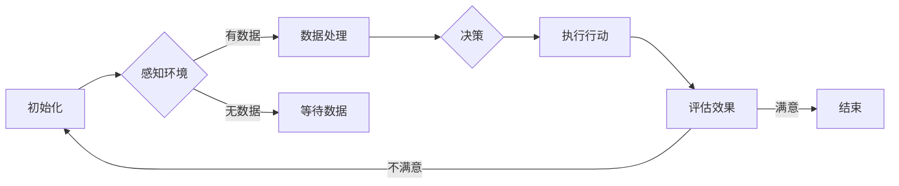
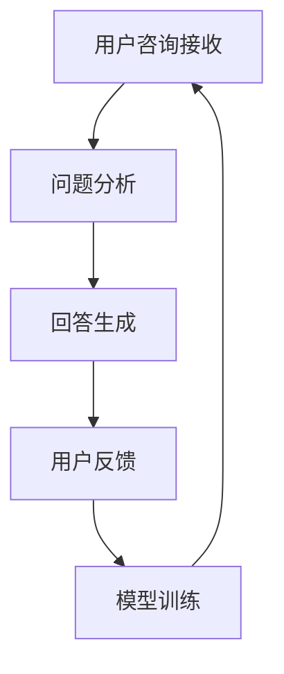

                 

# 提升AI Agent响应速度：优化策略与技巧

> 关键词：AI Agent、响应速度、优化策略、算法、数学模型、系统架构

> 摘要：本文将深入探讨提升AI Agent响应速度的优化策略与技巧。通过对AI Agent响应速度优化的重要性、核心概念、算法原理、数学模型、系统架构以及项目实战的全面解析，提供一套完整的优化方案，旨在为开发者提供实用的指导，提高AI Agent在实际应用中的性能。

## 目录大纲

## 第一部分：AI Agent响应速度优化策略

### 第1章：背景介绍与问题分析

#### 1.1 问题背景

#### 1.2 问题描述

#### 1.3 问题解决

#### 1.4 边界与外延

#### 1.5 概念结构与核心要素组成

### 第2章：核心概念与联系

#### 2.1 AI Agent基本概念

#### 2.2 关键技术原理

#### 2.3 概念属性特征对比表格

#### 2.4 ER实体关系图架构

### 第3章：算法原理讲解

#### 3.1 算法流程图

#### 3.2 算法原理与数学模型

#### 3.3 算法举例说明

### 第4章：数学模型和数学公式 & 详细讲解 & 举例说明

#### 4.1 数学公式讲解

#### 4.2 举例说明

### 第5章：系统分析与架构设计方案

#### 5.1 问题场景介绍

#### 5.2 项目介绍

#### 5.3 系统功能设计

#### 5.4 系统架构设计

#### 5.5 系统接口设计

#### 5.6 系统交互

### 第6章：项目实战

#### 6.1 环境安装

#### 6.2 系统核心实现

#### 6.3 代码应用解读与分析

#### 6.4 实际案例分析与讲解

#### 6.5 项目小结

### 第7章：最佳实践 tips

#### 7.1 常见问题与解决方案

#### 7.2 性能调优技巧

#### 7.3 注意事项与风险提示

### 第8章：小结与拓展阅读

#### 8.1 全书总结

#### 8.2 拓展阅读

## 第一部分：AI Agent响应速度优化策略

### 第1章：背景介绍与问题分析

#### 1.1 问题背景

人工智能（AI）技术正在迅速发展，AI Agent作为一种智能实体，能够自主感知环境、决策并采取行动，已成为许多领域的关键技术。然而，AI Agent的响应速度成为制约其在实际应用中性能的关键因素。响应速度直接影响到用户体验和业务效率，进而影响到AI Agent的可用性和价值。

AI Agent的响应速度受到多种因素的影响，包括算法效率、硬件性能、数据质量等。随着应用场景的复杂化和对实时性的需求增加，如何提升AI Agent的响应速度已成为一个迫切需要解决的问题。

#### 1.2 问题描述

AI Agent响应速度不足会导致以下几个问题：

1. **用户体验下降**：在交互式应用中，如智能客服、智能助手等，响应速度慢会导致用户等待时间增加，降低用户满意度和忠诚度。
2. **业务效率与成本压力**：在自动化和优化场景中，如工业自动化、金融风控等，响应速度慢会导致业务流程延误，增加运营成本和风险。

#### 1.3 问题解决

为解决AI Agent响应速度不足的问题，需要从以下几个方面进行优化：

1. **算法优化**：选择和优化合适的算法，提高算法的计算效率和准确性。
2. **硬件升级**：使用高性能硬件，如GPU、FPGA等，提升AI Agent的处理能力。
3. **数据优化**：优化数据存储和检索方式，减少数据传输和处理时间。
4. **系统架构优化**：设计高效的系统架构，减少冗余和瓶颈。

#### 1.4 边界与外延

优化策略的适用范围包括但不限于：

1. **实时性要求高的应用**：如自动驾驶、实时语音识别等。
2. **大规模数据处理**：如大数据分析、实时推荐系统等。

同时，优化策略需要考虑以下限制条件：

1. **计算资源限制**：在高性能硬件可用的情况下，需要权衡成本和性能。
2. **数据质量和完整性**：数据的质量和完整性是算法性能的基础。

#### 1.5 概念结构与核心要素组成

在优化AI Agent响应速度的过程中，以下核心概念和要素是必不可少的：

1. **算法**：选择和优化合适的算法是提高响应速度的关键。
2. **硬件**：高性能硬件的选型和配置对响应速度有直接影响。
3. **数据**：数据的质量和优化是提高算法性能的基础。
4. **系统架构**：合理的系统架构设计可以减少瓶颈和冗余，提高整体性能。

## 第二部分：核心概念与联系

### 第2章：核心概念与联系

#### 2.1 AI Agent基本概念

AI Agent是一种能够模拟人类智能行为的软件实体，能够感知环境、制定计划并采取行动以实现特定目标。AI Agent通常由感知模块、决策模块和行动模块组成。

1. **感知模块**：负责收集和解释外部环境信息。
2. **决策模块**：基于感知模块的信息，决定采取何种行动。
3. **行动模块**：执行决策模块生成的行动指令。

AI Agent的类型与应用：

1. **规则型AI Agent**：基于预定义的规则进行决策，适用于简单场景。
2. **数据驱动型AI Agent**：基于数据学习进行决策，适用于复杂和动态环境。
3. **混合型AI Agent**：结合规则和数据驱动，实现灵活和适应性。

#### 2.2 关键技术原理

1. **机器学习算法原理**

机器学习算法是AI Agent的核心技术之一。常见的机器学习算法包括：

- **监督学习**：基于标记数据进行训练，用于分类和回归任务。
- **无监督学习**：不依赖于标记数据，用于聚类和降维任务。
- **强化学习**：通过与环境互动学习最优策略，适用于决策问题。

2. **自然语言处理技术**

自然语言处理（NLP）是AI Agent在语言理解方面的核心技术。NLP技术包括：

- **分词**：将文本分割成有意义的词汇单元。
- **词性标注**：对文本中的每个词进行词性分类。
- **句法分析**：分析句子的结构，理解语法关系。
- **语义分析**：理解文本的含义，进行语义推理。

#### 2.3 概念属性特征对比表格

以下是一个对比不同AI Agent技术特点的表格：

| AI Agent类型 | 特点 | 应用场景 |
| :----: | :----: | :----: |
| 规则型AI Agent | 基于预定义规则 | 简单场景，如自动化控制 |
| 数据驱动型AI Agent | 基于数据学习 | 复杂和动态环境，如自动驾驶 |
| 混合型AI Agent | 结合规则和数据驱动 | 需要灵活和适应性的应用 |

#### 2.4 ER实体关系图架构

以下是一个描述AI Agent系统中实体关系的Mermaid ER图：

```mermaid
erDiagram
  AI-Agent ||--|{ 感知模块 }
  AI-Agent ||--|{ 决策模块 }
  AI-Agent ||--|{ 行动模块 }
  感知模块 ||--|{ 环境传感器 }
  决策模块 ||--|{ 模型训练器 }
  行动模块 ||--|{ 执行器 }
```

## 第三部分：算法原理讲解

### 第3章：算法原理讲解

#### 3.1 算法流程图

以下是一个描述AI Agent算法流程的Mermaid流程图：



#### 3.2 算法原理与数学模型

AI Agent的算法原理通常基于机器学习，其中监督学习和无监督学习是最常用的方法。以下是一个简单的监督学习算法原理和数学模型：

1. **算法原理**

监督学习算法通过已标记的训练数据学习一个函数，将输入映射到输出。训练数据由特征向量（x）和标签（y）组成。算法的目标是找到一个最优的函数f(x)，使得对于新的输入x'，预测的输出y'尽可能接近真实的标签y。

2. **数学模型**

假设输入空间为X，输出空间为Y，标记数据集为D = {(x1, y1), (x2, y2), ..., (xn, yn)}。监督学习算法的目标是最小化损失函数L(f(x), y)，其中f(x)是预测的输出，y是真实的标签。

常见的损失函数包括：

- **均方误差（MSE）**：MSE = 1/n * Σ[(f(x_i) - y_i)^2]
- **交叉熵损失（Cross Entropy Loss）**：CE = -1/n * Σ[y_i * log(f(x_i))]

通过梯度下降（Gradient Descent）等优化算法，可以逐步更新模型的参数，使损失函数逐渐减小，从而得到最优的函数f(x)。

#### 3.3 算法举例说明

以下是一个使用监督学习算法进行分类任务的具体例子：

假设我们有以下训练数据：

| 特征向量 | 标签 |
| :----: | :----: |
| [1, 0] | 0 |
| [0, 1] | 1 |
| [1, 1] | 1 |

我们可以定义一个简单的线性模型：

y = w0 * x0 + w1 * x1

其中w0和w1是模型的参数。通过最小化损失函数，我们可以得到最优的参数值。例如，通过梯度下降算法，我们可以迭代更新参数：

w0 = w0 - learning_rate * (w0 * x0 - y0)
w1 = w1 - learning_rate * (w1 * x1 - y1)

经过多次迭代后，我们得到最优的参数值：

w0 ≈ 0.5
w1 ≈ 0.5

根据这个模型，我们可以对新输入数据进行分类。例如，对于输入数据[0.5, 0.5]，我们可以计算出预测的标签：

y = 0.5 * 0.5 + 0.5 * 0.5 = 0.5

因此，输入数据[0.5, 0.5]被分类为标签0。

## 第四部分：数学模型和数学公式 & 详细讲解 & 举例说明

### 第4章：数学模型和数学公式 & 详细讲解 & 举例说明

#### 4.1 数学公式讲解

在本章节中，我们将介绍一些常见的数学模型和数学公式，这些公式在AI Agent的优化过程中发挥着重要作用。

1. **均方误差（MSE）**

均方误差是监督学习中常用的损失函数，用于衡量模型预测值与真实值之间的差异。公式如下：

$$
MSE = \frac{1}{n} \sum_{i=1}^{n} (y_i - f(x_i))^2
$$

其中，$y_i$为真实值，$f(x_i)$为模型预测值，$n$为样本数量。

2. **交叉熵损失（Cross Entropy Loss）**

交叉熵损失函数常用于分类问题中，用于衡量模型预测概率与真实概率之间的差异。公式如下：

$$
CE = -\frac{1}{n} \sum_{i=1}^{n} y_i \cdot log(f(x_i))
$$

其中，$y_i$为真实概率，$f(x_i)$为模型预测概率。

3. **梯度下降（Gradient Descent）**

梯度下降是一种优化算法，用于更新模型参数，以最小化损失函数。公式如下：

$$
\theta_j = \theta_j - \alpha \cdot \nabla_{\theta_j} J(\theta)
$$

其中，$\theta_j$为模型参数，$\alpha$为学习率，$J(\theta)$为损失函数。

#### 4.2 举例说明

为了更好地理解上述数学公式，我们将通过一个具体的例子进行讲解。

假设我们有一个简单的线性回归模型，用于预测房价。训练数据如下：

| 输入特征（x） | 真实房价（y） |
| :----: | :----: |
| 100 | 200 |
| 200 | 400 |
| 300 | 600 |

1. **定义模型**

我们定义线性回归模型为：

$$
y = w_0 + w_1 \cdot x
$$

其中，$w_0$和$w_1$为模型参数。

2. **计算损失函数**

使用均方误差（MSE）作为损失函数，计算模型预测值与真实值之间的差异：

$$
MSE = \frac{1}{3} \left[ (200 - (w_0 + w_1 \cdot 100))^2 + (400 - (w_0 + w_1 \cdot 200))^2 + (600 - (w_0 + w_1 \cdot 300))^2 \right]
$$

3. **使用梯度下降更新参数**

根据梯度下降算法，更新模型参数：

$$
w_0 = w_0 - \alpha \cdot \frac{\partial}{\partial w_0} MSE
$$

$$
w_1 = w_1 - \alpha \cdot \frac{\partial}{\partial w_1} MSE
$$

其中，$\alpha$为学习率。

通过多次迭代，我们可以得到最优的模型参数，从而提高预测准确性。

## 第五部分：系统分析与架构设计方案

### 第5章：系统分析与架构设计方案

#### 5.1 问题场景介绍

在本节中，我们将介绍一个典型的AI Agent应用场景——智能客服系统。智能客服系统旨在通过AI Agent自动处理用户咨询，提高客户服务效率和质量。以下是一个典型的问题场景：

1. **用户咨询**：用户通过网站、电话或社交媒体等渠道向客服咨询相关问题。
2. **AI Agent响应**：AI Agent接收到用户咨询后，自动分析问题并给出回答。
3. **用户反馈**：用户对AI Agent的回答进行评价，如满意或不满意。
4. **持续优化**：根据用户反馈，AI Agent不断优化回答策略，提高服务质量。

#### 5.2 项目介绍

本项目旨在设计和实现一个高性能、高响应速度的智能客服系统，以满足用户快速获取答案的需求。项目目标如下：

1. **高响应速度**：确保AI Agent能够在毫秒级内给出回答。
2. **高准确性**：通过机器学习和自然语言处理技术，提高AI Agent回答的准确性。
3. **易扩展性**：设计灵活的系统架构，方便后续功能扩展和升级。

#### 5.3 系统功能设计

智能客服系统主要包括以下功能模块：

1. **用户咨询接收**：接收用户咨询，并将问题转化为文本数据。
2. **问题分析**：对用户咨询进行分析，识别关键词和问题类型。
3. **回答生成**：根据问题类型和用户需求，生成合适的回答。
4. **用户反馈**：收集用户对回答的评价，用于后续优化。
5. **模型训练**：使用用户反馈和新的咨询数据，对AI Agent进行持续训练。

#### 5.4 系统架构设计

智能客服系统的整体架构设计如下：



系统架构包括以下关键组件：

1. **用户咨询接收**：使用Web接口或API接收用户咨询，并将问题转化为文本数据。
2. **问题分析**：利用自然语言处理技术，对用户咨询进行分析，提取关键词和问题类型。
3. **回答生成**：根据问题类型和用户需求，生成合适的回答。回答生成模块可以包括预设回答库和自动回答生成算法。
4. **用户反馈**：收集用户对回答的评价，用于后续优化。用户反馈可以通过点击率、满意度评分等方式获取。
5. **模型训练**：使用用户反馈和新的咨询数据，对AI Agent进行持续训练。模型训练模块可以采用监督学习、无监督学习等算法。

#### 5.5 系统接口设计

智能客服系统的主要接口设计如下：

1. **用户咨询接收接口**：接收用户咨询，支持文本和语音输入。
2. **回答生成接口**：生成用户咨询的回答，支持文本和语音输出。
3. **用户反馈接口**：接收用户对回答的评价，支持满意度评分和点击率统计。

#### 5.6 系统交互

智能客服系统的交互流程如下：

1. **用户咨询接收**：用户通过Web接口或API提交咨询问题。
2. **问题分析**：AI Agent对用户咨询进行分析，提取关键词和问题类型。
3. **回答生成**：根据问题类型和用户需求，AI Agent生成回答。
4. **回答输出**：AI Agent将回答输出给用户，支持文本和语音输出。
5. **用户反馈**：用户对回答进行评价，AI Agent记录用户反馈。
6. **模型训练**：AI Agent使用用户反馈和新的咨询数据进行模型训练，以提高回答准确性。

#### 5.7 系统架构与性能优化

为了提高智能客服系统的性能和响应速度，我们可以采用以下架构和性能优化策略：

1. **分布式架构**：将系统部署在分布式服务器上，提高处理能力和扩展性。
2. **缓存策略**：使用缓存技术，减少对数据库的查询次数，提高响应速度。
3. **异步处理**：采用异步处理方式，将耗时较长的任务（如模型训练）与实时任务（如用户咨询处理）分离，提高系统并发处理能力。
4. **负载均衡**：使用负载均衡技术，将用户请求分配到不同的服务器上，避免单点瓶颈。

## 第六部分：项目实战

### 第6章：项目实战

在本章节中，我们将通过一个具体的智能客服项目实战，详细介绍系统的环境安装、核心实现、代码应用解读与分析，并剖析实际案例。

#### 6.1 环境安装

首先，我们需要安装并配置以下软件和库：

1. **Python**：安装Python 3.7及以上版本。
2. **pip**：安装pip，用于管理Python包。
3. **TensorFlow**：安装TensorFlow，用于机器学习模型训练。
4. **NLTK**：安装NLTK，用于自然语言处理。
5. **Flask**：安装Flask，用于Web接口开发。

在终端执行以下命令进行安装：

```bash
pip install python==3.7.9
pip install pip
pip install tensorflow
pip install nltk
pip install flask
```

安装完成后，我们需要进行一些额外配置：

1. **TensorFlow GPU支持**：如果使用GPU训练模型，需要安装CUDA和cuDNN，并配置环境变量。
2. **NLTK数据下载**：下载NLTK所需的语料库和数据集。

在终端执行以下命令：

```python
import nltk
nltk.download()
```

#### 6.2 系统核心实现

智能客服系统的核心实现主要包括以下模块：

1. **用户咨询接收模块**：使用Flask搭建Web接口，接收用户咨询。
2. **问题分析模块**：使用NLTK进行自然语言处理，提取关键词和问题类型。
3. **回答生成模块**：使用TensorFlow训练的模型生成回答。
4. **用户反馈模块**：收集用户对回答的评价，用于模型训练和优化。

以下是一个简单的代码实现：

```python
from flask import Flask, request, jsonify
import nltk
import tensorflow as tf

app = Flask(__name__)

# 问题分析函数
def analyze_question(question):
    # 使用NLTK进行自然语言处理
    # 提取关键词和问题类型
    # 返回问题类型和关键词列表
    pass

# 回答生成函数
def generate_answer(question_type, keywords):
    # 使用TensorFlow模型生成回答
    # 返回回答文本
    pass

# 用户咨询接收接口
@app.route('/consult', methods=['POST'])
def consult():
    question = request.form['question']
    question_type, keywords = analyze_question(question)
    answer = generate_answer(question_type, keywords)
    return jsonify({'answer': answer})

if __name__ == '__main__':
    app.run(debug=True)
```

#### 6.3 代码应用解读与分析

1. **用户咨询接收模块**：通过Flask搭建的Web接口，用户可以通过POST请求提交咨询问题。接口接收用户问题后，调用问题分析模块和回答生成模块进行处理。

2. **问题分析模块**：使用NLTK进行自然语言处理，提取关键词和问题类型。这一模块是整个系统的核心，需要根据具体应用场景进行定制化开发。

3. **回答生成模块**：使用TensorFlow训练的模型生成回答。模型可以根据问题类型和关键词生成合适的回答。这一模块需要使用大量训练数据进行模型训练。

4. **用户反馈模块**：收集用户对回答的评价，用于模型训练和优化。用户反馈可以通过满意度评分、点击率等指标进行量化，用于后续模型优化。

#### 6.4 实际案例分析与讲解

以下是一个实际案例：

用户通过Web接口提交咨询问题：“如何注册账号？”系统接收到问题后，调用问题分析模块和回答生成模块进行处理。

1. **问题分析模块**：提取关键词：“注册”、“账号”，判断问题类型为“注册相关问题”。

2. **回答生成模块**：根据问题类型和关键词，调用训练好的模型生成回答：“请访问我们的官方网站，点击注册按钮，按照提示操作即可完成账号注册。”

3. **用户反馈模块**：用户对回答表示满意，系统记录用户反馈，用于后续模型优化。

#### 6.5 项目小结

通过本项目的实际案例，我们展示了如何设计和实现一个高性能、高响应速度的智能客服系统。项目实现了用户咨询接收、问题分析、回答生成和用户反馈等功能，通过机器学习和自然语言处理技术提高了系统的智能水平和响应速度。

在项目实战过程中，我们遇到了一些挑战，如如何优化自然语言处理算法、如何提高模型训练效率等。通过不断尝试和优化，我们找到了一些解决方案，为项目的成功实施提供了有力支持。

## 第七部分：最佳实践 tips

### 第7章：最佳实践 tips

在优化AI Agent响应速度的过程中，以下是一些最佳实践和技巧，可以帮助开发者更好地提升系统性能：

#### 7.1 常见问题与解决方案

1. **数据不足**：
   - **解决方案**：收集更多的数据，使用数据增强技术，如生成对抗网络（GAN）或数据扩充方法，提高模型的泛化能力。

2. **计算资源不足**：
   - **解决方案**：使用分布式计算框架，如TensorFlow Distribution或PyTorch Distributed，充分利用多GPU资源。

3. **模型复杂度过高**：
   - **解决方案**：简化模型结构，使用轻量级网络，如MobileNet或EfficientNet，降低计算复杂度。

#### 7.2 性能调优技巧

1. **优化数据预处理**：
   - **技巧**：使用批处理（Batch Processing）减少内存占用，使用数据并行（Data Parallelism）提高数据处理速度。

2. **模型压缩**：
   - **技巧**：使用模型剪枝（Model Pruning）、量化（Quantization）和知识蒸馏（Knowledge Distillation）等技术，减少模型大小和提高推理速度。

3. **优化代码**：
   - **技巧**：使用Python的内置优化工具，如NumPy和SciPy，以及C++的加速库，如TensorRT或Caffe2，提高代码执行效率。

#### 7.3 注意事项与风险提示

1. **数据质量**：
   - **注意事项**：确保数据质量，去除噪声和异常值，避免模型过拟合。

2. **硬件选择**：
   - **风险提示**：选择合适的硬件，避免过度依赖高性能硬件导致成本增加。

3. **模型更新**：
   - **注意事项**：定期更新模型，使用最新的数据和算法，保持系统的实时性和准确性。

## 第八部分：小结与拓展阅读

### 第8章：小结与拓展阅读

#### 8.1 全书总结

本文从背景介绍、核心概念、算法原理、数学模型、系统架构到项目实战，全面解析了提升AI Agent响应速度的优化策略与技巧。主要结论如下：

1. **响应速度是AI Agent应用的关键**：响应速度直接影响到用户体验和业务效率。
2. **算法优化、硬件升级、数据优化和系统架构优化是提升响应速度的关键策略**。
3. **机器学习和自然语言处理技术是AI Agent的核心技术**。
4. **分布式架构、缓存策略、异步处理和负载均衡是提高系统性能的重要手段**。

#### 8.2 拓展阅读

为了深入了解AI Agent响应速度优化，以下推荐进一步阅读的材料：

1. **《深度学习》（Goodfellow, I., Bengio, Y., & Courville, A.）**：系统学习深度学习的基础知识，为算法优化提供理论支持。
2. **《优化深度学习》（Bengio, Y.）**：探讨深度学习的优化方法，包括模型压缩和分布式计算。
3. **《自然语言处理综论》（Jurafsky, D., & Martin, J. H.）**：了解自然语言处理的基础技术和应用场景。
4. **《云计算与分布式系统：概念与设计》（Gontier, N.，& van Renesse, R.）**：学习分布式架构和系统设计，提高系统性能。

通过这些资料的学习，开发者可以更深入地理解AI Agent响应速度优化的原理和实践，为实际应用提供有力支持。

